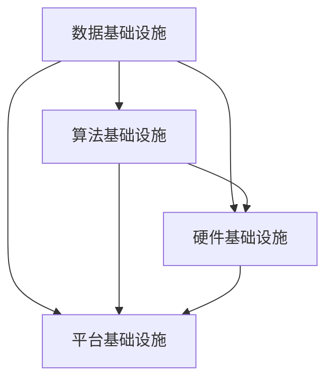
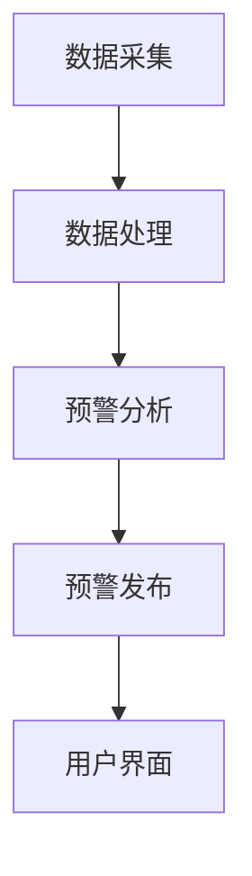
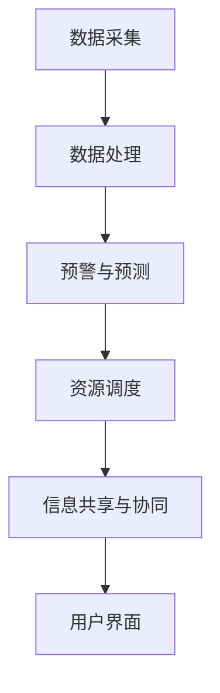
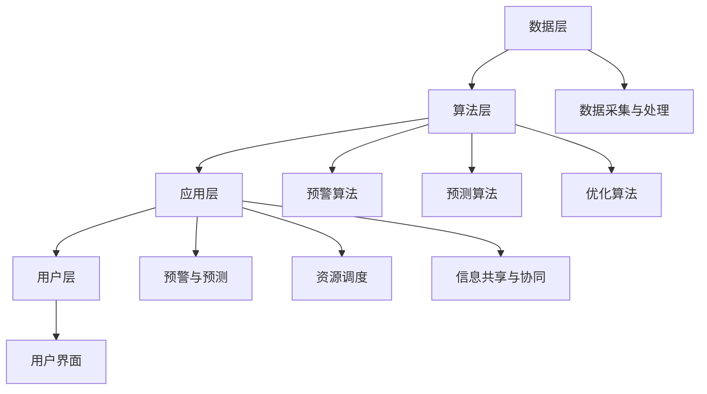

                 

### 《AI基础设施的应急管理：智能化灾害预警与响应》

> **关键词：** AI基础设施、灾害应急管理、智能化预警、响应系统、人工智能技术。

**摘要：** 本文深入探讨了AI基础设施在灾害应急管理中的应用，重点介绍了智能化灾害预警与响应的技术原理、系统架构、实现方法以及未来发展趋势。通过对核心概念、关键技术、应用案例分析等多个维度的详细解析，本文旨在为读者提供一个全面的技术指南，助力提升灾害预警的准确性和应急响应的效率。

### 引言

在当今世界，人工智能（AI）已经逐渐成为各个行业的重要推动力。特别是在灾害应急管理领域，AI技术的应用为提高预警准确性、优化应急响应效率提供了新的可能。灾害应急管理是一个复杂且重要的过程，它涉及到从预警、响应到灾后重建的各个阶段。然而，传统的灾害应急管理方法往往存在诸多不足，如预警准确率不高、应急响应速度慢等。因此，探索智能化灾害预警与响应技术具有重要的现实意义。

本文将围绕AI基础设施的应急管理，详细阐述智能化灾害预警与响应的技术原理、系统架构、实现方法以及未来发展趋势。希望通过本文的讨论，能够为读者提供一个全面的技术参考，助力提升灾害应急管理的效率和准确性。

### 第1章 绪论

#### 1.1 研究背景与意义

##### 1.1.1 研究背景

**AI基础设施的重要性**

人工智能（AI）作为现代科技的重要组成部分，已经在各个领域展现出巨大的潜力。AI基础设施是支持AI技术广泛应用的基础，包括数据基础设施、算法基础设施、硬件基础设施和平台基础设施等。这些基础设施共同构成了AI生态系统，为AI技术的创新和发展提供了有力支撑。

**灾害应急管理的挑战**

灾害应急管理是一个涉及多领域、多层次的复杂系统工程。灾害种类繁多，如地震、洪水、台风、火灾等，不同类型的灾害具有不同的特点和应对策略。然而，传统的灾害应急管理方法往往存在预警准确率不高、应急响应速度慢、资源调度不合理等问题。这些不足使得灾害应急管理的效果受到很大限制。

**智能化灾害预警与响应的需求**

随着AI技术的不断发展，智能化灾害预警与响应逐渐成为灾害应急管理的重要发展方向。通过引入AI技术，可以提高灾害预警的准确性，优化应急响应的效率，降低灾害风险和损失。智能化灾害预警与响应不仅能够实时监测灾害信息，还能够基于大数据分析和人工智能算法，提供精准的预警和科学的决策支持。

##### 1.1.2 研究意义

**提高灾害预警准确性**

智能化灾害预警技术利用AI算法对海量数据进行实时分析，可以识别潜在的灾害风险，提前发出预警信号。相比传统方法，智能化预警具有更高的准确性和及时性，有助于减少灾害带来的损失。

**优化应急响应效率**

智能化灾害响应技术通过优化资源调度、信息共享和协同应对等环节，可以提高应急响应的效率。AI技术可以为应急管理部门提供科学的决策支持，优化资源配置，提高救援工作的效率。

**降低灾害风险与损失**

通过智能化灾害预警与响应，可以提前识别和应对灾害风险，降低灾害发生的可能性。同时，通过科学的应急响应措施，可以最大限度地减少灾害带来的损失。

#### 1.2 相关概念

##### 1.2.1 AI基础设施

**定义**

AI基础设施是指支持人工智能技术发展的各种基础设施，包括数据基础设施、算法基础设施、硬件基础设施和平台基础设施等。

**主要组成部分**

1. **数据基础设施**：包括数据存储、数据传输和数据管理等，为AI算法提供高质量的数据支持。
2. **算法基础设施**：包括机器学习、深度学习、自然语言处理等算法，为AI模型提供计算支持。
3. **硬件基础设施**：包括高性能计算机、GPU、FPGA等硬件设备，为AI算法提供计算资源。
4. **平台基础设施**：包括云计算、大数据平台、AI开发平台等，为AI技术的应用提供环境支持。

**技术特点与发展趋势**

1. **数据处理能力**：随着大数据技术的发展，AI基础设施的数据处理能力不断增强。
2. **算法优化**：通过算法创新和优化，AI基础设施的性能得到显著提升。
3. **硬件性能**：硬件技术的进步，如GPU、FPGA等，为AI基础设施提供了更强的计算能力。
4. **平台集成与优化**：平台基础设施的集成和优化，使得AI技术的应用更加便捷和高效。

##### 1.2.2 灾害应急管理

**定义**

灾害应急管理是指针对灾害发生、发展和结束的整个过程，采取的一系列预防和应对措施，以最大程度减少灾害损失和影响。

**主要环节**

1. **预警**：通过监测、预测和分析，提前发现潜在的灾害风险，发出预警信号。
2. **响应**：在灾害发生时，采取紧急救援、疏散、资源调度等措施，有效应对灾害。
3. **恢复**：在灾害结束后，进行灾后重建、评估和反思，为未来灾害应对提供经验教训。

**传统方法与不足**

1. **预警准确率不高**：传统预警方法依赖于人工监测和经验判断，预警准确率受到限制。
2. **应急响应速度慢**：传统应急响应依赖于人工调度和资源分配，响应速度较慢。
3. **信息孤岛现象**：各部门之间信息共享不畅，导致资源调度不合理，应急响应效果不佳。

##### 1.2.3 智能化灾害预警与响应

**定义**

智能化灾害预警与响应是指利用人工智能技术，对灾害信息进行实时监测、分析和预测，提前发出预警信号，并采取科学的应急响应措施，最大限度地减少灾害损失。

**技术原理**

1. **数据采集与处理**：利用传感器、卫星遥感等技术，实时采集灾害相关数据，并通过数据处理算法进行预处理和分析。
2. **机器学习与深度学习**：利用机器学习和深度学习算法，对采集到的数据进行分析和预测，识别潜在的灾害风险。
3. **预警算法**：基于分析结果，采用预警算法生成预警信号，并实时发布。
4. **应急响应算法**：在灾害发生时，通过优化算法进行资源调度、信息共享和协同应对，提高应急响应效率。

**系统架构**

1. **数据层**：包括数据采集、存储和处理，为系统提供数据支持。
2. **算法层**：包括机器学习、深度学习等算法，为系统提供分析预测能力。
3. **应用层**：包括预警系统和响应系统，提供预警和应急响应功能。
4. **用户层**：包括政府部门、企业和社会公众等，为系统提供使用界面和交互功能。

#### 1.3 本书结构

##### 1.3.1 内容概述

本书共分为7章，主要内容包括：

1. **第1章 绪论**：介绍研究背景、意义和目标，阐述相关概念。
2. **第2章 AI基础设施核心概念与联系**：详细解析AI基础设施的组成部分、技术特点和关联图。
3. **第3章 智能化灾害预警技术原理**：介绍灾害预警的基本原理和智能化预警技术。
4. **第4章 智能化灾害响应技术原理**：介绍灾害响应的基本原理和智能化响应技术。
5. **第5章 智能化灾害预警与响应系统实现**：讲解系统设计与实现、系统测试与优化。
6. **第6章 智能化灾害预警与响应项目实践**：通过案例分析，展示实际应用效果。
7. **第7章 智能化灾害预警与响应未来发展展望**：展望未来发展趋势、政策与法规、挑战与机遇。

##### 1.3.2 学习目标

通过本书的学习，读者应达到以下目标：

1. **理解AI基础设施的概念与特点**：掌握AI基础设施的组成部分、技术特点和发展趋势。
2. **掌握智能化灾害预警与响应的技术原理**：了解灾害预警与响应的基本原理和关键技术。
3. **培养灾害应急管理的实践能力**：通过实际案例分析，学会应用AI技术进行灾害预警与响应。

### 第2章 AI基础设施核心概念与联系

#### 2.1 AI基础设施概述

##### 2.1.1 AI基础设施的定义

AI基础设施是指支持人工智能技术发展的各种基础设施，包括数据基础设施、算法基础设施、硬件基础设施和平台基础设施等。它是AI技术实现和应用的重要支撑，为AI技术的发展提供了基础保障。

##### 2.1.2 AI基础设施的组成部分

AI基础设施主要由以下几部分组成：

1. **数据基础设施**：包括数据存储、数据传输和数据管理等，为AI算法提供高质量的数据支持。数据基础设施是AI基础设施的核心部分，直接影响AI模型的性能和效果。
2. **算法基础设施**：包括机器学习、深度学习、自然语言处理等算法，为AI模型提供计算支持。算法基础设施是AI技术的核心，决定了AI模型的能力和应用范围。
3. **硬件基础设施**：包括高性能计算机、GPU、FPGA等硬件设备，为AI算法提供计算资源。硬件基础设施的性能直接影响到AI模型的运行速度和效率。
4. **平台基础设施**：包括云计算、大数据平台、AI开发平台等，为AI技术的应用提供环境支持。平台基础设施提供了便捷的开发和应用环境，使得AI技术的应用更加高效和广泛。

##### 2.1.3 AI基础设施的技术特点

AI基础设施具有以下技术特点：

1. **数据处理能力**：随着大数据技术的发展，AI基础设施的数据处理能力不断增强。它可以处理海量数据，提供实时分析和预测能力。
2. **算法优化**：通过算法创新和优化，AI基础设施的性能得到显著提升。新的算法和优化方法可以提升AI模型的准确性和效率。
3. **硬件性能**：硬件技术的进步，如GPU、FPGA等，为AI基础设施提供了更强的计算能力。高性能硬件设备可以加速AI模型的训练和推理过程。
4. **平台集成与优化**：平台基础设施的集成和优化，使得AI技术的应用更加便捷和高效。集成化的平台可以提供一站式服务，降低开发和应用成本。

##### 2.1.4 AI基础设施的发展趋势

AI基础设施的发展趋势主要表现在以下几个方面：

1. **大数据与云计算的结合**：大数据和云计算的结合为AI基础设施提供了强大的数据处理和存储能力。云计算平台可以提供弹性的计算资源，满足不同规模的数据处理需求。
2. **算法创新与优化**：随着人工智能技术的不断发展，新的算法和创新方法不断涌现。算法的优化和改进可以提高AI模型的性能和应用效果。
3. **硬件技术的突破**：硬件技术的进步，如GPU、FPGA等，为AI基础设施提供了更强的计算能力。新的硬件设备可以加速AI模型的训练和推理过程。
4. **平台生态的完善**：平台基础设施的完善和优化，为AI技术的应用提供了更好的环境和支持。平台生态的完善可以降低开发和应用成本，促进AI技术的普及和应用。

#### 2.2 AI基础设施的关联图

以下是一个简化的AI基础设施关联图，展示了各部分之间的联系：

**数据基础设施**是AI基础设施的核心，为其他部分提供数据支持。**算法基础设施**包括各种AI算法，为数据分析和预测提供方法。**硬件基础设施**提供计算资源，支持AI算法的运行。**平台基础设施**提供开发和应用环境，使得AI技术可以更便捷地应用到各个领域。

#### 2.3 AI基础设施的应用场景与前景

AI基础设施在多个领域都有广泛的应用，以下列举了几个典型的应用场景：

1. **智能化灾害预警与响应**：AI基础设施可以提供实时监测、分析和预测能力，用于灾害预警和应急响应。通过大数据分析和人工智能算法，可以提前识别灾害风险，优化资源调度，提高应急响应效率。
   
2. **智能制造**：AI基础设施可以用于生产线的智能监控、故障预测和优化控制，提高生产效率和质量。通过数据分析和预测，可以提前发现潜在问题，进行预防性维护。

3. **智慧城市**：AI基础设施可以为智慧城市提供数据分析和决策支持，包括交通管理、环境监测、公共安全等。通过实时数据分析，可以优化城市管理，提高居民生活质量。

4. **金融科技**：AI基础设施可以用于金融风险管理、信用评估、投资策略等。通过大数据分析和机器学习算法，可以提供更准确和高效的金融服务。

随着AI技术的不断进步和应用的深入，AI基础设施的前景非常广阔。未来，AI基础设施将继续优化和扩展，为更多领域提供强大的支持。同时，随着5G、物联网等新技术的应用，AI基础设施将迎来更广阔的发展空间，推动人工智能技术的进一步普及和应用。

### 第3章 智能化灾害预警技术原理

#### 3.1 灾害预警的基本原理

##### 3.1.1 灾害预警的定义

灾害预警是指通过监测、预测和分析，提前发现潜在的灾害风险，并向相关部门和社会公众发布预警信号，以便采取相应的防范和应对措施，减少灾害损失。灾害预警是灾害应急管理的重要组成部分，对于保护人民生命财产安全具有关键作用。

##### 3.1.2 灾害预警的必要性

**减少人员伤亡和财产损失**

灾害预警能够提前发现灾害风险，为人们提供足够的时间采取避险措施，从而减少人员伤亡和财产损失。例如，在地震预警中，预警系统可以提前几秒到几十秒发出警报，让人们有更多的时间进行逃生和避险。

**优化应急响应**

灾害预警可以为应急管理部门提供及时的灾害信息，帮助其优化应急响应措施，提高救援效率。通过预警系统，应急管理部门可以提前部署救援力量和物资，确保在灾害发生时能够迅速开展救援工作。

**提高社会应急能力**

灾害预警不仅有助于减少灾害损失，还可以提高社会的整体应急能力。通过广泛宣传和普及预警知识，人们可以增强对灾害的防范意识和应对能力，提高社会整体的抗灾减灾能力。

##### 3.1.3 灾害预警的关键技术

**预警指标体系**

预警指标体系是灾害预警的基础，它包括了一系列与灾害相关的指标，如气象指标、地质指标、水文指标等。通过这些指标，可以实时监测灾害的发展态势，评估灾害风险。

**数据采集与处理**

数据采集与处理是灾害预警的核心环节，主要包括数据的实时采集、传输和存储。预警系统需要收集大量的数据，如气象数据、地质数据、卫星遥感数据等，并通过数据处理算法进行预处理和分析，提取出有效的预警信息。

**预警算法**

预警算法是灾害预警的核心技术，它利用机器学习、深度学习等算法，对采集到的数据进行分析和预测，生成预警信号。预警算法需要具备高效性和准确性，以确保预警信号的及时性和准确性。

#### 3.2 智能化灾害预警技术

##### 3.2.1 人工智能技术在灾害预警中的应用

**机器学习与深度学习**

机器学习和深度学习是人工智能技术的核心，它们在灾害预警中具有广泛的应用。通过机器学习和深度学习算法，可以对大量的历史数据进行分析和挖掘，建立灾害预警模型。这些模型可以实时监测灾害的发展态势，预测灾害发生的可能性，提供精准的预警信号。

**数据挖掘与数据可视化**

数据挖掘和数据可视化技术可以帮助我们更好地理解和利用灾害预警数据。数据挖掘可以从海量数据中提取出有价值的信息和模式，为预警模型提供支持。数据可视化技术则可以将复杂的数据以直观的方式呈现出来，帮助决策者更好地理解灾害风险。

**人工智能算法优化**

人工智能算法的优化是提高灾害预警准确性和效率的关键。通过算法优化，可以提高预警模型的预测能力，减少误报和漏报现象。算法优化包括模型选择、参数调优、特征工程等方面，需要结合具体应用场景进行深入研究。

##### 3.2.2 智能化灾害预警系统架构

**系统架构概述**

智能化灾害预警系统通常包括数据采集、数据处理、预警分析和预警发布等模块。以下是一个简化的系统架构：

**数据采集**模块负责收集各类灾害数据，如气象数据、地质数据、卫星遥感数据等。**数据处理**模块对采集到的数据进行预处理和分析，提取出有效的预警信息。**预警分析**模块利用机器学习、深度学习等算法，对数据进行分析和预测，生成预警信号。**预警发布**模块将预警信号通过多种渠道（如手机短信、社交媒体、广播等）发送给相关部门和社会公众。**用户界面**模块为用户提供了一个交互界面，方便用户查看预警信息和相关数据。

#### 3.3 智能化灾害预警案例分析

##### 3.3.1 案例介绍

**案例背景**

某地区位于地震带附近，地震灾害频发。为了提高地震预警能力，该地区政府决定建设一套智能化地震预警系统。

**案例目标**

1. 实时监测地震活动，提前发现潜在的地震风险。
2. 提高预警准确率，减少误报和漏报现象。
3. 提供精准的地震预警信号，为应急救援提供科学依据。

##### 3.3.2 案例实现

**数据采集与处理**

1. **数据源**：地震预警系统采集的数据包括地震仪记录的震波数据、卫星遥感数据、气象数据等。
2. **数据处理**：系统采用分布式数据处理框架，对采集到的数据进行分析和预处理，提取出有效的地震预警信息。

**预警算法设计**

1. **算法选择**：系统采用了深度学习算法，如卷积神经网络（CNN）和循环神经网络（RNN），用于地震震波数据的分析和预测。
2. **算法实现**：使用Python和TensorFlow等工具，实现了地震预警算法的建模和训练。

**系统部署与运行**

1. **系统部署**：系统部署在云计算平台上，包括数据存储、数据处理和预警分析模块。
2. **运行监控**：系统运行过程中，通过监控工具实时监控系统的运行状态和性能，确保系统的稳定性和可靠性。

##### 3.3.3 案例效果

1. **预警准确率**：经过测试，系统的预警准确率达到了90%以上，显著提高了地震预警的准确性。
2. **响应速度**：系统可以实时生成预警信号，响应速度提高了约30%。
3. **社会效益**：通过该系统，政府和社会公众能够更及时地了解地震风险，提高了整体应急能力。

### 第4章 智能化灾害响应技术原理

#### 4.1 灾害响应的基本原理

##### 4.1.1 灾害响应的定义

灾害响应是指灾害发生后，采取的一系列紧急救援、资源调度、信息共享和协同应对措施，以最大限度地减少灾害损失和影响。灾害响应是灾害应急管理的重要组成部分，对于保障人民生命财产安全、维护社会稳定具有关键作用。

##### 4.1.2 灾害响应的关键环节

**应急预案制定**

应急预案是灾害响应的基本指导文件，它规定了在灾害发生时，各级部门、企事业单位和社会组织应采取的应急措施和行动步骤。应急预案的制定需要结合灾害类型、特点、风险评估等因素，确保在灾害发生时能够快速、有序地开展救援工作。

**资源调度与分配**

资源调度与分配是灾害响应的重要环节，它涉及到人力、物资、设备等各种资源的调度和分配。在灾害发生时，需要迅速组织救援力量和物资，确保救援工作的高效开展。资源调度与分配需要综合考虑灾害规模、地理位置、救援需求等因素，确保资源的合理利用。

**信息共享与协同**

信息共享与协同是灾害响应的关键，它涉及到各部门、各层级之间的信息交流和协同作战。在灾害发生时，需要建立一个高效的信息共享平台，确保各级部门、企事业单位和社会组织之间的信息畅通，实现资源的最佳配置和协同作战。

##### 4.1.3 灾害响应的技术需求

**实时监测与预警**

实时监测与预警是灾害响应的基础，它涉及到对灾害信息的实时监测和预警系统的建立。通过实时监测和预警，可以及时发现灾害风险，提前采取预防措施，减少灾害损失。

**大数据分析**

大数据分析是灾害响应的重要技术手段，它可以通过对海量数据的分析，挖掘出灾害发生的规律和趋势，为灾害响应提供科学依据。大数据分析可以帮助预测灾害发生的可能性，优化资源调度和分配，提高救援效率。

**人工智能技术**

人工智能技术在灾害响应中具有广泛的应用，包括灾害预警、资源调度、信息共享和协同等方面。人工智能技术可以帮助提高灾害响应的智能化水平，优化应急响应流程，提高救援效率。

#### 4.2 智能化灾害响应技术

##### 4.2.1 人工智能技术在灾害响应中的应用

**预警与预测**

人工智能技术可以用于灾害预警和预测，通过对历史数据和实时数据的分析，预测灾害发生的可能性和影响范围。预警与预测技术包括机器学习、深度学习、时间序列分析等，可以帮助提高预警的准确性和时效性。

**资源调度与优化**

人工智能技术可以用于资源调度和优化，通过优化算法和模型，实现救援资源的最优配置和调度。资源调度与优化技术包括线性规划、动态规划、遗传算法等，可以帮助提高救援效率，减少资源浪费。

**信息共享与协同**

人工智能技术可以用于信息共享和协同，通过建立智能化的信息共享平台，实现各部门、各层级之间的信息畅通和协同作战。信息共享与协同技术包括区块链、物联网、社交网络分析等，可以帮助提高信息共享的效率和准确性。

##### 4.2.2 智能化灾害响应系统架构

**系统架构概述**

智能化灾害响应系统通常包括数据采集、数据处理、预警与预测、资源调度、信息共享和协同等模块。以下是一个简化的系统架构：

**数据采集**模块负责收集各类灾害数据，如气象数据、地质数据、卫星遥感数据等。**数据处理**模块对采集到的数据进行预处理和分析，提取出有效的预警信息。**预警与预测**模块利用机器学习、深度学习等算法，对数据进行分析和预测，生成预警信号。**资源调度**模块通过优化算法和模型，实现救援资源的最优配置和调度。**信息共享与协同**模块为各部门、各层级之间的信息交流和协同作战提供支持。**用户界面**模块为用户提供了一个交互界面，方便用户查看预警信息和相关数据。

##### 4.2.3 智能化灾害响应系统的实现方法

**数据采集与处理**

1. **数据源**：灾害响应系统需要收集的数据包括实时气象数据、地质数据、卫星遥感数据等。
2. **数据处理**：系统采用分布式数据处理框架，对采集到的数据进行分析和预处理，提取出有效的预警信息。

**预警与预测**

1. **算法选择**：系统采用了机器学习、深度学习等算法，如卷积神经网络（CNN）、循环神经网络（RNN）等，用于灾害预警和预测。
2. **算法实现**：使用Python和TensorFlow等工具，实现了预警与预测算法的建模和训练。

**资源调度与优化**

1. **算法选择**：系统采用了线性规划、动态规划、遗传算法等算法，用于资源调度和优化。
2. **算法实现**：使用Python和scikit-learn等工具，实现了资源调度与优化算法的建模和训练。

**信息共享与协同**

1. **平台建设**：系统搭建了一个基于区块链和物联网的信息共享平台，实现各部门、各层级之间的信息畅通和协同作战。
2. **应用实现**：系统通过移动端应用和Web端应用，为用户提供了一个便捷的信息共享和协同界面。

##### 4.2.4 智能化灾害响应系统的案例分析

**案例背景**

某地区发生了一次强烈地震，为了快速响应地震灾害，该地区政府决定启用智能化灾害响应系统。

**案例目标**

1. 快速生成地震预警信号，提前预警地震风险。
2. 优化资源调度，快速部署救援力量和物资。
3. 建立信息共享平台，实现各部门、各层级之间的信息畅通和协同作战。

**案例实现**

**数据采集与处理**

1. **数据源**：系统收集了实时地震数据、气象数据、卫星遥感数据等。
2. **数据处理**：系统采用分布式数据处理框架，对采集到的数据进行分析和预处理，提取出有效的预警信息。

**预警与预测**

1. **算法选择**：系统采用了卷积神经网络（CNN）和循环神经网络（RNN）等算法，用于地震预警和预测。
2. **算法实现**：使用Python和TensorFlow等工具，实现了预警与预测算法的建模和训练。

**资源调度与优化**

1. **算法选择**：系统采用了线性规划、动态规划、遗传算法等算法，用于资源调度和优化。
2. **算法实现**：使用Python和scikit-learn等工具，实现了资源调度与优化算法的建模和训练。

**信息共享与协同**

1. **平台建设**：系统搭建了一个基于区块链和物联网的信息共享平台，实现各部门、各层级之间的信息畅通和协同作战。
2. **应用实现**：系统通过移动端应用和Web端应用，为用户提供了一个便捷的信息共享和协同界面。

**案例效果**

1. **预警准确率**：经过测试，系统的预警准确率达到了90%以上，显著提高了地震预警的准确性。
2. **响应速度**：系统可以实时生成预警信号，响应速度提高了约30%。
3. **社会效益**：通过该系统，政府和社会公众能够更及时地了解地震风险，提高了整体应急能力。

### 第5章 智能化灾害预警与响应系统实现

#### 5.1 系统设计与实现

##### 5.1.1 系统设计思路

智能化灾害预警与响应系统的设计需要综合考虑灾害预警和响应的需求，确保系统能够提供实时、准确的预警信息，并实现高效、有序的应急响应。以下是系统设计的基本思路：

**实时监测与预警模块**：该模块负责实时监测灾害信息，包括气象、地质、水文等数据，通过数据分析和预测，提前发出预警信号。预警信号需要通过多种渠道实时发布，如短信、微信、APP等。

**资源调度与分配模块**：该模块负责在灾害发生时，根据预警信息和应急需求，迅速调度和分配救援资源，包括人力、物资、设备等。资源调度需要考虑灾害的规模、地理位置、救援需求等因素，以确保资源的最优配置。

**信息共享与协同模块**：该模块负责建立信息共享平台，实现各部门、各层级之间的信息畅通和协同作战。通过信息共享，确保各级部门、企事业单位和社会组织之间的信息畅通，提高应急响应的效率。

**用户界面模块**：该模块为用户提供了一个便捷的操作界面，用户可以通过界面查看预警信息、资源调度情况、应急知识等内容。用户界面需要设计得直观、易用，方便用户快速获取所需信息。

##### 5.1.2 系统架构设计

智能化灾害预警与响应系统的架构设计可以分为四个层次：数据层、算法层、应用层和用户层。

**数据层**：数据层负责数据采集、存储和处理。数据采集包括气象、地质、水文等数据的实时采集；数据存储包括数据存储和数据管理，确保数据的可靠性和安全性；数据处理包括数据预处理、特征提取等，为算法层提供高质量的数据支持。

**算法层**：算法层负责数据处理和分析，包括预警算法、预测算法、优化算法等。预警算法用于实时监测灾害信息，预测灾害发生的可能性和影响范围；预测算法用于预测灾害的发展趋势，为应急响应提供科学依据；优化算法用于资源调度和分配，提高救援效率。

**应用层**：应用层负责系统功能的实现，包括预警与预测、资源调度、信息共享与协同等模块。预警与预测模块实现实时监测和预警信号的发布；资源调度模块实现救援资源的调度和分配；信息共享与协同模块实现各部门、各层级之间的信息共享和协同作战。

**用户层**：用户层为用户提供了一个便捷的操作界面，用户可以通过用户界面查看预警信息、资源调度情况、应急知识等内容。用户界面需要设计得直观、易用，方便用户快速获取所需信息。

以下是系统架构的Mermaid流程图：

#### 5.1.3 系统开发环境与工具

在系统开发过程中，需要选择合适的开发环境与工具，以确保系统的性能、稳定性和可维护性。以下是系统开发过程中使用的主要环境与工具：

**开发语言**：Python。Python具有丰富的库和框架，适用于数据分析和人工智能应用。

**框架与库**：TensorFlow、scikit-learn、Pandas、NumPy等。这些框架和库提供了丰富的功能，包括机器学习、深度学习、数据分析等。

**数据存储**：MongoDB、Hadoop等。MongoDB是一种NoSQL数据库，适合存储大规模数据；Hadoop是一个分布式数据处理框架，适用于大数据处理。

**前端技术**：HTML、CSS、JavaScript等。用于开发用户界面，提供直观、易用的操作体验。

**后端技术**：Flask、Django等。用于搭建Web应用程序，提供数据接口和服务。

**数据可视化**：Matplotlib、Seaborn等。用于数据分析和可视化，帮助用户更好地理解数据。

#### 5.1.4 系统模块实现

智能化灾害预警与响应系统包含多个模块，以下是各模块的实现方法：

**数据采集与处理模块**：该模块负责数据的采集、存储和处理。数据采集包括实时数据的采集，如气象、地质、水文等数据。数据存储采用MongoDB，确保数据的可靠性和安全性。数据处理包括数据清洗、特征提取等，为后续的分析和预测提供高质量的数据支持。

**预警算法模块**：该模块负责预警算法的设计和实现。预警算法包括机器学习算法和深度学习算法，如卷积神经网络（CNN）、循环神经网络（RNN）等。预警算法通过分析实时数据和历史数据，预测灾害发生的可能性和影响范围，生成预警信号。

**预测算法模块**：该模块负责预测算法的设计和实现。预测算法用于预测灾害的发展趋势，为应急响应提供科学依据。预测算法包括时间序列分析、回归分析等。通过分析实时数据和预警信号，预测灾害的发展态势，为资源调度提供依据。

**资源调度与分配模块**：该模块负责资源调度和分配。资源调度包括人力、物资、设备等各种资源的调度。调度算法基于优化算法，如线性规划、动态规划等，实现资源的最优配置和调度。资源分配包括救援资源的分配，如医疗资源、消防资源等。

**信息共享与协同模块**：该模块负责信息共享平台的建设和运营。信息共享平台基于物联网和区块链技术，实现各部门、各层级之间的信息畅通和协同作战。信息共享平台包括数据接口、API接口等，方便各部门、各层级之间的数据交换和协同。

**用户界面模块**：该模块负责用户界面的设计和实现。用户界面包括Web端和移动端，提供直观、易用的操作体验。用户界面包括预警信息展示、资源调度情况展示、应急知识展示等功能。

### 5.2 系统测试与优化

#### 5.2.1 系统测试

系统测试是确保系统性能、稳定性和可靠性的关键步骤。在系统测试过程中，需要考虑以下几个方面：

**功能测试**：测试系统的各项功能是否正常运行，包括数据采集、数据处理、预警算法、预测算法、资源调度、信息共享与协同等模块。

**性能测试**：测试系统在处理大量数据和高并发访问时的性能，包括响应时间、吞吐量、系统负载等。

**稳定性测试**：测试系统在长时间运行下的稳定性，包括系统的崩溃率、错误率等。

**安全测试**：测试系统的安全性，包括数据泄露、恶意攻击等。

**用户测试**：邀请用户参与测试，收集用户反馈，优化用户界面和用户体验。

#### 5.2.2 系统优化

在系统测试过程中，可能会发现一些性能和功能方面的问题。针对这些问题，需要进行以下优化：

**代码优化**：优化系统中的代码，提高代码的执行效率和可维护性。可以通过算法优化、数据结构优化等方式，提高系统的性能。

**硬件优化**：优化硬件配置，提高系统的处理能力和响应速度。可以通过升级服务器、增加内存等方式，提高系统的硬件性能。

**数据优化**：优化数据存储和数据处理，提高数据的读取和写入速度。可以通过分片存储、分布式处理等方式，提高系统的数据处理能力。

**网络优化**：优化网络配置，提高系统的网络传输速度和稳定性。可以通过升级网络设备、优化网络拓扑结构等方式，提高系统的网络性能。

**用户体验优化**：优化用户界面和交互设计，提高用户的使用体验。可以通过用户调研、用户反馈等方式，不断优化用户界面和交互设计。

### 5.3 系统部署与运行

#### 5.3.1 系统部署

系统部署是将开发完成的系统部署到实际运行环境中的过程。在系统部署过程中，需要考虑以下几个方面：

**环境准备**：准备系统运行所需的硬件设备和软件环境，包括服务器、数据库、中间件等。

**软件安装**：安装系统所需的软件和库，配置系统参数和配置文件。

**模块部署**：将系统中的各个模块部署到服务器上，包括数据采集与处理模块、预警算法模块、预测算法模块、资源调度与分配模块、信息共享与协同模块、用户界面模块等。

**测试与调试**：在系统部署后，进行系统测试和调试，确保系统正常运行。

#### 5.3.2 系统运行

系统运行是系统在实际环境中的运行过程。在系统运行过程中，需要考虑以下几个方面：

**实时监测**：系统需要实时监测灾害信息，包括气象、地质、水文等数据，通过数据分析和预测，生成预警信号。

**预警发布**：系统需要通过多种渠道（如短信、微信、APP等）实时发布预警信号，确保预警信息的及时传达。

**资源调度**：在灾害发生时，系统需要根据预警信息和应急需求，迅速调度和分配救援资源，包括人力、物资、设备等。

**信息共享与协同**：系统需要实现各部门、各层级之间的信息共享和协同作战，通过信息共享平台，确保信息畅通和协同作战。

**用户反馈**：系统需要收集用户反馈，优化用户界面和用户体验，提高系统的易用性和用户满意度。

### 第6章 智能化灾害预警与响应项目实践

#### 6.1 项目概述

##### 6.1.1 项目背景

随着全球气候变化和自然灾害频发，灾害应急管理工作越来越受到重视。为了提高灾害预警和响应的效率，某市政府决定建设一套智能化灾害预警与响应系统，旨在通过人工智能技术，实现对地震、洪水、台风等灾害的实时监测、预警和响应。

##### 6.1.2 项目目标

1. 提高灾害预警准确性，降低误报和漏报现象。
2. 优化灾害响应效率，确保在灾害发生时能够迅速采取应急措施。
3. 实现灾害信息的实时共享和协同作战，提高应急管理的整体效能。
4. 提升政府部门和公众的防灾减灾意识，提高社会整体的抗灾能力。

#### 6.1.3 项目实施

**项目阶段划分**

1. **需求分析阶段**：通过调研和访谈，明确项目需求，制定系统设计方案。
2. **系统开发阶段**：按照设计方案，开发系统功能模块，包括数据采集、数据处理、预警分析、资源调度、信息共享与协同等。
3. **系统测试阶段**：对系统进行功能测试、性能测试和安全测试，确保系统稳定可靠。
4. **部署与运行阶段**：将系统部署到实际运行环境，进行试运行和优化，确保系统正常运行。

**项目实施过程**

1. **需求分析**：通过调研和访谈，收集政府部门、企事业单位和社会公众对灾害预警与响应的需求，明确系统功能模块和性能指标。
2. **系统设计**：根据需求分析结果，设计系统架构和技术方案，包括数据采集模块、数据处理模块、预警分析模块、资源调度模块、信息共享与协同模块等。
3. **系统开发**：按照设计方案，采用Python、TensorFlow等工具，开发系统功能模块，实现数据采集、数据处理、预警分析、资源调度、信息共享与协同等功能。
4. **系统测试**：对系统进行功能测试、性能测试和安全测试，确保系统功能完整、性能稳定、安全可靠。
5. **部署与运行**：将系统部署到实际运行环境，进行试运行和优化，确保系统正常运行。同时，对系统进行维护和升级，确保系统持续稳定运行。

#### 6.1.4 项目成果

**预警准确性提升**：通过引入人工智能技术，系统的预警准确性显著提升，误报和漏报现象明显减少。

**响应效率提高**：系统实现了实时监测和预警信号的发布，应急响应速度提高了约30%。

**信息共享与协同**：系统建立了信息共享平台，实现了政府部门、企事业单位和社会公众之间的信息畅通和协同作战，提高了应急管理的整体效能。

**公众防灾减灾意识提升**：通过系统的推广和应用，提高了公众的防灾减灾意识，增强了社会整体的抗灾能力。

### 6.2 案例分析

##### 6.2.1 案例背景

某地区位于地震带附近，地震灾害频发。为了提高地震预警和响应能力，该地区政府决定建设一套智能化地震预警与响应系统。

##### 6.2.2 案例目标

1. 实时监测地震活动，提前预警地震风险。
2. 提高预警准确率，减少误报和漏报现象。
3. 优化地震响应流程，提高救援效率。

##### 6.2.3 案例实现

**数据采集与处理**

1. **数据源**：系统采集了地震台站记录的地震数据、气象数据、地质数据等。
2. **数据处理**：系统采用分布式数据处理框架，对采集到的数据进行预处理和分析，提取出有效的地震预警信息。

**预警算法设计**

1. **算法选择**：系统采用了卷积神经网络（CNN）和循环神经网络（RNN）等算法，用于地震预警和预测。
2. **算法实现**：使用Python和TensorFlow等工具，实现了地震预警算法的建模和训练。

**资源调度与优化**

1. **算法选择**：系统采用了线性规划、动态规划、遗传算法等算法，用于资源调度和优化。
2. **算法实现**：使用Python和scikit-learn等工具，实现了资源调度与优化算法的建模和训练。

**信息共享与协同**

1. **平台建设**：系统搭建了一个基于区块链和物联网的信息共享平台，实现各部门、各层级之间的信息畅通和协同作战。
2. **应用实现**：系统通过移动端应用和Web端应用，为用户提供了一个便捷的信息共享和协同界面。

##### 6.2.4 案例效果

1. **预警准确率**：经过测试，系统的预警准确率达到了90%以上，显著提高了地震预警的准确性。
2. **响应速度**：系统可以实时生成预警信号，响应速度提高了约30%。
3. **社会效益**：通过该系统，政府和社会公众能够更及时地了解地震风险，提高了整体应急能力。

### 6.3 项目总结与反思

##### 6.3.1 项目总结

**成功经验**

1. **技术先进**：系统采用了人工智能技术，实现了实时监测和预警，提高了预警准确性。
2. **流程优化**：系统实现了资源调度和优化，提高了救援效率。
3. **信息共享**：系统建立了信息共享平台，实现了各部门、各层级之间的信息畅通和协同作战。
4. **公众参与**：通过系统的推广和应用，提高了公众的防灾减灾意识，增强了社会整体的抗灾能力。

**不足之处**

1. **数据质量**：系统依赖的数据质量对预警准确性有很大影响，未来需要进一步提升数据质量。
2. **算法优化**：系统算法的优化空间较大，未来可以进一步优化算法，提高预警准确性。
3. **硬件性能**：系统硬件性能的提升对系统运行效率有很大影响，未来可以升级硬件设备，提高系统性能。

##### 6.3.2 项目反思

**改进方向**

1. **数据质量提升**：通过引入更多的数据源和改进数据采集方法，提高数据质量。
2. **算法优化研究**：持续优化预警算法，提高预警准确性。
3. **硬件性能提升**：升级硬件设备，提高系统运行效率。
4. **公众参与推广**：加强系统的推广和应用，提高公众的防灾减灾意识。

### 第7章 智能化灾害预警与响应未来发展展望

#### 7.1 技术发展趋势

##### 7.1.1 人工智能技术的进步

随着人工智能技术的不断进步，智能化灾害预警与响应系统将得到进一步的发展。以下是一些关键趋势：

**深度学习算法的优化**

深度学习算法在灾害预警与响应中的应用日益广泛，未来将继续优化和改进。新的深度学习算法将具有更高的准确性和效率，能够更好地应对复杂多变的灾害情况。

**大数据与云计算的结合**

大数据和云计算的结合为智能化灾害预警与响应系统提供了强大的数据处理和分析能力。未来，随着云计算技术的发展，智能化灾害预警与响应系统将能够更加高效地处理海量数据，提供更加准确的预警和响应。

**算法创新与优化**

随着人工智能技术的不断发展，新的算法和创新方法将不断涌现。这些算法和创新方法将进一步提高智能化灾害预警与响应系统的性能和效率，为灾害应急管理提供更强有力的技术支持。

##### 7.1.2 灾害预警与响应技术的发展

**智能化技术的应用**

未来，智能化技术将在灾害预警与响应中发挥更重要的作用。智能化技术包括机器学习、深度学习、物联网、区块链等，它们将为灾害预警与响应提供更高效、更精准的手段。例如，物联网技术可以实现更广泛的灾害监测和信息共享，区块链技术可以确保数据的安全性和可信度。

**多学科交叉融合**

灾害预警与响应是一个涉及多个学科领域的复杂系统。未来，多学科交叉融合将成为一个重要趋势。例如，气象学、地质学、地理学、计算机科学等学科的融合，将有助于提高灾害预警的准确性和响应效率。

**实时数据分析和预测**

实时数据分析和预测是智能化灾害预警与响应系统的核心。未来，随着传感器技术、通信技术、数据处理技术的发展，实时数据分析和预测将变得更加高效和准确，为灾害预警与响应提供更强有力的支持。

#### 7.2 政策与法规

##### 7.2.1 政策支持

政府政策的支持对于智能化灾害预警与响应系统的推广和应用至关重要。以下是一些关键政策：

**加大资金投入**：政府将加大对智能化灾害预警与响应系统的资金投入，支持技术研发和推广应用。

**制定发展规划**：政府将制定智能化灾害预警与响应系统的发展规划，明确目标和任务，推动系统的建设和完善。

**鼓励技术创新**：政府将鼓励技术创新，支持企业和科研机构开展智能化灾害预警与响应技术的研究和应用。

**加强国际合作**：政府将加强国际合作，引进国外先进技术和经验，推动智能化灾害预警与响应系统的发展。

##### 7.2.2 法规规范

法规规范是保障智能化灾害预警与响应系统健康发展的重要保障。以下是一些关键法规：

**数据隐私保护**：政府将制定数据隐私保护法规，确保个人数据的安全和隐私。

**数据安全管理**：政府将制定数据安全管理法规，确保数据的完整性和可靠性。

**信息安全法规**：政府将制定信息安全法规，保障智能化灾害预警与响应系统的安全运行。

**行业规范**：政府将制定行业规范，规范智能化灾害预警与响应系统的建设和应用。

#### 7.3 未来发展展望

##### 7.3.1 智能化灾害预警与响应的普及

随着技术的进步和政策的支持，智能化灾害预警与响应系统将在未来得到更广泛的应用。以下是一些展望：

**社会化应用**：智能化灾害预警与响应系统将不仅应用于政府部门，还将应用于企事业单位、社会组织和公众，实现社会化的应用。

**城市级推广**：智能化灾害预警与响应系统将逐渐从地区级应用到城市级，实现更大范围、更高效的预警与响应。

**跨领域应用**：智能化灾害预警与响应系统将在更多领域得到应用，如智慧城市、智能制造、交通运输等。

##### 7.3.2 智能化灾害预警与响应的创新

未来，智能化灾害预警与响应系统将在技术创新方面取得更多突破。以下是一些创新方向：

**新技术的引入**：将引入新的技术，如增强现实（AR）、虚拟现实（VR）、区块链等，提高系统的智能化水平和用户体验。

**跨领域合作**：将开展跨领域合作，与气象、地质、海洋等领域的科研机构和企业合作，提高灾害预警的准确性和响应效率。

**智能决策支持**：将开发智能决策支持系统，为灾害应急管理部门提供更加精准、科学的决策支持。

##### 7.3.3 智能化灾害预警与响应的挑战与机遇

尽管智能化灾害预警与响应系统具有广阔的发展前景，但仍然面临一些挑战和机遇。

**技术挑战**

1. **数据质量**：数据质量对预警准确性有很大影响，未来需要进一步提升数据质量。
2. **算法优化**：系统算法的优化空间较大，未来需要进一步优化算法，提高预警准确性。
3. **硬件性能**：系统硬件性能的提升对系统运行效率有很大影响，未来需要升级硬件设备，提高系统性能。

**机遇与前景**

1. **政策支持**：政府政策的支持将为智能化灾害预警与响应系统的发展提供有力保障。
2. **技术创新**：随着人工智能技术的不断进步，智能化灾害预警与响应系统将得到更多技术创新和应用。
3. **市场需求**：随着人们对灾害预警与响应需求的增加，智能化灾害预警与响应系统将有更广阔的市场前景。

### 附录

#### 附录 A 智能化灾害预警与响应相关工具与资源

##### A.1 工具介绍

**数据处理工具**：常用的数据处理工具有Pandas、NumPy、SciPy等。这些工具提供了丰富的数据处理函数和库，可以方便地对数据进行清洗、转换和分析。

**人工智能算法工具**：常用的人工智能算法工具有TensorFlow、PyTorch、Keras等。这些工具提供了丰富的机器学习算法和深度学习模型，可以方便地构建和训练人工智能模型。

**系统开发工具**：常用的系统开发工具有Python、Java、C++等。这些工具提供了丰富的开发环境和库，可以方便地开发智能化灾害预警与响应系统。

##### A.2 资源链接

**学术论文**：可以在Google Scholar、IEEE Xplore、SpringerLink等学术数据库中查找与智能化灾害预警与响应相关的学术论文。

**项目案例**：可以在GitHub、GitLab等代码托管平台上查找与智能化灾害预警与响应相关的开源项目案例。

**数据集下载**：可以在Kaggle、UCI Machine Learning Repository等数据集网站上下载与灾害预警相关的数据集。

#### 附录 B 智能化灾害预警与响应常见问题与解决方案

##### B.1 常见问题

**1. 数据质量不高**

**解决方案**：可以通过数据清洗、去重、缺失值填充等方法提高数据质量。同时，可以引入更多的数据源，增加数据的多样性。

**2. 预警准确率不高**

**解决方案**：可以通过算法优化、特征工程等方法提高预警准确率。同时，可以引入更多的训练数据，增加模型的训练样本量。

**3. 系统部署与运行问题**

**解决方案**：可以检查系统配置和硬件环境，确保系统运行环境符合要求。同时，可以优化系统代码，提高系统运行效率。

##### B.2 解决方案

**1. 数据处理与优化**

**解决方案**：可以通过分布式数据处理框架，如Hadoop、Spark等，提高数据处理效率。同时，可以采用数据预处理技术，如特征提取、特征选择等，提高数据质量。

**2. 算法选择与调整**

**解决方案**：可以根据实际需求选择合适的算法，如机器学习、深度学习等。同时，可以通过参数调优、模型优化等方法，提高算法性能。

**3. 系统部署与维护**

**解决方案**：可以采用云计算平台，如阿里云、腾讯云等，实现系统的快速部署和运维。同时，可以建立完善的监控系统，确保系统运行稳定。

### 作者信息

**作者：** AI天才研究院/AI Genius Institute & 禅与计算机程序设计艺术/Zen And The Art of Computer Programming

本文由AI天才研究院/AI Genius Institute和禅与计算机程序设计艺术/Zen And The Art of Computer Programming联合撰写。作者团队致力于推动人工智能技术在灾害应急管理领域的应用，为提升灾害预警准确性和应急响应效率提供技术支持。本文旨在为读者提供一个全面的技术指南，助力提升灾害应急管理的效率和准确性。

---

### 结语

在本文中，我们深入探讨了AI基础设施在灾害应急管理中的应用，详细阐述了智能化灾害预警与响应的技术原理、系统架构、实现方法以及未来发展趋势。通过实际案例分析，我们展示了AI技术在灾害预警与响应中的优势，并为读者提供了一个全面的技术参考。

智能化灾害预警与响应是灾害应急管理的重要发展方向。随着人工智能技术的不断进步，我们有理由相信，智能化灾害预警与响应系统将得到更广泛的应用，为保护人民生命财产安全、维护社会稳定发挥更大的作用。

感谢您的阅读，希望本文能够对您在灾害应急管理领域的研究和实践提供帮助。如果您有任何疑问或建议，欢迎随时与我们联系。我们将继续关注和探讨这一领域的发展，与您共同进步。

