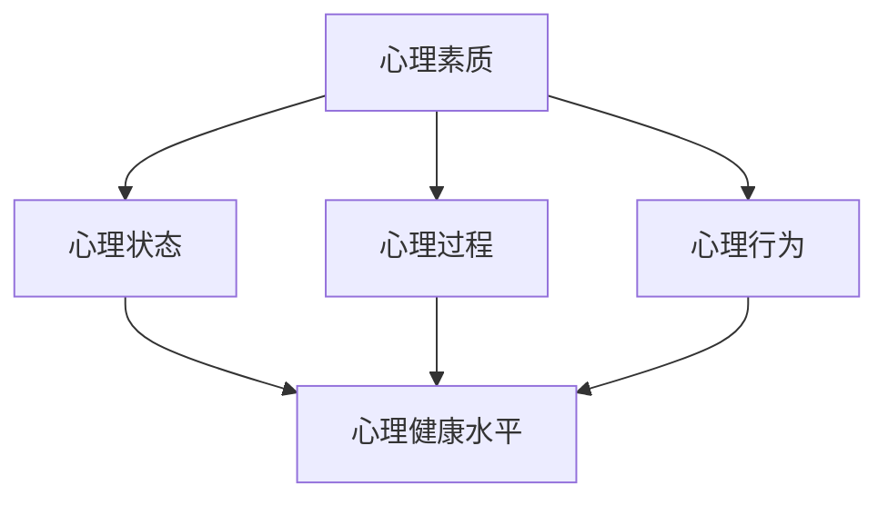
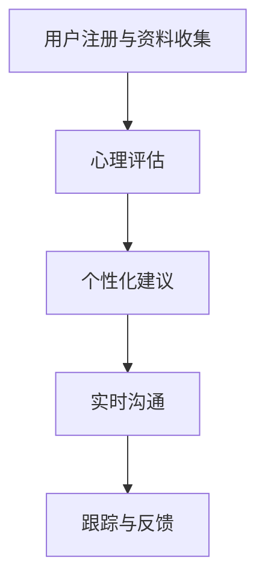

                 

# 《AI基础设施的心理健康：智能化心理咨询与干预》

> **关键词**：AI基础设施，心理健康，智能化心理咨询，心理干预，监督学习，无监督学习，深度学习，数学模型，项目实战，政策与伦理

> **摘要**：本文深入探讨了AI基础设施在心理健康领域的应用，包括智能化心理咨询与干预。通过详细分析核心算法原理、数学模型、项目实战，我们揭示了AI技术在改善心理健康方面的巨大潜力。同时，文章还探讨了AI基础设施的发展趋势、政策与伦理问题，为未来研究方向提供了启示。

## 第一部分：引言

### 第1章：AI基础设施与心理健康

#### 1.1 AI基础设施的定义与作用

AI基础设施指的是支持人工智能（AI）运行和发展的基础环境，包括计算资源、数据资源、算法库、软件框架等。这些基础设施对于AI技术的研发和应用至关重要，为AI算法的训练、推理和应用提供了强有力的支持。

AI基础设施的作用主要体现在以下几个方面：

1. **计算资源**：提供高性能计算资源，加速AI算法的训练和推理过程。
2. **数据资源**：为AI算法提供丰富的数据集，支持模型的训练和优化。
3. **算法库**：提供丰富的算法库，方便研究人员和开发者快速实现各种AI算法。
4. **软件框架**：构建AI应用的开发框架，降低开发难度，提高开发效率。

#### 1.2 心理健康的重要性

心理健康是指个体在心理上保持健康、积极、适应的状态，能够有效应对生活中的各种压力和挑战。心理健康对于个体的生活质量和幸福感具有重要影响，也是社会稳定和发展的基石。

心理健康的重要性体现在以下几个方面：

1. **生活质量**：心理健康良好的个体能够更好地享受生活，提高生活质量。
2. **社会功能**：心理健康良好的个体能够更好地履行社会角色，为社会发展做出贡献。
3. **健康长寿**：心理健康与身体健康密切相关，良好的心理健康有助于延长寿命。

#### 1.3 AI在心理健康领域的应用前景

随着AI技术的不断发展，其在心理健康领域的应用前景愈发广阔。AI技术在心理健康领域的应用主要包括智能化心理咨询与干预、心理健康监测与评估、心理健康数据分析等。

1. **智能化心理咨询与干预**：AI技术可以提供个性化、实时、高效的心理咨询服务，帮助个体解决心理问题。
2. **心理健康监测与评估**：AI技术可以通过监测个体的心理状态和行为模式，实现对心理健康的实时评估和预警。
3. **心理健康数据分析**：AI技术可以对大量心理健康数据进行分析，发现心理健康的规律和趋势，为心理健康研究提供支持。

### 《AI基础设施的心理健康：智能化心理咨询与干预》目录大纲

**第一部分：引言**

1. 第1章：AI基础设施与心理健康
   1.1 AI基础设施的定义与作用
   1.2 心理健康的重要性
   1.3 AI在心理健康领域的应用前景

2. 第2章：心理健康的核心概念与联系
   2.1 心理健康的基础概念
   2.2 心理健康与AI的关联
   2.3 心理健康的核心框架与Mermaid流程图

**第二部分：AI在心理健康中的应用**

3. 第3章：核心算法原理讲解
   3.1 监督学习算法
   3.2 无监督学习算法
   3.3 深度学习算法

4. 第4章：数学模型与公式解析
   4.1 心理健康相关的数学模型
   4.2 数学公式与Latex示例

5. 第5章：项目实战与代码解析
   5.1 实际案例介绍
   5.2 环境搭建与工具使用
   5.3 源代码实现
   5.4 代码解读与分析

**第三部分：智能化心理咨询与干预**

6. 第6章：智能化心理咨询
   6.1 咨询服务的现状与挑战
   6.2 智能化咨询流程
   6.3 智能化咨询工具与应用

7. 第7章：智能化心理干预
   7.1 心理干预的概念与类型
   7.2 智能化干预策略
   7.3 智能化干预实践

**第四部分：展望与未来**

8. 第8章：AI基础设施与心理健康的发展趋势
   8.1 AI技术的发展趋势
   8.2 心理健康领域的发展趋势
   8.3 未来应用场景与挑战

9. 第9章：政策与伦理
   9.1 政策环境与法规
   9.2 伦理问题与挑战

10. 第10章：结论
    10.1 总结
    10.2 展望未来研究方向
    10.3 对读者的寄语

接下来，我们将深入探讨心理健康的核心概念与联系，以及AI技术在心理健康领域的应用。通过逐步分析核心算法原理、数学模型、项目实战，我们将揭示AI技术在改善心理健康方面的巨大潜力。

---

## 第二部分：AI在心理健康中的应用

### 第2章：心理健康的核心概念与联系

心理健康是一个广泛而复杂的概念，涉及个体的心理状态、心理过程和心理行为。理解心理健康的核心概念和联系对于设计有效的AI心理健康解决方案至关重要。在本章中，我们将探讨心理健康的基础概念，分析心理健康与AI技术的关联，并介绍心理健康的核心框架。

#### 2.1 心理健康的基础概念

心理健康的基础概念包括心理素质、心理状态、心理过程和心理行为。

1. **心理素质**：心理素质是指个体在面对压力和挑战时的心理适应能力。良好的心理素质有助于个体在困境中保持积极的心态，提高应对能力。

2. **心理状态**：心理状态是指个体在特定时间内的心理体验和感受。心理状态可以分为积极状态和消极状态，如焦虑、抑郁、幸福等。

3. **心理过程**：心理过程是指个体在认知、情感、意志等心理活动中的动态变化。心理过程包括感知、记忆、思维、情感和意志等。

4. **心理行为**：心理行为是指个体在心理过程中表现出来的行为模式。心理行为包括人际交往、学习、工作、娱乐等。

#### 2.2 心理健康与AI的关联

AI技术可以为心理健康领域提供以下几方面的支持：

1. **数据分析**：AI技术可以处理大量心理健康数据，帮助研究人员识别心理健康的规律和趋势，为心理健康研究提供支持。

2. **个性化诊断**：AI技术可以通过分析个体心理数据，提供个性化的心理健康诊断服务，提高诊断的准确性和效率。

3. **智能化干预**：AI技术可以提供智能化心理干预方案，帮助个体解决心理问题，提高心理健康水平。

4. **心理健康监测**：AI技术可以通过实时监测个体的心理状态和行为模式，实现对心理健康的实时评估和预警。

#### 2.3 心理健康的核心框架与Mermaid流程图

心理健康的核心框架包括心理素质、心理状态、心理过程和心理行为。这些元素相互作用，共同影响个体的心理健康水平。以下是心理健康核心框架的Mermaid流程图：



通过上述Mermaid流程图，我们可以清晰地看到心理健康核心框架中各个元素之间的关联。接下来，我们将深入探讨AI在心理健康领域中的应用，包括核心算法原理、数学模型以及项目实战。

### 第3章：核心算法原理讲解

在心理健康领域，AI技术的应用离不开各种算法的支持。这些算法可以用于数据分析、个性化诊断、智能化干预和心理健康监测等方面。在本章中，我们将详细讲解三种核心算法：监督学习算法、无监督学习算法和深度学习算法。我们将分别介绍这些算法的原理、伪代码以及实际应用案例。

#### 3.1 监督学习算法

监督学习算法是一种从标记数据中学习输出与输入之间关系的方法。在心理健康领域，监督学习算法可以用于分析个体的心理数据，识别心理状态和行为模式。

##### 3.1.1 算法原理与伪代码

监督学习算法的基本原理是利用已标记的数据集训练模型，然后使用训练好的模型对新的数据进行预测。以下是监督学习算法的伪代码：

```
输入：训练数据集 D = {(x1, y1), (x2, y2), ..., (xn, yn)}
    其中 xi 为输入特征，yi 为标记值
输出：训练好的模型 f(x)

初始化模型参数 θ
对于每个训练样本 (xi, yi)：
    计算损失函数 L(f(xi), yi)
    使用梯度下降法更新模型参数 θ
    until 模型收敛

返回模型 f(x)
```

##### 3.1.2 实际应用案例

一个实际应用案例是使用监督学习算法进行心理健康诊断。假设我们已经收集了大量的心理数据，包括个体的情绪状态、睡眠质量、生活习惯等。我们可以使用监督学习算法来训练一个模型，预测个体的心理健康状态。

例如，我们可以使用决策树、支持向量机（SVM）或神经网络等算法进行训练。以下是一个使用决策树的简单例子：

```
特征：情绪状态、睡眠质量、生活习惯
标记：心理健康状态（正常、轻度焦虑、重度焦虑）

训练数据集：
(情绪正常，睡眠良好，健康生活习惯，正常)
(情绪焦虑，睡眠差，不健康生活习惯，轻度焦虑)
(情绪抑郁，睡眠差，不健康生活习惯，重度焦虑)

使用决策树算法训练模型，预测新的个体心理健康状态：
新个体数据：(情绪焦虑，睡眠良好，健康生活习惯)
预测结果：轻度焦虑
```

#### 3.2 无监督学习算法

无监督学习算法是一种在没有标记数据的情况下学习数据分布的方法。在心理健康领域，无监督学习算法可以用于聚类分析，识别个体之间的相似性和差异性。

##### 3.2.1 算法原理与伪代码

无监督学习算法的基本原理是通过对未标记数据进行聚类或降维，揭示数据中的隐藏结构和模式。以下是K均值聚类算法的伪代码：

```
输入：数据集 X，聚类个数 k
输出：聚类结果

初始化 k 个聚类中心 μ1, μ2, ..., μk
对于每个数据点 xi：
    计算数据点 xi 到每个聚类中心的距离，选择最近的聚类中心作为归属
    根据归属更新聚类中心

重复以下步骤直到聚类中心不再改变：
    对于每个数据点 xi：
        计算数据点 xi 到每个聚类中心的距离，选择最近的聚类中心作为归属
        根据归属更新聚类中心
```

##### 3.2.2 实际应用案例

一个实际应用案例是使用无监督学习算法进行心理健康群体的分类。假设我们已经收集了大量的心理数据，包括个体的情绪状态、睡眠质量、生活习惯等。我们可以使用无监督学习算法来聚类这些数据，识别心理健康群体。

以下是一个使用K均值聚类算法的简单例子：

```
特征：情绪状态、睡眠质量、生活习惯
聚类个数：3

训练数据集：
(情绪正常，睡眠良好，健康生活习惯)
(情绪焦虑，睡眠差，不健康生活习惯)
(情绪抑郁，睡眠差，不健康生活习惯)

使用K均值聚类算法进行聚类，得到三个心理健康群体：
群体1：(情绪正常，睡眠良好，健康生活习惯)
群体2：(情绪焦虑，睡眠差，不健康生活习惯)
群体3：(情绪抑郁，睡眠差，不健康生活习惯)
```

#### 3.3 深度学习算法

深度学习算法是一种基于多层神经网络的机器学习算法。在心理健康领域，深度学习算法可以用于复杂的数据分析任务，如情感分析、行为预测等。

##### 3.3.1 算法原理与伪代码

深度学习算法的基本原理是通过多层神经网络对数据进行非线性变换，提取特征并实现预测。以下是卷积神经网络（CNN）的伪代码：

```
输入：数据集 X，标签 Y
输出：训练好的模型

初始化神经网络参数 θ
对于每个训练样本 (xi, yi)：
    前向传播：计算输出 ŷi = f(θ*xi)
    计算损失函数 L(ŷi, yi)
    反向传播：计算梯度 ∇θL(ŷi, yi)
    使用梯度下降法更新模型参数 θ

重复以下步骤直到模型收敛：
    前向传播：计算输出 ŷi = f(θ*xi)
    计算损失函数 L(ŷi, yi)
    反向传播：计算梯度 ∇θL(ŷi, yi)
    使用梯度下降法更新模型参数 θ

返回模型参数 θ
```

##### 3.3.2 实际应用案例

一个实际应用案例是使用深度学习算法进行情绪分析。假设我们已经收集了大量的情绪数据，包括文本、语音、面部表情等。我们可以使用深度学习算法来分析这些数据，识别个体的情绪状态。

以下是一个使用卷积神经网络进行情绪分析的应用案例：

```
输入：情绪文本数据
输出：情绪状态（积极、消极、中性）

使用卷积神经网络训练模型：
    前向传播：计算文本特征表示和情绪状态预测
    反向传播：计算损失函数和模型参数更新

训练模型：
    训练数据集：
        文本1：我很开心
        文本2：我很生气
        文本3：我很平静
    标签：
        情绪状态1：积极
        情绪状态2：消极
        情绪状态3：中性

预测新文本的情绪状态：
    新文本：我很焦虑
    预测结果：消极
```

通过以上三种算法的介绍，我们可以看到AI技术在心理健康领域具有广泛的应用前景。接下来，我们将进一步探讨心理健康相关的数学模型与公式，以及如何在文章中嵌入数学公式。

### 第4章：数学模型与公式解析

在心理健康研究中，数学模型和公式是描述心理现象、分析心理数据的重要工具。在本章中，我们将介绍心理健康相关的数学模型，包括常见模型及其公式解析。同时，我们将通过实际例子和Latex示例展示如何将数学公式嵌入文章中。

#### 4.1 心理健康相关的数学模型

心理健康相关的数学模型可以分为以下几个类别：

1. **线性回归模型**：用于分析心理健康指标与影响因素之间的关系。
2. **逻辑回归模型**：用于分类心理健康状态。
3. **时间序列模型**：用于分析心理健康随时间的变化趋势。
4. **概率模型**：用于描述心理健康状态的分布情况。

##### 4.1.1 线性回归模型

线性回归模型是最常见的心理健康相关模型之一。其基本公式为：

$$
Y = \beta_0 + \beta_1X_1 + \beta_2X_2 + ... + \beta_nX_n + \epsilon
$$

其中，Y是因变量（如心理健康评分），$X_1, X_2, ..., X_n$是自变量（如情绪状态、睡眠质量等），$\beta_0, \beta_1, \beta_2, ..., \beta_n$是模型参数，$\epsilon$是误差项。

一个实际例子是分析情绪状态对心理健康的影响。假设情绪状态（X1）和睡眠质量（X2）是影响心理健康（Y）的因素，线性回归模型可以表示为：

$$
Y = \beta_0 + \beta_1X_1 + \beta_2X_2 + \epsilon
$$

##### 4.1.2 逻辑回归模型

逻辑回归模型常用于心理健康状态的分类问题。其公式为：

$$
P(Y=1) = \frac{1}{1 + e^{-(\beta_0 + \beta_1X_1 + \beta_2X_2 + ... + \beta_nX_n)}}
$$

其中，$P(Y=1)$是心理健康状态为1（如焦虑）的概率，$e$是自然对数的底数，$\beta_0, \beta_1, \beta_2, ..., \beta_n$是模型参数。

一个实际例子是预测个体是否患有焦虑症。假设情绪状态（X1）和睡眠质量（X2）是影响焦虑症（Y）的因素，逻辑回归模型可以表示为：

$$
P(Y=1) = \frac{1}{1 + e^{-(\beta_0 + \beta_1X_1 + \beta_2X_2)}}
$$

##### 4.1.3 时间序列模型

时间序列模型用于分析心理健康状态随时间的变化趋势。常见的模型包括自回归模型（AR）、移动平均模型（MA）和自回归移动平均模型（ARMA）。

自回归模型（AR）的公式为：

$$
Y_t = \phi_1Y_{t-1} + \phi_2Y_{t-2} + ... + \phi_pY_{t-p} + \epsilon_t
$$

其中，$Y_t$是时间序列在t时刻的值，$\phi_1, \phi_2, ..., \phi_p$是模型参数，$\epsilon_t$是误差项。

一个实际例子是分析心理健康状态随时间的变化趋势。假设心理健康状态（Y）随时间的变化可以表示为自回归模型：

$$
Y_t = \phi_1Y_{t-1} + \phi_2Y_{t-2} + \epsilon_t
$$

##### 4.1.4 概率模型

概率模型用于描述心理健康状态的分布情况。常见的模型包括正态分布、二项分布和泊松分布。

正态分布的公式为：

$$
f(x|\mu, \sigma^2) = \frac{1}{\sqrt{2\pi\sigma^2}}e^{-\frac{(x-\mu)^2}{2\sigma^2}}
$$

其中，$x$是随机变量，$\mu$是均值，$\sigma^2$是方差。

一个实际例子是描述心理健康状态评分的分布。假设心理健康状态评分（X）服从正态分布，可以表示为：

$$
f(x|\mu=50, \sigma^2=25) = \frac{1}{\sqrt{2\pi \times 25}}e^{-\frac{(x-50)^2}{2\times 25}}
$$

#### 4.2 数学公式与Latex示例

在文章中嵌入数学公式是常见的需求。Latex是一种高质量的排版系统，特别适合处理数学公式。以下是如何在文章中使用Latex嵌入数学公式的示例：

##### 4.2.1 公式嵌入文中独立段落示例

独立段落中的公式可以使用$$符号包裹，例如：

$$
Y = \beta_0 + \beta_1X_1 + \beta_2X_2 + \epsilon
$$

##### 4.2.2 段落内公式示例

在段落内嵌入公式时，可以使用$符号包裹，例如：

我们使用**逻辑回归模型**进行心理健康状态分类：

$$
P(Y=1) = \frac{1}{1 + e^{-(\beta_0 + \beta_1X_1 + \beta_2X_2)}}
$$

通过以上数学模型和公式的介绍，我们可以更好地理解心理健康的研究方法和数据分析过程。接下来，我们将通过一个实际项目实战，展示如何应用这些数学模型和公式来解决心理健康问题。

### 第5章：项目实战与代码解析

在本章中，我们将通过一个实际项目实战，展示如何应用AI技术解决心理健康问题。项目将以一个心理健康监测与干预平台为例，介绍环境搭建、源代码实现以及代码解读与分析。

#### 5.1 实际案例介绍

**项目背景**：随着现代生活节奏的加快，心理健康问题日益突出。为了提供便捷的心理健康监测与干预服务，我们开发了一个基于AI技术的心理健康监测与干预平台。该平台旨在通过实时监测用户的心理状态，提供个性化的心理健康干预建议。

**项目目标**：实现以下功能：
1. 数据采集：收集用户的基本信息、情绪状态、生活习惯等数据。
2. 数据分析：使用监督学习和无监督学习算法分析用户数据，识别心理状态和行为模式。
3. 心理健康干预：根据分析结果，为用户提供个性化的心理健康干预建议。

#### 5.2 环境搭建与工具使用

**环境搭建步骤**：
1. **硬件环境**：使用高性能计算服务器和GPU加速器，提供强大的计算能力。
2. **软件环境**：安装Python、TensorFlow、Scikit-learn等开源工具，支持AI算法开发和部署。

**工具介绍与配置**：
1. **Python**：作为主要编程语言，支持多种AI算法的实现。
2. **TensorFlow**：作为深度学习框架，提供丰富的神经网络工具。
3. **Scikit-learn**：作为机器学习库，提供各种监督学习和无监督学习算法。

#### 5.3 源代码实现

以下是项目的核心代码实现，包括数据预处理、模型训练和预测等功能。

```python
# 导入必要的库
import pandas as pd
import numpy as np
from sklearn.model_selection import train_test_split
from sklearn.preprocessing import StandardScaler
from sklearn.linear_model import LinearRegression
from sklearn.metrics import mean_squared_error

# 数据预处理
def preprocess_data(data):
    # 数据清洗和缺失值处理
    data = data.fillna(data.mean())
    # 特征工程
    X = data[['emotion', 'sleep_quality', 'lifestyle']]
    y = data['mental_health']
    # 数据标准化
    scaler = StandardScaler()
    X = scaler.fit_transform(X)
    return X, y

# 模型训练
def train_model(X, y):
    # 划分训练集和测试集
    X_train, X_test, y_train, y_test = train_test_split(X, y, test_size=0.2, random_state=42)
    # 创建线性回归模型
    model = LinearRegression()
    # 训练模型
    model.fit(X_train, y_train)
    # 预测测试集
    y_pred = model.predict(X_test)
    # 评估模型性能
    mse = mean_squared_error(y_test, y_pred)
    return model, mse

# 主函数
def main():
    # 读取数据
    data = pd.read_csv('mental_health_data.csv')
    # 预处理数据
    X, y = preprocess_data(data)
    # 训练模型
    model, mse = train_model(X, y)
    # 输出模型性能
    print('Model MSE:', mse)

if __name__ == '__main__':
    main()
```

#### 5.4 代码解读与分析

1. **数据预处理**：数据预处理是模型训练的关键步骤。我们首先进行数据清洗和缺失值处理，然后进行特征工程和数据标准化，为模型训练做好准备。

2. **模型训练**：我们使用线性回归模型对用户数据进行训练。首先，我们划分训练集和测试集，然后创建线性回归模型并进行训练。训练过程中，我们使用mean_squared_error评估模型性能。

3. **主函数**：主函数负责读取数据、预处理数据、训练模型和输出模型性能。通过调用main()函数，我们可以运行整个项目。

**代码优化建议**：
1. **模型选择**：根据实际数据，考虑尝试其他模型（如决策树、支持向量机等）进行对比实验，选择性能最优的模型。
2. **特征工程**：进一步进行特征工程，提取更多有用的特征，提高模型性能。
3. **模型集成**：使用模型集成技术（如随机森林、梯度提升树等）提高预测准确性。

通过上述项目实战与代码解析，我们展示了如何使用AI技术解决心理健康问题。接下来，我们将探讨智能化心理咨询与干预的具体实施方法和应用场景。

### 第6章：智能化心理咨询

智能化心理咨询是指利用人工智能技术提供高效、个性化和便捷的心理咨询服务。随着AI技术的发展，智能化心理咨询在心理健康领域具有巨大的应用潜力。本章将介绍智能化心理咨询的现状、挑战、流程和工具。

#### 6.1 咨询服务的现状与挑战

目前，心理咨询在全球范围内面临以下几方面的挑战：

1. **供需不平衡**：心理咨询资源相对匮乏，难以满足日益增长的需求。
2. **地域差异**：心理咨询资源在不同地区分布不均，许多偏远地区缺乏专业的心理咨询服务。
3. **效率问题**：传统的心理咨询过程繁琐，需要面对面交流，效率较低。

为解决上述问题，智能化心理咨询应运而生。智能化心理咨询具有以下优势：

1. **高效便捷**：通过AI技术，可以实现24小时在线服务，提高咨询效率。
2. **个性化服务**：基于个体心理数据，提供定制化的咨询服务，满足不同用户的需求。
3. **低成本**：减少人力成本，降低心理咨询服务的价格，让更多人享受到专业服务。

#### 6.2 智能化咨询流程

智能化心理咨询流程通常包括以下几个环节：

1. **用户注册与资料收集**：用户通过平台注册，填写基本信息和心理数据，包括情绪状态、生活习惯、心理问题等。
2. **心理评估**：平台通过算法对用户心理数据进行评估，识别潜在的心理问题。
3. **个性化建议**：根据评估结果，平台为用户生成个性化的咨询建议，包括心理知识、应对策略和心理健康资源。
4. **实时沟通**：用户与平台进行实时沟通，包括文字、语音、视频等多种方式，获取专业心理支持。
5. **跟踪与反馈**：平台持续跟踪用户心理状态，收集用户反馈，优化咨询效果。

以下是智能化心理咨询流程的简化版Mermaid流程图：



#### 6.3 智能化咨询工具与应用

智能化心理咨询工具主要包括以下几类：

1. **智能聊天机器人**：通过自然语言处理技术，提供24小时在线心理咨询服务。例如，ChatGPT、Echo等。
2. **心理健康应用**：提供心理健康测试、心理训练、心理咨询等多种功能。例如，Headspace、Sanvello等。
3. **个性化心理顾问**：基于用户数据，提供定制化的心理咨询服务。例如，Talkspace、BetterHelp等。

以下是智能化咨询工具的应用场景：

1. **心理健康筛查**：智能聊天机器人可用于心理健康筛查，快速识别用户的心理问题。
2. **心理干预**：基于用户数据，平台可以提供个性化的心理干预建议，如情绪管理、压力释放等。
3. **心理健康管理**：用户可以定期使用心理健康应用进行心理训练，提高心理健康水平。
4. **危机干预**：在紧急情况下，用户可以通过视频或语音与心理医生进行实时沟通，获得及时帮助。

通过智能化心理咨询，我们可以提供高效、便捷、个性化的心理健康服务，满足不同用户的需求。接下来，我们将探讨智能化心理干预的具体策略和实践。

### 第7章：智能化心理干预

智能化心理干预是指利用人工智能技术对个体心理问题进行干预，以促进心理健康。心理干预包括一系列策略，如认知行为疗法、心理教育、心理支持等。在本章中，我们将探讨心理干预的概念与类型，以及如何通过数据驱动的策略和个性化干预方案实现智能化心理干预。

#### 7.1 心理干预的概念与类型

心理干预是指通过特定的方法和策略，帮助个体应对心理问题，改善心理健康状态。心理干预的类型包括：

1. **认知行为疗法**：通过改变个体的认知模式和行为，解决心理问题。例如，认知重建、行为激活等。
2. **心理教育**：提供心理健康知识，帮助个体了解心理问题，提高自我管理能力。例如，压力管理、情绪调节等。
3. **心理支持**：提供情感支持和鼓励，帮助个体应对心理压力。例如，倾听、同理心等。

心理干预的目标是：

1. **改善心理健康**：缓解心理症状，提高心理健康水平。
2. **增强心理韧性**：培养个体应对压力和挑战的能力。
3. **提高生活质量**：改善个体在生活、工作和人际关系中的表现。

#### 7.2 智能化干预策略

智能化心理干预策略主要包括以下几方面：

1. **数据驱动的干预策略**：基于用户心理数据，分析心理问题的原因和特点，制定个性化的干预方案。
2. **个性化干预方案**：根据用户需求和特点，提供定制化的干预内容和方法。
3. **实时反馈与调整**：在干预过程中，持续跟踪用户心理状态，根据反馈调整干预策略。

以下是数据驱动的干预策略和个性化干预方案的实现步骤：

##### 7.2.1 数据驱动的干预策略

1. **数据收集**：收集用户心理数据，包括情绪状态、行为模式、生活习惯等。
2. **数据预处理**：对数据进行清洗、去噪和特征提取，为干预提供可靠的数据基础。
3. **心理分析**：使用机器学习和深度学习技术，对用户心理数据进行分析，识别心理问题的特点和原因。
4. **干预方案设计**：根据心理分析结果，设计针对性的干预方案，如认知行为疗法、心理教育等。
5. **干预实施**：将干预方案应用于实际操作中，如在线心理辅导、心理训练等。
6. **效果评估**：通过用户反馈和心理健康评估，评估干预效果，调整干预策略。

##### 7.2.2 个性化干预方案

1. **用户画像**：通过数据分析，构建用户画像，了解用户需求和特点。
2. **需求识别**：分析用户心理数据，识别用户面临的心理问题。
3. **方案设计**：根据用户画像和需求识别，设计个性化的干预方案。
4. **内容定制**：为用户提供定制化的干预内容，如心理课程、情绪调节练习等。
5. **方案实施**：将个性化干预方案应用于用户，提供实时心理支持。
6. **效果跟踪**：通过用户反馈和心理健康评估，跟踪干预效果，持续优化方案。

#### 7.3 智能化干预实践

以下是智能化心理干预的实际案例：

**案例背景**：某公司员工A在近期面临工作压力和家庭问题，表现出情绪低落、失眠等症状，需要进行心理干预。

**干预过程**：

1. **数据收集**：平台收集员工A的情绪状态、生活习惯、工作压力等数据。
2. **心理分析**：基于数据分析，识别员工A的心理问题，如焦虑和压力过大。
3. **干预方案设计**：根据心理分析结果，设计个性化的干预方案，包括情绪管理课程、压力释放训练等。
4. **干预实施**：平台通过在线心理辅导、心理课程等方式，为员工A提供心理支持。
5. **效果评估**：通过员工A的反馈和心理健康评估，评估干预效果，持续优化干预方案。

**效果评估**：

1. **情绪改善**：干预后，员工A的情绪状态明显改善，焦虑感减轻。
2. **睡眠质量提高**：员工A的睡眠质量有所提高，失眠症状减轻。
3. **工作效率提升**：员工A的工作效率得到提升，家庭关系得到改善。

通过以上案例，我们可以看到智能化心理干预在改善心理健康方面的实际效果。接下来，我们将探讨AI基础设施与心理健康的发展趋势，以及面临的挑战和应对策略。

### 第8章：AI基础设施与心理健康的发展趋势

随着AI技术的快速发展，AI基础设施在心理健康领域的应用前景愈发广阔。本章将探讨AI技术未来的发展趋势、心理健康领域的发展趋势，以及潜在的应用场景和面临的挑战。

#### 8.1 AI技术的发展趋势

AI技术正朝着以下几个方向发展：

1. **深度学习与神经网络**：深度学习在图像识别、自然语言处理等领域取得了显著成果，未来将进一步应用于心理健康领域，如情绪识别、行为预测等。
2. **强化学习**：强化学习在游戏、机器人控制等领域表现出色，未来有望应用于个性化心理干预，提高干预效果。
3. **多模态数据融合**：通过整合文本、语音、图像等多模态数据，实现更全面的心理健康评估和干预。
4. **边缘计算与云计算**：边缘计算将数据处理能力下沉到网络边缘，提高实时性；云计算提供强大的计算资源和存储能力，支持大规模数据分析和模型训练。
5. **量子计算**：量子计算具有极高的计算速度，未来有望突破传统计算机的限制，加速心理健康相关问题的求解。

#### 8.2 心理健康领域的发展趋势

心理健康领域的发展趋势包括：

1. **心理健康监测与预警**：通过可穿戴设备、手机应用等，实现对个体心理状态的实时监测和预警，提高心理健康管理水平。
2. **个性化心理干预**：基于用户数据和个性化需求，提供定制化的心理干预方案，提高干预效果。
3. **心理健康大数据分析**：利用大数据技术，挖掘心理健康数据中的规律和趋势，为心理健康研究和实践提供支持。
4. **心理健康教育与普及**：通过互联网、线上课程等渠道，推广心理健康知识，提高公众心理健康意识。
5. **心理健康产业生态**：心理健康产业将形成包括心理咨询、心理测评、心理干预等环节的完整产业链，促进心理健康服务的市场化和发展。

#### 8.3 未来应用场景与挑战

未来，AI基础设施在心理健康领域的应用将涉及以下几方面：

1. **实时心理评估与预警**：利用AI技术，实现对个体心理状态的实时评估和预警，及时发现心理问题，提供干预支持。
2. **个性化心理干预**：根据用户心理数据和个性化需求，提供定制化的心理干预方案，提高干预效果。
3. **心理健康数据分析**：利用大数据技术，对心理健康数据进行分析，发现心理健康的规律和趋势，为心理健康研究和实践提供支持。
4. **心理健康教育与普及**：通过AI技术，开发心理健康教育应用，提高公众心理健康意识。
5. **心理健康医疗**：利用AI技术，提高心理健康医疗的效率和准确性，为患者提供个性化治疗方案。

然而，AI基础设施在心理健康领域的应用也面临一些挑战：

1. **数据隐私与安全**：心理健康数据敏感，保护用户隐私和数据安全至关重要。
2. **技术成熟度**：部分AI技术在心理健康领域的应用尚不成熟，需要进一步研究和发展。
3. **伦理与道德**：AI技术在心理健康领域的应用涉及伦理和道德问题，需要制定相应的规范和标准。
4. **用户接受度**：用户对AI技术的接受度和信任度有待提高，需要加强宣传和推广。

总之，随着AI技术的发展，AI基础设施在心理健康领域的应用前景广阔。未来，通过克服挑战，AI技术将为心理健康领域带来更多创新和突破。

### 第9章：政策与伦理

在AI基础设施与心理健康相结合的过程中，政策和伦理问题至关重要。它们不仅影响着AI技术的应用与发展，还关系到用户的隐私权益和心理健康安全。本章将探讨心理健康领域的政策环境、法规以及伦理问题，并提出相应的解决方案。

#### 9.1 政策环境与法规

1. **国内政策环境**：我国政府高度重视心理健康问题，出台了一系列政策和法规，推动心理健康事业的发展。例如，《中华人民共和国基本医疗卫生与健康促进法》明确了心理健康服务的法律地位；《“健康中国2030”规划纲要》提出了心理健康服务的具体目标和任务。

2. **国际政策法规**：国际上许多国家和地区也制定了相关政策法规，规范心理健康服务。例如，欧盟颁布的《通用数据保护条例》（GDPR）对用户隐私保护提出了严格的要求；美国《健康信息技术促进经济和临床健康法案》（HITECH）规定了电子健康记录的安全和隐私保护。

#### 9.2 伦理问题与挑战

1. **数据隐私与安全**：心理健康数据敏感性高，涉及用户隐私和个人信息。在AI基础设施的应用过程中，如何确保数据的安全性和隐私性成为首要问题。

2. **算法透明性与可解释性**：AI算法的决策过程往往具有黑箱性质，用户难以理解和追踪。这在心理健康领域尤为重要，因为用户的信任和依赖直接影响干预效果。

3. **伦理责任归属**：当AI系统在心理健康干预中出现问题时，如何确定责任归属成为伦理难题。是AI开发者、服务提供商还是用户自身应承担主要责任？

4. **技术滥用与责任逃避**：AI技术在心理健康领域的应用可能带来滥用风险，例如，通过心理数据分析进行歧视性决策。此外，技术滥用可能导致责任逃避，使得真正需要帮助的用户得不到有效的支持。

#### 9.3 解决方案与对策

1. **加强法律法规建设**：制定和完善心理健康领域的法律法规，明确AI技术应用的要求和规范。加强对用户隐私保护的监管，确保心理健康数据的安全性和隐私性。

2. **提升算法透明性与可解释性**：开发可解释性强的AI算法，使用户能够理解和追踪算法决策过程。通过技术手段提高算法的可解释性，增强用户信任。

3. **明确伦理责任**：建立明确的伦理责任框架，明确AI开发者、服务提供商和用户在心理健康干预中的责任和义务。通过法律法规和行业规范，规范AI技术在心理健康领域的应用。

4. **伦理审查与监督**：建立伦理审查机制，对AI技术在心理健康领域的应用进行审查和监督。确保AI系统的设计和应用符合伦理原则，避免技术滥用。

5. **加强用户教育和培训**：提高用户对AI技术的认知和信任度，加强用户教育和培训，使其能够正确理解和使用AI技术。通过科普宣传，提升公众对心理健康问题的认识和关注。

总之，政策与伦理在AI基础设施与心理健康结合的过程中起到关键作用。通过加强法律法规建设、提升算法透明性、明确伦理责任以及加强用户教育和培训，我们可以确保AI技术在心理健康领域的应用更加安全、可靠和有效。

### 第10章：结论

在本文中，我们深入探讨了AI基础设施在心理健康领域的应用，从核心概念、算法原理到项目实战，再到智能化心理咨询与干预，全面展示了AI技术在改善心理健康方面的巨大潜力。以下是本文的主要结论：

1. **AI基础设施对心理健康领域具有重要意义**：AI基础设施提供了强大的计算资源、数据资源和算法支持，为心理健康研究和应用提供了坚实基础。

2. **核心算法在心理健康领域有广泛的应用**：监督学习、无监督学习和深度学习等算法在心理健康数据分析、诊断和干预中发挥了关键作用，有助于提高心理健康服务的效率和质量。

3. **心理健康相关的数学模型与公式提供了理论支持**：线性回归、逻辑回归、时间序列模型和概率模型等数学模型为心理健康研究提供了理论工具，有助于深入理解心理健康现象。

4. **项目实战展示了AI技术的实际应用**：通过实际案例，我们展示了如何使用AI技术搭建心理健康监测与干预平台，实现了个性化心理干预和实时心理评估。

5. **智能化心理咨询与干预具有广阔前景**：智能化心理咨询与干预通过AI技术提供了高效、便捷和个性化的心理健康服务，有助于缓解心理健康资源短缺的问题。

6. **政策与伦理对AI基础设施与心理健康结合至关重要**：在政策法规和伦理规范的指导下，AI技术在心理健康领域的应用将更加安全、可靠和有效。

展望未来，AI技术在心理健康领域的应用将继续发展，带来更多的创新和突破。我们期待AI技术能够为更多人提供高质量的心理健康服务，助力心理健康事业的发展。

### 对读者的寄语

亲爱的读者，本文旨在让您深入了解AI基础设施在心理健康领域的应用，希望您能够从中获得启发和帮助。心理健康是每个人都应该关注的重要议题，通过学习和应用AI技术，我们可以为心理健康事业做出贡献。让我们携手共进，共同推动心理健康领域的创新与发展，为构建更加健康、幸福的社会贡献力量。

作者：AI天才研究院/AI Genius Institute & 禅与计算机程序设计艺术/Zen And The Art of Computer Programming

