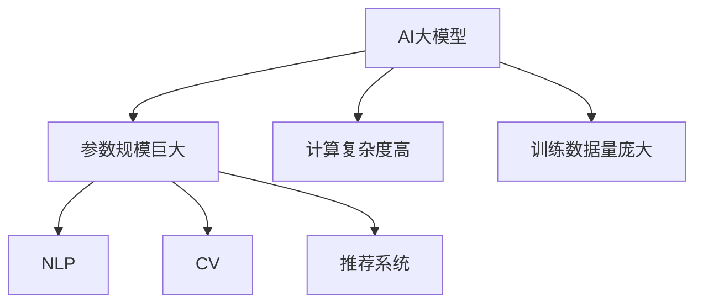
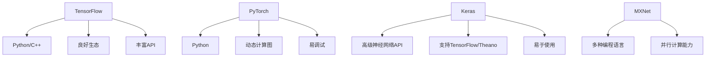
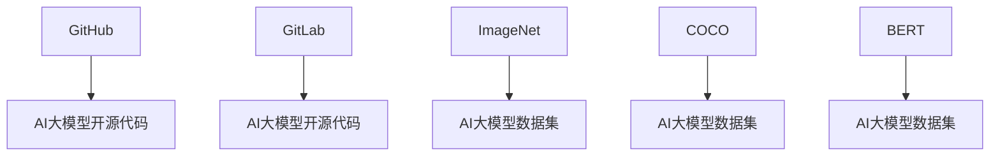
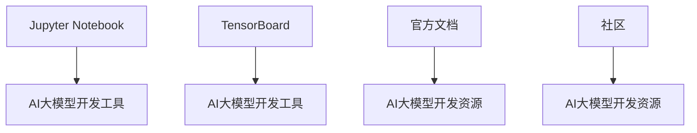

                 

# 《AI大模型创业：如何利用品牌优势？》

> **关键词：** AI大模型，品牌优势，创业，市场推广，技术风险，成功案例分析

> **摘要：** 本文深入探讨了AI大模型创业过程中的品牌优势利用策略。通过分析AI大模型的基本概念、技术基础、应用场景，结合创业实战经验，揭示了如何通过品牌建设、市场推广和技术风险管理，实现AI大模型创业的成功。本文旨在为AI创业者提供实用的指导和建议。

## 目录大纲

#### 第一部分：AI大模型概述
1. AI大模型的基本概念与重要性
2. AI大模型技术基础
3. AI大模型在创业中的应用

#### 第二部分：AI大模型创业实战
4. 利用品牌优势打造AI大模型
5. AI大模型创业准备
6. AI大模型产品开发
7. AI大模型商业化与推广
8. 创业过程中的风险管理

#### 第三部分：案例分析与实战经验
9. AI大模型创业成功案例分析
10. AI大模型创业实战经验分享

#### 附录
11. AI大模型开发工具与资源

---

接下来，我们将按照目录大纲结构，逐步深入探讨AI大模型创业的核心内容。首先，我们从AI大模型的基本概念和重要性开始。

### 第一部分：AI大模型概述

#### 1. AI大模型的基本概念与重要性

##### 1.1. AI大模型定义

AI大模型是指那些参数规模巨大、计算复杂度高、训练数据量庞大的机器学习模型。这些模型通常用于处理复杂的问题，如自然语言处理（NLP）、计算机视觉（CV）、推荐系统等。

**核心概念联系：**


**Mermaid 流程图：**



##### 1.2. AI大模型的优势与劣势

**优势：**
- **强大的数据处理能力**：AI大模型能够处理大量的数据，从而提升模型的准确性和泛化能力。
- **出色的表现**：在许多任务中，大模型的表现远超传统的小型模型。
- **创新性**：大模型推动了AI领域的研究，促进了新算法和新技术的出现。

**劣势：**
- **计算资源需求高**：大模型的训练和推理需要大量的计算资源和时间。
- **数据隐私和安全问题**：大模型对数据的安全性和隐私保护提出了更高的要求。
- **模型可解释性差**：大模型的内部结构复杂，导致其可解释性较差，难以理解模型的决策过程。

##### 1.3. AI大模型与创业的关系

AI大模型在创业中的应用具有广泛的前景。它们可以帮助企业解决复杂的问题，提升产品的竞争力，并创造新的商业模式。

**核心算法原理讲解：**

**机器学习算法原理：**

机器学习算法通过从数据中学习规律，以实现预测或分类任务。常见的机器学习算法包括：

- **线性回归**：用于预测连续值。
- **逻辑回归**：用于预测概率。
- **支持向量机（SVM）**：用于分类任务。

**伪代码：**

```python
def linear_regression(x, y):
    # 计算权重和偏置
    # 预测输出
    return predicted_output

def logistic_regression(x, y):
    # 计算概率
    # 返回预测结果
    return predicted_result

def svm_classification(x, y):
    # 训练模型
    # 预测分类
    return predicted_classification
```

**自然语言处理基础：**

自然语言处理（NLP）是AI大模型的重要应用领域。以下是其核心算法原理：

- **文本预处理**：包括分词、去除停用词、词性标注等。
- **词嵌入**：将词汇映射到低维空间。
- **序列模型**：如循环神经网络（RNN）和长短期记忆网络（LSTM）。
- **注意力机制**：用于提高模型对输入序列的重视程度。

**伪代码：**

```python
def text_preprocessing(text):
    # 进行文本预处理
    return processed_text

def word_embedding(vocabulary):
    # 将词汇映射到低维空间
    return embedding_matrix

def lstm_model(input_sequence, embedding_matrix):
    # 构建LSTM模型
    # 训练模型
    return trained_model
```

##### 1.3. AI大模型在创业中的应用

AI大模型在创业中的应用主要包括以下几个方面：

- **产品设计**：通过分析用户行为数据，优化产品设计，提高用户体验。
- **产品测试**：利用AI大模型进行自动化测试，提高测试效率和覆盖率。
- **产品迭代**：通过持续学习用户反馈，迭代产品功能，提升产品竞争力。

##### 1.4. AI大模型在市场营销中的应用

AI大模型在市场营销中的应用也非常广泛：

- **用户画像**：通过对用户行为和兴趣的分析，构建用户画像，实现精准营销。
- **广告投放**：利用AI大模型优化广告投放策略，提高广告效果。
- **品牌口碑管理**：通过监测社交媒体和用户评价，实时管理品牌口碑。

#### 2. 利用品牌优势打造AI大模型

##### 2.1. 品牌建设与AI大模型结合

品牌建设是AI大模型创业的重要环节。以下是一些关键策略：

- **品牌定位**：明确品牌的核心价值和目标市场，为AI大模型的发展奠定基础。
- **品牌传播**：利用各种渠道和手段，提升品牌知名度和影响力。
- **品牌价值**：通过持续创新和高质量的产品，提升品牌价值。

##### 2.2. 品牌优势在AI大模型创业中的应用

品牌优势在AI大模型创业中的应用主要体现在以下几个方面：

- **市场推广**：借助品牌优势，更容易获得市场关注和用户信任。
- **用户留存**：通过品牌建设，提高用户满意度和忠诚度，降低用户流失率。
- **商业化**：品牌优势有助于产品商业化，提升盈利能力。

### 第二部分：AI大模型创业实战

#### 3. AI大模型创业准备

##### 3.1. 市场研究与机会识别

市场研究是AI大模型创业的重要前提。以下是一些关键步骤：

- **市场趋势分析**：了解AI大模型的发展趋势和市场需求。
- **竞争对手分析**：分析竞争对手的产品、优势和劣势。
- **市场机会识别**：识别潜在的市场机会和业务模式。

##### 3.2. 团队建设与技能培养

团队建设是AI大模型创业的关键。以下是一些关键策略：

- **核心团队组建**：组建一支具备技术、市场、运营等多方面能力的核心团队。
- **专业技能培养**：为团队成员提供培训和学习机会，提升专业技能。
- **团队协作与沟通**：建立高效的团队协作机制，确保项目顺利进行。

#### 4. AI大模型产品开发

##### 4.1. 需求分析与产品设计

需求分析是产品开发的重要环节。以下是一些关键步骤：

- **用户需求调研**：了解目标用户的需求和痛点。
- **产品设计方法**：采用迭代设计和用户反馈机制，优化产品设计。
- **产品原型设计**：构建产品原型，验证设计思路。

##### 4.2. AI大模型训练与优化

AI大模型训练与优化是产品开发的核心。以下是一些关键步骤：

- **数据收集与处理**：收集高质量的数据，并进行数据预处理。
- **模型训练与调优**：构建和训练AI大模型，并进行调优。
- **模型评估与优化**：评估模型性能，持续优化模型。

#### 5. AI大模型商业化与推广

##### 5.1. 商业模式设计

商业模式设计是AI大模型商业化的关键。以下是一些关键策略：

- **盈利模式探索**：探索适合AI大模型的盈利模式，如订阅制、服务费等。
- **收费模式设计**：设计合理的收费模式，确保产品盈利。
- **商业模式验证**：通过市场调研和用户反馈，验证商业模式的可行性。

##### 5.2. 市场推广策略

市场推广是AI大模型商业化的重要环节。以下是一些关键策略：

- **品牌推广**：通过广告、公关、社交媒体等渠道，提升品牌知名度和影响力。
- **产品推广**：通过线上和线下活动，提高产品的市场认知度和用户接受度。
- **用户教育**：通过教育和引导，提高用户对AI大模型的认识和接受度。

#### 6. 创业过程中的风险管理

##### 6.1. 技术风险管理

技术风险是AI大模型创业的主要风险之一。以下是一些关键策略：

- **技术风险识别**：识别和评估可能的技术风险，如计算资源不足、数据隐私问题等。
- **技术风险管理策略**：制定相应的风险管理策略，降低技术风险。
- **技术迭代与升级**：持续关注技术发展趋势，及时进行技术迭代和升级。

##### 6.2. 市场风险管理

市场风险也是AI大模型创业的重要风险之一。以下是一些关键策略：

- **市场变化应对策略**：密切关注市场变化，及时调整产品策略和商业模式。
- **竞争风险识别与应对**：识别和评估竞争对手的威胁，制定相应的应对策略。
- **市场扩展策略**：通过市场扩展，降低市场风险，提升业务规模。

### 第三部分：案例分析与实战经验

#### 7. AI大模型创业成功案例分析

本部分将介绍一些AI大模型创业的成功案例，分析其成功因素和经验教训。

#### 8. AI大模型创业实战经验分享

本部分将分享一些AI大模型创业的实战经验，包括团队管理、产品开发、市场推广等方面的经验。

### 附录

#### 9. AI大模型开发工具与资源

本附录将介绍一些主流的AI大模型开发工具和资源，包括深度学习框架、开源代码和数据集等。

---

以上是本文的核心内容。通过逐步分析AI大模型创业的关键环节，本文旨在为创业者提供实用的指导和建议。希望读者能够在阅读本文后，对AI大模型创业有更深入的了解，并能够运用品牌优势，实现创业的成功。

---

### 附录

#### 9.1. 主流深度学习框架对比

深度学习框架是AI大模型开发的重要工具。以下是几个主流深度学习框架的对比：

- **TensorFlow**：由Google开发，支持Python和C++，具有良好的生态和丰富的API。
- **PyTorch**：由Facebook开发，支持Python，具有动态计算图和易于调试的特点。
- **Keras**：是一个高级神经网络API，能够支持TensorFlow和Theano，易于使用。
- **MXNet**：由Apache开发，支持多种编程语言，具有良好的并行计算能力。

**Mermaid 流程图：**



#### 9.2. 开源代码与数据集资源

开源代码和数据集是AI大模型开发的重要资源。以下是一些常用的开源代码和数据集：

- **开源代码**：GitHub、GitLab等平台提供了丰富的AI大模型开源代码。
- **数据集**：ImageNet、COCO、BERT等是常用的AI大模型数据集。

**Mermaid 流�程图：**



#### 9.3. 其他相关资源与工具

除了深度学习框架和开源代码，还有许多其他工具和资源对AI大模型开发有帮助：

- **工具**：Jupyter Notebook、TensorBoard等。
- **文档**：深度学习框架的官方文档和教程。
- **社区**：深度学习和AI相关的社区和论坛。

**Mermaid 流程图：**



通过附录部分，我们希望读者能够更好地了解AI大模型开发的工具和资源，为创业实践提供更多支持。

---

### 作者信息

**作者：** AI天才研究院/AI Genius Institute & 禅与计算机程序设计艺术 /Zen And The Art of Computer Programming

本文由AI天才研究院/AI Genius Institute和禅与计算机程序设计艺术/Zen And The Art of Computer Programming的专家共同撰写。我们致力于推动AI技术的发展和应用，帮助创业者实现AI大模型创业的成功。如您有任何疑问或建议，请随时与我们联系。感谢您的阅读！

