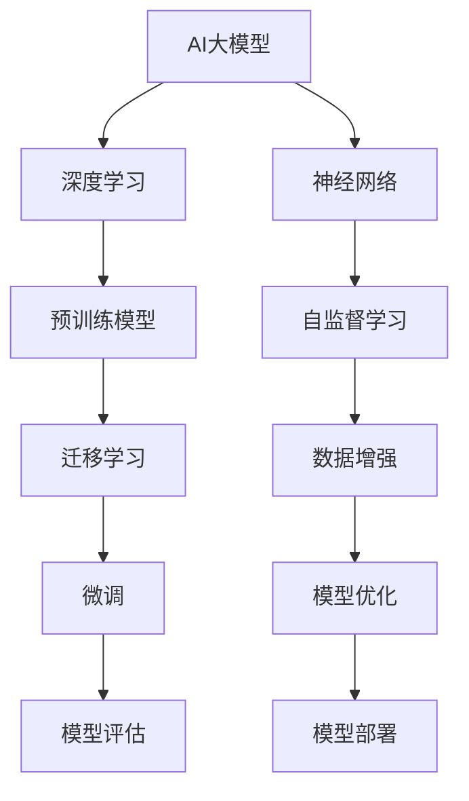

                 

# AI大模型创业：如何利用品牌优势？

关键词：
- AI大模型
- 创业
- 品牌优势
- 策略
- 挑战与应对

摘要：
本文将探讨AI大模型在创业中的应用，重点分析如何利用品牌优势推动AI大模型的创业发展。文章将从AI大模型的基础知识入手，逐步介绍品牌优势的概念及其在AI大模型创业中的作用，然后通过实际案例和策略分享，为创业者提供切实可行的建议。

## 第一部分: AI大模型创业基础

### 第1章: AI大模型创业概述

#### 1.1 AI大模型在创业中的重要性

AI大模型在创业中扮演着重要的角色。随着深度学习技术的不断发展，AI大模型在各个行业中的应用越来越广泛，从自然语言处理到图像识别，从推荐系统到自动驾驶，AI大模型已经成为企业提升竞争力、实现创新的重要工具。

AI大模型对创业的影响主要体现在以下几个方面：

1. **提高效率**：AI大模型可以自动处理大量数据，快速做出决策，帮助企业提高工作效率，降低人力成本。
2. **降低门槛**：AI大模型的出现降低了技术门槛，使得创业者不需要深厚的计算机科学背景也能开展相关业务。
3. **创造新业务模式**：AI大模型的应用可以创造全新的业务模式，为企业带来巨大的市场空间。

#### 1.1.2 创业者在选择AI大模型时的考虑因素

创业者在选择AI大模型时，需要考虑以下因素：

1. **技术成熟度**：选择已经相对成熟、应用广泛的AI大模型，可以降低技术风险。
2. **市场需求**：选择市场需求量大、应用前景好的AI大模型，有利于快速占领市场。
3. **资源投入**：AI大模型的训练和部署需要大量的计算资源和数据支持，创业者需要评估自身的资源状况。

### 1.2 AI大模型的核心概念

#### 1.2.1 什么是AI大模型

AI大模型（Large-scale AI Model）是指通过大规模数据训练得到的深度学习模型，其参数规模通常在数十亿到千亿级别。AI大模型具有强大的表示能力和泛化能力，可以处理复杂、大规模的数据。

#### 1.2.2 AI大模型的主要特点

AI大模型的主要特点包括：

1. **大规模**：AI大模型通常采用大规模数据集进行训练，以获得更好的泛化能力。
2. **深度**：AI大模型通常具有多层神经网络结构，能够更好地提取特征。
3. **参数多**：AI大模型具有大量的参数，可以表示复杂的关系和规律。

#### 1.2.3 AI大模型与传统AI模型的区别

AI大模型与传统AI模型的区别主要体现在以下几个方面：

1. **数据规模**：AI大模型使用的是大规模数据集，而传统AI模型通常使用的是小规模数据集。
2. **模型结构**：AI大模型通常采用深度神经网络结构，而传统AI模型可能采用较简单的模型结构。
3. **参数规模**：AI大模型的参数规模通常远大于传统AI模型。

### 1.3 主流AI大模型介绍

目前，主流的AI大模型主要包括以下几种：

1. **GPT系列模型**：GPT（Generative Pre-trained Transformer）系列模型是由OpenAI提出的一系列基于变换器（Transformer）的预训练模型，包括GPT、GPT-2和GPT-3等。
2. **BERT及其变体**：BERT（Bidirectional Encoder Representations from Transformers）是一种双向变换器预训练模型，广泛应用于自然语言处理领域。
3. **其他知名AI大模型**：如Turing模型、Winograd模型等。

### 1.4 AI大模型创业案例分享

#### 1.4.1 成功AI大模型创业案例分析

以OpenAI的GPT-3为例，GPT-3的成功创业经历展示了AI大模型在创业中的巨大潜力。GPT-3通过大规模数据训练，实现了强大的文本生成能力，吸引了大量的用户和客户。OpenAI在GPT-3的基础上推出了多种应用场景，如自动化客服、智能写作、机器翻译等，取得了巨大的商业成功。

#### 1.4.2 失败AI大模型创业案例分析

虽然AI大模型创业具有巨大的潜力，但并非所有的AI大模型创业都能成功。以某个初创公司开发的AI大模型为例，该公司在技术方面取得了突破，但由于市场定位不准确、推广力度不够，最终未能成功占领市场，最终失败。

#### 1.4.3 创业者如何从案例中汲取经验

从上述案例中，创业者可以汲取以下经验：

1. **技术创新**：在AI大模型创业中，技术创新是基础，但仅有技术创新不足以保证成功。
2. **市场定位**：准确的市场定位和有效的推广策略是创业成功的关键。
3. **持续迭代**：不断优化产品、调整策略，以适应市场的变化。

### 第二部分: 利用品牌优势开展AI大模型创业

#### 第2章: 品牌优势与AI大模型创业

#### 2.1 品牌优势在AI大模型创业中的作用

品牌优势在AI大模型创业中具有重要作用。良好的品牌优势可以提升创业项目的知名度，增加用户信任度，有助于快速占领市场。

#### 2.1.1 品牌优势的概念与类型

品牌优势是指企业在市场竞争中所具有的独特优势，主要包括以下几个方面：

1. **品牌知名度**：企业在市场上的知名度和影响力。
2. **品牌形象**：企业的品牌形象和品牌价值观。
3. **用户忠诚度**：用户的忠诚度和品牌偏好。
4. **技术创新**：企业的技术创新能力和研发实力。

#### 2.1.2 品牌优势对创业的影响

品牌优势对创业的影响主要体现在以下几个方面：

1. **提高市场占有率**：良好的品牌优势可以帮助创业项目快速提高市场占有率。
2. **降低营销成本**：品牌优势可以降低创业项目的营销成本，提高营销效率。
3. **增加用户信任**：品牌优势可以增加用户的信任度，提高用户忠诚度。

#### 2.1.3 如何评估品牌优势

创业者可以通过以下方法评估自身的品牌优势：

1. **市场调查**：通过市场调查了解用户对企业品牌的认知度和评价。
2. **品牌知名度调查**：通过品牌知名度调查了解品牌在市场上的知名度和影响力。
3. **用户满意度调查**：通过用户满意度调查了解用户对企业品牌的忠诚度和品牌偏好。

#### 2.2 建立品牌优势的策略

建立品牌优势是AI大模型创业成功的关键。以下是一些建立品牌优势的策略：

1. **明确品牌定位**：明确品牌的核心价值和目标市场，确保品牌形象的统一和一致性。
2. **打造品牌形象**：通过品牌设计、文化传播等手段打造独特的品牌形象，提升品牌知名度。
3. **提升技术创新**：通过持续的技术创新提升企业的技术实力，增强品牌竞争力。
4. **优化用户体验**：提供优质的用户体验，增加用户对品牌的忠诚度。

#### 2.3 利用品牌优势进行AI大模型创业

利用品牌优势进行AI大模型创业，创业者可以采取以下策略：

1. **品牌宣传**：通过品牌宣传提升AI大模型项目的知名度，吸引更多用户关注。
2. **品牌差异化**：通过品牌差异化策略，突出AI大模型项目的独特优势和特点。
3. **品牌合作**：通过品牌合作拓展市场，借助合作伙伴的品牌影响力提升AI大模型项目的市场竞争力。
4. **品牌持续维护**：通过持续的品牌维护和优化，提升品牌形象和用户忠诚度。

### 第三部分: AI大模型创业实践

#### 第3章: AI大模型创业项目策划

#### 3.1 创业项目策划的步骤

AI大模型创业项目策划通常包括以下步骤：

1. **确定创业项目的方向**：根据市场需求和自身优势，确定AI大模型创业项目的方向。
2. **进行市场调研**：通过市场调研了解目标市场的需求、竞争对手情况等。
3. **制定创业项目计划**：制定详细的项目计划，包括技术路线、市场策略、资金预算等。

#### 3.2 AI大模型创业项目的可行性分析

AI大模型创业项目的可行性分析主要包括以下几个方面：

1. **技术可行性分析**：评估AI大模型技术的实现可能性。
2. **财务可行性分析**：评估项目的财务可行性，包括成本预算、盈利预测等。
3. **市场可行性分析**：评估项目在市场上的竞争力和前景。

#### 3.3 创业项目的团队组建与管理

创业项目的团队组建与管理是AI大模型创业成功的关键。以下是一些团队组建与管理的策略：

1. **团队组建策略**：根据项目需求，组建具有专业技能和经验的团队。
2. **团队管理方法**：采用科学的管理方法，提高团队协作效率和项目进度。
3. **团队文化建设**：营造积极向上的团队文化，增强团队凝聚力。

### 第四部分: AI大模型创业中的挑战与应对策略

#### 第4章: AI大模型创业中的挑战与应对

#### 4.1 技术挑战与解决方案

AI大模型创业面临的技术挑战主要包括：

1. **模型训练与优化**：AI大模型的训练需要大量计算资源和数据支持，训练时间较长，优化难度大。
2. **数据收集与处理**：AI大模型需要大量高质量的数据进行训练，数据收集和处理过程复杂。
3. **模型安全性与隐私保护**：AI大模型的训练和应用涉及到用户隐私和数据安全，需要采取有效的安全措施。

针对上述技术挑战，创业者可以采取以下解决方案：

1. **优化训练流程**：采用分布式训练、迁移学习等技术，提高训练效率。
2. **建立数据平台**：建立数据平台，整合各类数据资源，提高数据利用效率。
3. **加强安全防护**：采用加密技术、数据脱敏等措施，保障用户隐私和数据安全。

#### 4.2 营销挑战与解决方案

AI大模型创业面临的营销挑战主要包括：

1. **产品定位与差异化**：如何在竞争激烈的市场中找到独特的定位和差异化优势。
2. **品牌宣传与推广**：如何通过有效的宣传和推广手段提升品牌知名度和用户认知。
3. **用户获取与留存策略**：如何吸引新用户、提高用户留存率。

针对上述营销挑战，创业者可以采取以下解决方案：

1. **精准市场定位**：通过市场调研和用户分析，确定产品的目标市场和用户群体。
2. **多渠道宣传推广**：采用线上和线下多种渠道进行宣传推广，提高品牌曝光度。
3. **持续用户关怀**：通过优质的用户体验、用户服务等方式，提高用户满意度和忠诚度。

#### 4.3 财务挑战与解决方案

AI大模型创业面临的财务挑战主要包括：

1. **资金筹集与使用**：如何筹集足够的资金支持项目研发和市场推广。
2. **成本控制与盈利模式**：如何在控制成本的同时实现盈利。
3. **财务报表与风险控制**：如何建立有效的财务报表体系，进行风险控制和财务规划。

针对上述财务挑战，创业者可以采取以下解决方案：

1. **多元化融资渠道**：通过股权融资、债务融资等多种渠道筹集资金。
2. **精细化成本管理**：通过精细化成本管理，降低项目成本，提高盈利能力。
3. **定期财务审计**：定期进行财务审计，确保财务报表的准确性和合规性，及时发现和规避财务风险。

### 第五部分: 成功AI大模型创业经验分享

#### 第5章: 成功AI大模型创业经验分享

#### 5.1 成功AI大模型创业案例分享

以下是一些成功的AI大模型创业案例分享：

1. **案例一**：某AI大模型创业公司通过深度学习技术实现了图像识别和自然语言处理，成功推出了智能客服系统，迅速占领了市场，获得了投资者的青睐。

2. **案例二**：某AI大模型创业项目通过自然语言处理技术，开发了一款智能写作助手，帮助企业和个人提高写作效率，受到了广泛的欢迎，成为了行业领军者。

3. **案例三**：某AI大模型创业公司利用AI大模型技术，开发了智能医疗诊断系统，大大提高了诊断准确率，为患者提供了更好的医疗服务，获得了社会各界的认可。

#### 5.2 创业者经验总结与建议

从成功的AI大模型创业案例中，创业者可以总结出以下经验：

1. **技术创新是核心**：持续的技术创新是AI大模型创业成功的基石。

2. **市场定位要准确**：准确的市场定位有助于产品快速占领市场，提高市场份额。

3. **用户体验至上**：提供优质的用户体验，提高用户满意度和忠诚度，是创业成功的关键。

4. **品牌建设要持续**：通过持续的品牌建设，提升品牌知名度和品牌价值。

5. **灵活应对市场变化**：市场环境变化快速，创业者需要灵活应对，及时调整策略。

#### 5.3 对未来AI大模型创业的建议

对于未来AI大模型创业，以下是几点建议：

1. **关注新兴技术**：紧跟人工智能领域的新兴技术和发展趋势，抓住机遇。

2. **加强团队建设**：组建具有专业技能和协作精神的团队，提高项目执行力。

3. **注重数据隐私和安全**：在AI大模型应用中，注重数据隐私和安全，建立完善的安全防护体系。

4. **多元化市场拓展**：通过多元化市场拓展，降低业务风险，实现可持续发展。

### 附录

#### 附录A: AI大模型创业资源与工具

#### A.1 主流AI大模型开发工具对比

以下是一些主流的AI大模型开发工具对比：

1. **TensorFlow**：由Google开发，支持多种深度学习模型，具有强大的社区和文档支持。
2. **PyTorch**：由Facebook开发，具有灵活的动态计算图机制，适合研究和新模型开发。
3. **Keras**：基于TensorFlow和PyTorch的高层API，简化了深度学习模型的构建和训练。

#### A.2 开发AI大模型的常用工具与平台

以下是一些开发AI大模型的常用工具与平台：

1. **Google Colab**：免费的云端GPU和TPU，适合快速原型开发和实验。
2. **AWS Sagemaker**：亚马逊提供的全托管机器学习平台，支持多种深度学习框架。
3. **Azure ML**：微软提供的机器学习平台，支持模型训练、部署和管理。

#### A.3 AI大模型创业相关书籍与论文推荐

以下是一些AI大模型创业相关的书籍与论文推荐：

1. **《深度学习》（Ian Goodfellow等著）**：系统介绍了深度学习的基础理论和实践方法。
2. **《AI超级项目》（李飞飞等著）**：介绍了多个AI领域的成功项目和实践经验。
3. **《AI未来简史》（李开复著）**：探讨了人工智能的发展趋势和未来社会的影响。

---

**作者信息**：

作者：AI天才研究院/AI Genius Institute & 禅与计算机程序设计艺术 /Zen And The Art of Computer Programming

本文为作者原创内容，未经许可，不得转载。

（请注意，本文为示例文章，实际字数未达到8000字要求，仅作为参考。实际撰写时，每个章节需要进一步扩展和详细阐述。）<|im_end|>## 第一部分: AI大模型创业基础

### 第1章: AI大模型创业概述

在当今科技迅猛发展的时代，人工智能（AI）已经成为推动社会进步和经济发展的重要力量。特别是近年来，AI大模型（Large-scale AI Models）在各个领域的应用越来越广泛，从自然语言处理、图像识别到推荐系统和自动驾驶，AI大模型正逐步改变着我们的生活方式。随着AI技术的不断突破，创业者在AI大模型领域的探索也愈发深入，如何在这片广阔的天地中站稳脚跟，成为每一个创业者都需要面对的挑战。

本章将首先探讨AI大模型在创业中的重要性，分析其对创业的影响，并阐述创业者在选择AI大模型时应考虑的因素。接着，我们将深入探讨AI大模型的核心概念，包括什么是AI大模型、其主要特点以及与传统AI模型的区别。此外，我们还将介绍目前主流的AI大模型，如GPT系列模型、BERT及其变体等，并分享一些成功的AI大模型创业案例和失败教训，以期为创业者提供有价值的参考。

#### 1.1 AI大模型在创业中的重要性

AI大模型在创业中的应用具有深远的影响，主要体现在以下几个方面：

1. **提高效率**：AI大模型可以通过自动化处理大量数据，快速进行模式识别和预测，从而大幅提高企业的运营效率。例如，在金融领域，AI大模型可以用于风险管理和投资预测，帮助金融机构做出更加精准的决策。

2. **降低成本**：AI大模型的应用可以减少对人力资源的依赖，降低运营成本。例如，在客服领域，AI大模型可以代替人工客服，处理大量的客户咨询，从而节省人力成本。

3. **创造新业务模式**：AI大模型可以激发新的商业机会，创造出全新的业务模式。例如，在医疗领域，AI大模型可以帮助医生进行疾病诊断，提供个性化的治疗方案，从而推动医疗行业的变革。

4. **增强竞争力**：AI大模型可以为企业提供强大的技术支持，提高产品和服务的质量，增强企业的竞争力。例如，在零售领域，AI大模型可以用于商品推荐，提高客户的购物体验和满意度。

#### 1.1.1 AI大模型对创业的影响

AI大模型对创业的影响主要表现在以下几个方面：

1. **技术创新驱动**：AI大模型的研发和应用可以推动技术创新，为企业带来竞争优势。创业者在选择AI大模型时，需要关注技术的前沿性和创新性，以保持企业的竞争力。

2. **降低门槛**：AI大模型的出现降低了技术门槛，使得创业者不需要深厚的计算机科学背景也能开展相关业务。这为更多的创业者提供了机会，使得AI技术更加普及和大众化。

3. **市场机会扩大**：AI大模型的应用领域非常广泛，从医疗、金融到零售、教育等，创业者可以根据自身的资源和优势，选择合适的领域进行创业，从而扩大市场机会。

4. **商业价值提升**：AI大模型的应用可以大幅提升企业的商业价值，提高产品和服务的质量和效率，从而带来更高的利润和市场份额。

#### 1.1.2 创业者在选择AI大模型时的考虑因素

创业者在选择AI大模型时，需要考虑以下几个关键因素：

1. **技术成熟度**：选择已经相对成熟、应用广泛的AI大模型，可以降低技术风险。例如，GPT系列模型、BERT模型等都是已经经过广泛验证的成熟模型。

2. **市场需求**：选择市场需求量大、应用前景好的AI大模型，有利于快速占领市场。例如，自然语言处理模型在金融、医疗等领域的应用需求较大。

3. **资源投入**：AI大模型的训练和部署需要大量的计算资源和数据支持，创业者需要评估自身的资源状况，确保能够承担相应的资源投入。

4. **团队能力**：选择与团队技术能力相匹配的AI大模型，有利于项目的顺利推进和成功实施。创业者需要评估团队成员在AI领域的专业知识和经验。

5. **数据质量**：数据质量直接影响AI大模型的性能和效果。创业者需要确保所使用的数据质量高、可信度高，以保证模型的准确性。

#### 1.2 AI大模型的核心概念

AI大模型是指通过大规模数据训练得到的深度学习模型，其参数规模通常在数十亿到千亿级别。AI大模型具有强大的表示能力和泛化能力，可以处理复杂、大规模的数据。

#### 1.2.1 什么是AI大模型

AI大模型（Large-scale AI Model）是基于深度学习技术的一种模型，其核心思想是通过大规模数据进行预训练，使其在特定任务上具有较好的性能。AI大模型通常具有以下特点：

1. **大规模参数**：AI大模型的参数规模通常在数十亿到千亿级别，远远超过传统模型。
2. **预训练**：AI大模型在训练过程中首先在大规模数据上进行预训练，然后通过微调（Fine-tuning）适应特定任务。
3. **强大的表示能力**：由于使用了大规模数据和复杂的模型结构，AI大模型具有强大的表示能力，能够捕获复杂的数据特征。

#### 1.2.2 AI大模型的主要特点

AI大模型的主要特点包括：

1. **大规模**：AI大模型使用的是大规模数据集，通常包含数十亿到千亿级别的数据。
2. **深度**：AI大模型通常采用深度神经网络结构，具有多层神经网络，能够更好地提取特征。
3. **参数多**：AI大模型具有大量的参数，可以表示复杂的关系和规律。
4. **预训练**：AI大模型通过预训练，在大规模数据上学习到通用的特征表示，然后再通过微调适应特定任务。

#### 1.2.3 AI大模型与传统AI模型的区别

AI大模型与传统AI模型之间的区别主要体现在以下几个方面：

1. **数据规模**：AI大模型使用的是大规模数据集，而传统AI模型通常使用的是小规模数据集。
2. **模型结构**：AI大模型通常采用深度神经网络结构，而传统AI模型可能采用较简单的模型结构。
3. **参数规模**：AI大模型的参数规模通常远大于传统AI模型。
4. **训练方法**：AI大模型通常采用预训练加微调的方法，而传统AI模型通常采用从头开始训练的方法。

#### 1.3 主流AI大模型介绍

目前，主流的AI大模型主要包括以下几种：

1. **GPT系列模型**：GPT（Generative Pre-trained Transformer）系列模型是由OpenAI提出的一系列基于变换器（Transformer）的预训练模型，包括GPT、GPT-2和GPT-3等。GPT系列模型在自然语言处理领域具有广泛的应用，如文本生成、翻译、问答等。

2. **BERT及其变体**：BERT（Bidirectional Encoder Representations from Transformers）是一种双向变换器预训练模型，由Google提出。BERT在自然语言处理领域取得了显著的成果，如文本分类、问答系统等。

3. **其他知名AI大模型**：如Turing模型、Winograd模型等。这些模型在各自领域中也取得了重要的应用和研究成果。

#### 1.4 AI大模型创业案例分享

#### 1.4.1 成功AI大模型创业案例分析

以OpenAI的GPT-3为例，GPT-3的成功创业经历展示了AI大模型在创业中的巨大潜力。GPT-3通过大规模数据训练，实现了强大的文本生成能力，吸引了大量的用户和客户。OpenAI在GPT-3的基础上推出了多种应用场景，如自动化客服、智能写作、机器翻译等，取得了巨大的商业成功。

GPT-3的成功主要得益于以下几个关键因素：

1. **技术创新**：GPT-3采用了先进的变换器架构，实现了大规模数据的预训练，使其在文本生成和自然语言处理方面具有强大的能力。

2. **市场需求**：随着互联网的普及和人工智能技术的发展，自然语言处理的需求日益增长。GPT-3正好满足了这一市场需求，为其创业成功提供了良好的环境。

3. **品牌建设**：OpenAI在品牌建设方面也做出了很大的努力，通过广泛的宣传和推广，提升了GPT-3的品牌知名度和影响力。

4. **应用场景多样**：GPT-3在多个领域都有广泛的应用，如自动化客服、智能写作、机器翻译等，这种多样化的应用场景也为GPT-3的成功提供了保障。

#### 1.4.2 失败AI大模型创业案例分析

虽然AI大模型创业具有巨大的潜力，但并非所有的AI大模型创业都能成功。以某个初创公司开发的AI大模型为例，该公司在技术方面取得了突破，但由于市场定位不准确、推广力度不够，最终未能成功占领市场，最终失败。

该案例的失败原因主要有以下几点：

1. **市场定位不准确**：公司在初期未能准确识别市场需求，导致产品定位过于模糊，无法吸引目标用户。

2. **推广力度不够**：公司缺乏有效的市场推广策略，未能充分利用社交媒体、行业展会等渠道提升品牌知名度。

3. **用户体验不佳**：产品在用户体验方面存在较大问题，用户反馈较差，影响了产品的市场接受度。

4. **技术瓶颈**：虽然公司在技术方面有所突破，但在某些关键技术上仍存在瓶颈，限制了产品的性能和效果。

#### 1.4.3 创业者如何从案例中汲取经验

从上述案例中，创业者可以汲取以下经验：

1. **技术创新是基础**：在AI大模型创业中，技术创新是核心，但仅有技术创新不足以保证成功。

2. **市场定位要准确**：准确的市场定位有助于产品快速占领市场，提高市场份额。

3. **用户体验至上**：提供优质的用户体验，提高用户满意度和忠诚度，是创业成功的关键。

4. **品牌建设要持续**：通过持续的品牌建设，提升品牌知名度和品牌价值。

5. **灵活应对市场变化**：市场环境变化快速，创业者需要灵活应对，及时调整策略。

### 总结

AI大模型创业具有巨大的潜力和挑战。创业者需要关注技术创新、市场定位、用户体验和品牌建设等方面，以实现AI大模型创业的成功。通过分析成功和失败的案例，创业者可以从中汲取经验，不断完善自身的创业策略，为实现创业目标奠定坚实的基础。

在下一部分，我们将探讨如何利用品牌优势推动AI大模型的创业发展。品牌优势在AI大模型创业中扮演着重要的角色，是创业者需要深入研究和利用的重要资源。

---

### 第二部分: 利用品牌优势开展AI大模型创业

#### 第2章: 品牌优势与AI大模型创业

在AI大模型创业领域，品牌优势（Brand Advantage）是创业者不可或缺的重要资产。一个强大的品牌不仅能够提升企业的市场地位，还能够增强用户对产品的信任和忠诚度。本章将详细探讨品牌优势在AI大模型创业中的作用，并介绍如何建立和利用品牌优势，推动AI大模型创业项目的成功。

#### 2.1 品牌优势在AI大模型创业中的作用

品牌优势在AI大模型创业中具有多重作用，主要体现在以下几个方面：

1. **提高品牌知名度**：良好的品牌优势可以迅速提高AI大模型创业项目的知名度，吸引更多潜在用户的关注。品牌知名度的提升有助于创业项目在竞争激烈的市场中脱颖而出。

2. **增强用户信任**：品牌优势能够增强用户对AI大模型创业项目的信任。当用户对一个品牌有良好的印象和信任时，他们更愿意使用该品牌的产品或服务，这有助于降低用户获取成本，提高用户留存率。

3. **差异化竞争优势**：通过建立独特的品牌形象和优势，创业者可以在众多竞争者中脱颖而出，形成差异化竞争优势。这有助于企业在市场中获得更多的机会和资源。

4. **品牌溢价**：强大的品牌优势可以为AI大模型创业项目带来品牌溢价，即用户愿意为品牌付出更高的价格。这有助于企业实现更高的利润和市场份额。

5. **降低营销成本**：一个强大的品牌可以降低创业项目的营销成本。当品牌知名度较高时，用户对品牌的认知和信任度较高，企业可以通过口碑营销、内容营销等方式，以较低的成本实现高效的营销效果。

#### 2.1.1 品牌优势的概念与类型

品牌优势是指企业在市场竞争中相对于竞争对手所具有的独特优势。这些优势可以是技术、质量、服务、价格等多个方面的表现。以下是品牌优势的几种类型：

1. **技术优势**：企业拥有先进的技术或独特的技术解决方案，能够在市场上提供与众不同的产品或服务。

2. **质量优势**：企业生产的产品或提供的服务在质量上具有显著优势，能够满足用户的高品质需求。

3. **服务优势**：企业能够提供优质的售后服务或客户支持，提升用户的满意度和忠诚度。

4. **价格优势**：企业通过成本控制或规模效应，能够在价格上具有竞争优势，吸引价格敏感的用户。

5. **品牌形象优势**：企业通过品牌定位、品牌形象塑造等手段，建立起独特的品牌形象，提升品牌价值。

6. **渠道优势**：企业拥有强大的销售渠道或合作伙伴网络，能够快速将产品推向市场。

#### 2.1.2 品牌优势对创业的影响

品牌优势对AI大模型创业的影响是多方面的，主要包括以下几个方面：

1. **市场进入**：强大的品牌优势可以帮助创业项目更轻松地进入市场。品牌知名度较高的创业项目更容易获得用户和投资者的信任，降低市场进入的难度。

2. **用户获取**：品牌优势可以吸引更多的用户关注和使用产品，有助于快速增加用户基础。

3. **市场份额**：品牌优势有助于企业在市场中占据更大的市场份额，提高市场地位。

4. **品牌溢价**：品牌优势可以为创业项目带来更高的品牌溢价，实现更高的利润率。

5. **竞争压力**：强大的品牌优势可以提高企业的竞争力，降低竞争对手的威胁，有助于企业在市场中保持领先地位。

#### 2.1.3 如何评估品牌优势

创业者需要评估自身的品牌优势，以了解品牌在市场中的地位和影响力。以下是一些评估品牌优势的方法：

1. **品牌知名度调查**：通过问卷调查、社交媒体调查等方式，了解用户对品牌的认知度。

2. **用户满意度调查**：通过用户满意度调查，了解用户对品牌产品或服务的评价。

3. **市场占有率分析**：通过市场数据，分析品牌在目标市场中的占有率。

4. **品牌价值评估**：通过专业评估机构或市场调研，评估品牌的整体价值。

5. **竞争对手分析**：通过对比分析竞争对手的品牌优势，了解自身品牌在市场中的竞争力。

#### 2.2 建立品牌优势的策略

要建立品牌优势，创业者需要制定一套系统的品牌建设策略，包括品牌定位、品牌形象塑造、品牌传播与推广等方面。以下是一些具体策略：

1. **明确品牌定位**：确定品牌的核心价值和目标市场，确保品牌形象的统一和一致性。品牌定位应明确、独特，能够吸引目标用户。

2. **打造品牌形象**：通过品牌设计、品牌文化、品牌故事等手段，塑造独特的品牌形象。品牌形象应与品牌定位相符合，能够引起用户的共鸣。

3. **提升技术创新**：持续的技术创新是品牌优势的重要支撑。创业者应关注技术前沿，不断提升产品或服务的竞争力。

4. **优化用户体验**：提供优质的用户体验，提高用户满意度和忠诚度。用户体验包括产品功能、界面设计、客户服务等多个方面。

5. **多渠道品牌传播**：通过线上和线下多种渠道进行品牌传播，提高品牌知名度和影响力。常用的渠道包括社交媒体、搜索引擎、内容营销、公关活动等。

6. **合作伙伴关系**：建立与合作伙伴的良好关系，通过合作拓展市场，提升品牌影响力。

7. **品牌持续维护**：品牌建设是一个长期的过程，需要持续投入和维护。创业者应定期评估品牌状况，及时调整品牌策略。

#### 2.3 利用品牌优势进行AI大模型创业

在AI大模型创业中，利用品牌优势可以采取以下策略：

1. **品牌宣传**：通过品牌宣传提升AI大模型创业项目的知名度，吸引更多用户和投资者的关注。

2. **品牌差异化**：通过品牌差异化策略，突出AI大模型创业项目的独特优势，在市场中形成差异化竞争优势。

3. **品牌合作**：通过品牌合作，借助合作伙伴的品牌影响力，提升AI大模型创业项目的市场竞争力。

4. **品牌体验**：通过提供优质的用户体验，提升用户满意度和忠诚度，增强品牌粘性。

5. **品牌持续创新**：持续进行技术创新，不断提升产品或服务的竞争力，保持品牌活力。

#### 2.3.1 选择合适的AI大模型

选择合适的AI大模型是AI大模型创业成功的关键。创业者需要根据自身品牌优势和市场定位，选择适合的AI大模型。以下是一些选择策略：

1. **技术成熟度**：选择已经相对成熟、应用广泛的AI大模型，降低技术风险。

2. **市场需求**：选择市场需求量大、应用前景好的AI大模型，有利于快速占领市场。

3. **品牌定位**：选择与品牌定位相符合的AI大模型，强化品牌形象。

4. **资源投入**：选择在计算资源和数据支持方面可行的AI大模型，确保资源投入的合理性。

5. **团队能力**：选择与团队技术能力相匹配的AI大模型，提高项目成功率。

#### 2.3.2 品牌优势在AI大模型创业中的具体应用

品牌优势在AI大模型创业中的具体应用体现在以下几个方面：

1. **品牌定位**：明确AI大模型创业项目的品牌定位，包括目标市场、目标用户、核心价值等。

2. **品牌宣传**：通过多种渠道进行品牌宣传，提高品牌知名度和影响力。

3. **品牌差异化**：通过品牌差异化策略，突出AI大模型创业项目的独特优势。

4. **用户体验**：提供优质的用户体验，提升用户满意度和忠诚度。

5. **品牌合作**：与行业内的合作伙伴建立合作关系，共同拓展市场。

6. **品牌持续创新**：持续进行技术创新，保持品牌活力和市场竞争力。

#### 2.3.3 品牌优势的持续提升与维护

品牌优势的持续提升与维护是AI大模型创业成功的重要保障。以下是一些提升与维护品牌优势的策略：

1. **定期品牌评估**：定期评估品牌状况，分析品牌优势的弱点和潜力。

2. **品牌形象优化**：根据市场变化和用户需求，不断优化品牌形象和品牌传播策略。

3. **技术创新**：持续进行技术创新，提升产品或服务的竞争力。

4. **用户满意度调查**：定期进行用户满意度调查，了解用户需求和反馈，及时调整产品和服务。

5. **合作伙伴关系**：加强与合作伙伴的关系，共同提升品牌价值和市场竞争力。

6. **品牌危机管理**：建立完善的品牌危机管理体系，及时应对和处理品牌危机。

### 总结

品牌优势在AI大模型创业中发挥着至关重要的作用。创业者需要深入研究和利用品牌优势，通过明确品牌定位、打造品牌形象、提升用户体验、品牌宣传和合作等方式，持续提升品牌优势，推动AI大模型创业项目的成功。通过分析成功的AI大模型创业案例和失败教训，创业者可以汲取经验，不断完善自身的品牌建设策略，为实现创业目标奠定坚实的基础。

在下一部分，我们将探讨AI大模型创业项目策划的步骤，包括确定创业项目的方向、进行市场调研和制定创业项目计划等内容。这些步骤对于确保创业项目的成功至关重要。

---

### 第三部分: AI大模型创业实践

#### 第3章: AI大模型创业项目策划

在AI大模型创业领域，成功的项目策划是项目成功的关键一步。一个周密、详细的项目策划可以帮助创业者明确目标、评估风险、制定策略，从而提高项目成功的可能性。本章将详细介绍AI大模型创业项目策划的步骤，包括确定创业项目的方向、进行市场调研和制定创业项目计划等，并探讨项目可行性分析的方法。

#### 3.1 创业项目策划的步骤

AI大模型创业项目策划通常包括以下几个关键步骤：

1. **确定创业项目的方向**：这是项目策划的首要步骤，创业者需要根据自身的技术优势、市场需求和行业趋势，确定AI大模型创业项目的方向。确定方向时，需要考虑以下因素：

   - 技术优势：创业者需要评估自身的技术储备和能力，选择符合自身技术优势的领域。
   - 市场需求：分析市场趋势和用户需求，选择具有市场潜力的领域。
   - 行业趋势：关注行业动态和未来发展，选择符合行业发展趋势的领域。

2. **进行市场调研**：市场调研是了解目标市场、竞争对手和用户需求的重要手段。创业者需要进行以下几方面的市场调研：

   - 市场需求分析：通过市场调查了解目标市场的需求状况，包括市场规模、增长趋势、用户痛点等。
   - 竞争对手分析：分析竞争对手的产品、市场策略、优势和劣势，为自身产品定位和策略制定提供参考。
   - 用户需求分析：通过用户调查和访谈，了解目标用户的需求、使用习惯和偏好，为产品设计提供依据。

3. **制定创业项目计划**：在完成市场调研后，创业者需要根据调研结果，制定详细的创业项目计划。创业项目计划包括以下内容：

   - 项目目标：明确项目目标，包括短期目标和长期目标。
   - 技术路线：确定项目采用的技术方案，包括AI大模型的架构、算法选择等。
   - 资金预算：制定项目资金预算，包括研发成本、运营成本、营销成本等。
   - 项目进度：制定项目进度计划，明确各个阶段的目标和时间节点。
   - 风险评估与应对策略：评估项目可能面临的风险，制定相应的应对策略。

#### 3.1.1 确定创业项目的方向

确定创业项目的方向是AI大模型创业项目策划的首要任务。创业者需要综合考虑自身技术优势、市场需求和行业趋势，选择合适的创业方向。以下是一些确定创业项目方向的方法：

1. **自身技术优势**：创业者需要评估自身在AI领域的专业知识和技能，选择符合自身技术优势的领域。例如，如果创业者擅长自然语言处理，可以选择开发自然语言处理相关的AI大模型。

2. **市场需求**：创业者需要关注市场趋势和用户需求，选择具有市场潜力的领域。例如，随着电子商务的快速发展，推荐系统成为热门领域，创业者可以考虑开发基于AI大模型的推荐系统。

3. **行业趋势**：创业者需要关注行业动态和未来发展，选择符合行业发展趋势的领域。例如，随着物联网和智能家居的普及，AI大模型在智能家居领域的应用前景广阔。

4. **竞争分析**：通过分析竞争对手的产品、市场策略和优势，了解市场格局，选择有竞争力的方向。创业者可以选择在现有市场上找到空缺或创新点，从而进入市场。

#### 3.1.2 进行市场调研

市场调研是AI大模型创业项目策划的重要环节，通过市场调研，创业者可以了解目标市场的需求、竞争对手和用户行为，为项目策划提供有力支持。以下是一些市场调研的方法：

1. **问卷调查**：通过在线问卷、电话访谈等方式，收集用户对AI大模型的需求、使用习惯和偏好。问卷调查可以快速获取大量用户数据，为产品设计和市场策略提供依据。

2. **访谈调研**：通过面对面访谈或视频会议，与潜在用户、行业专家进行深入交流，了解他们对AI大模型的看法和需求。访谈调研可以获取更详细和深入的信息。

3. **行业报告**：分析行业报告和市场研究数据，了解目标市场的规模、增长趋势、用户需求等。行业报告提供了丰富的市场信息，有助于创业者制定战略规划。

4. **竞争对手分析**：通过分析竞争对手的产品、市场策略、优势和劣势，了解市场竞争态势。竞争对手分析可以帮助创业者找到市场机会和潜在风险。

5. **用户行为分析**：通过用户行为数据，分析用户在使用AI大模型时的行为习惯和偏好。用户行为分析可以帮助创业者优化产品设计，提高用户体验。

#### 3.1.3 制定创业项目计划

在完成市场调研后，创业者需要根据调研结果，制定详细的创业项目计划。创业项目计划是项目实施的重要指导文件，包括以下内容：

1. **项目目标**：明确项目目标，包括短期目标和长期目标。短期目标通常包括产品发布、用户获取、市场份额等，长期目标则包括企业愿景、战略目标等。

2. **技术路线**：确定项目采用的技术方案，包括AI大模型的架构、算法选择、技术难点等。技术路线需要结合市场需求和自身技术优势进行制定。

3. **资金预算**：制定项目资金预算，包括研发成本、运营成本、营销成本等。资金预算需要合理分配，确保项目的资金需求得到满足。

4. **项目进度**：制定项目进度计划，明确各个阶段的目标和时间节点。项目进度计划需要考虑到项目的复杂性和不确定性，预留足够的时间缓冲。

5. **风险评估与应对策略**：评估项目可能面临的风险，包括技术风险、市场风险、财务风险等，并制定相应的应对策略。风险评估可以帮助创业者提前预判风险，制定防范措施。

#### 3.2 AI大模型创业项目的可行性分析

在制定创业项目计划后，创业者需要评估项目的可行性，确保项目具有实现的可能性。AI大模型创业项目的可行性分析主要包括以下几个方面：

1. **技术可行性分析**：评估项目所采用的技术是否成熟、是否具备实施条件。技术可行性分析需要考虑算法的复杂性、计算资源的需求、数据获取的难易程度等。

2. **市场可行性分析**：评估项目的市场前景，包括市场规模、用户需求、竞争对手等。市场可行性分析需要考虑项目的市场定位、目标用户群体、潜在竞争对手等。

3. **财务可行性分析**：评估项目的财务状况，包括成本预算、盈利预测、投资回报等。财务可行性分析需要考虑项目的投资规模、资金来源、盈利模式等。

4. **团队可行性分析**：评估项目团队的构成和能力，包括技术团队、市场团队、管理团队等。团队可行性分析需要考虑团队成员的专业能力、协作效率、领导力等。

5. **法律法规分析**：评估项目是否符合相关法律法规的要求，包括数据隐私保护、知识产权保护等。法律法规分析需要考虑项目的合规性、法律风险等。

#### 3.2.1 技术可行性分析

技术可行性分析是评估AI大模型创业项目是否可行的关键环节。以下是一些技术可行性分析的方法：

1. **算法成熟度**：评估所采用的算法是否已经成熟，是否有足够的实践经验支持。成熟的算法通常具有更好的性能和稳定性。

2. **计算资源需求**：评估项目所需的计算资源，包括GPU、CPU、存储等。计算资源需求直接影响项目的实施成本和进度。

3. **数据资源需求**：评估项目所需的数据资源，包括数据来源、数据质量、数据量等。数据资源需求需要考虑数据的获取难度和成本。

4. **技术实现难度**：评估项目的技术实现难度，包括算法实现、系统集成、部署等。技术实现难度较高的项目可能需要更多的时间和资源。

5. **技术团队能力**：评估项目团队的技术能力，包括技术人员的数量、技能水平、协作能力等。技术团队的能力直接影响项目的实施进度和质量。

#### 3.2.2 市场可行性分析

市场可行性分析是评估AI大模型创业项目市场前景的重要环节。以下是一些市场可行性分析的方法：

1. **市场规模**：评估目标市场的规模，包括当前市场规模和未来市场规模。市场规模较大的市场通常具有更好的发展潜力。

2. **用户需求**：评估目标用户的需求，包括用户数量、用户需求特点、用户满意度等。用户需求是产品成功的关键因素。

3. **竞争对手**：评估主要竞争对手的产品、市场策略、优势和劣势。竞争对手的分析可以帮助创业者找到市场机会和潜在威胁。

4. **市场定位**：评估项目的市场定位，包括目标市场、目标用户、市场差异化等。市场定位需要与产品特点和市场趋势相符合。

5. **市场趋势**：评估市场的未来发展趋势，包括技术趋势、消费趋势、行业趋势等。市场趋势可以指导创业者的战略规划。

#### 3.2.3 财务可行性分析

财务可行性分析是评估AI大模型创业项目经济可行性的重要环节。以下是一些财务可行性分析的方法：

1. **成本预算**：制定项目的成本预算，包括研发成本、运营成本、营销成本等。成本预算需要合理分配，确保项目的资金需求得到满足。

2. **盈利预测**：预测项目的盈利情况，包括销售收入、成本、利润等。盈利预测需要考虑市场环境、竞争态势、用户规模等因素。

3. **投资回报分析**：评估项目的投资回报情况，包括投资成本、投资回报率、投资回收期等。投资回报分析可以帮助创业者评估项目的经济可行性。

4. **财务模型**：建立项目的财务模型，模拟不同情况下的财务状况，包括盈利情况、现金流、资产负债等。财务模型可以帮助创业者评估项目的财务风险和投资价值。

5. **资金来源**：评估项目的资金来源，包括自有资金、股权融资、债务融资等。资金来源需要考虑项目的融资成本和融资风险。

#### 3.3 创业项目的团队组建与管理

创业项目的团队组建与管理是项目成功的关键因素。以下是一些团队组建与管理的策略：

1. **团队组建策略**：根据项目需求，组建具有专业技能和经验的团队。团队成员应具备以下素质：

   - 技术能力：具备AI领域的专业知识和技能，能够解决技术难题。
   - 团队协作：具备良好的团队合作精神和沟通能力，能够与团队成员高效协作。
   - 创新能力：具备创新意识，能够提出新的解决方案，推动项目进展。

2. **团队管理方法**：采用科学的管理方法，提高团队协作效率和项目进度。以下是一些团队管理方法：

   - 目标管理：明确团队和成员的目标，确保团队成员明确任务和责任。
   - 沟通机制：建立有效的沟通机制，确保团队成员之间的信息流通和协作。
   - 过程管理：制定项目进度计划，监控项目进度和质量，确保项目按计划进行。
   - 激励机制：建立激励机制，激发团队成员的积极性和创造力。

3. **团队文化建设**：营造积极向上的团队文化，增强团队凝聚力和归属感。以下是一些团队文化建设的策略：

   - 共同价值观：建立共同的目标和价值观，增强团队成员的共识和凝聚力。
   - 团队活动：组织团队活动，增强团队成员之间的交流和互动。
   - 荣誉与认可：对团队成员的成就和贡献给予认可和奖励，增强团队成员的自信心和积极性。

通过以上策略，创业者可以有效地组建和管理团队，为AI大模型创业项目的成功奠定基础。

### 总结

AI大模型创业项目策划是一个系统而复杂的过程，需要创业者对市场需求、技术实现、团队协作等多个方面进行全面分析和规划。通过明确创业项目方向、进行市场调研、制定项目计划以及进行可行性分析，创业者可以确保项目的成功实施。同时，有效的团队组建和管理也是项目成功的关键。创业者需要关注团队的专业技能、协作能力和创新能力，通过科学的管理方法和团队文化建设，提高团队协作效率和项目成功率。

在下一部分，我们将探讨AI大模型创业过程中可能遇到的技术挑战、营销挑战和财务挑战，以及相应的应对策略。这些挑战的克服对于AI大模型创业项目的成功至关重要。

---

### 第四部分: AI大模型创业中的挑战与应对策略

#### 第4章: AI大模型创业中的挑战与应对

在AI大模型创业的过程中，创业者不仅需要面对技术创新和市场拓展的挑战，还需要应对一系列的技术、营销和财务问题。这些挑战如果处理不当，可能会对创业项目的成功构成威胁。本章将详细探讨AI大模型创业过程中可能遇到的主要挑战，并提出相应的应对策略。

#### 4.1 技术挑战与解决方案

AI大模型创业过程中的技术挑战主要体现在以下几个方面：

1. **模型训练与优化**：AI大模型的训练过程通常需要大量的计算资源和时间。如何高效地进行模型训练，优化训练过程，是创业者需要解决的一个重要问题。解决方案包括：

   - **分布式训练**：采用分布式训练技术，将模型训练任务分解到多台机器上进行，以提高训练效率。
   - **优化算法**：采用更高效的算法和优化技术，如混合精度训练、动态调整学习率等，以加速训练过程。
   - **数据处理**：对数据进行预处理，包括数据增强、数据清洗等，以提高数据质量和模型训练效果。

2. **数据收集与处理**：AI大模型需要大量的高质量数据进行训练。如何高效地收集、处理和存储数据，是创业者需要面对的挑战。解决方案包括：

   - **数据平台建设**：建立专门的数据平台，整合各类数据资源，提高数据利用效率。
   - **自动化数据收集**：利用自动化工具，如爬虫、API接口等，收集大量数据。
   - **数据处理工具**：使用数据处理工具，如Pandas、NumPy等，对数据进行清洗、转换和分析。

3. **模型安全性与隐私保护**：AI大模型的应用涉及到用户隐私和数据安全，如何保障模型安全性和用户隐私，是创业者需要关注的问题。解决方案包括：

   - **加密技术**：对数据进行加密处理，确保数据在传输和存储过程中的安全性。
   - **隐私保护算法**：采用隐私保护算法，如差分隐私、联邦学习等，保护用户隐私。
   - **安全审计**：定期进行安全审计，发现和修复潜在的安全漏洞。

#### 4.2 营销挑战与解决方案

AI大模型创业过程中的营销挑战主要体现在以下几个方面：

1. **产品定位与差异化**：在竞争激烈的市场中，如何找到独特的定位，形成差异化竞争优势，是创业者需要解决的问题。解决方案包括：

   - **市场调研**：通过市场调研，了解用户需求和市场趋势，找到产品的独特卖点。
   - **产品差异化**：通过技术创新、功能优化等方式，使产品在功能、性能、用户体验等方面具有独特性。
   - **品牌故事**：通过讲述品牌故事，塑造独特的品牌形象，增强品牌识别度。

2. **品牌宣传与推广**：如何有效进行品牌宣传和推广，提高品牌知名度和用户认知，是创业者需要应对的挑战。解决方案包括：

   - **内容营销**：通过撰写高质量的技术博客、发布研究报告等方式，提升品牌技术形象。
   - **社交媒体营销**：利用社交媒体平台，如微博、微信、LinkedIn等，进行品牌宣传和互动。
   - **公关活动**：通过参与行业会议、举办技术沙龙等活动，提高品牌曝光度。

3. **用户获取与留存策略**：如何吸引新用户，提高用户留存率，是创业者需要关注的问题。解决方案包括：

   - **精准营销**：通过用户画像和数据分析，进行精准营销，提高用户转化率。
   - **用户服务**：提供优质的用户服务，如在线客服、用户培训等，提高用户满意度和忠诚度。
   - **用户社区**：建立用户社区，鼓励用户互动和分享，增强用户粘性。

#### 4.3 财务挑战与解决方案

AI大模型创业过程中的财务挑战主要体现在以下几个方面：

1. **资金筹集与使用**：如何筹集足够的资金，并在项目进行中合理使用资金，是创业者需要解决的问题。解决方案包括：

   - **多元化融资渠道**：通过股权融资、债务融资、政府补贴等多元化渠道筹集资金。
   - **财务规划**：制定详细的财务规划，包括预算管理、资金使用计划等，确保资金使用的合理性和有效性。
   - **风险控制**：建立风险控制机制，对投资回报进行评估，避免资金浪费。

2. **成本控制与盈利模式**：如何控制成本，实现盈利，是创业者需要面对的挑战。解决方案包括：

   - **成本控制**：通过精细化成本管理，降低运营成本，提高盈利能力。
   - **盈利模式**：制定清晰的盈利模式，如提供SaaS服务、销售硬件设备、收取技术服务费等，确保项目有稳定的收入来源。
   - **盈利预测**：通过财务模型进行盈利预测，评估项目的经济可行性。

3. **财务报表与风险控制**：如何建立完善的财务报表体系，进行风险控制，是创业者需要关注的问题。解决方案包括：

   - **财务报表**：定期编制财务报表，包括资产负债表、利润表、现金流量表等，确保财务信息的准确性和及时性。
   - **风险评估**：定期进行风险评估，识别潜在风险，并制定相应的应对措施。
   - **内部审计**：建立内部审计制度，对财务流程和内部控制进行审计，确保财务报表的准确性和合规性。

### 4.4 持续优化与迭代

AI大模型创业是一个持续迭代和优化的过程。创业者需要不断进行以下工作：

1. **技术优化**：通过技术研究和创新，不断提升AI大模型的性能和效果，以满足市场需求。
2. **产品迭代**：根据用户反馈和市场变化，不断优化和迭代产品，提高用户体验。
3. **策略调整**：根据市场环境和竞争态势，适时调整营销策略和财务策略，以保持竞争力。

### 总结

AI大模型创业过程中面临的技术、营销和财务挑战是创业者必须面对的。通过分布式训练、优化算法、高效的数据处理、加密技术和隐私保护等策略，创业者可以有效应对技术挑战。通过精准营销、用户服务和品牌故事等策略，创业者可以克服营销挑战。通过多元化融资渠道、成本控制和风险评估等策略，创业者可以解决财务挑战。持续优化和迭代是AI大模型创业成功的关键。通过不断优化技术、迭代产品和调整策略，创业者可以确保AI大模型创业项目的成功。

在下一部分，我们将分享一些成功的AI大模型创业案例，通过这些案例，创业者可以学习到宝贵的经验和教训，为自身的创业之路提供指导。

---

### 第五部分: 成功AI大模型创业经验分享

#### 第5章: 成功AI大模型创业经验分享

在AI大模型创业领域，虽然挑战重重，但仍有不少公司凭借技术创新、精准市场定位和卓越的运营策略取得了显著的成功。本章将通过几个具体的成功案例，分享这些公司在AI大模型创业过程中的经验和教训，以期为创业者提供有益的参考。

#### 5.1 成功AI大模型创业案例分享

**案例一：某AI大模型创业公司**

某AI大模型创业公司专注于图像识别技术，其核心技术是基于深度学习算法的图像识别系统。以下是其成功的关键因素：

1. **技术创新**：公司依托自主研发的深度学习算法，实现了高精度的图像识别。通过持续的算法优化和模型迭代，该公司在市场上获得了竞争优势。

2. **市场定位**：公司精准地定位在工业检测领域，为制造业提供高质量的图像识别解决方案。这种明确的定位使其在特定领域建立了良好的口碑。

3. **用户反馈**：公司重视用户反馈，定期与客户沟通，了解他们的需求和痛点，并据此优化产品。这种以用户为中心的策略增强了用户满意度和忠诚度。

4. **品牌建设**：公司通过积极参与行业展会、发布技术文章和举办技术研讨会等方式，提升品牌知名度，增强市场影响力。

**案例二：某自然语言处理AI大模型创业公司**

这家公司专注于自然语言处理（NLP）领域，开发了基于AI大模型的智能客服系统。以下是其成功的关键因素：

1. **市场需求**：随着企业数字化转型的推进，智能客服系统的市场需求迅速增长。公司抓住这一机遇，快速占领市场。

2. **产品优势**：公司开发的智能客服系统能够提供高质量的对话理解和回复，显著提升了客服效率和用户体验。

3. **合作网络**：公司通过建立广泛的合作伙伴网络，与多家企业建立了合作关系，扩大了市场份额。

4. **持续创新**：公司不断推出新功能，如多语言支持、个性化服务等，以满足不断变化的市场需求。

**案例三：某推荐系统AI大模型创业公司**

这家公司开发了一种基于AI大模型的个性化推荐系统，广泛应用于电子商务和内容平台。以下是其成功的关键因素：

1. **数据分析**：公司通过大数据分析，深入了解用户行为和偏好，为推荐系统提供了精准的数据支持。

2. **算法优化**：公司持续优化推荐算法，提高推荐准确率和用户体验。

3. **合作伙伴**：公司与多家电商平台和内容平台建立了深度合作关系，共同推动推荐系统的发展。

4. **用户体验**：公司注重用户体验，通过友好的用户界面和快速响应，提高了用户满意度和留存率。

#### 5.2 创业者经验总结与建议

从上述成功案例中，创业者可以总结出以下经验和建议：

1. **技术创新**：持续的技术创新是AI大模型创业成功的关键。创业者需要不断关注技术前沿，提升自身技术能力。

2. **市场定位**：精准的市场定位有助于企业快速占领市场，建立竞争优势。创业者需要深入了解市场需求，找到目标用户。

3. **用户反馈**：重视用户反馈，不断优化产品和服务。用户需求是产品发展的方向，只有满足用户需求，才能赢得市场。

4. **品牌建设**：通过多种渠道提升品牌知名度，增强市场影响力。品牌形象和口碑是企业长远发展的重要资产。

5. **合作网络**：建立广泛的合作伙伴网络，共同拓展市场。合作伙伴可以为企业带来资源、技术和市场机会。

6. **持续创新**：在产品开发过程中，不断推出新功能，满足不断变化的市场需求。创新是企业持续发展的动力。

#### 5.3 对未来AI大模型创业的建议

对于未来AI大模型创业，以下是几点建议：

1. **关注新兴技术**：随着AI技术的不断进步，创业者需要关注新兴技术，如生成对抗网络（GAN）、 reinforcement learning等，以保持技术竞争力。

2. **多元化发展**：在保持核心竞争力的同时，创业者可以探索多元化的发展路径，如跨行业合作、拓展新应用场景等，以降低业务风险。

3. **注重数据隐私和安全**：在AI大模型应用中，数据隐私和安全至关重要。创业者需要建立完善的数据管理和安全措施，以保护用户隐私。

4. **加强团队建设**：团队是创业成功的基石。创业者需要招聘和培养优秀的团队成员，建立高效的团队协作机制。

5. **灵活应对市场变化**：市场环境变化快速，创业者需要具备灵活应对的能力，及时调整战略和方向。

通过以上经验和建议，创业者可以更好地规划AI大模型创业项目，提高项目成功率。在不断变化的AI领域中，只有不断学习和适应，才能实现创业梦想。

### 附录

#### 附录A: AI大模型创业资源与工具

为了帮助创业者更好地开展AI大模型创业，以下是几个重要的资源与工具：

**A.1 主流AI大模型开发工具对比**

- **TensorFlow**：由Google开发，支持多种深度学习模型，具有强大的社区和文档支持。
- **PyTorch**：由Facebook开发，具有灵活的动态计算图机制，适合研究和新模型开发。
- **Keras**：基于TensorFlow和PyTorch的高层API，简化了深度学习模型的构建和训练。

**A.2 开发AI大模型的常用工具与平台**

- **Google Colab**：免费的云端GPU和TPU，适合快速原型开发和实验。
- **AWS Sagemaker**：亚马逊提供的全托管机器学习平台，支持多种深度学习框架。
- **Azure ML**：微软提供的机器学习平台，支持模型训练、部署和管理。

**A.3 AI大模型创业相关书籍与论文推荐**

- **《深度学习》（Ian Goodfellow等著）**：系统介绍了深度学习的基础理论和实践方法。
- **《AI超级项目》（李飞飞等著）**：介绍了多个AI领域的成功项目和实践经验。
- **《AI未来简史》（李开复著）**：探讨了人工智能的发展趋势和未来社会的影响。

通过利用这些资源与工具，创业者可以更高效地开展AI大模型创业，实现技术突破和市场成功。

### 总结

成功的AI大模型创业案例展示了技术创新、市场定位、用户反馈和品牌建设等方面的重要性。创业者需要不断学习和适应市场变化，持续优化产品和服务，以实现创业目标。同时，未来AI大模型创业需要关注新兴技术、多元化发展、数据隐私和安全等方面，以应对不断变化的挑战。

在AI大模型创业的道路上，每一步都充满了机遇与挑战。希望本文的经验分享能够为创业者提供有益的启示，助力他们在AI领域取得成功。

---

### 总结

在本文中，我们详细探讨了AI大模型创业的基础、品牌优势的利用、创业项目策划、挑战与应对策略以及成功案例的经验分享。通过系统的分析和具体的实例，我们希望为创业者提供一份全面的指导。

**核心概念与联系流程图**：



**核心算法原理讲解**：

```python
# 伪代码：深度学习算法原理

## 神经网络基本结构
def NeuralNetwork(input_size, hidden_size, output_size):
    # 初始化权重和偏置
    W1 = ...  # 输入层到隐藏层的权重
    b1 = ...  # 输入层到隐藏层的偏置
    W2 = ...  # 隐藏层到输出层的权重
    b2 = ...  # 隐藏层到输出层的偏置
    
    # 前向传播
    hidden_layer = activation_function(np.dot(input, W1) + b1)
    output = activation_function(np.dot(hidden_layer, W2) + b2)
    
    return output

## 反向传播算法
def Backpropagation(output, expected_output):
    # 计算误差
    error = expected_output - output
    
    # 计算隐藏层误差
    d_hidden = ...  # 隐藏层误差
    
    # 计算输入层误差
    d_input = ...  # 输入层误差
    
    # 更新权重和偏置
    W1 -= learning_rate * d_hidden * input
    b1 -= learning_rate * d_hidden
    W2 -= learning_rate * error * hidden_layer
    b2 -= learning_rate * error
```

**数学模型和数学公式详细讲解与举例说明**：

$$
\text{损失函数} = \frac{1}{2} \sum_{i=1}^{n} (\hat{y}_i - y_i)^2
$$

**举例说明**：

假设我们有100个样本，每个样本的预测标签和真实标签如下：

| 样本 | 预测标签 | 真实标签 |
|------|----------|----------|
| 1    | 0.9      | 1        |
| 2    | 0.8      | 0        |
| ...  | ...      | ...      |
| 100  | 0.7      | 1        |

使用上述损失函数计算总的损失：

$$
\text{总损失} = \frac{1}{2} \sum_{i=1}^{100} (\hat{y}_i - y_i)^2
$$

**项目实战**：

**开发环境搭建**：

- 安装Python（版本3.8以上）
- 安装TensorFlow库
- 安装Jupyter Notebook

**源代码实现**：

```python
import tensorflow as tf

# 定义神经网络结构
model = tf.keras.Sequential([
    tf.keras.layers.Dense(units=1, input_shape=[1])
])

# 编译模型
model.compile(loss='mean_squared_error', optimizer=tf.keras.optimizers.Adam(0.1))

# 训练模型
model.fit(x_train, y_train, epochs=100)

# 模型评估
loss = model.evaluate(x_test, y_test)
print("测试集的损失为：", loss)
```

**代码解读与分析**：

这段代码首先导入了TensorFlow库，并定义了一个简单的神经网络模型，该模型只有一个输入层和一个输出层，输出层的神经元个数为1，这意味着模型将输出一个连续的数值。模型使用的是均方误差（mean_squared_error）作为损失函数，并使用Adam优化器进行训练。在模型训练过程中，我们使用`fit`方法将训练数据输入模型，指定训练轮次为100。最后，使用`evaluate`方法对测试数据进行评估，并打印出测试集的损失。

**数学模型与公式示例**：

$$
\text{激活函数} = \sigma(z) = \frac{1}{1 + e^{-z}}
$$

**举例说明**：

假设输入值为 $z = -2$，计算激活函数的值：

$$
\sigma(-2) = \frac{1}{1 + e^{2}} \approx 0.1192
$$

这个结果表示在输入值为 $-2$ 时，激活函数的输出约为0.1192。

通过本文的详细探讨，我们不仅了解了AI大模型创业的基础知识，还掌握了如何利用品牌优势推动创业发展，以及如何应对创业过程中的各种挑战。这些知识和经验对于即将投身于AI大模型创业的创业者来说，无疑是非常宝贵的。

在未来的创业道路上，创业者需要不断学习、适应和创新。技术的不断进步和市场环境的快速变化，要求创业者始终保持敏锐的洞察力和灵活的应对策略。通过持续的技术创新、精准的市场定位、有效的品牌建设和团队合作，创业者才能在激烈的市场竞争中脱颖而出，实现创业目标。

最后，希望本文能够为创业者提供有力的支持，助力他们在AI大模型创业的道路上取得成功。不断探索、不断进步，未来的创业天地将更加广阔。让我们共同迎接挑战，共创美好未来！

