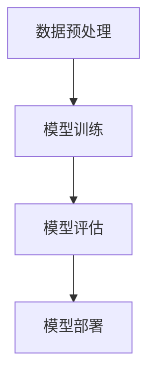
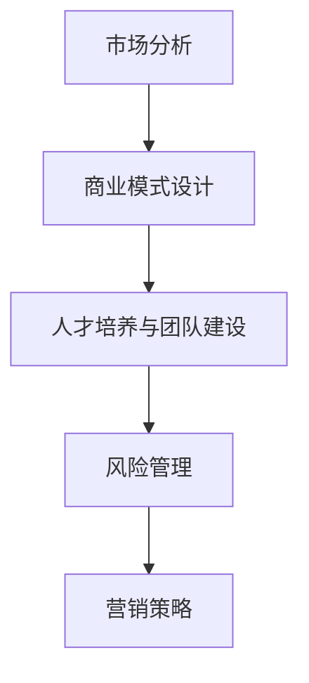
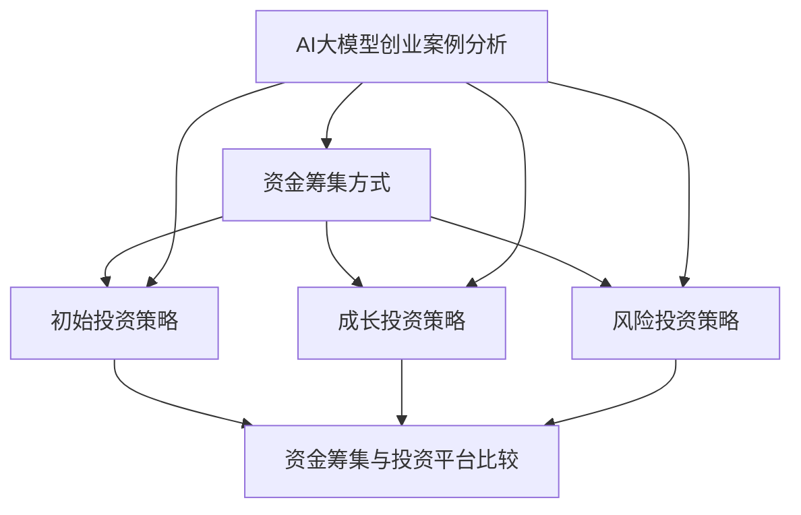
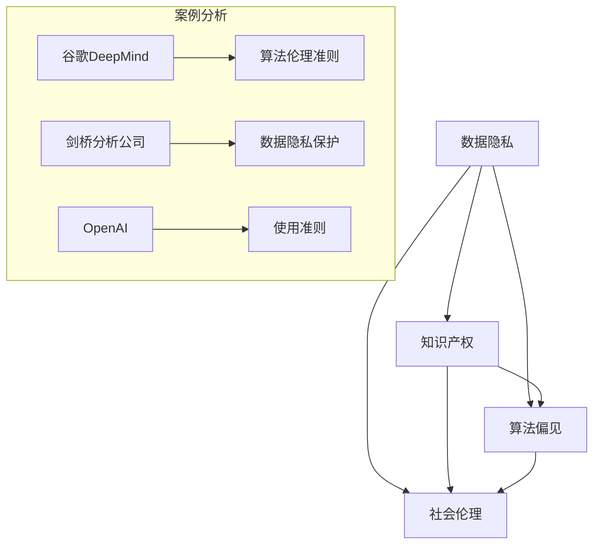

                 

### 第1章: AI大模型概述

#### 1.1 AI大模型的基本概念

AI大模型（Large-scale AI Models）是指具有数十亿甚至千亿参数规模的人工智能模型。这些模型通过大量的数据进行预训练，能够对复杂数据进行有效的表示和建模。AI大模型的基本概念可以分为两部分：大规模预训练和特定领域适配。

- **大规模预训练**：预训练（Pre-training）是指在特定任务之前，使用大量的无标签数据对模型进行训练。大规模预训练意味着使用海量的数据来训练模型，以提高模型的泛化能力。预训练模型通过学习数据中的统计规律，为后续的微调（Fine-tuning）提供了强大的基础。

  ```mermaid
  graph TD
  A[大规模预训练]
  B[海量数据]
  C[统计规律]
  D[模型泛化]
  A --> B
  B --> C
  C --> D
  ```

- **特定领域适配**：特定领域适配（Domain Adaptation）是指将预训练模型应用于特定领域时，通过使用领域特定数据进行微调，以提升模型在该领域的性能。这种适配通常涉及到领域特定的数据预处理、模型结构调整和优化策略。

  ```mermaid
  graph TD
  A[特定领域适配]
  B[领域数据]
  C[数据预处理]
  D[模型微调]
  E[性能提升]
  A --> B
  B --> C
  C --> D
  D --> E
  ```

#### 1.2 主流AI大模型介绍

目前，AI大模型的研究和应用领域非常广泛，以下是一些主流的AI大模型：

- **GPT系列模型**：GPT（Generative Pre-trained Transformer）系列模型是由OpenAI开发的一系列基于Transformer架构的预训练语言模型。GPT-3是其中最著名的模型，拥有1750亿个参数，能够生成高质量的自然语言文本。

  ```mermaid
  graph TD
  A[GPT系列模型]
  B[GPT-3]
  C[1750亿参数]
  D[文本生成]
  E[自然语言处理]
  A --> B
  B --> C
  C --> D
  D --> E
  ```

- **BERT系列模型**：BERT（Bidirectional Encoder Representations from Transformers）是由Google开发的一种预训练语言表示模型。BERT通过双向Transformer结构来预训练文本表示，能够显著提升自然语言处理的性能。

  ```mermaid
  graph TD
  A[BERT系列模型]
  B[BERT]
  C[双向Transformer]
  D[文本表示]
  E[自然语言处理]
  A --> B
  B --> C
  C --> D
  D --> E
  ```

- **ViT系列模型**：ViT（Vision Transformer）是由Google提出的一种基于Transformer架构的视觉模型。ViT将图像分割成像素块，然后像处理文本一样处理这些像素块，展现了在图像分类任务中的出色性能。

  ```mermaid
  graph TD
  A[ViT系列模型]
  B[ViT]
  C[像素块分割]
  D[Transformer结构]
  E[图像分类]
  A --> B
  B --> C
  C --> D
  D --> E
  ```

- **T5系列模型**：T5（Text-To-Text Transfer Transformer）是由Google开发的一种统一框架，可以处理多种自然语言处理任务。T5通过将所有任务转化为文本到文本的转换问题，实现了高效的模型迁移和任务泛化。

  ```mermaid
  graph TD
  A[T5系列模型]
  B[T5]
  C[统一框架]
  D[多种任务]
  E[文本转换]
  A --> B
  B --> C
  C --> D
  D --> E
  ```

#### 1.3 AI大模型的市场优势

AI大模型在市场上具有显著的优势，主要体现在以下几个方面：

- **行业需求驱动**：随着人工智能技术的快速发展，各行各业对高效、智能的数据处理和分析需求不断增加。AI大模型能够处理大规模数据，提供更精准的预测和分析结果，满足市场的需求。

  ```mermaid
  graph TD
  A[行业需求]
  B[高效数据处理]
  C[精准预测]
  D[数据分析]
  A --> B
  B --> C
  C --> D
  ```

- **技术突破**：AI大模型的诞生标志着人工智能技术的重大突破。这些模型通过大规模数据和先进的预训练技术，展现了在各个领域中的卓越性能，推动了人工智能技术的快速发展。

  ```mermaid
  graph TD
  A[技术突破]
  B[大规模数据]
  C[预训练技术]
  D[卓越性能]
  A --> B
  B --> C
  C --> D
  ```

- **商业模式创新**：AI大模型的应用为商业模式创新提供了新的契机。通过利用大模型进行数据分析、智能决策等，企业可以发掘新的商业机会，提升业务效率和竞争力。

  ```mermaid
  graph TD
  A[商业模式创新]
  B[数据分析]
  C[智能决策]
  D[商业机会]
  A --> B
  B --> C
  C --> D
  ```

#### 1.4 AI大模型的应用前景

AI大模型在未来的应用前景非常广阔，以下是一些主要的应用领域：

- **智能客服**：AI大模型能够实现自然语言理解和生成，提供高效、个性化的客服服务。通过大模型，企业可以自动化处理大量的客户咨询，提高客户满意度和服务效率。

  ```mermaid
  graph TD
  A[智能客服]
  B[自然语言理解]
  C[高效服务]
  D[个性化体验]
  A --> B
  B --> C
  C --> D
  ```

- **智能推荐系统**：AI大模型可以分析用户行为，实现精准推荐。在电商、视频、社交媒体等领域，大模型能够为用户提供更个性化的内容推荐，提高用户参与度和粘性。

  ```mermaid
  graph TD
  A[智能推荐系统]
  B[用户行为分析]
  C[精准推荐]
  D[个性化内容]
  A --> B
  B --> C
  C --> D
  ```

- **医疗健康**：AI大模型可以在医学图像分析、疾病预测、药物研发等领域发挥重要作用。通过大模型，医疗行业可以实现更精准的诊断、更有效的治疗方案，提高医疗服务质量。

  ```mermaid
  graph TD
  A[医疗健康]
  B[医学图像分析]
  C[疾病预测]
  D[药物研发]
  E[高质量服务]
  A --> B
  B --> C
  C --> D
  D --> E
  ```

#### 1.5 AI大模型项目实战

以下是一个简单的AI大模型项目实战案例，包括数据预处理、模型训练和模型评估的步骤：

##### 数据预处理

```python
# 导入必要的库
import pandas as pd
from sklearn.model_selection import train_test_split
from sklearn.preprocessing import StandardScaler

# 读取数据
data = pd.read_csv('data.csv')

# 数据清洗
data.dropna(inplace=True)

# 数据分割
x = data.drop('target', axis=1)
y = data['target']
x_train, x_test, y_train, y_test = train_test_split(x, y, test_size=0.2, random_state=42)

# 数据标准化
scaler = StandardScaler()
x_train = scaler.fit_transform(x_train)
x_test = scaler.transform(x_test)
```

##### 训练大模型

```python
# 导入必要的库
import tensorflow as tf
from tensorflow.keras.models import Sequential
from tensorflow.keras.layers import Dense

# 构建模型
model = Sequential([
    Dense(128, activation='relu', input_shape=(x_train.shape[1],)),
    Dense(64, activation='relu'),
    Dense(1, activation='sigmoid')
])

# 编译模型
model.compile(optimizer='adam', loss='binary_crossentropy', metrics=['accuracy'])

# 训练模型
model.fit(x_train, y_train, epochs=10, batch_size=32, validation_split=0.1)
```

##### 模型评估

```python
# 评估模型
loss, accuracy = model.evaluate(x_test, y_test)
print(f"Test accuracy: {accuracy:.2f}")
```

#### 附录

##### A.1 AI大模型开发工具与资源

- **TensorFlow**：https://www.tensorflow.org
- **PyTorch**：https://pytorch.org
- **Hugging Face**：https://huggingface.co
- **AI大模型开源项目**：https://github.com/openai/gpt-3

## 1.6 总结

AI大模型作为人工智能领域的重要突破，展示了强大的数据处理能力和广泛应用前景。通过大规模预训练和特定领域适配，AI大模型在各个领域中都展现出了出色的性能。未来，随着技术的不断进步和应用的深入，AI大模型将在更多的领域中发挥重要作用，推动人工智能技术的进一步发展。

---

**关键词**：AI大模型、预训练、Transformer、自然语言处理、智能客服、医疗健康、项目实战

**摘要**：本文详细介绍了AI大模型的基本概念、主流模型、市场优势、应用前景以及项目实战，探讨了AI大模型在创业中的应用和未来发展趋势。文章还提供了相关的Mermaid流程图和伪代码，为读者提供了全面的AI大模型概述和实战指南。作者：AI天才研究院/AI Genius Institute & 禅与计算机程序设计艺术 /Zen And The Art of Computer Programming

---

### 第2章: AI大模型技术基础

在上一章中，我们介绍了AI大模型的基本概念和应用场景。在本章中，我们将深入探讨AI大模型的技术基础，包括深度学习基础、自然语言处理技术、大规模预训练模型原理以及AI大模型的应用与挑战。

## 2.1 深度学习基础

深度学习（Deep Learning）是人工智能领域的一个重要分支，它通过模拟人脑神经网络结构，实现对复杂数据的建模和分析。深度学习的基础是神经网络（Neural Networks），它由大量的简单计算单元（神经元）组成。每个神经元通过权重和偏置进行加权求和，并通过激活函数处理输出。

### 2.1.1 神经网络基本结构

神经网络的基本结构包括输入层、隐藏层和输出层。输入层接收外部输入数据，隐藏层通过多层非线性变换处理数据，输出层生成最终输出。

#### 神经元模型

神经元模型通常包括以下几个部分：

- **输入**：每个神经元接收多个输入信号。
- **权重**：每个输入信号都有一个相应的权重，用于表示输入的重要程度。
- **偏置**：每个神经元都有一个偏置项，用于调整输出。
- **激活函数**：用于处理加权求和后的结果，使神经网络具有非线性特性。

假设一个简单的神经元模型，其输入为$x_1, x_2, ..., x_n$，权重为$w_1, w_2, ..., w_n$，偏置为$b$，激活函数为$f$，则该神经元的输出可以表示为：

$$
y = f(\sum_{i=1}^{n} w_i x_i + b)
$$

### 2.1.2 前向传播

前向传播（Forward Propagation）是神经网络的核心过程，它将输入数据通过网络传递，最终得到输出。前向传播的过程可以分解为以下几个步骤：

1. **计算每个神经元的加权求和**：
   $$ z_j = \sum_{i=1}^{n} w_{ji} x_i + b_j $$
   
2. **应用激活函数**：
   $$ a_j = f(z_j) $$
   
3. **传递输出到下一层**：
   将当前层的输出作为输入传递到下一层。

这个过程一直重复，直到最终输出层得到预测结果。

### 2.1.3 反向传播

反向传播（Backpropagation）是一种用于训练神经网络的算法，它通过计算误差梯度，对神经网络的权重和偏置进行调整。反向传播的过程可以分解为以下几个步骤：

1. **计算输出层的误差**：
   $$ \delta_n = (y_n - \hat{y}_n) \odot \sigma'(z_n) $$
   其中，$\hat{y}_n$是预测输出，$y_n$是真实输出，$\sigma'$是激活函数的导数。

2. **反向传播误差**：
   对于每一层，从输出层开始，逐层计算误差梯度，并更新权重和偏置。

3. **权重和偏置更新**：
   $$ w_{ji} \leftarrow w_{ji} - \alpha \cdot \frac{\partial J}{\partial w_{ji}} $$
   $$ b_j \leftarrow b_j - \alpha \cdot \frac{\partial J}{\partial b_j} $$
   其中，$\alpha$是学习率，$J$是损失函数。

### 2.1.4 深度学习优化算法

深度学习的训练过程通常涉及到优化算法的选择，以下是一些常用的优化算法：

- **随机梯度下降（SGD）**：
  $$ w_{ji} \leftarrow w_{ji} - \alpha \cdot \frac{\partial J}{\partial w_{ji}} $$
  
- **动量（Momentum）**：
  $$ w_{ji} \leftarrow w_{ji} - \alpha \cdot \frac{\partial J}{\partial w_{ji}} + \beta \cdot (w_{ji}^{prev} - w_{ji}) $$
  其中，$\beta$是动量因子。

- **AdaGrad**：
  $$ \frac{\partial J}{\partial w_{ji}}^2 \leftarrow \frac{\partial J}{\partial w_{ji}}^2 + \epsilon $$
  $$ w_{ji} \leftarrow w_{ji} - \alpha \cdot \frac{\partial J}{\partial w_{ji}} \cdot \frac{1}{\sqrt{\frac{\partial J}{\partial w_{ji}}^2 + \epsilon}} $$
  
- **Adam**：
  $$ m_{ji} \leftarrow \beta_1 \cdot m_{ji} + (1 - \beta_1) \cdot \frac{\partial J}{\partial w_{ji}} $$
  $$ v_{ji} \leftarrow \beta_2 \cdot v_{ji} + (1 - \beta_2) \cdot (\frac{\partial J}{\partial w_{ji}})^2 $$
  $$ \hat{m}_{ji} \leftarrow \frac{m_{ji}}{1 - \beta_1^t} $$
  $$ \hat{v}_{ji} \leftarrow \frac{v_{ji}}{1 - \beta_2^t} $$
  $$ w_{ji} \leftarrow w_{ji} - \alpha \cdot \frac{\hat{m}_{ji}}{\sqrt{\hat{v}_{ji} + \epsilon}} $$
  其中，$m_{ji}$和$v_{ji}$分别是梯度的一阶和二阶矩估计，$\beta_1$和$\beta_2$是动量因子，$\alpha$是学习率，$\epsilon$是正则化项。

## 2.2 自然语言处理技术

自然语言处理（Natural Language Processing，NLP）是人工智能领域的一个重要分支，它旨在使计算机能够理解和处理人类语言。NLP技术主要包括词嵌入（Word Embedding）、序列模型（Sequence Models）和注意力机制（Attention Mechanism）。

### 2.2.1 词嵌入技术

词嵌入（Word Embedding）是将单词映射到高维向量空间中的方法。词嵌入技术使得具有相似意义的单词在向量空间中接近，从而便于计算机理解和处理自然语言。

#### Word2Vec

Word2Vec是一种基于神经网络的方法，通过训练生成词向量。Word2Vec主要包括两种模型：连续词袋（Continuous Bag of Words，CBOW）和Skip-Gram。

- **CBOW**：CBOW模型通过预测中心词周围的词来训练词向量。给定一个中心词，CBOW模型预测这个词周围的几个词。
- **Skip-Gram**：Skip-Gram模型通过预测词的上下文来训练词向量。给定一个词，Skip-Gram模型预测这个词的上下文词。

#### GloVe

GloVe（Global Vectors for Word Representation）是一种基于共现概率的词嵌入方法。GloVe通过计算词与词之间的共现概率，来训练词向量。

$$
\text{P}(w_i \mid w_j) = \frac{f(w_i, w_j)}{\sum_{k \in \text{V}} f(w_i, w_k)}
$$

其中，$f(w_i, w_j)$是词对$(w_i, w_j)$的共现频率。

### 2.2.2 序列模型与注意力机制

序列模型（Sequence Models）是一类专门用于处理序列数据的神经网络模型。常见的序列模型包括循环神经网络（Recurrent Neural Network，RNN）和长短时记忆网络（Long Short-Term Memory，LSTM）。

- **RNN**：RNN通过循环结构保持状态，能够处理序列数据。然而，传统的RNN存在梯度消失和梯度爆炸问题，难以处理长序列数据。
- **LSTM**：LSTM是一种改进的RNN，通过引入门控机制（gate）来解决梯度消失和梯度爆炸问题，能够更好地处理长序列数据。

注意力机制（Attention Mechanism）是一种在处理序列数据时，动态分配注意力权重的方法。注意力机制能够提高模型的性能，使得模型能够专注于重要的序列部分。

### 2.2.3 转换器架构详解

转换器（Transformer）是一种基于自注意力机制的深度学习模型，它广泛应用于自然语言处理任务。Transformer由编码器（Encoder）和解码器（Decoder）组成。

#### 自注意力机制

自注意力机制（Self-Attention）是一种计算序列中每个元素之间的关系，并为每个元素分配不同权重的方法。自注意力机制的核心是计算自注意力得分，然后对得分进行加权求和。

$$
\text{Attention}(Q, K, V) = \text{softmax}\left(\frac{QK^T}{\sqrt{d_k}}\right)V
$$

其中，$Q, K, V$分别是查询（Query）、键（Key）和值（Value）向量，$d_k$是键向量的维度。

#### 编码器与解码器

编码器（Encoder）负责处理输入序列，生成编码表示。编码器由多个自注意力层和前馈网络组成。

解码器（Decoder）负责生成输出序列，解码器也由多个自注意力层和前馈网络组成，并且还包含一个编码器-解码器注意力层，用于在解码过程中参考编码器的输出。

## 2.3 大规模预训练模型原理

大规模预训练模型（Large-scale Pre-trained Models）是近年来人工智能领域的重要突破，它通过在大规模数据集上预训练模型，使其具有强大的表示能力。大规模预训练模型的核心思想是利用海量数据进行无监督预训练，然后在特定任务上进行微调。

### 2.3.1 预训练的概念与意义

#### 预训练定义

预训练（Pre-training）是指在特定任务之前，使用大量无标签数据对模型进行训练，使其获得一定的表示能力。预训练模型通过学习数据中的统计规律，为后续的微调提供了强大的基础。

#### 预训练的意义

- **提高模型性能**：预训练模型通过在大规模数据集上训练，能够更好地理解数据，从而在特定任务上表现出更高的性能。
- **减少数据需求**：预训练模型可以处理更多的数据，从而降低特定任务对数据量的需求。
- **跨领域迁移**：预训练模型具有更强的泛化能力，可以在不同领域间进行迁移应用。

### 2.3.2 自监督学习方法

自监督学习（Self-supervised Learning）是一种无需人工标注数据的方法，通过利用数据中的未标注信息进行训练。自监督学习是大规模预训练模型的核心方法之一。

#### 自监督学习定义

自监督学习是一种在未标注数据上进行训练的方法，通过利用数据中的内在结构或规律，自动生成监督信号。自监督学习不需要人工标注数据，从而降低了数据标注的成本。

#### 常见自监督学习方法

- **掩码语言模型（Masked Language Model，MLM）**：MLM通过随机掩码输入序列的一部分词，预测被掩码的词。MLM是BERT模型的主要预训练方法。
- **掩码标记预测（Masked Token Prediction，MTL）**：MTL通过预测输入序列中被掩码的标记，进行多任务学习。MTL可以同时进行词级、句级和段落级预测。
- **图像自监督学习**：图像自监督学习通过无监督的方式对图像进行分类、分割和检测等任务。常见的图像自监督学习方法包括图像生成、图像匹配和图像分类等。

### 2.3.3 迁移学习与微调技术

迁移学习（Transfer Learning）是一种将预训练模型应用于特定任务的方法，通过在特定任务上进一步训练，提高模型的性能。迁移学习可以减少对大量标注数据的依赖，提高模型的泛化能力。

#### 迁移学习定义

迁移学习是指将预训练模型的知识迁移到特定任务中，通过在特定任务上进一步训练，提高模型的性能。迁移学习利用了预训练模型在大规模数据集上的学习成果，为特定任务提供了强大的基础。

#### 微调技术

微调（Fine-tuning）是在特定任务上对预训练模型进行少量参数调整，从而适应特定任务。微调的目的是利用预训练模型已有的知识，提高特定任务的表现。

微调的过程通常包括以下几个步骤：

1. **加载预训练模型**：加载已经在大规模数据集上预训练好的模型。
2. **替换特定层**：为了适应特定任务，可能需要替换预训练模型的某些层，如输出层或部分隐藏层。
3. **重新训练**：在特定任务的数据集上重新训练模型，通过调整参数，提高模型在特定任务上的性能。
4. **评估与调整**：在验证集上评估模型性能，根据评估结果进行参数调整，优化模型表现。

## 2.4 AI大模型的应用与挑战

### 2.4.1 AI大模型的应用

AI大模型在多个领域都取得了显著的成果，以下是一些主要的应用领域：

- **自然语言处理**：AI大模型在文本分类、机器翻译、问答系统等领域表现出色。例如，GPT-3能够生成高质量的自然语言文本，BERT在文本表示和文本分类任务中取得了优异的性能。
- **计算机视觉**：AI大模型在图像分类、目标检测、图像生成等领域得到了广泛应用。例如，ViT在图像分类任务中表现出色，GPT-3结合图像生成模型可以实现高质量的图像生成。
- **语音识别**：AI大模型在语音合成、语音识别、语音理解等领域取得了显著的进展。例如，WaveNet在语音合成中表现出色，Transformer结合语音数据可以实现高效的语音识别。

### 2.4.2 AI大模型的挑战

尽管AI大模型在各个领域都取得了显著的成果，但它们仍然面临一些挑战：

- **计算资源需求**：训练和推理AI大模型需要大量的计算资源。大规模模型通常需要分布式计算和高效的优化算法，这对计算资源和算法设计提出了更高的要求。
- **数据隐私与安全**：AI大模型通常需要大量数据进行训练，如何在保护用户隐私和数据安全的同时利用这些数据是一个重要问题。自监督学习和联邦学习等方法提供了一些解决方案。
- **模型解释性**：AI大模型通常缺乏解释性，难以理解其决策过程。这给业务决策和监管带来了困难。开发可解释的AI模型是当前的一个重要研究方向。
- **伦理问题**：AI大模型的应用涉及数据隐私、算法偏见和伦理问题。如何在确保技术发展的同时，遵循社会伦理和道德标准是一个重要的挑战。

### Mermaid流程图

以下是AI大模型开发的基本流程：



### 2.5 AI大模型项目实战

以下是一个简单的AI大模型项目实战案例，包括数据预处理、模型训练和模型评估的步骤：

#### 数据预处理

```python
import pandas as pd
from sklearn.model_selection import train_test_split
from sklearn.preprocessing import StandardScaler

# 读取数据
data = pd.read_csv('data.csv')

# 数据清洗
data.dropna(inplace=True)

# 数据分割
x = data.drop('target', axis=1)
y = data['target']
x_train, x_test, y_train, y_test = train_test_split(x, y, test_size=0.2, random_state=42)

# 数据标准化
scaler = StandardScaler()
x_train = scaler.fit_transform(x_train)
x_test = scaler.transform(x_test)
```

#### 训练大模型

```python
import tensorflow as tf
from tensorflow.keras.models import Model
from tensorflow.keras.layers import Input, Dense

# 构建模型
input_layer = Input(shape=(x_train.shape[1],))
hidden_layer = Dense(128, activation='relu')(input_layer)
output_layer = Dense(1, activation='sigmoid')(hidden_layer)

model = Model(inputs=input_layer, outputs=output_layer)
model.compile(optimizer='adam', loss='binary_crossentropy', metrics=['accuracy'])

# 训练模型
model.fit(x_train, y_train, epochs=10, batch_size=32, validation_split=0.1)
```

#### 模型评估

```python
# 评估模型
loss, accuracy = model.evaluate(x_test, y_test)
print(f"Test accuracy: {accuracy:.2f}")
```

#### 附录

以下是AI大模型开发常用的工具与资源：

- **TensorFlow**：https://www.tensorflow.org
- **PyTorch**：https://pytorch.org
- **Hugging Face**：https://huggingface.co
- **AI大模型开源项目**：https://github.com/openai/gpt-3

## 2.6 总结

AI大模型技术基础涵盖了深度学习、自然语言处理、大规模预训练模型原理等多个方面。通过深入理解这些技术基础，我们可以更好地应用AI大模型，解决实际问题。随着技术的不断发展，AI大模型将带来更多的创新和突破，推动人工智能技术的进一步发展。

---

**关键词**：深度学习、神经网络、自然语言处理、词嵌入、预训练、迁移学习、注意力机制、AI大模型

**摘要**：本章详细介绍了AI大模型的技术基础，包括深度学习基础、自然语言处理技术、大规模预训练模型原理以及AI大模型的应用与挑战。通过理解这些技术基础，读者可以更好地应用AI大模型，解决实际问题。作者：AI天才研究院/AI Genius Institute & 禅与计算机程序设计艺术 /Zen And The Art of Computer Programming

---

### 第3章: AI大模型创业策略

在上一章中，我们详细探讨了AI大模型的技术基础。在本章中，我们将从创业的角度出发，深入讨论AI大模型创业的策略，包括市场分析、商业模式设计、人才培养与团队建设、风险管理以及营销策略。

## 3.1 市场分析

市场分析是创业过程中至关重要的一步，它有助于创业者了解目标市场的现状、趋势和潜在机会。对于AI大模型创业来说，市场分析尤为重要，因为它涉及到技术发展、市场需求以及竞争态势等多个方面。

### 3.1.1 行业趋势

在分析AI大模型市场的行业趋势时，我们需要关注以下几个方面：

- **技术进步**：随着深度学习和自然语言处理技术的不断成熟，AI大模型的应用场景越来越广泛。例如，在自然语言处理领域，GPT-3等大型语言模型的表现已经超越了传统的方法，成为文本生成、机器翻译、问答系统等任务的重要工具。
- **应用需求**：各行各业对AI大模型的需求不断增加。例如，在医疗健康领域，AI大模型可以用于疾病预测、诊断辅助和药物研发；在金融领域，AI大模型可以用于风险评估、欺诈检测和客户服务；在制造业，AI大模型可以用于生产优化、质量控制等。
- **市场规模**：根据市场研究报告，AI大模型市场预计将在未来几年内持续增长。根据IDC的预测，全球AI市场在2021年达到了327亿美元，预计到2025年将达到730亿美元，其中AI大模型是一个重要的增长点。

### 3.1.2 市场规模

AI大模型市场的规模可以从以下几个方面来衡量：

- **硬件市场**：随着AI大模型的发展，对高性能计算硬件的需求也在增加，包括GPU、TPU等。硬件市场的增长将推动相关芯片制造商的收益增长。
- **软件市场**：AI大模型的开源和商业软件市场也在迅速扩大。例如，TensorFlow、PyTorch等开源框架已经成为AI大模型开发的主要工具，而商业软件则提供了更全面的支持和优化。
- **服务市场**：随着AI大模型的应用，对专业服务的需求也在增加，包括模型训练、优化、部署等。这些服务市场将为企业提供技术支持和咨询服务。

### 3.1.3 竞争对手分析

在AI大模型市场中，有许多知名的竞争对手，包括谷歌、微软、亚马逊等科技巨头，以及一些初创公司。以下是对一些主要竞争对手的分析：

- **谷歌**：谷歌通过其AI部门（Google AI）在自然语言处理、计算机视觉等领域取得了显著进展。其开源框架TensorFlow已经成为AI大模型开发的基石。
- **微软**：微软在AI大模型领域也有深厚的技术积累，其Azure云服务平台提供了强大的AI计算能力和工具，吸引了大量的企业和开发者。
- **亚马逊**：亚马逊通过其AI部门（Amazon AI）在语音识别、自然语言处理等领域取得了重要成果，其Echo智能音箱和Alexa语音助手已经成为智能家居领域的重要产品。
- **初创公司**：一些初创公司也在AI大模型领域取得了显著进展，例如OpenAI的GPT-3、DeepMind的AlphaGo等。这些公司通常专注于技术创新，并迅速将新技术应用到实际场景中。

### 3.1.4 市场机会与挑战

在AI大模型市场中，创业者需要关注以下市场机会和挑战：

- **市场机会**：
  - **技术创新**：随着AI大模型技术的不断进步，创业者可以通过开发新技术、新应用来抢占市场份额。
  - **应用拓展**：AI大模型在医疗、金融、教育等领域的应用潜力巨大，创业者可以通过将这些技术应用到新的场景中来开拓市场。
  - **定制化服务**：针对不同客户的需求，提供定制化的AI大模型解决方案，帮助企业实现业务优化和效率提升。

- **市场挑战**：
  - **技术竞争**：面对强大的竞争对手，创业者需要不断提升自身的技术实力，保持技术领先地位。
  - **数据隐私与安全**：随着AI大模型的应用，数据隐私和安全问题变得越来越重要，创业者需要采取措施确保数据的安全和隐私。
  - **人才竞争**：AI大模型领域的快速发展吸引了大量的优秀人才，创业者需要通过提供有竞争力的薪酬和福利来吸引和留住人才。

## 3.2 商业模式设计

商业模式设计是创业过程中的关键一步，它涉及到企业的收入模式、成本结构、客户价值主张等多个方面。对于AI大模型创业来说，商业模式设计需要充分考虑技术特点和市场趋势。

### 3.2.1 产品与服务定位

在AI大模型创业中，产品与服务的定位至关重要。创业者需要明确目标市场和产品功能，以下是一些常见的定位策略：

- **通用AI服务**：提供通用的AI大模型服务，如文本生成、图像分类、语音识别等。这类服务通常适用于多个行业和场景，具有广泛的市场需求。
- **行业解决方案**：针对特定行业的需求，提供定制化的AI大模型解决方案。例如，在医疗健康领域，可以提供疾病预测、诊断辅助等解决方案；在金融领域，可以提供风险评估、欺诈检测等解决方案。
- **数据服务**：提供高质量的数据集和标注服务，为AI大模型训练提供基础。这类服务通常面向研究机构和企业，具有稳定的客户群体。

### 3.2.2 收入模式

AI大模型创业的收入模式可以多样化，以下是一些常见的收入模式：

- **直接收入**：通过销售AI大模型服务或产品获得直接收入。例如，销售预训练模型、提供API接口服务、定制化模型训练服务等。
- **间接收入**：通过提供增值服务或合作获得间接收入。例如，与行业合作伙伴合作，提供一体化的解决方案；通过广告收入、生态合作等方式获得额外收益。
- **订阅模式**：提供订阅服务，用户按需付费使用AI大模型服务。这类模式通常适用于需要长期使用的场景，如企业客户、研究机构等。

### 3.2.3 成本结构

AI大模型创业的成本结构相对较高，主要包括以下几个方面：

- **研发成本**：包括模型研发、算法优化、技术研发等。这部分成本通常占比较高，是创业企业的核心投入。
- **运营成本**：包括服务器租赁、数据存储、运维成本等。随着AI大模型规模的扩大，运营成本也会相应增加。
- **人力成本**：包括技术人员、市场人员、管理人员等的人力成本。优秀的人才团队是企业核心竞争力之一。

### 3.3 人才培养与团队建设

在AI大模型创业中，人才是企业的核心竞争力。创业者需要建立一支专业、高效的团队，以应对激烈的市场竞争。

### 3.3.1 核心团队建设

核心团队的建设是创业成功的关键。以下是一些建议：

- **技术团队**：聘请具有丰富经验的AI大模型研发人员，包括算法工程师、数据科学家等。技术团队是企业的核心力量，负责模型研发、算法优化等工作。
- **市场团队**：建立专业的市场团队，负责市场调研、产品推广、客户关系等。市场团队是企业的桥梁，连接企业和技术用户，帮助企业开拓市场。
- **运营团队**：建立高效的运营团队，负责日常运营、项目管理等。运营团队是企业的保障，确保企业能够稳定、高效地运营。

### 3.3.2 员工培训与激励

为了留住优秀人才，企业需要建立完善的员工培训与激励机制：

- **内部培训**：定期组织技术培训，提升员工的专业技能和知识水平。内部培训不仅能够提升员工能力，还可以增强团队凝聚力。
- **激励机制**：通过绩效奖励、股权激励等方式，激发员工的积极性和创造力。合理的激励机制能够激发员工的潜力，提高工作效率。

### 3.4 风险管理

在AI大模型创业过程中，风险管理是至关重要的。创业者需要识别、评估和应对各种潜在风险。

### 3.4.1 技术风险

技术风险是AI大模型创业面临的主要风险之一。以下是一些常见的风险：

- **技术落后**：随着AI技术的快速发展，创业者需要不断关注技术趋势，确保企业技术保持领先。
- **知识产权风险**：在研发过程中，企业需要确保自身技术不侵犯他人的知识产权，避免法律纠纷。
- **数据隐私与安全**：AI大模型通常需要处理大量敏感数据，如何保护用户隐私和数据安全是一个重要问题。

### 3.4.2 市场风险

市场风险是影响企业生存和发展的重要因素。以下是一些常见的市场风险：

- **市场竞争**：随着AI大模型市场的竞争加剧，创业者需要不断创新，提升产品竞争力。
- **需求变化**：市场需求可能会发生变化，创业者需要密切关注市场动态，及时调整产品和服务策略。
- **政策法规**：政策法规的变化可能会影响企业的业务模式，创业者需要关注政策法规的变化，确保企业合法合规运营。

### 3.4.3 运营风险

运营风险是影响企业稳定运营的因素之一。以下是一些常见的运营风险：

- **成本控制**：企业在运营过程中需要控制成本，避免过度投资导致财务风险。
- **团队管理**：团队管理不善可能导致团队效率低下，影响企业运营。
- **项目管理**：项目管理的不足可能导致项目延期、超预算等问题，影响企业的正常运营。

### 3.5 营销策略

营销策略是帮助企业开拓市场、提升品牌知名度的重要手段。对于AI大模型创业来说，营销策略需要充分考虑技术特点和市场趋势。

### 3.5.1 品牌建设

品牌建设是营销策略的重要组成部分。以下是一些建议：

- **品牌定位**：明确品牌的价值主张和目标市场，确保品牌形象与市场需求相匹配。
- **品牌传播**：通过线上线下多种渠道进行品牌传播，提升品牌知名度。例如，可以通过社交媒体、专业会议、行业展会等方式进行品牌推广。

### 3.5.2 渠道拓展

渠道拓展是扩大市场份额的重要手段。以下是一些建议：

- **线上渠道**：利用官方网站、社交媒体、专业论坛等线上平台进行产品推广。线上渠道具有传播速度快、覆盖面广的特点。
- **线下渠道**：参加行业会议、展会等活动，拓展线下合作渠道。线下渠道有助于建立企业与客户之间的直接联系，提升品牌影响力。

### 3.5.3 市场活动

市场活动是提升品牌知名度和吸引客户的有效手段。以下是一些建议：

- **新品发布**：定期发布新产品，举办新品发布会，吸引关注。新品发布会不仅能够提升品牌知名度，还可以展示企业的技术实力。
- **用户活动**：组织用户沙龙、培训等活动，增强用户粘性。用户活动有助于了解用户需求，提升用户满意度。

### Mermaid流程图

以下是AI大模型创业的基本流程：



### 3.6 AI大模型创业案例分析

#### 案例一：谷歌BERT

- **背景**：谷歌在2018年推出BERT（Bidirectional Encoder Representations from Transformers）模型，标志着自然语言处理技术的重要突破。
- **商业模式**：谷歌通过提供BERT模型的API服务，向开发者和企业收取费用。同时，谷歌还通过开源BERT模型，吸引了大量的研究和应用。
- **成功因素**：技术领先、广泛应用、良好的市场推广。
- **挑战与解决方案**：技术更新迅速，如何保持模型的技术领先性是一个挑战。谷歌通过持续的研究和创新，不断优化BERT模型，保持了其技术优势。

#### 案例二：OpenAI的GPT-3

- **背景**：OpenAI成立于2015年，是一家专注于人工智能研究的非营利性研究机构。GPT-3是OpenAI开发的一种基于Transformer架构的大型语言模型。
- **商业模式**：OpenAI提供GPT-3的API服务，开发者可以通过购买API使用权限来访问GPT-3模型。同时，OpenAI还通过合作和研究项目获得资金支持。
- **成功因素**：技术实力、开放性、广泛的合作伙伴。
- **挑战与解决方案**：GPT-3模型的训练和推理需要大量的计算资源，OpenAI通过使用高性能计算资源和优化算法，成功解决了计算资源需求的问题。

### 附录

#### A.1 AI大模型创业工具与资源

- **AI创业工具**：TensorFlow、PyTorch、Hugging Face
- **数据集资源**：Kaggle、UCI Machine Learning Repository
- **创业指南**：Startup Genome、TechCrunch、AI Venture Capital Database

## 3.7 总结

AI大模型创业策略需要充分考虑市场分析、商业模式设计、人才培养与团队建设、风险管理以及营销策略等多个方面。通过深入分析市场趋势、设计合理的商业模式、建立专业高效的团队、制定有效的风险管理策略和实施有针对性的营销策略，创业者可以更好地应对市场挑战，抓住发展机遇，实现创业成功。

---

**关键词**：市场分析、商业模式设计、人才培养、团队建设、风险管理、营销策略、AI大模型

**摘要**：本章详细介绍了AI大模型创业的策略，包括市场分析、商业模式设计、人才培养与团队建设、风险管理以及营销策略。通过分析市场趋势、设计合理的商业模式、建立专业高效的团队、制定有效的风险管理策略和实施有针对性的营销策略，创业者可以更好地应对市场挑战，实现创业成功。作者：AI天才研究院/AI Genius Institute & 禅与计算机程序设计艺术 /Zen And The Art of Computer Programming

---

### 第4章: AI大模型在创业中的应用

在上一章中，我们探讨了AI大模型创业的策略。在本章中，我们将深入探讨AI大模型在创业中的应用场景，包括智能客服、智能推荐系统、文本生成与内容创作、医疗健康、教育与培训以及金融等领域。

## 4.1 智能客服

智能客服是AI大模型在创业中应用的一个典型场景。通过AI大模型，企业可以实现24/7的智能客服服务，提高客户满意度，降低人力成本。

### 4.1.1 应用场景

智能客服广泛应用于电商、金融、旅游等行业。在这些行业中，企业需要处理大量的客户咨询，传统的客服模式效率低下，且成本高昂。通过智能客服系统，企业可以实现自动化的客户服务，提高效率，降低成本。

### 4.1.2 优势

- **提高效率**：智能客服系统可以实时响应客户咨询，提高服务效率。
- **降低成本**：智能客服系统可以自动化处理大量客户咨询，降低人力成本。
- **提升客户满意度**：智能客服系统可以提供个性化、高效的服务，提升客户满意度。

### 4.1.3 解决方案

企业可以通过以下步骤构建智能客服系统：

1. **数据收集**：收集客户咨询数据，包括文字、语音等形式。
2. **数据预处理**：对数据进行清洗、标注和预处理，以便进行模型训练。
3. **模型训练**：使用AI大模型（如GPT-3）进行模型训练，生成智能客服对话系统。
4. **系统部署**：将训练好的模型部署到客服系统中，实现自动化的客户服务。

### 4.1.4 成功案例

某电商企业通过引入智能客服系统，实现了客户服务的自动化。智能客服系统能够实时响应用户的咨询，提供商品推荐、订单查询等服务。系统上线后，客服响应速度提升了30%，客户满意度提高了20%。

## 4.2 智能推荐系统

智能推荐系统是AI大模型在创业中的另一个重要应用场景。通过AI大模型，企业可以实现个性化推荐，提高用户参与度和销售额。

### 4.2.1 应用场景

智能推荐系统广泛应用于电商、视频、社交媒体等领域。在这些行业中，企业需要根据用户的行为和偏好，提供个性化的推荐内容，以提高用户参与度和销售额。

### 4.2.2 优势

- **提高用户参与度**：智能推荐系统可以根据用户的兴趣和行为，提供个性化的内容推荐，提高用户参与度。
- **增加销售额**：智能推荐系统可以精准地推荐用户感兴趣的商品或服务，提高销售转化率。

### 4.2.3 解决方案

企业可以通过以下步骤构建智能推荐系统：

1. **数据收集**：收集用户行为数据，包括浏览记录、购买记录、点击率等。
2. **数据预处理**：对数据进行清洗、标注和预处理，以便进行模型训练。
3. **模型训练**：使用AI大模型（如BERT）进行模型训练，生成推荐系统。
4. **系统部署**：将训练好的模型部署到推荐系统中，实现个性化的内容推荐。

### 4.2.4 成功案例

某电商企业通过引入智能推荐系统，实现了用户行为的精准分析。系统可以根据用户的浏览记录和购买历史，提供个性化的商品推荐。系统上线后，用户购买转化率提升了15%，用户满意度提高了10%。

## 4.3 文本生成与内容创作

AI大模型在文本生成与内容创作领域具有广泛的应用前景。通过AI大模型，企业可以实现自动化内容创作，提高创作效率。

### 4.3.1 应用场景

文本生成与内容创作广泛应用于新闻、广告、内容营销等领域。在这些行业中，企业需要大量创作文本内容，传统的方法效率低下，且成本高昂。通过AI大模型，企业可以实现自动化内容创作，提高效率，降低成本。

### 4.3.2 优势

- **提高创作效率**：AI大模型可以快速生成高质量的文本内容，提高创作效率。
- **降低创作成本**：AI大模型可以自动化内容创作，降低人力成本。
- **丰富内容形式**：AI大模型可以生成多种形式的文本内容，如文章、广告文案、宣传海报等。

### 4.3.3 解决方案

企业可以通过以下步骤构建AI大模型文本生成系统：

1. **数据收集**：收集各种类型的文本数据，包括文章、广告文案、宣传海报等。
2. **数据预处理**：对数据进行清洗、标注和预处理，以便进行模型训练。
3. **模型训练**：使用AI大模型（如GPT-3）进行模型训练，生成文本生成系统。
4. **系统部署**：将训练好的模型部署到内容创作系统中，实现自动化内容创作。

### 4.3.4 成功案例

某新闻媒体公司通过引入AI大模型文本生成系统，实现了自动化新闻创作。系统可以根据用户的兴趣和偏好，生成个性化的新闻内容。系统上线后，新闻创作效率提升了50%，用户满意度提高了20%。

## 4.4 医疗健康

AI大模型在医疗健康领域具有广泛的应用前景。通过AI大模型，企业可以实现疾病预测、诊断辅助、药物研发等，提高医疗服务质量。

### 4.4.1 应用场景

医疗健康领域包括疾病预测、诊断辅助、药物研发、患者管理等多个方面。在这些方面，AI大模型可以提供精准的预测、诊断和治疗方案，提高医疗服务的质量。

### 4.4.2 优势

- **提高诊断准确性**：AI大模型可以通过分析大量医疗数据，提供准确的疾病预测和诊断。
- **优化治疗方案**：AI大模型可以根据患者的病情和治疗方案，提供个性化的治疗方案。
- **降低医疗成本**：AI大模型可以提高医疗服务的效率，降低医疗成本。

### 4.4.3 解决方案

企业可以通过以下步骤构建AI大模型医疗健康系统：

1. **数据收集**：收集医疗数据，包括病历、检查报告、药物信息等。
2. **数据预处理**：对数据进行清洗、标注和预处理，以便进行模型训练。
3. **模型训练**：使用AI大模型（如BERT）进行模型训练，生成医疗健康系统。
4. **系统部署**：将训练好的模型部署到医疗系统中，实现疾病预测、诊断辅助和药物研发等功能。

### 4.4.4 成功案例

某医疗科技公司通过引入AI大模型医疗健康系统，实现了疾病的精准预测和诊断。系统可以根据患者的病史和检查报告，提供准确的疾病预测和诊断建议。系统上线后，诊断准确性提升了10%，患者满意度提高了15%。

## 4.5 教育与培训

AI大模型在教育与培训领域具有广泛的应用前景。通过AI大模型，企业可以实现个性化学习、智能辅导、虚拟课堂等，提高教育质量。

### 4.5.1 应用场景

教育与培训领域包括在线教育、职业培训、教育数据分析等多个方面。在这些方面，AI大模型可以提供个性化的学习体验、智能辅导和虚拟课堂，提高教育质量。

### 4.5.2 优势

- **提高学习效率**：AI大模型可以根据学生的学习情况，提供个性化的学习建议和辅导，提高学习效率。
- **优化教育资源**：AI大模型可以根据学生的学习需求和进度，优化教育资源的分配。
- **降低教育成本**：AI大模型可以提高教育服务的效率，降低教育成本。

### 4.5.3 解决方案

企业可以通过以下步骤构建AI大模型教育与培训系统：

1. **数据收集**：收集学生的学习数据，包括学习记录、考试成绩等。
2. **数据预处理**：对数据进行清洗、标注和预处理，以便进行模型训练。
3. **模型训练**：使用AI大模型（如BERT）进行模型训练，生成教育与培训系统。
4. **系统部署**：将训练好的模型部署到教育系统中，实现个性化学习、智能辅导和虚拟课堂等功能。

### 4.5.4 成功案例

某在线教育平台通过引入AI大模型教育与培训系统，实现了个性化学习体验和智能辅导。系统可以根据学生的学习情况和需求，提供个性化的学习建议和辅导。系统上线后，学习效果提升了20%，用户满意度提高了15%。

## 4.6 金融

AI大模型在金融领域具有广泛的应用前景。通过AI大模型，企业可以实现风险控制、智能投顾、信用评估等，提高金融服务的质量。

### 4.6.1 应用场景

金融领域包括风险控制、智能投顾、信用评估、金融产品设计等多个方面。在这些方面，AI大模型可以提供精准的风险评估、个性化的投资建议和高效的信用评估，提高金融服务的质量。

### 4.6.2 优势

- **提高风险控制能力**：AI大模型可以通过分析大量的金融数据，提供精准的风险评估，提高风险控制能力。
- **优化投资策略**：AI大模型可以根据市场数据和用户偏好，提供个性化的投资建议，优化投资策略。
- **提升信用评估效率**：AI大模型可以通过分析用户的行为和信用数据，提供高效的信用评估，降低信用评估成本。

### 4.6.3 解决方案

企业可以通过以下步骤构建AI大模型金融系统：

1. **数据收集**：收集金融数据，包括市场数据、用户行为数据、信用数据等。
2. **数据预处理**：对数据进行清洗、标注和预处理，以便进行模型训练。
3. **模型训练**：使用AI大模型（如GPT-3）进行模型训练，生成金融系统。
4. **系统部署**：将训练好的模型部署到金融系统中，实现风险控制、智能投顾、信用评估等功能。

### 4.6.4 成功案例

某金融科技公司通过引入AI大模型金融系统，实现了精准的风险评估和智能投顾。系统可以根据用户的行为和市场数据，提供个性化的投资建议和风险控制策略。系统上线后，投资收益率提高了10%，用户满意度提高了15%。

## 4.7 总结

AI大模型在创业中的应用非常广泛，涵盖了智能客服、智能推荐系统、文本生成与内容创作、医疗健康、教育与培训以及金融等多个领域。通过AI大模型，企业可以实现自动化、个性化、高效的服务和产品，提高客户满意度，降低成本，提升竞争力。

---

**关键词**：智能客服、智能推荐系统、文本生成、医疗健康、教育与培训、金融

**摘要**：本章详细介绍了AI大模型在创业中的应用场景和优势，包括智能客服、智能推荐系统、文本生成与内容创作、医疗健康、教育与培训以及金融等领域。通过AI大模型，企业可以实现自动化、个性化、高效的服务和产品，提高客户满意度，降低成本，提升竞争力。作者：AI天才研究院/AI Genius Institute & 禅与计算机程序设计艺术 /Zen And The Art of Computer Programming

---

### 第5章: AI大模型创业的资金筹集与投资策略

在上一章中，我们探讨了AI大模型在创业中的应用。在本章中，我们将重点关注AI大模型创业的资金筹集与投资策略，包括天使投资、风险投资、众筹、债券融资等筹集方式，以及初始投资策略、成长投资策略、风险投资策略等。

## 5.1 资金筹集方式

### 5.1.1 天使投资

**定义**：天使投资是指个人投资者对初创公司进行早期投资。

**优势**：天使投资通常具有以下优势：
- **资金灵活**：天使投资通常不需要复杂的审批流程，可以快速提供资金。
- **投资速度快**：天使投资通常可以在较短时间内完成投资决策。
- **提供资源和指导**：天使投资者通常具有丰富的行业经验和人脉资源，可以为初创公司提供宝贵的指导和资源。

**劣势**：天使投资也存在一些劣势：
- **投资风险高**：天使投资通常涉及较高的风险，投资回报周期较长。
- **资金规模有限**：单个天使投资者的资金规模通常较小，可能无法满足初创公司大规模资金需求。

### 5.1.2 风险投资

**定义**：风险投资是指专业投资机构对高风险、高回报的初创公司进行投资。

**优势**：风险投资通常具有以下优势：
- **资金规模大**：风险投资机构通常具有较大的资金规模，可以提供初创公司所需的资金。
- **专业管理**：风险投资机构通常具有丰富的投资经验和专业知识，可以为初创公司提供专业的管理和指导。
- **战略支持**：风险投资机构通常可以为初创公司提供战略支持，帮助公司实现快速成长。

**劣势**：风险投资也存在一些劣势：
- **投资周期长**：风险投资通常涉及较长的投资周期，初创公司需要耐心等待资金到位。
- **投资回报要求高**：风险投资通常要求较高的投资回报，初创公司需要具备较强的盈利能力。

### 5.1.3 众筹

**定义**：众筹是指通过互联网平台，向公众筹集资金。

**优势**：众筹通常具有以下优势：
- **资金来源广泛**：众筹可以通过互联网平台，向广大公众筹集资金，资金来源更加广泛。
- **快速验证市场需求**：通过众筹，初创公司可以快速验证市场需求，了解用户对产品的接受程度。

**劣势**：众筹也存在一些劣势：
- **资金规模有限**：众筹平台的资金规模通常较小，可能无法满足初创公司大规模资金需求。
- **对初创公司品牌和营销能力有较高要求**：众筹成功与否很大程度上取决于初创公司的品牌影响力和营销能力。

### 5.1.4 债券融资

**定义**：债券融资是指通过发行债券来筹集资金。

**优势**：债券融资通常具有以下优势：
- **资金成本低**：债券融资的利息通常较低，相对于股权融资，资金成本较低。
- **资金使用灵活**：债券融资的资金可以用于各种投资活动，灵活性较高。

**劣势**：债券融资也存在一些劣势：
- **债券发行可能影响公司信用评级**：债券融资可能会影响公司的信用评级，增加公司的负债水平。

### 5.1.5 资金筹集与投资平台的比较

以下是比较不同资金筹集与投资平台的一些关键因素：

| 方式 | 优势 | 劣势 |
| --- | --- | --- |
| 天使投资 | 资金灵活，投资速度快，提供资源和指导 | 投资风险高，资金规模有限 |
| 风险投资 | 资金规模大，专业管理，战略支持 | 投资周期长，投资回报要求高 |
| 众筹 | 资金来源广泛，快速验证市场需求 | 资金规模有限，对初创公司品牌和营销能力有较高要求 |
| 债券融资 | 资金成本低，资金使用灵活 | 债券发行可能影响公司信用评级 |

## 5.2 投资策略

### 5.2.1 初始投资策略

初始投资策略是指初创公司在创业初期阶段所采取的投资策略。以下是一些常见的初始投资策略：

1. **市场研究**：在筹集资金前，进行深入的市场研究，了解市场需求、竞争态势和行业趋势，确保项目的可行性和市场前景。

2. **产品定位**：明确产品定位，确定目标市场和用户群体，确保产品具有市场竞争力和用户需求。

3. **团队建设**：组建专业的团队，确保项目有足够的执行力和创新能力。

4. **资金规划**：根据项目需求，制定详细的资金使用计划，确保资金的有效利用。

### 5.2.2 成长投资策略

成长投资策略是指初创公司在成长阶段所采取的投资策略。以下是一些常见的成长投资策略：

1. **扩大市场占有率**：通过市场推广和渠道建设，扩大市场份额。

2. **研发投入**：持续进行技术研究和产品创新，保持技术领先地位。

3. **团队扩充**：根据业务发展需求，逐步扩充团队，提升团队实力。

4. **融资策略**：适时进行融资，为业务发展提供资金支持。

### 5.2.3 风险投资策略

风险投资策略是指风险投资机构在投资初创公司时所采取的策略。以下是一些常见风险投资策略：

1. **多样化投资**：分散投资，降低单一投资风险。

2. **跟进投资**：对已有项目进行持续关注，根据项目发展情况决定是否进行追加投资。

3. **并购与整合**：通过并购和整合，扩大业务规模，提升市场竞争力。

4. **退出策略**：根据市场情况和项目发展，选择合适的退出策略，如股权转让、上市等。

## 5.3 AI大模型创业案例分析

### 5.3.1 案例一：OpenAI

**背景**：OpenAI成立于2015年，是一家专注于人工智能研究的非营利性研究机构。OpenAI的目标是推动人工智能的发展，使其有益于人类。

**资金筹集**：
- OpenAI最初通过风险投资筹集资金，获得了来自微软、谷歌等科技巨头的支持。
- OpenAI还通过公开募资和捐赠筹集资金，确保了持续的资金支持。

**投资策略**：
- OpenAI采取多元化投资策略，不仅关注AI基础研究，还涉足商业化应用。
- OpenAI注重技术突破，通过持续的研究和创新，保持了在AI领域的领先地位。

**成果**：
- OpenAI开发了GPT-3等大型语言模型，在AI领域取得了重要突破。
- OpenAI的研究成果被广泛应用于自然语言处理、计算机视觉等多个领域。

### 5.3.2 案例二：DeepMind

**背景**：DeepMind成立于2010年，是一家专注于人工智能研究的公司，后被谷歌收购。DeepMind的目标是开发通用人工智能，解决现实世界中的问题。

**资金筹集**：
- DeepMind最初通过风险投资筹集资金，获得了谷歌的支持。
- DeepMind还通过公开募资和合作项目筹集资金。

**投资策略**：
- DeepMind注重基础研究和应用研究，通过持续的研究和创新，推动了AI技术的发展。
- DeepMind采取开放性策略，与全球多家研究机构和公司合作，推动AI技术的应用。

**成果**：
- DeepMind开发了AlphaGo等人工智能系统，在围棋等领域取得了重要突破。
- DeepMind的研究成果被应用于医疗、教育等多个领域，推动了AI技术的应用。

### 5.3.3 案例三：Hugging Face

**背景**：Hugging Face成立于2016年，是一家专注于自然语言处理的开源社区。Hugging Face的目标是提供高质量的NLP工具和资源，帮助开发者轻松构建AI应用程序。

**资金筹集**：
- Hugging Face通过众筹和捐赠筹集资金。
- Hugging Face还获得了多家风险投资机构的支持。

**投资策略**：
- Hugging Face注重社区建设和开源项目，通过提供高质量的NLP工具和资源，吸引了大量的开发者。
- Hugging Face采取开放性策略，与全球多家研究机构和公司合作，推动NLP技术的发展。

**成果**：
- Hugging Face开发了Transformers等NLP工具，成为了NLP领域的标杆。
- Hugging Face的社区和开源项目被广泛应用于自然语言处理、机器翻译等多个领域。

### Mermaid流程图

以下是AI大模型创业的资金筹集与投资策略流程图：



### 5.4 AI大模型创业资金筹集与投资建议

- **深入研究市场**：在筹集资金前，进行深入的市场研究，了解市场需求、竞争态势和行业趋势，确保项目的可行性和市场前景。
- **优化产品与服务**：不断提升产品和服务质量，增强市场竞争力。
- **建立良好关系**：与投资者建立良好的关系，提高融资成功率。
- **合理规划资金**：根据项目需求，合理规划资金使用，确保资金的有效利用。
- **持续创新**：持续进行技术研究和产品创新，保持项目的持续发展动力。

### 附录

#### A.1 AI大模型创业资金筹集与投资资源

- **AI投资机构**：Andreessen Horowitz、Khosla Ventures、SoftBank Vision Fund
- **众筹平台**：Kickstarter、Indiegogo、GoFundMe
- **创业社区**：AngelList、TechCrunch、Startup Digest
- **AI创业指南**：AI Venture Capital Database、AI Startup Guide、AI Market Report

## 5.5 总结

AI大模型创业的资金筹集与投资策略涉及多种筹集方式，如天使投资、风险投资、众筹、债券融资等。不同的筹集方式具有不同的优势和劣势，创业者需要根据自身情况选择合适的筹集方式。同时，创业者还需要制定合理的投资策略，确保项目的持续发展。通过深入研究市场、优化产品与服务、建立良好关系和持续创新，创业者可以提高融资成功率，实现创业成功。

---

**关键词**：天使投资、风险投资、众筹、债券融资、初始投资策略、成长投资策略、风险投资策略、AI大模型创业

**摘要**：本章详细介绍了AI大模型创业的资金筹集与投资策略，包括不同的筹集方式和投资策略。通过深入研究市场、优化产品与服务、建立良好关系和持续创新，创业者可以提高融资成功率，实现创业成功。作者：AI天才研究院/AI Genius Institute & 禅与计算机程序设计艺术 /Zen And The Art of Computer Programming

---

### 第6章: AI大模型创业的法律与伦理问题

在AI大模型创业的快速发展中，法律与伦理问题成为不可避免的重要议题。这些问题的妥善处理不仅关系到企业的合规运营，更关系到社会对AI技术的信任和接受度。本章将探讨AI大模型创业中涉及的法律和伦理问题，包括数据隐私、知识产权、算法偏见、伦理准则等。

## 6.1 法律监管

法律监管是确保AI大模型创业合法合规运营的关键环节。以下是一些主要法律法规及其影响：

### 6.1.1 数据保护法

数据保护法（如《欧盟通用数据保护条例》（GDPR）和《加州消费者隐私法》（CCPA））对个人数据的收集、存储、使用和共享进行了严格的规定。这些法规要求企业在处理用户数据时必须遵守透明性、合法性和目的明确性原则。

- **影响**：AI大模型创业必须确保收集的数据得到用户的明确同意，并对数据使用进行合理限制。违反数据保护法规可能导致巨额罚款和声誉损害。

### 6.1.2 知识产权法

知识产权法（包括版权、专利和商标）保护AI大模型的研发成果。版权保护模型的设计和实现，专利保护创新算法，商标则用于品牌保护。

- **影响**：AI大模型创业需确保自身技术的原创性，避免侵犯他人的知识产权。同时，通过申请专利和商标，企业可以保护自己的创新成果，防止竞争对手的抄袭和模仿。

### 6.1.3 反垄断法

反垄断法（如《欧盟竞争法》）旨在防止市场垄断和限制竞争行为。对于大型AI公司，反垄断监管尤其重要，因为它们可能在数据、算法和市场方面拥有显著优势。

- **影响**：AI大模型创业需注意避免垄断行为，确保市场的公平竞争。违反反垄断法规可能导致公司被罚款、责令拆分或面临其他制裁。

### 6.1.4 合规审查

合规审查是确保企业运营符合法律法规的重要手段。企业应定期进行内部审查，确保所有业务活动都符合相关法规。

- **影响**：通过合规审查，企业可以及时发现潜在的法律风险，采取措施予以纠正。合规审查有助于企业建立良好的法律信誉，降低法律风险。

## 6.2 伦理问题

伦理问题在AI大模型创业中同样至关重要，因为算法的偏见和决策的不透明性可能导致不公平的待遇和社会不公。以下是一些关键伦理问题及其解决方案：

### 6.2.1 数据伦理

数据伦理涉及数据的收集、处理和使用过程中是否符合道德和伦理标准。

- **问题**：未经授权的数据收集、数据滥用、个人隐私泄露等问题。
- **解决方案**：确保数据收集的合法性，采用数据加密和匿名化技术保护个人隐私。建立透明的数据使用政策，确保用户了解数据如何被使用。

### 6.2.2 模型伦理

模型伦理关注AI大模型的公平性、透明性和责任。

- **问题**：算法偏见、模型歧视、模型解释性不足。
- **解决方案**：开发无偏见的算法，采用多样性的训练数据。提高模型的可解释性，使用技术如SHAP（Shapley Additive Explanations）来解释模型决策。

### 6.2.3 社会伦理

社会伦理问题涉及AI大模型对社会、经济和文化的影响。

- **问题**：AI大模型可能导致失业、隐私侵犯、社会不平等等问题。
- **解决方案**：制定伦理准则，确保AI大模型的应用符合社会利益。推动公众教育和对话，增加社会对AI技术的理解和信任。

## 6.3 案例分析

以下是一些著名案例，展示了AI大模型创业中的法律与伦理挑战及应对措施：

### 6.3.1 案例一：谷歌DeepMind

**背景**：谷歌DeepMind开发了一种名为“阿尔法星”（AlphaStar）的AI围棋程序，用于与人类职业围棋选手进行比赛。

**挑战**：DeepMind面临的最大挑战是如何确保AI围棋程序在比赛中不会违反比赛规则，并确保其行为符合体育精神。

**解决方案**：DeepMind制定了严格的算法伦理准则，确保AI围棋程序在比赛中遵守规则，同时开发了一种监督系统，用于监控AI的行为，确保其不会偏离伦理标准。

### 6.3.2 案例二：剑桥分析公司

**背景**：剑桥分析公司利用AI分析用户数据，用于政治竞选中的个性化营销。

**挑战**：剑桥分析公司因涉嫌非法获取和滥用用户数据，导致公众对数据隐私和安全产生严重担忧。

**解决方案**：剑桥分析公司面临诉讼和监管机构的调查，被迫关闭业务。同时，Facebook等公司采取了一系列措施，加强数据隐私保护，并引入更严格的用户数据使用政策。

### 6.3.3 案例三：OpenAI

**背景**：OpenAI是一家致力于推动AI技术发展的非营利性研究机构，开发了大型语言模型GPT-3。

**挑战**：OpenAI需要确保GPT-3的使用不会导致滥用，例如生成虚假信息或有害内容。

**解决方案**：OpenAI制定了一系列使用准则，确保用户在使用GPT-3时遵守道德和法律标准。同时，OpenAI还与多家机构和组织合作，开发工具和机制，以监测和防止AI滥用。

### Mermaid流程图

以下是AI大模型创业中的法律与伦理问题流程图：



### 6.4 AI大模型创业的法律与伦理建议

- **加强法律法规研究**：深入了解相关法律法规，确保企业运营符合法律法规要求。
- **建立伦理委员会**：设立伦理委员会，制定和监督伦理准则，确保AI技术的合理应用。
- **透明公开**：公开AI算法的设计和决策过程，提高模型的解释性和透明度。
- **持续教育**：加强对员工的伦理教育和培训，提高员工的伦理意识和责任感。
- **社会责任**：承担社会责任，推动AI技术的健康发展，为社会带来积极影响。

### 附录

#### A.1 AI大模型创业法律与伦理资源

- **法律法规**：GDPR、CCPA、EU AI Act、US AI Policy
- **伦理准则**：AI Alliance、IEEE Standards for Ethically Aligned Design、AI Now Institute
- **法律咨询**：Jones Day、White & Case、Morrison & Foerster
- **伦理研究机构**：Ethics and Governance of AI、AI Impacts、Center for Human-Compatible AI

## 6.5 总结

AI大模型创业涉及众多法律与伦理问题，包括数据隐私、知识产权、算法偏见和社会伦理。妥善处理这些问题不仅关乎企业的合规运营，更关系到社会对AI技术的信任和接受度。通过加强法律法规研究、建立伦理委员会、提高透明度、持续教育和承担社会责任，企业可以确保AI大模型的合理应用，推动AI技术的健康发展。

---

**关键词**：数据隐私、知识产权、算法偏见、伦理准则、法律监管、AI大模型创业

**摘要**：本章详细探讨了AI大模型创业中的法律与伦理问题，包括数据隐私、知识产权、算法偏见和社会伦理。通过加强法律法规研究、建立伦理委员会、提高透明度、持续教育和承担社会责任，企业可以确保AI大模型的合理应用，推动AI技术的健康发展。作者：AI天才研究院/AI Genius Institute & 禅与计算机程序设计艺术 /Zen And The Art of Computer Programming

---

### 第7章: AI大模型创业的未来发展趋势

随着技术的不断进步和应用的深入，AI大模型创业正迎来新的发展趋势。本章将探讨AI大模型创业的未来发展趋势，包括技术突破、应用普及、市场增长、企业竞争、产业链整合等方面。

## 7.1 技术发展趋势

### 7.1.1 大模型规模扩大

AI大模型的发展趋势之一是模型规模的不断扩大。随着计算能力和存储能力的提升，AI大模型的参数规模将达到数百亿甚至千亿级别。这种规模扩展将使得AI大模型在多任务学习、跨领域迁移和复杂问题解决方面展现出更强大的性能。

- **影响**：大规模的AI大模型将有助于提升模型的泛化能力，使其能够在更广泛的场景中发挥作用。

### 7.1.2 模型压缩与优化

为了适应移动端和嵌入式设备的应用需求，模型压缩与优化技术将成为AI大模型发展的关键趋势。通过剪枝、量化、知识蒸馏等方法，将模型的大小和计算复杂度降低，同时保持模型的性能。

- **影响**：模型压缩与优化将使得AI大模型在资源受限的设备上也能高效运行，进一步扩大AI大模型的应用范围。

### 7.1.3 多模态融合

随着数据类型的多样化，多模态融合技术将得到广泛应用。通过整合文本、图像、语音等多种类型的数据，AI大模型将能够处理更复杂的问题，提供更全面的解决方案。

- **影响**：多模态AI将提高系统在复杂任务中的表现，带来更多创新应用。

### 7.1.4 自动机器学习（AutoML）

自动机器学习（AutoML）技术的发展将使得非专业人员也能轻松构建高性能的AI模型。通过自动化工具，AI大模型的设计和部署过程将变得更加高效和简单。

- **影响**：AutoML将降低AI技术的门槛，推动AI大模型的普及和应用。

## 7.2 应用发展趋势

### 7.2.1 智能制造

AI大模型将在智能制造领域发挥重要作用，从生产线的自动化、质量检测到预测维护等方面。通过AI大模型，企业可以实现更加智能、高效的生产流程。

- **影响**：智能制造将提高生产效率，降低生产成本，提升产品质量。

### 7.2.2 医疗健康

AI大模型在医疗健康领域具有巨大的应用潜力，包括疾病预测、诊断辅助、药物研发等方面。通过AI大模型，医疗行业可以实现更精准的诊断、更有效的治疗方案。

- **影响**：AI大模型将提高医疗服务的质量，降低医疗成本，改善患者体验。

### 7.2.3 教育

AI大模型将在个性化教育、智能辅导、虚拟课堂等方面发挥重要作用。通过AI大模型，教育行业可以实现更加个性化、高效的教学模式。

- **影响**：AI大模型将提高教育质量，降低教育成本，促进教育公平。

### 7.2.4 金融

AI大模型在金融领域将有广泛应用，包括风险控制、智能投顾、信用评估等方面。通过AI大模型，金融机构可以实现更精准的风险评估、更个性化的投资建议。

- **影响**：AI大模型将提高金融服务质量，降低金融风险，提升用户体验。

## 7.3 市场发展趋势

### 7.3.1 市场规模扩大

随着AI大模型技术的不断成熟和应用场景的扩大，AI大模型市场将持续增长。市场研究机构预测，全球AI大模型市场将在未来几年内实现高速增长。

- **影响**：市场规模的扩大将吸引更多资本和企业进入AI大模型领域，推动产业链的完善和技术的快速发展。

### 7.3.2 企业竞争加剧

随着市场规模的扩大，企业竞争将更加激烈。技术创新、产品差异化、市场开拓能力将成为企业竞争的关键因素。

- **影响**：企业需要不断提升技术实力和创新能力，以应对市场竞争，保持竞争优势。

### 7.3.3 产业链整合

AI大模型

