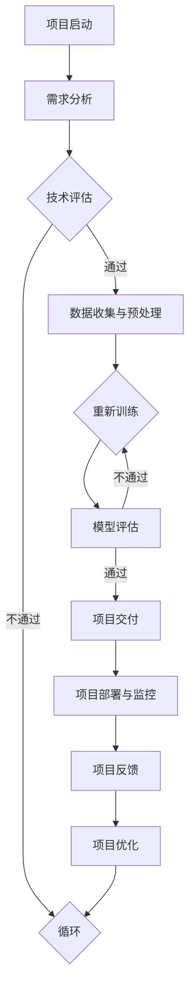

                 

### 《AI 大模型创业：如何利用技术优势？》

> **关键词：** AI 大模型，创业，技术优势，深度学习，自然语言处理，预训练模型，商业模式，团队建设，项目评估，案例研究

> **摘要：** 本文将探讨 AI 大模型在创业中的应用，分析其技术优势，以及如何利用这些优势进行创业。文章将从 AI 大模型的概念、技术基础、创业战略规划、项目评估与规划、项目执行与监控、案例研究以及未来展望等方面进行深入探讨，为创业者提供实际操作指导。

### 《AI 大模型创业：如何利用技术优势？》目录大纲

## 第一部分: AI 大模型概述

### 第1章: AI 大模型的概念与价值

### 第2章: AI 大模型的技术基础

## 第二部分: AI 大模型创业实践

### 第3章: AI 大模型创业战略规划

### 第4章: AI 大模型创业项目评估与规划

### 第5章: AI 大模型创业项目执行与监控

### 第6章: AI 大模型创业案例研究

### 第7章: AI 大模型创业的未来展望

## 附录

### 附录 A: AI 大模型创业相关资源

### 附录 B: Mermaid 流程图

### 附录 C: 代码案例与解读

**备注：**
- 本文将在具体章节中进一步细化小节，并根据实际情况增加或删除章节。
- 伪代码、数学模型和数学公式将在相应章节中进行详细阐述。
- 项目实战案例将在第6章中详细描述。

---

**正文部分即将开始。**

---

## 第1章: AI 大模型的概念与价值

### 1.1 AI 大模型的概念

AI 大模型是指具有巨大参数规模和复杂结构的机器学习模型。这些模型通常通过大规模数据预训练，然后通过微调适应特定任务。与传统的较小规模的模型相比，AI 大模型具有更强的表达能力和泛化能力。

**AI 大模型的定义：**

AI 大模型可以定义为具有以下特点的模型：

- 参数数量巨大：通常具有数亿甚至数十亿个参数。
- 复杂结构：通常包含多层神经网络，包括卷积神经网络（CNN）、循环神经网络（RNN）和变换器架构（Transformer）等。
- 大规模数据预训练：在预训练阶段，模型在大规模数据集上进行训练，以学习通用知识。

**AI 大模型的特点：**

1. **高精度：** AI 大模型在多种任务中达到了人类水平或超越人类水平的表现，如自然语言处理、计算机视觉和语音识别等。

2. **高泛化能力：** AI 大模型通过预训练在大规模数据集上，能够适应多种不同的任务，从而实现跨领域的应用。

3. **强表达能力：** AI 大模型具有复杂的网络结构，能够捕捉到数据中的复杂模式和关系，从而实现更准确的任务预测和决策。

**AI 大模型与传统 AI 的区别：**

- **模型规模：** 传统 AI 模型通常具有较少的参数，而 AI 大模型具有巨大的参数规模。
- **数据处理能力：** 传统 AI 模型在处理大量数据时可能面临性能瓶颈，而 AI 大模型能够处理大规模数据，并从中提取有价值的信息。
- **应用领域：** 传统 AI 模型主要应用于特定领域，如图像识别、语音识别等，而 AI 大模型能够跨领域应用，如自然语言处理、计算机视觉和语音识别等。

### 1.2 AI 大模型的技术背景

#### AI 大模型的发展历程

AI 大模型的发展可以追溯到 2006 年，当时深度学习研究者开始探索使用更大规模的数据和更复杂的网络结构来训练模型。随着计算能力的提升和数据量的增加，深度学习在图像识别、语音识别和自然语言处理等领域的表现逐渐提升。以下是 AI 大模型发展的重要里程碑：

1. **2006 年：** Geoffrey Hinton等人提出了深度置信网络（DBN），这是早期的大规模深度学习模型。
2. **2012 年：** Alex Krizhevsky 等人使用深度卷积神经网络（CNN）在 ImageNet 图像识别挑战赛上取得了突破性成绩，这标志着深度学习进入了一个新的时代。
3. **2014 年：** Google 推出了词向量模型 Word2Vec，这是自然语言处理领域的重大突破。
4. **2017 年：** Google 推出了 Transformer 架构，这一模型在机器翻译和自然语言处理任务上取得了显著成果。

#### 主流 AI 大模型简介

以下是一些主流的 AI 大模型：

1. **GPT-3：** OpenAI 推出的 GPT-3 模型是一个具有 1750 亿参数的预训练模型，它在自然语言处理任务中表现出色，能够生成高质量的文本、回答问题等。
2. **BERT：** Google 推出的 BERT 模型是一个具有数百万参数的预训练模型，它在自然语言处理任务中具有强大的表现，如问答、文本分类和命名实体识别等。
3. **ImageNet：** 这是一个包含数百万张图像的数据集，用于训练和评估深度学习模型在计算机视觉任务中的性能。
4. **Wav2Vec：** Google 推出的 Wav2Vec 模型是一个用于语音识别的预训练模型，它能够将语音信号转换为文本，并具有强大的语音识别能力。

### 1.3 AI 大模型在创业中的应用价值

#### 提高创业效率

AI 大模型通过自动化和智能化的方式，可以显著提高创业项目的效率。例如，在数据预处理阶段，AI 大模型可以自动提取和标注数据，减少人工工作负担；在模型训练阶段，AI 大模型可以自动调整参数，优化模型性能，提高训练效率。

#### 降低创业门槛

AI 大模型的出现降低了创业的技术门槛。创业者无需深入了解复杂的机器学习算法，只需利用现有的 AI 大模型框架和工具，就可以快速实现高效的 AI 应用。这为创业者提供了更多的创新空间，使他们能够专注于业务场景的挖掘和优化。

#### 拓展创业领域

AI 大模型在多个领域的应用取得了显著成果，为创业者提供了丰富的创新机会。以下是一些 AI 大模型在创业中的应用场景：

1. **自然语言处理：** AI 大模型在文本生成、问答系统、机器翻译等自然语言处理任务中具有强大的表现，可以应用于内容创作、智能客服、智能搜索等领域。
2. **计算机视觉：** AI 大模型在图像识别、目标检测、图像生成等计算机视觉任务中具有强大的能力，可以应用于图像处理、视频分析、医学影像诊断等领域。
3. **语音识别：** AI 大模型在语音识别、语音合成等语音处理任务中具有强大的表现，可以应用于智能语音助手、语音翻译、语音识别等领域。
4. **推荐系统：** AI 大模型在推荐系统任务中具有强大的表现，可以应用于电商、社交媒体、在线教育等领域，为创业者提供精准的推荐服务。

### 1.4 小结

AI 大模型具有高精度、高泛化能力和强表达能力，已经在多个领域取得了显著成果。在创业中，AI 大模型可以提高创业效率、降低创业门槛并拓展创业领域，为创业者提供了丰富的创新机会。接下来，我们将进一步探讨 AI 大模型的技术基础，了解其背后的深度学习与神经网络、自然语言处理技术和大规模预训练模型原理。

## 第2章: AI 大模型的技术基础

### 2.1 深度学习与神经网络基础

#### 神经网络的基本结构

神经网络（Neural Network）是深度学习（Deep Learning）的核心组成部分。它由大量的简单计算单元（称为神经元）组成，这些神经元通过加权连接（称为边）连接在一起。神经网络的目的是通过学习输入数据与输出数据之间的关系，实现对数据的建模和预测。

**神经元的基本结构：**

一个基本的神经元可以表示为以下形式：

$$
y = \sigma(\sum_{i=1}^{n} w_i x_i + b)
$$

其中，$y$ 是神经元的输出，$\sigma$ 是激活函数，$w_i$ 是第 $i$ 个输入的权重，$x_i$ 是第 $i$ 个输入，$b$ 是偏置。

**神经网络的基本结构：**

神经网络由多个层次组成，包括输入层、隐藏层和输出层。输入层接收外部输入数据，隐藏层对输入数据进行处理和变换，输出层产生最终输出。

$$
\begin{aligned}
& \text{输入层}: x \rightarrow h_1 \\
& \text{隐藏层}: h_{1} \rightarrow h_2 \\
& \text{...} \\
& \text{隐藏层}: h_{k-1} \rightarrow h_k \\
& \text{输出层}: h_k \rightarrow y
\end{aligned}
$$

#### 常见的深度学习架构

深度学习架构是指用于构建深度神经网络的框架和方法。以下是一些常见的深度学习架构：

1. **卷积神经网络（CNN）**

卷积神经网络是一种专门用于处理图像数据的神经网络。它通过卷积操作提取图像中的局部特征，并在网络中逐步组合这些特征，从而实现对图像的识别和分类。

**卷积神经网络的基本结构：**

$$
\begin{aligned}
& \text{输入层}: \text{图像} \rightarrow \text{卷积层} \\
& \text{卷积层}: f(x; \theta) \rightarrow \text{池化层} \\
& \text{...} \\
& \text{卷积层}: f(x; \theta) \rightarrow \text{全连接层} \\
& \text{输出层}: \text{分类结果}
\end{aligned}
$$

2. **循环神经网络（RNN）**

循环神经网络是一种专门用于处理序列数据的神经网络。它通过在时间步上循环处理数据，实现对序列数据的建模和预测。

**循环神经网络的基本结构：**

$$
\begin{aligned}
& \text{输入层}: x_t \rightarrow \text{隐藏层} \\
& \text{隐藏层}: h_t = \text{RNN}(h_{t-1}; x_t; \theta) \\
& \text{...} \\
& \text{隐藏层}: h_T = \text{RNN}(h_{T-1}; x_T; \theta) \\
& \text{输出层}: y_t = \text{softmax}(h_T)
\end{aligned}
$$

3. **变换器架构（Transformer）**

变换器架构是一种基于自注意力机制的深度学习架构。它通过多头自注意力机制和前馈神经网络，实现对序列数据的建模和预测。

**变换器架构的基本结构：**

$$
\begin{aligned}
& \text{输入层}: x \rightarrow \text{嵌入层} \\
& \text{嵌入层}: x \rightarrow [h_1, h_2, ..., h_n] \\
& \text{自注意力层}: h_i = \text{Attention}(h_1, h_2, ..., h_n; \theta) \\
& \text{前馈层}: h_i = \text{FFN}(h_i; \theta) \\
& \text{输出层}: y = \text{softmax}(h_n)
\end{aligned}
$$

#### 深度学习优化算法

深度学习优化算法是指用于训练深度神经网络的算法。以下是一些常见的深度学习优化算法：

1. **随机梯度下降（SGD）**

随机梯度下降是一种基于梯度信息的优化算法。它通过随机选择一个小批量数据，计算其梯度并更新模型参数，从而实现模型优化。

**随机梯度下降的基本步骤：**

$$
\begin{aligned}
& \theta \leftarrow \theta - \alpha \cdot \nabla_{\theta} L(\theta) \\
& \text{其中，}\alpha \text{是学习率，} L(\theta) \text{是损失函数。}
\end{aligned}
$$

2. **动量法（Momentum）**

动量法是一种改进的随机梯度下降算法。它通过引入动量项，加速模型的收敛速度。

**动量法的基本步骤：**

$$
\begin{aligned}
& v_t = \gamma v_{t-1} + \alpha \cdot \nabla_{\theta} L(\theta) \\
& \theta \leftarrow \theta - v_t \\
& \text{其中，}\gamma \text{是动量因子。}
\end{aligned}
$$

3. **Adam优化器**

Adam优化器是一种自适应的优化算法。它通过计算一阶矩估计（均值）和二阶矩估计（方差），自适应调整学习率。

**Adam优化器的基本步骤：**

$$
\begin{aligned}
& m_t = \beta_1 m_{t-1} + (1 - \beta_1) \nabla_{\theta} L(\theta) \\
& v_t = \beta_2 v_{t-1} + (1 - \beta_2) (\nabla_{\theta} L(\theta))^2 \\
& \theta \leftarrow \theta - \alpha \cdot \frac{m_t}{\sqrt{v_t} + \epsilon} \\
& \text{其中，}\beta_1, \beta_2, \alpha, \epsilon \text{是超参数。}
\end{aligned}
$$

#### 神经网络在AI 大模型中的应用

神经网络在 AI 大模型中扮演着至关重要的角色。以下是一些典型的应用场景：

1. **自然语言处理（NLP）：** 神经网络在 NLP 任务中表现出色，如文本分类、情感分析、机器翻译和问答系统等。
2. **计算机视觉（CV）：** 神经网络在 CV 任务中具有强大的能力，如图像分类、目标检测、图像分割和视频处理等。
3. **语音识别（ASR）：** 神经网络在语音识别任务中表现出色，如语音转文本和语音合成等。
4. **推荐系统（RS）：** 神经网络在推荐系统任务中具有强大的能力，如基于内容的推荐、协同过滤和个性化推荐等。

### 2.2 自然语言处理技术概览

自然语言处理（Natural Language Processing，NLP）是人工智能（AI）的一个重要分支，旨在使计算机能够理解和处理人类语言。在 NLP 中，AI 大模型发挥着重要作用，以下是一些关键技术和方法：

#### 词嵌入技术

词嵌入（Word Embedding）是一种将单词映射到高维向量空间的技术，使得具有相似意义的单词在向量空间中更接近。词嵌入技术为 NLP 提供了一种有效的表示方法，使得神经网络能够更好地理解和处理文本数据。

**词嵌入技术的基本原理：**

- **基于统计的方法：** 如 Word2Vec，通过训练大规模语言模型，将单词映射到高维向量空间。
- **基于神经网络的模型：** 如 GloVe，通过训练神经网络，将单词映射到高维向量空间。

**词嵌入技术的优势：**

- **语义表示：** 词嵌入技术能够将单词表示为具有语义信息的向量，使得神经网络能够更好地理解和处理文本数据。
- **相似性度量：** 通过词嵌入技术，可以计算单词之间的相似性，从而为文本分析和情感分析等任务提供有效的支持。

#### 序列模型与注意力机制

序列模型（Sequence Model）是一类专门用于处理序列数据的神经网络模型，如循环神经网络（RNN）和变换器架构（Transformer）。序列模型在 NLP 中具有广泛的应用，如文本分类、机器翻译和问答系统等。

**序列模型的基本原理：**

- **RNN：** 通过在时间步上循环处理序列数据，实现对序列数据的建模和预测。
- **Transformer：** 基于自注意力机制，通过多头自注意力机制和前馈神经网络，实现对序列数据的建模和预测。

**注意力机制（Attention Mechanism）的基本原理：**

- **软注意力（Soft Attention）：** 通过计算输入序列和隐藏状态之间的相似性，生成注意力权重，用于加权平均隐藏状态。
- **硬注意力（Hard Attention）：** 通过计算输入序列和隐藏状态之间的相似性，生成注意力权重，用于选择最相关的隐藏状态。

**注意力机制的优势：**

- **信息整合：** 通过注意力机制，可以将重要的信息从输入序列中提取出来，并整合到隐藏状态中，从而提高模型的性能。
- **灵活性：** 注意力机制可以根据任务的复杂性动态调整注意力权重，从而实现更精确的建模和预测。

#### 转换器架构详解

转换器架构（Transformer）是一种基于自注意力机制的深度学习架构，由 Vaswani 等人在 2017 年提出。它广泛应用于 NLP 任务中，如机器翻译、文本分类和问答系统等。

**转换器架构的基本原理：**

- **多头自注意力（Multi-Head Self-Attention）：** 通过多个自注意力头，对输入序列进行并行处理，从而提高模型的建模能力。
- **前馈神经网络（Feed-Forward Neural Network）：** 在自注意力层之后，通过前馈神经网络对隐藏状态进行进一步处理和变换。
- **编码器-解码器架构（Encoder-Decoder Architecture）：** 通过编码器（Encoder）和解码器（Decoder）的交互，实现对输入序列的编码和解码。

**转换器架构的优势：**

- **并行计算：** 转换器架构通过自注意力机制，实现了并行计算，从而提高了模型的训练速度。
- **灵活建模：** 转换器架构能够灵活调整注意力权重，从而实现对序列数据的精细建模。
- **强表达能力：** 转换器架构具有强大的表达能力和泛化能力，在多个 NLP 任务中取得了优异的性能。

### 2.3 大规模预训练模型原理

大规模预训练模型（Large-scale Pre-trained Model）是指通过在大规模数据集上进行预训练，从而获得具有强大通用表示能力的模型。大规模预训练模型在 NLP、CV 等领域具有广泛的应用。

#### 预训练的概念与意义

预训练（Pre-training）是指在特定任务之前，使用大规模数据集对神经网络模型进行训练，从而使其获得通用表示能力。预训练的意义在于：

- **提高模型性能：** 通过预训练，模型可以在特定任务之前获得良好的初始化，从而提高模型在特定任务上的性能。
- **减少训练时间：** 预训练可以减少模型在特定任务上的训练时间，从而提高模型的训练效率。
- **提高泛化能力：** 预训练可以使模型在不同任务之间共享知识，从而提高模型的泛化能力。

#### 自监督学习方法

自监督学习（Self-supervised Learning）是一种无需人工标注数据，通过利用数据中的内在结构进行学习的机器学习方法。自监督学习方法在预训练中具有重要意义。

**自监督学习方法的基本原理：**

- **任务定义：** 将无标签数据转化为具有监督的任务，如通过生成掩码来预测缺失的部分。
- **模型训练：** 通过最小化预测损失，训练模型预测缺失的部分，从而学习数据的内在结构。

**自监督学习方法的优势：**

- **无需人工标注：** 自监督学习方法可以自动从大量无标签数据中提取信息，从而减少人工标注的工作量。
- **数据利用效率高：** 自监督学习方法可以将大量无标签数据转化为具有监督的任务，从而提高数据利用效率。
- **增强模型泛化能力：** 通过在预训练阶段学习数据的内在结构，模型可以更好地适应不同的任务和数据集。

#### 迁移学习与微调技术

迁移学习（Transfer Learning）是一种将一个任务在特定数据集上训练得到的模型，应用于另一个任务的技术。迁移学习在预训练和微调中具有重要意义。

**迁移学习的基本原理：**

- **模型初始化：** 使用在特定任务上训练得到的模型作为初始化，从而提高新任务的模型性能。
- **模型训练：** 在新任务上继续训练模型，以进一步优化模型性能。

**微调（Fine-tuning）技术的原理：**

- **微调步骤：** 在预训练模型的基础上，针对特定任务进行微调，从而优化模型在新任务上的性能。
- **训练策略：** 通过调整学习率、训练批次大小等超参数，优化微调过程。

**迁移学习与微调技术的优势：**

- **减少训练数据需求：** 通过迁移学习和微调，模型可以基于少量数据在新任务上获得良好的性能，从而减少训练数据的需求。
- **提高模型泛化能力：** 通过在预训练阶段学习通用知识，模型可以更好地适应不同的任务和数据集。
- **加速模型训练：** 通过迁移学习和微调，可以减少模型在新任务上的训练时间，从而提高训练效率。

### 2.4 小结

本章介绍了 AI 大模型的技术基础，包括深度学习与神经网络基础、自然语言处理技术概览和大规模预训练模型原理。深度学习与神经网络是 AI 大模型的核心组成部分，通过卷积神经网络（CNN）、循环神经网络（RNN）和变换器架构（Transformer）等架构，实现对数据的建模和预测。自然语言处理技术包括词嵌入技术、序列模型与注意力机制和转换器架构，为 NLP 任务提供有效的解决方案。大规模预训练模型通过自监督学习方法、迁移学习和微调技术，实现模型的通用表示能力和泛化能力。接下来，我们将进一步探讨 AI 大模型在创业中的应用，以及如何利用这些技术优势进行创业。

## 第3章: AI 大模型创业战略规划

### 3.1 AI 大模型创业的机会与挑战

在当前技术环境下，AI 大模型创业面临着诸多机会与挑战。以下将详细分析这些机会与挑战，为创业者提供全面的创业指导。

#### 机会

1. **技术创新带来的市场空间：** 随着AI 大模型技术的发展，诸如 GPT-3、BERT 等大型模型已经显示出在多个领域的强大能力。这些技术的进步为创业者提供了广阔的市场空间，可以在金融、医疗、教育、零售等多个行业进行创新应用。

2. **降低创业门槛：** 传统上，AI 技术的应用往往需要庞大的计算资源和专业知识。而如今，云服务和开源工具的普及使得创业者可以利用现有的技术平台，快速搭建自己的 AI 应用，降低了创业的门槛。

3. **数据资源的积累：** 随着互联网的普及，大量结构化和非结构化数据不断积累。这些数据为 AI 大模型的学习和优化提供了丰富的素材，使得创业者可以更加精准地服务于用户需求。

4. **市场需求驱动：** 在大数据和智能化时代，越来越多的行业和企业意识到 AI 技术的重要性。市场需求驱动下，创业者可以针对具体行业进行定制化解决方案的开发，满足市场多样化的需求。

#### 挑战

1. **技术门槛：** 虽然 AI 大模型的应用门槛有所降低，但仍需具备一定的机器学习知识和编程技能。对于非技术背景的创业者来说，这可能是一个不小的挑战。

2. **数据隐私和安全：** 在使用大量数据进行模型训练时，如何保护用户隐私和确保数据安全是一个重要问题。特别是在医疗、金融等敏感领域，数据泄露可能导致严重的法律和商业风险。

3. **商业模式探索：** AI 大模型创业需要寻找合适的商业模式，以确保企业的可持续发展和盈利能力。如何在激烈的市场竞争中脱颖而出，找到盈利点，是一个需要深思熟虑的问题。

4. **人才招聘与培养：** AI 大模型创业对技术人才的需求较高。如何吸引和培养优秀的人才，建立高效的团队，是创业者需要面对的挑战。

### 3.2 AI 大模型创业的商业模式

#### 商业模式分析

在 AI 大模型创业中，不同的商业模式可以为企业带来不同的收益和发展路径。以下是一些常见的商业模式：

1. **产品模式：** 通过开发 AI 大模型相关的产品或服务，直接向用户收费。例如，开发智能客服系统、智能推荐系统等，为企业或个人用户提供定制化服务。

2. **解决方案模式：** 针对特定行业或场景，提供综合的 AI 大模型解决方案。例如，为医疗行业提供智能诊断系统，为金融行业提供风险管理解决方案等。

3. **平台模式：** 建立一个开放的平台，允许第三方开发者使用 AI 大模型构建应用程序。平台可以通过收取开发者的使用费或交易费用来获得收益。

4. **订阅模式：** 提供定期更新和升级的 AI 大模型服务，用户按年或按月支付订阅费用。这种模式可以确保持续的用户流量和稳定的收入。

#### 不同商业模式的案例分析

1. **产品模式案例：** OpenAI 的 GPT-3 模型通过提供 API 接口，允许开发者调用其模型进行文本生成、问答等任务。GPT-3 的收费模式基于 API 调用次数和模型使用量，为 OpenAI 带来了可观的收入。

2. **解决方案模式案例：** IBM 的 Watson Health 提供了基于 AI 大模型的医疗诊断解决方案。Watson Health 通过整合医疗数据、知识库和 AI 模型，为医疗机构提供精准的诊断和治疗方案，赢得了广泛的用户认可。

3. **平台模式案例：** Google Cloud 提供了 AI 大模型平台，允许开发者使用 Google 的 AI 模型构建应用程序。平台通过收取开发者的使用费和交易费用，为 Google Cloud 带来了稳定的收入来源。

4. **订阅模式案例：** Hugging Face 提供了一个开源的 AI 大模型平台，用户可以通过订阅获得模型更新和升级服务。平台通过订阅费用获得了持续的收入，并且吸引了大量的开发者使用其工具和资源。

### 3.3 AI 大模型创业团队建设

#### AI 大模型创业团队的角色

在 AI 大模型创业中，团队成员需要具备不同的技能和角色，以确保项目的顺利进行。以下是一些关键角色：

1. **技术领袖（CTO）：** 技术领袖负责整体技术战略的制定和执行，领导团队进行 AI 大模型的研究和应用。

2. **数据科学家：** 数据科学家负责数据预处理、特征工程和模型训练，是 AI 大模型的核心开发者。

3. **产品经理：** 产品经理负责分析市场需求，设计产品功能，协调团队确保产品满足用户需求。

4. **业务分析师：** 业务分析师负责分析行业趋势，挖掘潜在客户需求，为团队提供业务发展的建议。

5. **市场营销人员：** 市场营销人员负责品牌推广、市场拓展和用户关系管理，确保产品能够得到市场的认可。

#### AI 大模型创业团队的能力建设

为了确保 AI 大模型创业的成功，团队需要具备以下几个方面的能力：

1. **技术创新能力：** 团队需要不断跟进最新的 AI 大模型技术和研究成果，保持技术领先地位。

2. **业务理解能力：** 团队需要深入了解目标行业和用户需求，将 AI 技术与实际业务场景相结合，提供有价值的解决方案。

3. **项目执行能力：** 团队需要具备高效的项目管理能力，确保项目按计划推进，按时交付。

4. **团队协作能力：** 团队成员需要具备良好的沟通和协作能力，确保项目的顺利进行和团队的凝聚力。

### 3.4 小结

本章探讨了 AI 大模型创业的机会与挑战，分析了常见的商业模式，并提出了团队建设的建议。AI 大模型创业面临着技术创新、降低门槛、数据资源和市场需求带来的机会，同时也需要面对技术门槛、数据隐私、商业模式探索和人才招聘等挑战。通过选择合适的商业模式，建设高效团队，创业者可以充分利用 AI 大模型的优势，实现创业目标。接下来，我们将进一步探讨 AI 大模型创业项目评估与规划的方法和步骤。

### 3.5 AI 大模型创业项目评估与规划

在 AI 大模型创业中，项目评估与规划是确保项目成功的关键环节。通过科学的项目评估和合理的规划，创业者可以更好地掌握项目进展，降低风险，提高成功率。以下将详细介绍 AI 大模型创业项目评估与规划的方法和步骤。

#### 项目评估指标

项目评估指标是衡量项目成功与否的重要标准。在 AI 大模型创业中，常用的评估指标包括以下几类：

1. **技术可行性评估：** 技术可行性评估主要是判断项目所采用的 AI 大模型技术是否成熟、可靠，并具备实际应用价值。评估指标包括模型的准确性、泛化能力、计算效率和可维护性等。

2. **商业价值评估：** 商业价值评估旨在判断项目是否具备市场前景和盈利能力。评估指标包括市场规模、用户需求、竞争优势、收入模型等。

3. **风险评估：** 风险评估是识别和评估项目潜在的风险，包括技术风险、市场风险、财务风险和运营风险等。评估指标包括风险发生概率、风险影响程度和风险可控性等。

#### 项目评估步骤

1. **需求分析：** 首先，对项目需求进行详细分析，明确项目目标、功能需求和性能指标。这一步骤有助于确保项目的方向正确，避免项目偏离预期。

2. **技术评估：** 对项目所需的技术方案进行评估，分析技术的可行性、成熟度和适用性。可以借助第三方技术评估报告、业内专家意见等外部资源，提高评估的准确性。

3. **市场评估：** 对目标市场进行调研，分析市场规模、用户需求、竞争对手和市场趋势。通过市场评估，可以判断项目的商业前景，并制定合适的市场策略。

4. **风险评估：** 识别项目可能面临的风险，分析风险发生的概率和影响程度。针对识别出的风险，制定相应的风险管理策略，降低风险对项目的负面影响。

#### 项目规划步骤

1. **项目目标设定：** 根据项目需求分析，明确项目目标，包括功能目标、性能目标和商业目标等。项目目标应具体、可量化，以便于后续的评估和监控。

2. **项目进度安排：** 根据项目目标，制定项目进度计划，包括关键里程碑和时间节点。项目进度计划应具备灵活性和可调整性，以应对项目执行过程中可能出现的变化。

3. **资源分配：** 根据项目进度计划，合理分配项目资源，包括人力资源、技术资源和资金资源等。资源分配应确保项目按计划推进，并避免资源浪费。

4. **风险评估与监控：** 在项目执行过程中，持续进行风险评估和监控，及时发现和解决潜在问题。通过定期评估，确保项目风险处于可控范围内，降低项目风险对项目的负面影响。

#### 项目规划工具与方法

1. **甘特图（Gantt Chart）：** 甘特图是一种常用的项目进度管理工具，通过直观的图形展示项目进度，帮助项目经理和团队了解项目的执行情况，并及时进行调整。

2. **网络图（Network Diagram）：** 网络图是一种用于表示项目任务依赖关系的图形工具，可以帮助项目经理明确任务间的先后顺序和并行关系，优化项目执行效率。

3. **项目管理软件：** 借助项目管理软件，如 Microsoft Project、JIRA 等，可以更好地进行项目进度管理、资源分配和风险评估。这些软件提供了丰富的功能，如任务追踪、进度报告和风险分析等，有助于提高项目管理效率。

#### 项目规划案例分析

以下是一个 AI 大模型创业项目的规划案例：

**项目名称：** 智能医疗诊断系统

**项目目标：** 开发一款基于 AI 大模型的智能医疗诊断系统，用于辅助医生进行疾病诊断。

**项目进度安排：**

1. **需求分析（第1-2周）：** 与医院和医生团队进行沟通，明确诊断系统的功能需求和技术要求。
2. **技术评估（第3-4周）：** 分析现有的 AI 大模型技术，选择最适合的技术方案。
3. **数据收集与预处理（第5-8周）：** 收集医疗数据，并进行数据清洗和预处理。
4. **模型开发与训练（第9-12周）：** 开发和训练 AI 大模型，实现疾病诊断功能。
5. **系统测试与优化（第13-16周）：** 对诊断系统进行测试，并根据测试结果进行优化。
6. **项目交付与部署（第17-20周）：** 将诊断系统交付医院，并进行部署和培训。

**资源分配：**

1. **人力资源：** 2名数据科学家，3名开发工程师，1名测试工程师。
2. **技术资源：** GPU 计算资源，深度学习框架和开源库。
3. **资金资源：** 项目预算 50 万元，包括人员工资、硬件设备和运维费用。

**风险评估与监控：**

1. **技术风险：** 模型性能不稳定，数据不足或数据质量差。解决方案：采用多种数据源，进行数据增强和模型调整。
2. **市场风险：** 医疗行业的市场竞争激烈。解决方案：与医院和医生团队建立紧密合作关系，提供优质服务。
3. **财务风险：** 项目预算超支。解决方案：严格控制项目预算，及时调整资源分配。

通过科学的项目评估和合理的规划，创业者可以更好地把握项目进展，降低风险，提高 AI 大模型创业的成功率。接下来，我们将进一步探讨 AI 大模型创业项目执行与监控的方法和技巧。

### 3.6 AI 大模型创业项目执行与监控

在 AI 大模型创业项目中，项目执行与监控是确保项目按计划推进、及时发现问题并解决问题的关键环节。以下将详细介绍 AI 大模型创业项目执行与监控的方法和技巧。

#### 项目执行策略

1. **团队协作与沟通：** 团队协作是实现项目成功的重要因素。在项目执行过程中，团队需要保持良好的沟通和协作，确保每个成员都能清晰地了解项目目标和任务分工。可以使用项目管理工具，如 Slack、Trello 等，来提高团队协作效率。

2. **任务分解：** 将项目任务分解为具体的子任务，并明确每个子任务的负责人和完成时间。任务分解有助于提高项目的透明度和可管理性，确保项目按计划推进。

3. **进度监控：** 定期监控项目进度，确保项目按照计划进行。可以借助项目管理工具生成项目进度报告，及时了解项目进展情况，发现潜在问题并采取措施。

4. **风险管理：** 在项目执行过程中，持续进行风险评估和管理。识别可能影响项目进展的风险，并制定相应的应对策略。通过定期风险评估，确保项目风险处于可控范围内。

#### 项目监控与调整

1. **进度监控：** 定期检查项目进度，确保每个子任务都按照计划完成。可以通过项目管理工具生成进度报告，项目成员和项目经理可以随时查看项目进展情况。

2. **质量监控：** 在项目执行过程中，对项目质量进行监控。可以采用代码审查、测试用例等方法，确保项目交付的成果符合预期质量。

3. **成本监控：** 监控项目成本，确保项目预算不被超支。可以定期生成项目成本报告，分析项目成本结构，及时发现成本异常并采取措施。

4. **调整与优化：** 在项目监控过程中，根据项目实际情况进行调整和优化。如果发现项目进度滞后或质量不达标，应采取相应措施进行调整，确保项目能够按计划完成。

#### 项目监控工具

1. **JIRA：** JIRA 是一款功能强大的项目管理工具，支持任务管理、进度监控、风险管理和报告生成等功能，适用于各种规模的项目。

2. **Asana：** Asana 是一款简单易用的项目管理工具，提供任务管理、进度跟踪、团队协作等功能，适用于小型团队和简单项目。

3. **Trello：** Trello 是一款基于看板（Kanban）方法的项目管理工具，通过可视化卡片和列表，帮助团队高效管理任务和项目。

#### 项目执行案例分析

以下是一个 AI 大模型创业项目的执行与监控案例：

**项目名称：** 智能医疗诊断系统

**项目执行策略：**

1. **团队协作与沟通：** 使用 Slack 进行日常沟通，每周召开一次项目会议，回顾上周工作进展，讨论当前问题和下一步计划。

2. **任务分解：** 将项目任务分解为数据收集、数据预处理、模型开发、系统测试和部署等子任务，并为每个子任务分配负责人。

3. **进度监控：** 使用 JIRA 进行任务管理，生成每周进度报告，项目成员和项目经理可以随时查看任务进度。

4. **风险管理：** 每周进行一次风险评估，识别可能的风险并制定应对措施。

**项目监控与调整：**

1. **进度监控：** 通过 JIRA 查看任务进度，每周召开项目会议，讨论项目进展和存在的问题。

2. **质量监控：** 每月进行一次系统测试，确保诊断系统的功能和质量符合预期。

3. **成本监控：** 定期审查项目成本，确保项目预算不被超支。

4. **调整与优化：** 根据项目进展情况，及时调整任务优先级和资源分配，优化项目执行策略。

通过有效的项目执行与监控，创业者可以确保 AI 大模型创业项目按计划推进，及时发现和解决问题，提高项目成功率。接下来，我们将通过实际案例研究，深入探讨 AI 大模型在创业项目中的应用和实践。

### 3.7 AI 大模型创业案例研究

为了更好地理解 AI 大模型在创业中的应用，我们将通过两个具体的创业案例来进行分析和讨论。这些案例展示了如何利用 AI 大模型解决实际问题，实现商业价值。

#### 案例一：某创业公司利用 GPT-3 开发智能客服系统

**案例背景：**
某创业公司专注于提供高效的客户服务解决方案。随着客户数量的增加，传统的人工客服模式已经无法满足日益增长的客户需求。为了提升客户服务质量，公司决定开发一款基于 AI 大模型——GPT-3 的智能客服系统。

**项目实施过程：**

1. **需求分析：** 团队与客户沟通，了解客户在客服过程中遇到的主要问题，如常见问题回答、投诉处理等。明确智能客服系统需要具备的功能，如自动问答、情感识别、多轮对话等。

2. **技术选型：** 研究现有的 AI 大模型，选择最适合项目需求的模型。GPT-3 因为其强大的文本生成和语言理解能力，被选为智能客服系统的核心技术。

3. **数据准备：** 收集并清洗大量客服对话数据，用于训练 GPT-3 模型。数据包括客户提问和客服回答，以及客户反馈信息。

4. **模型训练：** 使用 GPT-3 模型进行预训练，并通过微调技术使其适应特定领域的客服需求。训练过程中，团队不断优化模型参数，提高模型性能。

5. **系统集成：** 将训练好的 GPT-3 模型集成到客服系统中，开发前端界面和后端接口，实现客户与智能客服系统的交互。

6. **测试与优化：** 对智能客服系统进行功能测试和性能评估，确保系统能够准确回答客户问题，并能够处理复杂的对话场景。根据测试结果，对系统进行优化，提高用户满意度。

**案例分析：**

- **技术优势：** GPT-3 模型具有强大的语言理解和生成能力，能够处理复杂的多轮对话，提供自然流畅的回答。
- **商业价值：** 智能客服系统显著提升了客户服务质量，降低了人力成本，提高了客户满意度，从而增强了公司的市场竞争力。

#### 案例二：某创业公司利用 BERT 模型优化搜索引擎

**案例背景：**
某创业公司开发了一款垂直领域的搜索引擎，但在搜索结果的相关性和准确性方面存在一定的提升空间。为了提高搜索引擎的性能，公司决定利用 BERT 模型对搜索引擎进行优化。

**项目实施过程：**

1. **需求分析：** 团队分析用户在搜索引擎中的查询行为，了解用户在搜索过程中遇到的主要问题，如搜索结果不准确、相关度低等。

2. **技术选型：** 选择 BERT 模型作为搜索引擎优化的技术方案。BERT 模型在自然语言处理任务中表现出色，能够提高搜索结果的相关性和准确性。

3. **数据准备：** 收集并清洗大量搜索引擎数据，包括用户查询日志和搜索结果，用于训练 BERT 模型。

4. **模型训练：** 使用 BERT 模型对搜索引擎数据进行预训练，并通过微调技术使其适应特定领域的搜索需求。训练过程中，团队优化模型参数，提高搜索性能。

5. **系统集成：** 将训练好的 BERT 模型集成到搜索引擎中，优化搜索算法和结果排序机制，提高搜索结果的相关性和准确性。

6. **测试与优化：** 对搜索引擎进行功能测试和性能评估，确保搜索结果的相关度和准确性得到显著提升。根据测试结果，对系统进行优化，提高用户体验。

**案例分析：**

- **技术优势：** BERT 模型能够捕捉到查询语句中的上下文信息，提高搜索结果的相关性和准确性。
- **商业价值：** 优化后的搜索引擎提升了用户体验，增加了用户留存率，从而提高了公司的广告收入和市场份额。

通过这两个案例，我们可以看到 AI 大模型在创业项目中的应用具有显著的技术优势和商业价值。创业者可以通过深入了解 AI 大模型的技术原理和应用场景，结合自身业务需求，制定相应的解决方案，实现商业目标。

### 3.8 小结

本章通过两个 AI 大模型创业案例，展示了如何利用 GPT-3 和 BERT 模型解决实际业务问题，实现商业价值。案例一中的智能客服系统提升了客户服务质量，降低了人力成本，案例二中的搜索引擎优化提高了搜索结果的相关性和准确性，增强了用户体验。这些案例表明，AI 大模型在创业中的应用具有巨大的潜力，创业者可以通过深入研究和实践，充分利用这些技术优势，实现业务创新和增长。接下来，我们将探讨 AI 大模型创业的未来展望，分析其发展趋势和机遇。

### 第7章: AI 大模型创业的未来展望

随着 AI 大模型技术的不断进步，创业领域也面临着前所未有的机遇和挑战。在未来，AI 大模型将在多个行业和领域中发挥关键作用，为创业者提供丰富的创新机会。

#### AI 大模型在各个行业中的应用前景

1. **医疗健康：** AI 大模型在医疗健康领域具有广泛的应用前景。例如，通过深度学习技术，AI 大模型可以辅助医生进行疾病诊断、预测疾病发展，提高医疗服务的质量和效率。

2. **金融服务：** 在金融领域，AI 大模型可以用于风险管理、信用评估、欺诈检测等。通过分析海量数据，AI 大模型可以提供更准确、更快速的决策支持，降低金融风险。

3. **智能制造：** 在制造业，AI 大模型可以用于生产优化、质量检测、设备预测维护等。通过实时监控和分析生产数据，AI 大模型可以提升生产效率，降低运营成本。

4. **零售电商：** 在零售电商领域，AI 大模型可以用于个性化推荐、用户行为分析、库存管理等方面。通过精准的用户画像和需求预测，AI 大模型可以帮助企业提高销售额，优化供应链管理。

5. **教育科技：** 在教育科技领域，AI 大模型可以用于智能教学、学习分析、考试评分等。通过个性化教学和智能评估，AI 大模型可以提升教育质量和学习效果。

#### AI 大模型创业的未来趋势

1. **跨领域融合：** 未来，AI 大模型将在不同领域之间实现跨领域融合，产生更多的创新应用。例如，结合医疗健康和金融领域的知识，AI 大模型可以提供更全面的健康管理服务。

2. **模型定制化：** 随着 AI 大模型技术的不断发展，创业者可以根据特定业务需求，定制化开发 AI 大模型。这将为创业者提供更多的创新空间，满足市场的多样化需求。

3. **数据驱动：** 数据是 AI 大模型的核心资源，未来创业者将更加重视数据收集、处理和分析。通过利用海量数据，AI 大模型可以不断提升其性能和应用价值。

4. **安全与隐私：** 随着 AI 大模型的应用日益广泛，数据安全和隐私保护将成为重要议题。创业者需要关注数据安全和隐私保护技术，确保用户数据的可靠性和隐私性。

#### AI 大模型创业者的必备素质

1. **技术创新能力：** AI 大模型创业需要具备强大的技术创新能力，包括对深度学习、自然语言处理、计算机视觉等领域的深入理解，以及实际应用能力。

2. **商业洞察力：** 创业者需要具备敏锐的商业洞察力，能够准确把握市场需求，发现商业机会，制定有效的商业模式。

3. **团队领导力：** 创业者需要具备优秀的团队领导力，能够吸引和培养优秀的人才，建立高效团队，推动项目顺利进行。

#### AI 大模型创业的发展策略

1. **基于技术优势的创业策略：** 创业者可以充分利用 AI 大模型的技术优势，开发具有独特竞争力的产品或服务。例如，开发先进的智能诊断系统、个性化推荐系统等。

2. **基于市场需求的创业策略：** 创业者需要深入了解市场需求，针对用户需求开发定制化的解决方案。例如，为特定行业提供专业的 AI 大模型服务。

3. **基于生态合作的发展策略：** 创业者可以与产业链上下游的企业建立合作关系，共同推动 AI 大模型技术的发展和应用。例如，与硬件厂商合作，提供高性能的 AI 大模型计算平台。

通过深入分析 AI 大模型创业的未来趋势，创业者可以把握机遇，制定有效的发展策略，实现持续创新和业务增长。在未来的创业旅程中，AI 大模型将成为重要的推动力量，助力创业者开拓新的业务领域。

### 附录 A: AI 大模型创业相关资源

为了帮助创业者更好地了解和利用 AI 大模型技术，以下列出了一些 AI 大模型创业相关的资源，包括主流深度学习框架、书籍推荐和网站推荐。

#### 主流深度学习框架对比

1. **TensorFlow：** 由 Google 开发，是一个开源的深度学习框架，支持多种深度学习模型和算法。TensorFlow 提供了丰富的文档和社区支持，适合初学者和专业人士。

2. **PyTorch：** 由 Facebook AI 研究团队开发，是一个开源的深度学习框架，支持动态计算图和灵活的模型定义。PyTorch 易于使用，适合快速原型开发和研究。

3. **Keras：** 是一个高层次的神经网络 API，可以用于构建和训练深度学习模型。Keras 支持多种深度学习框架，如 TensorFlow 和 PyTorch，适合快速实现和部署。

4. **MXNet：** 是 Apache 软件基金会的一个开源深度学习框架，由 Amazon 开发。MXNet 具有良好的性能和灵活性，支持多种编程语言，适合大规模分布式训练。

#### AI 大模型创业相关书籍推荐

1. **《深度学习》（Deep Learning）：** 由 Ian Goodfellow、Yoshua Bengio 和 Aaron Courville 著，是一本经典的深度学习教材，涵盖了深度学习的基本理论、算法和应用。

2. **《AI 大模型：理论与实践》（Large-scale Deep Learning）：** 由 Geoffrey Hinton 著，介绍了大规模深度学习模型的设计、实现和应用，是深度学习领域的重要参考书。

3. **《Python 深度学习》（Python Deep Learning）：** 由 François Chollet 著，介绍了使用 Python 和 Keras 框架进行深度学习的实践方法，适合初学者和进阶者。

4. **《深度学习实践指南》（Deep Learning with Python）：** 由 Fabian Pedregosa、Gabriel Scherer 和 Journal of Machine Learning Research 著，提供了大量的实践案例和代码示例，适合深度学习开发者。

#### AI 大模型创业相关网站推荐

1. **AI 人工智能网（AI China）：** 一个关于人工智能技术的中文网站，提供深度学习、机器学习、自然语言处理等领域的最新资讯、教程和资源。

2. **机器之心（Machine Learning：** 一个国际化的机器学习技术网站，提供深度学习、计算机视觉、自然语言处理等领域的最新研究进展和技术分享。

3. **GitHub：** 一个全球最大的开源代码托管平台，许多深度学习项目和框架都在 GitHub 上开源，开发者可以在这里找到丰富的资源和学习代码。

4. **AI 研究院（AI Institute）：** 一个专注于人工智能研究的在线平台，提供人工智能领域的最新论文、讲座和技术分享。

这些资源和书籍将帮助创业者更好地了解 AI 大模型技术，掌握深度学习的基本原理和应用方法，为创业项目提供有力支持。

### 附录 B: Mermaid 流程图

以下是一个简单的 AI 大模型创业流程图的 Mermaid 语法示例，用于展示创业项目的基本流程。



通过 Mermaid 语法，您可以创建和展示各种类型的流程图、网络图和 UML 图，为项目管理和文档编写提供直观的支持。

### 附录 C: 代码案例与解读

以下是一个使用 GPT-3 模型生成文本的 Python 代码案例，并对其进行详细解释。

```python
import openai

# 设置 OpenAI API 密钥
openai.api_key = 'your_openai_api_key'

# 使用 GPT-3 模型生成文本
def generate_text(prompt, temperature=0.7, max_tokens=50):
    response = openai.Completion.create(
        engine="text-davinci-002",
        prompt=prompt,
        temperature=temperature,
        max_tokens=max_tokens,
        top_p=1,
        frequency_penalty=0.0,
        presence_penalty=0.0
    )
    return response.choices[0].text.strip()

# 示例：生成一篇关于人工智能的短文
prompt = "人工智能在未来将如何改变我们的生活方式？"
generated_text = generate_text(prompt)
print(generated_text)
```

**代码解读与分析：**

1. **导入 OpenAI 库：** 首先，我们导入 `openai` 库，用于与 OpenAI API 进行交互。

2. **设置 API 密钥：** 使用 `openai.api_key` 设置 OpenAI API 密钥，确保可以正常调用 API。

3. **定义生成文本函数：** `generate_text` 函数接收一个提示（`prompt`），以及其他可选参数如温度（`temperature`）、最大令牌数（`max_tokens`）等。这些参数用于控制 GPT-3 模型的生成行为。

4. **调用 OpenAI API：** 使用 `openai.Completion.create` 方法调用 GPT-3 模型，并传入提示和参数。

5. **返回生成文本：** 从 API 响应中获取生成文本，并返回。

6. **示例应用：** 调用 `generate_text` 函数，生成一篇关于人工智能的短文，并打印结果。

通过这个代码案例，创业者可以了解如何使用 GPT-3 模型生成文本，为他们的创业项目提供智能化的内容生成服务。开发者可以根据具体需求，调整提示和参数，实现更丰富的功能和应用。

---

**文章结尾**

本文从 AI 大模型的概念与价值、技术基础、创业战略规划、项目评估与规划、项目执行与监控、案例研究和未来展望等方面，系统地探讨了 AI 大模型创业的相关内容。通过深入分析，我们发现 AI 大模型在创业中具有显著的技术优势，包括提高创业效率、降低创业门槛和拓展创业领域。创业者可以通过科学的项目评估和合理的规划，充分利用 AI 大模型的技术优势，实现业务创新和增长。

在未来的创业旅程中，AI 大模型将继续发挥重要作用，为创业者提供更多的创新机会。创业者需要不断学习和探索 AI 大模型技术，培养技术创新能力和商业洞察力，把握市场机遇，打造具有竞争力的 AI 创业项目。

**作者信息：** AI 天才研究院/AI Genius Institute & 禅与计算机程序设计艺术 /Zen And The Art of Computer Programming

---

通过本文的详细阐述和案例分析，我们相信创业者可以更好地理解和利用 AI 大模型技术，为他们的创业项目注入强大的动力。让我们共同迎接 AI 大模型创业的辉煌未来！

