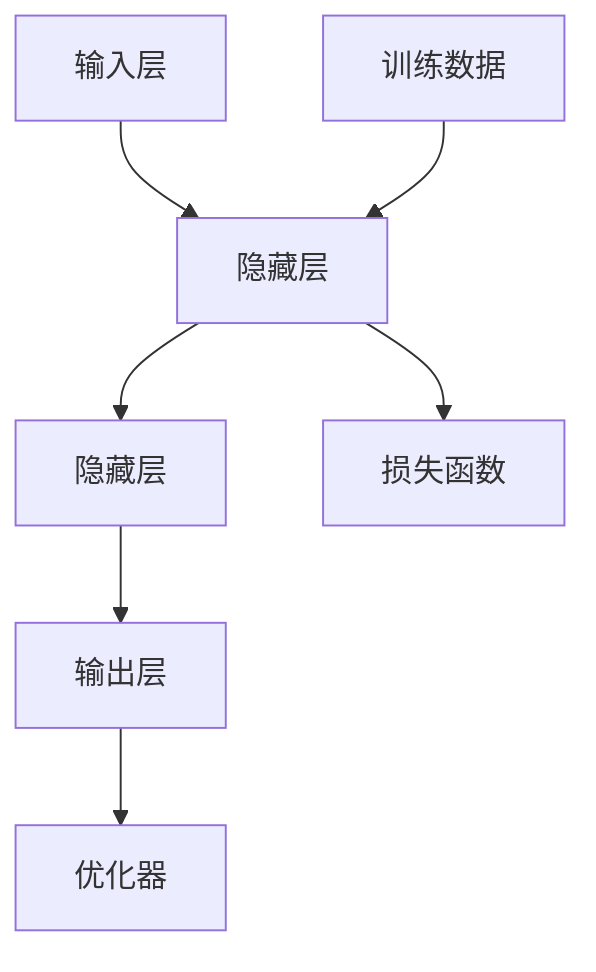
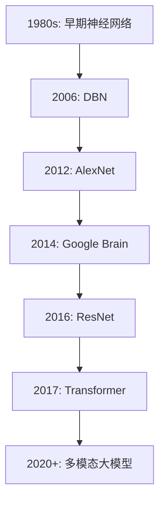

                 

# AI 大模型创业：如何利用未来优势？

> **关键词：** AI 大模型、创业、深度学习、自然语言处理、图像处理、商业模式、团队协作、风险应对、可持续发展。

> **摘要：** 本文深入探讨了 AI 大模型在创业中的应用价值，分析了其核心技术、创业策略以及实战案例。通过详细讲解技术原理、风险应对策略和可持续发展路径，为 AI 大模型创业提供了有价值的指导和建议。

---

## 第一部分：AI 大模型与创业基础

### 第1章：AI 大模型概述

#### 1.1 AI 大模型的基本概念

**AI 大模型**，通常指的是那些拥有大规模参数、能够在多种任务上取得显著性能的深度学习模型。这些模型通常基于神经网络架构，能够通过大量数据进行训练，以实现高度复杂的任务，如图像识别、自然语言处理和语音识别。

**核心概念与联系：** AI 大模型的核心是神经网络架构，其关键组成部分包括：



#### 1.2 AI 大模型的演进历程

AI 大模型的演进可以追溯到20世纪80年代的早期神经网络，但真正的大规模发展始于2012年，这一年，AlexNet模型在ImageNet图像识别挑战中取得了突破性的成绩。此后，随着计算能力的提升和大数据的普及，AI 大模型迅速发展。

**核心概念与联系：** AI 大模型的发展历程可以总结为：



#### 1.3 AI 大模型在创业中的应用价值

AI 大模型在创业中的应用价值主要体现在以下几个方面：

1. **提高效率和准确性**：AI 大模型能够处理大量数据，并从中学到有价值的信息，从而提高业务效率和准确性。
2. **创新商业模式**：AI 大模型可以为企业带来新的商业模式，例如，基于 AI 的推荐系统、智能客服和自动化决策系统。
3. **降低成本**：AI 大模型能够自动化许多繁琐的任务，从而降低人力成本。

### 第2章：AI 大模型核心技术

#### 2.1 深度学习基础

深度学习是 AI 大模型的核心技术，它基于多层神经网络进行数据学习和特征提取。

**核心算法原理讲解：** 深度学习的核心算法包括：

```plaintext
// 输入层
x = x_input

// 隐藏层
for layer in hidden_layers:
    z = np.dot(w, x) + b
    a = sigmoid(z)
    x = a

// 输出层
z = np.dot(w, x) + b
a = sigmoid(z)

// 损失函数
loss = mse(a, y)

// 优化器
w_new = w - learning_rate * gradient(w)
```

**数学模型和公式：**

$$
\text{sigmoid}(x) = \frac{1}{1 + e^{-x}}
$$

$$
\text{mse}(a, y) = \frac{1}{m} \sum_{i=1}^{m} (a_i - y_i)^2
$$

#### 2.2 自然语言处理

自然语言处理（NLP）是 AI 大模型的重要应用领域，它涉及到文本的理解、生成和翻译。

**核心算法原理讲解：** NLP 的核心算法包括：

```plaintext
// 词嵌入
embeddings = embed(input)

// 编码器
encoded = encoder(embeddings)

// 解码器
decoded = decoder(encoded)

// 输出
output = softmax(decoded)
```

**数学模型和公式：**

$$
\text{embed}(word) = \text{matrix} \cdot \text{vector}_{word}
$$

$$
\text{softmax}(x) = \frac{e^x}{\sum_{i} e^x_i}
$$

#### 2.3 图像处理

图像处理是 AI 大模型的另一个重要应用领域，它涉及到图像的识别、分类和生成。

**核心算法原理讲解：** 图像处理的核心算法包括：

```plaintext
// 卷积层
conv_output = conv2d(input, filter)

// 池化层
pooled_output = max_pool2d(conv_output)

// 全连接层
output = flatten(pooled_output)
output = dense(output, num_classes)
output = softmax(output)
```

**数学模型和公式：**

$$
\text{conv2d}(x, f) = \text{dot}(x, f) + b
$$

$$
\text{max_pool2d}(x) = \text{max}(\text{window}(x))
$$

## 第二部分：AI 大模型创业实战

### 第3章：AI 大模型创业策略

#### 3.1 市场调研与需求分析

在 AI 大模型创业之前，进行充分的市场调研和需求分析至关重要。这包括：

- **市场分析**：了解当前市场趋势、竞争对手和用户需求。
- **技术分析**：评估 AI 大模型技术的成熟度和可行性。
- **需求分析**：确定目标用户群体的需求和痛点。

#### 3.2 商业模式设计

商业模式设计是 AI 大模型创业的关键环节，它需要考虑以下几个方面：

- **产品定位**：明确产品的市场定位和目标用户群体。
- **盈利模式**：确定产品的盈利模式，如订阅、广告、交易等。
- **市场推广**：制定有效的市场推广策略，提高品牌知名度和市场份额。

#### 3.3 创业团队组建与资源整合

创业团队的成功离不开优秀的团队成员和资源整合。

- **团队成员**：组建一支具备深厚技术背景和市场经验的团队。
- **资源整合**：整合外部资源，如资金、技术和市场资源，以支持创业项目。

## 第三部分：AI 大模型创业实践

### 第4章：AI 大模型创业案例分析

#### 4.1 案例一：自然语言处理在客户服务中的应用

该案例展示了自然语言处理技术在客户服务中的应用，通过自动化客服系统提高客户满意度和降低运营成本。

**核心算法原理讲解：** 自然语言处理在客户服务中的应用主要包括：

```plaintext
// 客户提问
input = "我想要退换货"

// 词嵌入
embeddings = embed(input)

// 编码器
encoded = encoder(embeddings)

// 解码器
decoded = decoder(encoded)

// 输出
output = softmax(decoded)
```

**数学模型和公式：**

$$
\text{embed}(word) = \text{matrix} \cdot \text{vector}_{word}
$$

$$
\text{softmax}(x) = \frac{e^x}{\sum_{i} e^x_i}
$$

#### 4.2 案例二：计算机视觉在安防领域的应用

该案例展示了计算机视觉技术在安防领域的应用，通过实时监控和智能分析提高安全保障。

**核心算法原理讲解：** 计算机视觉在安防领域的应用主要包括：

```plaintext
// 图像输入
input = image

// 卷积层
conv_output = conv2d(input, filter)

// 池化层
pooled_output = max_pool2d(conv_output)

// 全连接层
output = flatten(pooled_output)
output = dense(output, num_classes)
output = softmax(output)
```

**数学模型和公式：**

$$
\text{conv2d}(x, f) = \text{dot}(x, f) + b
$$

$$
\text{max\_pool2d}(x) = \text{max}(\text{window}(x))
$$

#### 4.3 案例三：推荐系统在电子商务中的应用

该案例展示了推荐系统在电子商务中的应用，通过个性化推荐提高用户购物体验和转化率。

**核心算法原理讲解：** 推荐系统的核心算法主要包括：

```plaintext
// 用户行为数据
user行为数据

// 物品特征数据
item特征数据

// 协同过滤
user_item_matrix = user行为数据 * item特征数据

// 预测评分
预测评分 = user_item_matrix * user嵌入向量 * item嵌入向量
```

**数学模型和公式：**

$$
\text{预测评分} = \text{user\_item\_matrix} \cdot \text{user\_embed\_vector} \cdot \text{item\_embed\_vector}
$$

### 第5章：AI 大模型创业实践

#### 5.1 创业项目策划与实施

创业项目策划与实施是 AI 大模型创业的核心环节，包括以下几个方面：

- **项目策划**：明确项目目标、技术和市场策略。
- **实施计划**：制定详细的实施计划，包括开发进度、资源调配和风险评估。

#### 5.2 数据采集与处理

数据采集与处理是 AI 大模型创业的重要环节，包括以下几个方面：

- **数据采集**：收集相关领域的结构化和非结构化数据。
- **数据处理**：对数据进行清洗、标注和整合，以支持模型训练。

#### 5.3 模型训练与优化

模型训练与优化是 AI 大模型创业的核心环节，包括以下几个方面：

- **模型训练**：使用大量数据进行模型训练，提高模型性能。
- **模型优化**：通过调整模型参数和结构，提高模型效果。

### 第6章：AI 大模型创业风险与应对策略

#### 6.1 技术风险与管理风险

AI 大模型创业面临的技术风险和管理风险包括：

- **技术风险**：包括算法可靠性、数据安全和模型效果等问题。
- **管理风险**：包括团队协作、项目管理和资源配置等问题。

**应对策略：**

- **技术风险**：通过严格的测试和验证机制，确保模型可靠性和安全性。
- **管理风险**：建立完善的团队协作机制和项目管理流程，确保项目顺利进行。

#### 6.2 财务风险与市场风险

AI 大模型创业面临的财务风险和市场风险包括：

- **财务风险**：包括资金短缺、成本控制和盈利模式等问题。
- **市场风险**：包括市场需求、竞争环境和用户接受度等问题。

**应对策略：**

- **财务风险**：通过合理的融资计划和成本控制，确保资金充足。
- **市场风险**：通过深入的市场调研和精准的市场定位，确保产品竞争力。

#### 6.3 法律风险与合规性

AI 大模型创业面临的法律风险与合规性问题包括：

- **法律风险**：包括知识产权保护、隐私保护和数据安全等问题。
- **合规性**：包括法律法规、行业标准和道德规范等问题。

**应对策略：**

- **法律风险**：通过专业的法律顾问和合规审查，确保公司运营合法合规。
- **合规性**：建立完善的合规管理体系，确保公司业务符合相关法律法规和行业标准。

### 第7章：AI 大模型创业的可持续发展

#### 7.1 创新能力培养

创新能力培养是 AI 大模型创业的可持续发展关键，包括以下几个方面：

- **技术创新**：通过持续的技术研发和创新，推动业务发展。
- **模式创新**：通过创新的商业模式和业务模式，提高市场竞争力。

#### 7.2 团队协作与文化建设

团队协作与文化建设是 AI 大模型创业的重要支撑，包括以下几个方面：

- **团队建设**：建立高效协作的团队，提高整体执行力。
- **文化建设**：打造积极向上的企业文化，提高员工凝聚力和归属感。

#### 7.3 持续学习与成长

持续学习与成长是 AI 大模型创业的关键，包括以下几个方面：

- **知识更新**：持续学习最新的技术和市场知识，保持竞争优势。
- **人才培养**：通过培训和激励，提高员工的专业能力和综合素质。

## 附录

### 附录 A：AI 大模型创业资源与工具

#### A.1 开发工具与框架

- **TensorFlow**：开源的深度学习框架，适用于各种深度学习模型的开发。
- **PyTorch**：开源的深度学习框架，具有灵活的动态计算图。
- **Keras**：基于 TensorFlow 的简单而强大的深度学习库。

#### A.2 数据集与开源代码

- **ImageNet**：大规模的图像数据集，用于图像识别任务。
- **COCO 数据集**：用于目标检测和分割的多模态数据集。
- **OpenAI Gym**：开源的强化学习环境，包含多种任务和模拟环境。

#### A.3 学术论文与文献推荐

- **“Deep Learning”**：Ian Goodfellow, Yoshua Bengio, Aaron Courville 著，深度学习领域的经典教材。
- **“Reinforcement Learning: An Introduction”**：Richard S. Sutton, Andrew G. Barto 著，强化学习领域的经典教材。
- **“Natural Language Processing with Python”**：Steven Bird, Ewan Klein, Edward Loper 著，Python 中的自然语言处理教程。

### 作者

**作者：** AI 天才研究院/AI Genius Institute & 禅与计算机程序设计艺术 /Zen And The Art of Computer Programming**

