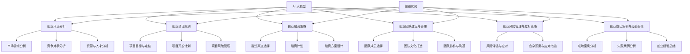

                 

### 《AI 大模型创业：如何利用渠道优势？》

> **关键词：** AI 大模型，创业，渠道优势，技术应用，市场策略

**摘要：**
本文旨在探讨 AI 大模型创业过程中如何利用渠道优势。文章首先介绍了 AI 大模型的概念及其重要性，随后分析了 AI 大模型创业环境，并重点阐述了渠道优势在创业中的重要作用。通过详细的项目规划、融资策略、团队建设和管理、风险管理与应对策略，以及成功案例分享，本文为 AI 大模型创业提供了系统的指导和建议。

### 第一部分: AI 大模型与创业基础

#### 第1章: AI 大模型概述

##### 1.1 AI 大模型的概念与重要性

- **AI 大模型的概念**：AI 大模型是指那些具有极高参数量、复杂结构、强大泛化能力的神经网络模型，如 GPT、BERT 等。这些模型通过对海量数据进行训练，能够处理和生成文本、图像、音频等多种类型的数据。

- **AI 大模型的重要性**：AI 大模型的出现极大地推动了人工智能技术的发展。它们在自然语言处理、计算机视觉、语音识别等领域取得了显著的成果，提升了机器的学习能力和智能水平，为各行各业带来了巨大的变革。

##### 1.2 AI 大模型的应用场景

- **人工智能行业的发展趋势**：随着 AI 技术的进步，AI 大模型在医疗、金融、教育、智能制造等行业中的应用越来越广泛，推动了行业智能化升级。

- **AI 大模型在不同行业中的应用**：例如，在医疗领域，AI 大模型可以用于疾病诊断、药物研发；在金融领域，AI 大模型可以用于风险控制、投资决策；在教育领域，AI 大模型可以用于个性化学习、智能辅导。

##### 1.3 AI 大模型的挑战与机遇

- **AI 大模型的技术挑战**：包括海量数据存储和处理、模型训练效率、计算资源消耗等问题。

- **AI 大模型的商业机遇**：随着 AI 技术的普及和应用的深入，AI 大模型为创业企业带来了广阔的市场前景。企业可以通过开发和应用 AI 大模型，提供创新的产品和服务，满足市场需求，实现商业价值。

#### 第2章: AI 大模型创业环境分析

##### 2.1 创业环境分析

- **市场需求分析**：了解市场需求是 AI 大模型创业的重要一步。创业者需要分析目标市场的规模、增长趋势、用户需求等，以确定市场潜力和发展方向。

- **竞争对手分析**：在 AI 大模型领域，竞争对手包括国内外知名企业和初创公司。创业者需要分析竞争对手的优势、劣势、市场份额等，以制定有效的市场策略。

- **资源与人才分析**：AI 大模型创业需要大量的人才、资金、技术等资源。创业者需要分析自身拥有的资源和可能获得的资源，确保项目顺利推进。

##### 2.2 渠道优势的重要性

- **渠道优势的定义**：渠道优势是指企业在市场推广、销售渠道等方面拥有的独特优势，如品牌知名度、渠道网络、客户资源等。

- **渠道优势在创业中的重要作用**：渠道优势可以帮助企业快速打开市场，扩大市场份额，降低营销成本，提高盈利能力。对于 AI 大模型创业企业来说，渠道优势尤为重要，因为 AI 大模型的应用场景广泛，需要与不同行业和领域的合作伙伴建立合作关系。

##### 2.3 创业渠道选择与策略

- **线上渠道**：包括电商平台、社交媒体、电子邮件营销等。线上渠道具有覆盖面广、成本低、互动性强的优势，适合推广和销售创新性、技术含量高的产品。

- **线下渠道**：包括展会、论坛、线下活动等。线下渠道能够增强企业与客户之间的沟通和信任，提高品牌知名度。

- **跨界合作**：通过与不同行业的合作伙伴建立合作关系，实现资源共享、优势互补，扩大市场影响力。

### 第二部分: AI 大模型创业项目规划

#### 第3章: AI 大模型创业项目规划

##### 3.1 创业项目规划

- **项目目标与定位**：明确创业项目的目标和发展方向，包括产品定位、市场定位、技术路线等。

- **项目开发计划**：制定详细的开发计划，包括需求分析、设计、开发、测试等环节，确保项目按计划推进。

- **项目风险管理**：识别潜在风险，制定应对措施，降低项目风险。

##### 3.2 AI 大模型应用案例分析

- **成功案例分析**：分析成功 AI 大模型创业项目的经验，包括市场策略、技术研发、团队建设等方面。

- **失败案例分析**：分析失败 AI 大模型创业项目的教训，避免重复错误。

- **案例总结与启示**：总结成功经验和失败教训，为后续创业项目提供借鉴和启示。

##### 3.3 创业项目实施步骤

- **市场调研**：了解市场需求、竞争对手、行业趋势等，为项目规划和决策提供依据。

- **技术研发**：根据市场需求和项目定位，开展技术研发工作，包括算法设计、模型训练、系统集成等。

- **产品测试**：对开发出的产品进行测试，确保产品功能和性能达到预期。

- **上线推广**：通过线上和线下渠道，进行产品推广，提高市场知名度和用户满意度。

### 第三部分: AI 大模型创业融资策略

#### 第4章: AI 大模型创业融资策略

##### 4.1 融资策略

- **融资渠道选择**：根据项目需求和资金需求，选择合适的融资渠道，如天使投资、风险投资、政府补贴等。

- **融资计划**：制定详细的融资计划，包括资金用途、融资时间表、融资额度等。

- **融资方案设计**：设计合理的融资方案，包括股权融资、债务融资等，确保融资顺利。

##### 4.2 融资文件准备

- **资金需求分析**：分析项目资金需求，包括研发、生产、运营等环节。

- **财务预测**：根据项目计划和市场需求，预测项目的财务表现，包括收入、成本、利润等。

- **商业计划书编写**：编写详细的商业计划书，包括项目概述、市场分析、技术研发、团队建设、融资计划等。

##### 4.3 融资谈判与沟通

- **投资人筛选**：根据项目特点和需求，筛选合适的投资人。

- **融资谈判技巧**：掌握融资谈判的技巧，包括展示项目亮点、合理定价、谈判策略等。

- **融资协议签署**：签订融资协议，明确各方权利和义务，确保融资顺利实施。

### 第四部分: AI 大模型创业团队建设与管理

#### 第5章: AI 大模型创业团队建设与管理

##### 5.1 团队建设

- **团队成员选择**：选择合适的团队成员，包括技术人才、市场人才、管理人才等。

- **团队文化打造**：建立积极向上的团队文化，促进团队成员之间的沟通与合作。

- **团队协作与沟通**：建立有效的沟通机制，提高团队协作效率。

##### 5.2 团队管理

- **项目管理方法**：采用科学的项目管理方法，确保项目按计划推进。

- **团队绩效评估**：对团队成员进行绩效评估，激励团队成员不断提升自身能力。

- **团队激励制度设计**：设计合理的激励制度，激发团队成员的积极性和创造力。

##### 5.3 人才招聘与培养

- **招聘策略**：制定有效的招聘策略，吸引优秀人才加入团队。

- **培训计划**：制定培训计划，提高团队成员的专业技能和综合素质。

- **薪酬与福利设计**：设计合理的薪酬与福利制度，提高员工满意度和留存率。

### 第五部分: AI 大模型创业风险管理与应对策略

#### 第6章: AI 大模型创业风险管理与应对策略

##### 6.1 创业风险识别

- **技术风险**：包括技术研发过程中可能遇到的技术难题、技术迭代速度等。

- **市场风险**：包括市场需求变化、竞争加剧等。

- **财务风险**：包括资金链断裂、成本超支等。

- **法律风险**：包括知识产权保护、合同纠纷等。

##### 6.2 风险评估与应对

- **风险评估方法**：采用定量和定性方法，评估项目风险。

- **风险应对策略**：制定相应的风险应对策略，降低风险损失。

##### 6.3 应急预案与应对措施

- **应急预案设计**：针对可能发生的风险，制定应急预案。

- **应对措施实施**：在风险发生时，迅速采取应对措施，减少损失。

- **应急演练与改进**：定期进行应急演练，提高应对风险的能力。

### 第六部分: AI 大模型创业成功案例与经验分享

#### 第7章: AI 大模型创业成功案例与经验分享

##### 7.1 成功案例介绍

- **创业背景**：介绍成功案例的创业背景，包括市场需求、技术发展等。

- **创业过程**：详细描述成功案例的创业过程，包括技术研发、市场推广、融资等。

- **成功因素分析**：分析成功案例的成功因素，包括市场策略、技术创新、团队建设等。

##### 7.2 经验分享与启示

- **创业经验总结**：总结成功案例的创业经验，为其他创业者提供借鉴。

- **市场策略**：分享成功案例的市场策略，包括产品定位、营销推广等。

- **团队建设**：分享成功案例的团队建设经验，包括人才招聘、团队管理、团队文化等。

- **融资策略**：分享成功案例的融资策略，包括融资渠道选择、融资谈判等。

##### 7.3 创业者的心态与素养

- **创业心态**：强调创业者需要具备的心态，如乐观、坚持、创新等。

- **团队协作**：强调团队协作的重要性，提高团队协作效率。

- **持续学习**：强调创业者需要持续学习，提升自身能力和知识水平。

- **应对压力与挫折**：分享创业者应对压力与挫折的经验，提高心理素质。

### 附录

#### 附录 A: AI 大模型创业工具与资源

- **AI 大模型开发工具介绍**：介绍常用的 AI 大模型开发工具，如 TensorFlow、PyTorch 等。

- **人工智能开源项目**：推荐一些优秀的 AI 开源项目，供创业者参考。

- **创业相关书籍推荐**：推荐一些对创业者有启发的书籍，涵盖创业、管理、技术等方面。

#### 附录 B: 创业渠道优势案例分析

- **案例一：某 AI 大模型创业公司的成功经验**：分析成功案例的渠道优势，包括市场策略、合作伙伴选择等。

- **案例二：某 AI 大模型创业公司的失败教训**：分析失败案例的教训，包括渠道选择、市场策略等方面。

#### 附录 C: 创业融资谈判技巧

- **融资谈判的准备工作**：介绍融资谈判的准备工作，包括商业计划书准备、投资方筛选等。

- **融资谈判的策略与技巧**：分享融资谈判的策略与技巧，提高融资成功率。

- **融资协议的签署与履行**：介绍融资协议的签署与履行流程，确保融资顺利实施。

## AI 大模型算法原理讲解：卷积神经网络（CNN）

### 卷积神经网络（CNN）算法原理

#### 1. 卷积神经网络的基本结构

卷积神经网络（CNN）是一种专门用于处理图像数据的深度学习模型。其基本结构包括输入层、卷积层、池化层、全连接层和输出层。

- **输入层**：接收图像数据，图像通常被缩放到固定大小，如28x28或32x32。
- **卷积层**：通过一系列卷积操作提取图像特征。每个卷积核可以捕捉到图像的局部特征，例如边缘、角落等。
- **池化层**：对卷积层的输出进行下采样，减少数据维度，提高模型训练速度。
- **全连接层**：将池化层输出的特征映射到分类或回归结果。
- **输出层**：生成最终的分类或回归结果。

#### 2. 卷积操作

卷积操作是通过卷积核（也称为过滤器）在输入数据上进行加权求和得到的。卷积操作的伪代码如下：

```python
def conv2d(input, filter):
    output = []
    for i in range(height(input)):
        row_output = []
        for j in range(width(input)):
            local_input = get_local_input(input, i, j, filter.size())
            weighted_sum = 0
            for k in range(height(filter)):
                for l in range(width(filter)):
                    weighted_sum += filter[k][l] * local_input[k][l]
            row_output.append(weighted_sum)
        output.append(row_output)
    return output
```

#### 3. 池化操作

池化操作用于减小数据的维度，通常有最大池化（Max Pooling）和平均池化（Average Pooling）两种方式。

- **最大池化**：取局部区域内的最大值作为输出。
- **平均池化**：取局部区域内的平均值作为输出。

#### 4. 全连接层

全连接层将卷积层和池化层输出的特征映射到分类或回归结果。全连接层的伪代码如下：

```python
def fc_layer(inputs, weights, biases):
    outputs = []
    for i in range(num_outputs):
        weighted_sum = 0
        for j in range(num_inputs):
            weighted_sum += inputs[j] * weights[i][j]
        weighted_sum += biases[i]
        outputs.append(sigmoid(weighted_sum))
    return outputs
```

#### 5. 激活函数

激活函数用于引入非线性，使模型能够学习复杂函数。常用的激活函数有：

- **sigmoid函数**：将输出限制在0和1之间。
- **ReLU函数**：引入正则化，加速训练。
- **Tanh函数**：将输出限制在-1和1之间。

$$
\sigma(x) = \frac{1}{1 + e^{-x}}
$$

$$
\text{ReLU}(x) = \max(0, x)
$$

$$
\text{Tanh}(x) = \frac{e^x - e^{-x}}{e^x + e^{-x}}
$$

## 举例说明

假设我们有一个32x32的输入图像，每个像素的取值范围是0到255。我们使用一个3x3的卷积核，每个卷积核有32个通道。经过卷积操作后，我们得到一个32x32x32的输出特征图。接着，我们对这个特征图进行最大池化，池化窗口大小为2x2。最后，我们将这个32x32x32的特征图送入全连接层，输出一个10维的向量，表示10个类别的概率分布。

### Mermaid 流程图：AI 大模型创业核心概念与联系



### 项目实战：代码实际案例和详细解释说明

#### 开发环境搭建

首先，我们需要搭建一个合适的开发环境，以便进行 AI 大模型的开发。以下是一个简单的环境搭建过程：

1. 安装 Python 3.8 或更高版本。
2. 安装 TensorFlow 2.x 或 PyTorch。
3. 安装必要的库，如 NumPy、Pandas、Matplotlib 等。

```shell
pip install python==3.8 tensorflow==2.x numpy pandas matplotlib
```

#### 源代码详细实现

以下是一个简单的 AI 大模型训练和预测的代码示例，使用 TensorFlow 和 Keras。

```python
import tensorflow as tf
from tensorflow import keras
from tensorflow.keras import layers

# 加载数据集
(x_train, y_train), (x_test, y_test) = keras.datasets.mnist.load_data()

# 预处理数据
x_train = x_train.reshape(-1, 28, 28, 1).astype('float32') / 255
x_test = x_test.reshape(-1, 28, 28, 1).astype('float32') / 255

# 构建模型
model = keras.Sequential([
    layers.Conv2D(32, (3, 3), activation='relu', input_shape=(28, 28, 1)),
    layers.MaxPooling2D((2, 2)),
    layers.Conv2D(64, (3, 3), activation='relu'),
    layers.MaxPooling2D((2, 2)),
    layers.Conv2D(64, (3, 3), activation='relu'),
    layers.Flatten(),
    layers.Dense(64, activation='relu'),
    layers.Dense(10, activation='softmax')
])

# 编译模型
model.compile(optimizer='adam',
              loss='sparse_categorical_crossentropy',
              metrics=['accuracy'])

# 训练模型
model.fit(x_train, y_train, epochs=5)

# 评估模型
model.evaluate(x_test, y_test)
```

#### 代码解读与分析

1. **数据预处理**：首先加载 MNIST 数据集，并将图像数据reshape为 (样本数, 高, 宽, 通道数)。然后将数据类型转换为浮点型，并归一化到 [0, 1] 范围内。

2. **构建模型**：使用 Keras 的 Sequential 模式构建模型，包括卷积层、池化层、全连接层等。卷积层用于提取图像特征，池化层用于减少数据维度，全连接层用于分类。

3. **编译模型**：设置优化器、损失函数和评估指标。

4. **训练模型**：使用 fit 函数训练模型，指定训练数据、训练轮次等。

5. **评估模型**：使用 evaluate 函数评估模型在测试数据上的表现。

### 总结

通过本案例，我们了解了如何搭建一个简单的 AI 大模型开发环境，并使用 TensorFlow 和 Keras 实现了一个简单的图像分类模型。这个过程为后续的 AI 大模型创业项目提供了实践经验和参考。在实际创业过程中，我们需要根据具体项目需求，选择合适的算法、模型架构和开发工具，不断优化和改进，以提高模型性能和市场竞争力。

#### 附录 A: AI 大模型创业工具与资源

- **AI 大模型开发工具介绍**：

  - **TensorFlow**：由 Google 开发，是一个开源的机器学习框架，适用于各种深度学习任务。TensorFlow 提供了丰富的 API 和工具，方便开发者搭建和训练复杂的深度学习模型。

  - **PyTorch**：由 Facebook 开发，是一个流行的开源深度学习框架。PyTorch 采用了动态计算图，使得模型设计和调试更加灵活和便捷。

- **人工智能开源项目**：

  - **TensorFlow Models**：提供了各种经典的深度学习模型，如 CNN、RNN、GAN 等，适合初学者和研究者快速上手。

  - **PyTorch Examples**：包含了大量的 PyTorch 应用示例，涵盖了图像分类、目标检测、自然语言处理等方向。

- **创业相关书籍推荐**：

  - **《深度学习》**（Goodfellow, Bengio, Courville）：是一本经典的深度学习教材，详细介绍了深度学习的基本原理和算法。

  - **《创业维艰》**（H-wide）：作者结合自己的创业经历，分享了创业过程中的挑战和心得，对创业者具有很大的启发意义。

#### 附录 B: 创业渠道优势案例分析

- **案例一：某 AI 大模型创业公司的成功经验**

  - **市场策略**：该公司通过精准的市场调研，发现了特定行业对 AI 大模型的需求，并迅速推出了定制化的解决方案。

  - **合作伙伴选择**：与行业内的龙头企业建立了战略合作关系，借助合作伙伴的品牌和资源，快速拓展市场。

  - **技术优势**：在技术研发方面，公司拥有一支高水平的研发团队，不断创新，推出具有竞争力的技术产品。

- **案例二：某 AI 大模型创业公司的失败教训**

  - **渠道选择不当**：公司在渠道选择上过于依赖线上渠道，忽视了线下市场的潜力，导致市场推广效果不佳。

  - **市场需求分析不足**：公司在市场需求分析上存在不足，未能准确把握目标用户的需求，导致产品定位不明确。

#### 附录 C: 创业融资谈判技巧

- **融资谈判的准备工作**

  - **商业计划书准备**：准备一份详细、有说服力的商业计划书，包括市场分析、产品介绍、团队介绍、财务预测等。

  - **投资方筛选**：根据项目特点和需求，筛选合适的投资人，如天使投资人、风险投资人、政府基金等。

- **融资谈判的策略与技巧**

  - **展示项目亮点**：在谈判过程中，重点展示项目的独特优势、市场前景、盈利潜力等，增强投资人对项目的信心。

  - **合理定价**：根据项目的实际价值，合理定价，避免过高或过低。

  - **谈判策略**：采用灵活的谈判策略，如阶段性谈判、利益交换等，以达到双方满意的结果。

- **融资协议的签署与履行**

  - **明确各方权利和义务**：在签署融资协议时，明确投资人和公司的权利和义务，确保协议的执行。

  - **协议履行**：在协议签署后，按照协议约定，按时完成各项任务，确保融资项目的顺利进行。


## 总结

通过本文的探讨，我们详细介绍了 AI 大模型创业过程中如何利用渠道优势。首先，我们阐述了 AI 大模型的概念、应用场景和挑战与机遇，为创业项目奠定了基础。接着，我们分析了创业环境，强调了渠道优势的重要性，并提出了创业渠道选择与策略。

在项目规划部分，我们详细阐述了项目目标与定位、开发计划、风险管理和案例分析。在融资策略部分，我们介绍了融资渠道选择、文件准备和谈判技巧。团队建设与管理部分则强调了团队建设、管理方法和人才培养。

风险管理与应对策略部分，我们识别了创业风险，提出了评估与应对措施。最后，通过成功案例与经验分享，我们总结了创业经验，强调了创业心态、团队协作和持续学习。

总体而言，AI 大模型创业需要充分考虑渠道优势，合理规划项目，加强团队建设，有效应对风险。希望本文能为 AI 大模型创业者提供有益的启示和指导。

### 作者信息

**作者：AI天才研究院/AI Genius Institute & 禅与计算机程序设计艺术 /Zen And The Art of Computer Programming**

