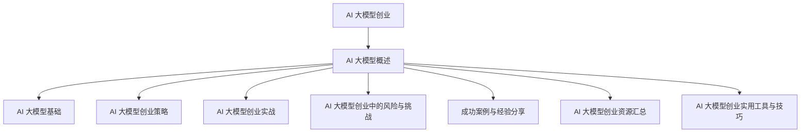

                 

### AI 大模型创业：如何利用科技优势？

> 关键词：AI大模型，创业，科技优势，商业模式，风险应对

> 摘要：本文将深入探讨 AI 大模型创业的各个方面，包括 AI 大模型的基础知识、创业策略、实战案例以及面临的挑战与应对措施。通过详细的分析与讲解，旨在为创业者提供切实可行的指导意见，帮助他们在激烈的市场竞争中脱颖而出。

#### 第一部分：AI 大模型概述

**第1章 AI大模型基础**

**1.1 AI大模型的概念与分类**

AI大模型是人工智能领域的一个重要分支，指的是利用海量数据通过深度学习算法进行训练的复杂模型。这些模型具有强大的学习能力，能够处理大规模数据并提取出有效信息。

### 1.1.1 AI大模型的概念

AI大模型（Large-scale AI Models）通常是指那些参数数量巨大、计算量庞大的深度学习模型。这些模型能够通过大规模数据训练来提高其性能，广泛应用于图像识别、自然语言处理、语音识别等领域。

### 1.1.2 AI大模型的分类

AI大模型可以分为以下几类：

1. **计算机视觉模型**：如卷积神经网络（CNN）、生成对抗网络（GAN）等。
2. **自然语言处理模型**：如 Transformer、BERT 等。
3. **语音处理模型**：如 WaveNet、DeepSpeech 等。

### 1.1.3 AI大模型的应用领域

AI大模型在各个行业都有着广泛的应用：

1. **医疗健康**：用于疾病诊断、药物研发等。
2. **金融科技**：用于风险管理、欺诈检测等。
3. **自动驾驶**：用于车辆识别、路径规划等。
4. **智能助手**：用于语音识别、聊天机器人等。

**1.2 AI大模型的架构与技术原理**

AI大模型的架构通常包含以下几个部分：

### 1.2.1 AI大模型的架构

- **数据输入层**：接收外部输入数据。
- **隐藏层**：进行数据特征提取和变换。
- **输出层**：产生预测结果或分类结果。

### 1.2.2 深度学习与神经网络基础

- **深度学习**：是一种机器学习方法，通过构建多个神经层来实现数据的非线性变换。
- **神经网络**：是一种模拟人脑神经元连接的计算机模型。

### 1.2.3 大规模预训练模型原理

- **预训练**：在大规模数据集上预先训练模型，使其具备一定的泛化能力。
- **微调**：在特定任务上对预训练模型进行微调，以提高任务性能。

### 1.2.4 AI大模型的核心算法

- **优化算法**：如随机梯度下降（SGD）、Adam 等。
- **正则化方法**：如权重衰减、Dropout 等。

**1.3 AI大模型的发展趋势与未来展望**

AI大模型的发展趋势包括：

- **模型规模不断扩大**：随着计算能力和数据量的增加，模型规模将持续增长。
- **算法创新**：如自监督学习、联邦学习等新型算法的出现。
- **应用领域拓展**：AI大模型将在更多新兴领域得到应用。

未来，AI大模型将在推动科技进步、产业升级、社会进步等方面发挥重要作用。

#### 第二部分：AI 大模型创业策略

**第2章 AI 大模型创业的商业模式**

**2.1 AI 大模型创业的挑战与机遇**

AI 大模型创业面临着一系列的挑战和机遇：

### 2.1.1 AI 大模型创业的挑战

- **计算资源需求巨大**：训练大模型需要大量计算资源和存储资源。
- **数据隐私与安全**：涉及用户数据的处理必须严格遵守隐私法规。
- **算法创新与保护**：需要持续创新以保持竞争优势，同时保护知识产权。

### 2.1.2 AI 大模型创业的机遇

- **市场需求旺盛**：随着 AI 技术的普及，对大模型的需求不断增长。
- **技术进步**：计算能力的提升和新型算法的出现为创业提供了更多机会。
- **跨界合作**：与其他行业的深度融合将带来新的商业模式和商业机会。

### 2.1.3 创业者的角色与职责

创业者需要扮演多重角色：

- **技术领导者**：引领团队进行技术创新和算法优化。
- **商业战略家**：制定商业模式和商业策略，把握市场动态。
- **团队建设者**：招募和培养优秀的团队成员，形成高效协作的团队。

**2.2 AI 大模型创业的商业模式设计**

一个成功的 AI 大模型创业项目需要精心设计的商业模式：

### 2.2.1 商业模式的基本框架

- **价值主张**：明确产品或服务的核心价值。
- **客户获取**：确定目标市场和客户群体，制定营销策略。
- **客户关系**：建立与客户的长期合作关系。
- **渠道**：确定产品或服务的销售和分发渠道。
- **收入来源**：明确收入来源，如订阅费、交易费等。

### 2.2.2 AI 大模型创业的盈利模式

AI 大模型创业项目的盈利模式可能包括：

- **技术服务**：为客户提供定制化的 AI 解决方案。
- **数据服务**：提供高质量的数据集或数据服务。
- **产品销售**：销售自主研发的 AI 产品或硬件设备。

### 2.2.3 创业项目的核心价值主张

创业项目的核心价值主张应聚焦于以下几个方面：

- **技术创新**：提供领先的 AI 算法和模型。
- **客户体验**：注重用户体验和满意度。
- **行业定制**：提供符合特定行业需求的解决方案。

**2.3 AI 大模型创业的团队建设与管理**

团队建设和管理是创业成功的关键：

### 2.3.1 团队建设的关键要素

- **技术人才**：招募具备深厚技术背景的团队成员。
- **跨学科人才**：整合不同领域的专业人才，形成多元化团队。
- **领导力**：培养和传承优秀的领导力。

### 2.3.2 管理与领导力的重要性

- **有效的沟通**：确保团队内部的信息畅通和协同合作。
- **激励与成长**：激发团队成员的积极性和创造力，提供成长机会。
- **风险管理**：识别和管理创业过程中的风险。

### 2.3.3 创业团队的组织结构与职责分配

- **扁平化管理**：减少层级，提高决策效率。
- **专业分工**：明确团队内部的职责分工。
- **协作机制**：建立良好的跨部门协作机制。

#### 第三部分：AI 大模型创业实战

**第3章 AI 大模型创业项目规划与执行**

**3.1 项目规划与需求分析**

创业项目的规划与需求分析是项目成功的基础：

### 3.1.1 项目规划的方法与工具

- **项目计划书**：详细描述项目的目标、范围、时间表和资源需求。
- **项目管理工具**：如 Jira、Trello 等，用于任务跟踪和进度管理。

### 3.1.2 需求分析的过程与技巧

- **用户调研**：通过访谈、问卷调查等方式收集用户需求。
- **需求文档**：明确项目需求，包括功能需求和非功能需求。

### 3.1.3 项目目标与 KPI 设定

- **SMART 原则**：确保项目目标是具体、可衡量、可实现、相关和时限性的。
- **KPI 设定**：制定关键绩效指标，用于评估项目进展和成果。

**3.2 技术选型与研发流程**

技术选型与研发流程是项目实施的关键环节：

### 3.2.1 技术选型的关键因素

- **性能要求**：确保所选技术能够满足项目需求。
- **可扩展性**：技术应具有较好的可扩展性，以应对未来需求变化。
- **生态支持**：考虑技术社区的活跃度和第三方库的支持。

### 3.2.2 研发流程的优化与标准化

- **敏捷开发**：采用敏捷开发方法，提高开发效率和质量。
- **代码审查**：通过代码审查确保代码质量。
- **持续集成/持续部署（CI/CD）**：实现自动化测试和部署，提高交付效率。

### 3.2.3 技术攻关与问题解决

- **问题定位**：快速定位技术难题的关键点。
- **团队合作**：组织团队协作，共同攻克技术难题。

**3.3 产品设计与用户体验**

产品设计与用户体验是项目成功的重要因素：

### 3.3.1 产品设计的原则与方法

- **用户中心设计**：以用户需求为导向，设计易用、高效的产品。
- **迭代开发**：采用迭代开发方法，不断优化产品。

### 3.3.2 用户体验的重要性

- **用户满意度**：直接影响产品的市场表现和用户忠诚度。
- **市场竞争力**：优质的用户体验是赢得市场竞争的重要因素。

### 3.3.3 用户调研与需求反馈

- **用户访谈**：深入了解用户需求和行为习惯。
- **需求反馈**：收集用户反馈，不断改进产品。

**3.4 市场推广与运营策略**

市场推广与运营策略是项目成功的关键环节：

### 3.4.1 市场推广的方法与渠道

- **线上推广**：利用社交媒体、内容营销等方式吸引潜在用户。
- **线下活动**：举办展会、研讨会等活动，提升品牌知名度。

### 3.4.2 运营策略的制定与执行

- **用户增长策略**：通过运营活动、优惠活动等方式促进用户增长。
- **数据分析**：利用数据分析工具监测运营效果，不断优化策略。

### 3.4.3 数据分析与用户增长策略

- **用户画像**：通过数据分析建立用户画像，制定精准营销策略。
- **用户留存策略**：提高用户留存率，建立用户忠诚度。

#### 第四部分：AI 大模型创业中的风险与挑战

**第4章 AI 大模型创业中的风险与挑战**

AI 大模型创业面临多种风险和挑战，需要有效的应对策略：

**4.1 技术风险与应对策略**

### 4.1.1 技术风险的类型与识别

- **算法风险**：算法不准确或过时可能影响产品性能。
- **数据风险**：数据质量差或数据泄露可能影响产品安全和隐私。

### 4.1.2 技术风险的管理与控制

- **持续创新**：通过持续技术创新保持竞争优势。
- **数据保护**：采取严格的数据保护措施，确保数据安全和隐私。

### 4.1.3 技术突破与创新能力

- **研发投入**：加大研发投入，培养技术创新能力。
- **合作伙伴**：与领先技术公司合作，共享技术资源。

**4.2 法律风险与合规性挑战**

### 4.2.1 法律风险的主要来源

- **数据保护法规**：如 GDPR、CCPA 等。
- **知识产权法规**：如专利、版权等。

### 4.2.2 合规性的重要性

- **合规性确保**：确保产品和服务符合相关法规，避免法律风险。
- **信任与声誉**：合规性是建立用户信任和品牌声誉的基础。

### 4.2.3 风险管理策略与合规措施

- **合规审计**：定期进行合规审计，确保运营符合法规要求。
- **合规培训**：加强员工的合规意识，定期进行培训。

**4.3 市场风险与竞争策略**

### 4.3.1 市场风险的评估与预测

- **市场调研**：通过市场调研了解行业动态和竞争态势。
- **预测模型**：建立预测模型，预测市场需求和竞争趋势。

### 4.3.2 竞争对手分析

- **竞争分析**：分析主要竞争对手的产品、市场策略和优势。
- **差异化策略**：通过技术创新或商业模式创新实现差异化竞争。

### 4.3.3 竞争策略的制定与实施

- **差异化定位**：明确产品或服务的差异化优势。
- **市场营销**：制定有针对性的市场营销策略，提高市场占有率。

#### 第五部分：成功案例与经验分享

**第5章 AI 大模型创业的成功案例**

**5.1 案例分析**

**5.1.1 案例选择与背景介绍**

本章节将分析几家成功的 AI 大模型创业公司，包括：

- **公司A**：专注于计算机视觉领域，为客户提供定制化的 AI 解决方案。
- **公司B**：专注于自然语言处理领域，推出先进的智能助手产品。
- **公司C**：专注于医疗健康领域，利用 AI 大模型进行疾病诊断和药物研发。

**5.1.2 案例分析的方法与步骤**

分析步骤如下：

1. **背景分析**：了解公司的创立背景、发展历程和核心团队。
2. **商业模式分析**：分析公司的商业模式、盈利模式和核心价值主张。
3. **技术创新分析**：分析公司的技术创新和算法突破。
4. **市场表现分析**：分析公司的市场表现、用户反馈和行业影响力。
5. **总结与启示**：总结案例中的成功经验和挑战，为其他创业者提供启示。

**5.1.3 案例总结与启示**

成功案例的共同特征：

1. **技术创新**：持续投入研发，实现技术突破。
2. **市场定位**：明确市场定位，专注于细分领域。
3. **用户体验**：注重用户体验，提供优质的产品和服务。

面临的挑战与解决方案：

1. **计算资源需求**：通过云计算和分布式计算解决。
2. **数据隐私与安全**：采取严格的数据保护措施，遵守相关法规。
3. **市场竞争**：通过差异化竞争策略和持续创新保持竞争优势。

**5.2 成功要素**

成功案例的关键成功要素：

1. **技术创新**：领先的技术和算法是竞争优势的核心。
2. **团队建设**：专业、高效的团队是实现目标的关键。
3. **商业模式**：清晰的商业模式和盈利模式是持续发展的基础。
4. **用户需求**：深入了解用户需求，提供满足用户需求的产品和服务。
5. **市场策略**：有针对性的市场推广和运营策略。

**5.3 经验分享**

创业者的心得体会：

1. **坚持不懈**：创业过程中会遇到各种困难和挑战，需要坚持不懈。
2. **团队协作**：团队成员之间的紧密协作是实现目标的重要保障。
3. **用户反馈**：重视用户反馈，不断优化产品和服务。
4. **持续创新**：持续投入研发，保持技术领先。

成功经验的借鉴与推广：

1. **技术创新**：积极引入先进技术，持续进行技术创新。
2. **团队建设**：招募和培养优秀人才，建立高效团队。
3. **商业模式**：探索多样化的商业模式，实现可持续盈利。
4. **用户体验**：提供优质的产品和服务，提升用户满意度。
5. **市场推广**：制定有效的市场推广策略，扩大品牌影响力。

#### 第六部分：AI 大模型创业资源汇总

**附录A：AI 大模型创业资源汇总**

为创业者提供以下 AI 大模型创业资源：

**5.3.1 学术研究资源**

- **顶级会议和期刊**：如 NeurIPS、ICLR、JMLR 等。
- **学术研究机构**：如斯坦福大学 AI 实验室、MIT AI 实验室等。
- **开源研究项目**：如 OpenAI、Facebook AI 研究院等。

**5.3.2 开源项目与工具**

- **深度学习框架**：如 TensorFlow、PyTorch、MXNet 等。
- **数据处理工具**：如 Pandas、NumPy、Scikit-learn 等。
- **机器学习库**：如 scikit-learn、XGBoost、LightGBM 等。

**5.3.3 行业报告与数据**

- **市场研究报告**：如 IDC、Gartner、Forrester 等。
- **行业数据集**：如 ImageNet、COCO 数据集等。
- **行业报告**：如 IEEE Spectrum、Forbes 等。

#### 第七部分：AI 大模型创业实用工具与技巧

**附录B：AI 大模型创业实用工具与技巧**

为创业者提供以下实用工具与技巧：

**5.3.1 创业工具推荐**

- **项目管理工具**：如 Jira、Trello、Asana 等。
- **数据分析工具**：如 Tableau、Power BI、Google Analytics 等。
- **代码管理工具**：如 Git、GitHub、GitLab 等。

**5.3.2 项目管理技巧**

- **敏捷开发**：采用敏捷开发方法，提高项目交付效率。
- **风险管理**：定期进行风险评估，制定应对策略。
- **团队协作**：利用协作工具，提高团队协作效率。

**5.3.3 市场营销策略**

- **内容营销**：通过高质量内容吸引潜在客户。
- **社交媒体营销**：利用社交媒体平台扩大品牌影响力。
- **广告营销**：通过广告投放提高品牌知名度。

### 作者

**作者：AI天才研究院/AI Genius Institute & 禅与计算机程序设计艺术 /Zen And The Art of Computer Programming**

### 总结

AI 大模型创业是一个充满机遇和挑战的领域。通过深入了解 AI 大模型的基础知识、设计合适的商业模式、实施有效的团队管理和市场推广策略，创业者可以在激烈的市场竞争中脱颖而出。本文旨在为创业者提供系统性指导，帮助他们成功开启 AI 大模型创业之旅。在接下来的内容中，我们将进一步深入探讨 AI 大模型创业的各个方面，包括技术挑战、风险应对以及成功经验。希望通过本文，能够为您的创业之路提供有益的启示和帮助。让我们继续前进，共同探索 AI 大模型的无限可能！

### Mermaid 流程图



### 伪代码讲解

```python
# 伪代码：基于卷积神经网络的图像分类模型

# 导入必要库
import tensorflow as tf
from tensorflow.keras.models import Sequential
from tensorflow.keras.layers import Conv2D, MaxPooling2D, Flatten, Dense

# 创建模型
model = Sequential()

# 添加卷积层
model.add(Conv2D(32, (3, 3), activation='relu', input_shape=(28, 28, 1)))
model.add(MaxPooling2D((2, 2)))

# 添加全连接层
model.add(Flatten())
model.add(Dense(128, activation='relu'))
model.add(Dense(10, activation='softmax'))

# 编译模型
model.compile(optimizer='adam', loss='categorical_crossentropy', metrics=['accuracy'])

# 训练模型
model.fit(x_train, y_train, epochs=10, batch_size=32, validation_data=(x_val, y_val))

# 评估模型
test_loss, test_acc = model.evaluate(x_test, y_test)
print(f"Test accuracy: {test_acc}")
```

### 数学模型与公式

$$
\text{交叉熵损失函数} = -\sum_{i=1}^{n} y_i \log(p_i)
$$

其中，$y_i$为真实标签，$p_i$为模型预测的概率。

### 代码实际案例与详细解释

```python
# 安装必要的库
!pip install tensorflow numpy

# 导入库
import tensorflow as tf
import numpy as np

# 创建模拟数据集
x_train = np.random.rand(100, 28, 28, 1)
y_train = np.random.rand(100, 10)

# 定义模型
model = tf.keras.Sequential([
    tf.keras.layers.Conv2D(32, (3, 3), activation='relu', input_shape=(28, 28, 1)),
    tf.keras.layers.MaxPooling2D((2, 2)),
    tf.keras.layers.Flatten(),
    tf.keras.layers.Dense(128, activation='relu'),
    tf.keras.layers.Dense(10, activation='softmax')
])

# 编译模型
model.compile(optimizer='adam', loss='categorical_crossentropy', metrics=['accuracy'])

# 训练模型
model.fit(x_train, y_train, epochs=10, batch_size=32)

# 评估模型
test_loss, test_acc = model.evaluate(x_train, y_train)
print(f"Test accuracy: {test_acc}")
```

**代码解读与分析：**

1. **数据集准备**：创建模拟数据集`x_train`和`y_train`，用于训练和评估模型。
2. **模型定义**：使用`tf.keras.Sequential`定义模型，包含卷积层、池化层、全连接层等。
3. **模型编译**：设置优化器、损失函数和评估指标。
4. **模型训练**：使用`fit`函数进行模型训练，指定训练轮次和批量大小。
5. **模型评估**：使用`evaluate`函数评估模型在训练数据集上的性能。

通过以上步骤，可以完成一个简单的卷积神经网络模型训练和评估过程。在实际应用中，需要根据具体问题调整模型架构和训练参数，以提高模型性能。

