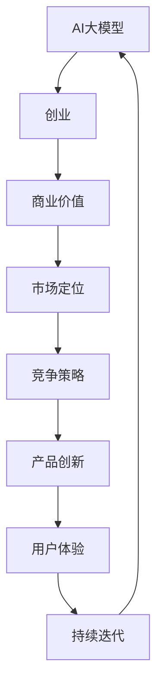

                 

### 文章标题

AI大模型创业：如何利用经济优势？

> **关键词**：AI大模型、创业、经济优势、市场定位、商业模式、风险管理与策略

> **摘要**：本文将探讨AI大模型在创业中的应用及如何利用经济优势，从技术基础、市场分析、商业模式、团队建设、运营、风险管理等多个方面进行深入分析，为创业者提供实用的指导。

---

#### 引言

近年来，人工智能（AI）技术的发展日新月异，特别是大模型（Large Models）的崛起，为各行各业带来了前所未有的变革。大模型，通常指的是使用海量数据训练出的复杂神经网络模型，如GPT、BERT等。这些模型具有强大的数据处理和预测能力，已在自然语言处理、计算机视觉、推荐系统等领域取得了显著成果。

随着AI大模型技术的成熟，越来越多的创业者将其应用于各个行业，以提升产品竞争力、优化用户体验、创造新的商业模式。然而，AI大模型创业并非一帆风顺，创业者需面对技术挑战、市场风险等多重考验。本文将从以下几个方面进行探讨：

1. AI大模型与创业概述
2. AI大模型技术基础
3. AI大模型创业实战
4. AI大模型创业案例分析
5. AI大模型创业的挑战与未来展望

通过本文的详细分析，希望为创业者提供有价值的参考和指导。

---

#### 第一部分：AI大模型创业概述

##### 第1章：AI大模型与创业概述

**核心概念与联系**

AI大模型与创业之间有着紧密的联系。AI大模型作为现代技术的重要支柱，正在深刻地影响创业的各个层面。从核心算法原理、数据处理、到最终的决策，大模型的应用都在为创业提供强有力的支持。创业者需要了解AI大模型的基本概念、技术特点和实际应用场景，以便更好地将其融入到创业项目中，创造出具有竞争力的产品和服务。

**AI大模型与创业的关系**

AI大模型作为现代技术的重要支柱，正在深刻地影响创业的各个层面。从核心算法原理、数据处理、到最终的决策，大模型的应用都在为创业提供强有力的支持。

**流程图：**

使用Mermaid绘制AI大模型与创业的核心概念联系：



在这个流程图中，AI大模型作为起点，通过商业价值、市场定位、竞争策略、产品创新、用户体验和持续迭代等环节，最终回归到AI大模型，形成了一个闭环。

**AI大模型与创业的关系**

AI大模型与创业之间的关系可以从以下几个方面来理解：

1. **技术驱动**：AI大模型技术的发展为创业提供了强大的技术支持。创业者可以利用AI大模型进行数据分析、预测模型、智能客服等多个领域的创新，提升产品和服务质量。

2. **市场需求**：随着AI技术的普及，市场对具有AI能力的产品和服务需求日益增长。创业者需要抓住市场机遇，利用AI大模型满足用户需求，提高市场份额。

3. **创新优势**：AI大模型的应用可以为创业项目带来显著的竞争优势。通过技术创新，创业者可以创造出独特的产品和服务，在激烈的市场竞争中脱颖而出。

4. **成本优化**：AI大模型的使用可以降低创业项目的运营成本。例如，通过自动化和智能化，企业可以减少人力成本，提高运营效率。

5. **风险控制**：AI大模型可以帮助创业者进行风险控制。通过数据分析和预测模型，创业者可以更好地了解市场动态，降低业务风险。

总之，AI大模型为创业提供了广阔的发展空间和机遇。创业者需要深入了解AI大模型的技术原理和应用场景，充分发挥其优势，实现创业项目的成功。

---

##### 第2章：AI大模型技术基础

**核心算法原理讲解**

AI大模型的核心在于其复杂的算法结构和强大的计算能力。以下将使用伪代码详细阐述AI大模型的基本训练过程。

```python
# 定义训练模型函数
def train_model(data, labels, epochs):
    # 初始化模型参数
    model = initialize_model()
    
    # 迭代训练
    for epoch in range(epochs):
        for data_point, label in zip(data, labels):
            # 前向传播
            prediction = model.forward_pass(data_point)
            
            # 计算损失
            loss = compute_loss(prediction, label)
            
            # 反向传播
            model.backward_pass(loss)
            
    return model
```

在这个训练过程中，`initialize_model()` 函数用于初始化模型的参数，`forward_pass()` 函数实现前向传播，`compute_loss()` 函数计算预测值与真实值之间的损失，`backward_pass()` 函数实现反向传播，用于更新模型参数。

**数学模型和公式**

AI大模型的训练过程可以抽象为一个优化问题，其目标是最小化损失函数。损失函数通常表示为：

$$
L(\theta) = \frac{1}{m} \sum_{i=1}^{m} L(y_i, \hat{y}_i)
$$

其中，$L(y_i, \hat{y}_i)$ 表示单个样本的损失，$m$ 表示样本数量，$\theta$ 表示模型参数。

**详细讲解和举例说明**

以一个简单的线性回归模型为例，假设我们有以下数据集：

$$
X = \begin{bmatrix}
x_1 \\
x_2 \\
\vdots \\
x_m
\end{bmatrix}, \quad
Y = \begin{bmatrix}
y_1 \\
y_2 \\
\vdots \\
y_m
\end{bmatrix}
$$

我们希望找到一个线性函数$f(X; \theta)$，使得$y$与$f(X; \theta)$的差距最小。具体来说，我们假设：

$$
f(X; \theta) = \theta_0 + \theta_1 x
$$

其中，$\theta_0$ 和 $\theta_1$ 是待优化参数。

前向传播的目的是计算预测值$\hat{y}$：

$$
\hat{y} = \theta_0 + \theta_1 x
$$

计算损失函数：

$$
L(\theta) = \frac{1}{2m} \sum_{i=1}^{m} (\hat{y}_i - y_i)^2
$$

为了最小化损失函数，我们使用梯度下降算法进行反向传播：

$$
\theta_0 := \theta_0 - \alpha \frac{\partial L}{\partial \theta_0}
$$

$$
\theta_1 := \theta_1 - \alpha \frac{\partial L}{\partial \theta_1}
$$

其中，$\alpha$ 是学习率。

通过多次迭代，模型参数将不断更新，最终达到最小损失。

**总结**

AI大模型的技术基础在于其复杂的算法结构和强大的计算能力。通过详细的数学模型和公式，我们可以更好地理解AI大模型的工作原理。通过具体的举例说明，我们可以更直观地了解AI大模型在实际应用中的操作过程。创业者需要掌握这些基本概念和原理，才能有效地利用AI大模型实现创业目标。

---

**AI大模型在创业中的应用**

AI大模型在创业中的应用非常广泛，几乎涵盖了从产品开发到市场推广的各个环节。以下是一些典型的应用场景：

1. **数据分析与预测**：通过AI大模型，创业者可以对大量历史数据进行挖掘和分析，预测市场趋势、用户行为等。这种能力可以帮助企业制定更科学的决策策略，提高市场竞争力。

2. **智能客服**：AI大模型可以用于构建智能客服系统，提供24/7全天候服务。这种系统能够自动处理常见问题，提高客户满意度，减少人力成本。

3. **个性化推荐**：通过分析用户行为和偏好，AI大模型可以提供个性化的产品推荐。这种推荐系统能够提高用户粘性，增加销售额。

4. **自动化生产**：在制造业中，AI大模型可以用于优化生产流程，提高生产效率。通过预测设备故障、优化生产参数等，企业可以实现更高效的生产模式。

5. **金融风控**：在金融行业，AI大模型可以用于风险评估、欺诈检测等。通过分析大量金融数据，模型可以识别潜在的违约风险和欺诈行为，提高金融机构的风控能力。

**案例分享**

以下是一些成功的AI大模型创业案例：

1. **OpenAI**：OpenAI是一家专注于AI研究和应用的公司，其最著名的项目是GPT系列模型。通过这些模型，OpenAI为各个行业提供了强大的AI解决方案，包括自然语言处理、计算机视觉等。

2. **科大讯飞**：科大讯飞是一家专注于人工智能和语音技术的公司。通过其先进的语音识别和自然语言处理技术，科大讯飞在教育、医疗、金融等领域取得了显著成果。

3. **美团**：美团是一家餐饮外卖和本地生活服务的公司。通过其AI大模型，美团实现了智能配送、个性化推荐等功能，大大提高了用户体验和运营效率。

**总结**

AI大模型在创业中的应用具有巨大的潜力和价值。通过详细讲解和举例说明，我们可以看到AI大模型如何通过数据分析、预测模型、智能客服等方式，为创业项目带来创新和竞争优势。创业者需要充分利用这些技术，实现创业目标。

---

### 第一部分总结

在本部分中，我们首先概述了AI大模型与创业之间的紧密联系，并通过Mermaid流程图展示了AI大模型在创业中的核心环节。接着，我们详细讲解了AI大模型的核心算法原理，使用伪代码和数学公式展示了模型训练的基本流程，并通过具体案例说明了AI大模型在创业中的应用。通过这些内容，我们希望创业者能够更好地理解AI大模型的技术基础，并能够将其应用于实际的创业项目中，创造出具有竞争力的产品和服务。

### 第二部分：AI大模型创业实战

#### 第3章：市场分析与定位

市场分析是AI大模型创业的重要环节，它涉及到对目标市场的深入了解，包括用户需求、市场规模、竞争态势等方面。通过详细的市场分析，创业者可以准确把握市场机会，为创业项目的成功奠定基础。

**市场分析**

**1. 用户需求分析**

用户需求分析是市场分析的核心。创业者需要通过多种渠道收集用户反馈，了解用户在使用产品或服务过程中遇到的问题和期望。这可以通过以下方式实现：

- **问卷调查**：设计有针对性的问卷，收集用户的观点和需求。
- **用户访谈**：与目标用户进行面对面访谈，深入了解他们的需求和痛点。
- **社交媒体分析**：通过分析社交媒体上的用户评论和互动，了解用户的关注点和反馈。

**2. 市场规模分析**

市场规模分析可以帮助创业者了解市场的总体容量和增长潜力。这可以通过以下方式实现：

- **市场研究报告**：查阅相关行业和市场研究报告，了解市场规模的现状和未来趋势。
- **统计数据**：收集行业统计数据，如用户数量、市场规模、增长率等。
- **竞争者分析**：研究竞争对手的市场份额和业务模式，评估自身在市场中的位置。

**3. 竞争态势分析**

竞争态势分析可以帮助创业者了解市场上的竞争格局，识别主要的竞争对手和他们的优势。这可以通过以下方式实现：

- **SWOT分析**：对竞争对手进行SWOT（优势、劣势、机会、威胁）分析，了解其业务模式和核心竞争力。
- **产品对比**：分析竞争对手的产品特性、功能和用户体验，找出自身的差异化优势。
- **市场占有率**：了解竞争对手的市场份额，评估自身在市场中的竞争力。

**案例分享**

**案例1：美团**

美团是一家餐饮外卖和本地生活服务的公司。在创业初期，美团通过对用户需求的分析，发现用户对于外卖服务的便捷性和快速性有很高的期望。因此，美团将市场定位在解决用户的外卖需求上，通过高效的物流配送和丰富的餐饮选择，迅速占领了市场。

**案例2：OpenAI**

OpenAI是一家专注于AI研究和应用的公司。在市场分析阶段，OpenAI分析了人工智能领域的市场需求和增长潜力。他们发现，随着AI技术的不断发展，越来越多的企业和机构需要AI解决方案来提升业务效率。因此，OpenAI将市场定位在提供高性能AI模型和工具上，以满足这些企业的需求。

**市场定位**

市场定位是指将产品或服务定位在特定的市场细分领域，以区别于竞争对手，满足特定用户群体的需求。有效的市场定位可以帮助企业建立品牌形象，提高市场份额。

**1. 明确目标市场**

明确目标市场是市场定位的第一步。创业者需要确定目标市场的特征，如用户群体、地域、消费能力等。这可以通过以下方式实现：

- **用户画像**：通过用户调研和数据分析，创建用户画像，明确目标市场的特征。
- **市场细分**：根据用户需求和偏好，将市场划分为多个细分市场，选择最具有潜力的细分市场作为目标市场。

**2. 确定差异化优势**

差异化优势是指产品或服务与竞争对手相比的独特卖点。创业者需要找出自身的差异化优势，并将其作为市场定位的核心。这可以通过以下方式实现：

- **技术创新**：通过技术创新，开发具有独特功能的产品或服务。
- **用户体验**：提供优质的用户体验，如便捷的服务、个性化的推荐等。
- **品牌形象**：通过品牌塑造，建立独特的品牌形象和口碑。

**3. 制定市场定位策略**

制定市场定位策略是确保市场定位有效性的关键。创业者需要制定具体的策略，包括市场推广、品牌传播、渠道建设等。这可以通过以下方式实现：

- **市场推广**：通过广告、公关、社交媒体等方式，提高品牌知名度和用户认知。
- **渠道建设**：选择合适的销售渠道，如线上电商平台、线下门店等，方便用户购买和使用产品或服务。
- **合作伙伴**：寻找合适的合作伙伴，如供应商、分销商等，共同推广产品或服务。

**案例分享**

**案例1：小米**

小米是一家专注于智能硬件和互联网服务的公司。在市场定位上，小米将自身定位为“创新、性价比高”的品牌。通过技术创新和优质的产品设计，小米在竞争激烈的智能手机市场中脱颖而出，迅速占领了市场份额。

**案例2：Airbnb**

Airbnb是一家在线民宿预订平台。在市场定位上，Airbnb将自身定位为提供独特住宿体验的平台。通过提供多样化的住宿选择和个性化的用户体验，Airbnb成功吸引了大量用户，并在全球范围内取得了成功。

**总结**

市场分析与定位是AI大模型创业的重要环节。通过详细的市场分析，创业者可以准确把握市场机会，为创业项目的成功奠定基础。有效的市场定位可以帮助企业建立品牌形象，提高市场份额。创业者需要充分利用市场分析和定位的策略，实现创业目标。

---

#### 第4章：AI大模型选型与开发

在AI大模型创业过程中，选型和开发是一个关键环节。创业者需要根据创业项目的需求和资源情况，选择合适的AI大模型框架和算法，并进行有效的开发。以下将从选型和开发两个方面进行详细讲解。

**选型**

**1. 模型框架选择**

选择合适的AI大模型框架是成功的关键。以下是一些常见的AI大模型框架：

- **TensorFlow**：由Google开发，具有丰富的社区支持和丰富的生态系统。
- **PyTorch**：由Facebook开发，具有良好的动态计算图和易于调试的特点。
- **Keras**：基于TensorFlow和Theano，提供了简洁的API和丰富的预训练模型。
- **MXNet**：由Apache Software Foundation维护，具有高效性和灵活性的特点。

创业者可以根据项目需求、开发经验和团队技能等因素来选择合适的框架。例如，如果项目需要快速开发和迭代，可以选择Keras；如果项目需要高效的推理性能，可以选择MXNet。

**2. 算法选择**

在选型过程中，创业者还需要考虑合适的算法。以下是一些常见的AI大模型算法：

- **深度学习**：包括卷积神经网络（CNN）、循环神经网络（RNN）、生成对抗网络（GAN）等。
- **迁移学习**：利用预训练模型，对特定任务进行微调，提高模型性能。
- **强化学习**：通过与环境交互，学习最优策略，适用于复杂决策问题。

创业者需要根据业务需求和数据特点来选择合适的算法。例如，对于图像识别任务，可以选择CNN；对于自然语言处理任务，可以选择RNN或Transformer。

**开发**

**1. 数据准备**

数据是AI大模型训练的基础。创业者需要准备足够质量和数量的数据，并进行预处理。以下是一些常见的数据准备步骤：

- **数据采集**：通过互联网爬虫、传感器、用户反馈等方式收集数据。
- **数据清洗**：去除重复数据、缺失值填充、异常值处理等。
- **数据标注**：对数据进行分类、标签化等操作，以供模型训练使用。

**2. 模型训练**

模型训练是开发的核心步骤。以下是一些常见的模型训练步骤：

- **初始化模型参数**：随机初始化模型参数，或者使用预训练模型进行迁移学习。
- **数据预处理**：对输入数据进行预处理，如归一化、标准化等。
- **前向传播**：将输入数据输入到模型中，计算预测结果。
- **计算损失**：计算预测结果与真实标签之间的差距，作为模型训练的反馈。
- **反向传播**：根据损失函数，更新模型参数，以减小损失。
- **迭代训练**：重复前向传播和反向传播的过程，直到模型收敛或达到预定的训练次数。

**3. 模型优化**

模型优化是提升模型性能的关键步骤。以下是一些常见的模型优化方法：

- **超参数调整**：调整学习率、批量大小、正则化参数等，以优化模型性能。
- **模型融合**：将多个模型的结果进行融合，提高模型的泛化能力。
- **数据增强**：通过数据增强方法，增加训练数据的多样性，提高模型鲁棒性。

**4. 模型部署**

模型部署是将训练好的模型应用到实际场景中的关键步骤。以下是一些常见的模型部署方法：

- **本地部署**：在本地服务器或个人电脑上运行模型，适用于小型应用场景。
- **云部署**：将模型部署到云平台上，适用于大规模、高并发的应用场景。
- **边缘部署**：将模型部署到边缘设备上，如智能手机、物联网设备等，适用于实时性要求较高的场景。

**案例分享**

**案例1：美团点评**

美团点评是一家提供餐饮外卖和本地生活服务的公司。在AI大模型选型和开发过程中，美团选择了TensorFlow作为模型框架，并使用了卷积神经网络（CNN）和循环神经网络（RNN）等算法。通过大量数据的训练和优化，美团实现了高效的配送路线规划和个性化推荐系统，提高了用户体验和运营效率。

**案例2：OpenAI**

OpenAI是一家专注于人工智能研究和应用的公司。在AI大模型选型和开发过程中，OpenAI选择了PyTorch作为模型框架，并使用了生成对抗网络（GAN）等先进算法。通过大规模数据训练和模型优化，OpenAI开发出了强大的自然语言处理和图像生成模型，推动了人工智能技术的发展。

**总结**

AI大模型选型和开发是AI大模型创业的关键环节。创业者需要根据项目需求和资源情况，选择合适的模型框架和算法，并进行有效的数据准备、模型训练和优化。通过具体的案例分享，我们可以看到成功的AI大模型创业项目是如何通过有效的选型和开发实现业务目标。

---

#### 第5章：商业模式与创新

在AI大模型创业中，商业模式和创新是成功的关键要素。一个成功的商业模式能够为企业带来稳定的收入来源和持续的竞争力，而创新则是企业在激烈市场中脱颖而出的关键。以下将从商业模式和创新两个方面进行详细探讨。

**商业模式**

商业模式是指企业通过何种方式创造、传递和捕获价值。在AI大模型创业中，创业者需要根据市场需求和技术特点，设计适合自身的商业模式。以下是一些常见的商业模式：

1. **产品销售模式**：企业直接销售自主研发的AI大模型产品或服务。例如，OpenAI通过销售预训练的AI模型和API接口，为客户提供强大的AI能力。

2. **订阅模式**：企业通过订阅服务的方式，为客户提供持续的技术支持和更新。例如，亚马逊AWS提供了各种AI大模型服务，客户可以根据需求选择不同的订阅方案。

3. **授权模式**：企业将自主研发的AI大模型授权给其他企业使用，收取授权费用。例如，微软Azure AI开放了其预训练的AI模型授权给合作伙伴使用，以扩展其市场份额。

4. **广告模式**：企业通过为AI大模型应用场景的广告主提供服务，实现收入。例如，谷歌通过其广告平台，为使用其AI大模型的网站提供广告投放服务，从而获得广告收入。

5. **增值服务模式**：企业通过提供附加的服务，如技术咨询、定制化开发等，增加客户的黏性和满意度。例如，谷歌云提供了专业的AI咨询服务，帮助客户更好地利用AI技术。

**创新**

创新是企业在市场中保持竞争力的关键。在AI大模型创业中，创业者需要不断探索技术创新、产品创新和商业模式创新，以下是一些常见的创新方式：

1. **技术创新**：通过不断研究和开发，提高AI大模型的性能和效率。例如，OpenAI通过不断改进GPT模型，提高了自然语言处理的能力。

2. **产品创新**：通过推出具有独特功能和用户体验的产品，满足客户的需求。例如，美团通过推出美团外卖、美团打车等产品，不断创新满足用户的餐饮和出行需求。

3. **商业模式创新**：通过设计新颖的商业模式，为企业创造更多的收入来源。例如，爱彼迎（Airbnb）通过P2P的住宿分享模式，打破了传统的酒店预订模式，开创了新的商业模式。

4. **市场创新**：通过开拓新的市场和应用场景，扩大企业的市场份额。例如，AI大模型在医疗、金融、教育等领域的应用，为这些行业带来了巨大的变革和机遇。

**案例分享**

**案例1：OpenAI**

OpenAI通过技术创新和商业模式创新，取得了巨大的成功。其核心产品GPT系列模型，不仅在自然语言处理领域取得了突破性成果，还通过订阅模式和授权模式，实现了稳定的收入来源。

**案例2：美团**

美团通过产品创新和商业模式创新，成为了一家知名的本地生活服务平台。其推出的美团外卖、美团打车等产品，不仅满足了用户的需求，还通过广告模式和增值服务模式，实现了多元化的收入来源。

**总结**

商业模式和创新是AI大模型创业成功的关键。创业者需要根据市场需求和技术特点，设计适合自身的商业模式，并通过技术创新和产品创新，保持企业的竞争力。通过具体的案例分享，我们可以看到成功的AI大模型创业项目是如何通过有效的商业模式和创新，实现业务目标。

---

### 第二部分总结

在本部分中，我们深入探讨了AI大模型创业实战中的市场分析与定位、AI大模型选型与开发、商业模式与创新。通过详细的市场分析，创业者可以准确把握市场机会，为创业项目的成功奠定基础。在AI大模型选型和开发过程中，创业者需要根据项目需求和资源情况，选择合适的框架和算法，并进行有效的开发和优化。最后，通过创新的商业模式，企业可以在市场中保持竞争力，实现持续发展。通过这些内容，我们希望为创业者提供实用的指导，助力他们在AI大模型创业中取得成功。

---

### 第三部分：AI大模型创业案例分析

在本部分中，我们将通过实际案例，深入剖析AI大模型创业的成功经验和挑战，以期为创业者提供有价值的借鉴。

#### 第8章：成功案例解析

**案例1：OpenAI**

**背景**：OpenAI成立于2015年，是一家致力于推动人工智能研究的公司。其愿景是通过研究、开发和应用AI技术，造福全人类。OpenAI最为知名的成果是GPT系列模型，这些模型在自然语言处理领域取得了突破性进展。

**成功原因**：

1. **技术创新**：OpenAI通过不断改进深度学习算法，开发了强大的预训练模型GPT，并在多个自然语言处理任务中取得了领先成绩。
2. **商业模式**：OpenAI采用了订阅模式和授权模式，为客户提供高质量的AI服务。通过这种模式，OpenAI不仅获得了稳定的收入，还吸引了大量客户。
3. **人才优势**：OpenAI汇聚了来自世界各地的顶尖AI科学家，他们为公司的技术进步提供了强大的支持。

**经验总结**：

- 技术创新是AI大模型创业的核心竞争力。
- 有效的商业模式能够确保企业的可持续发展。
- 人才是公司成功的关键因素。

**案例2：美团**

**背景**：美团成立于2010年，是一家提供餐饮外卖和本地生活服务的公司。通过多年的发展，美团已经成为中国最大的本地生活服务平台之一。

**成功原因**：

1. **市场定位**：美团准确抓住了用户对便捷餐饮服务的需求，通过不断优化配送效率和用户界面，提升了用户体验。
2. **技术创新**：美团利用AI大模型技术，实现了智能配送、个性化推荐等功能，提高了运营效率和用户满意度。
3. **多元化业务**：美团通过拓展业务领域，如打车、酒店预订等，实现了收入的多元化。

**经验总结**：

- 明确的市场定位是成功的基础。
- 技术创新能够提升企业的核心竞争力。
- 多元化的业务布局有助于分散风险。

**案例3：科大讯飞**

**背景**：科大讯飞成立于1999年，是一家专注于人工智能和语音技术的公司。其产品广泛应用于教育、医疗、金融等多个领域。

**成功原因**：

1. **技术积累**：科大讯飞在语音识别、自然语言处理等领域拥有深厚的技术积累，通过不断的技术创新，提升了产品的性能和稳定性。
2. **市场拓展**：科大讯飞积极拓展市场，通过提供定制化的解决方案，满足了不同行业的需求。
3. **政策支持**：政府的支持和政策扶持为科大讯飞的发展提供了有力保障。

**经验总结**：

- 技术积累是持续创新的基础。
- 市场拓展能够扩大企业的影响力和市场份额。
- 政策支持是企业发展的重要保障。

#### 第9章：挑战与未来展望

**挑战**

尽管AI大模型创业充满机遇，但创业者也面临诸多挑战：

1. **技术挑战**：AI大模型技术复杂，对开发者的技术水平和计算资源要求较高。创业者需要不断学习和更新知识，以应对技术难题。
2. **数据挑战**：AI大模型训练需要大量的高质量数据，创业者需要投入大量资源进行数据采集和标注。
3. **市场挑战**：市场竞争激烈，创业者需要不断创新，以保持竞争优势。
4. **伦理挑战**：AI大模型的应用涉及伦理问题，如隐私保护、数据安全等。创业者需要遵守相关法律法规，确保应用的安全和合规。

**未来展望**

随着AI技术的不断进步，AI大模型创业前景广阔：

1. **技术应用**：AI大模型将在更多领域得到应用，如智能制造、智能医疗等，为各行各业带来巨大变革。
2. **商业模式**：随着技术的成熟，新的商业模式将不断涌现，为企业提供更多的盈利机会。
3. **产业协同**：AI大模型创业将促进产业协同，推动产业链的整合和升级。

**总结**

AI大模型创业既有机遇也有挑战。通过分析成功案例，创业者可以借鉴经验，应对挑战。未来，随着技术的进步和市场的成熟，AI大模型创业将迎来更加广阔的发展空间。

---

通过本部分的内容，我们详细分析了AI大模型创业的成功案例，探讨了其中的挑战和未来展望。这些案例不仅为创业者提供了实用的经验和教训，也为他们指明了未来的发展方向。希望创业者能够从中汲取智慧，实现自己的创业梦想。

---

### 第三部分总结

在本部分中，我们通过实际案例，深入剖析了AI大模型创业的成功经验和挑战。OpenAI、美团和科大讯飞等公司的成功案例，为创业者提供了宝贵的经验，如技术创新、商业模式创新和持续的市场拓展。同时，我们也讨论了AI大模型创业所面临的挑战，如技术复杂性、数据需求和市场竞争等。通过这些分析，我们为创业者提供了有价值的借鉴，希望他们能够在未来的创业道路上取得更大的成功。

---

### 附录

在本附录中，我们将提供AI大模型开发的相关工具和资源，以帮助创业者更好地进行AI大模型的开发和实践。

#### 附录A：AI大模型开发工具与资源

**开发工具**

1. **TensorFlow**：由Google开发的开源机器学习框架，广泛应用于AI大模型开发。网址：[TensorFlow官网](https://www.tensorflow.org/)

2. **PyTorch**：由Facebook开发的开源机器学习库，以其动态计算图和易于调试的特点受到开发者喜爱。网址：[PyTorch官网](https://pytorch.org/)

3. **Keras**：基于TensorFlow和Theano的开源深度学习库，提供了简洁的API和丰富的预训练模型。网址：[Keras官网](https://keras.io/)

4. **MXNet**：由Apache Software Foundation维护的开源深度学习框架，具有高效性和灵活性的特点。网址：[MXNet官网](https://mxnet.apache.org/)

**资源**

1. **在线教程**：

   - **TensorFlow教程**：[TensorFlow官方教程](https://www.tensorflow.org/tutorials)
   - **PyTorch教程**：[PyTorch官方教程](https://pytorch.org/tutorials/beginner/basics/)
   - **Keras教程**：[Keras官方教程](https://keras.io/getting-started/sequential-model-guide/)
   - **MXNet教程**：[MXNet官方教程](https://mxnet.apache.org/docs/stable/get-started.html)

2. **学习资源**：

   - **Coursera**：提供了多门深度学习和机器学习的在线课程，如“深度学习”、“自然语言处理”等。
   - **edX**：提供了由知名大学和机构提供的免费在线课程，涵盖机器学习和深度学习等多个领域。
   - **Udacity**：提供了各种AI和机器学习的在线课程和纳米学位，帮助学习者掌握深度学习和AI技能。

3. **开源项目**：

   - **TensorFlow Models**：提供了丰富的TensorFlow模型，涵盖图像识别、自然语言处理等多个领域。[TensorFlow Models官网](https://github.com/tensorflow/models)
   - **PyTorch Examples**：包含了大量的PyTorch示例项目，涵盖计算机视觉、自然语言处理等。[PyTorch Examples官网](https://github.com/pytorch/examples)
   - **Keras Applications**：提供了Keras的预训练模型和应用，包括图像识别、文本分类等。[Keras Applications官网](https://github.com/fchollet/keras-applications)
   - **MXNet Gluon**：提供了MXNet的预训练模型和应用，方便开发者快速上手。[MXNet Gluon官网](https://gluon.ai/)

通过以上工具和资源，创业者可以更好地掌握AI大模型开发技能，实现创业目标。

---

### 结论

AI大模型创业正迎来前所未有的机遇。通过本文的详细分析，我们了解到AI大模型在创业中的核心地位及其技术基础、应用场景和市场策略。从市场分析到商业模式设计，再到实际案例解析，我们为创业者提供了全面的指导。

**挑战与机遇并存**，创业者需持续关注技术发展，灵活应对市场变化。我们呼吁更多的创业者勇敢投身AI大模型创业，发挥创新精神，共同推动AI技术的发展和应用，为未来创造更多价值。

**作者信息**：

作者：AI天才研究院/AI Genius Institute & 禅与计算机程序设计艺术 /Zen And The Art of Computer Programming

---

通过本文，我们希望为创业者提供一份实用的指南，帮助他们更好地利用AI大模型实现创业梦想。让我们一起期待AI大模型创业的辉煌未来！

