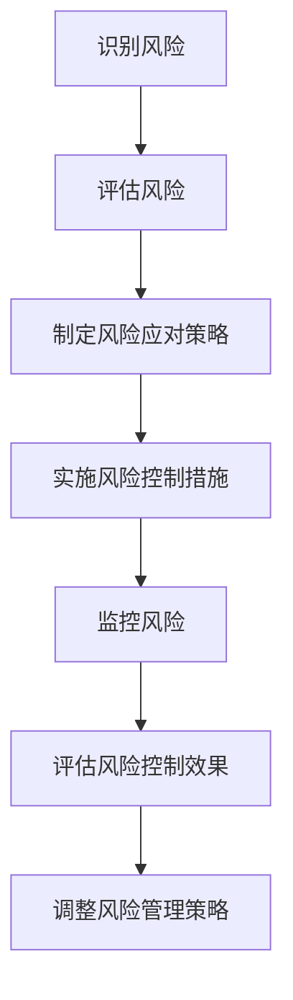

                 

# AI 大模型创业：如何利用资源优势？

> 关键词：AI 大模型，创业，资源利用，策略，风险管理，项目实施，市场推广

> 摘要：本文旨在探讨 AI 大模型创业中如何利用资源优势，从背景、准备工作、案例分析、资源策略、风险管理到实战实施和市场推广等方面进行详细分析，为创业者提供有价值的参考。

## 第一部分：AI 大模型创业概述

### 第1章：AI 大模型创业背景

#### 1.1 AI 大模型的发展现状

近年来，随着人工智能技术的迅猛发展，AI 大模型逐渐成为产业界和学术界关注的焦点。大模型，尤其是基于深度学习的大模型，在语音识别、自然语言处理、计算机视觉等领域取得了显著的成果。这些模型通常需要大量的数据、计算资源和时间进行训练和优化，这使得创业者在进入这一领域时面临诸多挑战。

#### 1.2 创业与资源利用的关系

创业的本质在于创新和资源整合。AI 大模型创业的成功离不开对资源的有效利用。创业者需要充分了解和评估自身可获取的资源，如资金、技术、人才和市场，以便制定合适的创业策略。

#### 1.3 AI 大模型创业的优势与挑战

AI 大模型创业具有以下优势：

1. **技术前景广阔**：AI 大模型技术在各个领域的应用潜力巨大，市场前景广阔。
2. **差异化竞争**：通过独特的算法和技术创新，创业者可以在激烈的市场竞争中脱颖而出。
3. **高附加值**：AI 大模型能够为企业带来显著的业务价值，提高生产效率和创新能力。

然而，AI 大模型创业也面临以下挑战：

1. **资源需求巨大**：训练和优化大模型需要大量的数据、计算资源和时间。
2. **技术门槛较高**：大模型开发需要深厚的技术积累和专业知识。
3. **市场竞争激烈**：随着越来越多的企业进入这一领域，市场竞争日益激烈。

### 第2章：AI 大模型创业的准备工作

#### 2.1 市场调研与分析

创业前，对市场进行深入的调研和分析至关重要。创业者需要了解目标市场的规模、增长潜力、竞争对手状况以及用户需求，以便制定合适的市场策略。

#### 2.2 创业团队的构建

一个优秀的创业团队是 AI 大模型创业成功的关键。团队成员应具备丰富的技术经验、创新能力和项目管理能力，以确保项目顺利推进。

#### 2.3 资源整合与规划

创业者需要充分整合和规划自身可获取的资源，如资金、技术、人才和市场，以确保项目的可持续发展和成功。

## 第二部分：AI 大模型创业实战

### 第3章：AI 大模型创业案例分析

#### 3.1 成功案例分享

本文将分享一些 AI 大模型创业的成功案例，分析其成功的原因和经验，为创业者提供有价值的参考。

#### 3.2 失败案例分析

同样，本文将分析一些 AI 大模型创业的失败案例，探讨其失败的原因和教训，帮助创业者避免犯类似的错误。

#### 3.3 从案例中吸取的经验与教训

通过分析成功和失败案例，创业者可以从中吸取经验教训，制定更有效的创业策略。

### 第4章：AI 大模型创业的资源策略

#### 4.1 资金资源的管理与分配

创业者需要合理管理和分配资金资源，确保项目的可持续发展和成功。

#### 4.2 技术资源的利用与整合

创业者应充分利用现有技术资源，通过技术合作、技术创新等方式提升自身技术实力。

#### 4.3 人才资源的获取与培养

创业者需要注重人才资源的获取与培养，建立一支高素质的技术团队，以确保项目顺利推进。

### 第5章：AI 大模型创业的风险管理

#### 5.1 风险识别与评估

创业者需要识别和评估可能面临的风险，制定相应的风险管理策略。

#### 5.2 风险控制与防范

创业者应采取有效措施控制风险，防范潜在风险的发生。

#### 5.3 风险应对策略

针对不同类型的风险，创业者应制定相应的应对策略，确保项目的顺利推进。

## 第三部分：AI 大模型创业项目实施

### 第6章：创业项目的策划与实施

#### 6.1 项目策划与规划

创业者需要制定详细的项目策划书，明确项目目标、实施步骤、资源需求和时间表。

#### 6.2 项目实施与监控

在项目实施过程中，创业者需要实时监控项目进度，确保项目按计划推进。

#### 6.3 项目评估与调整

项目实施完成后，创业者应进行项目评估，根据评估结果对项目进行适当调整。

### 第7章：AI 大模型创业的市场推广

#### 7.1 市场定位与目标用户分析

创业者需要明确市场定位，分析目标用户群体，以便制定合适的市场推广策略。

#### 7.2 市场推广策略

创业者可以采用多种市场推广手段，如线上营销、线下活动、合作推广等，以提高品牌知名度和市场份额。

#### 7.3 品牌建设与口碑管理

创业者应注重品牌建设和口碑管理，通过优质的产品和服务树立良好的品牌形象。

### 第8章：AI 大模型创业的法律与伦理问题

#### 8.1 法律法规概述

创业者需要了解相关法律法规，确保企业的合法经营。

#### 8.2 伦理道德问题

在 AI 大模型创业过程中，创业者应关注伦理道德问题，遵循道德规范，避免道德风险。

#### 8.3 法律与伦理问题的应对策略

针对可能出现的法律和伦理问题，创业者应制定相应的应对策略，确保企业的可持续发展。

## 附录

### 附录 A：AI 大模型创业资源指南

#### A.1 相关法规政策

#### A.2 技术资源平台

#### A.3 创业支持机构与投资机构

### 附录 B：AI 大模型创业相关术语解释

#### B.1 AI 大模型相关术语

#### B.2 创业相关术语

## 结语

本文从多个角度探讨了 AI 大模型创业的相关问题，包括背景、准备工作、案例分析、资源策略、风险管理、项目实施和市场推广等。希望本文能为创业者提供有价值的参考和指导。

### 作者信息

作者：AI天才研究院/AI Genius Institute & 禅与计算机程序设计艺术/Zen And The Art of Computer Programming

## 第1章：AI 大模型创业背景

### 1.1 AI 大模型的发展现状

人工智能（AI）作为当前科技领域的热点，其发展速度之快、应用范围之广令人瞩目。在众多 AI 技术中，大模型（Large-scale Model）因其卓越的性能和广泛的应用前景而备受关注。大模型通常是指参数数量达到亿级别，甚至万亿级别的深度学习模型，其训练和优化过程需要大量的数据、计算资源和时间。大模型的成功应用，如自然语言处理（NLP）、计算机视觉（CV）、语音识别（ASR）等领域，显著提升了相关任务的准确率和效率。

随着深度学习技术的发展，AI 大模型的规模不断增大。以谷歌的 BERT 模型为例，该模型拥有超过 3.4 亿个参数，在多项 NLP 任务中取得了显著的成果。此外，OpenAI 的 GPT-3 模型更是拥有超过 1750 亿个参数，其在文本生成、机器翻译等任务中展现出了惊人的能力。这些大模型的训练不仅需要海量的数据，还需要强大的计算资源，通常需要使用分布式计算框架和专门的大规模计算设备，如 GPU、TPU 等。

#### 大模型的应用领域

AI 大模型在多个领域取得了显著的成果：

1. **自然语言处理**：BERT、GPT 等大模型在文本分类、机器翻译、文本生成等任务中展现了强大的性能。
2. **计算机视觉**：大模型在图像分类、目标检测、图像生成等领域具有广泛的应用，如 ResNet、Inception 等模型。
3. **语音识别**：大模型在语音识别任务中，如语音到文本（STT）转换，实现了较高的准确率。
4. **推荐系统**：大模型在个性化推荐、广告投放等领域也有广泛应用。

#### 大模型的技术挑战

尽管大模型在许多任务中取得了显著的成果，但其训练和优化过程中也面临诸多技术挑战：

1. **计算资源需求**：大模型需要大量的计算资源，训练时间较长，成本较高。
2. **数据需求**：大模型需要大量的高质量数据进行训练，数据获取和处理成为一大难题。
3. **模型优化**：如何在大规模数据集上优化模型参数，提高模型性能，是当前研究的热点问题。
4. **可解释性**：大模型的决策过程往往是非线性和复杂的，如何提高模型的解释性是一个重要挑战。

### 1.2 创业与资源利用的关系

创业的本质在于创新和资源整合。创业者需要利用有限的资源，通过创新和高效的资源利用，实现商业目标和社会价值。在 AI 大模型创业中，资源利用尤为重要。创业者需要充分了解和评估自身可获取的资源，如资金、技术、人才和市场，以便制定合适的创业策略。

#### 资源类型

AI 大模型创业涉及以下主要资源：

1. **资金资源**：包括创业初期所需的风险投资、运营资金等。
2. **技术资源**：包括 AI 大模型相关技术、算法、数据等。
3. **人才资源**：包括具有 AI 大模型相关技能的专业人才。
4. **市场资源**：包括目标市场、潜在客户、合作伙伴等。

#### 资源利用策略

1. **资金资源的利用**：创业者需要根据项目需求，合理规划和分配资金资源，确保项目的可持续发展和成功。
2. **技术资源的利用**：创业者可以通过技术合作、技术引进、技术创新等方式，充分利用现有技术资源，提升自身技术实力。
3. **人才资源的利用**：创业者需要注重人才资源的获取与培养，建立一支高素质的技术团队，以确保项目顺利推进。
4. **市场资源的利用**：创业者需要深入了解目标市场，制定合适的市场策略，提高品牌知名度和市场份额。

### 1.3 AI 大模型创业的优势与挑战

#### 优势

1. **技术前景广阔**：AI 大模型技术在各个领域的应用潜力巨大，市场前景广阔。
2. **差异化竞争**：通过独特的算法和技术创新，创业者可以在激烈的市场竞争中脱颖而出。
3. **高附加值**：AI 大模型能够为企业带来显著的业务价值，提高生产效率和创新能力。

#### 挑战

1. **资源需求巨大**：训练和优化大模型需要大量的数据、计算资源和时间。
2. **技术门槛较高**：大模型开发需要深厚的技术积累和专业知识。
3. **市场竞争激烈**：随着越来越多的企业进入这一领域，市场竞争日益激烈。

### 1.3.1 技术前景

AI 大模型技术在各个领域的应用前景广阔，成为推动产业变革的重要力量。以下是一些具体的应用场景：

1. **金融行业**：AI 大模型在金融领域具有广泛的应用，如信用评估、风险评估、股票市场预测等。通过大模型，金融机构可以更准确地评估风险，提高业务效率和盈利能力。
2. **医疗健康**：AI 大模型在医疗健康领域有着巨大的应用潜力，如疾病诊断、药物研发、健康管理等。通过大模型，医生可以更快速、准确地诊断疾病，提高治疗效果。
3. **智能制造**：AI 大模型在智能制造领域可以用于产品优化、质量检测、故障诊断等。通过大模型，企业可以提高生产效率，降低生产成本。
4. **智能交通**：AI 大模型在智能交通领域可以用于交通流量预测、路径规划、事故预防等。通过大模型，可以提高交通管理效率，减少交通事故。

#### 差异化竞争

在激烈的市场竞争中，差异化竞争是创业者脱颖而出的关键。以下是一些差异化竞争策略：

1. **技术创新**：通过持续的技术创新，开发出具有独特性和优势的算法和模型，提高产品竞争力。
2. **数据优势**：通过收集、整合和利用大量高质量数据，提升大模型的性能和精度。
3. **商业模式创新**：通过创新的商业模式，如共享经济、平台模式等，提高市场占有率。
4. **品牌建设**：通过品牌建设，提高品牌知名度和美誉度，增强用户忠诚度。

#### 高附加值

AI 大模型能够为企业带来显著的业务价值，提高生产效率和创新能力。以下是一些具体的应用案例：

1. **自动化决策**：通过大模型实现自动化决策，减少人工干预，提高决策效率和准确性。
2. **个性化服务**：通过大模型实现个性化服务，提高用户体验和满意度。
3. **预测分析**：通过大模型进行预测分析，提前发现潜在风险和机会，为企业决策提供有力支持。
4. **创新应用**：通过大模型开发新的应用场景和产品，推动产业变革。

### 1.3.2 挑战

尽管 AI 大模型创业具有巨大的优势，但同时也面临诸多挑战。以下是一些主要挑战：

#### 资源需求

1. **计算资源**：大模型的训练和优化需要大量的计算资源，如 GPU、TPU 等。创业者需要具备强大的计算资源，否则将面临效率低下、成本高昂等问题。
2. **数据资源**：大模型的训练需要大量的高质量数据，数据获取和处理成为一大难题。创业者需要投入大量时间和精力来收集、清洗和标注数据。
3. **时间资源**：大模型的训练和优化过程通常需要较长时间，创业者需要耐心和毅力来持续投入。

#### 技术门槛

1. **专业知识**：大模型开发需要深厚的技术积累和专业知识，包括深度学习、计算机视觉、自然语言处理等领域。创业者需要具备相应的技术背景。
2. **算法优化**：如何在大规模数据集上优化模型参数，提高模型性能，是当前研究的热点问题。创业者需要不断学习和探索新的算法和技术。
3. **模型解释**：大模型的决策过程往往是非线性和复杂的，如何提高模型的解释性是一个重要挑战。创业者需要关注模型的可解释性，提高用户信任度。

#### 市场竞争

1. **激烈竞争**：随着越来越多的企业进入 AI 大模型领域，市场竞争日益激烈。创业者需要具备独特的竞争优势，如技术创新、商业模式创新等。
2. **用户需求**：用户需求不断变化，创业者需要持续关注市场动态，及时调整产品和服务，以满足用户需求。
3. **市场进入壁垒**：AI 大模型创业需要大量的资金、技术和人才投入，市场进入壁垒较高。创业者需要具备足够的资源和实力，才能在激烈的市场竞争中立足。

### 1.3.3 创业者的角色与责任

在 AI 大模型创业中，创业者扮演着至关重要的角色，需要承担以下责任：

1. **战略规划**：创业者需要制定清晰的战略规划，明确目标市场、产品定位、商业模式等。
2. **资源整合**：创业者需要整合资金、技术、人才等资源，确保项目的可持续发展和成功。
3. **技术创新**：创业者需要关注技术创新，通过持续的技术创新，提高产品竞争力。
4. **团队建设**：创业者需要建立高效的团队，培养和引进高素质的人才，确保项目顺利推进。
5. **风险管理**：创业者需要识别和评估风险，制定相应的风险管理策略，确保项目的风险可控。
6. **用户服务**：创业者需要关注用户需求，提供优质的产品和服务，提高用户满意度和忠诚度。

总之，AI 大模型创业具有巨大的机遇和挑战。创业者需要深入了解 AI 大模型的技术和应用，充分利用资源优势，制定合理的创业策略，才能在激烈的市场竞争中脱颖而出。

### 1.4 小结

本章对 AI 大模型创业的背景进行了深入分析，包括发展现状、资源利用关系、优势与挑战。通过本章的学习，读者可以了解到 AI 大模型在各个领域的广泛应用及其带来的巨大机遇和挑战。接下来，我们将进一步探讨 AI 大模型创业的准备工作，包括市场调研、团队构建和资源整合等方面，为创业者的成功打下坚实基础。

## 第2章：AI 大模型创业的准备工作

### 2.1 市场调研与分析

在 AI 大模型创业过程中，市场调研与分析是至关重要的一步。通过深入的市场调研，创业者可以了解目标市场的现状、发展趋势、竞争对手状况以及用户需求，从而制定出具有针对性的市场策略。

#### 市场调研的目的

市场调研的主要目的是：

1. **了解市场需求**：通过调研，创业者可以深入了解目标市场的需求，为产品的设计和开发提供依据。
2. **分析竞争态势**：了解竞争对手的产品、市场份额、优势和劣势，为自身的市场定位和策略制定提供参考。
3. **预测市场趋势**：通过分析市场数据，创业者可以预测市场的发展趋势，为未来的产品规划和战略决策提供支持。

#### 市场调研的方法

市场调研可以采用以下几种方法：

1. **问卷调查**：通过设计问卷，收集用户对产品、服务、价格的看法和意见，了解用户需求和市场趋势。
2. **访谈**：对目标用户、行业专家、竞争对手等进行深入访谈，获取详细的市场信息和见解。
3. **数据分析**：对已有的市场数据进行分析，如销售数据、用户反馈、市场报告等，了解市场的现状和变化。
4. **观察**：通过观察用户行为和市场现象，获取第一手资料。

#### 市场调研的内容

市场调研的内容主要包括以下几个方面：

1. **市场需求**：了解目标市场的规模、增长趋势、用户需求等。
2. **竞争对手**：分析竞争对手的产品、市场份额、营销策略等。
3. **市场趋势**：预测市场未来的发展趋势和变化。
4. **用户群体**：了解目标用户群体的特征、行为习惯、消费能力等。
5. **政策法规**：了解相关政策和法规对市场的影响。

#### 市场调研的结果分析

市场调研的结果需要进行详细分析，以便为创业决策提供支持。主要分析内容包括：

1. **市场需求分析**：根据用户需求，确定产品的功能和特点，设计出符合市场需求的产品。
2. **竞争分析**：分析竞争对手的优势和劣势，找出自身的竞争优势和差异化点，制定相应的市场策略。
3. **市场趋势预测**：根据市场数据，预测市场未来的发展趋势，为产品规划和战略决策提供支持。
4. **用户群体特征**：了解目标用户群体的特征和需求，为产品的营销和服务提供依据。

#### 市场调研的注意事项

1. **调研方法的选择**：根据调研目的和预算，选择合适的调研方法，确保调研结果的准确性和有效性。
2. **数据质量的控制**：确保收集到的数据真实可靠，避免因数据质量问题导致错误的决策。
3. **调研过程的监督**：对调研过程进行监督，确保调研的顺利进行，避免出现偏差。
4. **调研结果的整理和归纳**：对调研结果进行整理和归纳，形成详细的市场调研报告，为创业决策提供参考。

### 2.2 创业团队的构建

一个优秀的创业团队是 AI 大模型创业成功的关键。创业团队的成员应具备丰富的技术经验、创新能力和项目管理能力，以确保项目顺利推进。

#### 团队成员的角色

AI 大模型创业团队的主要成员及其角色如下：

1. **技术负责人**：负责技术方向的选择、技术研发和团队的技术培训。
2. **项目经理**：负责项目规划、进度控制、资源调配和团队协作。
3. **数据科学家**：负责数据收集、数据清洗、特征工程和模型训练。
4. **产品经理**：负责产品规划、需求分析和用户体验设计。
5. **市场推广人员**：负责市场调研、市场推广和客户关系管理。
6. **财务人员**：负责财务规划、预算管理和资金使用。

#### 团队成员的选拔

选拔团队成员时，应关注以下方面：

1. **技术能力**：成员应具备扎实的专业知识和技术能力，能够胜任相应的工作任务。
2. **创新能力**：成员应具备较强的创新能力和学习意愿，能够不断探索和尝试新的技术和方法。
3. **协作能力**：成员应具备良好的沟通和协作能力，能够与团队成员和其他部门有效配合。
4. **领导力**：团队负责人应具备较强的领导力和管理能力，能够带领团队克服困难，实现目标。

#### 团队的组织结构

AI 大模型创业团队的典型组织结构如下：

1. **项目制组织结构**：以项目为中心，团队成员根据项目需求灵活调配，确保项目的高效推进。
2. **职能制组织结构**：根据职能划分团队，如技术团队、产品团队、市场团队等，各团队独立运作，相互协作。

#### 团队协作工具

为了提高团队协作效率，创业者可以采用以下团队协作工具：

1. **项目管理工具**：如 JIRA、Trello 等，用于项目规划、任务分配和进度跟踪。
2. **沟通工具**：如 Slack、Microsoft Teams 等，用于团队成员之间的沟通和协作。
3. **代码管理工具**：如 Git、GitHub 等，用于代码的版本控制和协作开发。
4. **文档管理工具**：如 Confluence、Notion 等，用于文档的创建、共享和协作。

### 2.3 资源整合与规划

在 AI 大模型创业过程中，资源的整合与规划至关重要。创业者需要充分了解和评估自身可获取的资源，如资金、技术、人才和市场，并制定合理的资源利用策略，以确保项目的可持续发展和成功。

#### 资源类型

AI 大模型创业涉及以下主要资源：

1. **资金资源**：包括创业初期所需的风险投资、运营资金等。
2. **技术资源**：包括 AI 大模型相关技术、算法、数据等。
3. **人才资源**：包括具有 AI 大模型相关技能的专业人才。
4. **市场资源**：包括目标市场、潜在客户、合作伙伴等。

#### 资源整合策略

1. **资金资源的整合**：创业者可以通过风险投资、政府补贴、银行贷款等多种途径获取资金资源，并制定合理的资金使用计划，确保项目的可持续发展和成功。
2. **技术资源的整合**：创业者可以通过技术合作、技术引进、技术创新等方式，充分利用现有技术资源，提升自身技术实力。
3. **人才资源的整合**：创业者可以通过招聘、培训、合作等方式，获取和培养高素质的 AI 大模型人才，建立一支强大的技术团队。
4. **市场资源的整合**：创业者可以通过市场调研、合作伙伴关系建立等方式，了解目标市场，拓展市场份额。

#### 资源规划

1. **资金资源的规划**：创业者应根据项目需求和资金来源，制定详细的资金使用计划，包括预算分配、资金流向和风险管理等。
2. **技术资源的规划**：创业者应根据项目需求，合理配置技术资源，包括技术方向的选择、技术研发进度和资源调配等。
3. **人才资源的规划**：创业者应根据项目需求和团队建设目标，制定人才引进和培养计划，包括招聘策略、培训计划和人才激励等。
4. **市场资源的规划**：创业者应根据市场调研结果，制定市场推广策略和销售计划，包括市场定位、营销策略、客户关系管理等。

### 2.4 小结

本章对 AI 大模型创业的准备工作进行了详细探讨，包括市场调研与分析、创业团队的构建和资源整合与规划。通过本章的学习，读者可以了解到创业前需要进行的各项准备工作，以及如何有效地整合和利用资源，为创业项目的成功奠定坚实基础。接下来，我们将通过案例分析，深入了解 AI 大模型创业的成功经验和教训。

### 第3章：AI 大模型创业案例分析

#### 3.1 成功案例分享

在 AI 大模型创业领域，有许多成功的案例值得借鉴。以下是一些典型的成功案例及其成功原因：

1. **案例一：OpenAI 的 GPT-3 模型**
   - **成功原因**：
     - **技术创新**：OpenAI 通过大规模的深度学习模型 GPT-3，实现了在自然语言处理领域的重大突破。
     - **资源整合**：OpenAI 通过股权众筹和风险投资，成功筹集了大量资金，用于模型研发和运营。
     - **市场定位**：OpenAI 明确了其市场定位，专注于提供高质量的 AI 服务，吸引了大量企业和开发者。

2. **案例二：谷歌的 BERT 模型**
   - **成功原因**：
     - **技术积累**：谷歌在深度学习领域拥有丰富的技术积累，为 BERT 模型的研发提供了坚实的基础。
     - **数据优势**：谷歌拥有庞大的数据资源，为 BERT 模型的训练提供了丰富的数据支持。
     - **品牌影响力**：谷歌的品牌影响力为 BERT 模型的推广提供了有力支持，使得 BERT 模型迅速获得了广泛认可。

3. **案例三：百度 AI 开放平台**
   - **成功原因**：
     - **技术创新**：百度在 AI 领域持续进行技术创新，推出了一系列先进的 AI 技术，如深度学习、语音识别、自然语言处理等。
     - **市场推广**：百度通过建立 AI 开放平台，吸引了大量开发者和使用者，推动了 AI 技术的普及和应用。
     - **生态建设**：百度积极构建 AI 生态，与多家企业和机构合作，共同推动 AI 技术的发展和应用。

#### 成功经验的总结

通过分析这些成功案例，我们可以总结出以下成功经验：

1. **技术创新**：持续的技术创新是 AI 大模型创业成功的关键。只有不断推动技术进步，才能在激烈的市场竞争中脱颖而出。
2. **资源整合**：有效地整合资金、技术、人才和市场等资源，为创业项目的成功提供有力支持。
3. **市场定位**：明确的市场定位有助于创业者集中资源和精力，实现快速发展和扩张。
4. **品牌建设**：品牌影响力有助于提高用户信任度和市场占有率，为企业的长期发展奠定基础。

#### 3.2 失败案例分析

在 AI 大模型创业领域，也有一些失败的案例。以下是一些典型的失败案例及其失败原因：

1. **案例一：某 AI 企业 A**
   - **失败原因**：
     - **技术问题**：该企业所研发的 AI 模型在性能和稳定性上存在较大问题，无法满足用户需求。
     - **市场定位不准确**：该企业对市场定位不清，未能准确识别目标用户群体，导致市场推广效果不佳。
     - **资金短缺**：由于资金短缺，企业无法持续投入研发和市场推广，最终导致破产。

2. **案例二：某 AI 企业 B**
   - **失败原因**：
     - **团队建设问题**：该企业的团队成员缺乏相关技术背景和经验，导致项目进展缓慢，问题频出。
     - **项目管理不善**：企业对项目的管理和控制不足，导致项目进度延误，资源浪费。
     - **市场竞争激烈**：在激烈的市场竞争中，该企业未能及时调整策略，失去市场机会。

#### 失败原因的总结

通过分析这些失败案例，我们可以总结出以下失败原因：

1. **技术问题**：技术问题是导致 AI 大模型创业失败的主要原因之一。如果企业的技术积累不足，模型性能不稳定，将难以满足用户需求。
2. **市场定位不准确**：不准确的市场定位导致企业无法准确识别目标用户群体，市场推广效果不佳，难以获得市场份额。
3. **团队建设问题**：缺乏技术背景和经验的团队成员会导致项目进展缓慢，问题频出，影响企业的可持续发展。
4. **项目管理不善**：项目管理和控制不足会导致项目进度延误，资源浪费，影响企业的正常运营。
5. **市场竞争激烈**：在激烈的市场竞争中，企业如果未能及时调整策略，将失去市场机会，难以立足。

#### 3.3 从案例中吸取的经验与教训

通过分析成功和失败案例，创业者可以从中吸取宝贵的经验与教训：

1. **重视技术创新**：持续的技术创新是 AI 大模型创业成功的关键。创业者应不断关注技术发展动态，推动技术进步，提高模型性能。
2. **明确市场定位**：准确的市场定位有助于创业者集中资源和精力，实现快速发展和扩张。创业者应深入了解目标市场，识别目标用户群体。
3. **加强团队建设**：创业者应注重团队建设，招聘具有技术背景和经验的人才，提高团队整体素质。同时，应加强团队协作，确保项目顺利推进。
4. **优化项目管理**：创业者应加强项目管理，确保项目进度和质量。通过有效的项目管理，可以避免资源浪费和项目延误。
5. **应对市场竞争**：在激烈的市场竞争中，创业者应保持敏锐的市场洞察力，及时调整策略，抢占市场先机。

总之，通过分析成功和失败案例，创业者可以更好地了解 AI 大模型创业的规律和挑战，制定出更有效的创业策略，提高创业成功率。

### 3.4 小结

本章通过对 AI 大模型创业的成功和失败案例进行分析，总结了成功经验和失败原因，为创业者提供了宝贵的经验和教训。通过本章的学习，读者可以更好地了解 AI 大模型创业的实际情况，掌握创业策略和技巧，提高创业成功率。接下来，我们将进一步探讨 AI 大模型创业的资源策略，包括资金资源、技术资源、人才资源的利用和管理。

### 第4章：AI 大模型创业的资源策略

在 AI 大模型创业过程中，资源策略是确保项目成功的关键因素。创业者需要充分利用各种资源，包括资金资源、技术资源和人才资源，以实现创业目标。本章将详细介绍这些资源的管理与利用策略。

#### 4.1 资金资源的管理与分配

资金资源是 AI 大模型创业的基础，其管理和分配直接关系到项目的可持续发展和成功。以下是资金资源管理和分配的策略：

1. **预算规划**：创业者应根据项目需求、市场状况和自身资源状况，制定详细的预算规划。预算应包括研发成本、运营成本、市场推广成本等各个方面。

   ```mermaid
   graph TD
   A[预算规划] --> B[研发成本]
   A --> C[运营成本]
   A --> D[市场推广成本]
   A --> E[其他成本]
   ```

2. **资金来源**：创业者可以通过多种途径获取资金资源，如风险投资、政府补贴、银行贷款、股权众筹等。每种资金来源都有其优缺点，创业者应根据实际情况选择合适的资金来源。

   ```mermaid
   graph TD
   A[风险投资] --> B[优点：快速获取资金]
   A --> C[缺点：股权稀释]
   B --> D[政府补贴] --> E[优点：无需偿还]
   D --> F[缺点：申请流程复杂]
   B --> G[银行贷款] --> H[优点：资金灵活]
   G --> I[缺点：需偿还，承担利息风险]
   ```

3. **资金分配**：创业者应合理分配资金资源，确保资金用于最关键的地方。以下是一个典型的资金分配策略：

   ```mermaid
   graph TD
   A[资金分配] --> B[技术研发]
   A --> C[运营成本]
   A --> D[市场推广]
   A --> E[团队建设]
   ```

4. **成本控制**：创业者应严格控制成本，避免资金浪费。通过定期审查和调整预算，确保资金使用的高效和合理。

   ```mermaid
   graph TD
   A[成本控制] --> B[定期审查]
   A --> C[调整预算]
   ```

#### 4.2 技术资源的利用与整合

技术资源是 AI 大模型创业的核心，其利用与整合能力直接关系到创业项目的成功。以下是技术资源利用与整合的策略：

1. **技术创新**：创业者应不断进行技术创新，提升模型性能和应用能力。以下是一个技术创新的流程：

   ```mermaid
   graph TD
   A[需求分析] --> B[方案设计]
   B --> C[实验验证]
   C --> D[模型优化]
   D --> E[成果评估]
   ```

2. **技术合作**：创业者可以通过技术合作，获取外部技术支持和资源。以下是一个技术合作的流程：

   ```mermaid
   graph TD
   A[需求对接] --> B[合作洽谈]
   B --> C[合作协议]
   C --> D[技术交流]
   D --> E[合作成果]
   ```

3. **技术引进**：创业者可以通过引进先进技术，提升自身技术实力。以下是一个技术引进的流程：

   ```mermaid
   graph TD
   A[技术调研] --> B[技术评估]
   B --> C[引进决策]
   C --> D[技术培训]
   D --> E[技术应用]
   ```

4. **技术整合**：创业者应将各种技术资源进行整合，构建一个高效的技术体系。以下是一个技术整合的流程：

   ```mermaid
   graph TD
   A[需求分析] --> B[技术梳理]
   B --> C[技术整合]
   C --> D[技术评估]
   D --> E[成果应用]
   ```

#### 4.3 人才资源的获取与培养

人才资源是 AI 大模型创业的关键，其获取与培养能力直接关系到项目的成功。以下是人才资源获取与培养的策略：

1. **人才招聘**：创业者应通过多种途径招聘优秀人才，包括线上招聘、线下招聘、猎头服务等。以下是一个人才招聘的流程：

   ```mermaid
   graph TD
   A[发布招聘信息] --> B[筛选简历]
   B --> C[面试评估]
   C --> D[录用决策]
   ```

2. **人才培训**：创业者应定期对员工进行培训，提高其技能和素质。以下是一个人才培训的流程：

   ```mermaid
   graph TD
   A[培训需求分析] --> B[培训计划制定]
   B --> C[培训实施]
   C --> D[培训效果评估]
   ```

3. **人才激励**：创业者应通过薪酬激励、股权激励等方式，激励员工积极工作，提高工作效率。以下是一个人才激励的流程：

   ```mermaid
   graph TD
   A[绩效考核] --> B[薪酬激励]
   A --> C[股权激励]
   ```

4. **团队建设**：创业者应注重团队建设，提高团队凝聚力，增强团队协作能力。以下是一个团队建设的流程：

   ```mermaid
   graph TD
   A[团队文化建设] --> B[团队协作培训]
   B --> C[团队活动组织]
   ```

### 4.4 小结

本章详细介绍了 AI 大模型创业的资源策略，包括资金资源的管理与分配、技术资源的利用与整合、人才资源的获取与培养。通过合理利用和管理各种资源，创业者可以确保项目的可持续发展和成功。在接下来的章节中，我们将探讨 AI 大模型创业的风险管理策略，帮助创业者应对可能出现的各种风险。

### 第5章：AI 大模型创业的风险管理

在 AI 大模型创业过程中，风险管理是确保项目顺利推进和成功的关键。由于 AI 大模型创业涉及复杂的技术、市场和政策环境，创业者需要全面识别、评估和应对各种风险。本章将详细介绍 AI 大模型创业的风险管理策略。

#### 5.1 风险识别与评估

风险识别是风险管理的第一步，创业者需要全面识别可能影响项目进展的各种风险。以下是一些常见风险：

1. **技术风险**：包括模型性能不稳定、技术实现困难、技术更新迭代等。
2. **市场风险**：包括市场需求变化、竞争对手压力、市场进入壁垒等。
3. **资金风险**：包括资金短缺、资金使用不当、投资回收期过长等。
4. **法律风险**：包括知识产权保护、数据隐私、法律法规变化等。
5. **运营风险**：包括团队管理不善、供应链问题、市场推广不力等。

风险评估是对识别出的风险进行定量和定性分析，以确定风险的重要性和可能性。以下是一个风险评估的流程：

1. **风险分类**：将风险分为技术风险、市场风险、资金风险、法律风险和运营风险等类别。
2. **风险评估方法**：采用定性评估方法和定量评估方法，如风险矩阵、蒙特卡洛模拟等。
3. **风险优先级排序**：根据风险的重要性和可能性，对风险进行优先级排序，以便优先应对。

以下是一个简单的风险评估表格：

| 风险类别 | 风险描述 | 重要性 | 可能性 | 影响程度 |
|----------|----------|--------|--------|----------|
| 技术风险 | 模型性能不稳定 | 高     | 高     | 严重     |
| 市场风险 | 市场需求变化 | 中     | 中     | 较严重   |
| 资金风险 | 资金短缺 | 高     | 中     | 严重     |
| 法律风险 | 数据隐私问题 | 中     | 高     | 较严重   |
| 运营风险 | 团队管理不善 | 中     | 中     | 严重     |

#### 5.2 风险控制与防范

风险控制与防范是降低风险发生概率和影响程度的关键措施。以下是一些常见的风险控制与防范策略：

1. **技术风险控制**：
   - **持续研发**：通过持续的技术研发，确保模型性能和稳定性。
   - **技术储备**：建立技术储备，以应对技术更新迭代带来的挑战。
   - **外部合作**：与技术公司或研究机构合作，共同应对技术风险。

2. **市场风险控制**：
   - **市场调研**：通过市场调研，了解市场需求和竞争态势。
   - **市场定位**：明确市场定位，避免盲目进入竞争激烈的市场。
   - **多元化战略**：通过多元化战略，降低市场风险。

3. **资金风险控制**：
   - **预算管理**：通过预算管理，确保资金使用的合理性和有效性。
   - **风险投资**：通过风险投资，分散资金风险。
   - **资金回收计划**：制定合理的资金回收计划，确保资金链的稳定性。

4. **法律风险控制**：
   - **合规管理**：建立合规管理体系，确保企业运营符合法律法规。
   - **知识产权保护**：加强知识产权保护，避免侵权风险。
   - **法律法规更新**：关注法律法规的更新，及时调整企业策略。

5. **运营风险控制**：
   - **团队建设**：建立高效的团队，提高团队协作和执行力。
   - **供应链管理**：确保供应链的稳定性和可靠性。
   - **市场推广**：通过有效的市场推广，提高品牌知名度和市场占有率。

#### 5.3 风险应对策略

在识别和评估风险后，创业者需要制定相应的风险应对策略，以降低风险对项目的负面影响。以下是一些常见风险应对策略：

1. **风险回避**：通过改变项目计划或业务模式，避免风险的发生。
2. **风险减轻**：通过采取预防措施，降低风险发生的概率或影响程度。
3. **风险接受**：对于无法避免或减轻的风险，创业者需要准备接受，并制定相应的应对措施。
4. **风险转移**：通过保险、外包等方式，将风险转移给第三方。

以下是一个简单的风险应对策略表格：

| 风险类别 | 风险描述 | 应对策略 |
|----------|----------|----------|
| 技术风险 | 模型性能不稳定 | 持续研发、技术储备、外部合作 |
| 市场风险 | 市场需求变化 | 市场调研、市场定位、多元化战略 |
| 资金风险 | 资金短缺 | 预算管理、风险投资、资金回收计划 |
| 法律风险 | 数据隐私问题 | 合规管理、知识产权保护、法律法规更新 |
| 运营风险 | 团队管理不善 | 团队建设、供应链管理、市场推广 |

#### 5.4 风险监控与评估

风险监控与评估是确保风险管理措施有效性的关键。创业者需要建立风险监控体系，定期对风险进行监控和评估，并根据实际情况进行调整。

1. **风险监控指标**：创业者应制定风险监控指标，如风险发生频率、风险损失金额、风险控制效果等。
2. **风险评估方法**：采用定期评估和实时评估相结合的方法，对风险进行持续监控和评估。
3. **风险管理报告**：定期编制风险管理报告，向管理层提供风险状况和风险管理措施的效果。

以下是一个简单的风险监控与评估流程：



#### 5.5 小结

本章详细介绍了 AI 大模型创业的风险管理策略，包括风险识别与评估、风险控制与防范、风险应对策略、风险监控与评估。通过全面的风险管理，创业者可以降低风险对项目的负面影响，确保项目的可持续发展和成功。在接下来的章节中，我们将探讨 AI 大模型创业的项目实施过程，帮助创业者顺利推进项目。

### 第6章：创业项目的策划与实施

在 AI 大模型创业过程中，项目策划与实施是确保项目顺利进行、达到预期目标的关键环节。本章将详细介绍创业项目的策划、实施过程，以及项目评估和调整的方法。

#### 6.1 项目策划与规划

项目策划是项目实施的基础，创业者需要制定详细的项目策划书，明确项目目标、实施步骤、资源需求和进度安排。以下是一个典型的项目策划流程：

1. **项目目标确定**：明确项目要实现的具体目标和预期成果，如技术突破、市场占有、收入增长等。
2. **需求分析**：分析市场需求和用户需求，确定项目所需的功能和性能要求。
3. **技术可行性分析**：评估项目所需技术的可行性，包括现有技术的成熟度、所需研发时间等。
4. **资源规划**：根据项目需求，合理规划所需的人力、资金、设备等资源。
5. **项目进度安排**：制定项目进度计划，包括里程碑、关键节点和时间表。
6. **风险管理**：识别可能出现的风险，制定相应的风险管理措施。

以下是一个简单的项目策划书模板：

```
项目策划书

一、项目概述
1. 项目名称：
2. 项目目标：
3. 项目背景：

二、需求分析
1. 市场需求：
2. 用户需求：
3. 功能和性能要求：

三、技术可行性分析
1. 技术方案：
2. 技术难度：
3. 研发时间：

四、资源规划
1. 人力规划：
2. 资金规划：
3. 设备规划：

五、项目进度安排
1. 里程碑：
2. 关键节点：
3. 时间表：

六、风险管理
1. 风险识别：
2. 风险评估：
3. 风险应对措施：
```

#### 6.2 项目实施与监控

项目实施是项目策划的具体执行过程，创业者需要按照项目进度计划，逐步完成各项任务。以下是一个典型的项目实施流程：

1. **资源调配**：根据项目进度计划，合理调配人力、资金、设备等资源。
2. **任务分解**：将项目任务分解为具体的工作任务，明确任务负责人和完成时间。
3. **任务执行**：按照任务计划，逐项完成工作任务。
4. **进度监控**：定期检查项目进度，确保各项任务按时完成。
5. **问题解决**：及时解决项目实施过程中遇到的问题，避免影响项目进度。
6. **团队协作**：加强团队协作，确保项目顺利进行。

以下是一个简单的项目监控表格：

| 序号 | 任务名称 | 负责人 | 完成情况 | 完成时间 |
|------|----------|--------|----------|----------|
| 1    | 任务1    | 张三   | 完成     | 2023-10-01 |
| 2    | 任务2    | 李四   | 进行中   | 2023-10-15 |
| 3    | 任务3    | 王五   | 未开始   | 2023-10-30 |

#### 6.3 项目评估与调整

项目评估是对项目实施过程和结果的全面检查和评价，创业者需要根据项目目标和预期成果，对项目进行评估。以下是一个简单的项目评估流程：

1. **评估标准制定**：根据项目目标和预期成果，制定评估标准和指标。
2. **数据收集**：收集项目实施过程中的数据，如任务完成情况、资源使用情况、风险控制情况等。
3. **评估分析**：对收集的数据进行整理和分析，评估项目实施效果和存在的问题。
4. **评估报告**：撰写项目评估报告，向管理层和利益相关方提供项目评估结果。
5. **调整措施**：根据评估结果，制定相应的调整措施，优化项目实施过程。

以下是一个简单的项目评估报告模板：

```
项目评估报告

一、项目概述
1. 项目名称：
2. 项目目标：
3. 项目背景：

二、项目实施情况
1. 任务完成情况：
2. 资源使用情况：
3. 风险控制情况：

三、项目评估结果
1. 评估标准和指标：
2. 评估分析结果：
3. 存在的问题：

四、调整措施
1. 调整方案：
2. 调整措施：
3. 预期效果：

五、结论
1. 项目总体评估结论：
2. 下一步工作建议：
```

#### 6.4 小结

本章详细介绍了创业项目的策划与实施过程，包括项目策划与规划、项目实施与监控、项目评估与调整。通过科学的项目管理和有效的风险控制，创业者可以确保项目顺利进行，实现预期目标。在接下来的章节中，我们将探讨 AI 大模型创业的市场推广策略，帮助创业者扩大市场份额，提升品牌知名度。

### 第7章：AI 大模型创业的市场推广

在 AI 大模型创业过程中，市场推广是关键的一环，它关系到产品的市场接受度和企业的长期发展。本章将详细介绍市场定位、市场推广策略、品牌建设与口碑管理的方法，以及如何利用社交媒体进行市场推广。

#### 7.1 市场定位与目标用户分析

市场定位是市场推广的基础，创业者需要明确目标市场，识别目标用户，以便制定有针对性的市场策略。

1. **市场定位**：
   - **产品特性**：分析产品的独特卖点，如高性能、高精度、易用性等。
   - **目标市场**：确定产品的目标市场，如特定行业、区域、用户群体等。
   - **竞争对手**：分析竞争对手的优势和劣势，找准自身的市场定位。

2. **目标用户分析**：
   - **用户需求**：深入了解目标用户的需求，如功能需求、性能需求等。
   - **用户特征**：分析目标用户的年龄、性别、职业、收入等特征。
   - **用户行为**：研究目标用户的行为习惯、消费偏好等。

以下是一个市场定位与目标用户分析的示例：

```
市场定位：
- 产品特性：高性能、高精度、易用性的 AI 大模型
- 目标市场：金融、医疗、制造业等行业
- 竞争对手：X 公司、Y 公司

目标用户分析：
- 用户需求：快速、准确的数据分析和决策支持
- 用户特征：中高层管理人员、技术专家、数据分析师等
- 用户行为：关注技术创新、重视产品质量、寻求定制化解决方案
```

#### 7.2 市场推广策略

市场推广策略需要结合目标市场和目标用户的特征，采用多种手段进行推广。

1. **线上推广**：
   - **内容营销**：通过博客、白皮书、技术文章等形式，分享产品技术优势和案例，吸引潜在用户。
   - **搜索引擎优化（SEO）**：优化网站内容和关键词，提高搜索引擎排名，增加曝光度。
   - **社交媒体营销**：利用微博、微信、LinkedIn、Facebook 等，发布有价值的内容，与用户互动。

2. **线下推广**：
   - **参加行业展会**：参加相关行业的展会，展示产品和技术，与潜在客户建立联系。
   - **举办研讨会**：举办技术研讨会、用户沙龙等活动，与用户面对面交流，增进了解。
   - **合作推广**：与行业合作伙伴、媒体等进行合作，共同推广产品。

3. **口碑管理**：
   - **用户反馈**：积极收集用户反馈，改进产品和服务。
   - **推荐机制**：建立用户推荐机制，鼓励现有用户推荐新用户。
   - **用户社区**：建立用户社区，提供技术支持，增强用户粘性。

以下是一个市场推广策略的示例：

```
市场推广策略：

线上推广：
- 内容营销：发布技术博客、白皮书，分享成功案例
- SEO：优化网站内容和关键词，提高搜索引擎排名
- 社交媒体：利用微博、微信、LinkedIn 等平台，发布有价值内容

线下推广：
- 参加行业展会：展示产品和技术，与潜在客户建立联系
- 举办研讨会：举办技术研讨会，与用户面对面交流
- 合作推广：与行业合作伙伴、媒体合作，共同推广产品

口碑管理：
- 用户反馈：积极收集用户反馈，改进产品和服务
- 推荐机制：建立用户推荐机制，鼓励用户推荐新用户
- 用户社区：建立用户社区，提供技术支持，增强用户粘性
```

#### 7.3 品牌建设与口碑管理

品牌建设是市场推广的重要组成部分，创业者需要注重品牌形象和口碑管理，以提升品牌知名度和用户忠诚度。

1. **品牌定位**：
   - **核心价值**：明确品牌的核心价值，如技术创新、高质量服务、客户至上等。
   - **品牌形象**：设计统一的品牌形象，包括标志、颜色、字体等。

2. **品牌传播**：
   - **公关活动**：通过媒体、行业活动等，传播品牌信息，提升品牌知名度。
   - **事件营销**：利用热点事件、新闻话题等，进行品牌传播。

3. **口碑管理**：
   - **用户满意度**：提高用户满意度，通过用户口碑传播品牌。
   - **危机管理**：面对负面信息，及时应对，化解危机，保护品牌形象。

以下是一个品牌建设与口碑管理策略的示例：

```
品牌建设与口碑管理策略：

品牌定位：
- 核心价值：技术创新、高质量服务、客户至上
- 品牌形象：简洁、现代、专业

品牌传播：
- 公关活动：参加行业展会、举办技术研讨会，提升品牌知名度
- 事件营销：利用热点事件，进行品牌传播

口碑管理：
- 用户满意度：提高用户满意度，通过用户口碑传播品牌
- 危机管理：面对负面信息，及时应对，化解危机，保护品牌形象
```

#### 7.4 利用社交媒体进行市场推广

社交媒体是市场推广的重要渠道，创业者可以利用社交媒体平台进行内容发布、互动交流，提升品牌影响力。

1. **内容发布**：
   - **定期发布**：保持定期发布有价值的内容，如技术文章、成功案例、行业动态等。
   - **多平台发布**：在不同社交媒体平台上发布内容，扩大传播范围。

2. **互动交流**：
   - **用户互动**：积极与用户互动，回答用户问题，解决用户疑虑。
   - **话题互动**：参与行业话题讨论，提升品牌影响力。

3. **广告投放**：
   - **精准投放**：根据目标用户特征，进行精准广告投放，提高广告效果。

以下是一个社交媒体市场推广策略的示例：

```
社交媒体市场推广策略：

内容发布：
- 定期发布：每月发布3-5篇技术文章，分享成功案例
- 多平台发布：在微信、微博、LinkedIn 等平台同步发布内容

互动交流：
- 用户互动：每日回复用户提问，解决用户疑虑
- 话题互动：参与行业话题讨论，提升品牌影响力

广告投放：
- 精准投放：根据目标用户特征，投放定向广告，提高广告效果
```

#### 7.5 小结

市场推广是 AI 大模型创业成功的关键，通过明确市场定位、制定有效的推广策略、建立品牌形象和口碑管理，创业者可以扩大市场份额，提升品牌知名度。在接下来的章节中，我们将探讨 AI 大模型创业中可能遇到的法律与伦理问题，帮助创业者合规经营，树立良好的企业形象。

### 第8章：AI 大模型创业的法律与伦理问题

在 AI 大模型创业过程中，法律与伦理问题是创业者必须面对的重要课题。随着 AI 技术的快速发展，相关法律法规和伦理标准也在不断完善。创业者需要了解并遵守相关法律法规，同时关注伦理问题，确保企业的合规性和社会责任。

#### 8.1 法律法规概述

AI 大模型创业涉及多个法律法规领域，包括知识产权、数据保护、消费者权益、市场竞争等。以下是一些关键法律法规：

1. **知识产权法律**：包括专利法、商标法、著作权法等，保护企业的技术成果和商业标识。
2. **数据保护法律**：如《通用数据保护条例》（GDPR）和《个人信息保护法》，规范数据收集、存储、处理和传输。
3. **消费者权益保护法**：保护消费者权益，规范产品和服务质量。
4. **市场竞争法律**：如《反垄断法》、《反不正当竞争法》，防止市场垄断和不正当竞争行为。
5. **行业特定法规**：如金融、医疗、交通等行业的特定法律法规，创业者需要根据行业特点遵守相关规定。

#### 8.2 伦理道德问题

AI 大模型在提供便利和创新的同时，也引发了一系列伦理道德问题，包括数据隐私、算法偏见、安全风险等。创业者需要关注以下伦理道德问题：

1. **数据隐私**：AI 大模型需要大量数据训练，如何保护用户隐私成为关键问题。创业者应采取加密、匿名化等手段保护用户数据。
2. **算法偏见**：AI 大模型可能因数据偏差导致算法偏见，影响公平性和公正性。创业者需要确保算法的透明性和可解释性，减少偏见。
3. **安全风险**：AI 大模型可能被恶意利用，如自动化攻击、深度伪造等。创业者需要加强安全防护，确保系统的稳定性和安全性。
4. **社会责任**：AI 大模型创业企业需要承担社会责任，关注技术的社会影响，确保技术应用符合伦理标准。

#### 8.3 法律与伦理问题的应对策略

为了应对法律与伦理问题，创业者可以采取以下策略：

1. **合规管理**：建立合规管理体系，确保企业运营符合法律法规。定期进行合规审查和培训，提高员工的法律意识。
2. **伦理审查**：在产品设计和开发过程中，进行伦理审查，确保技术应用符合伦理标准。建立伦理委员会，处理伦理争议。
3. **数据保护**：采取数据保护措施，如数据加密、匿名化、隐私保护等，确保用户数据的安全和隐私。
4. **算法透明**：提高算法的透明度和可解释性，减少算法偏见和误解。公开算法原理和决策过程，接受社会监督。
5. **安全防护**：加强系统安全防护，防止恶意攻击和数据泄露。定期进行安全测试和风险评估，确保系统的稳定性和安全性。

以下是一个简单的法律与伦理问题应对策略表格：

| 法律与伦理问题 | 应对策略 |
|----------------|----------|
| 知识产权保护   | 申请专利、商标，建立知识产权保护机制 |
| 数据隐私保护   | 数据加密、匿名化，遵守数据保护法规 |
| 算法偏见       | 提高算法透明度，减少数据偏差 |
| 安全风险       | 加强系统安全防护，定期进行安全测试 |
| 社会责任       | 参与社会公益项目，关注技术应用的社会影响 |

#### 8.4 小结

法律与伦理问题是 AI 大模型创业过程中不可忽视的重要方面。创业者需要了解相关法律法规，遵守伦理标准，确保企业的合规性和社会责任。通过建立合规管理体系、进行伦理审查、采取数据保护措施、提高算法透明度和加强安全防护，创业者可以应对法律与伦理问题，确保企业的可持续发展。在接下来的章节中，我们将提供一些 AI 大模型创业的资源指南，帮助创业者更好地应对创业过程中的挑战。

### 附录 A：AI 大模型创业资源指南

#### A.1 相关法规政策

创业者需要关注以下法规政策，确保企业的合法经营：

1. **知识产权法律法规**：如《中华人民共和国专利法》、《中华人民共和国商标法》、《中华人民共和国著作权法》等。
2. **数据保护法律法规**：如《通用数据保护条例》（GDPR）、《中华人民共和国个人信息保护法》等。
3. **市场竞争法律法规**：如《中华人民共和国反垄断法》、《中华人民共和国反不正当竞争法》等。
4. **行业特定法律法规**：如《中华人民共和国网络安全法》、《中华人民共和国电子商务法》等。

#### A.2 技术资源平台

创业者可以利用以下技术资源平台，提升自身的技术实力：

1. **开源框架和库**：如 TensorFlow、PyTorch、Keras 等，提供丰富的算法和工具，方便模型开发和训练。
2. **云计算平台**：如亚马逊 AWS、微软 Azure、谷歌 Cloud Platform 等，提供强大的计算资源和 AI 服务。
3. **数据平台**：如 Kaggle、UCI Machine Learning Repository、Google Dataset Search 等，提供大量高质量的训练数据。
4. **AI 模型市场**：如 AI Hub、Model Zoo、AI21 Labs 等，提供丰富的预训练模型和算法资源。

#### A.3 创业支持机构与投资机构

创业者可以寻求以下创业支持机构和投资机构的帮助，获取资金、技术和资源：

1. **创业孵化器**：如 Y Combinator、Techstars、 Accelerator 等，提供资金、导师、资源等全方位支持。
2. **天使投资**：如创业天使、风险投资、私人投资者等，提供种子期和早期投资。
3. **风险投资**：如红杉资本、IDG 资本、软银等，提供中后期投资和战略支持。
4. **政府资助**：如创新创业基金、科研基金、中小企业发展基金等，提供资金支持和政策优惠。
5. **行业组织**：如人工智能协会、计算机行业协会等，提供行业信息、技术交流、合作机会等。

### 附录 B：AI 大模型创业相关术语解释

#### B.1 AI 大模型相关术语

1. **深度学习**：一种机器学习技术，通过多层神经网络进行数据训练和模型优化，实现复杂的数据分析和模式识别。
2. **神经网络**：一种基于神经元连接的模型，通过正向传播和反向传播算法进行训练和优化。
3. **训练数据**：用于训练 AI 大模型的原始数据集，通常包含大量的标注信息。
4. **参数**：神经网络中的可调权重和偏置，通过训练过程进行调整，以优化模型性能。
5. **损失函数**：用于衡量模型预测结果与真实结果之间的差距，常用的损失函数包括均方误差（MSE）、交叉熵损失等。
6. **优化算法**：用于调整模型参数，优化模型性能的算法，如梯度下降（GD）、随机梯度下降（SGD）等。
7. **批量大小**：每次训练过程中使用的样本数量，批量大小影响模型的训练速度和稳定性。

#### B.2 创业相关术语

1. **创业**：指创业者通过创新和资源整合，创建新的企业或项目，实现商业目标和社会价值。
2. **市场调研**：通过调查和分析市场信息，了解目标市场的规模、竞争态势、用户需求等。
3. **商业模式**：企业如何创造、传递和获取价值的方式，包括产品、服务、客户关系、收入来源等。
4. **风险评估**：对创业过程中可能遇到的风险进行识别、评估和管理，以降低风险对项目的影响。
5. **股权众筹**：通过互联网平台，向公众募集资金，换取公司股权的一种融资方式。
6. **市场推广**：通过各种手段提升品牌知名度，吸引潜在客户，扩大市场份额。
7. **知识产权**：包括专利、商标、著作权等，用于保护企业的技术成果和商业标识。

### 结语

AI 大模型创业具有巨大的机遇和挑战，创业者需要充分了解相关法规政策、利用技术资源和创业支持机构，以及关注法律与伦理问题。通过科学的市场调研、合理的资源整合和有效的风险管理，创业者可以提升项目成功的概率，实现商业目标和社会价值。希望本文能为 AI 大模型创业者提供有价值的参考和指导。

### 作者信息

作者：AI天才研究院/AI Genius Institute & 禅与计算机程序设计艺术/Zen And The Art of Computer Programming

### 总结

本文系统地探讨了 AI 大模型创业的各个方面，从背景、准备工作、案例分析、资源策略、风险管理到实战实施和市场推广，以及法律与伦理问题，为创业者提供了全面且实用的指导。以下是本文的主要观点：

1. **AI 大模型的发展现状**：AI 大模型在自然语言处理、计算机视觉、语音识别等领域取得了显著成果，成为产业界和学术界关注的焦点。

2. **创业与资源利用的关系**：创业者需要充分利用资金、技术、人才和市场等资源，通过创新和高效资源利用实现商业目标。

3. **AI 大模型创业的优势与挑战**：AI 大模型创业具有技术前景广阔、差异化竞争和高附加值等优势，同时也面临资源需求巨大、技术门槛较高和市场竞争激烈等挑战。

4. **市场调研与分析**：通过市场调研，创业者可以深入了解目标市场，制定有针对性的市场策略，提高市场竞争力。

5. **创业团队的构建**：一个优秀的创业团队是 AI 大模型创业成功的关键，团队成员应具备丰富的技术经验、创新能力和项目管理能力。

6. **资源整合与规划**：创业者需要合理整合和规划资金、技术、人才等资源，确保项目的可持续发展和成功。

7. **案例分析**：通过分析成功和失败案例，创业者可以吸取经验教训，制定更有效的创业策略。

8. **资源策略**：创业者需要充分利用资金、技术、人才等资源，通过技术创新、合作、引进等方式提升自身技术实力和市场竞争力。

9. **风险管理**：创业者需要识别和评估风险，制定相应的风险管理策略，确保项目的风险可控。

10. **项目实施**：通过科学的项目策划与实施，确保项目按计划推进，实现预期目标。

11. **市场推广**：创业者需要明确市场定位，制定有效的市场推广策略，提升品牌知名度和市场份额。

12. **法律与伦理问题**：创业者需要遵守相关法律法规，关注伦理道德问题，确保企业的合规性和社会责任。

本文旨在为 AI 大模型创业者提供有价值的参考和指导，帮助他们在激烈的市场竞争中脱颖而出，实现创业目标。希望本文能对读者有所启发，助力他们在 AI 大模型创业的道路上取得成功。最后，感谢读者对本文的关注，希望您能在 AI 大模型创业的道路上越走越远，创造辉煌的成就。作者：AI天才研究院/AI Genius Institute & 禅与计算机程序设计艺术/Zen And The Art of Computer Programming。再次感谢您的阅读，祝您创业顺利！

