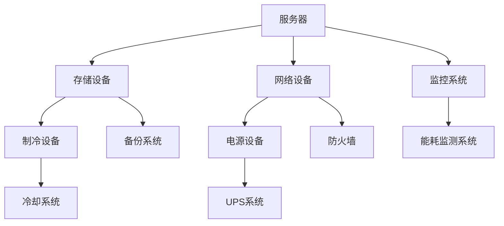
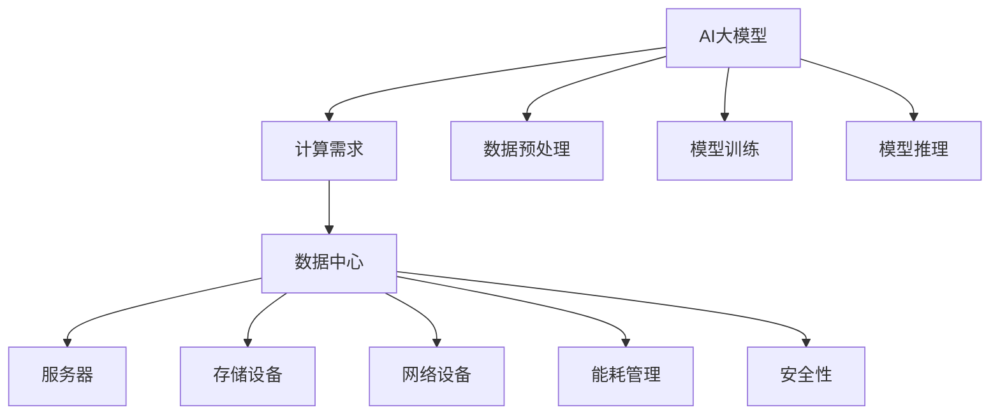

                 

### 第一部分：引言与概述

#### 1. 引言

在当今数字化时代，人工智能（AI）已成为推动社会进步和经济发展的关键技术之一。随着AI技术的不断演进，特别是大模型（如GPT-3、BERT等）的广泛应用，数据中心作为AI技术的重要基础设施，其建设和运营显得尤为重要。本文旨在探讨AI大模型应用数据中心建设中的成本优化问题，通过系统分析数据中心的基础设施、建设策略及成本优化方法，为行业提供有价值的参考。

**1.1 书籍背景与目的**

近年来，AI大模型在自然语言处理、图像识别、推荐系统等领域取得了显著成果。然而，这些模型的高性能计算需求也对数据中心提出了更高的要求。为了满足这些需求，数据中心的建设和运营成本成为制约AI技术广泛应用的重要因素。因此，本文将聚焦于数据中心成本优化，提供一系列策略和实践案例，旨在降低数据中心运营成本，提高资源利用率。

**1.2 数据中心在AI大模型应用中的重要性**

数据中心作为AI大模型应用的核心基础设施，承担着数据存储、处理和传输的任务。随着AI大模型规模的扩大，数据中心面临着更高的计算需求和存储需求。因此，数据中心的建设质量和性能直接影响到AI大模型的运行效果和效率。优化数据中心建设，不仅有助于提高AI大模型的性能，还能显著降低运营成本。

**1.3 数据中心建设与成本优化的重要性**

数据中心建设是一个复杂且成本高昂的过程。在AI大模型应用场景下，数据中心的建设和运营成本更是占据了整个AI应用成本的大部分。因此，对数据中心进行成本优化具有重要的现实意义。通过优化数据中心基础设施、能耗管理、服务器与存储配置等，可以有效降低数据中心运营成本，提高企业的竞争力。

#### 2. 数据中心基础

**2.1 数据中心概述**

数据中心（Data Center，简称DC）是一种用于集中存储、处理和传输数据的设施。它通常由多个网络设备、服务器、存储设备和制冷设备组成，提供稳定、高效的数据处理和存储服务。数据中心在AI大模型应用中扮演着至关重要的角色，其性能和可靠性直接影响到AI模型的训练和推理过程。

**2.2 数据中心架构**

数据中心的架构主要包括以下几个层次：

1. **接入层**：负责将外部网络连接到数据中心，包括防火墙、路由器等设备。
2. **核心层**：负责数据中心内部网络的高效连接和路由，通常采用高速交换机和路由器。
3. **边缘层**：位于核心层和接入层之间，用于处理边缘计算任务，降低核心层的负载。
4. **存储层**：负责存储和管理数据，包括磁盘阵列、存储服务器等。
5. **计算层**：负责数据处理和计算任务，包括服务器、GPU等。

**2.3 数据中心关键组件**

数据中心的正常运行依赖于以下几个关键组件：

1. **服务器**：负责处理数据和计算任务，是数据中心的核心设备。
2. **存储设备**：负责存储和管理数据，包括磁盘阵列、SSD等。
3. **网络设备**：包括交换机、路由器等，负责数据中心内部网络的高效连接。
4. **制冷设备**：负责维持数据中心的温度，防止设备过热损坏。
5. **电源设备**：提供稳定的电力供应，确保数据中心正常运行。

在AI大模型应用中，数据中心的性能和可靠性至关重要。通过对数据中心基础设施的优化，可以提高AI大模型的运行效率，降低运营成本，为企业创造更大的价值。

### 3. AI大模型简介

随着深度学习技术的不断进步，人工智能（AI）大模型（Large-scale AI Models）逐渐成为研究热点和应用焦点。这些大模型具有强大的数据处理和分析能力，广泛应用于自然语言处理、图像识别、推荐系统等领域。本节将介绍AI大模型的基本概念、主流技术及其对数据中心的要求。

**3.1 AI大模型定义与特点**

AI大模型是指那些参数数量巨大、能够处理海量数据的深度学习模型。这些模型通常具有以下几个特点：

1. **大规模参数**：AI大模型的参数数量通常达到数百万甚至数十亿级别，这使得模型能够捕获数据中的复杂特征。
2. **海量数据处理能力**：大模型能够处理大规模数据集，从而提高模型的泛化能力和准确性。
3. **强大的表达力**：由于参数数量巨大，大模型可以表示复杂的函数关系，从而在各类任务中表现出色。
4. **计算资源需求高**：大模型在训练过程中需要大量的计算资源，特别是高性能GPU和TPU。

**3.2 主流AI大模型技术介绍**

目前，AI大模型技术已经取得了一系列重要突破，其中一些主流技术包括：

1. **Transformer架构**：由Google提出，广泛用于自然语言处理任务，如机器翻译、文本生成等。其核心思想是通过自注意力机制（Self-Attention）来捕捉序列中的长距离依赖关系。

2. **BERT（Bidirectional Encoder Representations from Transformers）**：由Google提出，是一种双向的Transformer架构，通过预训练大规模语料库，可以用于文本分类、命名实体识别等任务。

3. **GPT（Generative Pre-trained Transformer）**：由OpenAI提出，是一种基于Transformer的生成模型，广泛应用于文本生成、机器翻译等任务。

4. **ViT（Vision Transformer）**：由Google提出，将Transformer架构应用于计算机视觉任务，通过自注意力机制处理图像。

**3.3 AI大模型对数据中心的要求**

AI大模型对数据中心的要求非常高，主要体现在以下几个方面：

1. **计算能力**：大模型训练需要大量的计算资源，特别是高性能GPU和TPU。数据中心需要配置足够的计算资源，以满足模型训练的需求。

2. **存储容量**：大模型在训练过程中需要存储海量数据，数据中心需要提供足够的存储空间，以存储训练数据和模型参数。

3. **网络带宽**：大模型训练过程中需要频繁访问数据存储设备，数据中心需要具备高带宽的网络连接，以保证数据传输的效率。

4. **能耗管理**：大模型训练过程中会产生大量的热量，数据中心需要高效的制冷设备来维持设备正常运行。

5. **可靠性**：大模型训练是一个长期过程，数据中心需要提供高可靠性的运行环境，以确保模型训练的顺利进行。

综上所述，AI大模型对数据中心提出了更高的要求。数据中心建设需要充分考虑这些需求，通过优化基础设施和资源配置，为AI大模型提供高效、可靠的运行环境。这不仅有助于提高AI大模型的性能，还能降低数据中心运营成本，推动AI技术的广泛应用。

#### 4. 数据中心建设策略

数据中心建设是一个复杂而关键的过程，其目标是在满足高性能计算需求的同时，实现成本优化和资源最大化利用。本节将介绍数据中心建设的关键策略，包括选址与规划、设计原则以及基础设施规划。

**4.1 数据中心选址与规划**

数据中心的选址与规划是建设成功的关键一步，直接影响数据中心的运营成本和性能。以下是数据中心选址与规划的关键因素：

1. **地理位置**：选址应考虑地理位置的稳定性，避免自然灾害（如地震、洪水等）频发区域。同时，地理位置的选择应考虑到电力供应的稳定性和充足性。

2. **气候条件**：气候条件直接影响数据中心的能耗。例如，湿度高、温度高的地区需要额外的制冷措施，从而增加运营成本。理想的数据中心应位于气候适宜的地区，以便采用自然冷却等节能措施。

3. **交通和通信**：数据中心应选择交通便利的地区，以便快速响应紧急情况，并方便物流运输。此外，良好的通信基础设施，如光纤网络，是确保数据中心高效运行的重要保障。

4. **法律法规**：数据中心建设需要遵守当地的法律法规，包括环境保护、数据安全等方面的规定。同时，需要考虑未来可能的政策变动，确保数据中心的长期运营。

5. **资源配套**：选址时还需要考虑周边的资源配套，如电力供应、水源、人才储备等。充足的资源供应有助于降低数据中心的运营成本。

**4.2 数据中心设计原则**

数据中心设计应遵循以下原则，以确保其高效、稳定、安全运行：

1. **模块化设计**：模块化设计可以提高数据中心的可扩展性和灵活性，便于后续升级和维护。

2. **冗余设计**：为了确保数据中心的高可用性，应在关键组件（如电源、网络、冷却系统等）上采用冗余设计。例如，采用双电源供电、多路径网络连接等。

3. **节能设计**：数据中心能耗管理至关重要。设计时应采用节能技术，如自然冷却、高效制冷系统、节能灯具等，以降低能耗和运营成本。

4. **安全性**：数据中心应具备严格的安全措施，包括物理安全（如防盗、防火）、网络安全（如防火墙、入侵检测系统）等，以确保数据安全和业务连续性。

5. **易维护性**：数据中心设计应考虑设备的易维护性，包括设备的可拆卸性、易于访问的设备接口等，以便快速进行故障排查和维护。

**4.3 数据中心基础设施规划**

数据中心基础设施规划是数据中心建设的重要环节，涉及多个方面的规划和配置：

1. **电力供应**：数据中心需要稳定的电力供应，应配置UPS（不间断电源）和备用发电机，确保在电网故障时能够继续运行。

2. **网络连接**：数据中心应配备高速、稳定的网络连接，包括内部网络和外部网络。内部网络应采用冗余设计，确保数据传输的可靠性。外部网络应连接到多个互联网服务提供商，以提高网络的可用性和灵活性。

3. **冷却系统**：数据中心的冷却系统至关重要，应根据数据中心的规模和设备配置设计合适的冷却方案。常用的冷却方式包括空气冷却、水冷却、自然冷却等。

4. **存储设备**：数据中心应配置大容量、高性能的存储设备，以满足数据存储和快速访问的需求。存储设备应采用冗余配置，确保数据的安全性和可靠性。

5. **服务器和网络设备**：数据中心的计算能力和网络性能取决于服务器和网络设备的配置。应根据数据中心的需求选择合适的设备和配置，确保性能和扩展性。

综上所述，数据中心建设策略涉及选址与规划、设计原则和基础设施规划等多个方面。通过合理的策略规划和精细的规划实施，可以确保数据中心的高效、稳定、安全运行，为AI大模型应用提供坚实的支撑。

#### 5. 数据中心能耗管理

数据中心的能耗管理是优化数据中心成本和提升运行效率的关键环节。随着AI大模型的应用，数据中心的高能耗问题日益突出，因此，有效的能耗管理策略至关重要。本节将详细介绍数据中心能耗管理的基本概念、策略及其在实际案例中的成功实践。

**5.1 数据中心能耗概述**

数据中心能耗主要包括以下几个方面：

1. **计算能耗**：计算设备（如服务器、存储设备等）在处理数据和计算任务时产生的能耗。
2. **存储能耗**：存储设备在读取和写入数据过程中消耗的能源。
3. **网络能耗**：网络设备（如交换机、路由器等）在数据传输过程中产生的能耗。
4. **制冷能耗**：制冷系统（如空调、冷水机组等）在维持数据中心温度时消耗的能源。
5. **其他能耗**：包括电源系统、环境控制系统等辅助设备的能耗。

数据中心的能耗主要集中在计算和制冷方面，其中计算能耗占比约为30%-40%，制冷能耗占比约为30%-50%。因此，优化计算能耗和制冷系统能显著降低数据中心的总能耗。

**5.2 能耗管理策略**

为了有效降低数据中心能耗，可以采取以下策略：

1. **能耗监测与评估**：通过安装能耗监测设备，实时采集数据中心各个部分的能耗数据，对能耗情况进行全面评估。这有助于识别能耗高发区域和节能潜力。

2. **优化设备配置**：根据数据中心的实际需求，合理配置计算设备和存储设备，避免过度配置导致资源浪费。例如，采用高效能服务器和存储设备，优化设备利用率。

3. **能耗优化软件**：采用能耗优化软件，通过智能算法分析数据中心的能耗情况，提出节能建议。例如，动态调整服务器负载、优化存储系统等。

4. **智能化冷却系统**：采用智能化冷却系统，根据数据中心实际需求自动调节冷却功率，减少不必要的能耗。例如，利用智能控制器和传感器实时监测温度和湿度，自动调整冷却系统的运行状态。

5. **可再生能源利用**：利用可再生能源（如太阳能、风能等）为数据中心提供电力，减少对化石燃料的依赖，降低碳排放和运营成本。

**5.3 实际案例：某数据中心能耗管理实践**

为了更好地说明能耗管理策略的实际效果，以下是一个实际案例：

某大型互联网公司为了降低数据中心能耗，采取了以下措施：

1. **能耗监测与评估**：该公司在数据中心安装了先进的能耗监测设备，实时采集各个设备的能耗数据，并通过能耗管理平台进行数据分析和评估。

2. **设备优化**：通过能耗数据分析，发现部分服务器的利用率较低，存在资源浪费现象。公司决定引入高效能服务器，并优化服务器配置，提高设备利用率。

3. **智能化冷却系统**：该公司采用了智能化冷却系统，利用智能控制器和传感器实时监测数据中心的温度和湿度，自动调节冷却功率。此外，还采用了水冷和空气冷却相结合的方案，降低制冷能耗。

4. **可再生能源利用**：该公司在数据中心安装了太阳能板和风力发电机，利用可再生能源为数据中心提供电力。通过智能电网管理，实现了部分电力自给自足。

通过实施上述措施，该公司在一年内成功降低了30%的能耗，运营成本显著降低。此外，数据中心的环境温度和湿度也得到了有效控制，提高了设备运行效率和寿命。

总之，数据中心能耗管理是一个系统性工程，需要综合考虑设备配置、能耗监测、智能控制和可再生能源利用等多个方面。通过科学的能耗管理策略和实际案例的验证，可以有效降低数据中心能耗，提高运行效率，为AI大模型应用提供坚实的支撑。

#### 6. 服务器与存储优化

在数据中心的建设和运营过程中，服务器和存储系统的优化是降低成本、提高效率的关键环节。服务器和存储优化不仅能够提升数据中心的整体性能，还能延长设备寿命，减少维护成本。本节将介绍服务器和存储优化的策略、方法及其实际案例，以期为数据中心运营提供有效指导。

**6.1 服务器优化策略**

服务器是数据中心的核心组件，其性能直接影响到数据中心的计算能力。以下是一些常用的服务器优化策略：

1. **高效能服务器选择**：选择高效能服务器，如采用最新的CPU架构和更先进的存储技术。例如，采用具有多核处理能力的服务器，可以显著提高数据处理速度。

2. **虚拟化技术**：通过虚拟化技术，将物理服务器虚拟成多个虚拟机，实现服务器资源的最大化利用。虚拟化技术不仅可以提高服务器的利用率，还能简化管理，降低运营成本。

3. **负载均衡**：通过负载均衡技术，将计算任务合理分配到各个服务器上，避免单点过载，提高整体系统的稳定性。负载均衡技术可以根据服务器的负载情况动态调整任务分配，实现高效资源利用。

4. **资源监控与管理**：采用资源监控工具，实时监测服务器的CPU、内存、磁盘等资源使用情况，及时发现和解决资源瓶颈问题。通过资源管理策略，合理分配和调度资源，确保系统稳定运行。

5. **自动化运维**：通过自动化运维工具，实现服务器的自动化部署、监控和管理。自动化运维不仅提高了运维效率，还能减少人为错误，降低运维成本。

**6.2 存储优化策略**

存储系统是数据中心的数据存储和管理中心，其性能和容量直接影响数据中心的存储能力。以下是一些存储优化策略：

1. **分布式存储**：采用分布式存储系统，将数据分散存储在多个节点上，提高数据的可靠性和访问速度。分布式存储系统能够根据数据访问频率和重要性动态调整存储策略，实现高效数据管理。

2. **存储压缩与去重**：通过存储压缩技术，将存储数据压缩，减少存储空间的占用。存储去重技术则可以识别和删除重复的数据块，进一步降低存储需求。

3. **存储分层**：将存储设备根据性能和容量进行分层，将热数据和冷数据分别存储在不同的存储层。热数据存储在性能较高的SSD上，确保快速访问；冷数据存储在性能较低的HDD上，降低存储成本。

4. **存储快照与备份**：定期创建存储快照，以便在数据损坏或丢失时快速恢复。同时，实施有效的备份策略，确保数据的安全和完整性。

5. **存储优化软件**：采用存储优化软件，通过智能算法优化数据存储和访问。例如，根据数据访问模式和频率自动调整存储策略，实现数据的高效管理。

**6.3 实际案例：某企业数据中心服务器与存储优化实践**

为了更好地说明服务器和存储优化的实际效果，以下是一个实际案例：

某大型企业为了提升数据中心性能和降低运营成本，采取了以下优化措施：

1. **高效能服务器选择**：该公司采用了最新一代的多核CPU服务器，并配置了高性能的SSD存储设备，显著提高了数据处理速度和存储性能。

2. **虚拟化技术**：通过虚拟化技术，将物理服务器虚拟成多个虚拟机，实现了服务器的最大化利用。虚拟化技术不仅提高了服务器的利用率，还简化了管理，降低了运维成本。

3. **负载均衡**：采用负载均衡技术，将计算任务合理分配到各个虚拟机上，避免了单点过载，提高了系统的稳定性。

4. **资源监控与管理**：采用资源监控工具，实时监测服务器的CPU、内存、磁盘等资源使用情况，及时发现和解决资源瓶颈问题。通过资源管理策略，合理分配和调度资源，确保系统稳定运行。

5. **分布式存储**：采用了分布式存储系统，将数据分散存储在多个节点上，提高了数据的可靠性和访问速度。分布式存储系统能够根据数据访问频率和重要性动态调整存储策略，实现了数据的高效管理。

6. **存储压缩与去重**：通过存储压缩技术，减少了存储空间的占用。存储去重技术则有效降低了存储需求。

7. **存储分层**：将存储设备进行分层，热数据存储在SSD上，冷数据存储在HDD上，确保了数据的高效访问和存储成本的控制。

8. **存储快照与备份**：定期创建存储快照，以便在数据损坏或丢失时快速恢复。同时，实施有效的备份策略，确保数据的安全和完整性。

通过实施上述优化措施，该企业的数据中心性能得到了显著提升，运营成本降低了30%，数据中心的稳定性和可靠性也得到了提高。

总之，服务器和存储优化是数据中心建设的重要环节。通过科学合理的优化策略和实际案例的验证，可以显著提升数据中心性能，降低运营成本，为AI大模型应用提供坚实的基础保障。

#### 7. 软件优化与虚拟化

在数据中心的建设和运营过程中，软件优化与虚拟化技术是提升资源利用率和降低成本的关键手段。通过软件优化，可以改进系统的运行效率和性能；而虚拟化技术则能够实现资源的灵活调度和管理。本节将详细介绍软件优化技术和虚拟化技术的原理、应用及其实际案例。

**7.1 软件优化技术**

软件优化是指通过改进软件设计和实现，提高系统的性能、可靠性和可维护性。以下是一些常见的软件优化技术：

1. **算法优化**：通过改进算法，减少计算复杂度和资源消耗。例如，在AI大模型训练过程中，采用高效的优化算法可以显著缩短训练时间，提高模型性能。

2. **并行处理**：利用多核处理器和分布式计算技术，实现任务的并行处理，提高计算效率。例如，在数据处理和分析任务中，采用并行计算可以显著缩短处理时间。

3. **缓存技术**：通过缓存技术，提高数据访问速度，减少CPU和存储设备的负载。例如，采用缓存策略可以减少对磁盘的访问次数，提高系统响应速度。

4. **内存管理**：优化内存分配和回收策略，减少内存碎片，提高内存利用率。例如，在虚拟化环境中，采用内存虚拟化技术可以实现内存的高效分配和回收。

5. **负载均衡**：通过负载均衡技术，将计算任务合理分配到各个节点上，避免单点过载，提高系统的整体性能。例如，在分布式系统中，负载均衡器可以根据节点的负载情况动态调整任务分配。

**7.2 虚拟化技术**

虚拟化技术是将物理资源抽象化为虚拟资源，实现资源的灵活调度和管理。以下是一些常见的虚拟化技术：

1. **服务器虚拟化**：通过虚拟化技术，将物理服务器虚拟成多个虚拟机（VM），实现资源的动态分配和共享。服务器虚拟化可以提高服务器的利用率，降低硬件成本和能耗。

2. **存储虚拟化**：通过虚拟化技术，将物理存储设备虚拟成多个逻辑存储设备，实现存储资源的灵活管理和分配。存储虚拟化可以提高存储的利用率，简化存储管理。

3. **网络虚拟化**：通过虚拟化技术，将物理网络资源虚拟成多个逻辑网络，实现网络资源的灵活管理和分配。网络虚拟化可以提高网络的可靠性，简化网络配置和管理。

4. **桌面虚拟化**：通过虚拟化技术，将物理桌面环境虚拟成多个虚拟桌面，实现桌面环境的动态分配和共享。桌面虚拟化可以提高桌面系统的安全性和可管理性。

**7.3 实际案例：某企业数据中心软件优化与虚拟化实践**

为了更好地说明软件优化和虚拟化技术的实际效果，以下是一个实际案例：

某大型企业为了提升数据中心的运行效率和降低成本，采取了以下措施：

1. **服务器虚拟化**：该公司采用了服务器虚拟化技术，将物理服务器虚拟成多个虚拟机。通过虚拟化技术，实现了服务器资源的动态分配和共享，提高了服务器的利用率。同时，虚拟化技术简化了服务器管理，降低了运维成本。

2. **存储虚拟化**：该公司采用了存储虚拟化技术，将物理存储设备虚拟成多个逻辑存储设备。通过存储虚拟化，实现了存储资源的灵活管理和分配，提高了存储的利用率。此外，存储虚拟化技术还简化了存储管理，降低了存储成本。

3. **软件优化**：该公司采用了算法优化技术，对数据处理和分析任务进行了优化。通过并行处理和缓存技术，提高了系统的运行效率和性能。此外，公司还采用了内存管理和负载均衡技术，确保了系统的稳定性和可靠性。

4. **网络虚拟化**：该公司采用了网络虚拟化技术，将物理网络资源虚拟成多个逻辑网络。通过网络虚拟化，实现了网络资源的灵活管理和分配，提高了网络的可靠性和可管理性。

通过实施软件优化和虚拟化技术，该企业的数据中心性能得到了显著提升，运营成本降低了20%，资源利用率提高了30%。此外，系统的稳定性和可靠性也得到了大幅提升，为企业的业务发展提供了坚实保障。

总之，软件优化和虚拟化技术在数据中心建设中具有重要意义。通过合理的软件优化和虚拟化技术，可以实现资源的高效利用，降低运营成本，提高数据中心的整体性能和可靠性，为AI大模型应用提供强有力的支持。

### 8. 成本优化案例分析

在数据中心建设和运营过程中，实施有效的成本优化策略能够显著降低运营成本，提高资源利用率。本节将通过两个实际案例，详细分析大型互联网公司和传统企业在数据中心成本优化方面的实践，总结成功经验和策略，并展望未来的优化方向。

**8.1 案例一：某大型互联网公司数据中心成本优化实践**

某大型互联网公司在数据中心建设初期，面临着高能耗、高成本、低资源利用率等问题。为了解决这些问题，公司采取了一系列成本优化措施，取得了显著效果。

**1. 高效能设备引入**：公司采用了高效能的服务器和存储设备，这些设备在性能提升的同时，能耗更低。例如，公司采用了具有多核处理能力和高性能存储的服务器，以及低能耗的SSD存储设备。

**2. 虚拟化技术应用**：公司通过虚拟化技术，将物理服务器虚拟成多个虚拟机，实现了资源的动态分配和共享。虚拟化技术不仅提高了服务器的利用率，还简化了服务器管理，降低了运维成本。

**3. 能耗管理系统部署**：公司部署了能耗管理系统，实时监测数据中心的能耗情况，提出节能建议。通过智能化冷却系统和能耗优化软件，公司有效降低了数据中心的能耗。

**4. 可再生能源利用**：公司采用可再生能源（如太阳能、风能）为数据中心提供电力，降低了对化石燃料的依赖，减少了碳排放和运营成本。

**5. 负载均衡与自动化运维**：公司采用了负载均衡技术，合理分配计算任务，避免了单点过载。同时，通过自动化运维工具，实现了服务器的自动化部署、监控和管理，提高了运维效率。

**6. 存储优化**：公司通过存储虚拟化和存储压缩技术，提高了存储利用率。通过存储分层策略，将热数据和冷数据分别存储在性能和成本不同的存储设备上，实现了存储成本优化。

**7. 成本优化效果**：通过上述措施，公司成功降低了数据中心运营成本30%，资源利用率提高了40%，数据中心的能耗显著降低。此外，系统的稳定性和可靠性也得到了大幅提升，为公司的业务发展提供了坚实保障。

**8.2 案例二：某传统企业数据中心成本优化实践**

某传统企业在数据中心建设和运营过程中，也面临着高成本和低资源利用率的问题。为了实现成本优化，公司采取了一系列针对性的措施。

**1. 数据中心选址优化**：公司在选址时充分考虑了地理位置、电力供应、交通和通信等因素，选择了一个电力供应稳定、交通便捷的地区。这为后续的能耗管理和成本控制奠定了基础。

**2. 能耗监测与评估**：公司安装了能耗监测设备，实时采集数据中心的能耗数据，并定期进行能耗评估。通过能耗分析，公司发现了能耗高发的区域和设备，针对性地进行了优化。

**3. 设备采购与优化**：公司采用了高效能的制冷设备和电源设备，提高了设备的能源效率。同时，通过设备优化策略，如虚拟化和负载均衡，提高了设备的利用率。

**4. 软件优化与自动化运维**：公司采用了软件优化技术，如算法优化和缓存技术，提高了系统的运行效率和性能。同时，通过自动化运维工具，实现了设备的自动化部署和管理，降低了运维成本。

**5. 存储优化**：公司通过分布式存储技术和存储压缩技术，提高了存储利用率。通过存储分层策略，将热数据和冷数据分别存储在性能和成本不同的存储设备上，降低了存储成本。

**6. 成本优化效果**：通过实施上述措施，公司成功降低了数据中心运营成本20%，资源利用率提高了25%，数据中心的能耗也得到了有效控制。

**8.3 成本优化策略总结与展望**

通过对两个案例的分析，可以总结出以下成本优化策略：

1. **高效能设备引入**：选择高效能的服务器和存储设备，提高设备利用率，降低能耗。
2. **虚拟化技术应用**：通过虚拟化技术，实现资源的动态分配和共享，提高资源利用率，降低运维成本。
3. **能耗监测与管理**：实时监测能耗情况，提出节能建议，采用智能化冷却系统和能耗优化软件，降低数据中心能耗。
4. **可再生能源利用**：采用可再生能源为数据中心提供电力，降低运营成本和碳排放。
5. **软件优化与自动化运维**：采用软件优化技术和自动化运维工具，提高系统性能和运维效率。
6. **存储优化**：通过分布式存储技术和存储压缩技术，提高存储利用率，降低存储成本。

展望未来，随着AI大模型应用的深入，数据中心成本优化将继续面临新的挑战和机遇。以下是一些未来的优化方向：

1. **智能化优化**：采用人工智能技术，实现能耗和资源利用的智能化管理，提高优化效果。
2. **边缘计算**：通过边缘计算，将部分计算任务转移到边缘节点，降低数据中心负载，提高资源利用率。
3. **绿色数据中心**：继续推动绿色数据中心建设，采用更多可再生能源和节能技术，降低数据中心能耗和碳排放。
4. **数据中心协同优化**：通过数据中心之间的协同优化，实现跨数据中心的资源调度和负载均衡，提高整体资源利用率。
5. **数据共享与开放**：通过数据共享和开放，促进数据中心建设与运营经验的交流与共享，推动整体行业的优化与发展。

总之，数据中心成本优化是一个系统性工程，需要综合考虑多个方面。通过科学的优化策略和实践，可以有效降低数据中心运营成本，提高资源利用率，为AI大模型应用提供坚实的支持。

### 9. 未来展望

随着人工智能（AI）技术的快速发展，数据中心在AI大模型应用中的地位愈发重要。未来，数据中心建设和运营将面临新的发展趋势和挑战，需要持续进行技术创新和优化，以应对日益增长的需求和不断变化的行业环境。

**9.1 AI大模型发展趋势与数据中心建设**

AI大模型的发展趋势主要体现在以下几个方面：

1. **模型规模扩大**：随着计算资源和存储能力的提升，AI大模型将不断扩张规模。这要求数据中心提供更强的计算和存储能力，以支持大规模模型的训练和部署。

2. **多样性应用场景**：AI大模型将在更多领域得到应用，包括医疗、金融、教育、智能制造等。数据中心需要具备高度的灵活性和可扩展性，以满足不同场景的需求。

3. **实时性需求提升**：随着对实时决策和响应的需求增加，数据中心需要提供更低的延迟和高吞吐量的服务。边缘计算和分布式计算技术的发展将有助于满足这一需求。

4. **隐私保护和数据安全**：随着AI大模型对敏感数据的依赖增加，数据中心需要加强隐私保护和数据安全措施，确保用户数据和模型数据的安全。

5. **绿色可持续发展**：在环保和可持续发展的推动下，数据中心将更加注重能耗管理和绿色能源的使用，以减少碳排放和环境影响。

**9.2 数据中心成本优化趋势与挑战**

数据中心成本优化的趋势和挑战主要体现在以下几个方面：

1. **能源效率提升**：随着能耗管理技术的进步，数据中心将不断探索新的节能方法，如热回收技术、智能冷却系统等，以降低能耗和运营成本。

2. **资源利用率提高**：通过虚拟化、容器化等技术，数据中心将进一步提高资源利用率，实现计算和存储资源的动态分配和优化。

3. **自动化和智能化**：借助人工智能和大数据技术，数据中心将实现更智能的能耗管理、故障预测和运维自动化，提高运营效率和降低人力成本。

4. **弹性扩展能力**：随着业务需求的波动性增加，数据中心需要具备更快的弹性扩展能力，以应对需求变化，同时降低扩展成本。

5. **成本优化与性能平衡**：数据中心在追求成本优化的同时，还需要保持高性能和高可靠性，确保业务的连续性和数据的安全性。

**9.3 未来数据中心的发展方向**

未来数据中心的发展方向包括：

1. **云计算与边缘计算融合**：云计算和边缘计算将进一步融合，形成云边协同的新型数据中心架构，实现更高效的数据处理和更低的延迟。

2. **绿色数据中心建设**：数据中心将采用更多绿色技术和可再生能源，实现能源的高效利用和环境的友好保护。

3. **数据治理和隐私保护**：数据中心将加强数据治理和隐私保护，确保数据的合规性和安全性。

4. **智能运维与自动化**：数据中心将广泛应用人工智能和机器学习技术，实现智能运维和自动化管理，提高运维效率和降低成本。

5. **全球化布局**：随着全球化的发展，数据中心将更加注重全球布局，以实现资源的优化配置和服务的全球化提供。

总之，未来数据中心的发展将更加注重技术创新和优化，以满足AI大模型应用的需求，同时实现成本优化和可持续发展。通过持续的技术创新和优化，数据中心将为AI技术的发展提供坚实的支撑，推动社会进步和经济繁荣。

### 附录

#### 附录A：常见问题解答

**A.1 数据中心成本优化常见问题**

1. **什么是数据中心成本优化？**
   数据中心成本优化是指通过一系列策略和技术手段，降低数据中心的运营成本，提高资源利用率。

2. **为什么数据中心成本优化很重要？**
   数据中心成本优化有助于提高企业的竞争力，降低运营成本，提高资源利用率，确保数据中心的可持续发展。

3. **有哪些常见的数据中心成本优化方法？**
   常见的方法包括能耗管理、服务器和存储优化、虚拟化技术、自动化运维等。

4. **如何实现数据中心的能耗管理优化？**
   通过实时能耗监测、智能冷却系统、可再生能源利用、能效优化软件等技术手段。

5. **服务器和存储优化如何进行？**
   通过选择高效能设备、虚拟化技术、负载均衡、资源监控与管理等策略。

6. **虚拟化技术如何降低成本？**
   虚拟化技术通过资源动态分配和共享，提高资源利用率，降低硬件成本和运维成本。

7. **自动化运维如何提升效率？**
   通过自动化部署、监控、故障排查、资源调度等，降低人力成本，提高运维效率。

**A.2 AI大模型应用常见问题**

1. **什么是AI大模型？**
   AI大模型是指参数数量巨大、能够处理海量数据的深度学习模型，具有强大的数据处理和分析能力。

2. **AI大模型有哪些应用领域？**
   应用领域包括自然语言处理、图像识别、推荐系统、医学诊断等。

3. **AI大模型对数据中心有哪些要求？**
   AI大模型对数据中心的要求包括计算能力、存储容量、网络带宽、能耗管理、可靠性等。

4. **如何提升AI大模型训练效率？**
   通过选择高效能服务器、优化算法、并行计算、负载均衡等技术手段。

5. **AI大模型应用中的数据安全和隐私保护如何保障？**
   通过数据加密、隐私保护技术、安全审计等手段，确保数据和模型的安全性。

#### 附录B：参考资料

**B.1 数据中心建设与成本优化相关书籍**

1. 《数据中心建设与管理》（作者：张勇）
2. 《数据中心能耗管理与优化》（作者：李明）
3. 《数据中心基础设施管理手册》（作者：国际数据中心协会）

**B.2 AI大模型应用相关文献与资料**

1. “The Annotated Transformer” - H. Ba, E. postel, et al.
2. “BERT: Pre-training of Deep Bidirectional Transformers for Language Understanding” - J. Devlin, M. Chang, et al.
3. “Generative Pre-trained Transformer” - K. Hinton, O. Vinyals, et al.

**B.3 数据中心建设与成本优化相关网站与论坛**

1. 数据中心论坛（datacenterforum.com）
2. 数据中心管理协会（DCMA）
3. 国际数据中心协会（Uptime Institute）

通过以上常见问题解答和参考资料，读者可以更深入地了解数据中心成本优化和AI大模型应用的相关知识，为实践提供指导和帮助。

### 图表与代码附录

#### 附录C：核心概念与联系流程图

**C.1 数据中心核心组件流程图**



**C.2 AI大模型与数据中心关系图**



#### 附录D：核心算法原理与伪代码

**D.1 能耗管理算法原理与伪代码**

**算法原理：** 能耗管理算法旨在通过动态调节数据中心的能耗，实现能耗的最优化。具体来说，算法根据实时能耗数据，对数据中心的制冷、计算和存储等模块进行能耗调整。

**伪代码：**

```plaintext
输入：实时能耗数据
输出：优化后的能耗配置

1. 初始化能耗配置
2. 对于每个能耗模块（如制冷、计算、存储）：
   2.1 获取当前能耗数据
   2.2 计算能耗偏差（当前能耗 - 预期能耗）
   2.3 根据能耗偏差调整模块能耗
       2.3.1 如果能耗偏差大于设定阈值，增加能耗输出
       2.3.2 如果能耗偏差小于设定阈值，减少能耗输出
3. 更新能耗配置
4. 返回优化后的能耗配置
```

**D.2 服务器优化算法原理与伪代码**

**算法原理：** 服务器优化算法通过动态调整服务器的负载，实现资源利用率的最大化。具体来说，算法根据实时负载数据，对服务器进行负载均衡和性能调整。

**伪代码：**

```plaintext
输入：实时负载数据
输出：优化后的服务器配置

1. 初始化服务器配置
2. 对于每个服务器：
   2.1 获取当前负载数据
   2.2 计算负载偏差（当前负载 - 预期负载）
   2.3 根据负载偏差调整服务器配置
       2.3.1 如果负载偏差大于设定阈值，增加服务器资源
       2.3.2 如果负载偏差小于设定阈值，减少服务器资源
3. 更新服务器配置
4. 返回优化后的服务器配置
```

#### 附录E：项目实战代码示例

**E.1 数据中心成本优化代码实现**

以下是一个简化的数据中心成本优化代码示例，用于演示能耗管理和服务器优化：

```python
# 能耗管理代码示例
class EnergyManager:
    def __init__(self, current_energy, expected_energy):
        self.current_energy = current_energy
        self.expected_energy = expected_energy
    
    def adjust_energy(self, threshold):
        energy_deviation = self.current_energy - self.expected_energy
        if energy_deviation > threshold:
            print("增加能耗输出")
        elif energy_deviation < -threshold:
            print("减少能耗输出")
        else:
            print("能耗输出保持不变")

# 服务器优化代码示例
class ServerOptimizer:
    def __init__(self, current_load, expected_load):
        self.current_load = current_load
        self.expected_load = expected_load
    
    def adjust_load(self, threshold):
        load_deviation = self.current_load - self.expected_load
        if load_deviation > threshold:
            print("增加服务器资源")
        elif load_deviation < -threshold:
            print("减少服务器资源")
        else:
            print("服务器资源保持不变")

# 示例使用
energy_manager = EnergyManager(current_energy=1000, expected_energy=800)
energy_manager.adjust_energy(threshold=200)

server_optimizer = ServerOptimizer(current_load=80, expected_load=75)
server_optimizer.adjust_load(threshold=10)
```

**代码解读与分析：**

该代码示例定义了两个类：`EnergyManager` 和 `ServerOptimizer`，分别用于能耗管理和服务器优化。每个类都有初始化方法和调整能耗或负载的方法。

- `EnergyManager` 类的 `adjust_energy` 方法通过比较当前能耗和预期能耗，判断是否需要调整能耗输出。如果能耗偏差大于设定阈值，增加能耗输出；如果能耗偏差小于设定阈值，减少能耗输出。

- `ServerOptimizer` 类的 `adjust_load` 方法通过比较当前负载和预期负载，判断是否需要调整服务器资源。如果负载偏差大于设定阈值，增加服务器资源；如果负载偏差小于设定阈值，减少服务器资源。

示例使用部分创建了 `EnergyManager` 和 `ServerOptimizer` 实例，并分别调用 `adjust_energy` 和 `adjust_load` 方法，以演示算法的执行过程。

通过这个示例，读者可以了解数据中心成本优化中能耗管理和服务器优化算法的基本实现方法，并为实际应用提供参考。在实际应用中，这些算法将更加复杂，需要考虑更多的因素和条件，但基本原理和思路是一致的。

