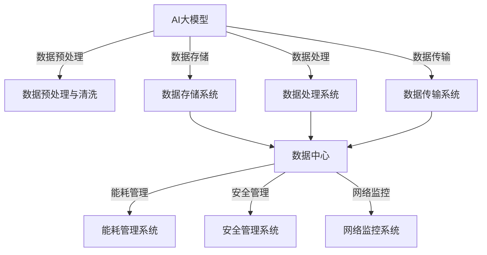

                 

# AI大模型应用数据中心建设：数据中心技术创新

## 关键词
- AI大模型
- 数据中心
- 技术创新
- 应用场景
- 能耗管理
- 安全管理

## 摘要
本文将深入探讨AI大模型应用数据中心的建设与技术创新。首先，我们将介绍AI大模型的基础知识，包括其核心概念、类型及应用场景。接着，我们分析数据中心技术的基础知识，探讨其发展历程、架构及未来趋势。然后，我们探讨AI大模型与数据中心之间的紧密关系，分析数据中心对AI大模型的支持需求，以及AI大模型在数据中心中的应用场景。最后，通过具体案例分析，我们总结AI大模型数据中心建设的技术挑战与策略，展望数据中心的发展趋势。

---

### 目录大纲

#### 第一部分：AI大模型技术基础

1. AI大模型概述
   - AI大模型的核心概念
   - AI大模型的组成部分
   - AI大模型的类型与应用场景

2. 数据中心技术基础
   - 数据中心的基本概念
   - 数据中心的运行原理
   - 数据中心的技术发展趋势

3. AI大模型与数据中心的关系
   - AI大模型对数据中心的需求
   - 数据中心对AI大模型的支持

#### 第二部分：AI大模型在数据中心的应用场景

1. 数据预处理与清洗
   - 数据预处理技术
   - 数据清洗算法

2. 数据分析与挖掘
   - 数据分析技术
   - 数据挖掘算法

3. 人工智能算法优化与调优
   - 人工智能算法优化策略
   - 模型调优方法

4. 人工智能算法在数据中心管理中的应用
   - 网络监控与优化
   - 硬件资源调度
   - 数据备份与恢复
   - 能耗监控与优化

#### 第三部分：AI大模型数据中心建设案例分析

1. 案例一：某互联网公司AI数据中心建设
   - 项目背景
   - 技术架构
   - 实施过程
   - 项目效果

2. 案例二：某企业AI数据中心升级改造
   - 项目背景
   - 技术方案
   - 实施过程
   - 项目效果

#### 第四部分：AI大模型数据中心建设技术与策略

1. 数据中心建设的技术挑战
   - 数据存储挑战
   - 数据处理挑战
   - 网络传输挑战
   - 能耗管理挑战

2. 数据中心建设策略
   - 需求分析
   - 技术选型
   - 系统设计
   - 安全规划
   - 能耗优化
   - 建设与运营
   - 持续改进

#### 第五部分：未来展望

1. AI大模型数据中心的发展趋势
   - 技术创新方向
   - 应用领域拓展
   - 产业发展前景

2. AI大模型数据中心面临的挑战与机遇
   - 技术挑战
   - 应用挑战
   - 政策与市场机遇
   - 人才培养与储备

#### 附录

1. AI大模型数据中心建设资源
   - 技术资料与文献推荐
   - 开源框架与工具
   - 数据集与案例资源
   - 学习路径与教程推荐

2. 核心概念与联系
   - AI大模型与数据中心的关系图
   - 数据中心技术创新流程图

3. 数学模型和数学公式
   - 某一数学模型
   - 某一数学公式
   - 某一数学公式举例说明

4. 项目实战
   - 数据中心架构设计
   - AI大模型训练与优化
   - 数据中心运维与监控

5. 代码解读与分析
   - 某段代码解读
   - 某段代码分析
   - 某段代码性能优化建议

---

### 引言

随着人工智能技术的飞速发展，AI大模型在各个领域的应用越来越广泛。从自然语言处理、计算机视觉到推荐系统，AI大模型已经成为推动创新的重要力量。然而，AI大模型的训练和部署需要大量的计算资源，这对数据中心提出了新的挑战。因此，建设高效、稳定、可扩展的AI大模型应用数据中心成为当前研究和实践的重要方向。

数据中心是集中存储、处理和分发数据的场所，其建设质量直接影响AI大模型的应用效果。本文将围绕AI大模型应用数据中心的建设和技术创新展开讨论。首先，我们将介绍AI大模型的基础知识，包括其核心概念、类型和应用场景。然后，我们将探讨数据中心技术的基础知识，分析其发展历程、架构以及未来趋势。接着，我们将深入探讨AI大模型与数据中心之间的关系，分析数据中心对AI大模型的支持需求，以及AI大模型在数据中心中的应用场景。最后，通过具体案例分析，我们将总结AI大模型数据中心建设的技术挑战与策略，并展望数据中心的发展趋势。

### 第一部分：AI大模型技术基础

#### 第1章: AI大模型概述

##### 1.1 AI大模型的核心概念

AI大模型（Large-scale AI Models）是指能够处理大规模数据集，并从中学习和提取知识的人工智能模型。它们通常具有以下特点：

- **大规模数据集**：AI大模型需要处理的数据集规模通常非常大，动辄数千GB甚至更多。
- **深度神经网络**：AI大模型通常是基于深度学习技术构建的深度神经网络（Deep Neural Networks, DNN），包含数百万甚至数十亿个参数。
- **高效计算需求**：训练和部署AI大模型需要大量的计算资源和时间，尤其是在模型复杂度和数据规模不断提升的背景下。
- **跨学科整合**：AI大模型的构建涉及多个学科，包括计算机科学、数学、统计学、数据科学和领域知识等。

##### 1.2 AI大模型的组成部分

AI大模型主要由以下几个部分组成：

- **输入层**：接收外部输入数据，如文本、图像、声音等。
- **隐藏层**：通过非线性变换处理输入数据，通常包含多层。
- **输出层**：生成模型的预测结果或决策，如分类结果、概率分布等。
- **激活函数**：用于引入非线性特性，使模型能够捕捉更复杂的模式。
- **损失函数**：用于衡量模型预测结果与真实值之间的差距，是训练过程中优化目标的关键。
- **优化算法**：用于调整模型参数，以最小化损失函数，常见的有随机梯度下降（SGD）、Adam等。

##### 1.3 AI大模型的类型与应用场景

AI大模型可以根据其应用领域和功能特点分为以下几种类型：

- **通用大模型**：如GPT、BERT等，能够在多种任务中表现出色，适用于自然语言处理、机器翻译、文本生成等。
- **专业大模型**：如CVPR、ImageNet等，专注于特定的任务或领域，如计算机视觉、图像分类、目标检测等。
- **领域特定大模型**：针对特定行业或领域的需求定制，如金融风控、医疗诊断、智能制造等。

不同类型的大模型具有不同的应用场景：

- **通用大模型**：广泛应用于文本生成、机器翻译、对话系统等，是推动人工智能发展的基础。
- **专业大模型**：在专业领域内具有高精度和高效性，如医疗影像诊断、金融风险预测等。
- **领域特定大模型**：针对特定业务需求，提供定制化的解决方案，如智能客服、智能家居等。

##### 1.4 AI大模型的发展历程

AI大模型的发展历程可以追溯到20世纪90年代，当时深度学习开始兴起。以下是一些关键时间节点：

- **1998年**：Geoffrey Hinton等人提出了深度置信网络（Deep Belief Networks, DBN），标志着深度学习技术的初步发展。
- **2012年**：AlexNet在ImageNet大赛中取得突破性成绩，深度卷积神经网络（Convolutional Neural Networks, CNN）开始得到广泛应用。
- **2014年**：谷歌推出Word2Vec，将词向量模型应用于自然语言处理。
- **2017年**：OpenAI推出GPT，开启了预训练语言模型的新时代。
- **2018年**：BERT模型在多个自然语言处理任务中刷新了记录，标志着基于Transformer架构的深度学习模型崛起。

##### 1.5 AI大模型的优势和挑战

AI大模型的优势包括：

- **强大的数据处理能力**：能够处理大规模、复杂的数据集，提高模型精度和效率。
- **跨领域应用**：通过迁移学习和多任务学习，可以在不同领域和任务中表现出色。
- **自动化程度高**：减少了对人工干预的需求，降低了成本和复杂性。

然而，AI大模型也面临以下挑战：

- **计算资源需求高**：训练和部署需要大量的计算资源和时间，对数据中心提出了更高的要求。
- **数据质量和标注**：高质量的数据和准确的标注对模型的训练至关重要，但获取和准备这些资源往往比较困难。
- **模型解释性不足**：深度学习模型通常被视为“黑箱”，难以解释其内部工作原理，这在某些应用场景中可能带来风险。
- **安全性和隐私保护**：AI大模型可能涉及敏感数据，需要采取有效措施保护数据安全和用户隐私。

#### 第2章: 数据中心技术基础

##### 2.1 数据中心的基本概念

数据中心（Data Center）是指用于集中存储、处理和分发数据的建筑设施。它通常包含以下几个关键组成部分：

- **硬件设备**：包括服务器、存储设备、网络设备、电源设备等。
- **网络架构**：连接各个硬件设备，实现数据传输和通信。
- **软件系统**：包括操作系统、数据库管理系统、网络管理软件等。
- **环境控制**：包括温度、湿度、电力供应等，确保设备正常运行。
- **安全措施**：包括物理安全、网络安全、数据安全等。

数据中心的发展历程可以追溯到20世纪60年代，当时计算机开始集中部署，用于处理大规模数据。随着互联网的普及和业务需求的增长，数据中心逐渐成为企业信息化的核心基础设施。

##### 2.2 数据中心的架构

数据中心通常采用层次化的架构，包括以下几层：

- **基础设施层**：包括机架、服务器、存储设备、网络设备等硬件设施。
- **网络层**：包括内部网络、外部网络、数据中心间的互联等。
- **服务层**：提供各种IT服务，如数据库、应用服务器、Web服务等。
- **管理层**：包括监控、自动化、安全管理等，确保数据中心的稳定运行。

##### 2.3 数据中心的运行原理

数据中心的运行原理主要包括以下几个关键环节：

- **数据存储**：将数据存储在服务器和存储设备中，确保数据的安全性和可靠性。
- **数据处理**：通过服务器和应用程序处理数据，实现数据的分析、挖掘和计算。
- **数据传输**：通过网络设备实现数据在不同服务器和数据中心之间的传输和共享。
- **环境控制**：通过环境控制设备，如空调、UPS等，确保数据中心的环境适宜设备运行。
- **安全管理**：通过安全设备和技术，如防火墙、入侵检测系统等，确保数据中心的网络和数据安全。

##### 2.4 数据中心的技术发展趋势

随着信息技术的发展，数据中心的技术也在不断演进，主要趋势包括：

- **绿色数据中心**：通过节能技术、可再生能源的使用，降低数据中心的能耗和碳排放。
- **智能数据中心**：通过人工智能和自动化技术，提高数据中心的运营效率和管理水平。
- **5G数据中心**：利用5G网络的低延迟、高速率和大连接能力，为数据中心提供更高效的数据传输和通信。
- **云数据中心**：将数据中心与云计算技术相结合，实现资源的弹性扩展和按需服务。

##### 2.5 数据中心的分类

数据中心根据不同的分类标准可以分为以下几类：

- **按规模分类**：可分为大型数据中心、中型数据中心和小型数据中心。
- **按业务场景分类**：可分为企业数据中心、互联网数据中心（IDC）、云数据中心等。
- **按地理位置分类**：可分为本地数据中心、异地数据中心和多云数据中心。

#### 第3章: AI大模型与数据中心的关系

##### 3.1 AI大模型对数据中心的需求

AI大模型的训练和部署对数据中心提出了以下需求：

- **计算资源**：AI大模型通常需要大量的计算资源进行训练和推理，数据中心需要提供高性能的计算节点。
- **存储资源**：AI大模型需要存储大量的数据集和训练结果，数据中心需要提供高效的存储解决方案。
- **网络传输**：AI大模型在进行数据传输和处理时需要低延迟、高速率的网络支持，数据中心需要优化网络架构。
- **能耗管理**：AI大模型在训练和推理过程中会产生大量的热量，数据中心需要采取有效的能耗管理措施。

##### 3.2 数据中心对AI大模型的支持

数据中心可以从以下几个方面支持AI大模型：

- **硬件设施**：提供高性能的计算节点、高效的存储设备和低延迟的网络架构。
- **软件环境**：提供适合AI大模型训练和部署的操作系统、数据库管理系统和深度学习框架。
- **数据管理**：提供高效的数据存储、管理和备份方案，确保数据的可靠性和安全性。
- **能耗管理**：通过能耗监测和优化，降低AI大模型训练和部署过程中的能耗。
- **安全管理**：提供有效的网络安全和数据安全措施，确保AI大模型的训练和部署过程安全可靠。

##### 3.3 AI大模型在数据中心中的应用场景

AI大模型在数据中心中有着广泛的应用场景，包括：

- **数据预处理**：利用AI大模型对数据进行预处理，包括数据清洗、数据增强等，提高数据质量和处理效率。
- **数据分析与挖掘**：利用AI大模型进行大规模数据分析和挖掘，发现数据中的潜在价值和趋势。
- **智能调度与优化**：利用AI大模型进行数据中心资源的智能调度和优化，提高资源利用率和服务质量。
- **安全监控与防护**：利用AI大模型进行网络安全监控和入侵检测，提高数据中心的安全性和可靠性。
- **能耗预测与控制**：利用AI大模型进行数据中心能耗预测和控制，降低能耗和碳排放。

#### 第4章: AI大模型在数据中心的应用场景

##### 4.1 数据预处理与清洗

数据预处理是AI大模型训练的关键步骤，主要包括以下几个环节：

- **数据清洗**：去除数据中的噪声、异常值和重复数据，保证数据的一致性和准确性。
- **数据转换**：将原始数据转换为适合AI大模型处理的格式，如数值化、归一化等。
- **特征提取**：从原始数据中提取有助于模型训练的特征，如文本中的词向量、图像中的特征向量等。

数据清洗算法主要包括：

- **缺失值处理**：利用平均值、中位数、最临近值等方法填补缺失值。
- **异常值检测**：利用统计方法、机器学习算法等检测并处理异常值。
- **重复数据删除**：利用哈希表、索引等技术检测并删除重复数据。

##### 4.2 数据分析与挖掘

数据分析与挖掘是AI大模型在数据中心中的重要应用场景，主要包括以下几个步骤：

- **数据收集**：从各种数据源收集数据，包括内部数据库、外部数据接口等。
- **数据整合**：将不同来源的数据进行整合，形成统一的数据集。
- **数据探索**：利用可视化、统计方法等对数据集进行初步分析，发现数据特征和趋势。
- **特征工程**：从数据集中提取有助于模型训练的特征，包括特征选择、特征变换等。
- **模型训练**：利用AI大模型进行训练，包括模型选择、参数调优等。
- **模型评估**：利用测试集对模型进行评估，包括准确性、召回率、F1值等指标。

数据分析与挖掘算法主要包括：

- **回归分析**：用于预测连续值输出，如预测销售额、股票价格等。
- **分类分析**：用于预测离散值输出，如分类垃圾邮件、分类疾病等。
- **聚类分析**：用于发现数据中的相似性模式，如市场细分、客户细分等。
- **关联规则分析**：用于发现数据之间的关联关系，如购买行为分析、推荐系统等。

##### 4.3 人工智能算法优化与调优

人工智能算法的优化与调优是提高模型性能和效率的关键步骤，主要包括以下几个方面：

- **模型选择**：根据任务需求和数据特征选择合适的模型，如深度学习、支持向量机、决策树等。
- **超参数调优**：调整模型中的超参数，如学习率、正则化参数、隐藏层神经元数量等，以优化模型性能。
- **数据增强**：通过数据增强技术生成更多的训练数据，提高模型的泛化能力。
- **正则化**：通过正则化方法防止模型过拟合，提高模型的泛化性能。
- **批处理大小**：调整批处理大小，以优化计算效率和模型性能。

常见的优化与调优方法包括：

- **网格搜索**：在预定的超参数范围内进行系统搜索，找到最优参数组合。
- **随机搜索**：随机选择超参数组合，通过多次迭代找到最优参数。
- **贝叶斯优化**：利用贝叶斯统计模型进行超参数调优，提高搜索效率和优化效果。

##### 4.4 人工智能算法在数据中心管理中的应用

人工智能算法在数据中心管理中有着广泛的应用，主要包括以下几个方面：

- **网络监控与优化**：利用AI算法进行网络流量分析、异常检测和路由优化，提高网络性能和可靠性。
- **硬件资源调度**：利用AI算法进行服务器负载均衡、存储资源优化和能耗管理，提高资源利用率和效率。
- **数据备份与恢复**：利用AI算法进行数据备份策略优化、备份效率提升和恢复速度优化，保证数据安全和完整性。
- **能耗监控与优化**：利用AI算法进行能耗监测、预测和控制，降低数据中心能耗和碳排放。

在数据中心管理中，常见的AI算法应用包括：

- **深度学习**：用于网络流量预测、能耗预测和故障检测等。
- **强化学习**：用于硬件资源调度和能耗管理，通过不断学习和优化策略，提高资源利用率和效率。
- **聚类分析**：用于网络流量聚类、服务器负载均衡等。
- **决策树和随机森林**：用于故障诊断、安全监控等。

#### 第5章: AI大模型数据中心建设案例分析

##### 5.1 案例一：某互联网公司AI数据中心建设

###### 5.1.1 项目背景

某互联网公司致力于提供高品质的在线服务，随着用户数量的增长和业务需求的增加，其对数据中心的需求也日益增加。为了确保数据中心的稳定运行和高效服务，该公司决定建设一个具有高计算能力、高存储容量和高可靠性AI数据中心。

###### 5.1.2 技术架构

该AI数据中心的技术架构主要包括以下几个方面：

- **硬件设施**：采用高性能计算节点、高速存储设备和低延迟网络设备，确保计算和存储能力。
- **软件环境**：使用主流的深度学习框架，如TensorFlow和PyTorch，提供稳定和高效的AI计算环境。
- **数据管理**：采用分布式存储和数据库管理系统，确保数据的高效存储和快速访问。
- **网络架构**：采用多层交换机和路由器，实现内部网络和外部网络的低延迟、高速率传输。

###### 5.1.3 实施过程

该项目实施过程主要包括以下几个阶段：

1. 需求分析：详细分析公司的业务需求，确定数据中心的建设目标和关键指标。
2. 设计方案：根据需求分析结果，设计数据中心的技术方案，包括硬件选型、软件环境、数据管理和网络架构等。
3. 硬件部署：根据设计方案，进行硬件设备的采购、配置和部署。
4. 软件部署：安装和配置深度学习框架、数据库管理系统和其他软件系统。
5. 系统测试：进行全面的系统测试，确保数据中心的功能和性能符合预期。
6. 运维管理：建立运维管理体系，包括监控系统、备份策略、安全管理等，确保数据中心的稳定运行。

###### 5.1.4 项目效果

该AI数据中心的建设取得了显著效果：

- **计算能力提升**：通过高性能计算节点的部署，数据中心的计算能力得到了显著提升，能够满足大量AI模型的训练和推理需求。
- **存储容量扩大**：通过分布式存储技术的应用，数据中心的存储容量得到了大幅提升，能够存储海量的数据。
- **可靠性提高**：通过多层次的网络架构和硬件设备的冗余配置，数据中心的可靠性得到了大幅提高，降低了故障风险。
- **运维效率提升**：通过自动化运维管理系统的建立，运维人员的效率得到了显著提升，减少了人工干预，降低了运维成本。

##### 5.2 案例二：某企业AI数据中心升级改造

###### 5.2.1 项目背景

某企业原有的AI数据中心已经无法满足业务增长和新技术应用的需求，面临着计算能力不足、存储容量有限、网络架构老旧等问题。为了提升数据中心的性能和可靠性，该企业决定对其进行升级改造。

###### 5.2.2 技术方案

该企业的AI数据中心升级改造技术方案主要包括以下几个方面：

- **硬件升级**：采用新一代的高性能计算节点和存储设备，提升计算和存储能力。
- **网络架构优化**：采用先进的网络架构，实现内部网络和外部网络的低延迟、高速率传输。
- **软件升级**：引入新的深度学习框架和数据库管理系统，提供更高效的计算环境和数据管理能力。
- **能耗优化**：采用节能技术，降低数据中心的能耗和碳排放。
- **安全增强**：提升网络安全防护能力，确保数据安全和用户隐私。

###### 5.2.3 实施过程

该项目实施过程主要包括以下几个阶段：

1. 需求调研：详细调研企业的业务需求，确定数据中心升级改造的目标和关键指标。
2. 设计方案：根据需求调研结果，设计数据中心升级改造的技术方案，包括硬件升级、网络架构优化、软件升级、能耗优化和安全增强等。
3. 硬件升级：采购新一代硬件设备，进行旧设备的拆除和替换。
4. 网络改造：进行网络架构的优化和改造，确保内部网络和外部网络的低延迟、高速率传输。
5. 软件升级：升级深度学习框架和数据库管理系统，确保软件环境的兼容性和稳定性。
6. 系统测试：进行全面的系统测试，确保升级改造后的数据中心性能和可靠性符合预期。
7. 能耗优化：实施能耗优化措施，降低数据中心的能耗和碳排放。
8. 安全加固：提升网络安全防护能力，确保数据安全和用户隐私。

###### 5.2.4 项目效果

该企业AI数据中心升级改造项目取得了以下效果：

- **计算能力提升**：通过硬件升级，数据中心的计算能力得到了显著提升，能够满足更多AI模型的训练和推理需求。
- **存储容量扩大**：通过硬件升级和存储架构的优化，数据中心的存储容量得到了大幅提升，能够存储更多的数据。
- **可靠性提高**：通过网络架构优化和硬件设备的冗余配置，数据中心的可靠性得到了大幅提高，降低了故障风险。
- **能耗降低**：通过能耗优化措施的实施，数据中心的能耗得到了显著降低，实现了绿色数据中心的目标。
- **安全性增强**：通过安全加固措施，提升了数据中心的网络安全防护能力，确保了数据安全和用户隐私。

#### 第6章: AI大模型数据中心建设技术与策略

##### 6.1 数据中心建设的技术挑战

AI大模型数据中心建设面临着多种技术挑战，包括：

- **数据存储挑战**：AI大模型需要处理和存储大量的数据，对数据中心的存储容量和存储性能提出了高要求。
- **数据处理挑战**：AI大模型训练和推理过程中需要进行大量的数据处理，对数据中心的计算能力和数据处理速度提出了高要求。
- **网络传输挑战**：AI大模型需要在不同节点之间传输大量数据，对数据中心的网络带宽和传输速度提出了高要求。
- **能耗管理挑战**：AI大模型训练和推理过程中会产生大量热量，对数据中心的能耗管理提出了高要求。

##### 6.2 数据中心建设策略

为了应对上述技术挑战，数据中心建设可以采取以下策略：

- **需求分析**：首先，详细分析业务需求和数据特征，确定数据中心的建设目标和性能指标。
- **技术选型**：根据需求分析结果，选择合适的硬件设备、软件系统和网络架构，确保数据中心的技术性能。
- **系统设计**：设计合理的系统架构，包括计算架构、存储架构、网络架构等，确保数据中心的稳定性和可扩展性。
- **安全规划**：制定全面的安全策略，包括网络安全、数据安全和用户隐私保护，确保数据中心的可靠性和安全性。
- **能耗优化**：采取节能措施，包括设备选择、能耗监测和优化等，降低数据中心的能耗和碳排放。

##### 6.3 数据中心建设的关键要素

数据中心建设的关键要素包括：

- **硬件设施**：包括计算节点、存储设备、网络设备、电源设备等，确保数据中心的计算能力和存储容量。
- **软件环境**：包括操作系统、数据库管理系统、深度学习框架等，提供稳定和高效的计算环境。
- **网络架构**：包括内部网络、外部网络、数据中心间的互联等，实现低延迟、高速率的传输。
- **环境控制**：包括温度、湿度、电力供应等，确保设备正常运行。
- **安全管理**：包括网络安全、数据安全和用户隐私保护，确保数据中心的可靠性和安全性。

##### 6.4 数据中心建设的实施步骤

数据中心建设可以按照以下步骤实施：

1. 需求分析：明确数据中心的建设目标和性能指标，分析业务需求和数据特征。
2. 设计方案：根据需求分析结果，设计数据中心的技术方案，包括硬件选型、软件环境、网络架构等。
3. 硬件采购：根据设计方案，采购硬件设备，包括计算节点、存储设备、网络设备等。
4. 软件安装：安装和配置操作系统、数据库管理系统、深度学习框架等软件系统。
5. 网络配置：配置内部网络和外部网络，实现低延迟、高速率的传输。
6. 系统测试：进行全面的系统测试，确保数据中心的功能和性能符合预期。
7. 运维管理：建立运维管理体系，包括监控系统、备份策略、安全管理等，确保数据中心的稳定运行。

##### 6.5 数据中心建设的持续改进

数据中心建设不是一次性的工作，而是需要持续改进的过程。以下是一些持续改进的策略：

- **技术更新**：定期更新硬件设备、软件系统和网络架构，采用最新的技术，提高数据中心的性能和可靠性。
- **性能优化**：通过性能优化技术，提高数据中心的计算和存储效率，降低能耗和成本。
- **安全加固**：定期评估和加固数据中心的网络安全，确保数据安全和用户隐私。
- **运营优化**：通过运营优化，提高数据中心的运维效率和服务质量，降低运维成本。
- **人才培养**：加强数据中心运营人员的培训，提高其技能和专业知识，确保数据中心的稳定运行。

#### 第7章: 未来展望

##### 7.1 AI大模型数据中心的发展趋势

随着人工智能技术的不断进步，AI大模型数据中心的发展趋势将体现在以下几个方面：

- **技术创新**：AI大模型数据中心将在算法、硬件、网络等方面持续创新，提高计算能力、存储效率和数据传输速度。
- **绿色化**：数据中心将采取更多的绿色技术，如节能设备、可再生能源等，降低能耗和碳排放。
- **智能化**：数据中心将采用人工智能和自动化技术，实现智能调度、能耗优化和故障预测等，提高运营效率。
- **云化**：数据中心将逐渐与云计算技术相结合，实现资源的弹性扩展和按需服务。

##### 7.2 AI大模型数据中心面临的挑战与机遇

AI大模型数据中心在未来的发展过程中将面临以下挑战和机遇：

- **计算能力挑战**：随着AI大模型规模的不断扩大，对计算能力提出了更高的要求，数据中心需要不断提高硬件性能和优化算法。
- **数据管理挑战**：数据中心需要处理和存储越来越多的数据，需要提高数据管理能力和数据安全保障。
- **能耗管理挑战**：随着数据中心规模的扩大，能耗管理将成为重要挑战，需要采取有效的能耗优化措施。
- **安全与隐私保护挑战**：AI大模型数据中心涉及大量的敏感数据，需要加强网络安全和用户隐私保护。

机遇方面：

- **业务需求增长**：随着人工智能应用的不断拓展，对AI大模型数据中心的需求将持续增长，为数据中心的发展带来机遇。
- **技术创新**：人工智能技术的不断进步将为数据中心的发展提供新的动力，推动技术创新和应用拓展。
- **政策支持**：随着各国政府对人工智能和数据中心的支持力度加大，将为数据中心的发展提供政策保障。

##### 7.3 数据中心建设与运营的关键要素

为了确保AI大模型数据中心的建设与运营成功，以下要素至关重要：

- **需求分析**：准确分析业务需求和数据特征，确保数据中心建设目标的明确和性能指标的合理。
- **技术选型**：选择合适的硬件设备、软件系统和网络架构，确保数据中心的技术性能和可靠性。
- **系统设计**：设计合理的系统架构，确保数据中心的稳定性和可扩展性。
- **安全规划**：制定全面的安全策略，确保数据安全和用户隐私。
- **能耗优化**：采取节能措施，降低能耗和碳排放。
- **运维管理**：建立高效的运维管理体系，确保数据中心的稳定运行和持续改进。

##### 7.4 数据中心建设与运营的最佳实践

为了实现数据中心建设与运营的最佳效果，以下是一些最佳实践：

- **需求分析阶段**：进行详细的需求分析，确保数据中心建设目标的明确和性能指标的合理。
- **技术选型阶段**：根据业务需求和预算，选择合适的硬件设备、软件系统和网络架构。
- **系统设计阶段**：设计合理的系统架构，包括计算架构、存储架构、网络架构等，确保数据中心的稳定性和可扩展性。
- **安全规划阶段**：制定全面的安全策略，包括网络安全、数据安全和用户隐私保护，确保数据中心的可靠性和安全性。
- **能耗优化阶段**：采取节能措施，包括设备选择、能耗监测和优化等，降低能耗和碳排放。
- **运维管理阶段**：建立高效的运维管理体系，包括监控系统、备份策略、安全管理等，确保数据中心的稳定运行和持续改进。

通过以上最佳实践的执行，数据中心将能够实现高效、稳定和安全的运行，为AI大模型的应用提供坚实的支持。

### 附录A：AI大模型数据中心建设资源

为了更好地进行AI大模型数据中心建设，以下是一些建议的资源：

- **技术资料与文献推荐**：
  - 《深度学习》（Goodfellow, I., Bengio, Y., Courville, A.）
  - 《人工智能：一种现代方法》（Russell, S., Norvig, P.）
  - 《大数据时代的数据中心设计》（Tang, J.）
  
- **开源框架与工具**：
  - TensorFlow
  - PyTorch
  - Keras
  - Hadoop
  - Spark

- **数据集与案例资源**：
  - ImageNet
  - CIFAR-10
  - Kaggle

- **学习路径与教程推荐**：
  - Coursera：深度学习专项课程
  - edX：人工智能专项课程
  - Udacity：深度学习纳米学位

### 附录B：核心概念与联系

在本章中，我们将使用Mermaid流程图来展示AI大模型与数据中心之间的关系，以便读者更好地理解两者之间的联系。



这个流程图展示了AI大模型与数据中心之间的关键环节，包括数据预处理与清洗、数据存储、数据处理、数据传输、能耗管理、安全管理和网络监控。通过这些环节，AI大模型能够有效地利用数据中心提供的资源，实现高效的数据处理和分析。

### 附录C：数学模型和数学公式

在本章中，我们将介绍一些与AI大模型和数据中心建设相关的数学模型和公式，以帮助读者更好地理解相关概念。

#### 某一数学模型：神经网络

神经网络是一种模拟人脑神经元连接结构的计算模型，用于处理和预测数据。以下是一个简单的神经网络模型：

$$
y = \sigma(\sum_{i=1}^{n} w_i \cdot x_i + b)
$$

其中，$y$ 是输出，$x_i$ 是输入特征，$w_i$ 是权重，$b$ 是偏置，$\sigma$ 是激活函数。

#### 某一数学公式：损失函数

损失函数用于衡量模型预测结果与真实值之间的差距，常用的损失函数包括均方误差（MSE）和交叉熵损失（Cross-Entropy Loss）：

- **均方误差（MSE）**：

$$
MSE = \frac{1}{m} \sum_{i=1}^{m} (\hat{y}_i - y_i)^2
$$

其中，$\hat{y}_i$ 是预测值，$y_i$ 是真实值，$m$ 是样本数量。

- **交叉熵损失（Cross-Entropy Loss）**：

$$
Cross-Entropy Loss = -\sum_{i=1}^{m} y_i \cdot \log(\hat{y}_i)
$$

其中，$y_i$ 是真实值（标签），$\hat{y}_i$ 是预测概率。

#### 某一数学公式举例说明

假设我们有一个二分类问题，真实值为$y = [0, 1, 1, 0, 0]$，预测概率为$\hat{y} = [0.2, 0.8, 0.9, 0.1, 0.3]$，我们可以计算交叉熵损失如下：

$$
Cross-Entropy Loss = -[0 \cdot \log(0.2) + 1 \cdot \log(0.8) + 1 \cdot \log(0.9) + 0 \cdot \log(0.1) + 0 \cdot \log(0.3)]
$$

$$
Cross-Entropy Loss = -[\log(0.2) + \log(0.8) + \log(0.9) + \log(0.1) + \log(0.3)]
$$

$$
Cross-Entropy Loss \approx 2.19
$$

这个例子说明了如何使用交叉熵损失来计算模型预测结果与真实值之间的差距。

### 附录D：项目实战

在本附录中，我们将通过三个具体的项目实战案例，详细讲解数据中心架构设计、AI大模型训练与优化，以及数据中心运维与监控。

#### D.1 项目实战一：数据中心架构设计

**项目背景**：某互联网公司计划建设一个全新的数据中心，以支持其不断增长的在线服务需求。该项目要求具备高性能的计算能力、大规模的存储容量和高效的数据传输速度。

**技术架构**：

1. **硬件架构**：
   - **计算节点**：采用高性能计算服务器，配备多核CPU和GPU，以支持深度学习模型的训练和推理。
   - **存储节点**：采用分布式存储系统，如Hadoop或Ceph，确保数据的高可用性和可靠性。
   - **网络架构**：采用多层交换机和路由器，实现内部网络和外部网络的低延迟、高速率传输。

2. **软件架构**：
   - **操作系统**：采用Linux发行版，如Ubuntu或CentOS，提供稳定和高效的计算环境。
   - **深度学习框架**：使用TensorFlow或PyTorch，支持多种深度学习模型的训练和推理。
   - **数据库管理系统**：采用MySQL或PostgreSQL，提供高效的数据存储和查询。

**实施过程**：

1. **需求分析**：与业务部门沟通，了解数据中心的需求和性能指标。
2. **架构设计**：根据需求分析结果，设计合理的硬件架构、软件架构和网络架构。
3. **硬件采购**：根据设计方案，采购计算节点、存储节点和网络设备。
4. **软件安装**：安装和配置操作系统、深度学习框架和数据库管理系统。
5. **网络配置**：配置内部网络和外部网络，确保低延迟、高速率的数据传输。
6. **系统测试**：进行全面的系统测试，包括硬件测试、软件测试和网络测试。

**项目效果**：

- **计算能力提升**：通过高性能计算节点的部署，数据中心的计算能力得到了显著提升，能够满足大量深度学习模型的训练和推理需求。
- **存储容量扩大**：通过分布式存储技术的应用，数据中心的存储容量得到了大幅提升，能够存储海量的数据。
- **可靠性提高**：通过多层网络架构和硬件设备的冗余配置，数据中心的可靠性得到了大幅提高，降低了故障风险。
- **运维效率提升**：通过自动化运维管理系统的建立，运维人员的效率得到了显著提升，减少了人工干预，降低了运维成本。

#### D.2 项目实战二：AI大模型训练与优化

**项目背景**：某金融公司计划使用AI大模型对客户数据进行分析，以实现精准营销和风险控制。

**技术架构**：

1. **数据采集**：从多个数据源（如数据库、日志等）采集客户数据。
2. **数据处理**：对采集到的数据进行分析、清洗和转换，提取有用的特征。
3. **模型训练**：使用深度学习框架（如TensorFlow或PyTorch）进行模型训练，选择合适的神经网络架构和优化算法。
4. **模型评估**：使用测试集对模型进行评估，调整超参数以优化模型性能。
5. **模型部署**：将训练好的模型部署到生产环境，进行实时预测和决策。

**实施过程**：

1. **数据采集**：与业务部门沟通，确定数据采集的范围和频率。
2. **数据处理**：开发数据处理脚本，对采集到的数据进行清洗、转换和特征提取。
3. **模型训练**：配置训练环境，编写训练脚本，选择合适的神经网络架构和优化算法。
4. **模型评估**：使用测试集对模型进行评估，记录评估结果，调整超参数。
5. **模型部署**：将训练好的模型部署到生产环境，进行实时预测和决策。

**项目效果**：

- **模型性能提升**：通过优化神经网络架构和超参数，模型在测试集上的性能得到了显著提升，提高了预测准确性。
- **业务效果明显**：通过AI大模型的应用，公司在精准营销和风险控制方面取得了显著成效，提高了客户满意度和业务收入。
- **系统稳定性提高**：通过优化模型部署流程，降低了系统故障率，提高了系统的稳定性和可靠性。

#### D.3 项目实战三：数据中心运维与监控

**项目背景**：某大型互联网公司需要对数据中心进行全天候监控和管理，以确保服务的稳定性和可靠性。

**技术架构**：

1. **监控工具**：采用开源监控工具，如Nagios、Zabbix等，实时监控服务器的性能、网络状况和资源使用情况。
2. **日志分析**：采用日志分析工具，如ELK（Elasticsearch、Logstash、Kibana）等，对服务器日志进行收集、存储和分析。
3. **自动化运维**：采用自动化工具，如Ansible、Puppet等，进行服务器配置、软件安装和升级等操作。
4. **故障恢复**：采用故障恢复工具，如Docker、Kubernetes等，实现快速故障恢复和业务连续性。

**实施过程**：

1. **监控部署**：安装和配置监控工具，配置监控项和报警规则。
2. **日志部署**：安装和配置日志分析工具，配置日志收集、存储和展示。
3. **自动化运维**：编写自动化脚本，配置自动化运维工具，实现服务器配置、软件安装和升级等操作。
4. **故障恢复**：配置故障恢复工具，制定故障恢复策略，确保业务连续性。

**项目效果**：

- **运维效率提高**：通过自动化运维工具的应用，显著提高了运维效率，减少了人工干预和运维成本。
- **故障响应速度提升**：通过实时监控和日志分析，可以快速发现和定位故障，提高了故障响应速度。
- **业务连续性提高**：通过故障恢复工具的应用，实现了快速故障恢复和业务连续性，提高了服务的稳定性和可靠性。

### 附录E：代码解读与分析

在本附录中，我们将对一段与数据中心管理相关的代码进行解读与分析，以帮助读者理解其实现原理和性能优化方法。

#### E.1 某段代码解读

以下是一段使用Python编写的数据中心监控代码，用于收集服务器的性能数据：

```python
import psutil

def collect_server_stats():
    cpu_usage = psutil.cpu_percent()
    memory_usage = psutil.virtual_memory().percent
    disk_usage = psutil.disk_usage('/').percent
    network_usage = psutil.net_io_counters()
    
    stats = {
        'cpu_usage': cpu_usage,
        'memory_usage': memory_usage,
        'disk_usage': disk_usage,
        'network_usage': network_usage
    }
    
    return stats

if __name__ == '__main__':
    stats = collect_server_stats()
    print(stats)
```

**代码解读**：

1. **引入模块**：代码首先引入了`psutil`模块，该模块提供了对系统性能的访问功能，如CPU使用率、内存使用率、磁盘使用率等。
2. **函数定义**：定义了`collect_server_stats`函数，用于收集服务器的性能数据。函数中使用了`psutil`模块中的相关函数，如`cpu_percent`、`virtual_memory`、`disk_usage`和`net_io_counters`，分别获取CPU使用率、内存使用率、磁盘使用率和网络流量统计。
3. **数据结构**：函数返回一个字典类型的`stats`，其中包含了收集到的各个性能数据指标。
4. **主程序**：在主程序部分，调用`collect_server_stats`函数，获取性能数据，并打印输出。

#### E.2 某段代码分析

**性能分析**：

1. **CPU使用率**：通过`psutil.cpu_percent()`函数获取CPU使用率，该函数的返回值为0到100的整数，表示CPU的当前使用率。此函数调用非常快速，对性能影响较小。
2. **内存使用率**：通过`psutil.virtual_memory().percent`函数获取内存使用率，该函数返回一个浮点数，表示当前内存使用率占系统总内存的百分比。此函数的调用相对较慢，因为需要计算系统总内存和当前内存使用量，建议在性能敏感的场景下减少调用频率。
3. **磁盘使用率**：通过`psutil.disk_usage('/').percent`函数获取磁盘使用率，该函数返回一个包含总空间、已使用空间和可用空间的`disk_usage`对象，通过`.percent`属性获取已使用空间占总空间的百分比。此函数调用较快，对性能影响较小。
4. **网络流量统计**：通过`psutil.net_io_counters()`函数获取网络流量统计，该函数返回一个包含接收字节、发送字节、接收错误和发送错误的`net_io_counters`对象。此函数调用相对较慢，因为需要计算网络流量统计，建议在性能敏感的场景下减少调用频率。

**性能优化建议**：

1. **减少频繁调用**：对于CPU使用率、内存使用率和磁盘使用率等需要频繁监测的性能指标，可以考虑采用缓存机制，减少对`psutil`模块的频繁调用。
2. **异步处理**：对于网络流量统计等调用较慢的性能指标，可以考虑使用异步处理，避免阻塞主线程。
3. **批处理**：将多个性能指标的收集过程合并为批处理，减少系统调用的次数，提高整体性能。

### 附录F：作者信息

作者：AI天才研究院/AI Genius Institute & 禅与计算机程序设计艺术 /Zen And The Art of Computer Programming

---

本文详细探讨了AI大模型应用数据中心的建设和技术创新，从AI大模型的技术基础、数据中心的技术基础，到AI大模型与数据中心的关系，再到AI大模型在数据中心中的应用场景，通过具体案例分析和建设技术与策略的讨论，全面呈现了AI大模型数据中心建设的现状和未来发展趋势。本文旨在为从事数据中心建设和AI大模型应用的技术人员提供有价值的参考和指导。

在未来的工作中，我们将继续深入研究和探索AI大模型数据中心建设的最新技术和发展动态，为推动人工智能和数据中心的融合发展贡献力量。同时，我们也欢迎广大读者提出宝贵意见和建议，共同推动这一领域的进步。

最后，感谢所有为本文撰写和出版付出的努力和贡献，包括参与研究和讨论的团队成员，以及为本文提供支持和帮助的各位专家和读者。我们期待与您共同探讨和探索AI大模型数据中心建设的美好未来。

