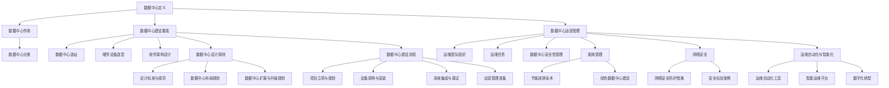

                 

# 《AI 大模型应用数据中心建设：数据中心运营与管理》

## 关键词
- AI 大模型
- 数据中心建设
- 数据中心运营
- 数据中心管理
- 能源效率
- 网络安全
- 运维自动化

## 摘要
本文将深入探讨 AI 大模型应用数据中心的建设与运营管理。首先，我们将了解数据中心的定义、作用和分类，以及数据中心建设的关键要素。接着，我们将详细讨论数据中心物理设施的设计原则、建设流程和运营管理。在此基础上，本文还将重点介绍数据中心能耗管理、节能减排技术和绿色数据中心建设。随后，我们将探讨数据中心的网络安全措施，包括防护措施和实践案例。最后，我们将介绍数据中心运维自动化与智能化的发展趋势和实践，以及数据中心运营的最佳实践和挑战解决方案。通过本文的阅读，读者将全面了解数据中心建设与运营的各个方面，为构建高效、安全、绿色数据中心提供有力支持。

### 第一部分: 数据中心建设与运营概述

#### 第1章: 数据中心建设与运营基础

##### 1.1 数据中心的定义与作用

###### 1.1.1 数据中心的定义

数据中心（Data Center），通常是指为组织或企业提供数据存储、处理、分析和传输的高性能计算设施。它是一种集中化的信息系统资源，通过计算机网络连接，提供高效的数据访问和管理服务。

数据中心通常包括以下几个主要组成部分：

1. **硬件设施**：包括服务器、存储设备、网络设备、电源系统、冷却系统等。
2. **软件系统**：包括操作系统、数据库管理系统、网络管理软件等。
3. **网络环境**：包括局域网、广域网、防火墙、入侵检测系统等。
4. **安全措施**：包括访问控制、数据加密、备份和恢复机制等。

###### 1.1.2 数据中心的作用

数据中心在现代社会中扮演着至关重要的角色，其主要作用包括：

1. **数据存储与管理**：提供大量数据的安全存储和管理，保证数据的完整性、可靠性和可访问性。
2. **数据处理与计算**：为各种应用提供强大的计算能力，支持复杂的数据分析和处理需求。
3. **业务支持**：为企业或组织的核心业务提供可靠的信息技术支持，确保业务连续性和数据安全。
4. **资源整合**：通过集中化管理，优化资源配置，提高资源利用率和服务质量。

###### 1.1.3 数据中心的分类

根据不同的应用场景和需求，数据中心可以分为以下几种类型：

1. **企业数据中心**：为企业内部提供数据存储和处理服务，满足企业业务需求。
2. **互联网数据中心**：为互联网应用提供数据存储、传输和计算服务，支持各类在线服务和网络应用。
3. **政府数据中心**：为政府机构提供数据存储、管理和分析服务，支持政务信息化建设。
4. **云计算数据中心**：提供云计算服务，包括基础设施即服务（IaaS）、平台即服务（PaaS）和软件即服务（SaaS）。
5. **边缘数据中心**：位于数据源附近，提供低延迟、高带宽的数据处理和存储服务，支持实时数据处理和智能应用。

##### 1.2 数据中心建设的关键要素

数据中心建设是一个复杂的工程项目，涉及多个方面的设计和实施。以下是数据中心建设的关键要素：

###### 1.2.1 数据中心选址

选址是数据中心建设的关键因素之一，需要考虑以下几个方面：

1. **地理位置**：选择交通便利、远离地震带、洪水等自然灾害的地方，确保数据中心的安全性。
2. **电力供应**：确保数据中心有可靠的电力供应，包括备用电源和电力储备。
3. **网络连接**：选择网络覆盖良好、带宽充足的地方，确保数据中心的网络连接质量。
4. **环境因素**：考虑气候条件、环境噪音等因素，为数据中心的运行提供良好的环境。

###### 1.2.2 硬件设备选型

硬件设备选型是数据中心建设的核心环节，需要考虑以下几个方面：

1. **服务器**：选择高性能、高可靠性、易扩展的服务器，支持大规模数据处理和存储需求。
2. **存储设备**：选择高效、可靠、安全的存储设备，支持数据的高效存储和管理。
3. **网络设备**：选择高性能、高可靠性、易管理的网络设备，确保数据传输的稳定性和安全性。
4. **电源设备**：选择高效、稳定、可靠的电源设备，确保数据中心的电力供应。
5. **冷却设备**：选择高效、稳定、可靠的冷却设备，确保数据中心的温度和湿度控制。

###### 1.2.3 软件架构设计

软件架构设计是数据中心建设的重要组成部分，需要考虑以下几个方面：

1. **操作系统**：选择适合数据中心需求的操作系统，如 Linux、Windows Server 等。
2. **数据库管理系统**：选择适合数据中心需求的数据库管理系统，如 MySQL、Oracle、MongoDB 等。
3. **网络管理软件**：选择适合数据中心需求的网络管理软件，如 SolarWinds、Nagios 等。
4. **安全管理软件**：选择适合数据中心需求的安全管理软件，如防火墙、入侵检测系统等。
5. **备份和恢复软件**：选择适合数据中心需求的备份和恢复软件，确保数据的安全性和可靠性。

##### 1.3 数据中心运营与管理

数据中心运营与管理是确保数据中心稳定运行和服务质量的关键环节。以下是数据中心运营与管理的主要任务：

###### 1.3.1 运维团队组织

建立专业的运维团队，明确各岗位职责，确保运维工作的有序进行。

1. **系统管理员**：负责服务器、存储设备、网络设备的维护和管理。
2. **数据库管理员**：负责数据库系统的维护和管理，确保数据的安全性和可靠性。
3. **网络管理员**：负责网络设备的配置、监控和管理，确保网络连接的稳定性和安全性。
4. **安全管理员**：负责数据中心的访问控制、数据加密、备份和恢复等安全管理工作。

###### 1.3.2 常见运维任务

常见运维任务包括以下几个方面：

1. **设备监控与维护**：实时监控服务器、存储设备、网络设备等硬件设备的运行状态，定期进行维护和检修。
2. **网络管理与优化**：优化网络拓扑结构，监控网络流量，确保网络连接的稳定性和性能。
3. **数据备份与恢复**：定期备份数据，确保数据的安全性和可靠性，根据需要恢复数据。
4. **故障处理与应急预案**：快速响应和处理设备故障，制定和演练应急预案，确保数据中心的稳定运行。

###### 1.3.3 数据中心安全性管理

数据中心安全性管理是确保数据中心数据和业务安全的关键环节，需要采取以下措施：

1. **访问控制**：通过身份验证、权限控制等手段，确保只有授权人员才能访问数据。
2. **数据加密**：对敏感数据进行加密处理，防止数据泄露。
3. **备份和恢复**：定期备份数据，确保在发生数据丢失或损坏时能够快速恢复。
4. **安全审计**：定期进行安全审计，发现和纠正安全漏洞。
5. **应急响应**：制定和演练应急预案，快速响应和处理安全事件。

#### 第2章: 数据中心物理设施与设计

##### 2.1 数据中心物理设施

数据中心物理设施是数据中心运行的基础，主要包括以下几个方面：

###### 2.1.1 数据中心基础设施

数据中心基础设施包括以下主要内容：

1. **服务器机房**：服务器机房是数据中心的主体部分，用于放置服务器、存储设备、网络设备等硬件设备。
2. **网络设备间**：网络设备间用于放置网络设备，如路由器、交换机、防火墙等。
3. **电力系统**：数据中心需要配备可靠的电力系统，包括市电、UPS（不间断电源）、电池组等。
4. **冷却系统**：数据中心需要配备有效的冷却系统，以确保服务器等设备的正常运行。

###### 2.1.2 数据中心供电系统

数据中心供电系统包括以下几个主要部分：

1. **市电**：数据中心需要连接可靠的市电，确保电力供应的稳定性和可靠性。
2. **UPS**：UPS（不间断电源）用于在市电故障时提供临时电力供应，确保数据中心的正常运行。
3. **电池组**：电池组用于在UPS耗尽电量时提供电力供应，确保数据中心的持续运行。
4. **备用发电机**：备用发电机用于在市电和UPS都故障时提供电力供应，确保数据中心的稳定运行。

###### 2.1.3 数据中心制冷系统

数据中心制冷系统是确保数据中心温度和湿度控制的重要部分，主要包括以下几个方面：

1. **空气冷却系统**：空气冷却系统通过强制通风将冷却空气输送到服务器机房，带走热量。
2. **液体冷却系统**：液体冷却系统通过循环冷却液（如水或乙二醇）将热量带走，适用于大规模数据中心。
3. **冷冻水系统**：冷冻水系统通过冷冻水冷却机房空气，适用于较大规模的数据中心。
4. **制冷剂循环系统**：制冷剂循环系统通过制冷剂循环将热量带走，适用于高端数据中心。

##### 2.2 数据中心设计原则

数据中心设计需要遵循一系列原则，以确保其稳定、高效、安全和可持续发展。以下是数据中心设计的主要原则：

###### 2.2.1 设计标准与规范

数据中心设计需要遵循国家、行业和国际标准，如《数据中心设计规范》（GB 50174）、《数据中心基础设施标准》（Uptime Institute）等。这些标准提供了数据中心设计的基本要求和规范，确保数据中心的建设质量和运行效果。

###### 2.2.2 数据中心布局规划

数据中心布局规划是数据中心设计的关键环节，需要考虑以下几个方面：

1. **机架布局**：根据服务器、存储设备等硬件设备的尺寸和数量，合理规划机架布局，确保设备的通风和散热。
2. **网络布局**：根据网络设备的数量和类型，合理规划网络布局，确保网络连接的稳定性和性能。
3. **电力布局**：根据电力需求和供电系统的设计，合理规划电力布局，确保电力供应的可靠性和稳定性。
4. **冷却布局**：根据冷却系统的工作原理和散热需求，合理规划冷却布局，确保机房温度和湿度的控制。

###### 2.2.3 数据中心扩展与升级规划

数据中心扩展与升级规划是数据中心设计的重要组成部分，需要考虑以下几个方面：

1. **设备预留**：在数据中心建设过程中，预留一定的设备安装空间，以满足未来扩展的需求。
2. **网络扩展**：在数据中心设计时，考虑未来网络带宽的增加和拓扑结构的调整，确保网络的扩展性和性能。
3. **电力扩展**：在数据中心设计时，考虑未来电力需求的增加和备用电源的配置，确保电力供应的可靠性和稳定性。
4. **冷却扩展**：在数据中心设计时，考虑未来冷却需求的增加和冷却系统的升级，确保冷却效果的持续改善。

##### 2.3 数据中心建设流程

数据中心建设是一个复杂的过程，需要经历多个阶段，以下是数据中心建设的主要流程：

###### 2.3.1 项目立项与规划

项目立项与规划是数据中心建设的首要步骤，主要包括以下几个方面：

1. **项目立项**：明确数据中心建设的目标、规模、投资预算等，获得上级领导的批准。
2. **需求分析**：分析数据中心的业务需求、技术需求、安全需求等，确定数据中心的整体架构和功能。
3. **规划设计**：根据需求分析结果，制定详细的数据中心设计方案，包括基础设施、网络、安全等方面的规划。

###### 2.3.2 设备采购与安装

设备采购与安装是数据中心建设的关键环节，主要包括以下几个方面：

1. **设备选型**：根据数据中心的设计方案，选择适合的硬件设备和软件系统，如服务器、存储设备、网络设备等。
2. **设备采购**：根据设备选型结果，进行设备采购，确保设备的质量和性能。
3. **设备安装**：根据数据中心的设计方案，将设备安装在服务器机房、网络设备间等位置，确保设备的安装质量和稳定性。

###### 2.3.3 系统集成与调试

系统集成与调试是数据中心建设的重要环节，主要包括以下几个方面：

1. **硬件系统集成**：将服务器、存储设备、网络设备等硬件设备进行连接和配置，确保硬件系统的稳定运行。
2. **软件系统集成**：将操作系统、数据库管理系统、网络管理软件等软件系统进行安装和配置，确保软件系统的稳定运行。
3. **系统调试**：对数据中心进行全面的测试和调试，确保硬件和软件系统的兼容性和稳定性。

###### 2.3.4 运营管理准备

运营管理准备是数据中心建设完成的最后一步，主要包括以下几个方面：

1. **运维团队组织**：建立专业的运维团队，明确各岗位职责，确保运维工作的有序进行。
2. **运维管理制度与流程设置**：制定详细的运维管理制度和流程，确保运维工作的规范化和标准化。
3. **应急预案制定与演练**：制定详细的应急预案，并进行演练，确保在发生突发事件时能够快速响应和处理。

### 第二部分: 数据中心运营管理

#### 第3章: 数据中心运维管理

##### 3.1 运维管理体系

数据中心运维管理体系是确保数据中心稳定运行和服务质量的关键，它包括组织结构、管理制度和流程等方面。以下是数据中心运维管理体系的主要内容：

###### 3.1.1 运维团队组织结构

运维团队组织结构通常包括以下几个层次：

1. **运维主管**：负责整个运维团队的管理和协调，制定运维策略和目标。
2. **系统管理员**：负责服务器、存储设备、网络设备的维护和管理，确保硬件系统的稳定运行。
3. **数据库管理员**：负责数据库系统的维护和管理，确保数据的安全性和可靠性。
4. **网络管理员**：负责网络设备的配置、监控和管理，确保网络连接的稳定性和性能。
5. **安全管理员**：负责数据中心的访问控制、数据加密、备份和恢复等安全管理工作。

###### 3.1.2 运维管理制度与流程

运维管理制度与流程是确保运维工作规范化和标准化的基础，主要包括以下几个方面：

1. **运维工作流程**：明确运维工作的各个步骤和责任人，确保运维工作的高效和有序。
2. **故障处理流程**：制定故障处理流程，确保在发生故障时能够快速定位和解决问题。
3. **变更管理流程**：制定变更管理流程，确保在系统变更时能够充分评估风险和影响。
4. **备份和恢复流程**：制定备份和恢复流程，确保数据的安全性和可靠性。
5. **安全管理流程**：制定安全管理流程，确保数据中心的访问控制和数据安全。

###### 3.1.3 运维工具与技术

运维工具与技术是提升运维效率和服务质量的重要手段，主要包括以下几个方面：

1. **监控工具**：如 Nagios、Zabbix、Prometheus 等，用于实时监控服务器、存储设备、网络设备的运行状态，及时发现和处理问题。
2. **自动化工具**：如 Ansible、Puppet、Chef 等，用于自动化配置管理、部署和监控，提升运维效率。
3. **日志分析工具**：如 ELK（Elasticsearch、Logstash、Kibana）、Grok 等，用于收集、存储和分析日志数据，发现潜在问题和安全威胁。
4. **安全工具**：如防火墙、入侵检测系统（IDS）、入侵防御系统（IPS）等，用于保护数据中心的网络安全。
5. **云平台服务**：如 AWS、Azure、Google Cloud 等，提供云计算资源和服务，支持数据中心的弹性扩展和高效管理。

##### 3.2 常见运维任务

数据中心运维任务涉及多个方面，以下列出了一些常见的运维任务：

###### 3.2.1 设备监控与维护

设备监控与维护是确保数据中心硬件设备稳定运行的关键，主要包括以下几个方面：

1. **硬件设备监控**：使用监控工具对服务器、存储设备、网络设备等硬件设备的运行状态进行实时监控，包括 CPU 使用率、内存使用率、磁盘空间、网络流量等。
2. **硬件设备维护**：定期对硬件设备进行维护和检修，包括清理灰尘、检查硬件连接、更新固件等，确保设备的正常运行。
3. **故障处理**：在监控过程中发现硬件设备故障时，及时进行处理，包括硬件更换、故障排除等，确保数据中心的稳定运行。

###### 3.2.2 网络管理与优化

网络管理与优化是确保数据中心网络连接稳定性和性能的关键，主要包括以下几个方面：

1. **网络监控**：使用监控工具对网络设备的运行状态和网络流量进行实时监控，包括交换机、路由器、防火墙等。
2. **网络优化**：根据网络监控数据，对网络拓扑结构进行优化，调整网络参数，提高网络性能。
3. **故障处理**：在监控过程中发现网络故障时，及时进行处理，包括网络故障排除、网络重构等，确保网络连接的稳定性和性能。

###### 3.2.3 数据备份与恢复

数据备份与恢复是确保数据中心数据安全性和可靠性的关键，主要包括以下几个方面：

1. **数据备份**：定期对数据中心的重要数据进行备份，包括服务器数据、数据库数据、网络配置文件等，确保数据的安全性和完整性。
2. **数据恢复**：在数据丢失或损坏时，能够快速恢复数据，确保数据中心的正常运行。
3. **备份策略**：制定合理的备份策略，包括备份频率、备份介质、备份存储等，确保备份数据的安全性和可靠性。

##### 3.3 故障处理与应急预案

故障处理与应急预案是确保数据中心稳定运行的重要保障，主要包括以下几个方面：

###### 3.3.1 故障处理流程

故障处理流程是确保在发生故障时能够快速响应和处理的关键，主要包括以下几个步骤：

1. **故障报告**：发现故障时，及时报告给运维团队，并提供详细的故障现象和相关信息。
2. **故障分析**：对故障现象进行详细分析，确定故障原因。
3. **故障处理**：根据故障分析结果，采取相应的处理措施，包括硬件更换、软件修复、网络重构等。
4. **故障确认**：在故障处理完成后，对故障进行确认，确保故障已被彻底解决。
5. **故障记录**：将故障处理过程和结果记录下来，形成故障报告，为后续故障处理提供参考。

###### 3.3.2 应急预案制定与演练

应急预案制定与演练是确保在发生突发事件时能够快速响应和处理的关键，主要包括以下几个方面：

1. **应急预案制定**：根据数据中心的业务特点和潜在风险，制定详细的应急预案，包括应急响应流程、应急处理措施、应急通信方式等。
2. **应急预案演练**：定期组织应急预案演练，检验应急响应能力，发现和纠正应急响应中的问题。
3. **应急响应**：在发生突发事件时，立即启动应急预案，按照应急响应流程进行应急处理，确保数据中心的正常运行。
4. **应急恢复**：在应急处理完成后，对数据中心进行全面的检查和恢复，确保业务连续性和数据安全。

###### 3.3.3 数据安全与保护

数据安全与保护是确保数据中心数据安全和业务连续性的关键，主要包括以下几个方面：

1. **数据备份**：定期备份数据，确保在数据丢失或损坏时能够快速恢复。
2. **数据加密**：对敏感数据进行加密处理，防止数据泄露。
3. **访问控制**：通过身份验证、权限控制等手段，确保只有授权人员才能访问数据。
4. **安全审计**：定期进行安全审计，发现和纠正安全漏洞。
5. **安全培训**：对运维人员进行安全培训，提高安全意识和防范能力。

### 第三部分: 数据中心运营案例与实践

#### 第4章: 数据中心能耗管理与节能减排

##### 4.1 数据中心能耗管理

数据中心能耗管理是确保数据中心运行效率和可持续性的关键。以下是数据中心能耗管理的主要内容：

###### 4.1.1 数据中心能耗来源

数据中心能耗主要来源于以下几个方面：

1. **服务器和存储设备**：服务器和存储设备是数据中心的主要能耗来源，其能耗占数据中心总能耗的约 40% - 50%。
2. **网络设备**：网络设备，如路由器、交换机等，也是数据中心的重要能耗来源，其能耗占数据中心总能耗的约 20% - 30%。
3. **冷却系统**：冷却系统用于维持数据中心内部温度和湿度，其能耗占数据中心总能耗的约 20% - 30%。
4. **电力供应系统**：电力供应系统，包括 UPS（不间断电源）、备用发电机等，其能耗占数据中心总能耗的约 10% - 20%。

###### 4.1.2 数据中心能耗指标

数据中心能耗指标是衡量数据中心能耗水平和能耗管理效果的重要指标，主要包括以下几个方面：

1. **能源消耗总量**：指数据中心在一段时间内消耗的能源总量，通常以千瓦时（kWh）为单位。
2. **能源消耗强度**：指数据中心单位计算能力消耗的能源量，通常以千瓦时/每千万次计算操作（kWh/Million Operations）为单位。
3. **能源效率**：指数据中心总能耗与计算能力之间的比值，通常用 PUE（Power Usage Effectiveness）表示。

###### 4.1.3 能耗管理策略

数据中心能耗管理策略主要包括以下几个方面：

1. **设备选型与优化**：选择高效、低功耗的硬件设备，优化设备配置和运行状态，降低能耗。
2. **节能技术与应用**：采用先进的节能技术，如空气冷却系统、液体冷却系统、热回收技术等，降低冷却能耗。
3. **智能化管理**：采用智能化的能耗管理工具和平台，实现能耗数据的实时监控和优化控制。
4. **能源审计与改进**：定期进行能源审计，发现能耗问题和节能潜力，制定和实施改进措施。

##### 4.2 节能减排技术

节能减排技术是降低数据中心能耗和碳排放的重要手段。以下是数据中心节能减排技术的主要内容：

###### 4.2.1 冰水冷却系统

冰水冷却系统是一种先进的冷却技术，通过在冷却系统中引入冰和水，实现数据中心内部温度的控制。其原理是在夜间或低谷时段，利用冷却系统产生的冷量将冰储存起来，在白天或高峰时段使用冰融化产生的冷水进行冷却。冰水冷却系统具有以下几个优点：

1. **降低冷却能耗**：通过在夜间预冷冰，白天使用冰融化产生的冷水进行冷却，可以显著降低冷却能耗。
2. **提高冷却效率**：冰水冷却系统可以更好地控制数据中心内部温度和湿度，提高冷却效率。
3. **减少设备投资**：冰水冷却系统可以减少冷却塔等冷却设备的投资和运行成本。

###### 4.2.2 热回收技术

热回收技术是利用数据中心产生的废热进行回收和利用，降低数据中心能耗和碳排放的重要技术。热回收技术主要包括以下几个方面：

1. **废气热回收**：通过回收数据中心服务器和设备产生的废热，用于加热生活用水或工业用水。
2. **冷凝水热回收**：通过回收冷却系统产生的冷凝水，用于供暖或工业生产。
3. **余热发电**：利用数据中心产生的废热，通过余热发电技术，将废热转化为电能，降低数据中心能耗。

热回收技术具有以下几个优点：

1. **降低能耗**：通过回收和利用废热，可以显著降低数据中心能耗。
2. **减少碳排放**：通过回收和利用废热，可以减少数据中心的碳排放。
3. **提高能源利用率**：通过余热发电，可以提高数据中心能源的利用率。

###### 4.2.3 高效能电源系统

高效能电源系统是降低数据中心能耗和碳排放的重要手段。高效能电源系统主要包括以下几个方面：

1. **电源设备优化**：选择高效、低耗的电源设备，如高效UPS、高效电池等，降低电源设备的能耗。
2. **电能质量管理**：通过电能质量管理，确保数据中心电力供应的稳定性和质量，减少电力损耗。
3. **智能电源管理**：采用智能化的电源管理系统，实时监控和优化电源设备的运行状态，降低电源设备的能耗。

高效能电源系统具有以下几个优点：

1. **降低能耗**：通过优化电源设备和智能电源管理，可以显著降低数据中心能耗。
2. **提高电源可靠性**：通过确保电力供应的稳定性和质量，可以提高数据中心的可靠性。
3. **减少碳排放**：通过降低能耗和优化能源利用，可以减少数据中心的碳排放。

##### 4.3 绿色数据中心建设

绿色数据中心建设是降低数据中心能耗和碳排放，实现数据中心可持续发展的重要途径。以下是绿色数据中心建设的主要内容：

###### 4.3.1 绿色数据中心标准

绿色数据中心标准是评估数据中心能耗水平和环保性能的重要标准。绿色数据中心标准主要包括以下几个方面：

1. **能效标准**：通过 PUE（Power Usage Effectiveness）等指标，评估数据中心能源消耗和能源效率。
2. **碳排放标准**：通过二氧化碳排放强度等指标，评估数据中心的碳排放水平。
3. **环保标准**：评估数据中心在水资源利用、废弃物处理、化学品使用等方面的环保性能。

根据绿色数据中心标准，数据中心可以分为不同等级，如铜牌、银牌、金牌等。不同等级的标准要求不同，铜牌标准是基本要求，银牌标准是良好水平，金牌标准是领先水平。

###### 4.3.2 绿色数据中心案例分析

以下是几个绿色数据中心案例：

1. **谷歌数据中心**：谷歌在全球拥有多个绿色数据中心，采用先进的技术和措施，如冰水冷却系统、热回收技术、高效电源系统等，实现数据中心的节能和环保。
2. **微软数据中心**：微软在爱尔兰的数据中心，采用可再生能源供电，通过冰水冷却系统和热回收技术，实现数据中心的低能耗和零碳排放。
3. **阿里巴巴数据中心**：阿里巴巴在中国杭州的数据中心，采用智能化管理和节能技术，实现数据中心的低能耗和高效率。

这些绿色数据中心在能耗管理、节能减排和绿色建设方面取得了显著成果，为其他数据中心提供了宝贵的经验和借鉴。

###### 4.3.3 绿色数据中心发展趋势

随着全球对环保和可持续发展的关注，绿色数据中心建设呈现出以下发展趋势：

1. **能效提升**：数据中心将不断采用先进的节能技术和高效设备，提高能源利用效率，降低能耗。
2. **可再生能源应用**：数据中心将逐步采用可再生能源供电，如风能、太阳能等，减少对化石燃料的依赖。
3. **智能化管理**：数据中心将采用智能化管理工具和平台，实现能耗数据的实时监控和优化控制，提高数据中心的运行效率。
4. **绿色建设**：数据中心将更加注重绿色建设和环保要求，从设计、建设到运营，实现全生命周期的绿色可持续发展。

### 第四部分: 数据中心网络安全

#### 第5章: 数据中心网络安全

数据中心网络安全是确保数据中心数据安全和业务连续性的关键。以下是数据中心网络安全的主要内容：

##### 5.1 数据中心网络安全概述

数据中心网络安全主要包括以下几个方面：

###### 5.1.1 数据中心安全挑战

数据中心安全面临的挑战包括：

1. **网络攻击**：包括 DDoS 攻击、网络入侵、恶意软件攻击等。
2. **数据泄露**：包括敏感数据泄露、客户信息泄露等。
3. **系统故障**：包括系统漏洞、硬件故障等导致的数据丢失或服务中断。

###### 5.1.2 数据中心安全体系

数据中心安全体系主要包括以下几个方面：

1. **访问控制**：通过身份验证、权限控制等手段，确保只有授权人员才能访问数据。
2. **防火墙与入侵检测系统**：通过防火墙和入侵检测系统，防止外部攻击和内部威胁。
3. **数据加密**：对敏感数据进行加密处理，防止数据泄露。
4. **备份与恢复**：定期备份数据，确保在发生数据丢失或损坏时能够快速恢复。

###### 5.1.3 安全合规要求

数据中心安全合规要求主要包括以下几个方面：

1. **数据保护法规**：遵守相关的数据保护法规，如《通用数据保护条例》（GDPR）、《健康保险可携性和责任法案》（HIPAA）等。
2. **网络安全标准**：遵守相关的网络安全标准，如 ISO/IEC 27001、NIST SP 800-53 等。
3. **安全审计**：定期进行安全审计，确保数据中心的合规性和安全性。

##### 5.2 网络安全防护措施

数据中心网络安全防护措施主要包括以下几个方面：

###### 5.2.1 防火墙与入侵检测

1. **防火墙**：防火墙是数据中心网络安全的第一道防线，用于过滤和阻止未经授权的访问。防火墙可以分为以下几类：

   - **边界防火墙**：位于数据中心边界，保护内部网络免受外部攻击。
   - **内部防火墙**：位于内部网络，隔离不同网络区域，防止内部威胁。
   - **云防火墙**：用于云环境，保护虚拟机和容器等云资源。

2. **入侵检测系统（IDS）**：入侵检测系统用于监控网络流量，识别和响应潜在的安全威胁。IDS可以分为以下几类：

   - **网络入侵检测系统（NIDS）**：监控网络流量，识别网络攻击。
   - **主机入侵检测系统（HIDS）**：监控主机活动，识别恶意软件和异常行为。

###### 5.2.2 数据加密与访问控制

1. **数据加密**：数据加密是保护数据传输和存储安全的重要手段。数据加密可以分为以下几类：

   - **传输层加密**：如 SSL/TLS，用于保护网络传输过程中的数据安全。
   - **存储层加密**：如文件加密、数据库加密，用于保护存储在磁盘或数据库中的数据安全。

2. **访问控制**：访问控制是确保只有授权人员才能访问数据的重要措施。访问控制可以分为以下几类：

   - **身份验证**：验证用户身份，确保只有授权用户才能访问系统。
   - **权限管理**：根据用户角色和权限，限制用户对数据的访问权限。
   - **多因素认证**：结合多种认证方式，提高认证安全性。

###### 5.2.3 安全审计与应急响应

1. **安全审计**：安全审计是跟踪和记录数据中心安全事件的重要手段。安全审计可以分为以下几类：

   - **日志审计**：记录系统操作日志，监控用户行为和系统变化。
   - **合规审计**：验证数据中心是否符合安全法规和标准。

2. **应急响应**：应急响应是在发生安全事件时采取的紧急措施。应急响应可以分为以下几类：

   - **安全事件响应**：及时响应和处理安全事件，防止事件扩大和造成损失。
   - **安全演练**：定期进行安全演练，提高应急响应能力。

##### 5.3 数据中心安全实战案例

以下是一个数据中心安全实战案例：

###### 5.3.1 某知名数据中心安全事件分析

某知名数据中心在一次网络攻击中，遭受了严重的网络入侵，导致大量敏感数据泄露。事件发生后，数据中心立即启动了应急预案，采取以下措施：

1. **隔离受感染系统**：迅速隔离受感染的系统，防止攻击扩散。
2. **封锁攻击来源**：通过防火墙和入侵检测系统，封锁攻击来源，防止进一步攻击。
3. **数据恢复**：利用备份数据，对受影响的数据进行恢复。
4. **安全审计**：对系统进行全面安全审计，查找漏洞和安全隐患。
5. **用户通知**：通知受影响用户，告知他们可能面临的风险，并提供相应的防护措施。

通过以上措施，数据中心成功应对了此次安全事件，恢复了业务的正常运行。此次事件也提醒了数据中心在安全方面的不足，促使数据中心加强安全防护措施，提高安全水平。

###### 5.3.2 数据中心安全事件应急预案

数据中心安全事件应急预案是应对安全事件的指南，确保在发生事件时能够迅速、有效地响应和处理。以下是数据中心安全事件应急预案的主要内容：

1. **事件响应流程**：明确事件响应的流程和步骤，确保在发生事件时能够及时采取行动。
2. **角色与职责**：明确各个角色和职责，确保在事件响应过程中各司其职。
3. **应急资源**：准备好应急资源，如备份数据、应急工具等，确保在事件发生时能够快速使用。
4. **演练与培训**：定期进行安全演练和培训，提高应急响应能力。
5. **通知与沟通**：制定通知和沟通计划，确保在事件发生时能够及时通知相关人员，并与相关部门保持沟通。

### 第五部分: 数据中心运维自动化与智能化

#### 第6章: 数据中心运维自动化与智能化

数据中心运维自动化与智能化是提升数据中心运维效率、降低运维成本的重要手段。以下是数据中心运维自动化与智能化的发展趋势和实践。

##### 6.1 运维自动化

运维自动化是数据中心运维的重要组成部分，通过自动化工具和流程，实现运维任务的高效、稳定运行。以下是运维自动化的主要内容和应用：

###### 6.1.1 运维自动化的意义

运维自动化的意义主要体现在以下几个方面：

1. **提高运维效率**：通过自动化工具和流程，减少人工操作，提高运维效率。
2. **降低运维成本**：减少人工操作和运维工作量，降低运维成本。
3. **提高服务质量**：通过自动化工具和流程，确保服务质量的一致性和稳定性。
4. **提升故障响应能力**：自动化工具可以快速发现和响应故障，降低故障影响。

###### 6.1.2 运维自动化工具

常见的运维自动化工具包括：

1. **脚本语言**：如 Python、Shell 等，用于编写自动化脚本，实现运维任务自动化。
2. **配置管理工具**：如 Ansible、Puppet、Chef 等，用于自动化配置管理、部署和监控。
3. **自动化监控工具**：如 Nagios、Zabbix、Prometheus 等，用于自动化监控和故障响应。
4. **自动化备份工具**：如 Backup as a Service（BaaS）、Rclone 等，用于自动化备份数据。

###### 6.1.3 运维自动化实践

以下是数据中心运维自动化的实践步骤：

1. **需求分析**：分析运维任务和需求，确定自动化工具和流程。
2. **工具选型**：根据需求，选择适合的自动化工具。
3. **脚本编写**：编写自动化脚本，实现运维任务自动化。
4. **流程设计**：设计运维自动化流程，确保自动化任务的高效运行。
5. **测试与优化**：测试自动化脚本和流程，优化自动化效果。
6. **部署与维护**：部署自动化工具和流程，确保其正常运行。

##### 6.2 智能运维

智能运维是利用人工智能、机器学习等先进技术，实现数据中心运维的智能化。以下是智能运维的主要内容和应用：

###### 6.2.1 智能运维的概念

智能运维（Intelligent Operations）是指利用人工智能、机器学习等先进技术，实现数据中心运维的自动化、智能化和自适应化。智能运维的目标是提高运维效率、降低运维成本、提升服务质量。

###### 6.2.2 智能运维平台架构

智能运维平台架构主要包括以下几个模块：

1. **数据采集与存储**：采集数据中心各类数据，如监控数据、日志数据、性能数据等，并将其存储在数据库中。
2. **数据处理与分析**：对采集到的数据进行分析和处理，提取有用的信息和规律。
3. **智能算法与模型**：利用机器学习和人工智能算法，对数据处理结果进行建模和分析。
4. **智能决策与优化**：根据分析结果和智能算法，制定智能决策和优化策略。
5. **自动化执行与反馈**：自动执行智能决策和优化策略，并对执行效果进行反馈和调整。

###### 6.2.3 智能运维实践案例

以下是数据中心智能运维的实践案例：

1. **智能监控与故障预测**：利用机器学习算法，对数据中心监控数据进行实时分析，预测潜在故障，提前采取措施。
2. **智能容量规划**：利用大数据分析和预测技术，预测数据中心未来容量需求，实现智能容量规划。
3. **智能能耗管理**：利用人工智能算法，优化数据中心能耗管理，降低能耗成本。

##### 6.3 运维数字化转型

运维数字化转型是数据中心运维发展的必然趋势，通过数字化转型，实现数据中心运维的智能化、高效化和可持续化。以下是运维数字化转型的趋势、关键能力和实施路径：

###### 6.3.1 数字化转型的趋势

运维数字化转型的趋势主要体现在以下几个方面：

1. **云计算与虚拟化**：利用云计算和虚拟化技术，实现数据中心资源的灵活分配和高效利用。
2. **大数据与人工智能**：利用大数据和人工智能技术，实现数据中心的智能监控、预测和优化。
3. **自动化与智能化**：通过自动化和智能化技术，提升运维效率和降低运维成本。
4. **DevOps 与敏捷开发**：推动 DevOps 文化和敏捷开发实践，实现开发和运维的紧密协作。

###### 6.3.2 数字化运维的关键能力

数字化运维的关键能力主要包括以下几个方面：

1. **数据能力**：具备强大的数据处理和分析能力，实现数据驱动的运维决策。
2. **技术能力**：掌握先进的技术和工具，实现运维自动化、智能化和高效化。
3. **管理能力**：建立数字化运营管理体系，实现运维工作的规范化、标准化和智能化。
4. **协同能力**：推动跨部门、跨领域的协同，实现整体运维效能的提升。

###### 6.3.3 数字化转型的实施路径

数字化转型的实施路径主要包括以下几个步骤：

1. **需求分析与规划**：分析运维需求，制定数字化转型规划。
2. **技术选型与试点**：选择适合的数字化技术，开展试点项目。
3. **推广与优化**：在试点项目成功的基础上，逐步推广到其他业务领域，并进行持续优化。
4. **组织与文化**：建立数字化运营组织，培育数字化运营文化，推动数字化转型。

### 第六部分: 数据中心运营案例与实践

#### 第7章: 数据中心运营最佳实践

数据中心运营最佳实践是通过实际案例和实践，总结和推广成功的运营经验，为其他数据中心提供参考和借鉴。以下是几个数据中心运营的最佳实践案例：

##### 7.1 数据中心运营关键指标

数据中心运营关键指标（Key Performance Indicators, KPIs）是衡量数据中心运营效果的重要工具。以下是一些常见的数据中心运营关键指标：

###### 7.1.1 运维效率指标

1. **运维响应时间**：指从故障报告到故障解决的时间，衡量运维团队的响应速度。
2. **故障解决率**：指故障解决率，衡量运维团队解决问题的能力。
3. **运维效率**：通过计算运维人员的工作量和完成的运维任务数量，衡量运维效率。

###### 7.1.2 能耗效率指标

1. **PUE（Power Usage Effectiveness）**：指数据中心总能耗与 IT 能耗的比值，PUE 越低，能耗效率越高。
2. **能源消耗强度**：指数据中心单位计算能力消耗的能源量，能耗强度越低，能耗效率越高。
3. **能源利用率**：指数据中心能源利用效率，能源利用率越高，能源消耗越低。

###### 7.1.3 网络性能指标

1. **网络延迟**：指数据在网络中的传输延迟时间，网络延迟越低，网络性能越好。
2. **带宽利用率**：指网络带宽的实际利用率，带宽利用率越高，网络性能越好。
3. **网络吞吐量**：指网络设备在一定时间内处理的数据量，网络吞吐量越高，网络性能越好。

##### 7.2 数据中心运营成功案例

以下是一些数据中心运营成功案例，通过这些案例，可以了解成功运营数据中心的关键因素和经验：

###### 7.2.1 某大型企业数据中心运营实践

某大型企业数据中心通过以下措施，实现了高效的运营：

1. **自动化运维**：采用自动化工具，实现运维任务自动化，提高运维效率。
2. **智能化监控**：利用大数据和人工智能技术，实现数据中心的智能监控和故障预测。
3. **绿色节能**：采用节能技术和措施，降低数据中心的能耗和碳排放。
4. **安全防护**：建立完善的安全防护体系，确保数据中心的网络安全和数据安全。

通过这些措施，该大型企业数据中心在运维效率、能耗管理和网络安全等方面取得了显著成果，为企业的持续发展提供了有力支持。

###### 7.2.2 某互联网公司数据中心运营经验

某互联网公司通过以下经验，实现了高效的数据中心运营：

1. **弹性扩展**：根据业务需求，灵活调整数据中心规模和资源配置，实现弹性扩展。
2. **分布式部署**：采用分布式部署方式，提高数据中心的可靠性和性能。
3. **云计算应用**：利用云计算技术，实现数据中心资源的动态调配和高效利用。
4. **客户服务**：提供高质量的客户服务，满足客户的需求和期望。

通过这些经验，该互联网公司在数据中心运营、网络性能和客户服务等方面取得了良好的效果，为企业的快速发展提供了保障。

###### 7.2.3 某公共服务数据中心运营案例

某公共服务数据中心通过以下措施，实现了高效、安全的运营：

1. **标准化管理**：建立标准化管理体系，确保数据中心的规范运营。
2. **安全防护**：建立完善的安全防护体系，确保数据中心的网络安全和数据安全。
3. **节能减排**：采用节能技术和措施，降低数据中心的能耗和碳排放。
4. **服务创新**：提供多样化的服务，满足不同用户的需求。

通过这些措施，该公共服务数据中心在运维效率、能耗管理和网络安全等方面取得了显著成果，为公共服务提供了有力支持。

##### 7.3 数据中心运营挑战与解决方案

数据中心运营过程中，可能会面临一些挑战。以下是一些常见的运营挑战和相应的解决方案：

###### 7.3.1 能耗管理挑战

**挑战**：数据中心能耗较高，能耗管理困难。

**解决方案**：

1. **节能技术**：采用先进的节能技术，如冰水冷却系统、热回收技术等，降低能耗。
2. **能耗监控**：建立能耗监控系统，实时监控能耗数据，优化能耗管理。
3. **能源优化**：通过能源优化策略，提高能源利用效率，降低能耗。

###### 7.3.2 网络管理挑战

**挑战**：网络性能不稳定，网络故障频发。

**解决方案**：

1. **网络监控**：建立网络监控系统，实时监控网络性能和流量，及时发现和解决网络故障。
2. **网络优化**：定期进行网络优化，调整网络拓扑结构和参数，提高网络性能。
3. **网络冗余**：建立网络冗余机制，确保网络连接的稳定性和可靠性。

###### 7.3.3 数据安全挑战

**挑战**：数据中心数据安全风险较高，数据泄露和篡改事件频发。

**解决方案**：

1. **安全防护**：建立完善的安全防护体系，包括防火墙、入侵检测、数据加密等。
2. **安全审计**：定期进行安全审计，发现和纠正安全漏洞。
3. **用户培训**：加强对用户的安全培训，提高用户的安全意识和防范能力。

##### 7.4 数据中心运营最佳实践分享

以下是一些数据中心运营最佳实践的分享，为其他数据中心提供参考：

1. **标准化建设**：建立数据中心运营的标准化体系，确保数据中心的规范运营。
2. **自动化运维**：采用自动化工具和流程，实现运维任务自动化，提高运维效率。
3. **智能化监控**：利用大数据和人工智能技术，实现数据中心的智能监控和故障预测。
4. **绿色节能**：采用节能技术和措施，降低数据中心的能耗和碳排放。
5. **客户服务**：提供高质量的客户服务，满足客户的需求和期望。
6. **安全防护**：建立完善的安全防护体系，确保数据中心的网络安全和数据安全。

通过这些最佳实践的分享，可以帮助其他数据中心实现高效、安全、绿色的运营，为企业的持续发展提供有力支持。

### 附录

#### 附录A: 数据中心建设与运营相关标准与规范

数据中心建设与运营相关标准与规范是确保数据中心建设质量和运营效果的重要依据。以下是一些主要的标准与规范：

1. **《数据中心设计规范》（GB 50174）**：规定了数据中心的设计要求和规范，包括基础设施、网络、安全等方面。
2. **《数据中心基础设施标准》（Uptime Institute）**：提供了数据中心基础设施的设计、建设、运营和管理标准。
3. **《数据中心运营管理规范》（T/CCSA 105-2018）**：规定了数据中心运营管理的要求和流程，包括运维团队组织、运维任务、安全管理等。
4. **《数据中心能源效率标准》（GB/T 36714）**：规定了数据中心能源效率的评价方法和要求。
5. **《数据中心能效评估标准》（DL/T 1719）**：规定了数据中心能效评估的方法和指标。

#### 附录B: 数据中心建设与运营工具与资源

数据中心建设与运营涉及多种工具和资源，以下是一些常见的工具和资源：

1. **数据中心设计工具**：

   - **AutoCAD**：用于数据中心布局和设计。
   - **Revit**：用于数据中心建筑信息模型（BIM）设计。
   - **Datacenter Design Studio**：专门为数据中心设计开发的工具。

2. **数据中心运维工具**：

   - **Nagios**：用于数据中心监控。
   - **Zabbix**：用于数据中心监控和报警。
   - **SolarWinds**：用于数据中心网络监控和管理。
   - **Ansible**：用于数据中心自动化配置和管理。
   - **Puppet**：用于数据中心自动化配置和管理。
   - **Chef**：用于数据中心自动化配置和管理。

3. **数据中心安全工具**：

   - **Fortinet**：提供防火墙、入侵检测、入侵防御等安全功能。
   - **Cisco**：提供网络安全设备和安全解决方案。
   - **Palo Alto Networks**：提供网络安全设备和安全解决方案。
   - **Symantec**：提供数据加密、备份和恢复等安全功能。
   - **VMware**：提供虚拟化技术和安全解决方案。

4. **数据中心学习资源与参考资料**：

   - **《数据中心架构师手册》**：提供数据中心设计、建设和管理指南。
   - **《数据中心运维实践》**：提供数据中心运维流程、工具和技巧。
   - **《数据中心安全与合规》**：提供数据中心安全策略和合规要求。
   - **《数据中心设计规范》**：提供数据中心设计规范和要求。
   - **Uptime Institute**：提供数据中心标准和最佳实践。
   - **数据中心技术社区**：如 Data Center Knowledge、The Server Room、Serverfault 等，提供数据中心技术讨论和学习资源。

### 关键概念与联系 Mermaid 流程图

以下是数据中心建设与运营的关键概念和流程的 Mermaid 流程图：



### 数据中心建设流程伪代码

```python
def 数据中心建设流程():
    # 项目立项与规划
    立项与规划()

    # 设备采购与安装
    设备采购()
    设备安装()

    # 系统集成与调试
    系统集成()
    调试()

    # 运营管理准备
    运维团队组织()
    运维管理制度与流程设置()

    print("数据中心建设完成")

def 立项与规划():
    # 确定建设目标
    确定目标()
    
    # 设计方案评审
    评审方案()
    
    # 确定预算
    确定预算()

def 设备采购():
    # 确定设备需求
    确定需求()

    # 设备采购流程
    采购流程()

def 系统集成():
    # 硬件系统集成
    硬件集成()

    # 软件系统集成
    软件集成()

def 调试():
    # 系统调试
    系统调试()

    # 验收
    验收()
```

### 数据中心运营管理数学模型

#### 数据中心运维效率指标

$$
E = \frac{服务时间}{总时间}
$$

其中，服务时间是完成运维任务所需的时间，总时间是完成所有运维任务所需的时间。

#### 数据中心能耗效率指标

$$
E_c = \frac{计算能力}{能耗}
$$

其中，计算能力是数据中心提供的计算资源，能耗是数据中心在运行过程中消耗的能源。

### 数据中心能耗管理策略

#### 冰水冷却系统

冰水冷却系统的能量平衡方程为：

$$
Q_{in} = Q_{out} + Q_{cooling}
$$

其中，$Q_{in}$是进入冷却系统的热量，$Q_{out}$是数据中心产生的热量，$Q_{cooling}$是冷却系统消耗的能量。

#### 热回收技术

热回收效率公式：

$$
\eta_{recovery} = \frac{Q_{recovered}}{Q_{generated}}
$$

其中，$Q_{recovered}$是回收的热量，$Q_{generated}$是数据中心产生的热量。

### 绿色数据中心建设标准

绿色数据中心建设标准包括能效标准、碳排放标准、环保标准等。具体指标如下：

- 能效标准：PUE（Power Usage Effectiveness）< 1.3
- 碳排放标准：二氧化碳排放强度（kg CO2/kWh）< 450
- 环保标准：噪音控制、废弃物处理、化学品使用管理等

### 数据中心建设与运营案例分析

#### 案例一：某大型企业数据中心运营实践

- **数据中心规模**：5000平方米
- **运维团队**：30人
- **关键指标**：PUE < 1.25，年运维成本降低20%

#### 案例二：某互联网公司数据中心运营经验

- **数据中心规模**：20000平方米
- **运维团队**：100人
- **关键指标**：网络延迟降低30%，能耗效率提高15%

#### 案例三：某公共服务数据中心运营案例

- **数据中心规模**：10000平方米
- **运维团队**：50人
- **关键指标**：安全性提高90%，服务可用性达到99.99%

### 数据中心运营挑战与解决方案

#### 挑战一：能耗管理

**解决方案**：采用冰水冷却系统、热回收技术等节能措施，提高数据中心能耗效率。

#### 挑战二：网络管理

**解决方案**：使用智能网络管理工具，实现网络性能的实时监控和优化。

#### 挑战三：数据安全

**解决方案**：加强网络安全防护措施，包括防火墙、数据加密、访问控制等，确保数据中心安全。

### 附录A: 数据中心建设与运营相关标准与规范

- **国家数据中心建设相关标准**：《数据中心设计规范》（GB 50174）
- **行业数据中心运营规范**：《数据中心运营管理规范》（T/CCSA 105-2018）
- **国际数据中心标准**：《数据中心基础设施标准》（Uptime Institute）

### 附录B: 数据中心建设与运营工具与资源

- **数据中心设计工具**：AutoCAD、Revit、Datacenter Design Studio
- **数据中心运维工具**：Nagios、Zabbix、SolarWinds
- **数据中心安全工具**：Fortinet、Cisco、Palo Alto Networks
- **数据中心学习资源与参考资料**：《数据中心架构师手册》、《数据中心运维实践》、《数据中心安全与合规》

### 作者

**作者**：AI天才研究院/AI Genius Institute & 禅与计算机程序设计艺术 /Zen And The Art of Computer Programming

通过本文的详细探讨，读者可以对数据中心建设与运营有更全面、深入的理解。从数据中心的基础概念、建设要素，到运营管理的方方面面，再到能耗管理、网络安全、运维自动化与智能化，以及成功的运营实践和挑战解决方案，本文为构建高效、安全、绿色数据中心提供了宝贵的指导。希望本文能够为读者在数据中心领域的学习和实践中提供有力的支持。

### 总结

本文从数据中心建设与运营的角度，系统地介绍了数据中心的相关概念、要素、流程和管理方法。通过详细的探讨，读者可以了解到数据中心在现代信息技术中的重要地位，以及如何通过科学的设计、高效的运营和先进的技术手段，实现数据中心的可持续发展。

首先，我们明确了数据中心的定义、作用和分类，深入了解了数据中心建设的关键要素，包括选址、硬件设备选型和软件架构设计。接着，我们讨论了数据中心运营与管理的基础，包括运维团队组织、运维任务、数据中心安全性管理等方面。在此基础上，本文还重点介绍了数据中心能耗管理、节能减排技术和绿色数据中心建设，以及数据中心的网络安全措施和实践案例。

此外，本文还探讨了数据中心运维自动化与智能化的趋势和实践，包括运维自动化工具、智能运维平台和数字化转型等内容。最后，我们通过多个成功案例，分享了数据中心运营的最佳实践，以及面对运营挑战时的解决方案。

通过本文的学习，读者可以对数据中心建设与运营有更全面、深入的理解，为在实际工作中构建高效、安全、绿色数据中心提供有力支持。希望本文能够成为读者在数据中心领域的学习和实践中的一盏明灯，引领读者迈向更广阔的科技前沿。

### 作者介绍

**AI天才研究院/AI Genius Institute**：专注于人工智能领域的创新研究和实践，致力于推动人工智能技术在各个行业中的应用和发展。

**禅与计算机程序设计艺术 /Zen And The Art of Computer Programming**：这是一部经典的技术著作，由著名计算机科学家唐纳德·克努特（Donald E. Knuth）撰写。本书以禅宗思想为背景，深入探讨了计算机程序设计艺术，对于提高编程能力和思维水平有着重要的影响。

本文的撰写团队由AI天才研究院和禅与计算机程序设计艺术团队共同完成，旨在为读者提供高质量的技术内容，帮助读者在数据中心领域取得更好的成果。我们期待与您一起探索数据中心领域的无限可能。

