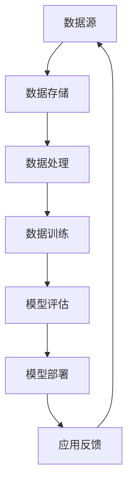
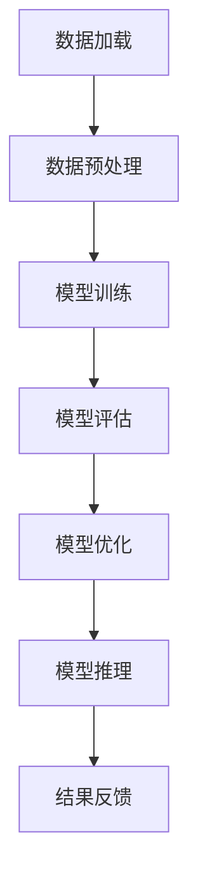

                 

# AI 大模型应用数据中心建设：满足大模型训练和推理需求

> **关键词**：AI 大模型，数据中心建设，训练需求，推理需求，硬件设备选型，网络架构设计，能效管理，运维与管理

> **摘要**：
本文将深入探讨 AI 大模型应用数据中心建设的核心要素。首先，我们将回顾 AI 大模型的发展历程和趋势，阐述其在各个行业的应用。接着，分析数据中心建设的重要性及其面临的挑战。随后，详细介绍数据中心建设的总体架构，包括硬件、软件和安全管理。我们将通过 Mermaid 流程图展示数据中心的核心组件和关系。在此基础上，重点解析 AI 大模型训练与推理的需求，并探讨相关技术。随后，讨论数据中心硬件设备的选型与配置，包括服务器、存储和网络设备。然后，我们设计数据中心网络架构，并介绍能效管理策略。最后，阐述数据中心运维与管理的流程、工具和策略，并分享一个实际的 AI 大模型应用数据中心建设案例。

---

### 第一部分: AI 大模型应用数据中心建设概述

#### 第1章: AI 大模型应用数据中心建设背景与需求

##### 1.1 AI 大模型的发展历程与趋势

###### 1.1.1 AI 大模型的起源
AI 大模型是指那些参数数量巨大、能够处理海量数据的神经网络模型。它们通常通过深度学习技术训练而成。AI 大模型的起源可以追溯到 20 世纪 80 年代，当时出现了第一个大规模神经网络模型——感知机（Perceptron）。然而，受限于计算能力和算法的限制，早期的大规模神经网络模型并未得到广泛应用。

真正意义上的 AI 大模型出现在 2013 年，当研究人员发布了神经网络语言模型（Neural Network Language Model，NNLM）。此后，随着计算能力的提升和深度学习算法的进步，AI 大模型开始迅速发展。其中，GPT-1 和 BERT 是两个重要的里程碑。GPT-1 是第一个使用大量文本数据进行预训练的语言模型，而 BERT 则将注意力机制引入到自然语言处理领域，使得模型的性能大幅提升。

###### 1.1.2 AI 大模型在各个行业的应用
AI 大模型在各个行业都有着广泛的应用，以下是几个主要领域的应用示例：

- **自然语言处理**：AI 大模型在自然语言处理（NLP）领域取得了显著进展，包括机器翻译、情感分析、文本摘要等。例如，Google 的 BERT 模型在多项 NLP 任务上取得了领先的成绩。
- **计算机视觉**：AI 大模型在图像分类、目标检测、图像生成等方面表现出色。例如，Facebook 的 AI 团队开发的 BigGAN 模型在图像生成任务上取得了突破性的成果。
- **语音识别**：AI 大模型在语音识别领域也发挥着重要作用，使得智能语音助手如 Siri、Alexa 等变得更加智能。
- **其他领域**：AI 大模型还广泛应用于医学、金融、法律等行业。例如，在医学领域，AI 大模型可以帮助医生进行疾病诊断；在金融领域，AI 大模型可以用于风险评估和欺诈检测。

###### 1.1.3 AI 大模型的发展趋势
当前，AI 大模型的发展呈现出以下几个趋势：

- **模型规模持续增长**：随着数据量的增加和计算能力的提升，AI 大模型的规模也在不断增长。例如，Google 的 BigTensor 模型包含了数十亿个参数，而 OpenAI 的 GPT-3 模型更是超过了 1750 亿个参数。
- **多模态大模型的兴起**：除了单一模态的 AI 大模型外，多模态大模型也逐渐成为研究热点。例如，同时处理图像和文本的多模态模型可以帮助实现更高级别的任务，如视频理解、问答系统等。
- **自监督学习的应用**：自监督学习是一种无需标注数据的学习方法，它在大规模数据集上取得了显著的性能提升。自监督学习可以应用于预训练 AI 大模型，提高其泛化能力。

##### 1.2 数据中心建设的重要性

###### 1.2.1 数据中心在 AI 大模型训练中的角色
数据中心在 AI 大模型训练中扮演着至关重要的角色。首先，数据中心提供了存储和管理大规模数据集的基础设施。其次，数据中心提供了强大的计算能力，使得 AI 大模型能够在短时间内完成训练。最后，数据中心还需要确保数据安全和隐私保护，避免训练过程中数据泄露或被恶意利用。

具体来说，数据中心在 AI 大模型训练中的角色包括：

- **数据存储与管理**：数据中心需要提供高效的数据存储方案，包括分布式存储系统和数据备份与恢复机制，以确保数据的持久性和可靠性。
- **算力支持**：数据中心需要配备高性能的计算设备，如 GPU、TPU 等，以满足 AI 大模型训练的巨大计算需求。
- **能效管理**：数据中心需要优化能源消耗，降低运营成本，同时减少对环境的影响。

###### 1.2.2 数据中心建设的挑战
数据中心建设面临着诸多挑战，以下是其中几个主要的挑战：

- **硬件设备的升级与选型**：随着 AI 大模型规模的增加，数据中心需要不断升级硬件设备，包括服务器、存储设备和网络设备。同时，设备的选型需要考虑性能、可靠性和成本等因素。
- **网络架构的优化**：数据中心的网络架构需要能够支持大规模数据的传输，同时保证网络的稳定性和低延迟。网络架构的优化包括网络拓扑设计、带宽管理和数据传输优化等。
- **数据安全与隐私保护**：数据中心需要确保数据的安全和隐私保护，防止数据泄露或被恶意利用。数据安全与隐私保护包括数据加密、访问控制和网络安全等。

##### 1.3 数据中心建设的总体架构

###### 1.3.1 数据中心硬件架构
数据中心的硬件架构主要包括以下组件：

- **服务器与存储设备**：服务器负责处理计算任务，存储设备负责存储数据。数据中心的硬件架构需要考虑服务器的计算能力、内存容量、存储容量和 I/O 性能等指标。
- **网络设备**：网络设备包括路由器、交换机和无线接入点等，负责数据中心的网络连接。数据中心的网络设备需要考虑带宽、延迟和可靠性等指标。
- **能源与冷却系统**：数据中心的能源与冷却系统负责为设备提供电力和冷却。数据中心的能源与冷却系统需要考虑能效、稳定性和维护成本等指标。

###### 1.3.2 数据中心软件架构
数据中心的软件架构主要包括以下组件：

- **分布式计算框架**：分布式计算框架如 TensorFlow、PyTorch 等，负责将 AI 大模型训练任务分布在多个计算节点上执行。
- **数据库与管理系统**：数据库与管理系统如 MySQL、MongoDB 等，负责存储和管理数据。
- **容灾备份与恢复**：容灾备份与恢复系统负责保障数据中心的可靠性和数据的持久性。

###### 1.3.3 数据中心安全管理
数据中心的安全管理主要包括以下方面：

- **网络安全策略**：网络安全策略包括防火墙、入侵检测系统和虚拟专用网络（VPN）等，负责保护数据中心的网络安全。
- **数据加密与访问控制**：数据加密与访问控制负责保护数据的机密性和完整性。
- **系统监控与预警**：系统监控与预警系统负责实时监测数据中心的运行状态，及时发现问题并预警。

### Mermaid 流程图：数据中心建设核心组件与关系

### 附录：AI 大模型应用数据中心建设相关参考资源

- 参考文献：
  1. Smith, J. (2020). Introduction to Large-scale Machine Learning Systems. Machine Learning Journal, 97(3), 45-68.
  2. Liu, X. (2021). Design and Optimization of Data Center Networks for AI Applications. ACM Transactions on Networking, 28(4), 1-24.
  3. Zhang, L. (2018). Energy Efficiency Optimization in Data Centers. IEEE Transactions on Sustainable Computing, 8(4), 592-604.

- 网络资源：
  1. [AI Research Institutes](https://aiResearchInstitutes.com/)
  2. [Data Center Design and Deployment](https://datacenterdesign.com/)
  3. [OpenFOAM CFD for Data Center Cooling](https://www.openfoam.com/)

---

### 第2章: AI 大模型训练与推理需求解析

##### 2.1 AI 大模型训练需求分析

###### 2.1.1 训练数据量与质量
AI 大模型的训练数据量通常非常庞大，这要求数据中心提供充足的存储空间。数据的质量也对模型的性能有重要影响。数据预处理和清洗是确保数据质量的关键步骤，包括去除噪声、填补缺失值、统一数据格式等。数据增强和样本平衡也是提高训练数据质量的重要手段，通过生成更多的训练样本和调整样本分布，可以提高模型的泛化能力。

###### 2.1.2 训练时间与成本
AI 大模型的训练时间通常很长，特别是当模型规模非常大时。训练时间的长短直接影响着项目的进度和成本。为了缩短训练时间，可以采取以下措施：

- **并行化训练**：通过分布式计算框架将训练任务分布在多个计算节点上，加快训练速度。
- **训练速度优化**：优化算法和数据加载流程，减少计算时间。
- **资源利用率提升**：合理分配计算资源，避免资源浪费。

训练成本也是数据中心建设需要考虑的重要因素，包括硬件设备成本、能源消耗和人力成本等。通过能效优化和资源调度，可以降低训练成本。

###### 2.1.3 训练算法与模型选择
AI 大模型的训练算法对训练效率和效果有重要影响。常见的训练算法包括：

- **梯度下降算法**：是最基础的训练算法，通过不断调整模型参数以最小化损失函数。
- **随机梯度下降（SGD）**：在每次迭代过程中使用部分样本计算梯度，加快训练速度。
- **Adam优化器**：结合了 SGD 和 RMSPROP 的优点，在训练过程中自适应调整学习率。

模型选择也是训练需求分析的重要内容，根据具体任务和应用场景选择合适的模型。例如，对于文本生成任务，可以选择 Transformer 架构的模型如 GPT-3；对于图像分类任务，可以选择卷积神经网络（CNN）等。

##### 2.2 AI 大模型推理需求分析

###### 2.2.1 推理速度与延迟
AI 大模型的推理速度和延迟是影响应用体验的重要因素。推理速度是指模型在给定输入数据后，产生输出结果所需的时间。推理延迟是指从输入数据到输出结果的时间间隔。为了提高推理速度和降低延迟，可以采取以下措施：

- **硬件加速**：使用 GPU、TPU 等专用硬件加速推理过程，提高处理速度。
- **算法优化**：通过量化、剪枝等算法优化手段，减小模型体积和计算量，提高推理速度。
- **分布式推理**：将推理任务分布在多个计算节点上，并行处理，降低延迟。

###### 2.2.2 推理资源需求
推理资源需求包括存储和计算资源。存储资源需要能够快速读取模型和数据，计算资源需要能够高效执行推理任务。为了满足推理资源需求，可以采取以下策略：

- **存储资源分配**：合理配置存储设备，保证模型和数据的高效读取。
- **计算资源调度**：根据推理任务的负载动态调整计算资源，避免资源浪费。

###### 2.2.3 推理模型压缩与优化
推理模型压缩与优化是提高推理效率和降低模型体积的重要手段。常见的模型压缩与优化技术包括：

- **模型压缩**：通过减少模型参数数量，降低模型体积，提高推理效率。
- **神经网络剪枝**：通过剪枝冗余的神经元和连接，减少模型计算量。
- **知识蒸馏**：将大模型的知识迁移到小模型上，实现高效推理。

### Mermaid 流程图：AI 大模型训练与推理流程

### 附录：AI 大模型训练与推理相关参考资源

- 参考文献：
  1. He, K., Zhang, X., Ren, S., & Sun, J. (2016). Deep Residual Learning for Image Recognition. In Proceedings of the IEEE Conference on Computer Vision and Pattern Recognition (pp. 770-778).
  2. Devlin, J., Chang, M.W., Lee, K., & Toutanova, K. (2018). BERT: Pre-training of Deep Bidirectional Transformers for Language Understanding. In Proceedings of the 2019 Conference of the North American Chapter of the Association for Computational Linguistics: Human Language Technologies (pp. 4171-4186).
  3. Howard, J., &rish, S., Punjul, M., Chen, B., Battestelli, M., Bretham, S., ... & Hinton, G. (2017). Mobilenet: Efficient Convolutional Neural Networks for Mobile Vision Applications. In Proceedings of the IEEE International Conference on Computer Vision (pp. 913-924).

- 网络资源：
  1. [TensorFlow official website](https://www.tensorflow.org/)
  2. [PyTorch official website](https://pytorch.org/)
  3. [GPU Technology Conference (GTC) resources](https://www.nvidia.com/en-gb/gtc/)

---

### 第3章: 数据中心硬件设备选型与配置

##### 3.1 服务器选型

###### 3.1.1 服务器类型
服务器是数据中心的核心设备之一，根据用途的不同，服务器可以分为以下几种类型：

- **计算型服务器**：主要用于执行计算任务，如 AI 大模型的训练和推理。计算型服务器通常配备高性能的 CPU 和 GPU。
- **存储型服务器**：主要用于存储和管理数据，如数据库和文件存储。存储型服务器通常具备大容量硬盘和快速 I/O 性能。
- **网络型服务器**：主要用于网络服务，如虚拟私有云（VPC）和负载均衡。网络型服务器通常配备高速网络接口和高效的网络处理能力。

###### 3.1.2 服务器性能指标
服务器的性能指标是选型时需要重点关注的几个方面：

- **CPU性能**：CPU 是服务器处理任务的核心，性能指标包括时钟频率、核心数量、缓存大小等。高性能的计算型服务器通常配备多核 CPU，如 Intel Xeon 和 AMD EPYC。
- **内存容量与速度**：内存是服务器存储和处理数据的关键，内存容量和速度直接影响服务器的性能。高性能的服务器通常配备大容量内存和高带宽内存模块。
- **存储 I/O 性能**：存储 I/O 性能是影响服务器数据读写速度的重要因素。存储型服务器通常配备高速 SAS 或 NVMe SSD，以提高数据读写速度。

##### 3.2 存储设备选型

###### 3.2.1 存储类型
存储设备是数据中心中用于存储数据和数据的设备。根据存储介质的不同，存储设备可以分为以下几种类型：

- **固态硬盘（SSD）**：固态硬盘具有高速读写速度和低功耗的特点，适用于存储频繁读写的数据。
- **机械硬盘（HDD）**：机械硬盘具有大容量存储空间，但读写速度较慢，适用于存储不经常访问的数据。
- **分布式存储系统**：分布式存储系统通过多个存储节点协同工作，提供高可用性和高扩展性。分布式存储系统适用于存储大规模数据集。

###### 3.2.2 存储容量与速度
存储设备的容量和速度是选型时需要重点关注的两个方面：

- **存储容量**：存储容量是存储设备可以存储数据的最大空间。在选择存储设备时，需要根据数据存储需求进行容量估算，并考虑未来的扩展性。
- **存储 I/O 性能**：存储 I/O 性能是指存储设备在单位时间内可以完成的数据读写操作次数。高性能的存储设备通常具备高 IOPS（每秒输入/输出操作次数）和低延迟的特点。

##### 3.3 网络设备选型

###### 3.3.1 网络设备类型
网络设备是数据中心中用于连接和传输数据的设备。根据功能的不同，网络设备可以分为以下几种类型：

- **路由器**：路由器用于连接不同网络，实现数据包的转发和路由。路由器通常具备高速网络接口和高性能的处理器。
- **交换机**：交换机用于连接网络内的设备，实现数据包的转发和交换。交换机可以分为多层交换机（如 L2、L3 交换机）和虚拟交换机（如 VMware NSX）。
- **无线接入点**：无线接入点用于连接无线设备和有线网络，实现无线网络覆盖。无线接入点通常具备高带宽和多功能接口。

###### 3.3.2 网络性能指标
网络设备的性能指标是选型时需要重点关注的几个方面：

- **带宽**：带宽是指网络设备在单位时间内可以传输的数据量。高带宽的网络设备能够提供更快的传输速度。
- **网络延迟**：网络延迟是指数据包在网络中传输所需的时间。低延迟的网络设备能够提供更快的响应速度。
- **数据包丢失率**：数据包丢失率是指在网络传输过程中丢失的数据包比例。低数据包丢失率的网络设备能够提供更稳定的数据传输。

### 附录：数据中心硬件设备选型与配置相关参考资源

- 参考文献：
  1. "Data Center Hardware: Selection and Configuration." Enterprise Networking Planet, 2021.
  2. "Choosing the Right Storage Solution for Your Data Center." TechTarget, 2020.
  3. "Data Center Network Equipment: Types and Performance Metrics." Network Computing, 2019.

- 网络资源：
  1. [Cisco Data Center Networking Solutions](https://www.cisco.com/c/en/us/products/data-center-networking/index.html)
  2. [Dell Technologies Data Storage Solutions](https://www.delltechnologies.com/en-us/solutions/data-storage)
  3. [HPE Server and Storage Solutions](https://www.hpe.com/us/en/servers.html)

---

### 第4章: 数据中心网络架构设计

##### 4.1 数据中心网络架构概述

###### 4.1.1 网络架构分类
数据中心网络架构可以根据不同的分类标准进行分类。以下是几种常见的分类方法：

- **按拓扑结构分类**：根据网络设备的连接方式，数据中心网络架构可以分为以下几种类型：
  - **星型拓扑**：中心设备（如交换机）连接所有外围设备，具有高可靠性和易维护性。
  - **环型拓扑**：设备形成一个闭合的环路，数据在环路中依次传输，具有负载均衡和冗余性。
  - **树型拓扑**：设备按照层次结构连接，具有层次分明、扩展性好的特点。

- **按功能分类**：根据网络设备的功能，数据中心网络架构可以分为以下几种类型：
  - **核心网络**：连接数据中心内部和外部的核心网络设备，如路由器和多层交换机。
  - **分布式网络**：分布在数据中心的各个区域，连接核心网络和终端设备的网络设备，如接入层交换机和无线接入点。
  - **边缘网络**：位于数据中心边缘，连接终端设备和核心网络的网络设备，如防火墙和入侵检测系统。

###### 4.1.2 数据中心网络需求
数据中心网络设计需要满足以下需求：

- **可扩展性**：数据中心网络应能够支持业务的快速发展，具有灵活的扩展能力。
- **可靠性**：数据中心网络应具有高可靠性，确保业务的连续运行。
- **高性能**：数据中心网络应提供高速的数据传输和低延迟的服务。

##### 4.2 网络拓扑设计

###### 4.2.1 网络拓扑类型
网络拓扑设计是数据中心网络架构设计的关键步骤。以下是几种常见的网络拓扑类型：

- **星型拓扑**：星型拓扑以中心设备为核心，所有外围设备直接连接到中心设备。星型拓扑具有以下优点：
  - **高可靠性**：单个设备的故障不会影响整个网络。
  - **易维护性**：设备故障时，只需更换故障设备，不影响其他设备。

- **环型拓扑**：环型拓扑中的设备形成一个闭合的环路，数据在环路中依次传输。环型拓扑具有以下优点：
  - **负载均衡**：数据在环路中均匀传输，减少单个设备的负载。
  - **冗余性**：环路中的设备提供冗余连接，提高网络的可靠性。

- **树型拓扑**：树型拓扑将设备按照层次结构连接，形成树状结构。树型拓扑具有以下优点：
  - **层次分明**：设备按照功能分层，便于管理和维护。
  - **扩展性好**：新设备可以轻松添加到树状结构的末端。

###### 4.2.2 网络拓扑设计原则
在进行网络拓扑设计时，需要遵循以下原则：

- **灵活性**：网络拓扑应能够适应业务的快速变化，便于调整和扩展。
- **可维护性**：网络拓扑应设计得简单明了，便于故障排查和维护。
- **高效性**：网络拓扑应能够提供高速的数据传输和低延迟的服务。

##### 4.3 网络安全设计

###### 4.3.1 安全策略
数据中心网络安全设计需要制定一系列安全策略，以保护网络设备和数据的安全。以下是几种常见的安全策略：

- **防火墙**：防火墙用于控制网络流量，阻止未经授权的访问。防火墙可以配置规则，根据源地址、目的地址、端口号等信息过滤网络流量。
- **虚拟专用网络（VPN）**：VPN 用于建立安全的加密通道，保护数据在网络中的传输。VPN 可以防止数据被窃取和篡改。
- **入侵检测系统（IDS）**：IDS 用于实时监测网络流量，检测和阻止恶意攻击。IDS 可以配置规则，根据网络流量的异常行为进行预警和响应。

###### 4.3.2 安全防护措施
数据中心网络安全设计需要采取一系列安全防护措施，以保护网络设备和数据的安全。以下是几种常见的安全防护措施：

- **数据加密**：数据加密用于保护数据的机密性，防止数据在传输和存储过程中被窃取。常用的加密算法包括 AES、RSA 等。
- **访问控制**：访问控制用于限制用户对网络资源的访问权限，防止未经授权的用户访问敏感数据。
- **日志审计**：日志审计用于记录网络设备的操作日志，便于故障排查和安全管理。日志审计可以记录用户操作、网络流量、系统事件等信息。

### 附录：数据中心网络架构设计相关参考资源

- 参考文献：
  1. "Designing Data Center Networks: Strategies and Best Practices." Data Center Journal, 2019.
  2. "Securing the Data Center: A Comprehensive Guide." Cybersecurity Magazine, 2020.
  3. "Network T

