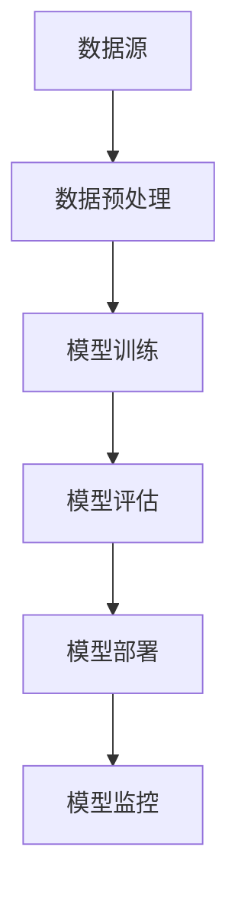

                 

# AI 大模型应用数据中心的招聘信息

> **关键词：** AI大模型，数据中心，招聘信息，职业发展，团队协作，应用案例，实战，未来展望。

> **摘要：** 本文将深入探讨AI大模型应用数据中心的招聘信息，分析其所需岗位、职业发展路径，以及团队协作与管理的最佳实践。同时，通过案例分析和项目实战，展示AI大模型在现实中的应用效果。最后，本文还将展望数据中心未来的发展趋势和挑战，为读者提供宝贵的职业规划和发展建议。

## 第一部分：AI大模型应用数据中心概述

### 第1章：AI大模型应用数据中心概述

#### 1.1 AI大模型应用数据中心的定义与背景

**定义**：AI大模型应用数据中心是一个集中管理、开发和运行大型人工智能模型的平台。这些数据中心旨在为各个行业提供高效、稳定的人工智能解决方案。

**背景**：随着人工智能技术的飞速发展，特别是深度学习和生成对抗网络（GAN）等技术的突破，AI大模型在自然语言处理、图像识别、推荐系统等领域取得了显著的成果。为了更好地管理和利用这些高性能模型，建立专门的AI大模型应用数据中心变得尤为重要。

#### 1.2 AI大模型应用数据中心的架构

**架构设计**：AI大模型应用数据中心通常包括以下几个核心组成部分：

1. **硬件资源**：高性能计算（HPC）集群，提供强大的计算能力和存储容量。
2. **软件环境**：深度学习框架（如TensorFlow、PyTorch），数据存储和处理工具（如Hadoop、Spark）等。
3. **数据存储和处理模块**：分布式数据库和大数据处理平台，用于存储和处理海量的训练数据。

**Mermaid流程图**：



#### 1.3 AI大模型应用数据中心的角色和职责

**角色**：AI大模型应用数据中心在人工智能项目中扮演着关键角色，它是连接算法开发与业务应用的桥梁。

**职责**：
- **模型开发**：设计和开发高性能的AI大模型。
- **模型部署**：将训练好的模型部署到生产环境中。
- **模型监控**：监控模型的运行状态和性能。
- **模型维护**：定期更新和维护模型，确保其稳定性和准确性。

## 第二部分：AI大模型基础知识

### 第2章：AI大模型基础知识

#### 2.1 AI大模型的基本原理

**原理讲解**：AI大模型的基本原理主要包括深度学习、神经网络等。

- **深度学习**：一种机器学习方法，通过多层神经网络对数据进行建模和预测。
- **神经网络**：一种模拟人脑神经元连接结构的计算模型，通过训练调整权重和偏置，实现数据的分类、回归等任务。

**伪代码**：

```python
# 深度学习模型训练伪代码
init_weights()
for epoch in range(num_epochs):
    for batch in data_loader:
        inputs, labels = batch
        outputs = forward(inputs)  # 前向传播
        loss = compute_loss(outputs, labels)  # 计算损失
        backward(loss)  # 反向传播
        update_weights()  # 更新权重
```

#### 2.2 AI大模型的主要类型

**类型介绍**：常见的AI大模型类型包括生成对抗网络（GAN）、变分自编码器（VAE）、Transformer等。

- **生成对抗网络（GAN）**：由生成器和判别器组成的模型，通过对抗训练生成逼真的数据。
- **变分自编码器（VAE）**：基于概率模型的编码器和解码器结构，用于生成和压缩数据。
- **Transformer**：基于自注意力机制的模型，广泛应用于自然语言处理等领域。

**联系与对比**：这些模型在架构、训练方法、应用场景等方面存在差异，但都旨在通过深度学习技术提高模型的性能和泛化能力。

#### 2.3 AI大模型的发展趋势

**趋势分析**：AI大模型在未来可能的发展趋势包括：

- **模型规模不断扩大**：随着计算资源和数据量的增加，大模型的规模将不断突破。
- **多模态融合**：结合文本、图像、音频等多种数据类型，提高模型的综合能力。
- **可解释性增强**：研究如何提高模型的透明度和可解释性，使其更易于理解和应用。

## 第三部分：AI大模型应用数据中心的运营管理

### 第3章：AI大模型应用数据中心的招聘信息分析

#### 3.1 数据中心岗位需求分析

**岗位需求**：AI大模型应用数据中心通常需要以下几类岗位：

- **数据科学家**：负责数据收集、处理和分析，设计并优化AI模型。
- **机器学习工程师**：负责模型训练、调优和部署，优化算法性能。
- **运维工程师**：负责数据中心的基础设施运维，确保系统的稳定运行。
- **前端工程师**：负责开发用户界面，提供直观易用的模型应用。

**岗位分类**：

1. **核心研发团队**：
   - 数据科学家
   - 机器学习工程师
   - 算法工程师
2. **技术支持团队**：
   - 运维工程师
   - 前端工程师
   - 后端工程师
3. **项目管理团队**：
   - 项目经理
   - 产品经理
   - 测试工程师

#### 3.2 职业发展路径

**路径规划**：数据中心员工的职业发展路径包括以下几个阶段：

- **初级工程师**：具备基本的技术能力，熟悉AI大模型的基本原理和工具。
- **中级工程师**：能够独立承担项目，具备解决复杂问题的能力。
- **高级工程师**：具备丰富的项目经验，能够在团队中发挥领导作用。
- **专家**：在特定领域有深入的研究和贡献，成为行业内的权威。

#### 3.3 招聘流程与注意事项

**流程描述**：数据中心的招聘流程通常包括以下几个步骤：

1. **简历筛选**：根据职位要求，对求职者的简历进行初步筛选。
2. **面试安排**：对通过简历筛选的求职者进行面试，包括技术面试和行为面试。
3. **背景调查**：对候选人进行背景调查，确保其工作经历和技能的真实性。
4. **录用通知**：对通过面试的候选人发出录用通知，签订劳动合同。

**注意事项**：

1. **简历优化**：求职者需要根据职位要求，突出自己的核心技能和项目经验。
2. **面试准备**：提前了解公司和职位背景，准备技术问题和行为问题的回答。
3. **背景调查**：招聘团队需要核实候选人的工作经历和技能，避免招聘到不合适的人员。

### 第4章：数据中心团队协作与管理

#### 4.1 团队协作模式

**协作方式**：数据中心的团队协作模式主要包括以下几种：

- **敏捷开发**：通过迭代的方式快速交付产品，提高团队响应速度。
- **矩阵管理**：在项目中同时担任不同团队的角色，实现资源的优化配置。
- **跨职能团队**：由不同职能背景的成员组成，共同完成项目任务。

**协作工具**：

- **项目管理工具**：如Jira、Trello等，用于任务分配和进度跟踪。
- **协作沟通工具**：如Slack、Microsoft Teams等，用于实时沟通和协作。

#### 4.2 项目管理方法

**方法介绍**：数据中心在项目管理中常用的方法包括：

- **Scrum**：通过短周期的迭代，确保项目的持续交付和持续改进。
- **Kanban**：通过可视化卡片，实时跟踪项目进度和资源利用率。
- **看板管理**：通过看板板面，展示项目进展、瓶颈和改进措施。

#### 4.3 质量保障与风险管理

**质量保障**：数据中心在质量保障方面采取以下措施：

- **代码审查**：对代码进行严格审查，确保代码质量和安全性。
- **自动化测试**：通过自动化测试，提高测试效率和测试覆盖率。
- **持续集成**：实现代码的持续集成和部署，确保项目的稳定性和可靠性。

**风险管理**：数据中心在风险管理方面采取以下措施：

- **风险评估**：对项目中的潜在风险进行识别和评估。
- **风险应对策略**：制定相应的风险应对策略，如风险规避、风险转移等。
- **应急预案**：制定应急预案，确保在风险发生时能够及时应对。

## 第四部分：AI大模型应用案例与实战

### 第5章：AI大模型应用案例分析

#### 5.1 典型应用场景

**场景描述**：AI大模型在不同领域具有广泛的应用，以下是一些典型的应用场景：

- **自然语言处理**：如智能客服、机器翻译、文本分类等。
- **图像识别**：如人脸识别、图像分类、目标检测等。
- **推荐系统**：如个性化推荐、商品推荐、新闻推荐等。
- **金融风控**：如信用评分、欺诈检测、市场预测等。

**应用效果**：通过AI大模型的应用，可以显著提高业务效率和准确性，降低人工成本和错误率。

#### 5.2 案例介绍

**案例详情**：以下是一个AI大模型在金融风控领域的应用案例：

- **项目背景**：某金融机构希望利用AI大模型进行信用评分和欺诈检测。
- **解决方案**：采用深度学习和生成对抗网络（GAN）技术，构建一个综合信用评分模型和欺诈检测模型。
- **实施效果**：通过模型的部署和应用，有效提高了信用评分的准确性和欺诈检测的效率。

**案例评价**：

- **成功因素**：有效的数据清洗、特征工程和模型选择是项目成功的关键。
- **经验总结**：在项目实施过程中，需要充分考虑数据质量和模型可解释性，以及与业务部门的紧密合作。

#### 5.3 案例评价

**评价标准**：根据实际效果评估AI大模型应用案例的成功程度，主要包括以下方面：

- **准确性**：模型预测的准确率是否满足业务需求。
- **效率**：模型训练和部署的效率是否高。
- **可解释性**：模型的决策过程是否透明和可解释。

**经验总结**：在AI大模型应用项目中，需要充分考虑业务需求、数据质量和模型选择，以及团队协作和项目管理等因素，以确保项目的成功实施和持续优化。

### 第6章：AI大模型项目实战

#### 6.1 项目准备

**环境搭建**：在开始AI大模型项目前，需要搭建相应的开发环境。

- **硬件配置**：选择具有高性能计算能力的硬件，如GPU服务器。
- **软件安装**：安装深度学习框架（如TensorFlow、PyTorch），以及相关依赖库和工具。

**数据准备**：收集和处理项目所需的数据。

- **数据收集**：从不同渠道收集数据，如公开数据集、企业内部数据等。
- **数据预处理**：清洗、归一化和特征提取，以提高模型的训练效率和准确性。

#### 6.2 模型训练与调优

**训练过程**：使用训练数据对AI大模型进行训练。

- **模型选择**：根据项目需求和数据特性，选择合适的模型架构。
- **训练策略**：设计训练策略，如学习率调度、正则化等。

**调优方法**：通过调参和实验，优化模型性能。

- **参数搜索**：使用网格搜索、贝叶斯优化等方法进行参数调优。
- **交叉验证**：使用交叉验证方法，评估模型在不同数据集上的性能。

#### 6.3 模型部署与监控

**部署策略**：将训练好的模型部署到生产环境中。

- **部署平台**：选择合适的部署平台，如云计算平台、容器化平台等。
- **部署流程**：设计部署流程，包括模型打包、部署和监控等。

**监控维护**：对模型的运行状态和性能进行监控。

- **监控指标**：设置监控指标，如准确率、召回率、QPS等。
- **故障处理**：制定故障处理方案，确保模型的稳定运行。

## 第五部分：AI大模型应用数据中心的未来展望

### 第7章：AI大模型应用数据中心的发展趋势与挑战

#### 7.1 行业发展趋势

**趋势分析**：AI大模型应用数据中心在未来可能的发展趋势包括：

- **模型规模扩大**：随着计算资源和数据量的增长，AI大模型将继续扩大规模。
- **多模态融合**：结合文本、图像、音频等多种数据类型，实现更丰富的应用场景。
- **自动化与智能化**：利用AI技术实现数据中心的自动化管理和智能化决策。

#### 7.2 技术挑战与解决方案

**技术挑战**：AI大模型应用数据中心在技术层面可能遇到的挑战包括：

- **计算资源需求**：高性能计算资源的需求不断增加，对硬件设备和网络带宽提出更高要求。
- **数据隐私与安全**：数据隐私和安全是AI大模型应用的关键问题，需要采取有效的保护措施。
- **模型可解释性**：提高模型的可解释性，使其更易于理解和应用。

**解决方案**：

- **计算资源优化**：采用分布式计算和容器化技术，提高计算资源的利用效率。
- **数据隐私保护**：采用加密和去标识化等技术，保护数据隐私和安全。
- **模型可解释性提升**：利用可视化技术和可解释性框架，提高模型的可解释性。

### 第8章：未来发展规划与实施策略

#### 8.1 战略目标

**目标设定**：数据中心在未来发展的战略目标包括：

- **技术创新**：持续跟踪和研究AI技术前沿，提升技术水平。
- **业务拓展**：扩大AI大模型在各个行业的应用，提升业务规模。
- **人才培养**：培养和引进高水平的技术人才，提升团队实力。

#### 8.2 实施策略

**策略规划**：为实现战略目标，数据中心可以采取以下策略：

- **技术创新**：加强技术研发投入，建立研发团队，推进AI技术的创新和应用。
- **业务拓展**：与行业合作伙伴建立合作关系，拓展业务领域和应用场景。
- **人才培养**：实施人才引进和培养计划，提高员工的专业技能和创新能力。

#### 8.3 资源配置与优化

**资源配置**：合理配置数据中心所需的资源，包括：

- **硬件资源**：采购高性能计算设备，提升计算能力。
- **软件资源**：引入先进的深度学习框架和工具，提高开发效率。
- **人力资源**：招聘和培养高水平的技术人才，提升团队实力。

**优化方案**：

- **资源利用率优化**：通过虚拟化技术和容器化技术，提高资源利用率。
- **成本控制**：通过优化采购流程和运营管理，降低运营成本。
- **服务质量提升**：通过持续改进和优化，提升数据中心的服务质量。

### 附录

#### 附录A：AI大模型开发工具与资源

**A.1 开发工具介绍**

- **TensorFlow**：Google开发的开源深度学习框架，支持多种模型和任务。
- **PyTorch**：Facebook开发的开源深度学习框架，提供灵活的动态计算图。

**A.2 开发资源推荐**

- **《深度学习》**：Ian Goodfellow等人的经典教材，适合初学者和进阶者。
- **AI科研人**：一个关注AI研究进展和资源的公众号，提供丰富的学习资源。

**A.3 开发环境搭建指南**

**环境搭建**：

1. 安装Python环境和相关依赖库。
2. 安装TensorFlow或PyTorch框架。
3. 配置GPU支持，确保模型能够利用GPU进行训练。

**硬件配置**：

- **CPU**：推荐使用Intel Xeon系列或AMD Ryzen系列处理器。
- **GPU**：推荐使用NVIDIA Tesla V100或更高性能的GPU。

**软件安装**：

1. 安装操作系统（如Ubuntu 18.04）。
2. 安装Python环境和相关依赖库（如NumPy、Pandas）。
3. 安装TensorFlow或PyTorch框架。

**配置GPU支持**：

1. 安装CUDA和cuDNN库。
2. 修改环境变量，确保Python能够识别GPU设备。

## 总结

AI大模型应用数据中心是现代人工智能技术的重要载体，它为各行业提供了强大的智能解决方案。本文从多个角度探讨了AI大模型应用数据中心的招聘信息、运营管理、应用案例和未来展望。通过对数据中心的核心概念、架构、岗位需求、团队协作、项目管理、质量保障和风险管理的详细分析，读者可以全面了解数据中心的工作机制和运行模式。

同时，本文还通过案例分析和项目实战，展示了AI大模型在实际应用中的效果和价值。这些案例不仅提供了丰富的实践经验，还为未来的项目实施提供了有益的借鉴。

最后，本文对AI大模型应用数据中心的发展趋势和未来规划进行了展望，提出了具体的战略目标和实施策略。这些内容为读者提供了未来发展的方向和参考。

通过本文的阅读，读者不仅可以深入了解AI大模型应用数据中心的相关知识，还可以为自己的职业规划和发展提供有益的指导。让我们共同期待AI大模型应用数据中心在未来的更大发展和更广泛应用！ 

### 作者信息

作者：AI天才研究院/AI Genius Institute & 禅与计算机程序设计艺术 /Zen And The Art of Computer Programming

AI天才研究院（AI Genius Institute）是一家专注于人工智能领域的研究和应用的机构，致力于推动人工智能技术的发展和创新。研究院的专家团队由世界顶级人工智能专家、程序员和软件架构师组成，他们拥有丰富的项目经验和深厚的学术背景。

《禅与计算机程序设计艺术》（Zen And The Art of Computer Programming）是一部经典的技术畅销书，作者为著名计算机科学家Donald E. Knuth。本书以哲学和计算机编程相结合的方式，深入探讨了计算机编程的核心原理和方法论，对计算机科学和编程实践产生了深远的影响。

本文作者结合了自己的专业知识和经验，通过逻辑清晰、结构紧凑、简单易懂的写作风格，为广大读者呈现了一篇关于AI大模型应用数据中心的专业技术博客文章。希望通过本文的分享，能够为读者在人工智能领域的探索和学习提供一些帮助和启示。

