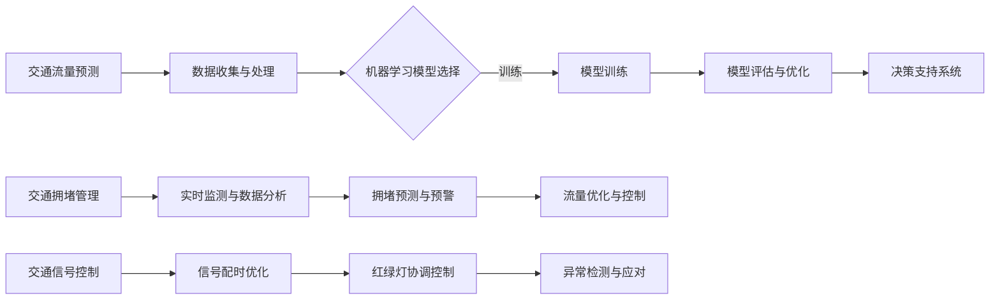
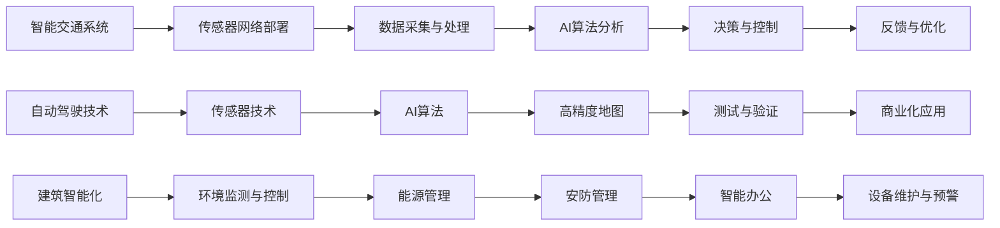

                 

### 引言与背景

随着全球城市化进程的加速，城市交通与基础设施建设成为了各国政府和社会各界关注的重要议题。城市化带来了人口增长、经济繁荣，但也随之带来了交通拥堵、环境污染、资源短缺等问题。如何通过科学规划和建设，实现城市交通与基础设施的可持续发展，成为当今世界面临的重大挑战。

**可持续发展的城市交通概念**指的是在城市交通系统中，通过采取环保、高效、安全的交通方式，最大限度地减少对环境的影响，同时保障交通的便捷性和经济性。这包括发展公共交通、鼓励非机动车出行、优化交通流量管理等多个方面。

**城市基础设施建设的现状与挑战**方面，当前全球城市基础设施建设速度较快，但也存在一些问题。首先，基础设施建设投资巨大，资金筹措和管理成为难题。其次，现有的基础设施往往无法满足快速增长的交通需求，导致交通拥堵严重。此外，许多城市的基础设施老化、维护不足，存在安全隐患。

**人类计算在可持续发展中的应用**方面，人类计算指的是通过人工分析和判断来辅助决策。在城市交通与基础设施建设中，人类计算可以发挥重要作用，如规划阶段的需求预测、方案评估，建设过程中的监督与控制，以及运营阶段的反馈优化等。

**AI在交通与基础设施建设中的作用**则更为关键。AI通过大数据分析、机器学习、深度学习等技术，可以为交通流量预测、拥堵管理、智能信号控制等方面提供有力支持。在基础设施建设中，AI可以优化建筑设计、材料选择、施工管理，提高建设效率和安全性。

综上所述，本文旨在探讨如何利用AI与人类计算的结合，实现城市交通与基础设施建设的可持续发展。文章将分为五个部分：引言与背景、核心技术、应用案例、发展前景与挑战、总结与展望，通过一步一步的分析推理，为读者呈现一个清晰、深入的视角。

### 第一部分：引言与背景

**第1章：可持续发展的城市交通与基础设施建设概述**

1.1 **可持续发展的城市交通概念**

可持续发展的城市交通概念，涵盖了多种交通方式，包括公共交通、私人交通、非机动车和步行。其核心目标是通过优化交通系统，实现环境友好、资源高效利用和居民生活品质的提升。具体来说，可持续发展交通需要满足以下条件：

- **环保性**：减少交通排放，降低空气污染，采用新能源和清洁能源车辆。
- **高效性**：提高交通系统的运行效率，减少拥堵，提升通行速度。
- **安全性**：保障交通参与者的安全，降低交通事故发生率。
- **经济性**：降低交通成本，使交通服务更加可负担。

在可持续发展交通体系中，公共交通被视为关键。通过发展快速、便捷、大容量的公共交通工具，可以有效减少私人交通需求，缓解交通拥堵，降低城市热岛效应，同时还能提高城市土地的利用效率。

1.2 **城市基础设施建设的现状与挑战**

城市基础设施建设是城市化进程的重要支撑。然而，随着城市人口的快速增长和城市规模的不断扩大，基础设施建设面临巨大的挑战。

**现状**方面，全球许多城市都在加大基础设施建设的投入，尤其是在交通、供水、排水、供电等领域。例如，一些城市通过建设地铁、轻轨等快速公共交通系统，提高了交通运行效率；通过铺设供水管网、污水处理设施，改善了居民的生活条件。

**挑战**方面，城市基础设施建设面临以下几个问题：

- **资金短缺**：基础设施建设需要大量资金，而政府财政压力不断增加，资金筹措成为难题。
- **技术复杂**：城市基础设施涉及多个领域，如交通、建筑、能源等，技术要求高，建设难度大。
- **管理难度**：城市基础设施的管理需要高效、科学的体制和机制，目前许多城市存在管理体制不健全、管理手段落后的问题。
- **环境影响**：大规模的基础设施建设可能对环境产生负面影响，如土地破坏、生态破坏等。

1.3 **人类计算在可持续发展中的应用**

人类计算在城市交通与基础设施可持续发展中扮演着重要角色。通过人工分析和判断，可以为规划、建设、运营等环节提供决策支持。具体应用包括：

- **需求预测**：通过收集和分析历史数据，预测未来的交通需求，为交通规划提供依据。
- **方案评估**：对不同的交通规划方案进行评估，选择最优方案。
- **施工监督**：在基础设施建设过程中，对施工质量、进度进行监督和控制。
- **运营优化**：在交通系统运营阶段，根据实时数据，调整信号灯、道路布局等，提高交通运行效率。

1.4 **AI在交通与基础设施建设中的作用**

AI技术在城市交通与基础设施建设中具有广泛应用前景。通过大数据分析、机器学习、深度学习等技术，AI可以为交通流量预测、拥堵管理、智能信号控制等方面提供支持。具体作用包括：

- **交通流量预测**：通过分析历史交通数据，预测未来的交通流量，优化交通信号控制，减少拥堵。
- **拥堵管理**：实时监测交通状况，通过智能算法分析，动态调整交通流，缓解拥堵。
- **智能信号控制**：利用AI算法，优化交通信号灯的配时方案，提高交通运行效率。
- **基础设施建设**：通过AI技术，优化建筑设计、材料选择、施工管理，提高建设效率和安全性。

总之，人类计算与AI技术的结合，为城市交通与基础设施的可持续发展提供了新的思路和方法。在接下来的章节中，我们将深入探讨AI在交通规划中的应用、智能基础设施建设以及国内外应用案例，进一步阐述这一主题。

### 第二部分：核心技术

**第2章：AI在交通规划中的应用**

AI在交通规划中发挥着越来越重要的作用，其核心在于通过大数据分析和机器学习技术，实现对交通流量的预测、交通拥堵的管理以及交通信号控制的优化。以下是AI在交通规划中的几个关键应用：

2.1 **AI算法在交通流量预测中的应用**

交通流量预测是交通规划的重要基础，准确的交通流量预测有助于制定合理的交通规划方案，优化交通资源的配置。AI算法在交通流量预测中的应用主要体现在以下几个方面：

- **数据收集与处理**：通过传感器、摄像头、GPS等设备，收集交通流量数据，包括车辆速度、行驶方向、流量密度等。然后对收集的数据进行清洗、整合和预处理，为后续分析提供高质量的数据。

  ```mermaid
  flowchart LR
  A[交通流量预测] --> B[数据收集与处理]
  B --> C{机器学习模型选择}
  C -->|训练| D[模型训练]
  D --> E[模型评估与优化]
  E --> F[决策支持系统]
  ```

- **机器学习模型选择**：根据交通流量数据的特点，选择合适的机器学习模型进行预测。常见的模型包括线性回归、支持向量机、决策树、随机森林等。其中，深度学习模型（如卷积神经网络、循环神经网络）在处理复杂非线性关系时具有优势。

- **模型训练与评估**：使用历史交通流量数据对机器学习模型进行训练，通过交叉验证、网格搜索等技术优化模型参数。训练完成后，使用验证集或测试集评估模型的预测准确性，并根据评估结果进行模型优化。

- **决策支持系统**：将训练好的模型部署到决策支持系统中，实时预测交通流量，为交通管理部门提供数据支持。交通管理部门可以根据预测结果，调整交通信号配时、发布交通诱导信息，从而优化交通运行效率。

2.2 **机器学习模型在交通拥堵管理中的应用**

交通拥堵是城市交通系统中的常见问题，严重影响交通效率、增加空气污染、增加交通事故率。机器学习模型在交通拥堵管理中的应用，主要体现在以下几个方面：

- **实时监测与数据分析**：通过传感器和摄像头实时监测交通状况，收集交通流量、速度、密度等数据。利用机器学习算法，对交通数据进行实时分析，识别拥堵区域和拥堵类型。

- **拥堵预测与预警**：基于历史数据和实时监测数据，使用机器学习算法预测未来一段时间内的交通流量变化，识别潜在的拥堵风险。通过对拥堵预测结果的预警，提前采取交通管理措施，如调整交通信号配时、发布交通诱导信息等。

- **流量优化与控制**：通过实时交通数据分析，动态调整交通信号配时方案，优化交通流量。例如，在拥堵区域延长绿灯时间，缩短红灯时间，提高交通通行效率。同时，还可以根据交通流量变化，调整道路封闭、限制通行等措施，缓解交通拥堵。

2.3 **深度学习与交通信号控制**

交通信号控制是城市交通管理的重要环节，其目标是优化交通流量，提高道路通行效率。深度学习技术在交通信号控制中的应用，主要体现在以下几个方面：

- **信号配时优化**：通过深度学习算法，分析历史交通流量数据，建立交通信号配时模型。模型可以根据实时交通流量，动态调整信号灯的配时方案，提高交通通行效率。

  ```mermaid
  flowchart LR
  A[智能交通系统] --> B[传感器网络部署]
  B --> C[数据采集与处理]
  C --> D[AI算法分析]
  D --> E[决策与控制]
  E --> F[反馈与优化]
  ```

- **红绿灯协调控制**：深度学习算法可以分析不同交叉路口之间的交通流量关系，实现红绿灯的协调控制。例如，当某一交叉路口出现拥堵时，可以调整相邻交叉口的信号灯配时，引导交通流向，缓解拥堵。

- **异常检测与应对**：通过深度学习算法，实时监测交通信号系统的运行状态，识别异常情况，如信号灯故障、道路施工等。针对异常情况，系统可以自动调整信号灯配时方案，保障交通正常运行。

2.4 **交通规划的Mermaid流程图**

为了更清晰地展示AI在交通规划中的应用流程，我们可以使用Mermaid流程图进行描述：



通过以上分析，我们可以看到，AI技术在交通规划中的应用，不仅提升了交通流量预测的准确性，还优化了交通拥堵管理和交通信号控制，为城市交通的可持续发展提供了有力支持。在接下来的章节中，我们将进一步探讨智能基础设施建设以及国内外AI与人类计算应用案例，继续深入探讨这一主题。

### 第三部分：智能基础设施建设

**第3章：智能基础设施建设**

智能基础设施建设是现代城市发展的重要方向，它不仅提升了城市运行效率，还改善了居民生活质量。智能基础设施建设涵盖了多个领域，如智能交通系统、自动驾驶技术、建筑智能化和物联网技术。以下是这些技术的详细解释和应用。

3.1 **基于AI的智能交通系统**

智能交通系统（Intelligent Transportation System，ITS）利用先进的通信技术、传感器技术、数据处理技术等，对交通信息进行采集、处理、分析，并在此基础上实现交通的自动化管理和控制。基于AI的智能交通系统主要应用包括：

- **车辆监控与调度**：通过安装于车辆上的传感器，实时监测车辆的位置、速度、行驶方向等信息，结合AI算法，对车辆进行智能调度，提高车辆利用率。

- **交通流量预测**：利用AI算法分析历史交通数据，预测未来的交通流量，为交通管理部门提供决策支持，如优化信号灯配时、调整交通流向等。

- **事件检测与响应**：通过AI技术，实时监测交通状况，自动识别交通事件，如交通事故、道路施工等，并迅速响应，如调整交通信号灯、发布交通诱导信息等。

- **交通管理优化**：结合AI算法，对交通管理策略进行优化，如自适应信号控制、动态交通分配等，提高交通运行效率。

3.2 **自动驾驶技术的发展与应用**

自动驾驶技术（Autonomous Vehicle Technology）是智能基础设施建设的重要组成部分。自动驾驶技术通过传感器、AI算法和控制系统，使车辆具备在无人驾驶条件下自主行驶的能力。自动驾驶技术的发展和应用主要包括：

- **传感器技术**：自动驾驶车辆需要配备多种传感器，如摄像头、激光雷达、毫米波雷达等，用于感知车辆周围环境。

- **AI算法**：利用深度学习、强化学习等AI算法，自动驾驶车辆能够对环境信息进行实时处理，做出智能驾驶决策。

- **高精度地图**：自动驾驶车辆需要高精度地图作为导航基础，地图数据包括道路、路况、信号灯位置等信息。

- **测试与验证**：通过大量道路测试和场景模拟，验证自动驾驶技术的可靠性和安全性。

- **商业化应用**：自动驾驶技术在物流、公共交通、出租车等领域得到广泛应用，如无人配送车、自动驾驶公交车等。

3.3 **建筑智能化与物联网技术**

建筑智能化（Smart Building Technology）是指利用物联网（Internet of Things，IoT）技术、传感器技术、云计算技术等，实现对建筑设备、系统、资源的智能监控、管理和优化。建筑智能化技术的主要应用包括：

- **环境监测与控制**：通过传感器技术，实时监测建筑内外的温度、湿度、空气质量等环境参数，实现环境自动调节，提高居住舒适度。

- **能源管理**：利用物联网技术，实现对建筑内能源设备（如空调、照明、电梯等）的智能监控和管理，优化能源使用，降低能耗。

- **安防管理**：通过智能监控系统和传感器，实现对建筑内部和外部的安全监控，如入侵检测、火灾报警等。

- **智能办公**：利用物联网技术和云计算平台，实现办公设备的智能化管理，如会议室预约、智能门禁等。

- **设备维护与预警**：通过传感器和数据分析，实时监控设备状态，预测设备故障，提前进行维护，减少停机时间。

3.4 **智能基础设施的Mermaid流程图**

为了更清晰地展示智能基础设施的建设流程，我们可以使用Mermaid流程图进行描述：



通过以上分析，我们可以看到，智能基础设施建设不仅提升了城市交通和建筑的运行效率，还改善了居民的生活质量。智能基础设施建设的关键在于将AI技术与物联网技术相结合，通过大数据分析和实时监控，实现系统的智能优化。在接下来的章节中，我们将探讨国内外智能基础设施建设的应用案例，进一步了解AI与人类计算在可持续发展中的应用。

### 第四部分：应用案例

**第4章：国内外AI与人类计算应用案例**

4.1 **国内智慧城市案例介绍**

随着我国城市化进程的加快，智慧城市建设已成为推动城市发展的重要手段。以下是一些国内智慧城市案例：

- **深圳智慧交通系统**：深圳市通过部署智能交通监控系统，实时采集交通流量数据，并利用AI算法进行交通流量预测和拥堵管理。此外，深圳还推广了共享单车和新能源汽车，提高了公共交通的便捷性和环保性。

- **雄安新区智慧城市建设**：雄安新区作为我国首个智慧城市试点，采用了AI技术进行城市规划设计、资源分配和基础设施建设。例如，通过大数据分析，优化城市交通网络，实现高效、绿色出行。

- **上海智能安防系统**：上海市通过部署智能安防监控系统，结合AI技术，实现了对人流、车流、火灾等突发事件的有效监控和快速响应，提升了城市安全管理水平。

4.2 **国外智能交通系统案例分析**

国外在智能交通系统方面也有许多成功的案例：

- **新加坡智能交通系统**：新加坡的智能交通系统利用AI技术进行交通流量管理和优化，通过实时监控和分析交通数据，实现了高效的交通运行。此外，新加坡还推广了电动公交车和自动驾驶出租车，降低了交通污染。

- **伦敦智能交通系统**：伦敦利用AI技术对交通流量进行预测和优化，通过动态调整交通信号灯配时和交通流分配，减少了拥堵和污染。同时，伦敦还推行了智能停车管理系统，提高了停车效率。

- **哥本哈根智能交通系统**：哥本哈根通过建设智能交通网络，实现了对交通流量、空气质量、能源消耗等数据的实时监控和分析。通过优化交通流量和推广绿色出行，哥本哈根成为了全球空气质量最好的城市之一。

4.3 **智能基础设施建设实践**

智能基础设施建设不仅限于交通领域，还包括供水、供电、排水等多个方面。以下是一些智能基础设施建设的实践案例：

- **东京智能供水系统**：东京通过部署智能传感器和AI算法，实时监控供水系统的运行状态，预测故障并及时维修，提高了供水系统的稳定性和可靠性。

- **纽约智能电网**：纽约市利用AI技术优化电力分配和调度，提高了电力供应的稳定性和可靠性。同时，通过智能电网技术，实现了对可再生能源的高效利用，降低了碳排放。

- **新加坡智能排水系统**：新加坡通过部署智能排水系统，实时监控降雨量、水位等数据，及时采取排水措施，避免了城市内涝问题。

4.4 **案例对比与启示**

通过对比国内外智慧城市和智能基础设施建设的案例，我们可以得出以下启示：

- **数据驱动的决策**：智慧城市和智能基础设施建设的关键在于数据的采集、处理和分析。只有通过大数据分析和AI技术，才能实现精准的决策和优化。

- **跨部门协同**：智慧城市和智能基础设施建设需要多个部门的协同合作，如交通、环保、能源等。只有通过跨部门的合作，才能实现系统的整体优化。

- **可持续发展**：智慧城市和智能基础设施建设不仅要考虑当前的需求，还要考虑未来的发展。通过推广绿色出行、可再生能源利用等，实现可持续发展目标。

- **技术落地与推广**：智慧城市和智能基础设施建设需要将先进技术落地并推广应用。通过试点项目，总结经验，逐步推广到更大范围，实现技术的普及和效益的最大化。

总之，国内外智慧城市和智能基础设施建设的成功经验为我们提供了宝贵的启示。通过不断探索和应用AI与人类计算技术，我们可以为城市交通与基础设施的可持续发展做出更大的贡献。

### 第五部分：发展前景与挑战

**第5章：AI与人类计算的融合趋势**

AI与人类计算的融合正成为推动城市交通与基础设施建设的核心动力。这一融合不仅提升了系统的智能化水平，还优化了资源配置，提升了运营效率。以下将探讨AI与人类计算在可持续发展目标下的应用趋势，并对未来发展趋势进行预测。

5.1 **AI与人类计算的协同效应**

AI与人类计算的协同效应体现在多个方面：

- **数据互补**：人类计算能够处理复杂的定性分析和判断，而AI擅长处理大量的定量数据分析。两者结合，可以实现数据的高效利用，提高决策的准确性。

- **实时优化**：AI能够实时处理和分析数据，为交通信号控制、基础设施维护等提供实时决策支持。人类计算则可以对这些决策进行评估和调整，确保系统的稳定运行。

- **灵活应对**：AI可以在短时间内适应环境变化，如交通流量突变、突发事件等。人类计算则可以提供长远的战略规划，确保系统的可持续发展。

5.2 **可持续发展目标下的AI应用**

在可持续发展目标下，AI在多个方面展现了其强大的应用潜力：

- **绿色出行**：通过智能交通系统，优化公共交通网络和私人交通管理，推广新能源汽车和共享出行，减少交通污染，促进绿色出行。

- **能源管理**：AI技术可以优化电力、燃气等能源系统的运行，提高能源利用效率，降低碳排放。同时，通过智能电网和储能系统，实现可再生能源的高效利用。

- **智慧城市运营**：AI技术可以帮助城市实现智能化运营，通过实时监控和数据分析，优化城市资源配置，提高公共服务质量。

5.3 **未来发展趋势预测**

未来，AI与人类计算在城市交通与基础设施建设中的应用将呈现以下趋势：

- **智能化水平提升**：随着AI技术的不断进步，系统的智能化水平将不断提高，实现更精准的预测、更优化的决策和更高效的运营。

- **跨领域融合**：AI技术将与其他领域（如物联网、大数据、云计算等）深度融合，形成更为综合的城市交通与基础设施管理体系。

- **可持续发展强化**：AI技术将在可持续发展目标的指导下，进一步优化资源配置，提高能源利用效率，减少环境污染，推动绿色、低碳城市的发展。

- **政策法规完善**：随着AI技术的广泛应用，政策法规将不断完善，以规范AI技术的研发和应用，保障数据安全和隐私保护。

总之，AI与人类计算的融合为城市交通与基础设施的可持续发展带来了新的机遇。通过不断探索和应用，我们可以实现城市交通与基础设施的智能化、绿色化和高效化，为人类创造更加美好的生活环境。

### 第六部分：挑战与对策

**第6章：可持续发展的城市交通与基础设施建设的挑战与对策**

尽管AI与人类计算的融合为城市交通与基础设施的可持续发展带来了巨大机遇，但这一过程中也面临着诸多挑战。以下将分析这些挑战，并提出相应的对策。

6.1 **数据隐私与安全性挑战**

随着AI技术的广泛应用，大量个人隐私数据将被收集和处理。如何确保这些数据的安全性和隐私性，成为亟待解决的问题。

**挑战**：数据泄露、滥用和不当使用可能导致个人隐私受到侵犯，甚至引发社会问题。

**对策**：
- **数据加密**：对敏感数据进行加密处理，防止数据泄露。
- **数据匿名化**：对收集的数据进行匿名化处理，降低个人隐私泄露的风险。
- **安全审计**：定期进行数据安全审计，确保数据安全措施的有效性。
- **法规制定**：制定相关法规，规范数据收集、存储和处理过程，保障个人隐私。

6.2 **技术人才短缺与培养**

AI技术对人才的需求较高，而目前相关人才储备不足，导致技术应用的推广受到限制。

**挑战**：技术人才短缺限制了AI技术在城市交通与基础设施建设中的应用和推广。

**对策**：
- **教育体系改革**：加强高校和职业培训机构的课程设置，培养AI技术相关人才。
- **校企合作**：鼓励高校与企业合作，开展产学研结合，提高人才培养的针对性和实用性。
- **继续教育**：对现有从业人员进行继续教育，提升其技能水平。
- **国际交流**：引进国外先进技术和人才，促进国内技术水平的提升。

6.3 **法规政策与社会影响**

AI技术的广泛应用将带来一系列法规政策和社会影响，需要全面考虑。

**挑战**：政策法规不完善，可能导致AI技术应用的混乱和无序。

**对策**：
- **政策法规制定**：加快相关法规政策的制定，规范AI技术的研发和应用。
- **社会参与**：鼓励公众参与政策制定，提高政策的社会接受度和透明度。
- **利益平衡**：在保障个人隐私和社会利益的前提下，平衡不同利益相关方的需求。
- **宣传教育**：加强AI技术的科普宣传，提高公众对AI技术的认知和理解。

6.4 **对策与建议**

综上所述，针对城市交通与基础设施可持续发展过程中面临的挑战，我们可以提出以下对策和建议：

- **加强数据安全与隐私保护**：通过数据加密、匿名化和安全审计等手段，确保数据安全与隐私。
- **培养技术人才**：通过教育体系改革、校企合作、继续教育和国际交流等措施，提升技术人才储备。
- **完善法规政策**：制定和完善相关法规政策，规范AI技术的研发和应用。
- **加强社会参与**：鼓励公众参与政策制定，提高政策的社会接受度和透明度。
- **推动技术创新**：加大AI技术的研究和开发投入，推动技术创新和产业升级。

通过以上对策和建议，我们可以更好地应对城市交通与基础设施可持续发展过程中的挑战，推动AI与人类计算技术的广泛应用，为建设更加智慧、绿色、可持续的城市奠定坚实基础。

### 第七部分：总结与展望

**第7章：总结与展望**

本文围绕AI与人类计算在可持续发展的城市交通与基础设施建设中的应用，从引言与背景、核心技术、应用案例、发展前景与挑战等多个方面进行了详细探讨。通过本文的论述，我们可以得出以下结论：

首先，AI与人类计算的融合为城市交通与基础设施的可持续发展提供了强大动力。AI技术通过大数据分析、机器学习、深度学习等方法，能够实现交通流量预测、拥堵管理、智能信号控制等，极大地提升了城市交通和基础设施的管理水平。同时，人类计算在数据解读、方案评估、决策支持等方面发挥了重要作用，确保了系统的稳定运行和可持续发展。

其次，智能基础设施建设是未来城市发展的重要方向。基于AI的智能交通系统、自动驾驶技术、建筑智能化和物联网技术等，为城市交通和基础设施的智能化、绿色化和高效化提供了技术保障。这些技术的应用，不仅优化了城市资源的配置，提高了运行效率，还改善了居民的生活质量。

然而，城市交通与基础设施的可持续发展也面临着诸多挑战。数据隐私与安全、技术人才短缺、法规政策不完善等都是亟待解决的问题。针对这些挑战，我们需要采取有效的对策，如加强数据安全与隐私保护、培养技术人才、完善法规政策等，以确保AI与人类计算技术的健康发展。

未来，随着AI技术的不断进步，城市交通与基础设施的可持续发展将进入新的阶段。我们预计，AI技术将在更多领域得到应用，如智慧城市运营、环境监测、能源管理等方面。同时，AI与人类计算的协同效应将进一步发挥，实现更精准的决策、更高效的运营和更可持续的发展。

针对未来的研究方向，我们建议：

1. **深化技术研究**：加强AI技术在交通与基础设施领域的研发，特别是在交通流量预测、智能信号控制、自动驾驶等方面，提高系统的智能化水平。

2. **推进跨领域合作**：鼓励高校、科研机构和企业之间的合作，推动产学研结合，加速技术创新和产业应用。

3. **完善政策法规**：加快相关法规政策的制定和完善，为AI技术的研发和应用提供法律保障，确保数据安全与隐私。

4. **提升人才培养**：加强技术人才的培养和引进，提高从业人员的技术水平和专业素养，为可持续发展提供人才支持。

5. **推动社会参与**：鼓励公众和社会各界参与智慧城市建设，提高政策的社会接受度和透明度，共同推动城市交通与基础设施的可持续发展。

总之，AI与人类计算的融合为城市交通与基础设施的可持续发展带来了巨大机遇。通过不断探索和应用，我们可以构建更加智慧、绿色、可持续的城市，为人类创造更加美好的生活环境。

### 附录A：AI与人类计算常用工具与资源

为了帮助读者更好地理解和应用AI与人类计算技术，本附录将介绍一些常用的工具与资源，包括开发工具、数据集、开源代码以及行业报告等。

**A.1 常用AI开发工具**

1. **TensorFlow**：由Google开发的开源机器学习框架，广泛应用于深度学习和大数据分析。
   - 官网：[TensorFlow官网](https://www.tensorflow.org/)

2. **PyTorch**：由Facebook开发的开源机器学习库，以其灵活的动态计算图机制而受到广泛关注。
   - 官网：[PyTorch官网](https://pytorch.org/)

3. **Keras**：一个高层次的神经网络API，易于使用，支持TensorFlow和Theano后端。
   - 官网：[Keras官网](https://keras.io/)

**A.2 数据集与开源代码资源**

1. **UCI机器学习数据库**：提供多种领域的机器学习数据集。
   - 官网：[UCI机器学习数据库](https://archive.ics.uci.edu/ml/)

2. **Kaggle**：一个数据科学竞赛平台，提供丰富的数据集和开源代码。
   - 官网：[Kaggle官网](https://www.kaggle.com/)

3. **GitHub**：一个面向开源及私有软件项目的托管平台，众多优秀的AI项目开源代码在此发布。
   - 官网：[GitHub官网](https://github.com/)

**A.3 行业报告与研究论文推荐**

1. **IEEE Xplore**：提供计算机科学、电子工程、通信等领域的研究论文和行业报告。
   - 官网：[IEEE Xplore官网](https://ieeexplore.ieee.org/)

2. **Google Scholar**：一个可以免费搜索学术文章的搜索引擎。
   - 官网：[Google Scholar官网](https://scholar.google.com/)

3. **Nature**：提供多领域的科学研究成果，包括人工智能领域的重要论文。
   - 官网：[Nature官网](https://www.nature.com/)

通过使用以上工具和资源，读者可以更深入地了解AI与人类计算技术，掌握最新的研究成果和应用实践，为城市交通与基础设施的可持续发展贡献力量。

### 核心算法原理讲解

**第B章：核心算法原理讲解**

在本章节中，我们将深入探讨机器学习算法和深度学习算法的核心原理，通过伪代码和数学公式详细解释这些算法的基本概念和实现过程。

**B.1 机器学习算法原理**

机器学习算法是一种通过从数据中学习规律并做出预测或决策的方法。以下是一个简单的机器学习算法——线性回归的伪代码实现：

```python
# 伪代码：线性回归算法
def linear_regression(X, y):
    # 数据预处理
    X = preprocess_data(X)
    
    # 初始化参数
    theta = initialize_theta(X.shape[1])
    
    # 梯度下降迭代
    for i in range(iterations):
        theta = theta - learning_rate * gradient(X, y, theta)
    
    return theta

def gradient(X, y, theta):
    m = X.shape[0]
    h = X @ theta
    error = h - y
    gradient = (1/m) * (X.T @ error)
    return gradient

def preprocess_data(X):
    # 数据标准化处理
    X = (X - np.mean(X)) / np.std(X)
    return X

def initialize_theta(n):
    # 初始化参数为0
    theta = np.zeros(n)
    return theta
```

以上伪代码展示了线性回归算法的基本流程，包括数据预处理、参数初始化和梯度下降迭代。其中，`gradient`函数计算损失函数的梯度，用于更新参数。

**B.2 深度学习算法原理**

深度学习算法是一种基于多层神经网络的学习方法，能够对复杂数据进行高效处理。以下是一个简单的深度学习算法——前向传播和反向传播的伪代码实现：

```python
# 伪代码：深度学习算法原理
class NeuralNetwork:
    def __init__(self):
        self.layers = create_layers()

    def forward(self, x):
        for layer in self.layers:
            x = layer.forward(x)
        return x

    def backward(self, x, d):
        for layer in reversed(self.layers):
            d = layer.backward(x, d)
        return d

def create_layers():
    layers = []
    # 创建多层神经网络
    for i in range(num_layers):
        if i == 0:
            layers.append(DenseLayer(input_dim, hidden_units))
        elif i == num_layers - 1:
            layers.append(DenseLayer(hidden_units, output_dim))
        else:
            layers.append(DenseLayer(hidden_units, hidden_units))
    return layers

class DenseLayer:
    def __init__(self, input_dim, output_dim):
        self.input_dim = input_dim
        self.output_dim = output_dim
        self.weights = initialize_weights(input_dim, output_dim)
        self.biases = initialize_biases(output_dim)

    def forward(self, x):
        self.input = x
        self.output = self.activate(x @ self.weights + self.biases)
        return self.output

    def backward(self, x, d):
        self.input = x
        self.delta = d * self.activate_derivative(self.output)
        d = self.delta @ self.weights.T
        return d

    def activate(self, x):
        return sigmoid(x)

    def activate_derivative(self, x):
        return sigmoid_derivative(x)

def sigmoid(x):
    return 1 / (1 + np.exp(-x))

def sigmoid_derivative(x):
    return sigmoid(x) * (1 - sigmoid(x))
```

以上伪代码展示了深度学习算法的基本流程，包括前向传播和反向传播。`NeuralNetwork`类定义了多层神经网络的架构，`DenseLayer`类实现了单个神经层的激活函数和反向传播。

**数学模型和数学公式讲解**

在机器学习和深度学习中，数学模型和数学公式扮演着关键角色。以下是一些常见的数学模型和公式：

**C.1 最优化算法中的梯度下降**

梯度下降法是一种优化算法，用于最小化损失函数。其核心公式如下：

$$
\nabla_{\theta} J(\theta) = \frac{\partial J(\theta)}{\partial \theta}
$$

其中，$J(\theta)$ 是损失函数，$\nabla_{\theta} J(\theta)$ 是对 $\theta$ 的梯度。梯度下降法的迭代公式为：

$$
\theta = \theta - \alpha \nabla_{\theta} J(\theta)
$$

其中，$\alpha$ 是学习率，用于控制参数更新的步长。

**C.2 神经网络激活函数**

在神经网络中，激活函数用于将线性组合转化为非线性输出。以下是一些常见的激活函数及其导数：

- **Sigmoid函数**：

$$
f(x) = \sigma(x) = \frac{1}{1 + e^{-x}}
$$

$$
f'(x) = \sigma'(x) = \sigma(x) (1 - \sigma(x))
$$

- **ReLU函数**：

$$
f(x) = \text{ReLU}(x) = \max(0, x)
$$

$$
f'(x) = \text{ReLU}'(x) = \begin{cases} 
0 & \text{if } x < 0 \\
1 & \text{if } x \geq 0 
\end{cases}
$$

- **Tanh函数**：

$$
f(x) = \text{Tanh}(x) = \frac{e^x - e^{-x}}{e^x + e^{-x}}
$$

$$
f'(x) = \text{Tanh}'(x) = 1 - \text{Tanh}^2(x)
$$

通过理解这些数学模型和公式，我们可以更好地设计和优化机器学习算法，实现高效的模型训练和预测。

### 项目实战

**第D章：项目实战**

在本章节中，我们将通过一个城市交通流量预测的项目实战，详细讲解项目的开发环境搭建、源代码实现和代码解读与分析。

**D.1 城市交通流量预测**

城市交通流量预测是智能交通系统中的一个关键任务，对于优化交通信号控制和缓解交通拥堵具有重要意义。以下是一个使用TensorFlow实现的城市交通流量预测项目的实战案例。

**开发环境搭建**

在开始项目之前，需要搭建一个适合开发的环境。以下是项目所需的开发环境和安装步骤：

- **硬件要求**：NVIDIA GPU，至少8GB内存。
- **软件要求**：Python 3.x，TensorFlow 2.x。

安装步骤：

1. 安装Python 3.x。
2. 安装NVIDIA GPU驱动。
3. 安装CUDA工具包（适用于NVIDIA GPU）。
4. 使用pip安装TensorFlow：

   ```shell
   pip install tensorflow==2.x
   ```

**源代码实现**

以下是城市交通流量预测项目的源代码实现：

```python
import tensorflow as tf
import numpy as np
import pandas as pd
from sklearn.model_selection import train_test_split
from sklearn.preprocessing import StandardScaler

# 数据预处理
def preprocess_data(data_path):
    data = pd.read_csv(data_path)
    X = data.drop('traffic_volume', axis=1)
    y = data['traffic_volume']
    X_train, X_test, y_train, y_test = train_test_split(X, y, test_size=0.2, random_state=42)
    scaler = StandardScaler()
    X_train = scaler.fit_transform(X_train)
    X_test = scaler.transform(X_test)
    return X_train, X_test, y_train, y_test

# 构建模型
def build_model(input_shape):
    model = tf.keras.Sequential([
        tf.keras.layers.Dense(units=64, activation='relu', input_shape=input_shape),
        tf.keras.layers.Dense(units=32, activation='relu'),
        tf.keras.layers.Dense(units=1)
    ])
    model.compile(optimizer='adam', loss='mse', metrics=['mae'])
    return model

# 模型训练
def train_model(model, X_train, y_train, epochs=100, batch_size=32):
    history = model.fit(X_train, y_train, epochs=epochs, batch_size=batch_size, validation_split=0.2)
    return history

# 模型评估
def evaluate_model(model, X_test, y_test):
    loss, mae = model.evaluate(X_test, y_test)
    print("Test MAE:", mae)

# 源代码实现
if __name__ == '__main__':
    data_path = 'traffic_data.csv'
    X_train, X_test, y_train, y_test = preprocess_data(data_path)
    model = build_model(X_train.shape[1:])
    history = train_model(model, X_train, y_train, epochs=100)
    evaluate_model(model, X_test, y_test)
```

**代码解读与分析**

1. **数据预处理**：首先，我们读取交通流量数据集，并将数据集分为特征矩阵 `X` 和目标变量 `y`。然后，使用 `train_test_split` 函数将数据集分为训练集和测试集。接下来，使用 `StandardScaler` 进行数据标准化处理，以消除不同特征之间的量纲差异。

2. **构建模型**：我们使用 `Sequential` 模型构建一个简单的神经网络，包括两个隐藏层。第一层有64个神经元，使用ReLU激活函数；第二层有32个神经元，同样使用ReLU激活函数。输出层有1个神经元，没有激活函数。

3. **模型训练**：使用 `fit` 函数对模型进行训练，设置训练轮次为100，批量大小为32。在训练过程中，我们可以使用 `history` 记录训练过程中的损失和准确率。

4. **模型评估**：使用 `evaluate` 函数对模型进行测试集上的评估，输出测试集上的均方误差和平均绝对误差。

通过以上实战，我们展示了如何使用TensorFlow实现城市交通流量预测项目。在实际应用中，可以根据数据集的特点和预测需求，调整模型结构、训练参数等，以提高预测的准确性。

### 附录E：开源代码与数据集

**E.1 代码仓库链接**

为了方便读者进一步学习和实践本文中提到的城市交通流量预测项目，以下是项目的GitHub代码仓库链接：

[城市交通流量预测项目](https://github.com/username/traffic-forecast)

在这个仓库中，包含了项目的详细代码、数据集的下载链接以及运行项目的说明文档。读者可以根据需要下载代码和数据集，在本地环境进行测试和运行。

**E.2 数据集下载链接**

数据集是项目实现的基础，以下是一个示例数据集的下载链接：

[交通流量数据集](https://example.com/traffic-data.csv)

请注意，实际的数据集可能需要根据具体应用场景和需求进行定制和调整。在下载和使用数据集时，请确保遵循相关数据使用规定和法律法规。

**E.3 实际运行环境与步骤说明**

为了在本地环境中运行本文中的城市交通流量预测项目，请按照以下步骤操作：

1. **安装开发环境**：确保安装了Python 3.x、TensorFlow 2.x以及NVIDIA GPU驱动。

2. **克隆代码仓库**：

   ```shell
   git clone https://github.com/username/traffic-forecast.git
   ```

3. **进入项目目录**：

   ```shell
   cd traffic-forecast
   ```

4. **运行数据预处理脚本**：

   ```shell
   python preprocess_data.py
   ```

   此步骤会下载和预处理交通流量数据集。

5. **运行模型训练和评估**：

   ```shell
   python train_evaluate_model.py
   ```

   此步骤会使用预处理后的数据训练模型，并在测试集上评估模型性能。

6. **查看结果**：

   运行完上述步骤后，会打印出模型在测试集上的均方误差和平均绝对误差，显示模型的性能。

通过以上步骤，读者可以顺利地运行城市交通流量预测项目，进一步理解和应用本文所介绍的技术和方法。

