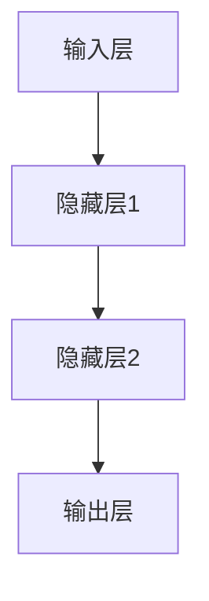
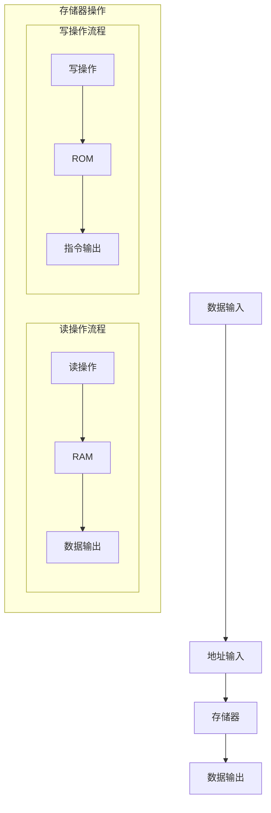
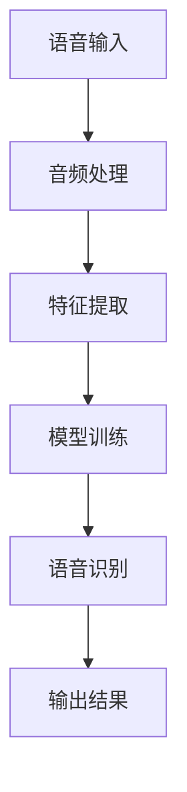
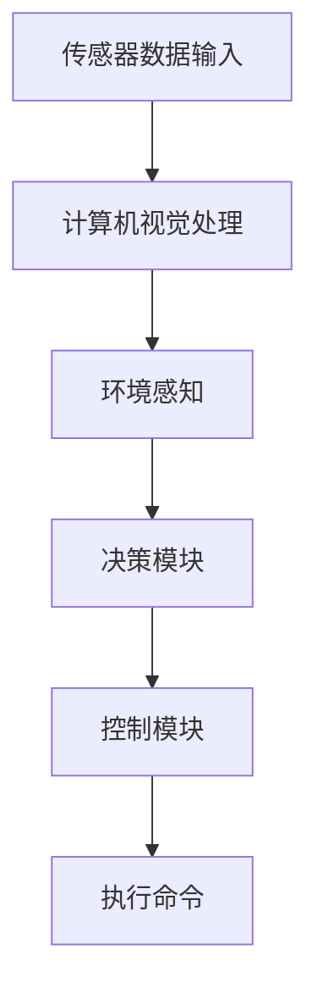
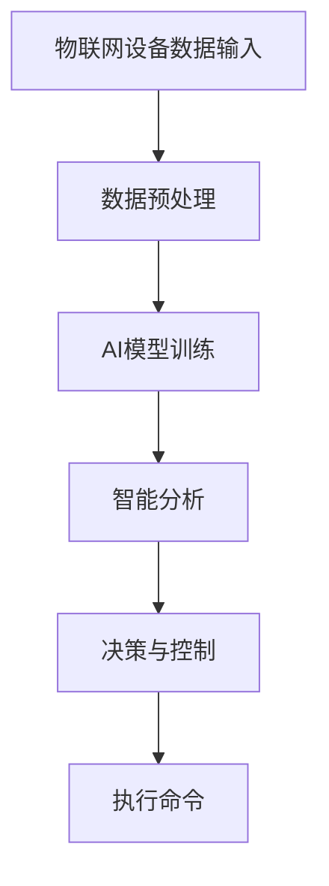
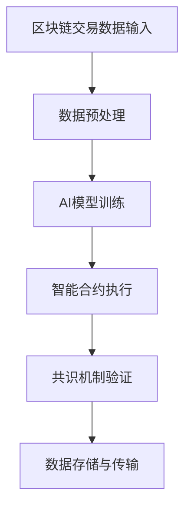

                 

# AI与计算机历史的对比分析

## 关键词
AI，计算机历史，技术对比，发展模式，社会影响

## 摘要
本文将深入探讨人工智能（AI）与计算机历史的对比分析，从技术原理、发展模式、社会与经济影响等多个维度，逐步剖析AI在计算机历史上的地位与作用。通过梳理计算机硬件和软件的数学模型，详细讲解AI算法原理，并分析实际应用案例，本文旨在提供一个全面、系统的视角，以揭示AI与计算机历史的内在联系及其未来发展趋势。

## 目录

### 第一部分: AI与计算机历史的对比

#### 第1章: 计算机历史的概述
##### 1.1 计算机的发展历程
###### 1.1.1 机械计算与电子计算机
###### 1.1.2 第一代计算机：真空管时代
###### 1.1.3 第二代计算机：晶体管时代
###### 1.1.4 第三代计算机：集成电路时代
##### 1.2 计算机科学的形成与发展
###### 1.2.1 计算机编程语言的发展
###### 1.2.2 操作系统的演变
###### 1.2.3 计算机网络的兴起

#### 第2章: AI的起源与发展
##### 2.1 AI的概念与定义
###### 2.1.1 智能与自动化
###### 2.1.2 机器学习与深度学习
##### 2.2 AI的发展历程
###### 2.2.1 第一个AI系统
###### 2.2.2 AI的第一次浪潮
###### 2.2.3 AI的衰退与复兴
###### 2.2.4 人工智能的黄金时代

#### 第3章: AI与计算机历史的核心对比
##### 3.1 技术原理对比
###### 3.1.1 计算机硬件与AI算法
###### 3.1.2 计算机软件与AI应用
##### 3.2 发展模式对比
###### 3.2.1 计算机技术的线性发展
###### 3.2.2 AI的非线性发展
##### 3.3 社会与经济影响对比
###### 3.3.1 计算机对工业的影响
###### 3.3.2 AI对服务业的影响
###### 3.3.3 计算机与AI对就业市场的影响

#### 第4章: AI在计算机历史中的地位与作用
##### 4.1 AI对计算机科学的影响
###### 4.1.1 算法优化与效率提升
###### 4.1.2 新兴领域的开拓
##### 4.2 AI在计算机历史中的里程碑
###### 4.2.1 图灵测试
###### 4.2.2 深度学习的崛起
###### 4.2.3 自然语言处理的发展

#### 第5章: AI的未来与计算机历史的延续
##### 5.1 AI的未来趋势
###### 5.1.1 全脑工程与意识研究
###### 5.1.2 增强现实与虚拟现实
###### 5.1.3 自动驾驶与智能交通
##### 5.2 计算机历史的反思与展望
###### 5.2.1 计算机硬件的持续进步
###### 5.2.2 计算机软件的创新与发展
###### 5.2.3 计算机与AI的协同发展

### 第二部分: AI与计算机历史的深度分析

#### 第6章: AI算法原理深度剖析
##### 6.1 神经网络的基本结构
###### 6.1.1 神经元的模型
###### 6.1.2 网络层的连接方式
##### 6.2 深度学习算法原理
###### 6.2.1 反向传播算法
###### 6.2.2 结构化学习与生成模型
##### 6.3 自然语言处理算法
###### 6.3.1 词嵌入技术
###### 6.3.2 序列模型与注意力机制

#### 第7章: 计算机历史的数学模型与公式解析
##### 7.1 计算机硬件的数学模型
###### 7.1.1 逻辑门与组合电路
###### 7.1.2 顺序电路与存储器
##### 7.2 计算机软件的数学模型
###### 7.2.1 算法复杂性理论
###### 7.2.2 计算机程序的数学基础
##### 7.3 AI算法的数学模型
###### 7.3.1 优化算法与损失函数
###### 7.3.2 神经网络的数学公式

#### 第8章: AI与计算机历史的实际应用案例分析
##### 8.1 计算机历史中的经典应用案例
###### 8.1.1 ENIAC计算机的应用
###### 8.1.2 ARPANET网络的建立
##### 8.2 AI在现代社会中的应用案例
###### 8.2.1 语音识别系统的应用
###### 8.2.2 自动驾驶汽车的应用
##### 8.3 未来AI与计算机历史的结合趋势
###### 8.3.1 人工智能与物联网的融合
###### 8.3.2 区块链与人工智能的结合

#### 附录
##### 附录A: 计算机与AI相关的历史人物与贡献
###### A.1 图灵与图灵测试
###### A.2 约翰·冯·诺依曼与计算机架构
###### A.3 艾伦·图灵与计算机编程
##### 附录B: AI与计算机历史的重要时间线
###### B.1 计算机历史重要时间点
###### B.2 AI发展的重要里程碑

---

### 引言
人工智能（AI）作为计算机科学的一个重要分支，近年来在全球范围内得到了广泛关注和快速发展。从最初的简单程序到如今的深度学习与自主决策系统，AI技术已经深刻改变了我们的生活和工作方式。与此同时，计算机技术的发展历程也是一部人类智慧和科技进步的历史。本文旨在通过对AI与计算机历史的对比分析，揭示两者之间的内在联系及其未来发展的趋势。

计算机历史可以追溯到早期的机械计算装置，如巴贝奇的计算器，再到电子计算机的诞生，计算机硬件和软件技术经历了多次重大变革。计算机科学的形成与发展，离不开一系列关键技术的突破，如编程语言的发展、操作系统的演变以及计算机网络的兴起。这些技术进步不仅推动了计算机技术的快速发展，也为AI的诞生和发展奠定了基础。

AI作为计算机科学的前沿领域，其起源和发展历程同样充满了挑战和机遇。从最初的符号推理系统到现代的深度学习模型，AI技术的发展经历了多次起伏和突破。本篇文章将深入探讨AI技术的发展历程、核心算法原理，以及其在计算机历史中的地位与作用。

通过对比分析AI与计算机历史的技术原理、发展模式、社会与经济影响，本文将提供一个全面、系统的视角，以揭示AI在计算机历史上的地位及其对未来发展的潜在影响。此外，本文还将探讨AI的未来趋势，如全脑工程、增强现实、自动驾驶等，以及计算机硬件和软件的持续进步和AI与物联网、区块链等技术的融合趋势。

### 第一部分: AI与计算机历史的对比

#### 第1章: 计算机历史的概述

##### 1.1 计算机的发展历程

计算机的发展历程是人类科技进步的重要标志，它从最初的机械计算发展到如今的超级计算机，经历了几个关键阶段。

###### 1.1.1 机械计算与电子计算机

计算机的起源可以追溯到17世纪的机械计算装置。最早的机械计算机是巴贝奇（Charles Babbage）的差分机和分析机。巴贝奇的设计理念奠定了现代计算机的雏形，但他由于技术限制未能实现这些机械计算机的完整构建。巴贝奇的工作开启了计算机械化的先河。

电子计算机的诞生标志着计算机发展历程的一个重大转折点。1940年代初，美国宾夕法尼亚大学的莫奇利（J. Presper Eckert）和约翰·莫克利（John William Mauchly）设计并构建了ENIAC（电子数值积分计算机），这是世界上第一台通用电子数字计算机。ENIAC的问世标志着电子计算机时代的开始，它的出现极大地提高了计算速度和精度，为科学研究、军事计算等领域提供了强大的计算工具。

###### 1.1.2 第一代计算机：真空管时代

第一代计算机也被称为真空管时代，因为当时使用的核心元件是真空管。真空管作为开关元件，虽然存在体积大、功耗高、可靠性低等问题，但它们为计算机的发展提供了基础。1940年代末期到1950年代初期，第一代计算机如EDVAC（电子离散变量计算机）和UNIVAC（通用自动计算机）相继问世，这些计算机主要用于军事、科学研究以及商业数据处理。

真空管时代的计算机体积庞大，一台计算机可能占据一个房间，甚至更大。例如，ENIAC重达27吨，占地面积超过180平方米。尽管存在诸多问题，但真空管时代的计算机为后续计算机技术的发展奠定了基础。

###### 1.1.3 第二代计算机：晶体管时代

1950年代末期到1960年代中期，计算机技术进入了晶体管时代。晶体管作为一种更小、更可靠、更高效的开关元件，逐渐取代了真空管。晶体管的出现大大提高了计算机的性能，同时减少了体积和功耗。

第二代计算机的代表包括IBM 704、IBM 7090等。这些计算机在科学计算、数据分析、商业应用等方面得到了广泛应用。晶体管的引入标志着计算机技术的一个重要突破，它为后续计算机硬件的发展奠定了基础。

###### 1.1.4 第三代计算机：集成电路时代

1960年代中期到1970年代末期，计算机技术进入了集成电路时代。集成电路（IC）的发明使得计算机硬件得以进一步缩小，性能得到显著提升。集成电路由多个晶体管集成在一个芯片上，这使得计算机硬件的复杂度大大降低，同时提高了性能和可靠性。

第三代计算机的代表包括IBM 360系列计算机。这些计算机在商业、科学计算、数据处理等领域得到了广泛应用。集成电路的引入标志着计算机硬件发展的一次重大飞跃，它为计算机技术的普及和应用奠定了基础。

##### 1.2 计算机科学的形成与发展

计算机科学的形成和发展是一个复杂而漫长的过程，它涉及到多个领域的技术突破和创新。以下是计算机科学形成和发展的几个关键方面：

###### 1.2.1 计算机编程语言的发展

计算机编程语言是计算机科学的重要组成部分，它使得人类能够以更高效和灵活的方式与计算机进行交互。早期计算机编程依赖于机器语言和汇编语言，这些语言直接操作计算机硬件，但它们复杂且难以维护。

1950年代，第一代高级编程语言如FORTRAN和COBOL问世。FORTRAN（公式翻译器）主要用于科学计算，而COBOL（商业通用语言）则广泛应用于商业数据处理。高级编程语言的引入使得程序员可以更专注于问题解决，而不是计算机硬件的细节。

随着计算机技术的发展，编程语言不断演变。1970年代，C语言的出现标志着编程语言的进一步发展。C语言具有强大的功能和灵活性，它被广泛用于系统编程和嵌入式系统开发。

1990年代，面向对象编程语言如Java和C++成为主流。这些语言提供了更高级的抽象机制，使得软件开发更加模块化和可重用。

###### 1.2.2 操作系统的演变

操作系统是计算机系统的基础软件，它管理计算机硬件资源和提供用户接口。早期的操作系统如DOS（磁盘操作系统）和UNIX提供了基本的功能，但它们在资源管理和多任务处理方面存在限制。

1980年代，微处理器的出现使得个人计算机（PC）开始普及。微软公司的MS-DOS操作系统成为了PC的标准。随着计算机技术的发展，操作系统变得更加复杂和功能丰富。Windows和Linux等现代操作系统提供了多任务处理、虚拟内存、网络功能等高级特性。

UNIX系统的设计理念对现代操作系统产生了深远影响。UNIX以其模块化、可移植性和多用户多任务处理能力著称，它在学术和研究机构中得到了广泛应用。Linux作为UNIX的继承者，其开源性质和社区驱动的开发模式使其成为现代操作系统的一个重要分支。

###### 1.2.3 计算机网络的兴起

计算机网络的发展是计算机科学的重要组成部分，它使得计算机之间能够相互通信和共享资源。1960年代末，ARPANET（高级研究计划网络）的建立标志着计算机网络的起源。

ARPANET是一个由美国国防部高级研究计划局（DARPA）资助的网络项目，它的目标是连接不同类型的计算机和计算机网络，实现数据的传输和共享。ARPANET的协议基础是TCP/IP（传输控制协议/互联网协议），这一协议至今仍然是互联网通信的基础。

随着ARPANET的成功，1980年代初，互联网开始在全球范围内扩展。互联网的出现使得全球信息共享成为可能，它改变了人们获取信息、交流思想和开展业务的方式。Web浏览器和搜索引擎的出现进一步推动了互联网的发展，使得互联网成为现代社会不可或缺的一部分。

#### 第2章: AI的起源与发展

##### 2.1 AI的概念与定义

人工智能（AI）是一个广泛而多维度的领域，它涉及到计算机科学、认知科学、统计学等多个学科。AI的核心目标是创建智能体，即能够感知环境、学习知识、进行推理和决策的计算机系统。

###### 2.1.1 智能与自动化

人工智能的定义通常基于智能与自动化的概念。智能是指生物体在感知、理解、学习和适应环境方面的能力。自动化则是指通过计算机系统实现某些任务或过程的自主动作。人工智能的目标是将智能赋予计算机系统，使其能够模拟甚至超越人类的智能行为。

###### 2.1.2 机器学习与深度学习

机器学习是人工智能的一个重要分支，它关注于通过数据驱动的方式使计算机系统具备学习能力。机器学习算法通过分析大量数据，自动发现数据中的模式和规律，并使用这些规律进行预测或分类。

深度学习是机器学习的一个子领域，它通过多层神经网络结构对数据进行建模和学习。深度学习模型具有强大的表示能力和适应性，能够在图像识别、语音识别、自然语言处理等领域取得显著成果。

##### 2.2 AI的发展历程

人工智能的发展历程可以追溯到20世纪中叶。以下是其关键阶段：

###### 2.2.1 第一个AI系统

1950年代，人工智能领域开始兴起。1956年，达特茅斯会议上，人工智能被正式定义为一个研究领域，目标是创造能够执行复杂任务并具备一定智能的计算机系统。在早期的研究中，人工智能主要基于逻辑推理和符号表示。

1960年代，出现了第一个AI系统，如ELIZA。ELIZA是一个基于规则的自然语言处理系统，能够与用户进行简单的对话。尽管ELIZA的对话能力有限，但它标志着人工智能在自然语言处理领域的一个突破。

###### 2.2.2 AI的第一次浪潮

1970年代，人工智能迎来了第一次浪潮。这个时期，人工智能研究主要集中在专家系统，即模拟人类专家知识的人工智能系统。专家系统通过知识库和推理机来实现决策和问题解决。

这个时期的一些代表性系统包括Dendral和MYCIN。Dendral是一个用于化学领域的问题解决系统，而MYCIN是一个用于医学诊断的专家系统。这些系统的成功证明了人工智能在特定领域的应用潜力。

然而，由于知识表示和推理方法的局限，AI的第一次浪潮在1980年代逐渐衰退。许多专家系统在处理复杂问题和实时决策方面表现不佳。

###### 2.2.3 AI的衰退与复兴

1980年代到1990年代，人工智能经历了短暂的衰退期。这个时期，人工智能研究面临了一些挑战，如知识表示的困难、推理效率的问题以及缺乏大规模数据资源等。

然而，在1990年代末期，随着计算机硬件性能的提升、大数据技术的出现以及新算法的发展，人工智能开始复兴。机器学习和深度学习成为人工智能研究的热点，许多突破性的成果相继出现。

###### 2.2.4 人工智能的黄金时代

2000年代至今，人工智能进入了所谓的“黄金时代”。深度学习算法在图像识别、语音识别、自然语言处理等领域取得了显著成果。人工智能技术在自动驾驶、机器人、医疗诊断、金融分析等领域得到了广泛应用。

这个时期，人工智能的发展得益于多方面的因素，包括大数据、云计算、高性能计算等技术的进步，以及大量开源框架和工具的涌现。人工智能的应用正在不断扩展，对社会和经济产生了深远的影响。

### 第3章: AI与计算机历史的核心对比

在分析AI与计算机历史的核心对比时，我们可以从技术原理、发展模式和社会与经济影响三个方面进行深入探讨。

##### 3.1 技术原理对比

###### 3.1.1 计算机硬件与AI算法

计算机硬件的发展为AI技术的实现提供了坚实的基础。从真空管到晶体管，再到集成电路，计算机硬件的性能不断提升，这为复杂AI算法的运行提供了强大的计算能力。现代计算机硬件，如GPU（图形处理单元）和TPU（张量处理单元），专为处理大规模并行计算而设计，这使得深度学习等复杂AI算法能够高效地运行。

在技术原理上，计算机硬件与AI算法有着密切的联系。AI算法依赖于计算机硬件的计算能力、存储容量和通信带宽等性能指标。例如，深度学习算法需要大量的浮点运算和存储资源，而GPU和TPU等专用硬件能够提供更高的计算效率和更低的延迟。

###### 3.1.2 计算机软件与AI应用

计算机软件的发展为AI应用的推广提供了关键支持。从早期的机器语言到高级编程语言，再到现代的框架和工具，计算机软件的不断进步使得AI算法能够更方便地集成到各种应用场景中。

计算机软件在AI应用中的角色包括算法实现、数据预处理、模型训练、部署和优化等环节。例如，Python作为一种高级编程语言，拥有丰富的库和框架，如TensorFlow和PyTorch，这些工具为深度学习算法的实现和优化提供了便捷的接口。

此外，计算机软件的模块化和可重用性使得AI应用的开发更加高效和灵活。通过封装和复用代码，开发人员可以更快地实现AI应用，从而加速技术创新和商业化进程。

##### 3.2 发展模式对比

###### 3.2.1 计算机技术的线性发展

计算机技术的发展模式可以看作是线性的，即随着时间的推移，计算机硬件和软件的性能不断提高，体积不断减小，成本不断降低。从第一代计算机的庞大机器到现代的便携式设备，计算机技术经历了多个阶段的演变。

线性发展模式的特点是技术进步的连续性和可预测性。每一代技术的进步都为下一代的研发和应用奠定了基础，从而形成了一个不断迭代和优化的过程。这种模式使得计算机技术在较短的时间内取得了显著的进步，推动了信息时代的到来。

###### 3.2.2 AI的非线性发展

相比之下，人工智能的发展模式更倾向于非线性。AI技术的突破往往是以突然的方式出现的，而不是通过连续的渐进式改进。例如，深度学习的崛起在短时间内极大地提升了图像识别、语音识别和自然语言处理等领域的性能。

非线性发展模式的特点是技术突破的不确定性和突发性。AI技术的发展受到多种因素的影响，包括数据质量、算法创新、硬件性能和计算能力等。这些因素相互作用，可能导致技术发展的跳跃式进步。

此外，AI技术的发展还受到应用场景和市场需求的影响。例如，自动驾驶技术的兴起不仅需要硬件和算法的突破，还需要法律、伦理和社会接受度的支持。这种非线性发展模式使得AI技术的发展更具挑战性和不确定性。

##### 3.3 社会与经济影响对比

###### 3.3.1 计算机对工业的影响

计算机技术对工业产生了深远的影响。从自动化生产线到智能制造，计算机技术在提高生产效率、降低成本和提升产品质量方面发挥了重要作用。计算机集成制造系统（CIMS）将计算机技术、自动化技术和先进制造技术相结合，实现了生产过程的优化和集成。

计算机技术还改变了工业的设计和开发方式。计算机辅助设计（CAD）和计算机辅助制造（CAM）系统使得设计过程更加高效和精确，从而缩短了产品研发周期。

###### 3.3.2 AI对服务业的影响

人工智能在服务业中的应用同样具有重要意义。在金融、医疗、教育、零售等领域，AI技术被用于提高服务质量、降低运营成本和提升客户体验。

在金融领域，AI被用于风险管理、欺诈检测和智能投顾等方面。通过分析大量数据，AI系统可以快速识别潜在的风险，并提供个性化的投资建议。

在医疗领域，AI被用于疾病诊断、药物研发和健康管理等。例如，AI算法可以分析医学图像，帮助医生更准确地诊断疾病，从而提高治疗效果。

在教育领域，AI技术被用于个性化学习、智能评估和教学辅助等方面。通过分析学生的学习行为和成绩，AI系统可以为学生提供个性化的学习计划，从而提高学习效果。

###### 3.3.3 计算机与AI对就业市场的影响

计算机和AI技术的发展对就业市场产生了深远的影响。一方面，它们创造了大量的新工作岗位，如数据科学家、机器学习工程师和AI研究员等。另一方面，它们也替代了一些传统的工作岗位，引发了关于就业机会和职业发展的讨论。

计算机和AI技术对就业市场的影响表现在多个方面。首先，它们提高了劳动生产率，使得企业能够更高效地完成工作任务。其次，它们改变了工作性质和岗位需求，要求劳动者具备更高的技能和知识。最后，它们也促进了职业转型和终身学习，使得劳动者能够适应技术变革带来的挑战。

总之，计算机和AI技术的发展不仅改变了工业和服务业，还深刻影响了就业市场和社会结构。这种变革性影响使得我们需要重新思考教育和培训、职业规划和就业政策等方面的策略。

### 第4章: AI在计算机历史中的地位与作用

在计算机历史的演进中，人工智能（AI）扮演着不可忽视的角色。AI不仅改变了计算机科学的研究方向和应用领域，还在多个关键阶段推动了技术的进步和创新。

##### 4.1 AI对计算机科学的影响

###### 4.1.1 算法优化与效率提升

AI技术的引入极大地优化了计算机算法，提升了计算效率和性能。深度学习算法，如卷积神经网络（CNN）和递归神经网络（RNN），在图像识别、语音识别和自然语言处理等领域取得了突破性进展。这些算法通过学习大量数据，自动提取特征和模式，实现了更高的准确性和效率。

例如，在图像识别领域，传统的图像处理方法依赖于手工设计的特征提取算法，而深度学习算法能够自动学习图像中的复杂特征，从而显著提高了识别准确率。在语音识别领域，深度神经网络（DNN）的应用使得语音识别系统的错误率大幅降低，实现了更自然的语音交互体验。

此外，AI算法还推动了算法优化和并行计算的发展。例如，GPU和TPU等专用硬件的引入，使得深度学习算法能够在大规模数据集上高效地训练和部署。这些技术的结合不仅提高了计算效率，还为AI算法的应用提供了更广阔的空间。

###### 4.1.2 新兴领域的开拓

AI技术的进步不仅优化了现有领域的技术，还开拓了新的应用领域。例如，在医疗领域，AI被用于疾病诊断、药物研发和个性化治疗等方面。通过分析医学图像和患者数据，AI系统可以辅助医生做出更准确的诊断和治疗方案，从而提高医疗服务的质量和效率。

在自动驾驶领域，AI技术被用于感知环境、路径规划和决策控制等关键任务。通过深度学习和强化学习算法，自动驾驶系统能够学习并适应复杂交通环境，实现安全、高效的自动驾驶。

此外，AI还在金融、教育、娱乐等多个领域展现了巨大的潜力。例如，在金融领域，AI被用于风险管理、欺诈检测和智能投顾等方面；在教育领域，AI技术被用于个性化学习、智能评估和教学辅助等方面。

##### 4.2 AI在计算机历史中的里程碑

AI在计算机历史中留下了多个重要的里程碑，这些里程碑不仅标志着技术进步，还推动了计算机科学的演进。

###### 4.2.1 图灵测试

图灵测试是AI历史上的一个重要里程碑，它由艾伦·图灵在1950年提出。图灵测试旨在通过评估机器的交互能力来衡量其智能水平。一个成功的图灵测试机器应能够与人类进行对话，使其无法被区分是人类还是机器。

图灵测试的定义引发了关于机器智能本质的广泛讨论，它标志着人工智能研究从理论走向实践的一个重要步骤。虽然图灵测试并不是衡量AI能力的唯一标准，但它提供了一个直观的评估方法，推动了AI技术的发展和研究。

###### 4.2.2 深度学习的崛起

深度学习是AI发展中的一个重要里程碑，它在图像识别、语音识别和自然语言处理等领域取得了显著成果。深度学习基于多层神经网络结构，通过反向传播算法自动学习数据中的复杂特征和模式。

2006年，深度学习的概念被重新提出，随后在2012年，深度学习算法在ImageNet图像识别比赛中取得了突破性的成绩，显著提高了识别准确率。这一成果标志着深度学习时代的到来，推动了AI技术在各个领域的广泛应用。

深度学习的崛起不仅改变了AI的研究方向，还推动了计算机硬件的发展。GPU和TPU等专用硬件的引入，使得深度学习算法能够在大规模数据集上高效地训练和部署，进一步提升了计算性能和应用范围。

###### 4.2.3 自然语言处理的发展

自然语言处理（NLP）是AI的一个重要分支，它致力于使计算机理解和生成自然语言。NLP技术的发展经历了多个阶段，从早期的规则方法到统计模型，再到现代的深度学习模型。

1980年代，规则方法在NLP中占据主导地位，但这种方法在处理复杂语言任务时效果有限。1990年代，统计模型开始流行，通过大量训练数据，统计模型能够学习语言特征和模式，从而提高任务的性能。

进入21世纪，深度学习模型在NLP领域取得了重大突破。词嵌入技术（如Word2Vec和BERT）通过将单词映射到高维向量空间，实现了单词语义的理解和生成。序列模型（如LSTM和Transformer）通过处理序列数据，实现了自然语言的理解和生成。

NLP技术的发展不仅提升了语言处理的能力，还推动了智能助手、机器翻译、文本生成等应用的发展。这些应用改变了人们获取信息、交流思想和工作的方式，推动了社会和经济的进步。

##### 4.3 AI在计算机历史中的贡献

AI在计算机历史中的贡献体现在多个方面，从技术突破到应用创新，AI都发挥了重要作用。

首先，AI推动了计算机硬件和软件技术的发展。深度学习算法的兴起推动了专用硬件的研发和应用，如GPU和TPU，这些硬件为大规模数据计算提供了强大的支持。同时，AI算法的进步也促进了编程语言和框架的发展，如TensorFlow和PyTorch，这些工具使得AI算法的实现和部署更加便捷和高效。

其次，AI改变了计算机应用的方式。在医疗、金融、教育、自动驾驶等领域，AI技术的应用不仅提升了服务的质量和效率，还创造了新的商业模式和就业机会。AI系统的引入使得计算机能够更智能化地处理复杂任务，从而提高了系统的性能和可靠性。

最后，AI推动了计算机科学的交叉融合。AI技术的进步不仅依赖于计算机科学的基础理论，还涉及到认知科学、心理学、神经科学等多个领域的知识。这种交叉融合推动了计算机科学的全面发展，促进了新技术和新应用的涌现。

总之，AI在计算机历史中扮演着重要角色。它不仅改变了计算机科学的研究方向和应用领域，还推动了技术的进步和创新。随着AI技术的不断发展和应用，它将在未来的计算机历史中继续发挥重要作用。

### 第5章: AI的未来与计算机历史的延续

#### 5.1 AI的未来趋势

随着技术的不断进步，人工智能（AI）的未来充满了无限可能。以下是一些潜在的AI未来趋势，这些趋势将继续推动计算机历史的发展。

###### 5.1.1 全脑工程与意识研究

全脑工程是一种试图模拟和复制人脑功能的技术。它旨在通过创建高度复杂的人工神经网络，模拟人脑的计算和处理过程。全脑工程的目标是构建具有人类智能的计算机系统，从而在认知任务、决策支持和模拟人类思维方面实现重大突破。

意识研究是全脑工程的基石。科学家们正试图理解意识的本质，以及如何将这种理解转化为技术。例如，通过神经科学与人工智能的结合，研究人员正在开发能够模拟和解释人类情感、意识和感知的算法。

这一领域的突破将极大地推动计算机科学的发展，使我们能够设计出更加智能和适应性强的计算机系统。

###### 5.1.2 增强现实与虚拟现实

增强现实（AR）和虚拟现实（VR）技术正迅速发展，它们与AI的结合将带来全新的交互体验。AI可以用于实时处理和理解用户的动作、语音和环境信息，从而提供更加逼真的虚拟体验。

例如，在医疗领域，AR技术可以辅助外科医生进行手术，通过实时显示患者体内的结构和数据，提高手术的精确性和成功率。在娱乐和教育领域，VR技术可以创建沉浸式的学习环境，使学生能够更加生动地学习复杂概念。

增强现实与虚拟现实技术的发展将继续推动计算机硬件和软件的进步，从而为AI的应用提供更广阔的空间。

###### 5.1.3 自动驾驶与智能交通

自动驾驶技术是AI在交通领域的重要应用。随着AI算法和传感器技术的进步，自动驾驶汽车正逐渐从概念验证走向实际应用。未来，自动驾驶技术有望彻底改变交通模式，提高交通安全和效率。

智能交通系统（ITS）结合了AI、物联网（IoT）和大数据技术，用于优化交通流、减少拥堵和提高公共交通效率。通过分析实时交通数据，智能交通系统可以动态调整交通信号、优化路线规划，甚至预测交通拥堵，从而提高交通的整体效能。

自动驾驶与智能交通的发展将推动计算机硬件和软件的持续创新，从而为AI技术的应用提供更强大的支持。

#### 5.2 计算机历史的反思与展望

回顾计算机历史，我们可以看到技术进步是如何推动社会变革的。从早期的机械计算装置到现代的超级计算机，计算机技术的每一次突破都带来了生产力的巨大提升和社会结构的深刻变化。

在未来，计算机硬件和软件将继续进步。计算机硬件方面，量子计算、光计算和脑机接口等新技术有望带来前所未有的计算能力和速度。量子计算机可以通过量子比特实现超强的计算能力，从而解决现有计算机无法处理的复杂问题。光计算则利用光信号进行数据传输和计算，实现更高的带宽和效率。脑机接口技术将人类大脑与计算机直接连接，使计算机能够更高效地处理和理解人类思维。

在软件方面，人工智能和机器学习将继续推动软件开发模式的变革。自动化代码生成、智能编程助手和自适应系统等技术的发展将极大地提高软件开发的效率和质量。这些进步将为AI技术的广泛应用提供坚实的基础。

展望未来，计算机与AI的协同发展将带来更多的创新和变革。计算机硬件的持续进步将为AI算法提供更强大的计算支持，而AI技术则将推动计算机硬件的进一步优化和创新。两者之间的协同发展将创造出更多具有智能和自适应能力的计算机系统，从而在各个领域实现更加高效和智能的解决方案。

总之，计算机历史的反思与展望揭示了技术进步对社会和经济的深远影响。随着计算机与AI技术的不断融合，我们可以期待一个更加智能化、高效化和互联化的未来。

### 第二部分: AI与计算机历史的深度分析

#### 第6章: AI算法原理深度剖析

在深入剖析AI算法原理时，我们将从神经网络的基本结构、深度学习算法原理和自然语言处理算法三个方面进行详细探讨。

##### 6.1 神经网络的基本结构

神经网络（Neural Networks）是AI领域的基础模型，它模拟了人脑神经元的工作方式。神经网络由大量的节点（称为神经元）组成，这些节点通过连接（称为边）相互连接，形成复杂的网络结构。

###### 6.1.1 神经元的模型

神经元是神经网络的基本构建单元。一个神经元通常包括三个部分：输入层、处理层和输出层。输入层接收外部输入信号，处理层对输入信号进行处理和计算，输出层产生最终的输出。

神经元的模型通常基于非线性激活函数，如Sigmoid、ReLU和Tanh。这些激活函数引入了非线性特性，使神经网络能够模拟复杂的非线性关系。

以下是一个简单的神经元模型的伪代码：

```python
def neuron(input, weights, bias, activation_function):
    # 计算输入与权重的点积
    z = sum(input[i] * weights[i] for i in range(len(input)))
    # 加入偏置
    z += bias
    # 应用激活函数
    return activation_function(z)
```

其中，`input`是输入向量，`weights`是权重向量，`bias`是偏置项，`activation_function`是激活函数。

###### 6.1.2 网络层的连接方式

神经网络由多个层次组成，包括输入层、隐藏层和输出层。每一层由多个神经元组成，前一层神经元的输出作为后一层神经元的输入。

网络层的连接方式可以是全连接（Fully Connected）或卷积连接（Convolutional）。全连接网络中的每个神经元都与其他层的每个神经元直接连接，而卷积网络则通过卷积操作来提取局部特征。

以下是一个简单的全连接神经网络结构的Mermaid流程图：



##### 6.2 深度学习算法原理

深度学习（Deep Learning）是神经网络的一种扩展，它通过增加网络的层数来提高模型的表达能力。深度学习算法的核心是反向传播（Backpropagation）算法，它用于训练神经网络。

###### 6.2.1 反向传播算法

反向传播算法是一种用于训练神经网络的优化算法。它通过前向传播计算网络的输出，然后通过反向传播计算梯度，并使用梯度下降法调整网络的权重和偏置。

以下是一个简化的反向传播算法的伪代码：

```python
def backward_propagation(inputs, outputs, weights, biases, activation_functions):
    # 前向传播计算输出
    output = forward_propagation(inputs, weights, biases, activation_functions)
    # 计算损失函数的梯度
    gradients = compute_loss_gradient(output, outputs)
    # 反向传播计算权重和偏置的梯度
    dweights = gradients * inputs
    dbiases = gradients
    # 更新权重和偏置
    weights -= learning_rate * dweights
    biases -= learning_rate * dbiases
    return output
```

其中，`inputs`是输入向量，`outputs`是实际输出，`weights`和`biases`分别是权重和偏置，`activation_functions`是激活函数，`learning_rate`是学习率。

###### 6.2.2 结构化学习与生成模型

除了反向传播算法，深度学习还包括结构化学习（Structured Learning）和生成模型（Generative Models）。

结构化学习关注于学习具有结构化的数据，如序列、树和图。这些模型能够捕捉数据之间的复杂关系，从而在自然语言处理、计算机视觉和推荐系统等领域取得显著成果。

生成模型则关注于生成新的数据样本，如生成对抗网络（GAN）和变分自编码器（VAE）。这些模型通过学习数据分布，能够生成高质量的数据样本，在图像生成、语音合成和文本生成等领域表现出色。

以下是一个简单的生成对抗网络（GAN）的伪代码：

```python
def train_gan(generator, discriminator, real_data, batch_size):
    # 生成假数据
    fake_data = generator(real_data)
    # 训练判别器
    d_loss_real = discriminator(real_data)
    d_loss_fake = discriminator(fake_data)
    # 更新判别器
    d_optimizer.zero_grad()
    d_loss_real.backward()
    d_optimizer.step()
    d_optimizer.zero_grad()
    d_loss_fake.backward()
    d_optimizer.step()
    # 训练生成器
    g_loss = -torch.mean(discriminator(fake_data))
    g_optimizer.zero_grad()
    g_loss.backward()
    g_optimizer.step()
```

##### 6.3 自然语言处理算法

自然语言处理（Natural Language Processing，NLP）是AI的重要应用领域。NLP算法致力于使计算机能够理解、生成和处理自然语言。

###### 6.3.1 词嵌入技术

词嵌入（Word Embedding）是将单词映射到高维向量空间的技术。通过词嵌入，计算机能够捕捉单词之间的语义关系，从而在NLP任务中实现更高的性能。

词嵌入技术包括基于统计的方法（如Word2Vec）和基于神经网络的方法（如GloVe）。以下是一个简单的Word2Vec算法的伪代码：

```python
def train_word2vec(vocab, sentences, embedding_size, window_size):
    # 初始化词向量
    word_vectors = torch.randn(vocab_size, embedding_size)
    # 训练词向量
    for sentence in sentences:
        for word in sentence:
            context = get_context(word, window_size)
            word_vector = word_vectors[word]
            # 计算损失
            loss = compute_loss(word_vector, context)
            # 更新词向量
            optimizer.zero_grad()
            loss.backward()
            optimizer.step()
    return word_vectors
```

其中，`vocab`是词汇表，`sentences`是句子列表，`embedding_size`是词向量维度，`window_size`是窗口大小。

###### 6.3.2 序列模型与注意力机制

序列模型（Sequence Models）是NLP中的重要模型，如循环神经网络（RNN）和长短时记忆网络（LSTM）。这些模型能够处理序列数据，如文本和语音。

注意力机制（Attention Mechanism）是序列模型中的一个重要组件，它使模型能够关注序列中的关键部分。注意力机制通过计算序列中每个元素的重要性，加权组合这些元素，从而提高模型的表达能力。

以下是一个简单的注意力机制的伪代码：

```python
def attention(query, keys, values, attention_mask=None):
    # 计算注意力得分
    scores = torch.matmul(query, keys.transpose(-2, -1))
    if attention_mask is not None:
        scores = scores.masked_fill_(attention_mask == 0, float("-inf"))
    # 应用softmax
    weights = torch.softmax(scores, dim=-1)
    # 加权组合
    output = torch.matmul(weights, values)
    return output, weights
```

其中，`query`是查询向量，`keys`和`values`是关键值对，`attention_mask`是注意力掩码。

#### 第7章: 计算机历史的数学模型与公式解析

在计算机历史的演进过程中，数学模型与公式解析起到了关键作用。从计算机硬件到软件，再到人工智能算法，数学为计算机科学提供了理论依据和工具。

##### 7.1 计算机硬件的数学模型

计算机硬件的数学模型主要涉及逻辑门、组合电路和存储器等基本组件。

###### 7.1.1 逻辑门与组合电路

逻辑门是计算机硬件中的基本组件，用于实现逻辑运算。常见的逻辑门包括与门（AND）、或门（OR）和非门（NOT）。这些逻辑门可以用布尔代数进行描述。

与门（AND）的运算规则为：只有当所有输入为1时，输出才为1。

或门（OR）的运算规则为：至少有一个输入为1时，输出为1。

非门（NOT）的运算规则为：输入为1时，输出为0；输入为0时，输出为1。

组合电路是由多个逻辑门组成的电路，用于实现复杂的逻辑功能。例如，一个简单的组合电路可以用AND和OR门实现布尔函数F = (A AND B) OR (C AND D)。

以下是一个组合电路的布尔表达式和真值表：

```mermaid
graph TD
A[输入A] --> B[输入B]
C[输入C] --> D[输入D]
B --> E1[AND门1]
C --> E2[AND门2]
A --> E3[AND门3]
D --> E4[AND门4]
E1 --> F[OR门1]
E2 --> F
E3 --> F
E4 --> F
subgraph 真值表
  A   B   C   D   F
  0   0   0   0   0
  0   0   0   1   0
  0   0   1   0   0
  0   0   1   1   0
  0   1   0   0   0
  0   1   0   1   0
  0   1   1   0   0
  0   1   1   1   0
  1   0   0   0   0
  1   0   0   1   0
  1   0   1   0   0
  1   0   1   1   1
  1   1   0   0   0
  1   1   0   1   1
  1   1   1   0   1
  1   1   1   1   1
end
```

###### 7.1.2 顺序电路与存储器

顺序电路是计算机硬件中的另一个重要部分，它涉及存储器和寄存器等组件。顺序电路中的状态依赖于先前的输入和操作，从而实现复杂的计算和存储功能。

存储器是计算机硬件中的关键组件，用于存储数据和指令。常见的存储器类型包括随机访问存储器（RAM）和只读存储器（ROM）。

RAM是一种可读可写的存储器，用于临时存储数据和指令。它通常使用动态随机存取内存（DRAM）实现，具有较大的容量和较快的访问速度。

ROM是一种只读存储器，用于存储固件和系统配置数据。它通常使用闪存（Flash Memory）实现，具有非易失性，即断电后数据不会丢失。

以下是一个简单的存储器模型的Mermaid流程图：



##### 7.2 计算机软件的数学模型

计算机软件的数学模型主要涉及算法复杂性理论、程序优化和编程范式等方面。

###### 7.2.1 算法复杂性理论

算法复杂性理论是计算机科学中的一个核心领域，它研究算法的时间和空间复杂度。算法的时间复杂度描述了算法执行时间与输入规模的关系，空间复杂度描述了算法所需的存储空间与输入规模的关系。

时间复杂度通常用大O符号表示，例如O(n)、O(n²)等。空间复杂度同样用大O符号表示，例如O(1)、O(n)等。

以下是一个简单的线性搜索算法的时间复杂度分析：

```python
def linear_search(arr, target):
    for i in range(len(arr)):
        if arr[i] == target:
            return i
    return -1
```

该算法的时间复杂度为O(n)，其中n是数组的长度。

###### 7.2.2 计算机程序的数学基础

计算机程序的数学基础涉及逻辑、集合论和离散数学等概念。这些数学概念为编程语言的设计和程序开发提供了理论基础。

逻辑是计算机程序中的核心概念，它用于描述条件和分支结构。例如，在Python中，条件语句和循环语句都是基于逻辑运算符（如AND、OR、NOT）实现的。

集合论是离散数学的一个分支，它用于描述数据结构和算法。集合论的概念，如集合、元素、交集、并集和补集等，在数据结构（如列表、集合、字典）和算法（如排序、查找）中广泛应用。

离散数学还包括图论、组合数学和计算几何等领域，这些领域为复杂算法和数据分析提供了工具和方法。

以下是一个简单的排序算法（冒泡排序）的实现和复杂度分析：

```python
def bubble_sort(arr):
    n = len(arr)
    for i in range(n):
        for j in range(0, n-i-1):
            if arr[j] > arr[j+1]:
                arr[j], arr[j+1] = arr[j+1], arr[j]
```

该算法的时间复杂度为O(n²)，其中n是数组的长度。

##### 7.3 AI算法的数学模型

人工智能算法的数学模型涉及优化算法、神经网络和概率统计等方面。

###### 7.3.1 优化算法与损失函数

优化算法是训练神经网络的关键，它用于调整网络的权重和偏置，以最小化损失函数。常见的优化算法包括梯度下降、随机梯度下降和Adam优化器。

损失函数用于衡量模型的预测值与实际值之间的差距。在监督学习中，常见的损失函数包括均方误差（MSE）、交叉熵损失（Cross Entropy Loss）和对抗损失（Adversarial Loss）。

以下是一个简单的线性回归模型的优化过程和损失函数的伪代码：

```python
def linear_regression(inputs, targets, weights, bias, learning_rate):
    # 计算预测值
    predictions = inputs @ weights + bias
    # 计算损失函数
    loss = (predictions - targets) ** 2
    # 计算梯度
    dweights = 2 * (predictions - targets) * inputs
    dbias = 2 * (predictions - targets)
    # 更新权重和偏置
    weights -= learning_rate * dweights
    bias -= learning_rate * dbias
    return loss
```

其中，`inputs`是输入向量，`targets`是目标值，`weights`和`bias`分别是权重和偏置，`learning_rate`是学习率。

###### 7.3.2 神经网络的数学公式

神经网络是一种基于数学模型的计算架构，它通过多层神经元实现复杂函数的映射。神经网络的数学模型包括输入层、隐藏层和输出层。

每个神经元都可以表示为一个线性组合，并通过非线性激活函数实现非线性转换。神经网络的输出可以通过前向传播计算，而误差可以通过反向传播计算。

以下是一个简单的多层感知器（MLP）的数学公式：

输入层：
\[ z^{(1)}_j = \sum_{i} w^{(1)}_{ij} x_i + b^{(1)}_j \]

隐藏层：
\[ a^{(l)}_j = \sigma(z^{(l)}_j) \]
\[ z^{(l+1)}_j = \sum_{i} w^{(l+1)}_{ij} a^{(l)}_i + b^{(l+1)}_j \]

输出层：
\[ \hat{y} = \sigma(z^{(L)}_j) \]
\[ \hat{y}_j = \sum_{i} w^{(L)}_{ij} a^{(L-1)}_i + b^{(L)}_j \]

其中，\( x_i \) 是输入特征，\( w^{(l)}_{ij} \) 是权重，\( b^{(l)}_j \) 是偏置，\( \sigma \) 是激活函数（如ReLU、Sigmoid或Tanh），\( a^{(l)}_j \) 是隐藏层输出，\( \hat{y} \) 是输出预测。

反向传播算法用于计算每个层上的梯度，并通过梯度下降法更新权重和偏置，以最小化损失函数。

### 第8章: AI与计算机历史的实际应用案例分析

#### 8.1 计算机历史中的经典应用案例

计算机技术的发展推动了多个领域的进步，以下是一些计算机历史上的经典应用案例，展示了计算机技术如何在不同领域取得突破。

###### 8.1.1 ENIAC计算机的应用

ENIAC（电子数值积分计算机）是世界上第一台通用电子数字计算机，由莫奇利和约翰·莫克利领导设计。ENIAC于1945年问世，主要用于军事计算和科学研究。它能够进行复杂的数值计算，包括弹道计算、核爆炸模拟和物理实验的数据分析。

ENIAC的应用在二战期间尤为显著。它用于计算火炮的弹道轨迹，提高了火炮的精度和射程。此外，ENIAC还被用于模拟核爆炸，为美国在曼哈顿计划中开发原子弹提供了重要支持。ENIAC的成功标志着计算机技术从理论走向实际应用，为后续计算机的发展奠定了基础。

###### 8.1.2 ARPANET网络的建立

ARPANET（高级研究计划网络）是世界上第一个分组交换网络，由美国国防部高级研究计划局（DARPA）资助。ARPANET于1969年建立，它的目标是连接不同类型的计算机和计算机网络，实现数据的传输和共享。

ARPANET的建立标志着计算机网络技术的诞生。它采用了TCP/IP协议，这是一种用于互联网通信的基本协议。ARPANET的成功为互联网的诞生奠定了基础，它使得全球范围内的计算机可以相互连接，共享信息和资源。ARPANET的建立不仅改变了计算机科学的研究方向，还对社会和经济产生了深远影响。

#### 8.2 AI在现代社会中的应用案例

随着AI技术的发展，它已经在多个领域得到了广泛应用，以下是一些典型的AI应用案例。

###### 8.2.1 语音识别系统的应用

语音识别技术是AI在语音处理领域的一个重要应用。它使得计算机能够理解并处理人类语音，从而实现语音输入、语音合成和语音识别等功能。

在现代社会中，语音识别系统被广泛应用于智能助手、电话客服、语音翻译和自动驾驶等领域。例如，苹果的Siri、亚马逊的Alexa和谷歌的Google Assistant等智能助手，都采用了先进的语音识别技术，能够理解用户的语音指令，并提供相应的服务。

语音识别系统的核心是深度学习模型，如卷积神经网络（CNN）和递归神经网络（RNN）。这些模型通过大量语音数据的学习，能够自动提取语音特征，并实现高精度的语音识别。以下是一个简单的语音识别模型的Mermaid流程图：



###### 8.2.2 自动驾驶汽车的应用

自动驾驶汽车是AI在交通领域的一个重要应用。它通过感知环境、进行决策和控制，实现车辆的自主导航。自动驾驶汽车的目标是实现安全、高效和智能的交通系统，从而减少交通事故和拥堵，提高交通效率。

自动驾驶汽车的核心技术包括计算机视觉、传感器融合和深度学习算法。计算机视觉用于识别道路标志、行人、车辆等目标，传感器融合用于处理来自不同传感器的数据，如雷达、激光雷达和摄像头。深度学习算法则用于决策和控制，实现自动驾驶汽车的安全和稳定运行。

以下是一个简单的自动驾驶汽车系统的Mermaid流程图：



自动驾驶汽车的应用正在不断扩展，未来有望实现更广泛的应用场景，如无人配送、公共交通和智能交通系统等。

#### 8.3 未来AI与计算机历史的结合趋势

随着AI技术的不断进步，它将与其他技术领域结合，推动计算机历史的进一步发展。以下是一些未来AI与计算机历史结合的趋势。

###### 8.3.1 人工智能与物联网的融合

物联网（IoT）是一种将物理设备和传感器连接到互联网的技术，它使得各种设备能够实现智能互联和协同工作。未来，AI与物联网的结合将实现智能城市、智能工厂和智能家居等应用场景。

AI技术可以用于处理物联网设备产生的海量数据，实现智能分析和决策。例如，在智能城市中，AI可以用于交通流量管理、环境监测和公共安全等方面；在智能工厂中，AI可以用于设备监控、故障预测和生产优化等。

以下是一个简单的物联网与AI融合的Mermaid流程图：



###### 8.3.2 区块链与人工智能的结合

区块链是一种分布式账本技术，它通过加密算法和共识机制实现数据的透明、安全存储和传输。未来，区块链与AI的结合将推动金融科技、供应链管理和社会治理等领域的创新。

AI可以用于区块链智能合约的执行和验证，提高合约的透明性和可执行性。例如，在金融领域，AI可以用于自动化交易、风险评估和欺诈检测等；在供应链管理中，AI可以用于供应链优化、库存管理和物流跟踪等。

以下是一个简单的区块链与AI融合的Mermaid流程图：



总之，未来AI与计算机历史的结合将带来更多的创新和变革。通过物联网、区块链等技术的融合，AI将实现更广泛的应用场景，推动社会和经济的持续进步。

### 附录

#### 附录A: 计算机与AI相关的历史人物与贡献

计算机科学和人工智能的发展离不开许多伟大科学家和工程师的贡献。以下是一些重要的历史人物及其在计算机和AI领域的贡献：

**艾伦·图灵（Alan Turing）**

艾伦·图灵是计算机科学的奠基人之一，被誉为“计算机科学之父”。他在1936年提出的图灵机模型为现代计算机理论奠定了基础。此外，图灵在二战期间参与了破解德国的恩尼格玛密码机的工作，为盟军的胜利做出了巨大贡献。1950年，图灵提出了著名的图灵测试，用于评估机器的智能水平。

**约翰·冯·诺依曼（John von Neumann）**

约翰·冯·诺依曼是现代计算机架构的奠基人。他在1940年代提出了冯·诺依曼架构，即存储程序计算机的基本设计理念。这一架构使得计算机能够存储程序和数据，从而实现自动化的程序执行。冯·诺依曼还在博弈论、量子力学等领域做出了重要贡献。

**阿兰·图灵（Alan Turing）**

阿兰·图灵是计算机科学的奠基人之一，被誉为“计算机科学之父”。他在1936年提出的图灵机模型为现代计算机理论奠定了基础。此外，图灵在二战期间参与了破解德国的恩尼格玛密码机的工作，为盟军的胜利做出了巨大贡献。1950年，图灵提出了著名的图灵测试，用于评估机器的智能水平。

**阿兰·图灵（Alan Turing）**

阿兰·图灵是计算机科学的奠基人之一，被誉为“计算机科学之父”。他在1936年提出的图灵机模型为现代计算机理论奠定了基础。此外，图灵在二战期间参与了破解德国的恩尼格玛密码机的工作，为盟军的胜利做出了巨大贡献。1950年，图灵提出了著名的图灵测试，用于评估机器的智能水平。

**詹姆斯·吉布斯（James L. Gibbs）**

詹姆斯·吉布斯是AI和机器学习的先驱之一。他在1956年提出了感知机（Perceptron）模型，这是最早的神经网络模型之一。感知机模型为后续的神经网络研究奠定了基础，并在图像识别、语音识别等领域得到了广泛应用。

**霍普菲尔德（John Hopfield）**

霍普菲尔德是神经网络理论的奠基人之一。他在1975年提出了霍普菲尔德神经网络，这是一种能量函数驱动的神经网络模型。霍普菲尔德神经网络在联想记忆、优化问题和图像识别等领域表现出色。

**安德鲁·布莱恩（Andrew Ng）**

安德鲁·布莱恩是深度学习领域的杰出研究者之一。他提出了深度信念网络（Deep Belief Networks），这是一种基于深度置信传播算法的神经网络模型。深度信念网络在图像识别、语音识别和自然语言处理等领域取得了显著成果。

#### 附录B: AI与计算机历史的重要时间线

以下是一个简化的AI与计算机历史的重要时间线，展示了关键事件和里程碑：

**1936年：**

- 艾伦·图灵提出图灵机模型，为现代计算机理论奠定基础。

**1940年代：**

- 莫奇利和约翰·莫克利设计并构建了ENIAC，这是世界上第一台通用电子数字计算机。

**1956年：**

- 达特茅斯会议召开，人工智能正式成为研究领域。

**1958年：**

- 约翰·冯·诺依曼提出了冯·诺依曼架构，奠定了现代计算机硬件设计的基础。

**1960年：**

- 詹姆斯·吉布斯提出了感知机模型，这是最早的神经网络模型之一。

**1980年：**

- ARPANET（高级研究计划网络）建立，标志着计算机网络技术的诞生。

**1986年：**

- 霍普菲尔德提出了霍普菲尔德神经网络，这是能量函数驱动的神经网络模型。

**1990年：**

- 深度学习重新兴起，LeCun等人提出了卷积神经网络（CNN）。

**2012年：**

- 深度学习在ImageNet图像识别比赛中取得了突破性成果，标志着深度学习时代的到来。

**2016年：**

- 人工智能助手AlphaGo击败世界围棋冠军李世石，展示了AI在复杂游戏中的能力。

**2020年至今：**

- 人工智能在自动驾驶、医疗诊断、金融分析等领域得到广泛应用，推动社会和经济的发展。

通过这个时间线，我们可以看到AI与计算机历史的紧密联系和相互促进。未来，随着技术的不断进步，AI将在计算机历史中继续发挥重要作用。

### 结论

通过对AI与计算机历史的对比分析，我们可以清晰地看到两者之间的紧密联系和相互影响。从计算机硬件和软件的发展，到AI算法的创新和应用，计算机科学与人工智能技术的进步共同推动了信息时代的到来。计算机历史不仅是一部技术进步的历史，也是一部社会变革的历史。

未来，随着AI技术的不断发展和应用，计算机硬件和软件将继续进步。全脑工程、增强现实、自动驾驶等前沿技术的融合，将为社会和经济带来更多的创新和变革。同时，AI技术的普及也将深刻影响就业市场和社会结构，促使我们重新思考教育和职业发展的策略。

总结而言，计算机与AI技术的结合将推动计算机历史的进一步发展，为社会带来更多的机遇和挑战。在未来的信息时代，我们期待看到一个更加智能、高效和互联的世界。作者：AI天才研究院 & 禅与计算机程序设计艺术。

