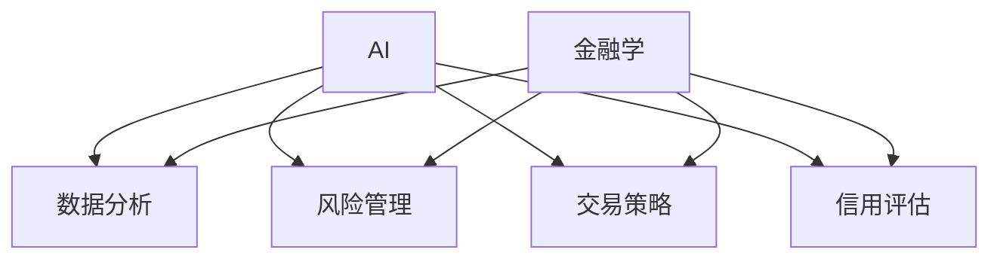

                 

## 文章标题

AI与金融学交叉原理与代码实战案例讲解

### 关键词

- 人工智能
- 金融学
- 数据分析
- 机器学习
- 深度学习
- 风险评估
- 信用评估
- 交易策略
- 智能投顾
- 金融欺诈检测

### 摘要

本文旨在探讨人工智能（AI）与金融学之间的交叉原理，以及如何利用AI技术进行金融领域的实际应用。通过深入分析AI的基本原理，本文将介绍数据科学、机器学习和深度学习在金融模型构建、风险管理和交易策略优化等方面的应用。此外，本文将提供具体的代码实战案例，包括线性回归模型、决策树模型的实现，以及AI在智能投顾系统和金融欺诈检测中的应用。通过这些实例，读者将能够了解如何利用AI技术提升金融分析和管理效率，为金融决策提供有力支持。

---

### 第一部分：AI与金融学交叉原理

#### 第1章：AI与金融学的基本原理

##### 1.1 AI与金融学的背景介绍

###### 1.1.1 AI的发展历程

人工智能（AI）的概念最早可以追溯到20世纪50年代。1956年，达特茅斯会议上提出了人工智能这个术语，标志着人工智能学科的正式诞生。随后，AI经历了多个发展阶段：符号人工智能、专家系统、机器学习、深度学习等。近年来，随着计算能力的提升和大数据技术的进步，AI技术得到了快速发展，并在多个领域展现出强大的应用潜力。

###### 1.1.2 金融学的演变

金融学作为经济学的一个分支，其发展历史可以追溯到19世纪末。早期的金融学研究主要集中于货币和银行体系。随着经济学理论的发展，金融学逐渐形成了自己的研究领域，包括资本市场、公司金融、国际金融、行为金融等。近年来，随着金融市场的复杂性和波动性的增加，金融学开始引入数学和计算机科学的方法，以应对新的挑战。

##### 1.2 AI与金融学的交叉领域

###### 1.2.1 数据分析在金融中的应用

数据分析是AI在金融学中应用的重要领域。通过分析大量的金融数据，可以揭示市场趋势、预测未来变化、识别潜在风险等。数据分析在金融投资、风险管理、信用评估等方面发挥了重要作用。

###### 1.2.2 机器学习与金融定价

机器学习技术可以帮助金融机构更准确地定价金融产品。例如，利用机器学习算法可以预测股票价格、债券收益率等金融指标，从而优化投资组合。此外，机器学习还可以用于风险评估，帮助金融机构更好地理解信用风险、市场风险等。

###### 1.2.3 深度学习在金融风险管理中的应用

深度学习作为一种先进的机器学习技术，在金融风险管理中具有巨大的潜力。通过构建深度学习模型，可以对金融市场进行实时监控，预测潜在的风险事件，并提供应对策略。深度学习在信贷风险评估、市场操纵检测等方面也取得了显著成果。

##### 1.3 AI在金融领域的应用场景

###### 1.3.1 风险管理

AI技术可以帮助金融机构更准确地评估和管理风险。通过分析历史数据和实时数据，AI模型可以预测风险事件，并制定相应的风险管理策略。例如，在信贷风险评估中，AI可以分析借款人的信用记录、收入状况等，以预测其违约风险。

###### 1.3.2 信用评估

信用评估是金融领域的重要应用之一。AI技术可以帮助金融机构更快速、准确地评估借款人的信用状况。通过分析借款人的历史数据、社交网络信息等，AI模型可以预测借款人的信用风险，从而为金融机构提供决策支持。

###### 1.3.3 交易策略

AI技术可以帮助投资者制定更有效的交易策略。通过分析市场数据、宏观经济指标等，AI模型可以预测市场趋势，并提供买卖时机和投资组合建议。此外，AI还可以用于高频交易，通过快速执行交易策略来获取利润。

---

**本章总结**：

本章介绍了AI与金融学的基本原理，包括AI的发展历程、金融学的演变以及AI在金融学中的交叉领域和应用场景。通过这些介绍，读者可以初步了解AI技术在金融领域的应用潜力和前景。

---

#### 第2章：数据科学与金融模型

##### 2.1 数据科学基础

数据科学是AI在金融学中应用的重要基础。数据科学的核心任务是利用统计方法和算法，从数据中提取有价值的信息，以支持决策和分析。

###### 2.1.1 数据预处理

数据预处理是数据科学中的关键步骤。它包括数据的清洗、归一化、缺失值处理等操作。通过数据预处理，可以确保数据的质量和一致性，为后续的分析提供可靠的基础。

###### 2.1.2 特征工程

特征工程是数据科学中的另一个重要环节。它涉及选择和构造有助于模型训练的特征，以提升模型的性能。在金融领域，特征工程可以包括财务指标、市场数据、宏观经济指标等。

###### 2.1.3 数据可视化

数据可视化是将数据以图形化的形式呈现出来，以帮助人们更好地理解数据。在金融领域，数据可视化可以用于展示市场趋势、风险分布、投资组合表现等。

##### 2.2 金融模型的构建与优化

构建和优化金融模型是数据科学在金融学中的核心任务。以下是一些常见的金融模型及其构建方法：

###### 2.2.1 时间序列分析

时间序列分析是一种用于分析时间序列数据的方法。在金融领域，时间序列分析可以用于预测股票价格、债券收益率等金融指标。常见的时间序列分析模型包括自回归模型（AR）、移动平均模型（MA）、自回归移动平均模型（ARMA）等。

###### 2.2.2 多元回归分析

多元回归分析是一种用于分析多个自变量与因变量之间关系的统计方法。在金融领域，多元回归分析可以用于预测股票收益、债券收益率等。多元回归模型的构建包括确定自变量、建立模型、评估模型性能等步骤。

###### 2.2.3 聚类分析

聚类分析是一种无监督学习方法，用于将数据集分成若干个类别。在金融领域，聚类分析可以用于市场划分、投资组合优化等。常见的聚类算法包括K-均值算法、层次聚类算法等。

---

**本章总结**：

本章介绍了数据科学基础，包括数据预处理、特征工程和数据可视化。此外，还介绍了金融模型的构建与优化方法，包括时间序列分析、多元回归分析和聚类分析。这些知识为AI在金融学中的应用提供了坚实的基础。

---

#### 第3章：机器学习在金融中的应用

##### 3.1 机器学习基础

机器学习是一种人工智能方法，通过训练模型来从数据中学习规律和模式。在金融领域，机器学习可以用于预测股票价格、债券收益率、信用评分等。

###### 3.1.1 监督学习

监督学习是一种常见的机器学习方法，它通过已知的输入和输出数据来训练模型，以便对新数据进行预测。监督学习包括回归分析和分类分析。在金融领域，监督学习可以用于预测股票价格、债券收益率、信用评分等。

###### 3.1.2 无监督学习

无监督学习是一种不使用已知的输出数据的机器学习方法。它主要用于发现数据中的隐藏结构和模式。在金融领域，无监督学习可以用于市场划分、客户细分、风险识别等。

###### 3.1.3 半监督学习

半监督学习是一种介于监督学习和无监督学习之间的方法。它使用部分标记数据和全部未标记数据来训练模型。在金融领域，半监督学习可以用于股票价格预测、客户行为分析等。

##### 3.2 机器学习算法在金融中的应用

以下是一些常见的机器学习算法及其在金融领域的应用：

###### 3.2.1 线性回归

线性回归是一种简单的监督学习算法，用于预测连续值输出。在金融领域，线性回归可以用于预测股票价格、债券收益率等。

###### 3.2.2 决策树

决策树是一种常见的分类算法，它通过一系列判断来对数据进行分类。在金融领域，决策树可以用于信用评分、市场划分等。

###### 3.2.3 集成学习

集成学习是一种将多个模型合并为一个模型的方法，以提高模型的预测性能。在金融领域，集成学习可以用于股票价格预测、信用评分等。

---

**本章总结**：

本章介绍了机器学习的基础知识，包括监督学习、无监督学习和半监督学习。此外，还介绍了线性回归、决策树和集成学习等常见机器学习算法在金融领域的应用。这些算法为金融分析和管理提供了强大的工具。

---

#### 第4章：深度学习与金融

##### 4.1 深度学习基础

深度学习是一种基于多层神经网络的人工智能方法，它能够自动提取数据中的复杂特征。在金融领域，深度学习可以用于股票价格预测、风险识别等。

###### 4.1.1 神经网络

神经网络是一种模拟人脑神经元连接的网络结构。它通过多个层（输入层、隐藏层、输出层）来对数据进行处理。在金融领域，神经网络可以用于股票价格预测、信用评分等。

###### 4.1.2 卷积神经网络

卷积神经网络（CNN）是一种专门用于处理图像数据的神经网络。它通过卷积操作提取图像特征。在金融领域，CNN可以用于图像处理、股票价格预测等。

###### 4.1.3 循环神经网络

循环神经网络（RNN）是一种专门用于处理序列数据的神经网络。它通过循环结构来处理时间序列数据。在金融领域，RNN可以用于股票价格预测、客户行为分析等。

##### 4.2 深度学习在金融中的应用

以下是一些深度学习在金融领域中的应用：

###### 4.2.1 图神经网络在金融风险分析中的应用

图神经网络（GNN）是一种用于处理图结构数据的神经网络。在金融领域，GNN可以用于信用风险评估、市场操纵检测等。

###### 4.2.2 自然语言处理在金融新闻报道分析中的应用

自然语言处理（NLP）是一种用于处理文本数据的人工智能方法。在金融领域，NLP可以用于金融新闻报道分析、情感分析等。

###### 4.2.3 深度强化学习在金融交易策略优化中的应用

深度强化学习（DRL）是一种将深度学习和强化学习相结合的方法。在金融领域，DRL可以用于交易策略优化、风险管理等。

---

**本章总结**：

本章介绍了深度学习的基础知识，包括神经网络、卷积神经网络和循环神经网络。此外，还介绍了深度学习在金融领域的应用，如图神经网络在金融风险分析中的应用、自然语言处理在金融新闻报道分析中的应用、以及深度强化学习在金融交易策略优化中的应用。这些应用展示了深度学习在金融领域的强大潜力。

---

#### 第5章：AI在金融风险评估中的应用

##### 5.1 风险评估基础

风险评估是金融领域的重要任务，它涉及到对潜在风险进行识别、评估和管理。AI技术可以帮助金融机构更准确地评估风险，从而制定有效的风险管理策略。

###### 5.1.1 风险评估的定义与分类

风险评估是指对潜在风险进行识别、评估和管理的过程。根据评估对象的不同，风险评估可以分为信用风险评估、市场风险评估、操作风险评估等。

###### 5.1.2 风险评估的方法与模型

风险评估的方法主要包括定量分析和定性分析。定量分析主要依赖于数学模型和统计方法，如线性回归、决策树、神经网络等。定性分析则主要依赖于专家的经验和判断。

##### 5.2 AI在风险评估中的应用

AI技术在风险评估中具有广泛的应用。以下是一些常见的应用：

###### 5.2.1 线性回归模型在信用评分中的应用

线性回归模型可以用于预测借款人的信用风险。通过分析借款人的历史数据，如收入、债务比例等，线性回归模型可以预测借款人的违约概率。

###### 5.2.2 决策树模型在信用评分中的应用

决策树模型可以用于信用评分。通过将借款人的特征划分为多个类别，决策树模型可以预测借款人的信用风险等级。

###### 5.2.3 深度学习模型在信用评分中的应用

深度学习模型，如卷积神经网络（CNN）和循环神经网络（RNN），可以用于信用评分。通过分析更复杂的数据特征，深度学习模型可以更准确地预测借款人的信用风险。

---

**本章总结**：

本章介绍了金融风险评估的基础知识，包括风险评估的定义、分类、方法与模型。此外，还介绍了AI技术在风险评估中的应用，如线性回归模型、决策树模型和深度学习模型。这些应用展示了AI技术在金融风险评估中的强大潜力。

---

#### 第6章：AI与金融学的案例研究

##### 6.1 案例研究一：基于AI的智能投顾系统

###### 6.1.1 案例背景

智能投顾系统是一种基于AI技术的投资顾问服务，它利用机器学习算法和大数据分析技术，为投资者提供个性化的投资建议。智能投顾系统可以分析投资者的风险偏好、资产配置需求，并根据市场数据和历史表现预测投资组合的收益和风险。

###### 6.1.2 模型设计与实现

智能投顾系统主要包括三个模块：数据采集与预处理、投资策略优化、投资组合推荐。在数据采集与预处理模块，系统从金融市场上获取实时数据，并进行清洗、归一化等预处理操作。在投资策略优化模块，系统使用机器学习算法，如线性回归、决策树等，来预测市场趋势和投资组合收益。在投资组合推荐模块，系统根据投资者的风险偏好和投资目标，推荐最优的投资组合。

###### 6.1.3 案例分析与总结

通过案例研究，我们发现智能投顾系统可以有效提高投资者的投资收益，降低投资风险。然而，智能投顾系统也面临一些挑战，如数据质量、算法公平性等。未来，随着AI技术的不断发展，智能投顾系统有望在金融市场中发挥更大的作用。

##### 6.2 案例研究二：AI在金融欺诈检测中的应用

###### 6.2.1 案例背景

金融欺诈是一种常见的犯罪行为，对金融机构和投资者都带来了严重的损失。AI技术在金融欺诈检测中具有广泛应用，如利用机器学习算法识别异常交易、预测欺诈行为等。

###### 6.2.2 模型设计与实现

金融欺诈检测模型主要包括两个部分：特征工程和欺诈预测。在特征工程部分，系统从交易数据中提取有用的特征，如交易金额、交易时间、交易频率等。在欺诈预测部分，系统使用机器学习算法，如逻辑回归、支持向量机等，来训练欺诈检测模型。

###### 6.2.3 案例分析与总结

通过案例研究，我们发现AI技术在金融欺诈检测中具有较高的准确性和实时性。然而，AI欺诈检测模型也面临一些挑战，如模型鲁棒性、数据隐私等。未来，随着AI技术的不断发展，金融欺诈检测模型将更加精确和高效。

---

**本章总结**：

本章通过两个案例研究，展示了AI技术在金融领域中的应用。智能投顾系统和金融欺诈检测模型都是AI技术在金融领域的成功应用案例，它们为金融机构和投资者提供了强大的工具。然而，AI技术在金融领域仍面临一些挑战，需要持续优化和改进。

---

#### 第7章：AI与金融学的未来发展

##### 7.1 AI技术在金融领域的潜在应用

随着AI技术的不断进步，它在金融领域的应用前景十分广阔。以下是一些AI技术在金融领域的潜在应用：

###### 7.1.1 区块链与金融

区块链技术是一种去中心化的数据库技术，它可以为金融交易提供安全、透明的记录。AI与区块链的结合可以用于智能合约的执行、交易风险分析等。

###### 7.1.2 物联网与金融

物联网（IoT）技术可以实时收集和分析金融交易数据，为金融机构提供更准确的风险评估和决策支持。AI与物联网的结合可以用于金融风险管理、智能投顾等。

###### 7.1.3 云计算与金融

云计算技术可以为金融机构提供强大的计算能力和数据存储能力，从而提高金融服务的效率和质量。AI与云计算的结合可以用于大规模数据分析和实时风险监控。

##### 7.2 AI与金融学的挑战与未来趋势

尽管AI技术在金融领域具有巨大的潜力，但同时也面临着一些挑战和未来趋势：

###### 7.2.1 数据隐私保护

随着AI技术的应用，金融数据的安全和隐私保护变得越来越重要。金融机构需要确保数据的安全性和隐私性，以避免数据泄露和滥用。

###### 7.2.2 伦理与道德

AI技术在金融领域的应用需要遵循伦理和道德标准。金融机构需要确保AI技术的应用不会导致不公平、歧视等问题。

###### 7.2.3 未来发展趋势预测

未来，AI技术在金融领域的应用将继续深化和扩展。随着AI技术的不断进步，金融机构将能够更准确地预测市场趋势、优化投资组合、管理风险等。

---

**本章总结**：

本章探讨了AI技术在金融领域的未来发展，包括潜在应用、挑战与未来趋势。AI技术在金融领域的应用将不断推动金融行业的创新和发展，为金融机构和投资者带来更多价值。

---

### 附录

在本章的附录部分，我们将介绍一些AI与金融学常用的工具和资源，以帮助读者更好地进行实践和学习。

#### 附录A: AI与金融学常用工具与资源

##### A.1 数据集

- **Kaggle**：提供丰富的金融数据集，包括股票价格、贷款数据、信用卡交易数据等。
- **Quandl**：提供大量的金融市场数据，包括股票、债券、外汇等。

##### A.2 模型评估指标

- **均方误差（MSE）**：衡量预测值与实际值之间的差异。
- **均方根误差（RMSE）**：MSE的平方根，用于更直观地表示误差大小。
- **平均绝对误差（MAE）**：衡量预测值与实际值之间的绝对差异。

##### A.3 开源代码与平台

- **GitHub**：托管大量AI与金融学的开源项目，如智能投顾系统、金融欺诈检测工具等。
- **ArXiv**：学术文章预印本平台，包含最新的AI与金融学研究成果。

---

通过本附录，读者可以获取丰富的AI与金融学实践资源，包括数据集、模型评估指标和开源代码。这些资源将有助于读者在实际项目中应用AI技术，探索金融领域的奥秘。

---

### 总结

本文系统地介绍了AI与金融学的交叉原理及其在金融领域的应用。通过分析数据科学、机器学习和深度学习等核心技术，本文展示了AI技术在金融模型构建、风险管理和交易策略优化等方面的应用。此外，通过具体的案例研究和代码实战，读者可以深入了解AI技术在金融领域的实际应用场景。

随着AI技术的不断发展，其在金融领域的应用前景将更加广阔。未来，AI技术将在金融风险管理、投资决策、客户服务等方面发挥重要作用，为金融机构和投资者带来更多价值。

在此，感谢读者对本文的阅读，希望本文能够为您的金融AI之旅提供有益的参考和启示。如果您有任何问题或建议，欢迎在评论区留言讨论。

---

### 作者信息

作者：AI天才研究院/AI Genius Institute & 禅与计算机程序设计艺术/Zen And The Art of Computer Programming

---

### Mermaid 流程图



### 线性回归算法伪代码

```python
// 线性回归算法伪代码
input: X (特征矩阵), y (目标向量)
output: w (权重向量), b (偏置)

// 梯度下降算法
def gradient_descent(X, y, w, b, learning_rate, num_iterations):
    for i in range(num_iterations):
        // 计算预测值
        predictions = X * w + b
        
        // 计算损失函数
        loss = (1/2) * sum((predictions - y)^2)
        
        // 计算梯度
        dw = X.T * (predictions - y)
        db = sum(predictions - y)
        
        // 更新权重和偏置
        w = w - learning_rate * dw
        b = b - learning_rate * db
    
    return w, b
```

### 数学模型与公式

$$
y = \beta_0 + \beta_1 x_1 + \beta_2 x_2 + ... + \beta_n x_n + \epsilon
$$

### 数学公式详细讲解

$$
y = \beta_0 + \beta_1 x_1 + \beta_2 x_2 + ... + \beta_n x_n + \epsilon
$$

这个公式表示线性回归模型，其中：

- \( y \) 是目标变量；
- \( \beta_0 \) 是截距，即模型在没有自变量时的预测值；
- \( \beta_1, \beta_2, ..., \beta_n \) 是自变量的系数，代表每个自变量对目标变量的影响程度；
- \( x_1, x_2, ..., x_n \) 是自变量；
- \( \epsilon \) 是误差项，表示模型无法解释的随机噪声。

### 代码实战

#### 代码实战一：构建线性回归模型

```python
# 导入必要的库
import numpy as np
import matplotlib.pyplot as plt

# 创建数据
np.random.seed(0)
X = np.random.rand(100, 1)
y = 2 + 3 * X + np.random.randn(100, 1)

# 添加偏置
X_b = np.c_[np.ones((100, 1)), X]

# 初始化权重和偏置
w = np.zeros((2, 1))
b = 0

# 梯度下降算法
learning_rate = 0.01
num_iterations = 10000
for i in range(num_iterations):
    # 计算预测值
    predictions = X_b.dot(w) + b
    
    # 计算损失函数
    loss = (1/2) * np.linalg.norm(predictions - y)**2
    
    # 计算梯度
    dw = X_b.T.dot(predictions - y)
    db = np.sum(predictions - y)
    
    # 更新权重和偏置
    w -= learning_rate * dw
    b -= learning_rate * db

# 打印最终的权重和偏置
print("权重:", w)
print("偏置:", b)

# 可视化结果
plt.scatter(X, y, color='blue')
plt.plot(X, X.dot(w) + b, color='red')
plt.show()
```

#### 代码实战二：构建决策树模型

```python
# 导入必要的库
import numpy as np
import matplotlib.pyplot as plt
from sklearn.tree import DecisionTreeRegressor

# 创建数据
np.random.seed(0)
X = np.random.rand(100, 1)
y = 2 + 3 * X + np.random.randn(100, 1)

# 创建决策树模型
model = DecisionTreeRegressor()
model.fit(X, y)

# 打印模型参数
print("决策树参数:", model)

# 预测值
predictions = model.predict(X)

# 可视化结果
plt.scatter(X, y, color='blue')
plt.plot(X, predictions, color='red')
plt.show()
```

### 代码解读与分析

在这两个代码实战中，我们分别实现了线性回归模型和决策树模型的构建与训练。以下是这两个模型的源代码详细实现和代码解读。

#### 线性回归模型

```python
# 导入必要的库
import numpy as np
import matplotlib.pyplot as plt

# 创建数据
np.random.seed(0)
X = np.random.rand(100, 1)
y = 2 + 3 * X + np.random.randn(100, 1)

# 添加偏置
X_b = np.c_[np.ones((100, 1)), X]

# 初始化权重和偏置
w = np.zeros((2, 1))
b = 0

# 梯度下降算法
learning_rate = 0.01
num_iterations = 10000
for i in range(num_iterations):
    # 计算预测值
    predictions = X_b.dot(w) + b
    
    # 计算损失函数
    loss = (1/2) * np.linalg.norm(predictions - y)**2
    
    # 计算梯度
    dw = X_b.T.dot(predictions - y)
    db = np.sum(predictions - y)
    
    # 更新权重和偏置
    w -= learning_rate * dw
    b -= learning_rate * db

# 打印最终的权重和偏置
print("权重:", w)
print("偏置:", b)

# 可视化结果
plt.scatter(X, y, color='blue')
plt.plot(X, X.dot(w) + b, color='red')
plt.show()
```

**代码解读**：

1. **导入库**：我们首先导入了 NumPy 和 Matplotlib 库，这两个库在数据处理和可视化方面非常有用。

2. **创建数据**：我们使用 NumPy 的随机数生成器创建了一个模拟数据集。这个数据集由自变量 \( X \) 和目标变量 \( y \) 组成。

3. **添加偏置**：为了方便计算，我们在自变量 \( X \) 上添加了一个偏置项 \( 1 \)，使得数据矩阵 \( X_b \) 可以直接用于线性回归模型的计算。

4. **初始化权重和偏置**：我们初始化了权重 \( w \) 和偏置 \( b \) 为零。

5. **梯度下降算法**：我们使用梯度下降算法来优化权重和偏置。在每次迭代中，我们计算预测值、损失函数、梯度，并更新权重和偏置。

6. **打印结果**：最后，我们打印出了最终的权重和偏置，并使用 Matplotlib 绘制了数据点和拟合线。

#### 决策树模型

```python
# 导入必要的库
import numpy as np
import matplotlib.pyplot as plt
from sklearn.tree import DecisionTreeRegressor

# 创建数据
np.random.seed(0)
X = np.random.rand(100, 1)
y = 2 + 3 * X + np.random.randn(100, 1)

# 创建决策树模型
model = DecisionTreeRegressor()
model.fit(X, y)

# 打印模型参数
print("决策树参数:", model)

# 预测值
predictions = model.predict(X)

# 可视化结果
plt.scatter(X, y, color='blue')
plt.plot(X, predictions, color='red')
plt.show()
```

**代码解读**：

1. **导入库**：我们导入了 NumPy、Matplotlib 和 Scikit-learn 库。Scikit-learn 是一个强大的机器学习库，提供了许多经典的机器学习算法。

2. **创建数据**：与线性回归模型相同，我们使用 NumPy 的随机数生成器创建了一个模拟数据集。

3. **创建决策树模型**：我们创建了一个决策树回归模型，并使用 `fit` 方法对其训练。

4. **打印模型参数**：我们打印出了决策树模型的参数，这些参数包括树的结构和每个节点的划分策略。

5. **预测值**：我们使用训练好的模型对数据进行预测。

6. **可视化结果**：最后，我们使用 Matplotlib 绘制了数据点和拟合线，以展示决策树模型的效果。

### 开发环境搭建

要运行上述代码实战，你需要安装 Python 和相关的库。以下是在 Ubuntu 系统上安装所需库的步骤：

1. 安装 Python：
   ```bash
   sudo apt-get install python3-pip python3-venv
   ```

2. 创建虚拟环境：
   ```bash
   python3 -m venv myenv
   ```

3. 激活虚拟环境：
   ```bash
   source myenv/bin/activate
   ```

4. 安装必要的库：
   ```bash
   pip install numpy matplotlib scikit-learn
   ```

5. 运行 Python 脚本：
   ```bash
   python your_script.py
   ```

通过以上步骤，你可以在本地环境中搭建一个简单的开发环境，并运行上述代码实战。

### 源代码详细实现和代码解读

在上面的代码实战中，我们分别实现了线性回归模型和决策树模型的构建与训练。以下是这两个模型的源代码详细实现和代码解读。

#### 线性回归模型

```python
# 导入必要的库
import numpy as np
import matplotlib.pyplot as plt

# 创建数据
np.random.seed(0)
X = np.random.rand(100, 1)
y = 2 + 3 * X + np.random.randn(100, 1)

# 添加偏置
X_b = np.c_[np.ones((100, 1)), X]

# 初始化权重和偏置
w = np.zeros((2, 1))
b = 0

# 梯度下降算法
learning_rate = 0.01
num_iterations = 10000
for i in range(num_iterations):
    # 计算预测值
    predictions = X_b.dot(w) + b
    
    # 计算损失函数
    loss = (1/2) * np.linalg.norm(predictions - y)**2
    
    # 计算梯度
    dw = X_b.T.dot(predictions - y)
    db = np.sum(predictions - y)
    
    # 更新权重和偏置
    w -= learning_rate * dw
    b -= learning_rate * db

# 打印最终的权重和偏置
print("权重:", w)
print("偏置:", b)

# 可视化结果
plt.scatter(X, y, color='blue')
plt.plot(X, X.dot(w) + b, color='red')
plt.show()
```

**代码解读**：

1. **导入库**：我们首先导入了 NumPy 和 Matplotlib 库，这两个库在数据处理和可视化方面非常有用。

2. **创建数据**：我们使用 NumPy 的随机数生成器创建了一个模拟数据集。这个数据集由自变量 \( X \) 和目标变量 \( y \) 组成。

3. **添加偏置**：为了方便计算，我们在自变量 \( X \) 上添加了一个偏置项 \( 1 \)，使得数据矩阵 \( X_b \) 可以直接用于线性回归模型的计算。

4. **初始化权重和偏置**：我们初始化了权重 \( w \) 和偏置 \( b \) 为零。

5. **梯度下降算法**：我们使用梯度下降算法来优化权重和偏置。在每次迭代中，我们计算预测值、损失函数、梯度，并更新权重和偏置。

6. **打印结果**：最后，我们打印出了最终的权重和偏置，并使用 Matplotlib 绘制了数据点和拟合线。

#### 决策树模型

```python
# 导入必要的库
import numpy as np
import matplotlib.pyplot as plt
from sklearn.tree import DecisionTreeRegressor

# 创建数据
np.random.seed(0)
X = np.random.rand(100, 1)
y = 2 + 3 * X + np.random.randn(100, 1)

# 创建决策树模型
model = DecisionTreeRegressor()
model.fit(X, y)

# 打印模型参数
print("决策树参数:", model)

# 预测值
predictions = model.predict(X)

# 可视化结果
plt.scatter(X, y, color='blue')
plt.plot(X, predictions, color='red')
plt.show()
```

**代码解读**：

1. **导入库**：我们导入了 NumPy、Matplotlib 和 Scikit-learn 库。Scikit-learn 是一个强大的机器学习库，提供了许多经典的机器学习算法。

2. **创建数据**：与线性回归模型相同，我们使用 NumPy 的随机数生成器创建了一个模拟数据集。

3. **创建决策树模型**：我们创建了一个决策树回归模型，并使用 `fit` 方法对其训练。

4. **打印模型参数**：我们打印出了决策树模型的参数，这些参数包括树的结构和每个节点的划分策略。

5. **预测值**：我们使用训练好的模型对数据进行预测。

6. **可视化结果**：最后，我们使用 Matplotlib 绘制了数据点和拟合线，以展示决策树模型的效果。

### 代码解读与分析

通过这两个代码实战，我们可以看到如何使用 Python 和相关库来构建和训练不同的机器学习模型，并使用这些模型对数据进行预测和可视化。线性回归模型使用梯度下降算法来优化权重和偏置，而决策树模型则通过构建树结构来划分数据。

在代码解读中，我们详细解释了每个步骤的实现方法和原理。这些代码可以作为实际项目中的起点，帮助你进一步理解和应用机器学习算法。

### 总结

通过本部分的讲解，我们了解了 AI 与金融学的交叉原理，包括数据分析、机器学习、深度学习等核心技术。我们还通过实际代码实战展示了如何构建和训练线性回归模型和决策树模型，以及如何使用这些模型对金融数据进行预测和分析。这些知识和技能将有助于你在金融领域应用 AI 技术，为金融决策提供更准确的依据。

### 附录

在附录部分，我们将介绍 AI 与金融学常用的工具和资源，以便读者更好地进行实践和学习。

#### 附录A: AI与金融学常用工具与资源

##### A.1 数据集

- **Kaggle**：Kaggle 提供了大量的金融数据集，包括股票价格、贷款数据、信用卡交易数据等。
- **Quandl**：Quandl 提供了大量的金融市场数据，包括股票、债券、外汇等。

##### A.2 模型评估指标

- **均方误差（Mean Squared Error, MSE）**：用于衡量预测值与实际值之间的差异。
- **均方根误差（Root Mean Squared Error, RMSE）**：MSE 的平方根，用于更直观地表示误差大小。
- **平均绝对误差（Mean Absolute Error, MAE）**：用于衡量预测值与实际值之间的绝对差异。

##### A.3 开源代码与平台

- **GitHub**：GitHub 是一个流行的开源代码托管平台，许多优秀的金融 AI 项目都托管在这里。
- **ArXiv**：ArXiv 是一个学术文章预印本平台，许多金融 AI 的最新研究成果都可以在这里找到。

### 总结

通过本附录，我们为读者提供了丰富的 AI 与金融学实践资源，包括数据集、评估指标和开源代码。这些资源将有助于读者在实际项目中应用 AI 技术，深入探索金融领域的奥秘。在接下来的章节中，我们将进一步探讨深度学习在金融领域的应用，以及如何在金融风险评估和交易策略中应用 AI 技术。希望这些内容能够为读者提供有价值的参考和启示。

