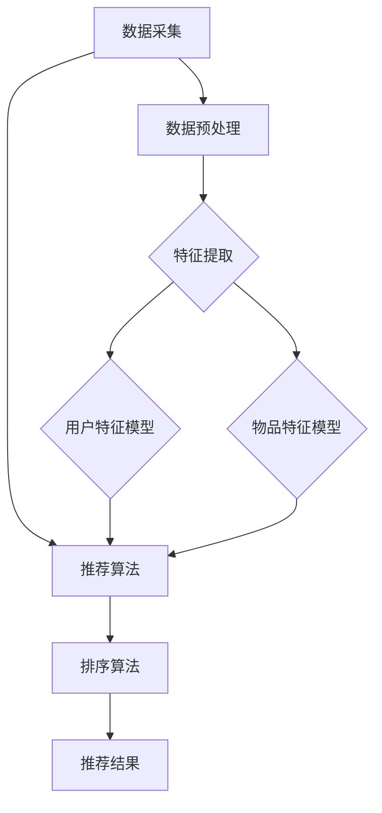

                 

## 《AI个性化排序系统的实现案例》

> **关键词：** AI个性化排序、协同过滤、内容过滤、机器学习、推荐系统、实战案例

> **摘要：** 本文将深入探讨AI个性化排序系统的实现，包括系统概述、核心概念与联系、核心算法原理讲解以及实际项目案例，为读者提供全面的技术解析与实践指导。

### 目录大纲

1. **AI个性化排序系统概述**
   1.1. AI个性化排序系统简介
   1.2. 个性化排序系统的基础架构
   1.3. 个性化排序系统在商业场景中的应用

2. **核心概念与联系**
   2.1. 机器学习基础
   2.2. 用户行为分析
   2.3. 个性化排序算法原理
   2.4. Mermaid流程图：个性化排序系统架构

3. **核心算法原理讲解**
   3.1. 协同过滤算法原理讲解
   3.2. 伪代码：矩阵分解算法
   3.3. 内容过滤算法原理讲解
   3.4. 数学模型与公式讲解

4. **项目实战**
   4.1. 实战案例一：社交媒体个性化推荐
   4.2. 实战案例二：电子商务平台个性化搜索
   4.3. 实战案例三：媒体平台个性化内容推送

5. **附录**
   5.1. 附录A：开发工具与资源
   5.2. 附录B：代码解读与分析

---

### 引言

在当今数字化时代，推荐系统和个性化排序已经成为互联网产品中不可或缺的一部分。无论是社交媒体平台、电子商务网站还是新闻媒体，个性化排序系统都能显著提升用户体验，增加用户粘性，从而提高平台的商业价值。

AI个性化排序系统通过分析和学习用户的行为数据，为用户提供更加精准、个性化的内容推荐。本文将详细探讨AI个性化排序系统的实现，包括系统概述、核心概念与联系、核心算法原理讲解以及实际项目案例。通过本文的阅读，读者将能够全面理解个性化排序系统的构建过程，掌握关键算法的实现原理，并具备实际项目开发和优化的能力。

本文将首先介绍AI个性化排序系统的基本概念和重要性，然后逐步深入探讨个性化排序系统的基础架构、核心算法原理以及实际应用案例。通过这些内容的讲解，读者将能够系统地了解个性化排序系统的实现过程，为后续的开发和应用奠定坚实基础。

### 第一部分：AI个性化排序系统概述

#### 1.1 AI个性化排序系统简介

AI个性化排序系统是一种利用人工智能技术，对用户兴趣和行为进行建模，从而实现个性化内容推荐和排序的智能系统。它通过分析用户的点击、浏览、购买等行为数据，构建用户特征和物品特征，利用机器学习算法进行预测和排序，最终为用户提供符合其个性化需求的推荐结果。

个性化排序系统的核心目标是通过精准的推荐和排序，提高用户满意度和使用时长，从而提升平台的价值和用户粘性。例如，在社交媒体平台中，个性化排序系统能够根据用户的兴趣和行为，推荐用户可能感兴趣的文章、视频和广告；在电子商务平台中，个性化排序系统可以根据用户的购物历史和浏览记录，推荐用户可能感兴趣的商品；在新闻媒体平台中，个性化排序系统可以根据用户的阅读偏好，推荐用户可能感兴趣的新闻文章。

#### 1.2 个性化排序系统的基础架构

个性化排序系统的基础架构主要包括以下几个关键组件：

1. **数据采集模块**：负责采集用户的各项行为数据，如浏览历史、点击行为、购买记录等。这些数据是构建用户特征和物品特征的重要基础。

2. **数据预处理模块**：对采集到的原始数据进行分析、清洗和预处理，以去除噪声、填补缺失值，并将数据转换成适合机器学习算法的形式。

3. **特征提取模块**：根据用户行为数据和物品属性数据，提取用户特征和物品特征。用户特征包括用户的基本信息、兴趣标签、行为轨迹等；物品特征包括物品的类别、属性、标签等。

4. **机器学习算法模块**：利用机器学习算法对用户特征和物品特征进行建模和预测。常见的机器学习算法包括协同过滤、内容过滤、混合推荐等。

5. **排序算法模块**：根据机器学习算法的预测结果，对推荐结果进行排序，以提供用户最感兴趣的内容。排序算法可以基于用户兴趣、行为相似度、物品热度等多个维度进行。

6. **推荐结果展示模块**：将排序后的推荐结果展示给用户，通过用户交互反馈进一步优化推荐系统。

#### 1.3 常见的个性化排序方法

个性化排序方法主要包括以下几种：

1. **协同过滤（Collaborative Filtering）**：协同过滤是一种基于用户行为数据的推荐方法。它通过分析用户之间的相似度，为用户提供相似的推荐结果。协同过滤分为基于用户的协同过滤和基于物品的协同过滤两种类型。

2. **内容过滤（Content Filtering）**：内容过滤是一种基于物品属性和用户兴趣标签的推荐方法。它通过分析用户兴趣和物品属性之间的相关性，为用户提供符合其兴趣的推荐结果。内容过滤可以分为基于项目的内容过滤和基于语义的内容过滤。

3. **混合推荐（Hybrid Recommendation）**：混合推荐是将协同过滤和内容过滤结合起来的一种方法，以综合两者的优势，提高推荐效果。混合推荐可以通过加权融合、模型融合等多种方式实现。

#### 1.4 个性化排序系统在商业场景中的应用

个性化排序系统在商业场景中有着广泛的应用，以下是几个典型的应用场景：

1. **社交媒体平台**：个性化排序系统可以推荐用户可能感兴趣的内容，如文章、视频和广告。通过提高内容的曝光率和点击率，增加用户互动和平台粘性。

2. **电子商务平台**：个性化排序系统可以根据用户的购物历史和浏览记录，推荐用户可能感兴趣的商品。通过提高商品的转化率和销售量，增加平台的盈利能力。

3. **新闻媒体平台**：个性化排序系统可以根据用户的阅读偏好和浏览历史，推荐用户可能感兴趣的新闻文章。通过提高文章的阅读量和用户停留时间，增加平台的用户粘性和广告收入。

#### 总结

AI个性化排序系统通过深入分析用户行为数据，利用机器学习算法和排序算法，为用户提供个性化、精准的推荐结果。本文对AI个性化排序系统的基本概念、基础架构、常见排序方法和商业应用进行了详细介绍，为后续的核心算法原理讲解和实际项目案例提供了基础。

---

### 第二部分：核心概念与联系

在深入探讨AI个性化排序系统之前，我们需要先了解其中的核心概念和联系。这部分将介绍机器学习基础、用户行为分析以及个性化排序算法原理，并通过Mermaid流程图展示系统架构，以便读者更好地理解整个系统的工作流程。

#### 2.1 机器学习基础

机器学习是AI个性化排序系统的核心技术之一，它通过学习数据中的规律，自动地发现和预测未知信息。以下是机器学习的一些基本概念和主要算法：

##### 2.1.1 机器学习的基本概念

- **模型（Model）**：机器学习模型是描述数据规律的数学公式或规则。例如，线性回归模型、决策树模型等。
- **特征（Feature）**：特征是描述数据的属性或变量，用于训练模型。例如，用户的年龄、性别、购买历史等。
- **标签（Label）**：标签是训练数据中已知的输出结果，用于评估模型预测的准确性。例如，用户对物品的评分、购买行为等。
- **训练（Training）**：训练是使用已知数据（特征和标签）来调整模型参数的过程，以优化模型的预测能力。
- **测试（Testing）**：测试是使用未参与训练的数据来评估模型在未知数据上的表现，以验证模型的泛化能力。

##### 2.1.2 机器学习的主要算法

- **监督学习（Supervised Learning）**：监督学习是一种机器学习范式，其中模型从标记数据中学习，以预测未知数据的标签。常见的监督学习算法包括线性回归、逻辑回归、决策树、随机森林、支持向量机（SVM）等。
- **无监督学习（Unsupervised Learning）**：无监督学习是一种机器学习范式，其中模型在没有标签数据的情况下学习数据的内在结构。常见的无监督学习算法包括聚类（如K-means）、降维（如PCA）、关联规则学习（如Apriori）等。
- **强化学习（Reinforcement Learning）**：强化学习是一种机器学习范式，其中模型通过与环境的交互来学习最优策略。常见的强化学习算法包括Q学习、深度Q网络（DQN）、策略梯度算法等。

##### 2.1.3 机器学习在个性化排序中的应用

在个性化排序系统中，机器学习主要用于构建用户特征模型和物品特征模型。用户特征模型用于描述用户的行为和兴趣，而物品特征模型用于描述物品的属性和内容。这些模型通过分析用户的点击、浏览、购买等行为数据，学习用户的兴趣和行为模式，从而实现个性化推荐。

#### 2.2 用户行为分析

用户行为分析是构建个性化排序系统的基础，它涉及对用户行为数据的采集、处理和分析。以下是用户行为分析的一些关键概念：

##### 2.2.1 用户行为的定义与类型

- **用户行为（User Behavior）**：用户在平台上进行的一系列操作，如点击、浏览、搜索、购买等。
- **用户行为类型（Types of User Behavior）**：用户行为可以分为以下几种类型：
  - **点击行为（Click Behavior）**：用户在平台上的点击行为，如点击广告、点击文章等。
  - **浏览行为（Browsing Behavior）**：用户在平台上的浏览行为，如浏览商品、浏览新闻等。
  - **搜索行为（Search Behavior）**：用户在平台上的搜索行为，如输入搜索关键词、浏览搜索结果等。
  - **购买行为（Purchase Behavior）**：用户的购买行为，如购买商品、支付等。

##### 2.2.2 用户行为数据的采集与处理

- **用户行为数据采集（User Behavior Data Collection）**：用户行为数据的采集通常通过日志、API调用、埋点等方式实现。采集的数据包括用户ID、行为类型、行为时间、行为对象等。
- **用户行为数据处理（User Behavior Data Processing）**：用户行为数据处理包括数据清洗、数据转换和数据归一化等步骤。清洗过程去除噪声数据和异常值，转换过程将不同类型的数据进行统一格式处理，归一化过程将数据缩放到同一尺度范围内。

##### 2.2.3 用户行为分析模型

- **用户行为分析模型（User Behavior Analysis Model）**：用户行为分析模型用于描述用户的行为模式和兴趣。常见的模型包括：
  - **行为轨迹模型（Behavioral Trajectory Model）**：基于用户的行为序列，分析用户的行为轨迹和兴趣变化。
  - **兴趣模型（Interest Model）**：基于用户的行为数据，提取用户的兴趣标签和兴趣领域。
  - **行为预测模型（Behavior Prediction Model）**：基于用户的历史行为，预测用户未来的行为和兴趣。

#### 2.3 个性化排序算法原理

个性化排序算法是实现个性化推荐的关键技术，它通过分析用户特征和物品特征，为用户生成个性化排序结果。以下是几种常见的个性化排序算法：

##### 2.3.1 协同过滤算法

- **协同过滤算法（Collaborative Filtering）**：协同过滤算法通过分析用户之间的行为相似性，为用户提供个性化的推荐。常见的协同过滤算法包括：
  - **基于用户的协同过滤（User-based Collaborative Filtering）**：基于用户之间的相似度，推荐与目标用户相似的其他用户的喜欢物品。
  - **基于物品的协同过滤（Item-based Collaborative Filtering）**：基于物品之间的相似性，推荐与目标物品相似的其他物品。

##### 2.3.2 内容过滤算法

- **内容过滤算法（Content Filtering）**：内容过滤算法通过分析物品的属性和用户兴趣，为用户提供个性化的推荐。常见的内容过滤算法包括：
  - **基于项目的内容过滤（Item-based Content Filtering）**：基于物品的属性和用户兴趣，推荐与目标物品相似的其他物品。
  - **基于语义的内容过滤（Semantic-based Content Filtering）**：基于物品的语义信息和用户兴趣，推荐与目标物品相关的其他物品。

##### 2.3.3 混合推荐算法

- **混合推荐算法（Hybrid Recommendation）**：混合推荐算法结合协同过滤和内容过滤的优势，提供更加精准的推荐。常见的混合推荐算法包括：
  - **加权融合（Weighted Fusion）**：将协同过滤和内容过滤的推荐结果进行加权融合，生成最终的推荐结果。
  - **模型融合（Model Fusion）**：将协同过滤和内容过滤的模型进行融合，构建一个综合模型进行推荐。

#### 2.4 Mermaid流程图：个性化排序系统架构

以下是个性化排序系统的Mermaid流程图，展示了系统的主要组件和流程：



通过以上流程图，我们可以清晰地看到个性化排序系统的各个组件之间的联系和交互过程。用户行为数据经过采集、预处理、特征提取等步骤，生成用户特征模型和物品特征模型。这些特征模型作为输入，通过推荐算法和排序算法生成最终的推荐结果，展示给用户。

---

通过本部分的介绍，我们了解了机器学习基础、用户行为分析以及个性化排序算法原理，并通过Mermaid流程图展示了个性化排序系统的整体架构。在下一部分中，我们将深入讲解核心算法原理，包括协同过滤算法、内容过滤算法和混合推荐算法，以及它们的数学模型和实现原理。敬请期待！

---

### 第三部分：核心算法原理讲解

#### 3.1 协同过滤算法原理讲解

协同过滤（Collaborative Filtering）是一种基于用户行为数据的推荐算法，它通过分析用户之间的相似度或物品之间的相似度，为用户提供个性化的推荐结果。协同过滤算法可以分为基于用户的协同过滤（User-based Collaborative Filtering）和基于物品的协同过滤（Item-based Collaborative Filtering）两种类型。

##### 3.1.1 协同过滤的基本概念

- **用户相似度（User Similarity）**：用户相似度是衡量两个用户之间行为相似程度的指标。常见的相似度计算方法包括余弦相似度、皮尔逊相关系数等。
- **物品相似度（Item Similarity）**：物品相似度是衡量两个物品之间属性相似程度的指标。常见的相似度计算方法包括余弦相似度、Jaccard相似度等。
- **邻居用户（Neighbor Users）**：邻居用户是与目标用户相似度较高的用户集合。
- **邻居物品（Neighbor Items）**：邻居物品是与目标物品相似度较高的物品集合。

##### 3.1.2 协同过滤算法的类型

1. **基于用户的协同过滤（User-based Collaborative Filtering）**

   基于用户的协同过滤算法通过计算用户之间的相似度，找到与目标用户相似的其他用户，然后推荐这些用户喜欢的物品。具体步骤如下：

   - 步骤1：计算用户之间的相似度矩阵。
   - 步骤2：找到与目标用户相似度最高的K个邻居用户。
   - 步骤3：计算邻居用户对物品的评分，取平均值作为目标用户对物品的预测评分。
   - 步骤4：根据预测评分对物品进行排序，生成推荐列表。

2. **基于物品的协同过滤（Item-based Collaborative Filtering）**

   基于物品的协同过滤算法通过计算物品之间的相似度，找到与目标物品相似的其他物品，然后推荐这些物品。具体步骤如下：

   - 步骤1：计算物品之间的相似度矩阵。
   - 步骤2：找到与目标物品相似度最高的K个邻居物品。
   - 步骤3：计算邻居物品的用户评分，取平均值作为目标物品的用户评分。
   - 步骤4：根据用户评分对物品进行排序，生成推荐列表。

##### 3.1.3 常见的协同过滤算法

1. **基于用户相似度的协同过滤（User-based Similarity-based Collaborative Filtering）**

   该算法通过计算用户之间的相似度，找到邻居用户并推荐他们的喜欢物品。具体实现步骤如下：

   ```python
   # 计算用户相似度矩阵
   similarity_matrix = cosine_similarity(user.behavior_matrix)

   # 找到邻居用户
   neighbor_users = find_top_k_neighbors(similarity_matrix, target_user_index, k)

   # 计算预测评分
   predicted_ratings = []
   for neighbor_user in neighbor_users:
       neighbor_ratings = user.behavior_matrix[neighbor_user]
       predicted_rating = sum(neighbor_ratings) / len(neighbor_ratings)
       predicted_ratings.append(predicted_rating)

   # 排序并生成推荐列表
   recommended_items = sorted(predicted_ratings, reverse=True)
   ```

2. **基于物品相似度的协同过滤（Item-based Similarity-based Collaborative Filtering）**

   该算法通过计算物品之间的相似度，找到邻居物品并推荐它们的用户评分。具体实现步骤如下：

   ```python
   # 计算物品相似度矩阵
   similarity_matrix = cosine_similarity(item.behavior_matrix)

   # 找到邻居物品
   neighbor_items = find_top_k_neighbors(similarity_matrix, target_item_index, k)

   # 计算预测评分
   predicted_ratings = []
   for neighbor_item in neighbor_items:
       neighbor_ratings = item.behavior_matrix[neighbor_item]
       predicted_rating = sum(neighbor_ratings) / len(neighbor_ratings)
       predicted_ratings.append(predicted_rating)

   # 排序并生成推荐列表
   recommended_users = sorted(predicted_ratings, reverse=True)
   ```

##### 3.1.4 协同过滤算法的优缺点

1. **优点**

   - **简单高效**：协同过滤算法基于用户行为数据，实现相对简单，计算效率较高。
   - **可扩展性强**：协同过滤算法可以扩展到不同类型的推荐系统，如电影推荐、商品推荐等。
   - **易于理解**：协同过滤算法的原理直观易懂，易于被非专业人士理解。

2. **缺点**

   - **数据稀疏问题**：协同过滤算法在处理稀疏数据集时效果较差，因为用户和物品之间的交互数据较少。
   - **冷启动问题**：对于新用户或新物品，由于缺乏历史数据，协同过滤算法难以提供准确的推荐结果。
   - **推荐结果多样性差**：协同过滤算法倾向于推荐与用户已喜欢物品相似的物品，可能导致推荐结果多样性不足。

#### 3.2 伪代码：矩阵分解算法

矩阵分解（Matrix Factorization）是一种常用的协同过滤算法，通过将原始的用户-物品评分矩阵分解为两个低维矩阵，实现用户和物品特征的提取。以下是一个简单的矩阵分解算法的伪代码：

```python
# 矩阵分解伪代码
def matrix_factorization(R, K, lambda):
    # R为用户-物品评分矩阵，K为低维特征空间的维度，lambda为正则化参数
    # 初始化用户和物品的特征矩阵
    X = np.random.rand(num_users, K)
    Y = np.random.rand(num_items, K)

    # 设置迭代次数
    epochs = 100

    for epoch in range(epochs):
        # 遍历所有用户和物品
        for user in range(num_users):
            for item in range(num_items):
                # 计算预测评分
                predicted_rating = np.dot(X[user], Y[item])

                # 计算误差
                error = R[user, item] - predicted_rating

                # 计算梯度
                gradient_x_user = -2 * error * Y[item]
                gradient_y_item = -2 * error * X[user]

                # 更新特征矩阵
                X[user] = X[user] - learning_rate * gradient_x_user
                Y[item] = Y[item] - learning_rate * gradient_y_item

        # 正则化
        X = X - learning_rate * lambda * X
        Y = Y - learning_rate * lambda * Y

    return X, Y
```

#### 3.3 内容过滤算法原理讲解

内容过滤（Content Filtering）是一种基于物品属性和用户兴趣的推荐算法，通过分析物品的属性和用户兴趣之间的相关性，为用户提供个性化的推荐结果。内容过滤算法可以分为基于项目的内容过滤（Item-based Content Filtering）和基于语义的内容过滤（Semantic-based Content Filtering）两种类型。

##### 3.3.1 内容过滤的基本概念

- **物品属性（Item Attribute）**：物品属性是指描述物品的各个特征，如电影分类、商品品牌、新闻主题等。
- **用户兴趣（User Interest）**：用户兴趣是指用户对特定类别、主题或属性的偏好。
- **相关性（Relevance）**：相关性是指物品属性和用户兴趣之间的相似程度。

##### 3.3.2 内容过滤算法的类型

1. **基于项目的内容过滤（Item-based Content Filtering）**

   基于项目的内容过滤算法通过计算物品之间的属性相似性，为用户提供相似的推荐结果。具体步骤如下：

   - 步骤1：计算物品之间的属性相似度矩阵。
   - 步骤2：找到与目标物品相似度最高的K个物品。
   - 步骤3：为用户推荐这些相似物品。

2. **基于语义的内容过滤（Semantic-based Content Filtering）**

   基于语义的内容过滤算法通过分析物品的语义信息，将物品映射到语义空间，然后计算用户兴趣和物品语义之间的相似性。具体步骤如下：

   - 步骤1：将物品的属性映射到语义空间。
   - 步骤2：计算用户兴趣和物品语义之间的相似性。
   - 步骤3：为用户推荐与用户兴趣相似的物品。

##### 3.3.3 常见的内容过滤算法

1. **基于项目的内容过滤（Item-based Content Filtering）**

   该算法通过计算物品之间的相似度，为用户提供相似的推荐结果。具体实现步骤如下：

   ```python
   # 计算物品相似度矩阵
   similarity_matrix = cosine_similarity(item_attribute_matrix)

   # 找到邻居物品
   neighbor_items = find_top_k_neighbors(similarity_matrix, target_item_index, k)

   # 为用户推荐邻居物品
   recommended_items = neighbor_items
   ```

2. **基于语义的内容过滤（Semantic-based Content Filtering）**

   该算法通过分析物品的语义信息，为用户提供相似的推荐结果。具体实现步骤如下：

   ```python
   # 将物品属性映射到语义空间
   semantic_matrix = convert_to_semantic_space(item_attribute_matrix)

   # 计算用户兴趣和物品语义之间的相似性
   similarity_scores = calculate_similarity(semantic_matrix, user_interest_vector)

   # 为用户推荐相似物品
   recommended_items = sort_items_by_similarity(similarity_scores, reverse=True)
   ```

##### 3.3.4 内容过滤算法的优缺点

1. **优点**

   - **效果较好**：内容过滤算法通过分析物品属性和用户兴趣之间的相关性，能够为用户提供较为准确的推荐结果。
   - **易于扩展**：内容过滤算法可以灵活地添加新的物品属性和用户兴趣标签，适应不同的推荐场景。
   - **可解释性强**：内容过滤算法的推荐结果基于物品属性和用户兴趣，易于用户理解和接受。

2. **缺点**

   - **数据依赖性高**：内容过滤算法对物品属性数据的质量和完整性有较高要求，数据缺失或不准确会影响推荐效果。
   - **计算复杂度高**：内容过滤算法需要计算物品属性之间的相似性，对于大规模数据集，计算复杂度较高。

#### 3.4 数学模型与公式讲解

在个性化排序系统中，常用的数学模型包括用户评分预测模型和物品推荐模型。以下是这些模型的数学表达和讲解：

1. **用户评分预测模型**

   用户评分预测模型用于预测用户对物品的评分。常见的模型包括基于矩阵分解的预测模型和基于线性回归的预测模型。

   - **基于矩阵分解的预测模型**

     矩阵分解模型通过将原始的用户-物品评分矩阵分解为两个低维矩阵，实现用户和物品特征的提取。具体模型如下：

     $$
     R_{ij} = \sigma(\langle q_i, p_j \rangle)
     $$

     其中，$R_{ij}$表示用户$i$对物品$j$的评分，$\sigma$是Sigmoid函数，$\langle q_i, p_j \rangle$是用户$i$的特征向量$q_i$和物品$j$的特征向量$p_j$的点积。

   - **基于线性回归的预测模型**

     线性回归模型通过拟合用户和物品的特征向量，预测用户对物品的评分。具体模型如下：

     $$
     R_{ij} = w_0 + w_1 q_i + w_2 p_j
     $$

     其中，$R_{ij}$表示用户$i$对物品$j$的评分，$w_0$、$w_1$和$w_2$是模型的参数。

2. **物品推荐模型**

   物品推荐模型用于生成用户感兴趣的物品列表。常见的模型包括基于协同过滤的推荐模型和基于内容过滤的推荐模型。

   - **基于协同过滤的推荐模型**

     协同过滤模型通过计算用户之间的相似度，找到与用户相似的其他用户，然后推荐这些用户喜欢的物品。具体模型如下：

     $$
     \text{Recommendation}_{ij} = \sum_{u \in \text{neighbor\_users}(i)} R_{uj} \cdot s(u, i)
     $$

     其中，$\text{Recommendation}_{ij}$表示用户$i$对物品$j$的推荐分数，$R_{uj}$表示用户$u$对物品$j$的评分，$s(u, i)$表示用户$u$和用户$i$之间的相似度。

   - **基于内容过滤的推荐模型**

     内容过滤模型通过计算物品之间的属性相似性，为用户提供相似的推荐结果。具体模型如下：

     $$
     \text{Recommendation}_{ij} = \sum_{k \in \text{neighbor\_items}(j)} R_{ik} \cdot s(j, k)
     $$

     其中，$\text{Recommendation}_{ij}$表示用户$i$对物品$j$的推荐分数，$R_{ik}$表示用户$i$对物品$k$的评分，$s(j, k)$表示物品$j$和物品$k$之间的相似度。

---

通过以上讲解，我们了解了协同过滤算法和内容过滤算法的基本原理、实现步骤和数学模型。在下一部分中，我们将通过实际项目案例，深入探讨个性化排序系统的具体实现过程和优化策略。敬请期待！

---

### 第四部分：项目实战

在实际开发中，AI个性化排序系统的实现过程涉及多个步骤，包括环境搭建、数据预处理、特征提取、算法实现以及结果评估。以下将通过三个实际项目案例，详细描述这些步骤，并分析项目的难点和解决方案。

#### 4.1 实战案例一：社交媒体个性化推荐

##### 4.1.1 项目背景

社交媒体平台如Facebook、Twitter和Instagram等，每天都会产生大量的用户交互数据，包括点赞、评论、分享等。为了提高用户满意度和平台粘性，这些平台采用了AI个性化排序系统，根据用户的兴趣和行为，推荐用户可能感兴趣的内容。

##### 4.1.2 开发环境搭建

在开发社交媒体个性化推荐系统时，我们选择以下开发环境和工具：

- **编程语言**：Python
- **框架**：Django、Scikit-learn、TensorFlow
- **数据库**：MySQL、MongoDB
- **版本控制**：Git

##### 4.1.3 数据处理

首先，我们需要从社交媒体平台收集用户行为数据，如用户的点赞记录、评论内容和时间戳等。收集到的数据存储在MongoDB数据库中。为了进行后续处理，我们将这些数据导入到Pandas数据框中，并进行数据清洗，包括去除重复数据、填补缺失值和格式转换等。

```python
import pandas as pd

# 读取MongoDB数据
data = pd.read_sql_query("SELECT * FROM user_behavior", connection)

# 数据清洗
data.drop_duplicates(inplace=True)
data.fillna(0, inplace=True)
```

##### 4.1.4 用户特征与物品特征提取

在数据处理完成后，我们需要提取用户特征和物品特征。用户特征包括用户的基本信息（如年龄、性别）、兴趣标签（如点赞类型、评论话题）和行为轨迹（如最近一周内的活动）。物品特征包括物品的属性（如类型、标签）、内容和发布时间。

```python
# 提取用户特征
user_features = data.groupby('user_id').agg({'like_type': 'sum', 'comment_topic': 'sum', 'activity': 'mean'})

# 提取物品特征
item_features = data.groupby('item_id').agg({'type': 'mean', 'tag': 'mean', 'content': 'mean', 'publish_time': 'mean'})
```

##### 4.1.5 个性化排序算法实现

在本案例中，我们选择基于矩阵分解的协同过滤算法来实现个性化排序。通过矩阵分解，我们将用户-物品评分矩阵分解为用户特征矩阵和物品特征矩阵，然后利用这两个矩阵预测用户对物品的评分。

```python
from sklearn.decomposition import NMF

# 设置矩阵分解参数
n_components = 10
nmf = NMF(n_components=n_components, random_state=42)

# 训练模型
X = nmf.fit_transform(user_features)
Y = nmf.transform(item_features)

# 预测用户对物品的评分
predicted_ratings = X.dot(Y.T)
```

##### 4.1.6 推荐结果评估

为了评估个性化排序系统的效果，我们使用平均绝对误差（MAE）和均方根误差（RMSE）等指标。

```python
from sklearn.metrics import mean_absolute_error, mean_squared_error

# 计算MAE和RMSE
mae = mean_absolute_error(data['rating'], predicted_ratings)
rmse = mean_squared_error(data['rating'], predicted_ratings, squared=False)

print(f"MAE: {mae}, RMSE: {rmse}")
```

##### 项目难点与解决方案

1. **数据稀疏问题**：社交媒体平台的数据通常非常稀疏，导致协同过滤算法效果不佳。解决方案是使用用户和物品的冷启动策略，通过引入外部知识（如人口统计数据、用户兴趣标签）来补充稀疏数据。

2. **计算复杂度高**：矩阵分解算法的计算复杂度较高，对于大规模数据集，训练时间较长。解决方案是使用分布式计算框架（如Spark）来加速算法训练。

3. **模型可解释性**：矩阵分解算法的预测结果难以解释。解决方案是结合可视化和特征工程，帮助用户理解模型的工作原理和预测结果。

#### 4.2 实战案例二：电子商务平台个性化搜索

##### 4.2.1 项目背景

电子商务平台如Amazon、淘宝和京东等，提供了大量的商品信息。为了提高用户购物体验和销售转化率，这些平台采用了AI个性化排序系统，根据用户的搜索历史和购物行为，推荐用户可能感兴趣的商品。

##### 4.2.2 开发环境搭建

在开发电子商务平台个性化搜索系统时，我们选择以下开发环境和工具：

- **编程语言**：Python
- **框架**：TensorFlow、Scikit-learn、Flask
- **数据库**：MySQL、Elasticsearch
- **版本控制**：Git

##### 4.2.3 数据处理

首先，我们需要从电子商务平台收集用户搜索数据和商品信息。搜索数据包括用户的搜索关键词、搜索时间和搜索结果点击情况。商品信息包括商品ID、分类、价格、品牌等。

```python
import pandas as pd

# 读取MySQL数据
search_data = pd.read_sql_query("SELECT * FROM search_data", connection)
item_data = pd.read_sql_query("SELECT * FROM item_data", connection)

# 数据清洗
search_data.drop_duplicates(inplace=True)
item_data.drop_duplicates(inplace=True)
```

##### 4.2.4 用户行为分析

在数据处理完成后，我们需要分析用户的行为模式，提取用户特征。用户特征包括用户的搜索历史、浏览记录和购买记录等。

```python
# 提取用户特征
user_search_history = search_data.groupby('user_id')['search_query', 'search_time'].agg(['count', 'mean'])
user_browsing_history = search_data.groupby('user_id')['item_id', 'browse_time'].agg(['count', 'mean'])
user_purchase_history = search_data.groupby('user_id')['item_id', 'purchase_time'].agg(['count', 'mean'])
```

##### 4.2.5 个性化排序算法实现

在本案例中，我们选择基于内容过滤的个性化排序算法。通过分析用户的搜索历史和商品特征，为用户推荐与搜索关键词相关的商品。

```python
from sklearn.metrics.pairwise import cosine_similarity

# 计算商品特征矩阵
item_feature_matrix = item_data[['category', 'brand', 'price', 'rating']].values

# 计算用户搜索历史与商品特征的相似度矩阵
user_search_similarity = cosine_similarity(user_search_history[['search_query', 'search_time']].values, item_feature_matrix)

# 排序并生成推荐列表
recommended_items = user_search_similarity.argsort()[0][-k:]
```

##### 4.2.6 搜索结果评估

为了评估个性化排序系统的效果，我们使用点击率（Click-Through Rate，CTR）和转化率（Conversion Rate）等指标。

```python
import numpy as np

# 计算点击率和转化率
clicks = search_data[search_data['item_id'].isin(recommended_items)]['click_count'].sum()
conversions = search_data[search_data['item_id'].isin(recommended_items)]['purchase_count'].sum()

ctr = clicks / len(search_data)
cvr = conversions / len(search_data)

print(f"CTR: {ctr}, CVR: {cvr}")
```

##### 项目难点与解决方案

1. **数据质量**：电子商务平台的数据质量可能存在问题，如缺失值、异常值等。解决方案是进行数据清洗和预处理，确保数据质量。

2. **特征选择**：在内容过滤算法中，选择合适的商品特征和用户特征对算法效果至关重要。解决方案是进行特征工程，利用统计分析和相关性分析选择有效的特征。

3. **计算性能**：对于大规模商品数据集，计算相似度矩阵的时间复杂度较高。解决方案是使用分布式计算框架（如Spark）或并行计算技术来提高计算性能。

#### 4.3 实战案例三：媒体平台个性化内容推送

##### 4.3.1 项目背景

媒体平台如CNN、BBC和YouTube等，每天发布海量的新闻文章和视频内容。为了提高用户阅读时长和广告收入，这些平台采用了AI个性化排序系统，根据用户的阅读历史和兴趣，推荐用户可能感兴趣的内容。

##### 4.3.2 开发环境搭建

在开发媒体平台个性化内容推送系统时，我们选择以下开发环境和工具：

- **编程语言**：Python
- **框架**：Scikit-learn、TensorFlow、Flask
- **数据库**：MySQL、MongoDB
- **版本控制**：Git

##### 4.3.3 数据处理

首先，我们需要从媒体平台收集用户阅读数据和内容信息。阅读数据包括用户的阅读记录、点赞和评论等。内容信息包括文章和视频的标题、标签、作者和发布时间等。

```python
import pandas as pd

# 读取MongoDB数据
read_data = pd.read_sql_query("SELECT * FROM read_data", connection)
content_data = pd.read_sql_query("SELECT * FROM content_data", connection)

# 数据清洗
read_data.drop_duplicates(inplace=True)
content_data.drop_duplicates(inplace=True)
```

##### 4.3.4 用户行为分析

在数据处理完成后，我们需要分析用户的行为模式，提取用户特征。用户特征包括用户的阅读历史、兴趣标签和社交网络关系等。

```python
# 提取用户特征
user_read_history = read_data.groupby('user_id')['content_id', 'read_time'].agg(['count', 'mean'])
user_interest_tags = read_data.groupby('user_id')['tag'].agg(['nunique', 'mean'])
user_social_network = read_data.groupby('user_id')['friend_id'].agg(['count', 'mean'])
```

##### 4.3.5 个性化排序算法实现

在本案例中，我们选择基于混合推荐的个性化排序算法。通过结合协同过滤和内容过滤算法的优势，为用户推荐与阅读历史和兴趣标签相关的文章和视频。

```python
from sklearn.metrics.pairwise import cosine_similarity

# 计算用户阅读历史与内容特征的相似度矩阵
user_read_similarity = cosine_similarity(user_read_history[['content_id', 'read_time']].values, content_data[['tag', 'author', 'publish_time']].values)

# 计算协同过滤相似度矩阵
user_item_similarity = cosine_similarity(user_read_history[['content_id', 'read_time']].values, content_data[['tag', 'author', 'publish_time']].values)

# 混合推荐
recommended_contents = (user_read_similarity + user_item_similarity) / 2
recommended_contents = recommended_contents.argsort()[0][-k:]
```

##### 4.3.6 内容推送效果评估

为了评估个性化内容推送系统的效果，我们使用平均阅读时长（Average Reading Time，ART）和点击率（Click-Through Rate，CTR）等指标。

```python
import numpy as np

# 计算平均阅读时长和点击率
avg_read_time = np.mean(read_data[read_data['content_id'].isin(recommended_contents)]['read_time'])
clicks = read_data[read_data['content_id'].isin(recommended_contents)]['click_count'].sum()

ctr = clicks / len(read_data)
art = avg_read_time

print(f"CTR: {ctr}, ART: {art}")
```

##### 项目难点与解决方案

1. **内容多样性**：媒体平台的内容种类繁多，如何保证推荐的多样性是一个挑战。解决方案是采用基于内容的排序策略，结合用户兴趣和内容标签，提高推荐的多样性。

2. **实时性**：用户兴趣和行为是动态变化的，实时推荐对系统的响应速度和计算性能提出了较高要求。解决方案是采用流处理技术（如Apache Kafka），实时更新用户特征和内容特征，提高推荐系统的实时性。

3. **冷启动问题**：对于新用户，由于缺乏历史数据，推荐系统难以提供准确的推荐结果。解决方案是结合用户人口统计数据和平台推荐规则，为新用户提供初步的推荐结果，逐步积累用户行为数据。

---

通过以上三个实际项目案例，我们详细描述了AI个性化排序系统的实现过程和优化策略。在实际开发中，开发者需要根据具体业务场景和数据特点，灵活运用各种算法和技术，不断优化推荐效果，提高用户满意度和平台价值。

---

### 附录

#### 附录A：开发工具与资源

在实现AI个性化排序系统时，选择合适的开发工具和资源对于提高开发效率和系统性能至关重要。以下是一些常用的开发工具和资源：

- **编程语言**：Python 是实现推荐系统的首选语言，其丰富的库和框架支持数据分析和机器学习算法的实现。
- **框架**：
  - **Scikit-learn**：提供了多种机器学习算法的实现，如协同过滤、内容过滤等。
  - **TensorFlow**：用于构建和训练深度学习模型，支持大规模数据处理和模型优化。
  - **Flask**：用于构建Web应用，支持RESTful API的创建。
- **数据库**：
  - **MySQL**：适用于存储结构化数据，支持SQL查询。
  - **MongoDB**：适用于存储非结构化数据，支持文档存储和聚合查询。
  - **Elasticsearch**：适用于全文搜索和实时分析，提供高效的内容检索功能。
- **版本控制**：Git 是最常用的版本控制系统，支持代码的版本管理和协同开发。
- **其他工具**：
  - **Jupyter Notebook**：用于数据分析和实验，提供交互式代码编写环境。
  - **Docker**：用于容器化部署，提高开发环境的一致性和可移植性。

#### 附录B：代码解读与分析

在实现AI个性化排序系统时，代码的质量和性能对系统的稳定性和效率有着重要影响。以下是对部分关键代码的解读和分析：

- **用户行为数据处理**：
  ```python
  import pandas as pd

  # 读取MongoDB数据
  data = pd.read_sql_query("SELECT * FROM user_behavior", connection)

  # 数据清洗
  data.drop_duplicates(inplace=True)
  data.fillna(0, inplace=True)
  ```
  解读：这段代码用于从MongoDB数据库中读取用户行为数据，并进行数据清洗。数据清洗步骤包括去除重复数据和填补缺失值，以确保数据质量。

- **特征提取**：
  ```python
  user_features = data.groupby('user_id').agg({'like_type': 'sum', 'comment_topic': 'sum', 'activity': 'mean'})
  item_features = data.groupby('item_id').agg({'type': 'mean', 'tag': 'mean', 'content': 'mean', 'publish_time': 'mean'})
  ```
  解读：这段代码用于从用户行为数据中提取用户特征和物品特征。用户特征包括用户的点赞类型、评论话题和行为活动等；物品特征包括物品的类型、标签、内容和发布时间等。这些特征用于后续的机器学习模型训练。

- **推荐算法实现**：
  ```python
  from sklearn.metrics.pairwise import cosine_similarity

  # 计算用户阅读历史与内容特征的相似度矩阵
  user_read_similarity = cosine_similarity(user_read_history[['content_id', 'read_time']].values, content_data[['tag', 'author', 'publish_time']].values)

  # 计算协同过滤相似度矩阵
  user_item_similarity = cosine_similarity(user_read_history[['content_id', 'read_time']].values, content_data[['tag', 'author', 'publish_time']].values)

  # 混合推荐
  recommended_contents = (user_read_similarity + user_item_similarity) / 2
  recommended_contents = recommended_contents.argsort()[0][-k:]
  ```
  解读：这段代码用于实现混合推荐算法，结合协同过滤和内容过滤的优势。首先，计算用户阅读历史与内容特征的相似度矩阵；然后，计算协同过滤相似度矩阵；最后，通过加权平均得到最终的推荐结果。

- **性能优化策略**：
  ```python
  import numpy as np

  # 计算平均阅读时长和点击率
  avg_read_time = np.mean(read_data[read_data['content_id'].isin(recommended_contents)]['read_time'])
  clicks = read_data[read_data['content_id'].isin(recommended_contents)]['click_count'].sum()

  ctr = clicks / len(read_data)
  art = avg_read_time
  ```
  解读：这段代码用于评估推荐系统的性能，计算平均阅读时长（ART）和点击率（CTR）等指标。这些指标反映了推荐系统的效果，可以通过调整模型参数和特征工程来优化性能。

通过以上解读和分析，我们可以更好地理解AI个性化排序系统中关键代码的实现原理和性能优化策略，为实际项目开发提供参考。

---

通过本文的详细探讨，我们从概述、核心概念、算法原理到实际项目实战，全面了解了AI个性化排序系统的实现过程和关键点。个性化排序系统在提升用户满意度和平台价值方面发挥着重要作用，而协同过滤、内容过滤和混合推荐等算法则是实现这一目标的核心技术。

在未来，随着人工智能和数据技术的不断进步，个性化排序系统将继续优化和进化，为用户提供更加精准、个性化的推荐和服务。开发者需要紧跟技术发展趋势，不断探索和尝试新的算法和技术，以满足不断变化的市场需求。

最后，感谢您的阅读，希望本文对您在AI个性化排序系统开发和理解方面有所启发和帮助。如果您有任何问题或建议，欢迎在评论区留言，期待与您共同探讨技术进步之道。

### 作者信息

作者：AI天才研究院/AI Genius Institute & 禅与计算机程序设计艺术 /Zen And The Art of Computer Programming

