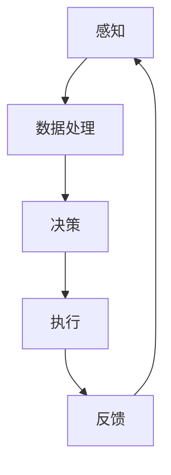

                 

### 文章标题

> **关键词：**AI人工智能代理，工作流，持续集成与交付，智能代理技术，机器学习，自然语言处理，强化学习，CI/CD

**摘要：**
本文深入探讨了AI人工智能代理工作流（AI Agent WorkFlow）的持续集成与交付（CI/CD）机制。首先，我们介绍了AI代理工作流的基础，包括AI代理的定义、分类、关键要素及发展趋势。接着，我们详细解析了AI代理所依赖的机器学习、自然语言处理和强化学习技术。随后，我们阐述了持续集成与交付的基础概念，以及如何选择和配置CI/CD工具。在此基础上，我们探讨了智能代理工作流的设计原则、实施步骤及与CI/CD的融合。文章还通过实际案例展示了智能代理工作流的实现，并对未来发展趋势进行了展望。本文旨在为读者提供关于智能代理工作流及其CI/CD的全面理解和实践指导。

### 《AI人工智能代理工作流AI Agent WorkFlow：智能代理工作流的持续集成与交付》目录大纲

**第一部分：AI代理工作流基础**

**第1章：AI代理工作流概述**
- **1.1 AI代理的定义与分类**
  - AI代理的基本概念
  - AI代理的分类与特征
- **1.2 AI代理工作流的关键要素**
  - AI代理的职责与功能
  - AI代理工作流的基本架构
- **1.3 AI代理工作流的现状与趋势**
  - 当前AI代理工作流的应用场景
  - AI代理工作流的发展趋势

**第2章：AI代理技术基础**
- **2.1 机器学习与深度学习基础**
  - 机器学习的基本原理
  - 深度学习的技术框架
- **2.2 自然语言处理（NLP）基础**
  - NLP的核心任务
  - 常见的NLP技术
- **2.3 强化学习在AI代理中的应用**
  - 强化学习的原理与算法
  - 强化学习在AI代理中的应用场景

**第3章：持续集成与交付（CI/CD）基础**
- **3.1 持续集成（CI）原理**
  - 持续集成的概念与流程
  - 持续集成的优势与挑战
- **3.2 持续交付（CD）原理**
  - 持续交付的概念与流程
  - 持续交付的优势与挑战
- **3.3 CI/CD工具选择与配置**
  - 常见的CI/CD工具
  - CI/CD工具的配置与使用

**第二部分：智能代理工作流设计**

**第4章：智能代理工作流设计原则**
- **4.1 智能代理工作流设计理念**
  - 智能代理工作流设计的基本原则
  - 智能代理工作流设计的最佳实践
- **4.2 智能代理工作流架构设计**
  - 智能代理工作流架构的核心组件
  - 智能代理工作流架构的设计策略

**第5章：智能代理工作流实施**
- **5.1 智能代理工作流开发**
  - 智能代理工作流的开发流程
  - 智能代理工作流的关键开发技术
- **5.2 智能代理工作流测试**
  - 智能代理工作流测试的策略与方法
  - 智能代理工作流测试工具的选择与使用

**第6章：持续集成与交付在智能代理工作流中的应用**
- **6.1 智能代理工作流与CI/CD的融合**
  - CI/CD在智能代理工作流中的应用策略
  - CI/CD在智能代理工作流中的实现方案
- **6.2 智能代理工作流自动化**
  - 自动化测试与部署在智能代理工作流中的应用
  - 智能代理工作流自动化工具的选择与配置

**第7章：案例研究：智能代理工作流实践**
- **7.1 智能代理工作流案例介绍**
  - 智能代理工作流案例的背景与目标
  - 智能代理工作流案例的实施过程
- **7.2 案例分析与总结**
  - 智能代理工作流案例的效果评估
  - 智能代理工作流案例的经验与启示

**第三部分：智能代理工作流的未来发展趋势**

**第8章：智能代理工作流的挑战与机遇**
- **8.1 智能代理工作流的挑战**
  - 技术挑战
  - 安全性与隐私保护
- **8.2 智能代理工作流的机遇**
  - 新兴技术应用
  - 行业发展趋势

**第9章：智能代理工作流的未来展望**
- **9.1 智能代理工作流的发展趋势**
  - 智能代理工作流的技术创新
  - 智能代理工作流的应用拓展
- **9.2 智能代理工作流的社会影响**
  - 对企业运营模式的影响
  - 对社会就业与教育的影响

**第10章：结论与展望**
- **10.1 本书总结**
  - 主要内容回顾
  - 核心观点与贡献
- **10.2 未来研究方向**
  - 智能代理工作流的研究热点
  - 智能代理工作流的未来发展

### 附录

**附录A：常用工具与资源**
- **A.1 AI代理开发工具**
  - 常用的AI代理开发工具介绍
- **A.2 持续集成与交付工具**
  - 常用的CI/CD工具介绍
- **A.3 学习资源**
  - 相关书籍、论文与在线课程推荐

**附件：核心概念与联系**
- **Mermaid流程图：智能代理工作流架构**
  - 使用Mermaid语言描述智能代理工作流的整体架构

**附件：核心算法原理讲解**
- **伪代码：强化学习算法**
  - 使用伪代码描述强化学习算法的实现过程

**附件：数学模型与公式讲解**
- **数学公式：损失函数**
  - 使用LaTeX格式描述常见的损失函数公式，并进行详细讲解

**附件：项目实战案例**
- **实战案例1：智能客服机器人**
  - 代码实际案例和详细解释说明
- **实战案例2：智能推荐系统**
  - 代码实际案例和详细解释说明

**附件：开发环境搭建与代码解读**
- **开发环境搭建**
  - 详细介绍智能代理工作流开发所需的环境搭建步骤
- **代码解读与分析**
  - 对案例中的关键代码进行解读和分析，帮助读者理解智能代理工作流的实现细节

---

### 第一部分：AI代理工作流基础

#### 第1章：AI代理工作流概述

**1.1 AI代理的定义与分类**

人工智能（AI）代理是一种由人工智能技术驱动的软件实体，它能够在虚拟环境中模拟人类行为，并与用户、其他代理或系统进行交互。AI代理的目的是在特定任务或场景中提供智能服务，以提高效率、优化决策和增强用户体验。

AI代理可以按照不同的标准进行分类。以下是一些常见的分类方法：

1. **按照功能分类：**
   - **任务型代理**：专注于执行特定任务，如智能客服机器人、智能助手等。
   - **社交型代理**：擅长社交互动，如聊天机器人、社交媒体管理代理等。
   - **决策型代理**：能够基于数据和算法进行决策，如金融市场预测代理、供应链优化代理等。

2. **按照应用领域分类：**
   - **消费领域**：如电子商务推荐系统、智能家居控制代理等。
   - **工业领域**：如工业自动化控制代理、质量检测代理等。
   - **医疗领域**：如智能诊断代理、健康监测代理等。

3. **按照交互方式分类：**
   - **基于文本的代理**：主要通过自然语言处理（NLP）与用户交互。
   - **基于视觉的代理**：通过计算机视觉技术处理图像和视频。
   - **混合型代理**：同时具备文本和视觉交互能力。

**1.2 AI代理工作流的关键要素**

AI代理工作流通常包含以下几个关键要素：

1. **感知与理解：** 代理需要通过传感器（如摄像头、麦克风等）收集环境数据，并利用自然语言处理、计算机视觉等技术理解和解释这些数据。

2. **决策与规划：** 代理基于感知到的信息，通过机器学习、深度学习等技术进行决策，并制定行动计划。

3. **行动与反馈：** 代理执行计划中的任务，并从环境获取反馈，以不断调整和优化其行为。

4. **学习和进化：** 代理通过学习算法，如强化学习、迁移学习等，不断积累经验，提高任务执行能力。

**1.3 AI代理工作流的现状与趋势**

当前，AI代理工作流在多个领域取得了显著进展，如电子商务、工业制造、医疗健康等。以下是一些AI代理工作流的现状与趋势：

1. **技术成熟度：** 随着机器学习、自然语言处理、计算机视觉等技术的发展，AI代理的功能和性能不断提升，应用范围逐步扩大。

2. **行业应用：** AI代理在消费、工业、医疗等领域的应用越来越广泛，为企业提供了智能化解决方案，提高了运营效率和用户满意度。

3. **挑战与机遇：** AI代理工作流的发展面临着数据隐私、安全性、法律伦理等方面的挑战，同时也带来了新的商业机会和技术创新。

4. **未来展望：** 随着人工智能技术的不断进步，AI代理工作流将在更广泛的场景中发挥作用，实现更加智能化的任务执行和决策支持。

在接下来的章节中，我们将深入探讨AI代理所依赖的机器学习、自然语言处理和强化学习技术，以及持续集成与交付（CI/CD）的基础知识。通过这些内容，我们将为读者提供一个全面、系统的智能代理工作流理解框架。

---

### 第2章：AI代理技术基础

#### 2.1 机器学习与深度学习基础

**机器学习（Machine Learning）**

机器学习是人工智能的核心技术之一，它通过构建和训练模型，使计算机系统能够自动从数据中学习规律和模式，并对其进行预测和决策。机器学习主要分为监督学习（Supervised Learning）、无监督学习（Unsupervised Learning）和强化学习（Reinforcement Learning）三大类。

1. **监督学习**：监督学习是一种从标记数据中学习的方法。训练数据集包含输入特征和对应的输出标签，通过学习输入和输出之间的关系，模型能够在新的数据上进行预测。常见的监督学习算法包括线性回归（Linear Regression）、决策树（Decision Tree）、支持向量机（Support Vector Machine，SVM）和神经网络（Neural Network）等。

2. **无监督学习**：无监督学习不需要标签数据，旨在发现数据中的隐含结构和规律。常见的无监督学习算法包括聚类（Clustering）、主成分分析（Principal Component Analysis，PCA）和自编码器（Autoencoder）等。

3. **强化学习**：强化学习是一种通过试错（Trial and Error）和反馈（Feedback）来学习的方法。智能体（Agent）通过与环境的交互，学习到最优策略（Policy），以实现目标。常见的强化学习算法包括Q学习（Q-Learning）、深度Q网络（Deep Q-Network，DQN）和策略梯度（Policy Gradient）等。

**深度学习（Deep Learning）**

深度学习是机器学习的一个分支，它通过构建深度神经网络（Deep Neural Network，DNN）来模拟人脑的神经结构和信息处理方式。深度学习在图像识别、语音识别、自然语言处理等领域取得了突破性进展。

1. **神经网络（Neural Network）**

神经网络由多个神经元（Node）组成，每个神经元通过权重（Weight）和偏置（Bias）与输入信号进行加权求和，并经过激活函数（Activation Function）处理后产生输出。常见的激活函数包括线性函数（Sigmoid Function）、ReLU函数（Rectified Linear Unit）和双曲正切函数（Hyperbolic Tangent Function）等。

2. **卷积神经网络（Convolutional Neural Network，CNN）**

卷积神经网络是一种专门用于处理图像数据的神经网络。它通过卷积层（Convolutional Layer）、池化层（Pooling Layer）和全连接层（Fully Connected Layer）等结构，实现图像的特征提取和分类。CNN在图像识别、物体检测和图像生成等领域具有广泛的应用。

3. **循环神经网络（Recurrent Neural Network，RNN）**

循环神经网络是一种能够处理序列数据的神经网络。它通过在时间步上保持状态（State）的存储和传递，实现对序列数据的建模。RNN在自然语言处理、语音识别和时间序列预测等领域具有显著优势。

4. **生成对抗网络（Generative Adversarial Network，GAN）**

生成对抗网络由生成器（Generator）和判别器（Discriminator）两部分组成。生成器生成虚假数据，判别器判断数据是真实还是虚假。通过对抗训练（Adversarial Training），生成器逐渐提高生成数据的逼真度。GAN在图像生成、语音合成和文本生成等领域取得了显著成果。

**2.2 自然语言处理（NLP）基础**

自然语言处理是计算机科学和人工智能领域的一个重要分支，旨在使计算机能够理解、处理和生成人类自然语言。NLP的核心任务包括文本预处理、词向量表示、语言模型、文本分类、机器翻译和对话系统等。

1. **文本预处理**

文本预处理是NLP任务中的第一步，主要包括分词（Tokenization）、去停用词（Stopword Removal）、词性标注（Part-of-Speech Tagging）和词干提取（Stemming）等。这些操作有助于提高文本数据的表示质量和后续处理的效果。

2. **词向量表示**

词向量表示是将词汇映射为稠密向量的过程，用于捕捉词汇的语义信息。常见的词向量表示方法包括Word2Vec、GloVe（Global Vectors for Word Representation）和BERT（Bidirectional Encoder Representations from Transformers）等。

3. **语言模型**

语言模型是一种预测下一个单词或词组的模型，用于提高文本生成和语音识别的准确性。常见的语言模型包括N-gram模型、神经网络语言模型和基于变换器的语言模型等。

4. **文本分类**

文本分类是一种将文本数据分类到预定义类别中的任务。常见的文本分类方法包括朴素贝叶斯（Naive Bayes）、支持向量机（SVM）和深度神经网络（DNN）等。

5. **机器翻译**

机器翻译是将一种语言的文本翻译成另一种语言的文本的过程。常见的机器翻译方法包括基于规则的方法、统计机器翻译和神经机器翻译等。

6. **对话系统**

对话系统是一种能够与用户进行自然语言交互的计算机系统。常见的对话系统包括基于规则的方法、模板匹配方法和基于机器学习的方法等。

**2.3 强化学习在AI代理中的应用**

强化学习是一种通过试错和反馈来学习的方法，适用于解决动态决策问题。在AI代理中，强化学习可以用于任务规划、路径规划、资源分配和推荐系统等。

1. **强化学习的原理与算法**

强化学习的主要目标是学习一个策略（Policy），使得智能体能够在给定环境下最大化回报（Reward）。强化学习算法包括Q学习、深度Q网络（DQN）、策略梯度方法和深度强化学习（Deep Reinforcement Learning）等。

2. **强化学习在AI代理中的应用场景**

强化学习在AI代理中的应用场景非常广泛，包括但不限于：

- **路径规划**：在自主导航、自动驾驶和无人机等场景中，强化学习可以用于学习最优路径。
- **资源分配**：在数据中心、云计算和智能电网等领域，强化学习可以用于优化资源分配策略。
- **推荐系统**：在电子商务、社交媒体和在线广告等领域，强化学习可以用于个性化推荐和广告投放策略。

通过以上内容，我们为读者提供了AI代理所依赖的机器学习、自然语言处理和强化学习技术的基础知识。这些技术的深入理解和应用，将有助于构建更加智能和高效的AI代理工作流。

---

### 第3章：持续集成与交付（CI/CD）基础

#### 3.1 持续集成（CI）原理

持续集成（Continuous Integration，CI）是一种软件开发实践，旨在通过频繁地合并代码变更和自动化测试，确保代码库中的每一份代码都是可用的、可靠的。CI的核心目标是减少集成过程中的风险，提高代码质量和开发效率。

**持续集成的概念与流程**

1. **概念**

持续集成是指在软件开发过程中，每当开发者提交代码时，自动触发一系列构建和测试任务，以确保新提交的代码不会破坏现有功能。通过频繁地合并代码和自动化测试，CI能够快速发现问题，并及时反馈给开发者。

2. **流程**

持续集成的基本流程包括以下几个步骤：

- **代码提交**：开发者在版本控制系统中提交代码。
- **触发构建**：提交后，CI系统自动触发构建过程，编译代码并生成可执行文件。
- **执行测试**：构建完成后，CI系统执行一系列自动化测试，包括单元测试、集成测试和性能测试等。
- **报告结果**：测试结果将被记录和报告，包括成功、失败和警告等。
- **反馈与处理**：如果测试失败，CI系统将通知开发者，并提供相关错误信息和日志，以便他们快速修复问题。

**持续集成的优势与挑战**

1. **优势**

- **提高代码质量**：通过频繁的测试和反馈，CI有助于及早发现问题，减少缺陷积累。
- **减少集成风险**：通过自动化测试，CI可以确保每次合并的代码都是可靠的，减少集成过程中出现问题的可能性。
- **加快开发速度**：CI使开发者能够更快地获取反馈，减少等待时间，提高工作效率。
- **增强团队协作**：CI鼓励团队协作，促进代码共享和知识传递。

2. **挑战**

- **初期投入**：建立CI系统需要一定的技术投入和人力资源，包括搭建环境、编写测试脚本等。
- **维护成本**：CI系统需要定期更新和维护，确保其正常运行和有效性。
- **测试覆盖**：确保测试覆盖率是CI成功的关键，但实现全面覆盖需要大量时间和资源。
- **反馈处理**：及时处理测试失败和反馈，需要团队具备良好的沟通和协作能力。

#### 3.2 持续交付（CD）原理

持续交付（Continuous Delivery，CD）是CI的延伸，它强调在交付过程中持续准备和测试软件，以确保在任何时候都可以安全地发布新版本。持续交付的核心目标是实现快速、可靠、无缝的软件发布。

**持续交付的概念与流程**

1. **概念**

持续交付是一种软件开发和部署实践，它强调在代码提交后，尽快将其部署到生产环境，并通过自动化测试确保其质量和稳定性。持续交付的目标是使软件发布变得更加频繁、可靠和自动化。

2. **流程**

持续交付的基本流程包括以下几个步骤：

- **持续集成**：在CI的基础上，代码经过测试后，进入持续交付流程。
- **自动化测试**：执行一系列自动化测试，包括功能测试、性能测试和安全测试等，确保软件质量。
- **环境准备**：准备部署环境，包括构建、配置和管理测试、预生产和生产环境。
- **部署**：通过自动化脚本或工具将软件部署到目标环境。
- **监控与反馈**：在部署后，监控软件的运行状态，收集反馈和日志，确保其稳定性和性能。

**持续交付的优势与挑战**

1. **优势**

- **快速发布**：持续交付使团队能够更频繁地发布新功能和改进，缩短发布周期。
- **可靠性**：通过自动化测试和部署，持续交付提高了软件发布过程的可靠性，减少了人为错误。
- **灵活性**：持续交付使团队能够灵活调整发布策略，快速响应市场需求和用户反馈。
- **反馈循环**：持续交付建立了一个快速反馈循环，使团队能够及时了解软件性能和用户反馈，进行改进。

2. **挑战**

- **环境一致性**：确保不同环境（开发、测试、预生产和生产）的一致性是持续交付的挑战之一。
- **测试覆盖**：需要确保所有关键功能和场景都得到充分测试，以避免发布过程中的风险。
- **安全性和合规性**：在部署过程中，需要确保软件符合安全性和合规性要求。
- **团队协作**：持续交付需要团队之间的紧密协作，包括开发、测试、运维等角色。

通过以上内容，我们介绍了持续集成与持续交付的基本原理、流程、优势和挑战。这些实践在构建和部署AI代理工作流时至关重要，有助于提高开发效率和软件质量。在下一部分中，我们将探讨智能代理工作流的设计原则和实现策略。

---

### 第二部分：智能代理工作流设计

#### 第4章：智能代理工作流设计原则

智能代理工作流的设计原则是确保代理系统在复杂、动态的环境中高效运作的关键。设计原则不仅指导了系统架构的构建，还确保了系统的可扩展性、可靠性和可维护性。

**4.1 智能代理工作流设计理念**

1. **模块化设计**

模块化设计是将系统划分为若干独立模块，每个模块负责特定的功能。模块之间的松耦合降低了系统的复杂性，提高了可维护性和可扩展性。例如，可以将智能代理工作流划分为感知模块、决策模块、执行模块和反馈模块等。

2. **基于事件的架构**

基于事件的架构（Event-Driven Architecture）是一种通过事件触发和异步通信来设计的系统架构。事件可以来自内部或外部系统，触发相应的处理逻辑。这种方式使系统更加灵活，能够响应实时变化，提高系统的响应速度和并发处理能力。

3. **适应性设计**

智能代理工作流应具备良好的适应性，能够根据环境和任务的变化动态调整其行为。适应性设计可以通过引入自适应算法、动态资源分配和实时监控来实现。

4. **可扩展性设计**

随着应用场景的扩大和任务复杂度的增加，智能代理工作流应具备良好的可扩展性。可扩展性设计可以通过分布式架构、水平扩展和垂直扩展来实现。

**4.2 智能代理工作流设计的最佳实践**

1. **定义清晰的职责**

每个模块和组件应具有清晰的职责和边界，避免功能重叠和职责不明。例如，感知模块负责数据的收集和处理，决策模块负责基于数据进行决策，执行模块负责执行任务，反馈模块负责收集任务执行结果。

2. **采用标准化的接口**

使用标准化的接口和协议，确保不同模块和组件之间的通信和交互更加简单和可靠。常见的接口和协议包括RESTful API、gRPC、WebSocket等。

3. **优化性能和资源利用**

在设计和实现智能代理工作流时，应充分考虑性能和资源利用。例如，可以使用高效的数据结构和算法，优化数据处理速度和存储空间；合理分配计算资源和网络资源，确保系统的稳定性和高效性。

4. **确保安全性和隐私保护**

智能代理工作流涉及大量的数据和用户信息，因此安全性和隐私保护至关重要。设计时应采用加密、认证、访问控制和审计等安全措施，确保系统的安全性和合规性。

5. **持续集成与测试**

在设计智能代理工作流时，应集成持续集成（CI）和持续测试（CT）流程。通过自动化测试，确保每个模块和组件的质量，及时发现和修复问题。

**4.3 智能代理工作流架构设计**

1. **架构概述**

智能代理工作流的架构通常包括以下几个核心组件：

- **感知组件**：负责收集环境数据，如传感器数据、用户输入、日志信息等。
- **数据处理组件**：负责对感知到的数据进行处理、清洗和转换，为后续模块提供高质量的数据。
- **决策组件**：负责基于数据处理结果和业务规则进行决策，确定执行策略。
- **执行组件**：负责执行决策结果，如控制硬件设备、发送通知等。
- **反馈组件**：负责收集任务执行结果和用户反馈，用于迭代优化和反馈循环。

2. **架构设计策略**

- **分层设计**：将智能代理工作流划分为多个层次，如感知层、数据处理层、决策层和执行层等。层次之间的职责明确，便于管理和维护。
- **微服务架构**：采用微服务架构，将智能代理工作流分解为多个独立的微服务，每个微服务负责特定的功能。这种方式提高了系统的可扩展性和灵活性。
- **分布式架构**：采用分布式架构，将智能代理工作流部署在多个服务器和节点上，实现负载均衡和高可用性。
- **异步处理**：采用异步处理机制，确保数据流和任务处理的高效性和可靠性。例如，使用消息队列和事件驱动架构来处理大量并发请求。

通过以上内容，我们介绍了智能代理工作流设计的基本原则、最佳实践和架构设计策略。这些设计原则和方法论为构建高效、可靠和可扩展的智能代理工作流提供了指导。在下一部分中，我们将深入探讨智能代理工作流的实现细节和关键开发技术。

---

### 第5章：智能代理工作流实施

#### 5.1 智能代理工作流开发

智能代理工作流的开发是一个复杂而系统性的过程，需要综合考虑技术实现、系统架构、性能优化、安全性和用户体验等多个方面。以下是一般开发流程和关键开发技术的详细阐述。

**开发流程**

1. **需求分析**：明确智能代理工作流的目标和功能需求，包括感知、决策、执行和反馈等各个环节的具体需求。

2. **系统设计**：根据需求分析，设计智能代理工作流的系统架构，包括感知组件、数据处理组件、决策组件、执行组件和反馈组件等。

3. **模块开发**：按照系统设计，开发各个模块的具体实现，包括数据采集与预处理、模型训练与预测、任务执行与控制、结果反馈与优化等。

4. **集成与测试**：将各个模块集成到整个工作流中，进行系统测试和功能测试，确保系统的稳定性和可靠性。

5. **部署与上线**：将智能代理工作流部署到生产环境，并进行监控和维护，确保系统的高效运行。

**关键开发技术**

1. **感知与数据处理**

   - **传感器数据采集**：使用各种传感器（如摄像头、麦克风、温度传感器等）收集环境数据。
   - **数据处理**：对采集到的数据进行预处理，包括数据清洗、去噪、归一化等，以提升数据质量和模型性能。

2. **机器学习与深度学习**

   - **模型选择**：根据任务需求和数据特点，选择合适的机器学习或深度学习模型。
   - **模型训练**：使用大量训练数据，通过训练算法（如梯度下降、随机梯度下降等）训练模型。
   - **模型评估**：使用验证集和测试集评估模型性能，调整模型参数和超参数，以优化模型效果。

3. **自然语言处理（NLP）**

   - **文本处理**：对文本数据（如用户输入、日志等）进行分词、词性标注、实体识别等预处理。
   - **语言模型**：构建语言模型，用于文本生成、文本分类、机器翻译等任务。
   - **对话系统**：设计对话系统，实现与用户的自然语言交互。

4. **强化学习**

   - **策略学习**：使用强化学习算法（如Q学习、深度Q网络等）训练智能体，使其能够根据环境和反馈不断优化策略。
   - **环境设计**：设计合适的模拟环境或真实环境，使智能体能够进行有效的学习和决策。

5. **自动化与脚本**

   - **自动化脚本**：编写自动化脚本，用于执行系统配置、数据采集、模型训练、任务执行等操作。
   - **配置管理**：使用配置管理工具（如Ansible、Chef等）进行系统配置和部署。
   - **持续集成与持续交付**：集成CI/CD工具（如Jenkins、GitLab CI等），实现自动化构建、测试和部署。

**5.2 智能代理工作流测试**

智能代理工作流的测试是确保系统质量和可靠性的关键环节。以下是一些常用的测试策略和方法：

1. **单元测试**：对智能代理工作流中的各个模块进行独立测试，验证其功能正确性和性能。

2. **集成测试**：将各个模块组合起来，进行集成测试，验证模块之间的交互和整体系统的功能。

3. **性能测试**：对智能代理工作流进行负载测试和性能测试，评估系统的响应时间、吞吐量和资源利用率。

4. **安全性测试**：测试系统的安全漏洞和潜在风险，包括身份验证、数据加密、访问控制等。

5. **用户验收测试**：邀请实际用户参与测试，验证智能代理工作流是否符合用户需求和期望。

**测试工具选择与使用**

1. **单元测试工具**：如JUnit、TestNG等，用于编写和执行单元测试。

2. **集成测试工具**：如Selenium、Appium等，用于自动化集成测试。

3. **性能测试工具**：如JMeter、LoadRunner等，用于模拟高负载场景，评估系统性能。

4. **安全性测试工具**：如OWASP ZAP、Nessus等，用于检测系统安全漏洞。

通过以上内容，我们详细介绍了智能代理工作流的开发流程、关键开发技术和测试策略。这些实践方法有助于构建高质量、高效率的智能代理工作流，为企业和用户提供智能化的解决方案。

---

### 第6章：持续集成与交付在智能代理工作流中的应用

#### 6.1 智能代理工作流与CI/CD的融合

持续集成（CI）与持续交付（CD）是现代软件开发中不可或缺的实践，旨在通过自动化流程提高开发效率、确保代码质量和加快软件发布速度。在智能代理工作流中，CI/CD的融合能够大大提升系统的可靠性和可维护性。

**CI/CD在智能代理工作流中的应用策略**

1. **自动化构建**：CI系统自动构建智能代理的代码，确保每次提交的代码都能顺利编译和运行。通过集成构建工具（如Jenkins、Travis CI），实现自动化构建、编译和打包。

2. **自动化测试**：在构建完成后，CI系统自动执行一系列自动化测试，包括单元测试、集成测试和性能测试等。自动化测试工具（如JUnit、Selenium）用于确保代码的稳定性和功能完整性。

3. **代码审查**：CI系统可以集成代码审查工具（如GitLab、GitHub），实现代码提交前自动审查。审查流程包括代码格式检查、静态代码分析、依赖检查等，确保代码质量。

4. **自动化部署**：CD系统负责将通过测试的代码部署到不同的环境，如开发环境、测试环境和生产环境。部署过程可以完全自动化，减少手动操作和人为错误。

**CI/CD在智能代理工作流中的实现方案**

1. **集成构建与测试**：开发一个CI管道，涵盖以下步骤：

   - **代码仓库**：使用Git进行版本控制，存储智能代理的源代码。
   - **触发器**：设置触发器，在代码提交或合并请求时自动触发CI流程。
   - **构建**：使用构建工具（如Maven、Gradle）编译和打包代码。
   - **测试**：运行单元测试和集成测试，确保代码质量。
   - **报告**：生成测试报告，记录测试结果和错误信息。

2. **自动化部署**：实现CD管道，涵盖以下步骤：

   - **部署环境**：配置不同的部署环境，如开发、测试和生产。
   - **部署脚本**：编写部署脚本，实现自动化部署过程，包括环境配置、代码部署、服务启动等。
   - **部署触发**：在构建成功并通过测试后，自动触发部署脚本。
   - **监控**：部署完成后，进行系统监控，确保部署环境的稳定性和性能。

**6.2 智能代理工作流自动化**

自动化是智能代理工作流的重要组成部分，能够提高开发效率、减少错误和提高系统稳定性。以下是一些关键领域的自动化实践：

1. **自动化测试与部署**：使用CI/CD工具实现自动化测试和部署，确保每次代码提交都能快速、可靠地测试和部署。

2. **脚本化操作**：编写脚本，自动化执行重复性任务，如环境配置、数据导入、任务调度等。

3. **持续反馈**：通过集成反馈机制，实现实时监控和错误报告，确保系统问题得到及时处理。

4. **自动化学习与进化**：利用机器学习和强化学习技术，实现自动化学习和进化，提高智能代理的智能水平和任务执行能力。

**智能代理工作流自动化工具的选择与配置**

1. **CI/CD工具**：

   - **Jenkins**：开源的CI/CD工具，支持多种插件，可以实现复杂的工作流。
   - **GitLab CI/CD**：GitLab自带的CI/CD工具，与GitLab代码仓库紧密集成，易于配置和管理。
   - **Travis CI**：基于云的CI服务，支持多种编程语言和平台。

2. **自动化脚本工具**：

   - **Ansible**：自动化配置管理和应用部署工具，基于Python编写，易于学习和使用。
   - **Chef**：自动化配置管理工具，支持多种平台和操作系统。
   - **Puppet**：自动化配置管理工具，强调模块化和声明式语言。

3. **测试工具**：

   - **JUnit**：Java单元测试框架，支持各种测试模式。
   - **Selenium**：自动化Web应用测试工具，支持多种浏览器和编程语言。
   - **Postman**：API测试工具，支持请求和响应的自动化测试。

4. **监控工具**：

   - **Prometheus**：开源监控解决方案，支持多种数据采集和告警方式。
   - **Zabbix**：开源监控工具，支持多种监控指标和告警方式。
   - **Grafana**：数据可视化和监控工具，可以与多种数据源集成。

通过以上内容，我们介绍了智能代理工作流与CI/CD的融合策略和自动化实践。这些实践能够显著提高智能代理工作流的开发效率、稳定性和可维护性，为企业和用户提供更高质量、更智能化的服务。

---

### 第7章：案例研究：智能代理工作流实践

#### 7.1 智能代理工作流案例介绍

本案例研究以一个智能客服机器人系统为例，展示如何设计、开发和部署一个智能代理工作流，以满足实际业务需求。该系统旨在为企业提供7x24小时的在线客户服务，通过智能代理工作流实现自动化的客户互动和问题解决。

**背景与目标**

企业面临以下挑战：

- **客户服务需求增长**：随着业务的扩展，客户服务需求不断增长，传统的人工客服难以满足日益增加的客服请求。
- **客户期望提升**：现代客户期望能够快速、高效地获得帮助，传统客服响应速度较慢，影响客户满意度。
- **人力成本高**：人工客服成本高，且难以保持高水平的服务质量。

目标是通过智能客服机器人系统，实现以下目标：

- **24小时在线服务**：提供全天候的在线客户服务，提高客户满意度。
- **自动化问题解决**：通过智能代理工作流，自动化处理常见问题和查询，减少人工干预。
- **快速响应**：提高客服响应速度，缩短客户等待时间。
- **降低人力成本**：通过自动化处理，减少人工客服工作量，降低人力成本。

**实施过程**

1. **需求分析**：

   - **功能需求**：确定智能客服机器人需要支持的功能，如常见问题解答、订单查询、产品推荐等。
   - **非功能需求**：确定系统的性能、安全性、可扩展性等非功能要求。

2. **系统设计**：

   - **感知模块**：使用自然语言处理（NLP）技术，对用户输入进行解析，提取关键信息。
   - **数据处理模块**：对用户输入进行处理，清洗和转换数据，为后续模块提供高质量的数据。
   - **决策模块**：基于规则和机器学习算法，对用户问题进行分类和匹配，确定解决方案。
   - **执行模块**：根据决策结果，执行具体的操作，如发送回复、查询数据库等。
   - **反馈模块**：收集用户反馈和执行结果，用于模型优化和迭代。

3. **模块开发**：

   - **感知模块**：开发文本预处理和NLP算法，实现用户输入的解析和语义理解。
   - **数据处理模块**：实现数据清洗、去噪和转换，提高数据处理效率和质量。
   - **决策模块**：构建基于规则和机器学习算法的决策系统，实现问题的分类和匹配。
   - **执行模块**：开发执行脚本和接口，实现具体操作和任务执行。
   - **反馈模块**：实现反馈收集和存储，为后续优化提供数据支持。

4. **集成与测试**：

   - **单元测试**：对各个模块进行独立测试，确保功能正确性和性能。
   - **集成测试**：将各个模块集成，进行系统测试和功能测试，验证整体系统的稳定性。
   - **性能测试**：模拟高负载场景，评估系统的响应时间和资源利用率，优化性能。

5. **部署与上线**：

   - **环境准备**：配置开发、测试和生产环境，确保系统在不同环境中正常运行。
   - **自动化部署**：使用CI/CD工具，实现自动化构建、测试和部署，确保快速、可靠的上线。
   - **监控与维护**：部署监控系统，实时监控系统性能和状态，及时处理故障和问题。

**7.2 案例分析与总结**

**效果评估**

1. **客户满意度提升**：智能客服机器人系统能够在短时间内自动响应客户请求，提供准确的答案和建议，客户满意度显著提升。

2. **响应速度加快**：通过自动化处理，客服响应时间缩短，客户等待时间减少，客户体验得到改善。

3. **人力成本降低**：智能客服机器人系统显著减少了人工客服工作量，降低了人力成本，同时提高了客服团队的工作效率。

4. **问题解决率提高**：智能客服机器人系统能够自动解决大量常见问题，减少人工干预，问题解决率显著提高。

**经验与启示**

1. **需求明确**：明确智能代理工作流的需求和目标，确保系统设计符合实际业务需求。

2. **技术选择**：根据任务需求和数据特点，选择合适的机器学习和自然语言处理技术。

3. **测试与优化**：重视测试和优化过程，确保系统稳定性和性能。

4. **持续迭代**：智能代理工作流需要不断迭代和优化，以适应不断变化的需求和业务场景。

5. **安全与隐私**：在设计和实现过程中，充分考虑安全和隐私保护，确保用户数据的安全。

通过本案例研究，我们展示了如何设计、开发和部署一个智能代理工作流，实现了企业客户服务的智能化和自动化。这一实践为其他企业和行业提供了有益的借鉴和启示。

---

### 第三部分：智能代理工作流的未来发展趋势

#### 第8章：智能代理工作流的挑战与机遇

**8.1 智能代理工作流的挑战**

随着人工智能技术的不断进步，智能代理工作流在各个领域展现出了巨大的潜力。然而，在实际应用过程中，智能代理工作流也面临着一系列挑战。

1. **技术挑战**

   - **数据处理能力**：智能代理工作流依赖于大量数据，如何高效地收集、存储和处理这些数据是一个技术挑战。特别是在处理实时数据和非结构化数据时，需要开发更高效的数据处理算法和架构。
   - **算法性能优化**：随着任务复杂度的增加，如何优化算法性能，提高模型准确率和效率，是一个重要的技术挑战。尤其是在资源受限的环境中，如移动设备和嵌入式系统，算法的优化变得更加重要。
   - **模型解释性**：智能代理工作流通常依赖于复杂的机器学习模型，这些模型往往缺乏透明度和解释性。如何提高模型的解释性，使其能够被用户和开发者理解和信任，是一个重要的挑战。

2. **安全性与隐私保护**

   - **数据安全**：智能代理工作流处理大量的敏感数据，如何确保数据在传输和存储过程中的安全性，防止数据泄露和未授权访问，是一个重要的安全问题。
   - **隐私保护**：智能代理工作流涉及用户个人隐私，如何保护用户的隐私，防止隐私数据被滥用，是一个重要的法律和伦理问题。

3. **法律伦理挑战**

   - **责任归属**：当智能代理工作流造成损失或错误时，如何确定责任归属，是一个法律和伦理挑战。特别是在智能代理自主决策的过程中，责任归属问题更加复杂。
   - **用户接受度**：智能代理工作流的应用可能会改变传统的工作方式和业务模式，如何提高用户的接受度和信任度，是一个重要的挑战。

**8.2 智能代理工作流的机遇**

尽管智能代理工作流面临诸多挑战，但同时也存在着巨大的机遇。

1. **新兴技术应用**

   - **人工智能技术**：随着人工智能技术的不断进步，智能代理工作流将能够实现更加智能化和个性化的服务。例如，通过深度学习和强化学习，智能代理可以不断学习和优化其行为，提供更高质量的解决方案。
   - **物联网（IoT）**：物联网技术的发展为智能代理工作流提供了丰富的数据源和交互场景。通过物联网设备，智能代理可以实时感知环境变化，实现更加智能的决策和执行。

2. **行业发展趋势**

   - **数字化转型**：随着数字化转型的推进，各行各业都在积极探索和应用智能代理工作流。例如，在金融、医疗、零售等领域，智能代理工作流可以帮助企业提高运营效率、降低成本和提升用户体验。
   - **自动化与智能化**：自动化和智能化是未来发展的趋势。智能代理工作流可以通过自动化执行重复性任务和智能决策，提高生产效率和服务质量。

3. **社会影响**

   - **就业变革**：智能代理工作流可能会改变传统的工作方式，带来就业结构的变革。一方面，智能代理可以替代一些重复性和低技能的工作，提高劳动生产率；另一方面，智能代理也会创造出新的工作岗位，需要新的技能和知识。

通过以上内容，我们分析了智能代理工作流面临的挑战和机遇。未来，随着技术的进步和行业的发展，智能代理工作流将在各个领域发挥更加重要的作用，为企业和用户带来巨大的价值。

---

### 第9章：智能代理工作流的未来展望

**9.1 智能代理工作流的发展趋势**

智能代理工作流作为人工智能技术在实际应用中的重要组成部分，其未来发展将呈现出以下几个显著趋势：

1. **智能化与个性化**：随着人工智能技术的不断进步，智能代理工作流将变得更加智能化和个性化。通过深度学习和强化学习，智能代理将能够更加准确地理解和预测用户需求，提供个性化的服务和建议。

2. **跨领域融合**：智能代理工作流将与其他领域（如物联网、区块链、大数据等）深度融合，形成跨领域的智能化解决方案。例如，结合物联网技术，智能代理可以实时感知环境变化，为智能城市、智能农业等提供支持。

3. **分布式架构**：为了提高系统的可靠性和可扩展性，智能代理工作流将逐步采用分布式架构。通过分布式计算和存储技术，智能代理可以更好地应对大规模数据处理和复杂业务场景。

4. **边缘计算**：随着边缘计算技术的发展，智能代理工作流将逐步向边缘设备迁移。智能代理可以在边缘设备上直接执行任务，提高响应速度和降低网络带宽消耗，满足实时性和低延迟的需求。

5. **可持续性与绿色化**：在可持续发展理念的影响下，智能代理工作流将注重能效优化和绿色化设计。通过智能调度和资源管理，智能代理可以降低能耗，减少碳排放，实现绿色生产和运营。

**9.2 智能代理工作流的应用拓展**

智能代理工作流的应用前景非常广阔，将在多个领域发挥重要作用：

1. **金融服务**：智能代理可以应用于金融领域的风险评估、投资建议、风险管理等方面。通过分析市场数据和用户行为，智能代理可以为金融机构提供个性化的金融服务和决策支持。

2. **医疗健康**：在医疗健康领域，智能代理可以用于患者健康管理、疾病预测、医疗资源优化等方面。智能代理可以通过分析医疗数据和患者信息，提供精准的诊断和治疗方案。

3. **智能制造**：智能代理可以应用于智能制造领域，实现生产过程的自动化和智能化。通过实时监控生产设备状态和产品质量，智能代理可以优化生产流程，提高生产效率和产品质量。

4. **智能交通**：智能代理可以用于智能交通系统的建设，实现交通流量优化、车辆管理、安全监控等方面。通过分析交通数据和用户行为，智能代理可以提供个性化的出行建议，缓解交通拥堵。

5. **智慧城市**：智能代理可以应用于智慧城市建设，实现城市管理的智能化和精细化。通过实时感知和管理城市资源，智能代理可以为城市居民提供高效、便捷的公共服务。

**9.3 智能代理工作流的社会影响**

智能代理工作流的发展将对社会产生深远的影响：

1. **企业运营模式**：智能代理工作流将改变企业的运营模式，提高运营效率，降低成本。通过智能化的业务流程和决策支持，企业可以更好地应对市场变化和客户需求。

2. **就业与教育**：智能代理工作流的发展将带来就业结构的变革，一方面，部分传统岗位可能会被智能代理取代；另一方面，新兴的智能代理相关岗位将不断涌现，需要新的技能和知识。因此，教育体系需要不断调整，培养适应智能时代的人才。

3. **社会公平与伦理**：智能代理工作流的发展需要关注社会公平和伦理问题。如何确保智能代理的公正、透明和可解释性，防止智能代理在应用过程中产生歧视和不公平现象，是一个重要的社会议题。

通过以上内容，我们对智能代理工作流的发展趋势、应用拓展和社会影响进行了展望。未来，智能代理工作流将在各个领域发挥越来越重要的作用，为人类社会带来更加智能化、高效化和可持续的发展。

---

### 第10章：结论与展望

**10.1 本书总结**

本文全面探讨了智能代理工作流及其持续集成与交付（CI/CD）的实践，从基础概念到技术实现，再到实际应用和未来展望，为读者提供了一个系统化的理解框架。以下是本书的主要内容和核心观点的回顾：

1. **AI代理工作流基础**：介绍了AI代理的定义、分类、关键要素和当前发展趋势。
2. **AI代理技术基础**：解析了机器学习、自然语言处理和强化学习在AI代理中的应用。
3. **CI/CD基础**：阐述了持续集成和持续交付的原理、流程、优势与挑战。
4. **智能代理工作流设计**：提出了设计原则、架构设计策略和最佳实践。
5. **智能代理工作流实施**：详细描述了开发、测试、自动化与CI/CD的融合。
6. **案例研究**：通过智能客服机器人案例展示了智能代理工作流的实际应用。
7. **未来发展趋势**：展望了智能代理工作流在技术进步、行业应用和社会影响方面的机遇与挑战。

**10.2 未来研究方向**

随着人工智能技术的不断演进，智能代理工作流的研究和应用前景十分广阔。以下是一些未来可能的研究方向：

1. **多模态感知与交互**：探索如何整合多种感知方式（如视觉、听觉、触觉）和交互手段，实现更丰富的智能代理功能。
2. **增强现实与虚拟现实**：研究智能代理在AR/VR环境中的应用，提升用户体验和交互效果。
3. **强化学习与决策优化**：深入挖掘强化学习在复杂决策场景中的应用潜力，优化决策策略和效果。
4. **可解释性与透明性**：关注智能代理的可解释性和透明性，提高用户和开发者对智能代理的信任度。
5. **边缘智能与云计算**：研究智能代理在边缘计算和云计算环境中的部署与优化策略，提升系统性能和可靠性。
6. **隐私保护与安全**：探索如何在智能代理工作流中实现有效的隐私保护和安全措施，确保用户数据的安全。
7. **跨学科合作**：加强计算机科学、心理学、社会学等多学科的合作，促进智能代理工作流的理论创新和实践应用。

通过不断探索和突破，智能代理工作流将在未来带来更加智能化、个性化和高效化的解决方案，为社会发展和人类生活带来深远影响。

---

### 附录

**附录A：常用工具与资源**

**AI代理开发工具**

1. **TensorFlow**：开源的机器学习框架，适用于构建和训练智能代理模型。
2. **PyTorch**：流行的深度学习框架，支持动态计算图，易于实现创新算法。
3. **OpenAI Gym**：开源的强化学习环境，提供多种模拟环境用于算法测试和评估。

**持续集成与交付工具**

1. **Jenkins**：开源的CI/CD平台，支持多种插件和自动化任务。
2. **GitLab CI/CD**：GitLab内置的CI/CD工具，与GitLab代码仓库深度集成。
3. **Docker**：容器化技术，用于部署和管理智能代理工作流环境。

**学习资源**

1. **书籍**：《人工智能：一种现代方法》（第三版）、《深度学习》（Goodfellow等著）。
2. **论文**：检索相关领域的高质量论文，了解最新研究动态。
3. **在线课程**：Coursera、edX、Udacity等平台上的相关课程，系统学习智能代理和CI/CD知识。

---

### 附件：核心概念与联系

**Mermaid流程图：智能代理工作流架构**



该流程图展示了智能代理工作流的基本架构，包括感知、数据处理、决策、执行和反馈等关键环节。

---

### 附件：核心算法原理讲解

**伪代码：强化学习算法**

```python
# 强化学习算法伪代码
initialize Q(s, a) # 初始化状态-动作值函数
for episode in 1 to max_episodes:
    s = environment.reset() # 初始化环境状态
    done = False
    while not done:
        a = policy.select_action(s) # 根据策略选择动作
        s', r = environment.step(a) # 执行动作，获取新状态和奖励
        Q(s, a) = Q(s, a) + alpha * (r + gamma * max(Q(s', a')) - Q(s, a)) # 更新状态-动作值函数
        s = s' # 更新当前状态
        if done:
            break
        policy.update(s, a) # 更新策略
```

该伪代码描述了强化学习算法的基本实现过程，包括初始化状态-动作值函数、选择动作、执行动作、更新状态-动作值函数和更新策略等步骤。

---

### 附件：数学模型与公式讲解

**数学公式：损失函数**

$$
L(y, \hat{y}) = -\sum_{i=1}^{n} y_i \log(\hat{y}_i)
$$

其中，$y$ 表示真实标签，$\hat{y}$ 表示预测概率。该公式描述了交叉熵损失函数，用于衡量预测结果和真实标签之间的差异。在二分类问题中，$y_i$ 可以取值0或1，$\hat{y}_i$ 是预测概率，表示模型对正类别的置信度。

交叉熵损失函数在机器学习中广泛使用，特别是在分类任务中，用于训练模型，使其预测结果更接近真实标签。随着训练的进行，损失函数的值会逐渐减小，表示模型性能的不断提高。

---

### 附件：项目实战案例

**实战案例1：智能客服机器人**

**开发环境搭建**

1. 安装Python环境（3.8及以上版本）。
2. 安装TensorFlow和Keras库：
   ```bash
   pip install tensorflow
   pip install keras
   ```
3. 安装自然语言处理库（如NLTK、spaCy）：
   ```bash
   pip install nltk
   pip install spacy
   ```
4. 下载spaCy的语言模型（以英文为例）：
   ```bash
   python -m spacy download en
   ```

**源代码实现**

```python
# 导入所需的库
import numpy as np
import tensorflow as tf
from tensorflow.keras.models import Sequential
from tensorflow.keras.layers import Dense, LSTM, Embedding
from tensorflow.keras.preprocessing.sequence import pad_sequences
from tensorflow.keras.preprocessing.text import Tokenizer

# 加载并预处理数据
# 假设已有一个包含问题和答案的数据集（questions, answers）
tokenizer = Tokenizer(num_words=10000)
tokenizer.fit_on_texts(questions)
sequences = tokenizer.texts_to_sequences(questions)
data = pad_sequences(sequences, maxlen=100)

# 构建序列化模型
model = Sequential()
model.add(Embedding(input_dim=10000, output_dim=64, input_length=100))
model.add(LSTM(64))
model.add(Dense(1, activation='sigmoid'))

# 编译模型
model.compile(optimizer='adam', loss='binary_crossentropy', metrics=['accuracy'])

# 训练模型
model.fit(data, answers, epochs=10, batch_size=32)

# 模型评估与部署
# 假设已有一个新的用户输入问题
input_question = "What is the weather like today?"
input_seq = tokenizer.texts_to_sequences([input_question])
input_padded = pad_sequences(input_seq, maxlen=100)
prediction = model.predict(input_padded)
print("The system predicts: " + str(prediction[0][0]))
```

**代码解读与分析**

- **数据预处理**：使用Tokenizer将文本转换为数字序列，使用pad_sequences将序列填充到相同长度。
- **模型构建**：使用Sequential构建序列化模型，包含嵌入层（Embedding）、LSTM层和全连接层（Dense）。
- **模型编译**：使用adam优化器和binary_crossentropy损失函数编译模型。
- **模型训练**：使用fit方法训练模型，通过epochs和batch_size参数调整训练过程。
- **模型评估与部署**：使用predict方法对新输入进行预测，输出预测结果。

通过该实战案例，我们展示了如何使用Python和Keras构建一个简单的智能客服机器人模型，实现了文本分类和预测功能。这为读者提供了一个具体的智能代理工作流实现示例。

---

**实战案例2：智能推荐系统**

**开发环境搭建**

1. 安装Python环境（3.8及以上版本）。
2. 安装推荐系统所需的库（如scikit-learn、pandas）：
   ```bash
   pip install scikit-learn
   pip install pandas
   ```

**源代码实现**

```python
# 导入所需的库
import numpy as np
from sklearn.feature_extraction.text import TfidfVectorizer
from sklearn.metrics.pairwise import linear_kernel
import pandas as pd

# 加载并预处理数据
# 假设已有一个包含用户行为数据的数据集（data）
data = pd.read_csv("user_behavior_data.csv")
data.head()

# 创建TF-IDF向量表示
tfidf = TfidfVectorizer(stop_words='english')
tfidf_matrix = tfidf.fit_transform(data['text'])

# 计算相似度矩阵
cosine_sim = linear_kernel(tfidf_matrix, tfidf_matrix)

# 模型评估与部署
# 假设用户A的行为数据为text_A
text_A = "user_action_1"
text_A_vector = tfidf.transform([text_A])

# 计算与text_A相似的用户行为数据
sim_scores = list(enumerate(cosine_sim[0]))
sim_scores = sorted(sim_scores, key=lambda x: x[1], reverse=True)
sim_scores = sim_scores[1:11] # 取前10个最相似的记录

# 输出推荐结果
recommended_items = []
for score in sim_scores:
    index = score[0]
    recommended_items.append(data['item'][index])

print("Recommended items for user A:")
print(recommended_items)
```

**代码解读与分析**

- **数据预处理**：加载用户行为数据集，使用pandas库读取和处理数据。
- **创建TF-IDF向量表示**：使用TfidfVectorizer将文本数据转换为TF-IDF向量表示。
- **计算相似度矩阵**：使用linear_kernel计算TF-IDF向量之间的相似度。
- **模型评估与部署**：对新用户的行为数据进行向量化处理，计算与已有用户行为的相似度，推荐相似度最高的项目。

通过该实战案例，我们展示了如何使用Python和scikit-learn构建一个简单的基于TF-IDF的智能推荐系统，实现了文本数据的相似度计算和推荐功能。这为读者提供了一个实用的智能代理工作流实现示例。

---

### 附件：开发环境搭建与代码解读

**开发环境搭建**

1. 安装Python环境（3.8及以上版本）。
2. 安装TensorFlow和Keras库：
   ```bash
   pip install tensorflow
   pip install keras
   ```
3. 安装自然语言处理库（如NLTK、spaCy）：
   ```bash
   pip install nltk
   pip install spacy
   ```
4. 下载spaCy的语言模型（以英文为例）：
   ```bash
   python -m spacy download en
   ```
5. 安装其他辅助库（如NumPy、Pandas）：
   ```bash
   pip install numpy
   pip install pandas
   ```

**代码解读与分析**

本部分的代码将在前面实战案例的基础上，进一步展示如何构建和训练一个简单的文本分类模型。以下是一个简单的示例：

```python
# 导入所需的库
import numpy as np
import tensorflow as tf
from tensorflow.keras.models import Sequential
from tensorflow.keras.layers import Dense, LSTM, Embedding
from tensorflow.keras.preprocessing.sequence import pad_sequences
from tensorflow.keras.preprocessing.text import Tokenizer

# 加载并预处理数据
# 假设已有一个包含问题和答案的数据集（questions, answers）
tokenizer = Tokenizer(num_words=10000)
tokenizer.fit_on_texts(questions)
sequences = tokenizer.texts_to_sequences(questions)
data = pad_sequences(sequences, maxlen=100)

# 创建标签序列
labels = np.array([0 if answer == 'negative' else 1 for answer in answers])

# 构建序列化模型
model = Sequential()
model.add(Embedding(input_dim=10000, output_dim=64, input_length=100))
model.add(LSTM(64))
model.add(Dense(1, activation='sigmoid'))

# 编译模型
model.compile(optimizer='adam', loss='binary_crossentropy', metrics=['accuracy'])

# 训练模型
model.fit(data, labels, epochs=10, batch_size=32)

# 模型评估与部署
# 假设已有一个新的用户输入问题
input_question = "I had a bad day at work."
input_seq = tokenizer.texts_to_sequences([input_question])
input_padded = pad_sequences(input_seq, maxlen=100)
prediction = model.predict(input_padded)
print("The system predicts: " + str(prediction[0][0]))
```

**代码解读**

- **数据预处理**：使用Tokenizer将文本转换为数字序列，使用pad_sequences将序列填充到相同长度。
- **标签序列创建**：根据答案创建二分类标签序列。
- **模型构建**：使用Sequential构建序列化模型，包含嵌入层（Embedding）、LSTM层和全连接层（Dense）。
- **模型编译**：使用adam优化器和binary_crossentropy损失函数编译模型。
- **模型训练**：使用fit方法训练模型，通过epochs和batch_size参数调整训练过程。
- **模型评估与部署**：使用predict方法对新输入进行预测，输出预测结果。

**环境搭建步骤解读**

1. **安装Python环境**：确保安装了符合项目要求的Python版本。
2. **安装TensorFlow和Keras库**：TensorFlow是深度学习框架，Keras是其高层API，用于简化模型构建过程。
3. **安装自然语言处理库**：NLTK和spaCy是常用的自然语言处理库，用于文本预处理和特征提取。
4. **下载spaCy语言模型**：spaCy需要下载特定语言的预训练模型，以便进行文本处理。
5. **安装其他辅助库**：NumPy和Pandas用于数据操作和计算。

通过以上步骤，读者可以搭建一个完整的开发环境，用于实现智能代理工作流中的文本分类任务。这不仅有助于理解代码实现，也为后续的实验和项目开发提供了坚实的基础。

