                 

## 第一部分：理解巨头竞争

### 第1章：AI行业现状分析

> 在进入具体的战略分析和实战案例之前，我们首先需要深入了解AI行业的现状。这将帮助我们识别巨头公司的竞争优势，以及创业公司所面临的挑战。

#### 1.1 AI市场格局

AI市场目前处于快速发展的阶段，涵盖了从感知、认知到决策的各个领域。根据市场研究公司的数据，全球AI市场预计在未来几年内将以超过30%的复合年增长率增长。这个市场吸引了大量的投资，巨头公司如谷歌、亚马逊、微软和IBM等都在加紧布局。


#### 1.2 巨头公司竞争优势

巨头公司在AI领域拥有以下竞争优势：

- **技术积累**：多年来的研发投入使这些公司积累了大量的专利和研究成果。
- **数据优势**：庞大的用户基础和业务规模使他们能够收集和处理海量的数据。
- **资源整合**：这些公司拥有强大的资金和技术团队，能够快速整合各种资源。
- **生态系统**：他们建立了广泛的生态系统，包括开发者社区、合作伙伴和硬件制造商。

#### 1.3 创业公司面临的挑战

尽管创业公司有机会，但它们也面临以下挑战：

- **资源有限**：与巨头公司相比，创业公司在资金、人才和技术资源上处于劣势。
- **市场竞争**：巨头公司通常在多个领域同时布局，创业公司难以在所有领域竞争。
- **技术壁垒**：AI领域的技术快速迭代，创业公司需要不断创新以保持竞争力。
- **资金压力**：持续的研发和市场投入需要稳定的资金来源。

#### 小结

理解AI行业的现状和巨头公司的竞争优势对于创业公司来说至关重要。这有助于创业公司制定合适的战略，找到自己的定位，并有效地应对竞争压力。

**Mermaid 流程图：AI行业现状与巨头公司竞争优势**

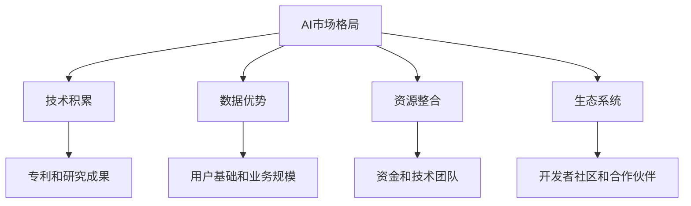

在下一章中，我们将深入分析巨头公司的策略，帮助创业公司更好地理解如何应对这些竞争对手。

---

关键词：AI行业现状、市场格局、巨头公司竞争优势、创业公司挑战、资源有限、技术壁垒、资金压力

摘要：本章分析了AI行业的现状，包括市场格局和巨头公司的竞争优势，同时探讨了创业公司所面临的挑战。这为后续的战略分析和实战案例提供了基础。

---

## 第2章：巨头公司策略解析

> 在了解了AI行业的现状和创业公司的挑战后，深入分析巨头公司的策略显得尤为重要。通过研究这些公司的战略布局、投资与并购策略以及技术创新路径，创业公司可以从中获得灵感，制定出有效的应对策略。

### 2.1 巨头公司的战略布局

巨头公司在AI领域的战略布局通常涉及以下几个方面：

- **全面布局**：这些公司不仅在某一特定领域深耕，而是进行全面的布局，涵盖感知、认知、决策等多个领域。
- **垂直整合**：通过收购和合作，巨头公司试图在AI产业链的各个环节建立自己的优势。
- **生态构建**：巨头公司致力于构建开发者社区和合作伙伴网络，以加速技术的推广和应用。

#### 2.2 巨头公司的投资与并购策略

巨头公司通过投资和并购来扩大在AI领域的布局：

- **投资初创公司**：巨头公司通过投资初创公司，不仅能够获取新的技术和人才，还能够保持技术的前沿性。
- **并购战略**：通过收购成熟的AI公司，巨头公司可以快速获取核心技术和市场份额。
- **合作与联盟**：巨头公司之间也会进行合作和联盟，以共同应对行业挑战。

#### 2.3 巨头公司的技术创新路径

巨头公司在技术创新方面采取以下路径：

- **内部研发**：通过自己的研发团队，巨头公司能够进行前沿技术的探索和研发。
- **开放平台**：通过开放平台，巨头公司鼓励开发者使用他们的技术和工具，从而推动技术的普及和应用。
- **合作研究**：巨头公司还与学术机构和研究团队合作，进行联合研究和技术交流。

#### 小结

巨头公司的战略布局、投资与并购策略以及技术创新路径为创业公司提供了宝贵的借鉴。创业公司可以通过这些策略，找到自己的突破口，制定有效的竞争策略。

**Mermaid 流程图：巨头公司战略布局、投资与并购策略、技术创新路径**

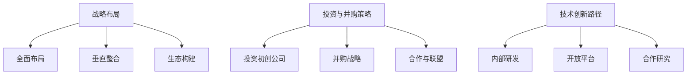

在下一章中，我们将探讨创业公司如何构建自己的核心能力，以应对巨头公司的竞争。

---

关键词：巨头公司策略、战略布局、投资并购、技术创新、内部研发、开放平台、合作研究

摘要：本章分析了巨头公司在AI领域的战略布局、投资与并购策略以及技术创新路径。这些策略为创业公司提供了宝贵的启示，帮助他们应对巨头公司的竞争。

---

## 第3章：创业公司核心能力构建

> 为了在巨头公司的竞争中脱颖而出，创业公司必须构建强大的核心能力。这包括明确的定位、差异化的技术创新策略以及有效的团队建设和人才引进。

### 3.1 创业公司的定位与差异化

#### 3.1.1 明确市场定位

创业公司首先需要明确自己的市场定位。这包括确定目标市场、用户群体和业务领域。通过市场调研和用户反馈，创业公司可以找到尚未被巨头公司充分覆盖的细分市场，从而找到自己的立足点。

**Mermaid 流程图：创业公司市场定位**

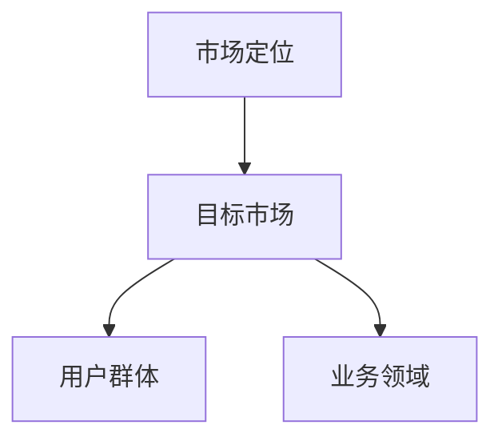

#### 3.1.2 差异化策略

在找到自己的市场定位后，创业公司需要制定差异化策略，以区分自己与巨头公司的产品和服务。这可以通过以下方式实现：

- **技术创新**：在技术层面进行创新，提供独特的功能或更好的用户体验。
- **商业模式**：采用创新的商业模式，如订阅制、平台共享等，以降低用户门槛。
- **服务质量**：提供更优质的服务，如快速响应、个性化定制等，以提升用户满意度。

**Mermaid 流�程图：差异化策略**

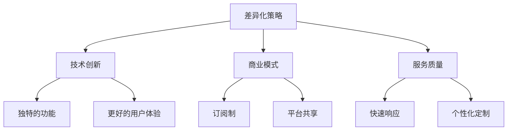

### 3.2 创业公司的技术创新策略

#### 3.2.1 前沿技术跟踪

创业公司需要密切关注前沿技术动态，以便及时调整自己的技术路线。这可以通过以下方式实现：

- **研究机构合作**：与顶尖研究机构合作，获取最新的研究成果。
- **技术论坛与会议**：参加技术论坛和会议，了解行业最新发展趋势。

**Mermaid 流程图：前沿技术跟踪**

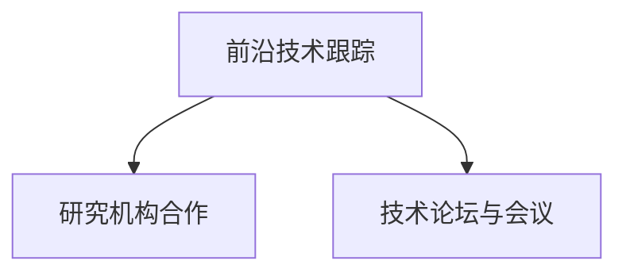

#### 3.2.2 技术研发投入

创业公司需要持续进行技术研发投入，以保持技术领先。这包括：

- **研发团队建设**：组建专业的研发团队，进行持续的技术研发。
- **技术研发资金**：确保有足够的资金用于技术研发，包括硬件设备、软件工具等。

**Mermaid 流程图：技术研发投入**

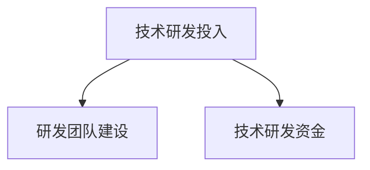

### 3.3 创业公司的团队建设与人才引进

#### 3.3.1 团队建设

创业公司的团队建设至关重要。一个高效的团队可以更好地应对挑战，实现公司的目标。这包括：

- **团队文化**：建立积极向上的团队文化，鼓励创新和合作。
- **团队成员分工**：明确团队成员的职责和分工，确保每个成员都能发挥自己的优势。

**Mermaid 流程图：团队建设**

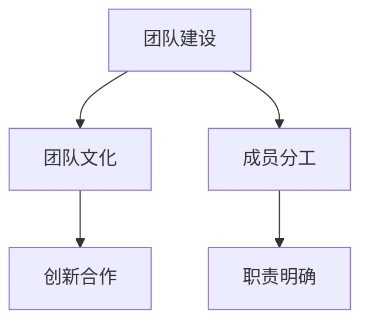

#### 3.3.2 人才引进

创业公司需要引进优秀的人才，以提升团队的整体实力。这包括：

- **人才招聘**：通过多种渠道招聘优秀人才，如校园招聘、社会招聘等。
- **人才培养**：提供培训和职业发展机会，激发人才的潜力。

**Mermaid 流程图：人才引进**

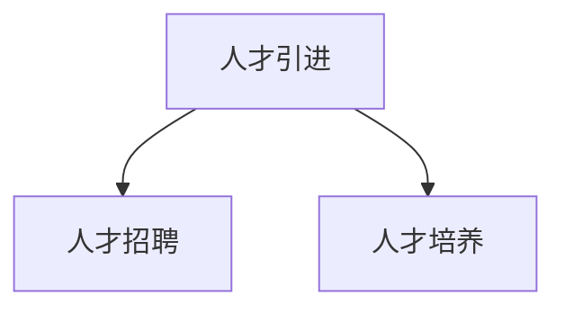

#### 小结

创业公司要构建核心能力，需要明确市场定位，实施差异化策略，关注前沿技术，加大技术研发投入，同时注重团队建设和人才引进。这些措施将为创业公司提供强大的竞争力，帮助它们在巨头公司的竞争中脱颖而出。

---

关键词：创业公司定位、差异化策略、技术创新、前沿技术跟踪、团队建设、人才引进

摘要：本章探讨了创业公司如何通过明确市场定位、差异化策略、技术创新以及团队建设和人才引进来构建核心能力，以应对巨头公司的竞争。

---

## 第4章：创业公司与巨头公司的合作与竞争

> 创业公司在面对巨头公司时，既存在竞争关系，也可能有机会进行合作。在这一章中，我们将分析创业公司与巨头公司的合作模式、如何利用巨头公司资源以及应对巨头公司竞争的策略。

### 4.1 创业公司与巨头公司的合作模式

#### 4.1.1 技术合作

创业公司与巨头公司进行技术合作，可以帮助双方实现资源的共享和优势互补。以下是一些常见的技术合作模式：

- **共同研发**：双方共同投入资源，合作开发新的技术或产品。
- **技术交流**：双方定期进行技术交流和分享，以促进技术的进步。
- **开放API**：巨头公司开放API，允许创业公司使用其技术进行创新和应用。

**Mermaid 流程图：技术合作模式**

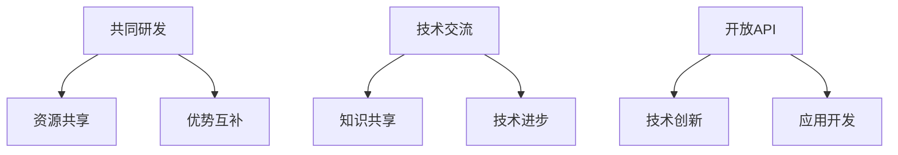

#### 4.1.2 资源合作

创业公司与巨头公司进行资源合作，可以借助巨头公司的资源优势，加速自身的发展。以下是一些常见的资源合作模式：

- **资金支持**：巨头公司提供资金支持，帮助创业公司解决资金问题。
- **市场渠道**：巨头公司提供市场渠道，帮助创业公司快速扩大市场份额。
- **技术支持**：巨头公司提供技术支持，帮助创业公司解决技术难题。

**Mermaid 流程图：资源合作模式**

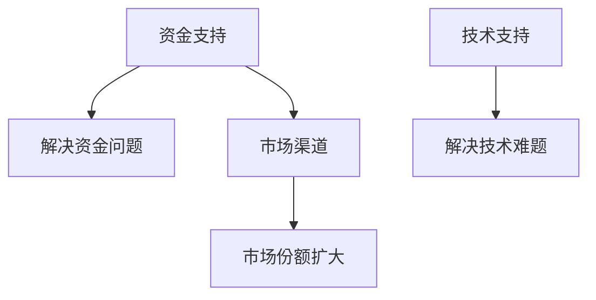

### 4.2 创业公司如何利用巨头公司资源

创业公司可以利用巨头公司的资源，以提升自身的竞争力。以下是一些利用巨头公司资源的方法：

#### 4.2.1 互补性资源利用

- **技术资源**：利用巨头公司的技术资源，进行技术迭代和产品创新。
- **市场资源**：借助巨头公司的市场资源，快速扩大用户基础和市场份额。

#### 4.2.2 合作伙伴网络

- **合作伙伴**：加入巨头公司的合作伙伴网络，与其他合作伙伴共享资源，共同推进业务发展。

**Mermaid 流程图：互补性资源利用**

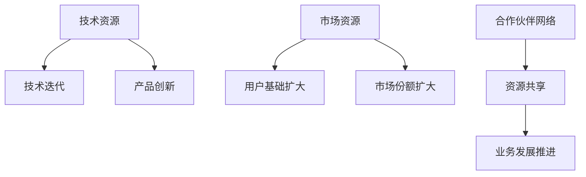

### 4.3 创业公司如何应对巨头公司的竞争

创业公司在面对巨头公司的竞争时，需要采取一系列策略，以保持竞争优势。以下是一些应对策略：

#### 4.3.1 差异化策略

- **产品差异化**：通过技术创新，提供独特的功能和用户体验，区分自己与巨头公司的产品。
- **市场差异化**：寻找未被巨头公司充分覆盖的市场，专注于细分领域的深耕。

#### 4.3.2 快速迭代

- **快速开发**：通过敏捷开发，快速推出新版本，满足用户需求，保持竞争力。
- **迭代优化**：不断进行产品优化，根据用户反馈进行调整，提升产品品质。

#### 4.3.3 合作策略

- **生态合作**：与巨头公司建立合作关系，共同构建生态系统，实现共赢。
- **多元化合作**：与不同领域的巨头公司合作，实现资源的多元化利用。

**Mermaid 流程图：应对策略**

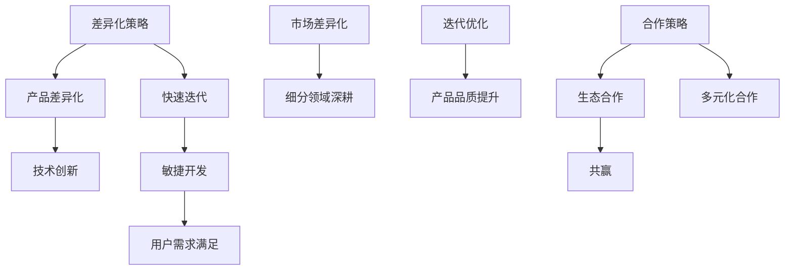

#### 小结

创业公司在与巨头公司合作与竞争中，需要灵活运用各种策略，充分利用巨头公司的资源，同时保持自身的差异化优势。通过差异化策略、快速迭代和合作策略，创业公司可以在巨头公司的竞争中找到自己的立足点，实现可持续发展。

---

关键词：合作模式、资源合作、利用巨头公司资源、差异化策略、快速迭代、合作策略

摘要：本章探讨了创业公司与巨头公司的合作与竞争模式，包括技术合作、资源合作，以及如何利用巨头公司资源。同时，提出了创业公司应对巨头公司竞争的策略，帮助创业公司在激烈的市场竞争中脱颖而出。

---

## 第5章：创业公司的市场拓展策略

> 市场拓展是创业公司成长过程中至关重要的一环。在这一章中，我们将分析创业公司在市场拓展中的策略，包括市场细分与定位、营销策略与品牌建设，以及客户关系管理。

### 5.1 市场细分与定位

#### 5.1.1 市场细分

市场细分是创业公司市场拓展的第一步。通过市场细分，创业公司可以找到潜在客户，并制定针对性的营销策略。以下是一些常用的市场细分方法：

- **地理细分**：根据地理位置将市场划分为不同的区域，如城市、省份等。
- **人口细分**：根据人口特征，如年龄、性别、收入等，将市场划分为不同的群体。
- **行为细分**：根据消费者的行为特征，如购买习惯、使用场景等，将市场划分为不同的群体。
- **心理细分**：根据消费者的心理特征，如价值观、生活方式等，将市场划分为不同的群体。

**Mermaid 流程图：市场细分方法**

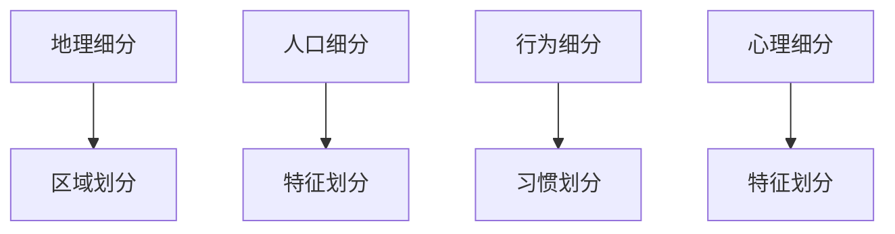

#### 5.1.2 市场定位

在市场细分的基础上，创业公司需要明确自己的市场定位。这包括：

- **目标市场**：确定创业公司主要服务的市场群体，如特定行业或地区。
- **品牌定位**：确定创业公司的品牌形象和价值观，以吸引目标市场。
- **差异化优势**：明确创业公司与其他竞争对手的区别，如技术优势、服务质量等。

**Mermaid 流程图：市场定位**

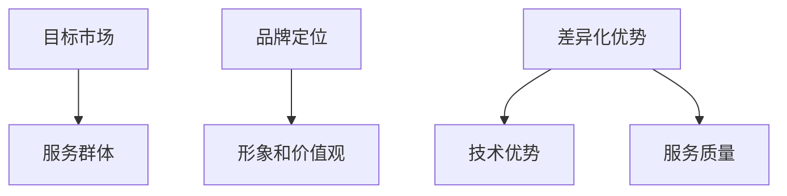

### 5.2 营销策略与品牌建设

#### 5.2.1 营销策略

创业公司需要制定有效的营销策略，以吸引潜在客户。以下是一些常用的营销策略：

- **内容营销**：通过创造有价值的内容，如博客、白皮书、案例研究等，吸引目标客户。
- **社交媒体营销**：利用社交媒体平台，如微博、微信、LinkedIn等，进行品牌推广和客户互动。
- **搜索引擎优化（SEO）**：通过优化网站内容和结构，提高在搜索引擎中的排名，吸引更多流量。
- **电子邮件营销**：通过发送定期的电子邮件，与客户保持联系，提高品牌知名度和客户忠诚度。

**Mermaid 流程图：营销策略**

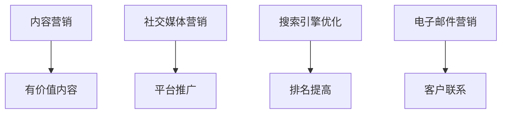

#### 5.2.2 品牌建设

品牌建设是创业公司长期发展的重要任务。以下是一些品牌建设的方法：

- **品牌定位**：明确品牌的核心价值观和品牌形象，以吸引目标客户。
- **品牌传播**：通过各种渠道，如广告、公关活动、社交媒体等，传播品牌信息，提高品牌知名度。
- **用户体验**：提供优质的产品和服务，打造良好的用户体验，增强客户对品牌的忠诚度。

**Mermaid 流程图：品牌建设**

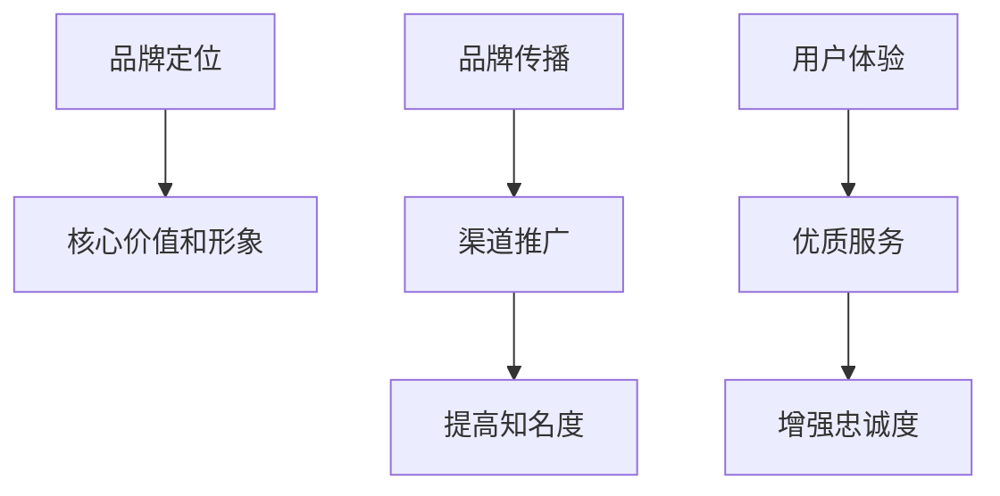

### 5.3 客户关系管理

#### 5.3.1 客户关系管理（CRM）

客户关系管理是创业公司维护客户关系的重要工具。通过CRM系统，创业公司可以记录客户信息、分析客户行为，并提供个性化的服务。以下是一些CRM系统的功能：

- **客户数据管理**：记录和管理客户的基本信息、购买记录、互动历史等。
- **客户细分**：根据客户的特征和行为，将客户划分为不同的群体，进行针对性的营销和服务。
- **客户互动**：通过多种渠道，如电话、邮件、社交媒体等，与客户保持联系，提供及时的支持和反馈。
- **销售预测**：分析客户数据和市场趋势，预测未来的销售情况，制定营销策略。

**Mermaid 流程图：CRM系统功能**

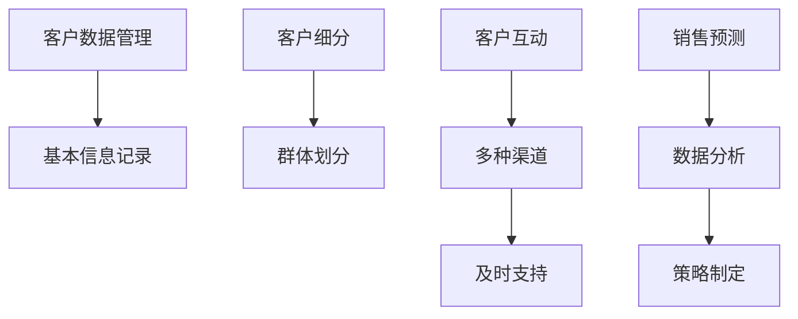

#### 5.3.2 客户忠诚度管理

客户忠诚度管理是提高客户保留率的重要手段。以下是一些提高客户忠诚度的方法：

- **会员计划**：为忠实的客户提供会员优惠和福利，增强他们的归属感。
- **个性化服务**：根据客户的需求和行为，提供个性化的产品推荐和服务。
- **客户反馈**：积极倾听客户的意见和建议，不断改进产品和服务。
- **客户关怀**：定期与客户沟通，提供关怀和帮助，增强客户的满意度和忠诚度。

**Mermaid 流程图：客户忠诚度管理方法**

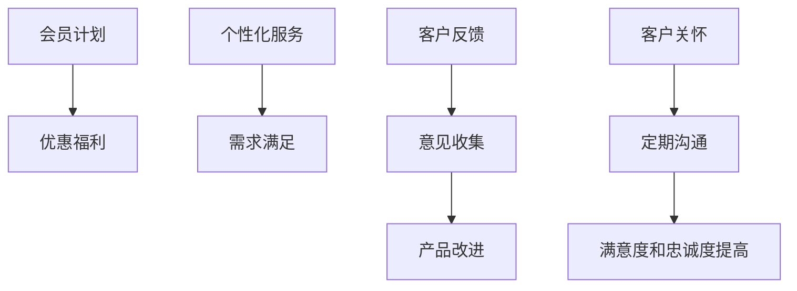

#### 小结

创业公司在市场拓展中需要制定有效的市场细分与定位策略，实施多元化的营销策略，建设强大的品牌，并实施严格的客户关系管理。这些策略将帮助创业公司在激烈的市场竞争中脱颖而出，实现持续增长。

---

关键词：市场细分、市场定位、营销策略、品牌建设、客户关系管理、CRM系统、客户忠诚度

摘要：本章探讨了创业公司在市场拓展中应采取的策略，包括市场细分与定位、营销策略与品牌建设，以及客户关系管理。这些策略将帮助创业公司提高竞争力，实现市场拓展目标。

---

## 第6章：创业公司成功案例分析

> 通过分析创业公司的成功案例，我们可以更好地理解如何在巨头公司的竞争环境中脱颖而出。在本章中，我们将探讨几个创业公司的成功故事，并总结它们的关键经验和教训。

### 6.1 案例一：创业公司如何通过技术创新赢得市场

**案例简介**：公司名为DeepMind，由两个年轻的科学家在2010年创立。DeepMind最初是一家专注于深度学习研究的小型创业公司，后来被谷歌收购。

**成功经验**：

- **技术创新**：DeepMind通过开发强大的深度学习算法，成功解决了复杂的机器学习问题，如游戏、围棋等。
- **持续研发**：公司持续投入大量资金和人力进行技术研发，保持了技术领先地位。
- **市场定位**：DeepMind专注于特定的技术领域，通过解决特定问题赢得了市场的认可。

**教训与启示**：

- **技术创新是关键**：创业公司要成功，必须拥有独特的技术创新。
- **聚焦特定领域**：专注于某一技术领域，通过解决特定问题赢得市场。

**Mermaid 流程图：DeepMind的技术创新路径**

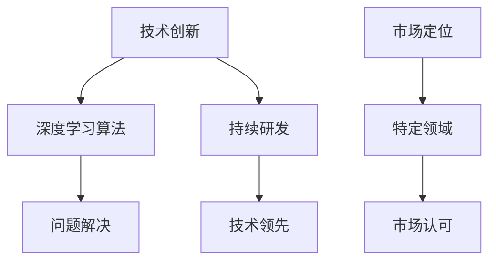

### 6.2 案例二：创业公司如何利用巨头公司资源实现快速发展

**案例简介**：公司名为UiPath，是一家专注于机器人流程自动化的创业公司。在成立后的几年内，UiPath迅速获得了多家巨头公司的投资，包括腾讯和红杉资本。

**成功经验**：

- **巨头投资**：UiPath通过吸引腾讯和红杉资本等巨头公司的投资，获得了充足的资金支持，加速了公司的快速发展。
- **战略合作**：通过与巨头公司建立战略合作关系，UiPath获得了市场渠道和技术支持，提高了市场竞争力。
- **生态系统建设**：公司建立了强大的开发者社区，吸引了大量的开发者参与，推动了产品的创新和应用的广泛。

**教训与启示**：

- **吸引巨头投资**：创业公司可以通过吸引巨头投资，获得资金和市场资源。
- **建立战略合作**：与巨头公司建立战略合作关系，可以实现资源的共享和优势互补。

**Mermaid 流程图：UiPath的资源利用路径**

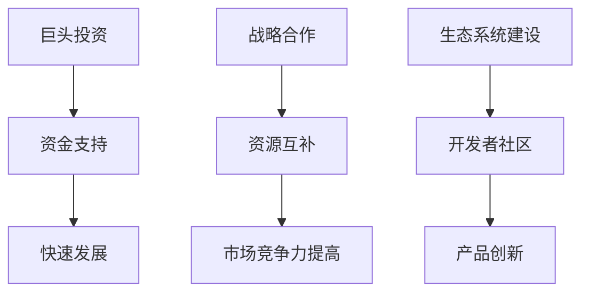

### 6.3 案例三：创业公司如何应对巨头公司的竞争压力

**案例简介**：公司名为Zoom，是一家提供视频会议解决方案的创业公司。在成立初期，Zoom面临着微软、谷歌等巨头公司的竞争压力。

**成功经验**：

- **产品优势**：Zoom提供了高质量、低延迟的视频会议体验，赢得了用户的喜爱。
- **市场定位**：Zoom专注于特定的市场细分，如远程工作和教育，避开了与巨头公司的直接竞争。
- **灵活应对**：Zoom灵活应对市场变化，迅速推出了新的功能和服务，以适应用户的需求。

**教训与启示**：

- **产品优势**：创业公司要成功，必须提供优质的产品和服务。
- **市场细分**：通过专注于特定的市场细分，可以避开与巨头公司的直接竞争。
- **灵活应对**：创业公司要灵活应对市场变化，及时调整策略。

**Mermaid 流程图：Zoom的竞争应对策略**

```mermaid
graph TB
A[产品优势] --> B[高质量视频会议]
B --> C[用户喜爱]
D[市场定位] --> E[特定细分市场]
E --> F[避开了直接竞争]
G[灵活应对] --> H[市场变化]
H --> I[策略调整]
```

#### 小结

通过分析这些成功案例，我们可以看到创业公司成功的关键在于技术创新、资源利用和市场定位。同时，灵活应对市场变化和持续改进产品也是创业公司保持竞争力的关键。

---

关键词：创业公司成功案例、技术创新、市场定位、巨头公司资源、战略合作、产品优势、灵活应对

摘要：本章通过分析DeepMind、UiPath和Zoom等创业公司的成功案例，总结了它们在技术创新、资源利用和市场定位方面的关键经验，以及如何应对巨头公司的竞争压力。

---

## 第7章：创业公司应对巨头竞争的策略与路径

> 在分析了成功案例后，我们需要将理论与实践结合起来，为创业公司提供具体的策略与路径。在这一章中，我们将探讨创业公司应对巨头竞争的总体策略、具体路径以及案例分析。

### 7.1 创业公司应对巨头竞争的总体策略

#### 7.1.1 创新驱动

创新是创业公司应对巨头竞争的核心策略。创业公司需要：

- **技术自主创新**：持续进行技术研发，保持技术领先地位。
- **产品差异化**：提供独特的产品和服务，满足特定用户群体的需求。

#### 7.1.2 资源整合

创业公司需要通过整合外部资源，提高竞争力。具体策略包括：

- **巨头投资**：吸引巨头公司的投资，获得资金和市场资源。
- **战略合作**：与巨头公司建立战略合作关系，实现资源互补。

#### 7.1.3 市场细分

通过市场细分，创业公司可以找到尚未被巨头公司充分覆盖的领域，从而获得竞争优势。具体策略包括：

- **特定领域深耕**：专注于某一特定领域，提供专业化的解决方案。
- **用户需求分析**：深入了解用户需求，提供个性化的产品和服务。

### 7.2 创业公司应对巨头竞争的具体路径

#### 7.2.1 技术创新路径

- **前沿技术跟踪**：关注前沿技术动态，调整技术路线。
- **持续研发投入**：确保有足够的资金和人力资源用于技术研发。
- **知识产权保护**：保护自己的技术专利，防止技术泄露和侵权。

**Mermaid 流程图：技术创新路径**

```mermaid
graph TB
A[前沿技术跟踪] --> B[技术路线调整]
B --> C[持续研发投入]
C --> D[知识产权保护]
```

#### 7.2.2 资源整合路径

- **巨头投资**：寻找合适的投资机会，吸引巨头公司的投资。
- **战略合作**：与巨头公司建立战略合作关系，共享资源和市场。
- **生态系统建设**：建立开发者社区，吸引第三方合作伙伴加入。

**Mermaid 流程图：资源整合路径**

```mermaid
graph TB
A[巨头投资] --> B[资金和市场资源]
B --> C[战略合作]
C --> D[资源共享]
E[生态系统建设] --> F[开发者社区]
F --> G[合作伙伴加入]
```

#### 7.2.3 市场细分路径

- **市场调研**：进行深入的市场调研，了解目标市场的需求和痛点。
- **产品定位**：根据市场调研结果，明确产品定位和目标用户。
- **差异化营销**：提供差异化的产品和服务，满足不同用户群体的需求。

**Mermaid 流程图：市场细分路径**

```mermaid
graph TB
A[市场调研] --> B[需求了解]
B --> C[产品定位]
C --> D[差异化营销]
```

### 7.3 创业公司应对巨头竞争的案例分析

#### 案例一：创业公司A的应对策略

**公司背景**：创业公司A专注于人工智能在医疗领域的应用。

**成功经验**：

- **技术创新**：公司自主研发了一套先进的医疗影像分析系统，提高了诊断的准确性和效率。
- **市场细分**：公司专注于特定的医疗领域，如癌症诊断，提供专业化的解决方案。
- **战略合作**：公司与顶尖医院和医疗机构建立战略合作关系，实现了技术的快速应用和推广。

**策略分析**：

- **技术创新**：创业公司A通过技术创新，提供了具有竞争力的产品和服务。
- **市场细分**：公司专注于特定领域，避开了与巨头公司的直接竞争。
- **战略合作**：通过战略合作，公司获得了市场渠道和资源支持。

**Mermaid 流程图：创业公司A的应对策略**

```mermaid
graph TB
A[技术创新] --> B[医疗影像分析系统]
B --> C[专业解决方案]
D[市场细分] --> E[特定医疗领域]
E --> F[避开了直接竞争]
G[战略合作] --> H[市场渠道和资源支持]
```

#### 案例二：创业公司B的应对策略

**公司背景**：创业公司B专注于智能家居设备的研发。

**成功经验**：

- **巨头投资**：公司获得了多家巨头公司的投资，获得了充足的资金支持。
- **战略合作**：公司与家居制造商建立战略合作关系，实现了产品的快速推广和应用。
- **生态系统建设**：公司建立了智能家居开发者社区，吸引了大量的开发者参与。

**策略分析**：

- **巨头投资**：创业公司B通过吸引巨头投资，获得了资金和市场资源。
- **战略合作**：通过战略合作，公司实现了资源的互补和市场的拓展。
- **生态系统建设**：通过建立开发者社区，公司推动了产品的创新和应用。

**Mermaid 流程图：创业公司B的应对策略**

```mermaid
graph TB
A[巨头投资] --> B[资金和市场资源]
B --> C[战略合作]
C --> D[资源互补和推广]
E[生态系统建设] --> F[开发者社区]
F --> G[产品创新和应用]
```

#### 小结

创业公司在应对巨头竞争时，需要结合实际情况，制定具体的策略与路径。技术创新、市场细分和资源整合是关键策略，而成功案例则提供了宝贵的实践经验。通过这些策略与路径，创业公司可以在巨头竞争中找到自己的立足点，实现持续发展。

---

关键词：创业公司应对策略、总体策略、具体路径、技术创新、市场细分、资源整合、案例分析

摘要：本章探讨了创业公司应对巨头竞争的总体策略与具体路径，并通过成功案例分析了这些策略的实践效果。这些策略与路径为创业公司提供了实用的指导。

---

## 第8章：创业公司的未来趋势

> 随着AI技术的不断进步和市场环境的变化，创业公司的未来发展将面临新的机遇和挑战。在这一章中，我们将探讨AI行业未来发展趋势、创业公司在未来竞争中的机遇与挑战，以及创业公司的长期发展策略。

### 8.1 AI行业未来发展趋势

#### 8.1.1 技术进步

AI技术将继续快速发展，包括：

- **深度学习**：随着计算能力和算法的改进，深度学习技术将得到更广泛的应用。
- **自然语言处理**：自然语言处理技术将变得更加智能化，能够理解复杂的人类语言。
- **计算机视觉**：计算机视觉技术将变得更加精准，能够识别和解析更复杂的图像和视频。

#### 8.1.2 应用场景扩展

AI技术将在更多领域得到应用，包括：

- **医疗健康**：AI技术将在医疗诊断、药物研发等方面发挥重要作用。
- **智能制造**：AI技术将推动智能制造的发展，提高生产效率和产品质量。
- **金融科技**：AI技术将在金融风险管理、智能投顾等方面得到广泛应用。

#### 8.1.3 数据安全与隐私

随着AI技术的普及，数据安全和隐私问题将变得更加重要。如何在保护用户隐私的同时，充分利用数据的价值，将成为一个重要议题。

### 8.2 创业公司在未来竞争中的机遇与挑战

#### 8.2.1 机遇

- **技术红利**：随着AI技术的进步，创业公司有机会推出创新的产品和服务。
- **市场空间**：AI技术在各个领域的应用将带来巨大的市场空间，创业公司可以抓住这些机会。
- **资本支持**：AI领域受到资本市场的青睐，创业公司可以获得更多的投资和融资机会。

#### 8.2.2 挑战

- **技术壁垒**：创业公司需要不断创新，以保持技术领先地位，但这也意味着需要持续的高投入。
- **竞争加剧**：巨头公司将在AI领域继续加大投入，创业公司需要应对更加激烈的竞争。
- **数据隐私**：如何在保护用户隐私的同时，实现数据的高效利用，将是一个挑战。

### 8.3 创业公司的长期发展策略

#### 8.3.1 技术创新

创业公司需要持续进行技术创新，保持技术领先地位。这包括：

- **研发投入**：确保有足够的资金和人力资源用于技术研发。
- **合作与开放**：与其他公司和研究机构合作，共享资源和知识。

#### 8.3.2 市场拓展

创业公司需要不断拓展市场，寻找新的增长点。这包括：

- **多元化应用**：将AI技术应用到更多领域，开拓新的市场空间。
- **全球化布局**：通过全球化布局，开拓国际市场，实现业务的多元化。

#### 8.3.3 风险管理

创业公司需要建立完善的风险管理体系，以应对市场和技术变化带来的风险。这包括：

- **风险识别**：定期进行风险评估，识别潜在的风险。
- **应急准备**：制定应急预案，确保在突发事件时能够迅速应对。

#### 小结

AI行业的未来发展充满了机遇和挑战。创业公司需要紧跟技术发展趋势，抓住市场机遇，同时应对竞争压力和风险挑战。通过持续的创新和市场拓展，创业公司可以在未来竞争中取得成功。

---

关键词：AI行业未来发展趋势、技术进步、应用场景扩展、数据安全、隐私、创业公司机遇、挑战、长期发展策略

摘要：本章分析了AI行业的未来发展趋势，探讨了创业公司在未来竞争中的机遇与挑战，并提出了创业公司的长期发展策略，以帮助创业公司在激烈的市场竞争中取得成功。

---

## 第9章：结语

> 在AI行业快速发展的大背景下，创业公司面临着前所未有的机遇和挑战。通过本章的探讨，我们为创业公司提供了一系列应对巨头竞争的策略和路径，并展望了未来的发展趋势。以下是对全文的总结以及对创业公司的建议。

### 9.1 总结

本文首先分析了AI行业的现状，包括市场格局、巨头公司的竞争优势以及创业公司所面临的挑战。接着，我们深入探讨了巨头公司的策略，包括战略布局、投资与并购策略以及技术创新路径。在此基础上，文章提出了创业公司构建核心能力的策略，如定位与差异化、技术创新、团队建设和人才引进。随后，我们分析了创业公司与巨头公司的合作与竞争模式，提供了市场拓展策略。通过成功案例分析，我们总结了创业公司在技术创新、资源利用和市场定位方面的关键经验。最后，我们探讨了创业公司的未来趋势，提出了长期发展策略。

### 9.2 对创业公司的建议

1. **技术创新**：持续进行技术研发，保持技术领先地位。创新是创业公司的核心竞争力，只有不断推陈出新，才能在激烈的市场竞争中脱颖而出。

2. **市场定位**：明确市场定位，专注于某一特定领域或细分市场。通过市场细分，创业公司可以找到自己的独特优势，避免与巨头公司直接竞争。

3. **合作与开放**：与巨头公司建立战略合作关系，共享资源和市场。同时，积极构建开发者社区，吸引第三方合作伙伴加入，共同推动产品创新和应用。

4. **风险管理**：建立完善的风险管理体系，定期进行风险评估，识别潜在的风险。在突发事件时，能够迅速应对，确保公司业务的稳定运行。

5. **全球化布局**：通过全球化布局，开拓国际市场，实现业务的多元化。这不仅有助于扩大市场份额，还可以降低对单一市场的依赖，提高公司的抗风险能力。

6. **用户导向**：深入了解用户需求，提供个性化的产品和服务。通过满足用户需求，提升用户满意度，增强客户忠诚度。

7. **持续学习**：紧跟技术发展趋势，不断学习和适应市场变化。创业公司需要保持学习和创新的心态，以应对快速变化的市场环境。

### 9.3 展望未来

AI行业正处于快速发展阶段，创业公司面临前所未有的机遇。然而，竞争也将更加激烈，创业公司需要不断提升自身的核心能力，灵活应对市场变化。通过本文提供的策略和建议，创业公司可以更好地应对巨头竞争，实现可持续发展。

---

关键词：AI行业现状、巨头公司策略、创业公司核心能力、市场定位、技术创新、合作与开放、风险管理、全球化布局、用户导向、持续学习

摘要：本文总结了AI行业的现状和巨头公司的策略，探讨了创业公司的核心能力构建和市场拓展策略，提出了应对竞争的建议，并对未来的发展趋势进行了展望。希望这些内容能对创业公司的发展提供有益的启示。

---

**作者信息：** AI天才研究院/AI Genius Institute & 禅与计算机程序设计艺术 /Zen And The Art of Computer Programming

---

通过本文的详细分析和策略建议，我们希望能够为创业公司在巨头竞争的环境中提供实用的指导，帮助他们找到自己的竞争优势，实现长期成功。希望这篇技术博客能够为读者带来深刻的启示和实际的帮助。让我们共同期待AI行业的美好未来！

