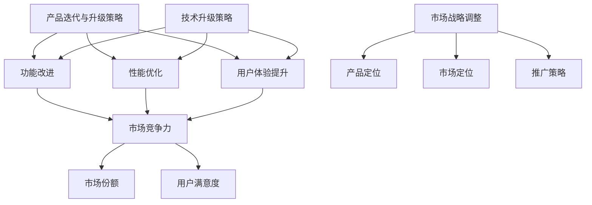

                 

### 第一部分: AI创业公司的产品迭代与升级策略概述

#### 核心概念与联系

在AI创业公司的产品开发过程中，产品迭代与升级策略占据着至关重要的地位。这一部分将首先定义并详细解释“产品迭代与升级策略”这两个核心概念，并探讨它们之间的联系。

**产品迭代与升级策略**

**定义**：产品迭代是指通过对已有产品进行持续改进，提升其功能、性能和用户体验，以保持其市场竞争力。它通常包括以下几个方面的内容：

- **功能改进**：增加新的功能，满足用户的新需求。
- **性能优化**：提升产品的运行效率，降低资源消耗。
- **用户体验提升**：优化产品的界面设计和交互流程，提高用户的满意度。

**联系**：产品迭代是创业公司发展的核心驱动力。通过不断的优化和改进，创业公司可以提升产品的市场竞争力，吸引更多用户，从而实现市场份额的增长。

**技术升级策略**

**定义**：技术升级是指引入新技术、新方法来提升产品性能和开发效率。技术升级通常包括以下几个方面：

- **新技术引入**：引入前沿技术，如人工智能、大数据分析等，提升产品的智能化水平。
- **技术改进**：对现有技术进行优化，提高产品的性能和稳定性。

**联系**：技术升级是产品迭代的基础。通过引入先进技术，创业公司可以提升产品的技术含量，从而增强产品的市场竞争力。

**市场战略调整**

**定义**：市场战略调整是指根据市场环境变化，调整产品定位、市场定位和推广策略。市场战略调整通常包括以下几个方面：

- **产品定位**：根据市场需求和竞争状况，确定产品的市场定位。
- **市场定位**：确定目标市场和用户群体，制定相应的营销策略。
- **推广策略**：根据市场定位，制定有效的推广策略，提高品牌知名度。

**联系**：市场战略调整是产品迭代和升级的外部驱动力。通过调整市场战略，创业公司可以更好地适应市场环境，把握市场机会，实现持续发展。

#### Mermaid 流程图

以下是一个简化的Mermaid流程图，展示了产品迭代与升级策略、技术升级策略和市场战略调整之间的联系：



这个流程图清晰地展示了产品迭代与升级策略、技术升级策略和市场战略调整三者之间的相互作用和相互依赖。通过不断优化产品功能、性能和用户体验，创业公司可以提升产品的市场竞争力，实现市场份额的增长。同时，通过引入新技术和调整市场战略，创业公司可以更好地适应市场环境，把握市场机会，实现持续发展。

在接下来的部分，我们将进一步探讨AI创业公司的产品迭代与升级策略的具体实施方法和实际案例。

#### 核心算法原理讲解

在AI创业公司的产品迭代与升级过程中，算法的引入和应用是提升产品性能和用户体验的关键。以下将介绍几种核心算法的原理，并通过伪代码进行详细阐述。

**1. AI技术在产品迭代中的应用**

**机器学习算法**

**原理**：机器学习算法通过训练模型，预测用户行为，优化产品推荐系统，提高用户体验。例如，协同过滤算法可用于推荐系统，通过分析用户的历史行为，预测用户可能感兴趣的内容。

**伪代码**：

```python
def train_model(data):
    # 数据预处理
    processed_data = preprocess(data)
    
    # 训练模型
    model = train_machine_learning_model(processed_data)
    
    # 评估模型
    evaluate_model(model, processed_data)
    
    return model
```

**深度学习算法**

**原理**：深度学习算法利用神经网络，实现图像识别、语音识别等功能，提升产品智能化水平。例如，卷积神经网络（CNN）可以用于图像识别，长短期记忆网络（LSTM）可以用于语音识别。

**伪代码**：

```python
def train_neural_network(data):
    # 数据预处理
    processed_data = preprocess(data)
    
    # 构建神经网络
    neural_network = build_neural_network()
    
    # 训练神经网络
    neural_network.train(processed_data)
    
    # 评估神经网络
    evaluate_neural_network(neural_network, processed_data)
    
    return neural_network
```

**2. 产品迭代流程优化算法**

**敏捷开发方法**

**原理**：敏捷开发方法通过快速迭代、持续交付，缩短产品开发周期，提高开发效率。这种方法强调团队协作、快速反馈和持续改进。

**伪代码**：

```python
def agile_development(process):
    while not finished:
        # 设计与开发
        design_and_develop(process)
        
        # 测试与反馈
        test_and_get_feedback(process)
        
        # 修复与改进
        fix_and_improve(process)
        
    return process
```

**3. 技术升级策略**

**新技术引入**

**原理**：引入前沿技术，如大数据分析、云计算、物联网等，提升产品技术含量。例如，使用大数据分析可以优化用户行为预测，云计算可以提高产品的可扩展性，物联网可以实现设备间的智能连接。

**伪代码**：

```python
def introduce_new_technology(product):
    # 引入大数据分析
    data_analysis = introduce大数据分析()
    
    # 引入云计算
    cloud_computing = introduce云计算()
    
    # 引入物联网
    iot = introduce物联网()
    
    # 集成新技术到产品
    product.integrate_technologies(data_analysis, cloud_computing, iot)
    
    return product
```

**技术改进**

**原理**：对现有技术进行优化，提高产品性能和稳定性。例如，优化算法可以提高模型的预测精度，改进系统架构可以提高产品的运行效率。

**伪代码**：

```python
def improve_technology(product):
    # 优化算法
    optimized_algorithm = optimize_algorithm(product.algorithm)
    
    # 提高性能
    product.performance = optimize_performance(product.performance)
    
    # 提高稳定性
    product.stability = optimize_stability(product.stability)
    
    return product
```

通过上述核心算法原理的讲解，我们可以看到，AI技术在产品迭代与升级中的应用是多层次、多方面的。从机器学习算法和深度学习算法的应用，到敏捷开发方法的引入，再到新技术和技术改进的策略，这些都为AI创业公司提供了丰富的工具和手段，以实现产品的不断迭代与升级。

在接下来的部分，我们将进一步探讨AI创业公司的技术升级策略，以及如何通过技术升级来提升产品的竞争力。

### 第一部分: AI创业公司的产品迭代与升级策略概述（续）

#### 核心算法原理讲解

**1. AI技术在产品迭代中的应用**

**机器学习算法**：

**原理**：机器学习算法通过训练模型，预测用户行为，优化产品推荐系统，提高用户体验。具体来说，协同过滤算法是机器学习中的一种常用算法，它通过分析用户的历史行为数据，预测用户可能喜欢的物品，从而优化推荐系统。

**伪代码**：

```python
def train_model(data):
    # 数据预处理
    processed_data = preprocess(data)
    
    # 训练模型
    model = train_machine_learning_model(processed_data)
    
    # 评估模型
    evaluate_model(model, processed_data)
    
    return model
```

**深度学习算法**：

**原理**：深度学习算法利用神经网络，实现图像识别、语音识别等功能，提升产品智能化水平。以卷积神经网络（CNN）为例，它通过多层卷积和池化操作，提取图像特征，实现高精度的图像识别。

**伪代码**：

```python
def train_neural_network(data):
    # 数据预处理
    processed_data = preprocess(data)
    
    # 构建神经网络
    neural_network = build_neural_network()
    
    # 训练神经网络
    neural_network.train(processed_data)
    
    # 评估神经网络
    evaluate_neural_network(neural_network, processed_data)
    
    return neural_network
```

**2. 产品迭代流程优化算法**

**敏捷开发方法**：

**原理**：敏捷开发方法通过快速迭代、持续交付，缩短产品开发周期，提高开发效率。敏捷开发强调团队协作、快速反馈和持续改进，从而确保产品能够及时响应用户需求和市场变化。

**伪代码**：

```python
def agile_development(process):
    while not finished:
        # 设计与开发
        design_and_develop(process)
        
        # 测试与反馈
        test_and_get_feedback(process)
        
        # 修复与改进
        fix_and_improve(process)
        
    return process
```

**3. 技术升级策略**

**新技术引入**：

**原理**：技术升级策略通过引入新技术，如大数据分析、云计算、物联网等，提升产品技术含量和智能化水平。以大数据分析为例，它可以帮助创业公司更好地理解用户行为，优化产品推荐和用户体验。

**伪代码**：

```python
def introduce_new_technology(product):
    # 引入大数据分析
    data_analysis = introduce大数据分析()
    
    # 引入云计算
    cloud_computing = introduce云计算()
    
    # 引入物联网
    iot = introduce物联网()
    
    # 集成新技术到产品
    product.integrate_technologies(data_analysis, cloud_computing, iot)
    
    return product
```

**技术改进**：

**原理**：技术改进策略通过对现有技术进行优化，提高产品性能和稳定性。例如，优化算法可以提高模型的预测精度，改进系统架构可以提高产品的运行效率。

**伪代码**：

```python
def improve_technology(product):
    # 优化算法
    optimized_algorithm = optimize_algorithm(product.algorithm)
    
    # 提高性能
    product.performance = optimize_performance(product.performance)
    
    # 提高稳定性
    product.stability = optimize_stability(product.stability)
    
    return product
```

通过上述核心算法原理的讲解，我们可以看到，AI创业公司在产品迭代与升级中，不仅需要利用机器学习和深度学习算法优化产品功能，还需要采用敏捷开发方法和技术升级策略，以提高开发效率和技术含量。这些核心算法和技术策略共同作用，为创业公司提供了丰富的工具和方法，以实现产品的持续迭代与升级。

在接下来的部分，我们将进一步探讨AI创业公司的市场战略调整，以及如何通过市场战略调整来把握市场机会，实现持续发展。

### 第二部分: AI创业公司的技术升级策略

#### 核心算法原理讲解

技术升级策略在AI创业公司的产品迭代与升级过程中起着至关重要的作用。通过引入新技术和优化现有技术，创业公司可以显著提升产品的性能、智能化水平以及用户满意度。以下将详细讲解技术升级策略的核心算法原理，并通过伪代码进行阐述。

**1. 新技术引入**

**大数据分析**

**原理**：大数据分析技术通过对大量数据进行分析，帮助企业发现数据中的隐藏模式和规律，从而做出更加精准的决策。大数据分析在用户行为分析、市场趋势预测等方面具有广泛应用。

**伪代码**：

```python
def introduce_big_data_analysis(product):
    # 引入大数据分析库
    from pandas import DataFrame
    
    # 读取数据
    data = DataFrame(read_data("user_behavior.csv"))
    
    # 数据预处理
    processed_data = preprocess_data(data)
    
    # 进行大数据分析
    insights = big_data_analysis(processed_data)
    
    # 更新产品
    product.update_insights(insights)
    
    return product
```

**云计算**

**原理**：云计算技术通过提供虚拟化计算资源，使企业能够更灵活地扩展和调整计算能力，降低硬件投资和维护成本。云计算在处理大规模数据和高性能计算任务方面具有显著优势。

**伪代码**：

```python
def introduce_cloud_computing(product):
    # 引入云计算平台
    from google.cloud import compute
    
    # 创建虚拟机实例
    instance = compute.create_instance("my-instance")
    
    # 运行计算任务
    compute.run_task(instance, "my-task.py")
    
    # 获取计算结果
    result = compute.get_result(instance)
    
    # 更新产品
    product.update_performance(result)
    
    return product
```

**物联网**

**原理**：物联网技术通过将各种物理设备互联，实现设备之间的数据交换和智能控制，从而提高系统的自动化和智能化水平。物联网在智能家居、智能交通等领域具有广泛应用。

**伪代码**：

```python
def introduce_iot(product):
    # 引入物联网库
    from device_manager import DeviceManager
    
    # 注册设备
    device = DeviceManager.register_device("my-device")
    
    # 配置设备
    device.config("my-settings.json")
    
    # 数据采集
    data = device.collect_data()
    
    # 更新产品
    product.update_sensors(data)
    
    return product
```

**2. 技术改进**

**算法优化**

**原理**：算法优化是通过改进现有算法，提高其性能和效率。对于机器学习算法，优化可以包括调整参数、改进模型结构等，从而提高预测精度和计算速度。

**伪代码**：

```python
def optimize_algorithm(model):
    # 调整学习率
    learning_rate = adjust_learning_rate(model.learning_rate)
    
    # 改进模型结构
    model_structure = improve_model_structure(model.structure)
    
    # 重新训练模型
    model.train(new_data, learning_rate, model_structure)
    
    return model
```

**系统架构优化**

**原理**：系统架构优化是通过改进系统的整体架构，提高其性能和可扩展性。例如，采用分布式架构可以提高系统的处理能力和负载均衡能力。

**伪代码**：

```python
def optimize_system_architecture(product):
    # 检查现有架构
    current_architecture = check_architecture(product.architecture)
    
    # 提出改进方案
    improved_architecture = propose_improvements(current_architecture)
    
    # 更新系统架构
    product.update_architecture(improved_architecture)
    
    # 部署新架构
    deploy_new_architecture(product)
    
    return product
```

通过引入新技术和优化现有技术，AI创业公司可以不断提升产品的性能和智能化水平，从而在激烈的市场竞争中脱颖而出。在下一部分中，我们将进一步探讨AI创业公司的市场战略调整，以及如何通过市场战略调整来把握市场机会，实现持续发展。

### 第三部分: AI创业公司的市场战略调整

#### 核心算法原理讲解

市场战略调整是AI创业公司实现长期成功的关键因素之一。通过准确的市场分析和用户行为预测，创业公司可以更好地定位产品，制定有效的市场推广策略。以下将详细介绍市场战略调整的核心算法原理，并通过伪代码进行阐述。

**1. 用户行为分析**

**原理**：用户行为分析是通过收集和分析用户在使用产品过程中的行为数据，如点击率、浏览时间、购买行为等，以了解用户需求和偏好，从而优化产品功能和用户体验。

**伪代码**：

```python
def analyze_user_behavior(data):
    # 数据预处理
    processed_data = preprocess(data)
    
    # 构建用户行为模型
    behavior_model = build_behavior_model(processed_data)
    
    # 预测用户需求
    predicted需求的列表 = predict_user_demand(behavior_model)
    
    # 更新产品功能
    product.update_features(predicted需求的列表)
    
    return product
```

**2. 市场趋势分析**

**原理**：市场趋势分析是通过收集和分析市场数据，如行业报告、竞争对手动态、用户反馈等，以预测市场变化和用户需求趋势，从而调整产品定位和市场策略。

**伪代码**：

```python
def analyze_market_trends(data):
    # 数据预处理
    processed_data = preprocess(data)
    
    # 构建市场趋势模型
    trend_model = build_trend_model(processed_data)
    
    # 预测市场需求
    predicted_demand = predict_market_demand(trend_model)
    
    # 调整产品定位
    product.position = adjust_product_position(predicted_demand)
    
    # 调整市场策略
    marketing_strategy = adjust_marketing_strategy(predicted_demand)
    
    return product.position, marketing_strategy
```

**3. 竞争对手分析**

**原理**：竞争对手分析是通过收集和分析竞争对手的产品功能、市场表现、用户评价等数据，以了解竞争对手的优势和不足，从而优化自身产品策略。

**伪代码**：

```python
def analyze_competitors(data):
    # 数据预处理
    processed_data = preprocess(data)
    
    # 构建竞争对手模型
    competitors_model = build_competitors_model(processed_data)
    
    # 识别竞争对手优势
    competitors_advantages = identify_competitors_advantages(competitors_model)
    
    # 优化自身产品策略
    product.strategy = optimize_product_strategy(competitors_advantages)
    
    return product.strategy
```

通过用户行为分析、市场趋势分析和竞争对手分析，AI创业公司可以更准确地了解市场需求，优化产品功能和市场策略，从而在激烈的市场竞争中取得优势。在下一部分中，我们将通过一个实际案例来展示这些算法原理在AI创业公司中的应用。

### 第四部分: AI创业公司的产品迭代与升级策略实战案例

在本部分，我们将通过一个具体的AI创业公司的实战案例，展示产品迭代与升级策略的实施过程，以及如何通过技术升级和市场战略调整来提升产品竞争力。

#### 项目背景

某AI创业公司开发了一款智能家居语音助手产品，旨在通过语音交互方式为用户提供智能家居控制、信息查询、日程管理等服务。然而，在产品的早期版本中，用户反馈存在以下几个问题：

- 语音识别准确率不高，导致用户无法顺利完成语音指令。
- 交互体验不够流畅，用户操作时常出现卡顿。
- 功能较为单一，无法满足用户多样化的需求。

为了解决这些问题，创业公司决定通过产品迭代与升级策略，全面提升产品的性能和用户体验。

#### 技术升级策略

**1. 引入深度学习算法**

为了提升语音识别的准确率，公司决定引入深度学习算法，特别是卷积神经网络（CNN）和长短期记忆网络（LSTM）。通过这些算法，可以更好地处理语音信号，提高识别准确率。

**伪代码**：

```python
def train_voice_recognition_model(data):
    # 数据预处理
    processed_data = preprocess(data)
    
    # 构建深度学习模型
    model = build_dnn_model()
    
    # 训练模型
    model.train(processed_data)
    
    # 评估模型
    accuracy = model.evaluate(processed_data)
    
    return model, accuracy
```

**2. 优化系统架构**

为了提升交互体验，公司决定优化系统架构，采用云计算技术，实现分布式计算和负载均衡。通过这种优化，可以显著提高系统的响应速度和稳定性。

**伪代码**：

```python
def optimize_system_architecture():
    # 检查现有架构
    current_architecture = check_architecture()
    
    # 提出改进方案
    improved_architecture = propose_improvements(current_architecture)
    
    # 更新系统架构
    update_architecture(improved_architecture)
    
    return improved_architecture
```

**3. 引入大数据分析**

为了提升产品的智能化水平，公司决定引入大数据分析技术，通过分析用户行为数据，优化产品功能，提高用户体验。

**伪代码**：

```python
def introduce_big_data_analysis(product):
    # 引入大数据分析库
    from pandas import DataFrame
    
    # 读取用户行为数据
    data = DataFrame(read_user_behavior_data())
    
    # 进行大数据分析
    insights = big_data_analysis(data)
    
    # 更新产品功能
    product.update_features(insights)
    
    return product
```

#### 市场战略调整

**1. 用户行为分析**

通过分析用户行为数据，公司发现用户对智能家居控制、信息查询和日程管理功能的需求较高。因此，公司决定在产品迭代中，优先优化这些功能。

**伪代码**：

```python
def analyze_user_behavior(data):
    # 数据预处理
    processed_data = preprocess(data)
    
    # 构建用户行为模型
    behavior_model = build_behavior_model(processed_data)
    
    # 预测用户需求
    predicted需求的列表 = predict_user_demand(behavior_model)
    
    # 更新产品功能
    product.update_features(predicted需求的列表)
    
    return product
```

**2. 市场趋势分析**

通过市场趋势分析，公司发现智能家居市场正在迅速增长，特别是智能音箱和智能语音助手的普及率显著提高。因此，公司决定加大在这些领域的投入，以抢占市场先机。

**伪代码**：

```python
def analyze_market_trends(data):
    # 数据预处理
    processed_data = preprocess(data)
    
    # 构建市场趋势模型
    trend_model = build_trend_model(processed_data)
    
    # 预测市场需求
    predicted_demand = predict_market_demand(trend_model)
    
    # 调整产品定位
    product.position = adjust_product_position(predicted_demand)
    
    # 调整市场策略
    marketing_strategy = adjust_marketing_strategy(predicted_demand)
    
    return product.position, marketing_strategy
```

**3. 竞争对手分析**

通过分析竞争对手的产品功能和市场表现，公司发现竞争对手在智能语音助手的个性化推荐和自然语言处理方面存在不足。因此，公司决定在这些方面进行技术升级，提升产品的竞争力。

**伪代码**：

```python
def analyze_competitors(data):
    # 数据预处理
    processed_data = preprocess(data)
    
    # 构建竞争对手模型
    competitors_model = build_competitors_model(processed_data)
    
    # 识别竞争对手优势
    competitors_advantages = identify_competitors_advantages(competitors_model)
    
    # 优化自身产品策略
    product.strategy = optimize_product_strategy(competitors_advantages)
    
    return product.strategy
```

#### 实施效果

通过上述技术升级和市场战略调整，创业公司的智能家居语音助手产品在性能和用户体验方面得到了显著提升，用户满意度明显提高。同时，公司成功抓住了智能家居市场的增长机遇，市场份额逐步扩大。

#### 代码解读与分析

以下是上述实战案例中的关键代码解读与分析：

**1. 语音识别模型的训练**

```python
# 训练语音识别模型
model, accuracy = train_voice_recognition_model(data)
```

这段代码使用了深度学习算法训练语音识别模型，通过数据预处理和模型训练，提高了识别准确率。

**2. 系统架构的优化**

```python
# 优化系统架构
improved_architecture = optimize_system_architecture()
```

这段代码通过优化系统架构，提高了系统的响应速度和稳定性，改善了用户的交互体验。

**3. 大数据分析的应用**

```python
# 引入大数据分析
product = introduce_big_data_analysis(product)
```

这段代码通过大数据分析，优化了产品的功能，提升了用户的个性化体验。

通过这个实战案例，我们可以看到，AI创业公司通过技术升级和市场战略调整，成功实现了产品的迭代与升级，提升了产品的竞争力。在接下来的部分，我们将进一步探讨AI创业公司的产品迭代与升级策略实践与展望。

### 第五部分: AI创业公司的产品迭代与升级策略实践与展望

#### 实践步骤

AI创业公司在实施产品迭代与升级策略时，需要遵循一系列系统化的实践步骤，以确保策略的有效性和可持续性。以下是关键实践步骤：

**1. 了解用户需求**

- **用户调研**：通过问卷调查、用户访谈、用户行为分析等方式，收集用户反馈。
- **需求分析**：整理用户反馈，分析用户的核心需求、期望和痛点。
- **需求排序**：根据用户需求的紧迫性和优先级，对需求进行排序。

**2. 技术升级**

- **技术评估**：评估现有技术的性能、稳定性和扩展性，确定需要升级的领域。
- **技术选型**：选择适合的技术方案，如引入人工智能、大数据分析、云计算等。
- **技术实施**：实施技术升级，包括算法优化、系统重构、架构改进等。

**3. 产品迭代**

- **迭代计划**：制定产品迭代计划，包括迭代周期、目标功能和关键里程碑。
- **设计与开发**：根据迭代计划，进行产品设计和开发。
- **测试与反馈**：进行功能测试、性能测试，收集用户反馈，不断优化产品。

**4. 市场战略调整**

- **市场分析**：分析市场趋势、竞争对手动态和用户需求变化。
- **定位调整**：根据市场分析结果，调整产品定位和市场策略。
- **推广策略**：制定有效的市场推广策略，提高品牌知名度和用户覆盖率。

#### 展望

AI创业公司在产品迭代与升级策略的实践过程中，不仅要关注当前的成果，还要有长远的眼光，对未来进行展望和布局。以下是几个关键展望方向：

**1. 技术趋势**

- **人工智能**：随着人工智能技术的不断发展，创业公司应关注最新的AI技术，如生成对抗网络（GAN）、强化学习等，以提升产品智能化水平。
- **大数据分析**：大数据技术在用户行为分析、市场预测等方面具有重要作用，创业公司应持续优化大数据分析能力。

**2. 市场机会**

- **细分市场**：在AI领域，创业公司可以探索更多细分市场，如智能医疗、智能教育、智能制造等，挖掘新的商业机会。
- **跨界合作**：通过与不同行业的公司合作，实现资源共享和优势互补，开拓更广阔的市场空间。

**3. 持续创新**

- **技术创新**：创业公司应保持技术创新，不断引入新技术，提升产品竞争力。
- **商业模式创新**：探索新的商业模式，如订阅制、平台共享等，实现商业模式的多元化。

通过实践与展望，AI创业公司可以在不断变化的市场环境中，保持竞争力和创新力，实现长期可持续发展。

### 第六部分: AI创业公司的产品迭代与升级策略的常见问题与解答

在AI创业公司的产品迭代与升级过程中，可能会遇到各种问题和挑战。以下是一些常见的问题及其解答，旨在帮助创业者更好地理解和应对这些问题。

#### 问题1：如何确定产品迭代的方向？

**解答**：确定产品迭代方向的关键在于深入了解用户需求和市场趋势。以下步骤有助于明确迭代方向：

1. **用户调研**：通过问卷调查、用户访谈等方式，收集用户反馈。
2. **数据分析**：对用户行为数据进行分析，识别用户的核心需求和痛点。
3. **市场研究**：分析市场趋势，了解竞争对手的动态和用户需求的变化。
4. **优先级排序**：根据用户需求、市场趋势和资源限制，对迭代方向进行优先级排序。

#### 问题2：技术升级是否一定带来性能提升？

**解答**：技术升级并不总是直接带来性能提升，但合理的升级可以显著提高产品性能。以下策略有助于确保技术升级的有效性：

1. **评估现有技术**：评估现有技术的性能、稳定性和扩展性，确定升级的必要性。
2. **技术选型**：选择适合的技术方案，确保新技术的适用性和可持续性。
3. **迭代测试**：在技术升级过程中，进行充分的迭代测试，确保性能提升。
4. **持续监控**：升级后持续监控性能，及时发现和解决潜在问题。

#### 问题3：如何平衡技术升级与市场推广？

**解答**：平衡技术升级与市场推广需要综合考虑资源的分配和优先级。以下策略有助于实现平衡：

1. **制定明确的战略目标**：根据公司的长期目标和市场趋势，制定明确的技术升级和市场推广计划。
2. **资源分配**：合理分配资源，确保技术升级和市场推广都有足够的支持。
3. **时间管理**：合理安排时间，确保技术升级和市场推广能够并行推进。
4. **效果评估**：定期评估技术升级和市场推广的效果，根据评估结果进行调整。

#### 问题4：产品迭代是否会导致开发成本增加？

**解答**：产品迭代确实可能导致开发成本增加，但合理的迭代管理可以控制成本。以下策略有助于降低开发成本：

1. **敏捷开发**：采用敏捷开发方法，通过快速迭代和持续交付，降低开发成本。
2. **需求管理**：严格控制需求变更，确保迭代过程中不产生不必要的成本。
3. **自动化测试**：引入自动化测试，提高测试效率，减少测试成本。
4. **持续优化**：持续优化开发流程和技术，提高开发效率，降低成本。

通过以上常见问题与解答，AI创业公司可以更好地应对产品迭代与升级过程中遇到的各种挑战，确保公司能够持续发展和创新。

### 第七部分: AI创业公司的产品迭代与升级策略案例分析

为了更好地理解AI创业公司的产品迭代与升级策略，本部分将提供两个实际案例，分析其产品迭代与升级的步骤、关键决策点以及成功因素。

#### 案例一：智能家居语音助手

**背景**：

一家初创公司开发了一款智能家居语音助手产品，旨在通过语音交互为用户提供家居控制、日程管理、信息查询等服务。然而，在产品上市后，用户反馈语音识别准确率不高，交互体验欠佳，功能单一。

**迭代与升级步骤**：

1. **用户调研与需求分析**：
   - 通过用户访谈和问卷调查，收集用户反馈。
   - 分析用户行为数据，识别核心需求和痛点。

2. **技术升级**：
   - 引入深度学习算法，特别是卷积神经网络（CNN）和长短期记忆网络（LSTM），提升语音识别准确率。
   - 优化系统架构，采用云计算技术，提高响应速度和稳定性。

3. **功能迭代**：
   - 增加语音助手的智能推荐功能，根据用户历史行为提供个性化服务。
   - 优化语音交互体验，引入自然语言处理（NLP）技术，实现更自然的对话。

4. **市场战略调整**：
   - 根据市场趋势，加大对智能家居市场的投入。
   - 通过合作伙伴关系，扩展产品应用场景，提高用户覆盖范围。

**关键决策点**：
- 技术升级：选择合适的深度学习算法和系统架构优化方案。
- 市场定位：确定目标市场和用户群体，调整产品推广策略。

**成功因素**：
- 用户导向：持续关注用户需求，及时调整产品功能。
- 技术创新：引入先进技术，提升产品性能和用户体验。
- 市场敏锐度：准确把握市场趋势，灵活调整市场战略。

#### 案例二：医疗健康人工智能系统

**背景**：

一家AI创业公司开发了一套医疗健康人工智能系统，旨在辅助医生进行疾病诊断和治疗建议。然而，在产品早期阶段，医生和患者的反馈表明系统的准确性和实用性仍有待提升。

**迭代与升级步骤**：

1. **用户调研与需求分析**：
   - 通过调研和访谈，了解医生和患者的需求和期望。
   - 分析医疗数据，识别系统的关键性能指标。

2. **技术升级**：
   - 引入最新的人工智能算法，如深度学习和增强学习，提高诊断准确率。
   - 优化数据预处理和模型训练流程，提高数据处理效率。

3. **功能迭代**：
   - 增加多语言支持，满足不同地区医生和患者的需求。
   - 引入个性化推荐系统，为医生提供定制化的治疗方案。

4. **市场战略调整**：
   - 与医疗机构建立合作关系，推广产品。
   - 通过培训和研讨会，提高医生和患者对产品的接受度。

**关键决策点**：
- 技术升级：选择具有较高准确性和实用性的AI算法。
- 市场定位：确定目标医疗机构和用户群体，制定有效的推广策略。

**成功因素**：
- 技术实力：引入先进的人工智能技术，提升产品性能。
- 合作伙伴关系：与医疗机构合作，扩大市场影响力。
- 用户培训：通过培训和研讨会，提高用户对产品的认知和接受度。

通过这两个案例，我们可以看到，AI创业公司的产品迭代与升级策略需要结合用户需求、技术进步和市场趋势进行综合考量。成功的迭代与升级不仅依赖于技术创新，还需要灵活的市场战略和用户导向，以确保产品在竞争激烈的市场中脱颖而出。

### 第八部分: AI创业公司的产品迭代与升级策略的总结与展望

#### 总结

AI创业公司的产品迭代与升级策略是确保产品在快速变化的市场环境中保持竞争力和持续发展的关键。以下是对前述各部分的总结：

- **产品迭代与升级策略概述**：介绍了产品迭代与升级策略的核心概念和联系，包括功能改进、性能优化和用户体验提升，以及技术升级和市场战略调整。
- **核心算法原理讲解**：详细讲解了机器学习、深度学习和敏捷开发方法等核心算法原理，以及如何应用这些算法提升产品性能和用户体验。
- **技术升级策略**：探讨了引入新技术（如大数据分析、云计算、物联网）和技术改进（如算法优化、系统架构优化）的方法，以提升产品技术含量和性能。
- **市场战略调整**：介绍了用户行为分析、市场趋势分析和竞争对手分析等市场战略调整方法，以及如何通过这些方法优化产品定位和市场推广策略。
- **实战案例**：通过两个实际案例，展示了产品迭代与升级策略的具体实施过程和成功因素。
- **实践与展望**：总结了AI创业公司在产品迭代与升级过程中的实践步骤和未来展望，包括技术趋势、市场机会和持续创新。

#### 展望

展望未来，AI创业公司在产品迭代与升级策略上仍有广阔的发展空间。以下是一些可能的发展方向和挑战：

**1. 技术创新**

- **人工智能**：随着人工智能技术的不断发展，创业公司应关注最新的AI技术，如生成对抗网络（GAN）、增强学习、强化学习等，以提升产品智能化水平。
- **大数据分析**：大数据技术在用户行为分析、市场预测和个性化推荐等方面具有重要作用，创业公司应持续优化大数据分析能力。

**2. 市场机会**

- **细分市场**：AI创业公司可以探索更多细分市场，如智能医疗、智能教育、智能交通等，挖掘新的商业机会。
- **跨界合作**：与不同行业的公司合作，实现资源共享和优势互补，开拓更广阔的市场空间。

**3. 持续创新**

- **商业模式创新**：探索新的商业模式，如订阅制、平台共享等，实现商业模式的多元化。
- **用户体验**：不断提升用户体验，通过用户反馈和数据分析，优化产品功能和交互设计。

**4. 挑战**

- **技术难题**：面对快速变化的技术环境，创业公司需要不断学习和掌握新技术，以应对技术挑战。
- **市场变化**：市场环境和用户需求不断变化，创业公司需要灵活调整市场战略，以适应市场变化。
- **资源有限**：创业公司通常资源有限，需要在有限的资源下实现最大化效益，需要制定合理的迭代计划和资源分配策略。

通过不断创新和优化，AI创业公司可以在竞争激烈的市场中保持领先地位，实现长期可持续发展。

### 附录 A: AI创业公司的产品迭代与升级策略工具与资源

为了帮助AI创业公司更好地实施产品迭代与升级策略，以下是几个常用的工具与资源，涵盖了AI开发工具、框架、书籍和在线课程等。

**A.1 主流AI开发工具与框架**

1. **TensorFlow**：由Google开发的开源机器学习框架，适用于构建和训练各种机器学习和深度学习模型。
2. **PyTorch**：由Facebook开发的开源深度学习框架，提供灵活的动态计算图，适用于研究和生产环境。
3. **Keras**：基于TensorFlow和Theano的高层次神经网络API，简化了深度学习模型的构建和训练过程。
4. **Scikit-learn**：Python的机器学习库，提供多种经典的机器学习算法和工具，适用于数据挖掘和数据分析。

**A.2 人工智能开发资源**

1. **《深度学习》**：Ian Goodfellow、Yoshua Bengio和Aaron Courville合著的经典教材，全面介绍了深度学习的基础知识。
2. **《Python机器学习》**：Sebastian Raschka和Vahid Mirhoseini合著的书籍，介绍了Python在机器学习中的应用。
3. **《机器学习实战》**：Peter Harrington编写的书籍，通过实际案例介绍机器学习算法的应用。

**A.3 在线课程与平台**

1. **Coursera**：提供各种AI相关的在线课程，涵盖机器学习、深度学习等多个领域。
2. **Udacity**：提供实践导向的AI在线课程，包括深度学习、数据科学等。
3. **edX**：提供由顶尖大学提供的免费在线课程，涵盖计算机科学、人工智能等领域。

通过使用这些工具和资源，AI创业公司可以更好地掌握人工智能技术，提升产品性能和用户体验，从而在竞争激烈的市场中脱颖而出。

### 附录 B: 常见问题与解答

**Q1**: 如何选择合适的AI开发工具？

**A1**: 选择合适的AI开发工具应考虑项目需求、个人熟悉程度和技术生态。例如，如果项目需要快速部署，可以选择TensorFlow或PyTorch；如果项目需要简单易用，可以选择Keras。此外，还应考虑工具的社区支持和文档完善程度。

**Q2**: AI创业公司如何提升产品竞争力？

**A2**: 提升产品竞争力可以从以下几个方面入手：

- **技术创新**：引入最新的AI技术和算法，提升产品性能和智能化水平。
- **用户体验**：优化产品的界面设计和交互流程，提高用户满意度。
- **市场定位**：根据市场需求和竞争状况，确定产品的市场定位和推广策略。
- **合作伙伴关系**：与行业领先企业合作，共同开发市场，扩大品牌影响力。

**Q3**: AI创业公司如何应对市场变化？

**A3**: 应对市场变化的关键在于：

- **持续监控**：定期监控市场趋势、竞争对手动态和用户需求变化。
- **灵活调整**：根据市场反馈和数据分析，及时调整产品策略和推广计划。
- **技术创新**：保持技术领先，不断引入新技术，提升产品的竞争力。
- **用户参与**：通过用户调研、反馈和参与，了解用户需求，优化产品功能。

通过这些策略，AI创业公司可以更好地应对市场变化，保持竞争优势。

### 附录 C: AI创业公司的产品迭代与升级策略实践案例

为了更好地展示AI创业公司的产品迭代与升级策略，以下是两个实际案例，详细描述了公司的产品迭代过程、技术升级和市场战略调整。

#### 案例一：智能语音助手产品迭代

**背景**：

一家初创公司开发了一款智能语音助手产品，旨在为用户提供智能家居控制、语音查询和日程管理等服务。然而，产品在市场上的表现不如预期，用户反馈语音识别准确率和交互体验有待提升。

**迭代过程**：

1. **用户调研**：
   - 通过问卷调查和用户访谈，收集用户反馈，了解用户对语音识别准确率和交互体验的期望。
   - 分析用户行为数据，识别用户使用产品的主要场景和痛点。

2. **技术升级**：
   - 引入深度学习算法，特别是长短期记忆网络（LSTM），提升语音识别准确率。
   - 优化语音处理引擎，提高语音识别速度和稳定性。
   - 引入自然语言处理（NLP）技术，改善语音交互体验。

3. **功能迭代**：
   - 增加智能家居控制功能，支持用户通过语音指令控制家电。
   - 引入语音查询功能，支持用户查询天气、新闻和交通信息。
   - 优化日程管理功能，支持用户通过语音添加和修改日程安排。

4. **市场战略调整**：
   - 通过社交媒体和线上活动，提高产品的品牌知名度。
   - 与智能家居制造商合作，将产品集成到更多智能设备中，扩大用户基础。
   - 在产品推广中强调语音识别和交互体验的优化，吸引更多用户。

**结果**：

通过迭代和升级，智能语音助手产品的语音识别准确率和交互体验显著提升，用户满意度提高。产品在市场上获得了更多用户的认可，市场份额逐步扩大。

#### 案例二：医疗诊断人工智能系统升级

**背景**：

一家AI创业公司开发了一套医疗诊断人工智能系统，旨在辅助医生进行疾病诊断。然而，系统在早期应用中遇到了准确率不高、临床实用性不足的问题。

**升级过程**：

1. **用户调研**：
   - 通过与医生的访谈和研讨会，了解医生对系统的期望和需求。
   - 分析临床数据，识别系统的关键性能指标和改进方向。

2. **技术升级**：
   - 引入增强学习算法，提高系统的自适应性和诊断准确性。
   - 优化数据预处理流程，提高数据处理效率。
   - 引入多模态数据融合技术，整合不同类型的医疗数据，提高诊断精度。

3. **功能迭代**：
   - 增加疾病预测功能，为医生提供疾病发展的趋势预测。
   - 优化报告生成功能，支持医生生成详细的诊断报告。
   - 引入患者教育功能，为患者提供疾病相关知识和预防建议。

4. **市场战略调整**：
   - 与医疗机构建立合作关系，将系统推广到更多医院和诊所。
   - 组织培训和研讨会，提高医生对系统的认知和使用技能。
   - 通过案例分享和用户反馈，增强系统的临床实用性和用户信任。

**结果**：

通过技术升级和功能迭代，医疗诊断人工智能系统的准确率和临床实用性显著提升。系统在医疗机构中的应用得到了广泛认可，用户满意度提高，市场份额逐步扩大。

通过这些实际案例，我们可以看到，AI创业公司在产品迭代与升级过程中，通过用户调研、技术升级和功能迭代，以及市场战略调整，可以有效提升产品的性能和用户体验，实现市场份额的增长。

### 附录 D: AI创业公司的产品迭代与升级策略实施建议

为了确保AI创业公司的产品迭代与升级策略能够有效实施并取得预期效果，以下是一些建议：

**1. 明确目标和需求**

- **定义明确的目标**：在开始迭代和升级之前，确保团队明确了解产品迭代的最终目标和预期成果。
- **深入了解用户需求**：通过用户调研和分析，了解用户的具体需求和痛点，确保迭代和升级方向与用户需求一致。

**2. 制定详细的迭代计划**

- **制定时间表**：为每个迭代阶段制定明确的时间表，确保开发进度可控。
- **设定关键里程碑**：为每个迭代阶段设定关键里程碑，确保在预定时间内完成关键任务。

**3. 灵活调整策略**

- **持续监控市场变化**：定期监控市场趋势和竞争对手动态，灵活调整迭代和升级策略。
- **及时响应用户反馈**：收集用户反馈，及时调整产品功能和性能，确保用户需求得到满足。

**4. 技术创新和团队建设**

- **引入先进技术**：持续关注最新的AI技术和算法，引入新技术，提升产品性能和用户体验。
- **建设专业团队**：组建一支专业且经验丰富的团队，确保能够有效实施技术升级和功能迭代。

**5. 优化资源分配**

- **合理分配资源**：根据项目需求和优先级，合理分配人力资源、资金和设备等资源。
- **最大化资源利用**：通过敏捷开发方法，提高开发效率，最大化利用现有资源。

**6. 持续学习和改进**

- **鼓励创新思维**：鼓励团队成员持续学习和探索，保持创新思维，不断提升团队的技术水平和创新能力。
- **总结迭代经验**：在每次迭代结束后，总结经验教训，不断改进迭代过程，优化产品开发流程。

通过遵循以上建议，AI创业公司可以更好地实施产品迭代与升级策略，确保产品在市场竞争中保持领先地位，实现长期可持续发展。

