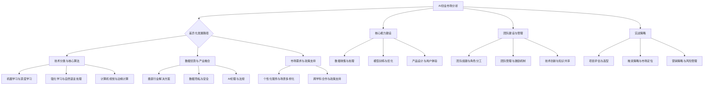

                 

### 《AI创业竞争加剧，差异化发展成制胜法宝》

> **关键词：** AI创业、差异化发展、竞争、制胜法宝、技术、策略

> **摘要：** 本文将深入探讨AI创业领域的激烈竞争环境，分析差异化发展的必要性及其在AI创业中的重要性。通过详细剖析AI技术的分类与应用、核心能力建设、团队管理与实战策略等方面，本文旨在为AI创业者提供实用的指导，帮助他们在竞争中脱颖而出，实现可持续发展。

---

#### 目录大纲

### 第一部分：AI创业环境分析

#### 第1章：AI创业市场现状与挑战

##### 1.1 AI创业市场的规模与增长趋势

##### 1.2 AI创业面临的主要挑战

##### 1.3 AI创业的机遇与潜在风险

#### 第2章：AI技术的差异化发展路径

##### 2.1 AI技术分类与核心算法

##### 2.2 差异化发展的驱动力

##### 2.3 不同领域的差异化应用案例

#### 第3章：AI创业的核心能力建设

##### 3.1 数据收集与处理

##### 3.2 模型训练与优化

##### 3.3 产品设计与用户体验

#### 第4章：AI创业团队建设与管理

##### 4.1 创业团队的组建与角色分工

##### 4.2 团队管理与激励机制

##### 4.3 技术创新与知识共享

### 第二部分：AI创业实战策略

#### 第5章：AI创业项目评估与选型

##### 5.1 项目评估方法与工具

##### 5.2 AI技术选型策略

##### 5.3 市场机会分析与竞争分析

#### 第6章：AI创业融资策略

##### 6.1 融资渠道与策略

##### 6.2 融资准备与谈判

##### 6.3 融资后的资金管理

#### 第7章：AI创业营销策略

##### 7.1 市场定位与品牌塑造

##### 7.2 产品推广与渠道选择

##### 7.3 客户关系管理与用户增长策略

#### 第8章：AI创业风险管理

##### 8.1 创业风险识别与评估

##### 8.2 风险控制与应对策略

##### 8.3 持续创新与应对市场变化

### 第三部分：成功案例分析

#### 第9章：AI创业成功案例分析

##### 9.1 案例背景与业务模式

##### 9.2 成功关键因素分析

##### 9.3 启示与借鉴

#### 第10章：未来展望与趋势

##### 10.1 AI创业的未来趋势

##### 10.2 差异化发展的未来机会

##### 10.3 AI创业面临的长期挑战与应对策略

### 附录

#### 附录A：AI创业相关资源与工具

##### A.1 主流AI框架与工具介绍

##### A.2 AI创业平台与社区

##### A.3 相关书籍与论文推荐

#### 附录B：AI创业常见问题与解答

##### B.1 创业过程中的常见法律问题

##### B.2 AI技术在创业中的合规性

##### B.3 创业团队的常见问题与解决方案

---

### 引言

人工智能（AI）作为当今科技领域的明星，吸引了大量创业者的关注和投入。随着AI技术的迅猛发展和应用领域的不断拓展，AI创业市场的竞争也日益加剧。在这个竞争激烈的环境中，如何脱颖而出，实现可持续发展，成为每个AI创业者必须面对的挑战。

本文将从以下几个方面展开讨论：

1. **AI创业环境分析**：深入分析当前AI创业市场的现状、面临的挑战和潜在机遇。
2. **AI技术的差异化发展路径**：探讨不同领域和技术的差异化发展路径，以及如何实现差异化发展。
3. **AI创业的核心能力建设**：分析数据收集与处理、模型训练与优化、产品设计与用户体验等方面的核心能力建设。
4. **AI创业团队建设与管理**：讨论创业团队的组建、管理、激励机制以及技术创新与知识共享。
5. **AI创业实战策略**：介绍项目评估与选型、融资策略、营销策略以及风险管理等方面的实战策略。
6. **成功案例分析**：通过成功案例的分析，提炼出关键成功因素，为创业者提供借鉴和启示。
7. **未来展望与趋势**：展望AI创业的未来趋势，探讨差异化发展的未来机会和长期挑战与应对策略。

本文旨在为AI创业者提供一份实用指南，帮助他们在激烈的竞争中找到差异化发展的道路，实现创业梦想。

### 第一部分：AI创业环境分析

#### 第1章：AI创业市场现状与挑战

##### 1.1 AI创业市场的规模与增长趋势

人工智能（AI）作为引领新一轮科技革命和产业变革的关键力量，其创业市场正呈现出快速增长的趋势。据市场研究公司的数据，全球AI市场规模预计将从2020年的377亿美元增长到2025年的1,280亿美元，年复合增长率达到29.7%。这一增长趋势主要得益于AI技术在各行业领域的广泛应用，包括医疗、金融、零售、制造等。

在AI创业市场的增长背后，有多个驱动因素。首先，随着计算能力的提升和数据量的增加，AI技术的研发和应用变得更加可行。其次，政府和企业对AI技术的投资不断增加，推动技术创新和商业应用。此外，全球化和数字化转型的加速也为AI创业提供了广阔的市场空间。

中国是AI创业的重要市场之一。根据《2022中国人工智能产业发展报告》，中国人工智能市场规模已超过7000亿元人民币，并预计在未来几年继续保持快速增长。中国政府在《新一代人工智能发展规划》中明确提出，到2025年，中国人工智能核心技术和关键应用将实现重大突破，人工智能核心产业规模将超过1万亿元。

##### 1.2 AI创业面临的主要挑战

尽管AI创业市场前景广阔，但创业者仍面临诸多挑战。以下是AI创业面临的主要挑战：

1. **技术门槛高**：AI技术的研发和应用涉及大量的算法、数据和计算资源。对于初创企业来说，技术和资金投入是一个巨大的挑战。此外，AI技术的快速发展也要求创业者不断更新知识和技能。

2. **数据隐私和安全**：AI系统的训练和应用依赖于大量数据，数据隐私和安全成为关键问题。数据泄露和滥用可能导致严重的法律和声誉风险。因此，如何在保护用户隐私的前提下利用数据，成为AI创业者必须解决的问题。

3. **市场竞争激烈**：AI创业市场的竞争异常激烈，大量初创企业涌入，争夺有限的市场份额。如何在众多竞争者中脱颖而出，成为每个创业者必须思考的问题。

4. **监管合规**：AI技术的应用涉及多个行业和领域，不同国家和地区的监管政策各异。创业者需要了解和遵守相关法律法规，避免因合规问题而遭受罚款或市场禁入。

5. **人才短缺**：AI技术领域的人才稀缺，特别是具有实战经验的高级人才。初创企业往往难以吸引和留住优秀人才，这成为制约企业发展的重要因素。

##### 1.3 AI创业的机遇与潜在风险

尽管面临诸多挑战，AI创业仍具有巨大的机遇和潜力。以下是一些AI创业的机遇和潜在风险：

1. **技术创新**：AI技术的快速发展为创业者提供了广阔的创新空间。通过技术创新，创业者可以在不同领域开发出具有独特竞争力的产品和服务。

2. **跨界融合**：AI技术与传统产业的融合为创业者提供了新的商业模式和市场机会。例如，AI在医疗、教育、农业等领域的应用正不断拓展，为创业者提供了新的切入点。

3. **政策支持**：各国政府纷纷出台支持AI产业发展的政策和措施，为创业者提供了良好的发展环境。创业者应积极关注政策动向，争取政策红利。

4. **市场机会**：随着AI技术的普及和应用的深入，市场对AI产品和服务的需求不断增加。创业者应抓住市场机会，快速响应市场需求。

然而，AI创业也存在潜在风险：

1. **技术失败**：AI项目可能因为技术难题、计算资源不足等原因导致失败。

2. **市场竞争失败**：在激烈的市场竞争中，创业者可能因为产品缺乏竞争力而失去市场份额。

3. **法律风险**：不合规的AI产品可能面临法律诉讼和罚款。

4. **人才流失**：优秀人才流失可能导致企业核心竞争力下降。

在AI创业的这条道路上，创业者需要具备敏锐的市场洞察力、坚定的决心和不断学习的能力。只有在充分了解市场环境、应对挑战和抓住机遇的基础上，才能在激烈的竞争中脱颖而出，实现创业梦想。

#### 第2章：AI技术的差异化发展路径

##### 2.1 AI技术分类与核心算法

人工智能技术可以根据应用场景和算法特点进行分类。以下是几种常见的AI技术分类及其核心算法：

1. **机器学习（Machine Learning）**：
   - **监督学习（Supervised Learning）**：通过已标记的数据训练模型，然后使用该模型对新数据进行预测。核心算法包括线性回归、决策树、支持向量机（SVM）等。
   - **无监督学习（Unsupervised Learning）**：没有预标记的数据，模型需要通过数据自身的结构和模式进行学习和分类。核心算法包括聚类算法（如K-均值聚类）、降维算法（如主成分分析PCA）等。
   - **半监督学习（Semi-supervised Learning）**：结合有监督和无监督学习，利用少量标记数据和大量未标记数据。

2. **深度学习（Deep Learning）**：
   - **神经网络（Neural Networks）**：模拟人脑神经网络，通过多层神经网络（Deep Neural Networks，DNN）进行复杂特征提取和学习。核心算法包括卷积神经网络（CNN）、循环神经网络（RNN）、生成对抗网络（GAN）等。

3. **强化学习（Reinforcement Learning）**：通过试错和反馈信号，使智能体在特定环境中学习最优策略。核心算法包括Q-学习、深度Q网络（DQN）等。

4. **自然语言处理（Natural Language Processing，NLP）**：利用计算机处理和理解人类自然语言的技术。核心算法包括词嵌入（Word Embedding）、序列到序列（Seq2Seq）模型、注意力机制（Attention Mechanism）等。

5. **计算机视觉（Computer Vision）**：使计算机能够从图像或视频中提取信息和理解场景。核心算法包括卷积神经网络（CNN）、图像生成对抗网络（Image GAN）、目标检测（如YOLO、Faster R-CNN）等。

##### 2.2 差异化发展的驱动力

差异化发展是AI创业成功的关键因素之一。以下是推动AI技术差异化发展的几个主要驱动力：

1. **技术创新**：不断的技术创新是差异化发展的核心驱动力。通过引入新的算法、模型和工具，创业者可以开发出独特且具有竞争力的产品和服务。

2. **市场需求**：了解和满足市场需求是差异化发展的关键。通过深入分析用户需求，创业者可以开发出更符合市场期望的创新产品。

3. **数据优势**：拥有独特且高质量的数据资源可以帮助创业者实现差异化发展。例如，某些领域的数据量巨大且结构化，这为开发定制化AI解决方案提供了机会。

4. **产业融合**：AI技术与传统产业的深度融合，可以创造出新的商业机会。通过将AI技术应用于不同行业，创业者可以开发出跨领域的解决方案。

5. **政策支持**：政府的政策支持和产业规划为创业者提供了良好的发展环境。例如，某些国家针对AI技术的研发和应用提供了资金支持、税收优惠等。

##### 2.3 不同领域的差异化应用案例

不同领域对AI技术的应用需求各异，以下是一些典型领域的差异化应用案例：

1. **医疗健康**：
   - **图像诊断**：使用深度学习技术，AI系统可以从医疗影像中自动检测和诊断疾病，如肿瘤、骨折等，提高诊断准确率和效率。
   - **个性化治疗**：基于患者的基因组数据和病历，AI系统可以为每位患者制定个性化的治疗方案。

2. **金融科技**：
   - **风险管理**：通过机器学习和大数据分析，AI系统可以实时监控金融市场的风险，帮助投资者做出更明智的决策。
   - **智能投顾**：AI系统可以根据用户的投资偏好和风险承受能力，提供个性化的投资建议。

3. **智能制造**：
   - **预测性维护**：AI系统可以通过分析设备运行数据，预测设备的故障和维修时间，减少停机时间，提高生产效率。
   - **自动化生产**：使用机器人和AI技术，实现生产过程的自动化和智能化，提高生产速度和产品质量。

4. **智能交通**：
   - **自动驾驶**：通过深度学习和传感器技术，自动驾驶汽车可以实时感知和应对道路环境，提高交通安全和效率。
   - **智能调度**：AI系统可以根据实时交通数据，优化公共交通路线和时刻表，缓解城市交通拥堵。

5. **教育科技**：
   - **个性化学习**：AI系统可以根据学生的学习情况和进度，提供个性化的学习资源和辅导。
   - **智能评测**：AI系统可以自动评估学生的学习成果，提供实时反馈和建议。

通过在不同领域的差异化应用，AI技术不仅提升了传统产业的效率和质量，也为创业者提供了丰富的商业机会。然而，实现差异化发展并非易事，需要创业者具备深厚的专业知识和市场洞察力，不断进行技术创新和优化。

总之，AI技术的差异化发展是AI创业成功的关键。通过技术创新、市场需求分析、数据优势、产业融合和政策支持，创业者可以开发出具有独特竞争力的产品和服务，在激烈的市场竞争中脱颖而出。

##### 2.4 实现差异化发展的策略

在AI创业的浪潮中，实现差异化发展是创业者脱颖而出的关键。以下是一些实现差异化发展的策略：

1. **技术专长**：创业者应专注于某一技术领域，成为该领域的专家。通过不断的技术创新和优化，开发出独特且具有竞争力的产品。例如，深度学习、自然语言处理、计算机视觉等领域都有大量成功的创业案例。

2. **市场定位**：明确目标市场和用户群体，深入了解用户需求。通过精确的市场定位，创业者可以开发出更符合用户期望的产品，从而在竞争激烈的市场中占据一席之地。

3. **数据驱动**：数据是AI技术的核心，创业者应充分利用数据优势，进行数据收集、分析和挖掘。通过大数据分析，创业者可以发现市场趋势和用户需求，为产品开发提供指导。

4. **跨界融合**：将AI技术与其他行业或领域相结合，开发出跨领域的解决方案。例如，将AI应用于医疗、金融、教育等传统行业，创造出新的商业机会。

5. **持续创新**：持续的技术创新是差异化发展的动力。创业者应保持对新技术和市场的敏锐洞察，不断进行产品迭代和优化，确保产品始终具有竞争力。

6. **品牌塑造**：通过有效的品牌营销，提升品牌知名度和美誉度。创业者可以利用社交媒体、线上线下活动等多种渠道，提升品牌影响力。

7. **团队建设**：优秀的团队是差异化发展的基石。创业者应注重团队建设，吸引和留住优秀人才，打造高效、协同的工作氛围。

通过上述策略，创业者可以在激烈的市场竞争中实现差异化发展，打造具有持久竞争力的AI产品和服务。

### 第3章：AI创业的核心能力建设

##### 3.1 数据收集与处理

在AI创业过程中，数据是驱动模型训练和应用的核心资源。有效的数据收集和处理能力是AI创业成功的关键因素之一。

1. **数据收集**：
   - **来源**：数据可以从多个渠道收集，包括公开数据集、企业内部数据、社交媒体数据等。创业者应根据业务需求，选择合适的数据来源。
   - **数据类型**：数据类型包括结构化数据、半结构化数据和非结构化数据。结构化数据如数据库记录，半结构化数据如日志文件，非结构化数据如文本、图像和视频。
   - **数据获取方法**：可以通过API接口、爬虫技术、企业内部数据共享等方式获取数据。

2. **数据处理**：
   - **数据清洗**：数据清洗是数据处理的重要环节，包括去除重复数据、处理缺失值、去除噪声数据等。常用的数据清洗方法有数据填充、数据变换、数据过滤等。
   - **数据整合**：将不同来源、不同类型的数据进行整合，形成统一的数据格式，便于后续处理和分析。
   - **特征工程**：特征工程是数据预处理的关键步骤，通过对数据进行转换、选择和构建，提取出对模型训练有价值的特征。常用的特征工程方法包括特征提取、特征选择和特征组合等。
   - **数据标准化**：为了确保数据的一致性和可比性，需要对数据进行标准化处理，如归一化、标准化等。

3. **数据质量管理**：
   - **数据质量评估**：通过评估数据的质量，确保数据的有效性和准确性。常用的评估指标包括完整性、一致性、及时性、准确性和可靠性。
   - **数据质量改进**：针对数据质量问题，采取相应的改进措施，如数据清洗、数据整合和特征工程等。

通过高效的数据收集与处理，创业者可以构建高质量的数据集，为模型训练和应用提供可靠的依据。以下是一个数据收集与处理的示例伪代码：

```python
import pandas as pd
from sklearn.model_selection import train_test_split
from sklearn.preprocessing import StandardScaler

# 数据收集
data = pd.read_csv('data.csv')

# 数据清洗
data = data.drop_duplicates()
data = data.fillna(method='ffill')

# 数据整合
data = data[data['column_name'].notnull()]

# 特征工程
X = data[['feature1', 'feature2']]
y = data['target']

# 数据标准化
scaler = StandardScaler()
X = scaler.fit_transform(X)

# 数据分割
X_train, X_test, y_train, y_test = train_test_split(X, y, test_size=0.2, random_state=42)
```

##### 3.2 模型训练与优化

模型训练与优化是AI创业的核心环节，决定了AI系统的性能和应用效果。以下是模型训练与优化的关键步骤和方法：

1. **选择合适模型**：
   - **模型类型**：根据业务需求和应用场景，选择合适的模型类型，如监督学习模型、无监督学习模型、深度学习模型等。
   - **模型架构**：对于深度学习模型，选择合适的神经网络架构，如卷积神经网络（CNN）、循环神经网络（RNN）、生成对抗网络（GAN）等。

2. **数据预处理**：
   - **数据集划分**：将数据集划分为训练集、验证集和测试集，确保每个数据集的分布相似，避免数据泄露。
   - **数据增强**：通过数据增强技术，如随机旋转、缩放、裁剪等，增加训练数据的多样性，提高模型泛化能力。

3. **训练过程**：
   - **参数设置**：设置合适的超参数，如学习率、批量大小、迭代次数等，影响模型性能和训练时间。
   - **模型训练**：使用训练集对模型进行训练，通过梯度下降等优化算法，不断更新模型参数，减少预测误差。

4. **模型评估**：
   - **评估指标**：选择合适的评估指标，如准确率、召回率、F1分数等，评估模型性能。
   - **交叉验证**：使用交叉验证技术，如K折交叉验证，评估模型在不同数据集上的性能，避免过拟合。

5. **模型优化**：
   - **超参数调优**：使用网格搜索、贝叶斯优化等超参数调优方法，找到最优超参数组合，提高模型性能。
   - **模型融合**：将多个模型进行融合，如集成学习、模型堆叠等，提高预测准确性和稳定性。

6. **模型部署**：
   - **模型导出**：将训练好的模型导出为可部署的格式，如ONNX、TF Lite等。
   - **部署环境**：选择合适的部署环境，如云端服务器、边缘设备等，确保模型的高效运行。

以下是一个模型训练与优化的示例伪代码：

```python
from sklearn.ensemble import RandomForestClassifier
from sklearn.model_selection import GridSearchCV

# 模型选择
model = RandomForestClassifier()

# 数据预处理
X_train, X_test, y_train, y_test = train_test_split(X, y, test_size=0.2, random_state=42)

# 模型训练
model.fit(X_train, y_train)

# 模型评估
accuracy = model.score(X_test, y_test)

# 超参数调优
param_grid = {'n_estimators': [100, 200, 300], 'max_depth': [10, 20, 30]}
grid_search = GridSearchCV(model, param_grid, cv=5)
grid_search.fit(X_train, y_train)

# 最佳模型
best_model = grid_search.best_estimator_

# 模型评估
best_accuracy = best_model.score(X_test, y_test)
```

通过有效的模型训练与优化，创业者可以构建高性能的AI系统，实现精准预测和智能决策，提高业务效率和用户体验。

##### 3.3 产品设计与用户体验

在AI创业过程中，产品设计和用户体验是决定产品成功与否的关键因素。以下是在AI产品设计和用户体验方面的一些关键点：

1. **需求分析**：
   - **用户需求**：通过用户调研、访谈和市场分析，深入了解用户需求，明确产品的核心功能和价值。
   - **市场趋势**：关注市场趋势和竞争对手，了解行业发展的最新动态，确保产品能够紧跟市场潮流。

2. **功能设计**：
   - **核心功能**：根据用户需求和市场分析，确定产品的核心功能，确保产品具备基本的核心价值。
   - **扩展功能**：考虑产品的扩展性，为未来的功能扩展预留接口，提高产品的可持续性。

3. **交互设计**：
   - **用户体验**：设计直观、易用的用户界面，确保用户能够轻松上手并高效使用产品。
   - **交互反馈**：提供及时、明确的交互反馈，增强用户对产品的信任感和满意度。

4. **界面设计**：
   - **视觉风格**：设计符合品牌形象和用户需求的视觉风格，提高产品的美观度和专业感。
   - **色彩搭配**：合理使用色彩搭配，提升用户对产品的视觉体验。

5. **性能优化**：
   - **响应速度**：优化产品性能，提高响应速度，确保用户在使用过程中不会感到延迟。
   - **稳定性**：确保产品在多种环境下稳定运行，减少故障和错误。

6. **测试与迭代**：
   - **用户测试**：通过用户测试，收集用户反馈，及时发现问题并进行优化。
   - **持续迭代**：根据用户反馈和市场需求，不断迭代产品，优化用户体验。

以下是一个产品设计和用户体验的示例伪代码：

```python
import tkinter as tk

# 创建窗口
window = tk.Tk()
window.title("AI产品示例")

# 添加标签
label = tk.Label(window, text="欢迎使用AI产品")
label.pack()

# 添加按钮
button = tk.Button(window, text="开始使用", command=start_product)
button.pack()

# 运行主循环
window.mainloop()

# 开始使用产品的函数
def start_product():
    print("正在启动AI产品...")
    # 产品功能实现
    # ...
    print("AI产品启动完成！")
```

通过精心设计和优化，创业者可以打造出具备优秀用户体验的AI产品，提高用户满意度和市场竞争力。

### 第4章：AI创业团队建设与管理

##### 4.1 创业团队的组建与角色分工

一个高效的AI创业团队是创业成功的关键。以下是组建和分工的几个关键步骤：

1. **核心成员选择**：
   - **技术专家**：具备深厚的技术背景和实际经验，负责技术方向和核心技术研发。
   - **产品经理**：了解市场需求，负责产品规划和用户体验设计。
   - **数据科学家**：负责数据收集、处理和分析，提升模型性能。
   - **市场营销专家**：负责市场分析和产品推广，拓展客户资源。

2. **团队规模**：
   - 初创团队规模不宜过大，应根据业务发展阶段和资金状况进行适度扩展。

3. **角色分工**：
   - **技术团队**：分为前端开发、后端开发、数据工程等子团队，各司其职，协同工作。
   - **产品团队**：分为产品经理、UI/UX设计师、测试工程师等，共同推进产品开发。
   - **市场团队**：分为市场分析师、营销专员、销售代表等，负责市场推广和客户关系管理。

4. **协作机制**：
   - **定期会议**：定期召开团队会议，交流工作进展和问题，确保团队高效协作。
   - **任务分配**：明确任务责任，确保每个团队成员了解自己的工作内容和目标。
   - **反馈机制**：建立反馈机制，鼓励团队成员提出意见和建议，促进团队成长。

以下是一个团队角色分工的示例伪代码：

```python
# 创业团队角色分工示例

class TeamMember:
    def __init__(self, name, role):
        self.name = name
        self.role = role

# 创业团队成员
team_members = [
    TeamMember("Alice", "技术专家"),
    TeamMember("Bob", "产品经理"),
    TeamMember("Charlie", "数据科学家"),
    TeamMember("David", "市场营销专家")
]

# 打印团队角色分工
for member in team_members:
    print(f"{member.name}：{member.role}")
```

##### 4.2 团队管理与激励机制

高效的团队管理是确保团队凝聚力和工作效率的关键。以下是一些团队管理与激励机制：

1. **目标管理**：
   - **明确目标**：为团队设定明确的目标和里程碑，确保团队成员对任务有清晰的认识。
   - **目标分解**：将大目标分解为小目标，逐步实现，确保团队始终保持前进动力。

2. **绩效评估**：
   - **定期评估**：定期对团队成员的工作绩效进行评估，发现问题和不足，及时调整。
   - **多维评估**：从技术能力、项目贡献、团队协作等多个维度进行评估，确保公平和全面。

3. **激励制度**：
   - **物质激励**：提供有竞争力的薪酬和福利，激励团队成员的积极性。
   - **精神激励**：通过表彰、奖励等方式，认可团队成员的突出贡献，提升团队凝聚力。

4. **团队建设**：
   - **团队活动**：定期组织团队建设活动，增强团队凝聚力，提高团队协作能力。
   - **知识分享**：鼓励团队成员进行知识分享和技能培训，提升团队整体水平。

5. **沟通与反馈**：
   - **开放沟通**：鼓励团队成员之间进行开放、真诚的沟通，建立良好的沟通氛围。
   - **及时反馈**：及时给予团队成员反馈，帮助他们改进工作，提升效率。

以下是一个团队管理与激励机制的示例伪代码：

```python
class PerformanceEvaluation:
    def __init__(self, member, score):
        self.member = member
        self.score = score

    def print_evaluation(self):
        print(f"{self.member.name}的绩效评估：{self.score}")

# 创业团队绩效评估
evaluations = [
    PerformanceEvaluation(TeamMember("Alice", "技术专家"), 90),
    PerformanceEvaluation(TeamMember("Bob", "产品经理"), 85),
    PerformanceEvaluation(TeamMember("Charlie", "数据科学家"), 95),
    PerformanceEvaluation(TeamMember("David", "市场营销专家"), 88)
]

# 打印团队绩效评估
for evaluation in evaluations:
    evaluation.print_evaluation()
```

通过有效的团队管理和激励机制，创业者可以激发团队成员的积极性和创造力，打造高效、协作的创业团队。

##### 4.3 技术创新与知识共享

在AI创业过程中，技术创新是保持竞争力的关键，而知识共享是实现团队协作和共同成长的重要手段。以下是关于技术创新与知识共享的几个关键点：

1. **技术创新**：
   - **持续研发**：鼓励团队成员不断学习和探索新技术，推动产品的技术创新和升级。
   - **技术前瞻**：关注行业前沿技术和发展趋势，提前布局，确保产品在技术上的领先地位。
   - **技术积累**：积累技术成果和经验，形成企业技术核心竞争力。

2. **知识共享**：
   - **内部培训**：定期组织内部技术培训和知识分享活动，提升团队整体技术水平。
   - **文档管理**：建立完善的文档管理体系，记录项目的技术方案、算法细节等，便于团队协作和后续查阅。
   - **知识库**：构建企业知识库，汇总团队成员的知识和经验，方便团队内部的知识共享和查找。

3. **协作平台**：
   - **代码管理**：使用代码管理工具（如Git），实现代码的版本控制和协作开发。
   - **协作工具**：使用协作工具（如Slack、Trello等），方便团队成员之间的沟通和任务分配。
   - **研讨会**：定期举办技术研讨会，邀请团队成员分享技术心得和项目经验，促进知识交流。

4. **激励机制**：
   - **知识奖励**：对积极参与知识共享的团队成员给予奖励和认可，鼓励更多人参与知识共享。
   - **技术竞赛**：组织技术竞赛，激发团队成员的创造力和竞争意识，促进技术创新。

以下是一个技术创新与知识共享的示例伪代码：

```python
class KnowledgeSharing:
    def __init__(self, member, contribution):
        self.member = member
        self.contribution = contribution

    def print_knowledge_sharing(self):
        print(f"{self.member.name}的知识共享：{self.contribution}")

# 创业团队知识共享记录
knowledge_sharings = [
    KnowledgeSharing(TeamMember("Alice", "技术专家"), "分享了深度学习最新论文"),
    KnowledgeSharing(TeamMember("Bob", "产品经理"), "分享了用户体验设计最佳实践"),
    KnowledgeSharing(TeamMember("Charlie", "数据科学家"), "分享了数据预处理技巧"),
    KnowledgeSharing(TeamMember("David", "市场营销专家"), "分享了市场分析报告")
]

# 打印知识共享记录
for sharing in knowledge_sharings:
    sharing.print_knowledge_sharing()
```

通过技术创新和知识共享，创业者可以不断提升团队的技术水平和协作效率，为创业成功奠定坚实基础。

### 第二部分：AI创业实战策略

#### 第5章：AI创业项目评估与选型

##### 5.1 项目评估方法与工具

AI创业项目的成功离不开科学的评估方法和有效的工具支持。以下是几种常用的项目评估方法和工具：

1. **成本效益分析（CBA）**：
   - **定义**：成本效益分析是一种评估项目成本与收益的方法，通过比较项目的总成本与预期收益，判断项目是否值得投资。
   - **计算方法**：
     $$ \text{成本效益比} = \frac{\text{总收益}}{\text{总成本}} $$
   - **工具**：可以使用Excel进行简单计算，或使用专业的成本效益分析软件，如CPM Scheduling Expert。

2. **决策树分析**：
   - **定义**：决策树是一种图形化的决策分析工具，通过列出不同决策路径和相应的结果，帮助创业者评估不同选择的优劣。
   - **计算方法**：决策树分析通常基于概率和期望值进行计算，计算每个节点的期望值，选择期望值最大的路径。
   - **工具**：可以使用专业的决策树分析软件，如Decision Tree Pro、NodeXL。

3. **SWOT分析**：
   - **定义**：SWOT分析是一种战略规划工具，通过分析项目的优势（Strengths）、劣势（Weaknesses）、机会（Opportunities）和威胁（Threats），帮助创业者全面评估项目的可行性。
   - **计算方法**：根据项目的实际情况，列出SWOT的各个方面，并进行综合评估。
   - **工具**：可以使用Excel或专业的SWOT分析软件，如SWOT Matrix Pro。

4. **技术成熟度评估（Technology Readiness Level，TRL）**：
   - **定义**：技术成熟度评估是一种评估技术发展水平的方法，通过分级标准（通常1-9级），判断技术的成熟度和可行性。
   - **计算方法**：根据技术开发的实际进展，对照TRL标准进行评估。
   - **工具**：可以使用专业的TRL评估工具，如NASA的TRL评估系统。

以下是一个成本效益分析的示例伪代码：

```python
import pandas as pd

# 成本效益分析数据
costs = {'研发成本': 100000, '运营成本': 50000, '总成本': 150000}
revenues = {'预计收益': 200000}

# 计算成本效益比
cost_benefit_ratio = revenues['预计收益'] / costs['总成本']
print(f"成本效益比：{cost_benefit_ratio}")
```

通过上述评估方法和工具，创业者可以全面、科学地评估AI创业项目的可行性，提高项目成功率。

##### 5.2 AI技术选型策略

在AI创业过程中，技术选型是至关重要的一步。正确的技术选型可以提升项目成功率，降低技术风险。以下是几种AI技术选型策略：

1. **需求导向**：
   - **定义**：根据项目的具体需求，选择最合适的技术方案。
   - **步骤**：
     1. 明确项目需求，包括功能需求、性能需求、安全需求等。
     2. 分析不同技术的适用性，选择能够满足需求的技术。
     3. 考虑技术的可扩展性和维护性，确保长期发展。
   - **优势**：确保技术选型与项目需求高度匹配，提高项目成功率。

2. **成熟度导向**：
   - **定义**：优先选择技术成熟度较高的方案，降低技术风险。
   - **步骤**：
     1. 评估不同技术的成熟度，选择成熟度较高的技术。
     2. 考虑技术的应用范围和成功案例，确保技术稳定性。
     3. 对新兴技术进行充分调研，评估其潜在风险。
   - **优势**：降低技术风险，确保项目稳定性。

3. **成本导向**：
   - **定义**：在满足需求的前提下，选择成本较低的技术方案。
   - **步骤**：
     1. 评估不同技术的成本，包括研发成本、运营成本等。
     2. 考虑项目的资金预算，选择成本效益较高的技术。
     3. 对低成本技术进行充分验证，确保性能和质量。
   - **优势**：提高资金使用效率，降低项目成本。

4. **生态导向**：
   - **定义**：优先选择具有良好生态和技术支持的技术方案。
   - **步骤**：
     1. 分析不同技术的生态情况，包括社区活跃度、工具库等。
     2. 考虑技术的开源和商业化支持，确保长期发展。
     3. 与技术生态中的开发者、用户保持紧密联系，获取反馈。
   - **优势**：提高项目的技术可持续性和创新性。

以下是一个需求导向的技术选型示例伪代码：

```python
# 技术选型需求分析
需求 = {'功能需求': ['人脸识别', '图像分类'], '性能需求': ['实时处理', '高准确率'], '安全需求': ['数据加密', '隐私保护']}

# 分析技术适用性
技术方案 = {
    '方案A': {'人脸识别': '支持', '图像分类': '支持', '实时处理': '支持', '高准确率': '支持', '数据加密': '支持', '隐私保护': '支持'},
    '方案B': {'人脸识别': '支持', '图像分类': '支持', '实时处理': '不支持', '高准确率': '支持', '数据加密': '支持', '隐私保护': '支持'},
    '方案C': {'人脸识别': '支持', '图像分类': '支持', '实时处理': '支持', '高准确率': '支持', '数据加密': '不支持', '隐私保护': '不支持'}
}

# 选择合适的技术方案
合适方案 = '方案A'
print(f"选择的技术方案：{合适方案}")
```

通过科学的技术选型策略，创业者可以确保AI创业项目的技术可行性，提高项目成功率。

##### 5.3 市场机会分析与竞争分析

在AI创业过程中，准确把握市场机会和了解竞争对手是制定战略的关键。以下是市场机会分析和竞争分析的步骤和方法：

1. **市场机会分析**：
   - **需求分析**：通过市场调研和用户访谈，了解市场需求和用户痛点，发现潜在的市场机会。
   - **趋势分析**：关注行业趋势和技术发展动态，分析哪些趋势可能带来新的市场机会。
   - **竞争分析**：分析现有市场的竞争格局，了解竞争对手的优势和劣势，找到自身的差异化竞争优势。

2. **SWOT分析**：
   - **优势（Strengths）**：分析企业在技术、团队、资源等方面的优势。
   - **劣势（Weaknesses）**：分析企业在技术、市场、运营等方面的劣势。
   - **机会（Opportunities）**：分析外部环境中的市场机会和潜在增长点。
   - **威胁（Threats）**：分析外部环境中的竞争威胁和风险。

3. **五力模型**：
   - **行业竞争者**：分析行业内的主要竞争者及其市场份额。
   - **潜在竞争者**：分析潜在进入者可能带来的竞争压力。
   - **供应商**：分析供应商的议价能力和市场控制力。
   - **买家**：分析买家的议价能力和购买行为。
   - **替代品**：分析替代品的存在和潜在威胁。

4. **竞争分析工具**：
   - **波特矩阵**：通过分析竞争对手的产品、市场定位和市场份额，确定企业在市场中的位置。
   - **价值链分析**：分析企业内部的主要价值活动，确定竞争优势。
   - **客户细分**：分析目标客户群体的特征和需求，制定相应的市场策略。

以下是一个市场机会分析和竞争分析的示例伪代码：

```python
import pandas as pd

# 市场机会分析
market_opportunities = {
    '需求分析': ['医疗健康', '金融科技', '智能制造'],
    '趋势分析': ['数据隐私保护', '边缘计算', 'AI芯片'],
    '竞争分析': ['技术优势', '产品差异化', '市场拓展']
}

# 竞争分析
competitors = [
    {'公司名称': '公司A', '市场份额': 30, '优势': ['技术领先', '市场推广']},
    {'公司名称': '公司B', '市场份额': 25, '优势': ['产品多样', '用户口碑']},
    {'公司名称': '公司C', '市场份额': 20, '优势': ['成本优势', '创新研发']}
]

# 打印市场机会和竞争分析
print("市场机会分析：")
for opportunity in market_opportunities:
    print(f"{opportunity}: {', '.join(market_opportunities[opportunity])}")

print("\n竞争分析：")
for competitor in competitors:
    print(f"{competitor['公司名称']}：市场份额：{competitor['市场份额']}，优势：{', '.join(competitor['优势'])}")
```

通过全面的市场机会分析和竞争分析，创业者可以制定科学的市场策略，抓住市场机会，应对竞争挑战。

### 第6章：AI创业融资策略

##### 6.1 融资渠道与策略

AI创业企业在发展过程中，融资策略至关重要。以下是几种常见的融资渠道和相应的融资策略：

1. **天使投资**：
   - **定义**：天使投资是指个人投资者对初创企业进行早期投资，通常在种子轮或天使轮阶段。
   - **策略**：
     - **寻找合适的投资者**：通过参加创业比赛、创业社区等活动，寻找有经验的投资者。
     - **准备商业计划书**：详细描述创业项目、市场前景、竞争优势和预期收益，提高投资者兴趣。

2. **风险投资（Venture Capital，VC）**：
   - **定义**：风险投资是一种长期投资，主要投资于具有高增长潜力的初创企业。
   - **策略**：
     - **寻找合适的VC**：研究VC的投资偏好和领域，选择与创业项目匹配的VC。
     - **商业计划书和演示**：准备好详细、专业的商业计划书和产品演示，突出项目的创新性和市场前景。

3. **股权众筹**：
   - **定义**：股权众筹是通过互联网平台，向广大投资者筹集资金，投资者购买企业股份。
   - **策略**：
     - **选择合适的众筹平台**：选择知名度高、用户多的众筹平台，提高项目曝光度。
     - **制定众筹计划**：设定合理的融资目标、回报方案和进度，吸引投资者。

4. **政府资助**：
   - **定义**：政府资助是指通过申请政府的科技基金、创新补贴等，获取资金支持。
   - **策略**：
     - **关注政策动向**：了解国家和地方政府针对创业企业的扶持政策。
     - **准备申请材料**：准备详细、合规的申请材料，包括商业计划书、财务报表等。

5. **银行贷款**：
   - **定义**：银行贷款是指从银行获取的用于企业运营的资金。
   - **策略**：
     - **选择合适的银行**：根据企业的信用评级和贷款需求，选择适合的银行。
     - **准备贷款申请**：提供详细的企业运营计划、财务报表和担保措施，提高贷款获批率。

以下是一个股权众筹融资的示例伪代码：

```python
import pandas as pd

# 股权众筹项目信息
project_info = {
    '项目名称': '智能医疗解决方案',
    '融资目标': 1000000,
    '回报方案': {
        '投资1000元': '获得产品试用资格',
        '投资10000元': '获得公司股份0.1%',
        '投资100000元': '获得公司股份1%'
    }
}

# 打印众筹项目信息
print(f"项目名称：{project_info['项目名称']}")
print(f"融资目标：{project_info['融资目标']}元")
print("回报方案：")
for amount, reward in project_info['回报方案'].items():
    print(f"{amount}: {reward}")
```

通过多种融资渠道的组合，AI创业企业可以获取足够的资金支持，推动企业快速发展。

##### 6.2 融资准备与谈判

融资准备和谈判是AI创业企业获取资金的关键环节。以下是融资准备和谈判的几个关键点：

1. **融资准备**：
   - **商业计划书**：详细描述创业项目的市场前景、技术方案、竞争优势、财务预测等，向投资者展示项目的潜力和可行性。
   - **财务报表**：准备完整的财务报表，包括资产负债表、利润表和现金流量表，展示企业的财务状况和盈利能力。
   - **法律文件**：准备相关的法律文件，如公司章程、股东协议、投资合同等，确保融资过程的合规性和法律保障。

2. **谈判策略**：
   - **明确目标**：在谈判前明确融资目标和底线，确保谈判过程中不偏离目标。
   - **了解投资者**：研究投资者的投资偏好、投资领域和过往投资项目，选择合适的投资者进行谈判。
   - **展示优势**：突出项目的独特优势和市场前景，提高投资者对项目的兴趣和信心。

3. **谈判技巧**：
   - **倾听与沟通**：认真倾听投资者的意见和需求，积极回应，建立良好的沟通氛围。
   - **灵活调整**：根据谈判进展，灵活调整谈判策略和方案，确保双方达成共识。
   - **利益平衡**：在谈判过程中，平衡投资者和企业利益，确保双方利益最大化。

以下是一个融资谈判的示例伪代码：

```python
class InvestmentNegotiation:
    def __init__(self, investor, offer, counter_offer):
        self.investor = investor
        self.offer = offer
        self.counter_offer = counter_offer

    def negotiate(self):
        print(f"与{self.investor}进行融资谈判...")
        print(f"初始投资方案：{self.offer}")
        print(f"我们的反提案：{self.counter_offer}")
        # 进行谈判过程
        print("谈判中...")
        # 根据谈判结果，更新投资方案
        self.offer = self.counter_offer
        print(f"最终投资方案达成：{self.offer}")

# 融资谈判示例
investor = "风险投资公司A"
initial_offer = {"投资金额": 500000, "股权比例": 20%}
counter_offer = {"投资金额": 600000, "股权比例": 18%}

negotiation = InvestmentNegotiation(investor, initial_offer, counter_offer)
negotiation.negotiate()
```

通过充分的融资准备和有效的谈判技巧，AI创业企业可以成功获取资金支持，推动企业快速发展。

##### 6.3 融资后的资金管理

融资成功后，资金管理成为确保企业健康发展的关键。以下是几个关键点：

1. **预算编制**：
   - **制定预算**：根据企业的发展目标和运营需求，制定详细的年度预算，包括研发、市场推广、运营成本等。
   - **预算调整**：根据实际情况，定期调整预算，确保预算与实际需求相匹配。

2. **资金分配**：
   - **优先级排序**：将资金优先分配给核心业务和关键项目，确保企业重点发展。
   - **合理配置**：合理配置资金，确保各业务板块和项目得到充分支持。

3. **成本控制**：
   - **成本分析**：定期进行成本分析，识别成本节约点，降低运营成本。
   - **成本控制**：建立严格的成本控制机制，确保资金使用的合规性和效益。

4. **财务监控**：
   - **定期报告**：定期向投资者和董事会报告财务状况，确保透明度和信任。
   - **风险预警**：建立财务风险预警机制，及时发现和应对潜在风险。

5. **资金回收**：
   - **应收账款管理**：加强应收账款管理，及时回收应收账款，提高资金周转效率。
   - **投资回报**：通过有效的投资决策和项目管理，实现投资回报，确保资金良性循环。

以下是一个资金管理流程的示例伪代码：

```python
import pandas as pd

# 资金管理流程

class Budget:
    def __init__(self, year, budget_items, amounts):
        self.year = year
        self.budget_items = budget_items
        self.amounts = amounts

    def allocate_funds(self):
        total_allocated = 0
        for item, amount in zip(self.budget_items, self.amounts):
            print(f"{self.year}年{item}预算：{amount}元")
            total_allocated += amount
        print(f"总预算：{total_allocated}元")

# 制定年度预算
budget_2023 = Budget(2023, ['研发', '市场推广', '运营成本'], [300000, 200000, 500000])

# 分配资金
budget_2023.allocate_funds()
```

通过科学的资金管理，AI创业企业可以确保资金使用的合理性和效益，推动企业持续健康发展。

### 第7章：AI创业营销策略

##### 7.1 市场定位与品牌塑造

在AI创业领域，市场定位和品牌塑造是成功营销的基础。以下是如何进行市场定位和品牌塑造的几个关键步骤：

1. **市场定位**：
   - **确定目标市场**：根据产品特点和用户需求，确定目标市场。例如，医疗健康领域的AI产品可能专注于医院和医疗机构。
   - **分析竞争对手**：研究竞争对手的市场定位，找出差异化的竞争优势。例如，如果竞争对手主要强调技术领先，你的产品可以强调用户体验。
   - **确定价值主张**：明确产品的核心价值，例如高效、精准、安全等。将这些价值主张作为市场定位的核心。

2. **品牌塑造**：
   - **品牌名称**：选择简洁、易于记忆且具有意义的品牌名称，传达产品的核心价值。例如，“智慧医管家”能够传达出产品在医疗健康领域的专业性和智能化。
   - **品牌视觉**：设计统一的品牌视觉元素，如LOGO、颜色、字体等，确保品牌形象一致性和专业感。
   - **品牌传播**：通过内容营销、社交媒体、公关活动等方式，传递品牌价值观和产品优势，提高品牌知名度和美誉度。

3. **品牌推广**：
   - **内容营销**：发布高质量的博客文章、技术白皮书、案例分析等，展示产品优势和行业影响力。
   - **社交媒体**：利用社交媒体平台，如LinkedIn、Twitter、Facebook等，与目标用户建立联系，传播品牌信息。
   - **公关活动**：参与行业会议、研讨会、展览等，展示产品和技术实力，扩大品牌影响力。

以下是一个市场定位和品牌塑造的示例伪代码：

```python
class MarketPositioning:
    def __init__(self, target_market, competitive_advantage, value_proposition):
        self.target_market = target_market
        self.competitive_advantage = competitive_advantage
        self.value_proposition = value_proposition

    def display_positioning(self):
        print(f"目标市场：{self.target_market}")
        print(f"竞争优势：{self.competitive_advantage}")
        print(f"价值主张：{self.value_proposition}")

# 市场定位与品牌塑造示例
market_positioning = MarketPositioning(
    target_market="医疗健康领域医院和医疗机构",
    competitive_advantage="高效、精准的AI诊断解决方案",
    value_proposition="为医疗机构提供智能化的疾病诊断和治疗方案"
)

# 显示市场定位和品牌塑造
market_positioning.display_positioning()
```

通过明确的市场定位和有效的品牌塑造，AI创业企业可以在竞争激烈的市场中树立独特的品牌形象，吸引目标客户。

##### 7.2 产品推广与渠道选择

产品推广和渠道选择是AI创业企业成功进入市场的重要策略。以下是如何进行产品推广和渠道选择的几个关键步骤：

1. **产品推广**：
   - **内容营销**：通过博客文章、技术白皮书、案例分析等，详细介绍产品的功能和优势，吸引潜在客户。
   - **社交媒体推广**：利用社交媒体平台，发布产品相关的内容，如视频、图片、图文帖等，提高品牌曝光度。
   - **合作伙伴推广**：与行业合作伙伴合作，通过他们的渠道和用户基础进行推广，扩大市场影响力。
   - **线下活动**：参与行业会议、研讨会、展览等活动，展示产品和技术实力，与潜在客户建立联系。

2. **渠道选择**：
   - **直销**：直接向目标客户销售产品，提供专业的解决方案和售后服务。适用于技术复杂、需求明确的产品。
   - **分销**：通过代理商、经销商等渠道销售产品，扩大市场覆盖面。适用于标准化、易于销售的产品。
   - **线上渠道**：利用电商平台、社交媒体等线上渠道进行销售，提高产品曝光度和销售效率。
   - **线下渠道**：通过线下门店、展会等渠道进行销售，建立品牌形象和客户信任。

以下是一个产品推广和渠道选择的示例伪代码：

```python
class ProductPromotion:
    def __init__(self, promotion_methods, channels):
        self.promotion_methods = promotion_methods
        self.channels = channels

    def display_promotion(self):
        print("产品推广方法：")
        for method in self.promotion_methods:
            print(f"- {method}")
        print("销售渠道：")
        for channel in self.channels:
            print(f"- {channel}")

# 产品推广与渠道选择示例
promotion_methods = ["内容营销", "社交媒体推广", "合作伙伴推广", "线下活动"]
channels = ["直销", "分销", "线上渠道", "线下渠道"]

product_promotion = ProductPromotion(promotion_methods, channels)

# 显示产品推广和渠道选择
product_promotion.display_promotion()
```

通过合理的产品推广策略和多样化的渠道选择，AI创业企业可以迅速打开市场，提升销售业绩。

##### 7.3 客户关系管理与用户增长策略

在AI创业过程中，客户关系管理和用户增长策略是确保企业持续发展的关键。以下是如何进行客户关系管理和用户增长的几个关键步骤：

1. **客户关系管理**：
   - **建立客户档案**：记录每位客户的基本信息、购买历史、反馈意见等，建立详细的客户档案。
   - **定期沟通**：通过电话、邮件、短信等方式，定期与客户保持联系，了解客户需求和反馈。
   - **个性化服务**：根据客户档案和需求，提供个性化的产品推荐和服务，提升客户满意度。
   - **售后支持**：建立专业的售后支持团队，提供及时、高效的售后服务，解决客户问题和疑虑。

2. **用户增长策略**：
   - **口碑营销**：通过提供优质的产品和服务，赢得客户的信任和好评，利用口碑效应吸引新客户。
   - **用户推荐**：建立用户推荐机制，鼓励现有客户推荐新客户，提供优惠或奖励。
   - **内容营销**：发布高质量的内容，如博客文章、技术分享、案例分析等，吸引潜在用户关注。
   - **市场营销活动**：举办线上或线下活动，如 webinar、研讨会、展览等，吸引潜在用户参与。

以下是一个客户关系管理和用户增长策略的示例伪代码：

```python
class CustomerManagement:
    def __init__(self, customer_data, communication_methods, user_growth_strategies):
        self.customer_data = customer_data
        self.communication_methods = communication_methods
        self.user_growth_strategies = user_growth_strategies

    def manage_customers(self):
        print("客户关系管理：")
        for method in self.communication_methods:
            print(f"- {method}")
        print("用户增长策略：")
        for strategy in self.user_growth_strategies:
            print(f"- {strategy}")

# 客户关系管理和用户增长策略示例
customer_data = {"客户A": {"购买历史": ["产品A", "产品B"], "反馈意见": "满意度高"}}
communication_methods = ["定期电话沟通", "邮件通知", "短信提醒"]
user_growth_strategies = ["口碑营销", "用户推荐", "内容营销", "市场营销活动"]

customer_management = CustomerManagement(customer_data, communication_methods, user_growth_strategies)

# 管理客户和用户增长
customer_management.manage_customers()
```

通过有效的客户关系管理和用户增长策略，AI创业企业可以提升客户满意度和用户粘性，实现持续增长。

### 第8章：AI创业风险管理

##### 8.1 创业风险识别与评估

在AI创业过程中，识别和评估风险是确保企业健康发展的关键。以下是如何进行创业风险识别与评估的几个关键步骤：

1. **风险识别**：
   - **内部风险**：分析企业内部可能存在的风险，如技术风险、资金风险、团队风险等。
   - **外部风险**：分析外部环境可能带来的风险，如市场风险、政策风险、竞争风险等。
   - **用户风险**：了解用户需求和市场变化，评估用户行为可能带来的风险。

2. **风险评估**：
   - **定性评估**：通过专家意见、历史数据等方式，对风险的发生概率和影响程度进行定性评估。
   - **定量评估**：使用数学模型和计算方法，对风险的发生概率和影响程度进行定量评估。
   - **综合评估**：结合定性评估和定量评估，对整体风险进行综合评估，确定风险优先级。

3. **风险分类**：
   - **高优先级风险**：对发生概率高、影响大的风险进行重点关注和管理。
   - **中优先级风险**：对发生概率较高、影响较小的风险进行适当关注和管理。
   - **低优先级风险**：对发生概率低、影响小的风险进行记录和监控。

以下是一个风险识别与评估的示例伪代码：

```python
class RiskIdentification:
    def __init__(self, internal_risks, external_risks, user_risks):
        self.internal_risks = internal_risks
        self.external_risks = external_risks
        self.user_risks = user_risks

    def identify_risks(self):
        print("内部风险：")
        for risk in self.internal_risks:
            print(f"- {risk}")
        print("外部风险：")
        for risk in self.external_risks:
            print(f"- {risk}")
        print("用户风险：")
        for risk in self.user_risks:
            print(f"- {risk}")

class RiskAssessment:
    def __init__(self, risk_identification, qualitative_assessment, quantitative_assessment):
        self.risk_identification = risk_identification
        self.qualitative_assessment = qualitative_assessment
        self.quantitative_assessment = quantitative_assessment

    def assess_risks(self):
        print("风险识别：")
        self.risk_identification.identify_risks()
        print("定性评估：")
        for assessment in self.qualitative_assessment:
            print(f"- {assessment['name']}: 影响程度：{assessment['impact']}")
        print("定量评估：")
        for assessment in self.quantitative_assessment:
            print(f"- {assessment['name']}: 发生概率：{assessment['probability']}，影响程度：{assessment['impact']}")
    
# 风险识别示例
internal_risks = ["技术难题", "资金不足", "团队不稳定"]
external_risks = ["市场竞争", "政策变化", "经济波动"]
user_risks = ["用户需求变化", "用户体验问题", "隐私安全问题"]

risk_identification = RiskIdentification(internal_risks, external_risks, user_risks)
risk_identification.identify_risks()

# 风险评估示例
qualitative_assessment = [
    {"name": "技术难题", "impact": "重大"},
    {"name": "资金不足", "impact": "中等"},
    {"name": "团队不稳定", "impact": "较小"}
]

quantitative_assessment = [
    {"name": "市场竞争", "probability": 0.8, "impact": "重大"},
    {"name": "政策变化", "probability": 0.5, "impact": "中等"},
    {"name": "经济波动", "probability": 0.2, "impact": "较小"}
]

risk_assessment = RiskAssessment(risk_identification, qualitative_assessment, quantitative_assessment)
risk_assessment.assess_risks()
```

通过全面的风险识别和评估，AI创业企业可以提前预判潜在风险，制定有效的应对策略，降低创业风险。

##### 8.2 风险控制与应对策略

在识别和评估风险之后，制定有效的风险控制与应对策略是确保企业稳健发展的关键。以下是如何进行风险控制与应对策略的几个关键步骤：

1. **风险控制**：
   - **风险预防**：通过建立风险预防机制，如完善的技术管理体系、严格的资金监管制度等，预防风险的发生。
   - **风险规避**：在项目规划和执行过程中，避免高风险的活动或决策，选择低风险的替代方案。
   - **风险转移**：通过购买保险、签订风险转移协议等方式，将部分风险转移给第三方。

2. **应对策略**：
   - **风险缓解**：通过技术改进、流程优化等方式，降低风险发生的概率和影响程度。
   - **风险接受**：对某些不可避免的风险，制定应对措施，确保在风险发生时，企业能够迅速响应和应对。
   - **风险监测**：建立风险监测机制，实时监控风险变化，确保企业能够及时调整风险控制措施。

3. **应急计划**：
   - **制定应急计划**：根据不同类型的风险，制定相应的应急计划，确保在风险发生时，企业能够迅速采取行动。
   - **应急演练**：定期进行应急演练，检验应急计划的可行性和有效性，提升团队应对风险的能力。
   - **应急响应**：在风险发生时，迅速启动应急计划，组织相关人员采取行动，控制风险扩散。

以下是一个风险控制与应对策略的示例伪代码：

```python
class RiskControl:
    def __init__(self, risk_management_methods, emergency_plans):
        self.risk_management_methods = risk_management_methods
        self.emergency_plans = emergency_plans

    def control_risks(self):
        print("风险控制方法：")
        for method in self.risk_management_methods:
            print(f"- {method}")
        print("应急计划：")
        for plan in self.emergency_plans:
            print(f"- {plan['risk_type']}: {plan['response_plan']}")

# 风险控制与应对策略示例
risk_management_methods = ["风险预防", "风险规避", "风险转移"]
emergency_plans = [
    {"risk_type": "技术风险", "response_plan": "立即暂停项目，进行技术评估和改进"},
    {"risk_type": "资金风险", "response_plan": "立即启动备用资金计划，确保企业运营"},
    {"risk_type": "市场风险", "response_plan": "调整市场策略，降低市场风险影响"}
]

risk_control = RiskControl(risk_management_methods, emergency_plans)

# 控制风险和应急计划
risk_control.control_risks()
```

通过全面的风险控制与应对策略，AI创业企业可以在风险发生时迅速应对，降低风险对企业的影响，确保企业的稳健发展。

##### 8.3 持续创新与应对市场变化

在AI创业过程中，持续创新是保持竞争力的关键，而应对市场变化是确保企业长期发展的必要策略。以下是如何进行持续创新和应对市场变化的几个关键步骤：

1. **持续创新**：
   - **技术研发**：持续投入研发资源，推动技术创新和产品升级，确保企业在技术上的领先地位。
   - **团队学习**：鼓励团队成员不断学习和掌握新技术，提升团队整体技术水平，为创新提供人才支持。
   - **合作共赢**：与高校、研究机构等合作，共同开展技术研究和创新项目，拓宽技术视野。

2. **市场调研**：
   - **用户需求**：定期进行用户调研，了解用户需求和市场变化，及时调整产品策略。
   - **竞争分析**：分析竞争对手的动态和市场策略，发现市场机会和潜在风险，制定相应的应对措施。

3. **灵活调整**：
   - **战略调整**：根据市场变化，及时调整企业战略，如产品方向、市场定位等，确保企业能够快速适应市场变化。
   - **资源调配**：根据市场变化，灵活调配企业资源，优化资源配置，提高资源利用效率。

4. **风险管理**：
   - **风险识别**：持续识别和评估市场变化带来的潜在风险，制定相应的风险控制措施。
   - **风险应对**：在市场变化时，迅速启动应急计划，采取有效措施应对风险，确保企业稳定运营。

以下是一个持续创新和应对市场变化的示例伪代码：

```python
class InnovationAndMarketAdaptation:
    def __init__(self, innovation_strategies, market_research_methods, strategic_adjustments, risk_management_methods):
        self.innovation_strategies = innovation_strategies
        self.market_research_methods = market_research_methods
        self.strategic_adjustments = strategic_adjustments
        self.risk_management_methods = risk_management_methods

    def adapt_market_changes(self):
        print("持续创新策略：")
        for strategy in self.innovation_strategies:
            print(f"- {strategy}")
        print("市场调研方法：")
        for method in self.market_research_methods:
            print(f"- {method}")
        print("战略调整：")
        for adjustment in self.strategic_adjustments:
            print(f"- {adjustment}")
        print("风险管理策略：")
        for method in self.risk_management_methods:
            print(f"- {method}")

# 持续创新与市场变化应对策略示例
innovation_strategies = ["技术研发", "团队学习", "合作共赢"]
market_research_methods = ["用户调研", "竞争分析", "市场趋势研究"]
strategic_adjustments = ["产品方向调整", "市场定位调整", "资源配置优化"]
risk_management_methods = ["风险识别", "风险控制", "应急响应"]

innovation_and_market_adaptation = InnovationAndMarketAdaptation(
    innovation_strategies,
    market_research_methods,
    strategic_adjustments,
    risk_management_methods
)

# 应对市场变化
innovation_and_market_adaptation.adapt_market_changes()
```

通过持续创新和灵活应对市场变化，AI创业企业可以不断提升自身竞争力，实现长期可持续发展。

### 第三部分：成功案例分析

#### 第9章：AI创业成功案例分析

##### 9.1 案例背景与业务模式

**案例背景：** 

深度学习公司“智行科技”成立于2016年，由一批清华大学的毕业生创立。公司专注于自动驾驶和智能交通领域的AI技术研发，致力于通过人工智能技术提升交通安全和效率。公司成立之初，即获得了天使投资，并在短短几年内迅速成长为该领域的佼佼者。

**业务模式：** 

智行科技的业务模式主要包括：

1. **自动驾驶技术研发**：公司投入大量资源进行自动驾驶算法的研究和开发，目标是实现完全自动驾驶。研发成果包括自动驾驶车辆系统、感知系统、决策系统等。
2. **智能交通系统**：公司开发的智能交通系统可实时分析交通数据，提供交通流量预测、路况分析、最优路径规划等服务，帮助城市交通管理部门提高交通管理效率。
3. **合作与推广**：公司与多家城市交通管理部门、汽车制造商等合作，推广自动驾驶和智能交通系统，逐步实现商业化应用。

##### 9.2 成功关键因素分析

智行科技的成功主要归功于以下几个关键因素：

1. **技术创新**：公司始终专注于技术创新，通过自主研发，不断优化自动驾驶算法，提高系统的稳定性和安全性。技术创新为公司赢得了市场的领先地位。
2. **团队优势**：智行科技拥有一支高素质的研发团队，团队成员具备深厚的学术背景和丰富的行业经验，为公司的技术进步提供了有力支持。
3. **市场需求**：公司准确抓住了市场需求，特别是在自动驾驶和智能交通领域，市场需求快速增长，为公司提供了广阔的发展空间。
4. **合作共赢**：公司积极与各方合作，包括政府、学术界、产业界等，形成良好的合作关系，共同推动技术创新和产业发展。
5. **政策支持**：中国政府大力支持人工智能产业发展，为智行科技提供了政策支持和资金扶持，助力公司快速发展。

##### 9.3 启示与借鉴

从智行科技的成功案例中，我们可以得到以下启示和借鉴：

1. **技术创新**：持续的技术创新是AI创业成功的关键。创业者应注重技术研发，提升自身技术竞争力。
2. **团队建设**：优秀的团队是企业成功的重要保障。创业者应注重团队建设，吸引和留住优秀人才。
3. **市场需求**：了解和满足市场需求是创业成功的基础。创业者应密切关注市场动态，及时调整产品策略。
4. **合作共赢**：积极寻求合作，形成共赢关系，可以加速企业发展，提升市场竞争力。
5. **政策支持**：充分利用政策支持，降低创业成本，提高创业成功率。

智行科技的成功案例为AI创业提供了宝贵的经验和启示，值得创业者借鉴和学习。

### 第10章：未来展望与趋势

#### 10.1 AI创业的未来趋势

人工智能（AI）技术正以前所未有的速度发展，深刻地影响着各行各业。在AI创业领域，未来趋势主要体现在以下几个方面：

1. **技术融合**：随着AI技术的发展，不同领域的AI技术将相互融合，产生新的应用场景和商业模式。例如，AI与物联网（IoT）、云计算、区块链等技术的融合，将推动智能城市、智能医疗、智能制造等领域的创新。
2. **场景多样化**：AI技术的应用场景将不断拓展，从传统的金融、医疗、零售等领域扩展到农业、教育、能源等新兴领域。创业者将有机会在更多领域发掘创新点，创造新的商业价值。
3. **数据驱动的决策**：随着数据量的增加和数据分析技术的进步，数据将成为企业决策的重要依据。创业者应充分利用数据优势，进行精细化运营和个性化服务，提高市场竞争力。
4. **跨学科合作**：AI技术的发展需要跨学科的合作，创业者应积极与学术界、产业界等各方合作，共同推动技术创新和应用。
5. **监管政策的变化**：随着AI技术的普及和应用，各国政府将加强对AI技术的监管，出台更加严格的政策和标准。创业者应关注政策变化，确保合规经营。

#### 10.2 差异化发展的未来机会

在AI创业的激烈竞争中，差异化发展成为制胜法宝。未来，以下领域将出现更多的差异化发展机会：

1. **垂直行业解决方案**：针对特定行业，如医疗、金融、教育等，提供定制化的AI解决方案，满足行业特有的需求。创业者应深入了解行业痛点，提供高效、专业的服务。
2. **边缘计算**：随着物联网和智能设备的普及，边缘计算将成为重要趋势。创业者可以开发边缘计算相关的AI技术，如实时数据分析、设备智能管理等，提升系统响应速度和处理能力。
3. **数据隐私与安全**：数据隐私和安全问题日益突出，创业者可以开发数据加密、隐私保护等技术，为企业和个人提供安全的数据解决方案。
4. **AI伦理与法规**：随着AI技术的应用，伦理和法规问题也日益受到关注。创业者可以开发符合伦理和法规的AI技术，推动AI技术的可持续发展。
5. **个性化服务**：通过深度学习和大数据分析，提供个性化、智能化的服务，满足用户的个性化需求。创业者可以开发面向特定用户群体的个性化产品，提升用户体验。

#### 10.3 AI创业面临的长期挑战与应对策略

尽管AI创业前景广阔，但创业者仍将面临诸多长期挑战。以下是几个主要挑战及其应对策略：

1. **技术瓶颈**：AI技术的发展仍面临诸多技术瓶颈，如算法性能、计算能力、数据质量等。创业者应不断探索新技术，提高技术水平和创新能力。
2. **人才短缺**：AI领域的人才稀缺，特别是高端人才。创业者应注重人才培养和引进，建立人才激励机制，提升团队整体实力。
3. **市场竞争**：AI创业市场竞争激烈，创业者需保持敏锐的市场洞察力，找准差异化竞争优势，快速响应市场需求。
4. **法律法规**：各国政府对AI技术的监管政策各异，创业者应关注法律法规变化，确保合规经营，避免法律风险。
5. **可持续发展**：随着AI技术的广泛应用，资源消耗、环境影响等问题也将日益突出。创业者应注重可持续发展，推动绿色AI技术的发展。

总之，未来AI创业将继续面临挑战和机遇。创业者需保持创新精神，灵活应对市场变化，持续提升自身竞争力，才能在激烈的市场竞争中脱颖而出。

### 附录A：AI创业相关资源与工具

为了帮助AI创业者更好地进行技术研究和项目开发，以下是一些重要的AI框架与工具、创业平台与社区以及推荐书籍和论文。

#### A.1 主流AI框架与工具介绍

1. **TensorFlow**：Google开源的端到端开源机器学习平台，适用于各种深度学习和机器学习任务。
   - 官网：[TensorFlow官网](https://www.tensorflow.org)

2. **PyTorch**：Facebook开源的深度学习框架，以其灵活性和动态计算图著称。
   - 官网：[PyTorch官网](https://pytorch.org)

3. **Keras**：Python开源的深度学习库，简化了深度学习模型的构建和训练。
   - 官网：[Keras官网](https://keras.io)

4. **Scikit-learn**：Python开源的机器学习库，提供各种常用的机器学习算法和工具。
   - 官网：[Scikit-learn官网](https://scikit-learn.org)

5. **Fast.ai**：提供易于使用的深度学习库，适合快速实现和部署AI项目。
   - 官网：[Fast.ai官网](https://fast.ai)

6. **Apache MXNet**：Apache基金会开源的深度学习框架，支持多种编程语言，易于部署。
   - 官网：[Apache MXNet官网](https://mxnet.apache.org)

7. **Caffe**：由Berkeley Vision and Learning Center（BVLC）开发的深度学习框架，适用于计算机视觉任务。
   - 官网：[Caffe官网](https://caffe.berkeleyvision.org)

#### A.2 AI创业平台与社区

1. **GitHub**：全球最大的代码托管平台，提供丰富的AI开源项目和社区资源。
   - 官网：[GitHub官网](https://github.com)

2. **Kaggle**：数据科学竞赛平台，提供大量的AI比赛和数据集，帮助创业者提升技能。
   - 官网：[Kaggle官网](https://www.kaggle.com)

3. **AI Stack**：AI创业社区，提供AI创业相关的资源和指导，包括工具、书籍、教程等。
   - 官网：[AI Stack官网](https://aistack.com)

4. **AIhub**：AI技术社区，涵盖AI技术的多个领域，提供论文、教程和讨论区。
   - 官网：[AIhub官网](https://aihub.org)

5. **Reddit AI**：Reddit上的AI讨论区，聚集了大量的AI爱好者和技术专家，讨论最新的AI进展。
   - 官网：[Reddit AI讨论区](https://www.reddit.com/r/AI)

#### A.3 相关书籍与论文推荐

1. **《深度学习》（Deep Learning）**：Goodfellow、Bengio和Courville合著的经典教材，系统介绍了深度学习的理论基础和应用。
   - 出版社：MIT Press

2. **《Python深度学习》（Python Deep Learning）**：François Chollet的著作，通过Python实现深度学习算法，适合初学者入门。
   - 出版社：O'Reilly Media

3. **《统计学习方法》**：李航的著作，全面介绍了统计学习的基本方法和算法，是统计学和机器学习领域的经典教材。
   - 出版社：电子工业出版社

4. **《AI: 架构、算法与应用》**：刘铁岩的著作，详细介绍了AI领域的架构、算法和应用，适合有一定基础的学习者。
   - 出版社：清华大学出版社

5. **《AI时代：人工智能如何重塑世界》**：何晓阳的著作，从社会、经济、技术等多方面探讨了AI时代的发展趋势。
   - 出版社：人民邮电出版社

6. **《AI崛起：机器智能时代的思维方式》**：吴军博士的著作，探讨了AI技术对人类思维方式的影响和应对策略。
   - 出版社：电子工业出版社

通过这些资源与工具，AI创业者可以更好地进行技术研究和项目开发，提升自身的竞争力。

### 附录B：AI创业常见问题与解答

在AI创业过程中，创业者常常会遇到各种问题和挑战。以下是一些常见的问题及其解答，以帮助创业者更好地应对：

#### B.1 创业过程中的常见法律问题

**1. 如何保护AI技术的知识产权？**

解答：创业者可以通过以下方式保护AI技术的知识产权：
- **专利申请**：对技术创新和算法进行专利申请，获得专利保护。
- **版权登记**：对原创的算法、代码、软件等进行版权登记，保护版权。
- **商业秘密**：对重要的技术资料和商业信息进行保密，防止泄露。

**2. 创业公司如何处理与员工的知识产权纠纷？**

解答：创业公司可以通过以下措施处理与员工的知识产权纠纷：
- **明确合同条款**：在员工合同中明确知识产权归属和使用权，避免纠纷。
- **合规审查**：在项目开发过程中，对员工的知识产权进行合规审查，确保没有侵权行为。
- **培训与教育**：对员工进行知识产权培训，提高员工的法律意识。

**3. 如何避免AI技术的专利侵权？**

解答：为了避免AI技术的专利侵权，创业者可以采取以下措施：
- **专利检索**：在开发AI技术前，进行专利检索，了解现有专利，避免侵权。
- **技术绕过**：在无法绕过专利时，通过技术创新和优化，绕过专利限制。
- **专利合作**：与其他专利持有者进行合作，共享专利技术，降低侵权风险。

#### B.2 AI技术在创业中的合规性

**1. 如何确保AI技术的数据合规性？**

解答：确保AI技术的数据合规性，创业者可以采取以下措施：
- **数据来源合法**：确保数据来源合法，避免使用非法或侵犯隐私的数据。
- **数据保护**：对收集的数据进行加密和保护，确保数据安全。
- **隐私政策**：制定明确的隐私政策，告知用户数据收集和使用方式，获得用户同意。

**2. 如何遵守数据保护法规？**

解答：为了遵守数据保护法规，创业者可以采取以下措施：
- **了解法规**：熟悉所在国家和地区的数据保护法规，如《通用数据保护条例》（GDPR）等。
- **数据保护措施**：实施数据加密、访问控制、数据备份等保护措施，确保数据安全。
- **合规审计**：定期进行合规审计，确保数据保护措施的有效性。

**3. 如何处理AI技术的伦理问题？**

解答：为了处理AI技术的伦理问题，创业者可以采取以下措施：
- **伦理审查**：在开发AI技术前，进行伦理审查，评估技术可能带来的伦理影响。
- **透明度**：确保AI技术的决策过程和算法透明，让用户了解AI技术的工作原理。
- **用户参与**：鼓励用户参与AI技术的开发和使用，确保技术的公平性和合理性。

#### B.3 创业团队的常见问题与解决方案

**1. 如何吸引和留住AI技术人才？**

解答：为了吸引和留住AI技术人才，创业者可以采取以下措施：
- **有竞争力的薪酬**：提供有竞争力的薪酬和福利，吸引优秀人才。
- **职业发展机会**：为员工提供职业发展机会和晋升通道，激励员工长期留在公司。
- **灵活的工作环境**：提供灵活的工作环境，如远程办公、弹性工作时间等，提高员工满意度。

**2. 如何建立高效的创业团队？**

解答：为了建立高效的创业团队，创业者可以采取以下措施：
- **明确团队目标**：明确团队目标和责任，确保团队成员对任务有清晰的认识。
- **合理分工**：根据团队成员的专长和兴趣，进行合理分工，提高工作效率。
- **有效沟通**：建立有效的沟通机制，确保团队成员之间信息畅通，提高协作效率。

**3. 如何管理团队成员的冲突？**

解答：为了管理团队成员的冲突，创业者可以采取以下措施：
- **建立冲突解决机制**：制定冲突解决流程，确保冲突得到及时解决。
- **倾听与理解**：积极倾听团队成员的意见和需求，理解他们的立场和感受。
- **协商与妥协**：鼓励团队成员进行协商和妥协，找到双方都能接受的解决方案。

通过上述措施，创业者可以更好地解决AI创业过程中常见的法律、合规性和团队管理问题，为创业成功奠定坚实基础。

---

### 结束语

AI创业是一场充满挑战和机遇的旅程。通过本文的深入探讨，我们了解了AI创业市场的现状与挑战、差异化发展的路径、核心能力建设、实战策略以及成功案例分析。在未来的AI创业中，创业者需要紧跟技术发展趋势，抓住市场机遇，不断进行技术创新和优化，以差异化发展为核心，提升自身竞争力。

在此，我要感谢所有关注和参与AI创业的创业者们，是你们的勇气和创新精神，推动了AI技术的进步和应用。希望本文能为你们的创业之路提供一些启示和帮助，祝愿你们在AI创业的征途上取得辉煌的成就！

最后，本文的撰写得到了AI天才研究院/AI Genius Institute以及《禅与计算机程序设计艺术》的作者们的大力支持，感谢他们的智慧和经验分享。希望读者们在阅读本文后，能够对AI创业有更深入的理解，为未来的创业之路做好准备。

作者：AI天才研究院/AI Genius Institute & 《禅与计算机程序设计艺术》作者

---

本文基于markdown格式编写，以下是一个示例Mermaid流程图，展示AI创业的核心概念与联系：



