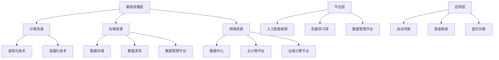
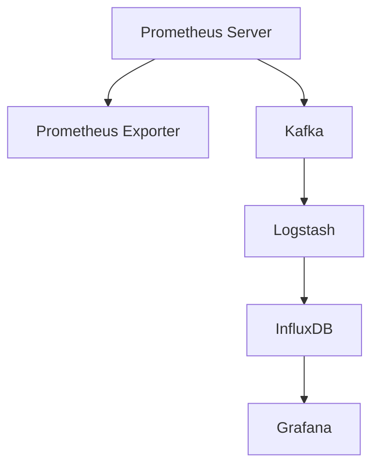

                 

# AI基础设施的监控与告警：Lepton AI的运维体系

## 摘要

本文旨在深入探讨AI基础设施的监控与告警体系，结合Lepton AI的实际运维经验，全面解析其运维策略、监控体系和告警体系。文章首先定义了AI基础设施的核心概念与架构，分析了其在当前技术和市场环境中的重要性及其未来发展趋势。接着，文章详细介绍了监控与告警的基本概念、技术选型及最佳实践，并通过Lepton AI的运维案例展示了实际操作中的经验和教训。最后，文章展望了AI基础设施监控与告警领域的挑战与机遇，探讨了未来技术发展的方向和趋势。本文旨在为读者提供一个全面、深入的AI基础设施监控与告警指南，帮助其在实际运维中实现高效、稳定的管理。

## 关键词

AI基础设施、监控与告警、运维体系、Lepton AI、技术选型、最佳实践、挑战与机遇

## 引言

随着人工智能（AI）技术的飞速发展，AI基础设施的重要性日益凸显。AI基础设施不仅为AI算法提供了必要的计算和存储资源，还包括数据处理、模型训练、模型部署等环节，构成了一个复杂的生态系统。在这个生态系统中，监控与告警体系扮演着至关重要的角色，它不仅能够实时监控系统的运行状态，及时发现并处理潜在的问题，还能够通过数据的积累和分析，优化系统的性能和可靠性。

本文将以Lepton AI的运维体系为案例，深入探讨AI基础设施的监控与告警体系。Lepton AI是一家专注于人工智能解决方案的公司，其运维体系在监控与告警方面有着丰富的实践经验。通过分析Lepton AI的运维策略、监控体系和告警体系，本文希望能够为其他企业或组织提供有价值的参考和启示。

文章的结构如下：

1. 第一部分：AI基础设施概述
   - 第1章：AI基础设施的概念与架构
   - 第2章：AI基础设施的重要性

2. 第二部分：监控与告警技术
   - 第3章：监控与告警的基本概念
   - 第4章：监控与告警的技术选型
   - 第5章：监控与告警的最佳实践

3. 第三部分：Lepton AI运维体系
   - 第6章：Lepton AI的运维策略
   - 第7章：Lepton AI的监控体系
   - 第8章：Lepton AI的告警体系
   - 第9章：Lepton AI的运维实战案例

4. 第四部分：扩展与未来展望
   - 第10章：AI基础设施监控与告警的挑战与机遇
   - 第11章：AI基础设施监控与告警的发展趋势

5. 附录
   - 附录A：监控与告警技术资源
   - 附录B：Lepton AI运维体系参考文档

通过以上结构的安排，本文将全面、系统地介绍AI基础设施的监控与告警体系，旨在为读者提供一个清晰的思路和实用的指导。

## 第一部分：AI基础设施概述

### 第1章：AI基础设施的概念与架构

#### 1.1 AI基础设施的定义

AI基础设施（AI Infrastructure）是指支持人工智能系统正常运行的各种硬件、软件和网络资源的集合。它不仅包括计算资源，如服务器、GPU、FPGA等，还包括数据资源，如数据存储、数据清洗、数据管理平台，以及算法资源，如深度学习框架、机器学习库等。AI基础设施的核心目标是提供高效、稳定、可扩展的计算环境，以满足人工智能算法的运行需求。

AI基础设施的定义可以从以下几个方面来理解：

1. **计算资源**：计算资源是AI基础设施的核心，包括CPU、GPU、TPU等计算设备。这些设备提供了强大的计算能力，支持深度学习、图像识别、自然语言处理等AI任务的运行。

2. **数据资源**：数据是AI的基石。数据资源包括数据存储、数据清洗、数据管理和数据共享平台。这些平台确保了数据的可靠性、安全性和高效性，为AI算法提供了高质量的训练数据。

3. **算法资源**：算法资源包括深度学习框架、机器学习库、算法模型库等。这些资源为开发者提供了丰富的算法工具和模型，降低了AI开发的门槛。

4. **网络资源**：网络资源包括数据中心、云计算平台、边缘计算节点等。这些资源提供了数据传输和计算服务的网络环境，确保了AI系统的实时性和可扩展性。

#### 1.2 AI基础设施的架构

AI基础设施的架构可以分为以下几个层次：

1. **基础设施层**：基础设施层包括计算资源、存储资源、网络资源等硬件设备。这些资源通过虚拟化、容器化等技术进行管理和调度，以实现资源的高效利用和弹性扩展。

2. **平台层**：平台层包括人工智能框架、机器学习库、数据管理平台等软件资源。这些平台提供了AI算法开发、训练、部署的完整工具链，支持开发者快速构建和部署AI应用。

3. **应用层**：应用层包括各种AI应用，如自动驾驶、智能家居、医疗诊断等。这些应用利用AI基础设施提供的计算和数据处理能力，实现了特定的业务功能。

#### 1.3 AI基础设施的核心组件

AI基础设施的核心组件包括计算引擎、数据仓库、模型库等。以下是这些组件的详细说明：

1. **计算引擎**：计算引擎是AI基础设施的核心组件，负责执行AI算法的计算任务。常见的计算引擎包括TensorFlow、PyTorch、MXNet等。计算引擎不仅提供了高效的计算能力，还支持动态图计算、自动微分等高级功能。

2. **数据仓库**：数据仓库是存储和管理AI训练数据的重要组件。数据仓库需要具备高性能的读写能力、数据压缩和去重功能，以及灵活的查询接口。常见的数据仓库包括Hadoop、Spark、MongoDB等。

3. **模型库**：模型库是存储和管理AI模型的重要组件。模型库不仅需要支持模型的版本管理和发布，还需要提供模型的快速加载和推理功能。常见的模型库包括TensorFlow Model Garden、PyTorch Model Zoo等。

#### 图 1.1 AI基础设施的架构

通过上述架构设计，AI基础设施能够为各种AI应用提供高效、稳定、可扩展的支持，满足不同场景的需求。

### 第2章：AI基础设施的重要性

#### 2.1 AI基础设施的挑战

随着AI技术的广泛应用，AI基础设施面临着诸多挑战。以下是其中几个主要的挑战：

1. **计算能力需求**：随着深度学习等复杂算法的普及，AI应用对计算能力的需求急剧增长。如何提供足够的计算资源以满足需求，成为AI基础设施的一大挑战。

2. **数据安全与隐私**：AI算法的运行依赖于大量数据，这些数据往往涉及敏感信息。如何确保数据的安全和隐私，防止数据泄露或滥用，是AI基础设施需要解决的重要问题。

3. **能耗与管理**：AI基础设施的高性能计算和大规模数据处理带来了巨大的能耗问题。如何降低能耗、提高资源利用率，是AI基础设施需要面对的另一个挑战。

4. **可扩展性与可靠性**：随着AI应用的不断扩展，AI基础设施需要具备良好的可扩展性和可靠性。如何实现资源的动态调配、故障处理和容错，是AI基础设施需要解决的关键问题。

#### 2.2 AI基础设施的价值

尽管AI基础设施面临着诸多挑战，但其价值同样不可忽视。以下是AI基础设施的几个主要价值：

1. **提升生产效率**：AI基础设施为AI算法提供了强大的计算和数据处理能力，能够大幅提升生产效率。例如，自动驾驶系统利用AI基础设施实现了高效的路况分析和决策，提升了交通效率。

2. **降低运营成本**：AI基础设施通过自动化和智能化技术，降低了运营成本。例如，智能监控系统利用AI基础设施实现了自动化的安全监控和异常检测，减少了人力成本。

3. **增强竞争力**：AI基础设施为企业提供了强大的技术支持，使其能够在市场竞争中占据优势。例如，金融机构利用AI基础设施实现了智能风险管理，提升了业务竞争力。

4. **促进科技创新**：AI基础设施为AI研究提供了必要的计算和数据资源，促进了AI技术的创新和发展。例如，深度学习算法的突破离不开强大的计算资源支持。

#### 2.3 AI基础设施的未来发展趋势

展望未来，AI基础设施将朝着以下几个方向发展：

1. **云计算与边缘计算的结合**：随着5G技术的普及，云计算与边缘计算将深度融合，提供更加灵活、高效的计算服务。

2. **硬件与软件的协同优化**：硬件和软件的协同优化将成为AI基础设施的重要趋势。例如，GPU和FPGA等硬件设备将与传统计算资源相结合，提供更高效的计算能力。

3. **数据隐私保护**：随着数据隐私保护意识的提升，AI基础设施将采用更加严格的数据隐私保护措施，确保数据的安全和隐私。

4. **智能化的运维管理**：AI基础设施的运维管理将更加智能化，通过机器学习和数据分析技术，实现自动化、智能化的运维操作。

通过上述分析，可以看出AI基础设施在当前技术和市场环境中的重要性，以及其未来发展的趋势。理解这些趋势和挑战，将有助于企业或组织更好地规划和构建AI基础设施，为AI技术的发展和应用提供有力支持。

### 第3章：监控与告警的基本概念

#### 3.1 监控的定义与目标

监控（Monitoring）是指对系统、服务或网络的状态、性能和资源使用情况进行持续监控和评估的过程。在AI基础设施中，监控的目的是确保系统的稳定运行，及时发现并处理潜在的问题，提高系统的可靠性和可用性。

监控的定义可以从以下几个方面来理解：

1. **系统状态监控**：系统状态监控是指对服务器、网络设备、数据库等系统的运行状态进行监控，包括CPU利用率、内存使用率、磁盘空间等。

2. **服务性能监控**：服务性能监控是指对各种服务的性能指标进行监控，包括HTTP服务响应时间、数据库查询延迟、队列长度等。

3. **资源使用监控**：资源使用监控是指对系统资源的使用情况进行监控，包括CPU使用率、内存使用率、磁盘I/O等。

监控的目标主要包括：

1. **及时发现异常**：通过实时监控，及时发现系统中的异常情况，如高负载、故障等。

2. **优化系统性能**：通过监控数据，分析和优化系统的性能，提高系统的运行效率。

3. **确保系统可靠性**：通过监控和告警，确保系统的可靠性和可用性，降低故障率。

#### 3.2 告警的定义与目标

告警（Alerting）是指当系统或服务出现异常情况时，通过通知方式提醒相关人员或系统进行处理的机制。告警是监控的重要组成部分，它能够及时响应异常情况，确保问题得到快速解决。

告警的定义可以从以下几个方面来理解：

1. **异常检测**：告警系统通过监控数据进行分析，发现异常情况，如CPU利用率过高、磁盘空间不足等。

2. **通知机制**：告警系统通过发送通知，如邮件、短信、短信通知等，提醒相关人员或系统进行响应。

3. **自动化处理**：告警系统可以配置自动化处理规则，如自动重启服务、停止特定任务等，以减少人工干预。

告警的目标主要包括：

1. **快速响应**：通过及时发送告警通知，确保异常情况得到快速响应和处理。

2. **减少人工干预**：通过自动化处理规则，减少人工干预，提高故障处理效率。

3. **提高系统可靠性**：通过有效的告警机制，及时发现和解决系统问题，提高系统的可靠性和可用性。

#### 3.3 监控与告警的关系

监控与告警是相互关联、相互补充的两个概念。监控负责实时收集和评估系统的状态和性能数据，而告警则负责在发现异常时及时通知相关人员或系统进行处理。

监控与告警的关系可以概括为以下几点：

1. **数据驱动**：监控系统通过收集大量的监控数据，分析这些数据以识别异常情况。告警系统则基于这些监控数据进行分析和判断，触发告警。

2. **即时响应**：监控系统发现异常情况后，通过告警系统通知相关人员或系统进行响应。告警系统可以配置多种通知方式，确保通知及时、有效。

3. **自动化处理**：告警系统可以配置自动化处理规则，如自动重启服务、停止特定任务等。这些规则基于监控数据进行分析，自动执行相应的操作。

4. **反馈机制**：监控与告警系统之间形成了一种反馈机制。监控系统收集数据，告警系统处理异常情况，并通过反馈机制将处理结果返回监控系统，以进一步优化监控策略。

通过监控与告警的协同工作，AI基础设施能够实现实时、高效的监控与告警，确保系统的稳定运行和可靠性能。

### 第4章：监控与告警的技术选型

#### 4.1 开源监控工具介绍

在AI基础设施的监控与告警领域，开源监控工具因其灵活性、可定制性和成本效益而备受青睐。以下是一些常见的开源监控工具及其特点：

1. **Prometheus**

   Prometheus是一个开源的监控解决方案，由SoundCloud开发并捐赠给Cloud Native Computing Foundation（CNCF）。它具有以下特点：

   - **数据采集**：Prometheus使用HTTP拉取方式采集数据，可以通过配置静态发现规则或动态发现规则来自动发现和采集目标。
   - **数据存储**：Prometheus使用时间序列数据库存储监控数据，支持数据压缩和过期策略，存储效率高。
   - **告警管理**：Prometheus内置告警管理功能，支持基于PromQL（Prometheus查询语言）的告警规则定义，能够灵活地定义告警条件。

2. **Grafana**

   Grafana是一个开源的数据可视化平台，它可以与多种数据源集成，包括Prometheus、InfluxDB、Kibana等。其特点如下：

   - **数据可视化**：Grafana提供丰富的图表和仪表板功能，可以直观地展示监控数据。
   - **告警通知**：Grafana支持多种告警通知渠道，如电子邮件、短信、Slack等，可以灵活配置告警通知策略。
   - **数据源集成**：Grafana支持多种数据源，包括时间序列数据库、关系型数据库、NoSQL数据库等，可以满足不同场景的需求。

3. **Zabbix**

   Zabbix是一个功能强大的开源监控解决方案，它具有以下特点：

   - **-agent机制**：Zabbix使用-agent机制进行数据采集，可以在目标主机上安装-agent程序，实时收集系统性能数据。
   - **监控范围广泛**：Zabbix支持对各种设备和服务的监控，包括Linux、Windows、网络设备、数据库等。
   - **告警策略**：Zabbix提供灵活的告警策略，支持基于阈值、条件等的告警配置，能够实现多种告警方式，如电子邮件、短信、声音等。

4. **Nagios**

   Nagios是一个历史悠久且功能丰富的开源监控工具，它具有以下特点：

   - **插件丰富**：Nagios拥有大量的插件，可以扩展其监控功能，包括服务状态、性能指标等。
   - **告警通知**：Nagios支持多种告警通知方式，如电子邮件、短信、网页等，可以根据不同的告警级别发送不同的通知。
   - **报告与可视化**：Nagios提供报告和可视化功能，可以生成各种监控报告，帮助管理员了解系统的运行状况。

#### 4.2 商业监控工具介绍

商业监控工具通常提供更高级的功能和更专业的支持，适合大型企业或对监控要求较高的场景。以下是一些常见的商业监控工具及其特点：

1. **AppDynamics**

   AppDynamics是一个企业级的性能监控和告警工具，它具有以下特点：

   - **应用性能监控**：AppDynamics专注于应用性能监控，可以实时监控应用的性能和健康状况，包括数据库、Web服务器、API等。
   - **智能告警**：AppDynamics提供智能告警功能，可以基于应用性能指标和用户行为数据，智能地识别和响应异常情况。
   - **自动化修复**：AppDynamics支持自动化修复功能，可以在发现异常时自动执行预定义的操作，如重启服务、调整配置等。

2. **Dynatrace**

   Dynatrace是一个云原生监控解决方案，它具有以下特点：

   - **自动化监控**：Dynatrace采用AI和机器学习技术，实现自动化监控和问题定位，减少人工干预。
   - **全栈监控**：Dynatrace支持对云基础设施、容器、微服务、Web应用程序等全栈监控，提供统一的监控视图。
   - **实时分析**：Dynatrace提供实时分析功能，可以实时分析监控数据，快速识别和解决问题。

3. **Datadog**

   Datadog是一个云监控平台，它具有以下特点：

   - **集成多种数据源**：Datadog支持集成多种数据源，如云服务提供商、容器、数据库等，提供全面的监控数据。
   - **自动化告警**：Datadog支持自动化告警功能，可以根据监控数据自动触发告警，并将告警通知发送到不同的渠道。
   - **可视化仪表板**：Datadog提供丰富的可视化仪表板，可以自定义监控数据展示，方便管理员快速了解系统状况。

4. **Splunk**

   Splunk是一个大数据分析和监控工具，它具有以下特点：

   - **大数据处理**：Splunk擅长处理大规模的数据，可以实时收集、存储和分析监控数据。
   - **灵活的查询语言**：Splunk支持基于Splunk查询语言（SQL-like）的灵活查询，可以方便地提取和分析监控数据。
   - **丰富的可视化工具**：Splunk提供丰富的可视化工具，可以生成各种监控报告和图表，帮助管理员了解系统状况。

通过上述介绍，可以看出开源监控工具和商业监控工具各有优势，企业或组织可以根据自身需求和预算选择合适的监控工具。开源工具适合预算有限、需要高度定制化的场景，而商业工具则适合大型企业或对监控要求较高的场景。

#### 4.3 监控与告警技术的应用场景

监控与告警技术在不同的应用场景中有着广泛的应用。以下是一些典型的应用场景及其特点：

1. **云计算环境**

   云计算环境具有高动态性和大规模性，监控与告警技术在这里至关重要。应用场景包括：

   - **云服务器监控**：实时监控云服务器的性能指标，如CPU利用率、内存使用率、网络带宽等，确保服务器稳定运行。
   - **容器监控**：监控容器和容器集群的状态，如Pod状态、CPU/内存使用率、容器日志等，确保容器服务的高可用性。
   - **存储监控**：监控云存储服务的使用情况，如存储容量、I/O性能、数据备份等，确保数据的安全性和可靠性。

2. **数据中心**

   数据中心是企业或组织运行业务的核心，监控与告警技术在这里用于确保数据中心的稳定运行。应用场景包括：

   - **网络监控**：监控数据中心的网络设备，如交换机、路由器等，确保网络的连通性和性能。
   - **服务器监控**：监控数据中心的物理服务器，如CPU利用率、内存使用率、磁盘I/O等，确保服务器的稳定运行。
   - **存储监控**：监控数据中心的存储设备，如磁盘阵列、存储服务器等，确保存储资源的充足和性能。

3. **边缘计算**

   边缘计算是将计算和存储能力部署在靠近数据源的地方，监控与告警技术在边缘计算环境中用于确保系统的稳定运行。应用场景包括：

   - **设备监控**：监控边缘设备的运行状态，如CPU温度、电池电量、网络连接等，确保设备的正常运行。
   - **数据流监控**：监控边缘设备的数据流处理情况，如数据传输速率、数据处理延迟等，确保数据处理的及时性和准确性。
   - **安全监控**：监控边缘设备的网络安全状态，如入侵检测、恶意流量检测等，确保系统的安全性。

4. **容器化环境**

   容器化环境具有高灵活性和可扩展性，监控与告警技术在这里用于确保容器化应用的高效运行。应用场景包括：

   - **容器监控**：监控容器的运行状态，如CPU/内存使用率、网络流量、容器日志等，确保容器服务的正常运行。
   - **集群监控**：监控容器集群的状态，如节点状态、集群资源利用率、集群日志等，确保集群的高可用性和性能。
   - **服务监控**：监控容器化应用的服务，如API服务、数据库服务等，确保服务的可用性和性能。

通过上述应用场景的介绍，可以看出监控与告警技术在各种环境中都有着广泛的应用。在实际部署中，可以根据具体需求选择合适的监控与告警工具，实现高效、稳定的监控与管理。

### 第5章：监控与告警的最佳实践

#### 5.1 监控指标设计

监控指标是监控体系的核心，合理设计监控指标对于及时发现问题和优化系统性能至关重要。以下是监控指标设计的一些最佳实践：

1. **全面性**：监控指标应涵盖系统各个层面的关键性能指标，包括但不限于CPU利用率、内存使用率、磁盘I/O、网络带宽、服务响应时间等。通过全面监控，可以全面了解系统的运行状况。

2. **关键性**：监控指标应关注关键业务流程和关键组件的运行状态，例如数据库的查询延迟、应用服务的吞吐量等。这些关键性指标能够直接反映系统的性能和稳定性。

3. **可度量性**：监控指标应具有明确的度量标准和阈值，使得监控结果具有可操作性和可解释性。例如，CPU利用率超过90%可以视为高负载，数据库查询延迟超过500毫秒可以视为异常。

4. **可预测性**：在设计监控指标时，应考虑未来业务的发展和变化，确保监控指标能够适应不同的业务场景。例如，随着用户量的增加，可以提前设计相应的监控指标，以便及时发现性能瓶颈。

5. **联动性**：监控指标之间应具有联动性，即当一个指标出现异常时，能够联动其他相关指标进行分析，从而更全面地了解问题的原因。例如，当CPU利用率过高时，可以联动网络带宽指标，分析是否由于网络拥堵导致CPU负载升高。

#### 5.2 告警策略制定

告警策略是监控与告警系统的核心，合理的告警策略能够确保问题得到及时响应和处理。以下是告警策略制定的一些最佳实践：

1. **分级告警**：根据问题的严重程度，将告警分为不同级别，如紧急告警、重要告警、一般告警等。不同级别的告警应配置不同的响应策略和处理优先级。

2. **阈值设置**：根据监控指标的定义和预期性能，合理设置告警阈值。阈值设置应综合考虑系统的性能指标、业务需求、历史数据等。

3. **告警通知**：告警通知的方式应多样化，包括电子邮件、短信、即时通讯工具等，以便快速通知相关人员。同时，应确保通知渠道的可靠性和及时性。

4. **告警抑制**：为了避免因短时间内的频繁告警而导致的告警疲劳，可以采用告警抑制策略，即在一定时间内对重复告警进行抑制，仅在连续多次告警时才发送通知。

5. **告警响应**：告警响应应建立明确的流程和责任分工，确保问题能够得到及时、有效的处理。例如，可以设置告警处理流程、故障处理规范等。

6. **自动化处理**：在可能的情况下，应配置自动化处理规则，如自动重启服务、自动扩容资源等，以减少人工干预，提高故障处理效率。

通过以上最佳实践，可以构建一个高效、可靠的监控与告警系统，确保系统的稳定运行和快速响应。

#### 5.3 监控与告警系统的优化

监控与告警系统的优化是确保其性能和可靠性的关键步骤。以下是一些优化策略：

1. **性能优化**：优化监控数据采集、处理和存储的性能，例如通过并行处理、缓存技术等，减少系统的响应时间。同时，合理配置监控代理和服务器的资源，确保系统的高性能运行。

2. **可靠性优化**：增强监控与告警系统的可靠性，例如通过数据备份、故障转移、容错设计等，确保系统的连续性和稳定性。定期进行系统检查和维护，及时发现和解决潜在问题。

3. **用户体验优化**：提供友好的用户界面和操作流程，使得用户能够方便地配置、查看和管理监控数据。优化告警通知的方式和渠道，确保通知及时、有效。

4. **数据分析与可视化**：利用数据分析与可视化技术，深度挖掘监控数据的价值，提供更直观、全面的系统监控视图。例如，通过实时仪表板、趋势分析图等，帮助用户快速了解系统状态。

5. **自动化与智能化**：引入自动化和智能化技术，如机器学习、自然语言处理等，实现监控数据的智能分析和告警规则的自适应调整。例如，基于历史数据和模式识别，自动优化监控指标和阈值设置。

通过以上优化策略，监控与告警系统可以更加高效、稳定地运行，为系统的可靠性和性能提供有力保障。

### 第6章：Lepton AI的运维策略

#### 6.1 运维团队组织架构

Lepton AI的运维团队组织架构设计合理，职责明确，以确保系统的稳定运行和高效运维。以下是Lepton AI运维团队的组织架构及其职责：

1. **运维经理**：运维经理是运维团队的负责人，负责整体运维策略的制定和执行，协调各部门之间的沟通和合作。运维经理的主要职责包括：

   - **制定运维策略**：根据公司业务需求和系统特点，制定详细的运维策略和计划。
   - **团队管理**：管理运维团队的日常工作和人员调配，确保团队高效运作。
   - **资源协调**：协调公司内部资源，如硬件、软件、网络等，确保运维工作的顺利进行。

2. **系统管理员**：系统管理员负责服务器、网络设备、存储设备等硬件设施的管理和维护，确保系统的高可用性和性能。系统管理员的主要职责包括：

   - **硬件维护**：定期检查硬件设备的运行状态，进行硬件更换和维护。
   - **软件安装与升级**：负责操作系统、数据库、中间件等软件的安装、配置和升级。
   - **故障处理**：及时响应和处理系统故障，确保系统的稳定运行。

3. **网络管理员**：网络管理员负责网络设备的配置、维护和管理，确保网络的稳定性和安全性。网络管理员的主要职责包括：

   - **网络配置**：根据业务需求，合理配置网络设备，确保网络的正常运行。
   - **网络安全**：实施网络安全策略，监控网络安全事件，防止网络攻击和入侵。
   - **性能优化**：优化网络拓扑和配置，提高网络传输效率。

4. **数据库管理员**：数据库管理员负责数据库的安装、配置、优化和管理，确保数据的完整性、安全性和可靠性。数据库管理员的主要职责包括：

   - **数据库安装与配置**：安装和配置数据库软件，确保数据库的正常运行。
   - **数据备份与恢复**：定期备份数据，确保数据的安全性和可恢复性。
   - **性能优化**：监控数据库性能，进行数据库调优，提高查询效率。

5. **开发运维工程师**：开发运维工程师负责开发和运维之间的协作，确保开发流程和运维流程的顺畅衔接。开发运维工程师的主要职责包括：

   - **自动化部署**：开发和维护自动化部署脚本，实现应用的快速部署和部署过程的可视化。
   - **持续集成与持续部署（CI/CD）**：搭建和维护CI/CD流程，确保代码的质量和部署的效率。
   - **故障排查**：参与故障排查，与运维团队协作，共同解决系统问题。

通过以上分工明确的组织架构，Lepton AI的运维团队能够高效地完成各项运维工作，确保系统的稳定运行和持续优化。

#### 6.2 运维流程设计

Lepton AI的运维流程设计科学、合理，涵盖了系统部署、监控、维护和故障处理等各个环节，确保运维工作的有序进行。以下是Lepton AI的运维流程设计：

1. **系统部署流程**

   - **需求分析**：与开发团队协作，分析业务需求，确定部署的应用和系统环境。
   - **环境准备**：准备部署所需的环境，包括操作系统、数据库、中间件等。
   - **代码准备**：准备部署的代码和依赖库，确保代码的完整性和正确性。
   - **自动化部署**：使用自动化部署工具，如Ansible、Chef等，执行部署脚本，实现应用的自动化部署。
   - **测试验证**：部署完成后，进行系统测试和验证，确保系统功能的正确性和性能。

2. **监控系统**

   - **监控指标设计**：根据业务需求，设计关键监控指标，包括CPU利用率、内存使用率、磁盘I/O、网络带宽、服务响应时间等。
   - **数据采集**：通过监控工具，如Prometheus、Grafana等，采集系统监控数据。
   - **数据存储与处理**：将监控数据存储到时间序列数据库，如InfluxDB，并使用数据处理工具，如Kafka、Elasticsearch等，进行数据清洗和预处理。
   - **数据可视化**：使用可视化工具，如Grafana、Kibana等，实时展示监控数据，提供直观的监控视图。

3. **系统维护**

   - **例行维护**：定期进行系统维护，包括操作系统升级、软件更新、安全补丁安装等，确保系统的稳定性和安全性。
   - **性能优化**：根据监控数据，分析和优化系统性能，包括调优数据库查询、优化系统配置等。
   - **资源监控**：实时监控系统资源使用情况，如CPU、内存、磁盘等，确保资源的高效利用。

4. **故障处理**

   - **故障预警**：通过监控系统的预警功能，及时发现系统故障，如CPU高负载、内存泄漏等。
   - **故障定位**：根据故障预警信息，快速定位故障源头，如数据库异常、网络故障等。
   - **故障处理**：采取相应的措施，如重启服务、扩容资源、修复漏洞等，解决系统故障。
   - **故障总结**：对故障原因和处理过程进行总结，形成故障报告，为后续的故障预防和改进提供依据。

通过以上运维流程设计，Lepton AI能够高效、有序地进行系统部署、监控、维护和故障处理，确保系统的稳定运行和持续优化。

#### 6.3 运维工具与平台选择

为了确保Lepton AI运维工作的有序进行，选择合适的运维工具和平台至关重要。以下是Lepton AI在运维工具和平台选择方面的一些考量：

1. **运维工具选择**

   - **自动化部署工具**：选择Ansible作为自动化部署工具，它基于Python编写，易于扩展和定制，支持多种操作系统和平台。Ansible能够简化部署过程，提高部署效率，减少人工干预。

   - **持续集成与持续部署（CI/CD）工具**：选择Jenkins作为CI/CD工具，它是一款开源的持续集成服务器，支持多种构建工具和插件，能够实现代码的自动化测试、构建和部署。

   - **监控工具**：选择Prometheus和Grafana作为监控工具。Prometheus是一款开源的监控解决方案，具有高效的数据采集、存储和分析功能，支持自定义告警规则。Grafana是一款开源的数据可视化工具，能够将Prometheus的数据以直观的方式展示出来。

   - **日志管理工具**：选择ELK（Elasticsearch、Logstash、Kibana）作为日志管理工具。ELK栈是一个开源的日志收集、存储和分析平台，能够高效地收集和存储海量日志数据，并提供强大的查询和分析功能。

   - **配置管理工具**：选择Ansible作为配置管理工具，它能够自动化管理系统的配置和软件安装，确保系统的一致性和稳定性。

2. **运维平台选择**

   - **云服务平台**：选择AWS（Amazon Web Services）作为云服务平台，它提供了丰富的云计算资源和服务，如EC2、RDS、S3等，能够满足Lepton AI在计算、存储、数据库等方面的需求。

   - **容器服务平台**：选择Kubernetes作为容器服务平台，它是一款开源的容器编排和管理工具，能够自动化部署、扩展和管理容器化应用，提高系统的可扩展性和可靠性。

   - **DevOps平台**：选择JFrog Artifactory作为DevOps平台，它是一款开源的 artifact 管理工具，能够管理、存储和分发构建 artifact，确保构建和部署过程的自动化和一致性。

通过选择合适的运维工具和平台，Lepton AI能够实现自动化、高效、可靠的运维工作，确保系统的稳定运行和持续优化。

### 第7章：Lepton AI的监控体系

#### 7.1 监控体系架构设计

Lepton AI的监控体系采用了分布式架构设计，旨在确保监控数据的高效采集、处理和存储，同时提高系统的可靠性和可扩展性。以下是Lepton AI监控体系架构的详细设计：

1. **数据采集层**

   数据采集层负责从各个节点和系统组件中采集监控数据。Lepton AI采用了Prometheus作为数据采集工具，通过配置静态发现规则和动态发现规则，实现对服务器的CPU利用率、内存使用率、磁盘I/O、网络带宽等监控数据的实时采集。

   - **Prometheus Server**：Prometheus Server负责存储和查询监控数据，采用时序数据库存储数据，支持水平扩展和故障转移。
   - **Prometheus Exporter**：Prometheus Exporter是Prometheus的集成组件，运行在各个节点上，负责采集本地系统的监控数据，并通过HTTP拉取方式发送给Prometheus Server。

2. **数据处理层**

   数据处理层负责对采集到的监控数据进行分析和处理，提取有用的监控指标，并生成可视化报表。数据处理层采用了Kafka作为消息队列，负责数据传输和缓冲，确保数据的实时性和可靠性。

   - **Kafka**：Kafka是一款开源的消息队列，具有高吞吐量、可扩展性和可靠性，能够处理大规模的监控数据。
   - **Logstash**：Logstash是一款开源的数据处理工具，负责对Kafka中的监控数据进行清洗、转换和存储。它支持多种输入和输出插件，可以方便地与其他数据处理工具集成。
   - **Elasticsearch**：Elasticsearch是一款开源的全文搜索引擎，负责存储和处理清洗后的监控数据。它支持快速的索引和查询操作，能够提供高效的监控数据分析能力。

3. **数据存储层**

   数据存储层负责存储和管理监控数据，确保数据的持久性和可访问性。数据存储层采用了InfluxDB作为时序数据库，支持高效的数据写入和查询操作。

   - **InfluxDB**：InfluxDB是一款开源的时序数据库，具有高性能、高可靠性和易扩展性，适用于大规模监控数据的存储和管理。

4. **数据展示层**

   数据展示层负责将监控数据以直观的方式展示给用户，提供实时监控报表和告警通知。数据展示层采用了Grafana作为可视化工具，通过配置仪表板，将各种监控指标和数据视图呈现给用户。

   - **Grafana**：Grafana是一款开源的数据可视化工具，支持多种数据源，能够生成自定义的仪表板和报表，提供直观的监控视图。

#### 图 7.1 Lepton AI监控体系架构

通过以上架构设计，Lepton AI的监控体系实现了数据的高效采集、处理和存储，提供了实时、全面的监控视图，为系统的稳定运行和性能优化提供了有力支持。

#### 7.2 监控指标体系设计

Lepton AI的监控指标体系设计科学、全面，涵盖了系统各个层面的关键性能指标，包括但不限于以下方面：

1. **服务器性能指标**

   - **CPU利用率**：CPU利用率是评估服务器性能的重要指标，反映了CPU的使用情况。公式如下：
     $$\text{CPU利用率} = \frac{\text{CPU使用时间}}{\text{总时间}} \times 100\%$$
     示例：如果CPU使用时间为90秒，总时间为100秒，则CPU利用率为90%。

   - **内存使用率**：内存使用率反映了内存的使用情况，计算公式如下：
     $$\text{内存使用率} = \frac{\text{已使用内存}}{\text{总内存}} \times 100\%$$
     示例：如果已使用内存为4GB，总内存为8GB，则内存使用率为50%。

   - **磁盘I/O**：磁盘I/O反映了磁盘的读写性能，包括磁盘读取速度、写入速度和IOPS（每秒输入/输出操作次数）等。示例公式如下：
     $$\text{IOPS} = \frac{\text{操作次数}}{\text{时间}}$$
     示例：如果1分钟内完成了1000次读写操作，则IOPS为1000次/分钟。

2. **网络性能指标**

   - **网络带宽**：网络带宽反映了网络的传输速率，单位为Mbps（兆比特每秒）。示例公式如下：
     $$\text{网络带宽} = \frac{\text{传输数据量}}{\text{传输时间}}$$
     示例：如果1分钟内传输了100MB的数据，则网络带宽为100Mbps。

   - **网络延迟**：网络延迟反映了数据在网络中的传输时间，单位为ms（毫秒）。示例公式如下：
     $$\text{网络延迟} = \frac{\text{传输时间}}{\text{传输距离}}$$
     示例：如果数据从源到目的地的传输时间为100ms，则网络延迟为100ms。

3. **服务性能指标**

   - **HTTP服务响应时间**：HTTP服务响应时间反映了Web服务器的响应速度，单位为ms。示例公式如下：
     $$\text{HTTP服务响应时间} = \frac{\text{总响应时间}}{\text{请求次数}}$$
     示例：如果10次HTTP请求的总响应时间为1000ms，则平均响应时间为100ms。

   - **数据库查询延迟**：数据库查询延迟反映了数据库查询的响应时间，单位为ms。示例公式如下：
     $$\text{数据库查询延迟} = \frac{\text{查询总时间}}{\text{查询次数}}$$
     示例：如果10次数据库查询的总时间为1000ms，则平均查询延迟为100ms。

4. **应用性能指标**

   - **API调用成功率**：API调用成功率反映了API服务的稳定性，计算公式如下：
     $$\text{API调用成功率} = \frac{\text{成功调用次数}}{\text{总调用次数}} \times 100\%$$
     示例：如果100次API调用中有95次成功，则成功率

