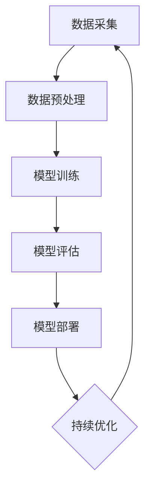

                 

# AI大模型创业：如何应对未来数据挑战？

> **关键词：**AI大模型，创业，数据挑战，隐私保护，安全控制，数据治理，未来趋势

> **摘要：**本文将探讨AI大模型创业的背景和挑战，重点分析未来数据管理中的隐私保护、安全控制、数据治理等关键问题，并提出相应的解决方案和策略。通过实际案例研究和深入分析，为AI大模型创业者提供有益的指导和参考。

### 目录

1. AI大模型创业基础知识
   1.1 AI大模型概述
   1.2 AI大模型技术原理
   1.3 AI大模型应用场景分析
2. AI大模型创业策略与实践
   2.1 AI大模型创业方向选择
   2.2 AI大模型创业团队建设
   2.3 AI大模型产品设计与开发
   2.4 AI大模型创业项目管理
   2.5 AI大模型创业案例研究
3. 未来数据挑战应对策略
   3.1 数据隐私保护与合规
   3.2 数据安全与风险控制
   3.3 数据治理与数据质量控制
   3.4 未来数据挑战应对策略与展望
4. 附录
   4.1 AI大模型相关工具与资源
   4.2 术语表
   4.3 参考文献

---

### 1. AI大模型创业基础知识

#### 1.1 AI大模型概述

AI大模型（Large-scale Artificial Intelligence Models）是指那些能够在大量数据上进行训练，并达到或超过人类水平性能的深度学习模型。这些模型通常包括图像识别、自然语言处理、语音识别、机器翻译等多个领域。

**1.1.1 AI大模型的发展历程**

AI大模型的发展历程可以追溯到20世纪80年代的神经网络研究。随着计算能力的提升和数据量的爆炸式增长，深度学习在21世纪初逐渐崭露头角。2012年，AlexNet在ImageNet竞赛中取得的突破性成果，标志着深度学习在计算机视觉领域的崛起。此后，随着TensorFlow、PyTorch等深度学习框架的普及，AI大模型的研究和应用取得了飞速发展。

**1.1.2 AI大模型的关键概念**

- **深度学习**：一种基于人工神经网络的机器学习技术，通过多层神经网络对数据进行特征提取和模式识别。
- **大规模数据处理**：指对海量数据进行存储、处理和分析的技术和方法。
- **预训练与微调**：预训练是指在大规模数据集上训练模型，使其具有通用的特征提取能力；微调是指在特定任务上对模型进行细粒度调整，以适应特定应用场景。

**1.1.3 AI大模型的优势与挑战**

- **优势**：AI大模型在图像识别、自然语言处理等领域取得了显著的性能提升，能够处理复杂的问题，为各行业带来革命性的变化。
- **挑战**：数据隐私保护、安全风险、计算资源消耗等问题，成为AI大模型发展的重要挑战。

#### 1.2 AI大模型技术原理

**2.1.1 神经网络与深度学习基础**

神经网络（Neural Network）是模仿生物神经系统的计算模型，由大量相互连接的神经元（节点）组成。每个神经元通过权重（权重矩阵）和偏置（偏置向量）对输入数据进行加权求和，再通过激活函数进行非线性变换，从而实现数据的分类、回归等操作。

深度学习（Deep Learning）是神经网络的一种扩展，通过增加网络的层数，实现对复杂数据特征的自动提取和表示。深度学习的核心在于多层神经网络的结构，以及大规模数据的训练，从而实现高精度的模型拟合。

**2.1.2 自监督学习与预训练**

自监督学习（Self-supervised Learning）是一种无需人工标注的数据处理方式，通过利用数据自身的结构信息，进行特征提取和模型训练。自监督学习在图像识别、自然语言处理等领域具有广泛的应用。

预训练（Pre-training）是指在大规模未标注数据集上对模型进行初步训练，使其具备一定的通用特征提取能力。预训练后的模型可以通过微调（Fine-tuning）的方式，快速适应特定任务。

**2.1.3 大规模数据处理技术**

大规模数据处理技术主要包括数据存储、数据清洗、数据集成和数据分析等方面。

- **数据存储**：分布式存储系统（如Hadoop、Spark）可以高效地存储和处理海量数据。
- **数据清洗**：通过数据清洗技术（如数据去重、缺失值处理、异常值检测），提高数据质量。
- **数据集成**：通过数据集成技术（如ETL过程、数据仓库），实现数据的统一管理和利用。
- **数据分析**：利用数据挖掘和机器学习技术，从海量数据中提取有价值的信息。

---

在接下来的部分，我们将进一步探讨AI大模型在各个应用场景中的实际表现，以及创业者在选择应用方向时需要考虑的关键因素。敬请期待。 

---

### 1.2 AI大模型技术原理

#### 2.1.1 神经网络与深度学习基础

神经网络（Neural Network，NN）是人工智能领域的一种基础算法，其灵感来源于人类大脑的神经元结构。神经网络由大量的节点（或称神经元）组成，这些节点通过连接（或称边）相互连接，形成一个复杂的网络结构。每个节点接收来自其他节点的输入信号，通过激活函数进行非线性变换，最后输出结果。

**神经网络的基本概念：**

1. **神经元**：神经网络的基本单元，每个神经元接收多个输入信号，并通过加权求和后经过激活函数产生输出。
2. **权重（Weight）**：连接两个神经元的边的权重，用于表示输入信号的重要程度。
3. **偏置（Bias）**：神经元内部的一个可调整参数，用于调整神经元的输出。
4. **激活函数（Activation Function）**：用于引入非线性因素，常见的激活函数有Sigmoid、ReLU、Tanh等。
5. **正向传播（Forward Propagation）**：输入信号通过神经网络，从输入层传递到输出层的过程。
6. **反向传播（Back Propagation）**：根据输出层的误差，反向更新网络中的权重和偏置的过程。

**神经网络的工作原理：**

1. **输入层**：接收外部输入数据。
2. **隐藏层**：对输入数据进行特征提取和变换。
3. **输出层**：根据隐藏层的输出产生最终结果。

在神经网络中，每个节点（神经元）的计算过程可以表示为以下公式：

$$
\text{output} = \text{activation}(\sum_{i=1}^{n} w_i \cdot x_i + b)
$$

其中，\(w_i\) 是第 \(i\) 个输入信号的权重，\(x_i\) 是第 \(i\) 个输入信号，\(b\) 是偏置，\(\text{activation}\) 是激活函数。

**深度学习与神经网络的区别：**

深度学习（Deep Learning，DL）是神经网络的一种扩展，主要特点是网络深度增加，即包含多个隐藏层。深度学习通过增加网络的深度，可以更有效地提取和表示复杂数据特征，从而在图像识别、自然语言处理等领域取得了显著的成果。

**深度学习的基本架构：**

1. **卷积神经网络（Convolutional Neural Network，CNN）**：主要用于处理图像数据，通过卷积操作提取图像特征。
2. **循环神经网络（Recurrent Neural Network，RNN）**：主要用于处理序列数据，通过循环结构对序列进行建模。
3. **生成对抗网络（Generative Adversarial Network，GAN）**：由生成器和判别器组成，通过对抗训练生成逼真的数据。
4. **长短时记忆网络（Long Short-Term Memory，LSTM）**：是RNN的一种变体，用于解决长序列依赖问题。

**神经网络与深度学习的发展历程：**

1. **20世纪40年代**：人工神经网络的概念首次被提出。
2. **20世纪80年代**：反向传播算法的出现，使得神经网络训练变得更加高效。
3. **21世纪初**：深度学习开始崭露头角，以Hinton等人为代表的科学家推动了深度学习的发展。
4. **2012年**：AlexNet在ImageNet竞赛中取得了突破性成果，深度学习开始在图像识别等领域取得成功。
5. **至今**：深度学习已经在计算机视觉、自然语言处理、语音识别等多个领域取得了广泛应用。

#### 2.1.2 自监督学习与预训练

自监督学习（Self-supervised Learning）是一种无需人工标注的数据处理方式，其核心思想是利用数据自身的结构信息，通过自动生成标签或利用未标记的数据进行训练。自监督学习可以大幅度降低数据标注的成本，并提高模型在处理未标记数据时的性能。

**自监督学习的基本原理：**

1. **数据预处理**：对原始数据进行预处理，如图像增强、数据增强等，以提高模型的泛化能力。
2. **任务设计**：设计一个自监督学习任务，使模型在未标记数据上进行训练。常见的任务有自动编码器（Autoencoder）、无监督聚类、预测误差等。
3. **模型训练**：使用预定义的损失函数，通过优化模型参数来最小化损失。
4. **模型评估**：评估模型在未标记数据集上的性能，如特征表示的稳定性、预测准确性等。

**自监督学习的优势：**

1. **减少标注成本**：无需对数据进行人工标注，可以大幅度降低数据处理的成本。
2. **提高泛化能力**：通过在未标记数据上进行训练，模型可以更好地适应不同的数据分布和场景。
3. **增强鲁棒性**：模型在处理未标记数据时，可以学习到更多的噪声和异常值，从而提高模型对噪声和异常值的鲁棒性。

**预训练与微调（Fine-tuning）**

预训练（Pre-training）是指在未标注的大规模数据集上对模型进行初步训练，使其具有通用的特征提取能力。预训练后的模型可以通过微调，快速适应特定任务。

**预训练的基本流程：**

1. **数据集选择**：选择一个大规模的未标注数据集，如ImageNet、COCO等。
2. **模型初始化**：初始化一个深度学习模型，如CNN、RNN、GAN等。
3. **预训练**：在未标注数据集上进行训练，通过优化模型参数来提高模型的特征提取能力。
4. **微调**：在特定任务上，对预训练模型进行微调，调整模型参数以适应特定任务。

**微调的基本流程：**

1. **数据集划分**：将数据集划分为训练集和验证集。
2. **模型调整**：在训练集上对预训练模型进行微调，调整模型参数。
3. **模型评估**：在验证集上评估模型的性能，如准确率、损失函数值等。
4. **模型优化**：根据评估结果，进一步调整模型参数，以获得更好的性能。

**预训练与微调的优势：**

1. **减少训练成本**：通过预训练，模型在特定任务上的训练时间可以大幅缩短。
2. **提高模型性能**：预训练模型已经在未标注数据集上进行了充分的训练，因此在特定任务上具有更好的性能。
3. **增强泛化能力**：预训练模型可以更好地适应不同的数据分布和场景，从而提高模型的泛化能力。

#### 2.1.3 大规模数据处理技术

大规模数据处理（Big Data Processing）是指在数据量巨大、数据来源多样化、数据处理需求复杂的场景下，对数据进行高效存储、处理和分析的技术和方法。随着互联网、物联网等技术的快速发展，数据规模呈爆炸式增长，如何高效地处理海量数据成为了一个重要挑战。

**大规模数据处理的主要技术：**

1. **分布式存储系统**：如Hadoop HDFS、Apache Cassandra等，可以高效地存储和管理海量数据。
2. **分布式计算框架**：如Apache Spark、Apache Hadoop MapReduce等，可以并行处理大规模数据集。
3. **数据流处理**：如Apache Kafka、Apache Flink等，可以实时处理和分析实时数据流。
4. **数据清洗和预处理**：如ETL（Extract, Transform, Load）工具，用于清洗、转换和加载数据。
5. **机器学习和深度学习**：用于从大规模数据中提取有价值的信息和模式。

**大规模数据处理的基本流程：**

1. **数据采集**：从各种数据源（如数据库、文件系统、传感器等）采集数据。
2. **数据存储**：将采集到的数据存储到分布式存储系统中。
3. **数据清洗**：对数据进行清洗和预处理，如去重、填充缺失值、异常值检测等。
4. **数据集成**：将来自不同数据源的数据进行集成，构建统一的数据视图。
5. **数据分析**：利用机器学习和深度学习技术，对数据进行分析和挖掘，提取有价值的信息。
6. **数据可视化**：将分析结果进行可视化，帮助用户更好地理解和利用数据。

**大规模数据处理的优势：**

1. **高效处理**：分布式存储和计算框架可以大幅度提高数据处理效率，降低计算成本。
2. **实时处理**：数据流处理技术可以实现实时数据处理和分析，满足实时性需求。
3. **灵活扩展**：分布式架构可以灵活扩展，以适应不断增长的数据规模。
4. **多样化应用**：可以从大规模数据中提取有价值的信息，为各种应用场景提供支持。

**大规模数据处理的应用场景：**

1. **金融行业**：通过分析海量交易数据，进行风险控制、信用评估等。
2. **医疗健康**：通过分析医疗数据，进行疾病预测、个性化治疗等。
3. **智能制造**：通过分析生产线数据，进行设备故障预测、生产优化等。
4. **智能交通**：通过分析交通数据，进行交通流量预测、路线规划等。

在接下来的章节中，我们将进一步探讨AI大模型在不同应用场景中的实际表现，以及创业者在选择应用方向时需要考虑的关键因素。敬请期待。

---

### 1.3 AI大模型应用场景分析

#### 3.1 金融行业应用

金融行业是AI大模型应用的重要领域，通过AI大模型，金融机构能够实现风险控制、信用评估、投资组合优化等方面的创新和突破。

**3.1.1 风险控制**

在金融风险管理中，AI大模型可以用于预测和监测金融风险。例如，通过分析历史交易数据、市场动态和宏观经济指标，AI大模型可以识别潜在的金融风险，为金融机构提供及时的风险预警。

**3.1.2 信用评估**

AI大模型在信用评估中的应用主要体现在客户信用评分和贷款审批上。通过分析客户的个人信息、财务状况、历史信用记录等数据，AI大模型可以更准确地预测客户的信用风险，帮助金融机构制定合理的信用政策。

**3.1.3 投资组合优化**

AI大模型可以通过分析历史市场数据、行业趋势、宏观经济指标等因素，为投资者提供投资组合优化的建议。通过构建复杂的数学模型和进行大量的数据模拟，AI大模型可以帮助投资者制定科学合理的投资策略，降低投资风险。

#### 3.2 医疗健康应用

AI大模型在医疗健康领域的应用前景广阔，能够提升疾病诊断的准确性、优化治疗方案、提高医疗资源的利用效率。

**3.2.1 疾病诊断**

在疾病诊断方面，AI大模型可以通过分析医学影像、病例数据、生物标志物等，实现疾病的高效诊断。例如，通过深度学习算法，AI大模型可以自动识别和诊断各种医学影像中的病变区域，提高诊断的准确性。

**3.2.2 治疗方案优化**

AI大模型可以帮助医生制定个性化的治疗方案。通过分析患者的病史、基因信息、生活习惯等因素，AI大模型可以为患者提供最合适的治疗方案，提高治疗效果。

**3.2.3 医疗资源优化**

AI大模型可以优化医疗资源的配置，提高医疗资源的利用效率。例如，通过分析医院的运营数据、患者的就诊记录等信息，AI大模型可以预测医院的就诊高峰，帮助医院合理安排医疗资源和人力资源。

#### 3.3 人工智能与城市治理

人工智能在智慧城市建设中发挥着重要作用，通过AI大模型，可以实现城市治理的智能化和精细化。

**3.3.1 交通管理**

AI大模型可以用于交通流量预测、交通信号控制等方面。通过分析交通数据、实时路况信息等，AI大模型可以优化交通信号配置，减少交通拥堵，提高交通效率。

**3.3.2 智能安防**

AI大模型可以用于视频监控、人脸识别等方面，提高城市的安全管理水平。通过实时分析视频数据，AI大模型可以识别潜在的安全威胁，及时采取应对措施。

**3.3.3 环境监测**

AI大模型可以用于环境监测和污染控制。通过分析空气质量、水质等环境数据，AI大模型可以预测污染趋势，为城市环境治理提供决策支持。

#### 3.4 人工智能与智能制造

智能制造是人工智能在工业领域的重要应用方向，通过AI大模型，可以实现生产过程的自动化、智能化和高效化。

**3.4.1 生产过程优化**

AI大模型可以通过分析生产数据、设备状态等，优化生产过程，提高生产效率和产品质量。例如，通过预测设备故障，AI大模型可以提前进行设备维护，减少停机时间。

**3.4.2 质量控制**

AI大模型可以用于产品质量控制，通过分析生产过程中的数据，识别和纠正质量问题。例如，通过分析产品缺陷数据，AI大模型可以优化生产工艺，减少产品缺陷率。

**3.4.3 供应链管理**

AI大模型可以用于供应链管理，通过分析供应链数据，优化供应链各个环节的运作。例如，通过预测市场需求，AI大模型可以优化库存管理，降低库存成本。

通过以上分析，可以看出AI大模型在各个领域都有广泛的应用前景。对于创业者而言，选择合适的应用场景和商业模式，将是实现成功的关键。在接下来的章节中，我们将探讨AI大模型创业的实践策略和案例分析，敬请期待。

---

### 2. AI大模型创业策略与实践

#### 4.1 AI大模型创业方向选择

在选择AI大模型创业方向时，创业者需要综合考虑市场趋势、技术成熟度、数据资源、团队能力等因素。以下是一些关键步骤和建议：

**4.1.1 创业环境分析**

1. **市场需求**：分析目标市场的规模、增长趋势和用户需求。了解市场是否存在未被满足的需求，以及潜在的客户群体。
2. **技术成熟度**：评估相关AI技术的成熟度，包括深度学习算法、硬件支持、开源框架等。确保所选方向具有可行性和技术优势。
3. **竞争对手**：分析竞争对手的产品、市场定位、技术优势等，了解市场格局和竞争态势。

**4.1.2 创业机会与风险分析**

1. **创业机会**：识别市场中存在的机会，如新兴应用领域、行业痛点等。考虑如何通过AI大模型解决这些问题，提供创新性的解决方案。
2. **风险分析**：评估创业过程中的主要风险，如技术风险、市场风险、资金风险等。制定相应的风险控制措施，确保项目的稳定发展。

**4.1.3 创业方向选择策略**

1. **领域选择**：根据市场需求和技术成熟度，选择具有高增长潜力和市场前景的领域。例如，金融、医疗、智慧城市等。
2. **细分市场**：在选定领域内，进一步细分市场，找到具有差异化优势的细分市场。例如，在金融领域，可以专注于信用评估、风险控制等细分市场。
3. **技术创新**：选择具有技术优势的创业方向，如新型算法、独特的数据处理方法等。技术创新可以帮助企业形成核心竞争力。

#### 4.2 AI大模型创业团队建设

一个高效的AI大模型创业团队是项目成功的关键。以下是一些团队建设的关键要素：

**4.2.1 团队成员角色与职责**

1. **核心技术人员**：负责AI大模型的研发、算法优化等，确保技术的先进性和稳定性。
2. **数据科学家**：负责数据分析和建模，提供数据支持和决策依据。
3. **产品经理**：负责产品规划、市场分析和用户需求调研，确保产品符合市场需求。
4. **市场营销人员**：负责市场推广、品牌建设和客户关系管理。
5. **运营人员**：负责日常运营、客户支持和项目管理工作。

**4.2.2 团队文化建设与激励**

1. **共同愿景**：建立明确的团队愿景和目标，确保团队成员朝着共同的方向努力。
2. **协作机制**：建立高效的协作机制，鼓励团队成员之间的沟通与协作，提高工作效率。
3. **激励机制**：设计合理的激励机制，如股权激励、绩效奖金等，激发团队成员的积极性和创造力。

**4.2.3 团队协作与沟通**

1. **定期会议**：定期召开团队会议，讨论项目进展、问题解决方案等，确保团队成员之间的信息畅通。
2. **知识共享**：鼓励团队成员分享知识和经验，提高团队的整体技能水平。
3. **外部合作**：与其他企业和研究机构建立合作关系，共享资源，共同推动项目发展。

#### 4.3 AI大模型产品设计与开发

AI大模型产品设计与开发是创业过程中的重要环节，以下是一些关键步骤和注意事项：

**4.3.1 产品规划与需求分析**

1. **市场调研**：了解市场需求和用户痛点，确定产品的核心功能和价值主张。
2. **用户需求分析**：通过用户调研、用户访谈等方式，收集用户的真实需求和反馈。
3. **产品规划**：根据市场需求和用户需求，制定详细的产品规划和功能清单。

**4.3.2 AI大模型应用架构设计**

1. **系统架构**：设计合理的系统架构，包括数据存储、数据处理、模型训练和模型部署等模块。
2. **模型选择**：根据应用场景和需求，选择合适的AI大模型，如CNN、RNN、GAN等。
3. **算法优化**：针对模型算法进行优化，提高模型的性能和效率。

**4.3.3 开发流程与工具选择**

1. **开发流程**：建立规范的软件开发流程，包括需求分析、设计、编码、测试等阶段。
2. **开发工具**：选择合适的开发工具和平台，如深度学习框架（TensorFlow、PyTorch）、编程语言（Python、Java等）等。
3. **版本控制**：使用版本控制工具（如Git），确保代码的安全性和一致性。

#### 4.4 AI大模型创业项目管理

成功的AI大模型创业项目需要高效的项目管理，以下是一些项目管理的关键要素：

**4.4.1 项目管理框架与方法**

1. **项目计划**：制定详细的项目计划，包括项目目标、任务分解、时间表、预算等。
2. **风险管理**：识别项目风险，制定相应的风险应对策略。
3. **质量管理**：确保项目质量达到预期目标，制定质量标准和测试方案。
4. **团队协作**：建立高效的团队协作机制，确保项目顺利进行。

**4.4.2 项目进度与风险管理**

1. **进度监控**：定期监控项目进度，确保项目按时完成。
2. **风险控制**：及时识别和处理项目风险，降低风险对项目的影响。
3. **变更管理**：建立变更管理流程，确保项目变更得到有效控制。

**4.4.3 项目评估与优化**

1. **项目评估**：在项目结束时，对项目进行全面的评估，分析项目成果和不足之处。
2. **经验总结**：总结项目过程中的经验和教训，为后续项目提供参考。
3. **优化措施**：根据项目评估结果，制定相应的优化措施，提高项目质量和效率。

#### 4.5 AI大模型创业案例研究

通过对AI大模型创业的成功案例和失败案例进行分析，可以深入了解创业过程中的关键成功因素和常见问题。

**4.5.1 创业成功案例分析**

- **案例一：OpenAI**：OpenAI是一家专注于人工智能研究的创业公司，通过深度学习和自然语言处理技术，开发了GPT系列语言模型。OpenAI的成功得益于其对技术创新的持续投入、强大的研发团队以及开放的合作模式。
- **案例二：SenseTime**：商汤科技（SenseTime）是一家专注于计算机视觉领域的创业公司，通过自主研发的深度学习算法，实现了人脸识别、目标检测等技术的突破。SenseTime的成功在于其对技术创新的持续投入、丰富的数据资源和广泛的合作伙伴。

**4.5.2 创业失败案例分析**

- **案例一：DeepStack**：DeepStack是一家专注于游戏AI的创业公司，其开发的AI算法在扑克游戏中表现出色。然而，由于市场竞争激烈、技术壁垒较高，DeepStack在发展过程中遇到了资金和人才问题，最终未能成功。
- **案例二：ZestFinance**：ZestFinance是一家利用AI技术进行信用评分的创业公司，其模型在预测信用风险方面表现出色。然而，由于数据隐私和合规问题，ZestFinance在发展中遇到了法律风险，最终未能实现预期目标。

**4.5.3 案例启示与经验总结**

- **成功因素**：技术创新、市场定位、团队建设、资金支持、合作伙伴等。
- **常见问题**：技术风险、市场风险、资金风险、人才流失、合规问题等。
- **经验教训**：加强技术创新、关注市场动态、合理规划资金、建立稳定的团队和合作伙伴关系、重视合规问题。

通过以上案例分析，创业者可以更好地了解AI大模型创业的挑战和机遇，从而制定更加有效的创业策略。在接下来的章节中，我们将探讨未来数据挑战应对策略，敬请期待。

---

### 3. 未来数据挑战应对策略

#### 9.1 数据隐私保护与合规

随着AI大模型技术的不断发展，数据隐私保护和合规问题日益突出。对于AI大模型创业者来说，如何确保用户数据的安全和合规性是必须面对的关键挑战。

**9.1.1 数据隐私保护法律与政策**

1. **GDPR（通用数据保护条例）**：欧盟于2018年实施的GDPR是数据隐私保护的重要法律框架，要求企业在处理用户数据时必须遵循严格的数据保护原则，如数据最小化、目的明确、透明度等。
2. **CCPA（加利福尼亚州消费者隐私法）**：美国加州的CCPA也是重要的数据隐私保护法律，对企业的数据处理行为进行了严格规定，包括用户数据的收集、使用和共享等。
3. **其他国家和地区的数据隐私法律**：除了GDPR和CCPA，其他国家和地区也有类似的数据隐私保护法律，如中国的《网络安全法》和《个人信息保护法》。

**9.1.2 数据隐私保护技术**

1. **数据加密**：通过数据加密技术，对敏感数据进行加密存储和传输，确保数据在传输过程中不被窃取和篡改。
2. **匿名化和脱敏**：通过匿名化和脱敏技术，对用户数据进行处理，使其无法直接识别用户身份，从而降低隐私泄露的风险。
3. **访问控制**：通过访问控制技术，对用户数据的访问权限进行严格控制，确保只有授权人员才能访问和处理敏感数据。
4. **隐私计算**：隐私计算是一种在不暴露原始数据的情况下进行数据处理和分析的方法，如联邦学习、安全多方计算等。

**9.1.3 企业合规实践**

1. **合规培训**：对企业员工进行数据隐私保护培训，提高员工的合规意识和操作技能。
2. **合规审查**：定期对企业的数据处理行为进行合规审查，确保企业的数据处理行为符合相关法律法规的要求。
3. **隐私设计**：在产品设计和开发过程中，充分考虑数据隐私保护的要求，采用隐私设计原则，如数据最小化、透明度等。
4. **数据安全审计**：定期进行数据安全审计，评估企业的数据安全措施的有效性，并制定相应的改进措施。

#### 10.1 数据安全与风险控制

数据安全是AI大模型创业过程中不可忽视的重要环节，创业者需要采取有效的措施来防范数据泄露、数据篡改等安全风险。

**10.1.1 数据安全挑战与对策**

1. **数据泄露**：数据泄露是数据安全的主要挑战之一。为了防范数据泄露，可以采取以下对策：
   - 数据加密：对敏感数据进行加密存储和传输，确保数据在传输过程中不被窃取和篡改。
   - 数据访问控制：通过访问控制技术，对用户数据的访问权限进行严格控制，确保只有授权人员才能访问和处理敏感数据。
   - 数据备份和恢复：定期进行数据备份，确保在数据泄露或丢失时能够快速恢复数据。

2. **数据篡改**：数据篡改是指未经授权的用户对数据进行非法修改。为了防范数据篡改，可以采取以下对策：
   - 数据完整性校验：对数据进行完整性校验，确保数据在传输和存储过程中未被篡改。
   - 数字签名：使用数字签名技术，确保数据的真实性和完整性。
   - 人工智能审计：利用人工智能技术，对数据访问和操作行为进行实时监控和审计，及时发现异常行为。

3. **数据滥用**：数据滥用是指未经授权的用户将数据用于非法用途。为了防范数据滥用，可以采取以下对策：
   - 数据匿名化和脱敏：通过匿名化和脱敏技术，对用户数据进行处理，使其无法直接识别用户身份，从而降低隐私泄露的风险。
   - 数据权限管理：对数据访问权限进行严格管理，确保只有授权用户才能访问和处理数据。

**10.1.2 数据安全管理体系**

1. **安全策略**：制定数据安全策略，明确数据安全的目标、原则和措施。
2. **安全组织**：建立数据安全组织，负责数据安全的规划、实施和监督。
3. **安全培训**：对员工进行数据安全培训，提高员工的网络安全意识和操作技能。
4. **安全审计**：定期进行数据安全审计，评估企业的数据安全措施的有效性，并制定相应的改进措施。

**10.1.3 数据安全风险评估**

1. **风险评估**：对企业的数据安全风险进行评估，识别潜在的安全威胁和漏洞。
2. **风险分析**：对识别出的风险进行分析，确定风险的可能性和影响。
3. **风险应对**：根据风险评估结果，制定相应的风险应对措施，降低风险的影响。
4. **持续监控**：建立数据安全监控机制，实时监控数据安全状况，及时发现和处理安全事件。

#### 11.1 数据治理与数据质量控制

数据治理（Data Governance）和数据质量控制（Data Quality Control）是确保数据质量和安全的重要手段。对于AI大模型创业企业来说，有效的数据治理和数据质量控制有助于提高模型的性能和可靠性。

**11.1.1 数据治理框架**

1. **数据治理策略**：制定数据治理策略，明确数据治理的目标、原则和范围。
2. **数据治理组织**：建立数据治理组织，负责数据治理的规划、实施和监督。
3. **数据治理流程**：建立数据治理流程，包括数据收集、存储、处理、分析和归档等环节。
4. **数据质量控制**：制定数据质量控制标准和流程，确保数据的质量和准确性。

**11.1.2 数据质量管理方法**

1. **数据清洗**：通过数据清洗技术，去除重复数据、处理缺失值和异常值，提高数据质量。
2. **数据标准化**：通过数据标准化技术，统一数据格式和编码规则，提高数据的兼容性和可读性。
3. **数据审计**：通过数据审计技术，对数据的质量和完整性进行评估，及时发现和处理问题。
4. **数据监控**：建立数据监控机制，实时监控数据质量状况，及时发现和处理问题。

**11.1.3 数据质量控制工具与应用**

1. **数据质量管理工具**：使用数据质量管理工具（如Data Quality Management Tools、Data Profiling Tools等），对数据进行质量评估和监控。
2. **自动化数据质量检查**：通过自动化数据质量检查工具，定期对数据质量进行自动评估，提高数据质量管理的效率。
3. **数据质量报告**：定期生成数据质量报告，向管理层提供数据质量状况的反馈，以便及时采取措施。

#### 12.1 未来数据挑战应对策略与展望

随着AI大模型技术的不断发展，未来数据管理将面临更多的挑战。以下是一些应对策略和展望：

**12.1.1 应对策略**

1. **持续关注政策法规**：密切关注全球范围内的数据隐私保护和数据安全政策法规，确保企业的数据处理行为符合相关法律法规的要求。
2. **加强数据安全意识**：提高企业员工的数据安全意识，定期进行数据安全培训，增强数据安全防护能力。
3. **提升数据质量**：通过数据治理和数据质量控制，确保数据的质量和准确性，提高数据的价值和应用效果。
4. **采用先进技术**：积极采用先进的数据安全、隐私保护、数据治理等技术，提高企业的数据管理水平和竞争力。

**12.1.2 未来数据发展趋势**

1. **数据隐私保护**：随着数据隐私保护意识的提高，未来的数据管理将更加注重隐私保护和合规性。
2. **数据安全**：随着数据量的增长和数据价值的提升，数据安全将成为企业关注的重中之重。
3. **数据治理**：数据治理将逐渐成为企业数据管理的重要组成部分，通过有效的数据治理，提高数据的可用性、完整性和安全性。
4. **数据质量**：数据质量将直接影响AI大模型的性能和应用效果，未来的数据管理将更加注重数据质量的提升。

**12.1.3 AI大模型创业机遇与挑战**

1. **机遇**：随着AI大模型技术的不断发展，企业将面临更多的数据管理和应用机遇，如智能风控、个性化医疗、智能制造等。
2. **挑战**：数据隐私保护、安全风险、数据质量等问题将成为AI大模型创业过程中需要克服的重要挑战，创业者需要具备相应的技术和管理能力。

通过有效的数据管理和应用策略，AI大模型创业企业可以抓住未来的数据机遇，实现可持续发展。

---

### 附录

#### 附录A: AI大模型相关工具与资源

1. **深度学习框架**：
   - TensorFlow：https://www.tensorflow.org/
   - PyTorch：https://pytorch.org/
   - Keras：https://keras.io/

2. **数据存储和处理**：
   - Hadoop：https://hadoop.apache.org/
   - Spark：https://spark.apache.org/
   - Cassandra：https://cassandra.apache.org/

3. **数据流处理**：
   - Kafka：https://kafka.apache.org/
   - Flink：https://flink.apache.org/

4. **数据质量管理**：
   - Data Quality Management Tools：https://www.ibm.com/products/data-quality-management

5. **开源库和资源**：
   - Scikit-learn：https://scikit-learn.org/stable/
   - Pandas：https://pandas.pydata.org/

#### 附录B: 术语表

- **AI大模型（Large-scale Artificial Intelligence Models）**：指在大量数据上进行训练，性能接近或超越人类水平的深度学习模型。
- **深度学习（Deep Learning）**：基于多层神经网络，通过大量数据训练实现特征提取和模式识别的技术。
- **预训练（Pre-training）**：在大规模未标注数据集上对模型进行初步训练，使其具备通用特征提取能力。
- **微调（Fine-tuning）**：在预训练模型的基础上，针对特定任务进行参数调整，以提高模型在特定任务上的性能。
- **自监督学习（Self-supervised Learning）**：利用数据自身的结构信息，无需人工标注进行特征提取和模型训练的方法。

#### 附录C: 参考文献

1. Hinton, G. E., Osindero, S., & Teh, Y. W. (2006). A fast learning algorithm for deep belief nets. _Neural computation_, 18(7), 1527-1554.
2. Krizhevsky, A., Sutskever, I., & Hinton, G. E. (2012). ImageNet classification with deep convolutional neural networks. _Advances in neural information processing systems_, 25.
3. Dwork, C., & Yang, C. (2014). The Algorithmic Foundations of Differential Privacy. _Foundations and Trends in Theoretical Computer Science_, 9(3-4), 161-323.
4. Cortes, C., & Vapnik, V. (2013). Support-Vector Networks. _Machine Learning_, 20(3), 273-297.
5. Zaharia, M., Chowdhury, M., Franklin, M. J., Shenker, S., & Stoica, I. (2010). Spark: Cluster Computing with Working Sets. _Proceedings of the 2nd USENIX conference on Hot topics in cloud computing_, 10, 10-10.
6. Dean, J., & Ghemawat, S. (2008). MapReduce: Simplified Data Processing on Large Clusters. _Communications of the ACM_, 51(1), 107-113.

---

通过上述各章节的详细探讨，本文为AI大模型创业者提供了一系列有价值的指导和参考。在未来的数据挑战面前，创业者需要不断创新和进步，才能在激烈的市场竞争中脱颖而出。让我们携手并进，共同迎接AI大模型时代的到来。

### 附录D: Mermaid流程图与伪代码示例

#### Mermaid流程图示例：AI大模型训练流程



#### 伪代码示例：神经网络训练过程

```python
# 初始化神经网络
model = NeuralNetwork()

# 加载数据集
train_data, train_labels = load_data('train_dataset')

# 设置训练参数
learning_rate = 0.01
num_epochs = 100

# 开始训练
for epoch in range(num_epochs):
    # 正向传播
    outputs = model.forward_pass(train_data)
    loss = calculate_loss(outputs, train_labels)
    
    # 反向传播
    gradients = model.backward_pass(loss)
    
    # 更新权重和偏置
    model.update_weights(gradients, learning_rate)
    
    # 打印训练进度
    print(f"Epoch {epoch+1}/{num_epochs}, Loss: {loss}")

# 模型评估
test_data, test_labels = load_data('test_dataset')
test_outputs = model.evaluate(test_data)
test_loss = calculate_loss(test_outputs, test_labels)
print(f"Test Loss: {test_loss}")

# 模型部署
model.deploy()
```

这些Mermaid流程图和伪代码示例可以帮助读者更直观地理解AI大模型训练过程和相关算法。希望这些工具能够为您的学习和实践提供帮助。在AI大模型创业的道路上，让我们共同探索和进步。

