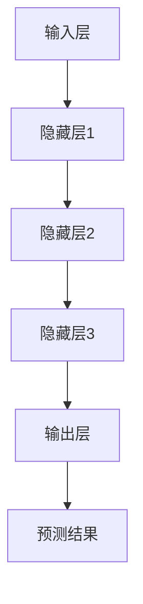
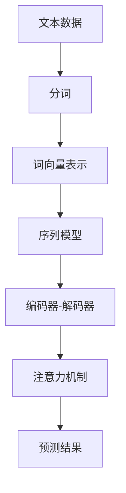
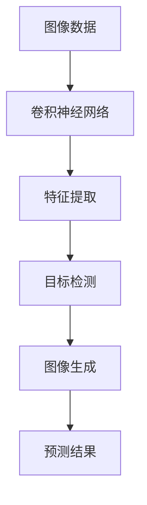
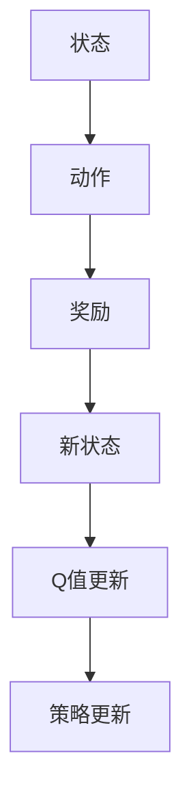
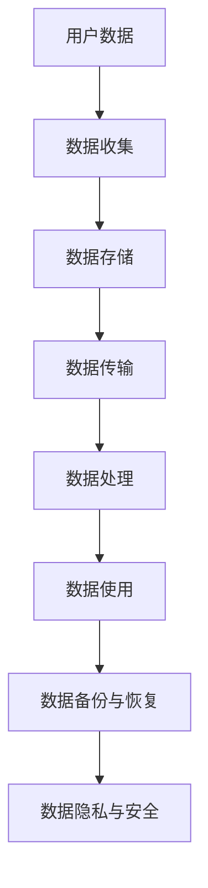
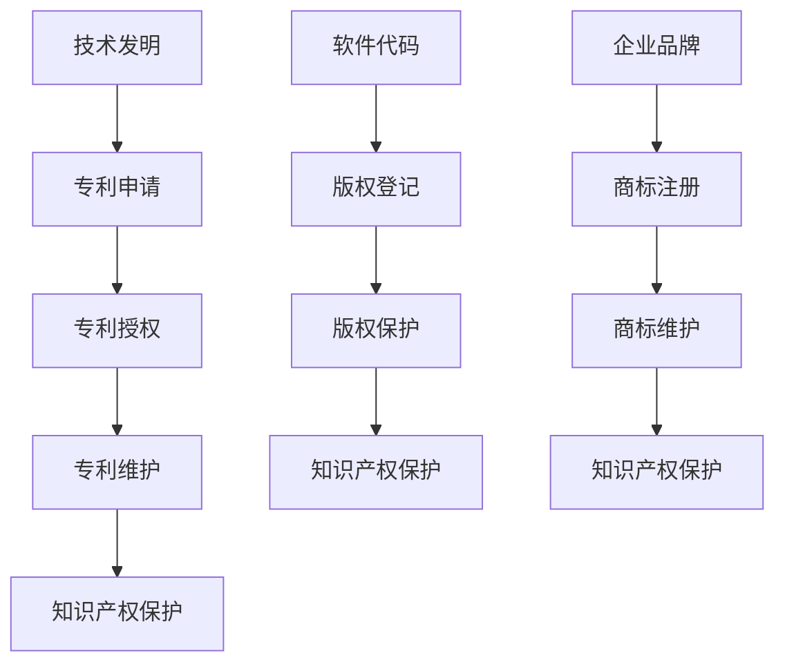
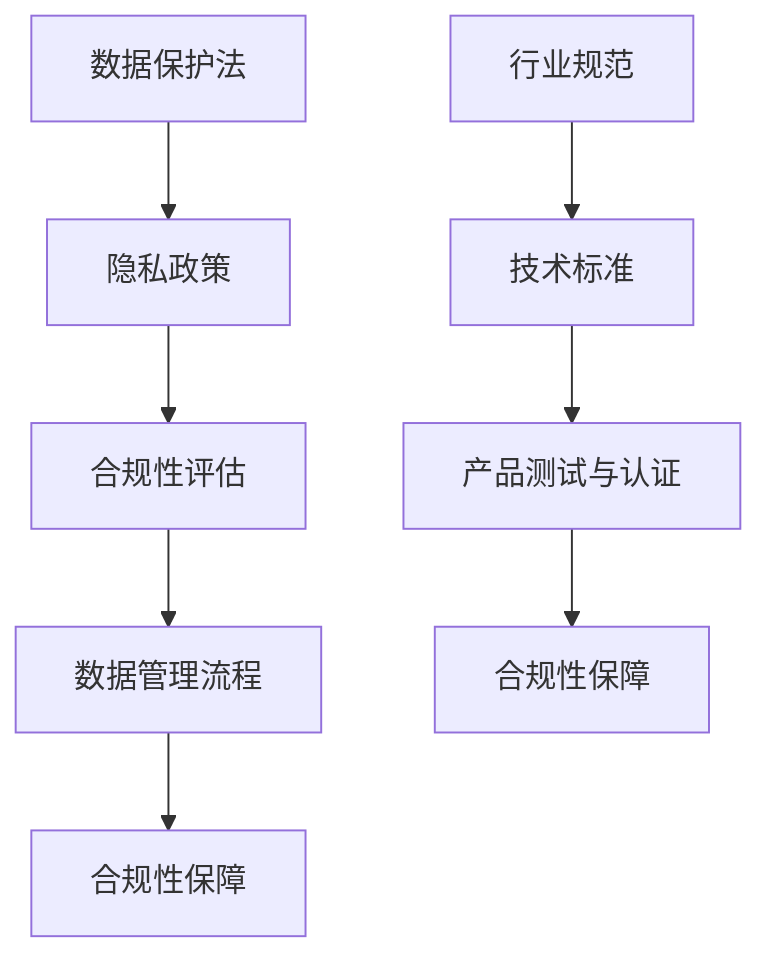

                 

# AI大模型创业：如何应对未来竞争对手？

## 关键词：
AI大模型、创业、竞争对手、技术创新、商业模式、可持续发展

## 摘要：
本文深入探讨了AI大模型创业的现状与挑战，分析了AI大模型在创业中的潜在价值。文章从AI大模型的时代背景、创业优势与挑战、技术基础、应用实践、运营推广、法律风险等多个角度进行了全面剖析。同时，文章提出了一系列应对未来竞争对手的策略，包括技术创新、差异化市场定位、持续发展等，旨在为AI大模型创业者提供实用指导。

---

### 《AI大模型创业：如何应对未来竞争对手？》目录大纲

#### 第一部分：AI大模型与创业概述

1. **AI大模型的时代背景**
    1.1. **AI大模型的定义与特点**
    1.2. **AI大模型的发展历程**
    1.3. **AI大模型在创业中的潜在价值**

2. **AI大模型创业的优势与挑战**
    2.1. **AI大模型创业的优势分析**
    2.2. **AI大模型创业的挑战**
    2.3. **创业者在选择AI大模型应用领域的考量**

3. **AI大模型创业的准备与规划**
    3.1. **创业者能力与团队的构建**
    3.2. **AI大模型创业的战略规划**
    3.3. **初创企业的资源筹集与管理**

#### 第二部分：AI大模型创业实践

4. **AI大模型的技术基础**
    4.1. **深度学习与神经网络**
    4.2. **自然语言处理技术**
    4.3. **计算机视觉与图像处理**
    4.4. **强化学习与决策系统**

5. **AI大模型的应用案例分析**
    5.1. **金融领域的AI大模型应用**
    5.2. **医疗健康领域的AI大模型应用**
    5.3. **制造业与供应链管理领域的AI大模型应用**
    5.4. **零售与电子商务领域的AI大模型应用**

6. **AI大模型创业的运营与推广**
    6.1. **AI大模型产品的市场定位**
    6.2. **用户需求分析与市场调研**
    6.3. **AI大模型产品的运营策略**
    6.4. **营销与推广策略**

7. **AI大模型创业的法律风险与合规**
    7.1. **数据隐私与信息安全**
    7.2. **知识产权保护**
    7.3. **监管合规与法律法规**

#### 第三部分：应对未来竞争对手的策略

8. **AI大模型创业的竞争优势分析**
    8.1. **技术创新与研发投入**
    8.2. **团队实力与人才战略**
    8.3. **商业模式与市场定位**

9. **AI大模型创业的差异化策略**
    9.1. **产品功能与用户体验**
    9.2. **市场细分与差异化营销**
    9.3. **合作与生态系统构建**

10. **AI大模型创业的持续发展**
    10.1. **持续创新与产品迭代**
    10.2. **应对竞争的危机管理**
    10.3. **企业文化建设与人才培养**

#### 附录

- **附录A：AI大模型创业工具与资源指南**

### 文章正文

#### 第一部分：AI大模型与创业概述

##### 1.1 AI大模型的定义与特点

AI大模型是指具有大规模参数量、高计算复杂度和强大泛化能力的机器学习模型。这些模型通常基于深度学习技术，能够在处理复杂数据和任务时展现出出色的性能。

**特点：**

1. **参数规模巨大：**AI大模型通常包含数亿到数十亿个参数，这使得它们能够捕捉到数据中的微小模式和关系。
2. **计算资源需求高：**训练和推理这些模型需要大量的计算资源和时间。
3. **强大的泛化能力：**通过大规模数据训练，AI大模型能够泛化到不同的任务和数据集，适应不同的应用场景。
4. **自适应能力：**AI大模型能够通过不断的学习和调整，适应新的数据和任务。

##### 1.2 AI大模型的发展历程

AI大模型的发展可以追溯到2000年代初期。当时，研究人员开始探索大规模神经网络，例如AlexNet在图像识别领域的突破性表现。此后，随着计算能力的提升和大数据的普及，AI大模型得到了迅速发展。以下是一些关键的发展节点：

1. **2006年：**Hinton提出了深度信念网络（DBN），为深度学习奠定了基础。
2. **2012年：**AlexNet在ImageNet挑战赛中取得了显著的胜利，标志着深度学习时代的到来。
3. **2014年：**Google的深度神经网络实现了超过人类的语音识别准确率。
4. **2016年：**AlphaGo在围棋比赛中击败了世界冠军，展示了深度强化学习的潜力。
5. **2018年至今：**AI大模型在各个领域取得了显著的突破，包括自然语言处理、计算机视觉和医疗诊断等。

##### 1.3 AI大模型在创业中的潜在价值

AI大模型在创业中具有巨大的潜在价值，主要体现在以下几个方面：

1. **提升生产力：**AI大模型能够自动化和优化许多复杂任务，提高生产效率，降低成本。
2. **创造新业务模式：**AI大模型能够帮助企业发现新的商业模式，开拓新的市场机会。
3. **增强用户体验：**AI大模型能够提供个性化服务和推荐，提高用户满意度和忠诚度。
4. **数据驱动的决策：**AI大模型能够帮助企业从海量数据中提取有价值的信息，支持数据驱动的决策。
5. **创新性应用：**AI大模型能够推动新技术的研发和应用，开拓新的应用领域。

#### 第二部分：AI大模型创业的优势与挑战

##### 2.1 AI大模型创业的优势分析

AI大模型创业具有以下优势：

1. **技术创新：**AI大模型是当前科技领域的热点，创业者有机会推动技术创新，占据市场先机。
2. **市场需求大：**随着人工智能的普及，越来越多的企业开始意识到AI大模型的重要性，市场需求巨大。
3. **高盈利潜力：**AI大模型创业项目往往具有较高的盈利潜力，尤其是在细分市场上。
4. **降低成本：**AI大模型能够自动化和优化许多业务流程，降低运营成本。
5. **差异化竞争：**AI大模型具有强大的定制化和个性化能力，能够为企业提供差异化竞争优势。

##### 2.2 AI大模型创业的挑战

AI大模型创业也面临一系列挑战：

1. **技术门槛高：**AI大模型需要深厚的专业知识和技术背景，创业者需要具备相应的技术能力。
2. **数据资源需求大：**训练AI大模型需要大量的高质量数据，数据获取和处理是一个难题。
3. **计算资源需求高：**AI大模型训练和推理需要大量的计算资源，成本较高。
4. **市场竞争激烈：**AI大模型领域竞争激烈，创业者需要不断创新，以保持竞争力。
5. **法律合规风险：**数据隐私、知识产权保护等法律合规问题需要引起重视。

##### 2.3 创业者在选择AI大模型应用领域的考量

创业者在选择AI大模型应用领域时需要考虑以下几个因素：

1. **市场需求：**选择市场需求大、增长潜力高的领域，有利于项目的成功。
2. **技术可行性：**评估所选领域的技术可行性，确保有足够的资源和技术实力进行开发。
3. **竞争状况：**分析竞争对手和市场格局，制定差异化策略，避免与巨头直接竞争。
4. **人才储备：**选择领域时需要考虑团队的人才储备，确保有足够的专业人才支持项目。
5. **政策环境：**考虑政策和法规环境，确保项目的合规性。

#### 第三部分：AI大模型创业的准备与规划

##### 3.1 创业者能力与团队的构建

创业者需要具备以下能力：

1. **技术能力：**了解AI大模型的基本原理和核心技术，能够指导技术研发。
2. **业务理解：**深入理解所选领域，了解客户需求和市场趋势。
3. **管理能力：**具备团队管理、项目管理和资源调配的能力。
4. **沟通能力：**能够与团队成员、合作伙伴和客户进行有效沟通。

构建团队时，创业者需要考虑以下几个方面：

1. **核心团队：**选择在技术、业务和管理方面有丰富经验的核心团队成员。
2. **互补能力：**确保团队在技术、市场、运营等方面具备互补的能力。
3. **激励机制：**设计合理的激励机制，保持团队的凝聚力和积极性。
4. **人才储备：**建立人才储备机制，为项目持续发展提供人才保障。

##### 3.2 AI大模型创业的战略规划

AI大模型创业的战略规划包括以下几个方面：

1. **愿景与使命：**明确企业的愿景和使命，指导企业发展方向。
2. **市场定位：**确定目标市场和客户群体，制定市场进入策略。
3. **产品规划：**规划产品线的布局和发展方向，制定产品开发计划。
4. **技术创新：**制定技术创新战略，确保在技术上保持竞争力。
5. **资源分配：**合理分配资源，确保项目的顺利推进。

##### 3.3 初创企业的资源筹集与管理

初创企业的资源筹集与管理是创业成功的关键。以下是一些重要的方面：

1. **资金筹集：**通过天使投资、风险投资、政府资助等渠道筹集资金。
2. **合作伙伴：**寻找合适的合作伙伴，共同分担风险和资源。
3. **资源整合：**整合内部和外部资源，提高资源利用效率。
4. **成本控制：**制定成本控制策略，确保项目的可持续性。
5. **风险管理：**识别和管理项目风险，确保项目的稳健发展。

#### 第二部分：AI大模型创业实践

##### 4.1 深度学习与神经网络

深度学习是AI大模型的核心技术之一。深度学习基于多层神经网络，通过逐层提取特征，实现对复杂数据的建模和分析。

**核心概念：**

- **神经网络：**神经网络由多个神经元组成，每个神经元都与其他神经元相连，并通过权重传递信息。
- **前向传播：**数据从输入层经过神经网络，逐层传递到输出层，得到预测结果。
- **反向传播：**根据预测结果与真实结果的差异，反向传播误差，更新权重。

**Mermaid 流程图：**



**伪代码：**

```python
# 定义神经网络结构
input_layer = Input(shape=(input_shape,))
hidden_layer1 = Dense(units=hidden_units1, activation='relu')(input_layer)
hidden_layer2 = Dense(units=hidden_units2, activation='relu')(hidden_layer1)
hidden_layer3 = Dense(units=hidden_units3, activation='relu')(hidden_layer2)
output_layer = Dense(units=output_shape, activation='sigmoid')(hidden_layer3)

# 定义模型
model = Model(inputs=input_layer, outputs=output_layer)

# 编译模型
model.compile(optimizer='adam', loss='binary_crossentropy', metrics=['accuracy'])

# 训练模型
model.fit(x_train, y_train, epochs=epochs, batch_size=batch_size)
```

##### 4.2 自然语言处理技术

自然语言处理（NLP）是AI大模型的重要应用领域之一，主要用于文本数据的处理和分析。

**核心概念：**

- **词向量表示：**将文本数据转换为数字向量表示，以便进行深度学习。
- **序列模型：**用于处理序列数据，如文本、语音等。
- **注意力机制：**用于捕捉序列数据中的重要信息。

**Mermaid 流程图：**



**伪代码：**

```python
# 定义编码器-解码器模型
encoder_inputs = Input(shape=(max_sequence_length,))
decoder_inputs = Input(shape=(max_sequence_length,))
encoder = LSTM(units=hidden_units, return_sequences=True)(encoder_inputs)
decoder = LSTM(units=hidden_units, return_sequences=True)(decoder_inputs)
decoder_outputs = Dense(units=output_size, activation='softmax')(decoder)

# 定义模型
model = Model(inputs=[encoder_inputs, decoder_inputs], outputs=decoder_outputs)

# 编译模型
model.compile(optimizer='adam', loss='categorical_crossentropy', metrics=['accuracy'])

# 训练模型
model.fit([x_train, y_train], y_train, epochs=epochs, batch_size=batch_size)
```

##### 4.3 计算机视觉与图像处理

计算机视觉与图像处理是AI大模型的重要应用领域之一，主要用于图像数据的分析和处理。

**核心概念：**

- **卷积神经网络：**用于处理图像数据，通过卷积操作提取图像特征。
- **目标检测：**用于定位图像中的目标物体。
- **图像生成：**用于生成新的图像。

**Mermaid 流程图：**



**伪代码：**

```python
# 定义卷积神经网络模型
input_image = Input(shape=(height, width, channels))
conv1 = Conv2D(filters=32, kernel_size=(3, 3), activation='relu')(input_image)
conv2 = Conv2D(filters=64, kernel_size=(3, 3), activation='relu')(conv1)
pool1 = MaxPooling2D(pool_size=(2, 2))(conv2)

# 定义模型
model = Model(inputs=input_image, outputs=pool1)

# 编译模型
model.compile(optimizer='adam', loss='categorical_crossentropy', metrics=['accuracy'])

# 训练模型
model.fit(x_train, y_train, epochs=epochs, batch_size=batch_size)
```

##### 4.4 强化学习与决策系统

强化学习是AI大模型的重要分支，主要用于决策系统的设计。

**核心概念：**

- **Q学习：**通过学习状态-动作值函数，选择最优动作。
- **策略梯度：**通过学习策略参数，优化决策系统。

**Mermaid 流�程图：**



**伪代码：**

```python
# 定义Q学习模型
state_input = Input(shape=(state_size,))
action_output = Dense(units=action_size, activation='linear')(state_input)
model = Model(inputs=state_input, outputs=action_output)

# 编译模型
model.compile(optimizer='adam', loss='mse')

# Q学习训练过程
for episode in range(num_episodes):
    state = env.reset()
    done = False
    while not done:
        action = model.predict(state)
        next_state, reward, done, _ = env.step(action)
        model.fit(state, reward, epochs=1, batch_size=1)
        state = next_state
```

#### 第五部分：AI大模型创业的运营与推广

##### 5.1 AI大模型产品的市场定位

AI大模型创业项目的成功离不开市场定位的准确把握。市场定位是指根据目标市场的需求特点和竞争对手情况，为企业产品确定一个独特而有吸引力的位置。以下是进行市场定位的步骤：

1. **分析市场需求：**了解目标市场的需求特点，包括市场规模、增长趋势、客户需求等。
2. **评估竞争对手：**分析竞争对手的产品、市场定位、市场份额、竞争优势等。
3. **确定差异化优势：**根据市场需求和竞争对手分析，确定产品的差异化优势，如技术领先、成本优势、用户体验等。
4. **制定市场定位策略：**根据差异化优势，制定市场定位策略，明确产品的目标市场、目标客户、价值主张等。

**市场定位案例分析：**

以某金融领域的AI大模型创业项目为例，其市场定位策略如下：

1. **目标市场：**高端企业和金融机构，提供定制化的金融风控解决方案。
2. **目标客户：**具有较高风险意识和管理需求的CFO和风险控制部门。
3. **差异化优势：**基于深度学习的智能风控模型，能够实时监控和预测风险，提高决策的准确性。
4. **市场定位策略：**通过专业的技术团队和丰富的行业经验，为客户提供高质量的服务和持续的技术支持。

##### 5.2 用户需求分析与市场调研

用户需求分析和市场调研是AI大模型创业项目成功的关键步骤。以下是一个详细的分析和调研流程：

1. **确定调研目标：**明确调研的目的和范围，如用户需求、市场趋势、竞争对手等。
2. **选择调研方法：**根据调研目标，选择合适的调研方法，如问卷调查、深度访谈、焦点小组等。
3. **设计调研工具：**设计问卷、访谈提纲等调研工具，确保能够获取到有价值的信息。
4. **收集数据：**通过线上、线下等多种渠道收集数据，确保数据的多样性和代表性。
5. **分析数据：**对收集到的数据进行整理和分析，提取关键信息，识别用户需求和市场趋势。
6. **撰写调研报告：**根据分析结果，撰写详细的调研报告，为产品开发和市场策略提供依据。

**市场调研案例分析：**

以某医疗健康领域的AI大模型创业项目为例，其用户需求分析和市场调研流程如下：

1. **调研目标：**了解医疗健康领域的AI大模型应用需求，识别关键问题和市场机会。
2. **调研方法：**通过问卷调查、深度访谈和在线调查相结合的方式，收集医生、患者和管理人员的意见和建议。
3. **调研工具：**设计问卷、访谈提纲和在线调查表，涵盖AI大模型在医疗诊断、治疗建议、健康管理等方面的应用需求。
4. **收集数据：**通过线上线下渠道收集问卷和访谈数据，确保数据的全面性和代表性。
5. **分析数据：**整理和分析数据，识别关键需求和应用场景，如基于深度学习的疾病诊断模型、个性化治疗方案等。
6. **撰写调研报告：**撰写详细的调研报告，为项目开发和市场推广提供依据。

##### 5.3 AI大模型产品的运营策略

AI大模型产品的运营策略是确保项目成功的重要环节。以下是一些关键策略：

1. **产品生命周期管理：**根据产品生命周期，制定相应的运营策略，如初期推广、快速增长、成熟期维护等。
2. **用户增长策略：**通过营销推广、合作伙伴关系、用户口碑等手段，实现用户快速增长。
3. **用户体验优化：**持续收集用户反馈，优化产品功能和用户体验，提高用户满意度。
4. **数据驱动的决策：**利用数据分析，优化运营策略，提升运营效率。
5. **持续创新：**保持技术创新，不断推出新功能和新产品，满足用户需求。

**运营策略案例分析：**

以某零售与电子商务领域的AI大模型创业项目为例，其运营策略如下：

1. **产品生命周期管理：**根据产品的不同阶段，制定相应的运营策略。初期以产品功能完善和用户基础建设为主，快速增长期以用户增长和品牌推广为主，成熟期以用户维护和产品优化为主。
2. **用户增长策略：**通过线上线下营销活动、合作伙伴关系和用户推荐等手段，实现用户快速增长。初期通过免费试用、限时优惠等活动吸引用户；快速增长期通过合作伙伴渠道和用户口碑传播，扩大用户基础。
3. **用户体验优化：**持续收集用户反馈，优化产品功能和用户体验。定期推出新功能，提升用户满意度。同时，建立用户反馈机制，及时解决用户问题和需求。
4. **数据驱动的决策：**利用数据分析，优化运营策略。通过用户行为分析、销售数据分析等，识别用户需求和市场趋势，制定有针对性的运营策略。
5. **持续创新：**保持技术创新，不断推出新功能和新产品，满足用户需求。通过技术研发和产品迭代，提升产品竞争力。

##### 5.4 营销与推广策略

营销与推广策略是AI大模型创业项目成功的关键。以下是一些有效的营销与推广策略：

1. **内容营销：**通过博客、白皮书、案例研究等形式，传播产品知识和价值，吸引潜在用户。
2. **社交媒体营销：**利用社交媒体平台，如微博、微信、LinkedIn等，扩大品牌影响力，与用户互动。
3. **线上广告：**通过搜索引擎优化（SEO）、社交媒体广告、展示广告等方式，吸引潜在用户。
4. **合作伙伴营销：**与行业合作伙伴建立合作关系，共同推广产品，扩大市场份额。
5. **线下活动：**举办行业会议、研讨会、产品发布会等活动，提高品牌知名度。

**营销与推广策略案例分析：**

以某制造业与供应链管理领域的AI大模型创业项目为例，其营销与推广策略如下：

1. **内容营销：**通过官方网站、博客、行业报告等形式，介绍AI大模型在制造业与供应链管理领域的应用，分享成功案例和最佳实践。定期发布行业洞察和趋势分析，提高品牌的专业形象。
2. **社交媒体营销：**在LinkedIn、微信等平台建立企业账号，发布产品动态、行业新闻和用户反馈，与行业人士和潜在客户互动。通过社交媒体广告，精准定位目标用户，提高品牌知名度。
3. **线上广告：**利用百度推广、谷歌广告等线上广告渠道，投放关键词广告和展示广告，吸引潜在客户访问官方网站。同时，通过搜索引擎优化（SEO）提高网站在搜索引擎中的排名，增加自然流量。
4. **合作伙伴营销：**与ERP系统提供商、供应链咨询公司等建立合作关系，共同推广AI大模型产品。通过合作伙伴渠道，扩大产品销售网络，提高市场份额。
5. **线下活动：**参加行业展会、研讨会和论坛等活动，展示AI大模型产品，与行业专家和潜在客户面对面交流。通过线下活动，提高品牌知名度和客户信任度。

#### 第七部分：AI大模型创业的法律风险与合规

##### 7.1 数据隐私与信息安全

数据隐私与信息安全是AI大模型创业企业必须重视的问题。以下是关于数据隐私与信息安全的几个关键点：

**核心概念与联系：**

- **数据隐私：**指个人信息在收集、存储、处理、传输和使用过程中的隐私保护。
- **信息安全：**指保护信息系统的硬件、软件、数据不受未经授权的访问、使用、披露、破坏、修改和攻击。

**架构图：**



**伪代码：**

```python
# 数据收集与隐私保护
def collect_data(user_input):
    # 对用户输入进行加密处理
    encrypted_data = encrypt(user_input)
    # 存储加密后的数据
    store_encrypted_data(encrypted_data)
    # 返回加密后的数据
    return encrypted_data

# 数据传输与隐私保护
def transmit_data(encrypted_data, destination):
    # 对数据传输进行加密处理
    encrypted_transmission = encrypt(encrypted_data, destination)
    # 传输加密后的数据
    send_encrypted_transmission(encrypted_transmission)
    # 接收并解密数据
    received_data = decrypt(encrypted_transmission)
    return received_data

# 数据处理与隐私保护
def process_data(encrypted_data):
    # 对数据进行加密处理
    encrypted_result = encrypt(encrypted_data)
    # 处理加密后的数据
    result = process_encrypted_data(encrypted_result)
    # 返回处理后的加密数据
    return encrypted_result
```

##### 7.2 知识产权保护

知识产权保护对于AI大模型创业企业至关重要。以下是一些关键点：

**核心概念与联系：**

- **专利：**保护发明和创新的技术解决方案。
- **版权：**保护原创的文学、艺术和软件作品。
- **商标：**保护企业的品牌和标识。

**架构图：**



**伪代码：**

```python
# 专利申请与保护
def apply_for_patent(invention):
    # 对发明进行描述和分类
    patent_description = describe_invention(invention)
    # 提交专利申请
    submit_patent_application(patent_description)
    # 维护专利状态
    maintain_patent_status()

# 软件版权保护
def register_copyright(source_code):
    # 提交版权登记申请
    submit_copyright_application(source_code)
    # 维护版权状态
    maintain_copyright_status()

# 商标注册与保护
def registerTrademark(brand_name):
    # 提交商标注册申请
    submit_trademark_application(brand_name)
    # 维护商标状态
    maintain_trademark_status()
```

##### 7.3 监管合规与法律法规

AI大模型创业企业需要遵守相关的监管合规和法律法规。以下是一些关键点：

**核心概念与联系：**

- **数据保护法：**如《通用数据保护条例》（GDPR）。
- **隐私政策：**明确告知用户数据处理的方式和目的。
- **行业规范：**遵守特定行业的标准和规范。

**架构图：**



**伪代码：**

```python
# 遵守数据保护法与隐私政策
def handle_personal_data(user_data):
    # 执行隐私政策中的规定
    comply_with_privacy_policy(user_data)
    # 进行合规性评估
    assess_compliance(user_data)
    # 确保数据管理流程符合法规要求
    ensure_compliance_with_data_management()

# 遵守行业规范与标准
def comply_with_industry_standards(product):
    # 确保产品符合技术标准
    ensure_product_compliance_with_technical_standards()
    # 进行产品测试与认证
    perform_product_testing_and_certification()
    # 确保合规性保障
    ensure_compliance_protections()
```

#### 第八部分：应对未来竞争对手的策略

##### 8.1 AI大模型创业的竞争优势分析

AI大模型创业企业要在竞争激烈的市场中脱颖而出，需要具备以下竞争优势：

1. **技术创新：**持续投入研发，保持技术领先地位，开发具有创新性的产品和服务。
2. **团队实力：**组建高素质、多元化的团队，确保项目的技术实力和管理能力。
3. **商业模式：**构建可持续的商业模式，实现盈利和可持续增长。
4. **市场定位：**准确把握市场需求，确定独特而有力的市场定位。
5. **用户体验：**提供优质的用户体验，赢得用户的信任和忠诚。

**竞争优势案例分析：**

以某零售与电子商务领域的AI大模型创业项目为例，其竞争优势分析如下：

1. **技术创新：**项目团队在深度学习和自然语言处理领域有深厚的研发经验，成功开发了一套具有高度智能化和自适应能力的购物推荐系统。
2. **团队实力：**团队由多名博士和硕士组成，涵盖算法、数据科学、产品管理等专业领域，确保项目在技术和管理上都有强大的支持。
3. **商业模式：**通过提供个性化购物推荐和智能客服，帮助企业提高销售额和客户满意度，实现了以技术驱动商业的可持续商业模式。
4. **市场定位：**项目定位于中高端零售企业，提供定制化的AI大模型解决方案，满足企业对于高效、精准营销的需求。
5. **用户体验：**通过智能算法和用户界面优化，提供个性化、流畅的购物体验，增强了用户的满意度和忠诚度。

##### 8.2 AI大模型创业的差异化策略

差异化策略是AI大模型创业企业赢得市场竞争的关键。以下是一些关键的差异化策略：

1. **产品功能：**开发具有独特功能和优势的产品，满足用户特定的需求。
2. **用户体验：**提供优质的用户体验，增强用户满意度和忠诚度。
3. **市场细分：**通过市场细分，找到未被满足的用户需求，针对特定细分市场推出定制化产品。
4. **营销与推广：**采取差异化营销策略，提高品牌知名度和市场影响力。

**差异化策略案例分析：**

以某金融领域的AI大模型创业项目为例，其差异化策略如下：

1. **产品功能：**项目团队开发了一款基于深度学习的智能风控系统，能够实时监控和预测金融风险，提供精准的决策支持。与其他传统风控系统相比，该系统具有更高的准确性和实时性。
2. **用户体验：**通过简洁易用的用户界面和高效的算法，提供快速、准确的金融服务，提高了用户的工作效率和满意度。
3. **市场细分：**项目团队专注于为中大型金融机构提供定制化的风控解决方案，满足其复杂的风险管理需求。通过深入理解客户需求，提供个性化的产品和服务。
4. **营销与推广：**通过参加行业会议、发布白皮书和举办技术研讨会等方式，提高品牌知名度和行业影响力。同时，与行业合作伙伴建立合作关系，共同推广产品和服务。

##### 8.3 合作与生态系统构建

合作与生态系统构建是AI大模型创业企业实现持续发展的重要策略。以下是一些关键点：

1. **合作伙伴关系：**建立与行业合作伙伴的关系，共享资源、技术和管理经验，共同推动项目发展。
2. **生态系统构建：**构建生态系统，包括开发者社区、用户社区和合作伙伴网络，促进项目的发展和创新。
3. **开放平台：**提供开放平台，鼓励第三方开发者参与到项目生态系统中，共同创造价值。

**合作与生态系统构建案例分析：**

以某医疗健康领域的AI大模型创业项目为例，其合作与生态系统构建策略如下：

1. **合作伙伴关系：**项目与多家医疗机构、研究机构和医疗器械企业建立合作关系，共同推进AI大模型在医疗健康领域的应用。通过合作，共享数据资源、技术支持和市场渠道。
2. **生态系统构建：**构建了由医疗机构、研究人员、开发者和用户组成的生态系统。开发者社区提供技术支持和工具，医疗机构提供临床数据和场景，研究人员提供专业知识和研究成果，用户参与产品测试和反馈。
3. **开放平台：**项目搭建了开放平台，提供API接口和开发工具，鼓励第三方开发者基于平台开发新的应用和服务。通过开放平台，促进了项目的创新和扩展，提升了生态系统的活力。

#### 附录A：AI大模型创业工具与资源指南

##### A.1 AI大模型开发工具与框架

AI大模型开发需要依赖一系列工具和框架，以下是一些常用的工具和框架：

1. **TensorFlow：**由Google开发的开源深度学习框架，适用于各种深度学习任务。
2. **PyTorch：**由Facebook开发的开源深度学习框架，具有灵活的动态计算图。
3. **Keras：**基于TensorFlow和Theano的开源深度学习库，提供简单直观的API。
4. **MXNet：**由Apache软件基金会开发的开源深度学习框架，适用于多种编程语言。
5. **JAX：**由Google开发的开源深度学习框架，支持自动微分和数值计算。

##### A.2 AI大模型应用领域资源链接

以下是一些AI大模型在不同应用领域的资源链接：

1. **金融领域资源链接：**
   - Coursera上的《深度学习与神经网络》课程
   - 《金融科技应用与案例分析》报告

2. **医疗健康领域资源链接：**
   - Kaggle上的医疗健康数据集
   - 《人工智能在医疗健康领域的应用》论文集

3. **制造业与供应链管理领域资源链接：**
   - 《工业互联网与人工智能》白皮书
   - 《供应链管理与创新》报告

4. **零售与电子商务领域资源链接：**
   - 《电子商务与人工智能》研究报告
   - 《零售行业数字化转型》案例分析

##### A.3 AI大模型创业社区与社群

以下是AI大模型创业相关的社区与社群：

1. **AI创业者社群：**一个聚集AI领域创业者的在线社群，提供交流与合作机会。
2. **开源AI项目社区：**聚集全球AI开发者的社区，分享开源项目和技术进展。
3. **学术与科研资源平台链接：**
   - arXiv.org：预印本论文平台，涵盖AI领域的最新研究成果。
   - NeuralInfoComm.org：神经信息处理系统年会，是全球顶级的人工智能学术会议。

### 作者信息

**作者：**AI天才研究院/AI Genius Institute & 禅与计算机程序设计艺术 /Zen And The Art of Computer Programming

**联系信息：**[AI天才研究院官方网站](http://www.ai-geniustraining.com) & [禅与计算机程序设计艺术官方网站](http://www.zencodingart.com)

---

**结束语：**

本文从多个角度深入探讨了AI大模型创业的现状与挑战，分析了AI大模型在创业中的潜在价值，并提出了应对未来竞争对手的策略。希望本文能为AI大模型创业者提供有益的参考和启示，助力他们在激烈的市场竞争中脱颖而出。未来，AI大模型创业将继续面临诸多挑战，但只要我们不断创新、持续学习，就能在AI领域创造更多价值。让我们共同期待AI大模型创业的辉煌未来！

