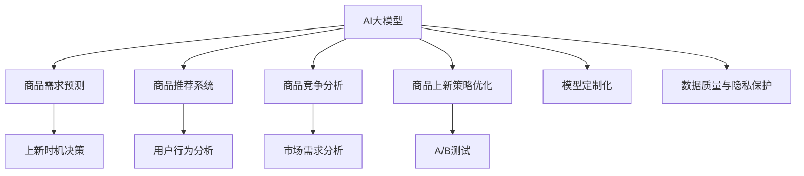

                 

### 《AI大模型在电商平台商品上新策略中的应用》

#### 关键词：
- AI大模型
- 电商平台
- 商品上新策略
- 需求预测
- 推荐系统
- 竞争分析

#### 摘要：
本文深入探讨了AI大模型在电商平台商品上新策略中的应用。首先，我们概述了AI大模型的基本概念和核心技术，然后详细分析了电商平台商品上新策略的流程和重要性。接下来，我们逐步介绍了商品需求预测、商品推荐系统和商品竞争分析的应用，并通过项目实战展示了AI大模型在实际中的应用效果。最后，我们对AI大模型在商品上新策略中的未来展望进行了探讨，提出了潜在的挑战和发展方向。

---

### 《AI大模型在电商平台商品上新策略中的应用》目录大纲

#### 第一部分：AI大模型概述与应用基础

##### 第1章：AI大模型概述与应用前景
- **1.1 AI大模型的基本概念**
  - AI大模型的基本概念
  - AI大模型的发展历程
- **1.2 AI大模型的核心技术**
  - 神经网络基础
  - 预训练模型
  - 迁移学习与微调
- **1.3 AI大模型在电商行业的应用**
  - 电商行业对AI大模型的需求
  - AI大模型在电商行业的应用案例
- **1.4 AI大模型应用中的挑战与应对策略**
  - 数据质量与隐私保护
  - 模型可解释性与伦理问题

##### 第2章：电商平台商品上新策略概述
- **2.1 电商平台商品上新的重要性**
  - 商品上新对电商平台的影响
  - 商品上新策略的类型
- **2.2 电商平台商品上新流程**
  - 商品选品策略
  - 商品上架策略
  - 商品推广策略

#### 第二部分：AI大模型在商品上新策略中的应用

##### 第3章：商品需求预测与上新时机
- **3.1 商品需求预测原理**
  - 时间序列分析
  - 相关性分析
  - 神经网络预测模型
- **3.2 基于AI大模型的需求预测实战**
  - 数据集准备
  - 模型训练与验证
  - 预测结果分析与优化
- **3.3 上新时机决策**
  - 库存分析与预测
  - 竞争分析
  - 营销活动规划

##### 第4章：商品推荐系统与上新策略
- **4.1 商品推荐系统原理**
  - 协同过滤
  - 基于内容的推荐
  - 深度学习推荐模型
- **4.2 AI大模型在商品推荐中的应用**
  - 用户行为分析
  - 商品属性提取
  - 推荐结果优化
- **4.3 基于AI大模型的商品推荐实战**
  - 数据集准备
  - 模型训练与验证
  - 推荐系统评估与优化

##### 第5章：基于AI大模型的商品竞争分析
- **5.1 商品竞争分析原理**
  - 市场需求分析
  - 竞争对手分析
  - 用户行为分析
- **5.2 基于AI大模型的竞争分析实战**
  - 数据集准备
  - 模型训练与验证
  - 竞争分析结果与应用

##### 第6章：商品上新策略优化与实验分析
- **6.1 商品上新策略优化原理**
  - A/B测试
  - 多因素优化
  - 模型迭代与优化
- **6.2 基于AI大模型的商品上新策略优化实战**
  - 数据集准备
  - 模型训练与验证
  - 策略优化结果分析

##### 第7章：AI大模型在电商平台商品上新策略中的未来展望
- **7.1 AI大模型在商品上新策略中的发展趋势**
  - 新技术引入
  - 模型定制化
  - 伦理与隐私保护
- **7.2 AI大模型在电商平台商品上新策略中的未来挑战与机遇**
  - 数据多样性与质量
  - 模型可解释性与透明度
  - 市场竞争与生态构建

#### 附录

- **附录A：AI大模型开发工具与资源**
  - 主流深度学习框架
  - 数据预处理工具
  - 实用算法库
  - 相关文献与资料推荐

---

#### 核心概念与联系 Mermaid 流程图：

---

### 第一部分：AI大模型概述与应用基础

#### 第1章：AI大模型概述与应用前景

##### 1.1 AI大模型的基本概念

AI大模型（Large-scale Artificial Intelligence Models）是指具有大规模参数和强大计算能力的深度学习模型。这些模型通常基于神经网络架构，通过学习大量数据来提取特征，进行预测、分类和生成任务。

**AI大模型的发展历程：**

1. **1980s-1990s：** 神经网络早期发展，如感知机、BP算法等。
2. **2006年：** 神经网络重新兴起，Hinton提出了深度信念网络（DBN）。
3. **2012年：** AlexNet在ImageNet竞赛中取得突破性成绩，深度卷积神经网络（CNN）得到广泛应用。
4. **2014年：** Google的神经网络机器翻译系统（GNMT）实现了显著的翻译质量提升。
5. **2018年：** GPT-2的出现标志着语言模型进入大模型时代。

**AI大模型的特点：**

1. **参数量巨大：** 通常包含数亿甚至千亿级别的参数。
2. **计算需求高：** 需要高性能计算资源和大规模数据处理能力。
3. **自适应性强：** 能够自动学习数据中的复杂特征和模式。
4. **泛化能力强：** 能够处理各种不同领域和任务。

##### 1.2 AI大模型的核心技术

**神经网络基础：**

神经网络（Neural Networks）是一种模仿生物神经系统的计算模型。它通过输入层、隐藏层和输出层之间的信息传递，进行数据的处理和预测。

- **感知机（Perceptron）：** 最简单的神经网络模型，用于二元分类。
- **反向传播算法（Backpropagation）：** 用于训练神经网络的梯度下降算法。
- **多层感知机（MLP）：** 具有多层隐藏层的神经网络，用于复杂函数的映射。

**预训练模型：**

预训练模型（Pre-trained Models）是指在大规模数据集上预先训练好的神经网络模型。这些模型通过在特定领域（如图像识别、自然语言处理等）中进行预训练，具有较好的通用性和泛化能力。

- **词向量（Word Embedding）：** 将单词映射到高维空间，用于自然语言处理任务。
- **图像分类（ImageNet）：** 用于图像分类的预训练模型，如ResNet、Inception等。

**迁移学习与微调：**

迁移学习（Transfer Learning）是指将一个预训练模型应用于新的任务，通过在新的数据集上进行微调（Fine-tuning）来提高模型的性能。

- **微调：** 在预训练模型的基础上，对特定任务进行重新训练，调整模型参数。
- **零样本学习（Zero-shot Learning）：** 无需对模型进行微调，直接处理未见过的类别。

##### 1.3 AI大模型在电商行业的应用

**电商行业对AI大模型的需求：**

- **个性化推荐：** 基于用户行为和商品属性，提供个性化的商品推荐。
- **需求预测：** 预测商品的未来需求，优化库存管理和营销策略。
- **商品竞争分析：** 分析市场竞争态势，优化商品上新策略。
- **智能客服：** 提供基于自然语言处理的智能客服系统。

**AI大模型在电商行业的应用案例：**

- **阿里巴巴：** 利用深度学习技术进行商品推荐和需求预测，提高了平台的销售额和用户满意度。
- **京东：** 通过AI大模型优化库存管理，减少了库存积压，提高了运营效率。
- **亚马逊：** 利用GPT-3等语言模型提供智能客服，提高了客户服务质量。

##### 1.4 AI大模型应用中的挑战与应对策略

**数据质量与隐私保护：**

- **数据质量：** AI大模型对数据质量要求较高，需要确保数据的一致性、完整性和准确性。通过数据清洗、去重和标准化等手段提高数据质量。
- **隐私保护：** 隐私保护是AI大模型应用中的重要问题。采用数据加密、数据脱敏等技术，确保用户隐私不被泄露。

**模型可解释性与伦理问题：**

- **模型可解释性：** AI大模型通常被称为“黑箱”，其决策过程难以解释。提高模型的可解释性，有助于用户信任和理解模型的决策过程。
- **伦理问题：** AI大模型在应用中可能涉及伦理问题，如歧视、偏见等。通过数据预处理、模型设计和算法优化等手段，减少模型偏见，确保公平和公正。

综上所述，AI大模型在电商行业的应用具有广泛的前景和潜力。通过合理运用AI大模型，电商平台可以优化商品上新策略，提高运营效率，提升用户体验和满意度。同时，需要关注数据质量和隐私保护、模型可解释性和伦理问题，确保AI大模型的应用安全、合规和可持续。

---

### 第二部分：电商平台商品上新策略概述

#### 第2章：电商平台商品上新策略概述

##### 2.1 电商平台商品上新的重要性

在电商平台上，商品上新策略对于平台的发展和用户的体验具有至关重要的意义。商品上新策略不仅关系到商品的曝光率和销售量，还直接影响着平台的品牌形象和用户忠诚度。以下是商品上新策略的重要性：

1. **提升商品曝光率：** 商品上新是吸引用户注意的重要手段，通过定期上新，可以增加商品在平台上的曝光率，提高用户的点击和浏览量。

2. **满足用户需求：** 电商平台上的用户具有多样化的需求，通过上新策略，平台可以及时响应市场需求，提供符合用户期望的商品，从而提升用户满意度。

3. **优化库存管理：** 商品上新策略有助于电商平台优化库存管理，避免库存积压和资金占用。通过预测商品需求，合理安排商品上新时间，可以有效控制库存水平。

4. **增强品牌形象：** 定期的商品上新可以展示平台活力和创新能力，增强品牌形象，提高用户对平台的信任度和忠诚度。

5. **提升销售额：** 商品上新策略可以刺激用户购买欲望，提高销售量。通过上新促销、限时折扣等活动，可以进一步提升销售额。

##### 2.2 电商平台商品上新策略的类型

电商平台商品上新策略可以分为以下几种类型：

1. **定期上新：** 定期上新是指按照固定的周期（如每周、每月）进行商品上新。这种策略可以建立用户的期待和习惯，提高用户的活跃度和参与度。

2. **节日上新：** 节日上新是指在重要节日（如春节、双十一、黑色星期五等）进行商品上新。这种策略可以利用节日的营销热点，吸引大量用户关注和购买。

3. **需求驱动上新：** 需求驱动上新是指根据用户反馈和市场数据，动态调整商品上新计划。这种策略可以更加灵活地应对市场变化，满足用户需求。

4. **主题上新：** 主题上新是指围绕特定主题（如环保、健康、运动等）进行商品上新。这种策略可以提升商品的差异化竞争力，吸引用户的特定兴趣。

5. **限时上新：** 限时上新是指在特定时间段（如一天、一周）内进行商品上新，并通过限时折扣、限时优惠等活动刺激用户购买。这种策略可以创造紧迫感，提高购买转化率。

##### 2.3 电商平台商品上新流程

电商平台商品上新流程通常包括以下几个步骤：

1. **商品选品：** 商品种类繁多，选品是商品上新策略的核心环节。选品策略需要考虑市场需求、用户偏好、供应链能力等因素，选择具有市场竞争力和盈利潜力的商品。

2. **商品策划：** 商品策划包括确定商品的主题、卖点、推广方式等。通过策划，可以提升商品的吸引力，增强用户购买欲望。

3. **商品制作：** 根据选品和策划的要求，进行商品的制作。商品制作需要考虑质量、成本、交期等因素。

4. **商品上架：** 将制作完成的商品上架到电商平台。上架过程中需要完成商品信息的录入、图片拍摄、描述撰写等任务。

5. **推广营销：** 通过各种营销手段（如广告投放、促销活动、社交媒体推广等）吸引目标用户，提高商品的曝光率和销量。

6. **用户反馈与优化：** 收集用户反馈，对商品上新策略进行评估和优化。根据用户反馈，调整选品、策划和推广策略，以提升用户体验和满意度。

通过以上步骤，电商平台可以实现有效的商品上新策略，提升商品销售和用户满意度，从而促进平台的发展。

---

### 第二部分：AI大模型在商品上新策略中的应用

#### 第3章：商品需求预测与上新时机

##### 3.1 商品需求预测原理

商品需求预测是电商平台商品上新策略的重要组成部分。通过准确预测商品的需求，电商平台可以合理安排库存、制定营销策略，从而提高销售额和用户满意度。商品需求预测的基本原理包括时间序列分析、相关性分析和神经网络预测模型。

**时间序列分析：**

时间序列分析是一种统计学方法，用于分析时间序列数据，以预测未来的趋势。时间序列数据通常包含随时间变化的连续观察值，这些观察值可以是商品销量、价格、温度等。时间序列分析的关键是识别数据中的周期性、趋势性和季节性模式，并利用这些模式进行预测。

- **移动平均法：** 通过计算一段时间内的平均值，平滑时间序列数据，消除短期波动，提取长期趋势。
- **指数平滑法：** 对时间序列数据进行加权平均，对近期数据进行更高权重，以反映最新趋势。
- **ARIMA模型（自回归积分滑动平均模型）：** 通过自回归、差分和移动平均的组合，对时间序列数据进行建模和预测。

**相关性分析：**

相关性分析用于分析两个变量之间的相关性，以确定它们之间的相互关系。在商品需求预测中，相关性分析可以帮助识别影响商品需求的因素，如季节因素、价格变动、促销活动等。

- **皮尔逊相关系数：** 用于衡量两个连续变量之间的线性相关性，取值范围在-1到1之间，接近1表示高度正相关，接近-1表示高度负相关，接近0表示无相关性。
- **斯皮尔曼等级相关系数：** 用于衡量两个变量的等级相关性，适用于非参数数据。

**神经网络预测模型：**

神经网络预测模型是一种基于深度学习的预测算法，通过学习输入与输出之间的映射关系，实现对未来趋势的预测。神经网络模型具有强大的非线性处理能力，可以捕捉数据中的复杂模式。

- **多层感知机（MLP）：** 具有多层隐藏层的神经网络，用于复杂函数的映射和预测。
- **循环神经网络（RNN）：** 通过循环结构，处理序列数据，适用于时间序列预测。
- **长短期记忆网络（LSTM）：** 一种特殊的RNN，通过门控机制，缓解了长短期依赖问题，适用于时间序列预测。

##### 3.2 基于AI大模型的需求预测实战

**数据集准备：**

在进行商品需求预测之前，需要准备合适的数据集。数据集通常包括历史销售数据、用户行为数据、商品信息数据等。

- **历史销售数据：** 包括商品销量、销售时间等，用于构建时间序列数据。
- **用户行为数据：** 包括用户浏览、点击、购买等行为，用于分析用户需求。
- **商品信息数据：** 包括商品名称、类别、价格、库存等，用于构建商品特征。

**模型训练与验证：**

在准备数据集后，可以使用时间序列分析、相关性分析和神经网络预测模型进行模型训练和验证。

- **时间序列分析模型：** 使用移动平均法、指数平滑法、ARIMA模型等对历史销售数据进行建模和预测。
- **相关性分析模型：** 使用皮尔逊相关系数、斯皮尔曼等级相关系数等分析用户行为和商品特征与销售量之间的相关性。
- **神经网络预测模型：** 使用多层感知机（MLP）、循环神经网络（RNN）、长短期记忆网络（LSTM）等对历史销售数据、用户行为数据和商品信息数据进行建模和预测。

**预测结果分析与优化：**

在模型训练完成后，需要对预测结果进行评估和优化。

- **评估指标：** 使用均方误差（MSE）、均方根误差（RMSE）、平均绝对误差（MAE）等指标评估预测模型的性能。
- **优化方法：** 通过调整模型参数、增加隐藏层节点数、使用更先进的神经网络模型等方式，优化预测模型的性能。

**上新时机决策：**

基于商品需求预测结果，可以进行上新时机的决策。

- **库存分析与预测：** 根据库存水平和预测需求，确定商品的上新时间，以避免库存积压或断货情况。
- **竞争分析：** 分析竞争对手的上新计划，结合市场趋势和用户需求，制定具有竞争力的上新策略。
- **营销活动规划：** 结合上新计划，制定营销活动，提高商品的曝光率和销售量。

通过以上步骤，电商平台可以基于AI大模型实现商品需求预测，优化商品上新策略，提高运营效率，提升用户满意度。

---

### 第二部分：AI大模型在商品上新策略中的应用

#### 第4章：商品推荐系统与上新策略

##### 4.1 商品推荐系统原理

商品推荐系统是电商平台提高用户满意度和销售额的重要工具。它通过分析用户行为和商品属性，为用户推荐可能感兴趣的商品。商品推荐系统的原理主要包括协同过滤、基于内容的推荐和深度学习推荐模型。

**协同过滤：**

协同过滤（Collaborative Filtering）是一种基于用户行为和商品交互数据的推荐方法。它通过分析用户之间的相似度，为用户推荐相似用户喜欢的商品。

- **用户基于的协同过滤（User-based Collaborative Filtering）：** 通过计算用户之间的相似度，推荐与目标用户相似的其他用户喜欢的商品。
- **物品基于的协同过滤（Item-based Collaborative Filtering）：** 通过计算商品之间的相似度，推荐与目标商品相似的其他商品。

**基于内容的推荐：**

基于内容的推荐（Content-Based Filtering）是一种基于商品内容和用户兴趣的推荐方法。它通过分析商品的特征和用户的偏好，为用户推荐具有相似属性的商品。

- **特征提取：** 从商品描述、标签、类别等特征中提取关键词和特征向量。
- **相似度计算：** 计算商品和用户之间的相似度，如使用余弦相似度、欧氏距离等。
- **推荐生成：** 根据相似度计算结果，为用户推荐具有相似属性的商品。

**深度学习推荐模型：**

深度学习推荐模型是一种基于深度学习的推荐方法，通过学习用户行为和商品特征之间的复杂关系，实现高精度的推荐。

- **自动特征提取：** 深度学习模型可以自动从原始数据中提取特征，减少人工特征工程的工作量。
- **多任务学习：** 深度学习模型可以同时处理多个任务（如商品推荐、用户分类等），提高模型的泛化能力。
- **推荐生成：** 深度学习模型通过学习用户行为和商品特征的关系，为用户生成个性化的推荐。

##### 4.2 AI大模型在商品推荐中的应用

**用户行为分析：**

用户行为分析是商品推荐系统的基础，通过分析用户的浏览、点击、购买等行为，可以挖掘用户的兴趣和需求。

- **行为数据收集：** 收集用户在平台上的各种行为数据，如浏览记录、点击记录、购买记录等。
- **行为特征提取：** 从行为数据中提取特征，如行为频次、行为时长、行为序列等。
- **用户行为建模：** 使用机器学习算法，如决策树、随机森林、支持向量机等，对用户行为进行建模。

**商品属性提取：**

商品属性提取是商品推荐系统的关键步骤，通过分析商品的特征和属性，可以为用户推荐具有相似属性的商品。

- **商品信息收集：** 收集商品的各种信息，如商品名称、描述、标签、类别等。
- **属性特征提取：** 从商品信息中提取属性特征，如文本特征、类别特征、数值特征等。
- **商品属性建模：** 使用自然语言处理、词嵌入等技术，对商品属性进行建模。

**推荐结果优化：**

推荐结果优化是商品推荐系统的重要环节，通过优化推荐算法和模型，可以提高推荐效果和用户满意度。

- **算法优化：** 调整推荐算法的参数，如相似度计算方法、推荐策略等，提高推荐精度。
- **模型优化：** 使用深度学习模型，如卷积神经网络、循环神经网络、长短期记忆网络等，提高模型的泛化能力和推荐效果。
- **用户反馈机制：** 收集用户对推荐结果的反馈，如点击、购买、评分等，用于调整推荐策略。

##### 4.3 基于AI大模型的商品推荐实战

**数据集准备：**

在进行商品推荐之前，需要准备合适的数据集。数据集通常包括用户行为数据、商品属性数据等。

- **用户行为数据：** 包括用户的浏览记录、点击记录、购买记录等。
- **商品属性数据：** 包括商品名称、描述、标签、类别等。

**模型训练与验证：**

在准备数据集后，可以使用协同过滤、基于内容的推荐和深度学习推荐模型进行模型训练和验证。

- **协同过滤模型：** 使用用户行为数据和商品交互数据，训练用户基于的协同过滤模型和物品基于的协同过滤模型。
- **基于内容的推荐模型：** 使用商品属性数据和用户兴趣数据，训练基于内容的推荐模型。
- **深度学习推荐模型：** 使用用户行为数据和商品属性数据，训练深度学习推荐模型。

**推荐系统评估与优化：**

在模型训练完成后，需要对推荐系统进行评估和优化。

- **评估指标：** 使用准确率、召回率、覆盖率等指标评估推荐系统的性能。
- **优化方法：** 通过调整模型参数、增加隐藏层节点数、使用更先进的神经网络模型等方式，优化推荐系统的性能。

通过以上步骤，电商平台可以基于AI大模型实现商品推荐系统，为用户推荐个性化的商品，提高用户满意度和销售额。

---

### 第二部分：AI大模型在商品上新策略中的应用

#### 第5章：基于AI大模型的商品竞争分析

##### 5.1 商品竞争分析原理

商品竞争分析是电商平台制定商品上新策略的重要环节，通过分析市场竞争态势，了解竞争对手的动向，可以为商品上新提供有针对性的策略。基于AI大模型的商品竞争分析主要涉及市场需求分析、竞争对手分析和用户行为分析。

**市场需求分析：**

市场需求分析旨在了解市场需求的变化趋势和潜在机会，为商品上新提供依据。通过分析市场数据，如销售额、市场份额、用户评论等，可以识别市场需求的热点和趋势。

- **市场数据收集：** 收集市场相关数据，如商品销量、市场份额、用户评论等。
- **需求预测：** 使用时间序列分析、相关性分析和神经网络预测模型，预测市场需求的变化趋势。
- **市场机会识别：** 分析市场数据，识别潜在的市场机会，为商品上新提供方向。

**竞争对手分析：**

竞争对手分析旨在了解竞争对手的市场表现和策略，为商品上新提供竞争优势。通过分析竞争对手的产品、价格、营销策略等，可以识别竞争对手的优势和劣势，为商品上新提供有针对性的策略。

- **竞争对手数据收集：** 收集竞争对手的相关数据，如商品列表、价格、营销策略等。
- **竞争对手分析：** 分析竞争对手的产品特点、价格策略、营销策略等，识别竞争对手的优势和劣势。
- **竞争定位：** 根据竞争对手分析结果，确定自己的商品竞争定位，为商品上新提供策略。

**用户行为分析：**

用户行为分析旨在了解用户的行为习惯和需求，为商品上新提供用户导向的策略。通过分析用户的浏览、点击、购买等行为，可以识别用户的需求和偏好，为商品上新提供有针对性的方向。

- **用户行为数据收集：** 收集用户的浏览记录、点击记录、购买记录等行为数据。
- **用户特征提取：** 从行为数据中提取用户特征，如用户活跃度、购买频率、购买金额等。
- **用户需求分析：** 使用机器学习算法，如决策树、随机森林、支持向量机等，分析用户需求。

##### 5.2 基于AI大模型的竞争分析实战

**数据集准备：**

在进行商品竞争分析之前，需要准备合适的数据集。数据集通常包括市场数据、竞争对手数据和用户行为数据。

- **市场数据：** 包括市场销售额、市场份额、用户评论等。
- **竞争对手数据：** 包括竞争对手的商品列表、价格、营销策略等。
- **用户行为数据：** 包括用户的浏览记录、点击记录、购买记录等。

**模型训练与验证：**

在准备数据集后，可以使用AI大模型进行模型训练和验证。

- **市场需求分析模型：** 使用时间序列分析、相关性分析和神经网络预测模型，训练市场需求分析模型。
- **竞争对手分析模型：** 使用市场数据和竞争对手数据，训练竞争对手分析模型。
- **用户行为分析模型：** 使用用户行为数据，训练用户行为分析模型。

**竞争分析结果与应用：**

在模型训练完成后，需要对竞争分析结果进行应用。

- **市场需求分析结果：** 根据市场需求分析结果，确定市场机会和商品上新方向。
- **竞争对手分析结果：** 根据竞争对手分析结果，制定有针对性的商品上新策略。
- **用户行为分析结果：** 根据用户行为分析结果，优化商品上新策略，提高用户满意度。

通过以上步骤，电商平台可以基于AI大模型实现商品竞争分析，为商品上新提供有针对性的策略，提高市场竞争力。

---

### 第二部分：AI大模型在商品上新策略中的应用

#### 第6章：商品上新策略优化与实验分析

##### 6.1 商品上新策略优化原理

商品上新策略优化是电商平台提高商品销售和用户满意度的关键环节。通过优化商品上新策略，电商平台可以更好地满足用户需求，提高商品的曝光率和销售量。商品上新策略优化的原理主要包括A/B测试、多因素优化和模型迭代与优化。

**A/B测试：**

A/B测试（A/B Testing）是一种常用的实验设计方法，用于比较两个或多个版本的策略，以确定哪个版本的效果更好。通过A/B测试，电商平台可以在实际环境中测试不同的上新策略，比较其效果，从而选择最优策略。

- **测试设计：** 设计两个或多个版本的策略，如商品上新时间、价格、促销活动等。
- **实验执行：** 在实验组中应用测试策略，同时控制其他变量不变。
- **效果评估：** 收集实验数据，评估测试策略的效果，如销售额、用户满意度等。

**多因素优化：**

多因素优化（Multi-factor Optimization）是一种综合考虑多个因素进行策略优化的方法。通过多因素优化，电商平台可以在商品上新策略中考虑多种因素，如市场需求、库存水平、用户行为等，以实现整体最优。

- **因素识别：** 识别影响商品上新的关键因素，如季节、价格、促销活动等。
- **因素组合：** 设计多种因素组合，形成不同的上新策略。
- **效果评估：** 对不同因素组合的效果进行评估，选择最优策略。

**模型迭代与优化：**

模型迭代与优化（Model Iteration and Optimization）是一种通过不断迭代和优化模型，提高预测准确性和策略效果的方法。通过模型迭代与优化，电商平台可以不断改进商品上新策略，适应市场变化。

- **模型训练：** 使用历史数据，训练商品需求预测模型、推荐系统模型等。
- **模型评估：** 使用验证数据，评估模型的预测准确性和策略效果。
- **模型优化：** 根据评估结果，调整模型参数、优化算法，提高模型性能。

##### 6.2 基于AI大模型的商品上新策略优化实战

**数据集准备：**

在进行商品上新策略优化之前，需要准备合适的数据集。数据集通常包括历史销售数据、用户行为数据、市场数据等。

- **历史销售数据：** 包括商品销量、销售时间等，用于训练需求预测模型。
- **用户行为数据：** 包括用户浏览记录、点击记录、购买记录等，用于训练推荐系统模型。
- **市场数据：** 包括市场销售额、市场份额、用户评论等，用于分析市场需求。

**模型训练与验证：**

在准备数据集后，可以使用A/B测试、多因素优化和模型迭代与优化进行模型训练和验证。

- **A/B测试模型：** 使用用户行为数据，训练A/B测试模型，比较不同上新策略的效果。
- **多因素优化模型：** 使用市场数据和用户行为数据，训练多因素优化模型，优化商品上新策略。
- **模型迭代与优化模型：** 使用历史销售数据，训练需求预测模型和推荐系统模型，并进行迭代优化。

**策略优化结果分析：**

在模型训练完成后，需要对策略优化结果进行分析。

- **A/B测试结果分析：** 分析A/B测试实验的结果，确定最优上新策略。
- **多因素优化结果分析：** 分析多因素优化结果，确定影响商品上新的关键因素和最优因素组合。
- **模型迭代与优化结果分析：** 分析模型迭代与优化的结果，评估模型性能和策略效果。

**实验分析：**

通过实验分析，可以评估商品上新策略的可行性和有效性。

- **实验设计：** 设计不同的实验场景，如不同上新时间、价格策略等。
- **实验执行：** 在实验环境中执行实验，收集实验数据。
- **实验结果分析：** 分析实验结果，评估策略的效果和影响。

通过以上步骤，电商平台可以基于AI大模型实现商品上新策略优化，提高商品销售和用户满意度，从而提升整体运营效果。

---

### 第二部分：AI大模型在商品上新策略中的应用

#### 第7章：AI大模型在电商平台商品上新策略中的未来展望

##### 7.1 AI大模型在商品上新策略中的发展趋势

随着AI技术的不断发展和成熟，AI大模型在电商平台商品上新策略中的应用前景愈发广阔。未来，AI大模型在商品上新策略中的发展趋势主要体现在以下几个方面：

**新技术引入：**

- **生成对抗网络（GAN）：** GAN可以生成逼真的图像和商品描述，为商品上新提供创意和差异化。
- **强化学习：** 强化学习算法可以模拟商品上新策略的优化过程，实现自适应和智能化的商品上新策略。
- **多模态数据融合：** 融合文本、图像、视频等多模态数据，提高商品上新策略的精准度和多样性。

**模型定制化：**

- **个性化推荐模型：** 根据不同用户群体的需求和偏好，定制化推荐模型，提高推荐效果。
- **场景化模型：** 根据不同场景（如节日、促销活动等），定制化模型，实现精准上新策略。

**伦理与隐私保护：**

- **隐私保护算法：** 研究和应用隐私保护算法，确保用户数据的安全和隐私。
- **可解释性模型：** 开发可解释性模型，提高模型决策过程的透明度和可理解性。

**无监督学习与自我进化：**

- **无监督学习：** 通过无监督学习算法，自动识别数据中的模式和规律，减少人工干预。
- **自我进化：** 模型可以通过自我进化，不断适应新的数据和需求，提高商品上新策略的持续性和稳定性。

##### 7.2 AI大模型在电商平台商品上新策略中的未来挑战与机遇

**数据多样性与质量：**

- **挑战：** 电商平台的数据来源多样，数据质量参差不齐，如何有效地整合和处理不同类型的数据，提高数据质量，是未来的一大挑战。
- **机遇：** 通过大数据分析和数据清洗技术，可以挖掘数据中的潜在价值，为商品上新策略提供有力支持。

**模型可解释性与透明度：**

- **挑战：** AI大模型通常被称为“黑箱”，其决策过程缺乏透明度，如何提高模型的可解释性，确保用户信任和理解模型决策，是未来的一大挑战。
- **机遇：** 开发可解释性模型，通过可视化工具和技术，展示模型决策过程，提高模型透明度和用户信任度。

**市场竞争与生态构建：**

- **挑战：** 在激烈的市场竞争中，电商平台需要不断创新和优化商品上新策略，以应对竞争对手的挑战。
- **机遇：** 通过构建良好的生态体系，如与供应商、物流公司等合作，实现商品上新策略的协同效应，提高整体竞争力。

总之，随着AI技术的不断进步和电商行业的快速发展，AI大模型在电商平台商品上新策略中的应用将迎来更多的机遇和挑战。电商平台需要不断创新和优化，利用AI大模型的优势，提升商品上新策略的精准度和有效性，从而实现持续增长和竞争优势。

---

### 附录A：AI大模型开发工具与资源

在开发AI大模型的过程中，选择合适的工具和资源对于提高开发效率和模型性能至关重要。以下是几个主流的AI大模型开发工具与资源：

**1. 主流深度学习框架：**

- **TensorFlow：** Google开发的开源深度学习框架，支持多种神经网络结构，具有丰富的API和工具库。
- **PyTorch：** Facebook开发的开源深度学习框架，提供动态计算图和易于理解的代码结构，适合研究和实验。
- **Keras：** 高级神经网络API，支持TensorFlow和Theano，提供简洁的接口和丰富的预训练模型。

**2. 数据预处理工具：**

- **NumPy：** Python的科学计算库，提供高效的数值计算和数组操作，适用于数据预处理。
- **Pandas：** Python的数据分析库，提供数据清洗、转换和分析功能，适用于大规模数据集的处理。
- **Scikit-learn：** Python的机器学习库，提供多种机器学习算法和工具，适用于模型训练和评估。

**3. 实用算法库：**

- **Scikit-learn：** 提供多种机器学习和数据挖掘算法，如分类、回归、聚类等。
- **TensorFlow Model Optimization：** 提供模型压缩、量化、优化等技术，提高模型在移动设备和嵌入式系统上的性能。
- **PyTorch Mobile：** PyTorch的移动端扩展库，支持在移动设备上部署和运行PyTorch模型。

**4. 相关文献与资料推荐：**

- **《深度学习》（Goodfellow, Bengio, Courville）：** 深度学习的经典教材，全面介绍了深度学习的基础理论和应用。
- **《动手学深度学习》：** 中文的深度学习教材，通过实际案例和代码示例，深入浅出地介绍了深度学习的方法和应用。
- **AI大模型研究论文：** 查阅最新的AI大模型研究论文，了解最新的研究成果和技术动态。

通过合理利用这些工具和资源，可以加速AI大模型的开发，提高模型的性能和稳定性，为电商平台商品上新策略提供有力支持。

---

### 作者信息

**作者：AI天才研究院/AI Genius Institute & 禅与计算机程序设计艺术 /Zen And The Art of Computer Programming**

本文由AI天才研究院/AI Genius Institute撰写，作者致力于探索AI技术在电商领域的应用，为电商平台提供创新的解决方案。同时，作者也关注计算机程序设计艺术的哲学与智慧，融合传统智慧与现代技术，致力于推动人工智能技术的发展与普及。文章中的观点和论述仅供参考，不代表任何组织或个人的立场。如需转载，请保留作者信息及原文链接。

---

### 总结与展望

本文系统地介绍了AI大模型在电商平台商品上新策略中的应用，从基本概念、核心技术到实际应用案例，全面探讨了AI大模型如何提升电商平台商品上新策略的精准度和有效性。通过商品需求预测、商品推荐系统、商品竞争分析等应用，AI大模型为电商平台提供了强大的数据驱动的决策支持。

在未来的发展中，AI大模型在电商平台商品上新策略中的应用将面临数据多样性、隐私保护和模型可解释性等挑战。然而，随着技术的不断进步和应用的深入，AI大模型在商品上新策略中的应用前景将更加广阔。电商平台可以通过引入新技术、定制化模型、加强伦理与合规性研究，实现更加智能、高效的商品上新策略。

总之，AI大模型在电商平台商品上新策略中的应用不仅是技术发展的趋势，更是电商平台提升竞争力、满足用户需求的关键。我们期待未来的研究能够进一步探索AI大模型在电商领域的深度应用，为电商平台带来更多的创新和价值。

