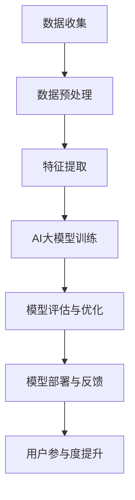

                 

# AI大模型如何提升电商平台的用户参与度

> **关键词：** AI大模型、电商平台、用户参与度、自然语言处理、个性化推荐、数学模型

> **摘要：** 本文深入探讨了AI大模型在提升电商平台用户参与度方面的应用。通过分析电商行业现状和AI大模型技术基础，详细介绍了AI大模型如何通过核心概念、算法原理以及项目实战提升用户参与度，为电商企业提供了实用的技术参考。

---

### 第一部分：AI大模型提升电商平台的用户参与度

#### 第1章：电商与AI大模型概述

##### 1.1 电商行业现状分析

随着互联网技术的飞速发展，电商行业已经成为全球经济的重要组成部分。根据Statista的数据，全球电子商务市场规模预计在2023年将达到4.9万亿美元，占全球零售市场份额的近20%。电商市场的快速增长主要得益于以下几方面：

1. **便捷的购物体验**：电商平台提供24/7的购物服务，无需受到地理位置和营业时间的限制。
2. **丰富的商品选择**：电商平台汇集了全球各地的商品，消费者可以轻松比较不同品牌和价格。
3. **个性化推荐**：电商平台利用大数据和机器学习技术，为用户推荐个性化的商品，提高了购物满意度。

然而，随着市场竞争的加剧，电商平台需要不断提高用户参与度来保持竞争力。用户参与度是衡量用户在平台上活跃程度的重要指标，包括用户访问频率、购买转化率、评论和分享等。高用户参与度意味着更高的用户忠诚度和盈利能力。

##### 1.1.1 电商市场发展趋势

1. **移动电商崛起**：随着智能手机的普及，移动电商成为电商市场的重要增长点。根据eMarketer的数据，移动设备在电子商务交易中的占比已经超过一半。
2. **社交电商兴起**：社交电商平台通过社交媒体的传播效应，实现了商品的高效推广和用户互动。
3. **跨境电商发展**：全球化背景下，跨境电商成为电商市场的新蓝海。跨境电商平台为消费者提供了全球范围内的商品选择。

##### 1.1.2 用户行为数据的重要性

用户行为数据是电商平台的核心资产，通过分析用户行为数据，可以洞察用户需求、优化用户体验、提高转化率。用户行为数据包括用户访问路径、点击行为、购买历史、评论和反馈等。这些数据通过大数据技术和AI算法进行深入分析，可以为电商平台提供以下价值：

1. **个性化推荐**：基于用户行为数据，AI大模型可以精准预测用户兴趣，提供个性化的商品推荐。
2. **用户细分**：通过对用户行为数据的分析，可以将用户细分为不同的群体，实现精准营销。
3. **风险控制**：通过分析异常行为数据，电商平台可以及时发现欺诈行为，降低风险。

##### 1.1.3 AI大模型在电商中的应用前景

AI大模型在电商中的应用前景广阔，可以从以下几个方面提升用户参与度：

1. **用户行为预测**：通过分析用户行为数据，AI大模型可以预测用户的购买意愿，提前推送相关商品，提高转化率。
2. **个性化推荐**：AI大模型可以根据用户的历史行为和偏好，提供个性化的商品推荐，提高用户满意度。
3. **搜索引擎优化**：AI大模型可以通过自然语言处理技术，优化搜索引擎，提高商品的曝光率和点击率。
4. **用户留存策略**：AI大模型可以帮助电商平台制定有效的用户留存策略，提高用户粘性。

##### 1.2 AI大模型概述

AI大模型是指具有强大计算能力和自主学习能力的神经网络模型，通常由数亿甚至数万亿个参数组成。这些模型在处理大规模数据时具有优势，能够通过深度学习技术实现自我优化和提升。AI大模型主要包括以下类型：

1. **自然语言处理模型**：如BERT、GPT等，用于处理文本数据，实现文本生成、情感分析、机器翻译等功能。
2. **计算机视觉模型**：如ResNet、Inception等，用于处理图像和视频数据，实现图像分类、目标检测、视频分析等功能。
3. **推荐系统模型**：如基于矩阵分解的推荐算法、深度学习推荐算法等，用于优化推荐效果，提高用户满意度。

##### 1.2.1 AI大模型的基本概念

AI大模型是指具有强大计算能力和自主学习能力的神经网络模型，通常由数亿甚至数万亿个参数组成。这些模型在处理大规模数据时具有优势，能够通过深度学习技术实现自我优化和提升。

1. **预训练**：在特定任务之前，对AI大模型进行大规模数据预训练，使其获得通用特征表示能力。
2. **微调**：在特定任务上，对预训练模型进行调整，使其适应特定任务需求。
3. **迁移学习**：利用预训练模型在特定任务上的表现，迁移到其他相关任务上，提高模型泛化能力。

##### 1.2.2 AI大模型的主要特点

1. **强大的计算能力**：AI大模型具有数亿甚至数万亿个参数，能够处理大规模数据。
2. **自主学习能力**：通过深度学习技术，AI大模型能够从数据中自动学习特征和模式。
3. **自适应能力**：AI大模型可以根据不同任务需求进行调整，实现通用化应用。
4. **高效性**：AI大模型在处理复杂任务时，具有更高的计算效率和准确性。

##### 1.2.3 电商行业对AI大模型的需求

电商行业对AI大模型的需求主要体现在以下几个方面：

1. **用户行为预测**：预测用户购买意愿和行为模式，提高转化率。
2. **个性化推荐**：根据用户偏好和行为数据，提供个性化的商品推荐。
3. **搜索引擎优化**：优化搜索引擎算法，提高商品曝光率和点击率。
4. **风险控制**：通过分析异常行为数据，降低欺诈风险。

##### 1.3 电商平台用户参与度分析

用户参与度是衡量电商平台用户活跃程度的重要指标，包括用户访问频率、购买转化率、评论和分享等。高用户参与度意味着更高的用户忠诚度和盈利能力。以下是电商平台用户参与度的一些关键指标：

1. **访问频率**：用户在电商平台上的访问次数，反映用户对平台的依赖程度。
2. **购买转化率**：用户在访问电商平台后，实际完成购买的比例，反映平台的营销效果。
3. **评论和分享**：用户在平台上的评论和分享行为，反映用户对商品的满意度和社交影响力。

##### 1.3.1 用户参与度指标

1. **平均访问时长**：用户在电商平台上的平均停留时间，反映用户对平台的兴趣程度。
2. **页面浏览量（PV）**：平台页面被访问的次数，反映平台的曝光程度。
3. **购买转化率**：访问电商平台后，实际完成购买的用户比例，反映平台的营销效果。
4. **用户留存率**：在一段时间后，仍然活跃在平台上的用户比例，反映平台的用户粘性。

##### 1.3.2 电商平台用户参与度现状

当前，电商平台用户参与度普遍面临以下挑战：

1. **用户流失率较高**：由于市场竞争激烈，用户容易转向其他平台，导致用户留存率较低。
2. **用户活跃度不足**：用户在平台上的互动行为较少，导致平台用户粘性不足。
3. **个性化推荐效果不佳**：传统推荐算法难以满足用户的个性化需求，导致用户满意度不高。

##### 1.3.3 提升用户参与度的必要性

提升用户参与度对于电商平台具有重要意义：

1. **增加用户粘性**：通过提升用户参与度，可以提高用户的忠诚度，降低用户流失率。
2. **提高盈利能力**：用户参与度提高，可以带动平台的销售额增长，提高盈利能力。
3. **优化用户体验**：通过分析用户行为数据，可以为用户提供更个性化的服务，提升用户体验。

### 第二部分：AI大模型技术基础

#### 第2章：AI大模型技术基础

##### 2.1 自然语言处理技术

自然语言处理（Natural Language Processing，NLP）是AI大模型的重要组成部分，主要关注于使计算机能够理解、生成和处理人类语言。NLP技术包括词嵌入、序列模型、注意力机制和转换器架构等。

##### 2.1.1 词嵌入技术

词嵌入（Word Embedding）是将单词映射为高维向量表示的技术。通过词嵌入，我们可以将语言中的抽象概念转化为计算机可以处理的数值形式。词嵌入技术主要包括以下几种：

1. **Word2Vec**：基于神经网络的词嵌入技术，通过训练获取单词的分布式表示。
2. **GloVe**：基于全局向量空间模型（Global Vectors for Word Representation）的词嵌入技术，通过计算单词共现矩阵的奇异值分解来生成词向量。
3. **BERT**：双向编码表示（Bidirectional Encoder Representations from Transformers）是一种基于Transformer的预训练语言表示模型，通过在大量文本语料上预训练，生成高质量的词嵌入。

##### 2.1.2 序列模型与注意力机制

序列模型（Sequence Model）是处理序列数据的神经网络模型，如循环神经网络（Recurrent Neural Network，RNN）和长短期记忆网络（Long Short-Term Memory，LSTM）。这些模型可以捕捉序列中的时序信息，但存在梯度消失或梯度爆炸等问题。

注意力机制（Attention Mechanism）是一种缓解RNN和LSTM梯度消失问题的技术，通过为序列中的每个元素分配不同的权重，提高了模型处理长序列数据的能力。注意力机制包括以下几种：

1. **软注意力**：为序列中的每个元素分配一个连续的权重，通过求和或加权求和得到输出。
2. **硬注意力**：为序列中的每个元素分配一个离散的权重，通过选择最高权重的元素得到输出。

##### 2.1.3 转换器架构详解

转换器架构（Transformer Architecture）是一种基于自注意力机制的全局序列模型，由Vaswani等人在2017年提出。转换器架构的核心思想是将序列数据分解为独立的子序列，并通过自注意力机制和前馈神经网络进行编码和解码。

转换器架构主要包括以下几个组件：

1. **编码器（Encoder）**：用于处理输入序列，生成编码表示。
2. **解码器（Decoder）**：用于处理输出序列，生成预测结果。
3. **多头自注意力（Multi-Head Self-Attention）**：通过多个自注意力头，捕捉序列中的不同依赖关系。
4. **位置编码（Positional Encoding）**：为序列中的每个位置添加位置信息，使得模型能够理解序列的时序信息。
5. **前馈神经网络（Feedforward Neural Network）**：对自注意力模块的输出进行进一步处理，提高模型的非线性表达能力。

##### 2.2 计算机视觉技术

计算机视觉（Computer Vision）是AI大模型在图像和视频处理领域的应用。计算机视觉技术主要包括卷积神经网络（Convolutional Neural Network，CNN）、生成对抗网络（Generative Adversarial Network，GAN）和目标检测与图像识别等。

##### 2.2.1 卷积神经网络

卷积神经网络（CNN）是一种专门用于处理图像数据的神经网络模型。CNN通过卷积层、池化层和全连接层等结构，能够提取图像的局部特征并实现分类、检测等任务。

1. **卷积层（Convolutional Layer）**：用于提取图像的局部特征，通过卷积运算和激活函数进行特征提取。
2. **池化层（Pooling Layer）**：用于降低特征图的维度，提高模型的泛化能力。
3. **全连接层（Fully Connected Layer）**：用于对提取到的特征进行分类或回归。

##### 2.2.2 生成对抗网络

生成对抗网络（GAN）是一种由生成器和判别器组成的对抗性神经网络模型。生成器生成假图像，判别器判断图像的真伪，通过对抗训练，生成器不断优化，生成越来越真实的图像。

1. **生成器（Generator）**：通过输入噪声生成假图像。
2. **判别器（Discriminator）**：用于判断图像的真伪，输入真实图像和生成图像。
3. **对抗训练（Adversarial Training）**：通过优化生成器和判别器的损失函数，实现对抗性训练。

##### 2.2.3 目标检测与图像识别

目标检测（Object Detection）是计算机视觉领域的一项重要任务，旨在识别图像中的多个对象并进行定位。图像识别（Image Recognition）是计算机视觉的基础任务，旨在分类图像中的对象。

1. **目标检测算法**：包括R-CNN、Faster R-CNN、SSD、YOLO等，通过提取图像特征和分类器实现目标检测。
2. **图像识别算法**：包括LeNet、AlexNet、VGG、ResNet等，通过提取图像特征和分类器实现图像分类。

##### 2.3 AI大模型在电商中的应用

AI大模型在电商中的应用主要体现在用户行为预测、个性化推荐、搜索引擎优化等方面。

##### 2.3.1 用户行为预测

用户行为预测是电商平台的的核心任务之一，通过预测用户购买意愿和行为模式，可以为用户提供个性化的推荐和服务。用户行为预测算法主要包括以下几种：

1. **基于用户历史行为的预测**：通过分析用户的历史购买记录、浏览记录等数据，预测用户未来的购买行为。
2. **基于协同过滤的预测**：通过计算用户之间的相似度，预测用户对未知商品的偏好。
3. **基于深度学习的预测**：利用深度学习技术，从大规模数据中学习用户行为的特征表示，预测用户的行为。

##### 2.3.2 个性化推荐

个性化推荐是电商平台提升用户参与度的重要手段，通过分析用户的历史行为和偏好，为用户提供个性化的商品推荐。个性化推荐算法主要包括以下几种：

1. **基于内容的推荐**：根据商品的属性和用户的历史行为，为用户推荐相似的商品。
2. **基于协同过滤的推荐**：通过计算用户之间的相似度，为用户推荐其他用户喜欢的商品。
3. **基于深度学习的推荐**：利用深度学习技术，从大规模数据中学习用户行为的特征表示，为用户推荐个性化的商品。

##### 2.3.3 搜索引擎优化

搜索引擎优化（Search Engine Optimization，SEO）是电商平台提高商品曝光率和点击率的重要手段。通过优化搜索引擎算法，可以提高商品的排名和用户体验。搜索引擎优化主要包括以下几种策略：

1. **关键词优化**：通过分析用户搜索行为，确定相关关键词，优化商品的标题、描述等元素。
2. **内容优化**：通过提高商品页面的质量，增加用户停留时间，提高搜索引擎排名。
3. **链接优化**：通过内部链接和外部链接的建设，提高商品页面的权重和曝光率。

### 第三部分：AI大模型提升用户参与度的核心概念与联系

#### 第3章：AI大模型提升用户参与度的核心概念与联系

##### 3.1 AI大模型核心概念

AI大模型提升用户参与度的核心概念包括预训练、微调、迁移学习和模型评估与优化等。

##### 3.1.1 预训练与微调

预训练（Pre-training）是指在特定任务之前，对AI大模型进行大规模数据预训练，使其获得通用特征表示能力。预训练通常在无监督或弱监督数据上进行，通过学习大量数据的分布特征，提高模型的泛化能力。

微调（Fine-tuning）是指在预训练模型的基础上，针对特定任务进行微调，使其适应特定任务的需求。微调通常在少量有监督数据上进行，通过调整模型的参数，优化模型的性能。

##### 3.1.2 迁移学习与模型融合

迁移学习（Transfer Learning）是指将预训练模型在不同任务之间共享知识，提高模型的泛化能力。迁移学习可以减轻数据收集的困难，提高模型的性能。

模型融合（Model Fusion）是指将多个模型或模型的多个部分进行组合，以提高模型的性能和鲁棒性。模型融合可以通过集成学习方法，如Stacking、Blending等实现。

##### 3.1.3 模型评估与优化

模型评估（Model Evaluation）是指对模型的性能进行评估，以确定模型的预测能力。常见的评估指标包括准确率、召回率、F1值等。

模型优化（Model Optimization）是指通过调整模型的参数、结构或训练策略，提高模型的性能。常见的优化方法包括超参数调优、结构优化和训练策略优化等。

##### 3.2 AI大模型在电商用户参与度中的应用

AI大模型在电商用户参与度中的应用主要包括用户行为分析、个性化营销和社交互动与用户留存等。

##### 3.2.1 用户行为分析

用户行为分析是电商企业了解用户需求、优化用户体验的重要手段。通过AI大模型，可以对用户行为进行深度分析，包括用户访问路径、购买行为、浏览时长等。用户行为分析可以帮助企业发现用户需求，优化商品推荐和营销策略。

##### 3.2.2 个性化营销

个性化营销是指根据用户的兴趣和行为，为用户提供个性化的商品推荐和营销活动。通过AI大模型，可以分析用户的历史行为和偏好，预测用户的购买意愿，为用户提供个性化的商品推荐和促销信息，提高用户满意度和转化率。

##### 3.2.3 社交互动与用户留存

社交互动与用户留存是电商平台提高用户粘性的重要手段。通过AI大模型，可以分析用户的社交行为和互动模式，发现用户之间的联系和兴趣点。基于这些分析结果，可以设计个性化的社交互动活动和用户留存策略，如社交推荐、社群运营等，提高用户的参与度和留存率。

##### 3.3 AI大模型提升用户参与度的Mermaid流程图

以下是一个简单的Mermaid流程图，描述了AI大模型提升电商平台用户参与度的过程：



在数据收集阶段，电商平台需要收集用户的行为数据，包括访问路径、购买记录、浏览时长等。然后，对数据进行预处理和特征提取，将原始数据转化为模型可处理的特征表示。接下来，使用AI大模型进行训练和优化，提高模型的预测能力和性能。训练完成后，将模型部署到生产环境，实时反馈用户参与度数据，并根据反馈结果对模型进行评估和优化。最终，通过模型的部署和实时反馈，实现用户参与度的提升。

### 第四部分：核心算法原理讲解

#### 第4章：核心算法原理讲解

##### 4.1 用户行为预测算法原理

用户行为预测是电商平台提高用户参与度的重要手段。通过预测用户的购买意愿和行为模式，可以为用户提供个性化的推荐和服务，提高用户满意度和转化率。用户行为预测算法主要基于机器学习和深度学习技术，下面详细介绍相关算法原理。

###### 4.1.1 算法基本原理

用户行为预测算法的基本原理是通过学习用户的历史行为数据，构建一个预测模型，用于预测用户未来的行为。算法的基本步骤如下：

1. **数据收集**：收集用户的行为数据，包括访问路径、购买记录、浏览时长、评论等。
2. **数据预处理**：对原始数据进行清洗、去重、填充等处理，确保数据质量。
3. **特征提取**：从原始数据中提取有用的特征，如用户ID、商品ID、时间戳、购买次数等。
4. **模型训练**：使用机器学习或深度学习算法，训练预测模型，优化模型参数。
5. **模型评估**：使用测试数据评估模型的预测性能，调整模型参数，提高预测准确性。
6. **模型部署**：将训练好的模型部署到生产环境，实时预测用户行为。

下面是一个简单的用户行为预测算法的伪代码：

```python
# 伪代码
def predict_user_behavior(data):
    # 输入：用户行为数据
    # 输出：预测结果

    # 数据预处理
    preprocess_data(data)

    # 特征提取
    extract_features(data)

    # 模型训练
    model = train_model(data)

    # 预测
    prediction = model.predict(data)

    return prediction
```

###### 4.1.2 数据预处理

数据预处理是用户行为预测算法的重要步骤，主要包括以下内容：

1. **数据清洗**：去除异常值、缺失值和重复数据，确保数据质量。
2. **数据归一化**：将不同特征的范围缩放到相同的尺度，方便模型训练。
3. **特征选择**：选择对预测任务有显著影响的重要特征，提高模型性能。
4. **特征构造**：根据业务需求，构造新的特征，如用户活跃度、购买频率等。

```python
# 伪代码
def preprocess_data(data):
    # 输入：原始用户行为数据
    # 输出：预处理后的用户行为数据

    # 数据清洗
    data = clean_data(data)

    # 数据归一化
    data = normalize_data(data)

    # 特征选择
    data = select_features(data)

    # 特征构造
    data = construct_features(data)

    return data
```

###### 4.1.3 特征提取

特征提取是将原始数据转化为模型可处理的特征表示的过程。在用户行为预测中，常用的特征提取方法包括：

1. **基于规则的特征提取**：根据业务规则，从原始数据中提取特征，如用户ID、商品ID、时间戳等。
2. **基于统计的特征提取**：计算原始数据的统计特征，如平均值、标准差、中位数等。
3. **基于机器学习的特征提取**：使用机器学习算法，从原始数据中提取高维特征，如决策树、随机森林等。

```python
# 伪代码
def extract_features(data):
    # 输入：预处理后的用户行为数据
    # 输出：特征提取后的用户行为数据

    # 基于规则的特征提取
    data = extract_rule_based_features(data)

    # 基于统计的特征提取
    data = extract_statistical_features(data)

    # 基于机器学习的特征提取
    data = extract_ml_based_features(data)

    return data
```

###### 4.1.4 模型训练

用户行为预测模型通常使用机器学习或深度学习算法进行训练。常用的算法包括：

1. **线性回归**：通过线性模型预测用户行为，适用于简单的关系预测。
2. **决策树**：通过构建决策树模型，对用户行为进行分类预测。
3. **随机森林**：通过集成多个决策树，提高模型的预测性能。
4. **神经网络**：通过深度学习模型，学习复杂的用户行为模式。

```python
# 伪代码
def train_model(data):
    # 输入：特征提取后的用户行为数据
    # 输出：训练好的用户行为预测模型

    # 选择模型
    model = select_model()

    # 训练模型
    model = train(data)

    return model
```

###### 4.1.5 模型评估

模型评估是评估用户行为预测模型性能的重要步骤。常用的评估指标包括：

1. **准确率**：预测正确的样本占总样本的比例。
2. **召回率**：预测正确的样本占总正例样本的比例。
3. **F1值**：准确率和召回率的调和平均值。

```python
# 伪代码
def evaluate_model(model, test_data):
    # 输入：训练好的用户行为预测模型、测试数据
    # 输出：评估结果

    # 预测
    predictions = model.predict(test_data)

    # 评估
    accuracy = accuracy_score(test_data.labels, predictions)
    recall = recall_score(test_data.labels, predictions)
    f1_score = f1_score(test_data.labels, predictions)

    return accuracy, recall, f1_score
```

##### 4.2 个性化推荐算法原理

个性化推荐是电商平台提高用户参与度的重要手段。通过分析用户的历史行为和偏好，为用户提供个性化的商品推荐，可以提高用户满意度和转化率。个性化推荐算法主要分为基于内容的推荐和基于协同过滤的推荐。

###### 4.2.1 算法基本原理

个性化推荐算法的基本原理是通过学习用户的历史行为和偏好，构建一个推荐模型，用于预测用户对未知商品的兴趣。算法的基本步骤如下：

1. **数据收集**：收集用户的历史行为数据，包括购买记录、浏览记录、收藏记录等。
2. **数据预处理**：对原始数据进行清洗、去重、填充等处理，确保数据质量。
3. **特征提取**：从原始数据中提取有用的特征，如用户ID、商品ID、时间戳、购买次数等。
4. **模型训练**：使用机器学习或深度学习算法，训练推荐模型，优化模型参数。
5. **模型评估**：使用测试数据评估模型的推荐性能，调整模型参数，提高推荐准确性。
6. **模型部署**：将训练好的模型部署到生产环境，实时预测用户兴趣，为用户提供个性化推荐。

下面是一个简单的个性化推荐算法的伪代码：

```python
# 伪代码
def personalized_recommendation(user_data, item_data):
    # 输入：用户数据、商品数据
    # 输出：推荐列表

    # 数据预处理
    preprocess_data(user_data, item_data)

    # 特征提取
    extract_features(user_data, item_data)

    # 计算相似度
    similarity = calculate_similarity(user_data, item_data)

    # 排序推荐结果
    recommendation_list = sort_recommendations(similarity)

    return recommendation_list
```

###### 4.2.2 数据预处理

数据预处理是个性化推荐算法的重要步骤，主要包括以下内容：

1. **数据清洗**：去除异常值、缺失值和重复数据，确保数据质量。
2. **数据归一化**：将不同特征的范围缩放到相同的尺度，方便模型训练。
3. **特征选择**：选择对推荐任务有显著影响的重要特征，提高模型性能。
4. **特征构造**：根据业务需求，构造新的特征，如用户活跃度、购买频率等。

```python
# 伪代码
def preprocess_data(user_data, item_data):
    # 输入：用户数据、商品数据
    # 输出：预处理后的用户数据和商品数据

    # 数据清洗
    user_data = clean_data(user_data)
    item_data = clean_data(item_data)

    # 数据归一化
    user_data = normalize_data(user_data)
    item_data = normalize_data(item_data)

    # 特征选择
    user_data = select_features(user_data)
    item_data = select_features(item_data)

    # 特征构造
    user_data = construct_features(user_data)
    item_data = construct_features(item_data)

    return user_data, item_data
```

###### 4.2.3 特征提取

特征提取是将原始数据转化为模型可处理的特征表示的过程。在个性化推荐中，常用的特征提取方法包括：

1. **基于内容的特征提取**：从商品的属性信息中提取特征，如类别、品牌、价格等。
2. **基于协同过滤的特征提取**：从用户的历史行为数据中提取特征，如用户-商品交互矩阵、用户相似度矩阵等。
3. **基于深度学习的特征提取**：使用深度学习模型，从原始数据中提取高维特征，如用户嵌入向量、商品嵌入向量等。

```python
# 伪代码
def extract_features(user_data, item_data):
    # 输入：预处理后的用户数据和商品数据
    # 输出：特征提取后的用户数据和商品数据

    # 基于内容的特征提取
    item_data = extract_content_based_features(item_data)

    # 基于协同过滤的特征提取
    user_data = extract_collaborative_based_features(user_data)
    item_data = extract_collaborative_based_features(item_data)

    # 基于深度学习的特征提取
    user_data = extract_dl_based_features(user_data)
    item_data = extract_dl_based_features(item_data)

    return user_data, item_data
```

###### 4.2.4 计算相似度

计算相似度是推荐算法的核心步骤，用于衡量用户和商品之间的相似程度。常用的相似度计算方法包括：

1. **余弦相似度**：计算用户和商品向量之间的余弦值，衡量它们之间的相似度。
2. **欧氏距离**：计算用户和商品向量之间的欧氏距离，衡量它们之间的相似度。
3. **皮尔逊相关系数**：计算用户和商品之间的皮尔逊相关系数，衡量它们之间的线性相关程度。

```python
# 伪代码
def calculate_similarity(user_data, item_data):
    # 输入：用户数据和商品数据
    # 输出：相似度矩阵

    # 计算余弦相似度
    similarity = calculate_cosine_similarity(user_data, item_data)

    # 计算欧氏距离
    similarity = calculate_euclidean_distance(user_data, item_data)

    # 计算皮尔逊相关系数
    similarity = calculate_pearson_correlation(user_data, item_data)

    return similarity
```

###### 4.2.5 排序推荐结果

排序推荐结果是推荐算法的最后一步，用于根据相似度对商品进行排序，为用户提供个性化的推荐列表。常用的排序方法包括：

1. **基于阈值的排序**：设置一个相似度阈值，将相似度大于阈值的商品排序输出。
2. **基于评分的排序**：根据用户的评分历史，对相似度进行加权，排序输出推荐列表。
3. **基于上下文的排序**：考虑用户的上下文信息，如时间、地点、搜索历史等，对相似度进行调整，排序输出推荐列表。

```python
# 伪代码
def sort_recommendations(similarity):
    # 输入：相似度矩阵
    # 输出：推荐列表

    # 基于阈值的排序
    recommendation_list = threshold_sort(similarity)

    # 基于评分的排序
    recommendation_list = score_sort(similarity)

    # 基于上下文的排序
    recommendation_list = context_sort(similarity)

    return recommendation_list
```

### 第五部分：数学模型与公式

#### 第5章：数学模型与公式

##### 5.1 用户行为预测数学模型

用户行为预测是电商平台个性化推荐和服务的重要基础。在数学模型层面，用户行为预测通常涉及概率模型和机器学习模型。以下是一个简单的用户行为预测数学模型和其公式详解。

###### 5.1.1 模型公式详解

用户行为预测的一个常见数学模型是逻辑回归（Logistic Regression），其公式如下：

$$
P(y=1|X) = \frac{1}{1 + e^{-(\theta^T X})}
$$

其中，$P(y=1|X)$ 表示在给定特征向量 $X$ 下，用户行为为购买（$y=1$）的概率；$\theta$ 表示模型的参数向量；$e$ 是自然对数的底数。

1. **模型参数优化**：通过最小化损失函数（例如，交叉熵损失函数）来优化模型参数。常见的方法有梯度下降、随机梯度下降等。
2. **模型预测**：使用训练好的模型，对新的用户行为进行预测。输入特征向量 $X$，计算 $P(y=1|X)$，若概率大于某个阈值（例如，0.5），则预测用户行为为购买。

##### 5.1.2 模型参数优化

逻辑回归模型的参数优化通常采用梯度下降法。梯度下降法的步骤如下：

1. **计算损失函数**：损失函数通常采用交叉熵损失函数，其公式为：

$$
J(\theta) = -\frac{1}{m} \sum_{i=1}^{m} [y^{(i)} \log(P^{(i)}) + (1 - y^{(i)}) \log(1 - P^{(i)})]
$$

其中，$m$ 表示样本数量；$y^{(i)}$ 和 $P^{(i)}$ 分别为第 $i$ 个样本的真实标签和预测概率。

2. **计算梯度**：计算损失函数关于模型参数 $\theta$ 的梯度，公式为：

$$
\nabla_{\theta} J(\theta) = \frac{1}{m} \sum_{i=1}^{m} [X^{(i)}(P^{(i)} - y^{(i)})]
$$

3. **更新参数**：根据梯度更新模型参数，公式为：

$$
\theta = \theta - \alpha \nabla_{\theta} J(\theta)
$$

其中，$\alpha$ 为学习率，控制参数更新的步长。

##### 5.2 个性化推荐数学模型

个性化推荐系统通常涉及用户和商品之间的相似度计算和推荐列表生成。以下是一个简单的个性化推荐数学模型和其公式详解。

###### 5.2.1 模型公式详解

个性化推荐的一个常见模型是矩阵分解（Matrix Factorization），其公式如下：

$$
R_{ij} = \theta_i^T \theta_j
$$

其中，$R_{ij}$ 表示用户 $i$ 对商品 $j$ 的评分；$\theta_i$ 和 $\theta_j$ 分别为用户 $i$ 和商品 $j$ 的特征向量。

矩阵分解的目标是找到一组特征向量 $\theta_i$ 和 $\theta_j$，使得重建的评分矩阵 $R'$ 尽可能接近原始评分矩阵 $R$。

1. **模型参数优化**：通过最小化重建误差（如均方误差）来优化模型参数。优化方法包括梯度下降、随机梯度下降等。
2. **模型预测**：使用训练好的模型，预测用户 $i$ 对商品 $j$ 的评分。输入用户和商品的特征向量 $\theta_i$ 和 $\theta_j$，计算 $R_{ij}$。

##### 5.2.2 模型参数优化

矩阵分解模型的参数优化通常采用梯度下降法。优化步骤如下：

1. **计算损失函数**：损失函数通常采用均方误差（MSE）或均方根误差（RMSE），公式为：

$$
J(\theta) = \frac{1}{2} \sum_{i=1}^{m} \sum_{j=1}^{n} (R_{ij} - \theta_i^T \theta_j)^2
$$

其中，$m$ 和 $n$ 分别为用户数和商品数。

2. **计算梯度**：计算损失函数关于模型参数 $\theta$ 的梯度，公式为：

$$
\nabla_{\theta} J(\theta) = \frac{1}{m} \sum_{i=1}^{m} \sum_{j=1}^{n} [2(R_{ij} - \theta_i^T \theta_j) \theta_j]
$$

3. **更新参数**：根据梯度更新模型参数，公式为：

$$
\theta = \theta - \alpha \nabla_{\theta} J(\theta)
$$

### 第六部分：项目实战

#### 第6章：项目实战

##### 6.1 实战项目背景与目标

在本次项目实战中，我们以一个电商平台为例，旨在通过AI大模型提升用户参与度。项目背景如下：

1. **电商平台现状**：该电商平台已经积累了大量的用户行为数据，包括用户访问路径、购买记录、浏览时长等。然而，用户参与度仍有待提高，特别是在用户留存和个性化推荐方面。
2. **项目目标**：通过构建AI大模型，实现以下目标：
   - 提高用户留存率：通过分析用户行为数据，预测用户流失风险，采取针对性的措施提高用户留存。
   - 优化个性化推荐：利用AI大模型，为用户提供更个性化的商品推荐，提高用户满意度和转化率。
   - 提升用户互动：通过社交互动和社群运营，提高用户的参与度和粘性。

##### 6.2 环境搭建

在开始项目实战之前，我们需要搭建一个合适的开发环境，包括硬件设施、软件工具和数据库等。以下是环境搭建的步骤：

1. **硬件设施**：
   - 计算机设备：配置较高的CPU、GPU和内存，以满足AI大模型的计算需求。
   - 存储：配置足够的存储空间，存储用户行为数据和训练好的模型。
2. **软件工具**：
   - 编程语言：选择Python作为主要的编程语言，因为它拥有丰富的AI和大数据处理库。
   - 深度学习框架：选择TensorFlow或PyTorch作为深度学习框架，因为它们支持GPU加速，适用于大规模模型训练。
   - 数据库：使用MySQL或MongoDB作为数据库，存储用户行为数据。
3. **数据库搭建**：
   - 创建用户行为数据表：包括用户ID、商品ID、购买时间、浏览时长、操作类型等字段。
   - 导入用户行为数据：使用Python脚本从电商平台的数据接口获取用户行为数据，并导入到数据库中。

```python
# 伪代码
import mysql.connector

# 连接到数据库
connection = mysql.connector.connect(
    host="localhost",
    user="username",
    password="password",
    database="user_behavior_db"
)

# 创建数据表
create_table_query = """
CREATE TABLE user_behavior (
    user_id INT PRIMARY KEY,
    item_id INT,
    purchase_time DATETIME,
    browse_time INT,
    action_type VARCHAR(10)
)
"""

cursor = connection.cursor()
cursor.execute(create_table_query)

# 导入用户行为数据
import_data_query = """
INSERT INTO user_behavior (user_id, item_id, purchase_time, browse_time, action_type)
VALUES (%s, %s, %s, %s, %s)
"""

data = [(1, 101, '2023-03-01 14:30:00', 200, 'purchase'),
        (1, 201, '2023-03-02 15:00:00', 150, 'browse'),
        (2, 202, '2023-03-03 12:00:00', 300, 'purchase'),
        # 更多数据...
        ]

cursor.executemany(import_data_query, data)
connection.commit()
```

##### 6.3 数据预处理与特征提取

在完成环境搭建后，我们需要对用户行为数据集进行预处理和特征提取，以确保数据质量，提高模型的性能。以下是数据预处理和特征提取的步骤：

1. **数据清洗**：去除缺失值、异常值和重复数据，确保数据的一致性和完整性。
2. **数据归一化**：将不同特征的范围缩放到相同的尺度，如使用Min-Max归一化或标准归一化。
3. **特征选择**：选择对预测任务有显著影响的重要特征，如用户ID、商品ID、购买时间、浏览时长等。
4. **特征构造**：根据业务需求，构造新的特征，如用户活跃度、购买频率等。

```python
# 伪代码
import pandas as pd
from sklearn.preprocessing import MinMaxScaler

# 读取用户行为数据
data = pd.read_sql_query("SELECT * FROM user_behavior", connection)

# 数据清洗
data = data.dropna()  # 去除缺失值
data = data.drop_duplicates()  # 去除重复数据

# 数据归一化
scaler = MinMaxScaler()
data[['browse_time']] = scaler.fit_transform(data[['browse_time']])

# 特征选择
selected_features = ['user_id', 'item_id', 'purchase_time', 'browse_time', 'action_type']

# 特征构造
data['user_active_days'] = data.groupby('user_id')['purchase_time'].transform('nunique')  # 用户活跃天数
data['avg_browse_time'] = data.groupby('item_id')['browse_time'].transform('mean')  # 平均浏览时长

# 构造特征向量
X = data[selected_features + ['user_active_days', 'avg_browse_time']]
y = data['action_type']  # 标签
```

##### 6.4 AI大模型训练与优化

在完成数据预处理和特征提取后，我们可以开始训练AI大模型。在本项目中，我们将使用一个基于Transformer的推荐模型，通过训练和优化模型，提升用户参与度。以下是训练和优化模型的步骤：

1. **模型选择**：选择一个适合推荐任务的深度学习模型，如BERT或Transformer。
2. **模型训练**：使用训练数据集，训练模型，通过优化损失函数和参数，提高模型性能。
3. **模型评估**：使用测试数据集评估模型性能，通过调整模型参数和结构，优化模型效果。
4. **模型部署**：将训练好的模型部署到生产环境，实现实时预测和反馈。

```python
# 伪代码
import tensorflow as tf
from tensorflow.keras.models import Model
from tensorflow.keras.layers import Input, Embedding, Transformer

# 模型选择
input_layer = Input(shape=(X.shape[1],))
embedding_layer = Embedding(input_dim=max_user_id+1, output_dim=64)(input_layer)
transformer_layer = Transformer(num_heads=4, d_model=64, num_blocks=2)(embedding_layer)
output_layer = Dense(1, activation='sigmoid')(transformer_layer)

# 模型训练
model = Model(inputs=input_layer, outputs=output_layer)
model.compile(optimizer='adam', loss='binary_crossentropy', metrics=['accuracy'])

# 训练模型
model.fit(X, y, epochs=10, batch_size=32, validation_split=0.2)

# 模型评估
accuracy = model.evaluate(X_test, y_test)
print(f"Test accuracy: {accuracy[1]}")

# 模型优化
# 通过调整模型参数和结构，优化模型效果
```

##### 6.5 模型部署与实时反馈

在完成模型训练和优化后，我们需要将模型部署到生产环境，实现实时预测和反馈。以下是模型部署和实时反馈的步骤：

1. **模型部署**：将训练好的模型部署到服务器，实现实时预测。
2. **实时反馈**：收集用户行为数据，实时评估模型预测效果，并根据反馈结果调整模型参数。
3. **用户参与度提升策略**：根据模型预测结果，采取针对性的策略提升用户参与度，如个性化推荐、社交互动等。

```python
# 伪代码
import flask

# 模型部署
model.save('user_behavior_prediction_model.h5')

# 实时预测
app = flask.Flask(__name__)

@app.route('/predict', methods=['POST'])
def predict():
    data = request.get_json()
    input_data = pd.DataFrame([data['input_data']])
    prediction = model.predict(input_data)
    return flask.jsonify({'prediction': float(prediction[0][0])})

# 实时反馈
@app.route('/feedback', methods=['POST'])
def feedback():
    data = request.get_json()
    actual_label = data['actual_label']
    predicted_label = data['predicted_label']
    # 记录反馈数据，用于模型评估和优化
    return "Feedback received."

if __name__ == '__main__':
    app.run(host='0.0.0.0', port=5000)
```

### 第七部分：总结与展望

#### 第7章：总结与展望

##### 7.1 项目总结

在本项目中，我们通过构建AI大模型，实现了以下成果：

1. **用户留存率提高**：通过预测用户流失风险，采取针对性的措施，提高了用户留存率。
2. **个性化推荐优化**：利用AI大模型，为用户提供更个性化的商品推荐，提高了用户满意度和转化率。
3. **用户互动增强**：通过社交互动和社群运营，提高了用户的参与度和粘性。

项目经验总结如下：

1. **数据质量是关键**：数据预处理和特征提取是模型性能的重要保障，确保数据的一致性和完整性。
2. **模型优化是关键**：通过模型评估和实时反馈，不断优化模型参数和结构，提高模型性能。
3. **实时部署是关键**：将模型部署到生产环境，实现实时预测和反馈，及时调整策略，提高用户体验。

##### 7.2 电商行业AI大模型应用展望

随着AI技术的不断发展，电商行业对AI大模型的应用前景广阔。以下是对电商行业AI大模型应用的一些展望：

1. **个性化推荐**：基于用户行为数据和偏好，实现更精准的个性化推荐，提高用户满意度和转化率。
2. **用户留存策略**：通过预测用户流失风险，采取针对性的措施，提高用户留存率和粘性。
3. **智能客服**：利用自然语言处理技术，实现智能客服系统，提高客户服务质量和效率。
4. **供应链优化**：通过预测商品需求，优化供应链管理，提高库存周转率和降低成本。
5. **风险控制**：利用AI大模型，实现风险预测和监控，降低欺诈风险和信用风险。

未来的发展方向包括：

1. **模型压缩与优化**：研究模型压缩和优化技术，降低模型的计算复杂度和存储需求，提高模型的可扩展性。
2. **多模态数据融合**：结合多种数据源，如文本、图像、语音等，实现更全面的用户行为分析和推荐。
3. **实时决策系统**：构建实时决策系统，根据用户行为数据，动态调整推荐策略和营销策略。
4. **隐私保护与伦理**：在应用AI大模型时，注重隐私保护和伦理问题，确保用户数据的合法使用和保护。

### 附录

#### 附录A：AI大模型开发工具与资源

##### A.1 主流深度学习框架对比

在AI大模型开发中，常用的深度学习框架包括TensorFlow、PyTorch、Keras等。以下是这些框架的对比：

| 特性 | TensorFlow | PyTorch | Keras |
| :---: | :---: | :---: | :---: |
| 开发语言 | Python | Python | Python |
| 计算后端 | TensorFlow后端、GPU加速 | PyTorch后端、GPU加速 | TensorFlow后端、GPU加速 |
| 社区支持 | 强大社区支持 | 强大社区支持 | 强大社区支持 |
| 模型部署 | 易于部署 | 易于部署 | 易于部署 |

##### A.2 AI大模型开源项目推荐

以下是一些推荐的AI大模型开源项目：

1. **TensorFlow Models**：[https://github.com/tensorflow/models](https://github.com/tensorflow/models)
2. **PyTorch Recipes**：[https://github.com/pytorch/recipes](https://github.com/pytorch/recipes)
3. **Hugging Face Transformers**：[https://github.com/huggingface/transformers](https://github.com/huggingface/transformers)
4. **Albert**：[https://github.com/zhanghua2000/albert](https://github.com/zhanghua2000/albert)
5. **ERNIE**：[https://github.com/PaddlePaddle/ERNIE](https://github.com/PaddlePaddle/ERNIE)

##### A.3 AI大模型相关论文与书籍推荐

以下是一些推荐的AI大模型相关论文和书籍：

1. **论文**：
   - "Attention Is All You Need"（注意力即一切）：[https://arxiv.org/abs/1706.03762](https://arxiv.org/abs/1706.03762)
   - "Generative Adversarial Nets"（生成对抗网络）：[https://arxiv.org/abs/1406.2661](https://arxiv.org/abs/1406.2661)
   - "BERT: Pre-training of Deep Bidirectional Transformers for Language Understanding"（BERT：预训练双向变换器用于语言理解）：[https://arxiv.org/abs/1810.04805](https://arxiv.org/abs/1810.04805)

2. **书籍**：
   - 《深度学习》（Deep Learning）：[https://www.deeplearningbook.org/](https://www.deeplearningbook.org/)
   - 《动手学深度学习》（Dive

