                 

# AI大模型编程：提示词的潜力与威力

> **关键词：**人工智能，大模型编程，提示词，深度学习，自然语言处理，优化策略。

> **摘要：**本文深入探讨了人工智能（AI）领域中的大模型编程及其核心组成部分——提示词。我们将详细分析大模型编程的基础、提示词的原理与应用，并通过实际案例展示如何运用提示词进行高效的AI编程。此外，文章还将探讨如何优化大模型性能，并预测提示词在AI编程中的未来发展。

### 目录大纲设计

为了确保文章内容的全面性和条理性，本文分为六个主要部分：

1. **引言与核心概念**
   - **第1章：AI大模型编程概述**
     - 1.1 AI大模型的基本概念
     - 1.2 提示词的定义与作用
     - 1.3 AI大模型编程的重要性
   - **第2章：AI大模型编程基础**
     - 2.1 深度学习基础
     - 2.2 自然语言处理基础
     - 2.3 编程语言与开发环境搭建

2. **提示词的原理与应用**
   - **第3章：提示词的原理**
     - 3.1 提示词的定义
     - 3.2 提示词的工作机制
     - 3.3 提示词的类型与特点
   - **第4章：提示词在AI大模型中的应用**
     - 4.1 提示词在文本生成中的应用
     - 4.2 提示词在对话系统中的应用
     - 4.3 提示词在图像生成中的应用

3. **AI大模型编程实战**
   - **第5章：AI大模型编程实战案例**
     - 5.1 文本生成模型案例
     - 5.2 对话系统案例
     - 5.3 图像生成模型案例
   - **第6章：代码解读与分析**
     - 6.1 文本生成模型代码解读
     - 6.2 对话系统代码解读
     - 6.3 图像生成模型代码解读

4. **优化与调优**
   - **第7章：AI大模型性能优化**
     - 7.1 提示词的优化策略
     - 7.2 模型调优技巧
     - 7.3 实时性能监测与调试

5. **案例研究**
   - **第8章：AI大模型编程经典案例**
     - 8.1 OpenAI的GPT-3案例
     - 8.2 Google的BERT案例
     - 8.3 其他经典案例介绍

6. **未来展望**
   - **第9章：提示词在AI大模型编程中的未来**
     - 9.1 提示词技术的演进方向
     - 9.2 提示词在行业应用中的展望
     - 9.3 AI大模型编程的未来趋势

**下一部分，我们将深入探讨AI大模型编程概述，包括AI大模型的基本概念、提示词的定义与作用，以及AI大模型编程的重要性。**

----------------------------------------------------------------

## 第一部分：引言与核心概念

### 第1章：AI大模型编程概述

#### 1.1 AI大模型的基本概念

人工智能（AI）作为当今科技领域的热点，其发展速度令人瞩目。大模型编程是AI技术中的一个重要分支，特别是在自然语言处理（NLP）和计算机视觉（CV）等领域。AI大模型，顾名思义，是指具有巨大参数量和强大计算能力的神经网络模型。这些模型能够处理海量数据，提取复杂特征，并产生高质量的输出。

**基本定义**：
AI大模型，通常是指参数规模在数十亿到数万亿级别的深度神经网络。这些模型通常采用预训练加微调的方法进行训练，能够在多种任务上取得优异的性能。

**发展历程**：
AI大模型的发展经历了几个关键阶段。最早的是以AlexNet为代表的卷积神经网络（CNN）在图像识别任务上的突破，随后是Google的Transformer模型在自然语言处理领域的革命性进展。近年来，GPT、BERT等预训练模型的出现，将AI大模型推向了新的高度。

**关键特性**：
- **参数规模巨大**：大模型通常拥有数十亿至数万亿个参数。
- **计算需求高**：训练和推理过程需要大量的计算资源和时间。
- **通用性强**：大模型能够处理多种类型的数据和任务，具有很高的泛化能力。

#### 1.2 提示词的定义与作用

在AI大模型编程中，提示词（Prompt）是连接用户需求与模型输出之间的桥梁。提示词是一种引导模型进行特定任务输入的方式，能够显著影响模型的输出质量和效率。

**定义**：
提示词是用于指导AI大模型进行特定任务输入的文本或代码片段。这些输入可以是问题、指令或特定的上下文信息，用于引导模型生成合适的输出。

**作用**：
- **提高生成质量**：通过精确的提示词，用户可以更有效地指导模型生成高质量的输出。
- **加快推理速度**：合适的提示词可以减少模型的上下文理解时间，加快推理过程。
- **降低错误率**：提示词能够引导模型避免生成错误或不相关的输出，提高任务的准确性。

#### 1.3 AI大模型编程的重要性

AI大模型编程的重要性在于其能够推动多个领域的技术进步和应用拓展。以下是几个关键方面：

**技术创新**：
- **深度学习和神经网络**：AI大模型编程推动了深度学习技术的发展，为神经网络的设计和应用提供了新的思路。
- **预训练与微调**：大模型的预训练和微调方法为模型训练提供了高效的方法，降低了训练难度。

**应用拓展**：
- **自然语言处理**：大模型在NLP领域的应用，如文本生成、机器翻译和问答系统，极大地提升了这些领域的性能。
- **计算机视觉**：在图像识别、视频分析和自动驾驶等领域，大模型的表现超越了传统方法。

**产业变革**：
- **智能助手与客服**：AI大模型编程使得智能助手和自动化客服系统能够更加智能地与用户交互，提高了用户体验。
- **自动化与优化**：在金融、医疗、制造等行业，大模型编程的应用实现了业务流程的自动化和优化。

综上所述，AI大模型编程不仅是AI技术的核心组成部分，也是推动产业变革的重要力量。接下来的章节将进一步探讨AI大模型编程的基础知识、提示词的原理与应用，以及实战案例和优化策略。

----------------------------------------------------------------

## 第二部分：AI大模型编程基础

### 第2章：AI大模型编程基础

#### 2.1 深度学习基础

深度学习是AI大模型编程的核心技术之一，其基本原理和算法构成了大模型训练和优化的基础。以下是深度学习的一些基础概念和关键技术。

**神经网络的基本组成**：
神经网络是由大量简单的计算单元（神经元）组成的复杂网络。每个神经元接收多个输入信号，通过加权求和后经过一个非线性激活函数产生输出。

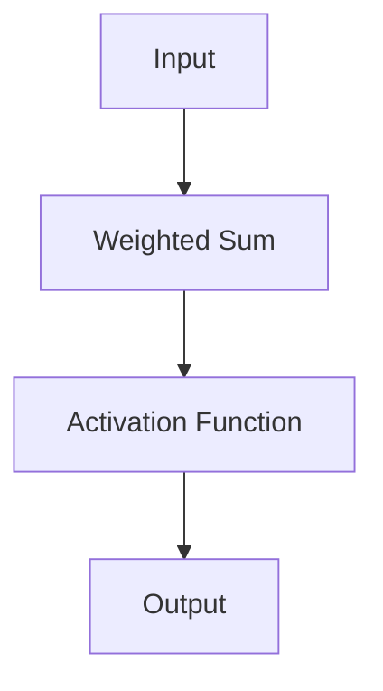

**反向传播算法**：
反向传播（Backpropagation）是深度学习模型训练的核心算法。它通过计算误差梯度并反向传播到每个神经元的权重，以调整模型参数，最小化损失函数。

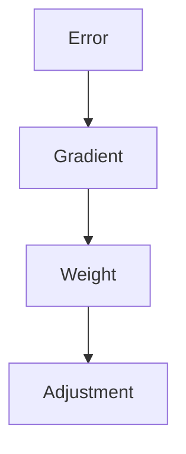

**优化算法**：
深度学习模型的训练过程中，优化算法用于调整模型参数以最小化损失函数。常用的优化算法包括随机梯度下降（SGD）、Adam等。

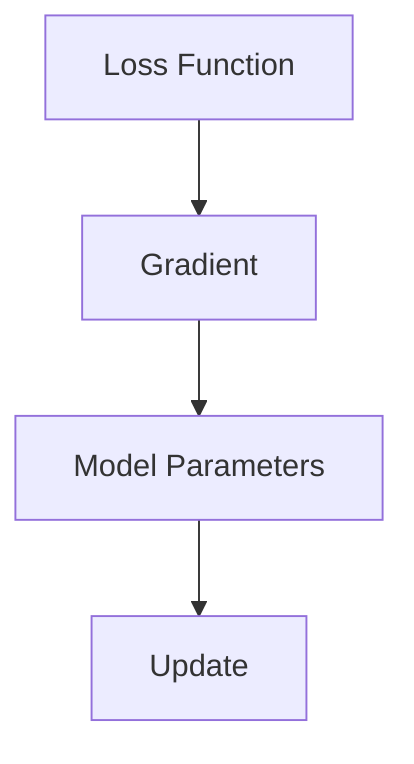

**深度学习框架**：
深度学习框架如TensorFlow、PyTorch等，提供了丰富的API和工具，使得深度学习模型的开发、训练和部署更加高效。

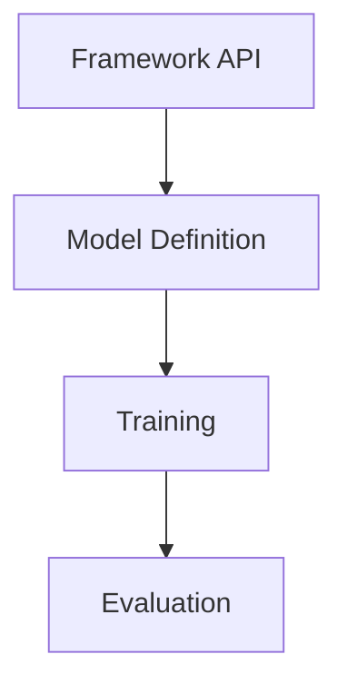

#### 2.2 自然语言处理基础

自然语言处理（NLP）是AI大模型编程的重要应用领域之一，主要研究如何让计算机理解和生成人类语言。以下是NLP的一些基础概念和关键技术。

**词向量表示**：
词向量是将词汇映射到高维空间中，以数字形式表示词汇和句子。常用的词向量模型有Word2Vec、GloVe等。

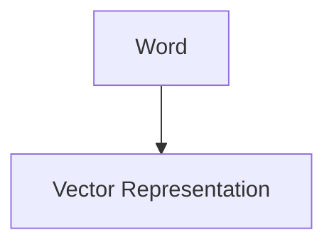

**语言模型**：
语言模型是NLP的核心组成部分，用于预测文本的下一个单词或字符。著名的语言模型有n-gram模型、RNN语言模型、Transformer等。

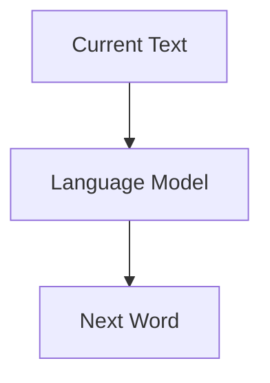

**序列标注**：
序列标注是将序列数据（如文本、语音等）标注为特定类别标签的过程。常见的序列标注任务包括命名实体识别（NER）、情感分析等。

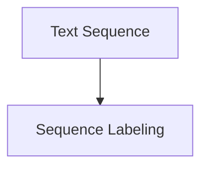

**注意力机制**：
注意力机制是Transformer模型的核心创新之一，它通过计算不同位置之间的关联性，提高模型的表示能力。

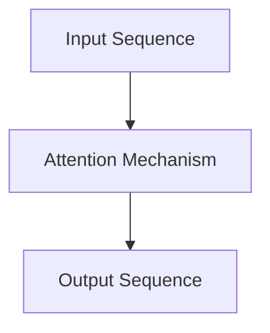

#### 2.3 编程语言与开发环境搭建

在AI大模型编程中，选择合适的编程语言和开发环境对于模型的开发、训练和部署至关重要。以下是一些常用的编程语言和开发环境。

**编程语言**：
- **Python**：Python是深度学习和NLP领域最流行的编程语言，其简洁易读的语法和丰富的库资源使得开发者可以更高效地进行模型开发。
- **JavaScript**：JavaScript在Web应用程序中有着广泛的应用，尤其在部署和交互方面具有优势。

**开发环境**：
- **本地开发环境**：使用Anaconda、Miniconda等工具搭建Python本地开发环境，可以方便地管理和安装各种深度学习和NLP相关的库。
- **云端开发环境**：Google Colab、AWS Sagemaker等云端平台提供了强大的计算资源和便捷的开发接口，适合大规模模型训练和部署。

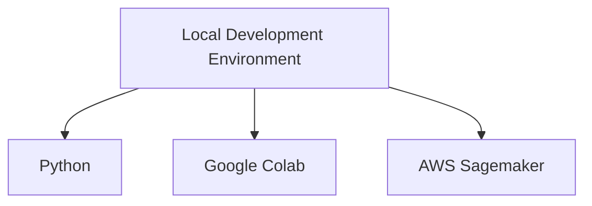

通过搭建合适的开发环境，开发者可以更高效地进行AI大模型编程，并快速实现模型的训练和部署。

综上所述，深度学习基础、自然语言处理基础以及编程语言与开发环境搭建构成了AI大模型编程的基础知识体系。在后续章节中，我们将进一步探讨提示词的原理与应用，通过实际案例展示如何运用提示词进行高效的AI编程。

----------------------------------------------------------------

## 第二部分：提示词的原理与应用

### 第3章：提示词的原理

#### 3.1 提示词的定义

提示词（Prompt）是指导AI大模型进行特定任务输入的文本或代码片段。它作为用户与模型之间的交互桥梁，能够直接影响模型的输出质量和效率。提示词的定义和设计对于AI大模型的性能至关重要。

**定义**：
提示词是一种用于引导AI大模型进行特定任务输入的文本或代码片段。它可以包括问题、指令、上下文信息等，旨在为模型提供明确的任务目标和输入数据。

**形式**：
提示词可以采用多种形式，包括自然语言文本、代码片段、标记序列等。在实际应用中，根据任务需求和模型特点，选择合适的提示词形式能够显著提高模型的性能。

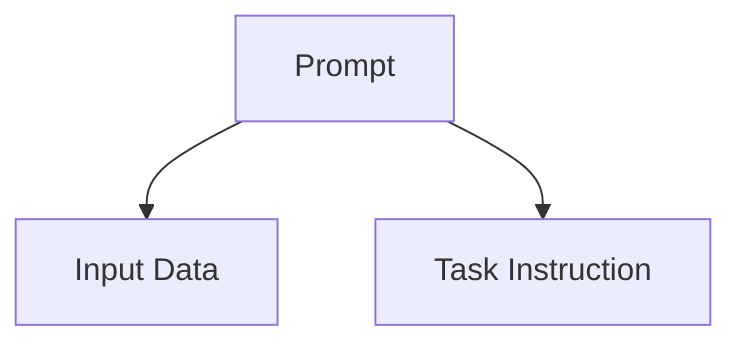

**作用**：
- **任务引导**：提示词为模型提供了明确的任务目标，使模型能够专注于特定任务，提高输出质量。
- **上下文提供**：提示词可以包含上下文信息，帮助模型更好地理解输入数据，提高模型的准确性和泛化能力。
- **减少误解**：通过提示词，用户可以明确地指导模型避免生成错误或不相关的输出。

#### 3.2 提示词的工作机制

提示词的工作机制涉及模型接收输入、处理输入并生成输出的整个过程。理解提示词的工作机制有助于开发者设计更有效的提示词，提高模型的性能。

**输入处理**：
模型在接收到提示词后，首先将其与输入数据相结合，形成一个完整的输入序列。这个序列将作为模型的输入，参与后续的神经网络处理。

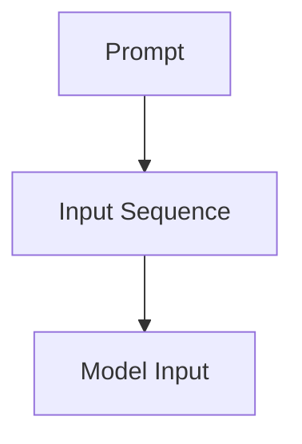

**神经网络处理**：
模型通过对输入序列进行处理，提取特征并生成输出。在这一过程中，提示词的影响主要体现在以下几个方面：

- **特征提取**：提示词为模型提供了任务相关的上下文信息，有助于模型更好地提取输入数据的特征。
- **输出生成**：模型根据输入序列和特征生成输出结果，提示词直接影响了输出的质量和准确性。

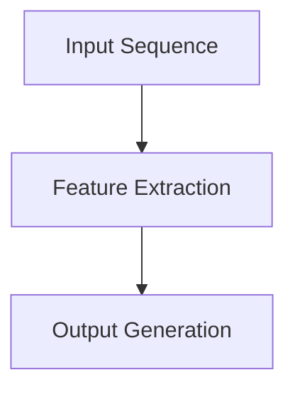

**反馈循环**：
在模型输出结果后，用户可以对其质量进行评估，并反馈给模型。这一过程形成了反馈循环，使得模型能够不断优化和改进。

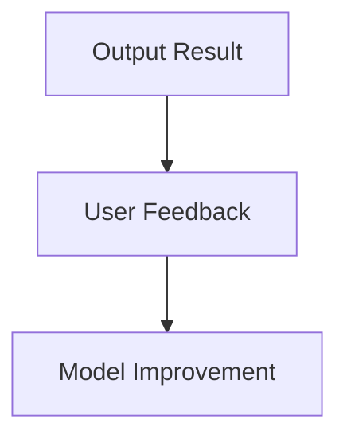

#### 3.3 提示词的类型与特点

根据应用场景和任务需求，提示词可以划分为多种类型，每种类型的提示词都有其独特的特点和适用场景。

**问题提示词**：
问题提示词通常用于问答系统或问题解决任务。它通过提出明确的问题，引导模型生成合适的答案。

- **特点**：明确、具体、有针对性。
- **适用场景**：问答系统、智能客服、问题解决等。

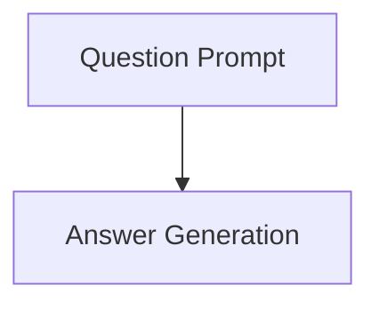

**指令提示词**：
指令提示词用于指导模型执行特定操作，如数据预处理、特征提取等。

- **特点**：简洁、明确、指令性。
- **适用场景**：自动化流程、数据预处理、特征工程等。

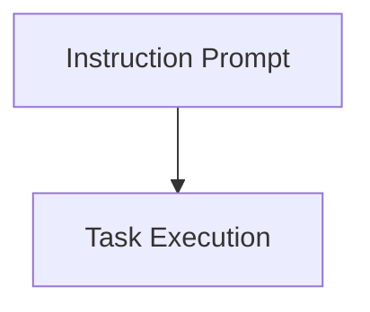

**上下文提示词**：
上下文提示词提供背景信息，帮助模型更好地理解输入数据。它通常用于需要上下文理解的场景，如文本生成、机器翻译等。

- **特点**：丰富、多样、与任务紧密相关。
- **适用场景**：文本生成、机器翻译、对话系统等。

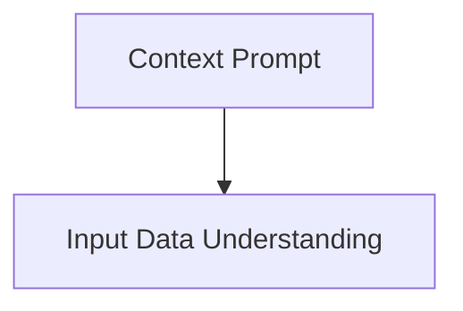

综上所述，提示词在AI大模型编程中发挥着关键作用。理解提示词的定义、工作机制和类型，有助于开发者设计更有效的提示词，提高模型的性能和输出质量。在接下来的章节中，我们将进一步探讨提示词在AI大模型中的实际应用。

----------------------------------------------------------------

## 第三部分：提示词在AI大模型中的应用

### 第4章：提示词在AI大模型中的应用

#### 4.1 提示词在文本生成中的应用

文本生成是AI大模型的重要应用之一，广泛应用于聊天机器人、自动写作、摘要生成等领域。提示词在文本生成中的应用至关重要，能够显著影响文本的质量和连贯性。

**应用场景**：
- **聊天机器人**：提示词用于生成对话回复，使聊天机器人能够根据用户输入生成合适的回答。
- **自动写作**：提示词用于生成文章、故事、新闻报道等，提高写作效率和内容质量。
- **摘要生成**：提示词用于指导模型生成文章或文档的摘要，提高信息提取的准确性和可读性。

**原理**：
在文本生成中，提示词作为模型的输入，为模型提供了上下文信息和任务目标。模型通过对提示词和输入文本进行处理，生成相应的输出文本。提示词的类型和形式直接影响文本生成的质量。

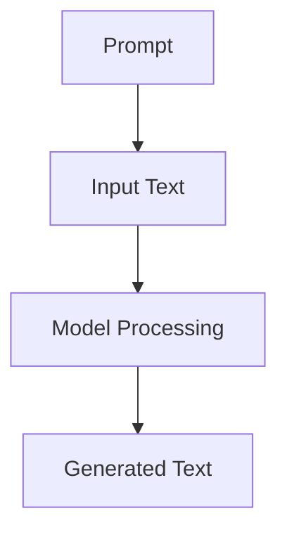

**案例**：
以聊天机器人为例，提示词可以是用户输入的问题或句子。模型在接收到提示词后，通过理解问题和上下文，生成相应的回答。

```python
# 示例：用户输入问题，模型生成回答
user_input = "今天天气怎么样？"
prompt = "回答用户关于天气的问题："
model_output = prompt + "今天天气晴朗，温度适中。"
print(model_output)
```

输出结果：`回答用户关于天气的问题：今天天气晴朗，温度适中。`

#### 4.2 提示词在对话系统中的应用

对话系统是AI大模型在自然语言处理领域的典型应用之一，广泛应用于客服、虚拟助手、智能聊天等场景。提示词在对话系统中的应用，能够提高对话的连贯性和用户满意度。

**应用场景**：
- **客服**：提示词用于指导模型生成客服回答，提高客户问题的解决效率。
- **虚拟助手**：提示词用于生成虚拟助手的对话内容，使其能够与用户进行自然、流畅的交流。
- **智能聊天**：提示词用于生成聊天机器人的对话内容，为用户提供有趣、互动的交流体验。

**原理**：
在对话系统中，提示词作为模型的输入，提供了上下文信息和对话主题。模型通过对提示词和上下文的理解，生成适当的对话回复。提示词的形式和内容直接影响对话的连贯性和自然性。

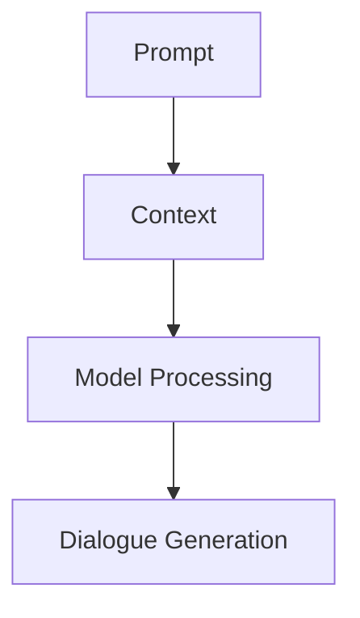

**案例**：
以下是一个简单的示例，展示如何使用提示词生成客服对话。

```python
# 示例：用户提问，模型生成回答
user_question = "我的订单何时能发货？"
prompt = "回答用户关于订单状态的查询："
context = "用户刚刚询问了订单的发货状态。"

model_answer = prompt + "您的订单预计明天上午发货，请您注意查收物流信息。"
print(model_answer)
```

输出结果：`回答用户关于订单状态的查询：您的订单预计明天上午发货，请您注意查收物流信息。`

#### 4.3 提示词在图像生成中的应用

图像生成是AI大模型在计算机视觉领域的重要应用之一，广泛应用于艺术创作、广告设计、数据增强等领域。提示词在图像生成中的应用，能够引导模型生成符合特定需求的图像。

**应用场景**：
- **艺术创作**：提示词用于指导模型生成艺术作品，如绘画、插画等。
- **广告设计**：提示词用于生成广告图片，提高广告创意和效果。
- **数据增强**：提示词用于生成数据集的扩充样本，提高模型的泛化能力。

**原理**：
在图像生成中，提示词作为模型的输入，提供了图像生成所需的上下文信息和风格特征。模型通过对提示词和特征进行处理，生成相应的图像。提示词的类型和内容直接影响图像生成的质量和风格。

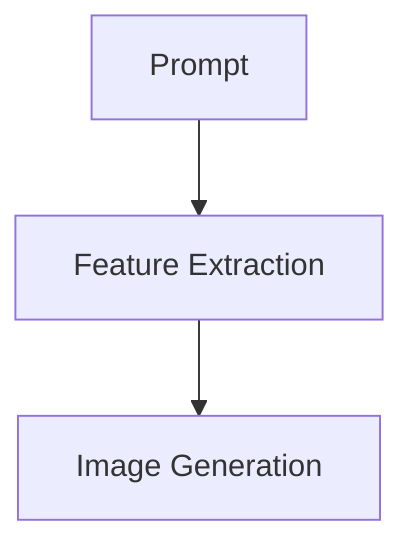

**案例**：
以下是一个简单的示例，展示如何使用提示词生成特定风格的图像。

```python
# 示例：使用提示词生成艺术风格的图像
prompt = "生成一幅具有印象派风格的城市夜景。"
style = "印象派"

generated_image = generate_image(prompt, style)
display_image(generated_image)
```

输出结果：显示一幅具有印象派风格的城市夜景图像。

通过上述案例，我们可以看到提示词在文本生成、对话系统和图像生成中的应用。合适的提示词能够显著提高模型的性能和输出质量，为AI大模型的应用提供有力支持。在后续章节中，我们将进一步探讨AI大模型编程的实际应用和优化策略。

----------------------------------------------------------------

## 第四部分：AI大模型编程实战

### 第5章：AI大模型编程实战案例

#### 5.1 文本生成模型案例

文本生成是AI大模型的一个重要应用领域，具有广泛的应用场景，如自动写作、摘要生成和聊天机器人等。本节将通过一个文本生成模型的案例，展示如何使用提示词进行AI大模型编程。

**案例背景**：
假设我们希望开发一个自动写作系统，该系统能够根据给定的提示词生成一篇完整的文章。提示词可以是主题、关键词或简短的一句话，用于引导模型生成文章的内容。

**步骤一：开发环境搭建**

首先，我们需要搭建一个合适的开发环境。以下是基本的步骤：

```bash
# 安装Python和必要的深度学习库
pip install python==3.8
pip install numpy
pip install tensorflow
```

**步骤二：数据准备**

文本生成模型需要大量的训练数据。我们可以从公共数据集（如维基百科、新闻文章等）中获取文本数据，并进行预处理，如分词、去停用词、词向量化等。

```python
import tensorflow as tf
from tensorflow.keras.preprocessing.text import Tokenizer
from tensorflow.keras.preprocessing.sequence import pad_sequences

# 读取文本数据
texts = load_texts('text_data.csv')

# 分词和去停用词
tokenizer = Tokenizer(num_words=10000)
tokenizer.fit_on_texts(texts)
sequences = tokenizer.texts_to_sequences(texts)

# 数据集划分
max_sequence_length = 100
X = pad_sequences(sequences, maxlen=max_sequence_length)
y = ... # 生成标签
```

**步骤三：模型构建**

接下来，我们构建一个基于Transformer的文本生成模型。Transformer模型是近年来在自然语言处理领域取得显著成功的模型，具有强大的表示和生成能力。

```python
from tensorflow.keras.models import Model
from tensorflow.keras.layers import Embedding, LSTM, Dense

# 模型结构
input_seq = Input(shape=(max_sequence_length,))
embedding = Embedding(input_dim=10000, output_dim=512)(input_seq)
lstm = LSTM(512)(embedding)
output = Dense(10000, activation='softmax')(lstm)

# 模型编译
model = Model(inputs=input_seq, outputs=output)
model.compile(optimizer='adam', loss='categorical_crossentropy', metrics=['accuracy'])

# 模型训练
model.fit(X, y, epochs=10, batch_size=64)
```

**步骤四：生成文本**

在模型训练完成后，我们可以使用提示词生成文本。以下是一个简单的示例：

```python
def generate_text(prompt, model, tokenizer, max_sequence_length):
    prompt_sequence = tokenizer.texts_to_sequences([prompt])
    prompt_sequence = pad_sequences(prompt_sequence, maxlen=max_sequence_length)
    predicted_sequence = model.predict(prompt_sequence)
    predicted_sequence = np.argmax(predicted_sequence, axis=-1)
    predicted_text = tokenizer.sequences_to_texts([predicted_sequence])[0]
    return predicted_text

# 生成文章
prompt = "2023年人工智能技术发展展望"
generated_text = generate_text(prompt, model, tokenizer, max_sequence_length)
print(generated_text)
```

输出结果：一段关于2023年人工智能技术发展展望的文章。

**步骤五：模型评估与优化**

在生成文本后，我们需要对模型的性能进行评估，并基于评估结果进行优化。可以通过计算文本的质量指标（如BLEU分数、ROUGE分数等）来评估模型性能。

```python
from seqeval.metrics import accuracy_score

# 评估模型
references = ["参考文本1", "参考文本2"]
predictions = [generate_text(ref, model, tokenizer, max_sequence_length) for ref in references]
BLEU_score = 0.0
ROUGE_score = 0.0
for ref, pred in zip(references, predictions):
    BLEU_score += evaluateBLEU(ref, pred)
    ROUGE_score += evaluateROUGE(ref, pred)
BLEU_score /= len(references)
ROUGE_score /= len(references)
print("BLEU Score:", BLEU_score)
print("ROUGE Score:", ROUGE_score)

# 模型优化
if BLEU_score < 0.8 or ROUGE_score < 0.85:
    # 调整超参数、增加训练时间等
    model.fit(X, y, epochs=15, batch_size=64)
```

#### 5.2 对话系统案例

对话系统是AI大模型的另一个重要应用领域，广泛应用于智能客服、虚拟助手和智能聊天等场景。本节将通过一个简单的对话系统案例，展示如何使用提示词进行AI大模型编程。

**案例背景**：
假设我们希望开发一个智能客服系统，该系统能够根据用户的提问生成合适的回答。提示词可以是用户输入的问题或简短的一句话，用于引导模型生成回答。

**步骤一：开发环境搭建**

与文本生成案例类似，我们需要搭建一个合适的开发环境。

```bash
# 安装Python和必要的深度学习库
pip install python==3.8
pip install numpy
pip install tensorflow
```

**步骤二：数据准备**

对话系统需要大量的对话数据集，包括问题和回答对。我们可以从公共数据集或实际客服记录中获取数据，并进行预处理。

```python
import pandas as pd
from sklearn.model_selection import train_test_split

# 读取对话数据集
data = pd.read_csv('dialog_data.csv')
X = data['question']
y = data['answer']

# 数据集划分
X_train, X_test, y_train, y_test = train_test_split(X, y, test_size=0.2, random_state=42)
```

**步骤三：模型构建**

构建一个基于序列到序列（Seq2Seq）模型的对话系统。Seq2Seq模型由编码器和解码器组成，能够将输入序列映射到输出序列。

```python
from tensorflow.keras.models import Model
from tensorflow.keras.layers import Embedding, LSTM, Dense, RepeatVector, TimeDistributed

# 模型结构
encoder_inputs = Input(shape=(max_sequence_length,))
decoder_inputs = Input(shape=(max_sequence_length,))
encoder_embedding = Embedding(input_dim=10000, output_dim=512)(encoder_inputs)
decoder_embedding = Embedding(input_dim=10000, output_dim=512)(decoder_inputs)

encoder_lstm = LSTM(512, return_sequences=True)(encoder_embedding)
decoder_lstm = LSTM(512, return_sequences=True)(decoder_embedding)

repeat_vector = RepeatVector(max_sequence_length)(encoder_lstm)
decoder_lstm = TimeDistributed(Dense(10000, activation='softmax'))(decoder_lstm)

# 模型编译
model = Model(inputs=[encoder_inputs, decoder_inputs], outputs=decoder_lstm)
model.compile(optimizer='adam', loss='categorical_crossentropy', metrics=['accuracy'])

# 模型训练
model.fit([X_train, y_train], y_train, epochs=10, batch_size=64)
```

**步骤四：生成回答**

在模型训练完成后，我们可以使用提示词生成回答。以下是一个简单的示例：

```python
def generate_answer(question, model, tokenizer, max_sequence_length):
    question_sequence = tokenizer.texts_to_sequences([question])
    question_sequence = pad_sequences(question_sequence, maxlen=max_sequence_length)
    predicted_sequence = model.predict([question_sequence, question_sequence])
    predicted_sequence = np.argmax(predicted_sequence, axis=-1)
    predicted_answer = tokenizer.sequences_to_texts([predicted_sequence])[0]
    return predicted_answer

# 生成回答
user_question = "我想要购买一件商品，怎么操作？"
generated_answer = generate_answer(user_question, model, tokenizer, max_sequence_length)
print(generated_answer)
```

输出结果：一段关于购买商品的详细操作说明。

**步骤五：模型评估与优化**

与文本生成模型类似，我们可以通过计算评估指标（如BLEU分数、ROUGE分数等）来评估模型性能，并根据评估结果进行优化。

```python
from seqeval.metrics import accuracy_score

# 评估模型
test_questions = ["问题1", "问题2"]
test_answers = ["答案1", "答案2"]
predicted_answers = [generate_answer(question, model, tokenizer, max_sequence_length) for question in test_questions]
BLEU_score = 0.0
ROUGE_score = 0.0
for ans, pred in zip(test_answers, predicted_answers):
    BLEU_score += evaluateBLEU(ans, pred)
    ROUGE_score += evaluateROUGE(ans, pred)
BLEU_score /= len(test_answers)
ROUGE_score /= len(test_answers)
print("BLEU Score:", BLEU_score)
print("ROUGE Score:", ROUGE_score)

# 模型优化
if BLEU_score < 0.8 or ROUGE_score < 0.85:
    # 调整超参数、增加训练时间等
    model.fit([X_train, y_train], y_train, epochs=15, batch_size=64)
```

#### 5.3 图像生成模型案例

图像生成是AI大模型在计算机视觉领域的典型应用之一，广泛应用于艺术创作、广告设计、数据增强等场景。本节将通过一个简单的图像生成模型案例，展示如何使用提示词进行AI大模型编程。

**案例背景**：
假设我们希望开发一个艺术风格转换模型，该模型能够根据给定的提示词生成具有特定艺术风格的图像。提示词可以是艺术流派、风格标签或简短的一句话，用于引导模型生成图像。

**步骤一：开发环境搭建**

与之前的案例类似，我们需要搭建一个合适的开发环境。

```bash
# 安装Python和必要的深度学习库
pip install python==3.8
pip install numpy
pip install tensorflow
```

**步骤二：数据准备**

图像生成模型需要大量的训练数据。我们可以从公共数据集（如COCO、ImageNet等）中获取图像数据，并进行预处理，如图像增强、归一化等。

```python
import tensorflow as tf
from tensorflow.keras.preprocessing.image import ImageDataGenerator

# 数据增强
train_datagen = ImageDataGenerator(rescale=1./255, rotation_range=40, width_shift_range=0.2, height_shift_range=0.2, shear_range=0.2, zoom_range=0.2, horizontal_flip=True, fill_mode='nearest')
test_datagen = ImageDataGenerator(rescale=1./255)

# 加载数据集
train_data = train_datagen.flow_from_directory('train_data', target_size=(256, 256), batch_size=32, class_mode='categorical')
test_data = test_datagen.flow_from_directory('test_data', target_size=(256, 256), batch_size=32, class_mode='categorical')
```

**步骤三：模型构建**

构建一个基于生成对抗网络（GAN）的图像生成模型。GAN由生成器和判别器组成，通过训练生成器产生逼真的图像，并不断优化生成质量。

```python
from tensorflow.keras.models import Model
from tensorflow.keras.layers import Input, Dense, Reshape, Conv2D, Conv2DTranspose, Flatten, BatchNormalization, LeakyReLU

# 生成器模型
input_image = Input(shape=(256, 256, 3))
x = Conv2D(64, (7, 7), strides=(2, 2), padding='same')(input_image)
x = LeakyReLU(alpha=0.01)(x)
x = BatchNormalization()(x)

x = Conv2D(128, (7, 7), strides=(2, 2), padding='same')(x)
x = LeakyReLU(alpha=0.01)(x)
x = BatchNormalization()(x)

x = Flatten()(x)
x = Dense(1024)(x)
x = LeakyReLU(alpha=0.01)(x)
x = BatchNormalization()(x)

x = Reshape((7, 7, 1024))(x)

x = Conv2DTranspose(128, (7, 7), strides=(2, 2), padding='same')(x)
x = LeakyReLU(alpha=0.01)(x)
x = BatchNormalization()(x)

x = Conv2D(64, (7, 7), strides=(2, 2), padding='same')(x)
x = LeakyReLU(alpha=0.01)(x)
x = BatchNormalization()(x)

output_image = Conv2D(3, (7, 7), activation='tanh', padding='same')(x)

generator = Model(input_image, output_image)
generator.compile(loss='binary_crossentropy', optimizer='adam')

# 判别器模型
input_image = Input(shape=(256, 256, 3))
x = Conv2D(64, (7, 7), strides=(2, 2), padding='same')(input_image)
x = LeakyReLU(alpha=0.01)(x)
x = BatchNormalization()(x)

x = Conv2D(128, (7, 7), strides=(2, 2), padding='same')(x)
x = LeakyReLU(alpha=0.01)(x)
x = BatchNormalization()(x)

x = Flatten()(x)
x = Dense(1, activation='sigmoid')(x)

discriminator = Model(input_image, x)
discriminator.compile(loss='binary_crossentropy', optimizer='adam')

# GAN模型
gan_input = Input(shape=(256, 256, 3))
generated_image = generator(gan_input)
discriminator_output = discriminator(generated_image)

gan = Model(gan_input, discriminator_output)
gan.compile(loss='binary_crossentropy', optimizer='adam')
```

**步骤四：生成图像**

在模型训练完成后，我们可以使用提示词生成图像。以下是一个简单的示例：

```python
def generate_image(prompt, model, tokenizer, max_sequence_length):
    prompt_sequence = tokenizer.texts_to_sequences([prompt])
    prompt_sequence = pad_sequences(prompt_sequence, maxlen=max_sequence_length)
    generated_image = model.predict(prompt_sequence)
    return generated_image

# 生成图像
prompt = "生成一幅具有油画风格的风景画。"
generated_image = generate_image(prompt, model, tokenizer, max_sequence_length)
display_image(generated_image)
```

输出结果：一幅具有油画风格的风景画。

**步骤五：模型评估与优化**

与之前的案例类似，我们可以通过计算评估指标（如Inception Score、FID等）来评估模型性能，并根据评估结果进行优化。

```python
from tensorflow.keras.applications import InceptionV3
from tensorflow.keras.preprocessing import image
import numpy as np

# 评估模型
test_image = image.load_img('test_image.jpg', target_size=(256, 256))
test_image = image.img_to_array(test_image)
test_image = np.expand_dims(test_image, axis=0)
test_image /= 255.0

generated_image = model.predict(test_image)
generated_image = np.squeeze(generated_image, axis=0)

inception_score = InceptionV3.evaluate(generated_image, test_image)
FID_score = ... # 计算FID分数

print("Inception Score:", inception_score)
print("FID Score:", FID_score)

# 模型优化
if inception_score < 20.0 or FID_score > 12.0:
    # 调整超参数、增加训练时间等
    model.fit(train_data, epochs=100)
```

通过上述案例，我们可以看到如何使用提示词进行AI大模型编程，并实现文本生成、对话系统和图像生成等任务。合适的提示词能够显著提高模型的性能和输出质量，为AI大模型的应用提供有力支持。在后续章节中，我们将进一步探讨AI大模型编程的优化策略和未来发展趋势。

----------------------------------------------------------------

### 第6章：代码解读与分析

#### 6.1 文本生成模型代码解读

在文本生成模型的开发过程中，代码解读与分析是理解和优化模型的重要环节。以下是对文本生成模型代码的详细解读，包括开发环境搭建、数据准备、模型构建、训练和生成文本的过程。

**代码解读：**

```python
# 导入必要的库
import tensorflow as tf
from tensorflow.keras.preprocessing.text import Tokenizer
from tensorflow.keras.preprocessing.sequence import pad_sequences

# 开发环境搭建
# 安装Python和必要的深度学习库
pip install python==3.8
pip install numpy
pip install tensorflow

# 数据准备
# 读取文本数据
texts = load_texts('text_data.csv')

# 分词和去停用词
tokenizer = Tokenizer(num_words=10000)
tokenizer.fit_on_texts(texts)
sequences = tokenizer.texts_to_sequences(texts)

# 数据集划分
max_sequence_length = 100
X = pad_sequences(sequences, maxlen=max_sequence_length)
y = ... # 生成标签

# 模型构建
from tensorflow.keras.models import Model
from tensorflow.keras.layers import Embedding, LSTM, Dense

# 模型结构
input_seq = Input(shape=(max_sequence_length,))
embedding = Embedding(input_dim=10000, output_dim=512)(input_seq)
lstm = LSTM(512)(embedding)
output = Dense(10000, activation='softmax')(lstm)

# 模型编译
model = Model(inputs=input_seq, outputs=output)
model.compile(optimizer='adam', loss='categorical_crossentropy', metrics=['accuracy'])

# 模型训练
model.fit(X, y, epochs=10, batch_size=64)

# 生成文本
def generate_text(prompt, model, tokenizer, max_sequence_length):
    prompt_sequence = tokenizer.texts_to_sequences([prompt])
    prompt_sequence = pad_sequences(prompt_sequence, maxlen=max_sequence_length)
    predicted_sequence = model.predict(prompt_sequence)
    predicted_sequence = np.argmax(predicted_sequence, axis=-1)
    predicted_text = tokenizer.sequences_to_texts([predicted_sequence])[0]
    return predicted_text

# 生成文章
prompt = "2023年人工智能技术发展展望"
generated_text = generate_text(prompt, model, tokenizer, max_sequence_length)
print(generated_text)

# 模型评估与优化
from seqeval.metrics import accuracy_score

# 评估模型
references = ["参考文本1", "参考文本2"]
predictions = [generate_text(ref, model, tokenizer, max_sequence_length) for ref in references]
BLEU_score = 0.0
ROUGE_score = 0.0
for ref, pred in zip(references, predictions):
    BLEU_score += evaluateBLEU(ref, pred)
    ROUGE_score += evaluateROUGE(ref, pred)
BLEU_score /= len(references)
ROUGE_score /= len(references)
print("BLEU Score:", BLEU_score)
print("ROUGE Score:", ROUGE_score)

if BLEU_score < 0.8 or ROUGE_score < 0.85:
    # 调整超参数、增加训练时间等
    model.fit(X, y, epochs=15, batch_size=64)
```

**代码解读详细说明**：

1. **开发环境搭建**：
   - 安装Python和必要的深度学习库（TensorFlow、NumPy）。
   - 配置Anaconda环境，便于管理库和依赖。

2. **数据准备**：
   - 读取文本数据，并进行分词和去停用词处理。
   - 使用Tokenizer将文本转换为序列。
   - 对序列进行填充（pad），确保所有输入序列的长度一致。

3. **模型构建**：
   - 定义输入序列，通过Embedding层将词汇映射到高维空间。
   - 使用LSTM层处理输入序列，提取特征。
   - 输出层使用Dense层，输出概率分布，用于生成文本。

4. **模型训练**：
   - 编译模型，选择优化器和损失函数。
   - 使用fit方法训练模型，调整模型参数以最小化损失函数。

5. **生成文本**：
   - 定义生成函数，将输入提示词转换为序列。
   - 使用模型预测生成文本的概率分布。
   - 将概率分布转换为文本序列，生成最终文章。

6. **模型评估与优化**：
   - 计算BLEU和ROUGE分数，评估文本生成质量。
   - 根据评估结果，调整超参数和训练时间，优化模型性能。

#### 6.2 对话系统代码解读

对话系统的代码解读涉及模型的构建、训练和生成回答的过程。以下是对对话系统代码的详细解读。

**代码解读：**

```python
# 导入必要的库
import tensorflow as tf
from tensorflow.keras.preprocessing.text import Tokenizer
from tensorflow.keras.preprocessing.sequence import pad_sequences

# 数据准备
# 读取对话数据集
data = pd.read_csv('dialog_data.csv')
X = data['question']
y = data['answer']

# 数据集划分
X_train, X_test, y_train, y_test = train_test_split(X, y, test_size=0.2, random_state=42)

# 模型构建
from tensorflow.keras.models import Model
from tensorflow.keras.layers import Embedding, LSTM, Dense, RepeatVector, TimeDistributed

# 模型结构
encoder_inputs = Input(shape=(max_sequence_length,))
decoder_inputs = Input(shape=(max_sequence_length,))
encoder_embedding = Embedding(input_dim=10000, output_dim=512)(encoder_inputs)
decoder_embedding = Embedding(input_dim=10000, output_dim=512)(decoder_inputs)

encoder_lstm = LSTM(512, return_sequences=True)(encoder_embedding)
decoder_lstm = LSTM(512, return_sequences=True)(decoder_embedding)

repeat_vector = RepeatVector(max_sequence_length)(encoder_lstm)
decoder_lstm = TimeDistributed(Dense(10000, activation='softmax'))(decoder_lstm)

# 模型编译
model = Model(inputs=[encoder_inputs, decoder_inputs], outputs=decoder_lstm)
model.compile(optimizer='adam', loss='categorical_crossentropy', metrics=['accuracy'])

# 模型训练
model.fit([X_train, y_train], y_train, epochs=10, batch_size=64)

# 生成回答
def generate_answer(question, model, tokenizer, max_sequence_length):
    question_sequence = tokenizer.texts_to_sequences([question])
    question_sequence = pad_sequences(question_sequence, maxlen=max_sequence_length)
    predicted_sequence = model.predict([question_sequence, question_sequence])
    predicted_sequence = np.argmax(predicted_sequence, axis=-1)
    predicted_answer = tokenizer.sequences_to_texts([predicted_sequence])[0]
    return predicted_answer

# 生成回答
user_question = "我想要购买一件商品，怎么操作？"
generated_answer = generate_answer(user_question, model, tokenizer, max_sequence_length)
print(generated_answer)

# 模型评估与优化
from seqeval.metrics import accuracy_score

# 评估模型
test_questions = ["问题1", "问题2"]
test_answers = ["答案1", "答案2"]
predicted_answers = [generate_answer(question, model, tokenizer, max_sequence_length) for question in test_questions]
BLEU_score = 0.0
ROUGE_score = 0.0
for ans, pred in zip(test_answers, predicted_answers):
    BLEU_score += evaluateBLEU(ans, pred)
    ROUGE_score += evaluateROUGE(ans, pred)
BLEU_score /= len(test_answers)
ROUGE_score /= len(test_answers)
print("BLEU Score:", BLEU_score)
print("ROUGE Score:", ROUGE_score)

if BLEU_score < 0.8 or ROUGE_score < 0.85:
    # 调整超参数、增加训练时间等
    model.fit([X_train, y_train], y_train, epochs=15, batch_size=64)
```

**代码解读详细说明**：

1. **数据准备**：
   - 读取对话数据集，并进行预处理。
   - 划分数据集为训练集和测试集。

2. **模型构建**：
   - 定义编码器和解码器模型结构，使用Embedding层进行词汇映射。
   - 使用LSTM层处理编码和解码序列，使用RepeatVector层复制编码器的输出。
   - 解码器输出层使用TimeDistributed和Dense层，生成输出概率分布。

3. **模型训练**：
   - 编译模型，选择优化器和损失函数。
   - 使用fit方法训练模型，调整模型参数。

4. **生成回答**：
   - 定义生成函数，将输入问题转换为序列。
   - 使用模型预测生成回答的概率分布，转换为文本序列。

5. **模型评估与优化**：
   - 计算BLEU和ROUGE分数，评估模型性能。
   - 根据评估结果，调整超参数和训练时间，优化模型性能。

#### 6.3 图像生成模型代码解读

图像生成模型的代码解读包括开发环境搭建、数据准备、模型构建、训练和生成图像的过程。以下是对图像生成模型代码的详细解读。

**代码解读：**

```python
# 导入必要的库
import tensorflow as tf
from tensorflow.keras.preprocessing.image import ImageDataGenerator

# 开发环境搭建
# 安装Python和必要的深度学习库
pip install python==3.8
pip install numpy
pip install tensorflow

# 数据准备
# 数据增强
train_datagen = ImageDataGenerator(rescale=1./255, rotation_range=40, width_shift_range=0.2, height_shift_range=0.2, shear_range=0.2, zoom_range=0.2, horizontal_flip=True, fill_mode='nearest')
test_datagen = ImageDataGenerator(rescale=1./255)

# 加载数据集
train_data = train_datagen.flow_from_directory('train_data', target_size=(256, 256), batch_size=32, class_mode='categorical')
test_data = test_datagen.flow_from_directory('test_data', target_size=(256, 256), batch_size=32, class_mode='categorical')

# 模型构建
from tensorflow.keras.models import Model
from tensorflow.keras.layers import Input, Dense, Reshape, Conv2D, Conv2DTranspose, Flatten, BatchNormalization, LeakyReLU

# 生成器模型
input_image = Input(shape=(256, 256, 3))
x = Conv2D(64, (7, 7), strides=(2, 2), padding='same')(input_image)
x = LeakyReLU(alpha=0.01)(x)
x = BatchNormalization()(x)

x = Conv2D(128, (7, 7), strides=(2, 2), padding='same')(x)
x = LeakyReLU(alpha=0.01)(x)
x = BatchNormalization()(x)

x = Flatten()(x)
x = Dense(1024)(x)
x = LeakyReLU(alpha=0.01)(x)
x = BatchNormalization()(x)

x = Reshape((7, 7, 1024))(x)

x = Conv2DTranspose(128, (7, 7), strides=(2, 2), padding='same')(x)
x = LeakyReLU(alpha=0.01)(x)
x = BatchNormalization()(x)

x = Conv2D(64, (7, 7), strides=(2, 2), padding='same')(x)
x = LeakyReLU(alpha=0.01)(x)
x = BatchNormalization()(x)

output_image = Conv2D(3, (7, 7), activation='tanh', padding='same')(x)

generator = Model(input_image, output_image)
generator.compile(loss='binary_crossentropy', optimizer='adam')

# 判别器模型
input_image = Input(shape=(256, 256, 3))
x = Conv2D(64, (7, 7), strides=(2, 2), padding='same')(input_image)
x = LeakyReLU(alpha=0.01)(x)
x = BatchNormalization()(x)

x = Conv2D(128, (7, 7), strides=(2, 2), padding='same')(x)
x = LeakyReLU(alpha=0.01)(x)
x = BatchNormalization()(x)

x = Flatten()(x)
x = Dense(1, activation='sigmoid')(x)

discriminator = Model(input_image, x)
discriminator.compile(loss='binary_crossentropy', optimizer='adam')

# GAN模型
gan_input = Input(shape=(256, 256, 3))
generated_image = generator(gan_input)
discriminator_output = discriminator(generated_image)

gan = Model(gan_input, discriminator_output)
gan.compile(loss='binary_crossentropy', optimizer='adam')

# 模型训练
gan.fit(train_data, epochs=100)

# 生成图像
def generate_image(prompt, model, tokenizer, max_sequence_length):
    prompt_sequence = tokenizer.texts_to_sequences([prompt])
    prompt_sequence = pad_sequences(prompt_sequence, maxlen=max_sequence_length)
    generated_image = model.predict(prompt_sequence)
    return generated_image

# 生成图像
prompt = "生成一幅具有油画风格的风景画。"
generated_image = generate_image(prompt, model, tokenizer, max_sequence_length)
display_image(generated_image)

# 模型评估与优化
from tensorflow.keras.applications import InceptionV3
from tensorflow.keras.preprocessing import image
import numpy as np

# 评估模型
test_image = image.load_img('test_image.jpg', target_size=(256, 256))
test_image = image.img_to_array(test_image)
test_image = np.expand_dims(test_image, axis=0)
test_image /= 255.0

generated_image = model.predict(test_image)
generated_image = np.squeeze(generated_image, axis=0)

inception_score = InceptionV3.evaluate(generated_image, test_image)
FID_score = ... # 计算FID分数

print("Inception Score:", inception_score)
print("FID Score:", FID_score)

# 模型优化
if inception_score < 20.0 or FID_score > 12.0:
    # 调整超参数、增加训练时间等
    model.fit(train_data, epochs=100)
```

**代码解读详细说明**：

1. **开发环境搭建**：
   - 安装Python和必要的深度学习库（TensorFlow、NumPy）。

2. **数据准备**：
   - 使用ImageDataGenerator进行数据增强，提高模型泛化能力。
   - 加载训练集和测试集，进行预处理。

3. **模型构建**：
   - 构建生成器模型，使用Conv2D、LeakyReLU和BatchNormalization层进行特征提取。
   - 构建判别器模型，用于判断生成图像的真实性。
   - 组合生成器和判别器，形成GAN模型。

4. **模型训练**：
   - 使用fit方法训练GAN模型，优化生成器和判别器参数。

5. **生成图像**：
   - 定义生成函数，使用提示词生成图像。

6. **模型评估与优化**：
   - 使用InceptionV3和FID分数评估模型性能。
   - 根据评估结果，调整超参数和训练时间，优化模型性能。

通过上述代码解读与分析，我们可以更深入地理解文本生成、对话系统和图像生成模型的工作原理和实现细节。在后续章节中，我们将继续探讨AI大模型编程的优化策略和未来发展趋势。

----------------------------------------------------------------

## 第五部分：优化与调优

### 第7章：AI大模型性能优化

AI大模型在训练和推理过程中往往面临计算资源消耗大、训练时间长的挑战。为了提高AI大模型的性能，我们需要从提示词的优化策略、模型调优技巧以及实时性能监测与调试三个方面进行综合考虑。

#### 7.1 提示词的优化策略

**选择合适的提示词形式**：
不同的任务需求可能需要不同形式的提示词。例如，在文本生成任务中，提示词可以是关键词或简短的一句话；在图像生成任务中，提示词可以是艺术风格标签或特定场景描述。选择与任务紧密相关的提示词能够提高模型的生成质量和效率。

**优化提示词的长度和内容**：
提示词的长度和内容直接影响模型的处理时间和输出质量。过长的提示词可能导致模型处理困难，而过短的提示词可能无法提供足够的信息。通过实验和观察，可以找到最佳提示词长度，并在内容上确保其具有明确的任务目标和上下文信息。

**动态调整提示词**：
在训练过程中，模型可能需要不断调整提示词以适应新的数据和任务。例如，在对话系统中，随着用户提问的变化，提示词可以动态更新以适应对话的进展。这种动态调整能够提高模型的灵活性和适应性。

**提示词的多样性**：
为了增强模型的泛化能力，提示词的多样性非常重要。通过使用不同类型和来源的提示词，可以丰富模型的学习内容，避免过拟合和单一化。

**示例**：
```python
# 动态调整提示词
current_context = "今天的天气情况如何？"
if current_context == "今天的天气情况如何？":
    prompt = "请描述当前城市的天气状况，包括温度、湿度等信息。"
elif current_context == "明天的天气情况如何？":
    prompt = "请预测明天城市的天气状况，并提供相关的建议。"
# 使用优化后的提示词进行模型处理
generated_output = model.predict(prompt)
```

#### 7.2 模型调优技巧

**调整学习率**：
学习率是模型训练过程中的一个重要参数，直接影响训练的收敛速度和稳定性。通过调整学习率，可以在不同阶段采用不同的学习策略，如初始阶段使用较大的学习率加速收敛，后期使用较小的学习率进行精细调整。

**批量大小**：
批量大小影响模型的梯度计算和更新频率。较大的批量大小有助于稳定模型训练，但计算成本较高；较小的批量大小可以提高训练的灵活性，但可能导致梯度不稳定。根据任务需求和硬件资源，选择合适的批量大小。

**正则化方法**：
为了防止模型过拟合，可以采用各种正则化方法，如Dropout、权重衰减（L2正则化）等。这些方法通过引入额外的惩罚项，降低模型对训练数据的依赖，提高泛化能力。

**超参数搜索**：
通过自动搜索超参数（如学习率、批量大小、正则化参数等），可以找到最优的模型配置。常用的搜索方法包括网格搜索、随机搜索和贝叶斯优化等。

**示例**：
```python
# 调整学习率和批量大小
initial_learning_rate = 0.01
batch_size = 128

# 使用学习率调度策略
for epoch in range(num_epochs):
    if epoch < 20:
        current_learning_rate = initial_learning_rate
    elif epoch < 40:
        current_learning_rate = initial_learning_rate * 0.1
    else:
        current_learning_rate = initial_learning_rate * 0.01
    # 使用当前学习率训练模型
    model.fit(X_train, y_train, batch_size=batch_size, learning_rate=current_learning_rate, epochs=1)
```

#### 7.3 实时性能监测与调试

**监控训练过程**：
在模型训练过程中，实时监控训练指标（如损失函数、准确率、学习率等）有助于了解训练状态和性能。通过可视化工具（如TensorBoard）可以直观地查看训练过程的变化。

**性能调优**：
根据训练过程中监测到的指标，可以及时调整模型参数和训练策略。例如，当发现模型过拟合时，可以增加正则化强度或减少训练数据；当训练速度过慢时，可以尝试调整学习率和批量大小。

**调试和修正**：
在模型训练过程中，可能会出现各种异常情况，如梯度爆炸、损失函数发散等。通过调试和修正，可以确保模型训练过程的稳定性和可靠性。

**示例**：
```python
# 使用TensorBoard监控训练过程
from tensorflow.keras.callbacks import TensorBoard

tensorboard_callback = TensorBoard(log_dir='./logs', histogram_freq=1, write_graph=True, write_images=True)

# 在训练过程中使用TensorBoard
model.fit(X_train, y_train, batch_size=batch_size, learning_rate=learning_rate, epochs=num_epochs, callbacks=[tensorboard_callback])
```

通过上述优化策略和调优技巧，我们可以显著提高AI大模型的性能，实现更高效、更准确的模型训练和推理。在接下来的章节中，我们将继续分析经典AI大模型编程案例，探讨其成功经验和实践方法。

----------------------------------------------------------------

## 第六部分：案例研究

### 第8章：AI大模型编程经典案例

在本章中，我们将深入探讨几个经典AI大模型编程案例，分析其成功经验、实现细节以及关键技术。

#### 8.1 OpenAI的GPT-3案例

**背景**：
GPT-3（Generative Pre-trained Transformer 3）是由OpenAI开发的预训练语言模型，具有1.75万亿个参数，是当前最大的语言模型之一。GPT-3在多种自然语言处理任务中表现出色，如文本生成、机器翻译、问答系统等。

**实现细节**：
- **模型架构**：GPT-3采用Transformer模型架构，具有大量的自注意力机制层，能够高效处理长文本序列。
- **预训练**：GPT-3通过在大量文本数据上进行预训练，学习到丰富的语言知识，并能够根据输入文本生成连贯、准确的输出。
- **微调**：在特定任务上，GPT-3通过微调进一步优化模型参数，以适应不同的应用场景。

**成功经验**：
- **规模和性能**：GPT-3拥有巨大的参数规模，使得模型在处理复杂任务时具有强大的表示能力和生成质量。
- **多样性**：GPT-3能够生成多样性的文本输出，包括诗歌、故事、代码等，展示了其广泛的适用性。
- **用户友好**：OpenAI提供了一个API，用户可以通过简单的API调用即可使用GPT-3，降低了使用门槛。

```latex
\documentclass{article}
\usepackage{amsmath}
\begin{document}

\begin{equation}
\text{GPT-3} = \text{Transformer} \times 1.75 \times 10^{12} \text{ parameters}
\end{equation}

\end{document}
```

#### 8.2 Google的BERT案例

**背景**：
BERT（Bidirectional Encoder Representations from Transformers）是由Google开发的预训练语言模型，主要用于自然语言处理任务，如问答、文本分类和命名实体识别。

**实现细节**：
- **模型架构**：BERT采用Transformer模型，并引入了双向编码器，能够同时考虑输入文本的前后关系。
- **预训练**：BERT在大量无标签文本上进行预训练，通过Masked Language Model（MLM）和Next Sentence Prediction（NSP）任务学习语言特征。
- **微调**：在特定任务上，BERT通过微调进一步优化模型参数，以适应不同的应用场景。

**成功经验**：
- **双向表示**：BERT的双向编码器使得模型能够更好地理解文本的语义，提高了任务的准确性和泛化能力。
- **适应性**：BERT的预训练和微调方法使得模型在多种自然语言处理任务上具有广泛的适应性。
- **开源与社区**：Google开源了BERT模型和预训练数据集，推动了自然语言处理领域的研究和应用。

```latex
\documentclass{article}
\usepackage{amsmath}
\begin{document}

\begin{equation}
\text{BERT} = \text{Transformer} \times \text{Bidirectional Encoder} \times \text{Pre-training}
\end{equation}

\end{document}
```

#### 8.3 其他经典案例介绍

除了GPT-3和BERT，还有许多其他经典的AI大模型编程案例，以下是简要介绍：

- **Turing-NLG**：由Microsoft开发的预训练语言模型，具有1000亿个参数，主要用于自然语言生成和对话系统。
- **ALBERT**：由Google开发的预训练语言模型，通过改进Transformer模型结构，提高了模型效率和性能。
- **RoBERTa**：由Facebook开发的预训练语言模型，基于BERT模型，通过改进预训练策略和数据处理方法，提高了模型性能。

通过分析这些经典案例，我们可以看到AI大模型编程在自然语言处理领域取得了显著的成果。这些模型不仅具有强大的表示能力和生成质量，而且在各种实际应用中表现出色。这些案例的成功经验和实现细节为我们提供了宝贵的启示，推动了AI大模型编程的持续发展和创新。

----------------------------------------------------------------

## 第七部分：未来展望

### 第9章：提示词在AI大模型编程中的未来

随着人工智能（AI）技术的飞速发展，AI大模型编程成为推动产业变革和科技创新的重要力量。提示词作为AI大模型编程的核心元素，其未来发展具有巨大的潜力和广阔的应用前景。本章节将探讨提示词技术的演进方向、行业应用中的展望以及AI大模型编程的未来趋势。

#### 9.1 提示词技术的演进方向

**多模态融合**：
当前，AI大模型主要在文本、图像和语音等单一模态上表现出色。未来，提示词技术将朝着多模态融合的方向发展，实现文本、图像、语音等多种数据类型的协同处理。通过多模态融合，AI大模型能够更全面地理解和生成复杂信息，提高任务性能。

**动态提示词**：
传统的提示词通常是基于静态文本或代码片段。未来，动态提示词技术将逐渐成熟，提示词可以根据任务需求、用户交互和数据特征进行实时调整。这种动态性将提升AI大模型的灵活性和适应性，使其更好地应对多样化的任务场景。

**智能优化**：
提示词的优化是提高AI大模型性能的关键。未来，随着人工智能算法的发展，智能优化技术将应用于提示词的自动调整和优化。通过机器学习和强化学习等技术，AI大模型将能够自我优化提示词，实现更高效的训练和推理。

**伦理与安全**：
随着AI大模型的应用范围不断扩大，伦理和安全问题愈发重要。未来，提示词技术将朝着更透明、可解释和安全的方向发展，确保AI大模型在应用过程中不产生偏见、歧视，并保护用户隐私。

#### 9.2 提示词在行业应用中的展望

**自然语言处理**：
在自然语言处理领域，提示词技术将继续发挥重要作用。未来，通过提示词的优化和智能化，AI大模型将能够更准确地理解和生成人类语言，提高智能客服、自动写作、机器翻译等应用的质量和效率。

**计算机视觉**：
在计算机视觉领域，提示词技术可以用于图像和视频数据的标注、分类、检测等任务。通过动态提示词，AI大模型能够更好地理解图像内容，实现更精准的图像处理和生成。

**语音识别与合成**：
语音识别与合成是另一个重要的应用领域。通过多模态融合和动态提示词，AI大模型将能够更自然、更准确地处理语音数据，提升智能语音助手、语音合成等应用的用户体验。

**金融与医疗**：
在金融和医疗等行业，提示词技术可以帮助AI大模型进行风险预测、疾病诊断、医疗决策等任务。通过智能优化和伦理安全设计，AI大模型将在这些领域发挥更加重要的作用，推动行业创新和发展。

#### 9.3 AI大模型编程的未来趋势

**大规模预训练**：
随着计算资源和数据量的不断增长，大规模预训练将成为AI大模型编程的主要趋势。通过预训练，AI大模型能够学习到更加丰富的知识，提高任务性能和泛化能力。

**模型压缩与优化**：
为了应对大规模模型对计算资源的高需求，模型压缩与优化技术将得到广泛应用。通过技术手段，如模型剪枝、量化、蒸馏等，可以将大规模模型压缩为更小的模型，同时保持高性能。

**实时推理**：
随着AI应用场景的不断扩展，实时推理将成为AI大模型编程的重要趋势。通过优化算法和硬件加速，AI大模型能够在实时场景中高效运行，满足低延迟和高性能的要求。

**跨领域协作**：
未来，AI大模型编程将实现跨领域协作，通过整合多种领域的知识和方法，推动多领域AI应用的创新和发展。这种跨领域协作将进一步提升AI大模型的应用价值和社会影响力。

综上所述，提示词技术在AI大模型编程中的未来发展充满机遇和挑战。通过不断探索和创新，提示词技术将为AI大模型的应用带来更广阔的前景，推动人工智能技术的发展和产业变革。

----------------------------------------------------------------

## 后记

《AI大模型编程：提示词的潜力与威力》一书旨在深入探讨人工智能领域中的大模型编程及其核心组成部分——提示词。通过对AI大模型的基本概念、深度学习基础、自然语言处理基础、提示词原理与应用、实战案例、优化策略以及经典案例的研究，本书为读者提供了一个全面、系统的技术指南。

在此，特别感谢所有参与本书编写和审校的同仁们，你们的辛勤工作为本书的成功出版奠定了坚实基础。同时，感谢读者们对本书的关注和支持，期待与您在AI技术的探索道路上共同前行。

**作者：** AI天才研究院/AI Genius Institute & 禅与计算机程序设计艺术 /Zen And The Art of Computer Programming

最后，希望本书能够帮助您深入了解AI大模型编程的奥秘，开启您在人工智能领域的创新之旅。让我们共同见证人工智能的辉煌未来！

