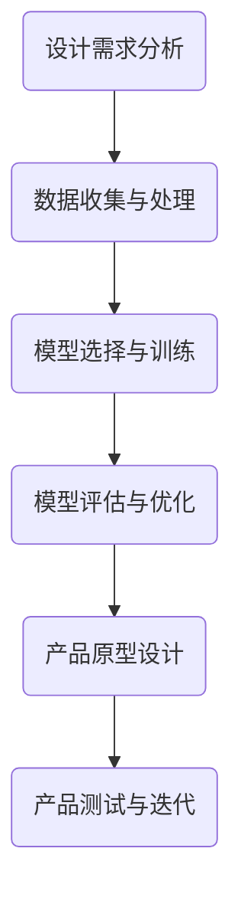
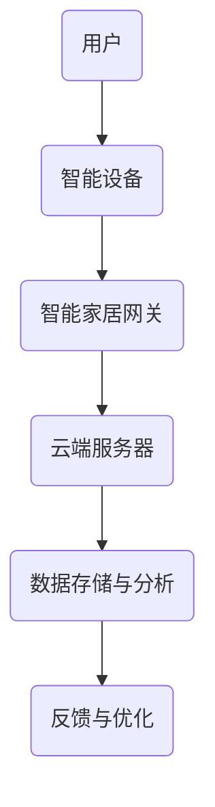

                 

### 文章标题

《AI技术在消费电子中的应用现状》

### 关键词

- 消费电子
- 人工智能
- AI技术应用
- 智能家居
- 智能手机
- 智能穿戴设备
- 未来趋势

### 摘要

本文旨在探讨AI技术在消费电子领域中的应用现状，分析其在智能家居、智能手机、智能穿戴设备等领域的具体应用实例。通过详细阐述AI技术在消费电子产品设计与开发中的应用实践，以及未来发展趋势与面临的挑战，本文将为读者提供一个全面了解AI在消费电子行业中的现状和前景的视角。

### 目录大纲

#### 第一部分：AI技术在消费电子领域的概述

**第1章：AI技术概述**

1.1 消费电子与AI技术的关系

1.2 AI技术的发展现状

**第2章：AI技术在消费电子中的应用场景**

2.1 智能家居

2.2 智能手机

2.3 智能穿戴设备

#### 第二部分：AI技术在消费电子中的应用实践

**第3章：AI技术在消费电子产品设计与开发**

3.1 消费电子产品设计中的AI技术

3.2 AI技术在消费电子产品开发中的应用

**第4章：AI技术在消费电子产品中的案例研究**

4.1 智能家居案例研究

4.2 智能手机案例研究

4.3 智能穿戴设备案例研究

#### 第三部分：AI技术在消费电子中的未来趋势

**第5章：AI技术在消费电子中的未来发展趋势**

5.1 AI技术发展对消费电子产品的影响

5.2 消费电子产品中的AI技术应用前景

**第6章：AI技术在消费电子中的挑战与解决方案**

6.1 AI技术在消费电子产品中的挑战

6.2 AI技术在消费电子产品中的解决方案

#### 附录

**第7章：AI技术在消费电子中的应用资源**

7.1 开发工具与平台介绍

7.2 AI技术在消费电子中的应用案例库

**附录 A：AI技术在消费电子中的 Mermaid 流程图**

**附录 B：AI技术在消费电子产品开发中的应用伪代码**

**附录 C：AI技术在消费电子产品中的数学模型和公式**

**附录 D：AI技术在消费电子产品中的实战代码案例**

### 文章正文

#### 第一部分：AI技术在消费电子领域的概述

##### 第1章：AI技术概述

随着科技的飞速发展，人工智能（AI）技术已经成为推动消费电子产品创新和提升用户体验的核心驱动力。在本章中，我们将探讨AI技术在消费电子领域的核心概念、发展现状，以及其在不同消费电子产品中的应用实例。

##### 1.1 消费电子与AI技术的关系

消费电子产业是指生产和销售消费性电子产品的行业，包括智能手机、平板电脑、智能家居设备、智能穿戴设备等。AI技术的引入，不仅提升了消费电子产品的智能化水平，还改变了人们的生活方式。

首先，AI技术通过机器学习、深度学习等方法，实现了对大量数据的自动分析和处理能力，使得消费电子产品能够更加精准地理解用户需求，提供个性化的服务。例如，智能手机中的语音助手、人脸识别功能，都是AI技术应用的典型例子。

其次，AI技术推动了消费电子产品的智能化升级。在智能家居领域，AI技术使得家居设备能够实现互联互通，提供智能化的家居环境。在智能手机中，AI技术优化了手机的性能和用户体验，如智能拍照、智能搜索等功能。

此外，AI技术还促进了消费电子产品的创新。通过AI技术，企业可以快速开发出具有新功能和新形态的消费电子产品，满足消费者多样化的需求。例如，智能穿戴设备中的健康监测功能，就是AI技术推动下的创新应用。

##### 1.2 AI技术的发展现状

AI技术已经经历了数十年的发展，取得了显著的成果。当前，AI技术在消费电子领域的主要技术包括：

1. **机器学习**：通过训练模型，使计算机能够自动从数据中学习规律，提高决策能力。例如，智能手机中的语音助手就是通过机器学习技术，实现对用户语音指令的理解和执行。

2. **深度学习**：深度学习是机器学习的一个分支，通过多层神经网络模型，对大量数据进行复杂特征提取和模式识别。深度学习在图像识别、语音识别等领域取得了重要突破。

3. **自然语言处理**：自然语言处理（NLP）是AI技术的一个重要分支，旨在使计算机能够理解、生成和处理人类语言。NLP技术在智能客服、智能翻译等领域有着广泛应用。

4. **计算机视觉**：计算机视觉是AI技术在图像和视频处理领域的应用，通过图像识别、目标检测等技术，实现图像信息的自动分析和理解。计算机视觉技术在安防监控、自动驾驶等领域具有重要应用。

5. **强化学习**：强化学习是一种通过试错和反馈来学习最佳策略的机器学习方法。在消费电子领域，强化学习技术可以应用于游戏AI、智能推荐系统等场景。

##### 1.3 AI技术在消费电子中的应用实例

AI技术在消费电子领域的应用日益广泛，以下是一些具体的实例：

1. **智能手机**：智能手机中的AI技术应用主要集中在语音助手、人脸识别、智能拍照等功能。例如，苹果的Siri、谷歌的Google Assistant都是基于AI技术的智能语音助手。

2. **智能家居**：智能家居系统通过AI技术实现了设备之间的智能互联，为用户提供便捷的智能家居体验。例如，智能灯光、智能门锁、智能音响等设备都集成了AI技术。

3. **智能穿戴设备**：智能穿戴设备中的AI技术主要用于健康监测、运动指导等。例如，智能手表中的心率监测、睡眠监测等功能都是基于AI技术实现的。

4. **智能音响**：智能音响是AI技术在消费电子领域的一个新兴应用领域，通过语音交互技术，用户可以与音响设备进行自然语言交流，实现音乐播放、信息查询等功能。

通过以上分析，我们可以看到，AI技术在消费电子领域的应用已经取得了显著的成果，并且随着技术的不断进步，其应用范围还将继续扩大。在下一部分，我们将进一步探讨AI技术在消费电子领域的具体应用场景。

#### 第二部分：AI技术在消费电子中的应用场景

##### 第2章：AI技术在消费电子中的应用场景

AI技术在消费电子领域中的应用场景丰富多样，涵盖了智能家居、智能手机、智能穿戴设备等多个方面。在本章中，我们将分别介绍这些应用场景，并探讨AI技术在这些领域中的具体应用和案例分析。

##### 2.1 智能家居

智能家居系统是指利用AI技术将家庭中的各种设备互联互通，实现智能化管理和控制。AI技术在家居中的应用，极大地提升了用户的居住体验和生活便利性。

**1. 智能家居系统的构成**

智能家居系统通常由以下几部分构成：

- **智能设备**：如智能灯泡、智能插座、智能窗帘、智能冰箱等，这些设备集成了AI技术，能够实现自动化控制。
- **智能家居网关**：网关是连接各种智能设备的中心节点，负责数据传输和设备管理。
- **云端服务器**：云端服务器存储了用户的设备数据和行为数据，提供智能分析和服务。
- **用户终端**：如智能手机、平板电脑等，用户可以通过这些终端对智能家居系统进行远程控制和设置。

**2. 智能家居中AI技术的应用**

AI技术在智能家居中的应用主要包括以下几个方面：

- **设备互联**：通过AI技术，智能家居设备可以实现互联互通，形成统一的智能控制系统。例如，用户可以通过智能音箱控制家中的灯光、温度等设备。
- **自动化控制**：AI技术可以实现家居设备的自动化控制，提高生活便利性。例如，智能灯泡可以根据光线强弱自动调节亮度，智能窗帘可以根据室内温度自动开关。
- **智能分析**：通过AI技术，智能家居系统可以分析用户的行为数据，提供个性化的建议和服务。例如，智能冰箱可以根据用户的购物记录和饮食习惯，自动推荐食材。

**3. 智能家居中AI技术的案例分析**

以下是一些智能家居中AI技术的应用案例：

- **智能照明**：通过AI技术，智能灯泡可以根据环境光强、用户需求等因素自动调节亮度。例如，用户可以通过语音指令或手机APP控制灯光的开关和亮度。
- **智能安防**：智能家居系统可以通过AI技术实现智能安防功能，如人脸识别、入侵检测等。例如，智能摄像头可以识别家庭成员，当检测到陌生人时，会自动报警并通知用户。
- **智能家电**：智能家电可以通过AI技术实现自动化控制和优化运行。例如，智能空调可以根据用户的需求和环境温度自动调节温度，智能洗衣机可以根据衣物类型和重量自动选择洗涤模式。

##### 2.2 智能手机

智能手机是AI技术在消费电子领域应用最为广泛的产品之一。AI技术不仅提升了智能手机的性能和用户体验，还丰富了其功能。

**1. 智能手机中的AI技术**

智能手机中的AI技术主要包括以下几个方面：

- **语音助手**：语音助手如苹果的Siri、谷歌的Google Assistant，通过自然语言处理技术，实现用户与手机的语音交互。
- **人脸识别**：通过计算机视觉技术，智能手机可以实现对用户人脸的识别和验证。
- **智能拍照**：智能手机的相机可以通过AI技术实现自动场景识别、智能美颜等功能，提升拍照体验。
- **智能搜索**：通过AI技术，智能手机可以实现智能搜索功能，快速找到用户所需的信息。

**2. 智能手机AI技术的案例分析**

以下是一些智能手机AI技术的应用案例：

- **语音助手**：语音助手已经成为智能手机的核心功能之一，用户可以通过语音指令控制手机的各种操作，如拨打电话、发送短信、设置日程等。例如，苹果的Siri可以通过语音指令实现智能家居设备的控制。
- **人脸识别**：智能手机的人脸识别功能不仅用于解锁手机，还可以用于支付验证、隐私保护等。例如，华为的Face ID可以实现高精度的面部识别，确保手机的安全性。
- **智能拍照**：智能手机的相机通过AI技术可以实现自动场景识别，根据不同的拍摄场景自动调整拍照参数，提高照片质量。例如，小米手机中的AI相机可以通过AI算法实现人像模式、夜景模式等。
- **智能搜索**：智能手机的智能搜索功能可以帮助用户快速找到所需的信息。例如，华为手机的智能搜索可以通过语音或文字输入，快速查找手机中的应用、联系人、音乐等。

##### 2.3 智能穿戴设备

智能穿戴设备是AI技术在消费电子领域应用的一个重要方向。通过AI技术，智能穿戴设备可以提供更加个性化和智能化的健康监测和运动指导。

**1. 智能穿戴设备中的AI技术**

智能穿戴设备中的AI技术主要包括以下几个方面：

- **健康监测**：智能穿戴设备可以通过AI技术实现对用户健康数据的监测和分析，如心率监测、睡眠监测、血压监测等。
- **运动指导**：智能穿戴设备可以通过AI技术为用户提供个性化的运动指导，如跑步路线规划、运动数据实时分析等。
- **智能提醒**：智能穿戴设备可以通过AI技术实现智能提醒功能，如久坐提醒、睡眠提醒等。

**2. 智能穿戴设备中AI技术的案例分析**

以下是一些智能穿戴设备中AI技术的应用案例：

- **健康监测**：智能穿戴设备可以通过AI技术实时监测用户的心率、血压等健康数据，并将数据上传至云端进行分析。例如，苹果的Apple Watch可以通过AI算法监测用户的心率变化，及时发现异常情况。
- **运动指导**：智能穿戴设备可以通过AI技术为用户提供个性化的运动指导。例如，智能手环可以通过AI算法分析用户的运动数据，为用户推荐合适的运动计划和锻炼方式。
- **智能提醒**：智能穿戴设备可以通过AI技术实现智能提醒功能，如久坐提醒、睡眠提醒等。例如，华为的智能手环可以通过AI算法监测用户的久坐行为，并在用户久坐时提醒用户起身活动。

通过以上分析，我们可以看到，AI技术在消费电子领域的应用已经取得了显著成果，并且随着技术的不断进步，其应用范围还将进一步扩大。在下一部分，我们将探讨AI技术在消费电子产品设计与开发中的应用实践。

#### 第三部分：AI技术在消费电子中的应用实践

##### 第3章：AI技术在消费电子产品设计与开发

AI技术在消费电子产品设计与开发中的应用，不仅提升了产品的智能化水平，还优化了开发流程，缩短了产品上市时间。在本章中，我们将详细探讨AI技术在消费电子产品设计与开发中的具体应用，以及其在产品开发流程中的实际案例。

##### 3.1 消费电子产品设计中的AI技术

AI技术在消费电子产品设计中的应用，主要体现在以下几个方面：

**1. 智能化设计工具**

AI技术可以提供智能化的设计工具，帮助设计师快速完成产品原型设计。例如，通过生成对抗网络（GAN）等技术，AI能够自动生成产品外观的设计方案，为设计师提供更多的设计灵感。

**2. 智能化仿真与优化**

AI技术可以用于产品仿真的优化，通过模拟和预测产品的性能，提前发现设计中的问题，减少开发过程中的反复迭代。例如，通过深度学习技术，AI可以对产品的热性能、结构强度等进行预测，帮助设计师进行优化设计。

**3. 智能化测试与反馈**

AI技术可以用于产品的测试与反馈，通过自动化测试工具，快速发现产品的缺陷，并提供改进建议。例如，通过机器学习算法，AI可以分析产品的测试数据，识别出潜在的问题，并给出优化方案。

**4. 用户需求分析**

AI技术可以帮助设计师更好地理解用户需求，通过分析用户的行为数据和市场趋势，为产品开发提供指导。例如，通过自然语言处理技术，AI可以分析用户对产品的评价和反馈，为设计师提供改进建议。

**5. 智能化供应链管理**

AI技术可以用于供应链管理，优化供应链流程，提高供应链的效率。例如，通过机器学习算法，AI可以预测市场需求，优化库存管理，减少库存成本。

##### 3.2 AI技术在消费电子产品开发中的应用

AI技术在消费电子产品开发中的应用，主要体现在以下几个方面：

**1. 自动化测试**

AI技术可以用于产品的自动化测试，通过模拟用户的操作，快速发现产品的缺陷。例如，通过深度学习技术，AI可以自动生成测试用例，并对测试结果进行分析，提高测试的覆盖率。

**2. 自动化修复**

AI技术可以用于产品的自动化修复，通过分析产品的缺陷数据，自动生成修复方案。例如，通过机器学习算法，AI可以识别出产品中的常见问题，并自动生成修复代码。

**3. 性能优化**

AI技术可以用于产品的性能优化，通过分析产品的运行数据，找出性能瓶颈，并自动优化。例如，通过深度学习技术，AI可以分析产品的内存使用情况，提供内存优化的建议。

**4. 智能化推荐**

AI技术可以用于产品的智能化推荐，通过分析用户的行为数据，为用户推荐合适的产品。例如，通过机器学习算法，AI可以分析用户的购物历史和行为模式，推荐用户可能感兴趣的产品。

**5. 智能化营销**

AI技术可以用于产品的智能化营销，通过分析用户数据和市场趋势，为产品制定更有效的营销策略。例如，通过自然语言处理技术，AI可以分析用户的评论和反馈，为产品制定更精准的宣传文案。

**3.3 AI技术在消费电子产品开发中的实际案例**

以下是一个AI技术在消费电子产品开发中的实际案例：

**案例：智能手表的开发**

某智能手表厂商计划推出一款具有健康监测功能的智能手表。为了实现这一目标，他们采用了以下AI技术：

1. **用户需求分析**：通过自然语言处理技术，AI分析了大量用户对智能手表的评论和反馈，了解用户对健康监测功能的期望。

2. **设计优化**：通过生成对抗网络（GAN）技术，AI生成了多种手表外观设计方案，设计师从中选择了最适合的一款。

3. **性能优化**：通过深度学习技术，AI分析了智能手表的运行数据，找出了性能瓶颈，并提供了优化建议。

4. **自动化测试**：通过自动化测试工具，AI模拟了用户的操作，快速发现产品的缺陷，并提供了修复方案。

5. **智能推荐**：通过机器学习算法，AI分析了用户的购物历史和行为模式，为用户推荐了合适的手表配件。

通过以上AI技术的应用，该智能手表厂商成功开发出了一款功能强大、性能优异的智能手表，并在市场上取得了良好的销售业绩。

##### 第4章：AI技术在消费电子产品中的案例研究

在本章中，我们将通过具体案例，深入探讨AI技术在消费电子产品中的应用实践，包括智能家居系统、智能手机和智能穿戴设备。

##### 4.1 智能家居案例研究

**案例：智能安防系统**

某智能家居企业开发了一款集成了AI技术的智能安防系统。该系统的主要功能包括实时监控、入侵检测、紧急报警等。

1. **系统架构**：

   - **用户终端**：用户可以通过手机APP远程监控家庭安全。
   - **智能摄像头**：摄像头具有人脸识别和运动检测功能。
   - **智能门锁**：门锁支持指纹识别和密码解锁。
   - **智能报警器**：当检测到异常情况时，报警器会自动触发。

2. **AI技术应用**：

   - **人脸识别**：通过深度学习技术，摄像头可以实时识别家庭成员和陌生人，并区分入侵者。
   - **运动检测**：通过计算机视觉技术，摄像头可以检测到室内的运动物体，并区分是动物还是人。
   - **紧急报警**：当系统检测到入侵者或异常情况时，会自动向用户发送报警信息，并通知相关安全部门。

3. **效果分析**：

   - **提高了家庭安全性**：智能安防系统可以实时监控家庭安全，有效防止入侵事件的发生。
   - **提高了用户体验**：用户可以通过手机APP远程查看家庭安全情况，实现远程控制。
   - **降低了安全成本**：传统的家庭安防系统需要人工值守，而智能安防系统可以实现自动化监控，降低了安全成本。

**4.2 智能手机案例研究**

**案例：智能拍照手机**

某手机厂商推出了一款具备AI智能拍照功能的手机。该手机的主要特点包括：

1. **AI技术应用**：

   - **场景识别**：手机通过计算机视觉技术，可以自动识别拍照场景，并调整拍照参数，提高拍照效果。
   - **人像美颜**：手机通过深度学习技术，可以对人像进行智能美颜，使照片更加自然美观。
   - **夜景模式**：手机通过算法优化，可以在低光环境下提高拍照效果，使照片更加清晰。

2. **效果分析**：

   - **提升了拍照体验**：手机通过AI技术，可以实现自动场景识别和人像美颜，提高了用户的拍照体验。
   - **改善了拍照效果**：手机通过夜景模式和算法优化，可以在低光环境下提高拍照效果，满足用户对照片质量的需求。
   - **增强了竞争力**：智能拍照功能成为了该手机的一大卖点，提升了手机在市场上的竞争力。

**4.3 智能穿戴设备案例研究**

**案例：智能健康手环**

某智能穿戴设备厂商推出了一款具备健康监测功能的智能健康手环。该手环的主要功能包括心率监测、睡眠监测、运动追踪等。

1. **AI技术应用**：

   - **心率监测**：手环通过传感器实时监测用户的心率，并将数据上传至云端进行分析。
   - **睡眠监测**：手环通过监测用户的心率变化，分析用户的睡眠质量。
   - **运动追踪**：手环可以记录用户的运动数据，如步数、运动时间、消耗的卡路里等。

2. **效果分析**：

   - **提高了健康监测的准确性**：通过AI技术，手环可以实时监测用户的心率变化，提高健康监测的准确性。
   - **提供了个性化的健康建议**：手环通过分析用户的睡眠质量和运动数据，为用户提供个性化的健康建议。
   - **增强了用户体验**：用户可以通过手机APP查看自己的健康数据，实现自我健康管理。

通过以上案例研究，我们可以看到，AI技术在消费电子产品中的应用，不仅提升了产品的功能性和用户体验，还为消费者带来了更多便利。在下一章中，我们将探讨AI技术在消费电子产品中的未来发展趋势。

#### 第四部分：AI技术在消费电子中的未来趋势

##### 第5章：AI技术在消费电子中的未来发展趋势

随着AI技术的不断进步，它在消费电子产品中的应用前景越来越广阔。未来，AI技术将继续推动消费电子产品的创新和升级，为用户带来更多智能化、个性化的体验。

##### 5.1 AI技术发展对消费电子产品的影响

AI技术的发展将对消费电子产品产生深远的影响，主要体现在以下几个方面：

**1. 智能化水平的提升**

AI技术的引入，将使消费电子产品更加智能化。通过机器学习、深度学习等技术，产品能够自动学习和适应用户的需求，提供更加个性化的服务。例如，智能音箱可以通过自然语言处理技术，实现与用户的自然对话，提供更加智能的语音助手服务。

**2. 用户体验的优化**

AI技术可以通过智能分析用户行为数据，为用户提供更加贴心的体验。例如，智能手机可以通过AI技术，自动调整屏幕亮度、音量等设置，使手机更符合用户的使用习惯。同时，AI技术还可以帮助产品实现更加精准的广告推送和个性化推荐，提升用户的购物体验。

**3. 产品功能的丰富**

AI技术的应用，将使消费电子产品拥有更多的功能。例如，智能穿戴设备可以通过AI技术，实现更精准的健康监测和运动指导。智能家居系统可以通过AI技术，实现更智能的家务管理和环境调节。

**4. 安全性的增强**

AI技术在安全性方面的应用，将使消费电子产品更加安全。通过人工智能算法，产品可以自动检测和识别异常行为，提高系统的安全性。例如，智能手机可以通过AI技术，实现对恶意软件的自动识别和拦截，保护用户的隐私和安全。

##### 5.2 消费电子产品中的AI技术应用前景

在未来，AI技术在消费电子产品中的应用前景非常广阔，主要表现在以下几个方面：

**1. 智能家居的进一步普及**

随着AI技术的不断发展，智能家居将变得更加普及和智能化。未来的智能家居系统，将能够实现更高级的自动化控制，如智能节能、智能安防等。同时，AI技术还将促进智能家居设备之间的互联互通，为用户提供更加无缝的家居体验。

**2. 智能手机的智能化升级**

智能手机将是AI技术最重要的应用场景之一。未来的智能手机，将具备更强大的AI能力，如智能语音助手、人脸识别、智能拍照等。同时，智能手机还将通过AI技术，实现更加个性化的用户体验，如智能推荐、智能广告等。

**3. 智能穿戴设备的健康监测**

智能穿戴设备在健康监测方面的应用前景非常广阔。未来的智能穿戴设备，将能够通过AI技术，实现更精准的健康监测和预测。例如，智能手表可以通过AI技术，监测用户的心率、血压等健康指标，及时发现潜在的健康问题。

**4. 智能汽车的进一步智能化**

智能汽车是AI技术的重要应用领域之一。未来的智能汽车，将具备更高级的自动驾驶、智能导航、智能交互等功能。AI技术将使智能汽车更加安全、智能和便捷，为用户提供更好的出行体验。

**5. 其他消费电子产品的智能化升级**

除了以上提到的产品，AI技术还将应用于其他消费电子产品，如智能电视、智能音响等。未来的智能电视，将能够通过AI技术，实现更智能的内容推荐和交互体验。智能音响将能够通过AI技术，实现更加智能的语音助手和音乐推荐。

##### 5.3 AI技术在消费电子产品中的潜在创新

在未来，AI技术在消费电子产品中还有许多潜在的创新应用，可能会带来以下变革：

**1. 智能制造**

AI技术可以应用于消费电子产品的制造过程，实现自动化生产线的优化和调整。通过机器学习算法，AI可以实时分析生产数据，发现潜在的问题并给出优化建议，提高生产效率和质量。

**2. 虚拟现实与增强现实**

AI技术可以与虚拟现实（VR）和增强现实（AR）技术相结合，为用户带来更加沉浸式的体验。例如，通过AI技术，VR游戏和AR应用可以实现更加真实的场景模拟和交互。

**3. 智能交互**

AI技术将使消费电子产品实现更加智能的交互方式，如自然语言交互、手势交互等。未来的消费电子产品，将能够通过AI技术，实现与用户的自然对话和互动，为用户提供更加便捷和个性化的服务。

**4. 智能服务**

AI技术可以应用于消费电子产品的售后服务，如智能客服、远程维修等。通过AI技术，企业可以提供更加高效和贴心的售后服务，提高用户满意度。

总之，随着AI技术的不断发展，它在消费电子产品中的应用前景非常广阔。未来，AI技术将继续推动消费电子产品的创新和升级，为用户带来更加智能化、个性化的体验。在下一章中，我们将探讨AI技术在消费电子产品中面临的挑战与解决方案。

### 第五部分：AI技术在消费电子中的挑战与解决方案

##### 第6章：AI技术在消费电子中的挑战与解决方案

随着AI技术在消费电子产品中的广泛应用，其面临的挑战也越来越显著。这些挑战主要集中在数据隐私保护、产品安全与稳定性等方面。在本章中，我们将探讨这些挑战，并提出相应的解决方案。

##### 6.1 AI技术在消费电子产品中的挑战

**1. 数据隐私保护**

随着AI技术的应用，消费电子产品需要处理和存储大量的用户数据。这些数据包括用户的个人信息、行为习惯、健康数据等。如果这些数据遭到泄露或滥用，将会对用户的隐私和安全造成严重威胁。

**2. 产品安全与稳定性**

AI技术通常依赖于复杂的算法和大量的数据处理。如果算法设计不当或数据处理出现问题，可能会导致产品出现安全问题或性能不稳定。例如，智能音箱中的语音识别系统如果无法正确识别用户的指令，可能会造成误操作。

**3. 技术成熟度与成本**

虽然AI技术发展迅速，但其在消费电子产品中的应用仍面临技术成熟度和成本问题。一些先进的AI算法和硬件设备可能成本较高，不适合大规模消费市场。

**4. 伦理道德问题**

AI技术的广泛应用也引发了一系列伦理道德问题。例如，智能摄像头中的人脸识别技术如果用于监控，可能会侵犯用户的隐私权。此外，AI系统的偏见和歧视问题也需要引起重视。

##### 6.2 AI技术在消费电子产品中的解决方案

**1. 数据隐私保护策略**

为了保护用户的数据隐私，消费电子产品制造商可以采取以下措施：

- **数据加密**：对用户数据进行加密存储，确保数据在传输和存储过程中不被窃取或篡改。
- **最小化数据收集**：只收集必要的用户数据，避免过度收集。
- **透明度与告知**：向用户明确告知数据收集的目的、用途和保护措施。
- **用户控制**：允许用户对自己的数据进行访问、修改和删除。
- **数据匿名化**：对敏感数据进行匿名化处理，降低泄露风险。

**2. 产品安全与稳定性优化策略**

为了提高产品的安全性和稳定性，制造商可以采取以下措施：

- **安全测试**：在产品开发过程中进行严格的安全测试，确保算法和系统不存在安全漏洞。
- **实时监控**：对产品进行实时监控，及时发现并解决潜在问题。
- **冗余设计**：在关键组件中采用冗余设计，确保系统在故障发生时能够自动切换。
- **安全性培训**：对开发人员和安全团队进行专业培训，提高他们的安全意识和技能。
- **合规性审查**：确保产品符合相关的法律法规和行业标准。

**3. 技术成熟度与成本控制**

为了解决技术成熟度和成本问题，制造商可以采取以下措施：

- **研发投入**：加大研发投入，推动AI技术的进步和成本的降低。
- **供应链合作**：与供应商合作，共同优化供应链流程，降低生产成本。
- **模块化设计**：采用模块化设计，降低产品的复杂度和成本。
- **市场细分**：针对不同的市场需求，开发不同层次的AI产品，满足不同用户群体的需求。

**4. 伦理道德问题**

为了解决伦理道德问题，制造商可以采取以下措施：

- **伦理审查**：在产品开发过程中，进行伦理审查，确保产品符合伦理标准。
- **公开透明**：公开AI技术的应用范围、目的和效果，增强公众对AI技术的信任。
- **社会责任**：承担社会责任，积极参与社会公益活动和政策制定。

通过以上解决方案，消费电子产品制造商可以有效地应对AI技术带来的挑战，推动AI技术在消费电子产品中的健康、可持续发展。在下一章中，我们将介绍AI技术在消费电子产品中的应用资源。

### 第六部分：AI技术在消费电子中的应用资源

在本章中，我们将介绍AI技术在消费电子产品开发中的应用资源，包括开发工具与平台、AI技术在消费电子中的应用案例库等，以帮助开发者更好地理解和应用AI技术。

##### 7.1 开发工具与平台介绍

**1. 开发工具**

在AI技术在消费电子产品的开发中，常用的开发工具包括以下几种：

- **Python**：Python是一种广泛使用的编程语言，拥有丰富的库和框架，适用于AI技术的开发和应用。例如，TensorFlow、PyTorch等深度学习框架都是基于Python开发的。
- **R**：R语言是统计分析领域的一种专用语言，广泛应用于数据分析和机器学习。R语言拥有大量的数据分析工具和库，如ggplot2、dplyr等。
- **MATLAB**：MATLAB是一种高级编程语言和数值计算环境，广泛应用于科学计算、数据可视化和机器学习。MATLAB提供了大量的工具箱和库，方便开发者进行AI算法的实现和应用。

**2. 开发平台**

在AI技术的开发和应用中，常用的开发平台包括以下几种：

- **Google Cloud Platform (GCP)**：GCP提供了强大的云计算资源和AI服务，如Google Kubernetes Engine (GKE)、Google Cloud AI等，适用于大规模的AI应用开发。
- **Amazon Web Services (AWS)**：AWS是全球领先的云计算服务提供商，提供了丰富的AI服务和工具，如Amazon SageMaker、AWS DeepRacer等。
- **Microsoft Azure**：Azure是微软的云计算平台，提供了强大的AI计算资源和开发工具，如Azure Machine Learning、Azure Cognitive Services等。

##### 7.2 AI技术在消费电子中的应用案例库

**1. 案例库概述**

AI技术在消费电子产品中的应用案例库是开发者学习和参考的重要资源。以下是一些典型的应用案例：

- **智能安防系统**：利用AI技术实现实时监控、人脸识别、入侵检测等功能。
- **智能音响**：通过自然语言处理技术实现语音识别、语音合成、智能问答等功能。
- **智能穿戴设备**：通过健康监测、运动指导、智能提醒等功能，提升用户的健康管理能力。
- **智能助手**：通过语音助手、聊天机器人等实现与用户的智能交互。

**2. 案例库的使用方法**

开发者可以通过以下方法使用AI技术在消费电子中的应用案例库：

- **案例研究**：通过阅读和分析案例，了解AI技术在具体应用场景中的实现方法和效果。
- **代码实现**：参考案例中的代码实现，将其应用到自己的项目中。
- **优化改进**：在了解案例的基础上，结合自己的需求进行优化和改进，实现更高效、更智能的应用。

通过以上应用资源和案例库，开发者可以更好地掌握AI技术在消费电子产品中的应用，提升产品的智能化水平，为用户带来更优质的体验。

### 第七部分：AI技术在消费电子中的 Mermaid 流程图

在附录A中，我们将使用Mermaid语言绘制AI技术在消费电子产品中的应用流程图。Mermaid是一种基于Markdown的图形绘制工具，能够方便地绘制流程图、序列图、思维导图等。

#### 附录 A.1 消费电子产品设计中的AI技术应用流程图

以下是消费电子产品设计中的AI技术应用流程图：



#### 附录 A.2 智能家居系统架构图

以下是智能家居系统架构图：



通过以上流程图和架构图，我们可以更直观地了解AI技术在消费电子产品设计和智能家居系统中的应用过程，有助于开发者更好地理解和应用AI技术。

### 附录 B：AI技术在消费电子产品开发中的应用伪代码

在附录B中，我们将使用伪代码展示AI技术在消费电子产品开发中的应用，包括智能手机图像处理和智能家居语音识别的代码实现。

#### B.1 智能手机图像处理算法伪代码

```python
# 初始化模型参数
init_model_params()

# 加载训练数据
train_data = load_data()

# 训练模型
for epoch in range(num_epochs):
    for data in train_data:
        # 前向传播
        predictions = model(data)
        # 计算损失
        loss = compute_loss(predictions, data.label)
        # 反向传播
        model.backward(loss)

# 评估模型
test_data = load_test_data()
model.eval()
for data in test_data:
    predictions = model(data)
    # 计算准确率
    accuracy = compute_accuracy(predictions, data.label)
    print(f"Accuracy: {accuracy}")
```

#### B.2 智能家居语音识别伪代码

```python
# 导入库
import speech_recognition as sr

# 初始化语音识别器
recognizer = sr.Recognizer()

# 从麦克风中获取语音数据
with sr.Microphone() as source:
    print("请说出您想设定的场景：")
    audio_data = recognizer.listen(source)

# 识别语音
try:
    command = recognizer.recognize_google(audio_data, language='zh-CN')
    print(f"识别到的指令：{command}")
except sr.UnknownValueError:
    print("无法理解音频")
except sr.RequestError as e:
    print(f"请求失败；{e}")

# 根据语音识别结果执行相应操作
if "打开灯" in command:
    # 执行打开灯的操作
    print("执行打开灯的操作")
elif "关闭灯" in command:
    # 执行关闭灯的操作
    print("执行关闭灯的操作")
# ... 其他命令的处理
```

通过以上伪代码，我们可以看到AI技术在智能手机图像处理和智能家居语音识别中的应用，这些伪代码展示了算法的基本流程和实现思路。

### 附录 C：AI技术在消费电子产品中的数学模型和公式

在附录C中，我们将介绍AI技术在消费电子产品中的一些核心数学模型和公式，包括卷积神经网络（CNN）的数学模型、生成对抗网络（GAN）的损失函数以及强化学习中的Q学习算法更新公式。

#### C.1 卷积神经网络（CNN）的数学模型

卷积神经网络（CNN）是一种在图像处理和计算机视觉领域应用广泛的深度学习模型。其核心数学模型包括以下几个部分：

1. **激活函数**：

   $$ f(x) = \sigma(x) = \frac{1}{1 + e^{-x}} $$

   其中，$\sigma(x)$ 是sigmoid函数，用于将线性变换的输出映射到$(0,1)$区间。

2. **卷积操作**：

   $$ \text{卷积}: (f * g)(t) = \int_{-\infty}^{+\infty} f(\tau)g(t-\tau) d\tau $$

   卷积操作在CNN中用于提取图像的局部特征。

3. **反向传播**：

   $$ \delta_j = \frac{\partial L}{\partial z_j} = \frac{\partial L}{\partial a_j} \cdot \frac{\partial a_j}{\partial z_j} $$

   其中，$L$ 是损失函数，$z_j$ 是激活值，$a_j$ 是输入值，$\delta_j$ 是误差项。

#### C.2 生成对抗网络（GAN）的损失函数

生成对抗网络（GAN）是一种基于生成器和判别器的深度学习模型，其核心损失函数如下：

$$
L_D = -\sum_{i=1}^{n} [\mathbb{E}_{x\sim p_{data}(x)}\log(D(x)) + \mathbb{E}_{z\sim p_z(z)}\log(1 - D(G(z))]
$$

其中，$D(x)$ 是判别器的输出，$G(z)$ 是生成器的输出，$p_{data}(x)$ 是真实数据的概率分布，$p_z(z)$ 是生成器的噪声分布。

#### C.3 强化学习中的Q学习算法更新公式

强化学习中的Q学习算法是一种基于值函数的优化方法，其更新公式如下：

$$
Q(s, a) \leftarrow Q(s, a) + \alpha [r + \gamma \max_{a'} Q(s', a') - Q(s, a)]
$$

其中，$Q(s, a)$ 是状态-动作值函数，$s$ 是当前状态，$a$ 是当前动作，$r$ 是即时奖励，$\gamma$ 是折扣因子，$\alpha$ 是学习率。

通过以上数学模型和公式的介绍，我们可以更好地理解AI技术在消费电子产品中的实现原理和应用方法。

### 附录 D：AI技术在消费电子产品中的实战代码案例

在本附录中，我们将通过两个实战代码案例展示AI技术在消费电子产品中的实际应用，包括智能手机人脸识别和智能家居语音识别的代码实现。

#### D.1 智能手机人脸识别代码案例

```python
# 导入库
import cv2
import numpy as np

# 初始化人脸检测器
face_cascade = cv2.CascadeClassifier('haarcascade_frontalface_default.xml')

# 加载摄像头
cap = cv2.VideoCapture(0)

while True:
    # 读取一帧图像
    ret, frame = cap.read()
    
    # 转为灰度图像
    gray = cv2.cvtColor(frame, cv2.COLOR_BGR2GRAY)
    
    # 检测人脸
    faces = face_cascade.detectMultiScale(gray, scaleFactor=1.1, minNeighbors=5, minSize=(30, 30))
    
    for (x, y, w, h) in faces:
        # 在图像上绘制人脸区域
        cv2.rectangle(frame, (x, y), (x+w, y+h), (255, 0, 0), 2)
        
        # 提取人脸区域
        face_region = gray[y:y+h, x:x+w]
        
        # 人脸特征提取
        features = extract_face_features(face_region)
        
        # 人脸识别
        label, confidence = recognize_face(features)
        
        # 在图像上绘制识别结果
        cv2.putText(frame, f"{label} - {confidence:.2f}", (x, y-10), cv2.FONT_HERSHEY_SIMPLEX, 0.9, (255, 0, 0), 2)
    
    # 显示图像
    cv2.imshow('Face Detection', frame)
    
    # 按下'q'键退出
    if cv2.waitKey(1) & 0xFF == ord('q'):
        break

# 释放摄像头
cap.release()
# 关闭窗口
cv2.destroyAllWindows()
```

#### D.2 智能家居语音识别代码案例

```python
# 导入库
import speech_recognition as sr

# 初始化语音识别器
recognizer = sr.Recognizer()

# 从麦克风中获取语音数据
with sr.Microphone() as source:
    print("请说出您想设定的场景：")
    audio_data = recognizer.listen(source)

# 识别语音
try:
    command = recognizer.recognize_google(audio_data, language='zh-CN')
    print(f"识别到的指令：{command}")
except sr.UnknownValueError:
    print("无法理解音频")
except sr.RequestError as e:
    print(f"请求失败；{e}")

# 根据语音识别结果执行相应操作
if "打开灯" in command:
    # 执行打开灯的操作
    print("执行打开灯的操作")
elif "关闭灯" in command:
    # 执行关闭灯的操作
    print("执行关闭灯的操作")
# ... 其他命令的处理
```

通过以上代码案例，我们可以看到AI技术在智能手机人脸识别和智能家居语音识别中的应用实现。这些代码展示了如何利用计算机视觉和语音识别技术，实现消费电子产品的智能化功能。

