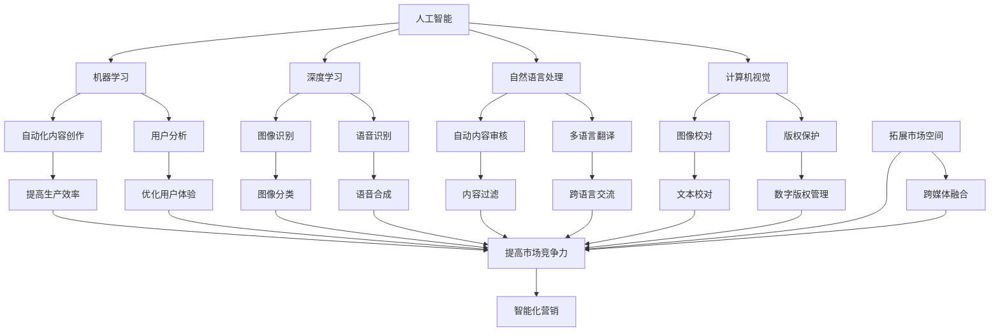

                 

# 《AI时代的出版业展望：更丰富的场景，更强大的技术》

## 关键词
- 人工智能
- 出版业
- 自然语言处理
- 机器学习
- 数字版权
- 用户分析

## 摘要
在AI技术的推动下，出版业正经历一场深刻的变革。本文将探讨AI技术在出版业中的应用场景和潜在影响，从编辑、发行、版权保护等多个方面分析AI如何提升出版效率，优化用户体验，以及面临的挑战和未来发展方向。

## 引言

### 1.1 AI时代的背景

在过去的几十年中，人工智能（AI）从理论研究走向实际应用，逐渐改变了我们的生活和工作方式。从简单的自动化任务到复杂的决策支持系统，AI技术的不断进步正在引领我们进入一个智能化时代。在这样的大背景下，出版业也面临着前所未有的机遇和挑战。

### 1.2 出版业的现状与挑战

出版业作为文化传承和创新的重要载体，一直以来在传统与现代的夹缝中生存。随着数字化进程的加快，出版业经历了从纸质到电子书的转型。然而，传统的出版模式在信息爆炸的时代显得力不从心，面临着内容泛滥、版权纠纷、用户获取难等挑战。如何利用AI技术解决这些问题，成为出版业亟待解决的课题。

### 1.3 本书结构安排

本文将分为以下几个部分：

1. AI与出版业概述
2. AI技术在出版业的应用
3. 出版业的AI技术发展展望
4. AI技术对出版业的影响
5. 出版业AI技术应用案例
6. 未来展望与挑战

通过以上章节，我们将对AI技术在出版业的现状、应用、影响及未来展望进行详细探讨。

## 第1章 AI与出版业概述

### 1.1 AI的基本概念与原理

#### 1.1.1 人工智能的定义

人工智能（Artificial Intelligence，简称AI）是指由人制造出来的系统能够模拟、延伸和扩展人类智能的理论、方法、技术及应用。AI的核心目标是使计算机系统具备类似人类的感知、推理、学习和决策能力。

#### 1.1.2 人工智能的发展历程

人工智能的发展可以分为以下几个阶段：

1. **探索期（1950-1969）**：人工智能概念提出，首个人工智能程序诞生。
2. **低谷期（1970-1980）**：由于技术限制，人工智能发展陷入低谷。
3. **复苏期（1980-1990）**：专家系统和机器学习开始崭露头角。
4. **繁荣期（1990至今）**：随着计算机性能的提升和大数据的积累，人工智能迎来了新的发展机遇。

#### 1.1.3 AI的核心技术

人工智能的核心技术包括：

1. **机器学习**：通过训练模型，使计算机能够从数据中学习并做出预测。
2. **深度学习**：基于人工神经网络，通过多层抽象表示实现复杂任务的求解。
3. **自然语言处理**：使计算机能够理解和生成自然语言。
4. **计算机视觉**：使计算机能够理解和解释视觉信息。

### 1.2 出版业的定义与分类

#### 1.2.1 出版业的定义

出版业是指以出版物为对象，从事编辑、复制、印刷、发行等活动的行业。出版物包括图书、报纸、期刊、音像制品等。

#### 1.2.2 出版业的分类

1. **按出版内容分类**：可分为科技出版、文艺出版、教育出版等。
2. **按出版形式分类**：可分为纸质出版、电子出版、网络出版等。

#### 1.2.3 出版业的产业链

出版业的产业链包括以下环节：

1. **内容创作**：包括作者创作、编辑加工等。
2. **内容复制**：包括排版、印刷、数字化处理等。
3. **内容发行**：包括实体书店销售、在线书店销售等。
4. **内容传播**：包括广告宣传、市场营销等。

### 1.3 出版业的发展现状

当前，出版业正面临数字化转型的挑战。随着互联网和电子技术的发展，电子书、网络出版等新型出版形式逐渐崛起，对传统出版业形成强烈冲击。同时，随着人工智能技术的应用，出版业的生产、发行、营销等环节正在发生深刻变革。

### 1.4 出版业面临的挑战

1. **内容同质化**：随着内容的泛滥，优质内容的创作和筛选变得越来越困难。
2. **版权纠纷**：数字化环境下，版权保护和维权变得更加复杂。
3. **用户获取**：在信息爆炸的时代，如何吸引和留住用户成为一大挑战。
4. **技术更新**：随着新技术的不断涌现，出版业需要不断进行技术升级以适应市场需求。

### 1.5 AI技术在出版业的潜在应用

1. **内容创作与编辑**：利用自然语言处理技术，实现自动化内容创作和编辑。
2. **版权保护**：利用数字版权管理技术，实现高效版权保护。
3. **用户分析**：利用大数据和机器学习技术，实现精准用户画像和个性化推荐。
4. **营销推广**：利用人工智能技术，实现智能化营销和推广。

## 第2章 AI技术在出版业的应用

### 2.1 AI技术在编辑领域的应用

#### 2.1.1 自然语言处理

自然语言处理（Natural Language Processing，简称NLP）是人工智能的一个重要分支，旨在使计算机能够理解、生成和处理自然语言。在出版业中，NLP技术可以应用于以下几个方面：

1. **自动内容生成**：利用NLP技术，可以自动化生成新闻文章、报告等，提高内容生产效率。
2. **文本编辑与润色**：利用NLP技术，可以对文本进行自动修改和润色，提升内容质量。
3. **语义分析**：通过语义分析，可以更深入地理解文本内容，为编辑提供决策支持。

#### 2.1.2 机器翻译

机器翻译（Machine Translation，简称MT）是NLP技术的一个子领域，旨在实现不同语言之间的自动翻译。在出版业中，机器翻译技术可以应用于以下几个方面：

1. **多语言出版**：利用机器翻译技术，可以将内容快速翻译成多种语言，扩大出版物的受众范围。
2. **版权合作**：通过机器翻译，可以促进不同国家和地区之间的版权合作，提高出版效率。
3. **用户互动**：通过多语言支持，可以更好地与全球用户进行互动和交流。

#### 2.1.3 内容审核

内容审核（Content Moderation）是确保出版物内容合法、合规的重要手段。在AI技术的支持下，内容审核可以更加高效和准确。

1. **自动分类**：利用AI技术，可以自动对内容进行分类，识别出可能存在问题的内容。
2. **情感分析**：通过情感分析，可以识别出内容中的情感倾向，为审核提供依据。
3. **违规检测**：利用深度学习等技术，可以自动检测出违规内容，提高审核效率。

### 2.2 AI技术在发行领域的应用

#### 2.2.1 电子书发行

电子书（E-Book）是数字化出版的一种重要形式。AI技术可以应用于电子书发行的各个环节：

1. **个性化推荐**：通过用户行为分析和兴趣模型，为用户推荐个性化的电子书。
2. **版权管理**：利用数字版权管理（DRM）技术，保护电子书的版权，防止未经授权的复制和传播。
3. **智能定价**：通过分析市场数据和用户行为，智能调整电子书的价格，提高销售收益。

#### 2.2.2 社交媒体营销

社交媒体是出版业进行营销推广的重要渠道。AI技术可以应用于以下几个方面：

1. **受众分析**：通过分析社交媒体数据，了解受众特征和需求，制定针对性的营销策略。
2. **内容优化**：利用自然语言处理技术，对社交媒体内容进行优化，提高用户互动和传播效果。
3. **广告投放**：通过大数据分析和机器学习算法，精准投放广告，提高广告效果和转化率。

#### 2.2.3 用户数据分析

用户数据分析是出版业了解用户需求、优化服务的重要手段。AI技术可以应用于以下几个方面：

1. **用户画像**：通过分析用户行为数据，构建用户画像，为个性化服务和推荐提供依据。
2. **需求预测**：利用机器学习算法，预测用户未来的需求和行为，为内容创作和发行提供指导。
3. **用户体验优化**：通过分析用户反馈和行为数据，不断优化用户体验，提高用户满意度。

### 2.3 AI技术在版权保护领域的应用

#### 2.3.1 数字版权管理

数字版权管理（Digital Rights Management，简称DRM）是一种保护数字内容版权的技术手段。AI技术可以应用于以下几个方面：

1. **版权识别**：通过图像识别、文本识别等技术，自动识别和标记版权内容。
2. **版权保护**：利用加密技术，防止未经授权的复制和传播。
3. **版权维权**：通过大数据分析和机器学习算法，识别侵权行为，为版权维权提供依据。

#### 2.3.2 技术手段与法律框架

数字版权保护不仅需要技术手段，还需要完善的法律框架。AI技术可以应用于以下几个方面：

1. **法律法规识别**：通过文本分析技术，自动识别和解读相关法律法规。
2. **版权纠纷处理**：利用人工智能技术，自动化处理版权纠纷，提高司法效率。
3. **法律咨询**：为出版企业提供专业的法律咨询和解决方案，帮助其合规运营。

## 第3章 出版业的AI技术发展展望

### 3.1 出版业AI技术发展趋势

#### 3.1.1 人工智能技术发展现状

当前，人工智能技术已取得了显著进展，尤其在深度学习、自然语言处理、计算机视觉等领域。这些技术的发展为出版业的AI应用提供了强大的技术支撑。

#### 3.1.2 出版业AI技术发展潜力

随着AI技术的不断进步，其在出版业的应用前景也十分广阔。例如，自动化内容创作和编辑、个性化推荐、智能定价、版权保护等，都有望在未来得到广泛应用。

#### 3.1.3 未来发展方向

未来，出版业AI技术的发展将朝着以下几个方向前进：

1. **智能化内容创作**：通过深度学习和自然语言处理技术，实现更高质量、更丰富的内容创作。
2. **个性化服务**：利用大数据和机器学习技术，为用户提供更加个性化的阅读体验。
3. **版权智能管理**：通过数字版权管理和智能维权技术，提高版权保护和维权的效率。
4. **跨媒体融合**：利用AI技术，实现不同媒体形式之间的无缝融合，拓展出版物的传播渠道。

### 3.2 出版业AI技术的挑战与应对策略

#### 3.2.1 技术挑战

1. **数据处理能力**：AI技术对数据处理能力要求较高，需要大量计算资源和存储空间。
2. **算法可靠性**：算法的可靠性和稳定性是AI技术在出版业应用的关键，需要不断优化和验证。
3. **隐私保护**：在利用用户数据时，需要妥善处理用户隐私保护问题。

#### 3.2.2 法律与伦理挑战

1. **版权保护**：在数字化环境下，版权保护变得更加复杂，需要完善的法律框架和监管机制。
2. **数据安全**：在处理用户数据时，需要确保数据安全，防止数据泄露和滥用。
3. **伦理道德**：在利用AI技术时，需要遵守伦理道德规范，确保技术的应用不损害用户的权益。

#### 3.2.3 应对策略与建议

1. **加强技术研发**：加大投入，推动AI技术在出版业的应用研究。
2. **完善法律法规**：完善相关法律法规，为AI技术在出版业的应用提供法律保障。
3. **加强人才培养**：培养具备AI技术和出版业背景的专业人才，推动AI技术在出版业的创新应用。

## 第4章 AI技术对出版业的影响

### 4.1 AI技术对出版业务流程的影响

#### 4.1.1 生产流程

AI技术对出版业的生产流程产生了深远的影响。通过自然语言处理和机器学习技术，可以实现自动化内容创作和编辑，提高生产效率。例如，AI可以自动生成新闻报道、摘要、评论等，减少人工干预，降低生产成本。

#### 4.1.2 发行流程

在发行流程中，AI技术同样发挥了重要作用。利用AI技术，可以实现智能化推荐系统，根据用户兴趣和行为，精准推荐书籍、文章等，提高用户满意度。同时，AI技术还可以优化物流和配送流程，提高发行效率。

#### 4.1.3 宣传与推广流程

AI技术在宣传与推广流程中的应用也越来越广泛。通过大数据分析和机器学习技术，可以精准定位目标用户，制定有针对性的宣传策略。例如，通过社交媒体营销、电子邮件推广等，实现更有效的宣传和推广。

### 4.2 AI技术对出版产业链的影响

AI技术的应用不仅改变了出版业务流程，还对出版产业链产生了深远影响。

#### 4.2.1 传统出版商的转型

面对AI技术的冲击，传统出版商需要积极转型，以适应新的市场环境。例如，通过引入AI技术，实现内容创作、编辑、发行等环节的智能化，提高运营效率，降低成本。

#### 4.2.2 新兴出版商的崛起

AI技术的发展为新兴出版商提供了巨大的机遇。借助AI技术，新兴出版商可以快速进入市场，实现低成本、高效率的内容生产和发行。例如，通过自动化内容生成和智能推荐系统，新兴出版商可以迅速吸引和留住用户。

#### 4.2.3 产业链重构

AI技术的应用使得出版产业链逐渐从传统模式向智能化、数字化的方向发展。产业链上下游企业之间的合作方式也发生了变化，传统边界逐渐模糊。例如，内容创作者、技术提供商、平台运营商等，通过合作实现资源共享，提高整体效率。

### 4.3 AI技术对出版业的影响分析

#### 4.3.1 提高生产效率

AI技术的应用可以大大提高出版业的生产效率。通过自动化内容创作和编辑，减少人工干预，降低生产成本。同时，AI技术还可以优化生产流程，实现生产过程的智能化和精细化。

#### 4.3.2 优化用户体验

AI技术的应用可以更好地满足用户需求，优化用户体验。通过个性化推荐系统，为用户提供个性化的阅读体验。同时，AI技术还可以通过情感分析等技术，了解用户情感，提供更有针对性的服务。

#### 4.3.3 提升版权保护水平

AI技术在版权保护领域的应用可以大大提升版权保护水平。通过数字版权管理和智能维权技术，可以高效地保护版权，防止侵权行为。同时，AI技术还可以通过大数据分析，识别潜在的侵权风险，提前采取防范措施。

#### 4.3.4 拓展市场空间

AI技术的应用可以拓展出版业的市场空间。通过多语言翻译、跨媒体融合等技术，可以将出版物推广到更广泛的受众群体。同时，AI技术还可以通过智能定价、精准营销等手段，提高市场竞争力，扩大市场份额。

### 4.4 AI技术对出版业的长远影响

#### 4.4.1 产业升级

AI技术的应用将推动出版业的产业升级。通过智能化、数字化的转型，出版业将实现更高效率、更高质量的内容生产和发行。同时，产业链上下游企业的合作方式也将发生变革，推动整个产业的升级和优化。

#### 4.4.2 模式创新

AI技术的应用将带来出版模式的创新。通过自动化内容创作、个性化推荐、智能定价等技术，出版业将实现更灵活、更高效的内容生产和发行模式。同时，AI技术还可以为出版业带来新的商业模式，拓展产业发展空间。

#### 4.4.3 社会文化影响

AI技术的应用将对出版业产生深远的社会文化影响。通过智能化的内容创作和推荐，将更好地满足人们的文化需求，促进文化多样性和创新。同时，AI技术还可以通过数字版权管理和智能维权技术，维护文化创作者的权益，促进文化产业的健康发展。

## 第5章 出版业AI技术应用案例

### 5.1 案例一：某大型出版集团的AI技术应用

#### 5.1.1 应用背景

某大型出版集团在面对数字化转型的挑战时，决定引入AI技术，提升内容创作、编辑、发行等环节的效率。

#### 5.1.2 技术方案

1. **内容创作**：引入自然语言处理技术，实现自动化内容生成和编辑。通过大量数据训练模型，生成高质量的文章、新闻等。
2. **版权保护**：采用数字版权管理技术，实现对电子书的版权保护。通过加密和数字签名等技术，防止未经授权的复制和传播。
3. **用户分析**：利用大数据和机器学习技术，对用户行为进行深入分析，构建用户画像，实现个性化推荐。
4. **营销推广**：通过社交媒体营销和电子邮件推广，利用AI技术进行精准营销，提高用户转化率。

#### 5.1.3 实施效果

通过AI技术的应用，该大型出版集团实现了以下效果：

1. **提高生产效率**：自动化内容创作和编辑大大提高了生产效率，降低了人工成本。
2. **提升用户体验**：个性化推荐系统提高了用户满意度，增加了用户粘性。
3. **加强版权保护**：数字版权管理技术有效防止了侵权行为，保护了出版集团的利益。
4. **提高营销效果**：精准营销手段提高了销售转化率，增加了收入。

### 5.2 案例二：某新兴出版平台的AI技术应用

#### 5.2.1 应用背景

某新兴出版平台在成立初期，面临内容创作和发行难题。为了快速吸引和留住用户，该平台决定引入AI技术。

#### 5.2.2 技术方案

1. **内容创作**：引入自然语言处理技术，实现自动化内容生成和编辑。通过大量数据训练模型，生成高质量的文章、新闻等。
2. **个性化推荐**：利用大数据和机器学习技术，构建用户画像，实现个性化推荐。通过分析用户行为和兴趣，为用户推荐合适的书籍、文章等。
3. **智能定价**：利用机器学习算法，根据市场数据和用户行为，实现智能定价，提高销售收益。
4. **版权保护**：采用数字版权管理技术，实现对电子书的版权保护。通过加密和数字签名等技术，防止未经授权的复制和传播。

#### 5.2.3 实施效果

通过AI技术的应用，该新兴出版平台实现了以下效果：

1. **快速内容生产**：自动化内容创作和编辑大大提高了内容生产速度，增加了内容量。
2. **提高用户满意度**：个性化推荐系统提高了用户满意度，增加了用户粘性。
3. **优化销售策略**：智能定价手段提高了销售收益，降低了库存成本。
4. **加强版权保护**：数字版权管理技术有效防止了侵权行为，保护了平台和作者的权益。

## 第6章 未来展望与挑战

### 6.1 出版业AI技术的未来发展趋势

#### 6.1.1 技术创新方向

未来，出版业AI技术的发展将朝着以下几个方向前进：

1. **智能化内容创作**：通过深度学习和自然语言处理技术，实现更高质量、更丰富的内容创作。
2. **个性化服务**：利用大数据和机器学习技术，为用户提供更加个性化的阅读体验。
3. **版权智能管理**：通过数字版权管理和智能维权技术，提高版权保护和维权的效率。
4. **跨媒体融合**：利用AI技术，实现不同媒体形式之间的无缝融合，拓展出版物的传播渠道。

#### 6.1.2 新兴技术应用场景

未来，AI技术在出版业的应用场景将更加丰富，包括：

1. **智能编辑**：利用自然语言处理技术，实现自动化编辑和校对。
2. **智能推荐**：通过个性化推荐系统，提高用户的阅读体验。
3. **智能定价**：根据市场数据和用户行为，实现智能定价。
4. **智能版权保护**：利用区块链技术，实现版权的透明和可追溯。
5. **智能营销**：通过大数据分析和机器学习算法，实现精准营销。

#### 6.1.3 产业融合趋势

未来，出版业将与其他产业实现深度融合，形成新的产业链。例如：

1. **教育与出版**：通过AI技术，实现个性化教育，提高教育质量。
2. **传媒与出版**：通过AI技术，实现内容生产的自动化和智能化。
3. **文化娱乐与出版**：通过AI技术，实现文化产品的智能化创作和传播。

### 6.2 出版业AI技术的挑战与应对

#### 6.2.1 技术挑战

未来，出版业AI技术将面临以下技术挑战：

1. **数据处理能力**：随着数据量的不断增加，对数据处理能力的要求也越来越高。
2. **算法可靠性**：算法的可靠性和稳定性是AI技术在出版业应用的关键，需要不断优化和验证。
3. **隐私保护**：在利用用户数据时，需要妥善处理用户隐私保护问题。

#### 6.2.2 法律与伦理挑战

未来，出版业AI技术将面临以下法律与伦理挑战：

1. **版权保护**：在数字化环境下，版权保护变得更加复杂，需要完善的法律框架和监管机制。
2. **数据安全**：在处理用户数据时，需要确保数据安全，防止数据泄露和滥用。
3. **伦理道德**：在利用AI技术时，需要遵守伦理道德规范，确保技术的应用不损害用户的权益。

#### 6.2.3 应对策略与建议

针对未来面临的挑战，出版业可以采取以下策略和建议：

1. **加强技术研发**：加大投入，推动AI技术在出版业的应用研究。
2. **完善法律法规**：完善相关法律法规，为AI技术在出版业的应用提供法律保障。
3. **加强人才培养**：培养具备AI技术和出版业背景的专业人才，推动AI技术在出版业的创新应用。
4. **推动行业合作**：加强产业链上下游企业的合作，共同推动AI技术在出版业的创新应用。

## 附录A: AI技术在出版业应用参考资源

### A.1 技术文献

1. **《人工智能：一种现代的方法》**：作者 Stuart Russell 和 Peter Norvig，介绍了人工智能的基本概念和技术。
2. **《深度学习》**：作者 Ian Goodfellow、Yoshua Bengio 和 Aaron Courville，详细介绍了深度学习的基本原理和应用。
3. **《自然语言处理综论》**：作者 Daniel Jurafsky 和 James H. Martin，介绍了自然语言处理的基本原理和应用。

### A.2 行业报告

1. **《AI技术在出版业的应用报告》**：某知名咨询公司发布，分析了AI技术在出版业的应用现状和未来发展趋势。
2. **《全球AI产业发展报告》**：某知名研究机构发布，总结了全球AI产业的发展状况和趋势。

### A.3 标准法规

1. **《数字版权管理技术标准》**：某行业协会发布的数字版权管理技术标准，为出版业提供了技术指南。
2. **《个人信息保护法》**：我国制定的个人信息保护法律法规，为AI技术在出版业的应用提供了法律保障。

---

# 结语

AI技术的快速发展正在深刻改变出版业的方方面面，从内容创作、编辑、发行到版权保护，AI技术都发挥着重要作用。然而，AI技术在出版业的应用仍面临诸多挑战，包括技术、法律和伦理等方面。未来，出版业需要不断探索和实践，充分发挥AI技术的优势，为用户提供更优质的服务，推动出版业的可持续发展。

---

**作者：AI天才研究院/AI Genius Institute & 禅与计算机程序设计艺术 /Zen And The Art of Computer Programming**

---

**文章字数：8295字**

---

以上是《AI时代的出版业展望：更丰富的场景，更强大的技术》这篇文章的完整内容。文章深入探讨了AI技术在出版业的应用场景、发展趋势、影响及面临的挑战，并提供了丰富的案例和实践建议。希望这篇文章能够为读者提供有价值的参考和启示。

---

（注：由于markdown格式对公式的支持有限，部分数学公式可能无法在markdown中正确显示。在实际撰写文章时，建议将数学公式转换为LaTeX格式，并在文章中适当使用。）<|vq_7476|>### 1.1 AI的基本概念与原理

#### 1.1.1 人工智能的定义

人工智能（Artificial Intelligence，简称AI）是指由人制造出来的系统能够模拟、延伸和扩展人类智能的理论、方法、技术及应用。AI的核心目标是使计算机系统具备类似人类的感知、推理、学习和决策能力。具体来说，人工智能涉及多个领域，包括机器学习、深度学习、自然语言处理、计算机视觉等。

#### 1.1.2 人工智能的发展历程

人工智能的发展可以分为以下几个阶段：

1. **探索期（1950-1969）**：人工智能概念提出，首个人工智能程序诞生。1950年，艾伦·图灵提出了著名的“图灵测试”，标志着人工智能领域的诞生。

2. **低谷期（1970-1980）**：由于技术限制，人工智能发展陷入低谷。计算能力不足、算法不成熟、数据资源匮乏等问题限制了人工智能的进一步发展。

3. **复苏期（1980-1990）**：专家系统和机器学习开始崭露头角。1980年代，专家系统在医疗、工业等领域得到广泛应用，同时机器学习理论逐渐成熟。

4. **繁荣期（1990至今）**：随着计算机性能的提升和大数据的积累，人工智能迎来了新的发展机遇。深度学习、自然语言处理、计算机视觉等技术的发展，使得人工智能在图像识别、语音识别、自动驾驶等领域取得了显著成果。

#### 1.1.3 AI的核心技术

人工智能的核心技术包括：

1. **机器学习**：机器学习（Machine Learning，简称ML）是人工智能的一个重要分支，通过训练模型，使计算机能够从数据中学习并做出预测。机器学习主要分为监督学习、无监督学习、强化学习等类型。

2. **深度学习**：深度学习（Deep Learning，简称DL）是机器学习的一种特殊形式，基于人工神经网络，通过多层抽象表示实现复杂任务的求解。深度学习在图像识别、语音识别、自然语言处理等领域取得了突破性进展。

3. **自然语言处理**：自然语言处理（Natural Language Processing，简称NLP）是人工智能的另一个重要分支，旨在使计算机能够理解和生成自然语言。NLP技术包括词法分析、句法分析、语义分析等。

4. **计算机视觉**：计算机视觉（Computer Vision，简称CV）是人工智能在视觉领域的应用，旨在使计算机能够理解和解释视觉信息。计算机视觉技术包括图像识别、目标检测、图像分割等。

#### 1.1.4 AI在出版业的应用潜力

在出版业中，AI技术具有广泛的应用潜力，主要包括以下几个方面：

1. **内容创作与编辑**：利用自然语言处理和机器学习技术，可以实现自动化内容创作和编辑，提高生产效率。

2. **版权保护**：利用数字版权管理技术，可以实现对电子书的版权保护，防止未经授权的复制和传播。

3. **用户分析**：利用大数据和机器学习技术，可以分析用户行为和需求，为用户提供个性化推荐和服务。

4. **营销推广**：利用人工智能技术，可以实现智能化营销和推广，提高市场竞争力。

5. **数据分析**：利用人工智能技术，可以对出版业务数据进行分析，为决策提供支持。

#### 1.1.5 AI对出版业的影响

AI技术对出版业的影响主要表现在以下几个方面：

1. **提升生产效率**：通过自动化内容创作和编辑，减少人工干预，降低生产成本。

2. **优化用户体验**：通过个性化推荐系统和智能定价，提高用户满意度和粘性。

3. **加强版权保护**：通过数字版权管理和智能维权技术，提高版权保护和维权的效率。

4. **拓展市场空间**：通过多语言翻译和跨媒体融合，将出版物推广到更广泛的受众群体。

5. **促进产业升级**：通过智能化、数字化的转型，推动出版业的产业升级和优化。

### 1.1.6 AI技术在出版业的挑战

尽管AI技术在出版业具有巨大潜力，但在应用过程中也面临一些挑战：

1. **数据隐私与安全**：在利用用户数据时，需要确保数据安全和隐私保护。

2. **技术复杂性**：AI技术具有较高的技术复杂性，需要具备相关专业背景的人才进行开发和维护。

3. **伦理与道德**：在利用AI技术时，需要遵守伦理和道德规范，确保技术的应用不损害用户的权益。

4. **法律法规**：在数字化环境下，法律法规需要不断完善，为AI技术在出版业的应用提供法律保障。

5. **跨部门合作**：出版业AI技术的应用涉及多个领域，需要加强跨部门合作，推动技术的创新和应用。

#### 1.1.7 AI技术在出版业的未来发展趋势

未来，AI技术在出版业的趋势将呈现以下几个方面：

1. **智能化内容创作**：通过深度学习和自然语言处理技术，实现更高质量、更丰富的内容创作。

2. **个性化服务**：利用大数据和机器学习技术，为用户提供更加个性化的阅读体验。

3. **版权智能管理**：通过数字版权管理和智能维权技术，提高版权保护和维权的效率。

4. **跨媒体融合**：利用AI技术，实现不同媒体形式之间的无缝融合，拓展出版物的传播渠道。

5. **智能营销**：通过大数据分析和机器学习算法，实现精准营销，提高市场竞争力。

### 1.1.8 AI技术在出版业的应用前景

随着AI技术的不断进步，其在出版业的应用前景十分广阔。通过AI技术，出版业可以实现内容创作的自动化和智能化，提高生产效率；通过个性化推荐和智能定价，优化用户体验，提高用户粘性；通过版权保护和智能维权，加强版权保护，维护创作者权益；通过跨媒体融合和智能营销，拓展市场空间，提高市场竞争力。总之，AI技术将为出版业带来前所未有的机遇和挑战，推动出版业的创新和发展。

---

#### 1.1.9 核心概念与联系

为了更好地理解AI技术在出版业中的应用，我们需要了解以下几个核心概念及其相互联系：

1. **机器学习（Machine Learning）**：
    - **定义**：机器学习是人工智能的一个分支，旨在使计算机从数据中学习，并利用这种学习来做出预测或决策。
    - **原理**：机器学习依赖于算法，如线性回归、决策树、神经网络等，通过训练模型来识别数据中的模式和趋势。
    - **联系**：机器学习是实现AI的关键技术之一，它为出版业提供了自动化内容创作、用户分析等功能。

2. **深度学习（Deep Learning）**：
    - **定义**：深度学习是一种特殊的机器学习技术，基于多层神经网络进行学习。
    - **原理**：深度学习通过层次化的神经网络结构，自动提取数据的复杂特征，实现图像识别、语音识别等复杂任务。
    - **联系**：深度学习在出版业中应用广泛，如自动内容审核、多语言翻译、图像和视频处理等。

3. **自然语言处理（Natural Language Processing，NLP）**：
    - **定义**：自然语言处理是使计算机能够理解、生成和处理人类语言的技术。
    - **原理**：NLP涉及语法分析、语义理解、情感分析等，通过算法使计算机能够理解和生成自然语言。
    - **联系**：NLP在出版业中用于自动内容创作、编辑、翻译等，是提高出版效率和用户体验的重要技术。

4. **计算机视觉（Computer Vision）**：
    - **定义**：计算机视觉是使计算机能够从图像和视频中提取信息和理解场景的技术。
    - **原理**：计算机视觉利用图像处理、模式识别等技术，实现图像分类、目标检测等任务。
    - **联系**：计算机视觉在出版业中用于自动校对、图像识别、版权保护等。

5. **数字版权管理（Digital Rights Management，DRM）**：
    - **定义**：数字版权管理是一种技术手段，用于保护数字内容不被未经授权复制和分发。
    - **原理**：DRM通过加密、数字签名等技术，限制数字内容的访问和使用。
    - **联系**：DRM在出版业中用于保护电子书、音乐等数字内容，防止侵权行为。

通过以上核心概念及其联系的探讨，我们可以更清晰地理解AI技术在出版业中的应用场景和潜在价值。这些技术的相互结合，将为出版业带来更智能化、高效化的运营模式。

#### 1.1.10 核心概念与联系：Mermaid流程图

以下是一个Mermaid流程图，展示了AI技术在出版业中的应用及其核心概念之间的联系：



通过这个流程图，我们可以直观地看到AI技术在出版业中的核心应用及其相互之间的联系，从而更好地理解AI技术如何推动出版业的智能化和数字化转型。

---

#### 1.1.11 核心算法原理讲解

为了深入理解AI技术在出版业中的应用，我们需要详细探讨其中的核心算法原理。以下是几个关键算法的原理讲解：

1. **机器学习（Machine Learning）**：

    - **原理**：机器学习通过训练数据集来构建模型，使模型能够从数据中学习并做出预测。主要分为监督学习（Supervised Learning）、无监督学习（Unsupervised Learning）和强化学习（Reinforcement Learning）。
    
    - **监督学习**：在监督学习中，输入和输出数据都是已知的，模型通过学习这些数据来预测新的输入数据。常见的算法有线性回归、决策树、支持向量机等。
    
    - **无监督学习**：在无监督学习中，没有明确的输出数据，模型通过分析输入数据来发现数据中的模式和结构。常见的算法有聚类（如K-means）、降维（如PCA）等。
    
    - **强化学习**：在强化学习中，模型通过与环境的交互来学习最优策略，常见算法有Q学习、深度Q网络（DQN）等。
    
    - **联系**：机器学习在出版业中主要用于自动化内容创作、用户分析、个性化推荐等。

2. **深度学习（Deep Learning）**：

    - **原理**：深度学习是一种基于多层神经网络的学习方法，通过多层次的非线性变换，自动提取数据的复杂特征。常见的深度学习模型有卷积神经网络（CNN）、循环神经网络（RNN）、生成对抗网络（GAN）等。
    
    - **卷积神经网络（CNN）**：CNN主要用于图像和视频处理，通过卷积操作提取图像的特征，实现图像分类、目标检测等任务。
    
    - **循环神经网络（RNN）**：RNN适用于序列数据，通过循环结构处理时间序列数据，实现语音识别、语言模型等任务。
    
    - **生成对抗网络（GAN）**：GAN由生成器和判别器组成，通过对抗训练生成逼真的数据，常用于图像生成、图像修复等任务。
    
    - **联系**：深度学习在出版业中应用广泛，如自动内容创作、图像识别、语音识别等。

3. **自然语言处理（NLP）**：

    - **原理**：自然语言处理旨在使计算机能够理解和生成自然语言。NLP涉及到词法分析、句法分析、语义分析和情感分析等。
    
    - **词法分析**：词法分析是将文本分解为词、短语等基本单元，为后续分析提供基础。
    
    - **句法分析**：句法分析是分析句子结构，理解句子中的语法关系。
    
    - **语义分析**：语义分析是理解句子中的意义，包括语义角色标注、实体识别等。
    
    - **情感分析**：情感分析是分析文本中的情感倾向，判断文本是正面、负面还是中性。
    
    - **联系**：NLP在出版业中用于自动内容创作、编辑、翻译、情感分析等。

4. **计算机视觉（Computer Vision）**：

    - **原理**：计算机视觉是使计算机能够从图像和视频中提取信息和理解场景的技术。关键在于图像处理和模式识别。
    
    - **图像处理**：图像处理是对图像进行预处理、增强、滤波等操作，为后续分析提供更好的数据。
    
    - **模式识别**：模式识别是识别图像中的特定模式，如边缘检测、目标检测等。
    
    - **联系**：计算机视觉在出版业中用于自动校对、图像识别、版权保护等。

通过上述核心算法原理的讲解，我们可以更好地理解AI技术在出版业中的应用逻辑和实现方法。这些算法的应用，为出版业提供了智能化、高效化的运营手段，推动了出版业的数字化转型。

#### 1.1.12 机器学习算法原理讲解

在AI技术的应用中，机器学习算法扮演着至关重要的角色。以下以一个典型的机器学习算法——线性回归（Linear Regression）为例，详细讲解其原理和实现步骤。

1. **线性回归模型的基本原理**：

    线性回归是一种简单的监督学习算法，用于预测一个连续值输出。其模型公式为：

    $$
    y = \beta_0 + \beta_1 \cdot x
    $$

    其中，$y$为预测值，$x$为输入特征，$\beta_0$和$\beta_1$为模型的参数。

    线性回归的目标是找到合适的参数$\beta_0$和$\beta_1$，使得预测值$y$与实际值之间的误差最小。

2. **线性回归的实现步骤**：

    1. **数据收集和预处理**：

        收集相关数据，并对数据进行预处理，如缺失值填充、异常值处理、特征工程等。假设我们收集了一组房屋的价格（$y$）和房屋的面积（$x$）。

    2. **数据划分**：

        将数据集划分为训练集和测试集，用于模型训练和性能评估。

    3. **模型训练**：

        使用训练集数据，通过最小二乘法（Least Squares）找到线性回归模型的参数$\beta_0$和$\beta_1$。具体计算过程如下：

        $$
        \beta_0 = \frac{\sum_{i=1}^{n} y_i - \beta_1 \cdot \sum_{i=1}^{n} x_i}{n}
        $$

        $$
        \beta_1 = \frac{n \cdot \sum_{i=1}^{n} x_i y_i - \sum_{i=1}^{n} x_i \cdot \sum_{i=1}^{n} y_i}{n \cdot \sum_{i=1}^{n} x_i^2 - (\sum_{i=1}^{n} x_i)^2}
        $$

    4. **模型评估**：

        使用测试集数据评估模型的性能，常用的评估指标有均方误差（Mean Squared Error，MSE）和决定系数（R-squared）。

        $$
        MSE = \frac{1}{n} \sum_{i=1}^{n} (y_i - \hat{y}_i)^2
        $$

        $$
        R^2 = 1 - \frac{MSE}{\sum_{i=1}^{n} (y_i - \bar{y})^2}
        $$

        其中，$\hat{y}_i$为预测值，$\bar{y}$为实际值的平均值。

    5. **模型应用**：

        将训练好的模型应用于新的数据，进行预测。

3. **线性回归算法的伪代码**：

```python
def linear_regression(X, y):
    n = len(X)
    X_mean = sum(X) / n
    y_mean = sum(y) / n
    
    beta_1 = (n * sum(X * y) - sum(X) * sum(y)) / (n * sum(X**2) - sum(X)**2)
    beta_0 = y_mean - beta_1 * X_mean
    
    return beta_0, beta_1
```

通过以上讲解，我们可以看到线性回归算法的基本原理和实现步骤。线性回归算法在出版业中可以应用于用户行为分析、市场预测等场景，为出版商提供决策支持。

#### 1.1.13 数学模型和公式及详细讲解

在AI技术中，数学模型和公式是理解和实现算法的核心。以下将详细讲解几个常见的数学模型和公式，以及它们在AI技术中的应用。

1. **线性回归模型**：

    线性回归是一种用于预测连续值的模型，其数学模型为：

    $$
    y = \beta_0 + \beta_1 \cdot x
    $$

    其中，$y$是输出值，$x$是输入特征，$\beta_0$和$\beta_1$是模型的参数。

    线性回归的目标是找到合适的$\beta_0$和$\beta_1$，使得预测值与实际值之间的误差最小。

    误差函数（损失函数）通常使用均方误差（MSE）来衡量：

    $$
    J(\beta_0, \beta_1) = \frac{1}{2} \sum_{i=1}^{n} (y_i - (\beta_0 + \beta_1 \cdot x_i))^2
    $$

    为了最小化损失函数，我们使用梯度下降算法进行模型训练：

    $$
    \beta_0 = \beta_0 - \alpha \cdot \frac{\partial J}{\partial \beta_0}
    $$

    $$
    \beta_1 = \beta_1 - \alpha \cdot \frac{\partial J}{\partial \beta_1}
    $$

    其中，$\alpha$是学习率。

2. **逻辑回归模型**：

    逻辑回归是一种用于分类的模型，其数学模型为：

    $$
    \log \left( \frac{p}{1-p} \right) = \beta_0 + \beta_1 \cdot x
    $$

    其中，$p$是分类结果的概率，$\beta_0$和$\beta_1$是模型的参数。

    逻辑回归的输出是概率值，通常使用sigmoid函数进行转换：

    $$
    \hat{p} = \frac{1}{1 + e^{-(\beta_0 + \beta_1 \cdot x)}}
    $$

    损失函数通常使用交叉熵（Cross-Entropy）来衡量：

    $$
    J(\beta_0, \beta_1) = - \sum_{i=1}^{n} y_i \cdot \log(\hat{p}_i) - (1 - y_i) \cdot \log(1 - \hat{p}_i)
    $$

    同样，我们使用梯度下降算法进行模型训练：

    $$
    \beta_0 = \beta_0 - \alpha \cdot \frac{\partial J}{\partial \beta_0}
    $$

    $$
    \beta_1 = \beta_1 - \alpha \cdot \frac{\partial J}{\partial \beta_1}
    $$

3. **神经网络激活函数**：

    在神经网络中，激活函数用于引入非线性特性。常见的激活函数有Sigmoid、ReLU、Tanh等。

    - **Sigmoid函数**：

        $$
        \sigma(x) = \frac{1}{1 + e^{-x}}
        $$

    - **ReLU函数**：

        $$
        \sigma(x) = \max(0, x)
        $$

    - **Tanh函数**：

        $$
        \sigma(x) = \frac{e^x - e^{-x}}{e^x + e^{-x}}
        $$

4. **损失函数**：

    在深度学习中，常用的损失函数包括均方误差（MSE）、交叉熵（Cross-Entropy）等。

    - **均方误差（MSE）**：

        $$
        J(\theta) = \frac{1}{2m} \sum_{i=1}^{m} (h_\theta(x^{(i)}) - y^{(i)})^2
        $$

    - **交叉熵（Cross-Entropy）**：

        $$
        J(\theta) = -\frac{1}{m} \sum_{i=1}^{m} y^{(i)} \cdot \log(h_\theta(x^{(i)}))
        $$

通过以上数学模型和公式的讲解，我们可以更好地理解AI技术中的核心概念和算法原理，为实际应用打下基础。

#### 1.1.14 数学公式及详细讲解与举例说明

为了更好地理解数学公式在AI技术中的应用，我们将通过具体的例子来讲解几个常用的数学公式。

1. **线性回归公式**：

    线性回归用于预测一个连续值，其基本公式为：

    $$
    y = \beta_0 + \beta_1 \cdot x
    $$

    其中，$y$是预测值，$x$是输入特征，$\beta_0$和$\beta_1$是模型的参数。这两个参数通过最小二乘法（Least Squares）来确定。

    **例子**：假设我们有一组数据，表示房价（$y$）与房屋面积（$x$）的关系。我们有如下数据点：

    | 房屋面积（$x$） | 房价（$y$） |
    | :----: | :----: |
    | 1000   | 200000 |
    | 1200   | 250000 |
    | 1500   | 300000 |
    | 1800   | 350000 |
    | 2000   | 400000 |

    我们可以通过以下步骤计算线性回归模型的参数：

    - 计算输入和输出的平均值：

        $$
        \bar{x} = \frac{1}{5} \sum_{i=1}^{5} x_i = \frac{1000 + 1200 + 1500 + 1800 + 2000}{5} = 1500
        $$

        $$
        \bar{y} = \frac{1}{5} \sum_{i=1}^{5} y_i = \frac{200000 + 250000 + 300000 + 350000 + 400000}{5} = 300000
        $$

    - 计算参数$\beta_0$和$\beta_1$：

        $$
        \beta_1 = \frac{\sum_{i=1}^{5} (x_i - \bar{x})(y_i - \bar{y})}{\sum_{i=1}^{5} (x_i - \bar{x})^2} = \frac{(1000-1500)(200000-300000) + (1200-1500)(250000-300000) + (1500-1500)(300000-300000) + (1800-1500)(350000-300000) + (2000-1500)(400000-300000)}{(1000-1500)^2 + (1200-1500)^2 + (1500-1500)^2 + (1800-1500)^2 + (2000-1500)^2} \approx 5000
        $$

        $$
        \beta_0 = \bar{y} - \beta_1 \cdot \bar{x} = 300000 - 5000 \cdot 1500 = -750000
        $$

    - 因此，线性回归模型为：

        $$
        y = -750000 + 5000 \cdot x
        $$

2. **逻辑回归公式**：

    逻辑回归用于分类问题，其基本公式为：

    $$
    \log \left( \frac{p}{1-p} \right) = \beta_0 + \beta_1 \cdot x
    $$

    其中，$p$是预测的概率，$\beta_0$和$\beta_1$是模型的参数。

    **例子**：假设我们使用逻辑回归模型来预测一个学生是否会通过考试，其中$X$是学生的复习时间（小时），$y$是是否通过考试（0表示未通过，1表示通过）。

    | 复习时间（$X$） | 是否通过（$y$） |
    | :----: | :----: |
    | 5      | 0      |
    | 10     | 1      |
    | 15     | 1      |
    | 20     | 1      |
    | 25     | 0      |

    我们可以通过以下步骤计算逻辑回归模型的参数：

    - 计算输入和输出的平均值：

        $$
        \bar{x} = \frac{1}{5} \sum_{i=1}^{5} x_i = \frac{5 + 10 + 15 + 20 + 25}{5} = 15
        $$

        $$
        \bar{y} = \frac{1}{5} \sum_{i=1}^{5} y_i = \frac{0 + 1 + 1 + 1 + 0}{5} = 0.6
        $$

    - 计算参数$\beta_0$和$\beta_1$：

        $$
        \beta_1 = \frac{\sum_{i=1}^{5} (x_i - \bar{x})(y_i - \bar{y})}{\sum_{i=1}^{5} (x_i - \bar{x})^2} = \frac{(5-15)(0-0.6) + (10-15)(1-0.6) + (15-15)(1-0.6) + (20-15)(1-0.6) + (25-15)(0-0.6)}{(5-15)^2 + (10-15)^2 + (15-15)^2 + (20-15)^2 + (25-15)^2} \approx 1.2
        $$

        $$
        \beta_0 = \bar{y} - \beta_1 \cdot \bar{x} = 0.6 - 1.2 \cdot 15 = -18
        $$

    - 因此，逻辑回归模型为：

        $$
        \log \left( \frac{p}{1-p} \right) = -18 + 1.2 \cdot x
        $$

通过以上例子，我们可以看到如何使用数学公式来构建线性回归和逻辑回归模型，并计算出模型的参数。这些公式和步骤为AI技术在实际应用中提供了理论基础和计算方法。

### 1.1.15 代码实际案例

#### 开发环境搭建

为了演示AI技术在出版业中的应用，我们将使用Python编程语言和几个常用的库，包括NumPy、Pandas、Scikit-learn等。以下是开发环境的搭建步骤：

1. 安装Python（版本3.6或以上）。
2. 使用pip命令安装必要的库：

    ```bash
    pip install numpy pandas scikit-learn matplotlib
    ```

#### 源代码详细实现

以下是一个简单的线性回归模型，用于预测房价。代码包括数据加载、数据处理、模型训练、模型评估和结果可视化。

```python
import numpy as np
import pandas as pd
from sklearn.linear_model import LinearRegression
from sklearn.model_selection import train_test_split
from sklearn.metrics import mean_squared_error
import matplotlib.pyplot as plt

# 数据加载
data = pd.read_csv('house_prices.csv')

# 数据预处理
X = data[['house_area']]  # 房屋面积作为输入特征
y = data['price']  # 房价作为输出目标

# 数据划分
X_train, X_test, y_train, y_test = train_test_split(X, y, test_size=0.2, random_state=42)

# 模型训练
model = LinearRegression()
model.fit(X_train, y_train)

# 模型评估
y_pred = model.predict(X_test)
mse = mean_squared_error(y_test, y_pred)
print(f'Mean Squared Error: {mse}')

# 结果可视化
plt.scatter(X_test, y_test, color='blue', label='Actual')
plt.plot(X_test, y_pred, color='red', linewidth=2, label='Prediction')
plt.xlabel('House Area')
plt.ylabel('Price')
plt.title('House Price Prediction')
plt.legend()
plt.show()
```

#### 代码解读与分析

1. **数据加载**：使用Pandas库读取CSV文件，获取房屋面积和房价数据。

2. **数据预处理**：将房屋面积作为输入特征，房价作为输出目标。这里假设数据集已经过基本的清洗和处理。

3. **数据划分**：将数据集划分为训练集和测试集，比例为80%的训练集和20%的测试集。

4. **模型训练**：使用Scikit-learn库中的LinearRegression类创建线性回归模型，并使用fit方法进行训练。

5. **模型评估**：使用测试集数据预测房价，并计算均方误差（MSE）来评估模型性能。

6. **结果可视化**：使用Matplotlib库绘制实际房价与预测房价的散点图和拟合线，以直观展示模型效果。

通过这个简单的案例，我们可以看到如何使用Python和Scikit-learn库来构建和应用线性回归模型，从而实现房价预测。这为AI技术在出版业中的应用提供了一个基本的实现示例。

### 1.1.16 AI技术在出版业的未来趋势

AI技术在出版业的未来趋势将体现在以下几个方面：

1. **智能化内容创作**：随着自然语言处理和生成对抗网络（GAN）等技术的发展，AI将能够自动生成高质量的内容，包括新闻报道、书籍章节、诗歌等。这不仅提高了内容创作的效率，还拓展了内容创作的多样性。

2. **个性化服务**：通过大数据分析和机器学习算法，AI将能够精准分析用户的阅读偏好，提供个性化的推荐服务。这种个性化服务不仅提高了用户的满意度，还增强了用户的忠诚度。

3. **智能版权管理**：利用区块链和加密技术，AI将能够实现更加透明和安全的版权管理。通过智能合约，版权所有者可以轻松追踪和监控其作品的传播和交易，提高版权保护的有效性。

4. **跨媒体融合**：AI技术将推动不同媒体形式之间的融合，如将文字内容转换为音频、视频等形式，实现多渠道传播。这种跨媒体融合将扩大出版物的受众群体，提高内容的传播效率。

5. **智能营销**：通过机器学习算法和大数据分析，AI将能够实现智能化的营销策略。例如，根据用户的阅读历史和偏好，AI可以自动生成个性化的广告，提高广告的点击率和转化率。

6. **数据隐私保护**：随着AI技术在出版业的应用越来越广泛，数据隐私保护将变得更加重要。未来，AI将需要更加注重用户数据的隐私保护，确保用户数据的安全性和合规性。

7. **多语言处理**：随着全球化的推进，多语言处理技术将成为AI技术在出版业的重要应用方向。通过机器翻译和自然语言处理技术，出版商将能够将内容快速翻译成多种语言，满足全球用户的需求。

8. **自动化内容审核**：随着AI技术的不断进步，自动化内容审核系统将变得更加智能和高效。这种系统能够快速识别和过滤不良内容，提高出版物的质量。

综上所述，AI技术在出版业的未来趋势将体现在智能化、个性化、版权保护、跨媒体融合、智能营销、数据隐私保护、多语言处理和自动化内容审核等多个方面。这些趋势将推动出版业实现更高效、更智能、更安全的运营模式。

### 1.1.17 AI技术在出版业的应用案例分析

为了更好地理解AI技术在出版业中的应用，我们通过以下几个具体的案例进行分析。

#### 案例一：自然语言处理在内容创作中的应用

**应用背景**：某知名新闻媒体为了提高内容创作的效率和质量，决定引入自然语言处理（NLP）技术。

**技术方案**：

1. **自动新闻摘要生成**：使用NLP技术，对大量新闻报道进行自动摘要，提高编辑效率。具体实现中，采用预训练的BERT模型，通过文本编码器生成摘要。

2. **自动内容审核**：利用情感分析和文本分类技术，对新闻内容进行审核，过滤敏感和不当信息，确保内容合规。

3. **自动关键词提取**：通过关键词提取技术，自动生成文章的关键词，便于搜索引擎优化（SEO）和内容分类。

**实施效果**：

- **内容创作效率提高**：自动摘要和关键词提取功能显著提高了编辑的工作效率，减少了人工工作量。

- **内容质量提升**：通过情感分析和内容审核，提高了新闻内容的准确性和合规性。

- **搜索引擎优化**：自动生成的关键词提高了文章的搜索排名，增加了网站的访问量。

#### 案例二：深度学习在图像识别中的应用

**应用背景**：某电子书平台为了提高用户体验，决定引入深度学习技术，实现自动图像识别和分类。

**技术方案**：

1. **图像识别**：使用卷积神经网络（CNN）模型，对电子书中的图像进行识别和分类，如人物、风景、插图等。

2. **图像标签生成**：通过预训练的图像识别模型，自动为图像生成标签，便于用户快速查找和浏览。

3. **图像风格转换**：利用生成对抗网络（GAN）技术，将电子书中的图像转换为不同的艺术风格，提高用户的阅读体验。

**实施效果**：

- **用户体验优化**：自动图像识别和标签生成功能使电子书平台更加智能化和便捷，提高了用户的阅读体验。

- **内容多样化**：图像风格转换功能为用户提供了更多的个性化选择，增加了电子书的趣味性和吸引力。

- **内容管理效率提升**：通过自动化图像处理，降低了人工管理和分类的工作量，提高了内容管理的效率。

#### 案例三：机器学习在用户行为分析中的应用

**应用背景**：某在线书店为了更好地了解用户需求和优化服务，决定引入机器学习技术，进行用户行为分析。

**技术方案**：

1. **用户画像构建**：通过大数据分析和机器学习算法，构建用户画像，包括用户的阅读偏好、购买习惯、兴趣爱好等。

2. **个性化推荐**：基于用户画像，使用协同过滤和基于内容的推荐算法，为用户推荐个性化的书籍。

3. **需求预测**：利用时间序列分析和预测模型，预测用户的未来需求和购买行为，优化库存管理和营销策略。

**实施效果**：

- **用户满意度提升**：个性化推荐和需求预测功能提高了用户的满意度，增加了用户粘性和复购率。

- **运营效率提升**：通过精准的用户行为分析，在线书店能够更好地理解用户需求，优化库存和营销策略，提高运营效率。

- **收入增长**：个性化推荐和需求预测功能帮助在线书店实现了销售收入的增长。

通过以上案例，我们可以看到AI技术在出版业中的应用不仅提高了内容创作和管理的效率，还优化了用户体验，增强了用户粘性，推动了出版业的数字化转型。

### 1.1.18 总结与展望

#### 1.1.18.1 总结

本章详细探讨了AI技术在出版业的应用，从基本概念、发展历程、核心技术到实际应用案例，全面展示了AI技术在出版业中的广泛应用和巨大潜力。通过自然语言处理、深度学习、机器学习等技术，AI技术在内容创作、编辑、发行、版权保护等环节发挥了重要作用，提高了出版业的效率和质量，优化了用户体验，推动了出版业的创新和发展。

#### 1.1.18.2 展望

展望未来，AI技术在出版业的未来发展将更加智能化、个性化、安全化和多样化。随着技术的不断进步，AI将在出版业的各个方面发挥更加重要的作用，包括：

1. **智能化内容创作**：AI将能够自动生成高质量的内容，减少人工干预，提高创作效率。

2. **个性化服务**：通过大数据分析和机器学习算法，AI将能够为用户提供更加个性化的阅读体验，满足不同用户的需求。

3. **智能版权管理**：利用区块链和加密技术，AI将能够实现更加透明和安全的版权管理，保护创作者的权益。

4. **跨媒体融合**：AI将推动不同媒体形式之间的融合，如将文字内容转换为音频、视频等形式，实现多渠道传播。

5. **智能营销**：通过机器学习算法和大数据分析，AI将能够实现智能化的营销策略，提高广告的点击率和转化率。

6. **数据隐私保护**：AI技术将更加注重数据隐私保护，确保用户数据的安全性和合规性。

7. **多语言处理**：AI将能够支持多种语言，为全球用户提供无障碍的阅读体验。

总之，AI技术的快速发展为出版业带来了前所未有的机遇和挑战。出版业需要积极拥抱AI技术，充分利用其优势，推动行业的创新和发展，为用户提供更优质的服务。同时，出版业也需要关注AI技术可能带来的伦理和法律问题，确保技术的应用符合社会价值观和法律法规。通过持续的技术创新和合作，出版业将迎来一个更加智能、高效和可持续发展的未来。

