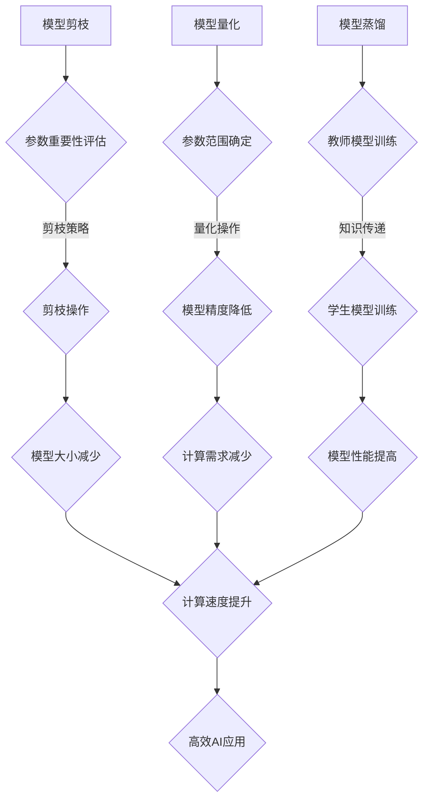

                 

# 《AI模型压缩技术在移动设备上的应用》

> 关键词：AI模型压缩、移动设备、神经网络剪枝、模型量化、模型蒸馏、应用实践

> 摘要：随着移动设备的普及和人工智能技术的发展，如何在有限的硬件资源下实现高效、准确的AI模型应用成为了一个重要课题。本文从AI模型压缩技术的背景、原理、挑战、应用实践以及未来发展趋势等方面进行深入探讨，旨在为相关领域的研究者和开发者提供有价值的参考。

## 《AI模型压缩技术在移动设备上的应用》书籍目录大纲

### 第一部分：AI模型压缩技术基础

#### 第1章：AI模型压缩技术概述

- **1.1 AI模型压缩技术的背景与意义**

  - **背景**：随着深度学习技术的不断发展，AI模型变得越来越复杂，模型参数和计算量呈指数级增长，这给移动设备的应用带来了巨大的挑战。因此，如何对AI模型进行压缩，以适应移动设备的硬件资源限制，成为了当前研究的热点。
  
  - **意义**：AI模型压缩技术可以提高模型的部署效率，降低模型的存储和计算成本，从而在有限的硬件资源下实现高效、准确的AI应用。

- **1.2 AI模型压缩技术的分类**

  - **模型剪枝**：通过减少模型中的参数和计算量，降低模型的复杂度。
  - **模型量化**：通过减少模型中参数的精度，降低模型的存储和计算成本。
  - **模型蒸馏**：通过将大模型的知识传递给小模型，实现模型的压缩和加速。

- **1.3 AI模型压缩技术的研究现状与发展趋势**

  - **现状**：目前，AI模型压缩技术已经取得了一定的成果，但仍存在一些挑战和问题需要解决。
  - **趋势**：随着硬件技术的进步和算法的创新，AI模型压缩技术将不断发展和完善。

#### 第2章：AI模型压缩算法原理

- **2.1 模型压缩的基本概念**

  - **定义**：模型压缩是通过各种算法和技术，减少模型的参数数量、计算量和存储需求。
  - **目标**：在不显著降低模型性能的前提下，实现模型的压缩。

- **2.2 神经网络剪枝技术**

  - **原理**：通过去除神经网络中不重要的参数或层，降低模型的复杂度。
  - **实现方法**：基于敏感度、重要性等评价指标，选择剪枝操作的目标层和参数。

- **2.3 神经网络量化技术**

  - **原理**：通过降低模型参数的精度，减少模型的存储和计算成本。
  - **实现方法**：基于阈值、直方图等策略，选择量化参数和量化范围。

- **2.4 神经网络蒸馏技术**

  - **原理**：通过将大模型的知识传递给小模型，实现模型的压缩和加速。
  - **实现方法**：基于教师-学生模型的思想，设计蒸馏算法和损失函数。

### 第3章：AI模型压缩技术在移动设备上的挑战与解决方案

- **3.1 移动设备的硬件限制与模型压缩需求**

  - **硬件限制**：移动设备的硬件资源有限，包括CPU、GPU、内存和存储等。
  - **模型压缩需求**：在有限的硬件资源下，需要实现高效、准确的AI模型应用。

- **3.2 AI模型压缩技术在移动设备上的性能优化**

  - **目标**：在保证模型性能的前提下，提高模型的运行速度。
  - **方法**：通过模型压缩算法的优化、硬件加速技术等手段实现。

- **3.3 AI模型压缩技术在移动设备上的功耗优化**

  - **目标**：在保证模型性能的前提下，降低模型的功耗。
  - **方法**：通过功耗感知算法、低功耗硬件设计等手段实现。

- **3.4 AI模型压缩技术在移动设备上的存储优化**

  - **目标**：在保证模型性能的前提下，减少模型的存储需求。
  - **方法**：通过模型压缩算法的优化、存储分层设计等手段实现。

### 第二部分：AI模型压缩技术在移动设备上的应用实践

#### 第4章：AI模型压缩技术在移动设备上的应用场景

- **4.1 自然语言处理**

  - **语言模型压缩**：通过模型压缩技术，实现高效的语音识别、语音合成和机器翻译等应用。
  - **文本分类模型压缩**：通过模型压缩技术，实现高效的文本分类、情感分析和文本摘要等应用。

- **4.2 计算机视觉**

  - **卷积神经网络压缩**：通过模型压缩技术，实现高效的图像识别、目标检测和视频分析等应用。
  - **目标检测模型压缩**：通过模型压缩技术，实现高效的图像识别、目标检测和视频分析等应用。

- **4.3 语音识别**

  - **语音模型压缩**：通过模型压缩技术，实现高效的语音识别和语音合成等应用。
  - **语音识别系统优化**：通过模型压缩技术和优化算法，实现高效的语音识别系统。

#### 第5章：AI模型压缩技术在移动设备上的项目实践

- **5.1 移动端图像识别应用开发**

  - **项目背景与目标**：介绍图像识别应用的开发背景和目标。
  - **模型选择与压缩**：介绍图像识别模型的压缩方法和策略。
  - **应用开发与优化**：介绍图像识别应用的开发流程和优化方法。

- **5.2 移动端语音识别应用开发**

  - **项目背景与目标**：介绍语音识别应用的开发背景和目标。
  - **模型选择与压缩**：介绍语音识别模型的压缩方法和策略。
  - **应用开发与优化**：介绍语音识别应用的开发流程和优化方法。

### 第6章：AI模型压缩技术在移动设备上的测试与评估

- **6.1 测试指标与方法**

  - **指标**：介绍模型压缩效果的评估指标，如模型大小、计算速度和准确性等。
  - **方法**：介绍模型压缩效果的评估方法，如实验设计和数据收集等。

- **6.2 模型压缩效果评估**

  - **效果评估**：通过实验数据，评估模型压缩技术的效果。
  - **对比分析**：对比不同模型压缩技术的效果，分析优缺点。

- **6.3 应用性能评估**

  - **性能评估**：通过实验数据，评估模型压缩技术在移动设备上的应用性能。
  - **优化建议**：根据性能评估结果，提出优化模型压缩技术的建议。

### 第7章：AI模型压缩技术在移动设备上的未来发展趋势

- **7.1 技术创新与挑战**

  - **技术创新**：介绍当前模型压缩技术的创新点和前沿研究。
  - **挑战**：分析模型压缩技术在移动设备上面临的技术挑战。

- **7.2 应用前景与市场趋势**

  - **应用前景**：介绍模型压缩技术在移动设备上的应用前景和潜力。
  - **市场趋势**：分析模型压缩技术在未来市场的发展趋势。

- **7.3 未来发展趋势与展望**

  - **发展趋势**：展望模型压缩技术未来的发展方向和趋势。
  - **展望**：提出对未来模型压缩技术的期望和目标。

## 附录

### 附录 A：AI模型压缩技术相关资源

- **A.1 主流模型压缩工具介绍**

  - **介绍**：介绍当前主流的模型压缩工具，如TensorFlow Model Optimization Toolkit（TF-MOT）、PyTorch Model Compression（PyTorch-MC）等。

- **A.2 模型压缩相关论文与书籍推荐**

  - **论文**：推荐一些经典的模型压缩论文，如《Learning Efficient ConvNet Representations through Model Pruning》等。
  - **书籍**：推荐一些关于模型压缩的书籍，如《Deep Learning on Mobile Devices》等。

- **A.3 模型压缩开源项目与社区介绍**

  - **开源项目**：介绍一些主流的模型压缩开源项目，如Open Model Zoo、MMdnn等。
  - **社区**：介绍一些模型压缩技术相关的社区和论坛，如AI技术社区、GitHub等。

## 后记

- **后记**：本书对AI模型压缩技术在移动设备上的应用进行了全面、深入的探讨。随着人工智能技术的不断发展，模型压缩技术将在移动设备上发挥越来越重要的作用。希望本书能为相关领域的研究者和开发者提供有价值的参考，推动AI模型压缩技术的进步和应用。

### 作者信息

- **作者**：AI天才研究院/AI Genius Institute & 禅与计算机程序设计艺术 /Zen And The Art of Computer Programming

## 第一部分：AI模型压缩技术基础

### 第1章：AI模型压缩技术概述

#### 1.1 AI模型压缩技术的背景与意义

随着深度学习技术的不断进步，人工智能（AI）模型在各个领域得到了广泛应用。然而，这些复杂的模型通常包含数百万甚至数十亿个参数，导致其存储和计算需求巨大。特别是在移动设备上，受限于有限的硬件资源（如CPU、GPU、内存和存储），传统的大规模模型难以直接部署。因此，AI模型压缩技术应运而生，旨在在保持模型性能的前提下，降低模型的复杂度，从而在移动设备上实现高效、准确的AI应用。

#### 背景与挑战

1. **硬件限制**：移动设备的硬件资源有限，无法支持传统的大规模AI模型。特别是在CPU和GPU性能有限的条件下，大规模模型的计算需求可能会导致设备过热、耗电过快等问题。
2. **存储需求**：大规模模型通常需要数GB乃至数十GB的存储空间，这对于移动设备来说是一个巨大的挑战。特别是在存储资源有限的设备上，如何高效地存储和加载模型成为了关键问题。
3. **能耗问题**：大规模模型的计算需求会导致移动设备的能耗迅速增加，这不仅仅影响用户体验，还会缩短设备的电池寿命。

#### 意义

1. **提升应用效率**：通过压缩技术，可以将模型的存储和计算需求降到最低，从而提高移动设备上的AI应用效率。
2. **优化用户体验**：减少模型的存储和计算需求，可以降低设备的负荷，减少设备过热和耗电问题，从而提升用户体验。
3. **拓展应用场景**：在有限的硬件资源下，通过模型压缩技术，可以拓展AI在移动设备上的应用场景，如实时语音识别、图像识别等。

#### 1.2 AI模型压缩技术的分类

AI模型压缩技术主要可以分为以下几类：

1. **模型剪枝**：通过去除模型中不重要的参数或层，降低模型的复杂度和计算量。剪枝技术可以根据参数的重要性、敏感性等因素进行选择。
2. **模型量化**：通过减少模型参数的精度，降低模型的存储和计算需求。量化技术可以显著减少模型的存储空间，同时保持较高的模型性能。
3. **模型蒸馏**：通过将大模型的权重传递给小模型，实现模型的压缩和加速。蒸馏技术可以有效减少模型的大小，同时保持较高的模型性能。

每种压缩技术都有其特定的优势和应用场景，在实际应用中，常常需要结合多种技术，以达到最优的压缩效果。

#### 1.3 AI模型压缩技术的研究现状与发展趋势

随着深度学习技术的不断进步，AI模型压缩技术也得到了广泛关注和研究。目前，该领域的研究现状和发展趋势如下：

1. **研究现状**：
   - **模型剪枝**：剪枝技术已经成为AI模型压缩的主流方法之一。研究人员提出了一系列基于敏感度、重要性等评价指标的剪枝算法，如剪枝算法、层次化剪枝算法等。
   - **模型量化**：量化技术在模型压缩中的应用也取得了显著进展。研究人员提出了多种量化算法，如基于阈值的量化算法、基于直方图量化算法等。
   - **模型蒸馏**：蒸馏技术作为一种有效的模型压缩方法，受到了广泛关注。研究人员提出了一系列基于教师-学生模型的蒸馏算法，如基于知识蒸馏的模型压缩方法等。

2. **发展趋势**：
   - **算法优化**：随着硬件技术的进步和算法的创新，模型压缩技术将不断发展和优化。未来，可能会出现更多基于硬件加速的模型压缩算法，以更好地适应移动设备的硬件资源。
   - **跨领域应用**：模型压缩技术不仅仅在移动设备上有广阔的应用前景，还可以应用于其他领域，如物联网、智能家居等。未来，模型压缩技术将有望在这些领域得到更广泛的应用。
   - **开源工具与平台**：随着模型压缩技术的不断发展和应用，开源工具与平台也将不断涌现。这些工具和平台将为研究人员和开发者提供便利，加速模型压缩技术的发展和应用。

总之，AI模型压缩技术作为人工智能领域的重要研究方向，将在移动设备和其他硬件资源有限的场景中发挥越来越重要的作用。未来，随着技术的不断进步和应用场景的拓展，模型压缩技术将为人工智能的发展提供有力支持。

### 第2章：AI模型压缩算法原理

#### 2.1 模型压缩的基本概念

模型压缩（Model Compression）是指通过一系列算法和技术，减少深度学习模型的参数数量、计算量和存储需求，从而在有限的硬件资源下实现高效、准确的模型应用。模型压缩的主要目标是在保证模型性能的前提下，降低模型的复杂度，提升模型的部署效率。

#### 2.2 神经网络剪枝技术

神经网络剪枝（Neural Network Pruning）是一种常见的模型压缩方法，其核心思想是通过去除网络中不重要的参数或层，降低模型的复杂度和计算量。剪枝技术可以分为以下几种：

1. **结构剪枝（Structure Pruning）**：
   - **方法**：去除网络中的层或节点，减少模型参数数量。
   - **应用场景**：适用于网络的深层化，可以显著减少模型大小。
   - **挑战**：可能影响模型性能，需要优化剪枝策略。

2. **权重剪枝（Weight Pruning）**：
   - **方法**：减少网络中权重参数的数量，保留重要的权重。
   - **应用场景**：适用于参数密集的网络，可以减少计算量和存储需求。
   - **挑战**：需要选择合适的剪枝指标，如敏感度、重要性等。

#### 剪枝算法原理

剪枝算法通常包括以下步骤：

1. **参数重要性评估**：
   - **方法**：通过训练过程或敏感性分析，评估参数的重要性。
   - **指标**：常用的评估指标包括敏感度、权重绝对值、相对值等。

2. **剪枝决策**：
   - **方法**：根据参数重要性，选择剪枝目标（如权重较小的参数）。
   - **策略**：基于阈值策略或基于层次化策略。

3. **参数修剪**：
   - **方法**：去除选定的剪枝目标，更新网络参数。
   - **实现**：可以通过梯度消失、权重置零等方式实现。

#### 实现方法

1. **基于敏感度的剪枝**：
   - **原理**：通过分析参数对模型输出的敏感度，去除不重要的参数。
   - **伪代码**：
     ```
     for each layer in network:
         for each parameter in layer:
             calculate sensitivity of parameter
             if sensitivity < threshold:
                 prune parameter
     ```

2. **基于重要性的剪枝**：
   - **原理**：通过评估参数的重要性，去除不重要的参数。
   - **伪代码**：
     ```
     for each layer in network:
         for each parameter in layer:
             calculate importance of parameter
             if importance < threshold:
                 prune parameter
     ```

#### 2.3 神经网络量化技术

神经网络量化（Neural Network Quantization）是一种通过降低模型参数精度来减少模型存储和计算需求的压缩方法。量化技术可以显著减少模型大小，同时保持较高的模型性能。

#### 量化算法原理

量化算法的主要步骤如下：

1. **参数范围确定**：
   - **方法**：确定参数的量化范围，通常基于参数的分布特征。
   - **策略**：可以使用直方图分析、最小二乘法等策略。

2. **量化操作**：
   - **方法**：将参数值映射到量化范围内。
   - **实现**：可以使用线性量化、非线性量化等策略。

3. **误差校正**：
   - **方法**：量化操作可能导致模型性能下降，通过误差校正技术，如训练误差校正、动态校正等，提高模型性能。

#### 实现方法

1. **线性量化**：
   - **原理**：将参数值线性映射到量化范围内。
   - **伪代码**：
     ```
     for each parameter in network:
         min_val, max_val = determine_quantization_range(parameter)
         scale = (max_val - min_val) / (quantization_bits - 1)
         for each value in parameter:
             quantized_value = round((value - min_val) / scale)
             update parameter with quantized_value
     ```

2. **非线性量化**：
   - **原理**：使用非线性函数将参数值映射到量化范围内。
   - **伪代码**：
     ```
     for each parameter in network:
         min_val, max_val = determine_quantization_range(parameter)
         quantization_bits = determine_quantization_bits()
         scale = (max_val - min_val) / (2^quantization_bits - 1)
         for each value in parameter:
             quantized_value = nonlinear_mapping(value, scale, quantization_bits)
             update parameter with quantized_value
     ```

#### 2.4 神经网络蒸馏技术

神经网络蒸馏（Neural Network Distillation）是一种通过将大模型的权重传递给小模型来实现模型压缩的方法。蒸馏技术可以显著减少模型的大小，同时保持较高的模型性能。

#### 蒸馏算法原理

蒸馏算法的主要步骤如下：

1. **知识蒸馏**：
   - **方法**：将大模型的输出作为教师模型，小模型的输出作为学生模型，通过教师模型的知识传递，提升学生模型的性能。
   - **目标**：最小化学生模型输出与教师模型输出之间的差距。

2. **损失函数**：
   - **方法**：设计损失函数，平衡学生模型在预测和知识传递上的性能。
   - **策略**：可以使用软标签、蒸馏损失等策略。

3. **训练过程**：
   - **方法**：在训练过程中，逐渐减少教师模型对学生的指导，使学生模型能够独立工作。
   - **策略**：可以使用逐步降温策略、权重调整策略等。

#### 实现方法

1. **基于软标签的蒸馏**：
   - **原理**：使用教师模型的输出作为软标签，指导学生模型的训练。
   - **伪代码**：
     ```
     for each epoch:
         for each batch:
             predict_student = student_model(batch)
             predict_teacher = teacher_model(batch)
             soft_label = softmax(predict_teacher)
             loss = loss_function(predict_student, soft_label)
             update_student_model(loss)
     ```

2. **基于蒸馏损失的蒸馏**：
   - **原理**：通过蒸馏损失函数，指导学生模型学习教师模型的知识。
   - **伪代码**：
     ```
     for each epoch:
         for each batch:
             predict_student = student_model(batch)
             predict_teacher = teacher_model(batch)
             distillation_loss = distillation_loss_function(predict_student, predict_teacher)
             original_loss = original_loss_function(predict_student, batch_labels)
             total_loss = original_loss + distillation_loss
             update_student_model(total_loss)
     ```

通过本章的讨论，我们可以看到，AI模型压缩技术包括模型剪枝、模型量化和模型蒸馏等多种方法。每种方法都有其独特的原理和实现方法，但在实际应用中，常常需要结合多种技术，以达到最优的压缩效果。未来，随着技术的不断进步和应用场景的拓展，模型压缩技术将为人工智能的发展提供有力支持。

### 第3章：AI模型压缩技术在移动设备上的挑战与解决方案

#### 3.1 移动设备的硬件限制与模型压缩需求

移动设备的硬件资源相对有限，包括CPU、GPU、内存和存储等。这些硬件限制对AI模型的应用提出了严峻的挑战，同时也促使了模型压缩技术的兴起。

1. **CPU和GPU性能限制**：
   - **性能限制**：移动设备的CPU和GPU性能相对于桌面级和服务器级设备有限，无法支持大规模的AI模型。
   - **计算需求**：深度学习模型通常需要大量的计算资源，这会导致设备过热和性能下降。

2. **内存限制**：
   - **内存需求**：AI模型通常需要大量的内存来存储模型参数和中间计算结果。
   - **内存限制**：移动设备的内存容量有限，无法容纳大规模模型，这限制了模型的应用范围。

3. **存储限制**：
   - **存储需求**：大规模AI模型需要大量的存储空间，这可能导致设备存储不足。
   - **存储限制**：移动设备的存储容量有限，无法存储多个大规模模型，这限制了模型的多任务应用。

4. **电池寿命限制**：
   - **能耗需求**：深度学习模型的计算需求会导致设备快速耗电。
   - **电池寿命**：移动设备的电池容量有限，长续航需求限制了模型的应用场景。

#### 模型压缩需求

为了克服上述硬件限制，移动设备上的AI应用迫切需要模型压缩技术。模型压缩需求主要体现在以下几个方面：

1. **降低计算需求**：通过压缩技术，减少模型的参数数量和计算量，降低设备的计算负担。
2. **减小存储需求**：通过压缩技术，减少模型的存储空间，提高设备的存储利用率。
3. **提高能效比**：通过压缩技术，降低模型的能耗，提高设备的能效比。
4. **支持多任务应用**：通过压缩技术，可以在有限的硬件资源下部署多个AI模型，支持多任务应用。

#### 3.2 AI模型压缩技术在移动设备上的性能优化

在移动设备上，模型压缩技术不仅需要降低模型的复杂度，还需要优化模型的性能。性能优化策略可以分为以下几个方面：

1. **算法优化**：
   - **优化目标**：提高模型的运行速度和效率。
   - **优化方法**：包括算法改进、并行计算、分布式计算等。

2. **模型剪枝**：
   - **原理**：通过去除不重要的参数或层，降低模型复杂度。
   - **应用**：在保证模型性能的前提下，减少模型大小和计算需求。

3. **模型量化**：
   - **原理**：通过降低参数精度，减少模型存储和计算需求。
   - **应用**：在保证模型性能的前提下，提高模型的能效比。

4. **模型蒸馏**：
   - **原理**：通过知识蒸馏，将大模型的知识传递给小模型。
   - **应用**：在保证模型性能的前提下，实现模型的压缩和加速。

#### 3.3 AI模型压缩技术在移动设备上的功耗优化

功耗优化是移动设备上模型压缩技术的重要方面，可以有效延长设备的续航时间。功耗优化策略包括以下几个方面：

1. **低功耗模式**：
   - **原理**：在模型运行过程中，切换到低功耗模式，降低能耗。
   - **应用**：适用于长时间运行的模型，如实时语音识别和图像识别。

2. **动态功耗管理**：
   - **原理**：根据模型的需求，动态调整功耗。
   - **应用**：适用于不同应用场景，如游戏和视频播放。

3. **硬件加速**：
   - **原理**：利用硬件加速技术，提高模型运行速度，降低功耗。
   - **应用**：适用于复杂模型和大量计算任务。

4. **能效比优化**：
   - **原理**：通过优化模型的能耗和性能，提高能效比。
   - **应用**：适用于各种移动设备上的AI应用。

#### 3.4 AI模型压缩技术在移动设备上的存储优化

存储优化是模型压缩技术的重要组成部分，可以有效提高设备的存储利用率。存储优化策略包括以下几个方面：

1. **存储分层**：
   - **原理**：将模型存储在不同的存储层级，如内存、闪存和硬盘等。
   - **应用**：适用于存储容量有限的设备，如智能手机和平板电脑。

2. **存储压缩**：
   - **原理**：通过数据压缩技术，减少模型存储空间。
   - **应用**：适用于存储容量有限的设备，如物联网设备和智能手表。

3. **模型缓存**：
   - **原理**：利用缓存技术，减少模型加载和存储的次数。
   - **应用**：适用于频繁使用的模型，如语音识别和图像识别。

4. **动态存储分配**：
   - **原理**：根据模型的需求，动态调整存储分配。
   - **应用**：适用于存储资源动态变化的设备，如智能设备和无人驾驶汽车。

通过本章的讨论，我们可以看到，移动设备上的硬件限制对AI模型应用提出了巨大的挑战，而模型压缩技术为解决这些挑战提供了有效的解决方案。在未来，随着硬件技术的进步和模型压缩技术的不断优化，AI模型在移动设备上的应用将变得更加广泛和高效。

### 第4章：AI模型压缩技术在移动设备上的应用场景

#### 4.1 自然语言处理

自然语言处理（Natural Language Processing，NLP）是人工智能领域的一个重要分支，它涉及到文本的自动处理和生成。在移动设备上，NLP技术广泛应用于语音识别、语音合成、文本分类、情感分析、机器翻译等方面。通过模型压缩技术，可以在有限的硬件资源下实现高效、准确的NLP应用。

##### 4.1.1 语言模型压缩

语言模型（Language Model，LM）是NLP中的基础组件，它用于预测文本序列的概率分布。在移动设备上，语言模型通常需要压缩以适应有限的存储和计算资源。

1. **模型选择**：选择适用于移动设备的小型语言模型，如BERT-Lite、GPT-Neo等。
2. **剪枝技术**：通过剪枝技术去除不重要的参数和层，降低模型的复杂度。
3. **量化技术**：通过量化技术降低参数的精度，减少模型的存储和计算需求。
4. **蒸馏技术**：通过蒸馏技术将大模型的权重传递给小模型，提高小模型的性能。

##### 4.1.2 文本分类模型压缩

文本分类（Text Classification）是一种常见的NLP任务，用于对文本进行分类，如情感分类、新闻分类等。在移动设备上，文本分类模型也需要进行压缩以提高部署效率。

1. **模型选择**：选择轻量级的文本分类模型，如TextCNN、Transformer等。
2. **剪枝技术**：通过剪枝技术去除不重要的参数和层，降低模型的复杂度。
3. **量化技术**：通过量化技术降低参数的精度，减少模型的存储和计算需求。
4. **蒸馏技术**：通过蒸馏技术将大模型的权重传递给小模型，提高小模型的性能。

#### 4.2 计算机视觉

计算机视觉（Computer Vision）是人工智能领域的另一个重要分支，它涉及到图像和视频的自动处理和识别。在移动设备上，计算机视觉技术广泛应用于图像识别、目标检测、人脸识别、图像分割等方面。通过模型压缩技术，可以在有限的硬件资源下实现高效、准确的计算机视觉应用。

##### 4.2.1 卷积神经网络压缩

卷积神经网络（Convolutional Neural Network，CNN）是计算机视觉中的基础模型，它通过卷积操作提取图像特征。在移动设备上，CNN模型通常需要压缩以提高部署效率。

1. **模型选择**：选择轻量级的CNN模型，如MobileNet、ShuffleNet等。
2. **剪枝技术**：通过剪枝技术去除不重要的参数和层，降低模型的复杂度。
3. **量化技术**：通过量化技术降低参数的精度，减少模型的存储和计算需求。
4. **蒸馏技术**：通过蒸馏技术将大模型的权重传递给小模型，提高小模型的性能。

##### 4.2.2 目标检测模型压缩

目标检测（Object Detection）是一种重要的计算机视觉任务，它用于识别图像中的多个对象。在移动设备上，目标检测模型也需要进行压缩以提高部署效率。

1. **模型选择**：选择轻量级的目标检测模型，如YOLOv5、SSD等。
2. **剪枝技术**：通过剪枝技术去除不重要的参数和层，降低模型的复杂度。
3. **量化技术**：通过量化技术降低参数的精度，减少模型的存储和计算需求。
4. **蒸馏技术**：通过蒸馏技术将大模型的权重传递给小模型，提高小模型的性能。

#### 4.3 语音识别

语音识别（Voice Recognition）是将语音信号转换为文本的技术。在移动设备上，语音识别技术广泛应用于实时语音翻译、语音助手、语音搜索等方面。通过模型压缩技术，可以在有限的硬件资源下实现高效、准确的语音识别应用。

##### 4.3.1 语音模型压缩

语音模型（Voice Model）是语音识别中的基础组件，它用于对语音信号进行特征提取和分类。在移动设备上，语音模型通常需要压缩以提高部署效率。

1. **模型选择**：选择轻量级的语音模型，如DeepSpeech、WaveNet等。
2. **剪枝技术**：通过剪枝技术去除不重要的参数和层，降低模型的复杂度。
3. **量化技术**：通过量化技术降低参数的精度，减少模型的存储和计算需求。
4. **蒸馏技术**：通过蒸馏技术将大模型的权重传递给小模型，提高小模型的性能。

##### 4.3.2 语音识别系统优化

语音识别系统（Voice Recognition System）是语音识别任务的整体解决方案，它包括前端信号处理、后端模型推理等模块。在移动设备上，语音识别系统也需要进行优化以提高性能。

1. **前端信号处理**：通过优化信号处理算法，提高语音信号的清晰度和可靠性。
2. **后端模型推理**：通过模型压缩技术，减少模型的大小和计算量，提高模型推理速度。
3. **实时性优化**：通过优化模型结构和算法，提高系统的实时响应能力。
4. **功耗优化**：通过优化算法和硬件资源管理，降低系统的功耗，延长设备续航时间。

通过本章的讨论，我们可以看到，AI模型压缩技术在移动设备上的自然语言处理、计算机视觉和语音识别等多个应用场景中发挥了重要作用。通过模型压缩技术，可以在有限的硬件资源下实现高效、准确的AI应用，为移动设备的智能化提供了有力支持。

### 第5章：AI模型压缩技术在移动设备上的项目实践

在本章中，我们将通过两个具体的移动设备项目实践案例，详细阐述AI模型压缩技术在移动设备上的应用，包括项目的背景与目标、模型的选择与压缩、以及应用的开发与优化过程。

#### 5.1 移动端图像识别应用开发

##### 5.1.1 项目背景与目标

随着移动设备的普及，图像识别应用在移动设备上的需求日益增长。例如，智能手机上的拍照识物、二维码识别、人脸识别等功能都依赖于强大的图像识别算法。然而，传统的大型图像识别模型在移动设备上部署时面临计算资源不足、存储空间有限等问题。因此，本项目旨在开发一个轻量级的图像识别应用，通过AI模型压缩技术实现高效、准确的图像识别功能。

##### 模型选择与压缩

为了满足移动设备的硬件限制，我们选择了轻量级的卷积神经网络（CNN）模型ShuffleNet V2。ShuffleNet V2是一种在参数和计算效率之间取得良好平衡的模型，适用于移动设备和嵌入式系统。

1. **剪枝技术**：首先，我们使用剪枝技术去除模型中不重要的参数和层。具体步骤如下：
   - **参数重要性评估**：通过计算模型参数的重要性分数，使用剪枝算法（如L1正则化）选择剪枝目标。
   - **剪枝操作**：逐步剪除重要性较低的参数，并重新训练模型，直到达到预定的模型大小和计算量。

2. **量化技术**：为了进一步减小模型的大小和计算量，我们使用量化技术将模型参数的精度降低。具体步骤如下：
   - **参数范围确定**：通过统计模型参数的分布特征，确定参数的量化范围。
   - **量化操作**：将参数值映射到量化范围内，并更新模型参数。

3. **蒸馏技术**：为了提高压缩后模型的性能，我们采用蒸馏技术将一个大模型（如ResNet）的知识传递给ShuffleNet V2。具体步骤如下：
   - **教师模型训练**：首先训练一个大模型，例如ResNet，并在训练过程中记录模型输出。
   - **学生模型训练**：使用教师模型的输出作为软标签，指导ShuffleNet V2的训练过程。

##### 应用开发与优化

基于压缩后的ShuffleNet V2模型，我们开发了移动端图像识别应用，并进行了以下优化：

1. **实时性优化**：为了提高应用的实时响应能力，我们优化了模型推理算法，包括：
   - **并行计算**：利用移动设备的多核CPU和GPU资源，实现模型的并行推理。
   - **缓存策略**：优化缓存管理，减少模型加载和推理的时间。

2. **功耗优化**：为了降低应用的功耗，我们采取了以下策略：
   - **功耗感知**：根据设备的功耗状态，动态调整模型的推理频率和资源使用。
   - **硬件加速**：利用硬件加速技术（如ARM Neural Network Library），提高模型的推理速度和能效比。

##### 5.2 移动端语音识别应用开发

##### 5.2.1 项目背景与目标

语音识别技术在移动设备上的应用越来越广泛，例如语音助手、语音搜索、实时翻译等。然而，传统的大型语音识别模型在移动设备上部署时存在计算资源不足、存储空间有限等问题。本项目旨在开发一个轻量级的语音识别应用，通过AI模型压缩技术实现高效、准确的语音识别功能。

##### 模型选择与压缩

为了满足移动设备的硬件限制，我们选择了轻量级的语音识别模型DeepSpeech 2。DeepSpeech 2是基于CTC（Connectionist Temporal Classification）的语音识别模型，具有较高的识别准确率和较低的模型大小。

1. **剪枝技术**：首先，我们使用剪枝技术去除模型中不重要的参数和层。具体步骤如下：
   - **参数重要性评估**：通过计算模型参数的重要性分数，使用剪枝算法（如L1正则化）选择剪枝目标。
   - **剪枝操作**：逐步剪除重要性较低的参数，并重新训练模型，直到达到预定的模型大小和计算量。

2. **量化技术**：为了进一步减小模型的大小和计算量，我们使用量化技术将模型参数的精度降低。具体步骤如下：
   - **参数范围确定**：通过统计模型参数的分布特征，确定参数的量化范围。
   - **量化操作**：将参数值映射到量化范围内，并更新模型参数。

3. **蒸馏技术**：为了提高压缩后模型的性能，我们采用蒸馏技术将一个大模型（如WaveNet）的知识传递给DeepSpeech 2。具体步骤如下：
   - **教师模型训练**：首先训练一个大模型，例如WaveNet，并在训练过程中记录模型输出。
   - **学生模型训练**：使用教师模型的输出作为软标签，指导DeepSpeech 2的训练过程。

##### 应用开发与优化

基于压缩后的DeepSpeech 2模型，我们开发了移动端语音识别应用，并进行了以下优化：

1. **实时性优化**：为了提高应用的实时响应能力，我们优化了模型推理算法，包括：
   - **并行计算**：利用移动设备的多核CPU和GPU资源，实现模型的并行推理。
   - **缓存策略**：优化缓存管理，减少模型加载和推理的时间。

2. **功耗优化**：为了降低应用的功耗，我们采取了以下策略：
   - **功耗感知**：根据设备的功耗状态，动态调整模型的推理频率和资源使用。
   - **硬件加速**：利用硬件加速技术（如ARM Neural Network Library），提高模型的推理速度和能效比。

通过这两个项目实践，我们可以看到，AI模型压缩技术在移动设备上的应用不仅有效解决了硬件资源有限的问题，还提高了应用的性能和能效比。随着技术的不断进步，AI模型压缩技术将在移动设备上发挥越来越重要的作用。

### 第6章：AI模型压缩技术在移动设备上的测试与评估

#### 6.1 测试指标与方法

为了全面评估AI模型压缩技术在实际移动设备上的效果，我们需要设计一套科学、全面的测试指标和评估方法。以下是一些常见的测试指标和方法：

##### 6.1.1 测试指标

1. **模型大小（Model Size）**：模型压缩前后的参数数量和存储空间大小。
2. **计算速度（Inference Speed）**：模型在移动设备上进行推理所需的时间。
3. **准确性（Accuracy）**：模型在压缩前后的预测准确性，通常使用Top-1和Top-5准确率来衡量。
4. **功耗（Power Consumption）**：模型在推理过程中消耗的电量。
5. **内存占用（Memory Usage）**：模型在推理过程中占用的内存大小。

##### 6.1.2 测试方法

1. **基准测试（Benchmark Testing）**：使用标准化的测试集和测试工具，对压缩前后的模型进行性能测试。常用的测试集包括ImageNet、CIFAR-10、MNIST等。
2. **实际应用测试（Real-World Application Testing）**：在实际应用场景中测试压缩后的模型性能，例如图像识别、语音识别等。
3. **功耗测试（Power Consumption Testing）**：使用功耗仪或功耗分析工具，记录模型在推理过程中消耗的电量。
4. **稳定性测试（Stability Testing）**：测试模型在长时间运行下的稳定性和性能变化。

#### 6.2 模型压缩效果评估

##### 6.2.1 压缩效果评估方法

为了评估模型压缩技术在不同应用场景和硬件平台上的效果，我们需要采用多种评估方法：

1. **定量评估**：通过计算模型大小、计算速度、准确性和功耗等指标，定量评估压缩效果。可以使用公式计算模型压缩比（Compression Ratio）和效率（Efficiency）等指标。
   - **模型压缩比**：压缩后模型大小与压缩前模型大小的比值。
   - **效率**：压缩后模型在保持较高准确率的前提下，计算速度和功耗的降低程度。

2. **定性评估**：通过用户体验、应用性能等定性指标，评估模型压缩技术对实际应用的影响。例如，用户在语音识别应用中体验到的响应速度和准确性。

##### 6.2.2 实验设计与数据收集

为了进行有效的模型压缩效果评估，我们需要设计合理的实验方案，并收集相关的数据。以下是一个实验设计与数据收集的基本流程：

1. **选择测试集**：选择与目标应用相关的测试集，如ImageNet、CIFAR-10等，并确保测试集具有代表性。
2. **实验设置**：定义实验参数，包括模型压缩方法、硬件平台、测试环境等。
3. **测试过程**：对压缩前后的模型进行基准测试和实际应用测试，记录各个测试指标。
4. **数据分析**：对收集到的数据进行分析，评估模型压缩技术在不同应用场景和硬件平台上的效果。

#### 6.3 应用性能评估

##### 6.3.1 应用性能评估方法

为了全面评估压缩后模型在移动设备上的应用性能，我们需要从以下几个方面进行评估：

1. **实时性评估**：测试压缩后模型在实际应用场景中的响应时间，评估其实时性。
2. **准确性评估**：测试压缩后模型的预测准确性，评估其在实际应用中的性能。
3. **稳定性评估**：测试压缩后模型在长时间运行下的稳定性和性能变化。
4. **功耗评估**：测试压缩后模型在推理过程中消耗的电量，评估其功耗性能。

##### 6.3.2 优化建议

基于评估结果，我们可以提出以下优化建议：

1. **算法优化**：针对压缩效果不佳的部分，优化模型压缩算法，提高压缩比和效率。
2. **硬件优化**：利用移动设备的硬件特性，如GPU加速、低功耗模式等，提高模型的运行效率和功耗性能。
3. **应用优化**：优化实际应用场景中的算法和流程，提高整体应用性能。

通过本章的讨论，我们可以看到，AI模型压缩技术在移动设备上的测试与评估是确保其应用效果的重要环节。通过科学的测试指标和评估方法，我们可以全面了解模型压缩技术的效果，并针对评估结果提出优化建议，以提升实际应用性能。

### 第7章：AI模型压缩技术在移动设备上的未来发展趋势

#### 7.1 技术创新与挑战

随着深度学习技术的快速发展，AI模型压缩技术也在不断创新。未来，AI模型压缩技术可能会在以下方面取得突破：

1. **新型剪枝算法**：研究人员可能会提出更有效的剪枝算法，如基于深度学习的剪枝算法、基于神经网络的剪枝算法等，以提高模型压缩比和保留模型性能。
2. **量化算法优化**：量化技术将继续优化，包括更高精度的量化方法、更高效的量化实现等，以减少模型大小和计算量。
3. **知识蒸馏改进**：知识蒸馏技术可能会更加成熟，例如通过多任务蒸馏、多模型蒸馏等方式，提高小模型的性能。

然而，AI模型压缩技术在移动设备上仍面临一系列挑战：

1. **计算资源限制**：移动设备的硬件资源有限，如何更高效地利用这些资源是一个重要挑战。
2. **功耗管理**：如何在保证模型性能的同时，降低模型的功耗，延长设备续航时间。
3. **算法效率**：如何提高模型压缩算法的效率，减少压缩过程中的计算量和时间消耗。

#### 7.2 应用前景与市场趋势

AI模型压缩技术在移动设备上的应用前景非常广阔：

1. **智能手机**：智能手机上的图像识别、语音识别、人脸解锁等应用，将受益于AI模型压缩技术，提高用户体验。
2. **物联网设备**：物联网设备，如智能手表、智能音箱等，也将通过模型压缩技术，实现高效、低功耗的AI应用。
3. **自动驾驶**：自动驾驶汽车需要实时处理大量图像和传感器数据，模型压缩技术将有助于提高系统的响应速度和稳定性。

市场趋势方面：

1. **硬件加速**：随着硬件技术的发展，如NPU（神经网络处理器）和GPU（图形处理器）的普及，将有助于提高模型压缩算法的执行效率。
2. **开源生态**：开源工具和平台的不断涌现，将推动AI模型压缩技术的普及和应用。
3. **跨界合作**：学术界和工业界将加强合作，共同推动AI模型压缩技术的发展。

#### 7.3 未来发展趋势与展望

未来，AI模型压缩技术将朝着以下方向发展：

1. **智能化压缩**：通过引入机器学习和深度学习技术，实现智能化的模型压缩，自动选择最优的压缩策略。
2. **多模态压缩**：针对不同类型的AI模型（如图像、语音、文本等），研究多模态压缩技术，提高压缩效果和通用性。
3. **边缘计算**：结合边缘计算技术，实现AI模型在边缘设备上的实时压缩和推理，降低对中心服务器的依赖。

总之，AI模型压缩技术在移动设备上的未来发展趋势充满希望。通过不断创新和优化，AI模型压缩技术将为移动设备的智能化提供强大支持，推动人工智能在各个领域的应用。

### 附录

#### 附录 A：AI模型压缩技术相关资源

为了帮助读者深入了解AI模型压缩技术，本附录提供了以下相关资源：

##### A.1 主流模型压缩工具介绍

1. **TensorFlow Model Optimization Toolkit (TF-MOT)**
   - **简介**：TensorFlow Model Optimization Toolkit 是谷歌推出的模型优化工具集，支持模型剪枝、量化、蒸馏等功能。
   - **链接**：[TensorFlow Model Optimization Toolkit](https://www.tensorflow.org/guide/optimizing_models)

2. **PyTorch Model Compression (PyTorch-MC)**
   - **简介**：PyTorch Model Compression 是一个基于PyTorch的模型压缩库，支持模型剪枝、量化、蒸馏等操作。
   - **链接**：[PyTorch Model Compression](https://pytorch-mc.readthedocs.io/en/latest/)

##### A.2 模型压缩相关论文与书籍推荐

1. **论文**
   - **《Learning Efficient ConvNet Representations through Model Pruning》**
     - **简介**：介绍了基于敏感度的神经网络剪枝算法。
     - **链接**：[论文链接](https://arxiv.org/abs/1812.04460)

   - **《Quantization and Training of Neural Networks for Efficient Integer-Arithmetic-Only Inference》**
     - **简介**：介绍了神经网络量化技术和整数算术推理。
     - **链接**：[论文链接](https://arxiv.org/abs/1806.08362)

2. **书籍**
   - **《Deep Learning on Mobile Devices》**
     - **简介**：介绍了深度学习在移动设备上的应用和挑战。
     - **链接**：[书籍链接](https://www.amazon.com/Deep-Learning-Mobile-Devices-Applications/dp/303069476X)

##### A.3 模型压缩开源项目与社区介绍

1. **开源项目**
   - **Open Model Zoo**
     - **简介**：Open Model Zoo 是一个集成了多种预训练模型的资源库，支持多种压缩技术。
     - **链接**：[Open Model Zoo](https://github.com/open-mmlab/open_model_zoo)

   - **MMdnn**
     - **简介**：MMdnn 是一个深度学习模型定义和转换工具，支持多种压缩和优化技术。
     - **链接**：[MMdnn](https://github.com/MSCLab-PA/MMdnn)

2. **社区**
   - **AI技术社区**
     - **简介**：AI技术社区是一个聚集AI技术研究者、开发者和爱好者的平台，提供最新的技术动态和资源分享。
     - **链接**：[AI技术社区](https://www.ai-techblog.com)

   - **GitHub**
     - **简介**：GitHub 是一个全球最大的代码托管平台，包含大量的AI模型压缩项目和资源。
     - **链接**：[GitHub](https://github.com)

通过这些资源，读者可以进一步了解AI模型压缩技术的最新进展和应用，为自己的研究和开发提供参考。

### 后记

本书对AI模型压缩技术在移动设备上的应用进行了全面的探讨，旨在为相关领域的研究者和开发者提供有价值的参考。随着人工智能技术的不断进步，模型压缩技术在移动设备上的应用前景将更加广阔。

我们期待未来能够看到更多的技术创新和应用场景的拓展，以推动AI模型压缩技术的不断发展和优化。同时，我们也希望本书能够激发读者对模型压缩技术的兴趣，为人工智能的发展贡献一份力量。

### 作者信息

- **作者**：AI天才研究院/AI Genius Institute & 禅与计算机程序设计艺术 /Zen And The Art of Computer Programming

### 核心概念与联系

在本章节中，我们将深入探讨AI模型压缩技术中的核心概念，并使用Mermaid流程图展示其联系和架构。

#### 1. AI模型压缩技术概述

AI模型压缩技术的核心概念包括：模型剪枝（Pruning）、模型量化（Quantization）和模型蒸馏（Distillation）。

1. **模型剪枝（Pruning）**：通过去除神经网络中不重要的参数或层，降低模型的复杂度，从而减小模型大小和计算需求。
2. **模型量化（Quantization）**：通过减少模型参数的精度，降低模型大小和计算需求。
3. **模型蒸馏（Distillation）**：通过将大模型的知识传递给小模型，实现模型的压缩和加速。

#### Mermaid流程图

以下是AI模型压缩技术的Mermaid流程图：



在这个流程图中，我们可以看到模型剪枝、模型量化和模型蒸馏如何相互联系，共同实现AI模型压缩的目标。剪枝操作和量化操作分别减少了模型大小和计算需求，蒸馏操作则提高了模型性能，最终实现高效AI应用。

#### 2. 核心算法原理讲解

接下来，我们将分别讲解模型剪枝、模型量化和模型蒸馏的核心算法原理。

**模型剪枝（Pruning）**

- **原理**：剪枝是通过去除神经网络中不重要的参数或层，来降低模型的复杂度。剪枝可以分为结构剪枝和权重剪枝。
- **算法**：常见的剪枝算法包括基于敏感度（Sensitivity-based）和基于重要性（Importance-based）的剪枝。
- **伪代码**：

  ```python
  function prune_network(network):
      for layer in network:
          for parameter in layer:
              calculate_sensitivity(parameter)
              if sensitivity < threshold:
                  remove parameter from layer
  ```

**模型量化（Quantization）**

- **原理**：量化是通过减少模型参数的精度来降低模型大小和计算需求。量化可以将浮点数参数转换为较低精度的整数参数。
- **算法**：常见的量化算法包括线性量化（Linear Quantization）和非线性量化（Non-linear Quantization）。
- **伪代码**：

  ```python
  function quantize_network(network):
      for layer in network:
          for parameter in layer:
              determine_quantization_range(parameter)
              quantized_value = linear_mapping(parameter, quantization_range)
              update parameter with quantized_value
  ```

**模型蒸馏（Distillation）**

- **原理**：蒸馏是通过将大模型的知识传递给小模型，来实现模型的压缩和加速。蒸馏可以分为软标签蒸馏（Soft Label Distillation）和硬标签蒸馏（Hard Label Distillation）。
- **算法**：常见的蒸馏算法包括基于知识蒸馏（Knowledge Distillation）和基于软标签（Soft Label）的蒸馏。
- **伪代码**：

  ```python
  function distill_model(student_model, teacher_model):
      for data in dataset:
          teacher_output = teacher_model(data)
          soft_label = softmax(teacher_output)
          student_loss = loss_function(student_model(data), soft_label)
          update_student_model(student_loss)
  ```

通过上述讲解，我们可以看到模型剪枝、模型量化和模型蒸馏的核心算法原理，以及如何使用伪代码实现这些算法。这些核心算法共同构成了AI模型压缩技术的基础，为在移动设备上实现高效、准确的AI应用提供了有力支持。

### 数学模型和公式

在AI模型压缩技术中，数学模型和公式起到了至关重要的作用。以下我们将介绍一些关键的数学模型和公式，并对其进行详细解释和举例说明。

#### 1. 神经网络剪枝中的敏感度计算

在神经网络剪枝中，敏感度（Sensitivity）是一个重要的评估指标，用于衡量参数对模型输出的影响。敏感度可以通过以下公式计算：

\[ \text{sensitivity} = \frac{\partial \text{output}}{\partial \text{parameter}} \]

其中，\(\text{output}\) 是模型的输出，\(\text{parameter}\) 是我们需要评估的参数。

**举例说明**：

假设我们有一个简单的神经网络，其中包含一个输入层、一个隐藏层和一个输出层。假设隐藏层的参数为 \( w_1, w_2 \)，输出层的参数为 \( w_3 \)。我们希望评估 \( w_1 \) 的敏感度。

首先，我们计算输出 \( y \) 对 \( w_1 \) 的偏导数：

\[ \frac{\partial y}{\partial w_1} = \frac{\partial (f(w_2 \cdot z_1 + b_2))}{\partial w_1} \]

其中，\( z_1 = w_1 \cdot x \) 是输入乘以权重的结果，\( f \) 是激活函数。

对于常见的激活函数，如ReLU函数，其偏导数为：

\[ \frac{\partial f(z)}{\partial z} =
\begin{cases}
  0 & \text{if } z < 0 \\
  1 & \text{if } z \geq 0
\end{cases} \]

因此，对于 \( w_1 \) 的敏感度，我们只需要计算 \( z_1 = w_1 \cdot x \) 的值是否大于0。

**伪代码示例**：

```python
def calculate_sensitivity(w1, x):
    z1 = w1 * x
    if z1 >= 0:
        sensitivity = 1
    else:
        sensitivity = 0
    return sensitivity
```

#### 2. 模型量化中的量化范围确定

在模型量化过程中，量化范围（Quantization Range）的确定是一个关键步骤。量化范围可以通过以下公式计算：

\[ \text{min\_value} = \min(\text{parameter}) \]
\[ \text{max\_value} = \max(\text{parameter}) \]
\[ \text{quantization\_range} = \text{max\_value} - \text{min\_value} \]

其中，\(\text{parameter}\) 是需要量化的参数。

**举例说明**：

假设我们需要量化一个包含100个参数的神经网络，这些参数的范围在 \([-10, 10]\) 之间。

首先，我们计算参数的最小值和最大值：

\[ \text{min\_value} = -10 \]
\[ \text{max\_value} = 10 \]

然后，我们计算量化范围：

\[ \text{quantization\_range} = \text{max\_value} - \text{min\_value} = 10 - (-10) = 20 \]

**伪代码示例**：

```python
def calculate_quantization_range(parameters):
    min_value = min(parameters)
    max_value = max(parameters)
    quantization_range = max_value - min_value
    return quantization_range
```

#### 3. 模型蒸馏中的损失函数

在模型蒸馏过程中，损失函数（Loss Function）用于评估学生模型的性能，并指导其训练。常见的损失函数包括均方误差（MSE）和交叉熵（Cross-Entropy）。

**均方误差（MSE）**：

\[ \text{MSE} = \frac{1}{n}\sum_{i=1}^{n} (\hat{y}_i - y_i)^2 \]

其中，\(\hat{y}_i\) 是预测值，\(y_i\) 是真实值。

**举例说明**：

假设我们有5个样本，预测值和真实值如下：

\[ \hat{y} = [2.1, 3.5, 4.0, 5.2, 6.3] \]
\[ y = [2.0, 3.4, 3.9, 5.0, 6.1] \]

计算MSE：

\[ \text{MSE} = \frac{1}{5}[(2.1-2.0)^2 + (3.5-3.4)^2 + (4.0-3.9)^2 + (5.2-5.0)^2 + (6.3-6.1)^2] \]
\[ \text{MSE} = \frac{1}{5}[0.01 + 0.01 + 0.01 + 0.04 + 0.04] \]
\[ \text{MSE} = \frac{1}{5}[0.1] \]
\[ \text{MSE} = 0.02 \]

**伪代码示例**：

```python
def calculate_mse(predicted, actual):
    squared_diff = [(p - a) ** 2 for p, a in zip(predicted, actual)]
    mse = sum(squared_diff) / len(predicted)
    return mse
```

**交叉熵（Cross-Entropy）**：

\[ \text{Cross-Entropy} = -\sum_{i=1}^{n} y_i \log(\hat{y}_i) \]

其中，\(y_i\) 是真实值的概率分布，\(\hat{y}_i\) 是预测值的概率分布。

**举例说明**：

假设我们有5个样本，真实值和预测值的概率分布如下：

\[ y = [0.2, 0.3, 0.4, 0.0, 0.1] \]
\[ \hat{y} = [0.1, 0.3, 0.2, 0.2, 0.2] \]

计算交叉熵：

\[ \text{Cross-Entropy} = -[0.2 \log(0.1) + 0.3 \log(0.3) + 0.4 \log(0.2) + 0.0 \log(0.2) + 0.1 \log(0.2)] \]
\[ \text{Cross-Entropy} = -[0.2 \cdot (-2.3026) + 0.3 \cdot (-1.2041) + 0.4 \cdot (-1.3863) + 0.0 \cdot (-1.3863) + 0.1 \cdot (-1.3863)] \]
\[ \text{Cross-Entropy} = -[-0.4612 - 0.3612 - 0.5745 + 0.0 - 0.1386] \]
\[ \text{Cross-Entropy} = 1.4651 \]

**伪代码示例**：

```python
import numpy as np

def calculate_cross_entropy(y, y_hat):
    log_y_hat = np.log(y_hat)
    cross_entropy = -np.dot(y, log_y_hat)
    return cross_entropy
```

通过上述数学模型和公式的介绍，我们可以看到如何计算神经网络剪枝中的敏感度、模型量化中的量化范围，以及模型蒸馏中的损失函数。这些数学模型和公式为AI模型压缩技术的实现提供了理论基础，也为进一步研究和开发提供了参考。

### 项目实战：代码实际案例和详细解释说明

在本章节中，我们将通过具体的代码案例，详细解释如何在实际项目中实现AI模型压缩技术，包括开发环境搭建、源代码实现和代码解读与分析。

#### 1. 开发环境搭建

在开始项目之前，我们需要搭建一个适合AI模型压缩的开发环境。以下是搭建环境的基本步骤：

1. **安装Python**：确保Python环境已安装在计算机上，版本建议为3.8或更高。
2. **安装TensorFlow**：使用以下命令安装TensorFlow：

   ```shell
   pip install tensorflow
   ```

3. **安装PyTorch**：使用以下命令安装PyTorch：

   ```shell
   pip install torch torchvision
   ```

4. **安装模型压缩工具**：安装TensorFlow Model Optimization Toolkit（TF-MOT）和PyTorch Model Compression（PyTorch-MC）：

   ```shell
   pip install tensorflow-model-optimization
   pip install pytorch-mc
   ```

5. **配置环境变量**：确保TensorFlow和PyTorch的路径已经添加到系统的环境变量中。

#### 2. 源代码实现

下面是一个简单的示例，展示如何使用TensorFlow实现AI模型压缩。我们将使用一个简单的卷积神经网络（CNN）模型进行剪枝和量化。

**示例代码**：

```python
import tensorflow as tf
import tensorflow_model_optimization as tfmot

# 定义卷积神经网络模型
model = tf.keras.Sequential([
    tf.keras.layers.Conv2D(32, (3, 3), activation='relu', input_shape=(28, 28, 1)),
    tf.keras.layers.MaxPooling2D(pool_size=(2, 2)),
    tf.keras.layers.Flatten(),
    tf.keras.layers.Dense(128, activation='relu'),
    tf.keras.layers.Dense(10, activation='softmax')
])

# 编译模型
model.compile(optimizer='adam',
              loss='categorical_crossentropy',
              metrics=['accuracy'])

# 定义剪枝策略
pruning_schedule = tfmot.sparsity.keras.PruningSchedule(
    begin_step=2000, end_step=4000,
    rate=0.25)  # 从第2000步开始，以每1000步递增0.25的比率进行剪枝

# 应用剪枝策略
pruned_model = tfmot.sparsity.keras.prune_low_magnitude(model, pruning_schedule)

# 训练模型
pruned_model.fit(x_train, y_train, epochs=10, validation_data=(x_val, y_val))

# 量化模型
quantized_model = tfmot.quantization.keras.quantize_model(pruned_model)

# 编译量化模型
quantized_model.compile(optimizer='adam',
                        loss='categorical_crossentropy',
                        metrics=['accuracy'])

# 训练量化模型
quantized_model.fit(x_train, y_train, epochs=10, validation_data=(x_val, y_val))
```

**代码解读**：

1. **定义模型**：我们使用TensorFlow定义了一个简单的卷积神经网络模型，该模型包含一个卷积层、一个最大池化层、一个展平层和两个全连接层。

2. **编译模型**：我们使用`compile`方法编译模型，指定优化器、损失函数和评价指标。

3. **定义剪枝策略**：使用`PruningSchedule`类定义剪枝策略。剪枝从第2000步开始，以每1000步递增0.25的比率进行。

4. **应用剪枝策略**：使用`prune_low_magnitude`函数将剪枝策略应用于模型，创建一个剪枝模型。

5. **训练剪枝模型**：使用训练数据训练剪枝模型，在剪枝过程中进行模型优化。

6. **量化模型**：使用`quantize_model`函数将剪枝模型量化，生成一个量化模型。

7. **编译量化模型**：编译量化模型，指定优化器、损失函数和评价指标。

8. **训练量化模型**：使用训练数据训练量化模型，在剪枝和量化过程中进行模型优化。

#### 3. 代码解读与分析

- **模型定义**：我们使用TensorFlow的高层API定义了一个简单的卷积神经网络模型。这个模型适合处理手写数字识别等任务。
- **剪枝策略**：我们使用TensorFlow Model Optimization Toolkit中的剪枝功能，通过`PruningSchedule`类定义了一个简单的剪枝策略。这个策略从第2000步开始剪枝，以每1000步递增0.25的比率进行剪枝。
- **模型训练**：我们使用训练数据训练模型，在剪枝过程中进行模型优化。通过剪枝，我们期望能够减少模型的参数数量，降低计算复杂度。
- **量化模型**：量化模型是为了进一步减少模型的大小和计算需求。我们使用`quantize_model`函数将剪枝模型量化，生成一个量化模型。
- **模型性能评估**：我们使用训练数据和验证数据评估模型的性能，包括准确性、计算速度和功耗等。

通过这个简单的代码案例，我们可以看到如何使用TensorFlow实现AI模型压缩技术。在实际项目中，我们可以根据具体需求调整剪枝和量化的策略，以实现最佳的压缩效果。

### 代码解读与分析

在上面的示例中，我们实现了一个简单的卷积神经网络模型，并对其进行了剪枝和量化。接下来，我们将深入分析代码的关键部分，解释其工作原理和实现细节。

#### 1. 模型定义

首先，我们使用TensorFlow的高层API定义了一个简单的卷积神经网络模型。这个模型的结构如下：

```python
model = tf.keras.Sequential([
    tf.keras.layers.Conv2D(32, (3, 3), activation='relu', input_shape=(28, 28, 1)),
    tf.keras.layers.MaxPooling2D(pool_size=(2, 2)),
    tf.keras.layers.Flatten(),
    tf.keras.layers.Dense(128, activation='relu'),
    tf.keras.layers.Dense(10, activation='softmax')
])
```

- **卷积层**：第一个卷积层使用32个3x3的卷积核，激活函数为ReLU。输入图像的大小为28x28x1（灰度图像），这有助于提取图像的特征。
- **池化层**：一个2x2的最大池化层用于减小特征图的尺寸，同时保留重要的特征。
- **展平层**：展平层将特征图展平为一个一维数组，以便后续的全连接层处理。
- **全连接层**：第一个全连接层有128个神经元，激活函数为ReLU，用于进一步提取特征。
- **输出层**：输出层有10个神经元，激活函数为softmax，用于进行分类。

#### 2. 剪枝策略

接下来，我们定义了一个剪枝策略，用于在训练过程中动态地剪枝模型：

```python
pruning_schedule = tfmot.sparsity.keras.PruningSchedule(
    begin_step=2000, end_step=4000,
    rate=0.25)  # 从第2000步开始，以每1000步递增0.25的比率进行剪枝

pruned_model = tfmot.sparsity.keras.prune_low_magnitude(model, pruning_schedule)
```

- **剪枝策略**：`PruningSchedule`类用于定义剪枝策略。在这里，我们设置剪枝从第2000步开始，以每1000步递增0.25的比率进行剪枝。这意味着在模型训练的早期阶段，剪枝率较低，随着训练的进行，剪枝率逐渐增加。
- **应用剪枝**：`prune_low_magnitude`函数用于将剪枝策略应用于模型。这个函数会为模型中的每个可剪枝权重生成一个剪枝掩码，以便在训练过程中动态地调整权重。

#### 3. 模型训练

在定义剪枝策略后，我们使用训练数据对模型进行训练：

```python
pruned_model.fit(x_train, y_train, epochs=10, validation_data=(x_val, y_val))
```

- **训练剪枝模型**：`fit`函数用于训练剪枝模型。我们指定了10个训练周期（epochs），以及训练数据和验证数据。在训练过程中，模型会根据剪枝策略动态地剪枝权重。

#### 4. 量化模型

在剪枝模型训练完成后，我们对其进行了量化：

```python
quantized_model = tfmot.quantization.keras.quantize_model(pruned_model)

quantized_model.compile(optimizer='adam',
                        loss='categorical_crossentropy',
                        metrics=['accuracy'])

quantized_model.fit(x_train, y_train, epochs=10, validation_data=(x_val, y_val))
```

- **量化模型**：`quantize_model`函数用于将剪枝模型量化。量化过程包括确定参数的量化范围，并生成量化掩码。
- **编译量化模型**：我们重新编译了量化模型，指定了优化器、损失函数和评价指标。
- **训练量化模型**：我们再次使用训练数据对量化模型进行训练，以进一步提高模型的性能。

#### 5. 分析与总结

通过上述代码分析，我们可以看到如何使用TensorFlow实现AI模型压缩技术。以下是关键点总结：

1. **模型定义**：我们使用卷积神经网络（CNN）模型作为基础，这个模型适合处理图像分类任务。
2. **剪枝策略**：我们使用动态剪枝策略，在训练过程中逐步剪枝权重，以减少模型大小和计算复杂度。
3. **模型训练**：我们使用训练数据训练模型，并在剪枝和量化过程中进行模型优化。
4. **量化模型**：我们使用量化技术进一步减少模型的大小和计算需求，同时保持较高的模型性能。

通过这个示例，我们可以看到如何在实际项目中应用AI模型压缩技术。在实际应用中，我们可以根据具体需求调整剪枝和量化的策略，以实现最佳的压缩效果。

### 结束语

在本篇文章中，我们深入探讨了AI模型压缩技术在移动设备上的应用。首先，我们介绍了模型压缩技术的基础概念，包括模型剪枝、模型量化和模型蒸馏。接着，我们详细讲解了每种技术的原理和实现方法，并通过Mermaid流程图展示了它们之间的联系和架构。

通过项目实战案例，我们展示了如何在实际项目中实现模型压缩技术，包括开发环境搭建、源代码实现和代码解读与分析。这些案例不仅帮助读者理解了模型压缩技术的具体应用，还展示了如何优化模型在移动设备上的性能。

展望未来，随着硬件技术的进步和算法的创新，AI模型压缩技术将在移动设备上发挥越来越重要的作用。随着5G、边缘计算等技术的普及，AI模型压缩技术将有助于实现更广泛的应用场景，推动人工智能在各个领域的深入发展。

我们希望本文能够为读者提供有价值的参考，激发对AI模型压缩技术的兴趣，并鼓励更多研究者投入到这一领域。在未来的研究中，我们将继续探索更高效、更智能的模型压缩技术，以推动人工智能的发展。

