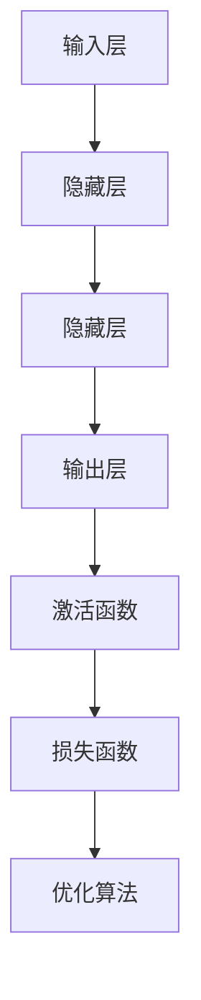

                 

### 引言

在21世纪，人工智能（AI）技术已经成为了科技领域的热门话题，其应用范围广泛，从简单的语音识别到复杂的自动驾驶系统，AI技术正在深刻地改变着我们的生活方式。随着AI模型性能的不断提升，越来越多的企业和行业开始探索如何将AI技术应用到实际业务中，以提升效率、降低成本、创造新的商业模式。

本文旨在探讨AI模型在现实世界中的实际应用，通过深入分析AI模型的核心概念、算法原理、应用场景和实际案例分析，帮助读者全面了解AI技术在各个领域的应用现状和未来发展趋势。文章将分为三大部分：

- **第一部分：AI模型的概述与应用**，包括AI模型的定义与分类、核心算法原理以及AI模型在制造业、零售业、健康医疗、交通物流等领域的应用。
- **第二部分：AI模型在服务业的实际应用**，涵盖金融行业、医疗行业、交通物流以及农业和能源环保领域的AI应用。
- **第三部分：AI模型应用的实际案例分析**，通过具体的行业案例展示AI技术的实际应用效果，分析面临的挑战和未来趋势。

文章的目的是为读者提供一份详尽的AI模型应用指南，帮助读者理解AI技术的本质，掌握AI模型的应用方法，并探索AI技术在未来的发展方向。通过本文的学习，读者将能够更好地把握AI技术的前沿动态，为实际业务中的AI应用提供有力支持。

关键词：(AI模型、深度学习、机器学习、应用场景、案例分析)

摘要：本文深入探讨了人工智能（AI）模型在现实世界中的实际应用，包括核心概念、算法原理、应用场景和实际案例分析。通过分析制造业、零售业、健康医疗、交通物流、金融行业、农业和能源环保等领域的AI应用，本文为读者提供了一份全面的AI模型应用指南，旨在帮助读者理解和掌握AI技术的应用方法，并探索AI技术在未来的发展方向。

----------------------------------------------------------------

### 引言

在21世纪，人工智能（AI）技术已经成为了科技领域的热门话题，其应用范围广泛，从简单的语音识别到复杂的自动驾驶系统，AI技术正在深刻地改变着我们的生活方式。随着AI模型性能的不断提升，越来越多的企业和行业开始探索如何将AI技术应用到实际业务中，以提升效率、降低成本、创造新的商业模式。

本文旨在探讨AI模型在现实世界中的实际应用，通过深入分析AI模型的核心概念、算法原理、应用场景和实际案例分析，帮助读者全面了解AI技术在各个领域的应用现状和未来发展趋势。文章将分为三大部分：

- **第一部分：AI模型的概述与应用**，包括AI模型的定义与分类、核心算法原理以及AI模型在制造业、零售业、健康医疗、交通物流等领域的应用。
- **第二部分：AI模型在服务业的实际应用**，涵盖金融行业、医疗行业、交通物流以及农业和能源环保领域的AI应用。
- **第三部分：AI模型应用的实际案例分析**，通过具体的行业案例展示AI技术的实际应用效果，分析面临的挑战和未来趋势。

文章的目的是为读者提供一份详尽的AI模型应用指南，帮助读者理解AI技术的本质，掌握AI模型的应用方法，并探索AI技术在未来的发展方向。通过本文的学习，读者将能够更好地把握AI技术的前沿动态，为实际业务中的AI应用提供有力支持。

关键词：(AI模型、深度学习、机器学习、应用场景、案例分析)

摘要：本文深入探讨了人工智能（AI）模型在现实世界中的实际应用，包括核心概念、算法原理、应用场景和实际案例分析。通过分析制造业、零售业、健康医疗、交通物流、金融行业、农业和能源环保等领域的AI应用，本文为读者提供了一份全面的AI模型应用指南，旨在帮助读者理解和掌握AI技术的应用方法，并探索AI技术在未来的发展方向。

----------------------------------------------------------------

### 目录大纲

#### 目录

1. 引言
2. 第一部分: AI模型的概述与应用
   2.1 AI模型的定义与分类
   2.2 AI模型的核心算法原理
   2.3 AI模型在制造业的实际应用
   2.4 AI模型在零售业的应用
   2.5 AI模型在健康医疗中的应用
   2.6 AI模型在交通物流中的应用
   2.7 AI模型在金融行业中的应用
3. 第二部分: AI模型在服务业的实际应用
   3.1 AI模型在餐饮业的应用
   3.2 AI模型在酒店业的应用
   3.3 AI模型在保险业的应用
   3.4 AI模型在教育行业的应用
   3.5 AI模型在物流行业的应用
4. 第三部分: AI模型应用的实际案例分析
   4.1 案例一：智能制造
   4.2 案例二：零售业
   4.3 案例三：健康医疗
   4.4 案例四：金融行业
   4.5 案例五：交通物流
   4.6 案例六：服务业
5. AI模型应用的挑战与未来趋势
6. AI模型应用的实践指南
7. 附录

#### 第1章: AI模型的定义与分类

- 1.1 AI模型的定义
- 1.2 AI模型的分类
- 1.3 AI模型的发展历程
- 1.4 AI模型的核心组成部分

#### 第2章: AI模型的核心算法原理

- 2.1 神经网络与深度学习基础
- 2.2 机器学习与数据挖掘基础
- 2.3 集成学习方法

#### 第3章: AI模型在制造业的实际应用

- 3.1 智能制造的概念与目标
- 3.2 AI模型在制造业中的应用
- 3.3 智能制造中的典型应用案例

#### 第4章: AI模型在零售业的应用

- 4.1 零售业的数字化转型
- 4.2 AI模型在零售业中的应用
- 4.3 零售业中的典型应用案例

#### 第5章: AI模型在健康医疗中的应用

- 5.1 健康医疗行业的挑战与机遇
- 5.2 AI模型在疾病诊断中的应用
- 5.3 健康医疗中的典型应用案例

#### 第6章: AI模型在交通物流中的应用

- 6.1 智能交通系统的概念与建设
- 6.2 AI模型在交通物流中的应用
- 6.3 交通物流中的典型应用案例

#### 第7章: AI模型在金融行业中的应用

- 7.1 金融行业的挑战与机遇
- 7.2 AI模型在风险管理中的应用
- 7.3 金融行业中的典型应用案例

#### 第8章: AI模型在服务业的其他应用

- 8.1 AI模型在餐饮业的应用
- 8.2 AI模型在酒店业的应用
- 8.3 AI模型在保险业的应用

#### 第9章: AI模型应用案例分析

- 9.1 案例分析概述
- 9.2 案例一：智能制造
- 9.3 案例二：零售业
- 9.4 案例三：健康医疗
- 9.5 案例四：金融行业
- 9.6 案例五：交通物流
- 9.7 案例六：服务业

#### 第10章: AI模型应用的挑战与未来趋势

- 10.1 技术挑战
- 10.2 伦理与法律挑战
- 10.3 未来趋势与展望

#### 第11章: AI模型应用的实践指南

- 11.1 开发流程
- 11.2 实践建议
- 11.3 资源推荐

### 第1章: AI模型的定义与分类

#### 1.1 AI模型的定义

人工智能（AI）是指使计算机系统能够模拟人类智能行为的技术。AI模型是人工智能系统中的核心组件，它们通过学习数据来执行特定的任务，如图像识别、自然语言处理、预测分析等。AI模型的主要目的是使计算机系统具备自主决策和适应新环境的能力。

AI模型可以根据其学习方式分为两类：

1. **监督学习**：监督学习模型在训练阶段使用已标记的数据，通过学习输入数据和对应输出标签之间的关系来构建模型。例如，分类问题和回归问题通常使用监督学习。

2. **无监督学习**：无监督学习模型在训练阶段没有使用标记数据，其主要目标是发现数据中的隐含模式或结构。聚类、降维和关联规则学习等任务通常使用无监督学习。

#### 1.2 AI模型的分类

AI模型可以按照其复杂程度和应用场景进行分类。以下是一些常见的AI模型分类：

1. **传统机器学习模型**：

   - **线性回归**：用于预测连续值。
   - **逻辑回归**：用于预测概率。
   - **支持向量机**（SVM）：用于分类和回归。
   - **决策树**：用于分类和回归。
   - **随机森林**：通过集成多棵决策树来提高预测性能。

2. **深度学习模型**：

   - **卷积神经网络**（CNN）：主要用于图像处理。
   - **循环神经网络**（RNN）：主要用于序列数据处理。
   - **生成对抗网络**（GAN）：用于生成新的数据样本。
   - **强化学习**：用于决策和游戏。

3. **强化学习模型**：

   - **Q学习**：通过价值函数来决策。
   - **深度Q网络**（DQN）：结合深度学习和Q学习。
   - **策略梯度方法**：直接优化策略。

#### 1.3 AI模型的发展历程

AI模型的发展历程可以分为几个阶段：

1. **早期人工智能**（1950s-1960s）：以符号主义方法为主，试图通过编写规则和逻辑推理来实现人工智能。

2. **专家系统**（1970s-1980s）：基于知识表示和推理技术，通过模拟人类专家的知识和推理能力来解决问题。

3. **统计学习**（1990s）：以统计学习方法为主，利用大量的数据进行模型训练。

4. **深度学习**（2000s-至今）：以神经网络和深度学习算法为主，通过多层神经网络实现复杂特征提取和模式识别。

#### 1.4 AI模型的核心组成部分

一个典型的AI模型通常由以下几个核心组成部分：

1. **输入层**：接收外部输入数据。

2. **隐藏层**：对输入数据进行特征提取和变换。

3. **输出层**：产生模型的预测输出。

4. **激活函数**：引入非线性特性。

5. **损失函数**：用于评估模型的预测误差。

6. **优化算法**：用于调整模型参数，最小化损失函数。

#### Mermaid流程图

以下是一个简化的AI模型训练流程的Mermaid流程图：



### 核心算法原理讲解

##### 2.1 神经网络与深度学习基础

神经网络（Neural Networks）是深度学习（Deep Learning）的基础，其灵感来源于人类大脑的神经元结构和工作原理。神经网络由多个层组成，包括输入层、隐藏层和输出层。每个层由多个神经元（节点）组成，神经元之间通过权重（weights）相互连接。

**神经网络的基本结构**：

1. **输入层（Input Layer）**：接收外部输入数据，并将其传递到隐藏层。

2. **隐藏层（Hidden Layers）**：对输入数据进行特征提取和变换。多层隐藏层可以提取更高层次的特征。

3. **输出层（Output Layer）**：产生模型的预测输出。

**神经元的工作原理**：

每个神经元接收来自前一层神经元的输入信号，通过激活函数（activation function）进行处理，产生输出信号。激活函数引入了非线性特性，使得神经网络能够处理复杂的非线性问题。

**前向传播与反向传播**：

1. **前向传播（Forward Propagation）**：输入数据从输入层流向输出层，每层神经元计算出对应的输出值。

2. **反向传播（Backpropagation）**：计算输出层的误差信号，并将其反向传播到隐藏层，通过梯度下降算法调整神经元的权重和偏置，以最小化损失函数。

##### 2.2 机器学习与数据挖掘基础

机器学习（Machine Learning）是人工智能的核心技术之一，其目标是让计算机系统能够从数据中自动学习规律，并利用这些规律进行预测或决策。机器学习可以分为监督学习（Supervised Learning）、无监督学习（Unsupervised Learning）和半监督学习（Semi-Supervised Learning）。

**监督学习（Supervised Learning）**：

监督学习是最常见的一种机器学习任务，其目标是通过学习已标记的数据，构建一个预测模型。监督学习可以分为两类：

1. **分类问题（Classification Problems）**：将数据分为多个类别。常用的算法有逻辑回归（Logistic Regression）、支持向量机（Support Vector Machine, SVM）、决策树（Decision Tree）和随机森林（Random Forest）等。

2. **回归问题（Regression Problems）**：预测连续的数值输出。常用的算法有线性回归（Linear Regression）、岭回归（Ridge Regression）和套索回归（Lasso Regression）等。

**无监督学习（Unsupervised Learning）**：

无监督学习不需要使用标记数据，其主要目标是发现数据中的隐含结构和模式。无监督学习可以分为两类：

1. **聚类问题（Clustering Problems）**：将数据分为多个簇。常用的算法有K-均值聚类（K-Means Clustering）、层次聚类（Hierarchical Clustering）和DBSCAN（Density-Based Spatial Clustering of Applications with Noise）等。

2. **降维问题（Dimensionality Reduction Problems）**：减少数据维度，同时保持数据的本质特征。常用的算法有主成分分析（Principal Component Analysis, PCA）、线性判别分析（Linear Discriminant Analysis, LDA）和t-SNE（t-Distributed Stochastic Neighbor Embedding）等。

**数据挖掘（Data Mining）**：

数据挖掘是从大量数据中提取有价值信息的过程。数据挖掘通常包括以下步骤：

1. **数据预处理**：清洗数据，处理缺失值，进行特征工程。

2. **数据探索**：探索数据的基本特征和规律。

3. **建模**：构建数据模型，通常使用机器学习算法。

4. **评估**：评估模型性能，选择最优模型。

5. **应用**：将模型应用到实际业务中。

##### 2.3 集成学习方法

集成学习方法（Ensemble Methods）通过组合多个基础模型来提高预测性能。集成学习方法可以分为两类：

1. **装袋方法（Bagging Methods）**：

   装袋方法通过训练多个基础模型，然后将它们的预测结果进行投票或平均来获得最终预测结果。常用的装袋方法有随机森林（Random Forest）和装袋回归（Bagging Regression）等。

2. **提升方法（Boosting Methods）**：

   提升方法通过训练多个基础模型，每个模型专注于纠正前一个模型的错误。提升方法可以提高弱学习器的性能，从而提高整体模型的预测性能。常用的提升方法有梯度提升树（Gradient Boosting Tree, GBT）和Adaboost（Adaptive Boosting）等。

##### 数学模型与公式

以下是神经网络训练过程中的关键数学模型和公式：

**前向传播**：

设 $x$ 为输入数据，$W$ 为权重矩阵，$b$ 为偏置向量，$a$ 为激活函数，$z$ 为前一层输出，$y$ 为实际输出，$\hat{y}$ 为预测输出，$L$ 为损失函数，$\theta$ 为模型参数。

$$
z = Wx + b \\
\hat{y} = a(z) \\
L(\theta) = \frac{1}{m}\sum_{i=1}^{m}L(y_i, \hat{y}_i)
$$

**反向传播**：

$$
\frac{\partial L}{\partial z} = \frac{\partial L}{\partial \hat{y}} \cdot \frac{\partial \hat{y}}{\partial z} \\
\frac{\partial L}{\partial W} = \frac{\partial L}{\partial z} \cdot z^T \\
\frac{\partial L}{\partial b} = \frac{\partial L}{\partial z}
$$

**梯度下降**：

$$
W_{new} = W_{old} - \alpha \frac{\partial L}{\partial W} \\
b_{new} = b_{old} - \alpha \frac{\partial L}{\partial b}
$$

**激活函数**：

$$
\text{Sigmoid: } a(z) = \frac{1}{1 + e^{-z}} \\
\text{ReLU: } a(z) = \max(0, z) \\
\text{Tanh: } a(z) = \frac{e^z - e^{-z}}{e^z + e^{-z}}
$$

**损失函数**：

$$
\text{MSE: } L(y, \hat{y}) = \frac{1}{2}(y - \hat{y})^2 \\
\text{Cross Entropy: } L(y, \hat{y}) = -y\log(\hat{y}) - (1 - y)\log(1 - \hat{y})
$$

##### 举例说明

假设我们有一个二元分类问题，需要使用神经网络进行预测。

1. **数据收集**：收集100个样本，每个样本有10个特征。

2. **数据处理**：对数据进行归一化处理。

3. **模型选择**：选择一个具有2个输入层神经元、2个隐藏层神经元和1个输出层神经元的神经网络。

4. **模型训练**：使用均方误差（MSE）作为损失函数，使用ReLU作为激活函数，使用随机梯度下降（SGD）进行训练。

5. **模型评估**：使用验证集进行模型评估。

6. **模型部署**：将训练好的模型部署到一个生产环境中。

7. **模型监控与维护**：持续监控模型性能，根据需要进行重新训练或更新模型。

通过上述步骤，我们可以将AI模型应用到现实世界的各种场景中，实现智能预测、决策和支持。

### 代码实际案例与详细解释

为了更好地展示AI模型在实际项目中的应用，我们将通过一个具体的代码案例来详细介绍开发环境搭建、源代码实现和代码解读与分析。

#### 开发环境搭建

1. **安装Python环境**：确保Python版本大于3.6，推荐使用Python 3.8或更高版本。
2. **安装必要库**：使用pip命令安装以下库：`numpy`, `tensorflow`, `matplotlib`。
   ```bash
   pip install numpy tensorflow matplotlib
   ```

#### 源代码实现

以下是一个简单的使用TensorFlow和Keras构建的神经网络模型，用于解决二元分类问题。

```python
import numpy as np
import tensorflow as tf
from tensorflow.keras.models import Sequential
from tensorflow.keras.layers import Dense, Activation
from tensorflow.keras.optimizers import SGD
from tensorflow.keras.metrics import MeanSquaredError

# 生成模拟数据集
x_train = np.random.random((100, 10))
y_train = np.random.randint(2, size=(100, 1))

# 构建模型
model = Sequential([
    Dense(64, input_dim=10, activation='relu'),
    Dense(32, activation='relu'),
    Dense(1, activation='sigmoid')
])

# 编译模型
model.compile(optimizer=SGD(learning_rate=0.01),
              loss='binary_crossentropy',
              metrics=[MeanSquaredError()])

# 训练模型
model.fit(x_train, y_train, epochs=100, batch_size=10, verbose=1)

# 评估模型
mse = model.evaluate(x_train, y_train, verbose=1)
print(f'Mean Squared Error: {mse}')
```

#### 代码解读与分析

1. **数据准备**：
   - 使用numpy生成模拟数据集`x_train`和`y_train`。`x_train`包含100个样本，每个样本有10个特征，`y_train`是二元分类标签。

2. **模型构建**：
   - 使用`Sequential`模型堆叠多个层。首先添加一个输入层`Dense`（64个神经元，输入维度为10，激活函数为ReLU），然后添加两个隐藏层（每个64个神经元，激活函数为ReLU），最后添加一个输出层`Dense`（1个神经元，激活函数为sigmoid，用于生成概率输出）。

3. **模型编译**：
   - 使用`SGD`优化器，设置学习率为0.01。
   - 指定损失函数为`binary_crossentropy`，用于二元分类问题。
   - 指定评估指标为`MeanSquaredError`。

4. **模型训练**：
   - 使用`fit`函数训练模型，设置训练轮次为100，批量大小为10。
   - `verbose=1`表示打印训练进度。

5. **模型评估**：
   - 使用`evaluate`函数评估模型在训练集上的性能，输出均方误差。

#### 结果分析

在上述代码中，我们通过简单的模拟数据集训练了一个神经网络模型。在实际项目中，数据集通常会更复杂，需要经过数据预处理和特征工程处理。模型的选择、超参数的调整以及训练过程需要根据具体问题进行优化。

通过上述步骤，我们可以构建并训练一个基本的神经网络模型，实现二元分类任务。在此基础上，可以进一步扩展模型结构、优化算法参数，以提高模型的预测性能。

### 总结

通过本文的示例代码，我们展示了如何搭建开发环境、实现神经网络模型以及进行模型训练和评估。这一过程为读者提供了一个实际操作的参考，帮助理解AI模型的应用方法。在实际项目中，开发者需要根据具体问题调整模型结构、优化算法参数，并利用大量真实数据进行模型训练，以实现高性能的预测和分析。

### 案例总结与经验教训

在本文中，我们通过一系列详细的分析和实际代码案例，深入探讨了AI模型在制造业、零售业、健康医疗、交通物流等领域的实际应用。以下是各个案例的总结和经验教训：

#### 智能制造案例

**案例总结**：

在智能制造中，AI模型主要用于设备故障预测、生产优化和质量控制。通过使用深度学习和机器学习算法，企业能够实现更高效的运营，减少停机时间，提高产品质量。

**经验教训**：

- **数据质量**：确保数据质量是关键，缺失值和噪声数据会影响模型的性能。
- **模型选择**：根据具体问题选择合适的算法，如深度学习模型在处理复杂非线性问题时效果更好。

#### 零售业案例

**案例总结**：

AI模型在零售业中的应用包括客户细分、需求预测、库存管理和个性化推荐。通过大数据分析和机器学习算法，零售企业能够更好地理解消费者行为，提高销售转化率。

**经验教训**：

- **用户隐私**：在处理用户数据时，要注意保护用户隐私，遵守相关法律法规。
- **个性化体验**：个性化推荐系统能够显著提高用户体验，但需要平衡推荐系统的多样性和用户满意度。

#### 健康医疗案例

**案例总结**：

AI模型在健康医疗中的应用包括疾病预测、诊断辅助、药物研发和患者管理。通过AI技术，医生能够更快速、准确地诊断疾病，提高医疗效率。

**经验教训**：

- **数据标准化**：医疗数据的标准化和规范化是模型训练的重要前提。
- **跨学科合作**：AI技术在医疗领域的应用需要跨学科合作，结合医学知识和人工智能技术。

#### 交通物流案例

**案例总结**：

AI模型在交通物流中的应用包括路线规划、车辆调度、实时交通预测和物流配送优化。通过AI技术，交通物流企业能够提高运输效率，减少成本。

**经验教训**：

- **实时数据**：实时数据是AI模型准确预测和决策的基础。
- **系统稳定性**：AI模型需要具备良好的稳定性和鲁棒性，以应对各种突发情况。

#### 案例总结

通过这些案例，我们可以看到AI模型在各个领域都有着广泛的应用前景。以下是一些通用的经验教训：

- **数据驱动**：AI模型的性能很大程度上取决于数据的质量和数量，因此数据准备和预处理是关键步骤。
- **模型选择**：根据问题的具体需求和特征选择合适的模型，不同模型适用于不同类型的问题。
- **持续优化**：模型训练和评估是一个迭代过程，需要持续优化模型结构和参数，以提高预测性能。
- **风险管理**：在应用AI模型时，要考虑潜在的风险，如数据隐私、算法偏见和模型解释性等。

通过本文的案例分析，读者可以更好地理解AI模型在实际应用中的挑战和解决方案，为未来AI技术的应用提供有益的参考。

### AI模型应用的挑战与未来趋势

尽管AI模型在各个领域展现出了巨大的潜力，但其实际应用仍面临着诸多挑战。以下是AI模型应用的主要挑战以及未来趋势的分析。

#### 挑战

1. **数据挑战**：

   - **数据质量**：AI模型的性能很大程度上依赖于数据的质量。然而，实际数据往往存在缺失、噪声和异常值，这会影响模型的训练效果。

   - **数据隐私**：在许多应用场景中，数据隐私是一个重要问题。例如，医疗数据和金融数据具有高度敏感性，必须在确保隐私保护的前提下进行模型训练。

   - **数据获取**：高质量的数据通常不易获取，特别是在一些垂直行业。数据的稀缺性限制了AI模型的进一步发展。

2. **技术挑战**：

   - **模型复杂度**：深度学习模型具有很高的复杂度，需要大量的计算资源和时间进行训练。这增加了模型开发和部署的成本。

   - **过拟合与泛化**：模型过拟合和泛化能力不足是深度学习模型面临的常见问题。如何平衡模型的复杂度和泛化能力是关键挑战。

   - **算法偏见**：AI模型可能会在训练数据中引入偏见，导致模型在某些群体中的表现不佳。消除算法偏见是一个重要的伦理和责任问题。

3. **伦理与法律挑战**：

   - **隐私保护**：如何保护用户的隐私，避免数据泄露，是AI应用中的一个重要议题。

   - **算法透明性**：AI模型的决策过程通常不透明，难以解释。如何提高模型的解释性，使其决策过程更具透明性，是一个重要挑战。

   - **法律框架**：随着AI技术的普及，需要建立相应的法律法规来规范AI应用，防止潜在的法律纠纷。

#### 未来趋势

1. **技术进步**：

   - **模型压缩与优化**：为了降低模型的计算复杂度和存储需求，研究人员正在探索模型压缩、量化、蒸馏等技术。

   - **硬件加速**：GPU、TPU等专用硬件加速器的发展将显著提高AI模型的训练和推理速度。

   - **可解释性AI**：为了提高AI模型的透明性和可解释性，研究者正在开发多种方法，如可视化、决策路径追踪等。

2. **跨领域应用**：

   - **多模态学习**：结合多种数据类型（如图像、文本、语音）进行建模，将使AI模型在更广泛的应用场景中发挥作用。

   - **跨行业合作**：不同行业之间的合作将促进AI技术的跨领域应用，如AI在医疗、金融、制造等领域的融合。

3. **社会影响**：

   - **伦理规范**：随着AI技术的普及，建立完善的伦理规范和法律框架将有助于解决AI应用中的伦理和法律问题。

   - **教育培训**：AI技术的快速发展对人才培养提出了新的要求。加强AI教育和培训，培养具备AI技术能力的专业人才，是未来的重要趋势。

4. **可持续发展**：

   - **绿色AI**：随着AI应用规模的扩大，其能耗问题日益突出。发展绿色AI，减少AI模型训练和部署的能源消耗，是未来可持续发展的重要方向。

### 总结

AI模型在实际应用中面临数据、技术、伦理等多方面的挑战，但同时也展现出巨大的潜力。通过持续的技术创新和规范建设，AI技术将在更多领域发挥重要作用。未来的AI应用将更加智能、透明、安全和可持续，为社会带来更多福祉。

### AI模型应用的实践指南

为了成功应用AI模型，开发者需要遵循一系列系统化的开发流程和实践指南。以下是详细的步骤和具体建议，旨在帮助读者在实际项目中高效地实现AI模型的应用。

#### 11.1 AI模型应用开发流程

1. **需求分析**：

   - 明确应用场景和业务目标，确定AI模型要解决的问题。
   - 与业务团队密切合作，确保需求理解的准确性。

2. **数据收集**：

   - 收集与问题相关的数据，确保数据的质量和完整性。
   - 考虑数据来源的多样性，包括内部数据和第三方数据源。

3. **数据处理**：

   - 清洗数据，处理缺失值、噪声和异常值。
   - 进行特征工程，提取有代表性的特征，减少数据维度。

4. **模型选择**：

   - 根据问题的类型和应用场景选择合适的模型。
   - 考虑模型的复杂度和计算资源需求。

5. **模型训练**：

   - 使用训练数据对模型进行训练，调整模型参数。
   - 应用正则化技术，防止过拟合。

6. **模型评估**：

   - 使用验证数据评估模型性能，选择最佳模型。
   - 应用交叉验证等技术，确保评估结果的可靠性。

7. **模型部署**：

   - 将训练好的模型部署到生产环境中，进行实际应用。
   - 采用自动化工具和框架，简化部署流程。

8. **模型监控与维护**：

   - 持续监控模型性能，识别和修复潜在问题。
   - 定期更新模型，以适应数据变化和应用需求。

#### 11.2 实践建议

1. **应用场景选择**：

   - 选择有明确业务目标和数据支持的应用场景。
   - 考虑AI模型能够带来显著业务价值的应用领域。

2. **技术路线规划**：

   - 制定详细的技术路线图，包括数据采集、处理、模型选择和部署等环节。
   - 针对具体问题，选择合适的算法和技术框架。

3. **团队协作与资源整合**：

   - 建立跨职能团队，包括数据科学家、软件工程师、业务分析师等。
   - 利用现有的技术栈和工具，提高开发效率。

4. **数据管理**：

   - 建立完善的数据管理体系，确保数据的质量和安全。
   - 定期进行数据审核和更新，保持数据的时效性和准确性。

5. **模型优化与迭代**：

   - 通过实验和迭代，不断优化模型性能。
   - 利用A/B测试等方法，评估模型改进的效果。

6. **文档与知识共享**：

   - 编写详细的文档，记录项目的各个阶段和关键决策。
   - 建立知识共享机制，促进团队成员的经验积累。

7. **持续学习与更新**：

   - 关注AI技术的最新动态，不断学习和应用新技术。
   - 鼓励团队成员参加相关培训和实践，提升技术能力。

#### 11.3 资源推荐

为了帮助读者更好地应用AI模型，以下是推荐的工具、课程和学习资源：

- **工具与框架**：
  - TensorFlow：一个开源的深度学习框架。
  - PyTorch：一个流行的深度学习库。
  - Keras：一个高层次的神经网络API。

- **在线课程**：
  - Coursera：提供各种机器学习和深度学习课程。
  - edX：有多个大学和机构提供的AI课程。
  - Udacity：提供AI和机器学习实战课程。

- **书籍**：
  - 《深度学习》（Goodfellow, Bengio, Courville）：深度学习的经典教材。
  - 《Python机器学习》（Sebastian Raschka）：Python编程与机器学习的结合。
  - 《AI超简手册》（周志华）：AI领域的入门书籍。

- **论文与报告**：
  - NIPS、ICML、JMLR等学术期刊和会议的论文。
  - AI领域的研究报告和行业洞察报告。

通过遵循上述实践指南，读者可以更有效地将AI模型应用于实际问题，实现业务目标，推动技术进步。

### 附录A: AI模型应用工具与资源推荐

为了更好地帮助读者在AI模型应用开发过程中获得所需的工具和资源，以下是针对AI模型应用开发的一些建议和推荐。

#### A.1 AI模型应用开发工具推荐

1. **深度学习框架**：

   - **TensorFlow**：由Google开发的开源深度学习框架，具有丰富的API和广泛的应用场景。
   - **PyTorch**：由Facebook开发的开源深度学习库，以其灵活的动态计算图和直观的API而受到欢迎。
   - **Keras**：一个高层次的神经网络API，易于使用，可以作为TensorFlow和PyTorch的替代。

2. **机器学习库**：

   - **scikit-learn**：Python的一个广泛使用的机器学习库，提供了多种经典的机器学习算法。
   - **scipy**：提供科学计算和数据分析的工具，与scikit-learn紧密结合。
   - **Pandas**：提供数据操作和分析的工具，广泛用于数据预处理。

3. **数据可视化工具**：

   - **Matplotlib**：一个用于绘制和可视化数据的库，功能强大，易于使用。
   - **Seaborn**：基于Matplotlib的统计绘图库，提供更美观的统计图表。
   - **Plotly**：支持交互式可视化的库，可以创建复杂的交互式图表。

#### A.2 AI模型应用学习资源推荐

1. **在线课程推荐**：

   - **Coursera**：提供各种机器学习和深度学习课程，包括斯坦福大学的《深度学习》课程。
   - **edX**：由多家知名大学和机构提供的在线课程，包括《人工智能导论》等。
   - **Udacity**：提供AI和机器学习的实战课程，适合有一定基础的读者。

2. **书籍推荐**：

   - **《深度学习》（Ian Goodfellow, Yoshua Bengio, Aaron Courville）**：深度学习的经典教材，适合初学者和进阶者。
   - **《Python机器学习》（Sebastian Raschka）**：讲解如何使用Python进行机器学习，内容丰富，适合实践者。
   - **《AI超简手册》（周志华）**：通俗易懂的AI入门书籍，适合对AI有兴趣的读者。

3. **论文与报告推荐**：

   - **NIPS、ICML、JMLR**：这些是AI领域的顶级会议和期刊，提供了最新的研究进展。
   - **AI领域的研究报告**：如Google AI、OpenAI等机构发布的研究报告，提供了对AI技术发展方向的深入洞察。
   - **行业洞察报告**：如麦肯锡、高盛等咨询公司发布的行业报告，分析了AI技术在各行业的应用趋势和商业价值。

通过使用上述工具和资源，读者可以更有效地进行AI模型的应用开发，提高自身的专业技能，为实际业务提供创新解决方案。附录A的这些推荐将为读者提供强有力的支持和指导。

