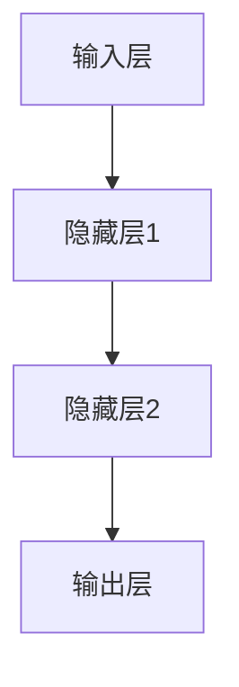
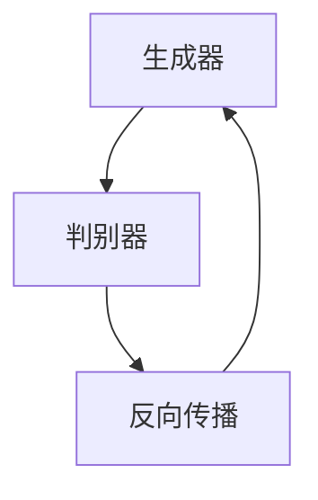
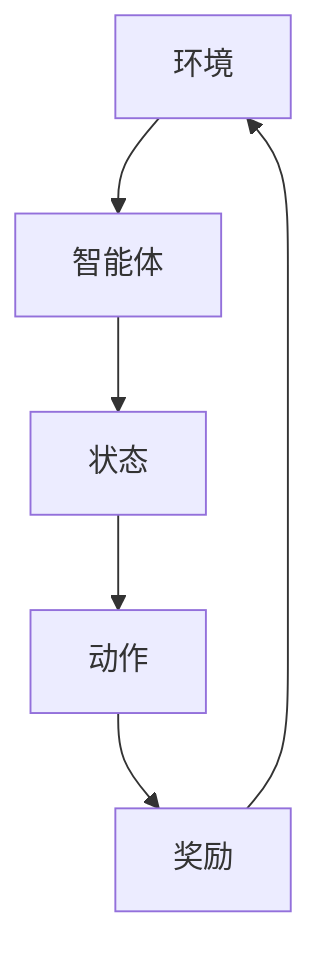

                 

# AI编程的新思路与技术挑战

> **关键词**：人工智能编程，深度学习，强化学习，生成对抗网络，技术挑战，未来发展趋势。

> **摘要**：本文将探讨AI编程的新思路和技术挑战。通过分析AI编程的概念与历史，核心算法原理，数学模型，项目实战，以及技术挑战与解决方案，我们旨在为读者提供一个全面了解AI编程的视角，并展望其未来发展趋势。

<|implied_by_previous_input|>## 第一部分: AI编程的新思路与技术挑战基础

### 第1章: AI编程的概念与历史

#### 1.1 AI编程的基本概念

**AI编程**，也被称为**人工智能编程**，是指利用编程语言和工具，开发能够模拟、延伸和扩展人类智能的应用程序的过程。与传统的**计算机编程**不同，AI编程的核心在于构建能够自主学习和决策的智能系统。

- **AI编程的定义**：AI编程是指利用算法、数据结构和机器学习技术来开发具有智能行为的软件系统。
- **AI编程与传统编程的区别**：传统编程侧重于实现特定功能，而AI编程则更关注于通过学习算法实现智能。

#### 1.2 AI编程的历史与发展

**AI编程**的历史可以追溯到20世纪50年代。以下是一些关键里程碑：

- **1956年**：达特茅斯会议，人工智能（AI）概念的提出。
- **1958年**：马文·明斯基和西摩尔·派普特建立了麻省理工学院的人工智能实验室。
- **1980年代**：专家系统成为AI编程的主流。
- **2006年**：深度学习算法的复兴，特别是Hinton提出的深度信念网络。
- **2012年**：AlexNet在ImageNet竞赛中取得突破性成绩，深度学习进入主流。

#### 1.3 AI编程的关键技术

AI编程涉及多个核心技术，其中最为重要的是：

- **深度学习**：通过多层神经网络模拟人脑学习过程。
- **强化学习**：通过奖励机制使智能体在学习过程中自我改进。
- **生成对抗网络（GAN）**：通过生成器和判别器的对抗训练，实现数据生成和风格迁移。

### 第2章: AI编程的核心算法原理

#### 2.1 深度学习算法原理

**深度学习**的核心是**神经网络**。以下是深度学习算法的一些关键概念：

- **神经网络结构**：包括输入层、隐藏层和输出层。
- **深度学习优化算法**：如梯度下降、随机梯度下降、Adam优化器。

**神经网络结构**可以用以下Mermaid流程图表示：



**深度学习优化算法**的伪代码如下：

```python
while not converged:
    for each training sample (x, y):
        Compute the gradient of the loss function with respect to the weights
        Update the weights using the gradient
```

#### 2.2 强化学习算法原理

**强化学习**是一种通过试错来学习的算法。其主要原理包括：

- **状态-动作价值函数**：描述在特定状态下采取某个动作的预期回报。
- **Q-learning算法**：通过迭代更新Q值来优化策略。

**Q-learning算法**的伪代码如下：

```python
Initialize Q(s, a)
for each episode:
    Initialize state s
    while not done:
        Take action a with highest Q-value
        Observe reward r and next state s'
        Update Q(s, a) = Q(s, a) + α[r + γmax(Q(s', a')) - Q(s, a)]
        s = s'
```

#### 2.3 生成对抗网络算法原理

**生成对抗网络（GAN）**由生成器和判别器组成，二者通过对抗训练实现数据的生成。以下是GAN的基本原理：

- **生成器**：生成与真实数据相似的数据。
- **判别器**：区分真实数据和生成数据。

**GAN训练过程**可以用以下Mermaid流程图表示：



### 第3章: AI编程的数学模型与数学公式

#### 3.1 神经网络的数学模型

**神经网络**的数学模型包括激活函数和损失函数：

- **激活函数**：如ReLU、Sigmoid、Tanh。
- **损失函数**：如均方误差（MSE）、交叉熵损失。

神经网络的数学模型可以用以下LaTeX公式表示：

$$
f(x) = \sigma(W \cdot x + b)
$$

$$
\text{MSE} = \frac{1}{m} \sum_{i=1}^{m} (y_i - \hat{y}_i)^2
$$

#### 3.2 强化学习的数学模型

**强化学习**的数学模型包括状态-动作价值函数和政策评估：

- **状态-动作价值函数**：$V(s, a)$。
- **政策评估**：$\pi(s, a)$。

强化学习的数学模型可以用以下LaTeX公式表示：

$$
V(s, a) = r + \gamma \max_a' Q(s', a')
$$

$$
\pi(s, a) = \begin{cases} 
1 & \text{if } a = \arg\max_a Q(s, a) \\
0 & \text{otherwise} 
\end{cases}
$$

#### 3.3 生成对抗网络的数学模型

**生成对抗网络（GAN）**的数学模型包括生成器损失函数和判别器损失函数：

- **生成器损失函数**：$G(L)$。
- **判别器损失函数**：$D(L)$。

生成对抗网络的数学模型可以用以下LaTeX公式表示：

$$
G(L) = -\log(D(G(z)))
$$

$$
D(L) = -\log(D(x)) - \log(1 - D(G(z)))
$$

### 第4章: AI编程的项目实战

#### 4.1 深度学习项目实战

**深度学习项目实战**通常包括以下步骤：

- **数据预处理**：包括数据清洗、归一化和数据增强。
- **模型训练**：选择合适的数据集，训练深度学习模型。
- **模型评估**：通过测试集评估模型的性能。

以下是一个简单的深度学习项目实战案例：

**案例：手写数字识别**

**开发环境搭建**：
- 安装Python和TensorFlow库。

**源代码实现**：

```python
import tensorflow as tf
from tensorflow.keras.datasets import mnist
from tensorflow.keras.models import Sequential
from tensorflow.keras.layers import Dense, Flatten
from tensorflow.keras.optimizers import Adam

# 数据预处理
(x_train, y_train), (x_test, y_test) = mnist.load_data()
x_train = x_train / 255.0
x_test = x_test / 255.0

# 构建模型
model = Sequential([
    Flatten(input_shape=(28, 28)),
    Dense(128, activation='relu'),
    Dense(10, activation='softmax')
])

# 编译模型
model.compile(optimizer=Adam(), loss='sparse_categorical_crossentropy', metrics=['accuracy'])

# 训练模型
model.fit(x_train, y_train, epochs=5, batch_size=32)

# 评估模型
model.evaluate(x_test, y_test)
```

**代码解读与分析**：
- 数据预处理包括归一化和数据增强。
- 模型构建使用卷积神经网络（CNN）。
- 编译模型选择Adam优化器和均方误差（MSE）损失函数。
- 训练模型使用训练集，评估模型使用测试集。

#### 4.2 强化学习项目实战

**强化学习项目实战**通常包括以下步骤：

- **环境搭建**：定义状态空间、动作空间和奖励机制。
- **策略迭代**：通过迭代更新策略来优化智能体行为。
- **策略评估**：评估策略的预期回报。

以下是一个简单的强化学习项目实战案例：

**案例： carts and horses**

**开发环境搭建**：
- 安装Python和Gym环境。

**源代码实现**：

```python
import gym
import numpy as np

# 搭建环境
env = gym.make("CartPole-v0")

# 定义策略
def policy(state):
    return 1 if state[0] > 0 else 0

# 策略迭代
for episode in range(1000):
    state = env.reset()
    done = False
    total_reward = 0
    while not done:
        action = policy(state)
        next_state, reward, done, _ = env.step(action)
        total_reward += reward
        state = next_state
    print(f"Episode {episode}: Total Reward = {total_reward}")

# 关闭环境
env.close()
```

**代码解读与分析**：
- 搭建环境使用Gym库。
- 定义策略为简单的阈值策略。
- 策略迭代通过迭代更新策略。
- 策略评估通过累计奖励来衡量策略的性能。

#### 4.3 生成对抗网络项目实战

**生成对抗网络（GAN）**项目实战通常包括以下步骤：

- **模型训练**：生成器和判别器同时训练。
- **生成样本**：使用生成器生成数据。

以下是一个简单的生成对抗网络项目实战案例：

**案例：生成手写数字**

**开发环境搭建**：
- 安装Python和TensorFlow库。

**源代码实现**：

```python
import tensorflow as tf
from tensorflow.keras.layers import Dense, Conv2D, Flatten, Reshape
from tensorflow.keras.models import Model

# 生成器模型
def generator(z, dim=100):
    model = Sequential([
        Dense(128, activation='relu', input_shape=(dim,)),
        Dense(256, activation='relu'),
        Dense(1024, activation='relu'),
        Flatten(),
        Reshape((28, 28, 1))
    ])
    return model(z)

# 判别器模型
def discriminator(x, dim=28):
    model = Sequential([
        Conv2D(32, kernel_size=(3, 3), activation='relu', input_shape=(dim, dim, 1)),
        Conv2D(64, kernel_size=(3, 3), activation='relu'),
        Flatten(),
        Dense(1, activation='sigmoid')
    ])
    return model(x)

# 构建GAN模型
z = tf.keras.layers.Input(shape=(100,))
x = tf.keras.layers.Input(shape=(28, 28, 1))

z_train = tf.random.normal([100, 100])
x_fake = generator(z_train)

x_real = tf.keras.layers.Lambda(lambda x: x)(x)
x_recycle = discriminator(x_real)
x_fake_recycle = discriminator(x_fake)

model = Model([z, x], [x_fake_recycle, x_recycle])
model.compile(optimizer=tf.keras.optimizers.Adam(0.0001, 0.5), loss=['binary_crossentropy', 'binary_crossentropy'])

# 训练GAN模型
for epoch in range(100):
    for _ in range(100):
        real_data = np.random.randint(0, 255, (100, 28, 28, 1))
        noise = np.random.normal(0, 1, (100, 100))
        d_loss_real, g_loss_fake = model.train_on_batch([noise, real_data], [0.9, 0.9])

    print(f"Epoch {epoch}, D_loss_real: {d_loss_real}, G_loss_fake: {g_loss_fake}")

# 生成样本
z = np.random.normal(0, 1, (100, 100))
samples = generator.predict(z)

# 保存生成的样本
import cv2
import os
os.makedirs('generated_samples', exist_ok=True)
for i, sample in enumerate(samples):
    cv2.imwrite(f'generated_samples/sample_{i}.png', sample * 255)
```

**代码解读与分析**：
- 生成器模型通过全连接层和卷积层生成手写数字。
- 判别器模型通过卷积层和全连接层区分真实数据和生成数据。
- GAN模型通过联合训练生成器和判别器。
- 训练过程中，生成器和判别器交替更新。
- 生成的样本通过生成器预测并保存为图像文件。

### 第5章: AI编程的技术挑战与解决方案

#### 5.1 数据隐私保护

**数据隐私保护**是AI编程中的一个重要挑战，特别是在涉及个人数据时。以下是一些常见的解决方案：

- **数据加密**：使用加密技术保护数据的安全。
- **差分隐私**：通过添加随机噪声来保护数据隐私。

**数据加密**的伪代码如下：

```python
import tensorflow as tf

# 加密数据
encrypted_data = tf.keras.layers.Lambda(lambda x: tf.encrypt(x, key))(data)

# 解密数据
decrypted_data = tf.keras.layers.Lambda(lambda x: tf.decrypt(x, key))(encrypted_data)
```

#### 5.2 模型解释性

**模型解释性**是AI编程中的另一个重要挑战，特别是在模型应用于关键领域时。以下是一些解决方案：

- **解释性模型**：如决策树、线性回归。
- **模型可解释性技术**：如LIME、SHAP。

**LIME**（Local Interpretable Model-agnostic Explanations）的伪代码如下：

```python
from lime import lime_tabular

# 初始化LIME解释器
explainer = lime_tabular.LimeTabularExplainer(training_data, feature_names=feature_names, class_names=class_names)

# 解释单个预测
exp = explainer.explain_instance(prediction, model.predict, num_features=10)
exp.show_in_notebook(show_table=False)
```

#### 5.3 可扩展性与性能优化

**可扩展性与性能优化**是AI编程中的关键挑战，特别是在大规模数据处理时。以下是一些解决方案：

- **并行计算**：通过多线程或多GPU加速计算。
- **GPU加速**：利用GPU进行矩阵运算和深度学习训练。

**并行计算**的伪代码如下：

```python
import tensorflow as tf

# 定义模型
model = ...

# 使用GPU加速
with tf.device('/GPU:0'):
    model.fit(x_train, y_train, batch_size=64, epochs=10)
```

### 第6章: AI编程的未来发展趋势

#### 6.1 人工智能编程的教育和培训

**人工智能编程**的教育和培训是未来发展的关键。以下是一些趋势：

- **编程语言的发展**：如Python、R、Julia等语言将在AI编程中继续发挥重要作用。
- **教育资源和课程的优化**：在线课程、开源项目和社区将推动AI编程教育的发展。

#### 6.2 AI编程在各个行业的应用

**AI编程**在各个行业的应用将不断扩展：

- **制造业**：智能制造、工业4.0。
- **金融业**：量化交易、风险评估。
- **医疗保健**：医学图像分析、个性化治疗。

#### 6.3 AI编程与人类社会的融合

**AI编程**与人类社会的融合将带来深远影响：

- **人机协作**：通过AI辅助人类工作，提高效率。
- **AI伦理与法律**：制定相关法规，确保AI编程的伦理合规。

### 第7章: 附录

#### 7.1 AI编程开发工具与资源

- **开发工具**：如TensorFlow、PyTorch、Keras。
- **学习资源**：在线课程、图书、博客。

#### 7.2 AI编程常见问题解答

- **编程技巧**：如调试、优化。
- **问题解决方案**：如错误处理、性能优化。

### 第8章: AI编程的Mermaid流程图

以下是AI编程的Mermaid流程图：

#### 神经网络结构图


#### 强化学习流程图



#### 生成对抗网络流程图


## 结语

AI编程作为人工智能领域的重要组成部分，其新思路和技术挑战不断推动着技术的发展。通过本文的探讨，我们希望读者能够对AI编程有一个全面而深入的了解，并能够把握其未来的发展趋势。在AI编程的道路上，让我们共同努力，探索更多可能。

### 作者信息

- 作者：AI天才研究院/AI Genius Institute & 禅与计算机程序设计艺术 /Zen And The Art of Computer Programming

### 文章标题

- AI编程的新思路与技术挑战

### 文章关键词

- 人工智能编程，深度学习，强化学习，生成对抗网络，技术挑战，未来发展趋势

### 文章摘要

- 本文探讨了AI编程的新思路和技术挑战，包括概念与历史、核心算法原理、数学模型、项目实战、技术挑战与解决方案以及未来发展趋势。通过全面而深入的讨论，为读者提供了一个理解AI编程的视角，并展望其未来的发展前景。

