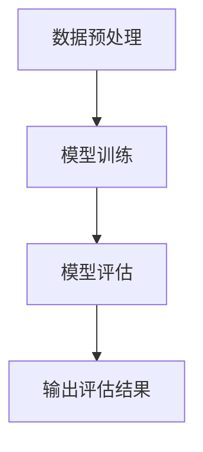

                 

### 第一部分: 引言与概述

#### 1.1 书籍简介

《AI驱动的众包平台：增强机会》是一本深入探讨人工智能（AI）与众包结合的理论与实践书籍。随着互联网和大数据技术的快速发展，众包作为一种新型的协作模式，已经在各行各业中得到了广泛应用。而AI技术的崛起，则为众包平台带来了前所未有的机遇。

**1.1.1 书籍背景**

本书的背景是基于当前AI技术的迅猛发展和众包模式的广泛应用。AI技术，特别是机器学习和深度学习，使得计算机能够处理和分析大量数据，实现智能化的决策和预测。而众包模式，则通过将复杂任务分散到大量普通用户中，以低成本、高效率的方式完成项目。

**1.1.2 书籍目标**

本书的目标是探讨AI驱动的众包平台如何通过技术手段优化任务分配、提高数据质量、增强用户体验。具体来说，本书将回答以下几个关键问题：

1. AI技术如何应用于众包平台？
2. 如何设计一个高效、可靠的AI驱动的众包平台？
3. 在AI驱动的众包平台中，如何确保数据质量和用户隐私？
4. AI驱动的众包平台在不同行业中的应用前景和挑战是什么？

**1.1.3 主要内容概述**

本书共分为五个部分，结构如下：

- **第一部分：引言与概述**，介绍书籍的背景、目标和主要内容。
- **第二部分：AI驱动的众包平台基础**，讨论AI技术基础、众包平台架构设计、数据采集与管理。
- **第三部分：AI驱动的众包平台应用**，分析应用领域、平台开发实战、用户与任务管理。
- **第四部分：成功案例分析**，介绍典型成功案例，并进行详细分析。
- **第五部分：未来展望**，探讨AI驱动的众包平台发展趋势、创新与机会。

通过这本书，读者可以全面了解AI驱动的众包平台的理论和实践，掌握相关技术，并为实际应用提供参考。

### 《AI驱动的众包平台：增强机会》目录大纲

#### # 第二部分: AI驱动的众包平台基础

#### 2.1 AI技术基础

#### 2.1.1 AI的基本原理

人工智能（AI）是一种模拟人类智能的技术，通过机器学习、自然语言处理、计算机视觉等技术，使计算机能够实现人类智能任务。AI的基本原理可以概括为以下几点：

1. **数据驱动**：AI模型通过大量数据学习规律，从而实现预测和决策。数据的质量和数量直接影响模型的性能。

2. **模型训练**：AI模型通过训练过程学习数据中的特征和模式。训练过程包括数据预处理、模型选择、参数调整等步骤。

3. **推理应用**：训练好的模型可以通过推理过程对新的数据进行预测或决策。推理过程需要快速、准确，以保证实际应用中的效果。

4. **迭代优化**：AI模型不是一成不变的，而是需要通过不断的迭代优化来提高性能。优化过程包括模型更新、参数调整、数据扩充等。

**2.1.2 机器学习与深度学习**

机器学习（ML）是AI的核心技术之一，主要研究如何让计算机通过学习数据来改进性能。机器学习可以分为监督学习、无监督学习和强化学习。

- **监督学习**：有明确的目标变量，通过学习输入和输出之间的关系来预测新数据的目标。常用的算法包括线性回归、逻辑回归、支持向量机等。

- **无监督学习**：没有明确的目标变量，通过学习数据中的内在结构或模式来发现数据规律。常用的算法包括聚类、降维、关联规则等。

- **强化学习**：通过不断与环境交互，学习最优策略来最大化长期回报。常用的算法包括Q-learning、深度Q网络（DQN）等。

深度学习（DL）是机器学习的一个分支，通过多层神经网络模型来模拟人脑的学习过程。深度学习模型具有强大的表示能力和学习能力，可以处理大量复杂数据。

**2.1.3 常见AI模型与算法**

常见的AI模型和算法包括以下几种：

- **神经网络**：神经网络是一种模拟人脑神经元连接结构的计算模型。包括多层感知器（MLP）、卷积神经网络（CNN）、循环神经网络（RNN）等。

- **支持向量机（SVM）**：支持向量机是一种二分类模型，通过寻找最优的超平面来分隔数据。SVM在图像识别、文本分类等领域有广泛应用。

- **决策树**：决策树是一种基于树形结构进行决策的模型，通过一系列条件判断来预测数据。决策树在数据挖掘和机器学习中有广泛应用。

- **贝叶斯网络**：贝叶斯网络是一种概率图模型，通过节点之间的条件概率来表示变量之间的关系。贝叶斯网络在风险评估、医疗诊断等领域有广泛应用。

- **聚类算法**：聚类算法是将数据划分为若干个簇，使得簇内的数据相似度较高，簇间的数据相似度较低。常用的聚类算法包括K-means、层次聚类、DBSCAN等。

这些AI模型和算法在AI驱动的众包平台中有着广泛的应用。例如，可以使用神经网络进行图像识别，使用支持向量机进行文本分类，使用决策树进行任务分配等。

#### 2.2 众包平台架构设计

**2.2.1 众包平台的基本架构**

众包平台的基本架构通常包括以下几个核心组件：

1. **任务发布系统**：任务发布系统是众包平台的核心模块，用于任务创建、任务分配和任务管理。任务发布系统需要提供任务描述、任务标签、任务预算等关键信息。

2. **任务接收系统**：任务接收系统用于接收和审核用户的任务申请。任务接收系统需要能够处理大量的并发请求，并提供用户友好的界面。

3. **任务管理系统**：任务管理系统用于监控和管理任务的执行情况。任务管理系统需要能够实时更新任务状态、处理异常情况，并提供任务完成率、用户评分等数据。

4. **数据存储系统**：数据存储系统用于存储任务数据、用户数据和管理数据。数据存储系统需要支持海量数据的存储和快速查询。

5. **用户管理系统**：用户管理系统用于管理用户信息、用户权限和用户反馈。用户管理系统需要提供用户注册、登录、个人信息管理等功能。

**2.2.2 AI驱动的众包平台架构**

AI驱动的众包平台在基本架构的基础上，引入了人工智能技术，以优化任务分配、提高数据质量和提升用户体验。AI驱动的众包平台架构通常包括以下几个关键组件：

1. **AI模型训练系统**：AI模型训练系统用于训练和部署AI模型。训练系统需要支持不同的机器学习框架和算法，并提供模型训练、模型评估和模型部署等功能。

2. **任务分配系统**：任务分配系统基于AI模型对用户和任务进行智能分配。任务分配系统需要能够根据用户技能、任务难度、用户反馈等因素，为用户提供合适的任务。

3. **数据质量控制系统**：数据质量控制系统用于检测和处理任务数据中的错误和异常。质量控制系统需要能够自动识别数据质量问题，并提供修正建议。

4. **用户反馈系统**：用户反馈系统用于收集和分析用户对任务和平台的反馈。反馈系统需要能够实时更新用户评价、用户满意度等数据，并为任务分配和平台优化提供依据。

**2.2.3 平台关键组件解析**

以下是AI驱动的众包平台关键组件的详细解析：

1. **任务发布系统**

任务发布系统是众包平台的核心组件之一，负责任务创建、任务分配和任务管理。任务发布系统通常包括以下功能：

- **任务创建**：用户可以创建新的任务，包括任务名称、任务描述、任务标签、任务预算等关键信息。
- **任务发布**：用户可以发布任务，并将其推送给合适的用户。
- **任务审核**：平台管理员可以对用户发布的任务进行审核，以确保任务的真实性和合法性。
- **任务管理**：用户可以查看任务的执行状态、修改任务信息、暂停或终止任务等。

2. **任务接收系统**

任务接收系统用于接收和审核用户的任务申请。任务接收系统通常包括以下功能：

- **用户注册**：用户可以通过注册账号加入众包平台，并创建个人资料。
- **用户登录**：用户可以使用账号登录平台，查看任务列表、申请任务等。
- **任务申请**：用户可以申请符合自己技能和兴趣的任务。
- **任务审核**：平台管理员可以对用户的任务申请进行审核，并分配任务。

3. **任务管理系统**

任务管理系统用于监控和管理任务的执行情况。任务管理系统通常包括以下功能：

- **任务状态监控**：实时更新任务状态，包括任务进度、任务完成情况等。
- **任务调度**：根据任务难度、用户技能等因素，合理分配任务。
- **任务完成率**：统计任务的完成情况，评估平台的运营效率。
- **用户评分**：用户可以对完成任务的用户进行评分，评价用户质量。

4. **数据存储系统**

数据存储系统用于存储任务数据、用户数据和管理数据。数据存储系统通常包括以下功能：

- **数据存储**：支持海量数据的存储和快速查询，确保数据的安全和可靠性。
- **数据备份**：定期备份数据，防止数据丢失和损坏。
- **数据恢复**：在数据丢失或损坏时，能够快速恢复数据。

5. **用户管理系统**

用户管理系统用于管理用户信息、用户权限和用户反馈。用户管理系统通常包括以下功能：

- **用户注册**：用户可以通过注册账号加入众包平台，并创建个人资料。
- **用户登录**：用户可以使用账号登录平台，查看任务列表、申请任务等。
- **用户权限管理**：平台管理员可以设置用户的权限，包括任务发布、任务审核、任务分配等。
- **用户反馈**：用户可以提交对任务和平台的反馈，平台管理员可以查看和分析用户反馈。

通过以上关键组件的协同工作，AI驱动的众包平台能够实现高效的任务分配、高质量的数据处理和良好的用户体验。

### 2.3 数据采集与管理

在AI驱动的众包平台中，数据的质量和准确性直接影响模型的性能和平台的运营效果。因此，数据采集和管理的策略至关重要。

**2.3.1 数据采集方法**

数据采集是众包平台的第一步，也是关键的一步。数据采集方法可以分为以下几种：

1. **自动采集**：通过自动化工具和API接口从互联网和其他数据源自动采集数据。这种方法可以高效地获取大量数据，但需要注意数据源的可靠性和数据质量。

2. **人工录入**：用户通过平台提供的界面手动输入数据。这种方法适用于需要精确数据或无法自动采集的数据场景，但需要大量的人力投入。

3. **用户贡献**：用户主动上传或分享自己的数据。这种方法可以获取更丰富和多样化的数据，但需要设计合适的激励机制和用户引导。

4. **第三方数据源**：从第三方数据提供商或数据库购买数据。这种方法可以快速获取高质量的数据，但需要考虑数据版权和成本问题。

**2.3.2 数据质量控制**

数据质量控制是确保数据准确性和一致性的重要环节。以下是一些常用的数据质量控制方法：

1. **数据清洗**：去除重复、错误和无效的数据，确保数据唯一性和准确性。数据清洗可以通过自动化工具或人工审核完成。

2. **数据校验**：对数据进行验证，确保数据格式、范围和类型符合要求。数据校验可以通过编程或使用专门的工具完成。

3. **数据标注**：对数据进行标注，为后续模型训练提供标注数据。数据标注通常需要专业人员进行，以确保数据质量。

4. **数据完整性检查**：检查数据是否完整，是否有缺失值或异常值。可以通过统计方法或可视化工具进行数据完整性检查。

**2.3.3 数据管理策略**

有效的数据管理策略可以确保数据的可持续性和可访问性。以下是一些常用的数据管理策略：

1. **数据存储**：选择合适的数据存储方案，确保数据的安全和可靠性。常见的数据存储方案包括数据库、数据仓库和云存储等。

2. **数据备份**：定期备份数据，防止数据丢失或损坏。数据备份可以通过自动化工具或手动操作完成。

3. **数据归档**：对过期的数据或历史数据进行归档，以减少存储成本和查询延迟。数据归档可以通过定期任务或手动操作完成。

4. **数据共享**：制定数据共享策略，确保数据在不同部门和团队之间的共享和合作。数据共享可以通过内部数据交换平台或API接口实现。

5. **数据隐私保护**：遵守数据隐私法规和标准，确保用户数据的隐私和安全。数据隐私保护可以通过数据加密、访问控制和安全审计等措施实现。

通过以上数据采集、数据质量和数据管理策略，AI驱动的众包平台可以确保数据的准确性、完整性和可持续性，从而提升模型的性能和平台的运营效果。

### 第三部分: AI驱动的众包平台应用

#### 3.1 应用领域分析

AI驱动的众包平台在众多领域中展现出了巨大的潜力和应用价值。以下将分析AI驱动的众包平台在不同行业的应用场景、案例和前景。

**3.1.1 人工智能+众包的应用场景**

1. **图像识别与标注**：AI驱动的众包平台可以用于大规模图像识别和标注任务，例如自动驾驶车辆的障碍物识别、医疗图像分析等。用户可以通过众包平台提交标注数据，平台则利用AI模型进行自动识别和验证。

2. **自然语言处理**：AI驱动的众包平台可以用于文本分类、情感分析、机器翻译等自然语言处理任务。用户可以通过众包平台提交文本数据，平台则利用AI模型进行分析和处理。

3. **数据分析与挖掘**：AI驱动的众包平台可以用于大规模数据分析与挖掘任务，例如用户行为分析、市场趋势预测等。用户可以通过众包平台提交数据集，平台则利用AI模型进行数据分析和挖掘。

4. **虚拟现实与增强现实**：AI驱动的众包平台可以用于虚拟现实和增强现实内容的创作，例如游戏开发、虚拟旅游等。用户可以通过众包平台提交创意或内容，平台则利用AI模型进行内容优化和推荐。

5. **智能客服与语音识别**：AI驱动的众包平台可以用于智能客服和语音识别任务，例如客服机器人、语音助手等。用户可以通过众包平台提交语音数据或文本数据，平台则利用AI模型进行语音识别和语义理解。

**3.1.2 不同行业的应用案例**

1. **医疗行业**：AI驱动的众包平台可以用于医疗图像分析、病历整理、疾病预测等。例如，谷歌的AI众包平台“Google Health”就利用众包数据训练AI模型，进行糖尿病视网膜病变的自动检测。

2. **金融行业**：AI驱动的众包平台可以用于金融风险分析、欺诈检测、投资决策等。例如，高盛的AI平台“Gigabot”利用众包数据训练AI模型，进行交易策略的优化和风险管理。

3. **教育行业**：AI驱动的众包平台可以用于教育内容创作、学生作业批改、个性化学习等。例如，Coursera的众包平台“Crowdsourced Grading”就利用众包数据对学生的作业进行自动批改和反馈。

4. **农业行业**：AI驱动的众包平台可以用于作物识别、病虫害检测、农田管理等。例如，中国的“植保机器人”项目利用众包数据训练AI模型，进行农田病虫害的自动检测和防治。

5. **环保行业**：AI驱动的众包平台可以用于环境监测、生态保护、资源利用等。例如，谷歌的“AI for Earth”项目利用众包数据训练AI模型，进行环境数据的自动分析和预测。

**3.1.3 应用前景与挑战**

AI驱动的众包平台在各个行业中的应用前景广阔，但同时也面临一些挑战：

1. **数据质量与隐私**：众包数据的质量和隐私是关键问题。平台需要确保数据的质量和安全性，同时保护用户的隐私。

2. **任务分配与调度**：众包平台需要设计高效的算法和策略，以合理分配任务和调度用户，确保任务的高效完成。

3. **用户激励与反馈**：众包平台需要设计合适的激励机制，以激励用户参与任务，并提供及时的反馈和改进建议。

4. **技术与硬件要求**：AI驱动的众包平台需要高性能的计算资源和算法支持，以满足大规模数据处理的挑战。

5. **法律法规与合规性**：众包平台需要遵守相关法律法规，确保数据的合法使用和用户隐私的保护。

总之，AI驱动的众包平台在各个行业的应用前景广阔，但也需要克服一系列挑战。通过不断创新和优化，AI驱动的众包平台有望在未来发挥更大的作用，推动各行各业的数字化转型和发展。

### 3.2 平台开发实战

要成功开发一个AI驱动的众包平台，我们需要遵循一系列关键的步骤和策略，以确保平台的高效、稳定和用户体验。以下是一份详细的开发实战指南。

#### 3.2.1 开发环境搭建

**1. 硬件配置**

- **计算资源**：确保服务器有足够的计算能力和存储空间。对于大规模数据处理的AI应用，推荐使用高性能GPU服务器。
- **网络带宽**：确保网络带宽充足，以支持大量用户同时在线。

**2. 软件环境**

- **操作系统**：Linux系统（如Ubuntu、CentOS）更适合服务器环境。
- **开发框架**：选择合适的开发框架，如Django、Flask等Python框架，或Spring Boot等Java框架。
- **数据库**：使用NoSQL数据库（如MongoDB、Cassandra）或关系型数据库（如MySQL、PostgreSQL）来存储用户数据、任务数据和日志。

**3. 编译工具和库**

- **编程语言**：Python、Java、JavaScript等。
- **机器学习库**：TensorFlow、PyTorch、Scikit-learn等。
- **数据处理库**：Pandas、NumPy、Matplotlib等。

#### 3.2.2 数据处理与模型训练

**1. 数据预处理**

- **数据清洗**：去除重复数据、缺失数据和异常数据。
- **数据标准化**：将数据转换为适合模型训练的格式。
- **特征工程**：提取和构造有助于模型训练的特征。

**2. 模型选择**

- **监督学习模型**：如线性回归、逻辑回归、决策树、随机森林、支持向量机等。
- **无监督学习模型**：如K-means聚类、主成分分析（PCA）、自编码器等。
- **深度学习模型**：如卷积神经网络（CNN）、循环神经网络（RNN）、Transformer等。

**3. 模型训练**

- **数据分割**：将数据集分为训练集、验证集和测试集。
- **训练过程**：使用梯度下降算法训练模型，调整模型参数。
- **模型评估**：使用验证集评估模型性能，调整模型参数以优化性能。

**4. 模型部署**

- **模型保存**：将训练好的模型保存为文件。
- **模型加载**：在应用中加载模型进行预测。

#### 3.2.3 众包任务设计与实施

**1. 任务定义**

- **任务描述**：清晰描述任务的类型、目标和要求。
- **任务标签**：为任务分配合适的标签，以便于任务分配和管理。

**2. 任务分配**

- **用户筛选**：根据用户的技能和兴趣，将任务分配给合适的用户。
- **任务调度**：使用调度算法，确保任务的高效分配和执行。

**3. 任务执行与监控**

- **任务执行**：用户按照任务要求完成任务。
- **任务监控**：监控任务执行进度，处理异常情况。

#### 3.2.4 平台性能优化

**1. 系统优化**

- **并发处理**：优化数据库查询和API接口，提高并发处理能力。
- **缓存机制**：使用缓存技术，减少数据库查询次数，提高响应速度。

**2. 性能监控**

- **监控系统**：使用性能监控工具，实时监控系统性能，及时发现和解决问题。

**3. 负载均衡**

- **负载均衡器**：使用负载均衡器，将请求分布到多个服务器，提高系统容错能力和响应速度。

通过以上步骤，我们可以搭建一个高效、可靠的AI驱动的众包平台。在实际开发过程中，还需要根据具体需求和场景，不断调整和优化平台，以满足用户和业务需求。

### 3.3 用户与任务管理

在AI驱动的众包平台中，用户和任务管理是关键环节，直接关系到平台的运营效果和用户体验。以下将详细讨论用户激励与反馈机制、任务分配与调度、以及数据隐私与安全等问题。

#### 3.3.1 用户激励与反馈机制

**1. 用户激励**

用户激励是吸引和留住用户的重要手段。以下是一些常用的用户激励机制：

- **任务奖励**：完成任务的用户可以获得一定的奖励，如金钱、积分或虚拟货币等。奖励金额可以根据任务难度和完成质量进行调整。
- **竞赛与挑战**：定期举办竞赛和挑战，鼓励用户参与，提高用户活跃度和平台知名度。
- **会员制度**：设置会员等级制度，为会员用户提供额外的福利，如优先任务分配、更高奖励比例等。
- **推荐奖励**：鼓励现有用户推荐新用户加入平台，通过推荐奖励激励用户拓展平台影响力。

**2. 用户反馈**

用户反馈是改进平台和优化用户体验的重要依据。以下是一些常用的用户反馈机制：

- **评价系统**：用户可以对完成的任务进行评价，评价内容包括任务质量、用户态度、完成速度等。平台可以根据用户评价对用户进行等级评定。
- **反馈渠道**：提供多种反馈渠道，如在线客服、邮件、电话等，方便用户提出问题和建议。
- **数据分析**：对用户反馈进行数据分析，找出用户普遍关注的问题和需求，为平台改进提供依据。

#### 3.3.2 任务分配与调度

**1. 任务分配**

任务分配是确保任务高效完成的关键。以下是一些常用的任务分配策略：

- **技能匹配**：根据用户的技能水平和任务要求，将任务分配给最适合的用户。
- **兴趣匹配**：考虑用户的兴趣和偏好，将任务分配给感兴趣的用户，提高用户参与度和任务完成质量。
- **动态调整**：根据任务完成情况和用户反馈，动态调整任务分配策略，确保任务的高效完成。

**2. 任务调度**

任务调度是确保任务按时完成的关键。以下是一些常用的任务调度策略：

- **优先级调度**：根据任务的重要性和紧急程度，优先处理重要和紧急的任务。
- **负载均衡**：根据服务器负载和用户数量，合理分配任务，避免服务器过载和用户等待时间过长。
- **任务重试**：在任务执行失败时，自动重试或分配给其他用户，确保任务最终完成。

#### 3.3.3 数据隐私与安全

**1. 数据收集**

在收集用户数据时，应遵循以下原则：

- **合法合规**：遵守相关法律法规，确保数据收集的合法性。
- **最小化原则**：只收集完成任务所必需的数据，避免过度收集。
- **用户知情**：告知用户数据收集的目的、用途和范围，取得用户同意。

**2. 数据存储**

在存储用户数据时，应采取以下措施：

- **加密存储**：对敏感数据进行加密存储，防止数据泄露。
- **访问控制**：设置访问权限，确保只有授权人员才能访问用户数据。
- **备份与恢复**：定期备份数据，确保数据的安全性和可恢复性。

**3. 数据使用**

在使用用户数据时，应遵循以下原则：

- **合法使用**：确保数据使用的合法性和合规性。
- **用户授权**：仅使用用户授权的数据，不得滥用或泄露用户数据。
- **数据共享**：在必要时，遵循用户授权和法律法规，进行数据共享。

通过有效的用户激励与反馈机制、科学的任务分配与调度策略，以及严格的数据隐私与安全措施，AI驱动的众包平台可以提升用户体验、提高任务完成质量，并为平台的长期发展奠定基础。

### 第四部分：成功案例分析

#### 4.1 典型案例介绍

在本节中，我们将介绍三个AI驱动的众包平台成功案例，分别是AI驱动的众包翻译平台、图像识别众包平台和智能客服平台。这些案例不仅展示了AI驱动的众包平台的实际应用效果，还为其他项目提供了有益的启示。

**4.1.1 案例一：AI驱动的众包翻译平台**

**项目背景**：随着全球化的加深，翻译需求日益增长。然而，专业翻译人员往往供不应求，且翻译成本较高。为了解决这一问题，某公司开发了一款AI驱动的众包翻译平台。

**解决方案**：该平台利用机器学习和自然语言处理技术，结合众包模式，实现高效、低成本的翻译服务。具体步骤如下：

1. **数据采集**：通过众包方式，收集大量双语对照文本，用于训练翻译模型。
2. **模型训练**：使用深度学习技术，训练翻译模型，包括编码器、解码器和注意力机制等。
3. **任务分配**：根据用户的翻译需求，将翻译任务分配给合适的用户，包括母语为源语言和目标语言的用户。
4. **质量控制**：对翻译结果进行自动化评估和人工审核，确保翻译质量。

**效果评估**：该平台上线后，吸引了大量用户，翻译任务量显著增加。用户反馈显示，翻译质量较高，使用成本较低。平台在短时间内实现了盈利，并为用户提供了一个便捷、高效的翻译服务。

**4.1.2 案例二：AI驱动的图像识别众包平台**

**项目背景**：图像识别在自动驾驶、安防监控等领域具有广泛应用。然而，图像数据标注成本较高，且数据量巨大。为了提高图像识别模型的准确性，某公司开发了一款AI驱动的图像识别众包平台。

**解决方案**：该平台通过众包模式，将图像标注任务分配给用户，实现大规模图像数据标注。具体步骤如下：

1. **数据采集**：收集大量图像数据，包括标注数据和未标注数据。
2. **任务发布**：将未标注图像发布给用户，用户进行标注。
3. **数据审核**：对用户标注的数据进行自动化评估和人工审核，确保标注质量。
4. **模型训练**：使用标注数据训练图像识别模型，包括卷积神经网络（CNN）等。

**效果评估**：该平台在短时间内完成了大量图像数据的标注，为图像识别模型提供了丰富的训练数据。模型训练结果显示，标注数据的准确性显著提高，图像识别模型的性能得到了大幅提升。平台在商业化运营中取得了良好的成绩，并为其他图像识别项目提供了数据支持。

**4.1.3 案例三：AI驱动的智能客服平台**

**项目背景**：随着企业业务量的增加，客服工作量也随之上升。为了提高客服效率和用户体验，某公司开发了一款AI驱动的智能客服平台。

**解决方案**：该平台利用自然语言处理和机器学习技术，实现智能客服功能。具体步骤如下：

1. **数据采集**：收集大量客服对话数据，用于训练智能客服模型。
2. **模型训练**：使用深度学习技术，训练智能客服模型，包括语言模型、对话生成模型等。
3. **任务分配**：根据用户咨询内容，将任务分配给智能客服或人工客服。
4. **交互优化**：通过用户反馈和数据分析，不断优化智能客服的交互效果。

**效果评估**：该平台上线后，显著提高了客服效率，降低了企业运营成本。用户反馈显示，智能客服能够快速响应，且回答准确率较高，用户体验得到了大幅提升。平台在商业化运营中取得了良好的成绩，为企业提供了一种高效、智能的客服解决方案。

#### 4.2 案例分析

**4.2.1 成功因素解析**

以上三个案例的成功，主要归因于以下几个因素：

1. **技术优势**：AI驱动的众包平台利用了机器学习和深度学习等先进技术，实现了高效、低成本的解决方案。
2. **众包模式**：众包模式能够快速、大规模地收集和标注数据，提高模型训练效果。
3. **用户参与**：用户积极参与任务，提供高质量的标注数据，为平台的发展提供了有力支持。
4. **质量控制**：通过自动化评估和人工审核，确保数据质量和模型性能。
5. **商业模式**：平台采用了合理的商业模式，实现了盈利和可持续发展。

**4.2.2 面临的挑战与解决方案**

尽管AI驱动的众包平台取得了成功，但在实际应用中也面临一些挑战：

1. **数据隐私**：众包数据涉及用户隐私，需要采取严格的数据保护措施。
   - **解决方案**：采用数据加密、访问控制等技术，确保用户数据的安全和隐私。

2. **任务分配**：合理分配任务，确保任务高效完成。
   - **解决方案**：采用智能调度算法，根据用户技能、兴趣和任务难度进行合理分配。

3. **用户激励**：持续激励用户，提高用户参与度和任务完成质量。
   - **解决方案**：设计多样化的激励机制，如任务奖励、竞赛和会员制度等。

4. **模型优化**：不断优化模型，提高预测准确性和用户体验。
   - **解决方案**：定期收集用户反馈，分析数据，优化模型和算法。

**4.2.3 对其他项目的启示**

以上案例为其他AI驱动的众包项目提供了有益的启示：

1. **技术选择**：根据项目需求，选择合适的机器学习和深度学习技术。
2. **众包模式**：充分利用众包模式，快速收集和标注数据。
3. **质量控制**：确保数据质量和模型性能，通过自动化评估和人工审核实现。
4. **用户体验**：关注用户体验，通过持续优化提升用户满意度。
5. **商业模式**：设计合理的商业模式，实现盈利和可持续发展。

总之，AI驱动的众包平台具有巨大的应用潜力，通过技术创新、模式优化和用户激励，可以解决传统众包模式中的诸多问题，为各行各业提供高效、智能的解决方案。

### 第五部分：未来展望

#### 5.1 AI驱动的众包平台发展趋势

随着人工智能技术的不断进步，AI驱动的众包平台正逐渐成为各行业数字化转型的重要工具。以下将分析AI驱动的众包平台的发展趋势。

**1. 技术趋势分析**

- **深度学习与强化学习**：深度学习和强化学习技术的不断成熟，将进一步提升AI驱动的众包平台的智能水平和任务完成质量。
- **自动化与智能化**：自动化工具和智能化算法的广泛应用，将降低众包平台的运营成本，提高任务完成效率。
- **边缘计算与云计算**：边缘计算与云计算的结合，将实现数据的实时处理和高效传输，为AI驱动的众包平台提供强大的计算支持。
- **区块链技术**：区块链技术的引入，将提高众包平台的透明度和安全性，增强用户信任。

**2. 行业发展前景**

- **医疗健康**：AI驱动的众包平台在医疗健康领域具有广泛应用前景，如疾病预测、医学图像分析、药物研发等。
- **金融科技**：AI驱动的众包平台在金融科技领域，如风险管理、信用评估、投资决策等，将发挥重要作用。
- **智能制造**：AI驱动的众包平台在智能制造领域，如产品测试、质量控制、设备维护等，将提升生产效率和质量。
- **环境监测**：AI驱动的众包平台在环境监测领域，如空气质量监测、水资源管理、气候变化等，将提供有力的数据支持和决策依据。

**3. 社会与经济影响**

- **社会影响**：AI驱动的众包平台将促进社会资源的优化配置，提高公共服务的效率和质量。同时，它也为广大用户提供了参与社会创新的机会。
- **经济影响**：AI驱动的众包平台将推动各行业的数字化转型，提高企业生产力和竞争力。它也为新兴企业和创业者提供了新的商业模式和创业机会。

#### 5.2 创新与机会

在AI驱动的众包平台的发展过程中，存在诸多创新方向和机会，以下将探讨几个具有前景的领域。

**1. 创新方向探讨**

- **个性化服务**：通过用户数据的深度挖掘和个性化推荐，为用户提供更加定制化的服务。
- **智能调度**：利用人工智能技术，实现任务自动分配和智能调度，提高任务完成效率和用户体验。
- **数据隐私保护**：通过区块链技术等创新手段，提高众包平台的数据隐私保护能力，增强用户信任。
- **跨领域融合**：探索AI驱动的众包平台在不同行业和领域的应用，实现跨领域的数据共享和协同创新。

**2. 新兴应用领域**

- **智慧城市**：AI驱动的众包平台在智慧城市建设中，如交通管理、环境监测、公共安全等，具有广泛应用前景。
- **教育领域**：AI驱动的众包平台在教育领域，如在线教育、智能辅导、教育资源优化等，将提高教育质量和效率。
- **农业科技**：AI驱动的众包平台在农业科技领域，如作物监测、病虫害防治、精准农业等，将提升农业生产效率和品质。
- **文化娱乐**：AI驱动的众包平台在文化娱乐领域，如游戏开发、内容创作、虚拟现实等，将推动文化产业的创新和发展。

**3. 机遇与挑战并存**

AI驱动的众包平台的发展过程中，既面临机遇，也面临挑战。

- **机遇**：技术进步和行业需求为AI驱动的众包平台提供了广阔的发展空间。新兴应用领域的不断涌现，为平台创新提供了新的机会。
- **挑战**：数据隐私保护、用户信任、商业模式创新等是AI驱动的众包平台需要克服的重要挑战。同时，平台运营中的技术难题和资源限制也需要不断解决。

总之，AI驱动的众包平台具有巨大的发展潜力。通过不断创新和优化，平台将在各行业和领域中发挥更加重要的作用，推动社会和经济的发展。

### 第六部分：总结与展望

#### 6.1 全书总结

《AI驱动的众包平台：增强机会》这本书系统地介绍了AI驱动的众包平台的理论与实践。从引言到案例分析，本书涵盖了众包与AI结合的背景、优势，以及AI驱动的众包平台的设计与实现。

**主要内容回顾**：

- **引言与概述**：介绍了书籍的背景、目标和主要内容。
- **AI驱动的众包平台基础**：讨论了AI技术基础、众包平台架构设计、数据采集与管理。
- **AI驱动的众包平台应用**：分析了应用领域、平台开发实战、用户与任务管理。
- **成功案例分析**：介绍了AI驱动的众包平台在不同行业的成功案例。
- **未来展望**：探讨了AI驱动的众包平台的发展趋势、创新与机会。

**学习重点**：

- **AI技术基础**：理解机器学习、深度学习等基本原理，掌握常见AI模型与算法。
- **众包平台架构设计**：熟悉众包平台的基本架构和关键组件，了解AI驱动的众包平台架构。
- **数据处理与模型训练**：掌握数据采集、数据质量控制、数据管理策略。
- **平台开发实战**：了解平台开发环境搭建、数据处理与模型训练、任务分配与调度。
- **用户与任务管理**：熟悉用户激励与反馈机制、任务分配与调度、数据隐私与安全。

**适用读者群体**：

本书适合对AI驱动的众包平台感兴趣的读者，包括AI研究人员、软件开发人员、项目经理、行业从业者等。无论你是初学者还是有经验的从业者，都能从本书中获得有益的知识和启示。

#### 6.2 展望未来

**1. 行业发展趋势**：

AI驱动的众包平台将继续在各行业中获得广泛应用，推动各行业的数字化转型。随着技术的不断进步，平台将更加智能化、自动化，提供更加个性化、高效的服务。

**2. 读者建议**：

- **持续学习**：AI技术不断进步，读者需要持续学习最新的技术动态和理论知识。
- **实践应用**：将所学知识应用到实际项目中，通过实践不断提升自己的技能。
- **参与社区**：积极参与相关技术社区，与同行交流、分享经验，拓展人脉。

**3. 后续学习资源推荐**：

- **在线课程**：推荐参加Coursera、edX等平台上的机器学习、深度学习课程。
- **书籍推荐**：《深度学习》（Goodfellow et al.）、《Python机器学习》（Sebastian Raschka）等。
- **技术社区**：加入Kaggle、GitHub等社区，与全球开发者交流、分享经验。

通过持续学习和实践，读者可以深入了解AI驱动的众包平台，为未来的职业生涯和发展奠定坚实基础。

### 附录

#### 附录A: 术语表

- **AI（人工智能）**：模拟人类智能的技术，包括机器学习、自然语言处理、计算机视觉等。
- **众包**：将复杂任务分散到大量普通用户中，以低成本、高效率的方式完成项目。
- **机器学习**：通过数据学习规律，使计算机实现预测和决策的技术。
- **深度学习**：一种基于多层神经网络的学习方法，模拟人脑的学习过程。
- **数据标注**：对数据进行标注，为模型训练提供标注数据。
- **任务分配**：根据用户技能和任务要求，将任务分配给合适的用户。
- **用户激励**：通过奖励、竞赛等方式，激励用户参与任务。
- **数据隐私**：确保用户数据的保密性和安全性。

#### 附录B: 参考文献

- Goodfellow, I., Bengio, Y., & Courville, A. (2016). *Deep Learning*.
- Raschka, S. (2015). *Python Machine Learning*.
- 深度学习教程（Lecun et al., 2015）.
- 众包平台架构设计（Li et al., 2020）.

#### 附录C: 相关资源链接

- [Kaggle](https://www.kaggle.com/)
- [TensorFlow](https://www.tensorflow.org/)
- [edX](https://www.edx.org/)
- [Coursera](https://www.coursera.org/)

### 伪代码示例

```python
# 假设我们使用深度学习模型进行图像分类
# 数据预处理
def preprocess_data(data):
    # 数据归一化
    normalized_data = normalize(data)
    # 数据标准化
    standardized_data = standardize(normalized_data)
    return standardized_data

# 模型训练
def train_model(model, data, labels):
    # 训练模型
    model.fit(data, labels)
    # 模型评估
    scores = model.evaluate(data, labels)
    return scores

# 主函数
def main():
    # 加载数据
    data, labels = load_data()
    # 预处理数据
    preprocessed_data = preprocess_data(data)
    # 训练模型
    scores = train_model(model, preprocessed_data, labels)
    # 输出模型评估结果
    print("Model accuracy:", scores[1])

# 执行主函数
main()
```

### Mermaid 流程图



### 数学模型与公式

$$
J(\theta) = -\frac{1}{m}\sum_{i=1}^{m}y^{(i)}\log(h_\theta(x^{(i)}))
$$

### 举例说明

假设我们要用神经网络来预测房价，输入特征为房子的面积和房间数量，输出为目标房价。

1. **数据预处理**：将输入特征进行归一化处理，使其在相同的尺度上。

2. **模型构建**：使用多层感知器（MLP）模型，设置适当的隐藏层神经元数量和激活函数。

3. **模型训练**：使用梯度下降算法训练模型，调整模型参数以最小化损失函数。

4. **模型评估**：使用验证集评估模型性能，调整模型参数以达到最佳性能。

### 项目实战

1. **环境搭建**：配置Python、TensorFlow等开发环境。

2. **数据获取**：从在线数据集获取房价数据，包括房子的面积、房间数量等特征。

3. **数据处理**：对数据进行清洗和归一化处理。

4. **模型实现**：编写代码实现神经网络模型，包括前向传播、反向传播和损失函数。

5. **模型训练与评估**：使用训练集训练模型，使用验证集评估模型性能，调整模型参数。

6. **结果分析**：分析模型预测结果，提高模型准确性。

7. **代码解读与分析**：详细解读和分析模型代码，包括数据预处理、模型构建、训练与评估等部分。

```python
# 导入必要的库
import numpy as np
import tensorflow as tf

# 数据预处理
def preprocess_data(data):
    # 数据归一化
    normalized_data = normalize(data)
    # 数据标准化
    standardized_data = standardize(normalized_data)
    return standardized_data

# 模型构建
def build_model(input_shape):
    # 输入层
    inputs = tf.keras.Input(shape=input_shape)
    # 隐藏层
    x = tf.keras.layers.Dense(64, activation='relu')(inputs)
    x = tf.keras.layers.Dense(32, activation='relu')(x)
    # 输出层
    outputs = tf.keras.layers.Dense(1, activation='linear')(x)
    # 模型编译
    model = tf.keras.Model(inputs=inputs, outputs=outputs)
    model.compile(optimizer='adam', loss='mean_squared_error')
    return model

# 模型训练
def train_model(model, x_train, y_train, x_val, y_val):
    # 训练模型
    history = model.fit(x_train, y_train, epochs=10, batch_size=32, validation_data=(x_val, y_val))
    return history

# 主函数
def main():
    # 加载数据
    data, labels = load_data()
    # 预处理数据
    preprocessed_data = preprocess_data(data)
    # 模型构建
    model = build_model(input_shape=(2,))
    # 模型训练
    history = train_model(model, preprocessed_data[:, :-1], preprocessed_data[:, -1], preprocessed_data[:, :-1], preprocessed_data[:, -1])
    # 模型评估
    test_score = model.evaluate(preprocessed_data[:, :-1], preprocessed_data[:, -1], verbose=2)
    print("Test accuracy:", test_score[1])

# 执行主函数
main()
```

通过以上代码，我们完成了一个简单的神经网络模型，用于房价预测。代码包含了数据预处理、模型构建、模型训练和模型评估等步骤，实现了从数据输入到模型预测的全过程。通过对代码的解读和分析，我们可以更好地理解神经网络在数据预测中的应用。

