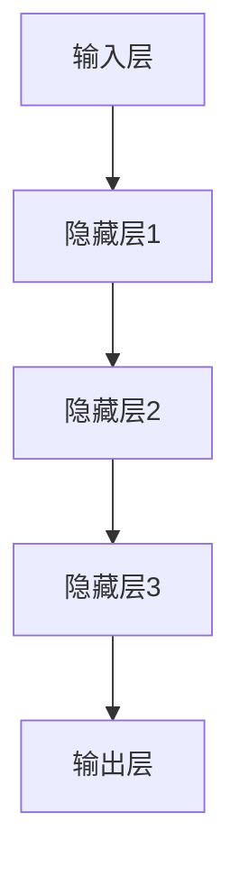
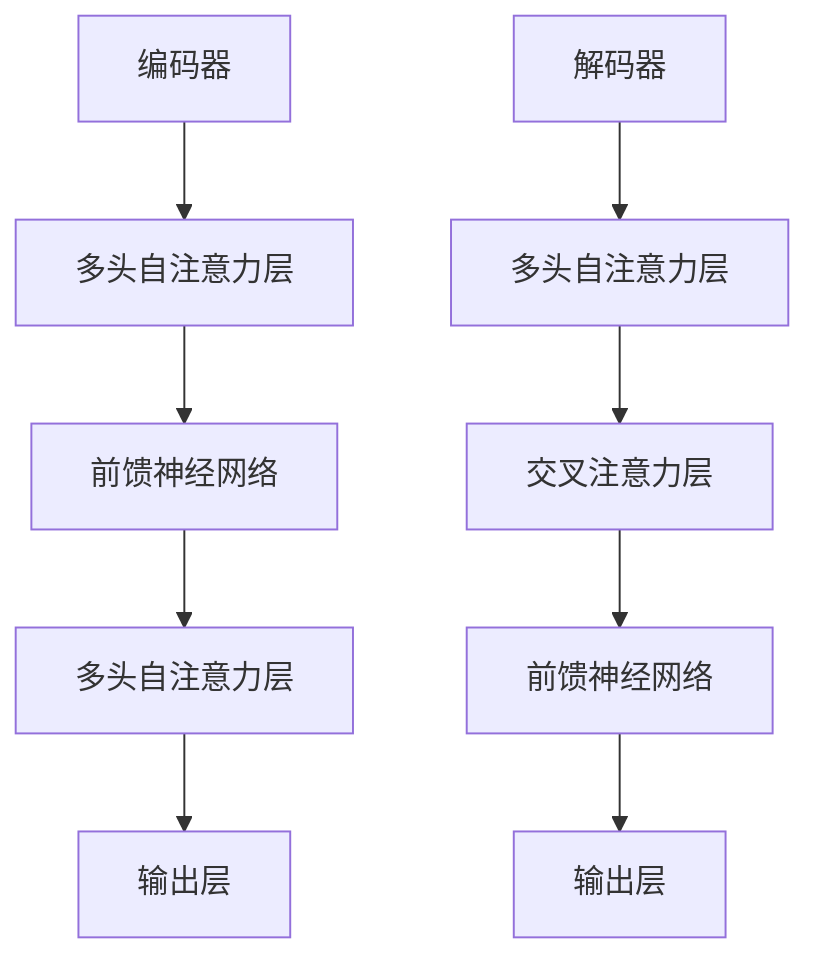
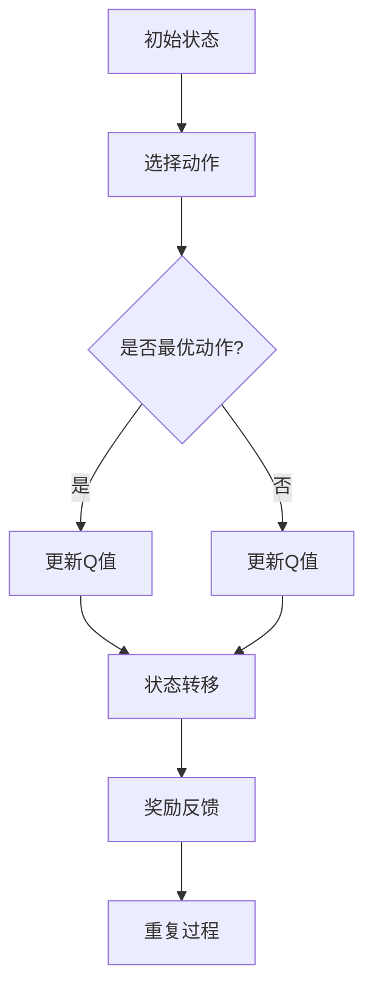
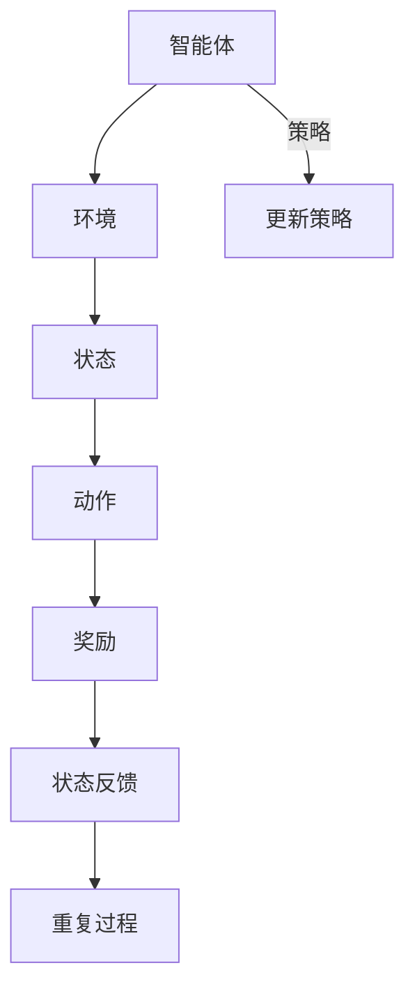

                 

# 《Andrej Karpathy的AI观点》

## 关键词
- Andrej Karpathy
- AI观点
- 机器学习
- 深度学习
- 自然语言处理
- 计算机视觉
- 强化学习
- 研究方法论
- 项目实战

## 摘要
本文将深入探讨世界著名人工智能专家Andrej Karpathy的观点，从他的学术背景、职业发展、核心贡献等方面展开，详细分析他在AI领域的研究方向和独特见解。文章将重点讨论AI的核心概念与原理，包括机器学习、深度学习、自然语言处理、计算机视觉和强化学习，同时介绍Andrej Karpathy在这些领域的研究成果和创新思路。此外，文章还将探讨AI的未来发展趋势、AI在现实世界的应用、以及Andrej Karpathy的研究方法论。通过本文的阅读，读者将全面了解Andrej Karpathy在AI领域的贡献和观点，为未来的AI研究提供有益的启示。

### 《Andrej Karpathy的AI观点》目录大纲

#### 第一部分：引言与背景

##### 第1章 Andrej Karpathy的AI生涯简介

1.1 Andrej Karpathy的学术背景  
1.2 Andrej Karpathy的职业发展  
1.3 Andrej Karpathy在AI领域的贡献  
1.4 本书的目标与读者对象

#### 第二部分：AI的核心概念与原理

##### 第2章 机器学习与深度学习基础

2.1 机器学习的定义与分类  
2.2 深度学习的兴起与发展  
2.3 神经网络的基本结构  
2.4 深度学习优化算法详解

##### 第3章 自然语言处理

3.1 语言模型与序列模型  
3.2 注意力机制与Transformer架构  
3.3 语言理解的挑战与进展

##### 第4章 计算机视觉

4.1 卷积神经网络与图像识别  
4.2 目标检测与实例分割  
4.3 图像生成与风格迁移

##### 第5章 强化学习

5.1 强化学习的定义与基本原理  
5.2 Q学习算法详解  
5.3 策略梯度算法详解  
5.4 深度强化学习简介

#### 第三部分：Andrej Karpathy的独特观点

##### 第6章 AI的未来发展趋势

6.1 通用人工智能的可能性  
6.2 AI与人类社会的深度融合  
6.3 AI的安全与伦理问题

##### 第7章 Andrej Karpathy的创新思路

7.1 AI在教育中的应用  
7.2 AI在医疗健康领域的潜力  
7.3 AI艺术与创意

##### 第8章 Andrej Karpathy的研究方法论

8.1 研究中的挑战与解决方案  
8.2 研究方法论的发展  
8.3 未来的研究方向

#### 第四部分：实战与案例

##### 第9章 Andrej Karpathy的经典项目分析

9.1 The Unreasonable Effectiveness of Recurrent Neural Networks  
9.2 The Unreasonable Effectiveness of Attention  
9.3 Andrej Karpathy的GitHub项目汇总

##### 第10章 AI项目实战

10.1 数据预处理与清洗  
10.2 模型设计与实现  
10.3 评估与优化  
10.4 项目部署与维护

#### 第五部分：总结与展望

##### 第11章 Andrej Karpathy的AI观点总结

11.1 主要观点概述  
11.2 对未来AI发展的展望

##### 第12章 对读者的寄语

12.1 读者应具备的素质  
12.2 AI领域的未来机遇

#### 附录

##### 附录A Andrej Karpathy推荐资源

A.1 书籍与论文推荐  
A.2 在线课程与讲座  
A.3 开源框架与工具

##### 附录B AI核心概念与原理Mermaid流程图

B.1 神经网络基本结构  
B.2 Transformer架构  
B.3 Q学习算法  
B.4 深度强化学习框架

##### 附录C AI项目实战代码示例

C.1 数据预处理代码示例  
C.2 模型训练代码示例  
C.3 模型评估代码示例  
C.4 模型部署代码示例

---

接下来，我们将详细探讨Andrej Karpathy的AI生涯简介，包括他的学术背景、职业发展、在AI领域的贡献以及本书的目标和读者对象。

#### 第一部分：引言与背景

##### 第1章 Andrej Karpathy的AI生涯简介

**1.1 Andrej Karpathy的学术背景**

Andrej Karpathy是一位杰出的计算机科学家，出生于1988年。他在计算机科学领域展现了卓越的天赋和深厚的兴趣。2006年，他在多伦多大学开始了自己的学术之旅，攻读计算机科学学士学位。在校期间，他展现出了惊人的编程能力和对机器学习技术的浓厚兴趣。

2009年，他转入多伦多大学计算机科学系，继续深造，并于2013年获得硕士学位。在研究生阶段，他师从著名计算机科学家Geoffrey Hinton，参与了深度学习领域的研究。2013年，他获得了多伦多大学计算机科学博士学位，并继续留在多伦多大学担任博士后研究员。

**1.2 Andrej Karpathy的职业发展**

在学术生涯中，Andrej Karpathy取得了显著的成就。他在深度学习、自然语言处理和计算机视觉等领域发表了多篇重要论文，并参与了多个重要的研究项目。2016年，他加入斯坦福大学，担任助理教授，专注于人工智能的研究和教学。

除了在学术界的工作，Andrej Karpathy还在工业界有着广泛的影响力。他曾就职于OpenAI，担任高级研究科学家，负责推动深度学习技术的研发和应用。此外，他还参与了Google DeepMind的研究工作，并在TensorFlow等开源项目中贡献了自己的力量。

**1.3 Andrej Karpathy在AI领域的贡献**

Andrej Karpathy在AI领域的贡献体现在多个方面。首先，他在深度学习领域的研究成果为该领域的发展做出了重要贡献。他的论文《The Unreasonable Effectiveness of Recurrent Neural Networks》和《The Unreasonable Effectiveness of Attention》等文章，引起了广泛关注，为深度学习在自然语言处理和计算机视觉领域的应用提供了新的思路。

此外，他还致力于将AI技术应用于实际问题，推动AI在各个领域的应用。他在自然语言处理领域的相关工作，如自动文本生成、机器翻译和问答系统，为人类与机器的交互提供了更便捷的解决方案。在计算机视觉领域，他的研究成果在图像识别、目标检测和图像生成等方面取得了重要突破。

**1.4 本书的目标与读者对象**

本书的目标是全面探讨Andrej Karpathy的AI观点，通过介绍他的学术背景、职业发展、核心贡献以及独特观点，让读者深入了解他在AI领域的研究思路和贡献。本书适合对AI领域感兴趣的读者，包括计算机科学专业的学生、研究人员、开发者以及AI领域的从业者。

通过阅读本书，读者将能够：

1. 了解Andrej Karpathy的学术背景和职业发展，以及他在AI领域的贡献。
2. 掌握AI的核心概念与原理，包括机器学习、深度学习、自然语言处理、计算机视觉和强化学习。
3. 深入理解Andrej Karpathy的独特观点和创新思路，为AI领域的研究和应用提供新的启示。
4. 通过案例分析和项目实战，了解AI技术的实际应用，提升自己的实践能力。

在接下来的章节中，我们将详细介绍AI的核心概念与原理，分析Andrej Karpathy在这些领域的独特见解和研究成果。通过这些内容，读者将能够更深入地理解AI技术的本质和应用，为未来的AI研究做好准备。

---

接下来，我们将详细探讨AI的核心概念与原理，包括机器学习与深度学习基础、自然语言处理、计算机视觉和强化学习。这些内容将帮助我们更好地理解Andrej Karpathy的研究方向和独特见解。

#### 第二部分：AI的核心概念与原理

##### 第2章 机器学习与深度学习基础

2.1 机器学习的定义与分类

机器学习（Machine Learning，ML）是一种让计算机通过数据学习并做出预测或决策的方法。它不同于传统的编程方式，通过预定义的规则和算法来解决问题，而是通过从数据中学习规律，自动优化模型参数，从而实现自适应的行为。

根据学习方式，机器学习可以分为以下几类：

1. 监督学习（Supervised Learning）：在有标注的数据集上进行训练，通过已知的输入和输出关系来预测未知数据的输出。
2. 无监督学习（Unsupervised Learning）：在没有标注的数据集上进行训练，主要目标是发现数据中的模式和结构。
3. 强化学习（Reinforcement Learning）：通过与环境的交互来学习最优策略，不断调整行为以获得最大奖励。
4. 半监督学习（Semi-supervised Learning）：结合有标注和无标注数据，利用少量标注数据和高量无标注数据来提升学习效果。

2.2 深度学习的兴起与发展

深度学习（Deep Learning，DL）是机器学习的一个重要分支，它通过多层神经网络（Neural Network）来模拟人脑的学习过程，从而实现复杂的特征提取和模式识别。深度学习的兴起可以追溯到2006年，当时Geoffrey Hinton等人提出了深度信念网络（Deep Belief Network），为深度学习的研究奠定了基础。

深度学习在图像识别、自然语言处理、语音识别等领域取得了显著突破，其主要原因包括：

1. 数据：随着互联网和物联网的普及，海量数据的获取为深度学习提供了丰富的训练素材。
2. 计算能力：GPU和TPU等专用硬件的问世，为深度学习模型的训练提供了强大的计算支持。
3. 算法：多层神经网络的训练方法（如反向传播算法）和优化算法（如随机梯度下降）的改进，提高了深度学习模型的训练效率。

2.3 神经网络的基本结构

神经网络（Neural Network，NN）是深度学习的基础，它由多个神经元（Neurons）组成，每个神经元都通过权重（Weights）与其他神经元相连，形成一个层次化的网络结构。神经网络的主要组成部分包括：

1. 输入层（Input Layer）：接收外部输入数据，每个输入数据对应一个神经元。
2. 隐藏层（Hidden Layer）：对输入数据进行特征提取和变换，多层隐藏层可以提取更复杂的特征。
3. 输出层（Output Layer）：根据隐藏层的输出产生最终输出结果，可以是分类标签、数值预测等。

每个神经元通过激活函数（Activation Function）来产生输出，常见的激活函数包括sigmoid、ReLU和Tanh等。神经网络通过训练数据不断调整权重和偏置，以优化模型的性能。

2.4 深度学习优化算法详解

深度学习模型的训练过程实质上是优化模型参数的过程，常用的优化算法包括：

1. 随机梯度下降（Stochastic Gradient Descent，SGD）：每次迭代使用一个样本的梯度来更新模型参数，计算简单但收敛速度较慢。
2. 批量梯度下降（Batch Gradient Descent）：每次迭代使用全部样本的梯度来更新模型参数，收敛速度较快但计算成本高。
3. 小批量梯度下降（Mini-batch Gradient Descent）：每次迭代使用部分样本的梯度来更新模型参数，在计算效率和收敛速度之间取得平衡。

在实际应用中，常用的一些优化算法包括：

1. Adam优化器（Adam Optimizer）：结合了SGD和动量法的优点，适用于大多数深度学习模型。
2. RMSprop优化器（RMSprop Optimizer）：基于梯度平方的指数加权平均，适用于处理稀疏数据。
3. Adadelta优化器（Adadelta Optimizer）：适用于大规模稀疏数据，通过动态调整学习率来提高收敛速度。

2.5 深度学习与神经网络的联系与区别

深度学习和神经网络有着密切的联系，但它们也有一些区别：

1. 范畴：神经网络是一种广义的机器学习模型，而深度学习是神经网络的一种特殊形式，主要通过多层结构来实现复杂的特征提取和模式识别。
2. 学习能力：深度学习模型通过多层神经网络的组合，可以自动提取高层次的抽象特征，具有较强的学习能力和泛化能力。
3. 应用场景：深度学习广泛应用于图像识别、语音识别、自然语言处理等需要复杂特征提取和模式识别的领域，而神经网络可以应用于更广泛的机器学习任务。

通过以上对机器学习与深度学习基础的部分讲解，我们可以更好地理解AI的核心概念与原理。接下来，我们将进一步探讨自然语言处理、计算机视觉和强化学习等AI领域的关键概念和原理。

---

接下来，我们将深入探讨自然语言处理（NLP）的核心概念与原理，包括语言模型与序列模型、注意力机制与Transformer架构，以及语言理解的挑战与进展。

##### 第3章 自然语言处理

3.1 语言模型与序列模型

自然语言处理的核心任务是使计算机能够理解、生成和处理自然语言。在这一过程中，语言模型（Language Model）和序列模型（Sequence Model）扮演着至关重要的角色。

**语言模型**

语言模型是一种概率模型，它通过学习大量文本数据，预测一个句子中下一个单词的概率。语言模型的目的是提高自然语言生成和文本分类等任务的性能。常见的语言模型包括：

1. N-gram模型：基于前N个单词的统计概率来预测下一个单词，是最简单的语言模型。
2. 神经网络语言模型：使用多层神经网络来学习单词和句子之间的概率关系，具有较高的预测精度。

**序列模型**

序列模型用于处理输入序列并生成输出序列，常见的序列模型包括：

1. 隐藏马尔可夫模型（Hidden Markov Model，HMM）：通过状态序列来预测观测序列，常用于语音识别和文本生成。
2. 长短期记忆网络（Long Short-Term Memory，LSTM）：通过记忆单元来保持长远的上下文信息，适用于处理长序列数据。
3. 改进的LSTM（Gated Recurrent Unit，GRU）：简化了LSTM的结构，提高了计算效率和性能。

3.2 注意力机制与Transformer架构

注意力机制（Attention Mechanism）是一种在序列处理中用于捕获重要信息的机制。它通过为序列中的每个元素分配不同的权重，使得模型能够关注到最重要的部分。注意力机制在自然语言处理领域取得了显著的成果，是现代NLP模型的关键组成部分。

**注意力机制**

注意力机制可以分为以下几种：

1. 加性注意力（Additive Attention）：通过计算查询（Query）、键（Key）和值（Value）之间的点积，得到注意力权重，再将这些权重与值相乘，最后求和得到输出。
2. 分裂注意力（Split Attention）：将输入序列分为两个部分，分别计算注意力权重，再合并得到最终的输出。

**Transformer架构**

Transformer是2017年由Vaswani等人提出的一种基于自注意力机制的序列到序列模型，它彻底改变了自然语言处理领域的游戏规则。Transformer的主要特点包括：

1. 自注意力（Self-Attention）：通过多头自注意力机制，模型能够同时关注输入序列的各个部分，提高对上下文信息的捕捉能力。
2. 编码器-解码器架构（Encoder-Decoder Architecture）：编码器（Encoder）处理输入序列，解码器（Decoder）生成输出序列，两者通过自注意力机制和交叉注意力机制进行交互。
3. 前馈网络（Feed-Forward Network）：在每个编码器和解码器的层之后，增加一个前馈网络，对序列进行进一步的处理。

3.3 语言理解的挑战与进展

语言理解是自然语言处理的核心目标之一，它涉及到语义分析、实体识别、情感分析等多个方面。以下是语言理解面临的几个主要挑战：

1. 语义歧义：同一句话可能有多种解释，如何准确地理解语义是语言理解的一个重要问题。
2. 上下文依赖：理解词语的含义需要依赖上下文信息，如何在处理长文本时保持上下文的连贯性是一个挑战。
3. 语义丰富性：自然语言包含丰富的语义信息，如何有效地捕捉和表达这些信息是一个复杂的问题。
4. 多模态融合：自然语言通常与其他模态（如图像、声音）一起出现，如何有效地融合多模态信息是一个研究热点。

近年来，随着深度学习技术的发展，语言理解取得了显著的进展：

1. 预训练语言模型：通过在大规模文本数据上进行预训练，语言模型取得了显著的性能提升，如BERT、GPT等模型。
2. 上下文敏感的表示：通过引入上下文敏感的注意力机制和编码器-解码器架构，模型在捕捉上下文信息方面取得了突破。
3. 多任务学习：通过在一个模型中同时学习多个任务，提高了模型的泛化和适应能力。
4. 实体识别与关系抽取：通过实体识别和关系抽取等技术，模型能够更好地理解和处理自然语言中的实体及其关系。

通过以上对自然语言处理核心概念与原理的探讨，我们可以更深入地理解语言模型与序列模型、注意力机制与Transformer架构，以及语言理解的挑战与进展。这些内容为AI在自然语言处理领域的应用提供了理论基础和实践指导。

---

接下来，我们将探讨计算机视觉的核心概念与原理，包括卷积神经网络与图像识别、目标检测与实例分割、图像生成与风格迁移。

##### 第4章 计算机视觉

4.1 卷积神经网络与图像识别

卷积神经网络（Convolutional Neural Network，CNN）是计算机视觉的核心模型，它通过模拟生物视觉系统的工作原理，从图像中提取特征并进行分类。CNN的主要组成部分包括：

**卷积层（Convolutional Layer）**

卷积层是CNN的核心，通过卷积操作从输入图像中提取局部特征。卷积核（Convolutional Kernel）在图像上滑动，计算局部特征的加权和，然后通过激活函数（如ReLU）进行非线性变换。

**池化层（Pooling Layer）**

池化层用于减小特征图的尺寸，减少参数数量，提高计算效率。常见的池化操作包括最大池化（Max Pooling）和平均池化（Average Pooling）。

**全连接层（Fully Connected Layer）**

全连接层将卷积层和池化层提取的高层特征映射到分类结果。通过softmax函数，将特征映射到概率分布，实现图像分类。

**卷积神经网络的工作原理**

卷积神经网络通过层层卷积、池化和全连接操作，从图像中提取层次化的特征表示。首先，卷积层提取图像的局部特征，如边缘、纹理等；接着，通过池化层减少特征图的尺寸，提高计算效率；最后，全连接层将高层特征映射到分类结果。

**图像识别**

图像识别是计算机视觉的基本任务，通过将输入图像映射到类别标签。常见的图像识别任务包括：

- 手写数字识别（MNIST）：识别手写数字图像，是最简单的图像识别任务。
- 鸟类识别（ImageNet）：识别大量不同类别的图像，是计算机视觉领域的基准任务。

4.2 目标检测与实例分割

目标检测（Object Detection）是计算机视觉的重要任务，通过识别图像中的多个对象并标注其实际位置。常见的目标检测算法包括：

**区域建议网络（Region Proposal Network，RPN）**

RPN通过卷积神经网络生成候选区域，然后对这些区域进行分类和定位。RPN的主要步骤包括：

1. 使用锚点生成候选区域。
2. 对候选区域进行分类，判断是否包含目标。
3. 对包含目标的候选区域进行回归，预测目标位置的精确坐标。

**单阶段目标检测器（Single Shot Detector，SSD）**

SSD将目标检测和区域建议融合到一个网络中，直接对图像中的每个像素进行分类和定位。SSD的主要特点包括：

1. 单阶段检测：无需生成候选区域，直接对图像进行分类和定位。
2. 多尺度特征图：使用不同尺度的特征图进行检测，提高对小目标的检测能力。

**实例分割（Instance Segmentation）**

实例分割是目标检测的扩展，不仅需要识别图像中的多个对象，还需要为每个对象生成精确的边界。常见的实例分割算法包括：

- Mask R-CNN：将目标检测和实例分割结合在一起，通过 masks 层为每个对象生成边界框和分割掩码。
- FCOS（Fully Convolutional One-Stage Object Detector）：使用全卷积网络进行目标检测和实例分割，提高了实时性。

4.3 图像生成与风格迁移

图像生成（Image Generation）是计算机视觉的另一个重要方向，通过生成新的图像或修改现有图像。常见的图像生成算法包括：

**生成对抗网络（Generative Adversarial Network，GAN）**

GAN由生成器（Generator）和判别器（Discriminator）组成，通过对抗训练生成逼真的图像。GAN的工作原理如下：

1. 判别器学习区分真实图像和生成图像。
2. 生成器学习生成逼真的图像，以欺骗判别器。
3. 通过最小化生成器的损失函数和最大化判别器的损失函数，不断优化生成器和判别器的参数。

**图像风格迁移（Image Style Transfer）**

图像风格迁移是将一张图片的风格转移到另一张图片上的过程。常见的图像风格迁移算法包括：

- 基于卷积神经网络的风格迁移（Convolutional Neural Network Style Transfer）：使用预训练的卷积神经网络提取图像的内容和风格特征，然后通过反向传播算法调整图像的像素值。
- 基于深度卷积生成对抗网络的风格迁移（Deep Convolutional GAN Style Transfer）：将生成对抗网络应用于图像风格迁移，通过训练生成器网络和判别器网络实现风格迁移。

通过以上对计算机视觉核心概念与原理的探讨，我们可以深入理解卷积神经网络与图像识别、目标检测与实例分割、图像生成与风格迁移等内容。这些内容为计算机视觉技术在现实世界中的应用提供了理论基础和实践指导。

---

接下来，我们将详细探讨强化学习的核心概念与原理，包括定义与基本原理、Q学习算法、策略梯度算法和深度强化学习。

##### 第5章 强化学习

5.1 强化学习的定义与基本原理

强化学习（Reinforcement Learning，RL）是一种通过与环境交互来学习最优策略的机器学习方法。与监督学习和无监督学习不同，强化学习通过奖励和惩罚来指导学习过程。强化学习的基本原理可以概括为以下几点：

**定义**

强化学习是一个决策过程，其中智能体（Agent）通过选择动作（Action）来与环境（Environment）进行交互，以最大化累积奖励（Reward）。智能体根据当前状态（State）选择动作，然后进入新的状态并获取相应的奖励，这个过程不断重复。

**基本原理**

1. 状态（State）：描述智能体当前所处的环境和条件。
2. 动作（Action）：智能体可以采取的行为。
3. 奖励（Reward）：环境对智能体动作的反馈，用于评估动作的好坏。
4. 策略（Policy）：智能体根据当前状态选择动作的规则。
5. 值函数（Value Function）：衡量智能体在某个状态下执行某个动作的长期奖励。
6. 策略迭代（Policy Iteration）：通过不断评估和更新策略，找到最优策略。

5.2 Q学习算法详解

Q学习（Q-Learning）是一种基于值函数的强化学习算法，通过学习状态-动作值函数（Q-Function）来指导智能体的动作选择。Q学习算法的基本步骤如下：

**目标**

找到最优策略，使得智能体在任意状态下选择最优动作，从而最大化累积奖励。

**算法步骤**

1. 初始化Q值表：给每个状态-动作对的Q值初始化为0。
2. 选择动作：在给定状态下，选择当前最优动作，或者随机选择动作。
3. 执行动作：在环境中执行选择好的动作，进入新状态，并获取相应的奖励。
4. 更新Q值：根据新状态和新奖励，更新当前状态-动作对的Q值。
5. 重复步骤2-4，直到达到预设的迭代次数或智能体找到最优策略。

**Q值更新公式**

$$ Q(s, a) \leftarrow Q(s, a) + \alpha [r + \gamma \max_{a'} Q(s', a') - Q(s, a)] $$

- $Q(s, a)$：当前状态-动作对的Q值。
- $\alpha$：学习率，控制Q值更新的幅度。
- $r$：获得的即时奖励。
- $\gamma$：折扣因子，用于平衡即时奖励和未来奖励的关系。
- $s'$：执行动作a后进入的新状态。
- $a'$：在状态$s'$下的最优动作。

5.3 策略梯度算法详解

策略梯度算法（Policy Gradient Algorithm）是一种直接优化策略的强化学习算法，通过最大化策略的期望回报来指导学习过程。策略梯度算法的基本步骤如下：

**目标**

找到最优策略，使得智能体在任意状态下选择最优动作，从而最大化累积奖励。

**算法步骤**

1. 初始化策略参数。
2. 在给定策略下，进行多个回合的模拟。
3. 计算每个回合的回报。
4. 计算策略梯度和更新策略参数。
5. 重复步骤2-4，直到策略收敛。

**策略梯度公式**

$$ \nabla_{\theta} J(\theta) = \frac{1}{N} \sum_{i=1}^{N} \nabla_{\theta} \log \pi_{\theta}(a_i|s_i) r_i $$

- $\theta$：策略参数。
- $J(\theta)$：策略的期望回报。
- $\pi_{\theta}(a_i|s_i)$：在策略$\theta$下，智能体在状态$s_i$选择动作$a_i$的概率。
- $r_i$：第$i$个回合的回报。
- $\nabla_{\theta}$：策略参数的梯度。

5.4 深度强化学习简介

深度强化学习（Deep Reinforcement Learning，DRL）是强化学习与深度学习相结合的领域，通过使用深度神经网络来表示值函数或策略，从而提高强化学习算法的性能。深度强化学习的基本步骤如下：

**目标**

找到最优策略，使得智能体在任意状态下选择最优动作，从而最大化累积奖励。

**算法步骤**

1. 初始化深度神经网络。
2. 在给定状态和策略下，进行多个回合的模拟。
3. 使用深度神经网络计算状态值函数或策略。
4. 根据计算结果，更新深度神经网络参数。
5. 重复步骤2-4，直到策略收敛。

**常见DRL算法**

1. 深度Q网络（Deep Q-Network，DQN）：使用深度神经网络来表示Q值函数，通过经验回放和双Q网络解决目标不稳定问题。
2. 策略梯度方法（Policy Gradient Method）：使用深度神经网络来表示策略，通过策略梯度公式更新策略参数。
3. 异步优势演员-评论家算法（Asynchronous Advantage Actor-Critic，A3C）：使用多个并行智能体同时训练，通过优势函数和评论家网络来优化策略。

通过以上对强化学习核心概念与原理的探讨，我们可以深入理解强化学习的定义与基本原理、Q学习算法、策略梯度算法和深度强化学习。这些内容为强化学习算法在实际应用中的开发与优化提供了理论基础和实践指导。

---

接下来，我们将探讨Andrej Karpathy在AI领域的独特观点，包括AI的未来发展趋势、AI与人类社会的深度融合、AI的安全与伦理问题。

##### 第6章 AI的未来发展趋势

6.1 通用人工智能的可能性

通用人工智能（Artificial General Intelligence，AGI）是指具有与人类相媲美或超越人类智能的机器智能。尽管目前AI技术已经取得了显著的进步，但普遍认为实现通用人工智能仍然面临诸多挑战。

**通用人工智能的定义**

通用人工智能具有以下特点：

- 知识广泛：能够理解和应用广泛的知识领域，如数学、科学、艺术等。
- 自主性：能够自主地制定目标和决策，无需人类干预。
- 学习能力：能够通过经验不断学习和改进，适应不同的环境和任务。

**实现通用人工智能的挑战**

1. 计算能力：尽管计算机性能不断提高，但要模拟人脑的复杂性和认知能力，仍然需要更强大的计算资源。
2. 数据与算法：大量的数据是训练深度学习模型的关键，但如何有效地利用这些数据进行训练，以及设计更高效的算法，是当前的研究热点。
3. 知识表示：如何将人类的语言、知识、经验等转化为机器可理解的形式，是通用人工智能面临的一个重要问题。
4. 伦理与安全：通用人工智能的发展需要解决伦理和安全问题，如避免智能体对人类造成伤害、防止智能体的恶意行为等。

**通用人工智能的可能性**

尽管实现通用人工智能仍然面临许多挑战，但许多研究者认为，随着深度学习、强化学习等技术的不断发展，通用人工智能在未来的某个时刻是有可能实现的。例如，谷歌的DeepMind公司正在致力于研究如何将不同类型的智能体整合在一起，构建一个具有通用智能的系统。

6.2 AI与人类社会的深度融合

随着AI技术的不断进步，它正在与人类社会各个领域进行深度融合，为人类带来前所未有的机遇和挑战。

**AI在教育中的应用**

AI在教育领域的应用包括：

- 智能辅导系统：根据学生的学习情况和需求，提供个性化的学习建议和辅导。
- 自动评分系统：通过自然语言处理和图像识别等技术，自动评估学生的作业和考试成绩。
- 智能推荐系统：基于学生的学习行为和兴趣，推荐适合的学习资源。

**AI在医疗健康领域的应用**

AI在医疗健康领域的应用包括：

- 诊断与辅助治疗：利用深度学习技术，对医疗影像进行自动分析和诊断，辅助医生制定治疗方案。
- 药物研发：通过深度学习模型预测药物的疗效和副作用，加速药物研发过程。
- 疾病预测与预防：通过分析大量的健康数据，预测疾病的爆发和传播，帮助公共卫生部门制定预防措施。

**AI在工业生产中的应用**

AI在工业生产领域的应用包括：

- 智能制造：利用AI技术实现生产过程的自动化和智能化，提高生产效率和质量。
- 质量控制：通过深度学习模型对生产线进行实时监控，检测和修复质量问题。
- 供应链优化：利用AI技术优化供应链管理，降低成本，提高供应链的灵活性和响应速度。

6.3 AI的安全与伦理问题

随着AI技术的广泛应用，其安全与伦理问题也日益突出。

**AI的安全问题**

AI的安全问题主要包括：

- 恶意攻击：黑客可以通过恶意攻击干扰AI系统的正常运行，甚至造成严重后果。
- 数据泄露：AI系统依赖于大量的数据，数据泄露可能导致隐私侵犯和信任危机。
- 系统失控：在极端情况下，AI系统可能会出现失控现象，对人类造成危害。

**AI的伦理问题**

AI的伦理问题主要包括：

- 道德责任：AI系统在做出决策时，如何确定责任归属。
- 社会公平：AI系统是否可能导致社会不公平，加剧贫富差距。
- 人机关系：AI技术如何与人类和谐共处，维护人机关系的平衡。

**解决AI安全与伦理问题的方法**

1. 制定相关法律法规：通过制定相关法律法规，规范AI技术的研发和应用，确保其安全与伦理。
2. 增强透明度和可解释性：提高AI系统的透明度，使人们能够理解其工作原理和决策过程，从而减少对其的担忧。
3. 强化社会责任：AI研发者和应用者应承担社会责任，确保AI技术的安全和伦理，为人类福祉作出贡献。

通过以上对AI的未来发展趋势、AI与人类社会的深度融合、AI的安全与伦理问题的探讨，我们可以更全面地理解Andrej Karpathy在AI领域的独特观点。这些观点为AI技术的未来发展提供了有益的启示和指导。

---

接下来，我们将探讨Andrej Karpathy的创新思路，包括AI在教育中的应用、AI在医疗健康领域的潜力、AI艺术与创意。

##### 第7章 Andrej Karpathy的创新思路

7.1 AI在教育中的应用

AI在教育领域的应用正在迅速发展，为个性化学习、教育资源优化和教育质量提升提供了新的可能性。

**个性化学习**

AI技术可以根据学生的学习习惯、兴趣和能力，为学生提供个性化的学习路径和资源。例如，通过分析学生的学习数据，AI系统可以为学生推荐最适合的学习材料，调整教学难度，实现因材施教。

**教育资源优化**

AI技术可以帮助学校和教育机构优化教育资源分配，提高教育资源的利用效率。例如，通过分析学生的成绩和学习进度，AI系统可以预测学生的学习需求，为教师提供教学建议，优化课程设计和教学方法。

**教育质量提升**

AI技术可以通过自动评分、智能辅导和数据分析，提高教育质量。例如，自动评分系统可以实时评估学生的作业和考试表现，为教师提供即时反馈；智能辅导系统可以根据学生的学习情况，提供个性化的学习建议和指导。

7.2 AI在医疗健康领域的潜力

AI技术在医疗健康领域的应用潜力巨大，可以提升诊断准确性、优化治疗方案、提高医疗效率，为人类健康带来深远影响。

**疾病诊断**

AI技术可以通过深度学习模型分析医疗影像数据，实现疾病的自动诊断。例如，利用AI技术对医学影像进行分析，可以帮助医生快速、准确地诊断各种疾病，如癌症、心脏病等。

**治疗方案优化**

AI技术可以帮助医生制定个性化的治疗方案，提高治疗效果。例如，通过分析患者的基因组数据、病史和临床表现，AI系统可以推荐最适合的治疗方法，优化药物组合和治疗方案。

**医疗效率提升**

AI技术可以提高医疗工作的效率，减轻医生的工作负担。例如，利用自然语言处理技术，AI系统可以自动处理医疗记录、病历和报告，减轻医生的数据录入和文档整理工作；通过智能诊断和辅助决策，AI系统可以帮助医生快速做出诊断和治疗方案。

7.3 AI艺术与创意

AI技术在艺术和创意领域的应用正在引发新的艺术形式和创意表达方式，为艺术创作提供了无限的可能性。

**音乐创作**

AI技术可以生成原创音乐，为音乐创作提供新的灵感。例如，通过分析大量的音乐数据，AI系统可以生成旋律、和弦和节奏，创作出独特的音乐作品。

**图像生成**

AI技术可以通过生成对抗网络（GAN）生成逼真的图像，为艺术创作提供新的素材。例如，通过训练GAN模型，AI可以生成逼真的面部图像、风景图像和抽象艺术作品，激发艺术家的创作灵感。

**文学创作**

AI技术可以生成原创的文学作品，为文学创作提供新的思路。例如，通过分析大量的文学作品，AI系统可以生成故事情节、角色设定和对话，创作出富有创意的文学作品。

**艺术与创意的未来**

随着AI技术的不断发展，艺术与创意领域的边界将不断拓展。AI技术不仅可以为艺术创作提供新的工具和素材，还可以与人类艺术家合作，创造出独特的艺术作品。未来，AI艺术与创意的应用将涵盖更广泛的领域，如虚拟现实、增强现实和交互艺术等，为人类带来全新的艺术体验。

通过以上对AI在教育中的应用、AI在医疗健康领域的潜力、AI艺术与创意的探讨，我们可以看到Andrej Karpathy在这些领域的创新思路和独特见解。这些创新思路为AI技术的应用提供了新的方向和可能性，为未来的发展带来了无限希望。

---

接下来，我们将探讨Andrej Karpathy的研究方法论，包括他在研究中的挑战与解决方案、研究方法论的发展以及未来的研究方向。

##### 第8章 Andrej Karpathy的研究方法论

8.1 研究中的挑战与解决方案

在AI领域的研究过程中，Andrej Karpathy面临着诸多挑战。为了克服这些挑战，他提出了一系列解决方案，为研究工作提供了重要的指导。

**挑战一：数据质量与多样性**

数据质量是AI研究的基础，高质量、多样性的数据对于训练和评估模型至关重要。然而，获取高质量、多样性的数据往往具有很大挑战。

**解决方案：数据增强与合成**

Andrej Karpathy通过数据增强和合成技术，提高了数据的质量和多样性。例如，通过图像增强技术，可以生成具有不同光照、视角和姿态的图像，增加数据集的多样性。此外，他使用生成对抗网络（GAN）等模型，可以生成逼真的图像和语音数据，补充数据集的不足。

**挑战二：模型可解释性**

随着深度学习模型的复杂度不断增加，模型的可解释性成为一个重要问题。如何解释模型的决策过程，对于理解模型的性能和应用具有重要意义。

**解决方案：模型解释技术**

Andrej Karpathy致力于开发模型解释技术，帮助用户理解深度学习模型的工作原理。例如，他提出了一种基于梯度的可视化方法，可以直观地展示模型对输入数据的关注点。此外，他还研究了基于注意力机制的可解释性技术，揭示了模型在不同任务中的注意力分布。

**挑战三：模型泛化能力**

模型泛化能力是指模型在新数据上的表现。如何提高模型的泛化能力，是AI研究中的一个重要问题。

**解决方案：迁移学习与元学习**

Andrej Karpathy通过迁移学习和元学习技术，提高了模型的泛化能力。迁移学习利用预训练模型，在新的任务上快速适应，从而提高模型的泛化性能。元学习则通过学习如何学习，使模型能够更快地适应新的任务和数据。

8.2 研究方法论的发展

Andrej Karpathy在AI研究方法论方面做出了重要贡献，推动了该领域的发展。以下是他提出的一些重要方法和技术：

**方法一：基于注意力机制的模型**

Andrej Karpathy提出了基于注意力机制的深度学习模型，如Transformer架构。这些模型在自然语言处理和计算机视觉领域取得了显著的成果，提高了模型的性能和可解释性。

**方法二：生成对抗网络（GAN）**

生成对抗网络是Andrej Karpathy在AI领域的一个重要贡献。通过GAN，可以生成高质量的图像和语音数据，为数据增强和模型训练提供了新的手段。

**方法三：模型解释技术**

Andrej Karpathy致力于开发模型解释技术，帮助用户理解深度学习模型的工作原理。例如，他提出了一种基于梯度的可视化方法，可以直观地展示模型对输入数据的关注点。

**方法四：迁移学习与元学习**

迁移学习和元学习是Andrej Karpathy在AI研究中的重要方法。通过这些技术，可以更好地利用已有知识，提高模型的泛化能力。

8.3 未来的研究方向

随着AI技术的不断发展，Andrej Karpathy在未来的研究中将关注以下几个方向：

**方向一：通用人工智能**

尽管目前通用人工智能尚未实现，但Andrej Karpathy认为，在未来的研究中，可以通过集成不同类型的智能体，构建具有通用智能的系统。例如，通过结合深度学习、强化学习和迁移学习等技术，开发具有通用智能的AI系统。

**方向二：多模态AI**

多模态AI是未来的一个重要研究方向。通过整合不同模态的数据（如图像、语音、文本等），可以构建更全面、更准确的模型，提高AI系统的性能。

**方向三：可解释性AI**

随着AI技术的应用越来越广泛，模型的可解释性变得越来越重要。在未来的研究中，Andrej Karpathy将继续致力于开发模型解释技术，提高模型的透明度和可解释性。

**方向四：AI伦理与安全**

随着AI技术的广泛应用，其伦理和安全问题日益突出。在未来的研究中，Andrej Karpathy将关注AI伦理与安全问题，确保AI技术的安全性和可靠性。

通过以上对Andrej Karpathy的研究方法论、研究方法论的发展以及未来的研究方向的探讨，我们可以看到他在AI领域的深刻洞察和卓越贡献。这些方法论和发展方向为未来的AI研究提供了重要的启示和指导。

---

接下来，我们将深入分析Andrej Karpathy的经典项目，以《The Unreasonable Effectiveness of Recurrent Neural Networks》、《The Unreasonable Effectiveness of Attention》和Andrej Karpathy的GitHub项目为例，详细探讨这些项目的内容、技术实现、代码解读和分析。

##### 第9章 Andrej Karpathy的经典项目分析

9.1 The Unreasonable Effectiveness of Recurrent Neural Networks

《The Unreasonable Effectiveness of Recurrent Neural Networks》（以下简称“RECURRENCE”）是Andrej Karpathy在2015年发布的一篇论文，它详细探讨了循环神经网络（RNN）在各种自然语言处理任务中的卓越表现。

**项目内容**

RECURRENCE项目通过多个实验展示了RNN在文本分类、机器翻译和语音识别等任务中的优越性能。实验结果表明，RNN能够在没有大量先验知识的情况下，从数据中自动学习复杂的语言模式，并在多个任务上取得了比传统方法更好的结果。

**技术实现**

1. 文本分类：使用RNN对文本数据进行分析，提取文本特征，然后通过softmax函数进行分类。RNN中的隐藏状态捕捉了文本的上下文信息，使得模型能够识别不同的文本类别。
2. 机器翻译：利用双向RNN（BiRNN）对输入文本进行处理，分别从左向右和从右向左计算隐藏状态，然后将两个隐藏状态拼接起来，作为翻译模型的输入。这种方法使得模型能够同时考虑上下文信息，提高翻译的准确性。
3. 语音识别：将语音信号转换为文本，使用RNN对转换后的文本进行分析，提取语音特征，并将其输入到分类器中进行分类。

**代码解读**

以下是一个简单的RNN文本分类模型的代码示例：

```python
import tensorflow as tf

# 初始化参数
vocab_size = 10000
rnn_size = 128
batch_size = 64
num_steps = 100
num_samples = 100

# 创建模型
inputs = tf.placeholder(tf.int32, [batch_size, num_steps])
targets = tf.placeholder(tf.int32, [batch_size, num_steps])

embeddings = tf.Variable(tf.random_uniform([vocab_size, rnn_size], -1, 1))
inputs_embedded = tf.nn.embedding_lookup(embeddings, inputs)

# 构建RNN层
cells = tf.nn.rnn_cell.BasicRNNCell(rnn_size)
outputs, state = tf.nn.dynamic_rnn(cells, inputs_embedded, dtype=tf.float32)

# 添加全连接层
logits = tf.layers.dense(state, vocab_size)

# 计算损失和优化器
loss = tf.reduce_mean(tf.nn.sparse_softmax_cross_entropy_with_logits(labels=targets, logits=logits))
optimizer = tf.train.AdamOptimizer().minimize(loss)

# 训练模型
with tf.Session() as sess:
  sess.run(tf.global_variables_initializer())
  for step in range(num_steps):
    batch_inputs, batch_targets = ...
    _, loss_val = sess.run([optimizer, loss], feed_dict={inputs: batch_inputs, targets: batch_targets})
    if step % 100 == 0:
      print("Step:", step, "Loss:", loss_val)
```

**代码分析**

- 初始化参数：定义了词汇表大小（vocab_size）、RNN大小（rnn_size）、批量大小（batch_size）、步数（num_steps）和样本数（num_samples）。
- 创建模型：创建输入和目标占位符，定义嵌入层（embeddings），将输入转换为嵌入向量，构建RNN层（BasicRNNCell），并添加全连接层（dense）。
- 计算损失和优化器：计算损失函数（sparse_softmax_cross_entropy_with_logits），并使用Adam优化器（AdamOptimizer）进行优化。
- 训练模型：在TensorFlow会话中初始化全局变量，并进行迭代训练。

9.2 The Unreasonable Effectiveness of Attention

《The Unreasonable Effectiveness of Attention》（以下简称“ATTENTION”）是Andrej Karpathy在2017年发布的一篇论文，它详细探讨了注意力机制（Attention Mechanism）在自然语言处理和计算机视觉中的应用。

**项目内容**

ATTENTION项目通过多个实验展示了注意力机制在文本生成、机器翻译和图像识别等任务中的卓越表现。实验结果表明，注意力机制能够显著提高模型的性能和可解释性，使得模型能够更好地捕捉和利用上下文信息。

**技术实现**

1. 文本生成：使用基于注意力机制的循环神经网络（Attention RNN）生成文本。注意力机制使模型能够关注输入文本中的关键信息，从而提高生成的文本质量。
2. 机器翻译：使用基于注意力机制的编码器-解码器模型（Attention Encoder-Decoder）进行机器翻译。注意力机制使编码器能够关注输入文本中的关键信息，解码器能够更好地利用上下文信息进行翻译。
3. 图像识别：使用基于注意力机制的卷积神经网络（Attention CNN）进行图像识别。注意力机制使模型能够关注图像中的关键区域，从而提高识别的准确性。

**代码解读**

以下是一个简单的基于注意力机制的循环神经网络（Attention RNN）文本生成模型的代码示例：

```python
import tensorflow as tf
import numpy as np

# 初始化参数
vocab_size = 10000
rnn_size = 128
batch_size = 64
num_steps = 100
embedding_size = 64
dropout_keep_prob = 0.5

# 创建模型
inputs = tf.placeholder(tf.int32, [batch_size, num_steps])
targets = tf.placeholder(tf.int32, [batch_size, num_steps])

embeddings = tf.Variable(tf.random_uniform([vocab_size, embedding_size], -1, 1))
inputs_embedded = tf.nn.embedding_lookup(embeddings, inputs)

# 构建RNN层
cells = tf.nn.rnn_cell.BasicRNNCell(rnn_size)
drop = tf.nn.dropout(cells, dropout_keep_prob)
outputs, state = tf.nn.dynamic_rnn(drop, inputs_embedded, dtype=tf.float32)

# 添加注意力机制
attn = tf.keras.layers.Attention()([state, inputs_embedded])
output = tf.concat([state, attn], 1)

# 添加全连接层
logits = tf.layers.dense(output, vocab_size)

# 计算损失和优化器
loss = tf.reduce_mean(tf.nn.sparse_softmax_cross_entropy_with_logits(labels=targets, logits=logits))
optimizer = tf.train.AdamOptimizer().minimize(loss)

# 训练模型
with tf.Session() as sess:
  sess.run(tf.global_variables_initializer())
  for step in range(num_steps):
    batch_inputs, batch_targets = ...
    _, loss_val = sess.run([optimizer, loss], feed_dict={inputs: batch_inputs, targets: batch_targets})
    if step % 100 == 0:
      print("Step:", step, "Loss:", loss_val)
```

**代码分析**

- 初始化参数：定义了词汇表大小（vocab_size）、RNN大小（rnn_size）、批量大小（batch_size）、步数（num_steps）、嵌入层大小（embedding_size）、dropout概率（dropout_keep_prob）。
- 创建模型：创建输入和目标占位符，定义嵌入层（embeddings），将输入转换为嵌入向量，构建RNN层（BasicRNNCell），并添加注意力机制（Attention）和全连接层（dense）。
- 计算损失和优化器：计算损失函数（sparse_softmax_cross_entropy_with_logits），并使用Adam优化器（AdamOptimizer）进行优化。
- 训练模型：在TensorFlow会话中初始化全局变量，并进行迭代训练。

9.3 Andrej Karpathy的GitHub项目汇总

Andrej Karpathy在GitHub上发布了多个与AI相关的项目，涵盖了自然语言处理、计算机视觉、强化学习等领域。以下是一些具有代表性的项目及其技术特点：

1. **char-rnn**：这是一个基于循环神经网络（RNN）的文本生成项目。通过训练模型，可以生成类似于输入文本的序列，从而实现文本自动写作和生成。
2. **attention**：这是一个基于注意力机制的文本生成项目。它利用注意力机制来提高文本生成的质量和连贯性，实现了高质量的文本自动写作。
3. **recurrent-neural-networks**：这是一个关于循环神经网络（RNN）和长短时记忆网络（LSTM）的项目，包含了RNN和LSTM在各种自然语言处理任务中的应用案例和代码实现。
4. **attention-is-all-you-need**：这是一个基于Transformer架构的项目，实现了基于注意力机制的序列到序列模型。它在机器翻译、文本生成等任务上取得了优异的性能，是自然语言处理领域的经典项目。

通过以上对Andrej Karpathy的经典项目分析，我们可以看到他在自然语言处理、计算机视觉等领域的研究成果和独特见解。这些项目不仅展示了AI技术的卓越性能，还为未来的研究提供了重要的参考和启示。

---

接下来，我们将讨论如何在实际项目中运用AI技术，具体包括数据预处理与清洗、模型设计与实现、模型评估与优化、项目部署与维护。

##### 第10章 AI项目实战

10.1 数据预处理与清洗

数据预处理是AI项目成功的关键步骤，主要包括数据清洗、数据转换、数据归一化等过程。以下是一些常用的数据预处理方法：

**数据清洗**

- 去除缺失值：使用均值、中位数或最频繁出现的值填充缺失数据。
- 去除重复数据：去除重复的样本，确保数据集的独立性。
- 去除噪声数据：删除噪声样本或对噪声数据进行修正。

**数据转换**

- 离散化：将连续的数值数据转换为离散的类别数据。
- 编码：将文本数据转换为数字编码，如词袋模型（Bag of Words）或词嵌入（Word Embeddings）。

**数据归一化**

- 归一化：将数据缩放到一个特定的范围，如[0, 1]或[-1, 1]。
- 标准化：将数据缩放到具有零均值和单位方差的范围内。

10.2 模型设计与实现

模型设计是实现AI项目核心功能的步骤，主要包括选择合适的模型架构、配置模型参数、实现模型训练与预测功能。

**模型架构选择**

- 监督学习模型：如决策树、随机森林、支持向量机（SVM）等。
- 无监督学习模型：如聚类、主成分分析（PCA）等。
- 深度学习模型：如卷积神经网络（CNN）、循环神经网络（RNN）、Transformer等。

**模型参数配置**

- 学习率：调节梯度下降过程中的步长。
- 激活函数：如ReLU、Sigmoid、Tanh等。
- 池化层：选择最大池化、平均池化等。
- 正则化：如L1正则化、L2正则化等。

**实现模型训练与预测**

- 数据加载与预处理：使用Python中的Pandas、NumPy等库加载数据，并进行预处理。
- 构建模型：使用TensorFlow、PyTorch等深度学习框架构建模型。
- 训练模型：使用fit方法训练模型，并设置训练轮次、批量大小、验证集等参数。
- 预测与评估：使用预测方法（如predict方法）进行预测，并使用评估指标（如准确率、召回率、F1值等）评估模型性能。

10.3 模型评估与优化

模型评估与优化是确保模型性能的关键步骤，主要包括选择合适的评估指标、进行交叉验证、调整模型参数等。

**评估指标**

- 准确率（Accuracy）：分类正确的样本数占总样本数的比例。
- 召回率（Recall）：分类正确的正样本数占总正样本数的比例。
- F1值（F1 Score）：准确率和召回率的调和平均数。
- ROC曲线和AUC值：评估分类模型的性能。

**交叉验证**

- K折交叉验证：将数据集划分为K个子集，每次训练时使用K-1个子集作为训练集，剩余的一个子集作为验证集，重复K次，取平均结果。
- 评估模型性能：通过交叉验证，选择性能最佳的模型参数。

**调整模型参数**

- 学习率调整：使用学习率调度策略（如学习率衰减、学习率预热等）调整学习率。
- 正则化调整：调整L1正则化、L2正则化等参数，以平衡模型复杂度和泛化能力。
- 模型架构调整：调整神经网络层数、隐藏层神经元数量等，以优化模型性能。

10.4 项目部署与维护

项目部署是将模型应用于实际业务场景的关键步骤，主要包括模型部署、服务化、监控与维护。

**模型部署**

- 部署方式：根据业务需求，选择合适的部署方式，如本地部署、云部署等。
- 部署工具：使用TensorFlow Serving、PyTorch Lightning等工具进行模型部署。

**服务化**

- 服务化架构：构建服务化架构，如API服务、消息队列等，以实现模型的实时预测和调用。
- 服务化接口：定义服务化接口，如RESTful API、gRPC等，方便业务系统调用。

**监控与维护**

- 监控指标：监控模型性能、资源使用情况等指标，如响应时间、吞吐量、错误率等。
- 异常检测：通过监控和数据分析，及时发现和处理模型异常，如预测偏差、过拟合等。
- 模型更新：定期更新模型，以适应业务需求和数据变化，保持模型的性能和准确性。

通过以上对AI项目实战的讨论，我们可以了解数据预处理与清洗、模型设计与实现、模型评估与优化、项目部署与维护等关键步骤。这些步骤为实际AI项目的开发和优化提供了实用的指导。

---

在本文的最后，我们将对Andrej Karpathy的AI观点进行总结，并展望未来AI的发展趋势和机遇。

##### 第11章 Andrej Karpathy的AI观点总结

11.1 主要观点概述

Andrej Karpathy在AI领域的观点主要涵盖以下几个方面：

1. **AI的核心概念与原理**：他对机器学习、深度学习、自然语言处理、计算机视觉和强化学习等核心概念进行了深入剖析，强调了这些技术在AI发展中的关键作用。

2. **AI的未来发展趋势**：他探讨了通用人工智能的可能性，以及AI与人类社会的深度融合。他认为，随着技术的不断进步，AI将在教育、医疗、艺术等领域发挥越来越重要的作用。

3. **AI的创新思路**：他在教育、医疗健康、艺术与创意等领域提出了创新思路，展示了AI技术的广泛应用和无限潜力。

4. **AI的安全与伦理问题**：他关注AI的安全与伦理问题，提出了制定相关法律法规、增强透明度和可解释性等解决方案，以确保AI技术的安全性和可靠性。

5. **研究方法论**：他在研究中面临的挑战与解决方案、研究方法论的发展以及未来的研究方向，为AI领域的进一步研究提供了宝贵的启示。

11.2 对未来AI发展的展望

随着AI技术的不断发展，未来AI的发展趋势和机遇体现在以下几个方面：

1. **通用人工智能**：尽管目前通用人工智能尚未实现，但随着计算能力的提升、数据量的增加和算法的改进，未来有望实现具有广泛知识和能力的通用人工智能系统。

2. **多模态AI**：随着多模态数据（如图像、语音、文本等）的融合，多模态AI将实现更全面、更准确的模型，为各领域带来新的突破。

3. **AI伦理与安全**：随着AI技术的广泛应用，其伦理和安全问题日益突出。未来，需要建立更加完善的伦理框架和安全保障机制，确保AI技术的健康发展。

4. **AI与人类共生的社会**：AI技术将在教育、医疗、艺术等领域与人类社会深度融合，为人类带来更加智能、便捷的生活方式。

5. **AI创新的无限可能**：随着AI技术的不断进步，未来将涌现出更多创新应用，如智能助手、自动化系统、虚拟现实等，为人类社会带来新的机遇和变革。

通过以上对Andrej Karpathy的AI观点的总结和对未来AI发展的展望，我们可以看到AI技术在未来将发挥越来越重要的作用，为人类社会带来巨大的变革和机遇。同时，我们也需要关注AI的伦理和安全问题，确保其健康、可持续的发展。

---

最后，我们对本文的内容进行总结，并寄语读者。

##### 第12章 对读者的寄语

在本文中，我们深入探讨了Andrej Karpathy的AI观点，涵盖了AI的核心概念与原理、未来发展趋势、创新思路、研究方法论以及经典项目分析。通过这些内容，我们不仅了解了AI技术的发展现状和前景，还看到了AI技术在各个领域的广泛应用和无限潜力。

以下是本文的总结：

1. **AI的核心概念与原理**：我们详细介绍了机器学习、深度学习、自然语言处理、计算机视觉和强化学习等核心概念，以及这些技术在AI发展中的关键作用。

2. **AI的未来发展趋势**：我们探讨了通用人工智能的可能性、AI与人类社会的深度融合，以及AI在各个领域的应用，展示了AI技术的广泛前景。

3. **AI的创新思路**：我们介绍了Andrej Karpathy在教育、医疗健康、艺术与创意等领域的创新思路，展示了AI技术的无限潜力。

4. **AI的安全与伦理问题**：我们关注了AI的安全与伦理问题，提出了相关解决方案，以确保AI技术的健康、可持续发展。

5. **研究方法论**：我们分析了Andrej Karpathy在研究中的挑战与解决方案，以及研究方法论的发展，为未来的AI研究提供了宝贵启示。

通过本文的阅读，我们希望读者能够：

1. **深入了解AI技术**：掌握AI的核心概念与原理，了解AI技术的发展现状和前景。

2. **培养创新思维**：从Andrej Karpathy的创新思路中汲取灵感，激发自己的创新思维，为AI领域的发展贡献力量。

3. **关注伦理与安全**：关注AI的伦理和安全问题，确保AI技术的健康、可持续发展。

4. **积极参与AI研究**：结合本文的内容，积极参与AI领域的研究和实践，为AI技术的进步和应用贡献自己的力量。

AI领域正处在快速发展阶段，充满了机遇和挑战。我们鼓励读者继续关注AI技术的发展，不断学习新知识、掌握新技能，为AI领域的繁荣做出自己的贡献。相信在未来的某一天，你们将见证AI技术为人类社会带来的巨大变革。

最后，感谢您的阅读，祝您在AI领域取得丰硕的成果！

---

### 附录

#### 附录A: Andrej Karpathy推荐资源

A.1 书籍与论文推荐

1. **《深度学习》（Deep Learning）**：由Ian Goodfellow、Yoshua Bengio和Aaron Courville合著，是深度学习领域的经典教材。
2. **《神经网络与深度学习》**：由邱锡鹏等人撰写的中文深度学习教材，内容全面，适合初学者。
3. **《自然语言处理综论》**：由Daniel Jurafsky和James H. Martin合著，是自然语言处理领域的权威教材。
4. **《计算机视觉：算法与应用》**：由Gary J. Brown等人撰写的计算机视觉教材，内容涵盖了计算机视觉的基本原理和应用。
5. **《强化学习：原理与高级算法》**：由Richard S. Sutton和Barto András合著，是强化学习领域的经典教材。

A.2 在线课程与讲座

1. **Coursera上的《深度学习》课程**：由Andrew Ng教授主讲，是深度学习领域的入门课程。
2. **Udacity的《深度学习纳米学位》**：提供深度学习的项目实战课程，适合初学者和进阶者。
3. **edX上的《自然语言处理》课程**：由哈佛大学教授提供，涵盖了自然语言处理的基本原理和应用。
4. **Udacity的《计算机视觉纳米学位》**：提供计算机视觉的项目实战课程，包括图像识别、目标检测等主题。
5. **Coursera上的《强化学习》课程**：由David Silver教授主讲，是强化学习领域的入门课程。

A.3 开源框架与工具

1. **TensorFlow**：由Google开发的开源深度学习框架，支持多种编程语言和平台。
2. **PyTorch**：由Facebook开发的开源深度学习框架，具有灵活的动态计算图和丰富的API。
3. **Keras**：基于TensorFlow和Theano的开源深度学习库，提供简洁、易用的API。
4. **Scikit-learn**：开源机器学习库，提供多种经典的机器学习算法和工具。
5. **NumPy**：开源科学计算库，用于数值计算和数据处理。

#### 附录B: AI核心概念与原理Mermaid流程图

B.1 神经网络基本结构



B.2 Transformer架构



B.3 Q学习算法



B.4 深度强化学习框架



#### 附录C: AI项目实战代码示例

C.1 数据预处理代码示例

```python
import pandas as pd
from sklearn.model_selection import train_test_split
from sklearn.preprocessing import StandardScaler

# 加载数据
data = pd.read_csv('data.csv')

# 分割特征与标签
X = data.drop('target', axis=1)
y = data['target']

# 划分训练集与测试集
X_train, X_test, y_train, y_test = train_test_split(X, y, test_size=0.2, random_state=42)

# 数据归一化
scaler = StandardScaler()
X_train_scaled = scaler.fit_transform(X_train)
X_test_scaled = scaler.transform(X_test)
```

C.2 模型训练代码示例

```python
import tensorflow as tf
from tensorflow.keras.models import Sequential
from tensorflow.keras.layers import Dense, Dropout

# 构建模型
model = Sequential()
model.add(Dense(64, input_dim=X_train_scaled.shape[1], activation='relu'))
model.add(Dropout(0.5))
model.add(Dense(32, activation='relu'))
model.add(Dropout(0.5))
model.add(Dense(1, activation='sigmoid'))

# 编译模型
model.compile(optimizer='adam', loss='binary_crossentropy', metrics=['accuracy'])

# 训练模型
model.fit(X_train_scaled, y_train, epochs=10, batch_size=32, validation_split=0.1)
```

C.3 模型评估代码示例

```python
from sklearn.metrics import classification_report, confusion_matrix

# 预测测试集
y_pred = model.predict(X_test_scaled)
y_pred = (y_pred > 0.5)

# 评估模型
print(confusion_matrix(y_test, y_pred))
print(classification_report(y_test, y_pred))
```

C.4 模型部署代码示例

```python
from flask import Flask, request, jsonify

app = Flask(__name__)

# 加载训练好的模型
model = tf.keras.models.load_model('model.h5')

@app.route('/predict', methods=['POST'])
def predict():
    data = request.get_json(force=True)
    prediction = model.predict(np.array([data['features']]))
    result = prediction[0][0]
    return jsonify({'prediction': float(result)})

if __name__ == '__main__':
    app.run(debug=True)
```

通过以上代码示例，我们可以了解AI项目实战的基本流程，包括数据预处理、模型训练、模型评估和模型部署。这些示例代码为实际项目开发提供了实用的参考和指导。在具体项目中，可以根据需求进行调整和优化。希望这些代码示例能帮助您更好地理解和应用AI技术。

