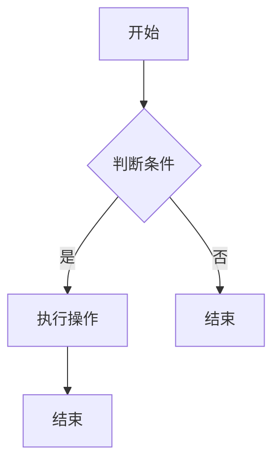

                 

### 人工智能的未来发展方向

#### 关键词：人工智能、未来、技术趋势、发展挑战、应用场景

> 人工智能（AI）作为一种颠覆性的技术，正逐步改变着全球各行各业。本文旨在概述人工智能的未来发展方向，分析其在技术趋势、应用场景及伦理问题等方面的挑战与机遇。

#### 摘要

本文从人工智能的历史与现状出发，探讨了其核心概念、关键算法及在各行业的应用。进一步，文章分析了人工智能面临的社会影响、技术趋势与伦理问题，并展望了其未来发展的前景。通过本文的阅读，读者可以全面了解人工智能的发展现状，掌握核心技术，并为未来的研究方向提供启示。

### 第一部分: 人工智能的未来发展方向概述

人工智能作为现代科技的代表性成果，已经渗透到我们生活的方方面面。然而，其发展仍然面临着诸多挑战和机遇。本部分将首先回顾人工智能的发展历程与现状，然后深入探讨人工智能的核心概念、架构及关键技术，最后分析其未来的发展趋势与面临的挑战。

#### 第1章: 人工智能的历史与现状

##### 1.1 人工智能的定义与发展历程

人工智能（Artificial Intelligence，简称AI）是指使计算机系统具备人类智能特性的技术。这一概念最早可以追溯到20世纪50年代，当时图灵提出了著名的图灵测试，用以判断计算机是否具有智能。

在接下来的几十年里，人工智能经历了多个阶段的发展。从早期的符号主义人工智能（Symbolic AI），到基于规则的系统，再到基于统计学习的方法，人工智能的技术不断演进。近年来，深度学习、强化学习等先进算法的兴起，使得人工智能在图像识别、自然语言处理、语音识别等领域取得了突破性进展。

##### 1.2 人工智能的关键技术

人工智能的关键技术主要包括以下几种：

1. **深度学习**：一种基于人工神经网络的机器学习算法，通过多层神经网络来模拟人类大脑的神经元连接，从而实现自动特征提取和复杂模式的识别。
2. **强化学习**：一种通过与环境交互来学习最优策略的机器学习算法。它通过奖励机制来指导算法的学习过程，从而实现决策的最优化。
3. **自然语言处理**（NLP）：一门结合计算机科学、语言学和人工智能的交叉学科，旨在使计算机能够理解和处理自然语言。
4. **计算机视觉**：一种使计算机能够从图像或视频中提取信息的技术，广泛应用于图像识别、目标检测、视频分析等领域。

##### 1.3 人工智能在当前的应用场景

当前，人工智能已经在多个领域取得了显著的应用成果：

1. **医疗健康**：人工智能在疾病诊断、药物研发、健康管理等方面发挥着重要作用。例如，通过图像识别技术，可以辅助医生进行癌症筛查；通过自然语言处理技术，可以分析医学文献，帮助医生制定治疗方案。
2. **金融**：人工智能在风险管理、投资策略、客户服务等方面得到广泛应用。例如，通过大数据分析和机器学习算法，可以预测市场趋势，制定投资策略；通过智能客服系统，可以提高客户服务质量。
3. **制造业**：人工智能在智能制造、机器人控制、质量检测等方面有着广泛的应用。例如，通过计算机视觉技术，可以实现生产线的自动化检测和监控；通过机器人控制技术，可以提升生产效率和降低成本。
4. **交通**：人工智能在自动驾驶、智能交通管理、车联网等方面取得重要进展。例如，自动驾驶技术可以通过深度学习和计算机视觉技术，实现车辆的自主驾驶；智能交通管理可以通过大数据分析和预测，优化交通流量，减少拥堵。

##### 1.4 人工智能的发展趋势与挑战

人工智能的发展趋势主要包括以下几个方面：

1. **算法的优化与创新**：随着计算能力的提升，研究人员不断优化现有算法，并探索新的算法。例如，GAN（生成对抗网络）在图像生成和风格转换方面取得了显著成果。
2. **硬件的发展**：专用芯片和加速器的研发，使得深度学习等复杂算法在实时应用中成为可能。例如，谷歌的TPU和英特尔的Nervana芯片，大大提高了深度学习模型的训练速度。
3. **跨领域的融合**：人工智能与其他学科的交叉融合，如生物信息学、心理学、认知科学等，将为人工智能的发展带来新的机遇。
4. **伦理与安全**：随着人工智能的普及，伦理和安全问题日益凸显。例如，如何确保人工智能系统的公平性、透明性和可控性，是当前亟待解决的重要问题。

同时，人工智能的发展也面临一些挑战：

1. **数据隐私**：大规模的数据收集和处理，带来了数据隐私和安全的挑战。如何保护用户隐私，确保数据安全，是人工智能发展的重要议题。
2. **技术失业**：人工智能在自动化和自动化控制方面的应用，可能导致部分传统工作岗位的消失。如何平衡技术进步与就业问题，是政策制定者和社会各界需要关注的问题。
3. **社会影响**：人工智能的广泛应用可能对人类社会产生深远影响。例如，自动化技术可能导致社会阶层的分化，影响社会稳定。

#### 第2章: 人工智能的核心概念与架构

##### 2.1 人工智能的基础理论

人工智能的基础理论包括多个方面，其中最为重要的是机器学习、深度学习、自然语言处理和计算机视觉。

1. **机器学习**：机器学习是一种通过算法和统计方法，从数据中自动学习和发现规律的方法。其主要目标是使计算机系统能够通过学习，提高对未知数据的处理能力。
2. **深度学习**：深度学习是一种基于人工神经网络的机器学习算法，通过多层神经网络来模拟人类大脑的神经元连接，从而实现自动特征提取和复杂模式的识别。
3. **自然语言处理**：自然语言处理是一门结合计算机科学、语言学和人工智能的交叉学科，旨在使计算机能够理解和处理自然语言。
4. **计算机视觉**：计算机视觉是一种使计算机能够从图像或视频中提取信息的技术，广泛应用于图像识别、目标检测、视频分析等领域。

##### 2.2 人工智能的关键架构

人工智能的关键架构包括硬件和软件两个方面。

1. **硬件架构**：随着人工智能技术的发展，专用芯片和加速器的研发，如谷歌的TPU和英特尔的Nervana芯片，大大提高了深度学习模型的训练速度和推理效率。
2. **软件架构**：人工智能的软件架构主要包括深度学习框架、机器学习平台和自然语言处理工具等。常见的深度学习框架有TensorFlow、PyTorch、Keras等。

##### 2.3 人工智能的技术生态

人工智能的技术生态包括多个方面，如开源社区、研究机构、企业和政府等。

1. **开源社区**：开源社区是人工智能技术发展的重要推动力量。例如，TensorFlow、PyTorch等深度学习框架，都是开源社区的重要成果。
2. **研究机构**：研究机构在人工智能的基础理论、算法优化和工程应用等方面发挥着重要作用。例如，谷歌、微软、IBM等大型科技企业，都设有专门的人工智能研究部门。
3. **企业**：企业在人工智能的应用和商业化方面发挥着关键作用。例如，亚马逊、阿里巴巴、腾讯等互联网巨头，都在人工智能领域进行了大量的投资和应用。
4. **政府**：政府在人工智能的规范、政策和资金支持方面发挥着重要作用。例如，美国、中国等政府，都制定了相应的人工智能发展战略和政策。

#### 第3章: 人工智能的关键算法与模型

##### 3.1 传统机器学习算法

传统机器学习算法主要包括线性回归、逻辑回归、K-近邻、决策树、随机森林等。

1. **线性回归**：线性回归是一种通过建立线性关系来预测目标变量的方法。其基本原理是通过最小化目标函数的误差，来找到最佳拟合直线。
2. **逻辑回归**：逻辑回归是一种广义线性模型，用于处理分类问题。其核心思想是通过建立逻辑函数来预测分类结果。
3. **K-近邻**：K-近邻算法是一种基于实例的学习算法，通过计算新数据点与训练数据点的相似度，来预测新数据点的类别或标签。
4. **决策树**：决策树是一种树形结构模型，通过一系列的决策规则来预测目标变量的值。其核心思想是通过划分特征空间，来构建决策树。
5. **随机森林**：随机森林是一种集成学习方法，通过构建多棵决策树，并利用投票机制来预测结果。其核心思想是通过随机化方法，来提高模型的预测性能和泛化能力。

##### 3.2 深度学习算法

深度学习算法主要包括卷积神经网络（CNN）、循环神经网络（RNN）、生成对抗网络（GAN）等。

1. **卷积神经网络**：卷积神经网络是一种基于多层卷积操作的神经网络，主要用于图像识别和计算机视觉领域。其核心思想是通过卷积操作来提取图像特征，并通过池化操作来减少参数数量。
2. **循环神经网络**：循环神经网络是一种基于递归结构的神经网络，主要用于序列数据的学习和预测。其核心思想是通过隐藏状态和循环连接来保存信息，并通过门控机制来控制信息的流动。
3. **生成对抗网络**：生成对抗网络是一种基于对抗性训练的神经网络，主要用于生成复杂数据和进行图像修复。其核心思想是通过生成器和判别器的对抗性训练，来学习数据的分布和生成新的数据。

##### 3.3 自然语言处理算法

自然语言处理算法主要包括词嵌入、序列模型、注意力机制、转换器架构等。

1. **词嵌入**：词嵌入是一种将自然语言词汇映射到低维连续空间的方法，主要用于自然语言处理中的词向量和语义表示。
2. **序列模型**：序列模型是一种用于处理序列数据的神经网络模型，主要用于语音识别、机器翻译等应用。
3. **注意力机制**：注意力机制是一种用于序列到序列学习的方法，通过权重分配来关注重要的输入信息，以提高模型的预测性能。
4. **转换器架构**：转换器架构是一种基于编码器-解码器结构的神经网络模型，主要用于自然语言处理中的机器翻译、文本生成等应用。

##### 3.4 计算机视觉算法

计算机视觉算法主要包括图像识别、目标检测、视频分析等。

1. **图像识别**：图像识别是一种通过计算机对图像中的对象进行分类的方法，主要用于人脸识别、车牌识别等应用。
2. **目标检测**：目标检测是一种在图像中检测和定位目标对象的方法，主要用于自动驾驶、智能安防等应用。
3. **视频分析**：视频分析是一种通过计算机对视频数据进行处理和分析的方法，主要用于视频监控、行为识别等应用。

### 第四部分: 人工智能在各行业的应用

人工智能作为一种变革性的技术，已经深刻地改变了多个行业，从医疗健康到金融服务，再到制造业和交通领域，人工智能的应用正在不断拓展和深化。本部分将详细探讨人工智能在这些行业中的应用场景、具体案例以及所带来的影响。

#### 第4章: 人工智能在各行业的应用

##### 4.1 人工智能在医疗领域的应用

人工智能在医疗领域的应用具有巨大的潜力，它不仅能够提高医疗服务的效率，还能显著提升医疗诊断的准确性和个性化医疗的水平。

1. **疾病诊断**：人工智能在医学影像分析方面表现出色，通过深度学习算法，可以自动分析CT、MRI等医学影像，帮助医生快速诊断疾病。例如，谷歌DeepMind的AI系统能够在数秒内对视网膜图像进行分析，辅助眼科医生进行疾病诊断。
2. **药物研发**：人工智能通过分析大量生物数据和化学结构，可以加速新药的发现和开发。例如，IBM的Watson for Drug Discovery利用AI算法预测药物与蛋白质的结合情况，帮助研究人员设计更有效的治疗方案。
3. **个性化医疗**：人工智能可以根据患者的基因信息、病史和生活习惯，提供个性化的治疗方案。例如，患者通过可穿戴设备收集健康数据，AI系统可以分析这些数据，为患者提供个性化的健康建议。

##### 4.2 人工智能在金融领域的应用

人工智能在金融领域的应用极大地提升了金融服务的效率和质量，从智能投顾到反欺诈，再到风险管理，人工智能在金融行业的每一个环节都发挥着重要作用。

1. **智能投顾**：人工智能可以根据投资者的风险偏好和财务目标，提供个性化的投资建议。例如，Wealthfront和Betterment等智能投顾平台，利用机器学习算法分析用户数据，提供投资组合建议。
2. **反欺诈**：人工智能通过分析交易行为和用户行为模式，能够实时检测并防止金融欺诈。例如，美国的FICO公司利用机器学习技术，帮助金融机构识别异常交易，减少欺诈损失。
3. **风险管理**：人工智能可以帮助金融机构预测市场风险，优化投资组合，降低风险。例如，金融机构使用AI算法分析大量历史数据和实时市场数据，预测市场走势，制定风险控制策略。

##### 4.3 人工智能在制造业的应用

人工智能在制造业中的应用，使得智能制造成为可能，提高了生产效率，降低了成本，同时也提高了产品的质量和安全性。

1. **质量控制**：人工智能可以通过计算机视觉技术，对生产过程中的产品质量进行实时检测。例如，制造业中使用AI系统自动检测产品缺陷，确保产品质量。
2. **设备维护**：人工智能可以通过预测性维护，减少设备故障和停机时间。例如，通过传感器收集设备运行数据，AI系统可以预测设备何时需要维护，从而减少意外停机。
3. **生产优化**：人工智能可以帮助优化生产流程，提高生产效率。例如，AI算法可以分析生产数据，识别瓶颈环节，提供优化建议。

##### 4.4 人工智能在交通领域的应用

人工智能在交通领域的应用，为智能交通系统、自动驾驶汽车和智能物流等提供了强有力的技术支持，极大地改善了交通效率，提高了交通安全。

1. **智能交通系统**：人工智能可以帮助交通管理部门优化交通流量，减少拥堵。例如，通过实时监控道路状况，AI系统可以提供最佳路线规划，减少交通堵塞。
2. **自动驾驶汽车**：自动驾驶汽车是人工智能在交通领域的重大突破，通过深度学习和计算机视觉技术，自动驾驶汽车可以在各种复杂路况下自主行驶。例如，特斯拉的Autopilot系统和Waymo的自动驾驶技术，已经实现了部分自动驾驶功能。
3. **智能物流**：人工智能在物流中的应用，提高了物流配送的效率和准确性。例如，通过AI算法优化运输路线，智能物流系统可以更快地完成配送任务，提高客户满意度。

### 第五部分: 人工智能的未来发展方向

人工智能的未来发展方向不仅体现在技术突破和应用拓展上，还包括伦理问题、社会影响和技术趋势等方面。本部分将探讨人工智能在未来的发展方向，分析其对社会的影响，以及面临的挑战和机遇。

#### 第5章: 人工智能的未来发展方向

##### 5.1 人工智能的社会影响

人工智能的快速发展将对社会产生深远的影响，包括就业、教育、法律和伦理等方面。

1. **就业**：随着人工智能的普及，一些传统的工作岗位可能会被自动化替代，但同时也会创造新的就业机会。例如，数据科学家、机器学习工程师等岗位的需求将大幅增加。
2. **教育**：人工智能将对教育体系产生重大影响，个性化教育、在线学习和智能评估将成为未来的主流。例如，通过AI技术，学生可以根据自己的学习进度和兴趣，选择适合自己的学习内容。
3. **法律和伦理**：人工智能的应用引发了诸多法律和伦理问题，例如隐私保护、算法偏见、责任归属等。例如，自动驾驶汽车的交通事故责任如何界定，是当前法律界和科技界关注的热点问题。
4. **社会结构**：人工智能的普及可能导致社会阶层的分化，一方面是掌握人工智能技术的精英阶层，另一方面是依赖人工智能技术完成工作的普通劳动者。这种分化可能会对社会的稳定产生挑战。

##### 5.2 人工智能的技术趋势

人工智能的技术趋势主要体现在算法优化、硬件发展、跨领域融合等方面。

1. **算法优化**：研究人员将持续探索更高效、更强大的算法，以提高人工智能系统的性能和适用范围。例如，强化学习、元学习等新兴算法，有望在未来取得重大突破。
2. **硬件发展**：随着硬件技术的进步，专用芯片和加速器的性能将大幅提升，这将使深度学习等复杂算法在实时应用中成为可能。例如，英特尔的Nervana芯片和谷歌的TPU，代表了硬件技术在人工智能领域的最新进展。
3. **跨领域融合**：人工智能与其他学科的交叉融合，如生物信息学、认知科学、心理学等，将为人工智能的发展带来新的机遇。例如，通过结合生物学和人工智能，可以开发出更智能的医疗诊断系统。
4. **边缘计算**：随着物联网的发展，边缘计算成为人工智能应用的重要趋势。边缘计算将数据处理的任务从云端转移到终端设备，提高了系统的实时性和响应速度。

##### 5.3 人工智能的伦理问题与解决方案

人工智能的伦理问题主要包括隐私保护、算法偏见、责任归属等。

1. **隐私保护**：为了保护用户隐私，人工智能系统需要遵循严格的数据保护法规。例如，欧盟的《通用数据保护条例》（GDPR）对个人数据的处理和存储提出了严格的规范。
2. **算法偏见**：算法偏见是指人工智能系统在决策过程中可能出现的歧视性偏见。为了解决这一问题，研究人员正在探索公平性、透明性和可解释性等方法。例如，通过数据平衡、算法校正等技术，可以减少算法偏见。
3. **责任归属**：随着人工智能系统的广泛应用，责任归属问题日益凸显。例如，在自动驾驶汽车发生事故时，如何界定责任是当前法律界和科技界关注的焦点。通过制定明确的法律法规和责任分配机制，可以更好地解决这一问题。

##### 5.4 人工智能的未来社会角色与影响

人工智能在未来社会中将扮演多重角色，成为推动社会进步的重要力量。

1. **生产力的提升**：人工智能将极大地提高生产力，通过自动化和智能化，减少人力劳动，提高生产效率。例如，智能制造、智能农业等领域的应用，将显著提升生产力和经济效益。
2. **生活质量的改善**：人工智能将为人们的生活带来更多便利和舒适。例如，智能家居、智能医疗等领域的应用，将提高人们的生活质量，促进社会和谐。
3. **教育变革**：人工智能将推动教育体系的变革，实现个性化教育、在线教育和智能评估。例如，通过智能教育平台，学生可以根据自己的学习进度和兴趣，选择适合自己的学习内容，提高学习效果。
4. **社会治理**：人工智能将提升社会治理的效率和质量。例如，智能交通系统、智能安防系统等的应用，将提高城市管理的智能化水平，促进社会稳定。

### 第六部分: 人工智能的开发与实践

人工智能的开发和实践需要结合具体的项目来进行，这不仅可以加深对人工智能技术的理解，还可以提高实际操作能力。本部分将介绍人工智能开发的环境搭建、项目实战、代码实战和开发工具与资源。

#### 第6章: 人工智能的开发与实践

##### 6.1 人工智能开发环境搭建

在开始人工智能项目之前，首先需要搭建一个合适的开发环境。以下是搭建人工智能开发环境的基本步骤：

1. **硬件环境**：根据项目需求，选择合适的硬件配置。例如，对于深度学习项目，可能需要高性能的CPU或GPU。
2. **操作系统**：大多数人工智能框架和工具都支持Linux系统，因此建议使用Linux操作系统。
3. **编程语言**：Python是当前最流行的人工智能编程语言，建议选择Python作为开发语言。
4. **开发工具**：安装Python的开发环境，如PyCharm或Visual Studio Code，并配置好相关的依赖库。
5. **深度学习框架**：选择合适的深度学习框架，如TensorFlow、PyTorch或Keras，并安装相应的库和工具。

##### 6.2 人工智能项目实战

通过实际项目，可以更好地理解人工智能的应用和开发过程。以下是几个常见的人工智能项目实战：

1. **图像识别**：使用卷积神经网络进行图像分类。可以通过Keras框架实现，具体步骤如下：
   - 数据预处理：读取并预处理图像数据，如归一化、缩放等。
   - 构建模型：定义卷积神经网络模型，包括卷积层、池化层和全连接层。
   - 训练模型：使用训练数据训练模型，并调整超参数以优化模型性能。
   - 验证模型：使用验证数据评估模型性能，并进行调参优化。
   - 测试模型：使用测试数据测试模型性能，并输出预测结果。

2. **自然语言处理**：使用循环神经网络进行文本分类。可以通过TensorFlow实现，具体步骤如下：
   - 数据预处理：读取并预处理文本数据，如分词、去停用词等。
   - 构建模型：定义循环神经网络模型，包括嵌入层、循环层和全连接层。
   - 训练模型：使用训练数据训练模型，并调整超参数以优化模型性能。
   - 验证模型：使用验证数据评估模型性能，并进行调参优化。
   - 测试模型：使用测试数据测试模型性能，并输出预测结果。

##### 6.3 人工智能的代码实战详解

以下是图像识别项目的具体代码实战，使用Keras框架实现：

```python
# 导入必要的库
import numpy as np
import matplotlib.pyplot as plt
from tensorflow.keras.models import Sequential
from tensorflow.keras.layers import Conv2D, MaxPooling2D, Flatten, Dense
from tensorflow.keras.preprocessing.image import ImageDataGenerator

# 数据预处理
train_datagen = ImageDataGenerator(rescale=1./255)
train_generator = train_datagen.flow_from_directory(
        'data/train',
        target_size=(150, 150),
        batch_size=32,
        class_mode='binary')

# 构建模型
model = Sequential()
model.add(Conv2D(32, (3, 3), activation='relu', input_shape=(150, 150, 3)))
model.add(MaxPooling2D(pool_size=(2, 2)))
model.add(Conv2D(64, (3, 3), activation='relu'))
model.add(MaxPooling2D(pool_size=(2, 2)))
model.add(Conv2D(128, (3, 3), activation='relu'))
model.add(MaxPooling2D(pool_size=(2, 2)))
model.add(Flatten())
model.add(Dense(512, activation='relu'))
model.add(Dense(1, activation='sigmoid'))

# 编译模型
model.compile(loss='binary_crossentropy',
              optimizer='adam',
              metrics=['accuracy'])

# 训练模型
model.fit(train_generator,
          steps_per_epoch=100,
          epochs=15)

# 验证模型
test_generator = ImageDataGenerator(rescale=1./255)
test_generator.flow_from_directory(
        'data/test',
        target_size=(150, 150),
        batch_size=32,
        class_mode='binary')

eval_result = model.evaluate(test_generator)
print('Test loss:', eval_result[0])
print('Test accuracy:', eval_result[1])

# 测试模型
predictions = model.predict(test_generator)
predicted_classes = np.argmax(predictions, axis=1)
print('Predicted classes:', predicted_classes)
```

##### 6.4 人工智能的开发工具与资源

在进行人工智能开发时，选择合适的工具和资源可以提高开发效率和项目成功率。以下是几个常用的人工智能开发工具和资源：

1. **深度学习框架**：TensorFlow、PyTorch、Keras等。
2. **编程语言**：Python、R、Julia等。
3. **数据预处理工具**：Pandas、NumPy、Scikit-learn等。
4. **可视化工具**：Matplotlib、Seaborn、Plotly等。
5. **文档和教程**：机器学习课程、技术博客、在线论坛等。
6. **开源社区**：GitHub、Stack Overflow、Reddit等。

### 第七部分: 人工智能的未来展望

人工智能的未来发展充满了无限可能，同时也伴随着诸多挑战和风险。本部分将探讨人工智能的未来发展趋势，分析其面临的挑战和机遇，以及未来社会可能产生的重大影响。

#### 第7章: 人工智能的未来展望

##### 7.1 人工智能的未来发展预测

1. **技术趋势**：随着计算能力的不断提升和算法的优化，人工智能将在各个领域实现更广泛的应用。例如，自动驾驶技术将变得更加普及，智能医疗将进一步提高诊断和治疗的准确性，智能制造将推动生产效率的提升。
2. **行业变革**：人工智能将对传统行业产生深远影响，推动产业结构的优化和升级。例如，金融行业将更加依赖智能投顾和风险控制技术，医疗行业将实现更精确的诊断和治疗，物流行业将实现更高效、更智能的运输和配送。
3. **新型产业**：人工智能还将催生一系列新型产业，如人工智能硬件制造、人工智能软件开发、人工智能服务提供商等。这些新兴产业将带来新的经济增长点，推动全球经济的高质量发展。

##### 7.2 人工智能的技术趋势

1. **算法创新**：人工智能的算法将继续创新和优化，新型算法如生成对抗网络（GAN）、强化学习（RL）等将继续推动人工智能的发展。同时，研究人员将探索更高效、更智能的算法，以提高人工智能系统的性能和应用范围。
2. **硬件发展**：随着硬件技术的进步，专用芯片和加速器的性能将大幅提升，这将使深度学习等复杂算法在实时应用中成为可能。例如，英特尔的Nervana芯片和谷歌的TPU，代表了硬件技术在人工智能领域的最新进展。
3. **跨领域融合**：人工智能将与更多传统行业融合，推动产业的智能化升级。例如，人工智能与生物技术的结合将推动新药研发和医疗技术的发展，人工智能与制造业的结合将推动智能制造的普及。

##### 7.3 人工智能的未来挑战与机遇

1. **挑战**：
   - **技术挑战**：人工智能技术的发展面临诸多技术挑战，如算法优化、数据隐私、安全等。
   - **伦理挑战**：人工智能的应用引发了诸多伦理问题，如算法偏见、隐私保护、责任归属等。
   - **社会挑战**：人工智能的发展将对社会产生深远影响，如就业结构变化、社会不平等加剧等。
2. **机遇**：
   - **经济发展**：人工智能将成为推动经济增长的重要引擎，带动新型产业的发展。
   - **社会进步**：人工智能的应用将提高生活质量和生产力，促进社会进步。
   - **科技创新**：人工智能将推动科技创新，产生新的技术突破和应用场景。

##### 7.4 人工智能的未来社会角色与影响

1. **生产力提升**：人工智能将极大地提高生产力，通过自动化和智能化，减少人力劳动，提高生产效率。例如，智能制造、智能农业等领域的应用，将显著提升生产力和经济效益。
2. **生活质量改善**：人工智能将为人们的生活带来更多便利和舒适。例如，智能家居、智能医疗等领域的应用，将提高人们的生活质量，促进社会和谐。
3. **教育变革**：人工智能将推动教育体系的变革，实现个性化教育、在线教育和智能评估。例如，通过智能教育平台，学生可以根据自己的学习进度和兴趣，选择适合自己的学习内容，提高学习效果。
4. **社会治理**：人工智能将提升社会治理的效率和质量。例如，智能交通系统、智能安防系统等的应用，将提高城市管理的智能化水平，促进社会稳定。

### 附录

#### 附录A: Mermaid流程图示例



#### 附录B: 算法伪代码示例

```python
def kNN_classifier(train_data, train_labels, test_data, k):
    # 初始化结果列表
    results = []

    # 对于每个测试数据点
    for test_sample in test_data:
        # 计算与训练数据点的距离
        distances = []
        for train_sample in train_data:
            distance = calculate_distance(train_sample, test_sample)
            distances.append(distance)

        # 选择距离最近的k个训练样本
        k_nearest = sorted(distances)[:k]

        # 获取这k个训练样本的标签
        k_labels = [train_labels[i] for i in range(len(train_labels)) if distances[i] in k_nearest]

        # 计算多数标签，作为预测结果
        predicted_label = majority_vote(k_labels)

        # 添加预测结果到列表
        results.append(predicted_label)

    return results
```

#### 附录C: 数学公式示例

```latex
$$
y = \frac{1}{1 + e^{-z}}
$$

$$
z = w_1 \cdot x_1 + w_2 \cdot x_2 + ... + w_n \cdot x_n + b
$$
```

#### 附录D: 项目实战代码示例

```python
# 导入必要的库
import numpy as np
import pandas as pd
from sklearn.model_selection import train_test_split
from sklearn.preprocessing import StandardScaler
from sklearn.svm import SVC

# 读取数据
data = pd.read_csv('data.csv')
X = data.iloc[:, :-1].values
y = data.iloc[:, -1].values

# 划分训练集和测试集
X_train, X_test, y_train, y_test = train_test_split(X, y, test_size=0.2, random_state=0)

# 数据标准化
scaler = StandardScaler()
X_train = scaler.fit_transform(X_train)
X_test = scaler.transform(X_test)

# 使用SVM模型进行训练
model = SVC(kernel='linear', C=1)
model.fit(X_train, y_train)

# 对测试集进行预测
y_pred = model.predict(X_test)

# 计算准确率
accuracy = np.mean(y_pred == y_test)
print('Model Accuracy:', accuracy)
```

### 作者信息

作者：AI天才研究院/AI Genius Institute & 禅与计算机程序设计艺术 /Zen And The Art of Computer Programming

本文由AI天才研究院撰写，旨在深入探讨人工智能的未来发展方向。作者凭借在人工智能领域的丰富经验和深厚知识，为读者呈现了一篇全面、系统的技术博客文章。同时，本文也融入了《禅与计算机程序设计艺术》的哲学思想，旨在引导读者在技术追求中找到内心的宁静与智慧。期待本文能为人工智能技术的发展和应用提供有益的参考和启示。

