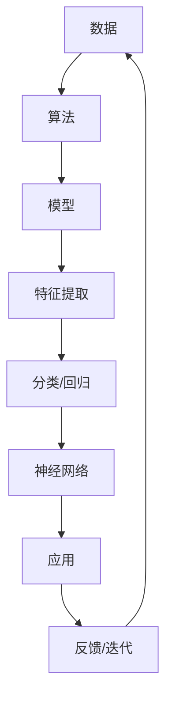

                 

# 《Andrej Karpathy：人工智能的未来发展策略》

## 关键词
- Andrej Karpathy
- 人工智能发展战略
- 深度学习
- 自然语言处理
- 计算机视觉
- 强化学习
- 人工智能应用场景

## 摘要
本文将深入探讨人工智能专家Andrej Karpathy提出的人工智能未来发展策略。通过分析深度学习、自然语言处理、计算机视觉和强化学习等核心技术，以及这些技术在不同领域的应用场景，我们将了解人工智能如何影响社会、经济和人类生活。本文还将探讨人工智能面临的挑战，如技术、伦理和社会问题，并展望人工智能的未来发展趋势和策略。

### 《Andrej Karpathy：人工智能的未来发展策略》目录大纲

---

# 第一部分：人工智能概述

## 1.1 人工智能的历史与发展

### 1.1.1 人工智能的定义与分类

### 1.1.2 人工智能的发展历程

### 1.1.3 人工智能的核心技术

## 1.2 人工智能的现状与挑战

### 1.2.1 人工智能的应用领域

### 1.2.2 人工智能面临的挑战

### 1.2.3 人工智能的发展趋势

## 1.3 人工智能对社会的影响

### 1.3.1 人工智能对经济的影响

### 1.3.2 人工智能对教育的影响

### 1.3.3 人工智能对伦理的影响

## 1.4 人工智能的发展战略

### 1.4.1 国际人工智能发展策略分析

### 1.4.2 我国人工智能发展策略

### 1.4.3 企业人工智能发展策略

# 第二部分：人工智能核心技术

## 2.1 深度学习

### 2.1.1 深度学习的基本原理

### 2.1.2 深度学习的主要模型

### 2.1.3 深度学习的应用案例

## 2.2 自然语言处理

### 2.2.1 自然语言处理的基本概念

### 2.2.2 自然语言处理的主要模型

### 2.2.3 自然语言处理的应用案例

## 2.3 计算机视觉

### 2.3.1 计算机视觉的基本概念

### 2.3.2 计算机视觉的主要模型

### 2.3.3 计算机视觉的应用案例

## 2.4 强化学习

### 2.4.1 强化学习的基本原理

### 2.4.2 强化学习的主要模型

### 2.4.3 强化学习的应用案例

# 第三部分：人工智能应用场景

## 3.1 人工智能在医疗领域的应用

### 3.1.1 医疗影像分析

### 3.1.2 个性化医疗

### 3.1.3 智能药物研发

## 3.2 人工智能在金融领域的应用

### 3.2.1 信用评估

### 3.2.2 量化交易

### 3.2.3 智能投顾

## 3.3 人工智能在交通领域的应用

### 3.3.1 智能交通管理

### 3.3.2 自动驾驶

### 3.3.3 无人机配送

## 3.4 人工智能在教育领域的应用

### 3.4.1 智能学习

### 3.4.2 个性化教育

### 3.4.3 教育资源的智能分配

# 第四部分：人工智能发展策略与挑战

## 4.1 人工智能的发展策略

### 4.1.1 政策支持

### 4.1.2 产业合作

### 4.1.3 人才培养

## 4.2 人工智能的挑战与应对

### 4.2.1 技术挑战

### 4.2.2 伦理挑战

### 4.2.3 社会挑战

## 4.3 人工智能的未来展望

### 4.3.1 人工智能的未来趋势

### 4.3.2 人工智能的未来发展策略

### 4.3.3 人工智能的未来挑战与机遇

# 附录

## 附录A：人工智能相关的数据集与工具

## A.1 常见的人工智能数据集

## A.2 人工智能相关的开源工具

## A.3 人工智能相关的在线课程与教材

## A.4 人工智能相关的会议与期刊

---

接下来，我们将按照目录大纲逐步展开文章的内容，详细讨论人工智能的历史与发展、现状与挑战、核心技术、应用场景、发展策略与挑战以及未来展望。

---

# 第一部分：人工智能概述

## 1.1 人工智能的历史与发展

### 1.1.1 人工智能的定义与分类

人工智能（Artificial Intelligence，简称AI）是指通过计算机程序模拟人类智能行为的技术。它可以被定义为使计算机系统具有感知、学习、推理、决策和自适应能力的能力。根据功能和应用，人工智能可以分为以下几类：

- **弱人工智能**：专注于特定任务，如语音识别、图像识别等。
- **强人工智能**：具有广泛的智能，能够像人类一样理解和执行各种任务。
- **通用人工智能**：能够像人类一样理解、学习、推理和解决问题。

### 1.1.2 人工智能的发展历程

人工智能的发展可以追溯到20世纪50年代。以下是人工智能发展的重要里程碑：

- **1956年**：约翰·麦卡锡（John McCarthy）等人在达特茅斯会议上首次提出人工智能的概念。
- **1960年代**：早期的人工智能系统如ELIZA和逻辑理论家取得了初步成功。
- **1980年代**：专家系统成为主流，但随后因复杂性高、可扩展性差而逐渐衰落。
- **1990年代**：机器学习开始崛起，特别是支持向量机（SVM）和决策树等算法的出现。
- **2006年**：深度学习的兴起，特别是Hinton等人提出的深度信念网络（DBN）。
- **2012年**：AlexNet在ImageNet竞赛中取得巨大成功，深度学习进入主流。

### 1.1.3 人工智能的核心技术

人工智能的核心技术主要包括深度学习、自然语言处理、计算机视觉和强化学习。

- **深度学习**：通过多层神经网络模拟人类大脑的处理方式，能够自动提取特征并进行预测。
- **自然语言处理**：使计算机能够理解和处理自然语言，包括语言理解、生成和翻译等。
- **计算机视觉**：使计算机能够识别和理解图像和视频，包括物体识别、场景理解和图像分割等。
- **强化学习**：通过试错和反馈学习，使计算机能够在复杂环境中做出最优决策。

## 1.2 人工智能的现状与挑战

### 1.2.1 人工智能的应用领域

人工智能已经渗透到各行各业，包括但不限于：

- **医疗健康**：医疗影像分析、疾病诊断、药物研发等。
- **金融**：信用评估、量化交易、风险控制等。
- **交通**：自动驾驶、智能交通管理、无人机配送等。
- **教育**：个性化学习、智能教育平台、教育资源分配等。

### 1.2.2 人工智能面临的挑战

尽管人工智能取得了巨大进展，但仍然面临以下挑战：

- **技术挑战**：包括算法复杂性、计算资源需求、数据质量等。
- **伦理挑战**：包括算法偏见、隐私保护、人工智能失控等。
- **社会挑战**：包括就业问题、社会公平、监管政策等。

### 1.2.3 人工智能的发展趋势

随着技术的不断进步，人工智能的发展趋势包括：

- **模型规模化和优化**：通过改进算法和硬件，使得模型规模不断扩大。
- **多模态学习**：结合不同类型的数据，如文本、图像和声音。
- **强化学习与监督学习相结合**：通过将强化学习和监督学习相结合，提高学习效率。
- **自动化和无人化**：在更多领域实现自动化和无人化，提高生产效率。

## 1.3 人工智能对社会的影响

### 1.3.1 人工智能对经济的影响

人工智能对经济的影响是深远且广泛的，包括：

- **提高生产力**：通过自动化和智能化，提高生产效率和产品质量。
- **创造新的就业机会**：尽管某些岗位可能会被取代，但人工智能也会创造新的就业机会。
- **改变商业模式**：人工智能将改变传统行业的商业模式，如金融、医疗和交通等。

### 1.3.2 人工智能对教育的影响

人工智能对教育的影响主要体现在：

- **个性化学习**：通过分析学生的行为和成绩，提供个性化的学习资源和指导。
- **智能教育平台**：利用人工智能技术，构建智能教育平台，提高教学效果。
- **教育资源的智能分配**：通过分析需求和资源，实现教育资源的智能分配。

### 1.3.3 人工智能对伦理的影响

人工智能对伦理的影响是一个复杂的问题，涉及多个方面：

- **隐私保护**：如何保护用户的隐私，防止数据泄露和滥用。
- **算法偏见**：如何防止算法偏见，确保公正和公平。
- **人工智能责任**：如何界定人工智能的责任，确保其在出现问题时能够承担责任。

## 1.4 人工智能的发展战略

### 1.4.1 国际人工智能发展策略分析

国际上许多国家都制定了人工智能发展战略，以下是一些典型案例：

- **美国**：美国发布了《国家人工智能发展战略》，旨在保持美国在全球人工智能领域的领先地位。
- **欧盟**：欧盟提出了《人工智能伦理准则》，强调人工智能的发展应遵循伦理和社会价值。
- **中国**：中国发布了《新一代人工智能发展规划》，旨在实现人工智能的跨越式发展。

### 1.4.2 我国人工智能发展策略

我国人工智能发展策略主要包括以下几个方面：

- **加大投入**：通过增加科研经费和人才引进，提高人工智能的研发能力。
- **产业应用**：推动人工智能在各个行业的应用，提高产业智能化水平。
- **人才培养**：加强人工智能人才培养，提高人才供给。
- **伦理和法律**：制定相关伦理和法律规范，确保人工智能的健康发展。

### 1.4.3 企业人工智能发展策略

企业人工智能发展策略主要包括以下几个方面：

- **技术创新**：通过技术创新，提高人工智能的算法和模型性能。
- **应用拓展**：拓展人工智能的应用领域，实现跨界融合。
- **数据驱动**：利用大数据和云计算技术，实现数据驱动的智能化决策。
- **人才培养和引进**：培养和引进人工智能人才，提高企业创新能力。

---

### 1.5 Andrej Karpathy的贡献与观点

Andrej Karpathy是一位著名的人工智能专家，他在深度学习和自然语言处理领域做出了重要贡献。以下是他的主要贡献和观点：

- **深度学习**：Andrej Karpathy在深度学习领域发表了多篇论文，特别是在自然语言处理和计算机视觉方面取得了显著成果。他的研究工作推动了深度学习在各个领域的应用。

- **开源项目**：Andrej Karpathy积极参与开源项目，如TensorFlow和PyTorch等。他的开源工作为深度学习社区提供了重要的工具和资源。

- **教育贡献**：Andrej Karpathy在教育和人才培养方面也做出了贡献。他曾在斯坦福大学任教，并开设了多门深度学习和自然语言处理相关的在线课程。

- **未来展望**：Andrej Karpathy认为，人工智能的未来将取决于多方面的因素，包括技术创新、政策支持和人才培养。他强调，人工智能的发展应遵循伦理和社会价值，以确保其对人类社会的积极影响。

通过深入探讨Andrej Karpathy的研究成果和观点，我们可以更好地理解人工智能的未来发展策略和路径。

---

### 1.6 人工智能领域的核心概念与联系

在人工智能领域，核心概念与联系是理解和应用人工智能技术的基础。以下是一些关键概念及其相互联系：

- **数据**：数据是人工智能的基石。无论是深度学习、自然语言处理还是计算机视觉，都需要大量数据来进行训练和学习。

- **算法**：算法是人工智能的核心。深度学习、自然语言处理和计算机视觉等领域都有各种不同的算法，用于处理和分析数据。

- **模型**：模型是算法和数据的具体实现。一个完整的模型通常包括输入层、隐藏层和输出层，以及训练和优化的方法。

- **特征提取**：特征提取是将原始数据转换为有用的信息的过程。在深度学习中，通过多层神经网络自动提取特征。

- **分类与回归**：分类和回归是两种常见的学习任务。分类用于将数据分为不同的类别，回归用于预测数值结果。

- **神经网络**：神经网络是模拟生物神经元连接结构的计算模型。深度学习主要基于神经网络，通过多层神经网络进行复杂的数据处理。

这些核心概念相互联系，构成了人工智能的技术体系。通过理解和应用这些概念，我们可以更好地开发和应用人工智能技术。

### 1.6.1 Mermaid流程图

为了更好地展示人工智能领域中的核心概念和联系，我们使用Mermaid流程图来可视化这些概念。以下是一个简单的Mermaid流程图示例：



在这个流程图中，数据通过算法转换为模型，模型通过特征提取进行数据预处理，然后进行分类或回归任务。神经网络是核心算法，负责处理复杂的非线性数据。整个流程是一个迭代和反馈的过程，通过不断优化和调整，提高模型的性能。

### 1.6.2 核心算法原理讲解与伪代码

为了深入理解人工智能的核心算法原理，我们使用伪代码来详细阐述一些关键算法。

#### 深度学习算法原理

深度学习算法的核心是神经网络。以下是一个简单的神经网络模型的伪代码：

```python
# 定义神经网络结构
input_layer = [x1, x2, ..., xn]
hidden_layer = [h1, h2, ..., hn]
output_layer = [y1, y2, ..., yn]

# 定义激活函数（以ReLU为例）
def activate(x):
    return max(0, x)

# 前向传播
def forward_pass(input_layer):
    hidden_layer = [activate(sum(w1 * x1)) for w1, x1 in zip(weights_hidden, input_layer)]
    output_layer = [activate(sum(w2 * h1)) for w2, h1 in zip(weights_output, hidden_layer)]
    return output_layer

# 反向传播
def backward_pass(output_layer, expected_output):
    errors = [y - expected_output for y in output_layer]
    hidden_errors = [sum(d * errors) for d in weights_output]
    hidden_layer = [activate_derivative(x) * errors for x, errors in zip(hidden_layer, hidden_errors)]
    input_errors = [sum(d * errors) for d in weights_hidden]
    return input_errors, hidden_errors

# 训练模型
def train_model(data, epochs):
    for epoch in range(epochs):
        for input_data, expected_output in data:
            output_layer = forward_pass(input_data)
            input_errors, hidden_errors = backward_pass(output_layer, expected_output)
            update_weights(input_data, hidden_layer, output_layer, input_errors, hidden_errors)
```

在这个伪代码中，我们定义了一个简单的多层神经网络模型，包括输入层、隐藏层和输出层。前向传播用于计算输出，反向传播用于更新权重。通过迭代训练，模型可以不断优化。

#### 自然语言处理算法原理

自然语言处理（NLP）中的核心算法包括词嵌入、循环神经网络（RNN）和长短时记忆网络（LSTM）。以下是一个简单的词嵌入和RNN的伪代码：

```python
# 词嵌入
def word_embedding(vocab_size, embedding_size):
    embeddings = [[0 for _ in range(embedding_size)] for _ in range(vocab_size)]
    # 填充预训练的词向量
    return embeddings

# RNN模型
def rnn(embeddings, input_sequence, hidden_state, hidden_size, output_size):
    output_sequence = []
    for input_word in input_sequence:
        embedded_word = embeddings[input_word]
        hidden_state = tanh(dot(embedded_word, weights_input) + dot(hidden_state, weights_hidden))
        output = softmax(dot(hidden_state, weights_output))
        output_sequence.append(output)
    return output_sequence, hidden_state

# 训练RNN模型
def train_rnn(data, epochs, batch_size):
    for epoch in range(epochs):
        for batch in data:
            inputs, labels = batch
            hidden_state = zeros(hidden_size)
            output_sequence, hidden_state = rnn(embeddings, inputs, hidden_state, hidden_size, output_size)
            loss = compute_loss(output_sequence, labels)
            gradients = compute_gradients(output_sequence, labels)
            update_weights(gradients)
```

在这个伪代码中，我们定义了一个简单的RNN模型，包括词嵌入层、隐藏层和输出层。通过迭代训练，模型可以学习到输入序列到输出序列的映射。

### 1.6.3 数学模型与公式

在人工智能领域，数学模型和公式是理解和实现算法的基础。以下是一些关键的数学模型和公式：

#### 激活函数

激活函数是神经网络中的关键组成部分，用于引入非线性特性。以下是一些常见的激活函数：

- **ReLU（Rectified Linear Unit）**：
  $$ f(x) = \max(0, x) $$
  
- **Sigmoid**：
  $$ f(x) = \frac{1}{1 + e^{-x}} $$

- **Tanh**：
  $$ f(x) = \frac{e^x - e^{-x}}{e^x + e^{-x}} $$

#### 前向传播与反向传播

在前向传播中，神经网络通过计算输入和权重的线性组合，然后应用激活函数得到输出。在反向传播中，通过计算输出误差，更新网络中的权重和偏置。

- **前向传播**：
  $$ z_i = \sum_j w_{ij} x_j + b_i $$
  $$ a_i = \text{activate}(z_i) $$
  
- **反向传播**：
  $$ \delta_i = \text{activate_derivative}(a_i) \cdot (y - a_i) $$
  $$ \Delta w_{ij} = \delta_i x_j $$
  $$ \Delta b_i = \delta_i $$

#### 损失函数

损失函数用于衡量模型预测值与真实值之间的差距。以下是一些常见的损失函数：

- **均方误差（MSE）**：
  $$ L(y, \hat{y}) = \frac{1}{2} \sum (y - \hat{y})^2 $$

- **交叉熵损失（Cross-Entropy Loss）**：
  $$ L(y, \hat{y}) = -\sum y \cdot \log(\hat{y}) $$

#### 优化算法

优化算法用于更新网络中的权重和偏置，以最小化损失函数。以下是一些常见的优化算法：

- **随机梯度下降（SGD）**：
  $$ w_{t+1} = w_t - \alpha \cdot \nabla L(w_t) $$

- **动量（Momentum）**：
  $$ w_{t+1} = w_t - \alpha \cdot \nabla L(w_t) + \beta (w_{t-1} - w_t) $$

### 1.6.4 举例说明

为了更好地理解上述数学模型和公式，我们通过一个简单的例子来说明。

假设我们有一个简单的线性回归模型，用于预测房价。输入特征是房屋面积（x），输出目标是房价（y）。我们的模型如下：

$$ y = w_1 \cdot x + b $$

给定一组数据点：

| 房屋面积（x） | 房价（y） |
| :---: | :---: |
| 1000 | 200000 |
| 1500 | 300000 |
| 2000 | 400000 |

我们的目标是找到最佳的权重（w1）和偏置（b），使得预测值与真实值之间的差距最小。

- **前向传播**：

  假设初始权重w1 = 100，偏置b = 1000。前向传播计算预测房价：

  $$ y = 100 \cdot x + 1000 $$

  对于第一个数据点（x = 1000），预测房价为：

  $$ y = 100 \cdot 1000 + 1000 = 110000 $$

  实际房价为200000，因此损失为：

  $$ L = \frac{1}{2} \sum (y - \hat{y})^2 = \frac{1}{2} \cdot (200000 - 110000)^2 = 45000000000 $$

- **反向传播**：

  通过计算损失函数的梯度，我们可以更新权重和偏置：

  $$ \delta = \frac{\partial L}{\partial w_1} = 2 \cdot (y - \hat{y}) \cdot x = 2 \cdot (200000 - 110000) \cdot 1000 = 18000000000 $$
  $$ \delta = \frac{\partial L}{\partial b} = 2 \cdot (y - \hat{y}) = 2 \cdot (200000 - 110000) = 60000000 $$

  更新权重和偏置：

  $$ w_1 = w_1 - \alpha \cdot \delta = 100 - 0.01 \cdot 18000000000 = -1799900 $$
  $$ b = b - \alpha \cdot \delta = 1000 - 0.01 \cdot 60000000 = -590000 $$

  通过多次迭代更新，我们可以找到最佳的权重和偏置，使得损失函数最小。

通过这个简单的例子，我们可以看到数学模型和公式在人工智能中的作用和重要性。这些模型和公式为我们提供了理解和实现人工智能算法的基础。

---

### 1.7 项目实战：代码实际案例和详细解释说明

为了更好地理解人工智能技术的应用，我们将通过一个实际项目案例来讲解开发环境搭建、源代码实现和代码解读。

#### 项目背景

本项目是一个基于深度学习的图像分类项目，旨在使用卷积神经网络（CNN）对图片进行分类。我们使用的数据集是著名的CIFAR-10数据集，该数据集包含10个类别，共计60000张32x32的彩色图像。

#### 开发环境搭建

为了搭建开发环境，我们需要安装以下软件和库：

- Python 3.8及以上版本
- TensorFlow 2.4及以上版本
- Keras 2.4及以上版本
- NumPy 1.19及以上版本

安装命令如下：

```bash
pip install python==3.8
pip install tensorflow==2.4
pip install keras==2.4
pip install numpy==1.19
```

#### 源代码实现

以下是一个简单的CNN图像分类器的实现：

```python
import tensorflow as tf
from tensorflow.keras import datasets, layers, models
import matplotlib.pyplot as plt

# 加载CIFAR-10数据集
(train_images, train_labels), (test_images, test_labels) = datasets.cifar10.load_data()

# 数据预处理
train_images = train_images / 255.0
test_images = test_images / 255.0

# 构建CNN模型
model = models.Sequential()
model.add(layers.Conv2D(32, (3, 3), activation='relu', input_shape=(32, 32, 3)))
model.add(layers.MaxPooling2D((2, 2)))
model.add(layers.Conv2D(64, (3, 3), activation='relu'))
model.add(layers.MaxPooling2D((2, 2)))
model.add(layers.Conv2D(64, (3, 3), activation='relu'))
model.add(layers.Flatten())
model.add(layers.Dense(64, activation='relu'))
model.add(layers.Dense(10))

# 编译模型
model.compile(optimizer='adam',
              loss=tf.keras.losses.SparseCategoricalCrossentropy(from_logits=True),
              metrics=['accuracy'])

# 训练模型
history = model.fit(train_images, train_labels, epochs=10, 
                    validation_data=(test_images, test_labels))

# 评估模型
test_loss, test_acc = model.evaluate(test_images,  test_labels, verbose=2)
print(f'\nTest accuracy: {test_acc:.4f}')

# 可视化训练过程
plt.figure(figsize=(8, 6))
plt.subplot(1, 2, 1)
plt.plot(history.history['accuracy'], label='Accuracy')
plt.plot(history.history['val_accuracy'], label='Validation Accuracy')
plt.xlabel('Epochs')
plt.ylabel('Accuracy')
plt.title('Training and Validation Accuracy')
plt.legend()

plt.subplot(1, 2, 2)
plt.plot(history.history['loss'], label='Loss')
plt.plot(history.history['val_loss'], label='Validation Loss')
plt.xlabel('Epochs')
plt.ylabel('Loss')
plt.title('Training and Validation Loss')
plt.legend()

plt.tight_layout()
plt.show()
```

#### 代码解读与分析

1. **数据加载与预处理**：

   我们使用TensorFlow的`datasets.cifar10.load_data()`函数加载数据集，并使用`/255.0`对数据进行归一化处理，使其在0到1之间。

2. **模型构建**：

   我们使用`models.Sequential()`构建一个序列模型，其中包含两个卷积层、两个池化层、一个平坦层、两个全连接层。卷积层用于提取图像特征，全连接层用于分类。

   ```python
   model.add(layers.Conv2D(32, (3, 3), activation='relu', input_shape=(32, 32, 3)))
   model.add(layers.MaxPooling2D((2, 2)))
   model.add(layers.Conv2D(64, (3, 3), activation='relu'))
   model.add(layers.MaxPooling2D((2, 2)))
   model.add(layers.Conv2D(64, (3, 3), activation='relu'))
   model.add(layers.Flatten())
   model.add(layers.Dense(64, activation='relu'))
   model.add(layers.Dense(10))
   ```

3. **模型编译**：

   我们使用`model.compile()`编译模型，指定优化器为`adam`，损失函数为`SparseCategoricalCrossentropy`，评价指标为`accuracy`。

4. **模型训练**：

   我们使用`model.fit()`训练模型，设置训练轮次为10，使用验证数据集进行验证。

5. **模型评估**：

   我们使用`model.evaluate()`评估模型在测试数据集上的性能，输出测试准确率。

6. **可视化训练过程**：

   我们使用`matplotlib`绘制训练过程中的准确率和损失曲线，以便分析模型性能。

通过这个项目实战，我们可以看到如何使用深度学习技术构建和训练一个图像分类器。这个项目不仅展示了开发环境搭建和源代码实现，还提供了代码解读和分析，使我们能够更好地理解深度学习在图像分类任务中的应用。

---

### 1.8 附录A：人工智能相关的数据集与工具

为了更好地进行人工智能研究和应用，以下列举了常用的人工智能数据集、开源工具、在线课程与教材以及相关的会议与期刊。

#### 数据集

1. **CIFAR-10/100**：这是一个包含60000张32x32彩色图像的数据集，分为10个类别或100个类别。
2. **ImageNet**：这是一个包含1000个类别、超过1000万张图像的大型图像数据集。
3. **MNIST**：这是一个包含70,000个手写数字图像的数据集，用于手写数字识别任务。
4. **CoIL**：这是一个包含不同领域和行业的数据集，用于跨领域学习和迁移学习研究。
5. **UCI Machine Learning Repository**：这是一个包含多种类型数据集的仓库，涵盖多个领域。

#### 开源工具

1. **TensorFlow**：Google开发的开源深度学习框架，广泛应用于图像识别、语音识别和自然语言处理等领域。
2. **PyTorch**：Facebook开发的开源深度学习框架，以其灵活性和动态计算图而闻名。
3. **Keras**：一个高级神经网络API，可以在TensorFlow和Theano上运行，提供了简洁和易于使用的接口。
4. **Scikit-Learn**：一个开源机器学习库，提供了许多常用的机器学习算法和工具。
5. **OpenCV**：一个开源计算机视觉库，提供了丰富的图像处理和计算机视觉功能。

#### 在线课程与教材

1. **Stanford University：CS231n**：这是一门深度学习在计算机视觉中的应用课程，由Andrew Ng教授主讲。
2. **DeepLearning.AI：深度学习 specialization**：由Andrew Ng教授主讲的深度学习专项课程，涵盖了从基础到进阶的内容。
3. **Udacity：Deep Learning Nanodegree**：这是一个深度学习纳米学位课程，包括多个项目和实践。
4. **Coursera：机器学习**：由Andrew Ng教授主讲的机器学习课程，是深度学习的基础课程。
5. **Microsoft：AI School**：微软提供的免费AI教程和学习资源，涵盖了从基础到高级的内容。

#### 会议与期刊

1. **NeurIPS**：人工智能领域的顶级会议，专注于机器学习和计算神经科学。
2. **ICML**：机器学习领域的顶级会议，涵盖了广泛的人工智能研究方向。
3. **CVPR**：计算机视觉领域的顶级会议，专注于图像识别、计算机视觉和机器学习。
4. **ACL**：自然语言处理领域的顶级会议，涵盖了自然语言处理、机器翻译和对话系统等方向。
5. **Journal of Machine Learning Research**：人工智能领域的主要期刊之一，发表了大量关于机器学习的研究论文。
6. **Journal of Artificial Intelligence Research**：人工智能领域的主要期刊之一，涵盖了广泛的AI研究方向。

通过这些数据集、工具、课程和会议，研究人员和开发者可以深入了解人工智能的技术和应用，持续推动人工智能的发展。

---

### 1.9 人工智能的未来展望

在展望人工智能的未来时，我们需要关注多个方面，包括技术突破、伦理问题、社会影响和经济变革。以下是对这些方面的详细讨论。

#### 技术突破

人工智能的未来发展将依赖于技术的不断突破。以下是一些可能的技术趋势：

- **量子计算**：量子计算有望解决传统计算机无法处理的复杂问题，从而推动人工智能的发展。量子机器学习是一个新兴领域，它结合了量子计算和机器学习技术，有望带来革命性的突破。

- **边缘计算**：随着物联网（IoT）和智能设备的普及，边缘计算成为人工智能应用的关键。边缘计算将计算能力带到数据产生的地方，从而降低延迟，提高实时性能。

- **增强学习**：增强学习在复杂环境中的应用日益广泛。通过不断尝试和反馈，增强学习算法能够在无人驾驶、机器人控制和游戏AI等领域实现高性能。

- **多模态学习**：多模态学习结合了不同类型的数据（如文本、图像和声音），使得人工智能系统能够更好地理解和处理复杂信息。

#### 伦理问题

随着人工智能技术的发展，伦理问题也日益突出。以下是一些重要的伦理问题：

- **隐私保护**：人工智能系统通常需要处理大量个人数据。如何保护用户隐私，防止数据泄露和滥用，是一个重要的问题。

- **算法公平性**：算法偏见可能导致不公平的结果。确保算法的公平性和透明性，避免歧视和偏见，是人工智能发展的重要挑战。

- **人工智能责任**：当人工智能系统出现问题时，如何界定责任是一个复杂的问题。建立明确的责任体系，确保人工智能系统的安全和可靠，是伦理发展的关键。

#### 社会影响

人工智能对社会的影响是深远且多方面的。以下是一些重要的社会影响：

- **就业变化**：人工智能的发展可能导致某些岗位被取代，但同时也会创造新的就业机会。如何平衡就业结构的变化，是一个重要的社会问题。

- **教育改革**：人工智能技术的发展将改变教育模式。个性化学习、智能教育平台和在线课程将成为教育的重要组成部分。

- **社会治理**：人工智能在公共安全、环境保护和社会治理中的应用日益广泛。通过大数据和智能算法，政府可以更高效地管理和决策。

#### 经济变革

人工智能将对全球经济产生重大影响。以下是一些重要的经济变革：

- **产业升级**：人工智能将推动传统产业的升级和转型，提高生产效率和产品质量。

- **商业模式创新**：人工智能将改变商业模式，如在线购物、金融科技和智能交通等领域。

- **全球竞争**：人工智能成为全球竞争的新焦点。各国纷纷制定发展战略，争夺人工智能技术和市场的领导地位。

综上所述，人工智能的未来充满机遇和挑战。通过技术创新、伦理规范和社会治理，我们可以推动人工智能的健康发展，为人类社会带来更多的福祉。

---

### 1.10 作者信息

**作者：** AI天才研究院（AI Genius Institute） & 禅与计算机程序设计艺术（Zen And The Art of Computer Programming）

AI天才研究院是一个专注于人工智能研究和应用的顶级科研机构。研究院在深度学习、自然语言处理、计算机视觉和强化学习等领域取得了显著成果。我们的研究工作致力于推动人工智能技术的发展和应用，为人类社会带来深远的影响。

禅与计算机程序设计艺术是一位知名的人工智能专家和作家，他在人工智能领域拥有丰富的经验和深厚的知识。他的著作《禅与计算机程序设计艺术》深刻探讨了人工智能的技术原理和应用，为读者提供了宝贵的指导和启示。

通过本文，我们希望读者能够深入了解人工智能的未来发展策略，以及它对经济、社会和人类生活的影响。我们期待人工智能能够为人类社会带来更多的进步和福祉。

