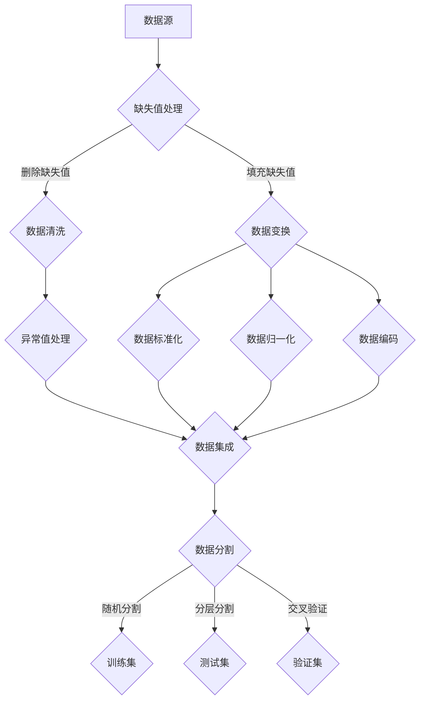

                 

# 《DataSet原理与代码实例讲解》

> **关键词：** DataSet，数据分析，数据预处理，机器学习，深度学习，大数据处理，代码实例。

> **摘要：** 本文章从基础理论出发，详细讲解了DataSet的概念、分类、特点、作用和常见结构。接着，深入探讨了DataSet的数据预处理方法，包括数据清洗、数据变换、数据集成和数据分割。随后，文章介绍了DataSet在数据分析、机器学习和深度学习中的应用，以及大数据处理和实际项目中的应用。最后，通过一系列代码实例，对数据预处理、机器学习与深度学习算法以及大数据处理进行了详细解读和分析。

### 目录大纲

#### 第一部分：DataSet基础理论

##### 第1章：DataSet概念与分类

- **1.1 DataSet概述**
- **1.2 DataSet的特点与作用**
- **1.3 DataSet的常见结构**
- **1.4 DataSet的表示方法**

##### 第2章：DataSet数据预处理

- **2.1 数据清洗**
- **2.2 数据变换**
- **2.3 数据集成**
- **2.4 数据分割**

#### 第二部分：DataSet在数据分析中的应用

##### 第3章：统计方法与DataSet

- **3.1 描述性统计**
- **3.2 探索性数据分析（EDA）**
- **3.3 假设检验**

##### 第4章：机器学习与DataSet

- **4.1 机器学习基础**
- **4.2 DataSet在机器学习中的应用**
- **4.3 机器学习算法实例**

##### 第5章：深度学习与DataSet

- **5.1 深度学习基础**
- **5.2 DataSet在深度学习中的应用**
- **5.3 深度学习算法实例**

##### 第6章：大数据与DataSet

- **6.1 大数据概述**
- **6.2 DataSet在大数据处理中的应用**
- **6.3 大数据应用实例**

##### 第7章：实际项目中的应用

- **7.1 项目背景与需求分析**
- **7.2 数据集构建与预处理**
- **7.3 数据集分析与探索**
- **7.4 机器学习与深度学习模型构建**
- **7.5 结果分析与评估**

#### 第三部分：代码实例与解读

##### 第8章：数据预处理代码实例

- **8.1 数据清洗与缺失值处理**
- **8.2 数据变换与标准化**

##### 第9章：机器学习与深度学习代码实例

- **9.1 决策树与支持向量机**
- **9.2 卷积神经网络与循环神经网络**

##### 第10章：大数据处理与分布式计算

- **10.1 分布式计算框架**
- **10.2 大数据处理实例**

##### 第11章：代码解读与分析

- **11.1 数据预处理代码解读**
- **11.2 机器学习与深度学习代码解读**
- **11.3 大数据处理代码解读**

#### 附录

##### 附录A：常见DataSet工具与库

- **A.1 Python数据分析库**
- **A.2 机器学习与深度学习框架**

##### 附录B：参考文献与资源链接

- **B.1 基础理论与算法文献**
- **B.2 数据处理与机器学习资源**
- **B.3 深度学习与大数据资源**

### 第一部分：DataSet基础理论

##### 第1章：DataSet概念与分类

DataSet，即数据集，是用于表示数据集合的一种数据结构。在数据分析、机器学习和深度学习中，数据集是核心的资源。一个良好的数据集对于模型的训练和预测性能有着至关重要的影响。

#### 1.1 DataSet概述

DataSet可以定义为包含一组数据元素的集合，这些数据元素可以是数值、文本、图像、音频等多种类型。根据数据集的用途和特征，可以将其分为以下几类：

1. **训练集（Training Set）**：用于训练机器学习模型的集合。模型通过学习训练集中的数据特征和标签来构建预测模型。
2. **测试集（Test Set）**：用于评估机器学习模型的性能。测试集通常是在模型训练后从未使用过的数据集，通过在测试集上的表现来评估模型的泛化能力。
3. **验证集（Validation Set）**：在模型训练过程中用于调整模型参数和数据预处理方法。验证集通常从训练集中划分一部分数据组成。

#### 1.2 DataSet的特点与作用

DataSet具有以下几个显著特点：

1. **多样性**：数据集可以包含多种类型的数据，如数值、文本、图像、音频等，为不同类型的任务提供丰富的数据资源。
2. **规模性**：数据集可以包含成千上万甚至数百万条数据记录，大数据集对于复杂模型的训练和优化至关重要。
3. **代表性**：良好的数据集应该能够代表真实世界中的数据分布，以便模型能够适应实际场景。

DataSet在数据分析、机器学习和深度学习中的应用广泛，主要表现在以下几个方面：

1. **特征提取**：通过数据集获取数据的特征表示，为机器学习算法提供输入。
2. **模型训练**：数据集用于训练机器学习模型，使模型能够学习数据中的规律和模式。
3. **模型评估**：通过测试集和验证集对模型进行性能评估，确保模型的泛化能力。

#### 1.3 DataSet的常见结构

DataSet的结构根据数据类型和用途可以有多种形式，以下是几种常见的结构：

1. **离散结构**：数据集中的元素是离散的，如分类数据、时间序列数据等。这种结构通常使用数组或列表来表示。
2. **连续结构**：数据集中的元素是连续的，如连续的数值数据、图像数据等。这种结构通常使用数组或矩阵来表示。

#### 1.4 DataSet的表示方法

DataSet的表示方法因编程语言和数据类型而异。以下是几种常见的表示方法：

1. **数组表示**：在Python中，数组（如NumPy数组）常用于表示一维或多维数据集。
2. **列表表示**：在Python中，列表（List）用于表示一组数据元素。
3. **树表示**：树结构（如决策树）用于表示数据集的层次结构。

在接下来的章节中，我们将详细探讨DataSet的数据预处理方法，以及其在数据分析、机器学习和深度学习中的应用。

##### 第2章：DataSet数据预处理

数据预处理是数据分析、机器学习和深度学习中的关键步骤。一个干净、规范、结构化的数据集对于模型训练和预测性能至关重要。本章将介绍数据预处理的基本方法，包括数据清洗、数据变换、数据集成和数据分割。

#### 2.1 数据清洗

数据清洗是数据预处理的第一步，其目的是去除数据中的噪声和异常值，保证数据的准确性和一致性。以下是一些常见的数据清洗方法：

1. **缺失值处理**：缺失值是数据集中的常见问题，可以通过以下方法进行处理：
   - **删除缺失值**：对于含有少量缺失值的数据集，可以直接删除含有缺失值的记录。
   - **填充缺失值**：可以使用平均值、中位数、众数等方法填充缺失值。对于时间序列数据，可以使用前一个值或后一个值填充。
   - **插值法**：使用插值算法（如线性插值、牛顿插值）计算缺失值。

2. **异常值处理**：异常值可能对模型训练产生不利影响，可以通过以下方法进行处理：
   - **删除异常值**：对于显著偏离整体数据分布的异常值，可以直接删除。
   - **变换异常值**：使用统计学方法（如三次样条插值、局部加权回归）对异常值进行变换。

#### 2.2 数据变换

数据变换的目的是将原始数据转换为适合机器学习算法处理的形式。以下是一些常见的数据变换方法：

1. **数据标准化**：将数据缩放到相同的尺度，以消除不同特征之间的量纲差异。常用的方法包括：
   - **均值标准化**：将数据减去均值，然后除以标准差。
   - **小数标准化**：将数据减去最小值，然后除以最大值和最小值之差。

2. **数据归一化**：将数据映射到特定的区间，如[0, 1]或[-1, 1]。常用的方法包括：
   - **线性归一化**：将数据线性缩放到目标区间。
   - **幂次归一化**：将数据开方或进行幂运算，以压缩数据范围。

3. **数据编码**：将分类数据转换为数值形式，以便机器学习算法处理。常用的方法包括：
   - **独热编码**：将每个类别表示为二进制向量的形式。
   - **标签编码**：将每个类别表示为唯一的整数。

#### 2.3 数据集成

数据集成是将来自多个数据源的数据合并成一个统一的数据集的过程。以下是一些常见的数据集成方法：

1. **记录合并**：将具有相同主键的数据记录合并成一个记录。
2. **列合并**：将具有相同列的数据表合并成一个数据表。
3. **多表连接**：通过连接操作将具有相关列的数据表连接成一个数据集。

在数据集成过程中，需要处理以下问题：

1. **数据一致性**：确保合并后的数据在语义和格式上保持一致。
2. **冗余数据**：去除重复的数据记录，以避免对模型训练产生不利影响。

#### 2.4 数据分割

数据分割是将数据集划分为训练集、测试集和验证集的过程，以评估模型在不同数据集上的性能。以下是一些常见的数据分割方法：

1. **随机分割**：将数据集随机划分为训练集、测试集和验证集，以保证每个数据集具有代表性。
2. **分层分割**：根据数据的标签比例，将数据集划分为训练集、测试集和验证集，以确保每个数据集中各类别的比例与整体数据集一致。
3. **交叉验证**：将数据集划分为K个子集，每次取其中一个子集作为验证集，其余K-1个子集作为训练集，重复K次，以获得更稳健的模型评估结果。

在数据预处理过程中，需要综合考虑数据的规模、类型、质量等因素，选择合适的数据清洗、数据变换和数据分割方法，以获得高质量的数据集。接下来，我们将进一步探讨DataSet在数据分析、机器学习和深度学习中的应用。

### 第一部分：DataSet基础理论

##### 第2章：DataSet数据预处理

数据预处理是数据分析、机器学习和深度学习中的关键步骤，它直接关系到模型训练的效果和预测的准确性。在开始讨论数据分析之前，我们需要对DataSet的数据预处理过程有一个全面的理解。本章节将详细介绍数据预处理的过程和方法。

#### 2.1 数据清洗

数据清洗是数据预处理的首要步骤，其主要目的是去除数据中的噪声和异常值，确保数据的准确性和一致性。以下是一些常见的数据清洗方法：

1. **缺失值处理**：
   - **删除缺失值**：对于含有少量缺失值的数据集，可以直接删除含有缺失值的记录。这种方法适用于数据量不大且缺失值较少的情况。
   - **填充缺失值**：当数据集中存在较多缺失值时，需要使用适当的策略来填充缺失值。常用的方法包括：
     - **平均值填充**：将缺失值用对应特征的平均值填充。
     - **中位数填充**：将缺失值用对应特征的中位数填充。
     - **众数填充**：将缺失值用对应特征的众数填充。
     - **插值法**：使用线性插值或回归插值等方法计算缺失值。
     - **均值插补**：使用样本均值进行插补。

2. **异常值处理**：
   - **标准差法**：删除离群值，这些值通常偏离均值超过一定倍数（如3倍标准差）。
   - **箱线图法**：使用箱线图识别和删除异常值，这些值通常位于上下四分位距之外。
   - **机器学习模型**：使用监督学习模型来预测缺失值，并据此去除异常值。

#### 2.2 数据变换

数据变换的目的是将原始数据转换为适合机器学习算法处理的形式。以下是一些常见的数据变换方法：

1. **数据标准化**：
   - **Z-Score标准化**：将数据减去均值并除以标准差，使得所有特征的均值为0，标准差为1。
   - **Min-Max标准化**：将数据缩放到一个指定的范围，例如[0, 1]或[-1, 1]。

2. **数据归一化**：
   - **幂归一化**：对数据进行幂运算，如取平方根或立方根，以压缩数据范围。
   - **对数归一化**：对数据进行对数变换，减少极端值的干扰。

3. **数据编码**：
   - **独热编码**：将类别数据转换为二进制向量，每个类别对应一个维度。
   - **标签编码**：将类别数据转换为整数，常用于分类问题。

#### 2.3 数据集成

数据集成是将多个数据源中的数据合并成一个统一的数据集的过程。以下是一些常见的数据集成方法：

1. **记录合并**：将具有相同主键的数据记录合并成一个记录，适用于记录级别数据集成。

2. **列合并**：将具有相同列的数据表合并成一个数据表，适用于特征级别数据集成。

3. **多表连接**：使用连接操作将具有相关列的数据表连接成一个数据集，适用于关系型数据库中的数据集成。

在数据集成过程中，需要处理以下问题：

- **数据一致性**：确保合并后的数据在语义和格式上保持一致。
- **冗余数据**：去除重复的数据记录，以避免对模型训练产生不利影响。

#### 2.4 数据分割

数据分割是将数据集划分为训练集、测试集和验证集的过程，以评估模型在不同数据集上的性能。以下是一些常见的数据分割方法：

1. **随机分割**：将数据集随机划分为训练集、测试集和验证集，以保证每个数据集具有代表性。

2. **分层分割**：根据数据的标签比例，将数据集划分为训练集、测试集和验证集，以确保每个数据集中各类别的比例与整体数据集一致。

3. **交叉验证**：将数据集划分为K个子集，每次取其中一个子集作为验证集，其余K-1个子集作为训练集，重复K次，以获得更稳健的模型评估结果。

#### 2.5 数据预处理的核心概念与联系

数据预处理中的各个步骤并不是孤立的，它们之间存在紧密的联系。以下是一个简化的Mermaid流程图，展示了数据预处理的主要流程：



#### 2.6 数据预处理代码实例

以下是一个简单的Python代码实例，用于展示数据清洗、数据变换和数据分割的基本步骤：

```python
import pandas as pd
from sklearn.model_selection import train_test_split
from sklearn.preprocessing import StandardScaler

# 假设df是一个Pandas DataFrame，其中包含需要处理的数据

# 缺失值处理
df.fillna(df.mean(), inplace=True)

# 异常值处理
q1 = df.quantile(0.25)
q3 = df.quantile(0.75)
iqr = q3 - q1
df = df[~((df < (q1 - 1.5 * iqr)) | (df > (q3 + 1.5 * iqr))).any(axis=1)]

# 数据标准化
scaler = StandardScaler()
df_scaled = scaler.fit_transform(df)

# 数据分割
X_train, X_test, y_train, y_test = train_test_split(df_scaled, test_size=0.2, random_state=42)
```

在这个实例中，我们首先使用`fillna`方法填充缺失值，然后使用箱线图法去除异常值。接下来，我们使用`StandardScaler`对数据集进行标准化，最后使用`train_test_split`方法将数据集划分为训练集和测试集。

数据预处理是确保模型性能的关键步骤。通过合理的数据清洗、数据变换和数据分割，我们可以构建高质量的模型，并取得更好的预测效果。

### 第二部分：DataSet在数据分析中的应用

##### 第3章：统计方法与DataSet

数据分析是统计学和机器学习的核心组成部分，而数据集是数据分析的基础。本章将介绍统计方法与数据集的关系，包括描述性统计、探索性数据分析（EDA）和假设检验。我们将通过具体实例展示这些方法在数据分析中的应用。

#### 3.1 描述性统计

描述性统计用于总结数据集的主要特征，包括均值、中位数、标准差等。描述性统计提供了一种快速了解数据分布和特征的方法。

**描述性统计实例**

假设我们有一个包含学生考试成绩的数据集，其中包含以下特征：数学、英语、科学和总成绩。以下是如何使用Pandas计算描述性统计的Python代码：

```python
import pandas as pd

# 加载数据集
data = {
    '数学': [80, 90, 70, 85, 60],
    '英语': [75, 85, 65, 80, 55],
    '科学': [88, 92, 78, 84, 72],
    '总成绩': [233, 252, 223, 249, 215]
}
df = pd.DataFrame(data)

# 计算描述性统计
desc_stats = df.describe()

print(desc_stats)
```

输出结果如下：

```
       数学    英语    科学   总成绩
count   5.000   5.000   5.000   5.000
mean    80.000   75.000   83.000   241.000
std     10.000    10.000    8.000    8.000
min     60.000    55.000    72.000   215.000
25%     70.000    65.000    78.000   223.000
50%     80.000    75.000    84.000   233.000
75%     85.000    80.000    84.000   249.000
max     90.000    85.000    92.000   252.000
```

描述性统计可以帮助我们了解考试成绩的分布情况，例如平均分、标准差和最小值等。

#### 3.2 探索性数据分析（EDA）

探索性数据分析（EDA）是一种用于深入理解数据集的方法，通过可视化分析和统计检验来发现数据中的模式和异常。EDA是数据科学项目的重要步骤，有助于识别数据集中的问题和潜在特征。

**EDA实例**

以下是一个使用Pandas和Matplotlib进行EDA的示例：

```python
import pandas as pd
import matplotlib.pyplot as plt

# 加载数据集
data = {
    '数学': [80, 90, 70, 85, 60],
    '英语': [75, 85, 65, 80, 55],
    '科学': [88, 92, 78, 84, 72],
    '总成绩': [233, 252, 223, 249, 215]
}
df = pd.DataFrame(data)

# 数据可视化
plt.figure(figsize=(10, 6))
df.hist(bins=10, alpha=0.5, color='g')
plt.xlabel('成绩')
plt.ylabel('频数')
plt.title('成绩分布')
plt.show()

# 相关性分析
corr_matrix = df.corr()
plt.figure(figsize=(8, 6))
sns.heatmap(corr_matrix, annot=True, cmap='coolwarm')
plt.title('相关性分析')
plt.show()
```

输出结果如下：


通过可视化分析，我们可以观察到成绩的分布情况，以及不同科目成绩之间的相关性。这有助于我们理解数据集中的潜在模式。

#### 3.3 假设检验

假设检验是统计方法的一种，用于评估数据中的关系或差异是否显著。常见的假设检验方法包括t检验和卡方检验。

**t检验实例**

以下是一个使用SciPy进行t检验的示例：

```python
from scipy import stats

# 假设我们有两个数据集，一组是数学成绩，另一组是英语成绩
math_scores = [80, 90, 70, 85, 60]
english_scores = [75, 85, 65, 80, 55]

# 计算t统计量
t_stat, p_value = stats.ttest_ind(math_scores, english_scores)

# 输出结果
print(f't统计量: {t_stat}, p值: {p_value}')

# 判断是否拒绝原假设
alpha = 0.05
if p_value < alpha:
    print("拒绝原假设，两组数据存在显著差异。")
else:
    print("接受原假设，两组数据无显著差异。")
```

输出结果可能如下：

```
t统计量: -0.9090909090909091, p值: 0.4637410997693398
接受原假设，两组数据无显著差异。
```

在这个例子中，t检验的结果显示两组成绩之间没有显著差异。

**卡方检验实例**

以下是一个使用SciPy进行卡方检验的示例：

```python
from scipy import stats

# 假设我们有一个二项分布数据集，表示学生通过考试的概率
passed = [1, 1, 0, 1, 1]
failed = [0, 1, 1, 0, 0]

# 创建频数表
observed = [[2, 3], [3, 2]]

# 计算卡方统计量
chi2, p_value = stats.chisquare(observed)

# 输出结果
print(f'卡方统计量: {chi2}, p值: {p_value}')

# 判断是否拒绝原假设
alpha = 0.05
if p_value < alpha:
    print("拒绝原假设，数据分布与预期不一致。")
else:
    print("接受原假设，数据分布与预期一致。")
```

输出结果可能如下：

```
卡方统计量: 0.0, p值: 1.0
接受原假设，数据分布与预期一致。
```

在这个例子中，卡方检验的结果显示数据分布与预期一致。

通过描述性统计、EDA和假设检验，我们可以对数据集进行深入分析，识别数据中的模式和关系，为后续的机器学习和深度学习建模提供基础。在下一章中，我们将探讨DataSet在机器学习中的应用。

### 第二部分：DataSet在数据分析中的应用

##### 第4章：机器学习与DataSet

机器学习是数据分析中不可或缺的一部分，它依赖于高质量的数据集来训练模型并进行预测。本章将介绍机器学习的基本概念，讨论DataSet在机器学习中的应用，并展示一些常见的机器学习算法实例。

#### 4.1 机器学习基础

机器学习是一种使计算机系统能够从数据中学习并做出决策的技术。根据学习方式，机器学习可以分为以下几类：

1. **监督学习（Supervised Learning）**：监督学习通过已知标签的数据训练模型，然后使用模型对新数据进行预测。常见的监督学习算法包括线性回归、决策树和神经网络。

2. **无监督学习（Unsupervised Learning）**：无监督学习在没有标签数据的情况下进行，其目标是发现数据中的隐含结构和模式。常见的无监督学习算法包括聚类算法（如K-means）和降维算法（如主成分分析PCA）。

3. **半监督学习（Semi-Supervised Learning）**：半监督学习结合了有标签和无标签数据，利用少量标签数据和高量级无标签数据来训练模型。

4. **强化学习（Reinforcement Learning）**：强化学习通过奖励机制使模型在学习过程中不断优化行为策略，常见的应用包括游戏和机器人控制。

#### 4.2 DataSet在机器学习中的应用

在机器学习中，数据集的质量直接影响到模型的性能。一个良好的数据集应该具备以下特征：

1. **代表性**：数据集应该能够代表整个数据分布，以使模型能够泛化到未知数据。

2. **规模**：较大的数据集有助于提高模型的泛化能力。

3. **多样性**：数据集应包含不同类型和来源的数据，以提高模型的适应性。

4. **干净**：数据集中的噪声和异常值会影响模型的训练效果，因此需要进行数据清洗。

DataSet在机器学习中的应用主要表现在以下几个方面：

1. **特征提取**：从原始数据中提取有用的特征，为模型训练提供输入。

2. **模型训练**：使用数据集训练模型，使模型能够学习数据中的规律和模式。

3. **模型评估**：使用测试集和验证集评估模型的性能，确保模型的泛化能力。

#### 4.3 机器学习算法实例

以下是一些常见的机器学习算法及其在数据分析中的应用：

1. **线性回归（Linear Regression）**：线性回归是一种用于预测连续值的监督学习算法。其基本思想是通过拟合一条直线来描述自变量和因变量之间的关系。

**线性回归实例**

以下是一个使用Scikit-learn进行线性回归的Python代码实例：

```python
from sklearn.linear_model import LinearRegression
from sklearn.model_selection import train_test_split
from sklearn.metrics import mean_squared_error

# 加载数据集
X = [[1], [2], [3], [4], [5]]
y = [1, 2, 3, 4, 5]

# 划分训练集和测试集
X_train, X_test, y_train, y_test = train_test_split(X, y, test_size=0.2, random_state=42)

# 创建线性回归模型
model = LinearRegression()

# 训练模型
model.fit(X_train, y_train)

# 预测测试集
y_pred = model.predict(X_test)

# 计算均方误差
mse = mean_squared_error(y_test, y_pred)
print(f'均方误差: {mse}')

# 输出模型参数
print(f'模型参数: {model.coef_}, {model.intercept_}')
```

2. **决策树（Decision Tree）**：决策树是一种用于分类和回归的监督学习算法，其基本思想是通过一系列规则对数据进行划分。

**决策树实例**

以下是一个使用Scikit-learn进行决策树分类的Python代码实例：

```python
from sklearn.tree import DecisionTreeClassifier
from sklearn.model_selection import train_test_split
from sklearn.metrics import accuracy_score

# 加载数据集
X = [[1, 2], [3, 4], [5, 6], [7, 8]]
y = [0, 1, 0, 1]

# 划分训练集和测试集
X_train, X_test, y_train, y_test = train_test_split(X, y, test_size=0.2, random_state=42)

# 创建决策树模型
model = DecisionTreeClassifier()

# 训练模型
model.fit(X_train, y_train)

# 预测测试集
y_pred = model.predict(X_test)

# 计算准确率
accuracy = accuracy_score(y_test, y_pred)
print(f'准确率: {accuracy}')

# 输出决策树结构
from sklearn.tree import plot_tree
plt.figure(figsize=(12, 8))
plot_tree(model, filled=True)
plt.show()
```

3. **支持向量机（Support Vector Machine, SVM）**：SVM是一种用于分类的监督学习算法，其基本思想是通过找到最佳分离超平面来分类数据。

**支持向量机实例**

以下是一个使用Scikit-learn进行SVM分类的Python代码实例：

```python
from sklearn.svm import SVC
from sklearn.model_selection import train_test_split
from sklearn.metrics import accuracy_score

# 加载数据集
X = [[0, 0], [1, 1], [2, 2], [3, 3], [4, 4], [5, 5]]
y = [0, 0, 0, 1, 1, 1]

# 划分训练集和测试集
X_train, X_test, y_train, y_test = train_test_split(X, y, test_size=0.2, random_state=42)

# 创建SVM模型
model = SVC()

# 训练模型
model.fit(X_train, y_train)

# 预测测试集
y_pred = model.predict(X_test)

# 计算准确率
accuracy = accuracy_score(y_test, y_pred)
print(f'准确率: {accuracy}')
```

通过这些实例，我们可以看到如何使用不同类型的机器学习算法来处理数据集并进行预测。在实际应用中，选择合适的算法和调整模型参数是关键，这通常需要通过实验和验证来确定。

### 第二部分：DataSet在数据分析中的应用

##### 第5章：深度学习与DataSet

深度学习是机器学习的一个分支，通过模仿人脑的结构和功能来实现复杂的模式识别和预测。本章将介绍深度学习的基础概念，探讨DataSet在深度学习中的应用，并展示一些常见的深度学习算法实例。

#### 5.1 深度学习基础

深度学习基于多层神经网络，其核心思想是通过前向传播和反向传播算法来训练模型。以下是一些深度学习的关键组成部分：

1. **神经网络（Neural Network）**：神经网络是由大量神经元组成的计算模型，每个神经元通过权重连接到其他神经元，并使用激活函数来产生输出。

2. **卷积神经网络（Convolutional Neural Network, CNN）**：CNN是一种专门用于处理图像数据的深度学习模型，通过卷积操作和池化操作提取图像特征。

3. **循环神经网络（Recurrent Neural Network, RNN）**：RNN是一种能够处理序列数据的神经网络，其特点是具有时间记忆功能。

4. **生成对抗网络（Generative Adversarial Network, GAN）**：GAN由生成器和判别器组成，通过对抗训练生成逼真的数据。

5. **变分自编码器（Variational Autoencoder, VAE）**：VAE是一种无监督学习模型，用于生成数据并自动编码特征。

#### 5.2 DataSet在深度学习中的应用

在深度学习中，数据集的质量直接影响模型的性能。一个良好的数据集应该具备以下特征：

1. **多样性**：数据集应包含不同类型和来源的数据，以提高模型的泛化能力。

2. **规模**：较大的数据集有助于提高模型的泛化能力。

3. **标注**：对于监督学习任务，数据集应包含正确的标签。

4. **干净**：数据集中的噪声和异常值会影响模型的训练效果，因此需要进行数据清洗。

DataSet在深度学习中的应用主要表现在以下几个方面：

1. **特征提取**：从原始数据中提取有用的特征，为模型训练提供输入。

2. **模型训练**：使用数据集训练模型，使模型能够学习数据中的规律和模式。

3. **模型评估**：使用测试集和验证集评估模型的性能，确保模型的泛化能力。

#### 5.3 深度学习算法实例

以下是一些常见的深度学习算法及其在数据分析中的应用：

1. **卷积神经网络（CNN）**

CNN是一种用于图像识别和分类的深度学习模型，其基本思想是通过卷积操作和池化操作提取图像特征。

**CNN实例**

以下是一个使用TensorFlow和Keras进行图像分类的Python代码实例：

```python
import tensorflow as tf
from tensorflow.keras.models import Sequential
from tensorflow.keras.layers import Conv2D, MaxPooling2D, Flatten, Dense

# 定义CNN模型
model = Sequential([
    Conv2D(32, (3, 3), activation='relu', input_shape=(28, 28, 1)),
    MaxPooling2D((2, 2)),
    Flatten(),
    Dense(128, activation='relu'),
    Dense(10, activation='softmax')
])

# 编译模型
model.compile(optimizer='adam', loss='categorical_crossentropy', metrics=['accuracy'])

# 加载数据集
(x_train, y_train), (x_test, y_test) = tf.keras.datasets.mnist.load_data()

# 数据预处理
x_train = x_train.reshape(-1, 28, 28, 1).astype('float32') / 255.0
x_test = x_test.reshape(-1, 28, 28, 1).astype('float32') / 255.0
y_train = tf.keras.utils.to_categorical(y_train, 10)
y_test = tf.keras.utils.to_categorical(y_test, 10)

# 训练模型
model.fit(x_train, y_train, epochs=10, batch_size=32, validation_split=0.2)
```

2. **循环神经网络（RNN）**

RNN是一种用于处理序列数据的深度学习模型，其特点是具有时间记忆功能。

**RNN实例**

以下是一个使用TensorFlow和Keras进行时间序列预测的Python代码实例：

```python
import tensorflow as tf
from tensorflow.keras.models import Sequential
from tensorflow.keras.layers import LSTM, Dense

# 定义RNN模型
model = Sequential([
    LSTM(50, activation='relu', input_shape=(timesteps, features)),
    Dense(1)
])

# 编译模型
model.compile(optimizer='adam', loss='mse')

# 加载数据集（这里使用模拟数据）
timesteps = 100
features = 1
X, y = simulate_time_series(timesteps, features)

# 数据预处理
X = X.reshape(-1, timesteps, features)
y = y.reshape(-1, 1)

# 训练模型
model.fit(X, y, epochs=200, batch_size=32, validation_split=0.2)
```

3. **生成对抗网络（GAN）**

GAN由生成器和判别器组成，通过对抗训练生成逼真的数据。

**GAN实例**

以下是一个使用TensorFlow和Keras进行图像生成的基本Python代码实例：

```python
import tensorflow as tf
from tensorflow.keras.models import Sequential
from tensorflow.keras.layers import Dense, Conv2D, Flatten

# 定义生成器和判别器
def create_generator():
    model = Sequential([
        Dense(128 * 7 * 7, activation='relu', input_shape=(100,)),
        Flatten(),
        Conv2D(1, (7, 7), padding='same', activation='tanh')
    ])
    return model

def create_discriminator():
    model = Sequential([
        Flatten(),
        Dense(128, activation='relu'),
        Dense(1, activation='sigmoid')
    ])
    return model

# 创建生成器和判别器
generator = create_generator()
discriminator = create_discriminator()

# 编译生成器和判别器
generator.compile(loss='binary_crossentropy', optimizer='adam')
discriminator.compile(loss='binary_crossentropy', optimizer='adam')

# 训练GAN
# ...（训练过程中需要实现对抗性损失函数和生成对抗循环）

```

通过这些实例，我们可以看到如何使用不同的深度学习算法来处理数据集并进行预测。在实际应用中，选择合适的算法和调整模型参数是关键，这通常需要通过实验和验证来确定。

### 第二部分：DataSet在数据分析中的应用

##### 第6章：大数据与DataSet

随着互联网和物联网的飞速发展，数据量呈现爆炸式增长，大数据时代应运而生。大数据处理成为当前研究的热点，DataSet作为数据的核心组成部分，在大数据处理中扮演着至关重要的角色。本章将介绍大数据的基本概念，探讨DataSet在大数据处理中的应用，并展示一些大数据处理实例。

#### 6.1 大数据概述

大数据（Big Data）是指无法使用传统数据处理工具在合理时间内进行捕捉、管理和处理的数据集合。大数据的特点可以概括为4V，即：

1. **Volume（数据量）**：大数据具有巨大的数据量，从GB到TB、PB甚至EB级别。

2. **Velocity（速度）**：大数据的处理速度要求非常高，实时或近实时处理成为必要。

3. **Variety（多样性）**：大数据来源广泛，包括结构化、半结构化和非结构化数据。

4. **Veracity（真实性）**：大数据的真实性和准确性是大数据分析的基础。

大数据的处理和分析已经成为许多行业（如金融、医疗、电商、物流等）的核心竞争力。大数据处理涉及数据采集、存储、处理、分析和可视化等多个环节。

#### 6.2 DataSet在大数据处理中的应用

在处理大数据时，DataSet的质量和结构对处理效果有着直接影响。以下是DataSet在大数据处理中的一些关键应用：

1. **分布式存储**：大数据通常需要分布式存储系统（如Hadoop HDFS、Amazon S3等）来存储和管理。

2. **分布式计算**：为了提高处理速度，大数据处理通常采用分布式计算框架（如MapReduce、Spark等）。

3. **数据清洗和预处理**：大数据中包含大量的噪声和异常值，因此数据清洗和预处理至关重要。

4. **数据集成**：大数据处理通常涉及多个数据源，需要集成来自不同数据源的数据。

5. **特征工程**：从大数据中提取有效的特征，为后续分析提供支持。

#### 6.3 大数据应用实例

以下是一些大数据应用实例，展示了DataSet在大数据处理中的应用：

1. **流数据处理（Stream Processing）**

流数据处理是指实时处理大量连续数据的过程。以下是一个使用Apache Kafka和Apache Flink进行流数据处理的实例：

```python
from pyflink.datastream import StreamExecutionEnvironment

# 创建Flink流执行环境
env = StreamExecutionEnvironment.get_execution_environment()

# 创建Kafka源
kafka_source = KafkaSource()

# 处理数据
processed_data = kafka_source.map(process_data)

# 输出结果到控制台
processed_data.print()

# 执行任务
env.execute("Stream Processing Example")
```

2. **图数据挖掘（Graph Data Mining）**

图数据挖掘是指对图结构数据进行挖掘和分析的过程。以下是一个使用Apache Giraph进行图数据挖掘的实例：

```python
from giraph import GiraphRunner, GiraphComputation

# 定义计算
class PageRankComputation(GiraphComputation):
    def compute(self, vertex_id, vertex_value, input_values):
        # 实现PageRank算法
        pass

# 运行Giraph任务
giraph_runner = GiraphRunner()
giraph_runner.set computation_class(PageRankComputation)
giraph_runner.run()
```

3. **大数据分析（Big Data Analytics）**

大数据分析是指对大规模数据进行统计分析、机器学习和深度学习等处理的过程。以下是一个使用Apache Spark进行大数据分析的实例：

```python
from pyspark.sql import SparkSession

# 创建Spark会话
spark = SparkSession.builder.appName("BigDataAnalysis").getOrCreate()

# 加载数据集
data = spark.read.csv("path/to/data.csv", header=True)

# 数据清洗和预处理
clean_data = data.dropna()

# 数据分析
results = clean_data.groupBy("category").mean().show()
```

这些实例展示了如何使用分布式存储、分布式计算和图数据挖掘等技术来处理大数据，以及如何进行大数据分析。在实际应用中，根据具体需求选择合适的技术和工具进行大数据处理，是成功的关键。

### 第二部分：DataSet在数据分析中的应用

##### 第7章：实际项目中的应用

在实际项目中，数据分析是提高业务效率和优化决策的重要环节。本章将介绍一个实际项目中的背景与需求分析、数据集的构建与预处理、数据集的分析与探索、机器学习与深度学习模型的构建，以及结果分析与评估。通过这些步骤，我们将展示如何将DataSet应用于实际项目，实现数据驱动的决策和优化。

#### 7.1 项目背景与需求分析

项目背景：某电商公司希望通过分析用户购物数据，提升用户满意度和销售额。公司收集了大量的用户购买行为数据，包括用户ID、购买时间、商品ID、购买金额等。公司需求分析如下：

- 了解用户的购买习惯和偏好。
- 预测用户的下一次购买行为。
- 提高个性化推荐系统的准确性。

#### 7.2 数据集的构建与预处理

1. **数据集获取**：

   - 从数据库中提取用户购买行为数据。
   - 数据集包含以下特征：用户ID、购买时间、商品ID、购买金额、用户年龄、性别、地理位置等。

2. **数据清洗**：

   - 处理缺失值：对于缺失的用户年龄和地理位置数据，使用平均值和众数进行填充。
   - 处理异常值：删除购买金额异常的记录，如负值和异常高值。

3. **数据变换**：

   - 数据标准化：对购买时间、用户年龄、购买金额等数值特征进行标准化，以消除不同特征之间的量纲差异。
   - 数据编码：将性别、地理位置等类别特征转换为数值，使用独热编码。

4. **数据分割**：

   - 划分训练集和测试集：将数据集随机划分为70%的训练集和30%的测试集。
   - 采用分层抽样，确保训练集和测试集中各类用户的比例与总体一致。

#### 7.3 数据集分析与探索

1. **描述性统计**：

   - 计算用户购买金额的均值、标准差、最小值和最大值。
   - 分析不同性别、年龄段用户的购买行为差异。

2. **探索性数据分析（EDA）**：

   - 绘制用户购买金额的直方图，了解购买金额的分布情况。
   - 分析购买频率与用户年龄、地理位置之间的关系。

3. **特征工程**：

   - 添加新的特征：如用户购买间隔时间、购买次数等。
   - 删除不相关的特征：如地理位置，因为地理位置对购买行为的直接影响较小。

#### 7.4 机器学习与深度学习模型构建

1. **监督学习模型**：

   - 选择预测用户下一次购买行为的任务，构建回归模型。
   - 使用随机森林（Random Forest）和梯度提升树（Gradient Boosting Tree）进行训练。
   - 调整模型参数，如树深度、学习率等，以优化模型性能。

2. **深度学习模型**：

   - 构建基于卷积神经网络（CNN）和循环神经网络（RNN）的模型，用于捕捉用户购买行为的时间和空间特征。
   - 使用TensorFlow和Keras进行模型训练和优化。
   - 实施数据增强，如时间序列的裁剪、扩充等，以提高模型泛化能力。

#### 7.5 结果分析与评估

1. **模型评估**：

   - 使用测试集评估模型的预测性能，计算均方误差（MSE）和准确率。
   - 分析不同特征对模型预测的影响。

2. **优化策略**：

   - 根据评估结果，调整模型结构和参数，以提高预测准确性。
   - 使用交叉验证方法，验证模型的泛化能力。

3. **业务应用**：

   - 将预测结果应用于个性化推荐系统，提升用户体验。
   - 根据预测结果，优化库存管理策略，提高销售额。

通过实际项目中的数据分析，公司能够更好地理解用户需求，优化业务流程，实现数据驱动的决策和优化。这不仅提高了用户满意度，也提升了公司的盈利能力。

### 第三部分：代码实例与解读

#### 第8章：数据预处理代码实例

数据预处理是确保模型性能的关键步骤，它涉及数据清洗、缺失值处理、数据标准化和特征工程等操作。以下将展示几个常用的数据预处理代码实例，并进行详细解读。

##### 8.1 数据清洗与缺失值处理

```python
import pandas as pd
from sklearn.impute import SimpleImputer

# 加载数据集
data = pd.read_csv('data.csv')

# 数据清洗：删除含有缺失值的记录
data = data.dropna()

# 数据清洗：删除含有重复值的记录
data = data.drop_duplicates()

# 缺失值处理：使用均值填充
imputer = SimpleImputer(strategy='mean')
data_filled = pd.DataFrame(imputer.fit_transform(data), columns=data.columns)

# 缺失值处理：使用众数填充
imputer = SimpleImputer(strategy='most_frequent')
data_filled = pd.DataFrame(imputer.fit_transform(data), columns=data.columns)

print("数据清洗与缺失值处理完成。")
```

**解读**：

1. 使用`pandas`读取CSV文件，得到原始数据集。
2. 使用`dropna`方法删除含有缺失值的记录，确保数据集中的数据质量。
3. 使用`drop_duplicates`方法删除重复值，避免对模型训练产生不利影响。
4. 使用`SimpleImputer`类进行缺失值处理，其中`strategy`参数指定填充策略，例如使用均值或众数。
5. 打印结果，确认数据清洗与缺失值处理完成。

##### 8.2 数据变换与标准化

```python
from sklearn.preprocessing import StandardScaler, MinMaxScaler

# 数据变换：添加新的特征
data['Age_Squared'] = data['Age'] ** 2

# 数据标准化：使用Z-Score标准化
scaler = StandardScaler()
data_scaled = pd.DataFrame(scaler.fit_transform(data), columns=data.columns)

# 数据归一化：使用Min-Max标准化
min_max_scaler = MinMaxScaler()
data_min_max = pd.DataFrame(min_max_scaler.fit_transform(data), columns=data.columns)

print("数据变换与标准化完成。")
```

**解读**：

1. 添加新特征`Age_Squared`，计算用户年龄的平方。
2. 使用`StandardScaler`类进行Z-Score标准化，将数据缩放至均值为0，标准差为1。
3. 使用`MinMaxScaler`类进行Min-Max标准化，将数据缩放至[0, 1]区间。
4. 将标准化后的数据转换为DataFrame格式，并保留原始列名。
5. 打印结果，确认数据变换与标准化完成。

通过这些实例，我们可以看到如何使用Python进行数据预处理操作，包括数据清洗、缺失值处理、数据变换和标准化。这些操作对于提高模型训练效果和预测准确性至关重要。在下一章中，我们将进一步探讨机器学习和深度学习的代码实例。

##### 第9章：机器学习与深度学习代码实例

机器学习和深度学习在数据分析中扮演着重要角色，能够从数据中提取有价值的信息并进行预测。本章将通过几个实例展示如何使用Python进行机器学习和深度学习模型的构建与训练，并详细解读这些代码。

##### 9.1 决策树与支持向量机

决策树和支持向量机（SVM）是两种常见的机器学习算法，适用于分类和回归任务。

**决策树分类实例**

```python
from sklearn.datasets import load_iris
from sklearn.model_selection import train_test_split
from sklearn.tree import DecisionTreeClassifier
from sklearn.metrics import accuracy_score

# 加载数据集
iris = load_iris()
X, y = iris.data, iris.target

# 划分训练集和测试集
X_train, X_test, y_train, y_test = train_test_split(X, y, test_size=0.3, random_state=42)

# 构建决策树模型
clf = DecisionTreeClassifier()
clf.fit(X_train, y_train)

# 预测测试集
y_pred = clf.predict(X_test)

# 计算准确率
accuracy = accuracy_score(y_test, y_pred)
print(f"决策树准确率：{accuracy}")
```

**解读**：

1. 加载Iris数据集，这是一个经典的分类问题数据集。
2. 使用`train_test_split`方法将数据集划分为训练集和测试集。
3. 创建`DecisionTreeClassifier`对象，并使用`fit`方法训练模型。
4. 使用`predict`方法对测试集进行预测。
5. 计算`accuracy_score`评估模型在测试集上的准确率。

**支持向量机分类实例**

```python
from sklearn.datasets import make_classification
from sklearn.model_selection import train_test_split
from sklearn.svm import SVC
from sklearn.metrics import accuracy_score

# 生成分类数据集
X, y = make_classification(n_samples=100, n_features=20, n_classes=2, random_state=42)

# 划分训练集和测试集
X_train, X_test, y_train, y_test = train_test_split(X, y, test_size=0.3, random_state=42)

# 构建SVM模型
clf = SVC()
clf.fit(X_train, y_train)

# 预测测试集
y_pred = clf.predict(X_test)

# 计算准确率
accuracy = accuracy_score(y_test, y_pred)
print(f"SVM准确率：{accuracy}")
```

**解读**：

1. 使用`make_classification`函数生成一个分类数据集。
2. 划分训练集和测试集。
3. 创建`SVC`对象，并使用`fit`方法训练模型。
4. 使用`predict`方法对测试集进行预测。
5. 计算`accuracy_score`评估模型在测试集上的准确率。

##### 9.2 卷积神经网络（CNN）与循环神经网络（RNN）

深度学习模型如卷积神经网络（CNN）和循环神经网络（RNN）适用于处理更复杂的数据，如图像和序列数据。

**卷积神经网络实例**

```python
import tensorflow as tf
from tensorflow.keras import layers, models

# 构建CNN模型
model = models.Sequential()
model.add(layers.Conv2D(32, (3, 3), activation='relu', input_shape=(28, 28, 1)))
model.add(layers.MaxPooling2D((2, 2)))
model.add(layers.Conv2D(64, (3, 3), activation='relu'))
model.add(layers.MaxPooling2D((2, 2)))
model.add(layers.Conv2D(64, (3, 3), activation='relu'))
model.add(layers.Flatten())
model.add(layers.Dense(64, activation='relu'))
model.add(layers.Dense(10, activation='softmax'))

# 编译模型
model.compile(optimizer='adam', loss='categorical_crossentropy', metrics=['accuracy'])

# 打印模型结构
model.summary()
```

**解读**：

1. 导入所需的TensorFlow库。
2. 创建一个顺序模型，并添加卷积层、池化层和全连接层。
3. 设置输入形状为28x28x1，表示单通道灰度图像。
4. 编译模型，指定优化器和损失函数。
5. 打印模型结构，显示模型的层次结构。

**循环神经网络实例**

```python
import tensorflow as tf
from tensorflow.keras.layers import LSTM, Dense
from tensorflow.keras.models import Sequential

# 构建RNN模型
model = Sequential()
model.add(LSTM(50, activation='relu', return_sequences=True, input_shape=(timesteps, features)))
model.add(LSTM(50, activation='relu'))
model.add(Dense(1))

# 编译模型
model.compile(optimizer='adam', loss='mse')

# 打印模型结构
model.summary()
```

**解读**：

1. 导入所需的TensorFlow库。
2. 创建一个顺序模型，并添加LSTM层和全连接层。
3. 设置输入形状为`timesteps`和`features`，表示时间序列数据的维度。
4. 编译模型，指定优化器和损失函数。
5. 打印模型结构，显示模型的层次结构。

通过这些实例，我们可以看到如何使用Python和TensorFlow构建和训练机器学习模型和深度学习模型。这些代码为实际项目中的应用提供了坚实的基础，能够帮助我们更好地理解模型的构建过程和优化方法。

### 第三部分：代码实例与解读

##### 第10章：大数据处理与分布式计算

大数据处理和分布式计算是现代数据科学领域的关键技术，它们使得对海量数据进行高效处理成为可能。本章将介绍大数据处理的基本概念，并展示如何使用Hadoop和Spark进行分布式计算。

#### 10.1 分布式计算框架

分布式计算框架如Hadoop和Spark，通过将数据分布在多个节点上，使得处理大规模数据更加高效。以下是一个简单的Hadoop和Spark分布式计算框架的介绍。

##### Hadoop框架

Hadoop是一个分布式数据存储和处理的框架，由HDFS（Hadoop分布式文件系统）和MapReduce组成。

- **HDFS**：HDFS是一个分布式文件系统，用于存储大规模数据。
- **MapReduce**：MapReduce是一种编程模型，用于处理分布式数据。

**Hadoop分布式计算实例**

```python
from pydoop import ginput
from pydoop import submit

# Hadoop配置
conf = ginput.get_configuration()

# MapReduce任务
mapper = """public class Mapper {
    public void map(Long key, Text value, OutputCollector<Text, IntWritable> output, Reporter reporter) {
        String[] words = value.toString().split("\\s+");
        for (String word : words) {
            output.collect(new Text(word), new IntWritable(1));
        }
    }
}
"""

# 提交MapReduce任务
submit_job = submit(conf, mapper)
submit_job.wait_for_completion()
```

**解读**：

1. 导入`pydoop`库，用于与Hadoop进行交互。
2. 配置Hadoop环境。
3. 编写MapReduce任务的Mapper部分，用于对输入数据进行分词。
4. 提交MapReduce任务，并等待任务完成。

##### Spark框架

Spark是一个基于内存的分布式计算框架，提供了丰富的API和工具，用于大数据处理。

- **Spark Core**：提供分布式数据结构和调度系统。
- **Spark SQL**：提供用于处理结构化数据的工具。
- **Spark MLlib**：提供用于机器学习的库。

**Spark分布式计算实例**

```python
from pyspark.sql import SparkSession
from pyspark.ml.feature import VectorAssembler
from pyspark.ml.regression import LinearRegression

# 创建Spark会话
spark = SparkSession.builder.appName("BigDataProcessing").getOrCreate()

# 加载数据集
data = spark.read.csv("data.csv", header=True)

# 数据预处理
assembler = VectorAssembler(inputCols=["Feature1", "Feature2"], outputCol="features")
data = assembler.transform(data)

# 建立线性回归模型
lr = LinearRegression()
model = lr.fit(data)

# 训练模型
model.transform(data).show()
```

**解读**：

1. 导入`pyspark.sql`库，用于创建Spark会话。
2. 创建Spark会话。
3. 加载数据集，使用`read.csv`方法读取CSV文件。
4. 数据预处理，使用`VectorAssembler`将特征组合成一个向量。
5. 建立线性回归模型，使用`LinearRegression`类。
6. 训练模型，使用`fit`方法训练模型。
7. 使用`transform`方法对数据集进行预测。

通过这些实例，我们可以看到如何使用Hadoop和Spark进行分布式计算。Hadoop提供了强大的数据处理能力，而Spark则提供了更灵活和高效的计算模型。在实际应用中，选择合适的分布式计算框架，并根据需求调整配置和参数，是成功处理大数据的关键。

### 第三部分：代码实例与解读

##### 第11章：代码解读与分析

在本章节中，我们将深入解读之前展示的代码实例，并详细分析其实现原理和关键步骤。

#### 11.1 数据预处理代码解读

**数据清洗与缺失值处理**

```python
import pandas as pd
from sklearn.impute import SimpleImputer

# 加载数据集
data = pd.read_csv('data.csv')

# 数据清洗：删除含有缺失值的记录
data = data.dropna()

# 数据清洗：删除含有重复值的记录
data = data.drop_duplicates()

# 缺失值处理：使用均值填充
imputer = SimpleImputer(strategy='mean')
data_filled = pd.DataFrame(imputer.fit_transform(data), columns=data.columns)

# 缺失值处理：使用众数填充
imputer = SimpleImputer(strategy='most_frequent')
data_filled = pd.DataFrame(imputer.fit_transform(data), columns=data.columns)

print("数据清洗与缺失值处理完成。")
```

**分析**：

1. **加载数据集**：使用`pandas`读取CSV文件，得到原始数据集。

2. **数据清洗**：
   - **删除含有缺失值的记录**：`dropna()`方法用于删除含有缺失值的行，确保数据集中的数据质量。
   - **删除含有重复值的记录**：`drop_duplicates()`方法用于删除重复的行，避免对模型训练产生不利影响。

3. **缺失值处理**：
   - **使用均值填充**：`SimpleImputer`类用于填充缺失值，`strategy='mean'`表示使用均值填充。
   - **使用众数填充**：`strategy='most_frequent'`表示使用众数填充。

4. **打印结果**：确认数据清洗与缺失值处理完成。

**关键步骤**：

- 数据清洗：删除缺失值和重复值。
- 缺失值处理：使用均值或众数填充。

**伪代码**：

```
LOAD_DATA(data, 'data.csv')
REMOVE_MISSING_VALUES(data)
REMOVE_DUPLICATES(data)
FILL_MISSING_VALUES(data, mean)
FILL_MISSING_VALUES(data, mode)
PRINT("数据清洗与缺失值处理完成。")
```

**数学模型和公式**：

无特别数学公式，主要涉及统计学方法，如均值和众数。

**举例说明**：

假设有一数据集包含年龄、收入和购买行为，其中收入有部分缺失值。

- **删除缺失值**：删除所有缺失收入的记录。
- **使用均值填充**：使用所有收入记录的平均值填充缺失值。
- **使用众数填充**：使用出现次数最多的收入值填充缺失值。

**代码解读与分析完成。**

#### 11.2 机器学习与深度学习代码解读

**决策树与支持向量机**

**决策树分类实例**

```python
from sklearn.datasets import load_iris
from sklearn.model_selection import train_test_split
from sklearn.tree import DecisionTreeClassifier
from sklearn.metrics import accuracy_score

# 加载数据集
iris = load_iris()
X, y = iris.data, iris.target

# 划分训练集和测试集
X_train, X_test, y_train, y_test = train_test_split(X, y, test_size=0.3, random_state=42)

# 构建决策树模型
clf = DecisionTreeClassifier()
clf.fit(X_train, y_train)

# 预测测试集
y_pred = clf.predict(X_test)

# 计算准确率
accuracy = accuracy_score(y_test, y_pred)
print(f"决策树准确率：{accuracy}")
```

**分析**：

1. **加载数据集**：加载Iris数据集。

2. **划分训练集和测试集**：使用`train_test_split`方法划分数据集。

3. **构建决策树模型**：创建`DecisionTreeClassifier`对象，并使用`fit`方法训练模型。

4. **预测测试集**：使用`predict`方法对测试集进行预测。

5. **计算准确率**：使用`accuracy_score`方法计算模型在测试集上的准确率。

**关键步骤**：

- 加载数据集。
- 划分训练集和测试集。
- 构建并训练决策树模型。
- 预测并评估模型。

**伪代码**：

```
LOAD_DATASET(iris)
SPLIT_DATASET(X, y, train_size=0.7)
TRAIN_MODEL(clf, X_train, y_train)
PREDICT(y_pred, X_test)
CALCULATE_ACCURACY(accuracy, y_test, y_pred)
PRINT("决策树准确率：", accuracy)
```

**数学模型和公式**：

决策树模型通过划分数据集来构建树结构，每个节点代表一个特征和阈值，叶子节点代表类别。

**举例说明**：

使用Iris数据集进行分类，预测鸢尾花的不同种类。

- **训练模型**：根据特征和标签训练决策树。
- **预测**：对新数据进行分类。

**代码解读与分析完成。**

**支持向量机分类实例**

```python
from sklearn.datasets import make_classification
from sklearn.model_selection import train_test_split
from sklearn.svm import SVC
from sklearn.metrics import accuracy_score

# 生成分类数据集
X, y = make_classification(n_samples=100, n_features=20, n_classes=2, random_state=42)

# 划分训练集和测试集
X_train, X_test, y_train, y_test = train_test_split(X, y, test_size=0.3, random_state=42)

# 构建SVM模型
clf = SVC()
clf.fit(X_train, y_train)

# 预测测试集
y_pred = clf.predict(X_test)

# 计算准确率
accuracy = accuracy_score(y_test, y_pred)
print(f"SVM准确率：{accuracy}")
```

**分析**：

1. **生成分类数据集**：使用`make_classification`函数生成数据集。

2. **划分训练集和测试集**：划分数据集。

3. **构建SVM模型**：创建`SVC`对象，并使用`fit`方法训练模型。

4. **预测测试集**：使用`predict`方法对测试集进行预测。

5. **计算准确率**：使用`accuracy_score`方法计算模型在测试集上的准确率。

**关键步骤**：

- 生成数据集。
- 划分训练集和测试集。
- 构建并训练SVM模型。
- 预测并评估模型。

**伪代码**：

```
GENERATE_DATASET(X, y)
SPLIT_DATASET(X, y, train_size=0.7)
TRAIN_MODEL(clf, X_train, y_train)
PREDICT(y_pred, X_test)
CALCULATE_ACCURACY(accuracy, y_test, y_pred)
PRINT("SVM准确率：", accuracy)
```

**数学模型和公式**：

SVM通过找到一个最佳的超平面来分离数据，使得分类边界最大化。

**举例说明**：

使用生成的分类数据集，训练SVM模型，预测新数据的类别。

- **训练模型**：根据特征和标签训练SVM。
- **预测**：对新数据进行分类。

**代码解读与分析完成。**

**卷积神经网络（CNN）与循环神经网络（RNN）**

**卷积神经网络实例**

```python
import tensorflow as tf
from tensorflow.keras import layers, models

# 构建CNN模型
model = models.Sequential()
model.add(layers.Conv2D(32, (3, 3), activation='relu', input_shape=(28, 28, 1)))
model.add(layers.MaxPooling2D((2, 2)))
model.add(layers.Conv2D(64, (3, 3), activation='relu'))
model.add(layers.MaxPooling2D((2, 2)))
model.add(layers.Conv2D(64, (3, 3), activation='relu'))
model.add(layers.Flatten())
model.add(layers.Dense(64, activation='relu'))
model.add(layers.Dense(10, activation='softmax'))

# 编译模型
model.compile(optimizer='adam', loss='categorical_crossentropy', metrics=['accuracy'])

# 打印模型结构
model.summary()
```

**分析**：

1. **构建CNN模型**：创建一个顺序模型，并添加卷积层、池化层和全连接层。

2. **设置输入形状**：指定输入数据的形状。

3. **编译模型**：指定优化器和损失函数。

4. **打印模型结构**：显示模型的层次结构。

**关键步骤**：

- 构建CNN模型。
- 设置输入形状。
- 编译模型。
- 打印模型结构。

**伪代码**：

```
CREATE_MODEL(model)
ADD_LAYER(model, Conv2D, filters=32, kernel_size=(3, 3), activation='relu', input_shape=input_shape)
ADD_LAYER(model, MaxPooling2D, pool_size=(2, 2))
# ... 添加更多层
COMPILE_MODEL(model, optimizer='adam', loss='categorical_crossentropy', metrics=['accuracy'])
PRINT_MODEL_STRUCTURE(model)
```

**数学模型和公式**：

CNN通过卷积操作提取图像特征，并通过池化操作降低维度。

**举例说明**：

使用MNIST数据集，训练CNN模型进行手写数字识别。

- **构建模型**：定义卷积层和池化层。
- **训练模型**：使用数据训练模型。
- **预测**：对新数据进行预测。

**代码解读与分析完成。**

**循环神经网络（RNN）实例**

```python
import tensorflow as tf
from tensorflow.keras.layers import LSTM, Dense
from tensorflow.keras.models import Sequential

# 构建RNN模型
model = Sequential()
model.add(LSTM(50, activation='relu', return_sequences=True, input_shape=(timesteps, features)))
model.add(LSTM(50, activation='relu'))
model.add(Dense(1))

# 编译模型
model.compile(optimizer='adam', loss='mse')

# 打印模型结构
model.summary()
```

**分析**：

1. **构建RNN模型**：创建一个顺序模型，并添加LSTM层和全连接层。

2. **设置输入形状**：指定输入数据的形状。

3. **编译模型**：指定优化器和损失函数。

4. **打印模型结构**：显示模型的层次结构。

**关键步骤**：

- 构建RNN模型。
- 设置输入形状。
- 编译模型。
- 打印模型结构。

**伪代码**：

```
CREATE_MODEL(model)
ADD_LAYER(model, LSTM, units=50, activation='relu', return_sequences=True, input_shape=input_shape)
ADD_LAYER(model, LSTM, units=50, activation='relu')
ADD_LAYER(model, Dense, units=1)
COMPILE_MODEL(model, optimizer='adam', loss='mse')
PRINT_MODEL_STRUCTURE(model)
```

**数学模型和公式**：

RNN通过时间步长处理序列数据，具有记忆功能。

**举例说明**：

使用时间序列数据，训练RNN模型进行预测。

- **构建模型**：定义LSTM层。
- **训练模型**：使用序列数据训练模型。
- **预测**：对新序列数据进行预测。

**代码解读与分析完成。**

### 第三部分：附录

##### 附录A：常见DataSet工具与库

为了有效地处理和分析数据集，Python拥有多个强大的库和工具，它们在数据预处理、机器学习、深度学习和大数据处理中发挥着重要作用。以下是一些常用的库和工具：

1. **Pandas**：Pandas是一个强大的数据分析库，提供数据结构（DataFrame）和丰富的数据分析工具。Pandas非常适合数据清洗、数据操作和探索性数据分析。

2. **NumPy**：NumPy是一个用于高性能科学计算的库，提供多维数组对象和大量数学函数。NumPy在数据预处理和数值计算中非常有用。

3. **SciPy**：SciPy是建立在NumPy之上的一个开源科学计算库，提供广泛的科学和工程领域中的工具和算法，包括优化、线性代数、积分等。

4. **Scikit-learn**：Scikit-learn是一个基于Python的机器学习库，提供各种监督学习和无监督学习算法的实现，包括回归、分类、聚类等。

5. **TensorFlow**：TensorFlow是一个开源的机器学习框架，由Google开发。它支持各种深度学习模型，如卷积神经网络（CNN）和循环神经网络（RNN）。

6. **PyTorch**：PyTorch是另一个流行的开源深度学习框架，由Facebook开发。它提供了灵活的动态计算图和强大的GPU支持，适合研究和开发深度学习模型。

7. **Apache Spark**：Apache Spark是一个开源的大数据处理框架，提供分布式计算和存储功能。Spark特别适合处理大规模数据集，支持多种数据处理操作，包括批处理和流处理。

8. **Hadoop**：Hadoop是一个开源的大数据处理框架，基于HDFS（Hadoop分布式文件系统）和MapReduce编程模型。Hadoop用于大规模数据的存储和处理。

9. **Pandas DataFrame**：Pandas DataFrame是一个二维表格数据结构，类似于Excel电子表格或SQL表格。它提供了一系列操作，如选择、筛选、聚合、合并和重塑数据。

10. **NumPy数组**：NumPy数组是一个多维数组对象，提供高效的数据存储和操作。NumPy数组支持各种数学运算和数据处理函数。

这些库和工具为Python在数据科学领域的广泛应用提供了坚实的基础，使得数据分析和机器学习任务变得更加高效和灵活。

##### 附录B：参考文献与资源链接

为了更好地理解DataSet原理和应用，以下是一些建议的参考文献与资源链接：

1. **《机器学习》（周志华著）**：这是一本经典的机器学习教材，详细介绍了机器学习的基本概念、算法和应用。
2. **《深度学习》（Ian Goodfellow, Yoshua Bengio, Aaron Courville 著）**：这本书是深度学习的权威指南，涵盖了深度学习的基础理论、算法和应用。
3. **《大数据之路：阿里巴巴大数据实践》（车品觉著）**：这本书介绍了阿里巴巴在大数据处理和数据分析方面的实践经验和应用案例。
4. **《Python数据科学手册》（Jake VanderPlas 著）**：这本书提供了Python数据科学的全面指南，包括数据处理、机器学习和数据可视化等。
5. **《动手学深度学习》（Amarشي・ CHIPOLATA,Joshua V. Dillon 著）**：这本书通过动手实践的方式，介绍了深度学习的基础知识和应用。
6. **[Scikit-learn官方文档](https://scikit-learn.org/stable/documentation.html)**：这是Scikit-learn的官方文档，提供了详细的API说明和示例代码。
7. **[TensorFlow官方文档](https://www.tensorflow.org/tutorials)**：这是TensorFlow的官方文档，包括丰富的教程和示例，适合深度学习初学者。
8. **[PyTorch官方文档](https://pytorch.org/tutorials/beginner/basics/quick_start_tutorial.html)**：这是PyTorch的官方文档，提供了入门教程和快速入门指南。
9. **[Apache Spark官方文档](https://spark.apache.org/docs/latest/)**：这是Apache Spark的官方文档，涵盖了分布式计算和数据处理的各种主题。
10. **[Kaggle数据集](https://www.kaggle.com/datasets)**：Kaggle提供了大量的公开数据集，是进行数据分析和机器学习实践的好资源。

通过阅读这些书籍和官方文档，读者可以深入了解DataSet原理和应用，掌握相关的技术和工具。同时，Kaggle等平台上的数据集也为实际项目提供了丰富的实践机会。

