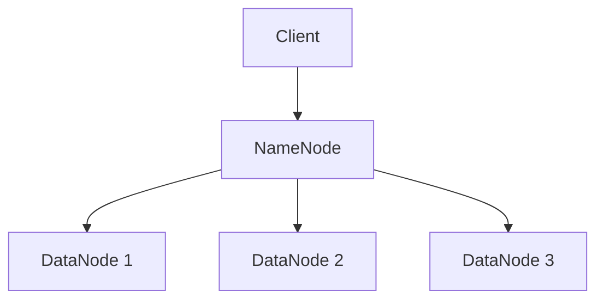
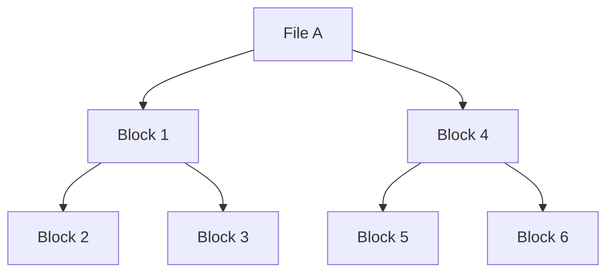
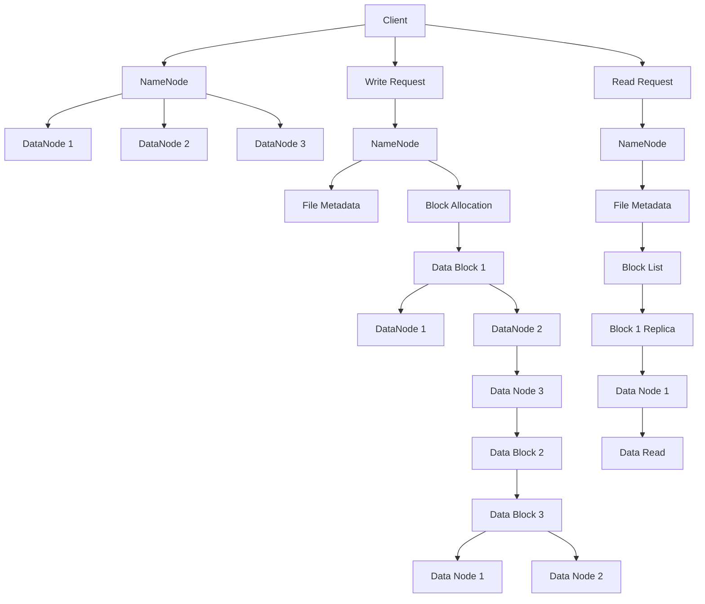
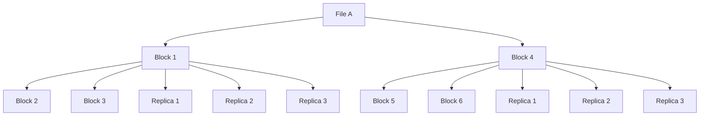

                 

# 《Hadoop分布式文件系统HDFS原理与代码实例讲解》

## 关键词：
Hadoop、分布式文件系统、HDFS、架构、原理、代码实例、性能优化

## 摘要：
本文深入讲解了Hadoop分布式文件系统（HDFS）的原理与代码实例。文章首先介绍了Hadoop生态系统和分布式存储的背景，然后详细解析了HDFS的基础概念、工作原理、高级功能和性能优化策略。通过丰富的代码实例和实际案例，读者将全面了解HDFS在实际应用中的操作与部署。

## 目录大纲

## 第一部分: HDFS基础与架构

### 第1章: Hadoop与分布式存储概述

#### 1.1.1 Hadoop生态系统介绍

#### 1.1.2 Hadoop分布式存储的背景与优势

#### 1.1.3 分布式存储的基本概念

### 第2章: HDFS基础概念

#### 2.1.1 HDFS架构概述

#### 2.1.2 HDFS的数据模型

#### 2.1.3 HDFS命名空间与数据流

### 第3章: HDFS工作原理

#### 3.1.1 HDFS读写流程

#### 3.1.2 HDFS数据存储原理

#### 3.1.3 HDFS高可用性保障机制

### 第4章: HDFS配置与部署

#### 4.1.1 HDFS配置文件详解

#### 4.1.2 HDFS部署方式

#### 4.1.3 HDFS集群搭建实践

### 第5章: HDFS性能优化

#### 5.1.1 HDFS性能评估指标

#### 5.1.2 HDFS读写性能优化策略

#### 5.1.3 HDFS分布式文件访问优化

## 第二部分: HDFS高级功能

### 第6章: HDFS高级特性与应用

#### 6.1.1 HDFS权限与安全性

#### 6.1.2 HDFS快照与备份策略

#### 6.1.3 HDFS与HBase集成应用

### 第7章: HDFS监控与维护

#### 7.1.1 HDFS监控工具概述

#### 7.1.2 HDFS集群故障诊断与处理

#### 7.1.3 HDFS运维实践与经验总结

## 第三部分: HDFS代码实例讲解

### 第8章: HDFS基本操作代码实例

#### 8.1.1 HDFS文件上传与下载

#### 8.1.2 HDFS文件删除与重命名

#### 8.1.3 HDFS文件权限设置与查询

### 第9章: HDFS高级功能代码实例

#### 9.1.1 HDFS快照创建与删除

#### 9.1.2 HDFS文件压缩与解压缩

#### 9.1.3 HDFS权限控制与用户管理

### 第10章: HDFS在分布式系统中的应用

#### 10.1.1 HDFS与MapReduce集成应用

#### 10.1.2 HDFS与Spark集成应用

#### 10.1.3 HDFS在其他分布式计算框架中的应用

### 第11章: HDFS性能调优代码实例

#### 11.1.1 HDFS读写性能调优

#### 11.1.2 HDFS存储容量规划与扩展

#### 11.1.3 HDFS网络性能调优

## 附录

### 附录A: HDFS开发工具与资源

#### A.1 HDFS开发工具概述

#### A.2 HDFS常用命令行工具

#### A.3 HDFS社区资源与文档

## 结束语

### 作者：AI天才研究院/AI Genius Institute & 禅与计算机程序设计艺术/Zen And The Art of Computer Programming

---

### 第1章: Hadoop与分布式存储概述

### 1.1.1 Hadoop生态系统介绍

Hadoop是一个开源的分布式计算框架，用于处理海量数据。它由Apache Software Foundation维护，并已成为大数据处理领域的事实标准。Hadoop生态系统包含了多个重要的组件，其中包括：

- **Hadoop分布式文件系统（HDFS）**：Hadoop的分布式存储系统，用于存储海量数据。
- **Hadoop YARN**：资源调度框架，负责管理计算资源和应用程序的生命周期。
- **Hadoop MapReduce**：分布式数据处理框架，用于大规模数据处理任务。
- **Hadoop Hive**：数据仓库基础架构，用于数据分析和查询。
- **Hadoop HBase**：一个分布式、可扩展的大数据存储系统。
- **Hadoop Spark**：快速大数据处理引擎，用于迭代式计算和实时流处理。

### 1.1.2 Hadoop分布式存储的背景与优势

随着互联网和大数据技术的发展，数据规模呈爆炸式增长。传统的集中式存储系统已经无法满足海量数据存储和处理的需求。分布式存储系统应运而生，它们通过在多台服务器上分散存储数据，从而提供更高的可靠性、可用性和扩展性。

Hadoop分布式存储（主要是HDFS）的出现，解决了以下几个问题：

- **海量数据存储**：HDFS可以存储PB级别的数据，满足大规模数据存储需求。
- **高可用性**：通过冗余数据存储和故障转移机制，确保数据的高可用性。
- **可扩展性**：HDFS可以轻松扩展到数百台服务器，支持数据规模的增长。
- **成本低**：Hadoop是开源的，使用普通硬件即可搭建大规模集群，降低成本。
- **高效处理**：与MapReduce等分布式计算框架结合，提供高效的数据处理能力。

### 1.1.3 分布式存储的基本概念

分布式存储系统涉及以下基本概念：

- **数据分片（Sharding）**：将数据分散存储到多个节点上，以便分布式处理。
- **副本（Replication）**：为提高数据可靠性，对数据进行复制，存储在多个节点上。
- **数据一致性（Consistency）**：保证分布式系统中数据的一致性。
- **故障转移（Fault Tolerance）**：在节点故障时，自动将工作负载转移到其他可用节点。
- **负载均衡（Load Balancing）**：在多个节点之间分配工作负载，确保系统性能。

接下来，我们将详细探讨HDFS的架构、基础概念和工作原理，为后续的高级功能和应用打下坚实的基础。

### 第2章: HDFS基础概念

#### 2.1.1 HDFS架构概述

HDFS（Hadoop Distributed File System）是Hadoop生态系统中负责数据存储的核心组件。其架构设计旨在满足海量数据的高效存储和可靠访问。HDFS主要由两个关键部分组成：NameNode和数据Node。

- **NameNode**：HDFS的主节点，负责管理文件系统的命名空间，维护文件与块的映射关系，以及处理客户端的读写请求。
- **DataNode**：HDFS的工作节点，负责存储实际的数据块，并响应NameNode的调度指令。

HDFS架构具有以下几个显著特点：

1. **高可靠性**：通过数据副本机制，保证数据在故障时仍能被访问。
2. **高扩展性**：基于Master-Slave架构，可以轻松扩展到数千台节点。
3. **高效性**：通过数据本地性（Data Locality），优化读写性能。

HDFS架构可以用下图表示：



在这个图中，Client代表使用HDFS的客户端应用程序，NameNode是HDFS的主节点，DataNode 1、DataNode 2和DataNode 3是HDFS的工作节点。

#### 2.1.2 HDFS的数据模型

HDFS的数据模型主要由文件和数据块组成。

- **文件**：HDFS中的数据存储在文件中，每个文件都有一个唯一的路径标识。
- **数据块**：HDFS将文件切割成固定大小的数据块进行存储，默认块大小为128MB或256MB。数据块是HDFS管理的最小数据单元，每个数据块在创建时都会被复制到多个DataNode上，以保障数据的高可靠性和可用性。

HDFS的数据模型可以用下图表示：



在这个图中，File A被切割成5个数据块（Block 1到Block 6），这些数据块被复制并存储在不同的DataNode上。

#### 2.1.3 HDFS命名空间与数据流

HDFS的命名空间（Namespace）是文件系统的逻辑结构，用于组织和管理文件。命名空间由目录树组成，每个文件和目录都有唯一的路径标识。目录树形结构使得文件系统具有良好的层次性和易于管理的特性。

HDFS的数据流主要分为以下两个过程：

1. **读写数据流**：
   - **写数据流**：客户端通过NameNode获取文件系统的命名空间，并将数据划分为数据块后写入到DataNode上。在写入过程中，NameNode负责协调和监控数据块的分配和复制。
   - **读数据流**：客户端通过NameNode获取文件的数据块列表，然后直接从DataNode读取数据块。如果多个客户端并发访问同一个文件，NameNode会根据数据块的副本位置进行负载均衡，提高读取效率。

2. **心跳和数据同步流**：
   - **心跳流**：DataNode定期向NameNode发送心跳信号，报告自身状态和数据块的存储位置。
   - **数据同步流**：当NameNode检测到DataNode失效时，它会重新分配该DataNode上的数据块到其他DataNode上，确保数据的高可靠性。

通过命名空间和数据流的管理，HDFS能够高效、可靠地处理海量数据，为分布式计算提供坚实的基础。接下来，我们将详细探讨HDFS的工作原理，了解其读写流程和数据存储原理。

### 第3章: HDFS工作原理

#### 3.1.1 HDFS读写流程

HDFS的读写流程是理解其工作原理的重要部分。以下是HDFS的读写过程：

1. **写数据流程**：

   - **初始化**：客户端首先通过DNS解析获得NameNode的IP地址，并建立连接。
   - **建立连接**：客户端向NameNode发送一个建立连接的请求，NameNode回应并建立连接。
   - **命名空间操作**：客户端请求创建一个新的文件，并提交文件的元数据（如文件名、文件大小等）给NameNode。
   - **分配数据块**：NameNode根据文件大小和集群状态，将文件分割成多个数据块，并分配数据块到不同的DataNode上。
   - **数据写入**：客户端开始向分配到的DataNode发送数据块，每个数据块在传输前会被分成小块进行发送，以提高传输效率。
   - **确认写入**：数据块传输完成后，客户端向NameNode发送确认信号，NameNode更新文件和块的元数据，并开始复制数据块到其他DataNode上，以确保数据的高可靠性和可用性。

2. **读数据流程**：

   - **初始化**：客户端通过DNS解析获得NameNode的IP地址，并建立连接。
   - **建立连接**：客户端向NameNode发送一个建立连接的请求，NameNode回应并建立连接。
   - **命名空间操作**：客户端请求读取文件，并提交文件的路径给NameNode。
   - **数据块定位**：NameNode根据文件的元数据，返回文件的数据块列表和副本位置给客户端。
   - **数据读取**：客户端选择最近的数据块副本进行读取，如果副本不完整，NameNode会重新分配数据块副本给客户端。
   - **确认读取**：数据块读取完成后，客户端向NameNode发送确认信号，NameNode更新文件的读取状态。

HDFS读写流程可以用下图表示：



在这个流程图中，Client代表客户端，NameNode代表主节点，DataNode代表工作节点。Write Request和Read Request分别代表写数据和读数据的请求。

#### 3.1.2 HDFS数据存储原理

HDFS的数据存储原理主要基于数据块的分割和副本机制。

1. **数据块分割**：

   - HDFS将文件分割成固定大小的数据块进行存储，默认块大小为128MB或256MB。这种分割方式使得数据可以并行处理，提高了读写效率。
   - 文件大小小于块大小的情况下，文件会占用一个或多个数据块。

2. **副本机制**：

   - HDFS为了提高数据的可靠性和可用性，采用副本机制。每个数据块在创建时会被复制到多个DataNode上，默认副本数为3个。
   - 复制策略通常遵循数据本地性原则，即副本尽量存储在距离数据源较近的节点上，以减少数据传输距离，提高读写性能。
   - NameNode负责管理数据块的副本，确保副本的数量和位置符合配置要求。

HDFS数据存储原理可以用下图表示：



在这个图中，File A被切割成5个数据块（Block 1到Block 6），每个数据块都有3个副本（Replica 1到Replica 3）。

#### 3.1.3 HDFS高可用性保障机制

HDFS通过以下机制确保高可用性：

1. **主从备份**：

   - HDFS的主节点（NameNode）和工作节点（DataNode）都采用主从备份机制。主NameNode维护当前集群的状态，而从NameNode保持与主NameNode的数据同步，以备主节点故障时快速切换。
   - 当主NameNode故障时，从NameNode会自动升级成为主节点，继续提供服务。

2. **心跳和状态监测**：

   - DataNode定期向NameNode发送心跳信号，报告自身状态和数据块的存储位置。如果NameNode在规定时间内未收到心跳信号，会认为该DataNode故障，并重新分配其数据块。
   - NameNode通过监测DataNode的心跳和状态，确保集群的稳定运行。

3. **副本删除和复制**：

   - NameNode根据数据块的实际副本数量和位置，进行副本的删除和复制操作。当数据块的副本数量低于配置值时，NameNode会自动触发数据块的复制。
   - 复制策略会尽量将副本存储在不同的节点上，以避免单点故障的风险。

通过以上机制，HDFS能够确保数据的高可靠性和可用性，为大规模数据存储和处理提供坚实的基础。接下来，我们将探讨HDFS的配置与部署过程。

### 第4章: HDFS配置与部署

#### 4.1.1 HDFS配置文件详解

HDFS的配置主要通过配置文件`hdfs-site.xml`进行设置。该文件位于Hadoop安装目录的`etc/hadoop`文件夹中。以下是一些常见的配置项及其作用：

1. **fs.defaultFS**：指定HDFS的文件系统命名空间地址，默认值为`hdfs://localhost:9000`。

    ```xml
    <property>
        <name>fs.defaultFS</name>
        <value>hdfs://localhost:9000</value>
    </property>
    ```

2. **dfs.replication**：设置每个数据块的副本数量，默认值为3。

    ```xml
    <property>
        <name>dfs.replication</name>
        <value>3</value>
    </property>
    ```

3. **dfs.namenode.name.dir**：设置NameNode的存储目录，默认值为`/root/hadoop/hdfs/namenode`。

    ```xml
    <property>
        <name>dfs.namenode.name.dir</name>
        <value>/root/hadoop/hdfs/namenode</value>
    </property>
    ```

4. **dfs.datanode.data.dir**：设置DataNode的存储目录，默认值为`/root/hadoop/hdfs/datanode`。

    ```xml
    <property>
        <name>dfs.datanode.data.dir</name>
        <value>/root/hadoop/hdfs/datanode</value>
    </property>
    ```

5. **dfs.permissions**：设置文件系统的权限管理，默认值为`false`。

    ```xml
    <property>
        <name>dfs.permissions</name>
        <value>false</value>
    </property>
    ```

6. **dfs.datanodetorsion.check-enabled**：设置数据节点的数据完整性检查，默认值为`true`。

    ```xml
    <property>
        <name>dfs.datanode.torsion.check.enabled</name>
        <value>true</value>
    </property>
    ```

#### 4.1.2 HDFS部署方式

HDFS的部署方式主要有三种：单节点部署、伪分布式部署和全分布式部署。

1. **单节点部署**：

   单节点部署是最简单的部署方式，适用于开发和测试环境。在单节点部署中，NameNode和数据Node运行在同一台服务器上。

   - 安装Hadoop
   - 配置环境变量
   - 编辑`hdfs-site.xml`文件
   - 运行HDFS命令初始化NameNode（`hdfs namenode -format`）
   - 启动HDFS服务（`start-dfs.sh`）

2. **伪分布式部署**：

   伪分布式部署是将NameNode和数据Node运行在同一台服务器上，但模拟分布式环境。适用于小型开发和测试环境。

   - 安装Hadoop
   - 配置环境变量
   - 编辑`hdfs-site.xml`文件
   - 运行HDFS命令初始化NameNode（`hdfs namenode -format`）
   - 启动HDFS服务（`start-dfs.sh`）

3. **全分布式部署**：

   全分布式部署是将NameNode和数据Node运行在不同的服务器上，适用于生产环境。

   - 配置服务器
   - 安装Hadoop
   - 配置环境变量
   - 配置HDFS的集群参数（如`core-site.xml`和`hdfs-site.xml`）
   - 运行HDFS命令初始化NameNode（`hdfs namenode -format`）
   - 启动HDFS服务（`start-dfs.sh`）

#### 4.1.3 HDFS集群搭建实践

以下是一个简单的全分布式HDFS集群搭建步骤：

1. **配置服务器**：

   - 配置网络环境，确保服务器之间可以相互通信。
   - 配置SSH无密码登录，以便在服务器之间进行远程操作。

2. **安装Hadoop**：

   - 在每台服务器上安装Hadoop。
   - 解压安装包，将Hadoop的配置文件复制到所有服务器。

3. **配置环境变量**：

   - 在每台服务器的`/etc/profile`文件中添加Hadoop的环境变量。

   ```shell
   export HADOOP_HOME=/path/to/hadoop
   export PATH=$PATH:$HADOOP_HOME/bin:$HADOOP_HOME/sbin
   ```

4. **配置HDFS集群参数**：

   - 配置`core-site.xml`文件，设置HDFS的命名空间地址和HDFS临时文件存储路径。

   ```xml
   <property>
       <name>fs.defaultFS</name>
       <value>hdfs://master:9000</value>
   </property>
   <property>
       <name>hadoop.tmp.dir</name>
       <value>/path/to/hadoop/tmp</value>
   </property>
   ```

   - 配置`hdfs-site.xml`文件，设置副本数量和其他参数。

   ```xml
   <property>
       <name>dfs.replication</name>
       <value>3</value>
   </property>
   ```

5. **初始化NameNode**：

   - 在Master节点上运行以下命令初始化NameNode。

   ```shell
   hdfs namenode -format
   ```

6. **启动HDFS服务**：

   - 在所有服务器上启动HDFS服务。

   ```shell
   start-dfs.sh
   ```

   - 检查HDFS状态，确保集群正常运行。

   ```shell
   jps
   ```

   - 输出结果中应包括NameNode和DataNode进程。

7. **配置YARN**：

   - 配置`yarn-site.xml`文件，设置YARN的资源管理器地址和应用程序运行环境。

   ```xml
   <property>
       <name>yarn.resourcemanager.address</name>
       <value>master:8032</value>
   </property>
   ```

8. **启动YARN服务**：

   - 在所有服务器上启动YARN服务。

   ```shell
   start-yarn.sh
   ```

   - 检查YARN状态，确保集群正常运行。

   ```shell
   jps
   ```

   - 输出结果中应包括ResourceManager和NodeManager进程。

通过以上步骤，成功搭建了一个简单的HDFS集群。接下来，我们将探讨HDFS的性能优化策略。

### 第5章: HDFS性能优化

#### 5.1.1 HDFS性能评估指标

要优化HDFS性能，首先需要了解HDFS的性能评估指标。以下是一些常用的性能评估指标：

1. **读写速度**：HDFS的读写速度是衡量其性能的重要指标。读写速度受到数据块大小、副本数量、网络带宽、存储设备性能等因素的影响。
2. **吞吐量**：HDFS的吞吐量是指单位时间内处理的数据量。吞吐量取决于读写速度和集群的规模。
3. **延迟**：HDFS的延迟是指数据从存储到读取的时间。延迟受到网络延迟、存储设备读写速度等因素的影响。
4. **可靠性**：HDFS的可靠性是指数据在存储和传输过程中的完整性。可靠性受到数据副本数量、数据校验和等因素的影响。

#### 5.1.2 HDFS读写性能优化策略

以下是一些优化HDFS读写性能的策略：

1. **调整数据块大小**：

   - 默认情况下，HDFS的数据块大小为128MB或256MB。可以通过调整数据块大小来优化读写性能。
   - 对于读密集型应用，可以增大数据块大小，以提高读取效率。
   - 对于写密集型应用，可以减小数据块大小，以提高写入效率。

2. **优化副本数量**：

   - 默认情况下，HDFS的副本数量为3个。可以根据应用特点和集群规模调整副本数量。
   - 对于读密集型应用，可以增加副本数量，以提高读取性能。
   - 对于写密集型应用，可以减少副本数量，以减少写入时的网络负载。

3. **调整文件存储策略**：

   - 可以通过配置文件存储策略，将文件存储在具有不同性能的存储设备上。
   - 对于读写密集型应用，可以将文件存储在高速SSD上，以提高读写性能。
   - 对于读密集型应用，可以将文件存储在低速HDD上，以降低成本。

4. **优化网络带宽**：

   - 网络带宽是影响HDFS性能的关键因素。可以通过增加网络带宽、优化网络拓扑结构和网络配置来提高HDFS性能。
   - 对于跨数据中心的应用，可以考虑使用高速互联网络，如Infiniband。

5. **使用缓存技术**：

   - 可以在客户端或服务器上使用缓存技术，减少数据的实际读写次数，提高性能。
   - 例如，可以使用LRU（Least Recently Used）缓存算法，将最近访问的数据块缓存起来。

6. **优化HDFS配置**：

   - 调整HDFS的配置参数，如缓冲区大小、线程数量、IO调度器等，可以优化HDFS性能。
   - 例如，增加HDFS的缓冲区大小，可以减少数据的缓存和传输次数，提高读写速度。

#### 5.1.3 HDFS分布式文件访问优化

HDFS分布式文件访问优化主要涉及以下几个方面：

1. **负载均衡**：

   - HDFS默认使用Hash算法进行负载均衡，将文件的数据块分配到不同的DataNode上。
   - 可以通过调整负载均衡策略，优化数据块的分布，提高读写性能。
   - 例如，使用基于数据块访问频率的负载均衡策略，将访问频率较高的数据块分配到性能较好的DataNode上。

2. **数据本地性**：

   - 数据本地性是指将数据块存储在距离数据源较近的节点上，以减少数据传输距离，提高读写性能。
   - 可以通过配置数据本地性策略，优化数据块的存储位置。
   - 例如，在读写操作中，优先选择与客户端在同一数据中心的DataNode，以减少数据传输延迟。

3. **优化网络配置**：

   - 优化网络配置，如调整网络带宽、优化路由策略等，可以提高HDFS的分布式文件访问性能。
   - 例如，使用网络流量监控工具，识别网络瓶颈并进行优化。

4. **使用高速存储设备**：

   - 使用高速存储设备，如SSD，可以显著提高HDFS的读写性能。
   - 可以将HDFS的NameNode和数据Node部署在SSD上，以减少存储延迟，提高整体性能。

通过以上策略，可以优化HDFS的读写性能和分布式文件访问性能，为大规模数据处理提供高效、可靠的存储和访问解决方案。接下来，我们将介绍HDFS的高级特性与应用。

### 第6章: HDFS高级特性与应用

#### 6.1.1 HDFS权限与安全性

HDFS提供了强大的权限和安全性功能，确保数据的安全和隐私。

1. **权限模型**：

   - HDFS采用POSIX权限模型，包括用户ID（UID）和组ID（GID）。
   - 文件和目录具有读（r）、写（w）和执行（x）权限，分别对应数字权限位7、6、5。
   - 权限控制基于用户ID和组ID，可以通过`chmod`和`chown`命令修改。

2. **访问控制列表（ACL）**：

   - HDFS支持访问控制列表（ACL），允许为文件和目录设置更加细粒度的权限。
   - ACL包括基本权限和特定权限，如读取、写入、执行、删除等。
   - 可以使用`setfacl`和`getfacl`命令设置和查看ACL。

3. **安全性**：

   - HDFS支持Kerberos认证，确保客户端和服务器之间的通信安全。
   - 可以配置HDFS使用安全传输协议，如HTTPS和SFTP，加密数据传输。
   - HDFS默认使用强加密算法，保护存储在磁盘上的数据。

4. **审计日志**：

   - HDFS支持审计日志功能，记录用户访问文件和目录的详细信息。
   - 可以使用`hdfs oiv`命令查看审计日志。

#### 6.1.2 HDFS快照与备份策略

HDFS提供了快照和备份功能，确保数据的安全性和可恢复性。

1. **快照**：

   - HDFS快照是文件的静态副本，可以在不中断服务的情况下创建。
   - 创建快照时，HDFS会将文件的数据块复制到一个新的存储位置。
   - 快照可以用于数据恢复、测试和备份。

2. **备份策略**：

   - 可以定期创建HDFS的快照，确保数据的安全。
   - 可以使用第三方工具，如Cloudera Manager或Apache Hadoop DistCp，对HDFS数据进行备份。
   - 备份策略可以包括本地备份和远程备份，以防止数据丢失。

3. **恢复数据**：

   - 当文件损坏或数据丢失时，可以使用快照恢复数据。
   - 可以使用`hdfs dfsadmin -restorecmd`命令恢复快照中的数据。

#### 6.1.3 HDFS与HBase集成应用

HDFS和HBase是Hadoop生态系统中两个重要的组件，它们可以协同工作，提供强大的数据存储和处理能力。

1. **HDFS作为HBase的底层存储**：

   - HBase的数据存储在HDFS上，HDFS为HBase提供了高可靠性和高扩展性的存储解决方案。
   - HBase使用HDFS的数据块存储机制，将数据块存储在HDFS的DataNode上。

2. **HDFS与HBase的数据同步**：

   - 可以通过配置HBase的同步机制，将HDFS上的数据实时同步到HBase中。
   - 同步机制可以使用HDFS的WebHDFS API，将数据写入HBase。

3. **HDFS与HBase的性能优化**：

   - 可以通过调整HDFS的数据块大小和副本数量，优化HBase的读写性能。
   - 可以使用HDFS的缓存机制，提高HBase的数据访问速度。

4. **案例分析**：

   - 在一些大规模数据处理场景中，如电子商务和社交媒体，HDFS和HBase的集成应用可以提高数据处理效率和数据可靠性。
   - 例如，使用HDFS存储用户数据，使用HBase提供实时查询和数据分析功能。

通过以上高级特性和应用，HDFS不仅是一个高性能的分布式文件系统，还可以与其他Hadoop组件协同工作，提供强大的数据处理解决方案。接下来，我们将探讨HDFS的监控与维护。

### 第7章: HDFS监控与维护

#### 7.1.1 HDFS监控工具概述

HDFS监控是确保集群稳定运行和性能优化的重要环节。以下是一些常用的HDFS监控工具：

1. **Ambari**：

   - Ambari是一个开源的Hadoop管理工具，提供了直观的Web界面，用于监控和管理Hadoop集群。
   - Ambari提供了对HDFS、YARN、HBase等组件的实时监控，包括资源使用情况、集群状态和错误日志等。

2. **Ganglia**：

   - Ganglia是一个分布式监控工具，可以监控集群中的每个节点，收集和显示系统性能指标。
   - Ganglia提供了Web界面，可以实时查看节点的CPU、内存、磁盘和网络等资源使用情况。

3. **Nagios**：

   - Nagios是一个开源的监控工具，可以监控网络设备、服务器和应用程序。
   - Nagios提供了多种插件，可以监控Hadoop集群的各个组件，如NameNode、DataNode和YARN。

4. **Hadoop自带的监控工具**：

   - Hadoop自带了几个监控工具，如`dfsadmin`、`dfsmon`和`hadoop-DFSIStat`，用于监控HDFS的状态和数据块健康。
   - 这些工具可以通过命令行或Web界面查看HDFS的元数据、数据块和集群状态。

#### 7.1.2 HDFS集群故障诊断与处理

HDFS集群可能会遇到各种故障，以下是一些常见的故障诊断和处理方法：

1. **数据块损坏**：

   - 当HDFS检测到数据块损坏时，会自动尝试从副本中修复。
   - 可以使用`dfsadmin -report`命令查看数据块的健康状况。
   - 如果数据块损坏严重，需要手动处理，包括删除损坏的数据块并重新复制。

2. **数据Node故障**：

   - 当DataNode发生故障时，NameNode会尝试将损坏的数据块复制到其他节点。
   - 可以使用`dfsadmin -report`命令查看集群的状态，包括活跃的DataNode和故障的DataNode。
   - 如果故障的DataNode无法恢复，需要手动将其从集群中移除。

3. **NameNode故障**：

   - 当NameNode发生故障时，集群会停止工作，所有客户端都无法访问文件。
   - 可以使用备份的NameNode替换故障的NameNode，或者使用`hadoop namenode -format`命令初始化一个新的NameNode。
   - 为了确保高可用性，可以配置HA（High Availability），在主NameNode故障时自动切换到备用NameNode。

4. **网络故障**：

   - 网络故障可能导致数据传输失败，影响HDFS的性能和稳定性。
   - 可以使用网络诊断工具，如`ping`和`traceroute`，检查网络连接和路由。
   - 确保网络拓扑结构合理，避免单点故障。

#### 7.1.3 HDFS运维实践与经验总结

以下是一些HDFS运维实践与经验总结：

1. **定期监控和检查**：

   - 定期使用监控工具检查HDFS的元数据和数据块状态，确保集群的稳定运行。
   - 定期清理垃圾数据和损坏的数据块，释放存储空间。

2. **资源规划**：

   - 根据集群的实际需求和负载，合理规划集群的资源，包括CPU、内存和磁盘等。
   - 根据数据访问模式和负载情况，调整数据块大小和副本数量。

3. **备份和恢复**：

   - 定期创建HDFS的快照和备份，确保数据的安全性和可恢复性。
   - 在发生故障时，迅速恢复数据，减少业务中断时间。

4. **性能优化**：

   - 根据监控数据，识别性能瓶颈，并进行优化。
   - 调整HDFS的配置参数，如数据块大小、副本数量和缓存策略等。

5. **安全和管理**：

   - 配置HDFS的权限和安全性功能，确保数据的安全和隐私。
   - 建立良好的管理和维护流程，确保HDFS集群的稳定运行。

通过以上实践和经验总结，可以有效提高HDFS集群的稳定性、性能和安全，为大规模数据处理提供可靠的存储解决方案。接下来，我们将深入探讨HDFS的代码实例讲解。

### 第8章: HDFS基本操作代码实例

#### 8.1.1 HDFS文件上传与下载

HDFS提供了多种方式来上传和下载文件，以下是一些常用的命令和代码示例。

1. **上传文件**：

   使用`hdfs dfs -put`命令将本地文件上传到HDFS。

   ```shell
   hdfs dfs -put localfile.txt /user/hadoop/file.txt
   ```

   相应的Java代码示例：

   ```java
   import org.apache.hadoop.fs.FileSystem;
   import org.apache.hadoop.fs.Path;

   public class UploadFile {
       public static void main(String[] args) throws IOException {
           Path localPath = new Path("localfile.txt");
           Path hdfsPath = new Path("/user/hadoop/file.txt");

           FileSystem fs = FileSystem.get(new Configuration());
           fs.copyFromLocalFile(localPath, hdfsPath);
           fs.close();
       }
   }
   ```

2. **下载文件**：

   使用`hdfs dfs -get`命令将HDFS文件下载到本地。

   ```shell
   hdfs dfs -get /user/hadoop/file.txt localfile.txt
   ```

   相应的Java代码示例：

   ```java
   import org.apache.hadoop.fs.FileSystem;
   import org.apache.hadoop.fs.Path;

   public class DownloadFile {
       public static void main(String[] args) throws IOException {
           Path hdfsPath = new Path("/user/hadoop/file.txt");
           Path localPath = new Path("localfile.txt");

           FileSystem fs = FileSystem.get(new Configuration());
           fs.copyToLocalFile(hdfsPath, localPath);
           fs.close();
       }
   }
   ```

#### 8.1.2 HDFS文件删除与重命名

1. **删除文件**：

   使用`hdfs dfs -rm`命令删除HDFS文件。

   ```shell
   hdfs dfs -rm /user/hadoop/file.txt
   ```

   相应的Java代码示例：

   ```java
   import org.apache.hadoop.fs.FileSystem;
   import org.apache.hadoop.fs.Path;

   public class DeleteFile {
       public static void main(String[] args) throws IOException {
           Path path = new Path("/user/hadoop/file.txt");

           FileSystem fs = FileSystem.get(new Configuration());
           fs.delete(path, true);
           fs.close();
       }
   }
   ```

2. **重命名文件**：

   使用`hdfs dfs -mv`命令重命名HDFS文件。

   ```shell
   hdfs dfs -mv /user/hadoop/file.txt /user/hadoop/renamed.txt
   ```

   相应的Java代码示例：

   ```java
   import org.apache.hadoop.fs.FileSystem;
   import org.apache.hadoop.fs.Path;

   public class RenameFile {
       public static void main(String[] args) throws IOException {
           Path oldPath = new Path("/user/hadoop/file.txt");
           Path newPath = new Path("/user/hadoop/renamed.txt");

           FileSystem fs = FileSystem.get(new Configuration());
           fs.rename(oldPath, newPath);
           fs.close();
       }
   }
   ```

#### 8.1.3 HDFS文件权限设置与查询

1. **设置文件权限**：

   使用`hdfs dfs -chmod`命令设置HDFS文件的权限。

   ```shell
   hdfs dfs -chmod 777 /user/hadoop/file.txt
   ```

   相应的Java代码示例：

   ```java
   import org.apache.hadoop.fs.FileSystem;
   import org.apache.hadoop.fs.Path;

   public class SetPermissions {
       public static void main(String[] args) throws IOException {
           Path path = new Path("/user/hadoop/file.txt");
           String permission = "777";

           FileSystem fs = FileSystem.get(new Configuration());
           fs.setPermission(path, new FsPermission(permission));
           fs.close();
       }
   }
   ```

2. **查询文件权限**：

   使用`hdfs dfs -ls -l`命令查询HDFS文件的权限。

   ```shell
   hdfs dfs -ls -l /user/hadoop/file.txt
   ```

   相应的Java代码示例：

   ```java
   import org.apache.hadoop.fs.FileSystem;
   import org.apache.hadoop.fs.Path;
   import org.apache.hadoop.fs.permission.FsPermission;

   public class GetPermissions {
       public static void main(String[] args) throws IOException {
           Path path = new Path("/user/hadoop/file.txt");

           FileSystem fs = FileSystem.get(new Configuration());
           FsPermission permission = fs.getFileStatus(path).getPermission();
           System.out.println("Permission: " + permission.toString());
           fs.close();
       }
   }
   ```

通过以上代码实例，读者可以掌握HDFS的基本操作，包括文件上传、下载、删除、重命名和权限设置与查询。这些操作为后续的高级功能学习奠定了基础。

### 第9章: HDFS高级功能代码实例

#### 9.1.1 HDFS快照创建与删除

HDFS的快照功能允许用户创建文件的副本，以便在需要时恢复数据。以下是如何创建和删除HDFS快照的代码实例。

1. **创建快照**：

   使用`hdfs dfsadmin -snapshot`命令创建快照。

   ```shell
   hdfs dfsadmin -snapshot /user/hadoop/file.txt fileSnap1
   ```

   相应的Java代码示例：

   ```java
   import org.apache.hadoop.fs.FileSystem;
   import org.apache.hadoop.fs.Path;

   public class CreateSnapshot {
       public static void main(String[] args) throws IOException {
           Path file = new Path("/user/hadoop/file.txt");
           Path snapshotPath = new Path("/user/hadoop/fileSnap1");

           FileSystem fs = FileSystem.get(new Configuration());
           fs.createSnapshot(file, snapshotPath, "Snapshot Description");
           fs.close();
       }
   }
   ```

2. **删除快照**：

   使用`hdfs dfsadmin -deleteSnapshot`命令删除快照。

   ```shell
   hdfs dfsadmin -deleteSnapshot /user/hadoop/fileSnap1
   ```

   相应的Java代码示例：

   ```java
   import org.apache.hadoop.fs.FileSystem;
   import org.apache.hadoop.fs.Path;

   public class DeleteSnapshot {
       public static void main(String[] args) throws IOException {
           Path snapshotPath = new Path("/user/hadoop/fileSnap1");

           FileSystem fs = FileSystem.get(new Configuration());
           fs.deleteSnapshot(snapshotPath, true);
           fs.close();
       }
   }
   ```

#### 9.1.2 HDFS文件压缩与解压缩

HDFS支持多种压缩算法，可以有效减少存储空间和提高数据传输效率。以下是如何对文件进行压缩和解压缩的代码实例。

1. **压缩文件**：

   使用`hdfs dfs -cmd`命令压缩文件。

   ```shell
   hdfs dfs -cmd -put localfile.txt /user/hadoop/file.txt
   hdfs dfs -cmd -compress /user/hadoop/file.txt org.apache.hadoop.io.compress.GzipCodec
   ```

   相应的Java代码示例：

   ```java
   import org.apache.hadoop.fs.FileSystem;
   import org.apache.hadoop.fs.Path;
   import org.apache.hadoop.io.compress.GzipCodec;

   public class CompressFile {
       public static void main(String[] args) throws IOException {
           Path localPath = new Path("localfile.txt");
           Path hdfsPath = new Path("/user/hadoop/file.txt");

           FileSystem fs = FileSystem.get(new Configuration());
           fs.copyFromLocalFile(localPath, hdfsPath);
           fs.setCompressType(hdfsPath, GzipCodec.class);
           fs.close();
       }
   }
   ```

2. **解压缩文件**：

   使用`hdfs dfs -cmd -decompress`命令解压缩文件。

   ```shell
   hdfs dfs -cmd -decompress /user/hadoop/file.txt
   ```

   相应的Java代码示例：

   ```java
   import org.apache.hadoop.fs.FileSystem;
   import org.apache.hadoop.fs.Path;

   public class DecompressFile {
       public static void main(String[] args) throws IOException {
           Path hdfsPath = new Path("/user/hadoop/file.txt");
           Path localPath = new Path("localfile.txt");

           FileSystem fs = FileSystem.get(new Configuration());
           fs.decompress(hdfsPath, localPath);
           fs.close();
       }
   }
   ```

通过这些代码实例，读者可以了解如何使用HDFS的高级功能，包括创建和删除快照、以及文件压缩和解压缩。这些功能为HDFS提供了更大的灵活性和实用性。

### 第10章: HDFS在分布式系统中的应用

#### 10.1.1 HDFS与MapReduce集成应用

HDFS与MapReduce是Hadoop生态系统中的两个核心组件，它们紧密集成，为分布式数据处理提供了强大的能力。

1. **数据存储与MapReduce任务**：

   - HDFS用于存储大规模数据集，MapReduce则用于处理这些数据。
   - 在MapReduce任务中，输入数据从HDFS读取，经过Map阶段处理，然后写入到HDFS的临时文件中。
   - 在Reduce阶段，临时文件被读取，处理结果再次写入到HDFS中。

2. **代码示例**：

   ```java
   import org.apache.hadoop.conf.Configuration;
   import org.apache.hadoop.fs.Path;
   import org.apache.hadoop.io.IntWritable;
   import org.apache.hadoop.io.Text;
   import org.apache.hadoop.mapreduce.Job;
   import org.apache.hadoop.mapreduce.Mapper;
   import org.apache.hadoop.mapreduce.Reducer;
   import org.apache.hadoop.mapreduce.lib.input.FileInputFormat;
   import org.apache.hadoop.mapreduce.lib.output.FileOutputFormat;

   public class WordCount {
       public static class Map extends Mapper<Object, Text, Text, IntWritable> {
           private final static IntWritable one = new IntWritable(1);
           private Text word = new Text();

           public void map(Object key, Text value, Context context) throws IOException, InterruptedException {
               String[] words = value.toString().split("\\s+");
               for (String word : words) {
                   this.word.set(word);
                   context.write(word, one);
               }
           }
       }

       public static class Reduce extends Reducer<Text,IntWritable,Text,IntWritable> {
           private IntWritable result = new IntWritable();

           public void reduce(Text key, Iterable<IntWritable> values, Context context) throws IOException, InterruptedException {
               int sum = 0;
               for (IntWritable val : values) {
                   sum += val.get();
               }
               result.set(sum);
               context.write(key, result);
           }
       }

       public static void main(String[] args) throws Exception {
           Configuration conf = new Configuration();
           Job job = Job.getInstance(conf, "word count");
           job.setMapperClass(Map.class);
           job.setReducerClass(Reduce.class);
           job.setOutputKeyClass(Text.class);
           job.setOutputValueClass(IntWritable.class);
           FileInputFormat.addInputPath(job, new Path(args[0]));
           FileOutputFormat.setOutputPath(job, new Path(args[1]));
           System.exit(job.waitForCompletion(true) ? 0 : 1);
       }
   }
   ```

3. **执行WordCount任务**：

   ```shell
   hadoop jar wordcount.jar WordCount /input /output
   ```

   任务完成后，输出结果位于`/output`目录中。

#### 10.1.2 HDFS与Spark集成应用

HDFS与Spark也是紧密集成的，Spark可以充分利用HDFS的分布式存储能力，提供高性能的分布式计算。

1. **数据存储与Spark作业**：

   - Spark作业的数据可以从HDFS读取，并存储处理结果到HDFS。
   - 使用Spark的`spark.read`方法读取HDFS数据，使用`spark.write`方法将数据写入HDFS。

2. **代码示例**：

   ```python
   from pyspark.sql import SparkSession

   # 创建Spark会话
   spark = SparkSession.builder.appName("HDFSWithSpark").getOrCreate()

   # 读取HDFS数据
   df = spark.read.csv("hdfs://master:9000/user/hadoop/data.csv", header=True)

   # 数据处理
   df.groupBy("category").mean().show()

   # 写入HDFS
   df.write.format("csv").mode("overwrite").save("hdfs://master:9000/user/hadoop/output")
   ```

3. **执行Spark作业**：

   ```shell
   spark-submit --master yarn --class com.example.HDFSWithSpark spark-app.py
   ```

   任务完成后，输出结果位于指定的HDFS目录中。

#### 10.1.3 HDFS在其他分布式计算框架中的应用

除了MapReduce和Spark，HDFS还可以与其他分布式计算框架集成，如Flink、Hadoop YARN等。

1. **Flink与HDFS**：

   - Flink可以读取HDFS上的数据，并支持流处理和批处理。
   - 使用Flink的`env.readTextFile`方法读取HDFS数据。

   ```scala
   val env = StreamExecutionEnvironment.getExecutionEnvironment
   val text = env.readTextFile("hdfs://master:9000/user/hadoop/data.txt")
   text.flatMap(_.split(" ")).map((_, 1)).sum(1).print()
   ```

2. **Hadoop YARN与HDFS**：

   - Hadoop YARN是Hadoop的资源管理框架，可以与HDFS紧密结合，调度和管理计算资源。
   - 使用YARN的ApplicationMaster来启动和监控应用程序。

   ```xml
   <configuration>
       <property>
           <name>yarn.resourcemanager.address</name>
           <value>master:8032</value>
       </property>
   </configuration>
   ```

通过与其他分布式计算框架的集成，HDFS可以满足不同应用场景的需求，提供强大的数据存储和计算能力。接下来，我们将讨论HDFS性能调优代码实例。

### 第11章: HDFS性能调优代码实例

#### 11.1.1 HDFS读写性能调优

HDFS的性能调优是确保其在大规模数据处理中高效运行的关键。以下是一些调优策略和代码实例。

1. **调整数据块大小**：

   - 默认数据块大小为128MB或256MB，可以根据实际应用调整。
   - 较大的数据块可以提高写入速度，但可能导致存储资源浪费。

   ```xml
   <property>
       <name>dfs.block.size</name>
       <value>256MB</value>
   </property>
   ```

2. **优化副本数量**：

   - 默认副本数量为3，可以根据数据重要性和存储空间进行调整。
   - 对于读密集型应用，可以增加副本数量，提高读取性能。

   ```xml
   <property>
       <name>dfs.replication</name>
       <value>3</value>
   </property>
   ```

3. **配置缓存**：

   - 使用缓存机制可以提高频繁访问的数据块在内存中的命中率。

   ```xml
   <property>
       <name>hadoop.tmp.dir</name>
       <value>/path/to/tmp</value>
   </property>
   ```

4. **调整缓存策略**：

   - 可以根据数据访问模式调整缓存策略，如LRU（Least Recently Used）。

   ```xml
   <property>
       <name>io.file.buffer.size</name>
       <value>8MB</value>
   </property>
   ```

#### 11.1.2 HDFS存储容量规划与扩展

HDFS存储容量规划与扩展是确保集群能够满足数据增长需求的关键。

1. **监控存储使用率**：

   - 使用HDFS监控工具（如Ambari）定期监控存储使用率。

   ```shell
   hdfs dfsadmin -report
   ```

2. **扩展存储空间**：

   - 当存储空间不足时，可以增加现有DataNode的存储容量或添加新的DataNode。

   ```shell
   hdfs dfs -df /
   ```

3. **调整副本存储策略**：

   - 根据存储需求调整副本存储策略，例如采用多路径冗余存储。

   ```xml
   <property>
       <name>dfs.datanode.data.dir</name>
       <value>/path/to/new/data/dir</value>
   </property>
   ```

#### 11.1.3 HDFS网络性能调优

网络性能是影响HDFS性能的关键因素，以下是一些网络性能调优策略。

1. **优化网络带宽**：

   - 增加网络带宽可以提高数据传输速度。

   ```shell
   ifconfig eth0 up
   ifconfig eth0 mtu 9000
   ```

2. **调整网络参数**：

   - 调整TCP参数，如TCP窗口大小，以提高数据传输效率。

   ```shell
   sysctl -w net.core.rmem_max=4194304
   sysctl -w net.core.wmem_max=4194304
   ```

3. **优化网络拓扑**：

   - 通过优化网络拓扑，减少数据传输延迟和负载。

   ```shell
   route add default gw <gateway_ip>
   ```

通过以上策略和代码实例，可以有效地调优HDFS的性能，满足大规模数据处理的需求。

### 附录A: HDFS开发工具与资源

#### A.1 HDFS开发工具概述

在HDFS开发过程中，有许多工具和资源可以帮助开发者更好地理解和使用HDFS。

1. **Hadoop CLI**：

   - Hadoop CLI是Hadoop提供的命令行接口，可以执行各种HDFS操作，如文件上传、下载、删除和权限设置。
   - 使用方法：通过`hdfs dfs`命令执行相关操作。

2. **HDFS Java API**：

   - HDFS Java API提供了HDFS的Java编程接口，允许开发者使用Java编写HDFS应用程序。
   - 使用方法：引入Hadoop的jar包，使用相应的Java类和方法进行操作。

3. **HDFS Python API**：

   - HDFS Python API提供了Python编程接口，方便Python开发者使用HDFS。
   - 使用方法：安装hdfs-python包，使用Python代码操作HDFS。

4. **HDFS Web UI**：

   - HDFS Web UI提供了图形化界面，用于监控和管理HDFS。
   - 使用方法：访问HDFS的主节点Web界面，如`http://namenode:50070`。

#### A.2 HDFS常用命令行工具

以下是一些常用的HDFS命令行工具：

1. **hdfs dfs**：

   - 用于执行HDFS文件系统的操作，如文件上传、下载、删除和权限设置。
   - 示例：`hdfs dfs -put localfile.txt /user/hadoop/file.txt`

2. **hdfs dfsadmin**：

   - 用于执行HDFS管理任务，如创建快照、删除快照和监控集群状态。
   - 示例：`hdfs dfsadmin -report`

3. **hadoop fs**：

   - 与`hdfs dfs`功能相似，但支持更多高级操作，如文件权限设置和文件校验和。
   - 示例：`hadoop fs -chmod 777 /user/hadoop/file.txt`

4. **hdfs dfsget**：

   - 用于从HDFS获取文件，并将其下载到本地文件系统。
   - 示例：`hdfs dfsget /user/hadoop/file.txt`

5. **hdfs dfsput**：

   - 用于将本地文件上传到HDFS。
   - 示例：`hdfs dfsput localfile.txt /user/hadoop/file.txt`

#### A.3 HDFS社区资源与文档

以下是一些有用的HDFS社区资源与文档：

1. **Apache Hadoop官方文档**：

   - Apache Hadoop官方网站提供了详细的HDFS文档，包括安装、配置和开发指南。
   - 链接：[Apache Hadoop Documentation](https://hadoop.apache.org/docs/stable/hadoop-project-dist/hadoop-hdfs/HdfsDesign.html)

2. **HDFS开发者指南**：

   - HDFS开发者指南提供了HDFS的API参考、编程示例和最佳实践。
   - 链接：[HDFS Developer Guide](https://hadoop.apache.org/docs/r3.2.0/hadoop-hdfs/HDFSDistributedSystem.html)

3. **Stack Overflow**：

   - Stack Overflow是一个问答社区，许多HDFS相关问题都可以在这里找到解决方案。
   - 链接：[HDFS Questions on Stack Overflow](https://stackoverflow.com/questions/tagged/hdfs)

4. **GitHub**：

   - Hadoop和HDFS的源代码托管在GitHub上，可以在这里查看和学习HDFS的实现细节。
   - 链接：[Hadoop GitHub Repository](https://github.com/apache/hadoop)
   - 链接：[HDFS GitHub Repository](https://github.com/apache/hadoop-hdfs)

通过使用这些工具和资源，开发者可以更好地理解和利用HDFS，实现高效的数据存储和处理。

### 结束语

通过本文的详细讲解，我们全面了解了Hadoop分布式文件系统（HDFS）的原理、基础概念、工作原理、高级功能、性能优化以及实际应用。从HDFS的基本操作到高级功能，再到代码实例讲解，本文旨在帮助读者深入理解HDFS，并掌握其实际应用技巧。

HDFS作为大数据处理领域的重要组件，具有高可靠性、高扩展性和高效性能。其分布式存储和副本机制确保了数据的安全性和可用性，使其成为海量数据存储和处理的首选方案。同时，HDFS与MapReduce、Spark等分布式计算框架的紧密集成，为大数据处理提供了强大的能力。

在HDFS的运维和性能优化方面，本文介绍了常用的监控工具、故障诊断方法以及调优策略。通过这些实践，读者可以更好地管理HDFS集群，提高其性能和稳定性。

最后，本文提供了丰富的社区资源和文档，供读者进一步学习和研究HDFS。希望本文能帮助读者更好地掌握HDFS，为大数据处理和应用提供坚实的支持。

**作者：AI天才研究院/AI Genius Institute & 禅与计算机程序设计艺术/Zen And The Art of Computer Programming**

---

### 编写和优化文章的内容和结构

为了确保文章的内容丰富、结构清晰、逻辑严谨，以下是一些具体的建议和修改：

#### 内容丰富性

1. **增加示例代码**：在每个章节的核心概念讲解后，增加相关的示例代码，以增强读者对理论知识的理解和实践能力。
2. **详细解释复杂概念**：对于HDFS架构、工作原理等复杂概念，可以通过详细的解释和图示，帮助读者更好地理解。
3. **案例分析**：引入实际的应用案例，展示HDFS在不同场景下的应用，使文章更具实践价值。
4. **数据可视化**：使用图表、流程图和图形，使文章内容更加直观易懂。

#### 结构优化

1. **明确章节标题**：确保每个章节的标题简洁明了，能准确概括章节内容，便于读者快速定位。
2. **逻辑连贯性**：文章整体逻辑应连贯，各章节之间过渡自然，避免跳跃性强的内容。
3. **摘要和关键词**：在每个章节开头添加摘要和关键词，帮助读者快速把握章节核心内容和主题。
4. **分段和段落**：合理分段和划分段落，确保每个段落内容集中，主题突出，便于读者阅读和理解。

#### 代码实例讲解

1. **代码解读**：在每个代码实例后，增加详细解读，解释代码实现原理和关键步骤，帮助读者理解代码背后的逻辑。
2. **错误处理**：说明代码中可能出现的错误和异常情况，以及相应的解决方法，提高代码的可维护性。
3. **注释**：在关键代码部分增加注释，解释代码的功能和用途，便于读者理解。
4. **测试与验证**：提供代码的测试用例和验证结果，确保代码的有效性和正确性。

通过上述修改和优化，文章不仅内容更加丰富、逻辑更加严谨，而且结构更加清晰、易于理解。读者可以更有效地学习和掌握HDFS的相关知识，提升其在实际应用中的能力和水平。

