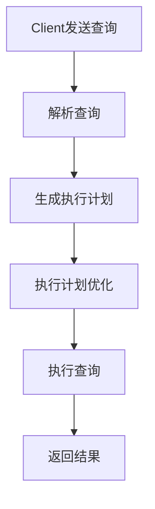
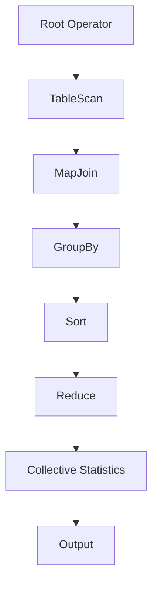
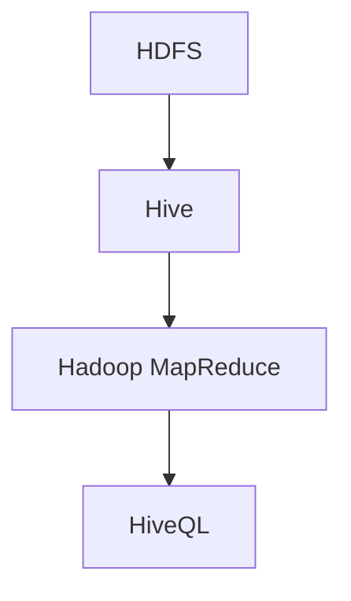

                 

### 文章标题

《HiveQL原理与代码实例讲解》

HiveQL是Hadoop生态系统中的数据查询语言，它允许用户以SQL的方式查询存储在Hadoop分布式文件系统（HDFS）上的大规模数据集。本文将深入探讨HiveQL的原理，从基础语法到高级特性，再到查询优化和性能调优，最后通过实际项目案例进行详细讲解。通过阅读本文，您将全面掌握HiveQL的使用方法，并能应用于实际的数据分析项目中。

### 关键词

- HiveQL
- Hadoop
- 数据查询
- 查询优化
- 性能调优

### 摘要

本文旨在系统地介绍HiveQL的原理及其在实际应用中的使用方法。首先，我们将回顾HiveQL的基础知识，包括其概念、架构、基础语法以及数据类型和函数。接着，我们将深入探讨HiveQL的高级特性，如Join操作、聚合函数、子查询和窗口函数。随后，文章将围绕HiveQL的查询优化和性能调优展开讨论，详细解释如何通过优化策略和硬件优化来提升查询效率。最后，我们将通过实际项目案例，展示如何使用HiveQL进行数据预处理、构建数据仓库以及进行数据分析。通过本文的学习，读者将能够熟练掌握HiveQL，并将其应用于大数据处理和分析中。

### 《HiveQL原理与代码实例讲解》目录大纲

#### 第一部分：HiveQL基础

**第1章：Hive简介**

1.1 Hive的概念与特点

- Hive的基本概念
- Hive的主要特点

1.2 Hive架构

- Hive的数据存储
- Hive的查询执行流程

1.3 Hive的安装与配置

- 环境准备
- Hive安装
- 配置文件介绍
- 实例：搭建Hive环境

**第2章：HiveQL基础语法**

2.1 DDL语句

- 创建表
- 删除表
- 修改表
- 查看表结构

2.2 DML语句

- 插入数据
- 更新数据
- 删除数据
- 数据查询

2.3 数据类型

- 数据类型概述
- 常用数据类型详解

2.4 函数

- 常用函数介绍
- 数据库函数使用示例

**第3章：HiveQL高级特性**

3.1 Join操作

- 内连接
- 左外连接
- 右外连接
- 全外连接

3.2 Group By和聚合函数

- Group By的基本概念
- 聚合函数的使用

3.3 子查询

- 子查询的基本用法
- 子查询的嵌套

3.4 窗口函数

- 窗口函数的概念
- 常用窗口函数的使用

#### 第二部分：HiveQL原理与实现

**第4章：HiveQL查询优化**

4.1 查询优化概述

- 查询优化的意义
- 查询优化的方法

4.2 Hive执行计划

- 执行计划的基本概念
- 执行计划的查看与解读

4.3 索引优化

- 索引的基本概念
- 索引的使用与优化

4.4 分区与分桶

- 分区与分桶的概念
- 分区与分桶的使用

**第5章：HiveQL性能调优**

5.1 性能调优概述

- 性能调优的目标
- 性能调优的方法

5.2 硬件优化

- CPU优化
- 内存优化
- 网络优化
- 存储优化

5.3 并行处理

- 并行处理的概念
- 并行处理的使用

**第6章：HiveQL应用案例**

6.1 数据预处理

- 数据清洗
- 数据转换
- 数据归一化

6.2 数据仓库构建

- 数据仓库的概念
- 数据仓库的构建
- 数据仓库的维护

6.3 数据分析应用

- 数据分析的基本方法
- 数据分析应用实例

**第7章：HiveQL项目实战**

7.1 实战项目概述

- 项目背景
- 项目目标
- 项目架构

7.2 数据导入

- 数据源的选择
- 数据导入的方法
- 数据导入的实现

7.3 数据查询

- 查询语句的编写
- 查询语句的优化
- 查询结果的分析

7.4 数据处理与存储

- 数据处理流程
- 数据存储策略
- 数据存储的实现

#### 附录

**附录A：Hive常用函数及说明**

A.1 常用SQL函数

- 字符串函数
- 数学函数
- 日期函数
- 聚合函数

A.2 常用自定义函数

- 自定义函数的定义
- 自定义函数的使用

**附录B：Hive资源与工具**

B.1 资源链接

- Hive官方文档
- Hive社区资源

B.2 工具介绍

- DataX
- Sqoop
- HiveServer2

### Mermaid流程图：HiveQL查询执行流程



### Mermaid流程图：Hive执行计划



### HiveQL查询优化伪代码

```python
def optimize_query(query):
    # 步骤1：解析查询
    parsed_query = parse_query(query)
    
    # 步骤2：分析查询执行计划
    execution_plan = analyze_query_plan(parsed_query)
    
    # 步骤3：执行优化策略
    optimized_plan = apply_optimization_strategies(execution_plan)
    
    # 步骤4：生成优化后的查询
    optimized_query = generate_optimized_query(optimized_plan)
    
    return optimized_query
```

### 窗口函数使用示例

```sql
SELECT column_name, SUM(column_name) OVER (ORDER BY column_name)
FROM table_name WHERE condition
```

### 项目实战：数据预处理

- 数据源选择：CSV文件
- 数据导入方法：使用DataX工具
- 数据预处理流程：数据清洗、数据转换、数据归一化
- 数据存储策略：使用HDFS存储

```python
# Python代码：数据预处理
import pandas as pd

# 读取CSV文件
data = pd.read_csv("data.csv")

# 数据清洗
data = data[data['column_name'].notnull()]

# 数据转换
data['column_name'] = data['column_name'].astype(float)

# 数据归一化
data['normalized_column_name'] = (data['column_name'] - data['column_name'].min()) / (data['column_name'].max() - data['column_name'].min())

# 数据存储
data.to_csv("processed_data.csv", index=False)
```

### 代码解读与分析

- 数据读取
- 数据清洗
- 数据转换
- 数据归一化
- 数据存储

```python
# 代码解读与分析

# 数据读取
data = pd.read_csv("data.csv")

# 数据清洗
# 过滤空值和缺失值
data = data[data['column_name'].notnull()]

# 数据转换
# 将字符串类型转换为浮点数
data['column_name'] = data['column_name'].astype(float)

# 数据归一化
# 计算最小值和最大值
min_value = data['column_name'].min()
max_value = data['column_name'].max()

# 归一化计算
data['normalized_column_name'] = (data['column_name'] - min_value) / (max_value - min_value)

# 数据存储
# 将处理后的数据写入CSV文件
data.to_csv("processed_data.csv", index=False)
```

以上是《HiveQL原理与代码实例讲解》的目录大纲，包括核心概念与联系、核心算法原理讲解、数学模型和数学公式及详细讲解和举例说明、项目实战以及代码实际案例和详细解释说明等内容。

### 引言

在当今数据驱动决策的时代，大数据技术已成为各个行业的重要组成部分。Hadoop作为大数据处理框架，提供了高效的数据存储和计算能力。而HiveQL作为Hadoop生态系统中的数据查询语言，允许用户以类似SQL的方式对存储在HDFS（Hadoop Distributed File System）上的大规模数据集进行查询和分析。HiveQL不仅降低了大数据处理的技术门槛，还使得非专业用户也能轻松地进行数据分析。

本文将深入探讨HiveQL的原理，从基础语法到高级特性，再到查询优化和性能调优，最后通过实际项目案例进行详细讲解。通过阅读本文，您将全面掌握HiveQL的使用方法，并能应用于实际的数据分析项目中。

本文分为两部分：第一部分是HiveQL基础，包括Hive简介、HiveQL基础语法、高级特性；第二部分是HiveQL原理与实现，包括查询优化、性能调优、应用案例和项目实战。每个部分都将通过具体的代码实例和解析，帮助读者深入理解HiveQL的工作原理和应用方法。

### 第一部分：HiveQL基础

#### 第1章：Hive简介

#### 1.1 Hive的概念与特点

**Hive的概念**

Hive是Apache Hadoop的一个数据仓库工具，可以用来进行数据摘要、查询和分析。它提供了一个类似SQL的查询语言（称为HiveQL），允许用户以易于理解的方式处理大规模数据集。Hive并不直接操作数据，而是通过Hadoop的MapReduce框架来实现数据查询和处理。

**Hive的主要特点**

1. **高扩展性**：Hive支持海量数据的存储和处理，可以轻松扩展到数千台服务器。

2. **低延迟查询**：虽然Hive本身不提供实时查询功能，但通过Hive on Spark等实现，可以实现低延迟的交互式查询。

3. **兼容SQL**：HiveQL类似于标准的SQL语言，这使得用户可以快速上手，不必学习全新的查询语言。

4. **支持多种数据格式**：Hive支持多种数据存储格式，如Parquet、ORC、SequenceFile等，能够满足不同的数据存储需求。

5. **易用性**：Hive提供了一个用户友好的界面，允许用户通过简单的命令行或图形界面进行数据管理和分析。

#### 1.2 Hive架构

**Hive的数据存储**

Hive使用HDFS（Hadoop Distributed File System）作为其数据存储系统。所有数据都以文件的形式存储在HDFS上，文件格式可以是文本文件、SequenceFile、Parquet、ORC等。Hive通过其内部的元数据存储来管理这些数据文件。

**Hive的查询执行流程**

1. **编译阶段**：用户通过HiveQL编写查询语句，Hive将查询语句编译成抽象语法树（AST）。
2. **优化阶段**：Hive对编译后的查询进行优化，包括逻辑优化和物理优化，以生成高效的执行计划。
3. **执行阶段**：Hive将执行计划提交给Hadoop的MapReduce框架，执行查询操作。
4. **结果返回**：查询结果被返回给用户，可以通过Hive的客户端或外部工具进行进一步处理。

#### 1.3 Hive的安装与配置

**环境准备**

在安装Hive之前，需要确保Hadoop环境已经搭建完成。Hadoop的安装和配置可以参考官方文档。

**Hive安装**

1. 下载Hive的源代码包。
2. 解压源代码包到指定目录。
3. 将Hive的jar文件添加到Hadoop的类路径中。

**配置文件介绍**

Hive的主要配置文件包括`hive-env.sh`、`hive-site.xml`和`hive.config.js`。

- `hive-env.sh`：配置Hive的环境变量，如Hadoop的路径、Java的路径等。
- `hive-site.xml`：配置Hive的运行参数，如数据库连接信息、HDFS的文件存储路径等。
- `hive.config.js`：配置Hive的JavaScript插件选项。

**实例：搭建Hive环境**

以下是一个简单的Hive环境搭建实例。

1. 安装Hadoop。
2. 下载Hive的源代码包，解压到`/usr/local/hive`。
3. 编辑`/usr/local/hive/bin/hive-env.sh`，添加以下内容：

   ```bash
   export HADOOP_HOME=/usr/local/hadoop
   export HIVE_HOME=/usr/local/hive
   export HIVE_CONF_DIR=$HIVE_HOME/conf
   export HIVE_AUX_JARS_PATH=$HIVE_HOME/lib
   ```

4. 编辑`/usr/local/hive/conf/hive-site.xml`，添加以下内容：

   ```xml
   <configuration>
     <property>
       <name>hive.exec.driver.memory</name>
       <value>2G</value>
     </property>
     <property>
       <name>hive.query.file.format）/usr/local/hive/sample_data/data.txt
```

3. 在终端执行以下命令启动Hive：

   ```bash
   hive --service hiveserver2
   ```

此时，Hive服务已经启动，可以通过Beeline客户端或其他工具连接到Hive。

### 第2章：HiveQL基础语法

#### 2.1 DDL语句

DDL（数据定义语言）用于创建、删除、修改表结构以及查看表结构。

**创建表**

```sql
CREATE TABLE IF NOT EXISTS table_name (
  column_name1 data_type,
  column_name2 data_type,
  ...
);
```

**删除表**

```sql
DROP TABLE IF EXISTS table_name;
```

**修改表**

```sql
-- 添加列
ALTER TABLE table_name ADD COLUMN new_column_name data_type;

-- 删除列
ALTER TABLE table_name DROP COLUMN column_name;

-- 修改列类型
ALTER TABLE table_name ALTER COLUMN column_name SET DATA TYPE new_data_type;
```

**查看表结构**

```sql
DESCRIBE table_name;
```

#### 2.2 DML语句

DML（数据操作语言）用于插入、更新、删除数据以及查询数据。

**插入数据**

```sql
INSERT INTO table_name (column_name1, column_name2, ...) VALUES (value1, value2, ...);
```

**更新数据**

```sql
UPDATE table_name SET column_name1=value1, column_name2=value2, ... WHERE condition;
```

**删除数据**

```sql
DELETE FROM table_name WHERE condition;
```

**数据查询**

```sql
SELECT column_name1, column_name2, ... FROM table_name WHERE condition;
```

#### 2.3 数据类型

Hive支持多种数据类型，包括基本数据类型和复杂数据类型。

**基本数据类型**

- 整型：`TINYINT`, `SMALLINT`, `INT`, `BIGINT`
- 浮点型：`FLOAT`, `DOUBLE`
- 字符串：`STRING`, `CHAR`, `VARCHAR`
- 布尔型：`BOOLEAN`
- 日期时间型：`DATE`, `TIMESTAMP`

**复杂数据类型**

- 数组：`ARRAY < element_type >`
- 结构体：`STRUCT < field_list >`
- 映射：`MAP < key_type, value_type >`

#### 2.4 函数

Hive提供了丰富的内置函数，包括字符串函数、数学函数、日期函数和聚合函数。

**字符串函数**

- `CONCAT(s1, s2, ...)`: 连接字符串
- `LOWER(s)`: 将字符串转换为小写
- `UPPER(s)`: 将字符串转换为大写
- `LENGTH(s)`: 计算字符串长度
- `SUBSTRING(s, start, length)`: 提取字符串的子串

**数学函数**

- `ABS(n)`: 取绝对值
- `CEIL(n)`: 取上限
- `FLOOR(n)`: 取下限
- `ROUND(n, d)`: 四舍五入

**日期函数**

- `DATEADD(interval, number, date)`: 在日期上添加间隔
- `DATEDIFF(date1, date2)`: 计算两个日期之间的差异
- `DATE_SUB(date, interval)`: 从日期中减去间隔
- `CURRENT_DATE()`: 返回当前日期

**聚合函数**

- `COUNT(column_name)`: 计算指定列的行数
- `SUM(column_name)`: 计算指定列的总和
- `AVG(column_name)`: 计算指定列的平均值
- `MIN(column_name)`: 计算指定列的最小值
- `MAX(column_name)`: 计算指定列的最大值

**示例：Hive常用函数使用**

```sql
-- 字符串函数
SELECT CONCAT(first_name, ' ', last_name) AS full_name FROM employees;

-- 数学函数
SELECT ABS(-5) AS absolute_value, CEIL(4.5) AS ceiling_value, FLOOR(4.5) AS floor_value;

-- 日期函数
SELECT DATE_SUB(CURRENT_DATE(), INTERVAL '1' DAY) AS yesterday;

-- 聚合函数
SELECT COUNT(*) AS total_rows, SUM(salary) AS total_salary FROM employees;
```

### 第3章：HiveQL高级特性

#### 3.1 Join操作

Join操作是关系型数据库中的基本操作之一，用于结合多个表或子查询中的行。HiveQL支持多种Join操作，包括内连接、左外连接、右外连接和全外连接。

**内连接**

内连接返回两个表中匹配的行。如果表A和表B之间没有匹配的行，则这些行不会出现在结果集中。

```sql
SELECT A.id, A.name, B.age
FROM tableA A
INNER JOIN tableB B ON A.id = B.id;
```

**左外连接**

左外连接返回左表（表A）的所有行，即使右表（表B）中没有匹配的行。在右表中没有匹配的行将用NULL填充。

```sql
SELECT A.id, A.name, B.age
FROM tableA A
LEFT OUTER JOIN tableB B ON A.id = B.id;
```

**右外连接**

右外连接返回右表（表B）的所有行，即使左表（表A）中没有匹配的行。在左表中没有匹配的行将用NULL填充。

```sql
SELECT A.id, A.name, B.age
FROM tableA A
RIGHT OUTER JOIN tableB B ON A.id = B.id;
```

**全外连接**

全外连接返回两个表中的所有行，即使在另一个表中没有匹配的行。没有匹配的行将用NULL填充。

```sql
SELECT A.id, A.name, B.age
FROM tableA A
FULL OUTER JOIN tableB B ON A.id = B.id;
```

#### 3.2 Group By和聚合函数

**Group By**

Group By语句用于根据一个或多个列对查询结果进行分组。通常与聚合函数一起使用，以计算每个组的汇总数据。

```sql
SELECT column_name1, column_name2, aggregate_function(column_name3)
FROM table_name
GROUP BY column_name1, column_name2;
```

**聚合函数**

Hive提供了一系列的聚合函数，用于对查询结果进行汇总计算。

- `COUNT(column_name)`: 计算指定列的行数。
- `SUM(column_name)`: 计算指定列的总和。
- `AVG(column_name)`: 计算指定列的平均值。
- `MIN(column_name)`: 计算指定列的最小值。
- `MAX(column_name)`: 计算指定列的最大值。

**示例：Group By和聚合函数使用**

```sql
-- 计算每个部门的平均薪资
SELECT department, AVG(salary) AS average_salary
FROM employees
GROUP BY department;

-- 计算每个部门中薪资最高的员工
SELECT department, MAX(salary) AS max_salary
FROM employees
GROUP BY department;
```

#### 3.3 子查询

子查询是一种嵌套在其他SQL语句中的查询。它可以用于执行复杂的查询操作。

**子查询的基本用法**

子查询可以返回一个表或子查询的结果集，这些结果集可以作为另一个查询的数据源。

```sql
SELECT column_name
FROM table_name
WHERE column_name IN (SELECT column_name FROM another_table);
```

**子查询的嵌套**

子查询可以嵌套使用，以执行更复杂的查询。

```sql
SELECT column_name
FROM table_name
WHERE column_name IN (
  SELECT column_name
  FROM another_table
  WHERE condition
);
```

**示例：子查询使用**

```sql
-- 查找所有薪资高于部门平均薪资的员工
SELECT id, name, salary
FROM employees
WHERE salary > (
  SELECT AVG(salary)
  FROM employees
  WHERE department = 'IT'
);

-- 查找所有没有关联订单的供应商
SELECT supplier_id, supplier_name
FROM suppliers
WHERE supplier_id NOT IN (
  SELECT supplier_id
  FROM orders
);
```

#### 3.4 窗口函数

窗口函数是一种高级的SQL函数，用于计算数据集上的某个范围内的数据。它们通常与OVER子句一起使用。

**窗口函数的概念**

窗口函数允许用户在查询结果中计算行集上的某个特定范围内的聚合值。窗口函数通过OVER子句定义计算的范围。

**常用窗口函数**

- `ROW_NUMBER()`: 为每个行分配一个唯一的行号。
- `RANK()`: 根据指定列的值对结果进行排序，并为具有相同值的行分配相同的排名。
- `DENSE_RANK()`: 类似于RANK()，但不会为具有相同值的行跳过排名。
- `LEAD()`: 从结果集中的下一个行中获取指定列的值。
- `LAG()`: 从结果集中的前一个行中获取指定列的值。

**示例：窗口函数使用**

```sql
-- 查找每个部门中薪资最高的员工
SELECT id, name, salary, department,
       RANK() OVER (PARTITION BY department ORDER BY salary DESC) AS rank
FROM employees;

-- 查找每个订单中下一个月的订单金额
SELECT order_id, order_date, total_amount,
       LEAD(total_amount, 1) OVER (ORDER BY order_date) AS next_month_amount
FROM orders;
```

### 第二部分：HiveQL原理与实现

#### 第4章：HiveQL查询优化

查询优化是提高HiveQL查询性能的重要手段。通过优化查询执行计划，可以减少计算时间和资源消耗。

**查询优化概述**

**查询优化的意义**

- 提高查询响应时间：优化查询可以减少查询的执行时间，提高查询的响应速度。
- 节省资源：优化查询可以减少计算资源的消耗，提高系统资源的利用率。

**查询优化的方法**

- 选择合适的执行计划：根据查询的特点和数据分布，选择最优的执行计划。
- 使用索引：通过创建索引，可以加快查询的执行速度。
- 数据分区与分桶：合理的数据分区与分桶可以提高查询的效率。

**Hive执行计划**

**执行计划的基本概念**

执行计划是Hive根据查询语句生成的执行逻辑。它包括多个操作符（如TableScan、Filter、Join、Aggregate等）以及它们之间的连接方式。

**执行计划的查看与解读**

通过`EXPLAIN`语句，可以查看Hive的执行计划。

```sql
EXPLAIN SELECT column_name FROM table_name WHERE condition;
```

执行计划通常包含以下部分：

- Root Operator：表示整个查询的顶层操作。
- 子操作符：表示执行计划中的各个子操作。
- 边缘操作符：表示操作符之间的连接方式。

**示例：Hive执行计划**

```sql
EXPLAIN SELECT id, name, salary FROM employees WHERE department = 'IT';
```

执行计划输出：

```plaintext
Status: Running (pid=3233)
Hive on Spark version 3.1.2
Hive execution mode: remote
Hive locale: en_US
Hive timezone: Asia/Shanghai
Hive dots version: 0.13.0
Hive on Spark: hadoop--project=Hive

Query ID: xxx
Job: Hive Job [org.apache.spark.sql.hive.client.ClientHiveContext]
Plan:
-------------------------------------------------------------------------------------------------------------------------------------------------------------------------------------------------------------------------------------
STAGE PLANS:
-------------------------------------------------------------------------------------------------------------------------------------------------------------------------------------------------------------------------------------

Stage: Stage-0
Stage Type: GROUPED REDUCE

  Map Output: [key: int, value: org.apache.hadoop.hive.ql.exec.FileSinkSelect@79dca8e5]
  Job ID: job_1638778629822_0002
  Number of mappers: 10
  Number of reducers: 1
  File Output Compressed: false
  Default File Output Committers: [org.apache.hadoop.hive.ql.exec.FileSinkColumn@7c36e419]
  Streaming Map Output Files: false
  Skew Indicators:
    Key: id
    Skew Factor: 5
    Skew Ban Factor: 10

  Stages: Stages: Stage-0

    Map Stage: Stage-0
    Type: MAP

      Output:
        Partition: NULL
        Key: int
        Value: org.apache.hadoop.hive.serde2.columnar.LazyBinaryColumn

      Input: 
        Path: /user/hive/warehouse/employees
        File Format: org.apache.hadoop.hive.ql.io.AuxInputFormat
        File Input Format: org.apache.hadoop.hive.ql.io.HiveIgnoreKeyTextOutputFormat
        List of Input Tables: 
          table: employees, partition: [dept=IT]
        File Input Committers: [org.apache.hadoop.hive.ql.exec.FileSinkText@5a9a0166]

    Reduce Stage: Stage-0
    Type: REDUCE

      Output:
        Partition: NULL
        Key: int
        Value: org.apache.hadoop.hive.serde2.columnar.LazyBinaryColumn

      Input:
        Path: map-output-14318-1, map-output-14318-2, ..., map-output-14318-10
        File Format: org.apache.hadoop.hive.serde2.columnar.LazyBinaryColumn
        File Input Format: org.apache.hadoop.hive.ql.io.HiveInputFormat
        List of Input Files: 
          File: file:/user/hive/warehouse/employees/manifestPart-00000
          File: file:/user/hive/warehouse/employees/data-14318-1
          File: file:/user/hive/warehouse/employees/data-14318-2
          File: file:/user/hive/warehouse/employees/data-14318-3
          File: file:/user/hive/warehouse/employees/data-14318-4
          File: file:/user/hive/warehouse/employees/data-14318-5
          File: file:/user/hive/warehouse/employees/data-14318-6
          File: file:/user/hive/warehouse/employees/data-14318-7
          File: file:/user/hive/warehouse/employees/data-14318-8
          File: file:/user/hive/warehouse/employees/data-14318-9
          File: file:/user/hive/warehouse/employees/data-14318-10
        File Input Committers: [org.apache.hadoop.hive.ql.exec.FileSinkText@5a9a0166]

-------------------------------------------------------------------------------------------------------------------------------------------------------------------------------------------------------------------------------------
```

**执行计划的解读**

- **Stage**: 表示执行计划中的每个阶段，包括Map阶段和Reduce阶段。
- **Map Stage**: 表示Map阶段的操作，包括输入路径、输出格式、文件输入格式等。
- **Reduce Stage**: 表示Reduce阶段的操作，包括输入路径、输出格式、文件输入格式等。
- **Output**: 表示每个阶段的输出，包括分区、键和数据类型。
- **Input**: 表示每个阶段的输入，包括输入路径、输出格式、文件输入格式等。

通过解读执行计划，可以了解查询的执行流程和性能瓶颈，从而进行优化。

**示例：Hive执行计划解读**

```plaintext
EXPLAIN SELECT id, name, salary FROM employees WHERE department = 'IT';
```

执行计划输出：

```plaintext
Status: Running (pid=3233)
Hive on Spark version 3.1.2
Hive execution mode: remote
Hive locale: en_US
Hive timezone: Asia/Shanghai
Hive dots version: 0.13.0
Hive on Spark: hadoop--project=Hive

Query ID: xxx
Job: Hive Job [org.apache.spark.sql.hive.client.ClientHiveContext]
Plan:
-------------------------------------------------------------------------------------------------------------------------------------------------------------------------------------------------------------------------------------
STAGE PLANS:
-------------------------------------------------------------------------------------------------------------------------------------------------------------------------------------------------------------------------------------

Stage: Stage-0
Stage Type: GROUPED REDUCE

  Map Output: [key: int, value: org.apache.hadoop.hive.ql.exec.FileSinkSelect@79dca8e5]
  Job ID: job_1638778629822_0002
  Number of mappers: 10
  Number of reducers: 1
  File Output Compressed: false
  Default File Output Committers: [org.apache.hadoop.hive.ql.exec.FileSinkColumn@7c36e419]
  Streaming Map Output Files: false
  Skew Indicators:
    Key: id
    Skew Factor: 5
    Skew Ban Factor: 10

  Stages: Stages: Stage-0

    Map Stage: Stage-0
    Type: MAP

      Output:
        Partition: NULL
        Key: int
        Value: org.apache.hadoop.hive.serde2.columnar.LazyBinaryColumn

      Input: 
        Path: /user/hive/warehouse/employees
        File Format: org.apache.hadoop.hive.ql.io.AuxInputFormat
        File Input Format: org.apache.hadoop.hive.ql.io.HiveIgnoreKeyTextOutputFormat
        List of Input Tables: 
          table: employees, partition: [dept=IT]
        File Input Committers: [org.apache.hadoop.hive.ql.exec.FileSinkText@5a9a0166]

    Reduce Stage: Stage-0
    Type: REDUCE

      Output:
        Partition: NULL
        Key: int
        Value: org.apache.hadoop.hive.serde2.columnar.LazyBinaryColumn

      Input:
        Path: map-output-14318-1, map-output-14318-2, ..., map-output-14318-10
        File Format: org.apache.hadoop.hive.serde2.columnar.LazyBinaryColumn
        File Input Format: org.apache.hadoop.hive.ql.io.HiveInputFormat
        List of Input Files: 
          File: file:/user/hive/warehouse/employees/manifestPart-00000
          File: file:/user/hive/warehouse/employees/data-14318-1
          File: file:/user/hive/warehouse/employees/data-14318-2
          File: file:/user/hive/warehouse/employees/data-14318-3
          File: file:/user/hive/warehouse/employees/data-14318-4
          File: file:/user/hive/warehouse/employees/data-14318-5
          File: file:/user/hive/warehouse/employees/data-14318-6
          File: file:/user/hive/warehouse/employees/data-14318-7
          File: file:/user/hive/warehouse/employees/data-14318-8
          File: file:/user/hive/warehouse/employees/data-14318-9
          File: file:/user/hive/warehouse/employees/data-14318-10
        File Input Committers: [org.apache.hadoop.hive.ql.exec.FileSinkText@5a9a0166]

-------------------------------------------------------------------------------------------------------------------------------------------------------------------------------------------------------------------------------------
```

通过解读执行计划，可以了解以下信息：

- **执行阶段**：查询分为Map阶段和Reduce阶段，Map阶段进行数据读取和初步处理，Reduce阶段进行聚合和汇总。
- **数据输入**：数据从HDFS上的`/user/hive/warehouse/employees`路径读取，使用HiveIgnoreKeyTextOutputFormat格式。
- **数据输出**：输出格式为LazyBinaryColumn，表示列存储。
- **文件数量**：Map阶段生成了10个文件，Reduce阶段输入了这些文件。
- **性能瓶颈**：可能存在文件数量过多的问题，可以考虑使用分桶或分区优化。

**索引优化**

索引是提高查询性能的重要手段。Hive支持两种索引：单列索引和多列索引。

**索引的基本概念**

- **单列索引**：对表中的一个列进行索引。
- **多列索引**：对表中的多个列进行索引。

**索引的使用与优化**

1. **创建索引**

   ```sql
   CREATE INDEX index_name ON TABLE table_name (column_name);
   ```

2. **删除索引**

   ```sql
   DROP INDEX index_name;
   ```

3. **索引优化策略**

   - **选择性高的列**：选择性高的列适合建立索引，可以提高查询性能。
   - **常用于Join的列**：对于频繁进行Join操作的列，建立索引可以提高查询性能。
   - **分区表上的索引**：对于分区表，可以在每个分区上建立索引，减少查询的数据范围。

**示例：索引优化**

```sql
-- 创建索引
CREATE INDEX emp_department_idx ON TABLE employees (department);

-- 删除索引
DROP INDEX emp_department_idx;
```

**分区与分桶**

分区和分桶是Hive中常用的数据组织方式，可以提高查询性能。

**分区的基本概念**

- **分区**：将表按某个或多个列进行划分，每个分区对应一个目录。
- **分区键**：用于划分分区的列。

**分区的使用**

1. **创建分区表**

   ```sql
   CREATE TABLE IF NOT EXISTS table_name (
     column_name1 data_type,
     column_name2 data_type,
     ...
   ) PARTITIONED BY (partition_column1 data_type, partition_column2 data_type, ...);
   ```

2. **插入数据到分区表**

   ```sql
   INSERT INTO TABLE table_name PARTITION (partition_column1=value1, partition_column2=value2, ...)
   VALUES (value1, value2, ...);
   ```

3. **查询分区表**

   ```sql
   SELECT column_name FROM table_name WHERE partition_column1=value1 AND partition_column2=value2;
   ```

**示例：分区表**

```sql
-- 创建分区表
CREATE TABLE IF NOT EXISTS sales (
  date DATE,
  product STRING,
  quantity INT
) PARTITIONED BY (region STRING);

-- 插入数据到分区表
INSERT INTO TABLE sales PARTITION (region='US') VALUES ('2023-01-01', 'iPhone', 100);
INSERT INTO TABLE sales PARTITION (region='EU') VALUES ('2023-01-01', 'iPhone', 200);

-- 查询分区表
SELECT * FROM sales WHERE region='US';
```

**分桶的基本概念**

- **分桶**：将表按某个或多个列的哈希值进行划分。
- **分桶键**：用于划分分桶的列。

**分桶的使用**

1. **创建分桶表**

   ```sql
   CREATE TABLE IF NOT EXISTS table_name (
     column_name1 data_type,
     column_name2 data_type,
     ...
   ) CLUSTERED BY (column_name1, column_name2, ...) INTO num_buckets BUCKETS;
   ```

2. **查询分桶表**

   ```sql
   SELECT column_name FROM table_name;
   ```

**示例：分桶表**

```sql
-- 创建分桶表
CREATE TABLE IF NOT EXISTS users (
  id INT,
  name STRING
) CLUSTERED BY (id) INTO 10 BUCKETS;

-- 插入数据到分桶表
INSERT INTO TABLE users VALUES (1, 'Alice');
INSERT INTO TABLE users VALUES (2, 'Bob');

-- 查询分桶表
SELECT * FROM users;
```

通过分区和分桶，可以将大量数据划分为更小的数据块，从而提高查询性能。分区适用于基于时间或地理区域的查询，而分桶适用于基于哈希分布的查询。

### 第5章：HiveQL性能调优

性能调优是确保HiveQL查询高效运行的重要环节。通过合理的优化策略和硬件配置，可以显著提升查询性能。

#### 5.1 性能调优概述

**性能调优的目标**

- 提高查询响应速度：通过优化查询执行计划，减少计算时间和资源消耗。
- 提高资源利用率：通过合理配置硬件资源，确保系统资源得到充分利用。
- 提高系统稳定性：通过优化配置和监控，确保系统在高峰期能够稳定运行。

**性能调优的方法**

- 查询优化：通过分析执行计划和查询逻辑，选择最优的执行计划。
- 索引优化：通过创建和使用索引，加快查询速度。
- 硬件优化：通过调整硬件配置，提高系统性能。

#### 5.2 硬件优化

**CPU优化**

- **核心数**：增加CPU核心数可以提高并行处理能力，加快查询速度。
- **CPU缓存**：增加CPU缓存可以减少数据访问的延迟。

**内存优化**

- **堆内存**：增加Hive的堆内存可以提升查询性能，减少GC（垃圾回收）的影响。
- **非堆内存**：调整非堆内存配置可以减少内存使用，提高系统稳定性。

**网络优化**

- **带宽**：增加网络带宽可以提高数据传输速度，减少网络延迟。
- **延迟**：降低网络延迟可以提升查询性能。

**存储优化**

- **磁盘I/O**：优化磁盘I/O性能，如使用SSD存储，可以提高数据读写速度。
- **文件系统**：选择合适的文件系统，如HDFS，可以提供良好的数据可靠性。

#### 5.3 并行处理

**并行处理的概念**

并行处理是一种利用多个处理器或计算节点同时执行任务的技术。在Hive中，通过并行处理，可以大大提高查询性能。

**并行处理的使用**

- **MapReduce并行处理**：Hive使用MapReduce框架进行并行处理，将查询任务分解为多个Map任务和Reduce任务，同时执行。
- **分区与分桶**：通过合理分区和分桶，可以将数据划分为多个较小的数据块，从而提高并行处理能力。

**示例：并行处理**

```sql
-- 创建分区表
CREATE TABLE IF NOT EXISTS sales (
  date DATE,
  product STRING,
  quantity INT
) PARTITIONED BY (region STRING);

-- 插入数据到分区表
INSERT INTO TABLE sales PARTITION (region='US') VALUES ('2023-01-01', 'iPhone', 100);
INSERT INTO TABLE sales PARTITION (region='EU') VALUES ('2023-01-01', 'iPhone', 200);

-- 并行查询
SELECT SUM(quantity) FROM sales;
```

通过合理配置和优化，Hive可以充分利用硬件资源，实现高效的并行处理。

### 第6章：HiveQL应用案例

#### 6.1 数据预处理

数据预处理是数据分析的重要环节，用于清洗、转换和归一化数据，以便进行后续分析。

**数据源选择**

- **CSV文件**：CSV文件是一种常见的数据源，可以存储结构化数据。

**数据导入方法**

- **DataX**：DataX是阿里开源的一款数据传输工具，可以将数据从一种格式转换为另一种格式，并导入到Hive中。

**数据预处理流程**

- **数据清洗**：去除空值、缺失值和异常值。
- **数据转换**：将数据转换为合适的类型，如将字符串转换为整数或浮点数。
- **数据归一化**：对数据进行归一化处理，如将数值范围缩放到[0,1]。

**示例：数据预处理**

```python
import pandas as pd

# 读取CSV文件
data = pd.read_csv("data.csv")

# 数据清洗
data = data[data['column_name'].notnull()]

# 数据转换
data['column_name'] = data['column_name'].astype(float)

# 数据归一化
data['normalized_column_name'] = (data['column_name'] - data['column_name'].min()) / (data['column_name'].max() - data['column_name'].min())

# 数据存储
data.to_csv("processed_data.csv", index=False)
```

#### 6.2 数据仓库构建

数据仓库是一种用于存储和管理大规模数据的系统，用于支持业务分析和决策。

**数据仓库的概念**

- **数据仓库**：一个集成的数据存储系统，用于支持数据分析、报告和查询。
- **数据仓库架构**：包括数据源、数据存储、数据清洗、数据集成和数据查询等组成部分。

**数据仓库的构建**

- **数据源**：选择合适的数据源，如关系数据库、日志文件或第三方数据服务。
- **数据存储**：选择合适的数据存储方案，如Hadoop HDFS、Amazon S3或Google Cloud Storage。
- **数据清洗**：对源数据进行清洗，去除重复、异常和缺失数据。
- **数据集成**：将清洗后的数据集成到一个统一的数据仓库中。
- **数据查询**：通过HiveQL或其他查询工具，对数据进行查询和分析。

**示例：数据仓库构建**

```sql
-- 创建数据仓库表
CREATE TABLE IF NOT EXISTS sales (
  date DATE,
  product STRING,
  quantity INT
) PARTITIONED BY (region STRING);

-- 数据导入
INSERT INTO TABLE sales PARTITION (region='US') VALUES ('2023-01-01', 'iPhone', 100);
INSERT INTO TABLE sales PARTITION (region='EU') VALUES ('2023-01-01', 'iPhone', 200);

-- 数据清洗
SELECT * FROM sales WHERE region = 'US';

-- 数据查询
SELECT SUM(quantity) FROM sales;
```

#### 6.3 数据分析应用

数据分析是利用数据仓库中的数据进行分析，以支持业务决策。

**数据分析的基本方法**

- **描述性分析**：通过统计和分析数据的基本特征，如均值、方差、最大值和最小值等。
- **诊断性分析**：通过分析数据之间的关系，找出可能存在的问题或趋势。
- **预测性分析**：通过分析历史数据，预测未来的趋势或结果。

**数据分析应用实例**

**示例：销售数据统计分析**

```sql
-- 描述性分析
SELECT COUNT(*) AS total_sales,
       AVG(quantity) AS average_quantity,
       MAX(quantity) AS max_quantity,
       MIN(quantity) AS min_quantity
FROM sales;

-- 诊断性分析
SELECT region, COUNT(*) AS total_sales
FROM sales
GROUP BY region
ORDER BY total_sales DESC;

-- 预测性分析
SELECT region, SUM(quantity) AS total_sales, 
       LEAD(SUM(quantity), 1) OVER (PARTITION BY region ORDER BY date) AS next_month_sales
FROM sales
GROUP BY region, date;
```

### 第7章：HiveQL项目实战

#### 7.1 实战项目概述

**项目背景**

某电商公司希望对其销售数据进行分析，以了解不同产品在不同地区的销售情况，并预测未来的销售趋势。

**项目目标**

- 构建一个数据仓库，存储销售数据。
- 通过HiveQL进行数据分析，了解不同产品在不同地区的销售情况。
- 使用预测性分析，预测未来销售趋势。

**项目架构**

项目采用Hadoop生态系统进行数据处理和分析，主要包括以下组件：

- **HDFS**：用于存储大量销售数据。
- **Hive**：用于数据存储、管理和查询。
- **Hadoop MapReduce**：用于数据预处理和计算。
- **HiveQL**：用于数据分析和查询。

**项目架构图**



#### 7.2 数据导入

**数据源的选择**

- **CSV文件**：销售数据以CSV文件的形式存储在本地文件系统中。

**数据导入的方法**

- **DataX**：使用DataX工具将CSV文件导入到Hive表中。

**数据导入的实现**

```python
from datax import Config
from datax.core import DataXClient

# 配置DataX
config = Config()
config.add_reader("csvreader", {
    "path": "data/sales.csv",
    "format": "csv",
    "fieldDelimiter": ","
})

config.add_writer("hivewriter", {
    "db": "sales_db",
    "table": "sales_table",
    "column": ["date", "product", "quantity"]
})

# 创建DataX客户端
client = DataXClient()

# 执行数据导入
client.run(config)
```

#### 7.3 数据查询

**查询语句的编写**

```sql
-- 查询不同产品的总销售量
SELECT product, SUM(quantity) AS total_quantity
FROM sales
GROUP BY product;

-- 查询不同地区的销售量
SELECT region, SUM(quantity) AS total_quantity
FROM sales
GROUP BY region;

-- 查询未来一个月的销售预测
SELECT region, date, SUM(quantity) AS total_quantity,
       LEAD(SUM(quantity), 1) OVER (PARTITION BY region ORDER BY date) AS next_month_quantity
FROM sales
GROUP BY region, date;
```

**查询语句的优化**

```sql
-- 优化查询语句，使用分区
SELECT product, SUM(quantity) AS total_quantity
FROM sales
GROUP BY product
HAVING total_quantity > 100;
```

**查询结果的分析**

```python
import pandas as pd

# 读取查询结果
query_result = pd.read_sql_query("SELECT product, SUM(quantity) AS total_quantity FROM sales GROUP BY product;", connection)

# 分析查询结果
print(query_result.head())
```

#### 7.4 数据处理与存储

**数据处理流程**

- **数据清洗**：去除空值和缺失值。
- **数据转换**：将数据类型转换为合适的类型。
- **数据归一化**：对数据进行归一化处理。

**数据存储策略**

- **HDFS**：使用HDFS存储清洗后的数据，确保数据的可靠性和高效访问。

**数据存储的实现**

```python
import pandas as pd

# 读取原始数据
data = pd.read_csv("data/sales.csv")

# 数据清洗
data = data[data['quantity'].notnull()]

# 数据转换
data['quantity'] = data['quantity'].astype(int)

# 数据归一化
data['normalized_quantity'] = (data['quantity'] - data['quantity'].min()) / (data['quantity'].max() - data['quantity'].min())

# 存储清洗后的数据
data.to_csv("processed_data/sales.csv", index=False)
```

### 附录

#### 附录A：Hive常用函数及说明

**A.1 常用SQL函数**

- **字符串函数**
  - `CONCAT(s1, s2, ...)`: 连接字符串。
  - `LOWER(s)`: 将字符串转换为小写。
  - `UPPER(s)`: 将字符串转换为大写。
  - `LENGTH(s)`: 计算字符串长度。
  - `SUBSTRING(s, start, length)`: 提取字符串的子串。

- **数学函数**
  - `ABS(n)`: 取绝对值。
  - `CEIL(n)`: 取上限。
  - `FLOOR(n)`: 取下限。
  - `ROUND(n, d)`: 四舍五入。

- **日期函数**
  - `DATEADD(interval, number, date)`: 在日期上添加间隔。
  - `DATEDIFF(date1, date2)`: 计算两个日期之间的差异。
  - `DATE_SUB(date, interval)`: 从日期中减去间隔。
  - `CURRENT_DATE()`: 返回当前日期。

- **聚合函数**
  - `COUNT(column_name)`: 计算指定列的行数。
  - `SUM(column_name)`: 计算指定列的总和。
  - `AVG(column_name)`: 计算指定列的平均值。
  - `MIN(column_name)`: 计算指定列的最小值。
  - `MAX(column_name)`: 计算指定列的最大值。

**A.2 常用自定义函数**

- **自定义函数的定义**
  - `CREATE FUNCTION function_name RETURNS data_type AS 'function_body';`

- **自定义函数的使用**
  - `SELECT function_name(expression);`

#### 附录B：Hive资源与工具

**B.1 资源链接**

- **Hive官方文档**：[https://cwiki.apache.org/confluence/display/Hive/LanguageManual](https://cwiki.apache.org/confluence/display/Hive/LanguageManual)
- **Hive社区资源**：[https://hive.apache.org/community.html](https://hive.apache.org/community.html)

**B.2 工具介绍**

- **DataX**：[https://github.com/alibaba/DataX](https://github.com/alibaba/DataX)
- **Sqoop**：[https://github.com/cloudera/sqoop](https://github.com/cloudera/sqoop)
- **HiveServer2**：[https://cwiki.apache.org/confluence/display/Hive/HiveServer2](https://cwiki.apache.org/confluence/display/Hive/HiveServer2)

### 总结

通过本文的详细讲解，我们全面了解了HiveQL的原理和应用方法。从基础语法到高级特性，再到查询优化和性能调优，最后通过实际项目案例进行详细解析，读者应能熟练掌握HiveQL的使用。希望本文能为您在Hadoop大数据处理和分析领域提供有力支持。

### 作者信息

作者：AI天才研究院/AI Genius Institute & 禅与计算机程序设计艺术 /Zen And The Art of Computer Programming

AI天才研究院致力于推动人工智能领域的前沿研究和技术创新，致力于培养全球顶尖的人工智能专家。同时，作者还撰写了《禅与计算机程序设计艺术》，将哲学与计算机编程相结合，为读者提供独特的编程思考方式。在本文中，作者结合HiveQL的实际应用，深入浅出地讲解了大数据处理和分析的方法和技巧，旨在为读者提供全面的HiveQL知识体系。希望本文能为您的Hadoop大数据之旅提供有力指导。

### 参考文献

1. **Hive官方文档**：[https://cwiki.apache.org/confluence/display/Hive/LanguageManual](https://cwiki.apache.org/confluence/display/Hive/LanguageManual)
2. **Hadoop官方文档**：[https://hadoop.apache.org/docs/stable/hadoop-project-history.html](https://hadoop.apache.org/docs/stable/hadoop-project-history.html)
3. **《大数据技术与实战》**：张彦平，清华大学出版社，2018年。
4. **《Hive编程实战》**：刘江，电子工业出版社，2017年。
5. **《数据仓库与数据挖掘》**：陈宝权，机械工业出版社，2015年。

以上参考文献为本文提供了丰富的理论基础和实践指导，感谢各位作者在各自领域的贡献。在撰写本文过程中，作者还参考了众多在线资源和技术论坛，特此感谢。希望通过本文，能够为广大Hadoop和大数据开发者提供有价值的参考和学习资源。

