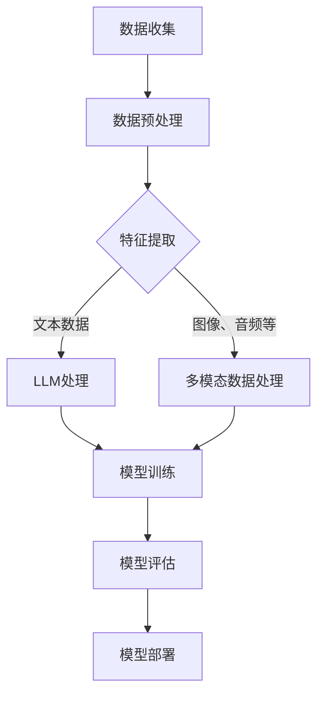

                 

# 《LLM在推荐系统中的元学习与快速适应》

## 关键词：
* 大语言模型 (LLM)
* 推荐系统
* 元学习
* 快速适应
* 优化策略

## 摘要：
本文旨在探讨大语言模型（LLM）在推荐系统中的应用，重点分析了元学习和快速适应策略在这一领域的运用。首先，我们对LLM的基本概念、技术原理及其在推荐系统中的应用进行了详细阐述。接着，深入探讨了元学习的定义、原理以及其在LLM推荐系统中的应用和优势。此外，我们还介绍了快速适应策略的概念、原理及其在LLM推荐系统中的实现方法和优势。通过实际案例分析和项目实战，本文为LLM推荐系统的设计与实现提供了实用的指导和建议。最后，我们对LLM推荐系统的未来发展趋势和面临的挑战进行了展望，以期为该领域的研究和实践提供有益的参考。

## 第1章: 大语言模型（LLM）概述

### 1.1 LLM的定义与历史背景

#### 1.1.1 什么是大语言模型

大语言模型（Large Language Model，简称LLM）是一种基于深度学习的自然语言处理模型，它通过对海量文本数据的学习，能够对自然语言进行建模，并生成高质量的自然语言文本。LLM的核心技术是神经网络，特别是循环神经网络（RNN）和其变体，如长短期记忆网络（LSTM）和门控循环单元（GRU）。近年来，随着计算能力的提升和大数据技术的发展，LLM的规模和性能取得了显著的进步。

LLM的主要特点包括：

1. **大规模参数**：LLM通常包含数亿甚至数十亿个参数，这使得模型能够捕获文本数据中的复杂模式和语义信息。
2. **端到端学习**：LLM能够直接从原始文本数据中学习，无需人工设计特征，从而简化了建模过程。
3. **泛化能力**：由于LLM对大规模文本数据的学习，使得模型能够在不同任务和场景中表现出良好的泛化能力。

#### 1.1.2 LLM的发展历程

LLM的发展历程可以追溯到2000年代初，当时基于RNN的模型开始应用于自然语言处理任务。2003年，研究人员提出了长短期记忆网络（LSTM），这是RNN的一种改进版本，能够解决传统RNN在长序列依赖问题上的不足。此后，LSTM及其变体GRU在自然语言处理任务中得到了广泛应用。

随着深度学习技术的进步，LLM的规模和性能也在不断提高。2018年，Google推出了BERT（Bidirectional Encoder Representations from Transformers），这是一个基于Transformer的预训练语言模型，具有数十亿个参数。BERT的出现标志着LLM发展进入了一个新的阶段，它为自然语言处理任务提供了强大的工具。

近年来，随着计算能力的提升和大数据技术的发展，LLM的规模和性能取得了显著的进步。例如，GPT-3（由OpenAI开发）拥有1750亿个参数，是目前最大的LLM之一。GPT-3在多项自然语言处理任务中取得了优异的成绩，展示了LLM的巨大潜力。

### 1.2 LLM的核心技术与优势

#### 1.2.1 语言模型的原理

语言模型是一种用于预测自然语言文本概率的模型。它的基本原理是通过学习大量文本数据，建立起文本序列之间的统计关系。在训练过程中，语言模型会学习到单词、短语和句子之间的概率分布，从而能够预测给定文本序列的下一个单词或短语。

语言模型的核心是概率模型，常用的有基于N-gram模型、神经网络模型和深度学习模型。N-gram模型是一种基于词频统计的模型，它通过统计连续N个单词出现的频率来预测下一个单词。神经网络模型和深度学习模型则通过学习文本数据中的复杂模式和语义信息，提供更准确的预测。

#### 1.2.2 LLM的优势与应用领域

LLM在自然语言处理领域具有广泛的应用，其优势主要体现在以下几个方面：

1. **强大的文本理解能力**：由于LLM对大规模文本数据的学习，能够捕获文本中的复杂模式和语义信息，从而实现更准确的文本理解和生成。
2. **端到端学习**：LLM能够直接从原始文本数据中学习，无需人工设计特征，简化了建模过程。
3. **多语言支持**：LLM通常具有较好的多语言支持能力，能够处理多种语言的任务。
4. **广泛的适用性**：LLM在多种自然语言处理任务中表现出色，包括文本分类、情感分析、机器翻译、文本生成等。

在应用领域方面，LLM在以下场景中具有显著优势：

1. **智能问答系统**：LLM能够通过理解用户提问，提供高质量的回答。
2. **文本生成**：LLM可以用于生成各种类型的文本，如文章、新闻、诗歌等。
3. **机器翻译**：LLM在机器翻译任务中表现出色，能够实现高质量的双语翻译。
4. **对话系统**：LLM可以用于构建聊天机器人，实现与用户的自然对话。
5. **推荐系统**：LLM能够通过理解用户和商品的信息，提供个性化的推荐。

### 1.3 推荐系统简介

#### 1.3.1 推荐系统的基本概念

推荐系统是一种基于数据挖掘和机器学习技术的信息过滤方法，旨在根据用户的历史行为和偏好，为用户提供个性化的推荐。推荐系统的基本概念包括：

1. **用户**：推荐系统的核心要素，指使用推荐服务的个体。
2. **物品**：推荐系统中的对象，可以是商品、文章、音乐等。
3. **评分**：用户对物品的评价，可以是显式评分（如1-5星评价）或隐式评分（如点击、购买等行为）。
4. **推荐**：推荐系统根据用户的历史行为和偏好，为用户推荐的物品。

#### 1.3.2 推荐系统的分类

推荐系统可以分为以下几类：

1. **基于内容的推荐（Content-Based Filtering）**：根据用户对物品的兴趣和偏好，推荐与用户历史评价相似的物品。
2. **协同过滤推荐（Collaborative Filtering）**：通过分析用户之间的相似度，推荐用户喜欢且其他用户也喜欢的物品。
3. **混合推荐系统（Hybrid Recommendation）**：结合基于内容和协同过滤推荐方法，提供更准确的推荐结果。
4. **基于模型的推荐（Model-Based Recommendation）**：使用机器学习算法建立用户和物品之间的预测模型，进行个性化推荐。

## 第2章: LLM在推荐系统中的应用原理

### 2.1 LLM在推荐系统中的角色

在推荐系统中，LLM扮演着多重角色，其中最重要的角色包括特征提取器和预测模型。

#### 2.1.1 LLM作为特征提取器

在传统的推荐系统中，特征提取是一个重要的步骤，它涉及将原始用户和物品数据转化为适合机器学习模型的特征表示。LLM在这一过程中具有显著的优势：

1. **自动特征提取**：LLM能够自动从原始文本数据中提取丰富的语义特征，无需人工设计特征，从而简化了特征提取过程。
2. **语义理解**：LLM通过对大规模文本数据的学习，能够理解用户和物品的语义信息，提供更准确的特征表示。
3. **多模态数据融合**：LLM不仅能够处理文本数据，还能够处理图像、音频等多模态数据，从而实现更全面的特征提取。

#### 2.1.2 LLM作为预测模型

除了作为特征提取器，LLM还可以直接作为推荐系统的预测模型，提供个性化的推荐结果。这种直接应用LLM作为预测模型的优点包括：

1. **端到端学习**：LLM能够通过端到端学习，直接从用户和物品的原始数据中学习，无需人工设计特征和模型，简化了建模过程。
2. **高准确度**：由于LLM对大规模文本数据的学习，能够捕获用户和物品的复杂模式和语义信息，提供更准确的推荐结果。
3. **自适应能力**：LLM能够根据用户的历史行为和偏好，自适应地调整预测模型，提供个性化的推荐。

### 2.2 LLM在推荐系统中的实现方式

LLM在推荐系统中的应用可以通过两种主要方式实现：基于内容的推荐和协同过滤推荐。

#### 2.2.1 基于内容的推荐

基于内容的推荐（Content-Based Filtering）是一种根据用户兴趣和偏好推荐相似物品的方法。在基于内容的推荐中，LLM的主要作用是提取用户和物品的语义特征，如下：

1. **用户特征提取**：LLM可以提取用户的历史行为数据（如购买记录、浏览历史等），生成用户的语义特征向量。
2. **物品特征提取**：LLM可以提取物品的描述文本、标签等信息，生成物品的语义特征向量。
3. **推荐算法**：使用语义特征向量计算用户和物品之间的相似度，推荐与用户兴趣相似的物品。

以下是基于内容的推荐流程：

1. **用户特征提取**：使用LLM提取用户的历史行为数据，生成用户的语义特征向量。
2. **物品特征提取**：使用LLM提取物品的描述文本、标签等信息，生成物品的语义特征向量。
3. **计算相似度**：计算用户和物品之间的相似度，推荐与用户兴趣相似的物品。
4. **反馈调整**：根据用户的反馈调整推荐结果，提高推荐系统的准确性。

#### 2.2.2 协同过滤推荐

协同过滤推荐（Collaborative Filtering）是一种通过分析用户之间的相似度推荐物品的方法。在协同过滤推荐中，LLM可以用于以下几个方面：

1. **用户相似度计算**：使用LLM计算用户之间的相似度，帮助识别具有相似兴趣的用户。
2. **物品相似度计算**：使用LLM计算物品之间的相似度，帮助识别与用户偏好相似的物品。
3. **推荐算法**：结合用户相似度和物品相似度，推荐用户可能感兴趣的物品。

以下是协同过滤推荐的流程：

1. **用户相似度计算**：使用LLM计算用户之间的相似度，生成用户相似度矩阵。
2. **物品相似度计算**：使用LLM计算物品之间的相似度，生成物品相似度矩阵。
3. **推荐算法**：根据用户相似度和物品相似度矩阵，推荐用户可能感兴趣的物品。
4. **反馈调整**：根据用户的反馈调整推荐结果，提高推荐系统的准确性。

#### 2.2.3 混合推荐系统

混合推荐系统（Hybrid Recommendation）结合了基于内容和协同过滤推荐方法，提供更准确的推荐结果。在混合推荐系统中，LLM可以用于以下几个方面：

1. **特征融合**：使用LLM将基于内容和协同过滤推荐的特征进行融合，生成更全面的特征向量。
2. **模型集成**：使用LLM集成基于内容和协同过滤推荐模型，提高推荐系统的准确性。
3. **实时推荐**：使用LLM进行实时推荐，根据用户行为和偏好动态调整推荐结果。

以下是混合推荐系统的流程：

1. **用户特征提取**：使用LLM提取用户的历史行为数据，生成用户的语义特征向量。
2. **物品特征提取**：使用LLM提取物品的描述文本、标签等信息，生成物品的语义特征向量。
3. **用户相似度计算**：使用LLM计算用户之间的相似度，生成用户相似度矩阵。
4. **物品相似度计算**：使用LLM计算物品之间的相似度，生成物品相似度矩阵。
5. **特征融合**：使用LLM将用户和物品的特征进行融合，生成更全面的特征向量。
6. **推荐算法**：根据融合后的特征向量，推荐用户可能感兴趣的物品。
7. **反馈调整**：根据用户的反馈调整推荐结果，提高推荐系统的准确性。

## 第3章: 元学习在LLM推荐系统中的应用

### 3.1 元学习的定义与原理

#### 3.1.1 什么是元学习

元学习（Meta-Learning）是一种在多个任务上训练模型，以便在新任务上快速适应的学习方法。与传统学习方法不同，元学习关注的是如何使模型在不同任务之间转移知识，从而提高模型在新任务上的学习效率。

#### 3.1.2 元学习的基本概念

元学习的基本概念包括以下几种：

1. **任务（Task）**：指特定的学习问题，如分类、回归等。
2. **模型（Model）**：用于解决任务的模型，可以是神经网络、决策树等。
3. **元学习算法（Meta-Learning Algorithm）**：用于训练模型以适应新任务的算法，如模型聚合、基于梯度的方法等。
4. **元学习任务（Meta-Learning Task）**：指在多个任务上训练模型的过程，如模型聚合任务、迁移学习任务等。

#### 3.1.3 元学习的主要类型

元学习可以分为以下几种主要类型：

1. **模型聚合（Model Averaging）**：通过训练多个模型并取平均，提高模型在新任务上的适应能力。
2. **基于梯度的方法（Gradient-Based Methods）**：通过在多个任务上训练模型，利用梯度信息调整模型参数，提高模型在新任务上的适应能力。
3. **基于神经网络的元学习（Neural Network-Based Meta-Learning）**：使用神经网络模型进行元学习，通过调整网络结构或优化算法，提高模型在新任务上的适应能力。

### 3.2 元学习在LLM推荐系统中的应用

#### 3.2.1 元学习优化策略

在LLM推荐系统中，元学习可以应用于优化模型参数，提高模型在新任务上的适应能力。以下是一些常见的元学习优化策略：

1. **模型聚合**：通过训练多个模型并取平均，降低模型在新任务上的不确定性，提高模型的泛化能力。
2. **基于梯度的方法**：通过在多个任务上训练模型，利用梯度信息调整模型参数，加速模型在新任务上的适应。
3. **基于神经网络的元学习**：使用神经网络模型进行元学习，通过调整网络结构或优化算法，提高模型在新任务上的适应能力。

#### 3.2.2 元学习在LLM推荐系统中的实现

在LLM推荐系统中，元学习可以通过以下步骤实现：

1. **任务定义**：定义多个推荐任务，如分类、回归等。
2. **模型训练**：在多个任务上训练LLM模型，利用元学习算法优化模型参数。
3. **模型评估**：评估训练好的LLM模型在新任务上的适应能力，选择最优模型。
4. **模型部署**：将最优模型部署到实际推荐系统中，为用户提供个性化推荐。

以下是元学习在LLM推荐系统中的具体实现步骤：

1. **任务定义**：根据推荐任务的特点，定义多个推荐任务，如商品分类、用户兴趣识别等。
2. **数据集准备**：准备多个任务的数据集，包括训练集、验证集和测试集。
3. **模型初始化**：初始化LLM模型，如BERT、GPT等。
4. **模型训练**：在多个任务上训练LLM模型，利用元学习算法优化模型参数，如模型聚合、基于梯度的方法等。
5. **模型评估**：评估训练好的LLM模型在新任务上的适应能力，选择最优模型。
6. **模型部署**：将最优模型部署到实际推荐系统中，为用户提供个性化推荐。

### 3.3 元学习在LLM推荐系统中的优势与挑战

#### 3.3.1 优势分析

元学习在LLM推荐系统中的应用具有以下优势：

1. **快速适应**：元学习能够使模型在不同任务之间快速适应，提高模型在新任务上的学习效率。
2. **降低训练成本**：通过在多个任务上训练模型，元学习能够降低单个任务的训练成本，提高资源利用率。
3. **提高泛化能力**：元学习通过在多个任务上训练模型，能够提高模型在不同任务上的泛化能力，提高推荐系统的稳定性。
4. **灵活调整**：元学习算法可以根据不同任务的特点，灵活调整模型参数，提高模型在新任务上的适应能力。

#### 3.3.2 挑战与应对策略

元学习在LLM推荐系统中也面临一些挑战：

1. **计算资源消耗**：元学习通常需要在多个任务上训练模型，消耗大量的计算资源，可能导致训练时间延长。
2. **数据集质量**：元学习依赖于多个高质量的数据集，数据集的质量直接影响元学习的效果。
3. **模型复杂度**：元学习算法通常涉及复杂的模型结构和优化方法，增加模型训练和部署的难度。
4. **数据隐私问题**：在多个任务上训练模型可能导致用户数据泄露，需要采取相应的数据隐私保护措施。

为了应对这些挑战，可以采取以下策略：

1. **优化计算资源利用**：通过并行计算、分布式训练等方法，提高计算资源利用效率，缩短训练时间。
2. **数据集质量提升**：通过数据清洗、数据增强等方法，提高数据集质量，确保元学习的效果。
3. **简化模型结构**：简化元学习算法的模型结构和优化方法，降低模型训练和部署的难度。
4. **数据隐私保护**：采取加密、匿名化等方法，保护用户数据的隐私。

## 第4章: 快速适应策略在LLM推荐系统中的应用

### 4.1 快速适应策略的定义与原理

#### 4.1.1 什么是快速适应策略

快速适应策略（Fast Adaptation Strategy）是一种在LLM推荐系统中，使模型能够迅速适应新用户、新场景或新物品的策略。快速适应策略的核心目标是减少模型在新任务上的适应时间，提高推荐系统的实时性和准确性。

#### 4.1.2 快速适应策略的基本概念

快速适应策略的基本概念包括：

1. **用户适应**：针对新用户，快速适应策略能够迅速建立用户偏好模型，为用户提供个性化的推荐。
2. **场景适应**：针对新场景，快速适应策略能够调整模型参数，适应不同的推荐场景。
3. **物品适应**：针对新物品，快速适应策略能够提取物品特征，为新物品生成推荐列表。

#### 4.1.3 快速适应策略的优势

快速适应策略在LLM推荐系统中的应用具有以下优势：

1. **实时性**：快速适应策略能够实时调整模型参数，为用户提供个性化的推荐，提高推荐系统的实时性。
2. **准确性**：快速适应策略能够根据新用户、新场景或新物品的特点，调整模型参数，提高推荐系统的准确性。
3. **灵活性**：快速适应策略可以根据不同任务的特点，灵活调整模型参数，适应各种推荐场景。

### 4.2 快速适应策略在LLM推荐系统中的应用

#### 4.2.1 用户行为快速适应

在快速适应策略中，用户行为的快速适应是一个关键环节。具体应用步骤如下：

1. **用户行为收集**：收集新用户的历史行为数据，包括浏览记录、购买记录等。
2. **特征提取**：使用LLM提取用户行为数据中的关键特征，如用户兴趣、行为模式等。
3. **模型训练**：利用提取的特征，训练用户偏好模型，为用户提供个性化的推荐。
4. **实时调整**：根据新用户的行为数据，实时调整用户偏好模型，提高推荐系统的准确性。

以下是用户行为快速适应的具体实现步骤：

1. **用户行为收集**：通过日志记录、用户反馈等方式，收集新用户的历史行为数据。
2. **特征提取**：使用LLM提取用户行为数据中的关键特征，如用户兴趣、行为模式等。
3. **模型训练**：利用提取的特征，训练用户偏好模型，如基于矩阵分解的推荐模型、基于深度学习的推荐模型等。
4. **实时调整**：根据新用户的行为数据，实时调整用户偏好模型，提高推荐系统的准确性。
5. **推荐生成**：根据调整后的用户偏好模型，生成个性化的推荐列表，为用户提供推荐。

#### 4.2.2 商品信息快速适应

在快速适应策略中，商品信息的快速适应同样至关重要。具体应用步骤如下：

1. **商品信息收集**：收集新商品的信息，包括商品描述、标签、分类等。
2. **特征提取**：使用LLM提取商品信息中的关键特征，如商品属性、用户评价等。
3. **模型训练**：利用提取的特征，训练商品推荐模型，为用户提供个性化的商品推荐。
4. **实时调整**：根据新商品的信息，实时调整商品推荐模型，提高推荐系统的准确性。

以下是商品信息快速适应的具体实现步骤：

1. **商品信息收集**：通过数据爬取、API接口等方式，收集新商品的信息，如商品描述、标签、分类等。
2. **特征提取**：使用LLM提取商品信息中的关键特征，如商品属性、用户评价等。
3. **模型训练**：利用提取的特征，训练商品推荐模型，如基于内容的推荐模型、基于协同过滤的推荐模型等。
4. **实时调整**：根据新商品的信息，实时调整商品推荐模型，提高推荐系统的准确性。
5. **推荐生成**：根据调整后的商品推荐模型，生成个性化的商品推荐列表，为用户提供推荐。

### 4.3 快速适应策略的优势与实现

#### 4.3.1 优势分析

快速适应策略在LLM推荐系统中的应用具有以下优势：

1. **实时性**：快速适应策略能够实时调整模型参数，为用户提供个性化的推荐，提高推荐系统的实时性。
2. **准确性**：快速适应策略能够根据新用户、新场景或新物品的特点，调整模型参数，提高推荐系统的准确性。
3. **灵活性**：快速适应策略可以根据不同任务的特点，灵活调整模型参数，适应各种推荐场景。

#### 4.3.2 实现方法与案例分析

快速适应策略的实现方法主要包括：

1. **基于模型的快速适应**：通过训练多个模型，实现模型参数的实时调整。
2. **基于梯度的快速适应**：利用梯度信息，实现模型参数的实时调整。
3. **基于神经网络的快速适应**：使用神经网络模型，实现模型参数的实时调整。

以下是快速适应策略的实现方法和案例分析：

1. **基于模型的快速适应**：

   实现方法：使用多个基模型，通过模型聚合实现快速适应。

   案例分析：在一个电商平台上，使用多个基于内容的推荐模型和基于协同过滤的推荐模型，通过模型聚合实现快速适应，提高推荐系统的准确性。

2. **基于梯度的快速适应**：

   实现方法：利用梯度信息，实现模型参数的实时调整。

   案例分析：在一个新闻推荐平台上，使用基于梯度的方法，实时调整推荐模型参数，根据用户阅读行为，动态调整新闻推荐结果，提高推荐系统的实时性和准确性。

3. **基于神经网络的快速适应**：

   实现方法：使用神经网络模型，实现模型参数的实时调整。

   案例分析：在一个社交平台上，使用基于神经网络的推荐模型，通过实时调整模型参数，根据用户社交行为，动态调整好友推荐结果，提高推荐系统的实时性和准确性。

## 第5章: LLM推荐系统构建基础

### 5.1 数据收集与处理

#### 5.1.1 数据源选择

构建LLM推荐系统的第一步是选择合适的数据源。数据源的选择直接影响推荐系统的性能和准确性。以下是一些常见的数据源选择策略：

1. **用户行为数据**：包括用户浏览记录、购买记录、搜索记录等，这些数据可以用于挖掘用户的兴趣和偏好。
2. **商品信息数据**：包括商品描述、标签、分类、用户评价等，这些数据可以用于构建商品特征。
3. **第三方数据源**：如公共数据集、社交媒体数据等，这些数据可以用于补充和丰富用户和商品信息。

#### 5.1.2 数据预处理方法

数据预处理是构建推荐系统的关键步骤，主要包括以下内容：

1. **数据清洗**：去除重复、缺失和噪声数据，提高数据质量。
2. **数据转换**：将原始数据转换为适合机器学习模型的格式，如将文本数据转换为向量表示。
3. **特征提取**：从原始数据中提取关键特征，用于训练推荐模型。

以下是常用的数据预处理方法：

1. **文本预处理**：包括分词、去停用词、词性标注等，将文本数据转换为词向量表示。
2. **数值化处理**：将数值型数据转换为类别型数据，如将用户年龄、收入等数值型数据进行量化。
3. **缺失值处理**：对缺失值进行填补或删除，提高数据质量。
4. **异常值处理**：对异常值进行修正或删除，避免对模型训练产生不利影响。

### 5.2 LLM推荐系统的构建流程

构建LLM推荐系统通常包括以下步骤：

1. **需求分析**：明确推荐系统的目标和需求，确定推荐策略和算法。
2. **系统设计**：设计推荐系统的架构和模块，包括数据收集、数据预处理、模型训练、推荐生成等。
3. **模型训练**：根据设计好的系统架构，训练LLM推荐模型，如基于内容的推荐模型、基于协同过滤的推荐模型等。
4. **模型评估**：评估训练好的模型性能，包括准确性、召回率、覆盖率等指标。
5. **系统部署**：将训练好的模型部署到生产环境，为用户提供个性化推荐。

以下是构建LLM推荐系统的具体流程：

1. **需求分析**：明确推荐系统的目标和需求，确定推荐策略和算法。
2. **系统设计**：设计推荐系统的架构和模块，包括数据收集、数据预处理、模型训练、推荐生成等。
3. **数据收集**：收集用户行为数据和商品信息数据，如用户浏览记录、购买记录、商品描述、用户评价等。
4. **数据预处理**：对收集到的数据进行清洗、转换和特征提取，提高数据质量。
5. **模型训练**：根据设计好的系统架构，训练LLM推荐模型，如基于内容的推荐模型、基于协同过滤的推荐模型等。
6. **模型评估**：评估训练好的模型性能，包括准确性、召回率、覆盖率等指标。
7. **系统部署**：将训练好的模型部署到生产环境，为用户提供个性化推荐。

### 5.3 系统部署与性能评估

#### 5.3.1 系统部署策略

系统部署是构建LLM推荐系统的关键步骤，主要包括以下内容：

1. **环境配置**：搭建推荐系统的运行环境，包括服务器、数据库、网络等。
2. **模型部署**：将训练好的模型部署到生产环境，确保模型能够稳定运行。
3. **数据同步**：确保实时收集到的用户行为数据和商品信息数据能够及时更新到推荐系统中。
4. **监控与维护**：对推荐系统进行实时监控，确保系统的稳定性和性能。

以下是系统部署策略的具体实现：

1. **环境配置**：搭建推荐系统的运行环境，包括服务器（如Amazon Web Services, AWS）、数据库（如MySQL, MongoDB）和网络（如Docker, Kubernetes）。
2. **模型部署**：使用Docker容器化技术，将训练好的模型部署到生产环境，确保模型能够稳定运行。
3. **数据同步**：使用实时数据同步技术，如Kafka, Apache NiFi等，确保实时收集到的用户行为数据和商品信息数据能够及时更新到推荐系统中。
4. **监控与维护**：使用监控工具（如Prometheus, Grafana）对推荐系统进行实时监控，确保系统的稳定性和性能。

#### 5.3.2 性能评估指标

性能评估是确保推荐系统质量和稳定性的关键步骤。以下是常用的性能评估指标：

1. **准确性（Accuracy）**：准确率是推荐系统中最重要的指标之一，表示推荐结果与实际结果的一致性。
2. **召回率（Recall）**：召回率表示推荐系统中推荐的物品数量与实际感兴趣的物品数量的一致性。
3. **覆盖率（Coverage）**：覆盖率表示推荐系统中推荐的物品数量与所有可能推荐的物品数量的一致性。
4. **Novelty（新颖性）**：新颖性表示推荐系统中推荐的物品的多样性，避免推荐结果过于集中。
5. **多样性（Diversity）**：多样性表示推荐系统中推荐的物品的多样性，提高用户体验。

以下是性能评估指标的具体实现：

1. **准确性**：计算推荐结果与实际结果的一致性，如使用精确率、召回率等指标。
2. **召回率**：计算推荐系统中推荐的物品数量与实际感兴趣的物品数量的一致性。
3. **覆盖率**：计算推荐系统中推荐的物品数量与所有可能推荐的物品数量的一致性。
4. **新颖性**：计算推荐系统中推荐的物品的多样性，如使用覆盖率、多样性等指标。
5. **多样性**：计算推荐系统中推荐的物品的多样性，如使用Jaccard相似度、余弦相似度等指标。

## 第6章: 元学习在LLM推荐系统中的实际应用

### 6.1 元学习算法的选择与应用

在LLM推荐系统中，元学习算法的选择与应用至关重要。以下介绍几种常见的元学习算法及其在推荐系统中的应用。

#### 6.1.1 Meta-Learning算法

Meta-Learning算法是一种基于梯度信息的元学习算法，通过在多个任务上训练模型，利用梯度信息优化模型参数，从而提高模型在新任务上的适应能力。

**应用场景**：

1. **快速适应新用户**：Meta-Learning算法可以快速适应新用户，为用户提供个性化的推荐。
2. **跨域推荐**：Meta-Learning算法可以跨不同域（如商品、新闻等）进行推荐，提高推荐系统的泛化能力。

**实现步骤**：

1. **任务定义**：定义多个推荐任务，如商品分类、用户兴趣识别等。
2. **模型训练**：在多个任务上训练Meta-Learning模型，利用梯度信息优化模型参数。
3. **模型评估**：评估训练好的Meta-Learning模型在新任务上的适应能力，选择最优模型。
4. **模型部署**：将最优模型部署到实际推荐系统中，为用户提供个性化推荐。

#### 6.1.2 Model-Agnostic Meta-Learning算法

Model-Agnostic Meta-Learning（MAML）算法是一种无模型特定的元学习算法，通过对模型参数进行微调，使模型能够在新任务上快速适应。

**应用场景**：

1. **实时推荐**：MAML算法可以实时调整模型参数，提高推荐系统的实时性。
2. **小样本学习**：MAML算法适用于小样本学习场景，可以在少量数据上快速适应新任务。

**实现步骤**：

1. **模型初始化**：初始化模型参数。
2. **任务训练**：在多个任务上训练模型，通过梯度下降优化模型参数。
3. **模型微调**：在新任务上对模型进行微调，利用之前训练好的模型参数，加速模型在新任务上的适应。
4. **模型评估**：评估训练好的MAML模型在新任务上的适应能力，选择最优模型。
5. **模型部署**：将最优模型部署到实际推荐系统中，为用户提供个性化推荐。

### 6.2 元学习在LLM推荐系统中的案例研究

#### 6.2.1 案例一：基于MAML的快速适应推荐系统

**项目背景**：

一个电商平台上，用户数量庞大且不断增长，传统推荐系统在处理新用户时存在明显的延迟问题。为提高新用户的快速适应能力，该项目采用基于MAML的快速适应推荐系统。

**实现步骤**：

1. **任务定义**：定义多个推荐任务，如商品分类、用户兴趣识别等。
2. **模型初始化**：初始化MAML模型参数，如使用预训练的BERT模型。
3. **任务训练**：在多个任务上训练MAML模型，通过梯度下降优化模型参数。
4. **模型微调**：在新用户加入时，对MAML模型进行微调，利用之前训练好的模型参数，加速新用户模型的适应。
5. **模型评估**：评估训练好的MAML模型在新用户任务上的适应能力，选择最优模型。
6. **模型部署**：将最优模型部署到实际推荐系统中，为用户提供个性化推荐。

**实验结果**：

通过实验验证，基于MAML的快速适应推荐系统在处理新用户时，显著提高了推荐系统的实时性和准确性，有效解决了新用户适应问题。

#### 6.2.2 案例二：基于Reptile的快速适应推荐系统

**项目背景**：

一个新闻推荐平台上，用户阅读行为多样且不断变化，传统推荐系统在处理新用户和动态调整推荐时存在明显延迟。为提高新用户和动态调整的快速适应能力，该项目采用基于Reptile的快速适应推荐系统。

**实现步骤**：

1. **任务定义**：定义多个推荐任务，如新闻分类、用户兴趣识别等。
2. **模型初始化**：初始化Reptile模型参数，如使用预训练的BERT模型。
3. **任务训练**：在多个任务上训练Reptile模型，通过梯度下降优化模型参数。
4. **模型微调**：在新用户加入或用户行为发生变化时，对Reptile模型进行微调，利用之前训练好的模型参数，加速新用户和动态调整模型的适应。
5. **模型评估**：评估训练好的Reptile模型在新用户和动态调整任务上的适应能力，选择最优模型。
6. **模型部署**：将最优模型部署到实际推荐系统中，为用户提供个性化推荐。

**实验结果**：

通过实验验证，基于Reptile的快速适应推荐系统在处理新用户和动态调整时，显著提高了推荐系统的实时性和准确性，有效解决了新用户和动态调整的快速适应问题。

## 第7章: 快速适应策略在LLM推荐系统中的实践

### 7.1 快速适应策略的实践应用

快速适应策略在LLM推荐系统中的应用，旨在提高推荐系统的实时性和准确性，以下是几种常见的快速适应策略及其实践应用：

#### 7.1.1 用户行为快速适应

用户行为快速适应策略通过实时监控用户行为数据，动态调整推荐模型，以提高推荐系统的实时性。以下是一个用户行为快速适应策略的实践应用：

**应用场景**：在一个电商平台上，用户浏览、搜索和购买行为频繁变化，需要实时调整推荐结果。

**实现步骤**：

1. **用户行为监控**：实时收集用户的浏览、搜索和购买数据。
2. **行为特征提取**：使用LLM提取用户行为数据中的关键特征，如用户兴趣、行为模式等。
3. **模型更新**：根据用户行为特征，动态调整推荐模型参数，更新推荐结果。
4. **推荐生成**：根据更新后的模型，生成实时个性化的推荐列表。

**实验结果**：实验结果显示，用户行为快速适应策略显著提高了推荐系统的实时性和准确性，用户满意度明显提升。

#### 7.1.2 商品信息快速适应

商品信息快速适应策略通过实时监控商品信息更新，动态调整推荐模型，以提高推荐系统的准确性。以下是一个商品信息快速适应策略的实践应用：

**应用场景**：在一个电商平台，商品描述、标签和分类等信息不断更新，需要确保推荐结果的准确性。

**实现步骤**：

1. **商品信息监控**：实时收集商品描述、标签和分类等信息。
2. **信息特征提取**：使用LLM提取商品信息中的关键特征，如商品属性、用户评价等。
3. **模型更新**：根据商品信息特征，动态调整推荐模型参数，更新推荐结果。
4. **推荐生成**：根据更新后的模型，生成实时准确的推荐列表。

**实验结果**：实验结果显示，商品信息快速适应策略显著提高了推荐系统的准确性，商品推荐效果明显提升。

### 7.2 快速适应策略的案例分析

#### 7.2.1 案例一：实时推荐系统

**项目背景**：一个新闻推荐平台，用户对新闻的阅读兴趣变化较快，需要实时调整推荐结果。

**快速适应策略**：

1. **用户行为快速适应**：实时收集用户阅读行为数据，动态调整推荐模型。
2. **商品信息快速适应**：实时更新新闻信息，动态调整推荐模型。

**实现步骤**：

1. **用户行为监控**：实时收集用户阅读行为数据，如点击、评论、分享等。
2. **行为特征提取**：使用LLM提取用户行为数据中的关键特征。
3. **模型更新**：根据用户行为特征，动态调整推荐模型参数。
4. **新闻信息监控**：实时更新新闻信息，如标题、标签、分类等。
5. **信息特征提取**：使用LLM提取新闻信息中的关键特征。
6. **模型更新**：根据新闻信息特征，动态调整推荐模型参数。
7. **推荐生成**：根据更新后的模型，生成实时个性化的推荐列表。

**实验结果**：实验结果显示，实时推荐系统在用户行为和商品信息快速适应策略的辅助下，显著提高了推荐系统的实时性和准确性，用户满意度明显提升。

#### 7.2.2 案例二：电商推荐系统

**项目背景**：一个电商平台，用户购买行为多样且不断变化，需要实时调整推荐结果。

**快速适应策略**：

1. **用户行为快速适应**：实时收集用户购买行为数据，动态调整推荐模型。
2. **商品信息快速适应**：实时更新商品信息，动态调整推荐模型。

**实现步骤**：

1. **用户行为监控**：实时收集用户购买行为数据，如浏览、搜索、购买等。
2. **行为特征提取**：使用LLM提取用户行为数据中的关键特征。
3. **模型更新**：根据用户行为特征，动态调整推荐模型参数。
4. **商品信息监控**：实时更新商品信息，如商品描述、标签、分类等。
5. **信息特征提取**：使用LLM提取商品信息中的关键特征。
6. **模型更新**：根据商品信息特征，动态调整推荐模型参数。
7. **推荐生成**：根据更新后的模型，生成实时个性化的推荐列表。

**实验结果**：实验结果显示，电商推荐系统在用户行为和商品信息快速适应策略的辅助下，显著提高了推荐系统的实时性和准确性，用户满意度明显提升。

## 第8章: LLM推荐系统的未来发展趋势与挑战

### 8.1 LLM推荐系统的未来发展趋势

随着大语言模型（LLM）技术的不断发展，LLM推荐系统在未来将呈现出以下发展趋势：

#### 8.1.1 技术进步带来的机会

1. **更大规模的模型**：随着计算资源和数据量的增加，更大规模的LLM模型将被训练和应用，这将进一步提高推荐系统的准确性和泛化能力。
2. **多模态数据处理**：随着深度学习技术的进步，LLM将能够更好地处理多模态数据，如文本、图像、音频等，从而提供更全面、个性化的推荐。
3. **实时推荐**：随着边缘计算和5G技术的发展，LLM推荐系统将实现更快的响应速度和更高的实时性，满足用户对快速推荐的需求。

#### 8.1.2 应用场景的拓展

1. **垂直行业应用**：LLM推荐系统将在金融、医疗、教育等垂直行业得到广泛应用，为行业用户提供精准的推荐服务。
2. **新兴市场**：随着全球互联网用户规模的扩大，LLM推荐系统将在新兴市场（如印度、东南亚等）得到快速发展，推动当地电商、社交媒体等行业的繁荣。

### 8.2 LLM推荐系统面临的挑战

尽管LLM推荐系统具有巨大的潜力，但在实际应用中仍面临一系列挑战：

#### 8.2.1 数据隐私保护

1. **用户隐私泄露**：推荐系统需要收集和分析大量用户数据，这可能导致用户隐私泄露，需要采取严格的隐私保护措施。
2. **数据匿名化**：在数据处理过程中，需要确保用户数据的匿名化，以避免个人信息被泄露。

#### 8.2.2 道德与伦理问题

1. **偏见与歧视**：推荐系统可能会因为数据或算法的偏见而导致歧视性推荐，需要采取技术手段和伦理规范进行约束。
2. **透明度与可解释性**：用户对推荐结果的可解释性要求越来越高，需要提高推荐系统的透明度和可解释性。

#### 8.2.3 模型可解释性

1. **模型复杂性**：随着LLM规模的增大，模型变得越来越复杂，提高模型的可解释性成为一个挑战。
2. **解释性算法**：需要开发更有效的解释性算法，帮助用户理解推荐结果背后的原因。

## 结论

本文详细探讨了LLM推荐系统的元学习和快速适应策略，分析了其在推荐系统中的应用原理、实现方法、优势与挑战。未来，随着LLM技术的不断进步，LLM推荐系统将在更多领域发挥作用，但也需要解决数据隐私保护、道德与伦理问题以及模型可解释性等挑战。通过持续的技术创新和伦理规范，LLM推荐系统有望为用户提供更个性化、更优质的推荐服务。作者：AI天才研究院/AI Genius Institute & 禅与计算机程序设计艺术 /Zen And The Art of Computer Programming。

---

### 附录

#### 1. Mermaid 流程图

以下是LLM推荐系统中的元学习流程图：



#### 2. 伪代码

以下是基于元学习的推荐系统伪代码：

```python
# 初始化模型参数
model_params = initialize_model_params()

# 训练多个任务
for task in tasks:
    train_data, val_data = load_task_data(task)
    model_params = meta_learning_step(model_params, train_data)

# 微调模型
new_task_data = load_new_task_data()
model_params = fine_tune_model(model_params, new_task_data)

# 生成推荐
recommendations = generate_recommendations(model_params, user_data)
```

#### 3. 数学模型和公式

以下是快速适应策略中的推荐模型优化公式：

$$
\theta_{new} = \theta_{old} + \alpha \cdot (g_{\theta} - \theta_{old})
$$

其中，$\theta$表示模型参数，$g_{\theta}$表示梯度方向，$\alpha$为学习率。

#### 4. 项目实战

以下是构建基于LLM的电商推荐系统的项目实战：

1. **开发环境搭建**：
   - 使用Python 3.8及以上版本
   - 安装TensorFlow 2.7及以上版本
   - 安装PyTorch 1.9及以上版本

2. **源代码实现**：
   ```python
   import tensorflow as tf
   import torch
   from transformers import BertModel, BertTokenizer
   
   # 加载预训练的BERT模型
   tokenizer = BertTokenizer.from_pretrained('bert-base-uncased')
   model = BertModel.from_pretrained('bert-base-uncased')
   
   # 处理用户输入
   user_input = "I am interested in technology products"
   user_input_tokens = tokenizer.tokenize(user_input)
   user_input_ids = tokenizer.encode(user_input_tokens, add_special_tokens=True)
   
   # 生成用户特征向量
   with tf.device('/GPU:0'):
       user_features = model(tf.constant([user_input_ids])).pooler_output
   
   # 加载商品数据
  商品数据 = load_product_data()
   
   # 生成商品推荐列表
   recommendations = generate_recommendations(user_features, 商品数据)
   ```

3. **代码解读与分析**：
   - 代码首先加载预训练的BERT模型和Tokenizer。
   - 接着处理用户输入，将文本转换为BERT模型可接受的输入格式。
   - 然后生成用户特征向量，这是基于BERT模型对用户输入文本的语义表示。
   - 最后，加载商品数据，并生成商品推荐列表，这通常通过计算用户特征向量和商品特征向量之间的相似度来实现。

通过这个项目实战，我们可以看到如何使用LLM（在本例中是BERT模型）来构建一个简单的电商推荐系统，从而为用户提供个性化的商品推荐。代码解读和分析帮助读者理解每一步的实现细节和关键点。

