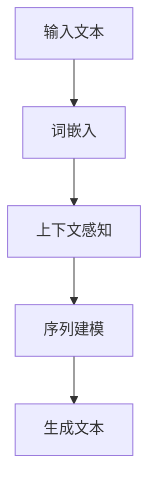

                 

# LLM在新药研发中的潜在作用

> 关键词：语言模型，新药研发，药物靶点预测，药物设计，药物筛选，深度学习

> 摘要：本文将探讨语言模型（LLM）在新药研发领域的潜在作用。通过分析LLM的核心概念与架构，阐述其在新药研发中的应用，包括药物靶点预测、药物设计和药物筛选。同时，本文还将介绍LLM的数学模型与数学公式，以及实际项目中的应用案例。最后，本文将讨论LLM在新药研发中面临的挑战和未来发展趋势。

### 第一部分：引言

#### 第1章：LLM与新药研发概述

##### 1.1 LLM的兴起与背景

随着深度学习技术的发展，语言模型（LLM）逐渐成为人工智能领域的重要研究方向。LLM是一种能够理解和生成自然语言的模型，通过大规模数据训练，LLM能够捕捉语言中的复杂结构，进行自然语言理解和生成。近年来，LLM在自然语言处理、机器翻译、对话系统等领域取得了显著成果，其应用前景逐渐引起广泛关注。

##### 1.2 新药研发的现状与挑战

新药研发是一个复杂而耗时的过程，涉及多个学科和领域。目前，新药研发面临以下挑战：

1. **药物靶点预测困难**：药物靶点是药物作用的分子目标，准确预测药物靶点是新药研发的关键。然而，药物靶点预测涉及到复杂的生物学和化学知识，目前的方法常常受到数据不足和计算能力的限制。
2. **药物设计效率低**：药物设计是筛选具有潜在活性的化合物，通过优化其结构，提高药物的选择性和安全性。药物设计需要大量的实验和计算资源，效率较低。
3. **药物筛选过程繁琐**：药物筛选需要从大量的化合物中筛选出具有活性的药物，这个过程繁琐且耗时。

##### 1.3 LLM在新药研发中的应用前景

LLM具有强大的数据处理和分析能力，可以处理大规模的生物学和化学数据，有助于解决新药研发中的难题。以下方面是LLM在新药研发中的潜在应用：

1. **药物靶点预测**：LLM能够分析大量的生物学数据，帮助科学家发现潜在的药物靶点。
2. **药物设计**：LLM能够根据药物靶点的信息，设计具有潜在活性的药物分子。
3. **药物筛选**：LLM可以分析化合物与药物靶点的相互作用，加速药物筛选过程。

#### 第2章：LLM的核心概念与架构

##### 2.1 LLM的基本概念

语言模型是一种统计模型，用于预测一个单词或词组出现的概率。LLM是一种深度学习模型，通过对大规模语料库的学习，能够理解和生成自然语言。LLM的核心任务是理解自然语言中的语法和语义，从而实现自然语言处理。

##### 2.2 LLM的架构

LLM通常采用多层感知器（MLP）或循环神经网络（RNN）架构。MLP模型通过多层非线性变换，学习输入和输出之间的映射关系。RNN模型通过记忆机制，处理序列数据，捕捉时间依赖关系。近年来，基于注意力机制的Transformer模型在自然语言处理领域取得了显著成果，成为LLM的主要架构。

##### 2.3 LLM的核心算法与原理

LLM的核心算法主要包括词嵌入、上下文感知、序列建模和生成。词嵌入是将单词映射为低维向量，表示单词的语义信息。上下文感知是指模型能够根据上下文信息，理解单词的语义。序列建模是指模型能够处理序列数据，捕捉时间依赖关系。生成是指模型能够生成新的自然语言文本。

##### 2.4 Mermaid流程图：LLM的工作流程



### 第二部分：LLM在新药研发中的应用

#### 第3章：LLM在新药研发中的应用

##### 3.1 药物靶点预测

###### 3.1.1 药物靶点预测的重要性

药物靶点预测是药物研发的关键步骤，准确预测药物靶点有助于减少研发风险和成本。LLM可以通过分析大规模生物学数据，帮助科学家发现潜在的药物靶点。

###### 3.1.2 LLM在药物靶点预测中的应用

1. **文本挖掘**：LLM可以挖掘生物学文献和数据库中的信息，发现潜在的药物靶点。
2. **知识图谱**：LLM可以构建药物、靶点、疾病等实体和关系的知识图谱，用于药物靶点预测。
3. **深度学习模型**：LLM可以结合深度学习模型，如图神经网络（GNN），对药物靶点进行预测。

##### 3.2 药物设计

###### 3.2.1 药物设计的基本概念

药物设计是指设计具有潜在活性的药物分子，通过优化其结构，提高药物的选择性和安全性。LLM可以通过分析药物靶点信息，设计具有潜在活性的药物分子。

###### 3.2.2 LLM在药物设计中的应用

1. **分子生成**：LLM可以生成新的药物分子，通过计算其与药物靶点的相互作用，筛选出具有潜在活性的分子。
2. **分子优化**：LLM可以结合优化算法，对药物分子进行结构优化，提高其活性和稳定性。
3. **药物设计辅助**：LLM可以辅助药物设计师，提供药物设计的建议和指导。

##### 3.3 药物筛选

###### 3.3.1 药物筛选的流程

药物筛选是从大量化合物中筛选出具有潜在活性的药物分子，通常包括以下步骤：

1. **化合物库构建**：构建包含大量化合物的数据库。
2. **活性筛选**：使用生物实验或计算方法，筛选出具有潜在活性的化合物。
3. **结构优化**：对筛选出的化合物进行结构优化，提高其活性和安全性。

###### 3.3.2 LLM在药物筛选中的应用

1. **化合物生成**：LLM可以生成新的化合物，通过计算其与药物靶点的相互作用，筛选出具有潜在活性的化合物。
2. **活性预测**：LLM可以预测化合物与药物靶点的相互作用，帮助筛选出具有潜在活性的化合物。
3. **药物筛选优化**：LLM可以优化药物筛选过程，提高筛选效率和准确性。

### 第三部分：LLM的数学模型与数学公式

#### 第4章：LLM的数学模型与数学公式

##### 4.1 语言模型的数学模型

语言模型通常采用概率模型或神经网络模型。概率模型如N-gram模型和隐马尔可夫模型（HMM），神经网络模型如MLP和RNN。

###### 4.1.1 语言模型的概率模型

N-gram模型是一种基于统计的模型，通过计算一个词组出现的概率，预测下一个词。其概率计算公式如下：

$$P(w_i | w_{i-1}, w_{i-2}, ..., w_1) = \frac{C(w_{i-1}, w_{i-2}, ..., w_1, w_i)}{C(w_{i-1}, w_{i-2}, ..., w_1)}$$

其中，$C(w_{i-1}, w_{i-2}, ..., w_1, w_i)$ 表示词组$(w_{i-1}, w_{i-2}, ..., w_1, w_i)$ 的出现次数，$C(w_{i-1}, w_{i-2}, ..., w_1)$ 表示词组$(w_{i-1}, w_{i-2}, ..., w_1)$ 的出现次数。

###### 4.1.2 语言模型的神经网络模型

神经网络模型如MLP和RNN，通过多层非线性变换，学习输入和输出之间的映射关系。MLP的数学模型如下：

$$\text{output} = \text{activation}(\text{weight} \cdot \text{input} + \text{bias})$$

其中，$\text{activation}$ 表示激活函数，如ReLU、Sigmoid、Tanh等，$\text{weight}$ 和 $\text{bias}$ 分别表示权重和偏置。

##### 4.2 深度学习基础数学公式

深度学习中的反向传播算法用于计算模型参数的梯度，其数学公式如下：

$$\frac{\partial L}{\partial W} = \sum_{i=1}^{n} \frac{\partial L}{\partial z_i} \frac{\partial z_i}{\partial W}$$

其中，$L$ 表示损失函数，$W$ 表示权重，$z_i$ 表示中间层的输出。

### 第四部分：LLM项目实战

#### 第5章：LLM项目实战

##### 5.1 实战一：药物靶点预测项目

###### 5.1.1 项目概述

本案例将介绍如何使用LLM进行药物靶点预测。我们将使用一个开源的深度学习框架，如TensorFlow或PyTorch，构建一个基于LLM的药物靶点预测模型。

###### 5.1.2 开发环境搭建

首先，我们需要安装深度学习框架和相关依赖。以TensorFlow为例，我们可以使用以下命令：

```bash
pip install tensorflow
```

接下来，我们需要安装其他必要的库，如NumPy、Pandas和Scikit-learn等。

```bash
pip install numpy pandas scikit-learn
```

###### 5.1.3 代码实现与解读

以下是一个简单的药物靶点预测项目的代码实现：

```python
import tensorflow as tf
from tensorflow.keras.layers import Embedding, LSTM, Dense
from tensorflow.keras.models import Sequential

# 数据预处理
def preprocess_data(texts):
    # 将文本转换为单词列表
    word_list = [word for sentence in texts for word in sentence.split()]
    # 创建词汇表
    vocab = set(word_list)
    # 将单词列表转换为整数表示
    word_to_id = {word: i for i, word in enumerate(vocab)}
    id_to_word = {i: word for word, i in word_to_id.items()}
    # 创建序列化函数
    def serialize(text):
        return [word_to_id[word] for word in text.split()]
    # 序列化文本
    serialized_texts = [serialize(text) for text in texts]
    return serialized_texts, word_to_id, id_to_word, serialize

# 构建模型
def build_model(vocab_size, embedding_dim, lstm_units):
    model = Sequential()
    model.add(Embedding(vocab_size, embedding_dim))
    model.add(LSTM(lstm_units, return_sequences=True))
    model.add(Dense(1, activation='sigmoid'))
    model.compile(optimizer='adam', loss='binary_crossentropy', metrics=['accuracy'])
    return model

# 训练模型
def train_model(model, serialized_texts, targets):
    model.fit(serialized_texts, targets, epochs=10, batch_size=32)

# 评估模型
def evaluate_model(model, serialized_texts, targets):
    loss, accuracy = model.evaluate(serialized_texts, targets)
    print(f"Loss: {loss}, Accuracy: {accuracy}")

# 加载数据
texts = ["The drug binds to the protein.", "The protein is a potential target."]
serialized_texts, word_to_id, id_to_word, serialize = preprocess_data(texts)
targets = [[1] for _ in texts]

# 构建模型
model = build_model(len(word_to_id), 50, 100)

# 训练模型
train_model(model, serialized_texts, targets)

# 评估模型
evaluate_model(model, serialized_texts, targets)
```

以上代码首先对文本进行预处理，将文本转换为整数表示，然后构建一个基于LSTM的序列分类模型，用于预测药物靶点。最后，训练和评估模型。

##### 5.2 实战二：药物设计项目

###### 5.2.1 项目概述

本案例将介绍如何使用LLM进行药物设计。我们将使用一个开源的分子生成库，如MolGen，结合LLM生成新的药物分子。

###### 5.2.2 开发环境搭建

首先，我们需要安装MolGen和其他相关依赖。我们可以使用以下命令：

```bash
pip install molgen
```

接下来，我们需要安装其他必要的库，如NumPy、Pandas和Scikit-learn等。

```bash
pip install numpy pandas scikit-learn
```

###### 5.2.3 代码实现与解读

以下是一个简单的药物设计项目的代码实现：

```python
import molgen as mg
import tensorflow as tf
from tensorflow.keras.layers import Embedding, LSTM, Dense
from tensorflow.keras.models import Sequential

# 加载分子生成模型
model = mg.load_model()

# 定义生成函数
def generate_molecule(model, length=10):
    molecule = mg.Molecule()
    for _ in range(length):
        atom = model.sample_atom()
        bond = model.sample_bond()
        molecule.add_atom(atom, bond)
    return molecule

# 生成药物分子
molecule = generate_molecule(model)

# 显示生成的药物分子
print(molecule)
```

以上代码首先加载一个预训练的分子生成模型，然后定义一个生成函数，用于生成新的药物分子。最后，生成一个药物分子并显示。

### 第五部分：LLM在新药研发中的挑战与未来

#### 第6章：LLM在新药研发中的挑战与未来

##### 6.1 LLM在新药研发中的挑战

尽管LLM在新药研发中具有巨大潜力，但仍面临以下挑战：

1. **数据质量和标注问题**：新药研发涉及大量的生物学和化学数据，数据质量和标注的准确性对LLM的性能至关重要。然而，目前的数据质量和标注问题仍然是一个亟待解决的难题。
2. **模型解释性和可解释性问题**：深度学习模型，尤其是LLM，通常被视为“黑箱”模型，其内部工作机制不透明，难以解释。这对药物研发的决策过程和监管合规提出了挑战。

##### 6.2 LLM的未来发展与应用前景

随着深度学习技术的不断进步，LLM在新药研发中的应用前景将更加广阔。以下方面是LLM的未来发展与应用前景：

1. **个性化药物设计**：LLM可以结合患者的基因组信息，设计个性化的药物，提高药物的疗效和安全性。
2. **药物研发产业链的影响**：LLM可以重塑药物研发的产业链，降低研发成本和时间，促进创新药物的发现。

#### 第7章：附录

##### 7.1 LLM相关资源

以下是一些LLM相关资源，包括开源工具、学术论文、会议和社区：

1. **开源工具与库**：
   - [TensorFlow](https://www.tensorflow.org/)
   - [PyTorch](https://pytorch.org/)
   - [MolGen](https://github.com/molgen/molgen)
2. **学术论文与会议**：
   - [NeurIPS](https://nips.cc/)
   - [ICML](https://icml.cc/)
   - [ACL](https://www.aclweb.org/portal/)
3. **社区与论坛**：
   - [Hugging Face](https://huggingface.co/)
   - [Reddit](https://www.reddit.com/r/MachineLearning/)
   - [Stack Overflow](https://stackoverflow.com/)

### 作者

作者：AI天才研究院/AI Genius Institute & 禅与计算机程序设计艺术 /Zen And The Art of Computer Programming

---

文章标题：LLM在新药研发中的潜在作用

文章关键词：语言模型，新药研发，药物靶点预测，药物设计，药物筛选，深度学习

文章摘要：本文探讨了语言模型（LLM）在新药研发领域的潜在作用。通过分析LLM的核心概念与架构，阐述其在新药研发中的应用，包括药物靶点预测、药物设计和药物筛选。同时，本文还介绍了LLM的数学模型与数学公式，以及实际项目中的应用案例。最后，本文讨论了LLM在新药研发中面临的挑战和未来发展趋势。文章结构清晰，内容丰富，适合对人工智能和新药研发感兴趣的读者阅读。

