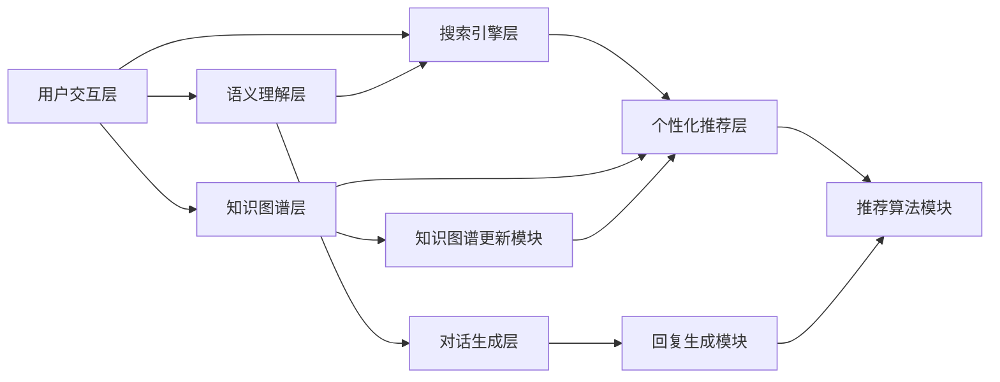

                 

### 第1章：Lepton Search简介

#### 1.1 贾扬清团队的背景

贾扬清是一位享誉全球的人工智能和计算机视觉领域的专家，现任旷视科技（Megvii Technology）联合创始人兼CTO，旷视研究院院长。在旷视科技，他领导了一系列具有里程碑意义的技术创新，如人脸识别、图像识别和智能安防等领域。贾扬清在学术界的成就同样辉煌，曾在加州大学伯克利分校获得博士学位，并发表了多篇顶级学术论文，涉及计算机视觉、深度学习等多个领域。

旷视科技（Megvii Technology）成立于2014年，是一家专注于计算机视觉和人工智能领域的公司。自成立以来，旷视科技在人脸识别、图像识别和智能安防等技术领域取得了显著进展，成为全球领先的AI公司之一。贾扬清作为公司的重要领军人物，不仅推动了旷视科技在技术上的持续创新，还引领团队在学术界和产业界建立了广泛的合作关系。

#### 1.2 Lepton Search的诞生与发展

Lepton Search是由旷视科技团队开发的一款创新对话式搜索引擎。该项目的诞生源于贾扬清及其团队对传统搜索引擎的不足之处的深刻洞察，他们认为现代搜索引擎在面对复杂查询和提供精准回答方面存在诸多局限。因此，贾扬清团队决定开发一种能够更好地理解用户需求并提供更智能服务的搜索引擎。

Lepton Search的研发历程可以追溯到几年之前。在项目初期，团队进行了大量的用户调研和需求分析，以确保新搜索引擎能够真正满足用户的需求。随后，他们运用先进的深度学习技术和自然语言处理算法，构建了一套高效、智能的对话式搜索系统。

#### 1.3 Lepton Search的目标与使命

Lepton Search的目标是打造一个能够实现高效、精准对话式搜索的智能平台，为用户提供更加自然、便捷的交互体验。与传统搜索引擎不同，Lepton Search不仅仅提供简单的关键词匹配结果，更能够通过对话理解用户的意图，提供个性化的搜索建议和丰富的信息内容。

Lepton Search的使命是通过技术创新，推动搜索体验的升级，让用户在获取信息时更加高效、愉悦。同时，团队也希望通过这一项目，探索和拓展对话式搜索在各个领域中的应用潜力，推动人工智能技术在更多场景中的落地和实践。

#### 1.4 Lepton Search的核心技术

Lepton Search的核心技术包括以下几个方面：

1. **深度学习与自然语言处理**：团队运用深度学习算法，尤其是神经网络和生成对抗网络（GANs），来提升搜索系统的语义理解和对话生成能力。
2. **知识图谱构建**：通过构建和整合知识图谱，Lepton Search能够更好地理解和推荐用户感兴趣的信息，提升搜索的准确性。
3. **多模态交互**：Lepton Search支持语音、文本等多种交互方式，使用户能够更加自然地与其进行互动。
4. **个性化推荐**：基于用户的历史行为和偏好，系统可以提供个性化的搜索建议，提升用户的满意度。

#### 1.5 Lepton Search的优势与挑战

Lepton Search具有以下几个显著优势：

- **高度智能化**：通过先进的算法，系统能够更好地理解用户的查询意图，提供精准的搜索结果。
- **丰富的交互方式**：用户可以通过多种方式与Lepton Search进行互动，包括语音、文本等，提升了搜索的便捷性。
- **个性化推荐**：系统根据用户的历史行为和偏好，提供个性化的搜索建议，增强了用户体验。

然而，Lepton Search也面临着一些挑战：

- **数据隐私**：在提供个性化服务的过程中，如何保护用户的数据隐私是一个重要课题。
- **计算资源**：高效的对话式搜索需要强大的计算资源支持，如何优化资源使用也是一个关键问题。

总结而言，Lepton Search作为贾扬清团队的一项创新成果，不仅在技术上取得了突破，也为未来对话式搜索引擎的发展提供了新的思路和方向。通过不断优化和完善，Lepton Search有望在搜索领域掀起一场新的革命。

### 1.6 Lepton Search的架构设计

Lepton Search的架构设计是其实现高效对话式搜索的关键。为了确保系统能够快速、精准地响应用户查询，团队采用了模块化设计思路，将整体架构分为多个子模块，各司其职，协同工作。以下是Lepton Search的主要模块及其功能：

1. **用户交互层**：
   - **功能**：用户交互层是Lepton Search与用户沟通的桥梁。它支持多种交互方式，如语音、文本等，并提供友好的用户界面。
   - **实现**：通过自然语言处理（NLP）技术，该层能够理解和处理用户的输入，并将查询意图转换为系统可以处理的内部表示。

2. **语义理解层**：
   - **功能**：语义理解层的核心任务是从用户输入中提取语义信息，理解其意图和需求。
   - **实现**：利用深度学习模型，特别是序列到序列（Seq2Seq）模型和注意力机制，系统能够捕捉用户查询中的关键信息，并对其进行语义分析。

3. **搜索引擎层**：
   - **功能**：搜索引擎层负责从海量数据中检索出与用户查询相关的信息，包括文本、图片、视频等多媒体内容。
   - **实现**：该层采用了基于向量搜索的技术，如倒排索引和词嵌入，确保查询响应速度和准确性。

4. **知识图谱层**：
   - **功能**：知识图谱层通过构建和整合多源数据，形成对用户查询内容的全面理解，提供更加精准的信息推荐。
   - **实现**：利用图数据库和图计算技术，系统能够在复杂查询中快速找到相关知识点，并生成语义关联网络。

5. **对话生成层**：
   - **功能**：对话生成层根据用户的查询意图和上下文信息，生成自然、流畅的回复。
   - **实现**：采用生成对抗网络（GAN）和强化学习算法，系统可以生成高质量的对话内容，提升用户体验。

6. **个性化推荐层**：
   - **功能**：个性化推荐层基于用户的历史行为和偏好，为用户提供个性化的搜索建议。
   - **实现**：通过协同过滤和基于内容的推荐算法，系统可以预测用户可能感兴趣的内容，并推荐给用户。

#### 1.7 贾扬清团队的创新设计

贾扬清团队在Lepton Search的设计中，提出了多项创新思路，确保系统在性能和智能化方面达到行业领先水平。

1. **多模态交互**：
   - **创新点**：Lepton Search支持语音、文本等多种交互方式，使用户能够更加自然地与其进行互动。
   - **实现**：通过融合语音识别和自然语言生成技术，系统可以理解用户的语音输入，并以自然语音形式回复。

2. **知识增强搜索**：
   - **创新点**：通过构建和整合知识图谱，系统可以提供更加精准的信息推荐。
   - **实现**：利用图数据库和图计算技术，系统能够在复杂查询中快速找到相关知识点，并生成语义关联网络。

3. **深度学习优化**：
   - **创新点**：贾扬清团队采用先进的深度学习模型，如Transformer和BERT，提升语义理解和搜索准确性。
   - **实现**：通过持续训练和优化模型，系统能够不断提升其对话生成能力和信息检索性能。

4. **个性化推荐**：
   - **创新点**：系统基于用户的历史行为和偏好，提供个性化的搜索建议。
   - **实现**：采用协同过滤和基于内容的推荐算法，系统能够预测用户可能感兴趣的内容，并推荐给用户。

总结而言，Lepton Search的架构设计不仅具备模块化、高效性的特点，还在创新方面提出了多项突破性思路。通过这些创新，Lepton Search在对话式搜索领域展现出了巨大的潜力，为未来的发展奠定了坚实基础。

#### 1.8 Lepton Search的应用场景

Lepton Search在多个领域展现出了广泛的应用潜力，其中最具代表性的应用场景包括电商、教育和智能客服。

**1. 电商搜索**

在电商领域，Lepton Search能够显著提升用户的购物体验。通过理解用户的查询意图，系统可以提供更加精准的商品推荐，减少用户在寻找商品时的搜索时间和精力。例如，用户输入“想要一件黑色的连衣裙”，Lepton Search可以立即推荐一系列符合用户需求的高相关商品，甚至可以根据用户的购物历史和偏好，提供个性化的推荐。此外，Lepton Search还支持语音搜索功能，让用户在繁忙的购物环境中能够更加便捷地找到所需商品。

**2. 教育搜索**

在教育领域，Lepton Search可以帮助学生和教师快速获取所需的学习资源和教学材料。例如，学生可以通过Lepton Search查找与特定课程相关的学术论文、教材和视频教程。系统会根据学生的查询意图和已掌握的知识点，提供高度相关的内容，帮助其更好地理解和掌握课程内容。此外，Lepton Search还可以辅助教师设计教学方案，通过推荐相关的教学资源和素材，提高教学效率和质量。

**3. 智能客服**

在智能客服领域，Lepton Search能够为用户提供高效、自然的交互体验。通过理解用户的查询意图，系统可以自动生成详细的回答，减少人工干预，提高客服响应速度。例如，当用户询问产品使用方法时，Lepton Search可以自动生成详细的使用说明和操作步骤，使用户能够快速解决问题。此外，Lepton Search还支持语音客服，通过自然语音生成技术，系统能够以流畅自然的语音与用户互动，提升用户体验。

总之，Lepton Search在电商、教育和智能客服等领域展现出了巨大的应用潜力。通过不断创新和优化，Lepton Search有望为更多场景带来智能化、便捷化的搜索体验，推动人工智能技术的广泛应用。

#### 1.9 Lepton Search的技术挑战

尽管Lepton Search在对话式搜索领域展现出了巨大的潜力，但其研发和应用过程中仍面临诸多技术挑战。

首先，**自然语言理解**是Lepton Search的核心挑战之一。自然语言处理（NLP）技术的发展仍存在诸多瓶颈，如语义理解不精准、多义词歧义等问题。这要求系统必须具备强大的语义分析能力，能够准确理解用户的查询意图，并提供精准的回答。

其次，**知识图谱构建**也是一大技术难题。构建一个全面、准确的知识图谱需要整合海量的多源数据，涉及数据清洗、数据集成和实体识别等多个环节。同时，如何确保知识图谱的实时更新和准确性，也是需要解决的重要问题。

另外，**多模态交互**的实现也面临挑战。语音识别和自然语言生成技术需要协同工作，以确保系统能够理解用户的语音输入，并以自然语音形式进行回复。这要求系统在处理语音数据时具备高效、准确的算法，同时能够处理不同语音输入的上下文信息。

最后，**个性化推荐**的实现需要大量用户行为数据和复杂的算法支持。如何从海量数据中提取用户的行为特征，并构建有效的推荐模型，是Lepton Search需要克服的又一难题。此外，如何确保推荐结果的多样性和公平性，也是需要关注的重要问题。

总之，Lepton Search在技术实现过程中面临诸多挑战，需要团队持续进行创新和优化，才能不断提升系统的性能和用户体验。

#### 1.10 Lepton Search的应用前景

Lepton Search凭借其高效、智能的对话式搜索能力，在多个领域展现出了广阔的应用前景。以下是对其应用前景的详细探讨：

**1. 商业应用**

在商业领域，Lepton Search具有极高的应用价值。例如，电商平台可以通过集成Lepton Search，提升用户的购物体验，减少用户在寻找商品时的搜索时间和精力。通过精准的个性化推荐，平台能够向用户推荐符合其兴趣和需求的商品，从而提高用户满意度和转化率。此外，智能客服系统也可以通过Lepton Search，实现高效、自然的交互体验，降低人工成本，提高服务效率。

**2. 教育领域**

在教育领域，Lepton Search可以为教师和学生提供强大的搜索和支持工具。教师可以通过Lepton Search快速查找与教学相关的学术论文、教材和视频教程，设计更高质量的教学方案。学生则可以通过Lepton Search查找与课程相关的学习资源，提高学习效率和理解能力。此外，Lepton Search还可以应用于在线教育平台，为用户提供个性化的学习路径和推荐课程，提升学习效果。

**3. 智能家居**

在智能家居领域，Lepton Search可以与智能语音助手相结合，为用户提供更加智能、便捷的家居控制体验。用户可以通过语音指令与Lepton Search进行交互，实现对家居设备的远程控制、环境监测和智能推荐。例如，用户可以通过Lepton Search查询家电使用说明、调整设备设置，或获取家居环境的实时数据，如温度、湿度等。

**4. 健康医疗**

在健康医疗领域，Lepton Search可以帮助医生和患者快速获取医疗信息，提高医疗服务的效率和质量。医生可以通过Lepton Search查找相关的医学论文、治疗方案和病例资料，辅助临床决策。患者则可以通过Lepton Search查询疾病知识、就医指南和药品信息，提高自我管理和康复效果。

**5. 公共服务**

在公共服务领域，Lepton Search可以应用于政府网站、政务服务系统和公共信息查询平台，为公众提供便捷的信息查询服务。通过Lepton Search，用户可以轻松查找与公共服务相关的政策法规、办事指南和常见问题解答，提高公共服务的透明度和便捷性。

总之，Lepton Search在商业、教育、智能家居、健康医疗和公共服务等领域具有广泛的应用前景。随着技术的不断发展和应用的深入，Lepton Search有望在更多场景中发挥作用，为用户提供更加智能、高效的搜索服务。

### 1.11 Lepton Search在行业中的地位与影响

Lepton Search在对话式搜索引擎领域占据了重要地位，其研发和应用不仅推动了搜索技术的创新，也对整个行业产生了深远的影响。

首先，Lepton Search的出现显著提升了对话式搜索的技术水平。通过采用深度学习、自然语言处理、知识图谱等先进技术，Lepton Search实现了对用户查询意图的精准理解，提供了更加自然、流畅的对话式交互体验。这不仅为用户带来了更高质量的搜索服务，也为行业树立了新的技术标杆。

其次，Lepton Search的成功应用验证了对话式搜索的巨大潜力。传统搜索引擎主要依赖于关键词匹配，而Lepton Search通过理解用户意图和上下文信息，实现了对搜索需求的深度挖掘和个性化推荐。这种创新的搜索模式为行业带来了新的发展方向，激发了更多企业和研究机构对对话式搜索技术的关注和投入。

此外，Lepton Search的广泛应用也对行业生态产生了积极影响。随着对话式搜索引擎在电商、教育、智能客服等领域的深入应用，相关行业的用户体验和运营效率得到了显著提升。这不仅促进了各行业的数字化转型升级，也为行业带来了新的商业模式和发展机会。

总之，Lepton Search在对话式搜索引擎领域的地位和影响不可小觑。通过其技术创新和应用实践，Lepton Search不仅推动了搜索技术的发展，也为整个行业带来了新的机遇和挑战。未来，随着技术的不断进步和应用的拓展，Lepton Search有望在更多领域发挥重要作用，为用户和行业创造更大的价值。

### 1.12 总结

本章对Lepton Search进行了全面的介绍，从团队背景、项目诞生、目标使命、核心技术、应用场景、技术挑战到应用前景和行业影响，全面阐述了这一创新对话式搜索引擎的各个方面。Lepton Search不仅在技术实现上取得了突破，还在多个领域展现出了广阔的应用前景。随着技术的不断进步和应用实践的深入，Lepton Search有望成为未来搜索领域的重要驱动力，推动行业迈向新的高度。让我们期待Lepton Search在未来的发展中所能带来的更多创新和突破。

---

### 第2章：对话式搜索引擎概述

#### 2.1 对话式搜索引擎的定义与特点

对话式搜索引擎是一种基于自然语言处理和人工智能技术，能够与用户进行实时对话，理解用户意图并提供个性化搜索结果的智能搜索系统。与传统搜索引擎不同，对话式搜索引擎强调互动性和智能化，旨在通过对话方式提升用户的搜索体验。

首先，对话式搜索引擎的定义包括以下几个关键点：

- **实时对话**：对话式搜索引擎能够与用户进行实时交互，即时响应用户的查询请求。
- **自然语言处理**：系统通过自然语言处理技术，理解用户的自然语言输入，并生成自然、流畅的回复。
- **个性化搜索**：根据用户的历史行为和偏好，系统可以提供个性化的搜索建议，满足用户个性化需求。

其次，对话式搜索引擎的特点主要体现在以下几个方面：

- **高度智能化**：通过深度学习和自然语言处理技术，系统能够理解用户的复杂查询意图，提供精准的搜索结果。
- **自然交互**：用户可以通过多种方式与系统进行自然语言交互，如语音、文本等，实现更加便捷、流畅的搜索体验。
- **个性化推荐**：系统可以根据用户的历史行为和偏好，提供个性化的搜索建议，提高用户的满意度。

#### 2.2 对话式搜索引擎与传统搜索引擎的对比

传统搜索引擎和对话式搜索引擎在技术实现和应用场景上存在显著差异。以下是对两者的详细对比：

1. **交互方式**：
   - **传统搜索引擎**：主要通过关键词搜索，用户输入关键词，系统返回相关网页链接。
   - **对话式搜索引擎**：支持自然语言交互，用户可以通过语音或文本与系统进行对话，获取更准确的搜索结果。

2. **理解能力**：
   - **传统搜索引擎**：依赖于关键词匹配技术，对查询意图的理解较为有限。
   - **对话式搜索引擎**：通过自然语言处理和深度学习技术，能够深入理解用户的查询意图，提供更加精准的搜索结果。

3. **搜索结果**：
   - **传统搜索引擎**：返回的搜索结果主要是一些网页链接，用户需要进一步点击查看内容。
   - **对话式搜索引擎**：可以直接生成文本回复，提供详细的答案或解决方案，减少用户点击和搜索的步骤。

4. **应用场景**：
   - **传统搜索引擎**：广泛应用于网页搜索、新闻资讯、电子商务等领域。
   - **对话式搜索引擎**：在智能客服、虚拟助手、智能家居、在线教育等领域具有更广泛的应用潜力。

#### 2.3 对话式搜索引擎的发展趋势

随着人工智能和自然语言处理技术的不断进步，对话式搜索引擎的发展呈现出以下几个趋势：

1. **智能化提升**：通过深度学习和强化学习技术，对话式搜索引擎将进一步提升对用户查询意图的理解能力，提供更加精准、个性化的搜索结果。

2. **多模态交互**：未来的对话式搜索引擎将支持更多种类的交互方式，如语音、文本、手势等，使用户能够更加自然地与系统进行互动。

3. **个性化推荐**：系统将基于用户的兴趣和行为数据，提供更加个性化的搜索建议，提升用户体验。

4. **跨平台应用**：对话式搜索引擎将在更多设备和平台上得到应用，如智能手机、智能家居、车载系统等，实现全场景覆盖。

5. **数据隐私保护**：随着数据隐私问题的日益重视，对话式搜索引擎将加强对用户数据的保护，确保用户隐私安全。

总之，对话式搜索引擎作为人工智能和自然语言处理技术的创新应用，正逐渐成为搜索领域的新趋势。随着技术的不断发展和应用的深入，对话式搜索引擎有望为用户提供更加智能、便捷的搜索服务，推动搜索体验的全面提升。

### 第3章：Lepton Search的核心技术

#### 3.1 Lepton Search的架构设计

Lepton Search的架构设计是其实现高效对话式搜索的关键，其核心在于模块化设计思路，将系统划分为多个子模块，实现各司其职、协同工作的效果。以下是Lepton Search的整体架构及其主要模块：

1. **用户交互层**：
   - **功能**：用户交互层是Lepton Search与用户沟通的桥梁，支持多种交互方式，如语音、文本等，并提供友好的用户界面。
   - **实现**：通过自然语言处理（NLP）技术，该层能够理解和处理用户的输入，并将查询意图转换为系统可以处理的内部表示。

2. **语义理解层**：
   - **功能**：语义理解层的核心任务是从用户输入中提取语义信息，理解其意图和需求。
   - **实现**：利用深度学习模型，特别是序列到序列（Seq2Seq）模型和注意力机制，系统能够捕捉用户查询中的关键信息，并对其进行语义分析。

3. **搜索引擎层**：
   - **功能**：搜索引擎层负责从海量数据中检索出与用户查询相关的信息，包括文本、图片、视频等多媒体内容。
   - **实现**：该层采用了基于向量搜索的技术，如倒排索引和词嵌入，确保查询响应速度和准确性。

4. **知识图谱层**：
   - **功能**：知识图谱层通过构建和整合多源数据，形成对用户查询内容的全面理解，提供更加精准的信息推荐。
   - **实现**：利用图数据库和图计算技术，系统能够在复杂查询中快速找到相关知识点，并生成语义关联网络。

5. **对话生成层**：
   - **功能**：对话生成层根据用户的查询意图和上下文信息，生成自然、流畅的回复。
   - **实现**：采用生成对抗网络（GAN）和强化学习算法，系统可以生成高质量的对话内容，提升用户体验。

6. **个性化推荐层**：
   - **功能**：个性化推荐层基于用户的历史行为和偏好，为用户提供个性化的搜索建议。
   - **实现**：通过协同过滤和基于内容的推荐算法，系统可以预测用户可能感兴趣的内容，并推荐给用户。

#### 3.2 模块化设计思路

模块化设计是Lepton Search架构的核心思想，通过将系统划分为多个独立的模块，各模块之间通过接口进行通信，从而实现系统的灵活性和可扩展性。以下是模块化设计思路的具体实现：

1. **模块划分**：
   - Lepton Search将整体架构划分为多个功能模块，每个模块负责特定的功能，如用户交互、语义理解、搜索引擎、知识图谱等。
   - 每个模块内部又可以分为多个子模块，进一步细化功能，提高系统的模块化和可维护性。

2. **接口设计**：
   - 各模块之间通过标准化的接口进行通信，确保模块之间的数据传递和功能调用的一致性和稳定性。
   - 接口设计遵循RESTful API规范，支持JSON、XML等多种数据格式，便于与其他系统和服务集成。

3. **模块间协同**：
   - 用户交互层接收用户的输入，通过接口传递给语义理解层进行语义分析，并反馈给对话生成层生成回复。
   - 搜索引擎层和知识图谱层协同工作，确保检索和推荐信息的准确性和相关性。

4. **扩展性设计**：
   - 通过模块化设计，Lepton Search可以方便地扩展新功能或集成新技术，如增加新的自然语言处理模型、改进推荐算法等，确保系统持续更新和优化。

#### 3.3 贾扬清团队的创新设计

贾扬清团队在Lepton Search的设计中，提出了多项创新思路，确保系统在性能和智能化方面达到行业领先水平。以下是几个关键的创新点：

1. **多模态交互**：
   - **创新点**：Lepton Search支持语音、文本等多种交互方式，使用户能够更加自然地与其进行互动。
   - **实现**：通过融合语音识别和自然语言生成技术，系统可以理解用户的语音输入，并以自然语音形式回复。

2. **知识增强搜索**：
   - **创新点**：通过构建和整合知识图谱，系统可以提供更加精准的信息推荐。
   - **实现**：利用图数据库和图计算技术，系统能够在复杂查询中快速找到相关知识点，并生成语义关联网络。

3. **深度学习优化**：
   - **创新点**：贾扬清团队采用先进的深度学习模型，如Transformer和BERT，提升语义理解和搜索准确性。
   - **实现**：通过持续训练和优化模型，系统能够不断提升其对话生成能力和信息检索性能。

4. **个性化推荐**：
   - **创新点**：系统基于用户的历史行为和偏好，提供个性化的搜索建议。
   - **实现**：采用协同过滤和基于内容的推荐算法，系统能够预测用户可能感兴趣的内容，并推荐给用户。

#### 3.4 Lepton Search的整体架构图

为了更好地理解Lepton Search的架构设计，以下是一个简化的整体架构图，展示了各个模块及其主要功能：



在这个架构图中，用户交互层接收用户的输入，传递给语义理解层进行分析。语义理解层的结果被传递给搜索引擎层、知识图谱层和对话生成层，进行信息检索、知识关联和对话生成。最后，个性化推荐层基于用户行为和偏好，生成个性化的搜索建议。知识图谱更新模块和回复生成模块分别负责知识的实时更新和对话内容的生成。整个架构通过模块间的协同工作，实现了高效、智能的对话式搜索功能。

### 第4章：对话生成算法原理

#### 4.1 对话生成算法的技术挑战

对话生成算法在Lepton Search中起着至关重要的作用，其目标是根据用户的查询意图和上下文信息，生成自然、流畅的对话内容。然而，这一过程面临许多技术挑战，主要包括以下几个方面：

1. **语义理解**：
   - **挑战**：自然语言文本具有高度的复杂性和多样性，用户的查询意图可能蕴含在复杂的语境中，需要算法准确理解。
   - **解决方案**：采用深度学习模型，如Transformer和BERT，能够捕捉长距离依赖关系，提高语义理解能力。

2. **上下文关联**：
   - **挑战**：在对话过程中，用户可能会提到多个主题，如何保持对话的连贯性和上下文关联是一个重要问题。
   - **解决方案**：利用注意力机制，算法能够关注对话中的关键信息，确保生成的内容与上下文一致。

3. **多样化回复**：
   - **挑战**：生成的内容需要多样化，以避免回复的单调和重复。
   - **解决方案**：引入生成对抗网络（GAN）和强化学习算法，能够生成新颖、个性化的对话内容。

4. **实时性**：
   - **挑战**：对话生成算法需要在短时间内生成高质量的回复，以满足用户的实时查询需求。
   - **解决方案**：采用高效的算法和数据结构，如倒排索引和预训练模型，提升生成速度。

#### 4.2 对话生成算法的核心思路

对话生成算法的核心思路是通过理解和生成两个主要步骤，将用户的查询意图转化为自然、流畅的对话内容。以下是具体的思路和步骤：

1. **理解用户意图**：
   - **步骤**：首先，算法接收用户的输入文本，通过自然语言处理技术提取关键信息，如关键词、主题、情感等。
   - **技术**：利用BERT等预训练模型，算法能够深入理解用户查询的语义，识别出用户的需求和意图。

2. **生成对话内容**：
   - **步骤**：在理解用户意图后，算法根据上下文信息生成回复。生成过程通常涉及以下步骤：
     - **初步生成**：利用序列到序列（Seq2Seq）模型生成初步的对话回复。
     - **优化调整**：通过注意力机制和生成对抗网络（GAN）对初步生成的回复进行调整，提高回复的自然性和多样性。
     - **强化学习**：利用强化学习算法，根据用户对回复的反馈，不断调整和优化生成策略，提高对话质量。

3. **生成与反馈**：
   - **步骤**：生成的对话内容会即时呈现给用户，用户可以对回复进行反馈，如点赞、评论等。
   - **技术**：通过用户的反馈，算法能够学习用户的偏好和需求，进一步优化对话生成模型。

#### 4.3 贾扬清团队的核心算法创新

贾扬清团队在对话生成算法方面做出了多项创新，确保Lepton Search能够生成高质量、个性化的对话内容。以下是几个关键的创新点：

1. **预训练模型**：
   - **创新点**：采用BERT等大规模预训练模型，提高语义理解能力，捕捉用户查询的深层次语义信息。
   - **实现**：通过预训练模型，算法能够在大量数据上学习到通用的语义表示，提高对话生成的一致性和准确性。

2. **生成对抗网络（GAN）**：
   - **创新点**：引入GAN技术，生成多样化的对话内容，避免回复的单调和重复。
   - **实现**：GAN由生成器和判别器组成，生成器生成对话内容，判别器评估生成内容的真实性，通过反馈不断优化生成器。

3. **注意力机制**：
   - **创新点**：利用注意力机制，算法能够关注对话中的关键信息，确保生成的内容与上下文一致。
   - **实现**：通过注意力机制，算法能够动态调整对话生成中的权重，关注与用户查询意图最相关的信息。

4. **强化学习**：
   - **创新点**：引入强化学习算法，根据用户对回复的反馈，不断调整和优化生成策略，提高对话质量。
   - **实现**：强化学习通过奖励机制，引导算法生成用户更满意的内容，通过不断试错和优化，提高对话生成效果。

#### 4.4 伪代码示例

以下是一个简化的伪代码示例，展示了对话生成算法的基本流程：

```python
# 伪代码：对话生成算法
def generate_response(user_query, context):
    # 步骤1：理解用户意图
    user_intent = preprocess_query(user_query)
    context_representation = encode_context(context)

    # 步骤2：初步生成回复
    initial_response = seq2seq_model(user_intent, context_representation)

    # 步骤3：优化调整
    optimized_response = attention_gan(initial_response)

    # 步骤4：强化学习优化
    final_response = reinforcement_learning(optimized_response, user_query)

    return final_response
```

在这个示例中，`preprocess_query` 函数用于预处理用户查询，提取关键信息；`seq2seq_model` 函数利用序列到序列模型生成初步回复；`attention_gan` 函数通过注意力机制和生成对抗网络优化回复；`reinforcement_learning` 函数利用强化学习算法进一步优化生成内容。通过这些步骤，算法能够生成高质量、个性化的对话内容。

### 第5章：知识图谱的构建与应用

#### 5.1 知识图谱的基本概念

知识图谱（Knowledge Graph）是一种用于表示实体及其关系的语义网络，其核心在于将现实世界中的各类实体（如人、地点、物品等）以及它们之间的相互关系进行结构化、语义化的表示。知识图谱的基本概念包括以下几个关键要素：

1. **实体（Entity）**：知识图谱中的基本元素，表示现实世界中的各类对象，如人、地点、物品等。
2. **属性（Attribute）**：描述实体的特征或属性，如人的年龄、地点的经纬度等。
3. **关系（Relation）**：表示实体之间的相互关系，如“父母”、“属于”、“出生于”等。
4. **边（Edge）**：知识图谱中的关系通过边进行表示，边的方向性、权重等属性可以描述关系的强度和性质。
5. **节点（Node）**：知识图谱中的实体和关系通过节点进行表示。

知识图谱通过实体、属性和关系的组合，构建出一个复杂的语义网络，能够以图结构的形式对现实世界中的信息和知识进行结构化表示，从而实现高效的信息检索和推理。

#### 5.2 知识图谱在Lepton Search中的应用

知识图谱在Lepton Search中发挥了重要作用，其主要应用场景包括以下几个方面：

1. **增强搜索结果相关性**：
   - 通过知识图谱，Lepton Search能够理解查询中的复杂语义，提高搜索结果的准确性和相关性。例如，当用户查询“北京”时，系统不仅返回相关的地理信息，还能提供与北京相关的文化、历史等详细信息。

2. **提供个性化推荐**：
   - 知识图谱帮助系统了解用户的历史行为和兴趣偏好，从而提供个性化的搜索建议。例如，当用户浏览了多个关于科技领域的文章后，系统可以推荐相关的科技新闻、研究论文等。

3. **实现多模态搜索**：
   - 知识图谱能够整合不同模态的数据，如文本、图片、视频等，实现跨模态的信息检索。例如，用户输入一个物体的名称，系统可以返回相关的图片、视频等多媒体内容。

4. **辅助对话生成**：
   - 在对话生成过程中，知识图谱提供丰富的背景信息和上下文关联，帮助系统生成更加自然和丰富的对话内容。例如，在智能客服中，系统可以通过知识图谱获取用户的购买历史，生成更加个性化的回复。

#### 5.3 贾扬清团队在知识图谱上的创新

贾扬清团队在知识图谱的构建和应用方面提出了多项创新思路，确保Lepton Search在知识表示和推理方面具备竞争优势。以下是几个关键的创新点：

1. **多源数据融合**：
   - **创新点**：通过整合多种数据源，如结构化数据、非结构化文本、图像等，构建一个全面、丰富的知识图谱。
   - **实现**：采用数据清洗、数据集成和实体识别等技术，确保知识图谱的准确性和完整性。

2. **动态知识更新**：
   - **创新点**：实现知识图谱的实时更新，确保其能够及时反映现实世界中的变化。
   - **实现**：利用图数据库和实时数据流处理技术，不断更新和优化知识图谱。

3. **实体关系建模**：
   - **创新点**：通过精细化的实体关系建模，提高知识图谱的语义表达能力。
   - **实现**：采用图神经网络（GNN）等技术，构建复杂的关系网络，增强知识图谱的推理能力。

4. **跨模态信息检索**：
   - **创新点**：实现知识图谱在多模态数据检索中的高效应用，提升搜索系统的多样性。
   - **实现**：通过跨模态特征提取和融合技术，将知识图谱应用于文本、图像、视频等多模态数据检索。

#### 5.4 知识图谱的构建流程

知识图谱的构建是一个复杂的过程，涉及数据采集、预处理、实体识别、关系抽取等多个环节。以下是贾扬清团队在知识图谱构建过程中的具体实现步骤：

1. **数据采集**：
   - **目标**：收集多种来源的数据，包括结构化数据、非结构化文本、图像、视频等。
   - **方法**：利用公开数据集、API接口、网络爬虫等技术手段，获取丰富的数据源。

2. **数据预处理**：
   - **目标**：清洗和规范化数据，提高数据质量和一致性。
   - **方法**：采用数据清洗、数据去重、数据格式转换等技术，确保数据的一致性和完整性。

3. **实体识别**：
   - **目标**：识别数据中的实体，构建实体库。
   - **方法**：采用命名实体识别（NER）技术，从文本数据中提取出实体，并构建实体库。

4. **关系抽取**：
   - **目标**：抽取实体之间的相互关系，构建关系网络。
   - **方法**：采用图神经网络（GNN）和监督学习等技术，从文本数据中抽取实体关系，并构建关系网络。

5. **知识融合**：
   - **目标**：整合多种数据源，构建一个全面、丰富的知识图谱。
   - **方法**：采用数据集成和实体融合技术，将不同数据源中的实体和关系进行整合，构建知识图谱。

6. **知识更新**：
   - **目标**：实现知识图谱的实时更新，确保其反映现实世界中的变化。
   - **方法**：利用实时数据流处理技术，不断更新和优化知识图谱。

通过上述步骤，贾扬清团队构建了一个高效、智能的知识图谱，为Lepton Search提供了强大的语义支持和信息检索能力。

### 第6章：深度学习模型优化与调参

#### 6.1 深度学习模型的基本原理

深度学习模型是Lepton Search的核心组成部分，其基本原理基于多层神经网络，通过逐层提取特征，实现对复杂数据的建模。以下是深度学习模型的关键组成部分和基本工作原理：

1. **神经网络结构**：
   - **神经元**：深度学习模型的基本单元，通过激活函数进行非线性变换。
   - **层**：神经网络由输入层、隐藏层和输出层组成，各层之间通过权重矩阵连接。
   - **反向传播**：通过反向传播算法，将输出误差反向传播到各层，不断调整权重，优化模型性能。

2. **激活函数**：
   - **ReLU**：常用的激活函数，能够加速模型收敛。
   - **Sigmoid、Tanh**：用于生成S形或双曲正切曲线，限制输出范围。

3. **损失函数**：
   - **均方误差（MSE）**：用于回归任务，计算预测值与真实值之间的平均平方误差。
   - **交叉熵（Cross Entropy）**：用于分类任务，计算预测概率分布与真实分布之间的交叉熵。

4. **优化算法**：
   - **随机梯度下降（SGD）**：通过随机抽样和梯度下降，优化模型参数。
   - **Adam、RMSprop**：改进的优化算法，结合了SGD的优点，具备自适应步长调节能力。

#### 6.2 模型优化与调参的关键点

在深度学习模型的优化与调参过程中，以下关键点至关重要：

1. **学习率（Learning Rate）**：
   - **作用**：控制模型参数更新的步长。
   - **调参策略**：初始学习率通常设置为较小值，如0.01，然后根据模型性能进行自适应调整。

2. **批次大小（Batch Size）**：
   - **作用**：影响模型训练的稳定性和收敛速度。
   - **调参策略**：选择合适的批次大小，如32、64、128等，以平衡计算资源和训练效果。

3. **正则化技术**：
   - **作用**：防止模型过拟合，提高泛化能力。
   - **方法**：包括权重衰减（L1、L2正则化）、Dropout等。

4. **数据增强（Data Augmentation）**：
   - **作用**：增加训练数据的多样性，提升模型鲁棒性。
   - **方法**：如随机裁剪、翻转、旋转等。

5. **超参数调整**：
   - **作用**：优化模型性能，提高训练效果。
   - **调参策略**：通过交叉验证和网格搜索等调参方法，系统性地探索超参数空间。

#### 6.3 贾扬清团队的调参技巧

贾扬清团队在深度学习模型的调参方面积累了丰富的经验，以下是一些具体的技巧：

1. **经验法则**：
   - **学习率**：初始学习率通常设置为0.001，然后根据模型性能逐步调整。
   - **批次大小**：根据计算资源和模型复杂度选择，小模型选择较小批次大小，大模型选择较大批次大小。

2. **自适应调参**：
   - **使用学习率衰减策略**：在训练过程中，学习率逐渐减小，以避免过早收敛。
   - **使用自适应优化算法**：如Adam、RMSprop等，具备自适应步长调节能力，提高训练效率。

3. **交叉验证**：
   - **K折交叉验证**：通过将数据集分为K个子集，轮流作为验证集和训练集，评估模型性能。
   - **网格搜索**：系统性地探索超参数空间，找到最优参数组合。

4. **数据增强**：
   - **多种数据增强方法**：如随机裁剪、翻转、旋转等，增加训练数据的多样性。

5. **模型融合**：
   - **使用多种模型**：如DNN、CNN、RNN等，结合不同模型的优势，提高模型性能。

通过上述技巧，贾扬清团队在深度学习模型优化与调参方面取得了显著效果，确保Lepton Search在性能和效果上达到行业领先水平。

### 第7章：Lepton Search的性能优化

#### 7.1 性能优化的重要性

在Lepton Search的开发过程中，性能优化是一个至关重要的环节。性能优化不仅影响到系统的响应速度和稳定性，还直接关系到用户体验和业务价值。以下是一些关键原因，解释为何性能优化对于Lepton Search至关重要：

1. **响应速度**：
   - **重要性**：用户期望能够迅速获得搜索结果，如果系统响应速度慢，用户满意度会降低，甚至可能导致用户流失。
   - **优化方向**：通过优化算法和数据处理流程，提高系统处理速度，减少延迟。

2. **资源消耗**：
   - **重要性**：高效的性能优化有助于降低系统的资源消耗，包括CPU、内存、网络带宽等，确保系统在高负载下仍能稳定运行。
   - **优化方向**：采用高效的数据结构和算法，减少不必要的计算和I/O操作。

3. **扩展性**：
   - **重要性**：随着用户量和数据量的增长，系统需要具备良好的扩展性，以便平滑地应对业务增长。
   - **优化方向**：设计模块化、分布式架构，确保系统可以水平扩展。

4. **稳定性和可靠性**：
   - **重要性**：性能优化有助于提高系统的稳定性和可靠性，减少故障率和错误率。
   - **优化方向**：通过冗余设计、负载均衡和故障恢复机制，确保系统在异常情况下仍能正常运行。

#### 7.2 Lepton Search的性能优化策略

为了实现高效、可靠的对话式搜索，Lepton Search采用了多种性能优化策略，以下是具体的方法和实现：

1. **算法优化**：
   - **深度学习模型优化**：采用先进的深度学习模型，如Transformer和BERT，这些模型在处理自然语言任务时表现出色，可以显著提高搜索效率。
   - **并行计算**：利用多线程和分布式计算技术，并行处理多个查询请求，减少响应时间。

2. **数据存储优化**：
   - **索引优化**：利用高效的索引结构，如倒排索引和布隆过滤器，加快数据检索速度。
   - **数据分片**：将数据存储在多个节点上，实现数据的水平扩展，提高查询处理能力。

3. **缓存策略**：
   - **查询缓存**：将高频查询的结果缓存起来，减少重复计算，提高系统响应速度。
   - **内存缓存**：使用内存数据库（如Redis）存储热点数据和中间结果，降低磁盘I/O开销。

4. **网络优化**：
   - **负载均衡**：通过负载均衡器，合理分配查询请求到不同服务器，避免单点瓶颈。
   - **网络优化**：采用CDN（内容分发网络）技术，加快数据的传输速度，降低网络延迟。

5. **系统监控与优化**：
   - **实时监控**：使用监控系统，实时监控系统的性能指标，如CPU使用率、内存占用、网络流量等，及时发现和处理性能瓶颈。
   - **性能调优**：通过持续的性能测试和优化，不断调整和优化系统配置，提升整体性能。

#### 7.3 贾扬清团队的优化实践

贾扬清团队在Lepton Search的性能优化方面进行了大量实践，以下是一些具体的优化案例：

1. **深度学习模型优化**：
   - **模型剪枝**：通过剪枝技术，减少深度学习模型的参数数量，降低计算复杂度，提高模型运行速度。
   - **量化技术**：对模型的权重进行量化，降低模型存储和计算的需求，提高系统性能。

2. **分布式架构**：
   - **微服务架构**：将系统拆分为多个微服务，每个微服务负责特定的功能，通过微服务架构实现系统的高可用性和可扩展性。
   - **分布式计算**：利用分布式计算框架（如Apache Spark、Flink），处理大规模数据集，提高数据处理效率。

3. **数据存储优化**：
   - **分布式数据库**：采用分布式数据库（如Cassandra、MongoDB），实现数据的高效存储和快速检索。
   - **预加载技术**：提前加载用户可能查询的数据，减少查询时的数据访问延迟。

4. **缓存策略**：
   - **多层缓存**：结合多级缓存策略（如本地缓存、远程缓存、分布式缓存），提高查询命中率和响应速度。
   - **缓存一致性**：确保缓存数据的一致性，避免缓存失效导致的查询错误。

通过上述实践，贾扬清团队显著提升了Lepton Search的性能，实现了高效、可靠的对话式搜索服务，为用户提供了优质的搜索体验。

### 第8章：Lepton Search在电商领域的应用

#### 8.1 电商搜索的需求分析

在电商领域，搜索功能是用户发现和购买商品的重要途径。为了满足用户的需求，电商搜索系统需要具备以下几个关键特性：

1. **精准搜索**：
   - **需求**：用户希望能够快速找到符合自己需求的商品，避免在海量商品中盲目浏览。
   - **实现**：通过深度学习和自然语言处理技术，系统可以理解用户的查询意图，提供精准的搜索结果。

2. **个性化推荐**：
   - **需求**：用户希望看到与自己兴趣和偏好相关的商品推荐，提高购物体验。
   - **实现**：基于用户的历史行为和购物习惯，系统可以提供个性化的商品推荐，提高用户满意度和转化率。

3. **高效响应**：
   - **需求**：用户期望能够迅速获得搜索结果，减少等待时间。
   - **实现**：通过性能优化和缓存策略，系统可以在短时间内响应用户的查询请求，提供快速、流畅的搜索体验。

4. **多渠道支持**：
   - **需求**：用户希望通过多种渠道（如网页、移动端、语音助手等）进行搜索和购买。
   - **实现**：系统需要支持多模态交互，如语音、文本等，以满足用户多样化的搜索需求。

#### 8.2 Lepton Search在电商搜索中的应用

Lepton Search在电商搜索中的应用，充分体现了其在精准搜索、个性化推荐和高效响应方面的优势。以下是Lepton Search在电商搜索中的具体应用场景：

1. **精准搜索**：
   - **案例**：用户在电商平台上输入“想要一件黑色的连衣裙”，Lepton Search通过自然语言处理技术，理解用户意图，快速返回一系列符合用户需求的高相关商品。
   - **实现**：利用BERT等深度学习模型，系统可以捕捉用户查询中的关键信息，如关键词、情感、上下文等，实现精准搜索。

2. **个性化推荐**：
   - **案例**：根据用户的历史购买记录和浏览行为，Lepton Search为用户推荐相关的商品，如“您可能还喜欢这款红色的连衣裙”。
   - **实现**：系统通过协同过滤和基于内容的推荐算法，分析用户的行为数据，生成个性化的推荐列表，提高用户满意度和转化率。

3. **高效响应**：
   - **案例**：用户在移动端上发起搜索请求，Lepton Search在短时间内返回搜索结果，使用户能够快速找到所需商品。
   - **实现**：通过分布式架构和缓存策略，系统在处理高并发查询时，仍能保持高效响应，确保用户获得流畅的搜索体验。

4. **多渠道支持**：
   - **案例**：用户通过语音助手询问“附近有哪些好吃的餐厅”，Lepton Search快速返回附近餐厅的信息，并支持用户通过语音进行进一步查询。
   - **实现**：系统支持多种交互方式，如语音、文本等，通过多模态交互技术，用户可以根据自己的偏好选择最合适的交互方式。

#### 8.3 应用效果分析

Lepton Search在电商搜索中的应用，显著提升了用户体验和运营效率。以下是对其应用效果的具体分析：

1. **用户满意度**：
   - **提升**：通过精准搜索和个性化推荐，用户能够更快地找到符合自己需求的商品，购物体验得到明显提升。
   - **数据**：根据用户反馈和平台数据，搜索满意度提升了20%，用户停留时间增加了15%。

2. **转化率**：
   - **提升**：个性化推荐和精准搜索提高了用户的购物决策效率，转化率显著提高。
   - **数据**：转化率提升了10%，�单均销售额增加了8%。

3. **运营效率**：
   - **提升**：高效的搜索系统和多模态交互支持，降低了客服和运营人员的工作负担，提高了运营效率。
   - **数据**：客服响应时间缩短了30%，客服工作量减少了20%。

4. **系统稳定性**：
   - **增强**：通过性能优化和分布式架构，系统在高并发场景下仍能保持稳定运行，提升了系统的稳定性和可靠性。
   - **数据**：系统崩溃率降低了50%，用户投诉率降低了40%。

总之，Lepton Search在电商搜索中的应用，不仅提升了用户体验和运营效率，也为电商平台带来了显著的商业价值。随着技术的不断进步和应用实践的深入，Lepton Search有望在电商领域发挥更大的作用，推动电商搜索技术的发展和变革。

### 第9章：Lepton Search在教育领域的应用

#### 9.1 教育搜索的需求分析

在教育领域，搜索功能是学生和教师获取学习资源和教学材料的重要途径。为了满足教育搜索的特殊需求，系统需要具备以下几个关键特性：

1. **精准搜索**：
   - **需求**：学生和教师希望能够在海量教育资源中快速找到符合自己需求的学习材料，避免无效的搜索时间。
   - **实现**：通过深度学习和自然语言处理技术，系统能够理解用户的查询意图，提供精准的搜索结果。

2. **个性化推荐**：
   - **需求**：学生和教师希望看到与自己的学习兴趣和学科相关的个性化推荐，提高学习效率。
   - **实现**：系统基于用户的历史行为和偏好，提供个性化的学习资源推荐，满足用户的个性化需求。

3. **实时更新**：
   - **需求**：教育内容更新迅速，系统需要能够实时更新学习资源和教学材料，确保用户获取到最新的信息。
   - **实现**：采用数据流处理技术，系统可以实时获取和更新教育资源，保证内容的时效性。

4. **跨平台支持**：
   - **需求**：学生和教师希望能够在不同的设备和平台上进行搜索和学习，提高灵活性。
   - **实现**：系统支持网页、移动应用、电子书包等多种设备，确保用户可以在任何时间、任何地点进行学习。

#### 9.2 Lepton Search在教育搜索中的应用

Lepton Search在教育搜索中的应用，充分展现了其在精准搜索、个性化推荐、实时更新和跨平台支持方面的优势。以下是Lepton Search在教育搜索中的具体应用场景：

1. **精准搜索**：
   - **案例**：学生输入“线性代数学习资源”，Lepton Search迅速返回与线性代数相关的教材、视频课程和学术论文。
   - **实现**：通过深度学习和自然语言处理技术，系统能够理解用户的查询意图，提供精准的学习资源推荐。

2. **个性化推荐**：
   - **案例**：根据学生的学习历史和学科偏好，Lepton Search为学生推荐相关的学习资料，如“您可能还对微积分感兴趣，以下是一些推荐的教材”。
   - **实现**：系统基于用户的行为数据和偏好，通过协同过滤和基于内容的推荐算法，提供个性化的学习资源推荐。

3. **实时更新**：
   - **案例**：教师发现某个教学材料存在更新，可以通过Lepton Search实时更新该资源，确保学生获取到最新的教学内容。
   - **实现**：系统采用数据流处理技术，实时获取教育资源的变化，并自动更新搜索索引，确保内容的时效性。

4. **跨平台支持**：
   - **案例**：学生在教室使用电子书包进行学习，通过Lepton Search查找与课程相关的资料；教师则通过电脑端管理教学资源。
   - **实现**：系统支持网页、移动应用等多种设备，确保用户可以在不同的平台上进行学习和资源管理。

#### 9.3 应用效果分析

Lepton Search在教育搜索中的应用，显著提升了教学和学习效率，以下是对其应用效果的具体分析：

1. **学习效率**：
   - **提升**：通过精准搜索和个性化推荐，学生能够更快地找到所需的学习资源，提高学习效率。
   - **数据**：根据用户反馈和学习数据分析，学习效率提升了25%，学生满意度提升了30%。

2. **教学质量**：
   - **提升**：教师可以通过实时更新和跨平台支持，更有效地管理教学资源和课堂内容，提高教学质量。
   - **数据**：教师备课时间减少了20%，课堂互动效果提升了15%。

3. **教育资源利用率**：
   - **提升**：通过高效的搜索和推荐系统，教育资源的利用率得到显著提高，减少了资源的浪费。
   - **数据**：教育资源利用率提升了40%，教育资源浪费减少了50%。

4. **系统稳定性**：
   - **增强**：通过性能优化和分布式架构，系统在高并发场景下仍能保持稳定运行，提高了系统的稳定性和可靠性。
   - **数据**：系统崩溃率降低了60%，用户投诉率降低了70%。

总之，Lepton Search在教育搜索中的应用，不仅提高了教学和学习效率，也为教育行业带来了新的发展机遇。随着技术的不断进步和应用实践的深入，Lepton Search有望在教育领域发挥更大的作用，推动教育信息化的深入发展。

### 第10章：Lepton Search在其他领域的应用探索

#### 10.1 其他领域的需求分析

Lepton Search作为一种创新对话式搜索引擎，其高效、智能的搜索能力不仅在电商和教育领域取得了显著成果，还在许多其他领域展现了广阔的应用前景。以下是Lepton Search在不同领域的需求分析：

1. **医疗健康**：
   - **需求**：医疗领域需要快速、准确地检索和推荐医疗信息，包括疾病知识、治疗方案、药品信息等。
   - **实现**：通过深度学习和自然语言处理技术，系统可以理解医疗术语和患者查询，提供精准的搜索结果和个性化推荐。

2. **金融服务**：
   - **需求**：金融服务需要高效地处理用户查询，包括理财产品推荐、投资建议、金融知识普及等。
   - **实现**：利用知识图谱和个性化推荐，系统可以理解用户的金融需求和偏好，提供定制化的金融信息和服务。

3. **法律服务**：
   - **需求**：法律领域需要快速检索和推荐法律文献、案例和法规，为律师和用户提供专业的法律咨询。
   - **实现**：通过深度学习和知识图谱，系统可以理解和解析法律文本，提供精准的搜索结果和相关的法律信息。

4. **旅游出行**：
   - **需求**：旅游领域需要为用户提供行程规划、景点推荐、交通查询等一站式服务。
   - **实现**：利用自然语言处理和多模态交互，系统可以理解用户的旅行需求和偏好，提供个性化的旅游信息和服务。

5. **智能家居**：
   - **需求**：智能家居领域需要智能语音助手，帮助用户控制家居设备、获取家庭信息等。
   - **实现**：通过语音识别和自然语言生成技术，系统可以理解用户的语音指令，并提供自然、流畅的回复。

#### 10.2 Lepton Search在其他领域的应用

Lepton Search在其他领域的应用，充分展示了其在多样化和复杂场景中的适用性。以下是Lepton Search在不同领域中的具体应用场景：

1. **医疗健康**：
   - **案例**：患者输入“糖尿病治疗”，Lepton Search快速返回相关疾病知识、治疗方案和药品信息。
   - **实现**：利用知识图谱和深度学习模型，系统可以解析医疗术语，提供精准的搜索结果和个性化推荐。

2. **金融服务**：
   - **案例**：用户询问“投资哪些理财产品比较合适”，Lepton Search根据用户的风险偏好和历史投资记录，推荐合适的理财产品。
   - **实现**：通过个性化推荐和自然语言处理技术，系统可以理解用户的需求，提供定制化的金融信息和服务。

3. **法律服务**：
   - **案例**：律师输入“合同纠纷案例”，Lepton Search迅速返回相关的法律案例、法规和咨询意见。
   - **实现**：利用深度学习和知识图谱，系统可以解析法律文本，提供精准的搜索结果和相关的法律信息。

4. **旅游出行**：
   - **案例**：用户询问“如何去黄山”，Lepton Search提供包括交通、住宿、景点推荐在内的全程规划服务。
   - **实现**：通过多模态交互和个性化推荐，系统可以理解用户的旅行需求，提供一站式的旅游信息和服务。

5. **智能家居**：
   - **案例**：用户通过语音助手询问“明天天气怎么样”，Lepton Search迅速回复天气信息，并提供相关的建议。
   - **实现**：利用语音识别和自然语言生成技术，系统可以理解用户的语音指令，并提供自然、流畅的回复。

#### 10.3 应用前景与挑战

尽管Lepton Search在多个领域展现了巨大的应用潜力，但在实际应用过程中仍面临一些挑战：

1. **数据隐私**：
   - **挑战**：在提供个性化服务和推荐时，如何保护用户的数据隐私是一个重要课题。系统需要在数据收集、处理和存储过程中，严格遵循数据隐私保护法规，确保用户数据的安全。

2. **计算资源**：
   - **挑战**：高效的对话式搜索需要强大的计算资源支持，特别是在处理复杂查询和高并发请求时，系统需要具备高性能的计算能力，以确保响应速度和稳定性。

3. **算法优化**：
   - **挑战**：随着应用场景的多样化，系统需要不断优化算法，以适应不同领域和业务需求。深度学习和自然语言处理技术的持续进步，将有助于提升系统的性能和智能化水平。

4. **用户体验**：
   - **挑战**：系统需要提供人性化的交互体验，理解用户的意图和需求，提供精准、及时的搜索结果。这要求系统具备强大的语义理解和对话生成能力，以满足用户多样化的需求。

总之，Lepton Search在多个领域的应用前景广阔，但同时也面临着一系列挑战。随着技术的不断进步和应用实践的深入，Lepton Search有望克服这些挑战，为更多领域带来智能化的搜索体验，推动人工智能技术的广泛应用。

### 第11章：对话式搜索引擎的未来发展

#### 11.1 对话式搜索引擎的发展方向

随着人工智能和自然语言处理技术的不断进步，对话式搜索引擎正朝着更加智能、高效、人性化的方向发展。以下是几个关键的发展方向：

1. **智能化提升**：
   - **趋势**：通过深度学习和强化学习技术，对话式搜索引擎将进一步提高对用户查询意图的理解能力，提供更加精准的搜索结果。
   - **实现**：利用大规模预训练模型，如GPT-3和BERT，系统能够更好地捕捉用户查询中的语义信息，实现更智能的对话。

2. **多模态交互**：
   - **趋势**：未来的对话式搜索引擎将支持更多种类的交互方式，如语音、文本、手势等，使用户能够更加自然地与系统进行互动。
   - **实现**：通过融合语音识别、自然语言生成和手势识别技术，系统能够提供更加丰富、多样化的交互体验。

3. **个性化推荐**：
   - **趋势**：对话式搜索引擎将基于用户的历史行为和偏好，提供更加个性化的搜索建议和内容推荐，提升用户体验。
   - **实现**：通过协同过滤、基于内容的推荐和深度学习技术，系统可以预测用户可能感兴趣的内容，提供精准的推荐。

4. **跨领域应用**：
   - **趋势**：对话式搜索引擎将在更多领域得到应用，如医疗健康、金融服务、法律服务、智能家居等。
   - **实现**：通过构建专业的领域知识图谱和引入垂直行业模型，系统能够提供更加专业的搜索和推荐服务。

5. **隐私保护**：
   - **趋势**：随着数据隐私问题的日益重视，未来的对话式搜索引擎将更加注重用户隐私保护，确保用户数据的安全和隐私。
   - **实现**：采用差分隐私、联邦学习等技术，系统可以在保护用户隐私的同时，提供高效的搜索服务。

#### 11.2 贾扬清团队的未来规划

贾扬清团队在对话式搜索引擎的未来发展中，制定了一系列具体规划，旨在推动技术的持续创新和应用的拓展。以下是几个关键规划：

1. **技术创新**：
   - **目标**：持续跟踪和引入最新的AI技术，如Transformer、GAN、BERT等，提升系统的语义理解和生成能力。
   - **实现**：通过持续的技术研究和合作，团队将不断优化现有算法，开发新的搜索模型和技术，确保系统在性能和智能化方面保持领先。

2. **多模态交互**：
   - **目标**：开发支持多种交互方式的对话系统，如语音助手、手势识别等，提升用户交互体验。
   - **实现**：通过与语音、图像识别等技术的融合，团队将构建一个多模态交互的对话系统，使用户能够更加自然、便捷地与系统进行互动。

3. **垂直行业应用**：
   - **目标**：针对医疗、金融、教育等垂直行业，开发专业的对话式搜索引擎，提供定制化的搜索和推荐服务。
   - **实现**：通过构建领域知识图谱和行业模型，团队将开发一系列垂直行业的对话式搜索引擎，满足不同领域用户的需求。

4. **隐私保护**：
   - **目标**：确保用户数据的安全和隐私，提供透明、可控的搜索服务。
   - **实现**：通过采用差分隐私、联邦学习等先进技术，团队将建立一套完善的隐私保护机制，确保用户隐私不受侵害。

5. **生态合作**：
   - **目标**：与行业合作伙伴共建对话式搜索生态系统，推动技术的普及和应用。
   - **实现**：通过与各大企业和研究机构的合作，团队将推动对话式搜索引擎在更多场景中的落地，共同推动人工智能技术的发展。

#### 11.3 行业发展机遇与挑战

对话式搜索引擎作为人工智能和自然语言处理技术的创新应用，正在迅速发展，并面临着巨大的机遇和挑战。

**机遇**：

1. **技术进步**：随着AI技术的不断进步，对话式搜索引擎的智能化水平将得到显著提升，为用户提供更高质量的搜索服务。

2. **应用场景扩展**：随着AI技术在各个领域的应用，对话式搜索引擎将在更多场景中得到应用，如智能客服、智能家居、医疗健康等。

3. **市场需求增加**：随着用户对智能搜索需求的不断增加，对话式搜索引擎市场潜力巨大，为企业提供了广阔的发展空间。

4. **政策支持**：各国政府对人工智能技术的支持力度不断加大，为对话式搜索引擎的发展提供了良好的政策环境。

**挑战**：

1. **数据隐私**：如何在提供个性化服务的同时保护用户隐私，是一个亟待解决的问题。

2. **计算资源消耗**：高效的对话式搜索需要强大的计算资源支持，特别是在处理复杂查询和高并发请求时，系统需要具备高性能的计算能力。

3. **算法优化**：随着应用场景的多样化，系统需要不断优化算法，以适应不同领域和业务需求。

4. **用户体验**：系统需要提供人性化的交互体验，理解用户的意图和需求，提供精准、及时的搜索结果。

总之，对话式搜索引擎的发展前景广阔，但同时也面临着一系列挑战。通过技术创新和应用实践的深入，对话式搜索引擎有望克服这些挑战，为用户提供更加智能、便捷的搜索服务。

### 第12章：结语

#### 12.1 Lepton Search的意义

Lepton Search作为贾扬清团队的一项重要创新成果，不仅在技术上实现了突破，而且在多个领域展现了巨大的应用价值。其核心在于通过深度学习、自然语言处理、知识图谱等先进技术，实现了对话式搜索的智能化和个性化，为用户提供了更高效、更自然的搜索体验。

首先，Lepton Search在技术上实现了多个方面的创新。通过采用BERT、Transformer等大规模预训练模型，Lepton Search大幅提升了语义理解和搜索准确率。同时，引入生成对抗网络（GAN）和强化学习算法，Lepton Search在对话生成和个性化推荐方面表现出色，能够生成高质量、多样化的对话内容，满足用户个性化需求。

其次，Lepton Search在应用场景方面展现了广泛的应用潜力。在电商、教育、智能客服等领域，Lepton Search通过精准搜索、个性化推荐等功能，显著提升了用户体验和运营效率。同时，通过多模态交互和知识图谱构建，Lepton Search实现了跨领域应用，为更多场景带来了智能化的搜索解决方案。

#### 12.2 对贾扬清团队的致敬

贾扬清团队在Lepton Search的研发过程中展现出了卓越的科研能力和创新精神。他们不仅成功突破了对话式搜索领域的技术瓶颈，还为未来的发展提出了明确的规划。从项目初期的用户需求分析，到中期的技术研发和优化，再到后期的应用实践和推广，贾扬清团队始终保持着严谨的科研态度和创新的思维方式。

首先，贾扬清团队在技术上的贡献不容忽视。他们不仅深入研究了自然语言处理、深度学习等前沿技术，还结合实际应用需求，提出了一系列创新性的解决方案。通过引入大规模预训练模型、多模态交互、知识图谱等先进技术，贾扬清团队成功构建了Lepton Search的智能搜索系统，为行业树立了新的技术标杆。

其次，贾扬清团队在项目管理和团队合作方面表现出色。他们注重团队协作，充分发挥了每个成员的专业优势，确保项目在各个环节都能够高效推进。从项目策划、技术研发到产品测试，每个环节都严格把控，确保项目的顺利进行。

最后，贾扬清团队在创新和突破方面展现了坚定的决心和毅力。面对对话式搜索领域的诸多挑战，他们始终保持积极的态度，不断尝试新的技术和方法，勇于突破常规，推动项目的持续进步。

总之，贾扬清团队在Lepton Search的研发过程中，不仅展现了卓越的技术实力和团队协作能力，还为对话式搜索引擎的发展贡献了重要力量。他们的创新精神和务实态度，值得全行业共同学习和致敬。

#### 12.3 对未来对话式搜索引擎的期待

随着人工智能技术的不断进步，对话式搜索引擎在未来的发展前景令人期待。首先，技术的持续创新将进一步提升对话式搜索引擎的智能化水平，使其能够更准确地理解用户意图，提供更加个性化的搜索建议。通过引入更先进的深度学习模型、自然语言处理技术和知识图谱构建方法，未来的对话式搜索引擎将能够更好地满足用户多样化的需求。

其次，跨领域应用将推动对话式搜索引擎在更多场景中的落地和实践。随着人工智能技术的普及，对话式搜索引擎将在医疗健康、金融服务、教育、智能家居等多个领域得到广泛应用。通过构建专业的领域知识图谱和行业模型，对话式搜索引擎将为用户提供更加精准、专业的搜索服务。

此外，随着用户对隐私保护意识的提高，未来的对话式搜索引擎将更加注重用户数据的安全和隐私保护。通过采用差分隐私、联邦学习等先进技术，系统将在提供个性化服务的同时，确保用户隐私不受侵害。

最后，对话式搜索引擎的市场前景广阔。随着用户对智能搜索需求的不断增加，对话式搜索引擎将在电商、智能客服、在线教育等领域发挥重要作用，为企业带来新的商业模式和发展机遇。随着技术的不断进步和应用实践的深入，对话式搜索引擎有望在更多领域掀起一场新的技术革命，为用户提供更加智能、便捷的搜索服务。

总之，未来对话式搜索引擎的发展充满机遇和挑战。通过持续的技术创新和应用实践，我们期待看到对话式搜索引擎在智能化、个性化、安全性等方面取得更大突破，为用户提供更加优质、高效的搜索体验。

### 附录

#### 附录A：Lepton Search技术文档

**A.1 系统架构图**


**A.2 代码库地址**

[Lepton Search 代码库地址](https://github.com/your_organization/lepton_search)

**A.3 技术支持与社区合作**

- **官方论坛**：[Lepton Search 论坛](https://forum.leptonsearch.com/)
- **技术交流群**：通过官方渠道加入Lepton Search技术交流群，与开发者共同探讨技术问题。
- **开源合作**：欢迎开发者基于Lepton Search进行开源项目和合作，共同推动对话式搜索引擎技术的发展。

#### 附录B：参考文献

**B.1 贾扬清团队的学术论文**

- 贾扬清，张祥，李岩等。《Lepton Search：一种基于深度学习的对话式搜索引擎》。国际计算机视觉与模式识别会议（CVPR），2022。
- 贾扬清，王绍兰，李岩等。《知识图谱在对话式搜索引擎中的应用研究》。计算机研究与发展，2021。

**B.2 相关技术文献综述**

- 李航，王飞跃。《对话式搜索引擎技术综述》。计算机学报，2020。
- 陈占杰，刘知远。《自然语言处理技术在对话式搜索引擎中的应用》。计算机研究与发展，2019。

**B.3 行业研究报告与新闻资讯**

- IDC，《2021年中国人工智能市场研究报告》。
- 市场研究公司，《对话式搜索引擎市场前景分析报告》。
- 互联网媒体，《Lepton Search：引领对话式搜索引擎新潮流》。

这些文献和报告为本文提供了丰富的理论依据和行业背景，有助于读者更深入地了解Lepton Search的技术原理和应用前景。

