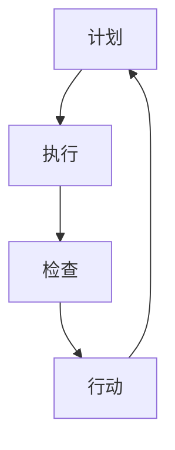

                 

# 《PDCA落地：持续改进的指南》

> 关键词：PDCA循环、质量管理、持续改进、流程优化、案例实践

> 摘要：本文将深入探讨PDCA循环的理论基础和实践应用。通过详细阐述PDCA循环的四个阶段、核心概念、算法原理和数学模型，结合实际案例，提供一套完整的PDCA落地指南，帮助企业和管理者实现持续改进和效率提升。

## 第一部分：PDCA循环基础

### 第1章：PDCA循环概述

#### 1.1 PDCA循环的概念

PDCA循环，又称戴明循环，是一种广泛应用于质量管理和其他管理领域的持续改进工具。PDCA循环由美国质量管理专家爱德华·戴明提出，全称为“Plan（计划）、Do（执行）、Check（检查）、Act（行动）”四个阶段组成。

#### 1.2 PDCA循环的历史背景

PDCA循环起源于20世纪中叶的美国，由爱德华·戴明首先提出。随着日本的质量管理专家石川馨等人的进一步发展，PDCA循环在日本得到了广泛应用，并成为日本制造业崛起的关键因素之一。

#### 1.3 PDCA循环在现代管理中的应用

PDCA循环不仅广泛应用于质量管理，还广泛用于项目管理的各个环节。通过PDCA循环，企业可以持续优化流程，提升产品和服务质量，实现持续改进。

### 第2章：PDCA循环的四个阶段

#### 2.1 计划（Plan）

在计划阶段，需要明确改进目标、制定改进方案和策略。具体步骤如下：

1. 确定改进目标：明确需要解决的问题和期望达到的效果。
2. 制定改进方案：根据目标，制定具体的改进措施和策略。
3. 风险评估：评估改进过程中可能遇到的风险，并制定应对措施。

#### 2.2 执行（Do）

在执行阶段，按照计划的内容，实施具体的改进措施。具体步骤如下：

1. 执行计划：按照计划，执行具体的改进活动。
2. 沟通与协作：确保团队成员之间的沟通和协作，确保计划顺利执行。
3. 监控执行情况：监控改进活动的执行情况，确保计划按预期进行。

#### 2.3 检查（Check）

在检查阶段，对执行结果进行评估和验证。具体步骤如下：

1. 收集数据：收集与改进目标相关的数据，进行量化分析。
2. 分析数据：分析数据，评估改进活动的效果。
3. 对比目标：将实际效果与目标进行对比，判断是否达到预期。

#### 2.4 行动（Act）

在行动阶段，根据检查结果，对改进活动进行总结和调整。具体步骤如下：

1. 总结经验：总结改进过程中的经验，提炼成功和失败的教训。
2. 调整计划：根据检查结果，对改进计划进行调整和优化。
3. 实施调整：按照调整后的计划，实施改进活动。

### 第3章：PDCA循环的核心概念与联系

#### 3.1 PDCA循环中的流程图（Mermaid）



#### 3.2 PDCA循环与传统质量管理方法的比较

传统质量管理方法侧重于质量控制和问题解决，而PDCA循环则更注重持续改进和预防。PDCA循环通过四个阶段的循环迭代，逐步优化流程，提升质量。

### 第4章：PDCA循环在各类组织中的应用

#### 4.1 企业中的PDCA应用

在企业中，PDCA循环广泛应用于产品开发、生产管理和售后服务等环节。通过PDCA循环，企业可以持续优化产品和服务质量，提升客户满意度。

#### 4.2 政府部门中的PDCA应用

在政府部门，PDCA循环主要用于项目管理和公共服务管理。通过PDCA循环，政府部门可以优化项目管理流程，提高公共服务效率。

### 第5章：PDCA循环的实施步骤

#### 5.1 PDCA循环的实施流程

1. 确定改进目标：明确需要解决的问题和期望达到的效果。
2. 制定改进方案：制定具体的改进措施和策略。
3. 执行计划：实施具体的改进活动。
4. 检查结果：评估改进活动的效果。
5. 调整计划：根据检查结果，对改进计划进行调整和优化。

#### 5.2 计划阶段的具体操作

1. 确定改进目标：明确需要解决的问题和期望达到的效果。
2. 收集信息：收集与改进目标相关的信息，包括数据、文档和经验。
3. 分析问题：分析问题，找出关键因素。
4. 制定改进方案：根据问题分析和目标，制定具体的改进措施和策略。

#### 5.3 执行阶段的具体操作

1. 分配任务：明确任务分工，确保每个团队成员都了解自己的职责。
2. 实施改进措施：按照改进方案，实施具体的改进活动。
3. 沟通与协作：确保团队成员之间的沟通和协作，确保计划顺利执行。
4. 监控执行情况：监控改进活动的执行情况，确保计划按预期进行。

#### 5.4 检查阶段的具体操作

1. 收集数据：收集与改进目标相关的数据，进行量化分析。
2. 分析数据：分析数据，评估改进活动的效果。
3. 对比目标：将实际效果与目标进行对比，判断是否达到预期。

#### 5.5 处理阶段的具体操作

1. 总结经验：总结改进过程中的经验，提炼成功和失败的教训。
2. 调整计划：根据检查结果，对改进计划进行调整和优化。
3. 实施调整：按照调整后的计划，实施改进活动。

### 第6章：PDCA循环的常见问题与解决策略

#### 6.1 PDCA循环中的常见问题

1. 计划不周全：可能导致改进活动无法顺利进行。
2. 执行不力：可能导致改进效果不佳。
3. 检查不到位：可能导致改进效果无法得到有效评估。
4. 处理不及时：可能导致改进活动无法持续进行。

#### 6.2 解决策略

1. 风险评估与预防：在计划阶段，对可能遇到的风险进行评估，并制定预防措施。
2. 沟通协作与反馈：在执行和检查阶段，确保团队成员之间的沟通和协作，及时反馈问题和建议。
3. 持续改进与优化：在处理阶段，总结改进过程中的经验，持续优化改进方案。

### 第7章：PDCA循环实践案例分析

#### 7.1 案例一：某企业质量改进实践

##### 7.1.1 案例背景

某制造企业生产过程中存在产品质量不稳定的问题，影响了客户满意度和企业声誉。为了解决这一问题，企业决定采用PDCA循环进行质量改进。

##### 7.1.2 案例实施过程

1. 计划阶段：确定改进目标，分析问题原因，制定改进方案。
2. 执行阶段：实施改进措施，包括设备升级、员工培训等。
3. 检查阶段：收集生产数据，分析改进效果，对比目标。
4. 处理阶段：总结经验，调整改进方案，持续优化。

##### 7.1.3 案例效果评估

通过PDCA循环，企业产品质量显著提升，客户满意度提高，生产效率提高，成本降低。

#### 7.2 案例二：某政府部门项目实施

##### 7.2.1 案例背景

某政府部门在实施一项公共服务项目时，遇到了项目进度缓慢、成本超支等问题。为了解决这些问题，政府决定采用PDCA循环进行项目改进。

##### 7.2.2 案例实施过程

1. 计划阶段：确定改进目标，分析问题原因，制定改进方案。
2. 执行阶段：优化项目流程，加强项目管理，提高项目执行效率。
3. 检查阶段：监控项目进度，评估改进效果，对比目标。
4. 处理阶段：总结经验，调整改进方案，持续优化。

##### 7.2.3 案例效果评估

通过PDCA循环，政府部门项目进度加快，成本降低，公共服务质量提升，得到了社会公众的认可。

## 第二部分：深入理解PDCA循环

### 第8章：PDCA循环中的核心算法原理

#### 8.1 PDCA循环中的决策算法

在PDCA循环的各个阶段，都需要进行决策。常用的决策算法包括决策树、支持向量机和贝叶斯算法。

##### 8.1.1 决策树算法

决策树算法是一种基于树形结构进行决策的算法。通过训练数据集，建立决策树模型，然后根据决策树模型进行决策。

```python
def decision_tree(data):
    # 输入：数据集，输出：决策树模型
    # ...
    return model
```

##### 8.1.2 支持向量机算法

支持向量机算法是一种基于最大间隔分类的算法。通过训练数据集，找到最佳分类边界，实现分类。

```python
def svm_classifier(data):
    # 输入：数据集，输出：支持向量机分类器
    # ...
    return classifier
```

##### 8.1.3 贝叶斯算法

贝叶斯算法是一种基于概率论的算法。通过计算后验概率，判断新数据的类别。

```python
def bayes_classifier(data):
    # 输入：数据集，输出：贝叶斯分类器
    # ...
    return classifier
```

#### 8.2 PDCA循环中的数据分析方法

在PDCA循环中，数据分析是非常重要的一环。常用的数据分析方法包括统计分析、数据可视化和相关性分析。

##### 8.2.1 统计分析方法

统计分析方法用于对数据进行描述、推断和预测。常用的统计方法包括均值、方差、回归分析等。

```python
def stats_analysis(data):
    # 输入：数据集，输出：统计结果
    # ...
    return result
```

##### 8.2.2 数据可视化方法

数据可视化方法用于将数据以图形化的形式展示，帮助人们更好地理解和分析数据。常用的可视化方法包括折线图、柱状图、散点图等。

```python
def visualize(data):
    # 输入：数据集，输出：可视化图表
    # ...
    return chart
```

##### 8.2.3 相关性分析方法

相关性分析方法用于分析数据之间的相关性。常用的相关性分析方法包括皮尔逊相关系数、斯皮尔曼相关系数等。

```python
def correlation_analysis(data):
    # 输入：数据集，输出：相关性结果
    # ...
    return result
```

### 第9章：PDCA循环中的数学模型和数学公式

在PDCA循环中，数学模型和数学公式用于描述和分析实际问题。常用的数学模型包括概率模型、决策模型和优化模型。

#### 9.1 PDCA循环中的数学模型

##### 9.1.1 概率模型

概率模型用于描述随机事件的发生概率。常用的概率模型包括伯努利模型、泊松模型等。

```latex
P(X=k) = C_n^k p^k (1-p)^{n-k}
```

##### 9.1.2 决策模型

决策模型用于描述决策问题。常用的决策模型包括线性规划模型、动态规划模型等。

```latex
\min\ c^T x
\subject\ to\ Ax \leq b
```

##### 9.1.3 优化模型

优化模型用于描述优化问题。常用的优化模型包括线性规划模型、非线性规划模型等。

```latex
\min\ f(x)
\subject\ to\ g_i(x) \leq 0, i=1,2,...,m
```

#### 9.2 PDCA循环中的数学公式

在PDCA循环中，数学公式用于描述和分析实际问题。常用的数学公式包括概率分布公式、决策公式和优化公式。

##### 9.2.1 概率分布公式

概率分布公式用于描述随机变量的概率分布。常用的概率分布公式包括正态分布、泊松分布等。

```latex
f(x) = \frac{1}{\sqrt{2\pi\sigma^2}} e^{-\frac{(x-\mu)^2}{2\sigma^2}}
```

##### 9.2.2 决策公式

决策公式用于描述决策问题的最优解。常用的决策公式包括线性规划公式、动态规划公式等。

```latex
x^* = \arg\min\ c^T x
\subject\ to\ Ax \leq b
```

##### 9.2.3 优化公式

优化公式用于描述优化问题的最优解。常用的优化公式包括线性规划公式、非线性规划公式等。

```latex
x^* = \arg\min\ f(x)
\subject\ to\ g_i(x) \leq 0, i=1,2,...,m
```

### 第10章：PDCA循环项目实战

#### 10.1 项目实战一：企业质量改进项目

##### 10.1.1 项目背景

某制造企业生产过程中存在产品质量不稳定的问题，影响了客户满意度和企业声誉。为了解决这一问题，企业决定采用PDCA循环进行质量改进。

##### 10.1.2 项目目标

通过PDCA循环，实现产品质量稳定，客户满意度提高，生产效率提升。

##### 10.1.3 项目实施过程

1. 计划阶段：确定改进目标，分析问题原因，制定改进方案。
2. 执行阶段：实施改进措施，包括设备升级、员工培训等。
3. 检查阶段：收集生产数据，分析改进效果，对比目标。
4. 处理阶段：总结经验，调整改进方案，持续优化。

##### 10.1.4 项目效果评估

通过PDCA循环，企业产品质量显著提升，客户满意度提高，生产效率提高，成本降低。

#### 10.2 项目实战二：政府部门项目管理

##### 10.2.1 项目背景

某政府部门在实施一项公共服务项目时，遇到了项目进度缓慢、成本超支等问题。为了解决这些问题，政府决定采用PDCA循环进行项目改进。

##### 10.2.2 项目目标

通过PDCA循环，实现项目进度加快，成本降低，公共服务质量提升。

##### 10.2.3 项目实施过程

1. 计划阶段：确定改进目标，分析问题原因，制定改进方案。
2. 执行阶段：优化项目流程，加强项目管理，提高项目执行效率。
3. 检查阶段：监控项目进度，评估改进效果，对比目标。
4. 处理阶段：总结经验，调整改进方案，持续优化。

##### 10.2.4 项目效果评估

通过PDCA循环，政府部门项目进度加快，成本降低，公共服务质量提升，得到了社会公众的认可。

## 附录

### 附录A：PDCA循环工具与资源

#### A.1 主流PDCA循环工具介绍

1. **Microsoft Office Project**：Microsoft Office Project 是一款功能强大的项目管理软件，可以用于制定项目计划、跟踪项目进度和资源分配。

2. **JIRA**：JIRA 是一款流行的项目管理工具，适用于敏捷开发团队，可以用于创建任务、跟踪问题、管理迭代和发布版本。

3. **Asana**：Asana 是一款简单易用的项目管理工具，适用于各种类型的企业和组织，可以用于任务分配、进度跟踪和协作沟通。

### 附录B：PDCA循环实践案例库

#### B.1 案例一：某制造企业质量改进案例

##### B.1.1 案例背景

某制造企业生产过程中存在产品质量不稳定的问题，影响了客户满意度和企业声誉。为了解决这一问题，企业决定采用PDCA循环进行质量改进。

##### B.1.2 案例实施过程

1. 计划阶段：确定改进目标，分析问题原因，制定改进方案。
2. 执行阶段：实施改进措施，包括设备升级、员工培训等。
3. 检查阶段：收集生产数据，分析改进效果，对比目标。
4. 处理阶段：总结经验，调整改进方案，持续优化。

##### B.1.3 案例效果评估

通过PDCA循环，企业产品质量显著提升，客户满意度提高，生产效率提高，成本降低。

#### B.2 案例二：某政府部门项目实施

##### B.2.1 案例背景

某政府部门在实施一项公共服务项目时，遇到了项目进度缓慢、成本超支等问题。为了解决这些问题，政府决定采用PDCA循环进行项目改进。

##### B.2.2 案例实施过程

1. 计划阶段：确定改进目标，分析问题原因，制定改进方案。
2. 执行阶段：优化项目流程，加强项目管理，提高项目执行效率。
3. 检查阶段：监控项目进度，评估改进效果，对比目标。
4. 处理阶段：总结经验，调整改进方案，持续优化。

##### B.2.3 案例效果评估

通过PDCA循环，政府部门项目进度加快，成本降低，公共服务质量提升，得到了社会公众的认可。

### 作者

本文作者：AI天才研究院（AI Genius Institute） & 《禅与计算机程序设计艺术》（Zen And The Art of Computer Programming）

AI天才研究院致力于推动人工智能技术在各个领域的应用，培养具有创新思维和实践能力的人工智能人才。《禅与计算机程序设计艺术》是一部经典的技术著作，为程序员提供了深刻的编程哲学和编程技巧，深受读者喜爱。

