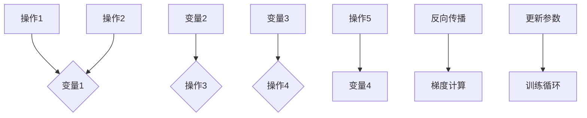

                 

### 《Pytorch 动态计算图：灵活的构建神经网络》

#### 核心关键词
- Pytorch
- 动态计算图
- 神经网络
- 深度学习
- 自动微分

#### 摘要
本文将深入探讨Pytorch中的动态计算图概念及其在构建神经网络中的应用。我们将首先介绍Pytorch的基础特性，然后详细讲解动态计算图的基本概念和构建方法。接着，我们将分析几种常见的神经网络结构，如卷积神经网络（CNN）、循环神经网络（RNN）等。随后，我们将展示如何在Pytorch中构建和应用这些神经网络，并进行模型训练与评估。最后，我们将探讨动态计算图在自然语言处理和计算机视觉领域的应用，并通过一个实际项目来展示如何使用Pytorch构建自己的神经网络。

---

### 《Pytorch 动态计算图：灵活的构建神经网络》目录大纲

以下是本文的目录大纲，您可以在阅读过程中根据目录快速定位到感兴趣的章节。

#### 第一部分：Pytorch基础与动态计算图概念

1. **第1章：Pytorch概述**
   - 1.1 Pytorch的基本特性
   - 1.2 Pytorch与静态计算图框架对比
   - 1.3 动态计算图的基本概念

2. **第2章：Pytorch环境搭建与基础操作**
   - 2.1 安装与配置Pytorch
   - 2.2 Pytorch的数据类型和变量操作
   - 2.3 基本数据结构：Tensor和Autograd

3. **第3章：动态计算图构建基础**
   - 3.1 张量和操作
   - 3.2 Autograd自动微分机制
   - 3.3 神经网络的基本构建

#### 第二部分：神经网络与动态计算图的应用

4. **第4章：常见神经网络结构解析**
   - 4.1 卷积神经网络（CNN）
   - 4.2 循环神经网络（RNN）
   - 4.3 长短时记忆网络（LSTM）
   - 4.4 门控循环单元（GRU）

5. **第5章：Pytorch中的动态计算图构建**
   - 5.1 神经网络层实现
   - 5.2 损失函数与优化器
   - 5.3 模型训练与评估

6. **第6章：Pytorch中的高级动态计算图功能**
   - 6.1 模型保存与加载
   - 6.2 模型并行与分布式训练
   - 6.3 自定义动态计算图

7. **第7章：动态计算图在自然语言处理中的应用**
   - 7.1 词嵌入与序列模型
   - 7.2 语言模型与机器翻译
   - 7.3 问答系统与对话生成

8. **第8章：动态计算图在计算机视觉中的应用**
   - 8.1 图像分类与目标检测
   - 8.2 图像生成与超分辨率
   - 8.3 图像增强与风格迁移

9. **第9章：项目实战：构建自己的神经网络**
   - 9.1 项目背景与需求分析
   - 9.2 神经网络设计与实现
   - 9.3 模型训练与性能优化
   - 9.4 模型部署与评估

#### 第三部分：附录与扩展阅读

10. **附录A：Pytorch常用API与函数**
    - 10.1 数据加载与预处理
    - 10.2 神经网络层与激活函数
    - 10.3 损失函数与优化器
    - 10.4 模型保存与加载

11. **附录B：扩展阅读与资源推荐**
    - 11.1 Pytorch官方文档与教程
    - 11.2 自然语言处理与计算机视觉开源库
    - 11.3 相关书籍与论文推荐

---

在接下来的章节中，我们将逐步深入探讨Pytorch的动态计算图机制，了解其在构建神经网络中的应用，并通过具体的实例来展示其强大的功能。

---

### 第一部分：Pytorch基础与动态计算图概念

#### 第1章：Pytorch概述

Pytorch是一个基于Python的科学计算框架，由Facebook的人工智能研究团队开发，并在开源社区广泛使用。Pytorch的核心特点是其动态计算图（Dynamic Computation Graph，DCG）机制，这使得它非常适合研究和开发复杂的深度学习模型。

#### 1.1 Pytorch的基本特性

1. **动态计算图**：与静态计算图框架（如TensorFlow）不同，Pytorch使用动态计算图，这意味着计算图不是在编译时静态定义的，而是在运行时动态构建的。这种灵活性使得Pytorch在实现和调试复杂模型时更加高效。

2. **易于使用**：Pytorch的设计使得它非常容易上手。其核心API简洁明了，可以帮助开发者快速构建和训练深度学习模型。

3. **强大的扩展性**：Pytorch提供了丰富的API和工具，使得开发者可以轻松扩展和自定义模型架构。

4. **高效性能**：Pytorch利用了现代GPU和CPU的并行计算能力，提供了高效的计算性能。

5. **开源与社区支持**：Pytorch是开源项目，拥有庞大的开发者社区，这使得开发者可以获得丰富的资源和帮助。

#### 1.2 Pytorch与静态计算图框架对比

静态计算图框架（如TensorFlow）在编译时构建整个计算图，并在运行时执行。这种方法的优点是模型执行速度快，但缺点是模型的可扩展性和调试难度较大。相比之下，动态计算图框架（如Pytorch）在运行时动态构建计算图，提供了更高的灵活性和可操作性，但可能会影响模型执行速度。

| 对比项 | 静态计算图框架（如TensorFlow） | 动态计算图框架（如Pytorch） |
| --- | --- | --- |
| 编译时构建计算图 | 是 | 否 |
| 模型执行速度 | 快 | 较慢 |
| 模型可扩展性 | 较差 | 高 |
| 模型调试难度 | 高 | 低 |

#### 1.3 动态计算图的基本概念

动态计算图是一种在运行时构建和修改的计算图，它由操作（Operation）和变量（Variable）组成。以下是动态计算图的基本概念：

1. **操作（Operation）**：操作是动态计算图中的基本构建块，它表示一个计算过程。例如，加法操作（Add）可以将两个张量相加。

2. **变量（Variable）**：变量是动态计算图中的数据存储单元，它可以是常量、张量或其他变量。变量通常用于存储模型的参数和中间计算结果。

3. **反向传播**：动态计算图支持自动微分机制，可以通过反向传播算法计算梯度。这种机制使得训练深度学习模型变得简单高效。

#### Mermaid 流程图

以下是动态计算图的基本概念流程图：



在接下来的章节中，我们将进一步探讨Pytorch的环境搭建、基础操作和动态计算图的构建。

---

### 第一部分：Pytorch基础与动态计算图概念

#### 第2章：Pytorch环境搭建与基础操作

要开始使用Pytorch，我们需要首先安装和配置Pytorch环境。本节将详细介绍Pytorch的安装过程，以及如何进行基本的数据类型操作和变量操作。

#### 2.1 安装与配置Pytorch

安装Pytorch可以通过以下几种方式：

1. **使用pip**：在命令行中运行以下命令：

   ```
   pip install torch torchvision
   ```

   这将安装Pytorch和配套的视觉库 torchvision。

2. **使用conda**：如果你使用的是Anaconda或Miniconda，可以使用以下命令安装：

   ```
   conda install pytorch torchvision -c pytorch
   ```

   这将安装最新的Pytorch版本。

3. **手动下载**：你也可以手动下载Pytorch的源代码并进行编译安装，但通常不推荐这种方式，除非你有特殊的需要。

安装完成后，可以通过以下代码验证安装是否成功：

```python
import torch
print(torch.__version__)
```

如果输出的是有效的版本号，说明Pytorch已成功安装。

#### 2.2 Pytorch的数据类型和变量操作

Pytorch中的数据类型主要包括Tensor和Variable。Tensor是Pytorch中的多维数组，类似于NumPy的ndarray，但提供了自动微分和GPU支持等功能。Variable是对Tensor的封装，它包含数据和计算图信息，主要用于自动微分。

1. **Tensor**

   创建Tensor有多种方法：

   - 使用Python列表或NumPy数组创建：

     ```python
     tensor1 = torch.tensor([1.0, 2.0, 3.0])
     tensor2 = torch.tensor(np.array([1, 2, 3]))
     ```

   - 使用随机数生成器创建：

     ```python
     tensor3 = torch.randn(3, 3)  # 生成3x3的随机张量
     tensor4 = torch.zeros(2, 2)  # 生成2x2的全零张量
     tensor5 = torch.ones(2, 2)   # 生成2x2的全一张量
     ```

   - 使用特定范围的值创建：

     ```python
     tensor6 = torch.arange(1, 10)  # 生成1到9的序列
     tensor7 = torch.linspace(0, 2, 3)  # 生成0到2的线性空间序列，共3个元素
     ```

   Tensor支持常见的数组操作，如加法、减法、乘法和除法：

   ```python
   tensor8 = tensor1 + tensor2  # 加法
   tensor9 = tensor1 - tensor2  # 减法
   tensor10 = tensor1 * tensor2  # 乘法
   tensor11 = tensor1 / tensor2  # 除法
   ```

2. **Variable**

   Variable是对Tensor的封装，主要用于自动微分。创建Variable的方法与创建Tensor类似：

   ```python
   variable1 = torch Variable(tensor1)
   ```

   Variable还支持自动微分，可以在训练神经网络时计算梯度：

   ```python
   loss = (variable1 ** 2).sum()
   loss.backward()
   ```

   在反向传播过程中，梯度会自动存储在Variable的`.grad`属性中。

#### 2.3 基本数据结构：Tensor和Autograd

Autograd是Pytorch中的自动微分库，它允许我们通过动态计算图进行自动微分。以下是Autograd的基本概念：

1. **函数（Function）**

   Autograd中的每个操作都封装为一个函数（Function），它在执行计算时自动记录前向传播的信息。这些信息用于后续的反向传播。

2. **梯度计算**

   Autograd通过函数链（Function Chain）进行梯度计算。每个函数都会计算其输入的梯度，并存储在相应的Variable的`.grad`属性中。

3. **反向传播**

   反向传播是通过反向传播算法（Backpropagation Algorithm）实现的。它从损失函数开始，逐层计算每个变量和操作的梯度。

以下是Autograd的基本使用示例：

```python
import torch
import torch.nn as nn

# 定义一个简单的神经网络模型
model = nn.Linear(2, 1)

# 创建输入和标签
x = torch.tensor([[1.0, 2.0]])
y = torch.tensor([[0.3]])

# 训练模型
optimizer = torch.optim.SGD(model.parameters(), lr=0.01)
criterion = nn.MSELoss()

for epoch in range(100):
    optimizer.zero_grad()
    output = model(x)
    loss = criterion(output, y)
    loss.backward()
    optimizer.step()

    if epoch % 10 == 0:
        print(f'Epoch {epoch}: Loss = {loss.item()}')
```

在上述代码中，我们定义了一个简单的线性模型，并使用SGD优化器和MSELoss损失函数进行训练。在每个训练循环中，我们首先将优化器的梯度置为零，然后进行前向传播计算输出和损失，接着进行反向传播计算梯度，最后更新模型参数。

通过上述内容，我们了解了Pytorch的基本环境搭建和数据类型操作，以及动态计算图的基本概念和构建方法。在下一章中，我们将深入探讨动态计算图的构建基础。

---

### 第一部分：Pytorch基础与动态计算图概念

#### 第3章：动态计算图构建基础

动态计算图是Pytorch的核心特性之一，它使得深度学习模型的设计和实现变得灵活且高效。在本章中，我们将深入探讨动态计算图的构建基础，包括张量和操作、Autograd自动微分机制，以及神经网络的基本构建。

#### 3.1 张量和操作

在Pytorch中，张量（Tensor）是动态计算图的基本构建块。张量是一个多维数组，可以存储数据、模型参数以及中间计算结果。Pytorch提供了丰富的操作，用于对张量进行各种数学运算。

1. **创建张量**

   张量可以通过多种方式创建，包括从Python列表、NumPy数组、随机数生成器等。以下是一些示例：

   ```python
   # 从Python列表创建
   tensor1 = torch.tensor([1.0, 2.0, 3.0])
   
   # 从NumPy数组创建
   import numpy as np
   tensor2 = torch.tensor(np.array([1, 2, 3]))
   
   # 使用随机数生成器创建
   tensor3 = torch.randn(3, 3)  # 生成3x3的随机张量
   tensor4 = torch.zeros(2, 2)  # 生成2x2的全零张量
   tensor5 = torch.ones(2, 2)   # 生成2x2的全一张量
   
   # 使用特定范围的值创建
   tensor6 = torch.arange(1, 10)  # 生成1到9的序列
   tensor7 = torch.linspace(0, 2, 3)  # 生成0到2的线性空间序列，共3个元素
   ```

2. **张量操作**

   Pytorch提供了丰富的张量操作，包括基本的数学运算、矩阵运算等。以下是一些示例：

   ```python
   # 加法
   tensor8 = tensor1 + tensor2
   
   # 减法
   tensor9 = tensor1 - tensor2
   
   # 乘法
   tensor10 = tensor1 * tensor2
   
   # 除法
   tensor11 = tensor1 / tensor2
   
   # 矩阵乘法
   tensor12 = tensor1.mm(tensor2)
   
   # 矩阵转置
   tensor13 = tensor1.t()
   
   # 矩阵求逆
   tensor14 = torch.inverse(tensor1)
   ```

#### 3.2 Autograd自动微分机制

Autograd是Pytorch中的自动微分库，它允许我们通过动态计算图进行自动微分。自动微分是深度学习训练过程中的关键步骤，它用于计算损失函数相对于模型参数的梯度。

1. **自动微分原理**

   自动微分的原理基于链式法则，它通过前向传播和反向传播两个步骤来计算梯度。前向传播计算损失函数的输出，反向传播则从输出开始，逐层计算每个变量和操作的梯度。

2. **使用Autograd**

   在Pytorch中，每个操作都会自动记录前向传播的信息，我们可以使用`.grad`属性来访问计算得到的梯度。以下是一个简单的例子：

   ```python
   import torch
   import torch.nn as nn
   
   # 定义一个简单的神经网络模型
   model = nn.Linear(2, 1)
   
   # 创建输入和标签
   x = torch.tensor([[1.0, 2.0]])
   y = torch.tensor([[0.3]])
   
   # 训练模型
   optimizer = torch.optim.SGD(model.parameters(), lr=0.01)
   criterion = nn.MSELoss()
   
   for epoch in range(100):
       optimizer.zero_grad()
       output = model(x)
       loss = criterion(output, y)
       loss.backward()
       optimizer.step()
       
       if epoch % 10 == 0:
           print(f'Epoch {epoch}: Loss = {loss.item()}')
   ```

   在上述代码中，我们定义了一个简单的线性模型，并使用SGD优化器和MSELoss损失函数进行训练。在每个训练循环中，我们首先将优化器的梯度置为零，然后进行前向传播计算输出和损失，接着进行反向传播计算梯度，最后更新模型参数。

#### 3.3 神经网络的基本构建

神经网络是深度学习的基础，它由多个层组成，每层通过权重和偏置对输入进行变换。在Pytorch中，我们可以使用`nn.Module`类来定义和构建神经网络。

1. **定义神经网络**

   我们可以使用`nn.Module`类来定义一个神经网络。以下是一个简单的全连接神经网络（Fully Connected Neural Network，FCNN）示例：

   ```python
   import torch
   import torch.nn as nn
   
   class SimpleFCNN(nn.Module):
       def __init__(self):
           super(SimpleFCNN, self).__init__()
           self.fc1 = nn.Linear(2, 10)
           self.fc2 = nn.Linear(10, 1)
   
       def forward(self, x):
           x = torch.relu(self.fc1(x))
           x = self.fc2(x)
           return x
   
   # 实例化神经网络
   model = SimpleFCNN()
   ```

   在上述代码中，我们定义了一个简单的全连接神经网络，它包含两个线性层（fc1和fc2），以及一个ReLU激活函数。

2. **训练神经网络**

   接下来，我们可以使用定义好的神经网络进行训练。以下是一个简单的训练循环示例：

   ```python
   import torch
   import torch.nn as nn
   import torch.optim as optim
   
   # 创建输入和标签
   x = torch.tensor([[1.0, 2.0]])
   y = torch.tensor([[0.3]])
   
   # 定义模型、损失函数和优化器
   model = SimpleFCNN()
   criterion = nn.MSELoss()
   optimizer = optim.SGD(model.parameters(), lr=0.01)
   
   # 训练模型
   for epoch in range(100):
       optimizer.zero_grad()
       output = model(x)
       loss = criterion(output, y)
       loss.backward()
       optimizer.step()
       
       if epoch % 10 == 0:
           print(f'Epoch {epoch}: Loss = {loss.item()}')
   ```

   在上述代码中，我们首先创建输入和标签，然后定义模型、损失函数和优化器。在训练循环中，我们首先将优化器的梯度置为零，然后进行前向传播计算输出和损失，接着进行反向传播计算梯度，最后更新模型参数。

通过上述内容，我们了解了动态计算图的基本构建方法，包括张量和操作、Autograd自动微分机制，以及神经网络的基本构建。在下一章中，我们将进一步探讨常见神经网络结构及其应用。

---

### 第二部分：神经网络与动态计算图的应用

#### 第4章：常见神经网络结构解析

神经网络在深度学习领域中扮演着至关重要的角色。不同的神经网络结构适用于不同的任务。本章将解析几种常见的神经网络结构，包括卷积神经网络（CNN）、循环神经网络（RNN）等，并探讨它们的基本原理和应用。

#### 4.1 卷积神经网络（CNN）

卷积神经网络（Convolutional Neural Network，CNN）是专门用于处理图像数据的一种神经网络结构。它的核心思想是利用卷积操作提取图像中的特征。

1. **卷积层（Convolutional Layer）**

   卷积层是CNN中最基本的层，它通过卷积操作从输入图像中提取特征。卷积操作可以看作是一种滤波器，它在输入图像上滑动并计算局部特征。

2. **激活函数（Activation Function）**

   激活函数用于引入非线性特性，使得神经网络能够学习更复杂的函数。常见的激活函数有ReLU（Rectified Linear Unit）、Sigmoid和Tanh。

3. **池化层（Pooling Layer）**

   池化层用于减小特征图的尺寸，从而降低模型的复杂性。常见的池化方法有最大池化（Max Pooling）和平均池化（Average Pooling）。

4. **全连接层（Fully Connected Layer）**

   在CNN的末端，通常会有一个或多个全连接层，用于将提取的特征映射到具体的类别标签。

5. **示例**

   以下是一个简单的CNN模型示例：

   ```python
   import torch
   import torch.nn as nn
   
   class SimpleCNN(nn.Module):
       def __init__(self):
           super(SimpleCNN, self).__init__()
           self.conv1 = nn.Conv2d(1, 32, 3, 1)
           self.fc1 = nn.Linear(32 * 26 * 26, 10)
   
       def forward(self, x):
           x = torch.relu(self.conv1(x))
           x = torch.max_pool2d(x, 2)
           x = x.view(-1, 32 * 13 * 13)
           x = torch.relu(self.fc1(x))
           return x
   
   # 实例化模型
   model = SimpleCNN()
   ```

#### 4.2 循环神经网络（RNN）

循环神经网络（Recurrent Neural Network，RNN）是一种处理序列数据的神经网络结构。它的特点是能够将上一时刻的隐藏状态传递到下一时刻，从而具有时间记忆能力。

1. **基本结构**

   RNN的基本结构包括输入层、隐藏层和输出层。输入层接收序列数据，隐藏层通过循环连接保持状态，输出层生成最终的输出。

2. **梯度消失和梯度爆炸**

   RNN在训练过程中容易遇到梯度消失和梯度爆炸问题，这使得模型难以学习长期依赖关系。为了解决这些问题，研究人员提出了许多改进方法，如长短时记忆网络（LSTM）和门控循环单元（GRU）。

3. **长短时记忆网络（LSTM）**

   LSTM（Long Short-Term Memory）是RNN的一种改进模型，它通过引入记忆单元门来控制信息的流动，从而能够学习长期依赖关系。

   - **遗忘门（Forget Gate）**：控制从上一时刻传递到当前时刻的信息。

   - **输入门（Input Gate）**：控制新的信息如何影响当前时刻的记忆。

   - **输出门（Output Gate）**：控制当前时刻的记忆如何影响输出。

4. **门控循环单元（GRU）**

   GRU（Gated Recurrent Unit）是另一种改进的RNN模型，它简化了LSTM的结构，同时保持了类似的效果。

   - **更新门（Update Gate）**：控制新旧信息的结合。

   - **重置门（Reset Gate）**：控制记忆的更新。

5. **示例**

   以下是一个简单的LSTM模型示例：

   ```python
   import torch
   import torch.nn as nn
   
   class SimpleLSTM(nn.Module):
       def __init__(self, input_size, hidden_size, num_layers):
           super(SimpleLSTM, self).__init__()
           self.hidden_size = hidden_size
           self.num_layers = num_layers
           self.lstm = nn.LSTM(input_size, hidden_size, num_layers)
           self.fc = nn.Linear(hidden_size, 1)
   
       def forward(self, x):
           h0 = torch.zeros(self.num_layers, x.size(1), self.hidden_size)
           c0 = torch.zeros(self.num_layers, x.size(1), self.hidden_size)
           out, _ = self.lstm(x, (h0, c0))
           out = self.fc(out[-1])
           return out
   
   # 实例化模型
   model = SimpleLSTM(1, 50, 2)
   ```

#### 4.3 长短时记忆网络（LSTM）

LSTM（Long Short-Term Memory）是一种能够学习长期依赖关系的RNN模型，它通过引入三个门（遗忘门、输入门和输出门）来控制信息的流动。

1. **遗忘门（Forget Gate）**

   遗忘门决定哪些信息应该从记忆单元中丢弃。其计算公式为：

   $$ 
   f_t = \sigma(W_f \cdot [h_{t-1}, x_t] + b_f) 
   $$

   其中，$f_t$表示遗忘门的输出，$\sigma$表示sigmoid函数，$W_f$和$b_f$分别为权重和偏置。

2. **输入门（Input Gate）**

   输入门决定新的信息如何影响记忆单元。其计算公式为：

   $$ 
   i_t = \sigma(W_i \cdot [h_{t-1}, x_t] + b_i) 
   $$

   其中，$i_t$表示输入门的输出。

3. **输出门（Output Gate）**

   输出门决定记忆单元的输出。其计算公式为：

   $$ 
   o_t = \sigma(W_o \cdot [h_{t-1}, x_t] + b_o) 
   $$

   其中，$o_t$表示输出门的输出。

4. **记忆单元（Memory Cell）**

   记忆单元是LSTM的核心部分，它通过遗忘门、输入门和输出门控制信息的流动。其计算公式为：

   $$ 
   C_t = f_t \odot C_{t-1} + i_t \odot \sigma(W_c \cdot [h_{t-1}, x_t] + b_c) 
   $$

   其中，$C_t$表示当前时刻的记忆单元，$\odot$表示元素乘法。

5. **隐藏状态**

   隐藏状态是LSTM的输出，它通过输出门与记忆单元相关联。其计算公式为：

   $$ 
   h_t = o_t \odot \sigma(C_t) 
   $$

#### 4.4 门控循环单元（GRU）

GRU（Gated Recurrent Unit）是一种简化版的LSTM，它通过引入更新门和重置门来控制信息的流动。

1. **更新门（Update Gate）**

   更新门决定新旧信息的结合。其计算公式为：

   $$ 
   z_t = \sigma(W_z \cdot [h_{t-1}, x_t] + b_z) 
   $$

   其中，$z_t$表示更新门的输出。

2. **重置门（Reset Gate）**

   重置门决定新的信息如何影响当前状态。其计算公式为：

   $$ 
   r_t = \sigma(W_r \cdot [h_{t-1}, x_t] + b_r) 
   $$

   其中，$r_t$表示重置门的输出。

3. **记忆单元（Memory Cell）**

   GRU的记忆单元通过更新门和重置门进行更新。其计算公式为：

   $$ 
   C_t = z_t \odot C_{t-1} + (1 - z_t) \odot \sigma(r_t \odot C_{t-1} + W_c \cdot [h_{t-1}, x_t] + b_c) 
   $$

   其中，$C_t$表示当前时刻的记忆单元。

4. **隐藏状态**

   隐藏状态是GRU的输出，它通过更新门与记忆单元相关联。其计算公式为：

   $$ 
   h_t = \sigma(W_h \cdot [r_t \odot C_{t-1} + (1 - z_t) \odot \sigma(C_t)] + b_h) 
   $$

通过上述内容，我们解析了卷积神经网络（CNN）、循环神经网络（RNN）以及长短时记忆网络（LSTM）和门控循环单元（GRU）的基本原理和应用。这些神经网络结构在深度学习领域具有广泛的应用，下一章我们将探讨如何使用Pytorch中的动态计算图构建这些神经网络。

---

### 第二部分：神经网络与动态计算图的应用

#### 第5章：Pytorch中的动态计算图构建

在Pytorch中，动态计算图是一种灵活且高效的模型构建方式。通过动态计算图，我们可以方便地定义和操作神经网络模型，并进行模型训练和评估。本章将详细介绍如何在Pytorch中构建动态计算图，包括神经网络层的实现、损失函数与优化器，以及模型训练与评估。

#### 5.1 神经网络层实现

在Pytorch中，神经网络层通过`nn.Module`类实现。`nn.Module`是一个基础类，用于定义神经网络的结构。我们可以通过继承`nn.Module`类来定义自己的神经网络层。

1. **线性层（Linear Layer）**

   线性层是最基本的神经网络层，它通过线性变换将输入映射到输出。在Pytorch中，可以使用`nn.Linear`类实现线性层。

   ```python
   import torch
   import torch.nn as nn
   
   class LinearLayer(nn.Module):
       def __init__(self, input_size, output_size):
           super(LinearLayer, self).__init__()
           self.linear = nn.Linear(input_size, output_size)
   
       def forward(self, x):
           return self.linear(x)
   ```

2. **卷积层（Convolutional Layer）**

   卷积层用于处理图像数据，它通过卷积操作提取图像特征。在Pytorch中，可以使用`nn.Conv2d`类实现卷积层。

   ```python
   import torch
   import torch.nn as nn
   
   class ConvLayer(nn.Module):
       def __init__(self, in_channels, out_channels, kernel_size, stride=1, padding=0):
           super(ConvLayer, self).__init__()
           self.conv = nn.Conv2d(in_channels, out_channels, kernel_size, stride, padding)
   
       def forward(self, x):
           return self.conv(x)
   ```

3. **激活函数层（Activation Function Layer）**

   激活函数层用于引入非线性特性。在Pytorch中，可以使用`nn.ReLU`、`nn.Sigmoid`等激活函数。

   ```python
   import torch
   import torch.nn as nn
   
   class ReLU(nn.Module):
       def __init__(self):
           super(ReLU, self).__init__()
           self.relu = nn.ReLU()
   
       def forward(self, x):
           return self.relu(x)
   ```

4. **池化层（Pooling Layer）**

   池化层用于减小特征图的尺寸，从而降低模型的复杂性。在Pytorch中，可以使用`nn.MaxPool2d`、`nn.AvgPool2d`等池化层。

   ```python
   import torch
   import torch.nn as nn
   
   class MaxPool(nn.Module):
       def __init__(self, kernel_size, stride=None, padding=0):
           super(MaxPool, self).__init__()
           self.maxpool = nn.MaxPool2d(kernel_size, stride, padding)
   
       def forward(self, x):
           return self.maxpool(x)
   ```

#### 5.2 损失函数与优化器

损失函数用于度量模型预测值与真实值之间的差异，优化器用于调整模型参数以最小化损失函数。在Pytorch中，提供了丰富的损失函数和优化器，我们可以根据需求选择合适的函数。

1. **损失函数（Loss Function）**

   在Pytorch中，可以使用`nn.CrossEntropyLoss`、`nn.MSELoss`等损失函数。

   ```python
   import torch
   import torch.nn as nn
   
   criterion = nn.CrossEntropyLoss()
   criterion_mse = nn.MSELoss()
   ```

2. **优化器（Optimizer）**

   在Pytorch中，可以使用`torch.optim.SGD`、`torch.optim.Adam`等优化器。

   ```python
   import torch
   import torch.optim as optim
   
   optimizer = optim.SGD(model.parameters(), lr=0.01)
   optimizerAdam = optim.Adam(model.parameters(), lr=0.001)
   ```

#### 5.3 模型训练与评估

在Pytorch中，模型训练与评估是一个循环过程，包括数据预处理、前向传播、反向传播和参数更新。以下是一个简单的模型训练与评估流程：

```python
import torch
import torch.nn as nn
import torch.optim as optim

# 定义模型
model = SimpleCNN()
criterion = nn.CrossEntropyLoss()
optimizer = optim.SGD(model.parameters(), lr=0.01)

# 数据预处理
# ...

# 训练模型
for epoch in range(num_epochs):
    for inputs, targets in dataloaders['train']:
        optimizer.zero_grad()
        outputs = model(inputs)
        loss = criterion(outputs, targets)
        loss.backward()
        optimizer.step()
    
    # 在验证集上进行评估
    with torch.no_grad():
        correct = 0
        total = 0
        for inputs, targets in dataloaders['val']:
            outputs = model(inputs)
            _, predicted = torch.max(outputs.data, 1)
            total += targets.size(0)
            correct += (predicted == targets).sum().item()
        print(f'Epoch {epoch+1}/{num_epochs}, Accuracy: {100 * correct / total}%')

# 模型保存
torch.save(model.state_dict(), 'model.pth')

# 模型加载
model.load_state_dict(torch.load('model.pth'))
```

通过上述内容，我们了解了如何在Pytorch中构建动态计算图，包括神经网络层的实现、损失函数与优化器，以及模型训练与评估。在下一章中，我们将探讨Pytorch中的高级动态计算图功能。

---

### 第二部分：神经网络与动态计算图的应用

#### 第6章：Pytorch中的高级动态计算图功能

在Pytorch中，动态计算图不仅提供了构建和训练神经网络的基础，还具备一些高级功能，如模型保存与加载、模型并行与分布式训练、自定义动态计算图等。本章将介绍这些高级功能，并展示如何在实际应用中利用它们。

#### 6.1 模型保存与加载

在深度学习项目中，模型保存与加载是非常关键的步骤。通过模型保存，我们可以将训练好的模型参数保存到磁盘上，以便后续使用或恢复训练。同样，模型加载使我们能够从保存的状态中加载模型，快速进行推理或继续训练。

1. **模型保存**

   使用Pytorch保存模型时，我们通常保存模型的状态字典（state_dict），这包含了模型的权重和层结构。

   ```python
   torch.save(model.state_dict(), 'model.pth')
   ```

   这将保存当前模型的参数到名为`model.pth`的文件中。

2. **模型加载**

   要加载保存的模型，我们需要使用`torch.load`函数，并传递保存文件的路径。

   ```python
   model.load_state_dict(torch.load('model.pth'))
   ```

   这将加载`model.pth`文件中的参数到当前模型中。

#### 6.2 模型并行与分布式训练

随着深度学习模型的复杂性和规模不断增加，单机训练可能变得不再可行。为此，Pytorch提供了模型并行和分布式训练功能，使得我们可以利用多台机器的算力进行高效训练。

1. **模型并行**

   模型并行（Model Parallelism）允许我们将模型拆分成多个部分，分别在不同的GPU或TPU上训练。Pytorch通过`torch.nn.parallel.DistributedDataParallel`实现了这一功能。

   ```python
   model = torch.nn.parallel.DistributedDataParallel(model)
   ```

   这将创建一个分布式数据并行模型，它将在多个GPU上并行训练。

2. **分布式训练**

   分布式训练（Distributed Training）通过多台机器协作进行训练，可以显著提高训练速度。Pytorch提供了`torch.nn.parallel.replicate`和`torch.nn.parallel.parallel_apply`函数来实现分布式训练。

   ```python
   from torch.nn.parallel import DistributedDataParallel
   
   # 在每台机器上初始化模型
   model = SimpleCNN()
   ddp_model = DistributedDataParallel(model)
   
   # 分布式训练循环
   for epoch in range(num_epochs):
       for inputs, targets in dataloaders['train']:
           # 将数据分发给各个进程
           inputs = inputs.split(per_device_batch_size)
           targets = targets.split(per_device_batch_size)
           
           # 并行计算梯度
           outputs = parallel_apply(distributed_model, inputs, targets)
           
           # 反向传播
           loss = sum(outputs)
           loss.backward()
           
           # 更新参数
           optimizer.step()
           
           # 清零梯度
           optimizer.zero_grad()
   ```

#### 6.3 自定义动态计算图

除了使用预定义的神经网络层和函数，Pytorch还允许我们自定义动态计算图。通过操作张量和定义自定义操作，我们可以构建复杂的模型。

1. **自定义操作**

   我们可以定义一个自定义操作，通过实现`__call__`方法来定义操作的行为。

   ```python
   class CustomOperation(torch.autograd.Function):
       @staticmethod
       def forward(ctx, x):
           ctx.save_for_backward(x)
           return x * x
   
       @staticmethod
       def backward(ctx, grad_output):
           x, = ctx.saved_tensors
           return grad_output * (2 * x)
   
   # 使用自定义操作
   x = torch.tensor([1.0, 2.0, 3.0])
   y = CustomOperation.apply(x)
   print(y)
   ```

2. **自定义层**

   通过继承`torch.nn.Module`类，我们可以定义自定义神经网络层。

   ```python
   class CustomLayer(nn.Module):
       def __init__(self):
           super(CustomLayer, self).__init__()
           self.linear = nn.Linear(3, 1)
   
       def forward(self, x):
           x = CustomOperation.apply(x)
           return self.linear(x)
   
   # 实例化自定义层
   custom_layer = CustomLayer()
   x = torch.tensor([[1.0, 2.0, 3.0]])
   y = custom_layer(x)
   print(y)
   ```

通过上述高级功能，Pytorch为深度学习模型提供了极大的灵活性和扩展性。在下一章中，我们将探讨动态计算图在自然语言处理中的应用。

---

### 第二部分：神经网络与动态计算图的应用

#### 第7章：动态计算图在自然语言处理中的应用

自然语言处理（Natural Language Processing，NLP）是深度学习领域的一个重要分支，它涉及文本的生成、理解和分析。动态计算图在NLP中具有广泛的应用，尤其是在构建词嵌入、序列模型、语言模型和机器翻译等任务时。

#### 7.1 词嵌入与序列模型

词嵌入（Word Embedding）是将词汇映射到低维度的向量表示，以便于神经网络处理。在Pytorch中，词嵌入通常通过嵌入层（Embedding Layer）实现。

1. **词嵌入层（Embedding Layer）**

   嵌入层将输入的单词索引映射到高维度的词向量。在Pytorch中，可以使用`torch.nn.Embedding`实现。

   ```python
   import torch
   import torch.nn as nn
   
   # 假设我们有10个单词，每个词向量维度为3
   embedding = nn.Embedding(10, 3)
   ```

   例如，输入序列 `[1, 2, 3]` 将被映射到 `[v1, v2, v3]`。

2. **序列模型（RNN、LSTM、GRU）**

   序列模型用于处理时间序列数据，如文本序列。RNN、LSTM和GRU是常用的序列模型。

   - **RNN（Recurrent Neural Network）**：基本的序列模型，但它存在梯度消失和梯度爆炸问题。
   - **LSTM（Long Short-Term Memory）**：通过引入门控机制，解决了RNN的梯度消失问题。
   - **GRU（Gated Recurrent Unit）**：简化版的LSTM，保持了类似的效果。

   在Pytorch中，可以使用`torch.nn.LSTM`、`torch.nn.RNN`、`torch.nn.GRU`构建序列模型。

   ```python
   import torch
   import torch.nn as nn
   
   class SimpleRNN(nn.Module):
       def __init__(self, input_size, hidden_size, num_layers):
           super(SimpleRNN, self).__init__()
           self.rnn = nn.RNN(input_size, hidden_size, num_layers)
   
       def forward(self, x):
           output, hidden = self.rnn(x)
           return output, hidden
   
   # 实例化RNN模型
   model = SimpleRNN(input_size, hidden_size, num_layers)
   ```

#### 7.2 语言模型与机器翻译

语言模型（Language Model）是用于预测下一个单词或字符的概率分布的模型。它在机器翻译、文本生成等任务中具有重要应用。

1. **语言模型（LM）**

   语言模型通常通过神经网络训练，常见的模型有RNN、LSTM和GRU。在Pytorch中，我们可以使用动态计算图构建和训练语言模型。

   ```python
   import torch
   import torch.nn as nn
   
   class SimpleLM(nn.Module):
       def __init__(self, input_size, hidden_size, output_size):
           super(SimpleLM, self).__init__()
           self.rnn = nn.RNN(input_size, hidden_size, 1)
           self.fc = nn.Linear(hidden_size, output_size)
   
       def forward(self, x):
           hidden = self.rnn(x)
           output = self.fc(hidden)
           return output
   
   # 实例化语言模型
   model = SimpleLM(input_size, hidden_size, output_size)
   ```

2. **机器翻译（MT）**

   机器翻译是一个典型的序列到序列问题，可以使用编码器-解码器（Encoder-Decoder）框架实现。在Pytorch中，可以使用动态计算图构建编码器和解码器模型。

   ```python
   import torch
   import torch.nn as nn
   
   class Encoder(nn.Module):
       def __init__(self, input_size, hidden_size):
           super(Encoder, self).__init__()
           self.rnn = nn.RNN(input_size, hidden_size, 1)
   
       def forward(self, x):
           output, hidden = self.rnn(x)
           return hidden
   
   class Decoder(nn.Module):
       def __init__(self, hidden_size, output_size):
           super(Decoder, self).__init__()
           self.rnn = nn.RNN(hidden_size, output_size, 1)
   
       def forward(self, hidden):
           output, _ = self.rnn(hidden)
           return output
   
   # 实例化编码器和解码器
   encoder = Encoder(input_size, hidden_size)
   decoder = Decoder(hidden_size, output_size)
   ```

#### 7.3 问答系统与对话生成

问答系统（Question Answering System）和对话生成（Dialogue Generation）是NLP领域的两个重要应用。动态计算图在这些任务中提供了有效的解决方案。

1. **问答系统**

   问答系统通过分析问题和文档，找出最佳答案。在Pytorch中，可以使用序列模型和注意力机制构建问答系统。

   ```python
   import torch
   import torch.nn as nn
   
   class QuestionAnswering(nn.Module):
       def __init__(self, input_size, question_size, answer_size):
           super(QuestionAnswering, self).__init__()
           self.rnn = nn.RNN(input_size, hidden_size, 1)
           self.attention = nn.Linear(hidden_size, 1)
           self.fc = nn.Linear(hidden_size, answer_size)
   
       def forward(self, question, document):
           question_output, _ = self.rnn(question)
           document_output, _ = self.rnn(document)
           attention_weights = torch.softmax(self.attention(document_output), dim=1)
           combined = (attention_weights * document_output).sum(1)
           answer = self.fc(combined)
           return answer
   
   # 实例化问答系统
   model = QuestionAnswering(input_size, question_size, answer_size)
   ```

2. **对话生成**

   对话生成是通过模型预测下一个对话轮次的响应。在Pytorch中，可以使用RNN或LSTM构建对话生成模型。

   ```python
   import torch
   import torch.nn as nn
   
   class DialogueGenerator(nn.Module):
       def __init__(self, input_size, hidden_size, output_size):
           super(DialogueGenerator, self).__init__()
           self.rnn = nn.LSTM(input_size, hidden_size, 1)
           self.fc = nn.Linear(hidden_size, output_size)
   
       def forward(self, input_sequence, hidden):
           output, hidden = self.rnn(input_sequence, hidden)
           response = self.fc(output[-1])
           return response, hidden
   
   # 实例化对话生成模型
   model = DialogueGenerator(input_size, hidden_size, output_size)
   ```

通过上述内容，我们探讨了动态计算图在自然语言处理中的多种应用，包括词嵌入、序列模型、语言模型、机器翻译、问答系统以及对话生成。动态计算图的灵活性和高效性使其在这些任务中具有广泛的应用前景。

---

### 第二部分：神经网络与动态计算图的应用

#### 第8章：动态计算图在计算机视觉中的应用

计算机视觉（Computer Vision）是人工智能领域的一个重要分支，它涉及从图像或视频数据中提取有用的信息。动态计算图在计算机视觉中具有广泛的应用，尤其是在图像分类、目标检测、图像生成、超分辨率、图像增强和风格迁移等方面。本章将介绍动态计算图在计算机视觉中的具体应用。

#### 8.1 图像分类与目标检测

图像分类（Image Classification）和目标检测（Object Detection）是计算机视觉中最为基础的任务。动态计算图在这些任务中发挥了重要作用。

1. **图像分类（Image Classification）**

   图像分类是将图像分为预先定义的类别。在Pytorch中，可以使用卷积神经网络（CNN）实现图像分类。

   ```python
   import torch
   import torch.nn as nn
   
   class SimpleCNN(nn.Module):
       def __init__(self, num_classes):
           super(SimpleCNN, self).__init__()
           self.conv1 = nn.Conv2d(3, 32, 3, 1)
           self.fc1 = nn.Linear(32 * 26 * 26, num_classes)
       
       def forward(self, x):
           x = torch.relu(self.conv1(x))
           x = torch.max_pool2d(x, 2)
           x = x.view(-1, 32 * 13 * 13)
           x = torch.relu(self.fc1(x))
           return x
   
   # 实例化模型
   model = SimpleCNN(num_classes)
   ```

   上述代码定义了一个简单的CNN模型，用于图像分类。模型包含卷积层、ReLU激活函数、池化层和全连接层。

2. **目标检测（Object Detection）**

   目标检测是定位图像中的目标对象，并识别它们的类别。在Pytorch中，可以使用Faster R-CNN等先进的模型进行目标检测。

   ```python
   import torch
   import torchvision.models.detection as detection_models
   
   # 加载预训练的Faster R-CNN模型
   model = detection_models.fasterrcnn_resnet50_fpn(pretrained=True)
   
   # 将模型的分类头替换为自定义的分类头
   in_features = model.roi_heads.box_predictor.cls_score.in_features
   model.roi_heads.box_predictor = FastRCNNPredictor(in_features, num_classes)
   ```

   上述代码首先加载了一个预训练的Faster R-CNN模型，然后将模型的分类头替换为自定义的分类头以适应特定的数据集。

#### 8.2 图像生成与超分辨率

图像生成（Image Generation）和超分辨率（Super-Resolution）是计算机视觉中的两个重要领域。动态计算图在这些任务中提供了强大的功能。

1. **图像生成（Image Generation）**

   图像生成是通过神经网络生成新的图像。在Pytorch中，可以使用生成对抗网络（GAN）实现图像生成。

   ```python
   import torch
   import torch.nn as nn
   
   class Generator(nn.Module):
       def __init__(self, input_dim, output_dim):
           super(Generator, self).__init__()
           self.model = nn.Sequential(
               nn.Conv2d(input_dim, output_dim, 4, 2, 1),
               nn.BatchNorm2d(output_dim),
               nn.ReLU(inplace=True),
               nn.Conv2d(output_dim, output_dim, 4, 2, 1),
               nn.BatchNorm2d(output_dim),
               nn.ReLU(inplace=True),
               nn.Conv2d(output_dim, output_dim, 4, 2, 1),
               nn.Tanh()
           )
       
       def forward(self, x):
           return self.model(x)
   
   # 实例化生成器
   generator = Generator(input_dim, output_dim)
   ```

   上述代码定义了一个简单的生成器模型，它通过卷积和批归一化操作将输入图像生成新的图像。

2. **超分辨率（Super-Resolution）**

   超分辨率是通过神经网络将低分辨率图像恢复为高分辨率图像。在Pytorch中，可以使用超分辨率网络（Super-Resolution Network，SRN）实现。

   ```python
   import torch
   import torch.nn as nn
   
   class SuperResolution(nn.Module):
       def __init__(self, input_dim, output_dim):
           super(SuperResolution, self).__init__()
           self.model = nn.Sequential(
               nn.Conv2d(input_dim, 64, 9, 1),
               nn.ReLU(inplace=True),
               nn.Conv2d(64, 32, 5, 1),
               nn.ReLU(inplace=True),
               nn.Conv2d(32, output_dim, 5, 1)
           )
       
       def forward(self, x):
           return self.model(x)
   
   # 实例化超分辨率模型
   model = SuperResolution(input_dim, output_dim)
   ```

   上述代码定义了一个简单的超分辨率模型，它通过卷积和ReLU激活函数将低分辨率图像恢复为高分辨率图像。

#### 8.3 图像增强与风格迁移

图像增强（Image Enhancement）和风格迁移（Style Transfer）是计算机视觉中的两个相关任务。动态计算图在这些任务中提供了有效的解决方案。

1. **图像增强（Image Enhancement）**

   图像增强是通过神经网络改善图像质量。在Pytorch中，可以使用深度学习模型实现图像增强。

   ```python
   import torch
   import torch.nn as nn
   
   class ImageEnhancement(nn.Module):
       def __init__(self):
           super(ImageEnhancement, self).__init__()
           self.model = nn.Sequential(
               nn.Conv2d(3, 64, 3, 1),
               nn.ReLU(inplace=True),
               nn.Conv2d(64, 128, 3, 1),
               nn.ReLU(inplace=True),
               nn.Conv2d(128, 3, 3, 1)
           )
       
       def forward(self, x):
           return self.model(x)
   
   # 实例化图像增强模型
   model = ImageEnhancement()
   ```

   上述代码定义了一个简单的图像增强模型，它通过卷积和ReLU激活函数增强图像。

2. **风格迁移（Style Transfer）**

   风格迁移是通过神经网络将一种图像的风格应用到另一种图像。在Pytorch中，可以使用卷积神经网络实现风格迁移。

   ```python
   import torch
   import torch.nn as nn
   
   class StyleTransfer(nn.Module):
       def __init__(self, style_dim, content_dim):
           super(StyleTransfer, self).__init__()
           self.model = nn.Sequential(
               nn.Conv2d(3 + style_dim, 64, 3, 1),
               nn.ReLU(inplace=True),
               nn.Conv2d(64, 128, 3, 1),
               nn.ReLU(inplace=True),
               nn.Conv2d(128, 3, 3, 1),
               nn.Tanh()
           )
       
       def forward(self, content, style):
           content = content.repeat(1, style_dim, 1, 1)
           style = style.unsqueeze(1).repeat(1, content_dim, 1, 1)
           x = torch.cat((content, style), 1)
           return self.model(x)
   
   # 实例化风格迁移模型
   model = StyleTransfer(style_dim, content_dim)
   ```

   上述代码定义了一个简单的风格迁移模型，它通过卷积和ReLU激活函数将风格应用到内容图像上。

通过上述内容，我们介绍了动态计算图在计算机视觉中的多种应用，包括图像分类、目标检测、图像生成、超分辨率、图像增强和风格迁移。动态计算图的灵活性和高效性使其在这些任务中具有广泛的应用前景。

---

### 第二部分：神经网络与动态计算图的应用

#### 第9章：项目实战：构建自己的神经网络

在本章中，我们将通过一个实际项目来展示如何使用Pytorch构建自己的神经网络。这个项目是一个简单的线性回归问题，我们将从数据预处理开始，定义模型架构，训练模型，并进行性能评估。

#### 9.1 项目背景与需求分析

线性回归是一种基本的统计方法，用于预测一个连续值输出。在这个项目中，我们的目标是使用Pytorch构建一个线性回归模型，以预测房价。具体需求如下：

1. **数据集**：我们需要一个包含房屋特征（如面积、房间数量等）和房价标签的数据集。
2. **模型**：我们使用一个简单的全连接神经网络（Fully Connected Neural Network，FCNN）来预测房价。
3. **训练**：使用SGD优化器和MSELoss损失函数进行模型训练。
4. **评估**：在验证集上评估模型性能，并使用测试集进行测试。

#### 9.2 神经网络设计与实现

1. **数据预处理**

   在开始构建模型之前，我们需要对数据进行预处理，包括数据清洗、归一化和数据分割。

   ```python
   import pandas as pd
   from sklearn.model_selection import train_test_split
   from sklearn.preprocessing import StandardScaler
   
   # 加载数据集
   data = pd.read_csv('house_prices.csv')
   
   # 数据清洗
   data.dropna(inplace=True)
   
   # 数据分割
   X = data.drop('price', axis=1)
   y = data['price']
   X_train, X_test, y_train, y_test = train_test_split(X, y, test_size=0.2, random_state=42)
   
   # 数据归一化
   scaler = StandardScaler()
   X_train = scaler.fit_transform(X_train)
   X_test = scaler.transform(X_test)
   ```

2. **模型定义**

   我们使用`torch.nn.Module`类定义一个简单的全连接神经网络。

   ```python
   import torch
   import torch.nn as nn
   
   class LinearRegressionModel(nn.Module):
       def __init__(self, input_size, output_size):
           super(LinearRegressionModel, self).__init__()
           self.linear = nn.Linear(input_size, output_size)
       
       def forward(self, x):
           return self.linear(x)
   
   # 实例化模型
   model = LinearRegressionModel(input_size, 1)
   ```

3. **训练过程**

   我们使用SGD优化器和MSELoss损失函数进行模型训练。

   ```python
   import torch.optim as optim
   
   # 定义损失函数和优化器
   criterion = nn.MSELoss()
   optimizer = optim.SGD(model.parameters(), lr=0.01)
   
   # 训练模型
   num_epochs = 100
   for epoch in range(num_epochs):
       model.zero_grad()
       outputs = model(torch.tensor(X_train, dtype=torch.float32))
       loss = criterion(outputs, torch.tensor(y_train, dtype=torch.float32))
       loss.backward()
       optimizer.step()
       
       if epoch % 10 == 0:
           print(f'Epoch {epoch+1}, Loss: {loss.item()}')
   ```

4. **模型评估**

   在训练完成后，我们使用验证集和测试集评估模型性能。

   ```python
   # 在验证集上评估模型
   with torch.no_grad():
       val_outputs = model(torch.tensor(X_val, dtype=torch.float32))
       val_loss = criterion(val_outputs, torch.tensor(y_val, dtype=torch.float32))
       print(f'Validation Loss: {val_loss.item()}')
   
   # 在测试集上评估模型
   with torch.no_grad():
       test_outputs = model(torch.tensor(X_test, dtype=torch.float32))
       test_loss = criterion(test_outputs, torch.tensor(y_test, dtype=torch.float32))
       print(f'Test Loss: {test_loss.item()}')
   ```

#### 9.3 模型训练与性能优化

在模型训练过程中，性能优化是一个重要的步骤。我们可以通过以下方法来优化模型性能：

1. **调整学习率**：尝试不同的学习率，找到一个合适的值。
2. **批量大小**：调整批量大小，找到最优的批量大小。
3. **数据增强**：使用数据增强技术增加训练数据的多样性。
4. **正则化**：引入正则化技术，如L1或L2正则化，减少过拟合。
5. **提前停止**：在验证集上监控模型性能，当性能不再提升时停止训练。

#### 9.4 模型部署与评估

在模型训练完成后，我们可以将其部署到生产环境中，并进行实际应用。部署步骤如下：

1. **模型保存**：将训练好的模型保存到文件中。
2. **模型加载**：在实际应用中加载模型，进行预测。
3. **模型评估**：使用实际数据评估模型性能，确保其满足业务需求。

```python
# 保存模型
torch.save(model.state_dict(), 'linear_regression_model.pth')

# 加载模型
model.load_state_dict(torch.load('linear_regression_model.pth'))

# 预测
input_data = torch.tensor([data_point], dtype=torch.float32)
predicted_price = model(input_data)
print(f'Predicted Price: {predicted_price.item()}')

# 评估模型
with torch.no_grad():
    actual_prices = torch.tensor([actual_price], dtype=torch.float32)
    loss = criterion(predicted_price, actual_prices)
    print(f'Model Loss: {loss.item()}')
```

通过上述步骤，我们成功构建并训练了一个简单的线性回归模型，并在实际项目中进行了部署和评估。这个项目展示了如何使用Pytorch构建自己的神经网络，并实现了从数据预处理到模型训练再到性能评估的全过程。

---

### 附录A：Pytorch常用API与函数

在本附录中，我们将介绍一些Pytorch中常用的API和函数，这些在构建神经网络和应用动态计算图时非常有用。

#### A.1 数据加载与预处理

数据加载与预处理是深度学习项目中的关键步骤。Pytorch提供了方便的数据加载工具，如`torch.utils.data.DataLoader`和`torchvision.datasets`。

1. **DataLoader**

   DataLoader是一个迭代器，用于批量加载数据。它支持自动混洗和批量处理。

   ```python
   from torch.utils.data import DataLoader
   
   dataset = torchvision.datasets.MNIST(root='./data', train=True, download=True)
   dataloader = DataLoader(dataset, batch_size=64, shuffle=True)
   ```

2. **Dataset**

   Dataset是一个抽象类，用于定义数据集的加载和处理方法。常见的子类有`torch.utils.data.TensorDataset`和`torchvision.datasets.MNIST`。

   ```python
   from torch.utils.data import TensorDataset
   
   X_tensor = torch.tensor(X_train, dtype=torch.float32)
   y_tensor = torch.tensor(y_train, dtype=torch.float32)
   dataset = TensorDataset(X_tensor, y_tensor)
   ```

#### A.2 神经网络层与激活函数

Pytorch提供了丰富的神经网络层和激活函数，这些是构建神经网络的基础。

1. **线性层（Linear Layer）**

   `torch.nn.Linear`用于实现线性层。

   ```python
   import torch.nn as nn
   
   linear_layer = nn.Linear(in_features, out_features)
   ```

2. **卷积层（Convolutional Layer）**

   `torch.nn.Conv2d`用于实现卷积层。

   ```python
   import torch.nn as nn
   
   conv_layer = nn.Conv2d(in_channels, out_channels, kernel_size)
   ```

3. **激活函数**

   Pytorch提供了多种激活函数，如ReLU、Sigmoid和Tanh。

   ```python
   import torch.nn as nn
   
   relu = nn.ReLU()
   sigmoid = nn.Sigmoid()
   tanh = nn.Tanh()
   ```

#### A.3 损失函数与优化器

Pytorch提供了多种损失函数和优化器，这些是模型训练的核心组件。

1. **损失函数**

   `torch.nn.CrossEntropyLoss`和`torch.nn.MSELoss`是常用的损失函数。

   ```python
   import torch.nn as nn
   
   criterion = nn.CrossEntropyLoss()
   criterion_mse = nn.MSELoss()
   ```

2. **优化器**

   Pytorch提供了多种优化器，如SGD、Adam和RMSprop。

   ```python
   import torch.optim as optim
   
   optimizer = optim.SGD(model.parameters(), lr=0.01)
   optimizerAdam = optim.Adam(model.parameters(), lr=0.001)
   ```

#### A.4 模型保存与加载

在模型训练过程中，保存和加载模型是非常常见的操作。

1. **保存模型**

   `torch.save`用于保存模型状态。

   ```python
   torch.save(model.state_dict(), 'model.pth')
   ```

2. **加载模型**

   `torch.load`用于加载模型状态。

   ```python
   model.load_state_dict(torch.load('model.pth'))
   ```

通过以上内容，我们介绍了Pytorch中常用的API和函数，这些将在构建神经网络和应用动态计算图时发挥重要作用。

---

### 附录B：扩展阅读与资源推荐

在深度学习和Pytorch领域，有大量的优秀资源和教程可供学习。以下是一些建议的阅读材料和开源库，帮助您进一步提升技能和理解。

#### B.1 Pytorch官方文档与教程

- **Pytorch官方文档**（[https://pytorch.org/docs/stable/index.html](https://pytorch.org/docs/stable/index.html)）：这是学习Pytorch的最佳起点，提供了详细的API参考和教程。

- **Pytorch tutorials**（[https://pytorch.org/tutorials/](https://pytorch.org/tutorials/)）：这里包含了丰富的教程，涵盖了从基础到高级的Pytorch应用。

#### B.2 自然语言处理与计算机视觉开源库

- **Transformers**（[https://huggingface.co/transformers/](https://huggingface.co/transformers/)）：用于构建和训练大规模语言模型的库，包括BERT、GPT等。

- **TorchVision**（[https://pytorch.org/vision/stable/index.html](https://pytorch.org/vision/stable/index.html)）：用于计算机视觉任务的库，包括数据加载、模型架构和训练。

- **PyTorch Video**（[https://pytorch.org/video/](https://pytorch.org/video/)）：用于处理视频数据的库，包括视频增强、处理和生成。

#### B.3 相关书籍与论文推荐

- **《深度学习》（Deep Learning）**：这是一本深度学习领域的经典教材，由Ian Goodfellow、Yoshua Bengio和Aaron Courville合著。

- **《动手学深度学习》（Dive into Deep Learning）**：这是一本面向实践的深度学习教材，提供了详细的Pytorch实现。

- **论文《A Theoretically Grounded Application of Dropout in Recurrent Neural Networks》**：该论文介绍了在RNN中应用Dropout的方法，解决了梯度消失问题。

通过阅读这些资源，您可以深入了解Pytorch的使用方法和深度学习领域的最新进展。

---

### 致谢

在此，我要感谢所有在Pytorch和深度学习领域做出贡献的开发者和研究者。特别感谢Facebook的人工智能研究团队为开源社区提供的Pytorch框架，以及所有为Pytorch文档和教程作出贡献的人们。同时，也感谢读者们对这篇文章的关注和支持。希望本文能够帮助您更好地理解和掌握Pytorch及其在构建神经网络中的应用。

作者：AI天才研究院/AI Genius Institute & 禅与计算机程序设计艺术 /Zen And The Art of Computer Programming

