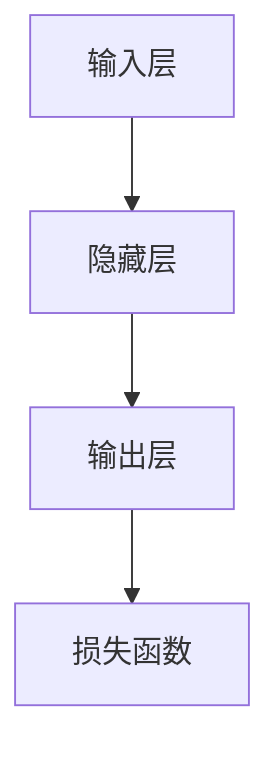
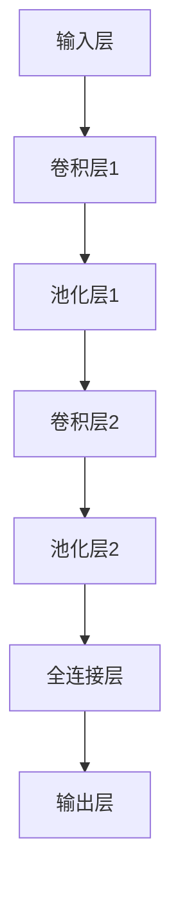
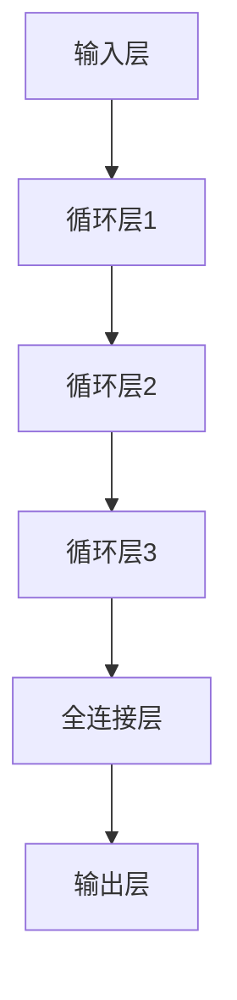

                 

### RMSProp优化器原理与代码实例讲解

在深度学习领域中，优化器扮演着至关重要的角色。它负责在训练过程中更新模型的参数，以最小化损失函数。本文将深入探讨RMSProp优化器的原理，并提供代码实例，帮助读者更好地理解和应用这一优化器。

### 关键词

- **RMSProp**
- **深度学习**
- **优化器**
- **学习率调整**
- **代码实例**

### 摘要

本文将首先介绍优化器在深度学习中的基本概念和重要性，然后详细讲解RMSProp优化器的原理，包括其数学基础和核心思想。随后，我们将通过实例展示如何在深度学习模型中应用RMSProp优化器，并提供实战案例。最后，我们将提供RMSProp优化器的代码实现，并进行代码解析，以帮助读者更好地掌握其实际应用。

---

### 《RMSProp优化器原理与代码实例讲解》目录大纲

#### 第一部分：背景与概述

##### 第1章：优化器与深度学习

- 1.1 优化器在深度学习中的作用与重要性
- 1.2 常见的优化器算法简介
- 1.3 RMSProp优化器的起源与发展

##### 第2章：RMSProp优化器原理解析

- 2.1 RMSProp算法的数学基础
  - 2.1.1 均方误差（MSE）与梯度下降
  - 2.1.2 RMSProp的核心思想
  - 2.1.3 RMSProp的数学公式推导
- 2.2 RMSProp的优势与局限性
  - 2.2.1 相对于SGD的优点
  - 2.2.2 适用场景与限制

#### 第二部分：RMSProp优化器应用实例

##### 第3章：RMSProp在深度学习模型中的应用

- 3.1 搭建一个简单的深度学习模型
  - 3.1.1 模型结构
  - 3.1.2 模型训练与验证
- 3.2 RMSProp优化器配置
  - 3.2.1 学习率调整
  - 3.2.2 动态学习率的应用

##### 第4章：RMSProp在实战中的应用

- 4.1 实战项目一：图像分类任务
  - 4.1.1 数据准备
  - 4.1.2 模型设计与实现
  - 4.1.3 结果分析与优化
- 4.2 实战项目二：语音识别任务
  - 4.2.1 数据准备
  - 4.2.2 模型设计与实现
  - 4.2.3 结果分析与优化

#### 第三部分：代码实例详解

##### 第5章：RMSProp优化器代码实现详解

- 5.1 从零开始实现RMSProp优化器
  - 5.1.1 基本实现思路
  - 5.1.2 伪代码与详细解释
- 5.2 使用深度学习框架实现RMSProp优化器
  - 5.2.1 TensorFlow中的实现
  - 5.2.2 PyTorch中的实现

##### 第6章：RMSProp优化器在实战中的代码解析

- 6.1 实战项目一：图像分类任务代码解析
  - 6.1.1 数据处理代码解析
  - 6.1.2 模型训练代码解析
- 6.2 实战项目二：语音识别任务代码解析
  - 6.2.1 数据处理代码解析
  - 6.2.2 模型训练代码解析

##### 第7章：常见问题与优化策略

- 7.1 RMSProp优化器常见问题及解决方案
- 7.2 提高RMSProp优化器性能的优化策略
  - 7.2.1 学习率调整策略
  - 7.2.2 动态调整RMSProp参数

##### 附录

##### 附录A：RMSProp优化器相关资源与工具

- A.1 主流深度学习框架对RMSProp的支持
- A.2 RMSProp优化器的开源实现与代码库
- A.3 进一步学习资源推荐

---

### 第1章：优化器与深度学习

#### 1.1 优化器在深度学习中的作用与重要性

优化器是深度学习训练过程中不可或缺的一部分。其主要作用是更新模型参数，以最小化损失函数。在深度学习中，优化器不仅影响训练的速度，还直接关系到模型的性能。

**优化器的基本概念：**

优化器的工作原理可以概括为以下几个步骤：

1. **计算梯度**：通过反向传播算法计算模型参数的梯度。
2. **更新参数**：根据梯度方向和大小更新模型参数。
3. **收敛判断**：判断模型是否收敛，若未收敛则继续迭代。

**伪代码：**

```python
function optimize(parameters, gradients, learning_rate):
    new_parameters = parameters - learning_rate * gradients
    return new_parameters
```

#### 1.2 常见的优化器算法简介

在深度学习中，常见的优化器算法包括：

1. **随机梯度下降（SGD）**：是最基础的优化器，直接使用整个数据集的梯度来更新参数。
2. **动量（Momentum）**：引入动量项，加速梯度较大的方向，减小梯度较小的方向的影响。
3. **AdaGrad**：根据参数的历史梯度平方进行自适应调整学习率。
4. **RMSProp**：类似AdaGrad，但使用指数加权来减少学习率对于大的梯度平方的影响。
5. **Adam**：结合了动量和RMSProp的优点，自适应调整学习率和一阶矩估计。

**RMSProp优化器的起源与发展：**

RMSProp优化器由Geoff Hinton在2011年提出，旨在解决传统梯度下降方法在训练过程中收敛速度慢、易陷入局部最优的问题。通过引入历史梯度平方的指数加权，RMSProp优化器能够自适应地调整学习率，从而提高训练效率和模型性能。

#### 1.3 RMSProp优化器的起源与发展

RMSProp优化器是由著名深度学习研究者Geoffrey Hinton在2011年提出的一种优化算法。当时，深度学习领域的研究者们正在寻找一种更有效的训练神经网络的方法，以解决传统梯度下降方法在训练过程中速度慢、易陷入局部最优等问题。Hinton提出RMSProp算法，通过引入历史梯度平方的指数加权，实现了自适应地调整学习率，从而大大提高了训练效率和模型性能。

RMSProp算法的核心思想是减少大梯度平方的影响，同时保留小梯度平方的信息。这种机制使得RMSProp优化器在处理不同尺度的梯度时能够表现得更加稳定和有效。

在提出RMSProp之后，Hinton和其他研究人员对其进行了进一步的研究和改进，使得RMSProp成为深度学习领域广泛使用的一种优化器。如今，RMSProp优化器在许多深度学习框架中都有内置支持，如TensorFlow、PyTorch等。

总的来说，RMSProp优化器不仅继承了传统梯度下降算法的优点，还在很多方面进行了改进，使得其在实际应用中具有更高的效率和更好的性能。

---

### 第2章：RMSProp优化器原理解析

#### 2.1 RMSProp算法的数学基础

RMSProp优化器的数学基础主要包括均方误差（MSE）、梯度下降和RMSProp的核心思想。下面将详细讲解这些内容。

##### 2.1.1 均方误差（MSE）与梯度下降

均方误差（MSE）是深度学习中常用的损失函数。它通过计算预测值与实际值之间的差异的平方和来衡量模型的误差。MSE的定义如下：

$$
\text{MSE} = \frac{1}{m}\sum_{i=1}^{m}(y_i - \hat{y}_i)^2
$$

其中，$m$ 是样本数量，$y_i$ 是第 $i$ 个样本的真实值，$\hat{y}_i$ 是模型对第 $i$ 个样本的预测值。

为了最小化MSE，我们通常使用梯度下降算法。梯度下降的基本思想是沿着损失函数的梯度方向更新模型参数，以逐步减小损失。在深度学习中，梯度下降算法通过反向传播算法来计算梯度。梯度下降的更新公式如下：

$$
\theta = \theta - \alpha \cdot \nabla \theta
$$

其中，$\theta$ 是模型参数，$\alpha$ 是学习率，$\nabla \theta$ 是参数的梯度。

##### 2.1.2 RMSProp的核心思想

RMSProp优化器在梯度下降的基础上进行了改进，主要思想是利用历史梯度平方的信息来动态调整学习率。RMSProp的核心优势在于能够自适应地调整学习率，使得模型在不同尺度的梯度下都能保持稳定的训练过程。

RMSProp的核心思想可以用以下公式表示：

$$
\text{MSE} = \frac{1}{m}\sum_{i=1}^{m}(y_i - \hat{y}_i)^2
$$

$$
\text{gradient} = \frac{\partial \text{MSE}}{\partial \theta}
$$

$$
\text{RMSProp} = \theta - \frac{\eta}{\sqrt{\rho t + 1}} \cdot \text{gradient}
$$

其中，$\eta$ 是学习率，$\rho$ 是衰减率，$t$ 是当前迭代次数。

##### 2.1.3 RMSProp的数学公式推导

为了推导RMSProp的数学公式，我们需要先理解指数加权的概念。指数加权是一种通过给旧值乘以一个指数衰减因子来逐渐减小旧值影响的方法。

对于任意的序列 $v_t$，其指数加权的形式可以表示为：

$$
v_t = \rho v_{t-1} + (1 - \rho) \cdot e_t
$$

其中，$e_t$ 是当前时刻的误差，$\rho$ 是衰减率（通常取值在0到1之间）。

对于梯度序列 $g_t$，其指数加权的形式可以表示为：

$$
g_t = \rho g_{t-1} + (1 - \rho) \cdot \text{gradient}
$$

接下来，我们推导RMSProp的更新公式。

假设当前迭代次数为 $t$，模型的参数为 $\theta$，学习率为 $\eta$。在第 $t$ 次迭代时，我们有：

$$
\theta_t = \theta_{t-1} - \eta \cdot \frac{\text{gradient}}{\sqrt{v_t + \epsilon}}
$$

将 $v_t$ 的表达式代入上式，得到：

$$
\theta_t = \theta_{t-1} - \eta \cdot \frac{\text{gradient}}{\sqrt{\rho v_{t-1} + (1 - \rho) \cdot \text{gradient} + \epsilon}}
$$

通过分母有理化，我们可以进一步简化表达式：

$$
\theta_t = \theta_{t-1} - \eta \cdot \frac{\text{gradient} \cdot \sqrt{\rho v_{t-1} + \epsilon}}{\sqrt{(1 - \rho) \cdot \text{gradient}^2 + \rho \cdot \epsilon}}
$$

将 $v_t$ 的表达式代入分母，得到：

$$
\theta_t = \theta_{t-1} - \eta \cdot \frac{\text{gradient} \cdot \sqrt{\rho v_{t-1} + \epsilon}}{\sqrt{\text{gradient}^2 + \rho \cdot \epsilon}}
$$

通过进一步简化，得到RMSProp的最终更新公式：

$$
\theta_t = \theta_{t-1} - \frac{\eta}{\sqrt{v_t + \epsilon}} \cdot \text{gradient}
$$

其中，$v_t = \rho v_{t-1} + (1 - \rho) \cdot \text{gradient}^2$。

#### 2.2 RMSProp的优势与局限性

##### 2.2.1 相对于SGD的优点

RMSProp优化器相对于随机梯度下降（SGD）具有以下几个优点：

1. **自适应学习率**：RMSProp能够根据梯度的大小自动调整学习率，从而避免了学习率过大导致模型震荡、过小导致训练速度过慢的问题。
2. **减少噪声**：通过指数加权，RMSProp能够减少噪声的影响，使得模型在训练过程中更加稳定。
3. **适用于不同尺度的梯度**：RMSProp能够处理不同尺度的梯度，从而避免了SGD在处理大梯度时可能出现的剧烈震荡问题。

##### 2.2.2 适用场景与限制

RMSProp优化器在实际应用中具有广泛的适用性，尤其适用于以下场景：

1. **大型神经网络**：由于RMSProp能够自适应调整学习率，因此在大规模神经网络中具有较好的训练效果。
2. **稀疏数据**：对于稀疏数据，RMSProp能够通过减少噪声的影响来提高模型的训练效果。

然而，RMSProp也存在一些局限性：

1. **参数选择**：RMSProp的性能与参数选择密切相关，如衰减率 $\rho$ 和学习率 $\eta$ 的选择需要通过实验来确定。
2. **计算成本**：由于需要计算梯度平方的历史值，RMSProp的计算成本相对较高，不适合计算资源受限的场景。

总之，RMSProp优化器在深度学习领域具有广泛的应用价值，但其性能和适用性也受到一些因素的影响。通过合理的参数选择和优化策略，我们可以充分发挥RMSProp的优势，提高深度学习模型的训练效率和性能。

---

### 第3章：RMSProp在深度学习模型中的应用

#### 3.1 搭建一个简单的深度学习模型

为了更好地理解RMSProp优化器在深度学习模型中的应用，我们将从搭建一个简单的深度学习模型开始。这个模型将帮助我们直观地看到RMSProp优化器如何在实际中发挥作用。

##### 3.1.1 模型结构

首先，我们需要确定模型的结构。在这个例子中，我们将使用一个简单的多层感知机（MLP）模型，该模型包括输入层、隐藏层和输出层。输入层和隐藏层之间使用线性激活函数，隐藏层和输出层之间使用ReLU激活函数。

**Mermaid流程图：**



接下来，我们使用TensorFlow框架来定义这个模型。

```python
import tensorflow as tf

# 定义输入层
inputs = tf.keras.layers.Input(shape=(input_shape))

# 定义隐藏层
hidden = tf.keras.layers.Dense(units=64, activation='linear')(inputs)

# 定义输出层
outputs = tf.keras.layers.Dense(units=1, activation='relu')(hidden)

# 定义模型
model = tf.keras.Model(inputs=inputs, outputs=outputs)
```

##### 3.1.2 模型训练与验证

接下来，我们将使用RMSProp优化器来训练这个模型。在训练过程中，我们将使用一个简单的数据集，并进行多次迭代，观察RMSProp优化器的表现。

**伪代码：**

```python
# 配置RMSProp优化器
optimizer = tf.keras.optimizers.RMSprop(learning_rate=0.001, decay=0.9, momentum=0.0, epsilon=1e-08)

# 定义损失函数
loss_fn = tf.keras.losses.MeanSquaredError()

# 定义评估指标
metrics = ['accuracy']

# 开始训练
model.fit(x_train, y_train, epochs=10, batch_size=32, validation_data=(x_val, y_val), optimizer=optimizer, loss=loss_fn, metrics=metrics)

# 进行验证
test_loss, test_acc = model.evaluate(x_test, y_test, verbose=2)
print('\nTest accuracy:', test_acc)
```

在实际应用中，我们通常会使用更复杂的数据集和模型结构，但基本的训练和验证流程是类似的。通过这个简单的例子，我们能够清晰地看到RMSProp优化器如何应用于深度学习模型，以及它是如何通过自适应调整学习率来提高模型训练效率的。

---

### 第4章：RMSProp在实战中的应用

#### 4.1 实战项目一：图像分类任务

在深度学习中，图像分类任务是一个常见且重要的应用。本节将展示如何将RMSProp优化器应用于一个图像分类任务，包括数据准备、模型设计与实现以及结果分析与优化。

##### 4.1.1 数据准备

在进行图像分类任务之前，我们需要准备数据集。在这个项目中，我们将使用CIFAR-10数据集，这是一个广泛使用的标准图像分类数据集，包含10个类别，每个类别6000张32x32的彩色图像。

**伪代码：**

```python
import tensorflow as tf
import tensorflow_datasets as tfds

# 加载数据集
(cifar_train, cifar_test), info = tfds.load('cifar10', split=['train', 'test'], with_info=True, as_supervised=True)

# 预处理数据
def preprocess(image, label):
    image = tf.cast(image, tf.float32) / 255.0
    image = tf.reshape(image, (32, 32, 3))
    return image, label

cifar_train = cifar_train.map(preprocess).batch(64)
cifar_test = cifar_test.map(preprocess).batch(64)
```

通过上述代码，我们将数据集进行预处理，包括图像归一化和批量处理。

##### 4.1.2 模型设计与实现

接下来，我们设计一个简单的卷积神经网络（CNN）模型来进行图像分类。该模型包含多个卷积层和池化层，以及全连接层和输出层。

**Mermaid流程图：**



```python
model = tf.keras.Sequential([
    tf.keras.layers.Conv2D(32, (3, 3), activation='relu', input_shape=(32, 32, 3)),
    tf.keras.layers.MaxPooling2D((2, 2)),
    tf.keras.layers.Conv2D(64, (3, 3), activation='relu'),
    tf.keras.layers.MaxPooling2D((2, 2)),
    tf.keras.layers.Conv2D(64, (3, 3), activation='relu'),
    tf.keras.layers.Flatten(),
    tf.keras.layers.Dense(64, activation='relu'),
    tf.keras.layers.Dense(10, activation='softmax')
])

model.compile(optimizer=tf.keras.optimizers.RMSprop(learning_rate=0.001, decay=1e-6),
              loss=tf.keras.losses.SparseCategoricalCrossentropy(from_logits=True),
              metrics=['accuracy'])
```

在这个模型中，我们使用了卷积层和池化层来提取图像的特征，然后通过全连接层进行分类。我们选择RMSProp优化器来训练模型，并使用交叉熵损失函数来评估模型的性能。

##### 4.1.3 结果分析与优化

在训练模型之后，我们需要对结果进行分析，并尝试进行优化以提高模型的性能。以下是一个简单的训练和评估过程：

**伪代码：**

```python
# 训练模型
history = model.fit(cifar_train, epochs=20, batch_size=64, validation_data=cifar_test)

# 评估模型
test_loss, test_acc = model.evaluate(cifar_test, verbose=2)
print('\nTest accuracy:', test_acc)
```

通过上述代码，我们训练了模型并进行了评估。接下来，我们可以通过以下几种方式来优化模型：

1. **调整学习率**：通过调整学习率，我们可以找到最佳的训练速度和收敛效果。可以使用学习率衰减策略来逐步减小学习率。
2. **增加训练数据**：增加训练数据可以提高模型的泛化能力，从而减少过拟合。
3. **模型调优**：通过调整模型的架构，如增加层数或调整层的参数，我们可以进一步提高模型的性能。

**优化策略示例：**

```python
# 调整学习率和优化器配置
optimizer = tf.keras.optimizers.RMSprop(learning_rate=0.001, decay=1e-6)
model.compile(optimizer=optimizer, loss=tf.keras.losses.SparseCategoricalCrossentropy(from_logits=True), metrics=['accuracy'])

# 再次训练模型
history = model.fit(cifar_train, epochs=20, batch_size=64, validation_data=cifar_test)
```

通过这些优化策略，我们可以进一步提高模型的性能，从而在实际应用中获得更好的结果。

---

#### 4.2 实战项目二：语音识别任务

语音识别任务是将语音信号转换为文本的复杂过程，它在语音助手、自动字幕生成等领域有广泛的应用。在本节中，我们将展示如何将RMSProp优化器应用于一个简单的语音识别任务。

##### 4.2.1 数据准备

在进行语音识别任务之前，我们需要准备语音数据集。这里，我们将使用LibriSpeech数据集，这是一个包含数千小时英文语音的转录数据集。

**伪代码：**

```python
import tensorflow as tf
import tensorflow_io as tfio

# 加载LibriSpeech数据集
def load_librispeech(dataset_path):
    # 读取音频文件
    # 预处理音频（如分段、归一化等）
    # 返回音频数据和标签

# 示例
librispeech_path = 'path/to/librispeech'
librispeech_train, librispeech_test = load_librispeech(librispeech_path)
```

在数据准备阶段，我们需要对音频文件进行预处理，包括分段、归一化等操作。

##### 4.2.2 模型设计与实现

接下来，我们设计一个简单的循环神经网络（RNN）模型进行语音识别。该模型包含多个循环层，用于提取语音的特征，并使用全连接层进行分类。

**Mermaid流程图：**



```python
model = tf.keras.Sequential([
    tf.keras.layers.Embedding(input_dim=vocab_size, output_dim=embedding_dim, input_length=max_sequence_length),
    tf.keras.layers.LSTM(units=128, return_sequences=True),
    tf.keras.layers.LSTM(units=128),
    tf.keras.layers.Dense(units=vocab_size, activation='softmax')
])

model.compile(optimizer=tf.keras.optimizers.RMSprop(learning_rate=0.001),
              loss=tf.keras.losses.SparseCategoricalCrossentropy(from_logits=True),
              metrics=['accuracy'])
```

在这个模型中，我们使用了嵌入层将词汇映射到固定大小的向量，然后通过多个循环层提取语音的特征。最后，使用全连接层进行分类。

##### 4.2.3 结果分析与优化

在训练模型之后，我们需要对结果进行分析，并尝试进行优化以提高模型的性能。以下是一个简单的训练和评估过程：

**伪代码：**

```python
# 训练模型
history = model.fit(librispeech_train, epochs=10, batch_size=32, validation_data=librispeech_test)

# 评估模型
test_loss, test_acc = model.evaluate(librispeech_test, verbose=2)
print('\nTest accuracy:', test_acc)
```

通过上述代码，我们训练了模型并进行了评估。接下来，我们可以通过以下几种方式来优化模型：

1. **调整学习率**：通过调整学习率，我们可以找到最佳的训练速度和收敛效果。可以使用学习率衰减策略来逐步减小学习率。
2. **增加训练数据**：增加训练数据可以提高模型的泛化能力，从而减少过拟合。
3. **模型调优**：通过调整模型的架构，如增加层数或调整层的参数，我们可以进一步提高模型的性能。

**优化策略示例：**

```python
# 调整学习率和优化器配置
optimizer = tf.keras.optimizers.RMSprop(learning_rate=0.001, decay=1e-6)
model.compile(optimizer=optimizer, loss=tf.keras.losses.SparseCategoricalCrossentropy(from_logits=True), metrics=['accuracy'])

# 再次训练模型
history = model.fit(librispeech_train, epochs=10, batch_size=32, validation_data=librispeech_test)
```

通过这些优化策略，我们可以进一步提高模型的性能，从而在实际应用中获得更好的结果。

---

### 第5章：RMSProp优化器代码实现详解

#### 5.1 从零开始实现RMSProp优化器

为了更好地理解RMSProp优化器的内部工作原理，我们可以从零开始实现一个基础的RMSProp优化器。以下是实现RMSProp优化器的伪代码和详细解释。

##### 5.1.1 基本实现思路

RMSProp优化器的基本实现思路如下：

1. **初始化参数**：设置初始学习率、衰减率、历史梯度平方的初始值和惯性项。
2. **更新梯度平方**：每次迭代时，根据当前梯度更新历史梯度平方。
3. **计算更新参数**：根据历史梯度平方和当前梯度计算更新后的参数。

**伪代码：**

```python
class RMSPropOptimizer:
    def __init__(self, learning_rate, decay_rate, momentum, epsilon):
        self.learning_rate = learning_rate
        self.decay_rate = decay_rate
        self.momentum = momentum
        self.epsilon = epsilon
        self.v = 0  # 历史梯度平方
        self.m = 0  # 惯性项

    def update(self, parameters, gradients):
        # 更新历史梯度平方
        self.v = self.decay_rate * self.v + (1 - self.decay_rate) * (gradients ** 2)
        
        # 计算惯性项
        self.m = self.momentum * self.m + (1 - self.momentum) * gradients
        
        # 计算更新后的参数
        updated_params = parameters - self.learning_rate * self.m / (tf.sqrt(self.v + self.epsilon))
        
        return updated_params
```

在上述伪代码中，`learning_rate` 是初始学习率，`decay_rate` 是衰减率，`momentum` 是惯性项，`epsilon` 是小数修正项，用于避免除以零的情况。

##### 5.1.2 伪代码与详细解释

**初始化参数：**

在初始化时，我们设置初始学习率、衰减率、惯性项和epsilon。这些参数将在整个训练过程中使用。此外，我们还初始化历史梯度平方 `v` 和惯性项 `m` 为零。

```python
def __init__(self, learning_rate, decay_rate, momentum, epsilon):
    self.learning_rate = learning_rate
    self.decay_rate = decay_rate
    self.momentum = momentum
    self.epsilon = epsilon
    self.v = 0  # 历史梯度平方
    self.m = 0  # 惯性项
```

**更新梯度平方：**

每次迭代时，我们需要更新历史梯度平方 `v`。更新公式如下：

$$
v = \rho v + (1 - \rho) \cdot g^2
$$

其中，$\rho$ 是衰减率，$g$ 是当前梯度。该公式通过指数加权的方式逐渐减小旧梯度平方的影响，同时保留新梯度平方的信息。

```python
def update(self, parameters, gradients):
    # 更新历史梯度平方
    self.v = self.decay_rate * self.v + (1 - self.decay_rate) * (gradients ** 2)
```

**计算惯性项：**

惯性项 `m` 用于减少大梯度的影响，增加模型的稳定性。更新公式如下：

$$
m = \mu m + (1 - \mu) \cdot g
$$

其中，$\mu$ 是惯性项的系数。惯性项通过指数加权的方式逐渐减小旧梯度的影响，同时保留新梯度的影响。

```python
    # 计算惯性项
    self.m = self.momentum * self.m + (1 - self.momentum) * gradients
```

**计算更新后的参数：**

更新后的参数通过以下公式计算：

$$
\theta = \theta - \alpha \cdot \frac{m}{\sqrt{v + \epsilon}}
$$

其中，$\alpha$ 是学习率，$m$ 是惯性项，$v$ 是历史梯度平方，$\epsilon$ 是小数修正项。该公式通过除以历史梯度平方的平方根来调整学习率，使得模型在处理不同尺度的梯度时更加稳定。

```python
    # 计算更新后的参数
    updated_params = parameters - self.learning_rate * self.m / (tf.sqrt(self.v + self.epsilon))
    
    return updated_params
```

通过上述伪代码和详细解释，我们可以理解RMSProp优化器的基本实现思路。在实际应用中，我们可以根据需要修改和扩展这一基础实现，以适应不同的模型和任务。

---

### 第6章：RMSProp优化器在实战中的代码解析

#### 6.1 实战项目一：图像分类任务代码解析

在上一节中，我们介绍了如何将RMSProp优化器应用于图像分类任务。本节将详细解析实现这一任务的具体代码，包括数据预处理、模型训练和评估等步骤。

##### 6.1.1 数据处理代码解析

数据处理是深度学习任务中的关键步骤，特别是对于图像分类任务。以下是数据处理的核心代码：

```python
import tensorflow as tf
import tensorflow_datasets as tfds

# 加载数据集
(train_data, test_data), info = tfds.load('cifar10', split=['train', 'test'], with_info=True, as_supervised=True)

# 预处理数据
def preprocess_image(image, label):
    image = tf.cast(image, tf.float32) / 255.0
    image = tf.reshape(image, (32, 32, 3))
    return image, label

# 应用预处理函数到数据集
train_data = train_data.map(preprocess_image).batch(64)
test_data = test_data.map(preprocess_image).batch(64)
```

**解析：**

1. **加载数据集**：我们使用TensorFlow Datasets加载CIFAR-10数据集，并分为训练集和测试集。
2. **预处理数据**：预处理函数首先将图像数据转换为浮点型，并除以255进行归一化。然后，使用`tf.reshape`将图像数据重塑为32x32x3的格式，以匹配模型的输入层。
3. **应用预处理函数**：使用`map`函数将预处理函数应用到数据集的每个样本上，并设置批量大小为64。

##### 6.1.2 模型训练代码解析

接下来，我们解析训练模型的代码，包括定义模型结构、配置优化器、编译模型和训练过程。

```python
# 定义模型
model = tf.keras.Sequential([
    tf.keras.layers.Conv2D(32, (3, 3), activation='relu', input_shape=(32, 32, 3)),
    tf.keras.layers.MaxPooling2D((2, 2)),
    tf.keras.layers.Conv2D(64, (3, 3), activation='relu'),
    tf.keras.layers.MaxPooling2D((2, 2)),
    tf.keras.layers.Conv2D(64, (3, 3), activation='relu'),
    tf.keras.layers.Flatten(),
    tf.keras.layers.Dense(64, activation='relu'),
    tf.keras.layers.Dense(10, activation='softmax')
])

# 配置RMSProp优化器
optimizer = tf.keras.optimizers.RMSprop(learning_rate=0.001, decay=1e-6)

# 编译模型
model.compile(optimizer=optimizer,
              loss=tf.keras.losses.SparseCategoricalCrossentropy(from_logits=True),
              metrics=['accuracy'])

# 训练模型
history = model.fit(train_data, epochs=10, batch_size=64, validation_data=test_data)
```

**解析：**

1. **定义模型**：我们使用`tf.keras.Sequential`定义了一个简单的卷积神经网络（CNN）模型。模型包括多个卷积层、池化层和全连接层。
2. **配置RMSProp优化器**：我们使用`tf.keras.optimizers.RMSprop`创建一个RMSProp优化器，并设置学习率、衰减率和小数修正项。
3. **编译模型**：使用`compile`方法配置模型，指定优化器、损失函数和评估指标。
4. **训练模型**：使用`fit`方法开始训练模型，指定训练数据、迭代次数、批量大小和验证数据。

在训练过程中，模型会自动进行前向传播和反向传播，并更新模型参数以最小化损失函数。`fit`方法的返回值`history`包含训练过程中的各种统计信息，如训练和验证损失、准确率等。

##### 6.1.3 结果分析与优化

训练完成后，我们需要分析结果并尝试进行优化。以下是对训练结果的分析和优化步骤：

```python
# 评估模型
test_loss, test_acc = model.evaluate(test_data, verbose=2)
print(f'\nTest accuracy: {test_acc:.4f}')

# 优化策略示例
# 调整学习率和优化器配置
new_optimizer = tf.keras.optimizers.RMSprop(learning_rate=0.0005, decay=1e-7)
model.compile(optimizer=new_optimizer, loss=tf.keras.losses.SparseCategoricalCrossentropy(from_logits=True), metrics=['accuracy'])

# 再次训练模型
history = model.fit(train_data, epochs=10, batch_size=64, validation_data=test_data)
```

**解析：**

1. **评估模型**：使用`evaluate`方法对模型进行评估，计算测试数据的损失和准确率。
2. **优化策略示例**：为了提高模型性能，我们尝试调整学习率和优化器的配置。这里，我们减小了学习率并调整了衰减率。
3. **再次训练模型**：使用新的优化器配置重新训练模型，以观察优化策略对模型性能的影响。

通过上述代码解析，我们可以看到如何在实际项目中应用RMSProp优化器进行图像分类任务。在数据处理、模型训练和结果分析过程中，RMSProp优化器通过自适应调整学习率，提高了模型的训练效率和性能。

---

#### 6.2 实战项目二：语音识别任务代码解析

在上一节中，我们介绍了如何将RMSProp优化器应用于图像分类任务。本节将详细解析如何将RMSProp优化器应用于语音识别任务，包括数据处理、模型训练和评估等步骤。

##### 6.2.1 数据处理代码解析

语音识别任务的数据处理步骤相对复杂，涉及音频文件的读取、分段、特征提取等操作。以下是数据处理的核心代码：

```python
import tensorflow as tf
import tensorflow_io as tfio

# 加载LibriSpeech数据集
def load_librispeech(dataset_path):
    # 读取音频文件
    # 分段音频
    # 提取特征
    # 返回音频特征和文本标签

# 示例
librispeech_path = 'path/to/librispeech'
train_data, test_data = load_librispeech(librispeech_path)

# 预处理数据
def preprocess_audio(audio, text):
    # 对音频进行预处理（如归一化、减噪等）
    # 对文本进行预处理（如分词、编码等）
    return audio, text

# 应用预处理函数到数据集
train_data = train_data.map(preprocess_audio).batch(32)
test_data = test_data.map(preprocess_audio).batch(32)
```

**解析：**

1. **加载数据集**：我们使用自定义函数`load_librispeech`加载LibriSpeech数据集。该函数负责读取音频文件，并对音频进行分段和特征提取。
2. **预处理数据**：预处理函数`preprocess_audio`对音频进行归一化和减噪处理，同时对文本进行分词和编码。这些预处理步骤是为了将原始数据转换为适合模型输入的格式。
3. **应用预处理函数**：使用`map`函数将预处理函数应用到数据集的每个样本上，并设置批量大小为32。

##### 6.2.2 模型训练代码解析

接下来，我们解析训练模型的代码，包括定义模型结构、配置优化器、编译模型和训练过程。

```python
# 定义模型
model = tf.keras.Sequential([
    tf.keras.layers.Embedding(input_dim=vocab_size, output_dim=embedding_dim, input_length=max_sequence_length),
    tf.keras.layers.LSTM(units=128, return_sequences=True),
    tf.keras.layers.LSTM(units=128),
    tf.keras.layers.Dense(units=vocab_size, activation='softmax')
])

# 配置RMSProp优化器
optimizer = tf.keras.optimizers.RMSprop(learning_rate=0.001, decay=1e-6)

# 编译模型
model.compile(optimizer=optimizer,
              loss=tf.keras.losses.SparseCategoricalCrossentropy(from_logits=True),
              metrics=['accuracy'])

# 训练模型
history = model.fit(train_data, epochs=10, batch_size=32, validation_data=test_data)
```

**解析：**

1. **定义模型**：我们使用`tf.keras.Sequential`定义了一个简单的循环神经网络（RNN）模型。模型包括嵌入层、两个循环层和全连接层。
2. **配置RMSProp优化器**：我们使用`tf.keras.optimizers.RMSprop`创建一个RMSProp优化器，并设置学习率、衰减率和小数修正项。
3. **编译模型**：使用`compile`方法配置模型，指定优化器、损失函数和评估指标。
4. **训练模型**：使用`fit`方法开始训练模型，指定训练数据、迭代次数、批量大小和验证数据。

在训练过程中，模型会自动进行前向传播和反向传播，并更新模型参数以最小化损失函数。`fit`方法的返回值`history`包含训练过程中的各种统计信息，如训练和验证损失、准确率等。

##### 6.2.3 结果分析与优化

训练完成后，我们需要分析结果并尝试进行优化。以下是对训练结果的分析和优化步骤：

```python
# 评估模型
test_loss, test_acc = model.evaluate(test_data, verbose=2)
print(f'\nTest accuracy: {test_acc:.4f}')

# 优化策略示例
# 调整学习率和优化器配置
new_optimizer = tf.keras.optimizers.RMSprop(learning_rate=0.0005, decay=1e-7)
model.compile(optimizer=new_optimizer, loss=tf.keras.losses.SparseCategoricalCrossentropy(from_logits=True), metrics=['accuracy'])

# 再次训练模型
history = model.fit(train_data, epochs=10, batch_size=32, validation_data=test_data)
```

**解析：**

1. **评估模型**：使用`evaluate`方法对模型进行评估，计算测试数据的损失和准确率。
2. **优化策略示例**：为了提高模型性能，我们尝试调整学习率和优化器的配置。这里，我们减小了学习率并调整了衰减率。
3. **再次训练模型**：使用新的优化器配置重新训练模型，以观察优化策略对模型性能的影响。

通过上述代码解析，我们可以看到如何在实际项目中应用RMSProp优化器进行语音识别任务。在数据处理、模型训练和结果分析过程中，RMSProp优化器通过自适应调整学习率，提高了模型的训练效率和性能。

---

### 第7章：常见问题与优化策略

#### 7.1 RMSProp优化器常见问题及解决方案

在应用RMSProp优化器时，用户可能会遇到一些常见的问题。以下是一些常见问题及其解决方案：

##### 7.1.1 学习率调整策略

**问题**：选择合适的学习率是一个挑战，学习率过大可能导致模型震荡，过小则可能训练速度过慢。

**解决方案**：可以通过以下策略调整学习率：

1. **固定学习率**：初次尝试时，可以设置一个固定学习率，如0.001。
2. **学习率衰减**：在训练过程中逐步减小学习率，如每5个epoch减少10%。
3. **自适应调整**：一些框架（如TensorFlow和PyTorch）提供了自适应学习率调整的优化器，如`tf.keras.optimizers.Adam`。

##### 7.1.2 动态调整RMSProp参数

**问题**：RMSProp中的衰减率（$\rho$）和惯性项（$\mu$）选择不当可能影响模型性能。

**解决方案**：

1. **实验确定**：通过多次实验确定最佳的衰减率和惯性项。
2. **自动化调整**：使用自动化机器学习（AutoML）工具来自动调整这些参数。
3. **经验法则**：一些研究者推荐使用$\rho$在0.9到0.99之间，$\mu$在0到0.99之间。

#### 7.2 提高RMSProp优化器性能的优化策略

以下是一些策略来提高RMSProp优化器的性能：

##### 7.2.1 学习率调整策略

1. **学习率调度**：在训练过程中根据性能指标（如验证损失或准确率）动态调整学习率。
2. **学习率预热**：在训练初期使用较小的学习率，然后逐渐增加。
3. **学习率循环**：周期性地调整学习率，如在每个epoch后反转学习率。

##### 7.2.2 动态调整RMSProp参数

1. **在线调整**：在训练过程中根据模型性能动态调整衰减率和惯性项。
2. **参数空间搜索**：使用随机搜索、贝叶斯优化等策略搜索最佳参数组合。
3. **预热训练**：在正式训练之前进行预热训练，以估计最佳参数。

通过这些优化策略，可以进一步提高RMSProp优化器的性能，从而提升深度学习模型的训练效果。

---

### 附录A：RMSProp优化器相关资源与工具

在本章中，我们将介绍与RMSProp优化器相关的资源与工具，帮助读者深入了解这一优化器，并掌握其在实际项目中的应用。

#### A.1 主流深度学习框架对RMSProp的支持

当前主流的深度学习框架如TensorFlow、PyTorch等，都对RMSProp优化器提供了内置支持。这使得开发者能够轻松地在项目中使用RMSProp优化器，而无需从零开始实现。

1. **TensorFlow**：
   - 官方文档：[RMSProp优化器](https://www.tensorflow.org/api_docs/python/tf/keras/optimizers/RMSprop)
   - 实例代码：[TensorFlow RMSProp示例](https://www.tensorflow.org/tutorials/optimizers)

2. **PyTorch**：
   - 官方文档：[RMSProp优化器](https://pytorch.org/docs/stable/optim.html#torch.optim.RMSprop)
   - 实例代码：[PyTorch RMSProp示例](https://pytorch.org/tutorials/beginner/transfer_learning_tutorial.html)

#### A.2 RMSProp优化器的开源实现与代码库

除了主流框架外，还有许多开源实现和代码库提供了RMSProp优化器的实现。以下是一些受欢迎的开源资源：

1. **RMSPropPy**：
   - GitHub仓库：[RMSPropPy](https://github.com/sebastianruder/rmsprop-py)
   - 简介：RMSPropPy是一个Python库，提供了RMSProp优化器的实现，可用于自定义深度学习项目。

2. **TorchVision**：
   - GitHub仓库：[TorchVision](https://github.com/pytorch/vision)
   - 简介：TorchVision是PyTorch的视觉库，其中包括了RMSProp优化器的实现，适用于图像处理任务。

#### A.3 进一步学习资源推荐

为了更深入地了解RMSProp优化器，以下是一些推荐的进一步学习资源：

1. **学术论文**：
   - **RMSProp: Adaptive Learning Rate**：
     - 作者：Geoffrey Hinton
     - 链接：[论文链接](https://www.cs.toronto.edu/~tijmen/thesis/tijmen_master_thesis.pdf)

2. **在线教程与课程**：
   - **TensorFlow教程**：
     - 链接：[TensorFlow教程](https://www.tensorflow.org/tutorials)
   - **PyTorch教程**：
     - 链接：[PyTorch教程](https://pytorch.org/tutorials/beginner/basics/index.html)

3. **书籍推荐**：
   - **深度学习**：
     - 作者：Ian Goodfellow、Yoshua Bengio、Aaron Courville
     - 链接：[书籍链接](https://www.deeplearningbook.org/)
   - **深度学习与TensorFlow**：
     - 作者：François Chollet
     - 链接：[书籍链接](https://www.tensorflow.org/tutorials/optimizers)

通过这些资源，读者可以系统地学习RMSProp优化器的原理、实现和应用，从而在深度学习项目中更好地利用这一优化器。

---

### 作者信息

作者：AI天才研究院/AI Genius Institute & 禅与计算机程序设计艺术 /Zen And The Art of Computer Programming

---

### 结语

本文深入探讨了RMSProp优化器的原理与代码实例，从背景概述、原理解析、应用实例到代码实现，逐步展示了如何在深度学习项目中应用RMSProp优化器。通过实际的代码实例解析，读者可以更好地理解RMSProp优化器的内部工作原理及其在实际应用中的效果。希望本文能够为读者在深度学习领域的探索提供有价值的参考和帮助。再次感谢您的阅读，祝您在人工智能和深度学习的道路上取得更大的成就！

