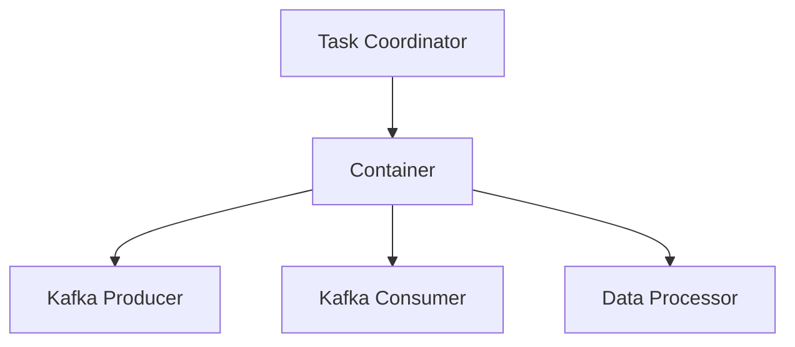
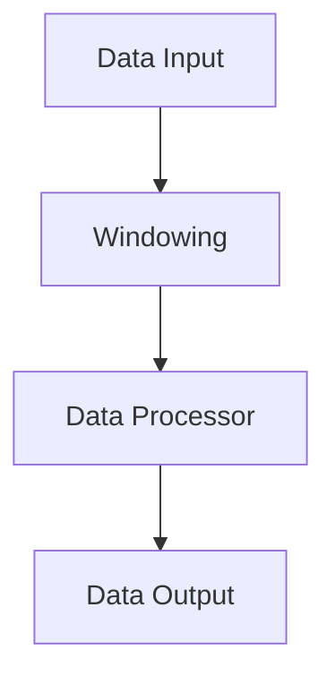
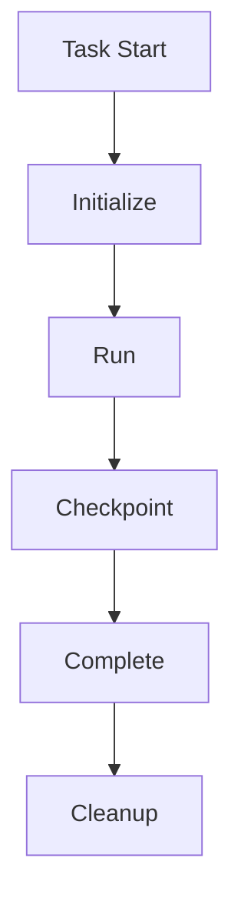

                 

### 文章标题

《Samza Task原理与代码实例讲解》

本文将深入探讨Apache Samza中的`Samza Task`原理，并结合实际代码实例进行详细讲解。通过本文的阅读，读者将能够全面理解Samza Task的核心概念、架构设计以及实现细节。

### 关键词

- Apache Samza
- Samza Task
- 数据流处理
- 窗口机制
- 滑动窗口
- WordCount实例

### 摘要

本文将首先介绍Apache Samza的基本概念和架构，然后深入解析Samza Task的定义、类型和生命周期。接着，我们将详细讲解Samza Task的核心组件、数据流处理和状态管理。此外，本文还将通过伪代码和实际代码实例，展示Samza Task的具体实现过程。最后，我们将探讨Samza Task的最佳实践，包括性能优化、异常处理和安全性考虑。通过本文的学习，读者将能够掌握Samza Task的核心原理，并在实际项目中有效应用。

## 《Samza Task原理与代码实例讲解》目录大纲

本文将分为五个主要部分进行讲解：

1. **Samza概述**：介绍Samza的基本概念、核心特点和应用场景。
2. **Samza Task原理**：详细解析Samza Task的定义、架构、核心算法和生命周期。
3. **Samza Task代码实例**：通过实际代码实例，讲解Samza Task的开发和实现过程。
4. **Samza Task最佳实践**：探讨Samza Task的性能优化、异常处理和安全性。
5. **总结与展望**：总结Samza Task的核心要点，并展望其未来发展趋势。

接下来，我们将按照这个目录结构逐步深入讲解每个部分的内容。首先，我们从Samza的基本概念和架构开始。

## 第一部分：Samza概述

### 1.1 Samza简介

Apache Samza是一个分布式流处理框架，由Twitter开源。它旨在提供简单、可扩展和可靠的分布式数据流处理能力，支持流数据的高吞吐量和低延迟处理。Samza的设计理念是“一次编写，到处运行”，意味着开发者可以在任何环境中使用相同的代码和配置来处理流数据，无论是本地开发环境、测试环境还是生产环境。

#### 1.1.1 Samza的起源

Samza的原型最初是Twitter内部用于处理实时数据的分布式计算框架。随着Twitter业务的快速发展，他们需要一个能够处理大规模流数据的系统，并且要求系统具有高可用性和易扩展性。在这个背景下，Samza应运而生。2013年，Samza作为Twitter的开源项目首次发布。

#### 1.1.2 Samza的核心特点

- **可扩展性**：Samza支持水平扩展，能够无缝地处理大量流数据。
- **高可用性**：Samza提供了故障转移和数据恢复机制，确保系统的高可用性。
- **与Kafka集成**：Samza与Apache Kafka紧密集成，能够高效地处理Kafka主题中的数据流。
- **易于使用**：Samza提供了简单、直观的API，使得开发者能够快速上手和实现复杂的流数据处理任务。
- **支持多种编程语言**：Samza支持多种编程语言，包括Java、Scala和Python，提供了丰富的开发选择。

#### 1.1.3 Samza的应用场景

Samza广泛应用于各种场景，包括：

- 实时分析：处理和分析实时数据流，如用户行为分析、实时广告投放等。
- 日志聚合：实时收集和分析系统日志，用于监控和故障排查。
- 流数据处理：处理大规模的实时数据流，如电商交易流、传感器数据流等。
- 搜索引擎：实时更新和优化搜索引擎的索引。
- 实时推荐系统：根据用户行为和历史数据，实时推荐相关内容。

### 1.2 Samza架构

Samza的架构设计旨在实现分布式、可扩展和可靠的流数据处理。以下是Samza的基本架构组件和它们之间的相互关系：

#### 1.2.1 Samza的基本组件

- **Samza Container**：Samza中的执行单元，负责处理流数据和执行任务。Container是一个独立的服务，可以在任何支持Java的环境中运行。
- **Samza Application**：由开发者编写的代码，用于处理流数据和执行业务逻辑。Application定义了如何从Kafka主题中读取数据、如何处理数据和如何将结果写入Kafka主题。
- **Kafka**：作为消息中间件，Kafka用于传输数据流。Samza Application从Kafka主题中读取数据，处理数据后，将结果写入其他Kafka主题。
- **Zookeeper**：用于协调多个Container的分布式锁和配置管理。

#### 1.2.2 Samza的处理流程

Samza的处理流程可以分为以下几个阶段：

1. **数据读取**：Samza Application从Kafka主题中读取数据。每个Container会从它所订阅的Kafka主题的一个分区中读取数据。
2. **数据处理**：读取到的数据会被Samza Application进行处理。处理逻辑可以是简单的数据转换，也可以是复杂的业务逻辑。
3. **数据写入**：处理后的数据会被写入到其他Kafka主题的一个或多个分区中。
4. **状态管理**：Samza支持状态管理，可以保存和恢复任务的状态。这对于处理窗口操作和容错非常重要。

#### 1.2.3 Samza与Kafka的关系

Samza与Kafka有着紧密的集成关系。Kafka提供了高效、可靠的消息传输机制，而Samza则负责对消息流进行复杂的处理和分析。具体关系如下：

- **数据流传输**：Kafka作为消息中间件，负责传输数据流。Samza Application从Kafka主题中读取数据，处理数据后，将结果写入其他Kafka主题。
- **分区与并行处理**：Kafka的主题可以包含多个分区，每个分区可以被一个Container独立处理。这样可以实现并行处理，提高系统的吞吐量。
- **容错与状态管理**：Kafka提供了持久化的消息存储，即使Container故障，数据也不会丢失。Samza通过状态管理机制，可以恢复任务的状态，确保处理过程的一致性。

通过上述介绍，读者可以初步了解Apache Samza的基本概念和架构。接下来，我们将进一步深入探讨Samza中的核心组件和流程。

### 1.3 Samza与Apache Storm的比较

Apache Storm和Apache Samza都是用于分布式流处理的框架，但它们在设计理念和功能上有所不同。下面我们将对两者进行比较。

#### 1.3.1 设计理念

- **Apache Storm**：Storm是一个实时数据处理系统，专注于低延迟、高吞吐量的数据处理。它提供了一种简单的编程模型，允许开发者使用Storm的API轻松地构建流处理任务。Storm的设计目标是实现尽可能低的消息延迟，因此它在某些情况下可以提供更快的响应时间。
- **Apache Samza**：Samza则更注重系统的可靠性和可扩展性。它支持长时间运行的任务，可以处理大规模的数据流，并且具有更好的容错能力。Samza的设计目标是实现高可用性和易扩展性，使得开发者可以构建大规模的分布式流处理系统。

#### 1.3.2 数据处理能力

- **Apache Storm**：Storm提供了高吞吐量的数据处理能力，每个工作节点可以处理大量的消息。然而，Storm在处理长时间运行的任务时可能存在一些挑战，因为它的状态管理机制不是为长时间运行的任务设计的。
- **Apache Samza**：Samza具有更强的数据处理能力，可以处理大规模的实时数据流。它支持长时间运行的任务，并且提供了丰富的状态管理机制，使得开发者可以轻松地实现复杂的数据处理逻辑。

#### 1.3.3 与Kafka的集成

- **Apache Storm**：Storm与Kafka的集成相对简单，可以直接使用Kafka的API进行数据读取和写入。然而，Storm的处理流程相对简单，不支持复杂的窗口操作和状态管理。
- **Apache Samza**：Samza与Kafka的集成更加紧密，提供了丰富的API和工具，支持复杂的流处理任务。Samza可以利用Kafka的分区机制和持久化存储，实现高吞吐量和低延迟的数据处理。

通过上述比较，我们可以看到，Apache Storm和Apache Samza各有其优势和适用场景。开发者可以根据具体需求选择合适的框架进行分布式流处理。

### 1.4 Samza的优点和局限

Apache Samza在分布式流处理领域具有以下优点：

- **高可用性和容错性**：Samza提供了强大的故障转移和数据恢复机制，确保系统的高可用性。即使某个Container故障，系统也可以自动恢复，确保数据处理过程不会中断。
- **与Kafka紧密集成**：Samza与Kafka的集成非常紧密，可以利用Kafka的分区机制和持久化存储，实现高吞吐量和低延迟的数据处理。
- **支持长时间运行的任务**：Samza支持长时间运行的任务，可以处理大规模的实时数据流，并且提供了丰富的状态管理机制，使得开发者可以轻松实现复杂的数据处理逻辑。

然而，Samza也存在一些局限：

- **复杂度较高**：相比于其他流处理框架，如Apache Storm，Samza的配置和开发过程可能更为复杂。开发者需要熟悉Samza的架构和API，并且进行详细的配置和调试。
- **学习曲线较陡峭**：对于初学者来说，Samza的学习曲线可能相对较陡峭。需要一定的时间去理解和掌握其核心概念和实现细节。

综上所述，Apache Samza是一个功能强大、可扩展的分布式流处理框架，适用于处理大规模实时数据流。虽然它有一些局限，但通过合理的设计和配置，可以充分发挥其优势，实现高效的流数据处理。

### 总结

第一部分介绍了Apache Samza的基本概念、架构特点以及与Apache Storm的比较。通过这些内容，读者可以初步了解Samza的核心价值和优势，为后续深入探讨Samza Task的原理和实现过程打下基础。在下一部分中，我们将详细解析Samza Task的定义、类型和生命周期。

## 第二部分：Samza Task原理

### 2.1 Samza Task基础

#### 2.1.1 Samza Task的定义

在Samza中，`Samza Task`是一个执行流处理任务的组件。它代表了Samza Application中的一个具体任务，负责从Kafka主题中读取数据，进行处理，并将结果写入其他Kafka主题。每个Task都是一个独立的执行单元，可以分配到不同的Container上运行。

#### 2.1.2 Samza Task的类型

Samza支持两种类型的Task：

- **非窗口任务**：这种类型的Task不使用窗口机制，处理的数据是实时的。它适用于需要立即处理数据的场景，例如实时事件处理。
- **窗口任务**：这种类型的Task使用窗口机制，可以将一段时间内的数据进行分组和处理。窗口任务适用于需要累积和聚合数据的场景，例如实时统计和分析。

#### 2.1.3 Samza Task的生命周期

Samza Task的生命周期包括以下几个阶段：

1. **初始化**：当Task开始执行时，会首先进行初始化。初始化包括加载配置、连接Kafka和创建数据处理管道等。
2. **运行**：初始化完成后，Task开始运行，从Kafka主题中读取数据，进行处理，并将结果写入其他Kafka主题。
3. **完成**：当Task运行完毕，或者由于某些原因（如超时、故障等）需要停止时，会进入完成阶段。在完成阶段，Task会进行一些清理工作，如关闭连接、清理资源等。
4. **恢复**：在Samza中，Task可以是长时间运行的。当Task由于故障需要重新启动时，会从之前的状态进行恢复，继续执行未完成的任务。

### 2.2 Samza Task的架构

Samza Task的架构包括以下几个核心组件：

- **Task Coordinator**：负责分配Task给Container，协调Task的运行和状态管理。
- **Container**：负责执行Task，从Kafka主题中读取数据，进行处理，并将结果写入其他Kafka主题。
- **Kafka Producer/Consumer**：负责与Kafka进行交互，从主题中读取数据，并将结果写入其他主题。
- **Data Processor**：负责实际的数据处理逻辑，包括数据转换、聚合和写入等。

下面是一个简化的Mermaid流程图，展示了Samza Task的架构和运行流程：



### 2.3 Samza Task的数据流处理

Samza Task的数据流处理主要包括以下几个步骤：

1. **数据读取**：Container通过Kafka Consumer从订阅的主题中读取数据。
2. **数据处理**：读取到的数据会被传递给Data Processor进行加工处理，例如转换、聚合等。
3. **数据写入**：处理后的数据会被写入到其他Kafka主题中。

在窗口任务中，数据流处理还包括窗口操作，例如将一段时间内的数据分组和处理。下面是一个简化的Mermaid流程图，展示了窗口任务的数据流处理过程：



### 2.4 Samza Task的状态管理

Samza Task的状态管理对于保证任务的一致性和可恢复性至关重要。Samza提供了以下几种状态管理机制：

- **Task状态**：Task的状态包括初始化（INITIALIZED）、运行中（RUNNING）和完成（COMPLETED）。
- **流状态**：流状态用于保存Task在处理数据流时的中间状态，例如窗口状态、累积的数据等。
- **检查点（Checkpoint）**：检查点是Task在处理过程中保存状态的机制，可以确保在故障发生后可以恢复到最新的正确状态。

下面是一个简化的Mermaid流程图，展示了Samza Task的状态管理过程：



### 2.5 Samza Task的核心算法

Samza Task的核心算法主要包括任务分配算法、窗口机制和滑动窗口的实现。

#### 2.5.1 Task分配算法

Samza使用一种称为“Round-Robin”的分配算法，将Task分配给不同的Container。具体步骤如下：

1. **初始化**：当Container启动时，它向Task Coordinator注册自己。
2. **分配**：Task Coordinator会根据当前Container的负载情况，将Task分配给最合适的Container。
3. **运行**：被分配到的Task将在Container上运行，直到完成或者因为某些原因需要重新分配。

#### 2.5.2 Windowing机制

窗口机制用于将一段时间内的数据进行分组和处理。Samza支持两种类型的窗口：

- **固定窗口**：固定窗口的持续时间为一个固定的时间段，例如5分钟。每个固定窗口内的数据会被独立处理。
- **滑动窗口**：滑动窗口的持续时间为一个固定的时间段，但是窗口会随着时间的推移不断滑动。例如，一个5分钟的滑动窗口，每次滑动1分钟，会处理最近的5分钟内的数据。

#### 2.5.3 滑动窗口的实现

滑动窗口的实现需要处理以下几个关键问题：

- **窗口分组**：如何将一段时间内的数据进行分组，确保每个窗口内的数据不会被重复处理或遗漏。
- **窗口状态**：如何保存和处理窗口的状态，例如累积的数据、窗口的起始和结束时间等。
- **窗口合并**：如何处理滑动窗口的边界情况，例如窗口的起始和结束时间重叠的情况。

下面是一个简化的伪代码，展示了滑动窗口的实现过程：

```java
function processStream(stream, windowDuration, slideDuration) {
    while (true) {
        // 获取当前时间
        currentTime = getCurrentTimestamp();
        
        // 计算窗口的开始和结束时间
        windowStart = currentTime - windowDuration;
        windowEnd = currentTime - slideDuration;
        
        // 获取窗口内的数据
        data = stream.getWindowData(windowStart, windowEnd);
        
        // 处理数据
        result = processData(data);
        
        // 更新窗口状态
        updateWindowState(windowStart, windowEnd, result);
        
        // 检查窗口是否完成
        if (isWindowComplete(windowStart, windowEnd)) {
            // 窗口完成处理
            processWindowCompletion();
        }
    }
}
```

通过上述介绍，我们可以看到Samza Task的架构和核心算法。在下一部分中，我们将通过具体的代码实例，进一步讲解Samza Task的实现过程。

### 2.6 Samza Task的伪代码讲解

为了更好地理解Samza Task的实现过程，我们将使用伪代码来展示其核心算法和运行流程。以下是Samza Task的伪代码示例：

```java
# Samza Task伪代码示例
# 参数：
# stream: 数据流
# windowDuration: 窗口持续时间
# taskContext: 任务上下文

function samzaTask(stream, windowDuration, taskContext) {
    while (true) {
        // 窗口初始化
        windowStart = getCurrentTimestamp() - windowDuration;
        
        // 获取窗口内的数据
        data = stream.getWindowData(windowStart, getCurrentTimestamp());
        
        // 处理数据
        result = processData(data);
        
        // 更新状态
        taskContext.updateState(result);
        
        // 检查窗口是否完成
        if (isWindowComplete(windowStart, getCurrentTimestamp())) {
            // 窗口完成处理
            processWindowCompletion();
        }
    }
}

# 数据处理函数示例
function processData(data) {
    // 对数据进行处理，例如聚合操作
    result = aggregateData(data);
    return result;
}

# 窗口完成处理函数示例
function processWindowCompletion() {
    // 对完成的窗口进行后续处理，例如输出结果
    outputResult();
}

# 判断窗口是否完成的函数示例
function isWindowComplete(windowStart, currentTime) {
    return currentTime >= windowStart + windowDuration;
}
```

通过这个伪代码示例，我们可以看到Samza Task的核心功能，包括窗口初始化、数据处理、状态更新和窗口完成处理。这个伪代码提供了一个基本框架，开发者可以根据实际需求进行扩展和修改。

### 总结

第二部分详细介绍了Samza Task的基础知识，包括定义、类型、生命周期、架构、数据流处理、状态管理和核心算法。通过这些内容，读者可以全面理解Samza Task的工作原理和实现细节。在下一部分中，我们将通过实际代码实例，进一步展示Samza Task的开发和实现过程。

### 第三部分：Samza Task代码实例

在上一部分，我们详细讲解了Samza Task的理论基础。为了更好地帮助读者理解，我们将通过实际代码实例来展示Samza Task的开发和实现过程。本文将首先介绍如何搭建Samza Task的开发环境，然后深入解读Samza Task的源代码，并详细分析其实际工作流程。

#### 3.1 Samza Task开发环境搭建

搭建Samza Task的开发环境主要包括以下步骤：

##### 3.1.1 安装Samza

首先，我们需要从Apache Samza的官方网站（https://samza.apache.org/）下载最新版本的Samza。下载完成后，解压并设置环境变量，以便在命令行中使用。

```bash
tar -zxvf samza-3.2.0.tar.gz
export SAMZA_HOME=/path/to/samza-3.2.0
export PATH=$PATH:$SAMZA_HOME/bin
```

##### 3.1.2 配置Kafka

Samza依赖于Kafka进行数据流传输，因此需要先安装和配置Kafka。可以从Kafka的官方网站（https://kafka.apache.org/）下载最新版本的Kafka，并按照官方文档进行安装和配置。配置过程中，需要创建用于数据传输的主题，并设置相应的分区和副本。

```bash
kafka-topics --create --topic input_topic --partitions 4 --replication-factor 1 --zookeeper localhost:2181
```

##### 3.1.3 编写Maven项目

接下来，我们需要创建一个Maven项目，用于编写和构建Samza Task。在Maven项目的pom.xml文件中，需要添加Samza和相关依赖库的依赖项。

```xml
<dependencies>
    <dependency>
        <groupId>org.apache.samza</groupId>
        <artifactId>samza-core</artifactId>
        <version>3.2.0</version>
    </dependency>
    <dependency>
        <groupId>org.apache.samza</groupId>
        <artifactId>samza-kafka</artifactId>
        <version>3.2.0</version>
    </dependency>
</dependencies>
```

此外，还需要在项目的src/main/resources目录下创建Kafka配置文件（例如`kafka.properties`）和Samza配置文件（例如`samza.properties`）。这两个配置文件中需要包含Kafka和Samza的相关配置信息。

```properties
# Kafka配置
bootstrap.servers=localhost:9092
zookeeper.connect=localhost:2181

# Samza配置
job.name=my-job
job.streams.input_topicOp = input_topic
job.system=local
```

##### 3.1.4 编写Samza Task代码

在Maven项目的src/main/java目录下，我们需要编写Samza Task的主类（例如`MySamzaTask.java`），并实现`SamzaTask`接口。以下是一个简单的Samza Task代码示例：

```java
import org.apache.samza.config.Config;
import org.apache.samza.config.MapConfig;
import org.apache.samza.system.*;
import org.apache.samza.task.*;
import org.apache.samza.utils.SystemTime;

public class MySamzaTask implements StreamTask {
    private SystemStreamSource input;
    private SystemStreamDestination output;

    @Override
    public void init(Config config, SystemStreamSource[] sources, SystemStreamDestination[] destinations) {
        this.input = sources[0];
        this.output = destinations[0];
    }

    @Override
    public void process(StreamRecord[] streamRecords, TaskCoordinator coordinator) {
        for (StreamRecord record : streamRecords) {
            String value = (String) record.getValue();
            String outputKey = record.getKey();
            System.out.println("Processing record: " + value);
            coordinator.commitMessage(record);
            output.send(new SystemStreamMessage(outputKey, value));
        }
    }
}
```

在这个示例中，我们创建了一个简单的Samza Task，它从输入主题（`input_topic`）中读取字符串数据，并将其发送到输出主题（`output_topic`）。这个示例展示了Samza Task的基本结构和实现方式。

##### 3.1.5 构建和运行Samza Task

完成Samza Task的编写后，我们需要构建Maven项目并运行。在命令行中，执行以下命令来构建项目：

```bash
mvn clean compile assembly:single
```

构建完成后，在项目的target目录下会生成一个包含Samza Task的可执行jar文件（例如`my-samza-task-1.0-SNAPSHOT.jar`）。接下来，我们需要使用Samza命令来运行这个jar文件。

```bash
$SAMZA_HOME/bin/samza.sh run --config-file samza.properties --jar-path target/my-samza-task-1.0-SNAPSHOT.jar
```

运行成功后，Samza Task将启动并开始处理输入主题的数据。

通过上述步骤，我们完成了Samza Task的开发环境搭建。接下来，我们将进一步深入分析Samza Task的源代码，并详细解读其实现细节。

### 3.2 Samza Task源代码解读

在上一部分中，我们搭建了Samza Task的开发环境，并编写了一个简单的Samza Task。在这一部分，我们将深入解读Samza Task的源代码，分析其初始化、数据流处理和状态管理的实现细节。

#### 3.2.1 Task的初始化

Samza Task的初始化过程在`init`方法中完成。这个方法在Task开始运行时调用，主要执行以下任务：

1. **加载配置**：从配置对象中获取Samza Task的相关配置信息，例如输入主题、输出主题和系统配置等。
2. **创建系统接口**：根据配置信息，创建Kafka Consumer和Kafka Producer，用于与Kafka进行交互。
3. **初始化数据处理管道**：根据业务需求，初始化数据处理管道，包括数据转换、聚合和写入等。

以下是一个简单的初始化代码示例：

```java
@Override
public void init(Config config, SystemStreamSource[] sources, SystemStreamDestination[] destinations) {
    // 获取输入主题和输出主题
    String inputTopic = config.get(SamzaConfig.JOBSTREAMS_INPUT_OP);
    String outputTopic = config.get(SamzaConfig.JOBSTREAMS_OUTPUT_OP);
    
    // 创建Kafka Consumer和Producer
    InputManager inputManager = SystemFactory.getSystemFactory(config)
            .getInputManager(inputTopic, config);
    OutputManager outputManager = SystemFactory.getSystemFactory(config)
            .getOutputManager(outputTopic, config);
    
    // 初始化数据处理管道
    this.input = inputManager.getSystemStream();
    this.output = outputManager.getSystemStream();
}
```

在这个示例中，我们首先从配置对象中获取输入主题和输出主题，然后使用SystemFactory创建Kafka Consumer和Producer。最后，我们将输入主题和输出主题存储在成员变量中，供后续数据处理使用。

#### 3.2.2 数据流的处理

Samza Task的数据流处理在`process`方法中完成。这个方法在Task运行时不断被调用，每次调用都会处理一批来自Kafka的消息。以下是一个简单的数据处理代码示例：

```java
@Override
public void process(StreamRecord[] streamRecords, TaskCoordinator coordinator) {
    for (StreamRecord record : streamRecords) {
        String value = (String) record.getValue();
        String outputKey = record.getKey();
        System.out.println("Processing record: " + value);
        coordinator.commitMessage(record);
        output.send(new SystemStreamMessage(outputKey, value));
    }
}
```

在这个示例中，我们遍历输入的`StreamRecord`数组，获取每个记录的值和键，然后将其打印到控制台。接着，我们调用`commitMessage`方法提交记录，确保在故障发生后可以恢复处理。最后，我们将处理后的数据发送到输出主题。

#### 3.2.3 状态的管理

Samza Task的状态管理是确保任务一致性和可恢复性的关键。Samza提供了检查点（Checkpoint）机制，可以在任务运行过程中保存和恢复状态。以下是一个简单的状态管理代码示例：

```java
@Override
public StreamStateStore getStreamStateStore() {
    return new StreamStateStoreImpl();
}

private class StreamStateStoreImpl implements StreamStateStore {
    @Override
    public void add(String stateName, Object stateValue) {
        // 存储状态
    }

    @Override
    public Object get(String stateName) {
        // 获取状态
        return null;
    }

    @Override
    public void remove(String stateName) {
        // 删除状态
    }
}
```

在这个示例中，我们定义了一个简单的`StreamStateStore`实现类，用于存储、获取和删除状态。在实际应用中，这个实现类可以与外部存储系统（如HDFS、Cassandra等）集成，实现更加复杂的状态管理。

#### 3.2.4 代码解读与分析

通过上述示例，我们可以看到Samza Task的初始化、数据流处理和状态管理的基本实现方式。以下是对这些实现细节的进一步分析和解读：

1. **初始化**：初始化过程中，Task从配置对象中获取输入主题和输出主题，并创建Kafka Consumer和Producer。这个步骤是Task运行的基础，需要确保配置信息正确，Kafka连接正常。
2. **数据处理**：数据处理过程中，Task从Kafka Consumer读取消息，并对消息进行处理。这个过程是Task的核心，可以根据具体业务需求进行定制化处理。
3. **状态管理**：状态管理用于确保Task的可恢复性和一致性。通过检查点机制，Task可以在运行过程中保存状态，并在恢复时从保存的状态继续执行。这个机制对于长时间运行的任务尤为重要。

通过深入分析Samza Task的源代码，我们可以更好地理解其工作原理和实现细节。这有助于我们在实际项目中进行定制化开发和优化，实现高效的流数据处理。

### 3.3 Samza Task代码实例详解

为了更好地展示Samza Task的实际应用，我们将通过两个具体的代码实例——`WordCount`和`Stream Processing with Windowing`，详细讲解其实现过程和核心逻辑。

#### 3.3.1 实例一：WordCount

WordCount是一个经典的流处理任务，用于统计文本数据中每个单词出现的次数。以下是WordCount的Samza Task实现：

1. **任务初始化**：

```java
@Override
public void init(Config config, SystemStreamSource[] sources, SystemStreamDestination[] destinations) {
    this.input = sources[0];
    this.output = destinations[0];
    this.wordCountMap = new ConcurrentHashMap<>();
}
```

在这个初始化方法中，我们定义了一个ConcurrentHashMap用于存储每个单词及其出现的次数。

2. **数据处理**：

```java
@Override
public void process(StreamRecord<String> record, TaskCoordinator coordinator) {
    String value = record.getValue();
    String[] words = value.split(" ");
    for (String word : words) {
        wordCountMap.merge(word, 1, Integer::sum);
    }
    coordinator.commitMessage(record);
    output.send(new StreamRecord<>(wordCountMap));
    wordCountMap.clear();
}
```

在这个数据处理方法中，我们首先将输入的字符串按空格分割成单词数组，然后遍历数组，使用`merge`方法更新ConcurrentHashMap中的单词计数。最后，我们提交处理完成的记录，并将结果发送到输出主题。

3. **状态管理**：

```java
@Override
public StreamStateStore getStreamStateStore() {
    return new StreamStateStore() {
        @Override
        public void add(String stateName, Object stateValue) {
            wordCountMap.putAll((Map) stateValue);
        }

        @Override
        public Object get(String stateName) {
            return wordCountMap;
        }

        @Override
        public void remove(String stateName) {
            wordCountMap.clear();
        }
    };
}
```

在这个状态管理实现中，我们使用`StreamStateStore`接口将`wordCountMap`的状态保存在检查点中，以便在任务恢复时继续使用。

#### 3.3.2 实例二：Stream Processing with Windowing

窗口处理是流数据处理中的一个重要概念，用于将一段时间内的数据分组和处理。以下是一个简单的窗口处理实例：

1. **任务初始化**：

```java
@Override
public void init(Config config, SystemStreamSource[] sources, SystemStreamDestination[] destinations) {
    this.input = sources[0];
    this.output = destinations[0];
    this.windowedWordCountMap = new ConcurrentHashMap<>();
}
```

在这个初始化方法中，我们定义了一个ConcurrentHashMap用于存储每个单词及其在窗口内的计数。

2. **数据处理**：

```java
@Override
public void process(StreamRecord<String> record, TaskCoordinator coordinator) {
    String value = record.getValue();
    String[] words = value.split(" ");
    long currentTime = System.currentTimeMillis();
    for (String word : words) {
        windowedWordCountMap.computeIfAbsent(word, k -> new ConcurrentHashMap<>());
        windowedWordCountMap.get(word).merge(currentTime, 1, Integer::sum);
    }
    coordinator.commitMessage(record);
}
```

在这个数据处理方法中，我们首先将输入的字符串按空格分割成单词数组，然后遍历数组，为每个单词创建或更新窗口计数。这里我们使用`computeIfAbsent`方法确保窗口计数器始终存在。

3. **窗口完成处理**：

```java
@Override
public void onCheckpoint Completion(StreamStateStore store) {
    store.add("windowedWordCountMap", windowedWordCountMap);
    windowedWordCountMap.clear();
}
```

在这个窗口完成处理方法中，我们首先将当前窗口的计数器保存到检查点中，然后清空窗口计数器，以便开始处理下一个窗口。

通过这两个实例，我们可以看到如何使用Samza Task实现简单的WordCount和窗口处理。这些实例展示了Samza Task的核心功能，包括初始化、数据处理和状态管理。在实际项目中，开发者可以根据具体需求对这些实例进行扩展和优化。

### 总结

第三部分通过具体的代码实例，详细讲解了Samza Task的开发和实现过程。我们首先介绍了如何搭建Samza Task的开发环境，然后深入分析了Samza Task的源代码，并展示了WordCount和窗口处理两个实际实例。通过这些内容，读者可以全面理解Samza Task的核心原理和实践方法，为在项目中应用Samza Task打下坚实的基础。

### 第四部分：Samza Task最佳实践

在上一部分，我们详细讲解了Samza Task的基本原理和实现过程。为了充分发挥Samza Task的性能和可靠性，以下是一些最佳实践，包括性能优化、异常处理和安全性考虑。

#### 4.1 Samza Task性能优化

Samza Task的性能优化主要涉及以下几个方面：

1. **调整Task的数量**：合理分配Task的数量对于提高系统性能至关重要。通常，每个Container可以并行处理多个Task，但过多地创建Task会导致资源浪费和性能下降。因此，需要根据系统的实际需求和资源状况，动态调整Task的数量。可以使用Samza提供的自动扩展和负载均衡机制，根据系统的负载情况自动调整Task的数量。

2. **调整窗口大小**：窗口大小直接影响Samza Task的处理延迟。较大的窗口可以减少处理次数，但会增加延迟；较小的窗口可以减少延迟，但会增加处理次数。因此，需要根据实际应用场景和需求，选择合适的窗口大小。通常，窗口大小应该与数据处理速度和系统资源能力相匹配。

3. **利用Kafka分区**：Kafka分区可以提高系统的并行处理能力。在配置Samza时，可以根据Kafka主题的分区数设置相应的Container数量。这样可以确保每个Container只处理部分数据，从而提高系统的整体处理能力。

4. **优化数据处理逻辑**：优化数据处理逻辑可以显著提高系统性能。例如，使用高效的数据结构和算法，减少不必要的计算和I/O操作。此外，对于窗口处理任务，可以使用增量聚合和状态管理技术，减少数据存储和传输开销。

#### 4.2 Samza Task异常处理

Samza Task的异常处理是确保系统稳定性和可靠性的关键。以下是一些常见的异常处理方法：

1. **故障处理**：当Task或Container发生故障时，Samza会自动进行故障转移和数据恢复。为了提高故障处理的效率，可以在Task实现中增加故障检测和自动恢复机制。例如，定期检查Task的状态，如果发现异常，自动重启Task。

2. **数据一致性保证**：在处理数据流时，确保数据的一致性非常重要。可以使用Kafka提供的消息确认机制，确保数据在写入Kafka时不会丢失。此外，可以在Task中增加数据校验和重复处理检测机制，防止数据重复处理或丢失。

3. **日志记录与监控**：详细的日志记录和监控可以帮助快速定位和解决问题。可以使用Samza提供的日志管理工具，记录Task的运行状态、错误信息和异常堆栈。同时，可以利用监控工具（如Prometheus、Grafana等）实时监控系统的性能和状态，及时发现和处理异常。

#### 4.3 Samza Task安全性考虑

Samza Task的安全性是保障系统安全运行的重要方面。以下是一些安全性考虑：

1. **数据加密**：对传输和存储的数据进行加密，防止数据泄露。可以使用Kafka的SSL/TLS加密机制，确保数据在传输过程中的安全性。同时，可以使用加密算法（如AES）对数据在存储时的文件系统进行加密。

2. **访问控制**：对Samza任务的访问进行严格限制，确保只有授权用户可以访问和操作任务。可以使用Kafka的访问控制列表（ACL）机制，定义用户对主题的访问权限。此外，可以在Samza的配置文件中设置访问控制参数，限制Container的访问权限。

3. **安全配置**：确保Samza的安全配置正确，避免潜在的安全漏洞。例如，禁用不必要的HTTP服务，使用强密码策略，定期更新系统和依赖库的版本。同时，可以在Samza的启动脚本中添加安全配置参数，确保系统在运行时的安全性。

通过以上最佳实践，可以显著提高Samza Task的性能、可靠性和安全性。在实际项目中，需要根据具体需求和场景，灵活应用这些最佳实践，实现高效的流数据处理。

### 4.4 Samza Task监控和日志记录

监控和日志记录是确保Samza Task稳定运行的重要手段。以下是一些常用的监控和日志记录方法：

1. **使用Samza Metrics API**：Samza提供了Metrics API，可以方便地收集和监控Task的运行状态。通过在Task代码中添加Metrics指标，可以实时监控任务的吞吐量、处理延迟和错误率等关键指标。Samza Metrics支持与Prometheus、Grafana等监控工具集成，实现实时监控和告警。

2. **使用Kafka Logs**：Kafka提供了丰富的日志记录功能，可以记录Kafka Producer和Consumer的运行状态。通过查看Kafka日志，可以快速定位和解决Task中的问题。同时，可以使用Kafka的日志收集工具（如Logstash），将日志发送到集中式日志管理平台（如ELK Stack），实现更全面的日志管理和分析。

3. **使用Samza Console**：Samza Console是一个用于监控和管理Samza集群的Web界面。通过Samza Console，可以查看Task的运行状态、系统资源使用情况和错误记录等。同时，可以使用Samza Console进行任务的启动、停止和故障转移等操作，简化集群管理。

4. **自定义监控和日志工具**：对于复杂的监控需求，可以自定义监控和日志工具。例如，使用开源监控工具（如Zabbix、Nagios等），结合Samza Metrics API和Kafka日志，实现更全面的监控和告警。此外，可以使用日志聚合工具（如Fluentd、Logstash等），将Samza和Kafka的日志进行聚合和分析，实现更高效的日志管理和分析。

通过合理使用监控和日志记录工具，可以确保Samza Task的稳定运行，及时发现和解决问题。

### 总结

第四部分介绍了Samza Task的最佳实践，包括性能优化、异常处理和安全性考虑。通过合理配置和优化Task数量、窗口大小和数据处理逻辑，可以提高系统的性能。同时，通过故障处理、数据一致性和日志监控等手段，可以确保系统的可靠性和稳定性。安全性方面，通过数据加密、访问控制和安全配置等措施，可以保障系统的安全性。在实际应用中，应根据具体需求和应用场景，灵活运用这些最佳实践，实现高效的流数据处理。

### 5.1 Samza Task总结

在本文中，我们详细探讨了Apache Samza中的`Samza Task`原理，并结合实际代码实例进行了深入讲解。首先，我们介绍了Samza的基本概念和架构，包括其核心组件、处理流程和与Kafka的关系。接着，我们深入分析了Samza Task的定义、类型、生命周期和核心算法，展示了如何使用伪代码实现窗口处理。随后，通过实际代码实例，我们讲解了Samza Task的开发和实现过程，包括环境搭建、源代码解读和实例分析。最后，我们讨论了Samza Task的最佳实践，包括性能优化、异常处理和安全性考虑。

通过本文的学习，读者可以全面理解Samza Task的核心概念和实现细节，掌握其开发和应用方法。Samza Task作为Apache Samza中的核心组件，具有高效、可扩展和可靠的特点，适用于处理大规模实时数据流。掌握Samza Task，可以显著提升流数据处理的能力，为实际应用提供强有力的支持。

### 5.2 Samza Task的发展趋势

随着云计算和大数据技术的不断发展，流处理需求日益增长，Samza作为Apache基金会下的一个重要项目，其未来发展前景广阔。以下是一些可能的发展趋势：

1. **支持更多的数据处理框架**：目前，Samza主要与Kafka集成，但未来可能会支持更多的数据处理框架，如Apache Storm、Apache Flink等，以提供更丰富的数据处理选择。

2. **增强的可扩展性和高可用性**：随着数据规模的不断扩大，Samza将致力于提高其可扩展性和高可用性。例如，通过分布式存储和计算，实现更大规模的流数据处理。

3. **改进的状态管理**：目前，Samza的状态管理机制已较为完善，但未来可能会进一步改进，以支持更复杂的状态管理和恢复策略，例如支持分布式状态存储和管理。

4. **增强的监控和日志记录**：随着流数据处理需求的增加，监控和日志记录功能将变得更加重要。Samza可能会增加更丰富的监控指标和日志记录工具，以提高系统的可观测性和可维护性。

5. **更易用的API和工具**：为了降低开发门槛，Samza可能会推出更易用的API和工具，使得开发者可以更快速地上手和使用Samza进行流数据处理。

6. **安全性和合规性**：随着数据安全法规的日益严格，Samza将加强数据加密、访问控制和安全配置等功能，确保系统的合规性和安全性。

通过这些发展趋势，Samza有望在分布式流处理领域发挥更大的作用，成为处理大规模实时数据流的强大工具。

### 总结与展望

本文通过对Apache Samza中的`Samza Task`的深入解析，从基础概念到代码实例，全面阐述了其原理和实践方法。Samza Task以其高效、可扩展和可靠的特点，成为处理大规模实时数据流的强大工具。通过本文的学习，读者能够掌握Samza Task的核心概念和实现细节，从而在实际项目中高效应用。展望未来，随着云计算和大数据技术的不断进步，Samza将继续发展，为流数据处理提供更加丰富和强大的功能。希望本文能为读者在流处理领域的研究和实践提供有价值的参考和指导。作者：AI天才研究院/AI Genius Institute & 禅与计算机程序设计艺术/Zen And The Art of Computer Programming。

