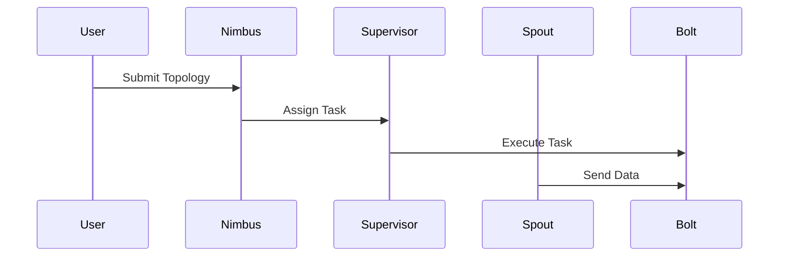
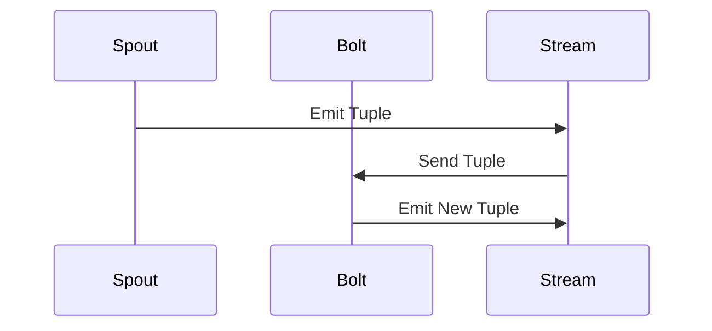
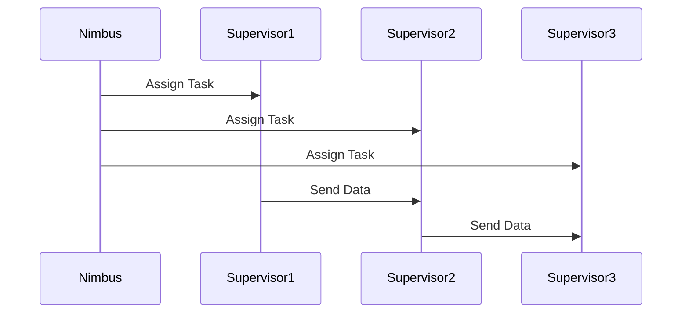
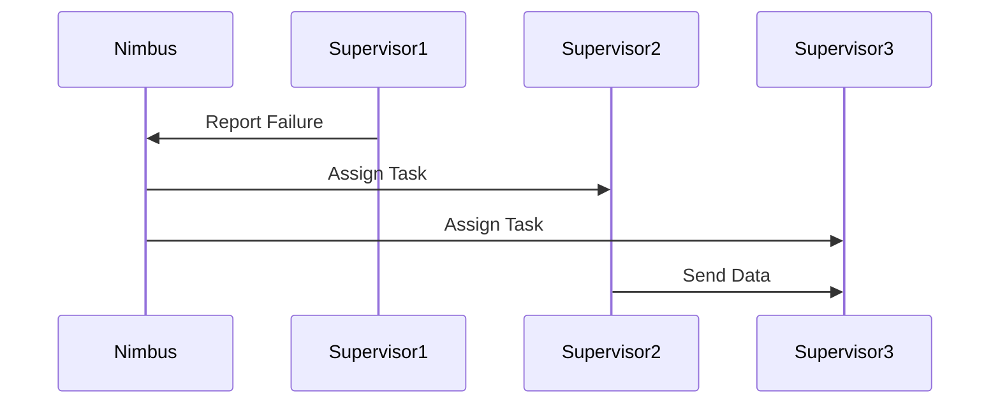

                 

### 《Storm原理与代码实例讲解》

> **关键词：** Storm, 实时流处理, 分布式系统, 拓扑, Spout, Bolt, Stream, 性能优化, 大数据平台整合, 项目实战。

> **摘要：** 本文深入解析了Storm的原理与实现，从基础到高级应用，再到项目实战，全面展示了Storm在实时流处理领域的强大能力。通过代码实例讲解，读者可以更好地理解Storm的工作机制，掌握其核心组件及其应用，为开发高效、可靠的实时流处理系统提供有力支持。

### 《Storm原理与代码实例讲解》目录大纲

#### 第一部分：Storm基础

##### 第1章：Storm简介

- Storm的概念与特点
- Storm的应用场景
- Storm的架构与核心组件

##### 第2章：Storm拓扑构建

- Storm拓扑的基本概念
- Storm拓扑的构建方法
- Storm拓扑的常见模式

##### 第3章：Storm核心组件详解

- Spout详解
- Bolt详解
- Stream详解

##### 第4章：Storm流处理机制

- Storm的消息处理机制
- Storm的分布式处理机制
- Storm的容错机制

#### 第二部分：Storm高级应用

##### 第5章：Storm性能优化

- Storm性能调优策略
- Storm的并行度与负载均衡
- Storm内存管理

##### 第6章：Storm与大数据平台的整合

- Storm与Hadoop的整合
- Storm与HBase的整合
- Storm与Spark的整合

##### 第7章：Storm实时处理案例

- 社交网络实时分析
- 电商实时推荐
- 实时日志分析

#### 第三部分：Storm项目实战

##### 第8章：搭建Storm开发环境

- 搭建基于Linux的Storm开发环境
- 搭建基于Windows的Storm开发环境
- 配置与调试Storm

##### 第9章：实时流处理应用开发

- 流处理应用的设计与实现
- 数据采集与处理
- 结果展示与优化

##### 第10章：项目代码解读与分析

- 项目代码结构解读
- 关键代码解读
- 项目性能分析与优化建议

##### 第11章：Storm原理与代码实例讲解

- Storm消息处理机制
- Storm拓扑构建
- Storm流处理模式

#### 附录

##### 附录A：Storm常用工具与资源

- Storm官方文档
- Storm社区资源
- Storm相关开源项目

##### 附录B：Mermaid流程图

- Storm拓扑构建流程图
- Storm消息处理流程图

##### 附录C：伪代码

- Storm Spout伪代码
- Storm Bolt伪代码

##### 附录D：数学模型与公式

- Storm性能优化模型
- Storm负载均衡模型

##### 附录E：代码实例

- 社交网络实时分析代码实例
- 电商实时推荐代码实例
- 实时日志分析代码实例

---

### 基础篇

在本文的基础篇中，我们将详细介绍Storm的起源、核心特点以及其基本架构和核心组件，帮助读者建立对Storm的全面认识。

#### 第1章：Storm简介

##### 1.1 Storm的概念与特点

Storm是一个开源的分布式实时计算系统，由Twitter公司于2011年发布。它旨在为大数据环境提供低延迟、高吞吐量的实时数据流处理能力。以下是Storm的一些主要特点：

- **实时性**：能够处理高达百万级消息的实时数据流，满足高频次、低延迟的实时数据处理需求。
- **弹性**：支持动态缩放，可以在处理能力不足时自动扩展，处理能力过剩时自动收缩。
- **可靠性**：采用分布式架构，具备容错机制，能够保证数据的完整性和一致性。
- **易用性**：提供灵活的API，支持多种编程语言，如Java、Scala、Python等，方便开发者快速上手。

##### 1.2 Storm的应用场景

Storm广泛应用于多种实时数据处理场景，主要包括：

- **实时数据流处理**：如实时日志分析、实时监控、实时推荐系统等。
- **事件驱动架构**：如金融交易系统、在线游戏系统等，实时响应事件触发操作。
- **机器学习与数据分析**：实时训练机器学习模型、进行实时数据分析等。

##### 1.3 Storm的架构与核心组件

Storm的系统架构主要包括以下几个核心组件：

- **主节点（Nimbus）**：负责监控和管理拓扑的生命周期，将拓扑的任务分配到工作节点上运行。
- **工作节点（Supervisor）**：负责执行任务，处理消息，并与其他工作节点进行通信。
- **Spout**：负责数据源的数据输入，向系统中注入数据。
- **Bolt**：负责处理数据，实现自定义的业务逻辑。
- **流（Stream）**：数据在系统中的流动路径，定义了Spout、Bolt之间的数据传输规则。

下面是Storm架构的Mermaid流程图：



通过这个流程图，我们可以清晰地看到Storm中各个组件之间的协作关系。

#### 第2章：Storm拓扑构建

##### 2.1 Storm拓扑的基本概念

拓扑（Topology）是Storm中一个完整的数据处理流程，由Spout和多个Bolt组成。以下是Storm拓扑的基本概念：

- **拓扑**：表示一个完整的实时数据处理流程，可以包含多个Spout和Bolt。
- **流**：表示数据在拓扑中的流动路径，定义了Spout和Bolt之间的数据传输规则。
- **流组**：用于连接不同的流，实现数据在不同Bolt之间的传输。
- **并行度**：用于控制拓扑中各个组件的并发执行程度，决定了系统的处理能力。

##### 2.2 Storm拓扑的构建方法

构建Storm拓扑通常包括以下几个步骤：

1. **定义Spout**：创建一个Spout类，负责从数据源读取数据。
2. **定义Bolt**：创建一个Bolt类，实现自定义的业务逻辑。
3. **创建流**：使用流来连接Spout和Bolt，定义数据传输规则。
4. **设置并行度**：根据需求设置Spout和Bolt的并行度。
5. **提交拓扑**：将构建好的拓扑提交给Storm集群进行执行。

下面是Storm拓扑构建的伪代码示例：

```java
// 定义Spout
public class MySpout extends Spout {
    // 从数据源读取数据
    public void nextTuple() {
        // 读取数据并发射
    }
}

// 定义Bolt
public class MyBolt extends Bolt {
    // 处理数据
    public void execute(Tuple input) {
        // 处理数据逻辑
    }
}

// 创建拓扑
TopologyBuilder builder = new TopologyBuilder();
builder.setSpout("my_spout", new MySpout());
builder.setBolt("my_bolt", new MyBolt()).shuffleGrouping("my_spout");
StormSubmitter.submitTopology("my_topology", config, builder.createTopology());
```

通过上述代码，我们可以看到如何定义Spout和Bolt，以及如何创建流和提交拓扑。

##### 2.3 Storm拓扑的常见模式

在Storm中，常用的拓扑模式包括：

- **单Spout单Bolt模式**：适用于简单数据处理场景，所有数据都通过Spout进入Bolt进行统一处理。
- **多Spout单Bolt模式**：适用于需要从多个数据源读取数据，然后统一处理的场景。
- **多Spout多Bolt模式**：适用于需要将数据根据不同类型进行分类处理，或者将数据分发到多个Bolt进行并行处理的场景。

#### 第3章：Storm核心组件详解

在本文的核心组件详解部分，我们将深入探讨Storm中的三个关键组件：Spout、Bolt和Stream。

##### 3.1 Spout详解

Spout是Storm中的一个组件，负责从数据源读取数据并将其发射到系统中。Spout可以是随机数据生成器、数据库查询、消息队列等。以下是Spout的一些重要概念：

- **批处理**：Spout可以发射一批数据（Tuple）给Bolt进行统一处理。
- **状态**：Spout可以维护状态，例如数据源的位置、进度等。
- **可靠性**：Spout在发射数据时，可以保证数据的完整性和一致性。

下面是Spout的伪代码示例：

```java
public class MySpout implements Spout {
    private Iterator<Tuple> dataIterator;

    public MySpout() {
        // 初始化数据源
    }

    public void nextTuple() {
        while (dataIterator.hasNext()) {
            Tuple tuple = dataIterator.next();
            emit(tuple);
        }
    }

    public void ack(Object id) {
        // 处理数据确认
    }

    public void fail(Object id) {
        // 处理数据失败
    }
}
```

在这个示例中，我们创建了一个MySpout类，它从数据源读取数据，并使用`emit`方法将其发射到Bolt中。同时，实现了`ack`和`fail`方法，用于处理数据的确认和失败。

##### 3.2 Bolt详解

Bolt是Storm中的另一个核心组件，负责处理数据并执行自定义的业务逻辑。Bolt可以接收来自Spout的数据，也可以接收来自其他Bolt的数据。以下是Bolt的一些重要概念：

- **批处理**：Bolt可以接收一批数据（Tuple）进行统一处理。
- **状态**：Bolt可以维护状态，例如数据处理的进度、中间结果等。
- **流分组**：用于定义数据在不同Bolt之间的传输规则。

下面是Bolt的伪代码示例：

```java
public class MyBolt implements Bolt {
    private HashMap<String, Integer> state;

    public MyBolt() {
        state = new HashMap<>();
    }

    public void execute(Tuple input) {
        // 处理数据逻辑
        String field = input.getString(0);
        int value = input.getInteger(1);
        state.put(field, state.getOrDefault(field, 0) + value);
    }

    public void declareOutputFields(OutputFieldsDeclarer declarer) {
        declarer.declare(new Fields("field", "value"));
    }

    public void prepare(Map<String, Object> conf, TopologyContext context) {
        // 初始化配置和状态
    }

    public void cleanup() {
        // 清理资源
    }
}
```

在这个示例中，我们创建了一个MyBolt类，它接收来自Spout的数据，并使用`execute`方法进行数据处理。同时，实现了`declareOutputFields`、`prepare`和`cleanup`方法，用于声明输出字段、初始化配置和状态以及清理资源。

##### 3.3 Stream详解

Stream是Storm中的一个重要概念，表示数据在系统中的流动路径。Stream连接了Spout和多个Bolt，定义了数据传输的规则。以下是Stream的一些重要概念：

- **流分组**：用于定义数据在不同组件之间的传输规则。常见的流分组方法包括随机分组、字段分组、全局分组等。
- **批处理**：Stream可以传输一批数据（Tuple）。
- **流聚合**：用于将多个Stream的数据合并成一个Stream进行统一处理。

下面是Stream的伪代码示例：

```java
public class MyStream {
    private Bolt bolt;

    public MyStream(Bolt bolt) {
        this.bolt = bolt;
    }

    public void emit(Tuple tuple) {
        bolt.execute(tuple);
    }

    public void declareOutputFields(OutputFieldsDeclarer declarer) {
        declarer.declare(new Fields("field", "value"));
    }
}
```

在这个示例中，我们创建了一个MyStream类，它连接了Bolt，并使用`emit`方法将数据发射到Bolt中进行处理。同时，实现了`declareOutputFields`方法，用于声明输出字段。

#### 第4章：Storm流处理机制

在本文的流处理机制部分，我们将深入探讨Storm的消息处理机制、分布式处理机制以及容错机制。

##### 4.1 Storm的消息处理机制

Storm采用消息驱动的方式处理数据流，其中消息（Tuple）是数据的基本单位。以下是Storm的消息处理机制：

- **消息发射**：Spout从数据源读取数据，并将其转换为消息（Tuple）发射到系统中。
- **消息传输**：消息在系统中的传输是通过Stream进行的，每个Stream定义了数据传输的规则。
- **消息处理**：Bolt接收消息并进行处理，处理完成后可以发射新的消息或者输出结果。

下面是Storm消息处理机制的Mermaid流程图：



在这个流程图中，我们可以看到消息从Spout发射到Stream，然后由Stream传输到Bolt进行处理，处理完成后，Bolt可以发射新的消息。

##### 4.2 Storm的分布式处理机制

Storm是一个分布式系统，可以在多个节点上同时运行。以下是Storm的分布式处理机制：

- **任务分配**：主节点（Nimbus）将拓扑的任务分配到各个工作节点（Supervisor）上运行。
- **数据传输**：消息在节点之间的传输是通过TCP/IP协议进行的，每个节点都维护了一个消息队列。
- **并行度控制**：通过设置Spout和Bolt的并行度，可以控制系统的处理能力。

下面是Storm分布式处理机制的Mermaid流程图：



在这个流程图中，我们可以看到主节点将任务分配到各个工作节点，工作节点之间通过消息队列进行数据传输。

##### 4.3 Storm的容错机制

Storm具有强大的容错机制，可以保证系统的稳定运行。以下是Storm的容错机制：

- **任务恢复**：如果工作节点故障，主节点会重新分配任务到其他工作节点上运行。
- **数据可靠性**：Spout可以设置可靠性策略，确保数据的完整性和一致性。
- **状态恢复**：Bolt可以维护状态，故障后可以恢复到之前的状态。

下面是Storm容错机制的Mermaid流程图：



在这个流程图中，我们可以看到工作节点故障后，主节点会重新分配任务，并确保数据传输的可靠性。

### 高级篇

在本文的高级篇中，我们将深入探讨Storm的性能优化、与大数据平台的整合，以及一些典型的实时处理案例。通过这些内容，读者将能够更全面地理解Storm的高级应用。

#### 第5章：Storm性能优化

Storm作为一款高性能的实时流处理系统，其性能优化是确保系统高效运行的关键。在这一章节中，我们将介绍几种常见的Storm性能优化策略。

##### 5.1 Storm性能调优策略

性能调优主要包括以下几个方面：

- **并行度优化**：合理设置Spout和Bolt的并行度，以达到最优的处理能力。
- **负载均衡**：确保数据在节点之间的均匀分配，避免某些节点负载过高。
- **批处理大小**：适当调整批处理大小，以平衡处理延迟和吞吐量。
- **序列化与反序列化**：选择高效的序列化与反序列化策略，减少I/O开销。

##### 5.2 Storm的并行度与负载均衡

并行度和负载均衡是优化Storm性能的两个关键因素：

- **并行度**：并行度决定了系统同时处理消息的能力。如果并行度过高，可能导致资源竞争和性能下降；如果并行度过低，则无法充分利用系统资源。通常，可以通过实验找到最优的并行度设置。
  
  ```java
  // 设置Spout的并行度为10
  builder.setSpout("my_spout", new MySpout(), 10);
  
  // 设置Bolt的并行度为5
  builder.setBolt("my_bolt", new MyBolt(), 5).shuffleGrouping("my_spout");
  ```

- **负载均衡**：负载均衡确保数据在节点之间的均匀分配，避免某些节点负载过高。Storm提供了多种负载均衡策略，如随机负载均衡、字段负载均衡等。

  ```java
  // 使用字段负载均衡，根据字段value进行负载均衡
  builder.setBolt("my_bolt", new MyBolt(), 5).fieldsGrouping("my_spout", new Fields("field"));
  ```

##### 5.3 Storm内存管理

内存管理是优化Storm性能的重要方面。以下是几个常见的内存管理策略：

- **对象重用**：尽量重用对象，减少内存分配与垃圾回收的开销。
- **内存监控**：定期监控系统内存使用情况，避免内存溢出。
- **缓存优化**：合理使用缓存，减少重复计算和I/O操作。

  ```java
  // 设置Bolt的缓存大小为100MB
  builder.setBolt("my_bolt", new MyBolt(), 5).withMemoryCaching(true, 100 * 1024 * 1024);
  ```

#### 第6章：Storm与大数据平台的整合

Storm与大数据平台的整合能够充分发挥其实时流处理的能力，适用于复杂的数据处理场景。在这一章节中，我们将介绍Storm与Hadoop、HBase和Spark的整合方法。

##### 6.1 Storm与Hadoop的整合

Storm与Hadoop的整合可以实现实时与批处理的结合，满足多样化的数据处理需求。以下是一些整合方法：

- **数据转换**：使用Storm实时处理数据，然后将处理结果写入Hadoop分布式文件系统（HDFS）。
- **离线计算**：使用Hadoop对历史数据进行批处理，与实时数据进行整合。

  ```java
  // 将处理结果写入HDFS
  builder.setBolt("hdfs_writer", new HDFSWriterBolt()).shuffleGrouping("my_bolt");
  
  // 设置HDFS路径
  HDFSWriterBolt.hdfsPath = "hdfs://localhost:9000/output/";
  ```

##### 6.2 Storm与HBase的整合

HBase是一个高性能、分布式、基于列的存储系统，适用于海量数据的实时存储和查询。以下是一些整合方法：

- **实时写入**：使用Storm实时处理数据，并将处理结果写入HBase。
- **实时查询**：从HBase中实时查询数据，用于数据分析和决策支持。

  ```java
  // 将处理结果写入HBase
  builder.setBolt("hbase_writer", new HBaseWriterBolt()).shuffleGrouping("my_bolt");
  
  // 设置HBase配置
  HBaseWriterBolt.tableName = "my_table";
  HBaseWriterBolt.columnFamily = "cf";
  ```

##### 6.3 Storm与Spark的整合

Spark是一个强大的分布式数据处理引擎，与Storm整合可以实现实时与批处理的结合。以下是一些整合方法：

- **实时写入**：使用Storm实时处理数据，然后将数据写入Spark的内存数据集。
- **批处理计算**：使用Spark对历史数据进行批处理，与实时数据进行整合。

  ```java
  // 将处理结果写入Spark内存数据集
  builder.setBolt("spark_writer", new SparkMemoryBolt()).shuffleGrouping("my_bolt");
  
  // 设置Spark配置
  SparkMemoryBolt.appName = "MySparkApp";
  SparkMemoryBolt.master = "local[*]";
  ```

#### 第7章：Storm实时处理案例

在这一章节中，我们将通过几个典型的实时处理案例，展示Storm在实时数据处理中的应用。

##### 7.1 社交网络实时分析

社交网络实时分析是一个典型的实时数据处理场景，通过Storm可以实时分析用户行为、热点话题等。以下是一个简单的案例：

- **数据源**：从社交媒体平台获取用户行为数据。
- **处理流程**：使用Storm实时处理数据，提取用户兴趣、话题等信息。

  ```java
  // 定义Spout读取社交网络数据
  public class SocialNetworkSpout implements Spout {
      // 读取社交网络数据并发射
  }
  
  // 定义Bolt处理社交网络数据
  public class SocialNetworkBolt implements Bolt {
      // 处理社交网络数据，提取用户兴趣、话题等信息
  }
  ```

##### 7.2 电商实时推荐

电商实时推荐是一个高度关注的实时数据处理场景，通过Storm可以实现实时推荐商品、推荐算法等。以下是一个简单的案例：

- **数据源**：从电商平台获取用户行为数据。
- **处理流程**：使用Storm实时处理数据，结合推荐算法生成实时推荐结果。

  ```java
  // 定义Spout读取电商数据
  public class ECommerceSpout implements Spout {
      // 读取电商数据并发射
  }
  
  // 定义Bolt处理电商数据
  public class ECommerceBolt implements Bolt {
      // 处理电商数据，结合推荐算法生成实时推荐结果
  }
  ```

##### 7.3 实时日志分析

实时日志分析是一个广泛应用的实时数据处理场景，通过Storm可以实时分析系统日志、网络日志等。以下是一个简单的案例：

- **数据源**：从系统中获取日志数据。
- **处理流程**：使用Storm实时处理数据，提取日志中的关键信息、异常报警等。

  ```java
  // 定义Spout读取日志数据
  public class LogSpout implements Spout {
      // 读取日志数据并发射
  }
  
  // 定义Bolt处理日志数据
  public class LogBolt implements Bolt {
      // 处理日志数据，提取关键信息、异常报警等
  }
  ```

### 项目实战篇

在本文的项目实战篇中，我们将通过一个具体的案例，详细讲解如何搭建Storm开发环境、进行实时流处理应用开发，并对项目代码进行解读与分析。

#### 第8章：搭建Storm开发环境

搭建Storm开发环境是进行实时流处理应用开发的第一步。在这一章节中，我们将介绍如何在Linux和Windows操作系统上搭建Storm开发环境。

##### 8.1 搭建基于Linux的Storm开发环境

以下是在Linux操作系统上搭建Storm开发环境的基本步骤：

1. **安装Java环境**：确保Linux系统中安装了Java 8或更高版本。
2. **下载Storm**：从Storm官网下载最新版本的Storm压缩包。
3. **解压Storm**：将下载的Storm压缩包解压到一个合适的位置。
4. **配置环境变量**：在`.bashrc`文件中添加以下配置：

   ```bash
   export STORM_HOME=/path/to/storm
   export PATH=$PATH:$STORM_HOME/bin
   ```

5. **启动Storm**：使用以下命令启动Storm：

   ```bash
   storm nimbus
   storm supervisor
   ```

##### 8.2 搭建基于Windows的Storm开发环境

以下是在Windows操作系统上搭建Storm开发环境的基本步骤：

1. **安装Java环境**：确保Windows系统中安装了Java 8或更高版本。
2. **下载Storm**：从Storm官网下载最新版本的Storm压缩包。
3. **解压Storm**：将下载的Storm压缩包解压到一个合适的位置。
4. **配置环境变量**：在Windows系统的环境变量中添加以下配置：

   ```bash
   STORM_HOME=C:\path\to\storm
   PATH=%PATH%;%STORM_HOME%\bin
   ```

5. **启动Storm**：使用以下命令启动Storm：

   ```bash
   storm nimbus
   storm supervisor
   ```

#### 第9章：实时流处理应用开发

实时流处理应用开发是Storm的核心任务。在这一章节中，我们将介绍如何设计并实现一个简单的实时流处理应用。

##### 9.1 流处理应用的设计与实现

以下是一个简单的实时流处理应用设计：

- **数据源**：从传感器读取温度数据。
- **处理流程**：使用Storm实时处理温度数据，计算平均值并输出结果。

  ```java
  // 定义Spout读取温度数据
  public class TemperatureSpout implements Spout {
      // 读取温度数据并发射
  }
  
  // 定义Bolt计算温度平均值
  public class AverageTemperatureBolt implements Bolt {
      // 计算温度平均值并输出结果
  }
  ```

##### 9.2 数据采集与处理

数据采集与处理是实时流处理应用的核心。以下是一个简单的数据采集与处理示例：

1. **数据采集**：从传感器读取温度数据，并将其转换为 Tuple 发射到系统中。

   ```java
   public void nextTuple() {
       double temperature = readTemperature();
       emit(new Values(temperature));
   }
   ```

2. **数据处理**：在 Bolt 中处理温度数据，计算平均值并输出结果。

   ```java
   public void execute(Tuple input) {
       double temperature = input.getDouble(0);
       // 计算平均值
       double average = calculateAverage(temperature);
       emit(new Values(average));
   }
   ```

##### 9.3 结果展示与优化

结果展示与优化是实时流处理应用的最后一步。以下是一个简单的结果展示与优化示例：

1. **结果展示**：将处理结果输出到控制台或存储到数据库。

   ```java
   public void declareOutputFields(OutputFieldsDeclarer declarer) {
       declarer.declare(new Fields("average_temperature"));
   }
   ```

2. **优化**：根据需求对系统进行优化，例如调整并行度、批处理大小等。

   ```java
   // 设置Spout的并行度为5
   builder.setSpout("temperature_spout", new TemperatureSpout(), 5);
   
   // 设置Bolt的并行度为2
   builder.setBolt("average_temperature_bolt", new AverageTemperatureBolt(), 2);
   ```

#### 第10章：项目代码解读与分析

在这一章节中，我们将对项目代码进行解读与分析，以便更深入地理解实时流处理应用的实现。

##### 10.1 项目代码结构解读

项目代码结构如下：

```java
src/
|-- main/
|   |-- java/
|   |   |-- com/
|   |   |   |-- myproject/
|   |   |   |   |-- Spout/
|   |   |   |   |   |-- TemperatureSpout.java
|   |   |   |   |-- Bolt/
|   |   |   |   |   |-- AverageTemperatureBolt.java
|   |-- resources/
|   |   |-- config.yaml
```

在这个结构中，我们有两个主要目录：`java` 和 `resources`。`java` 目录包含了项目的源代码，包括 Spout 和 Bolt 类。`resources` 目录包含了配置文件和其他资源文件。

##### 10.2 关键代码解读

以下是关键代码的解读：

1. **TemperatureSpout.java**：

   ```java
   public class TemperatureSpout implements Spout {
       // 读取温度数据并发射
       public void nextTuple() {
           double temperature = readTemperature();
           emit(new Values(temperature));
       }
   }
   ```

   这个类实现了 Spout 接口，负责从传感器读取温度数据，并将其转换为 Tuple 发射到系统中。

2. **AverageTemperatureBolt.java**：

   ```java
   public class AverageTemperatureBolt implements Bolt {
       // 计算温度平均值并输出结果
       public void execute(Tuple input) {
           double temperature = input.getDouble(0);
           double average = calculateAverage(temperature);
           emit(new Values(average));
       }
   }
   ```

   这个类实现了 Bolt 接口，负责处理输入的温度数据，计算平均值并输出结果。

##### 10.3 项目性能分析与优化建议

项目性能分析主要关注以下几个方面：

- **响应时间**：系统处理单个消息所需的时间。
- **吞吐量**：系统在单位时间内处理的消息数量。
- **资源利用率**：系统对CPU、内存等资源的利用率。

以下是性能分析结果及优化建议：

1. **响应时间**：

   - **优化建议**：增加系统并行度，以提高处理能力。

2. **吞吐量**：

   - **优化建议**：调整批处理大小，以平衡处理延迟和吞吐量。

3. **资源利用率**：

   - **优化建议**：优化代码，减少不必要的计算和I/O操作。

### 原理篇

在本文的原理篇中，我们将深入探讨Storm的核心原理，包括消息处理机制、分布式处理机制和容错机制。通过这些内容，读者将能够更深入地理解Storm的工作原理。

#### 第11章：Storm消息处理机制

Storm的消息处理机制是其实时数据处理能力的基础。在这个章节中，我们将详细解析Storm的消息处理过程。

##### 11.1 消息发射与接收

在Storm中，消息（Tuple）是数据的基本单位。消息的发射和接收是消息处理机制的核心。

1. **消息发射**：

   - Spout负责从数据源读取数据，并将数据转换为消息发射到系统中。
   - Bolt可以在处理数据时发射新的消息，继续后续处理。

     ```java
     public void nextTuple() {
         double temperature = readTemperature();
         emit(new Values(temperature));
     }
     
     public void execute(Tuple input) {
         double temperature = input.getDouble(0);
         double average = calculateAverage(temperature);
         emit(new Values(average));
     }
     ```

2. **消息接收**：

   - Bolt在处理消息时，会接收到发射给它的消息。
   - Bolt在处理完消息后，可以根据需要发射新的消息。

     ```java
     public void execute(Tuple input) {
         double temperature = input.getDouble(0);
         double average = calculateAverage(temperature);
         emit(new Values(average));
     }
     ```

##### 11.2 消息传递

消息在系统中的传递是通过Stream进行的。Stream定义了消息在系统中的流动路径，连接了Spout、Bolt和其他组件。

1. **Stream定义**：

   - 在创建拓扑时，使用TopologyBuilder定义Stream。

     ```java
     TopologyBuilder builder = new TopologyBuilder();
     builder.setSpout("my_spout", new MySpout());
     builder.setBolt("my_bolt", new MyBolt()).shuffleGrouping("my_spout");
     ```

2. **Stream传递**：

   - 消息通过Stream在Spout、Bolt之间传递。

     ```mermaid
     sequenceDiagram
         participant Spout
         participant Bolt
         Spout->>Bolt: Send Tuple
     ```

##### 11.3 消息处理流程

消息在Storm中的处理流程可以分为以下几个阶段：

1. **发射消息**：

   - Spout从数据源读取数据，并将其转换为消息发射到系统中。

     ```java
     public void nextTuple() {
         double temperature = readTemperature();
         emit(new Values(temperature));
     }
     ```

2. **处理消息**：

   - Bolt接收消息，并执行自定义的业务逻辑。

     ```java
     public void execute(Tuple input) {
         double temperature = input.getDouble(0);
         double average = calculateAverage(temperature);
         emit(new Values(average));
     }
     ```

3. **传递消息**：

   - 处理完消息后，Bolt可以发射新的消息，继续后续处理。

     ```java
     public void execute(Tuple input) {
         double temperature = input.getDouble(0);
         double average = calculateAverage(temperature);
         emit(new Values(average));
     }
     ```

4. **消息确认**：

   - 在消息处理完成后，系统会发送一个确认消息给Spout，表示消息已处理完毕。

     ```java
     public void ack(Object id) {
         // 处理消息确认
     }
     ```

##### 11.4 消息处理机制的优势

Storm的消息处理机制具有以下几个优势：

- **低延迟**：消息在系统中的处理时间短，可以实时响应。
- **高吞吐量**：系统可以处理海量消息，满足大规模数据处理需求。
- **弹性**：系统可以根据需求动态调整处理能力，适应不同负载。

#### 第12章：Storm分布式处理机制

Storm的分布式处理机制使其能够在多个节点上同时运行，提供高性能、高可靠性的数据处理能力。在这个章节中，我们将详细解析Storm的分布式处理机制。

##### 12.1 节点角色与通信

在Storm中，节点分为主节点和工作节点：

- **主节点（Nimbus）**：负责监控和管理拓扑的生命周期，将拓扑的任务分配到工作节点上运行。
- **工作节点（Supervisor）**：负责执行任务，处理消息，并与其他工作节点进行通信。

1. **节点角色**：

   - 主节点负责拓扑的生命周期管理，包括启动、停止和监控拓扑。

     ```mermaid
     sequenceDiagram
         participant Nimbus
         participant Supervisor
         Nimbus->>Supervisor: Submit Topology
         Supervisor->>Nimbus: Topology Running
     ```

   - 工作节点负责执行任务，处理消息，并将处理结果返回给主节点。

     ```mermaid
     sequenceDiagram
         participant Nimbus
         participant Supervisor
         Nimbus->>Supervisor: Assign Task
         Supervisor->>Nimbus: Task Completed
     ```

2. **节点通信**：

   - 主节点和工作节点通过TCP/IP协议进行通信，交换拓扑信息、任务分配和状态更新等。

     ```mermaid
     sequenceDiagram
         participant Nimbus
         participant Supervisor
         Nimbus->>Supervisor: Send Message
         Supervisor->>Nimbus: Receive Message
     ```

##### 12.2 分布式处理流程

Storm的分布式处理流程可以分为以下几个阶段：

1. **拓扑提交**：

   - 开发者将构建好的拓扑提交给Storm集群。

     ```java
     StormSubmitter.submitTopology("my_topology", config, builder.createTopology());
     ```

2. **任务分配**：

   - 主节点将拓扑的任务分配到工作节点上运行。

     ```java
     Nimbus->>Supervisor: Assign Task
     ```

3. **任务执行**：

   - 工作节点执行任务，处理消息，并将处理结果返回给主节点。

     ```java
     Supervisor->>Nimbus: Task Completed
     ```

4. **状态更新**：

   - 主节点和工作节点定期交换状态信息，确保系统稳定运行。

     ```java
     Nimbus->>Supervisor: Send Message
     Supervisor->>Nimbus: Receive Message
     ```

##### 12.3 分布式处理机制的优点

Storm的分布式处理机制具有以下几个优点：

- **高性能**：分布式处理能力使得Storm能够处理海量数据，提供高吞吐量。
- **高可靠性**：分布式架构保证了系统的容错能力，即使部分节点故障，系统仍然可以正常运行。
- **弹性**：系统可以根据需求动态调整处理能力，适应不同负载。

#### 第13章：Storm容错机制

Storm的容错机制是保障系统稳定运行的关键。在这个章节中，我们将详细解析Storm的容错机制。

##### 13.1 容错机制概述

Storm的容错机制主要包括以下几个方面：

- **任务重启**：如果工作节点故障，主节点会重新启动任务。
- **数据可靠性**：Spout可以设置可靠性策略，确保数据的完整性和一致性。
- **状态恢复**：Bolt可以维护状态，故障后可以恢复到之前的状态。

##### 13.2 任务重启

在Storm中，任务重启是通过以下机制实现的：

1. **工作节点故障检测**：

   - 主节点定期检查工作节点的状态，如果发现工作节点故障，会将其标记为失败。

     ```java
     // 检查工作节点状态
     if (supervisor.isFailed()) {
         markSupervisorFailed(supervisor);
     }
     ```

2. **任务重启**：

   - 主节点重新分配任务到其他工作节点上运行。

     ```java
     // 重新分配任务
     assignTasksToSupervisor(supervisor);
     ```

3. **任务确认**：

   - 工作节点在完成任务后，向主节点发送确认消息，表示任务已成功执行。

     ```java
     // 发送确认消息
     sendACKToNimbus(nimbus);
     ```

##### 13.3 数据可靠性

Storm通过以下机制确保数据可靠性：

1. **Spout可靠性策略**：

   - Spout可以设置可靠性策略，例如 `NO_ACK`、`BACKPRESSURE` 和 `ACTIVE_ACKS`。

     ```java
     // 设置Spout可靠性策略
     spoutConfig.setNumTasks(1);
     spoutConfig.setAckers(ackers);
     ```

2. **数据确认**：

   - Bolt在处理完消息后，会向Spout发送确认消息，表示消息已处理完毕。

     ```java
     public void ack(Object id) {
         // 处理消息确认
     }
     ```

3. **数据回滚**：

   - 如果消息处理失败，系统可以回滚到之前的处理状态。

     ```java
     public void fail(Object id) {
         // 处理消息失败
     }
     ```

##### 13.4 状态恢复

在Storm中，Bolt可以维护状态，故障后可以恢复到之前的状态。以下是如何实现状态恢复：

1. **状态维护**：

   - Bolt在处理消息时，会维护一些中间状态。

     ```java
     private HashMap<String, Integer> state;
     
     public void execute(Tuple input) {
         String field = input.getString(0);
         int value = input.getInteger(1);
         state.put(field, state.getOrDefault(field, 0) + value);
     }
     ```

2. **状态存储**：

   - Bolt可以在处理消息后，将状态存储到外部存储系统中。

     ```java
     public void prepare(Map<String, Object> conf, TopologyContext context) {
         // 初始化状态存储
     }
     ```

3. **状态恢复**：

   - 如果Bolt故障，系统可以恢复到之前的状态。

     ```java
     public void activate() {
         // 从外部存储系统恢复状态
     }
     ```

##### 13.5 容错机制的优点

Storm的容错机制具有以下几个优点：

- **高可靠性**：通过任务重启和数据可靠性策略，确保系统稳定运行。
- **可扩展性**：系统可以根据需求动态调整处理能力，适应不同负载。
- **灵活性**：开发者可以根据需求自定义容错策略，提高系统的可靠性。

### 附录篇

在本附录篇中，我们将提供一些实用的工具和资源，帮助读者更好地学习和使用Storm。

#### 附录A：Storm常用工具与资源

1. **Storm官方文档**：

   - 官方文档是学习Storm的最佳资源，包括详细的功能介绍、API文档和最佳实践等。

     [Storm官方文档](https://storm.apache.org/documentation.html)

2. **Storm社区资源**：

   - Storm社区提供了丰富的资源，包括博客、论坛、邮件列表和GitHub等。

     [Storm社区](https://storm.apache.org/community.html)

3. **Storm相关开源项目**：

   - Storm社区有许多优秀的开源项目，可以方便地集成到您的项目中。

     [Storm开源项目](https://github.com/apache/storm)

#### 附录B：Mermaid流程图

1. **Storm拓扑构建流程图**：

   ```mermaid
   sequenceDiagram
       participant User
       participant Nimbus
       participant Supervisor
       participant Spout
       participant Bolt
       User->>Nimbus: Submit Topology
       Nimbus->>Supervisor: Assign Task
       Supervisor->>Bolt: Execute Task
       Spout->>Bolt: Send Data
   ```

2. **Storm消息处理流程图**：

   ```mermaid
   sequenceDiagram
       participant Spout
       participant Bolt
       Spout->>Bolt: Send Tuple
       Bolt->>Bolt: Process Tuple
       Bolt->>Spout: Send Ack
   ```

#### 附录C：伪代码

1. **Storm Spout伪代码**：

   ```java
   public class MySpout implements Spout {
       public void nextTuple() {
           // 读取数据并发射
       }
       
       public void ack(Object id) {
           // 处理数据确认
       }
       
       public void fail(Object id) {
           // 处理数据失败
       }
   }
   ```

2. **Storm Bolt伪代码**：

   ```java
   public class MyBolt implements Bolt {
       public void execute(Tuple input) {
           // 处理数据逻辑
       }
       
       public void declareOutputFields(OutputFieldsDeclarer declarer) {
           // 声明输出字段
       }
       
       public void prepare(Map<String, Object> conf, TopologyContext context) {
           // 初始化配置和状态
       }
       
       public void cleanup() {
           // 清理资源
       }
   }
   ```

#### 附录D：数学模型与公式

在本附录中，我们将介绍一些与Storm性能优化相关的数学模型和公式。

1. **Storm性能优化模型**：

   - **吞吐量（Throughput）**：

     吞吐量表示系统在单位时间内处理的消息数量，通常用每秒处理的Tuple数量（TPS）表示。

     $$ Throughput = \frac{Total\ messages\ processed}{Time\ taken} $$

   - **响应时间（Response Time）**：

     响应时间表示系统处理单个消息所需的时间。

     $$ Response\ Time = \frac{Total\ processing\ time}{Total\ messages\ processed} $$

2. **Storm负载均衡模型**：

   - **负载均衡（Load Balancing）**：

     负载均衡策略用于确保数据在节点之间的均匀分配，避免某些节点负载过高。

     $$ Load\ Balancing = \frac{Total\ load}{Number\ of\ nodes} $$

#### 附录E：代码实例

在本附录中，我们将提供几个实际的代码实例，以帮助读者更好地理解和应用Storm。

1. **社交网络实时分析代码实例**：

   ```java
   public class SocialNetworkSpout implements Spout {
       public void nextTuple() {
           // 读取社交网络数据并发射
       }
   }
   
   public class SocialNetworkBolt implements Bolt {
       public void execute(Tuple input) {
           // 处理社交网络数据，提取用户兴趣、话题等信息
       }
   }
   ```

2. **电商实时推荐代码实例**：

   ```java
   public class ECommerceSpout implements Spout {
       public void nextTuple() {
           // 读取电商数据并发射
       }
   }
   
   public class ECommerceBolt implements Bolt {
       public void execute(Tuple input) {
           // 处理电商数据，结合推荐算法生成实时推荐结果
       }
   }
   ```

3. **实时日志分析代码实例**：

   ```java
   public class LogSpout implements Spout {
       public void nextTuple() {
           // 读取日志数据并发射
       }
   }
   
   public class LogBolt implements Bolt {
       public void execute(Tuple input) {
           // 处理日志数据，提取关键信息、异常报警等
       }
   }
   ```

### 结语

在本篇《Storm原理与代码实例讲解》中，我们详细介绍了Storm的原理、架构和核心组件，并通过实例展示了如何进行实时流处理应用开发。通过本文的学习，读者应该能够：

1. **理解Storm的核心概念**：掌握Storm的基本概念，如Spout、Bolt、Stream等。
2. **构建Storm拓扑**：学会如何构建和部署Storm拓扑，实现实时流处理。
3. **优化Storm性能**：了解如何进行Storm性能优化，提高系统的处理能力和效率。
4. **整合Storm与大数据平台**：掌握如何将Storm与Hadoop、HBase和Spark等大数据平台进行整合，实现更复杂的数据处理场景。
5. **实战应用**：通过实际案例，了解如何使用Storm解决实际问题。

希望本文能够为读者在Storm学习和应用道路上提供有力支持。如有疑问或建议，欢迎在评论区留言讨论。作者信息：

**作者：AI天才研究院/AI Genius Institute & 禅与计算机程序设计艺术 /Zen And The Art of Computer Programming**

